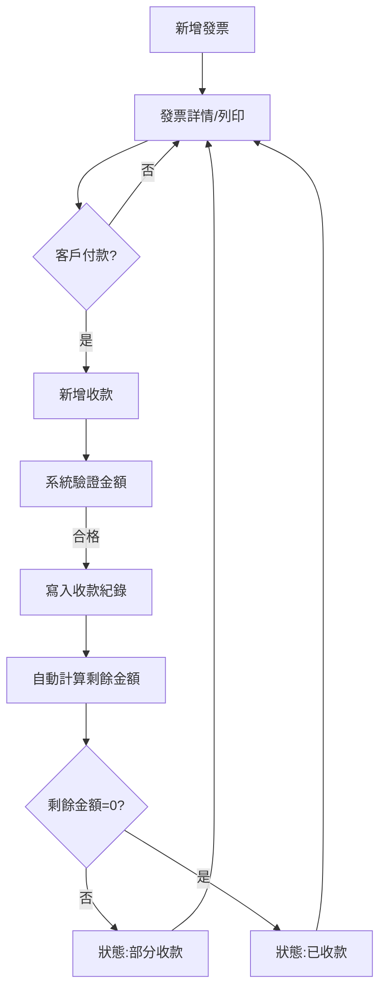

# 發票開立與收款流程 – C# 程式規格書

---

## 1. 流程簡介與目標

本流程涵蓋從新增發票、列印發票、客戶付款到收款登錄的完整作業，並描述系統自動處理（如發票狀態變更、通知觸發）的順序。目標如下：
- 確保發票與收款流程自動化、資料正確、狀態即時更新
- 提供清楚的UI操作與流程指引，減少人為錯誤
- 支援流程中自動通知與狀態流轉

---

## 2. UI設計

### 2.1 主要畫面
- 發票新增/編輯頁：輸入客戶、品項、金額，送出後產生發票
- 發票詳情頁：顯示發票資訊、列印按鈕、收款紀錄、狀態
- 收款登錄對話框：輸入收款金額、日期、方式
- 狀態/通知提示：如發票狀態變更、收款成功、超收警告等

### 2.2 互動流程
1. 使用者於發票列表點擊「新增發票」
2. 輸入資料送出，系統產生發票號碼，狀態為「未收款」
3. 可於詳情頁點擊「列印發票」產生PDF
4. 客戶付款後，於詳情頁點擊「新增收款」
5. 輸入金額、日期、方式，送出後系統驗證並寫入收款紀錄
6. 系統自動計算剩餘金額，狀態自動流轉（部分收款/已收款）
7. 狀態變更時，系統於UI顯示通知

### 2.3 React元件架構建議
- `<InvoiceListPage>`
- `<InvoiceFormModal>`
- `<InvoiceDetailPage>`
- `<PaymentFormModal>`
- `<StatusBadge>`
- `<Notification>`

### 2.4 流程圖

---

## 3. MS SQL 資料庫設計

### 3.1 主要表結構
- Invoice（發票主檔）
- InvoiceItem（發票明細）
- Payment（收款主檔）

（欄位設計詳見前述各模組規格書）

### 3.2 索引建議
- Invoice.InvoiceNo 唯一索引
- Payment.InvoiceID 建立索引

---

## 4. C# 後端API設計

### 4.1 Controller
- InvoiceController
  - POST /api/invoices
  - GET /api/invoices/{id}
  - PUT /api/invoices/{id}
  - POST /api/invoices/{id}/print
- PaymentController
  - POST /api/payments
  - GET /api/payments?invoiceId={id}

### 4.2 Service/Business Logic
- InvoiceService：
  - 新增/查詢/編輯發票、列印PDF
  - 狀態流轉（未收款→部分收款→已收款）
- PaymentService：
  - 新增收款、驗證金額、更新發票狀態
- NotificationService：
  - 狀態變更時推播通知（如顯示於UI）

### 4.3 Model/DTO
- InvoiceDto、InvoiceItemDto、PaymentDto
- 驗證屬性（DataAnnotations）用於欄位驗證

### 4.4 驗證與授權
- API需驗證JWT Token或Session
- 依角色授權（Admin/Manager/User）

---

## 5. 狀態流轉與通知
- 發票狀態自動流轉：
  - 新增時為「未收款」
  - 收款後若未全額，為「部分收款」
  - 收款全額後自動為「已收款」
- 狀態變更時，系統於UI顯示通知（如Toast、訊息列）
- 超收、重複收款等異常，API回傳錯誤並於UI顯示

---

## 6. 權限規則
- 系統管理員：可執行所有流程
- 財務經理：可新增/編輯/收款/列印
- 財務專員：可新增/收款/列印
- 稽核查詢：僅可查詢
- API端點以[Authorize(Roles="..."))]屬性控管

---

## 7. 測試案例

### 案例1：完整流程
- 前置：有客戶資料，使用者已登入
- 步驟：新增發票→列印→新增部分收款→再收款至全額
- 預期：狀態正確流轉，通知顯示，資料正確

### 案例2：超收驗證
- 前置：剩餘金額0
- 步驟：嘗試新增收款
- 預期：API回傳錯誤，UI顯示警告

### 案例3：權限驗證
- 前置：不同角色帳號
- 步驟：以稽核查詢角色呼叫POST /api/invoices
- 預期：回傳403 Forbidden

---

> 本文件依據《RPG規格轉換概述.md》內容編寫，供開發與驗收參考。 