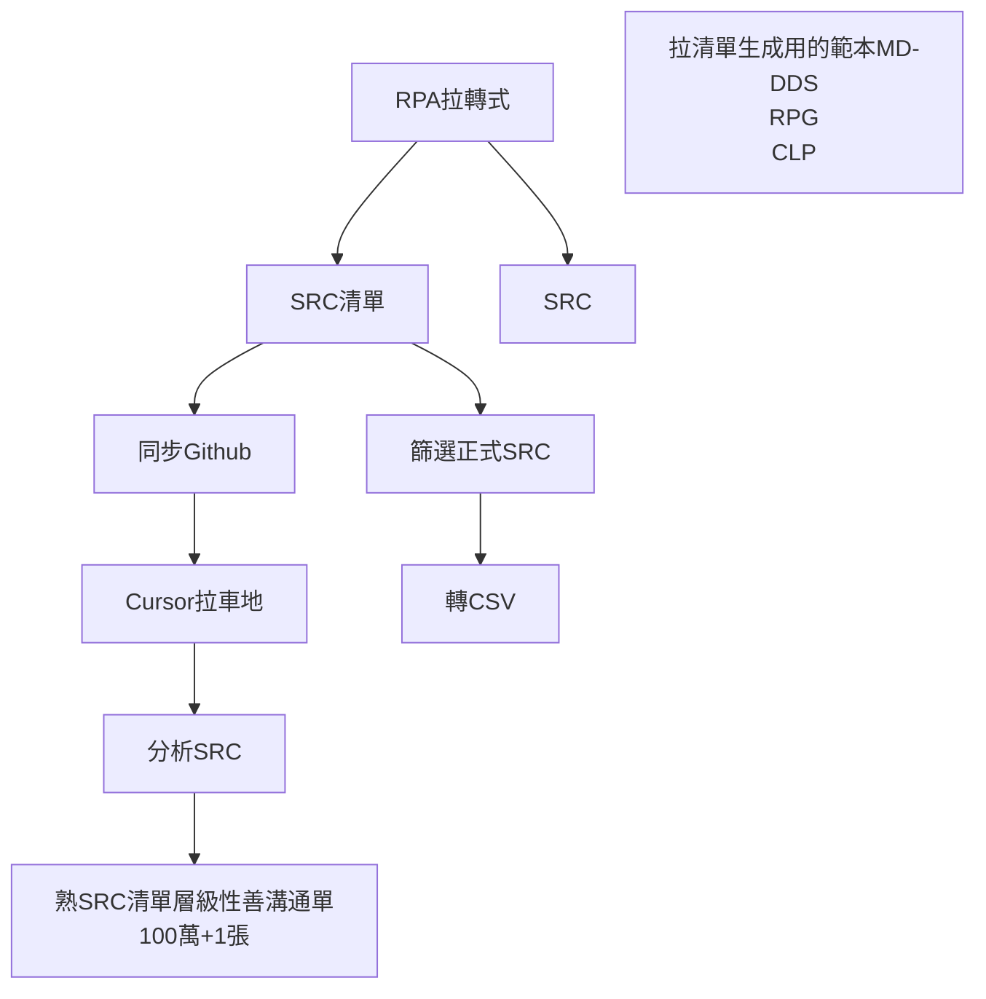

# RPA流程圖

```mermaid
graph TD
    A[RPA拉轉式] --> B[SRC清單]
    A --> C[SRC]
    B --> D[篩選正式SRC]
    B --> E[同步Github]
    E --> F[Cursor拉車地]
    F --> G[分析SRC]
    G --> H[熟SRC清單層級性善溝通單<br>100萬+1張]
    D --> I[轉CSV]
    
    %% 底部註記
    J[拉清單生成用的範本MD-<br>DDS<br>RPG<br>CLP]
``` 