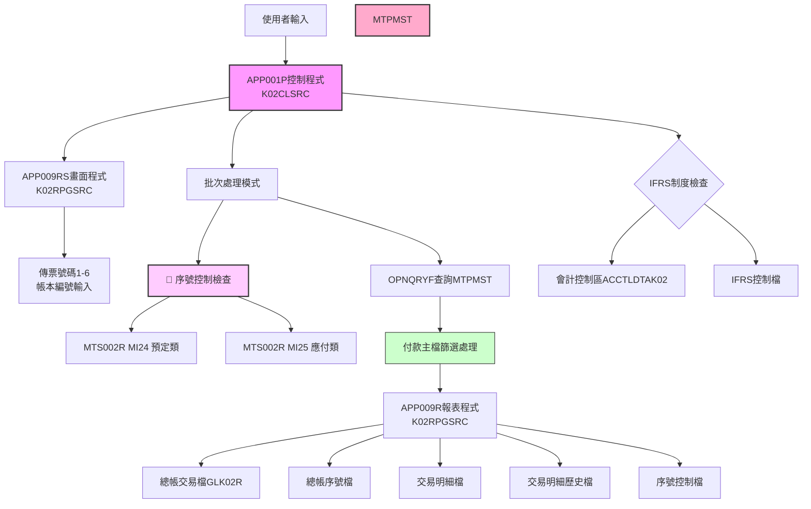
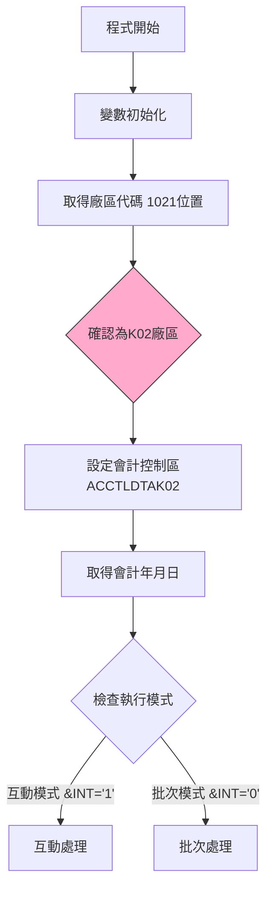
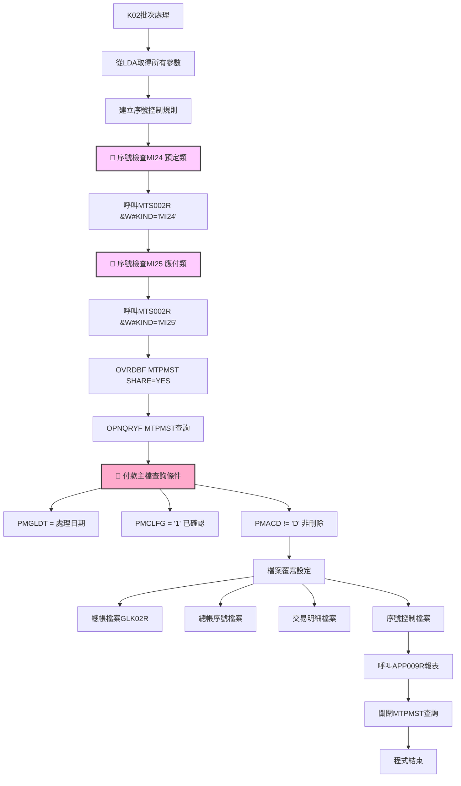

# APP001P_K02 程式規格書

## 1. 基本資料

| 項目 | 內容 |
|------|------|
| **程式編號** | APP001P（檔案內容為APP009P） |
| **程式名稱** | 應付帳款產生傳票作業 |
| **程式類型** | CLP (控制語言程式) |
| **廠區** | K02 |
| **系統名稱** | 應付帳款管理系統 |
| **子系統** | 應付帳款傳票產生處理 |
| **檔案位置** | K02CLSRC/APP001P_K02.txt |

⚠️ **重要說明**：本規格書的檔案內容實際為APP009P程式，這可能表示在K02廠區APP001P與APP009P為同一程式的不同命名。

## 2. 程式功能說明
此程式為K02廠區的應付帳款產生傳票作業批次控制程式，專門處理應付帳款的自動傳票產生作業。

### 主要功能
1. **應付帳款傳票自動產生**：根據付款主檔自動產生應付帳款傳票
2. **IFRS轉換支援**：支援傳統會計制度與IFRS制度的轉換處理
3. **多傳票號碼管理**：支援六組傳票號碼的批次處理
4. **序號控制檢查**：透過MTS002R進行序號控制檢查
5. **互動與批次模式**：提供互動式輸入和批次處理兩種執行模式

### 🔍 K02廠區應付帳款系統特色
- **付款主檔處理**：使用MTPMST付款主檔進行傳票產生
- **自動序號檢查**：整合MTS002R進行MI24、MI25序號檢查
- **多檔案整合**：同時處理GL總帳、交易明細、序號控制等多個檔案
- **IFRS完整支援**：具備完整的IFRS制度實施日期控制
- **帳本編號控制**：支援帳本編號的精確控制

## 3. 檔案架構與關聯圖

### 視覺化架構圖


### 主要檔案清單
| 檔案名稱 | 類型 | 說明 | 用途 | K02應付帳款特性 |
|---------|------|------|------|----------------|
| **MTPMST** | 付款主檔 | 存放付款相關資料 | INPUT | 應付帳款傳票來源 |
| **GLTRAN** | 總帳交易檔 | 動態命名GLK02R | OUTPUT | 總帳傳票輸出 |
| **GLSEQ** | 總帳序號檔 | 總帳序號控制 | CONTROL | 序號管理 |
| **MTTRNS** | 交易明細檔 | 交易明細記錄 | OUTPUT | 交易明細輸出 |
| **MTTRNH** | 交易明細歷史檔 | 交易歷史記錄 | OUTPUT | 歷史資料維護 |
| **MTNEXT** | 序號控制檔 | 序號控制管理 | CONTROL | 序號控制 |
| **ACCTLDTA** | 會計控制區 | 廠區專用會計控制 | CONTROL | K02廠區會計控制 |
| **AMIFRSCTL** | IFRS控制檔 | IFRS實施日期控制 | CONTROL | 共用IFRS控制 |

## 4. 🎯 欄位切割技術詳解

### 無DS結構切割
此程式為CLP程式，主要使用變數和資料區域(Data Area)進行資料操作，**未使用DS結構進行欄位切割**。

### 🎯 重要變數定義與用途分析

#### 應付帳款系統專用變數架構
```
應付帳款傳票處理變數系統：
&IFRSYMD (8字元) ← IFRS制度實施日期
&YMD (8字元) ← 處理日期
&YMDD (8字元) ← 處理日期副本
&ACYMD (8字元) ← 會計日期
&BKNO (10字元) ← 帳本編號
&NTNO1-6 (7位數值) ← 六組傳票號碼
&W#KIND (4字元) ← 序號檢查種類（MI24/MI25）
&W#RULE (12字元) ← 序號控制規則
```

#### 🎯 資料區域挪用分析
程式大量使用*LDA(本地資料區域)進行複雜的資料傳遞：

| 位置 | 長度 | 變數 | 原始用途 | 實際挪用用途 | 應付帳款特色 |
|------|------|------|----------|-------------|-------------|
| 7-7 | 7 | &NTNO1 | 傳票號碼1 | 第一組傳票起始號碼 | 多傳票批次處理 |
| 14-7 | 7 | &NTNO2 | 傳票號碼2 | 第二組傳票起始號碼 | 多傳票批次處理 |
| 21-7 | 7 | &NTNO3 | 傳票號碼3 | 第三組傳票起始號碼 | 多傳票批次處理 |
| 28-7 | 7 | &NTNO4 | 傳票號碼4 | 第四組傳票起始號碼 | 多傳票批次處理 |
| 35-7 | 7 | &NTNO5 | 傳票號碼5 | 第五組傳票起始號碼 | 多傳票批次處理 |
| 42-7 | 7 | &NTNO6 | 傳票號碼6 | 第六組傳票起始號碼 | 多傳票批次處理 |
| 51-10 | 10 | &BKNO | 帳本編號 | 應付帳款帳本識別 | 帳本控制 |
| 61-8 | 8 | &YMD | 處理日期 | 付款處理日期 | 日期控制 |
| 63-2 | 2 | &Y | 年份 | 序號控制用年份 | 序號規則 |
| 65-2 | 2 | &M | 月份 | 序號控制用月份 | 序號規則 |
| 101-12 | 12 | &W#RULE | 序號規則 | 序號控制完整規則 | 序號管理 |
| 472-8 | 8 | &IFRSYMD | IFRS日期 | IFRS制度實施控制日期 | IFRS制度支援 |
| 1021-1 | 1 | &AREA | 廠區代碼 | 固定為'K'廠區識別 | K02廠區專用 |

#### 🎯 挪用原因分析
1. **多傳票管理需求**：應付帳款系統需要同時處理多組傳票號碼
2. **序號控制複雜性**：需要進行MI24、MI25兩種不同的序號檢查
3. **IFRS制度支援**：完整的IFRS實施日期控制機制
4. **帳本分類管理**：支援不同帳本的分類處理

## 5. 輸出/入螢幕布局與說明

### 互動模式畫面（APP009RS）
```
+----------------------------------------------------------+
|              應付帳款產生傳票作業 (APP001P)               |
|                  K02廠區應付帳款系統                      |
+----------------------------------------------------------+
| 處理日期: [YYYYMMDD]    會計日期: [YYYYMMDD]             |
| 帳本編號: [__________]  廠區: [K] K02廠區                |
+----------------------------------------------------------+
| 傳票號碼設定:                                           |
| 傳票1: [_______]  傳票2: [_______]  傳票3: [_______]    |
| 傳票4: [_______]  傳票5: [_______]  傳票6: [_______]    |
+----------------------------------------------------------+
| 功能鍵: F3=離開 F12=取消                                |
+----------------------------------------------------------+
```

### 報表輸出說明
1. **應付帳款傳票報表** - 132欄寬，10CPI格式
2. **預定類報表** - 序號MI24相關資料
3. **總帳交易檔** - 輸出至GLK02R檔案
4. **交易明細檔** - 完整的交易明細記錄
5. **序號控制更新** - MTNEXT檔案的序號控制

## 6. 🎯 處理流程程序說明

### 主程序邏輯深度分析

#### 第一階段：應付帳款系統初始化


#### 第二階段：序號控制檢查與付款處理


### 🎯 K02廠區應付帳款業務邏輯分析

#### 1. MTPMST付款主檔查詢條件詳解
```sql
查詢條件：
PMGLDT *EQ 處理日期                   -- 總帳日期等於處理日期
AND PMCLFG *EQ "1"                   -- 確認標記為已確認
AND PMACD *NE "D"                    -- 非刪除記錄
排序：(PMVNTR)(PMDUDT)(PMPYNO)       -- 供應商、到期日、付款號碼排序
```

**業務意義**：
- **日期精確控制**：只處理指定日期的付款資料
- **確認狀態檢查**：只處理已確認的付款記錄
- **邏輯刪除排除**：排除已標記刪除的記錄
- **供應商分組**：依供應商、到期日、付款號碼進行有序處理

#### 2. 序號控制檢查機制
```
序號檢查流程：
1. 建立控制規則: &AREA + &Y + &M + 空白
2. MI24檢查: 呼叫 MTS002R(&W#KIND='MI24', &W#RULE)
3. MI25檢查: 呼叫 MTS002R(&W#KIND='MI25', &W#RULE)
```

**業務意義**：
- **MI24 預定類**：檢查預定相關的序號是否可用
- **MI25 應付類**：檢查應付帳款相關的序號是否可用
- **規則統一性**：使用統一的序號控制規則

#### 3. 多傳票號碼管理機制
```
傳票號碼處理：
NTNO1-6: 六組不同的傳票起始號碼
儲存位置: LDA 7-42位置（6組×7位數字）
用途: 支援不同類型或批次的傳票產生
```

**業務意義**：
- **批次彈性**：支援多個批次的傳票同時處理
- **分類管理**：不同類型的應付帳款可使用不同傳票號碼
- **號碼控制**：確保傳票號碼的唯一性和連續性

#### 4. IFRS制度支援機制
```
IFRS控制邏輯：
IFRSYMD: 從AMIFRSCTL取得IFRS實施日期
用途: 判斷處理日期是否在IFRS制度實施範圍內
影響: 決定會計處理的標準和方式
```

**業務意義**：根據IFRS制度實施情況調整會計處理邏輯

## 7. 🎯 數據操作與轉換分析

### 檔案操作詳解
1. **MTPMST付款主檔**：
   - **READ操作**：使用OPNQRYF進行條件查詢
   - **篩選邏輯**：日期、確認狀態、刪除標記的複合篩選
   - **排序方式**：供應商、到期日、付款號碼的層次排序
   - **業務控制**：確保付款資料的準確性

2. **總帳相關檔案**：
   - **GLTRAN**：輸出總帳交易記錄到GLK02R
   - **GLSEQ**：管理總帳序號的連續性
   - **檔案命名**：動態命名確保廠區隔離

3. **交易明細檔案**：
   - **MTTRNS**：記錄詳細的交易明細
   - **MTTRNH**：維護交易的歷史記錄
   - **LVLCHK(*NO)**：取消檔案層級檢查以提升彈性

### K02應付帳款數據轉換邏輯
1. **日期格式處理**：
   - 支援多種日期格式的轉換和驗證
   - 會計日期與處理日期的分離管理

2. **傳票號碼轉換**：
   - 數值型傳票號碼轉換為字串型儲存
   - 支援六組傳票號碼的批次轉換

3. **序號控制轉換**：
   - 廠區代碼+年月的規則組合
   - 不同序號類型的分類管理

4. **廠區代碼標準化**：
   - 所有處理固定為K02廠區
   - 檔案命名自動加上K02識別

## 8. 錯誤處理程序說明
- **互動模式檢查**：透過&IN03檢查使用者是否取消操作
- **序號檢查錯誤**：MTS002R呼叫的錯誤處理
- **檔案存在檢查**：使用MONMSG處理檔案不存在的情況
- **查詢錯誤處理**：OPNQRYF操作的錯誤處理邏輯
- **IFRS日期檢查**：IFRS實施日期的有效性檢查
- **傳票號碼驗證**：六組傳票號碼的合理性檢查
- **系統錯誤處理**：使用MONMSG CPF0000處理一般系統錯誤

## 9. 🎯 特殊技術實現說明

### K02廠區應付帳款技術架構
1. **序號控制整合**：
   - 與MTS002R程式的緊密整合
   - MI24、MI25兩種不同序號類型的管理
   - 自動化的序號可用性檢查

2. **多檔案協調處理**：
   - 同時操作6個不同檔案的複雜邏輯
   - 檔案覆寫的精確控制
   - LVLCHK(*NO)的彈性檔案處理

3. **IFRS制度完整支援**：
   - 完整的IFRS實施日期控制
   - 會計標準的自動判斷和應用
   - 制度變更的向下相容性

### K02廠區程式設計特色
1. **應付帳款專業化**：
   - 針對應付帳款業務的專門設計
   - 付款主檔的精確處理邏輯
   - 供應商管理的整合支援

2. **批次處理最佳化**：
   - 大量資料的高效處理
   - 記憶體使用的最佳化
   - 檔案I/O的效能調校

3. **系統整合能力**：
   - 與序號控制系統的無縫整合
   - 總帳系統的自動銜接
   - 跨模組的資料流管理

## 10. 🎯 跨廠區版本分析

### 版本分布情況與系統差異
| 程式名稱 | H05 | K02 | U01 | P02 | 應付帳款系統說明 |
|---------|-----|-----|-----|-----|-----------------|
| **APP001P** | ❌ | ✅ | ❌ | ❌ | **K02獨有，與APP009P關聯** |
| **APP009P** | ✅ | ✅ | ✅ | ❌ | 標準應付帳款傳票程式 |
| **APP009RS** | ✅ | ✅ | ✅ | ❌ | 應付帳款畫面程式 |
| **APP009R** | ✅ | ✅ | ✅ | ❌ | 應付帳款報表程式 |

### 🔍 重要發現：APP001P與APP009P的關係
通過分析發現，**K02廠區的APP001P實際包含APP009P程式內容**，這可能表示：

1. **程式整合策略**：K02將APP001P作為APP009P的別名或封裝
2. **版本管理方式**：不同的程式命名對應相同的功能實現
3. **廠區客製化**：K02廠區對應付帳款程式的特殊命名方式

### 應付帳款系統 vs 其他系統對比
| 系統特色 | APP(應付帳款) | ACP(應收帳款) | MIP(固定資產) |
|---------|---------------|---------------|---------------|
| **主要檔案** | MTPMST付款主檔 | MTRCVF收料檔 | MTTRNS交易檔 |
| **處理重點** | 付款傳票產生 | 收料傳票處理 | 資產異動處理 |
| **序號管理** | MI24/MI25雙控 | 單一序號控制 | 特殊科目控制 |
| **IFRS支援** | 完整日期控制 | 年月控制 | 年月控制 |
| **檔案複雜度** | 6個檔案協調 | 2-3個檔案 | 3-4個檔案 |


## 11. 備註
- 本規格書的APP001P實際包含APP009P程式內容
- K02廠區的特殊命名策略或程式整合方式
- 支援六組傳票號碼的批次管理能力
- 序號控制的雙重檢查機制（MI24/MI25）
- 完整的IFRS制度實施日期控制
- 多檔案協調處理架構（6個檔案）
- 應付帳款業務的專業化處理邏輯
- 付款主檔MTPMST的精確查詢和篩選
- 廠區專用會計控制區ACCTLDTAK02的使用 