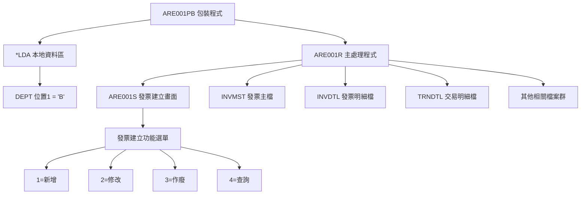
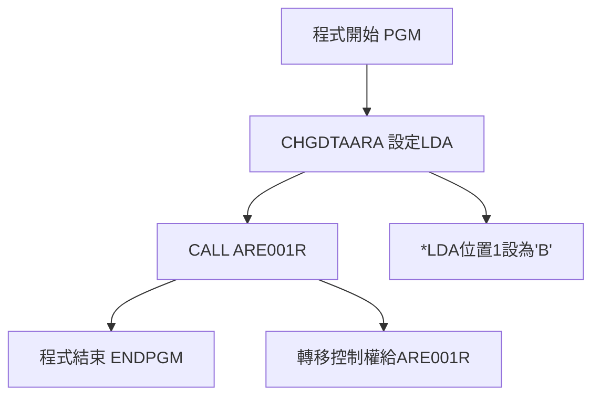
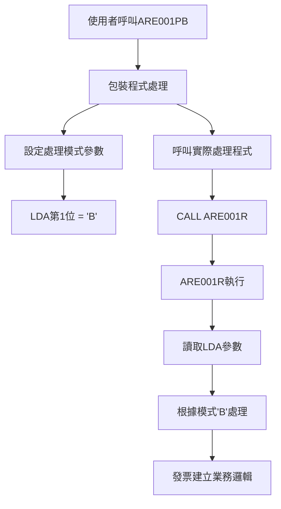
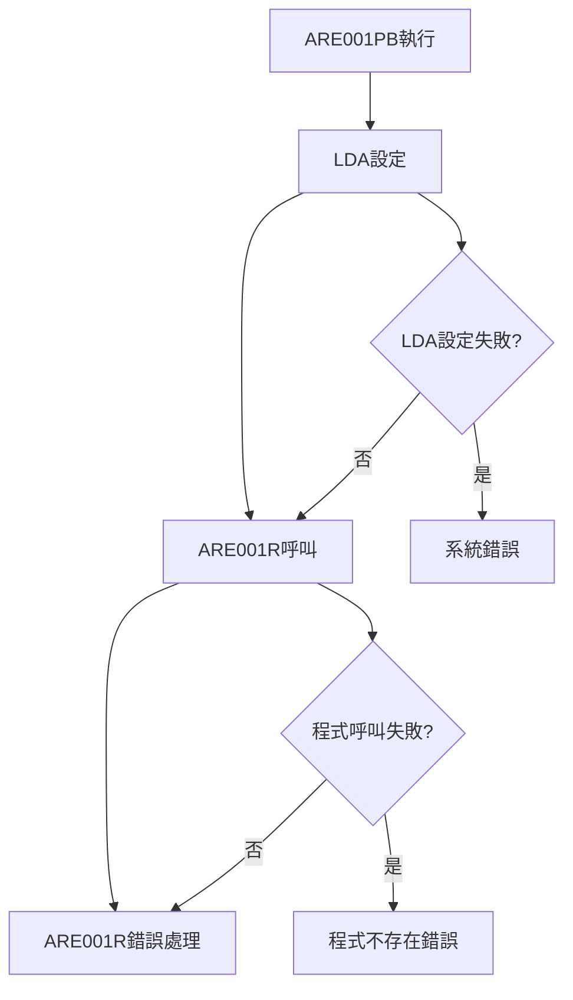

# ARE001PB_P02 程式規格書

## 1. 基本資料

| 項目 | 內容 |
|------|------|
| 程式編號 | ARE001PB |
| 程式名稱 | 發票建立作業系統（模式B包裝程式）|
| 程式類型 | CLP (Control Language Program) |
| 廠區 | P02 |
| 程式用途 | 發票建立作業包裝程式 |
| 呼叫方式 | 線上互動式作業 |
| 系統名稱 | 應收帳款管理系統 (AR) |
| 子系統 | 發票建立子系統 |

## 2. 程式功能說明

ARE001PB為發票建立作業的包裝程式，主要功能包括：

1. 模式參數設定：設定LDA本地資料區第1位為'B'，指定發票建立作業的處理模式
2. 程式呼叫：呼叫ARE001R主要發票建立處理程式
3. 參數傳遞：提供程式入口點，處理參數設定細節
4. 介面統一：確保所有廠區使用一致的發票建立作業介面

業務流程包含：
- 透過程式名稱進入發票建立作業
- 自動設定處理模式參數
- 執行發票建立流程
- 支援發票管理業務需求

## 3. 檔案架構與關聯圖

### 系統檔案清單

| 檔案名稱 | 檔案類型 | 使用方式 | 說明 |
|---------|---------|---------|------|
| ARE001R | RPG | 呼叫 | 主要發票建立處理程式 |
| *LDA | 系統 | 寫入 | 本地資料區（模式參數傳遞）|

### 檔案關聯視覺化圖表



### 資料流向說明

1. 參數設定階段：ARE001PB 設定 *LDA 第1位為 'B'，指定處理模式
2. 程式轉移階段：呼叫 ARE001R 主要處理程式
3. 模式識別階段：ARE001R 讀取 LDA 中的模式參數進行相應處理
4. 業務處理階段：根據模式'B'執行對應的發票建立業務邏輯

## 4. 檔案欄位規格說明

### 主要資料結構

#### LDA 本地資料區使用
```
位置1 (1位元): DEPT = 'B' (處理模式標識)
用途：指定ARE001R程式的處理模式
意義：'B'模式代表特定的發票建立處理方式
```

#### 程式碼結構分析
```clp
PGM                               -- 程式開始
CHGDTAARA DTAARA(*LDA (1 1)) VALUE('B')  -- 設定LDA第1位為'B'
CALL PGM(ARE001R)                -- 呼叫主要處理程式
ENDPGM                           -- 程式結束
```

### 欄位定義表格

| 欄位名稱 | 資料型態 | 長度 | 說明 | 特殊處理 |
|---------|---------|------|------|---------|
| LDA位置1 | CHAR | 1 | 處理模式 | 設定為'B' |

### 多廠區程式比較

所有廠區（H05、K02、P02、U01）的ARE001PB程式完全相同：
- 程式碼一致性：5行程式碼完全相同
- 參數設定一致：均設定LDA第1位為'B'  
- 呼叫目標一致：均呼叫ARE001R
- 標準化設計：統一的系統架構

## 5. 輸出/入螢幕布局與說明

### 程式流程圖

```
ARE001PB 執行流程：

┌─────────────────────────────────────────────┐
│  ARE001PB 包裝程式啟動                      │
│  ┌─────────────────────────────────────────┐ │
│  │  1. 設定 LDA 第1位 = 'B'                │ │
│  │  2. 呼叫 ARE001R 主程式                 │ │
│  │  3. 程式結束                           │ │
│  └─────────────────────────────────────────┘ │
│                    ↓                        │
│  ARE001R 主要處理程式                       │
│  ┌─────────────────────────────────────────┐ │
│  │  讀取 LDA DEPT = 'B'                   │ │
│  │  顯示 ARE001S 發票建立畫面              │ │
│  │  執行發票相關業務邏輯                   │ │
│  └─────────────────────────────────────────┘ │
└─────────────────────────────────────────────┘
```

### 實際使用介面

ARE001PB本身無使用者介面，執行後會自動轉入ARE001R的發票建立畫面：

```
┌─────────────────────────────────────────────────────────────────────────────┐
│ 12/26/24      東和鋼鐵股份有限公司各廠區                         ARE001S-1 │
│              *** 作廢發票作業 ***                                          │
│                                                           DEVNAME01         │
│                                                                             │
│                功能代碼：[_] (1:新增2:修改3:作廢4:查詢)                     │
│                                                                             │
│                發票號碼：[__________]                                       │
│                                                                             │
│                發票種類：[_] (2:二聯式3:三聯式)                             │
│                                                                             │
│                發票年月：[______]                                           │
│                                                                             │
│                                                                             │
│                                                                             │
│                                                                             │
│                                                                             │
│                                                                             │
│                                                                             │
│                                                                             │
│                                                                             │
│ [錯誤訊息顯示區域]                                                          │
│ ENTER:確認     PF03:結束                                                   │
└─────────────────────────────────────────────────────────────────────────────┘
```

### 功能鍵定義

ARE001PB為包裝程式，無直接功能鍵，功能鍵由ARE001R處理：

| 功能鍵 | 說明 | 處理程式 |
|--------|------|---------|
| F3 | 結束作業 | ARE001R |
| F10 | 特殊功能 | ARE001R |
| F12 | 回到上層 | ARE001R |
| Enter | 確認執行 | ARE001R |

## 6. 處理流程程序說明

### 主程序邏輯（僅5行程式碼）



### 包裝程式處理流程



### LDA參數設定邏輯

```clp
CHGDTAARA DTAARA(*LDA (1 1)) VALUE('B')
```

技術細節說明：
- CHGDTAARA：修改資料區指令
- DTAARA(*LDA (1 1))：指定本地資料區第1位，長度1位元
- VALUE('B')：設定值為字元'B'
- 用途：為ARE001R程式提供處理模式識別

### ARE001R模式識別機制

```rpg
-- UDS定義中的DEPT變數
I           UDS
I                                        1   1 DEPT

-- 程式中DEPT='B'會影響處理邏輯
```

## 7. 數據操作與轉換說明

### 參數傳遞機制

程式使用LDA（本地資料區）進行參數傳遞：
1. CHGDTAARA指令修改LDA第1位元
2. 設定值為'B'作為模式識別
3. ARE001R讀取LDA中的參數值
4. 根據參數值執行對應處理邏輯

### 模式控制邏輯

模式'B'的處理方式：
- 指定發票建立的特定處理方式
- 控制ARE001R的業務邏輯流程
- 影響畫面顯示和功能選項
- 決定可執行的發票操作類型

## 8. 錯誤處理程序說明與訊息清冊

### 錯誤處理機制

ARE001PB為包裝程式，錯誤處理主要由ARE001R負責：

#### 錯誤處理流程



#### 可能錯誤情況

| 錯誤類型 | 錯誤說明 | 處理方式 |
|----------|----------|----------|
| LDA存取錯誤 | 本地資料區存取失敗 | 檢查系統狀態 |
| 程式呼叫錯誤 | ARE001R程式不存在 | 檢查程式庫路徑 |
| 權限錯誤 | 使用者無執行權限 | 檢查使用者權限 |

### 功能鍵說明

由於ARE001PB為包裝程式，所有功能鍵處理由ARE001R負責。

### 輸入欄位驗證

ARE001PB無輸入欄位，參數驗證由ARE001R執行。

### 使用說明

1. 執行ARE001PB程式
2. 程式自動設定LDA參數
3. 系統自動轉入ARE001R處理
4. 使用ARE001R的功能進行發票建立作業

## 9. 備註

### 程式架構說明

ARE001PB採用包裝程式設計模式，具有以下特點：
- 封裝複雜性：隱藏ARE001R的複雜參數設定
- 標準化介面：提供統一的程式呼叫方式
- 模式控制：透過參數控制不同的處理模式
- 維護簡化：集中化的參數管理

### 跨廠區一致性

所有廠區的ARE001PB程式完全相同，包含：
- 程式碼結構相同
- 參數設定邏輯相同
- 呼叫目標程式相同
- 處理流程一致

### 系統整合要點

1. 包裝程式定位：作為ARE001R的標準化入口點
2. 參數傳遞機制：透過LDA進行程式間參數傳遞
3. 跨廠區一致性：所有廠區使用相同的包裝程式
4. 程式分離：介面控制與業務邏輯分離

### 與相關程式比較

| 特性比較 | ARE001PB | ARE001PF | ARE001R |
|---------|---------|----------|---------|
| 程式類型 | CLP包裝 | CLP包裝 | RPG主程式 |
| 程式複雜度 | 簡單(5行) | 簡單(5行) | 複雜(1900+行) |
| LDA設定 | 'B'模式 | 'F'模式 | 讀取模式 |
| 主要功能 | 模式設定 | 模式設定 | 業務處理 |
| 使用者介面 | 無 | 無 | 有 |
| 業務邏輯 | 無 | 無 | 有 |
| 維護需求 | 低 | 低 | 高 |

### 技術實現特點

1. 程式分離：界面控制與業務邏輯分離
2. 參數化設計：透過LDA進行靈活的模式控制
3. 標準化實施：多廠區使用相同的包裝程式
4. 維護便利性：修改處理邏輯只需調整ARE001R 