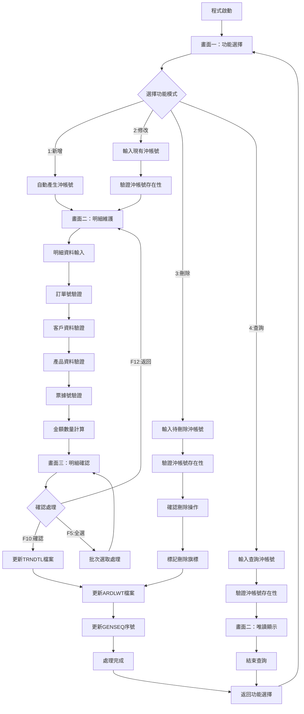
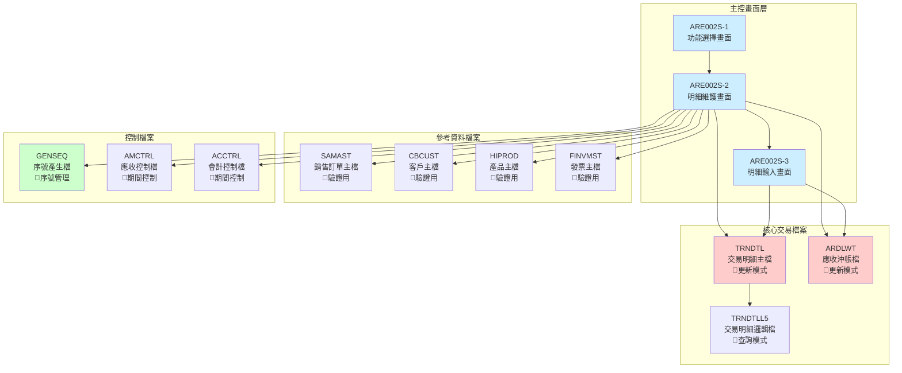
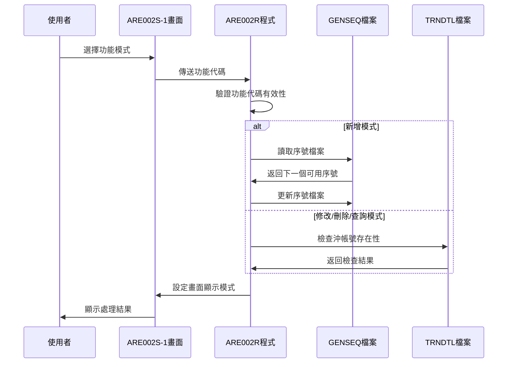
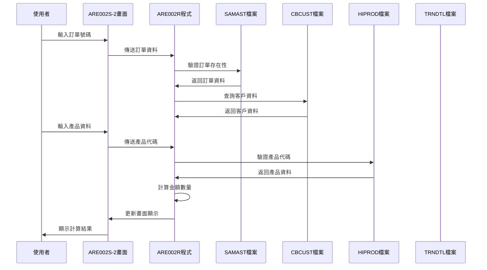
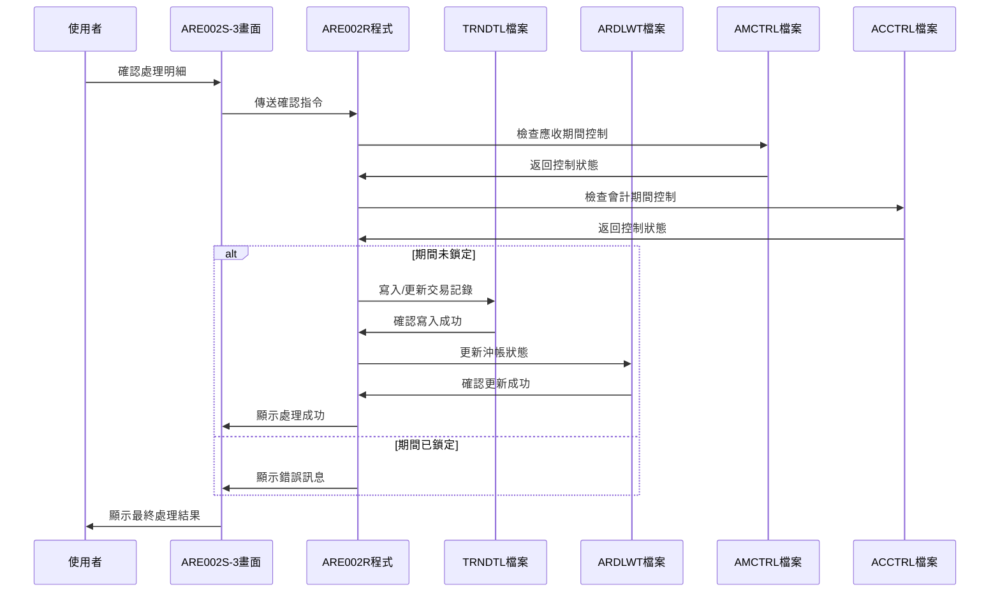
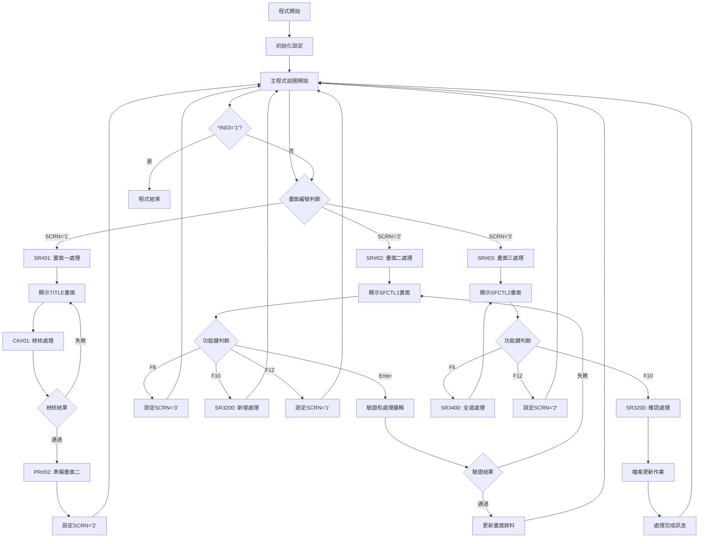
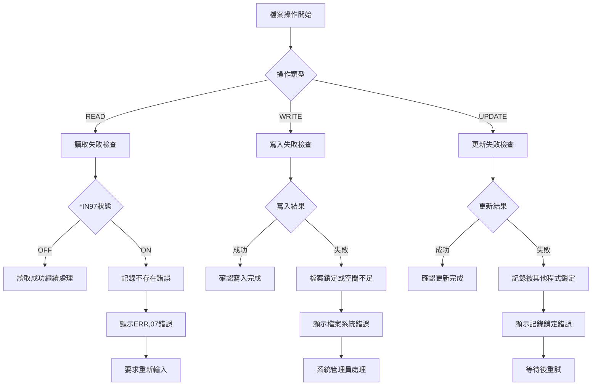

# ARE002R_P02 程式規格書

## 1. 基本資料

| 項目 | 內容 |
|------|------|
| **程式編號** | ARE002R |
| **程式名稱** | 應收帳款沖帳作業 |
| **程式類型** | RPG |
| **廠區** | P02 |
| **系統名稱** | 應收帳款系統 |
| **子系統** | 沖帳處理 |
| **檔案位置** | 東鋼list/ARE002R_P02.txt |

## 2. 🎯 程式功能說明

### 主要功能描述
應收帳款沖帳作業程式，提供完整的沖帳處理功能，包括：
- 新增、修改、刪除、查詢沖帳資料
- 多筆明細資料的批次處理
- 自動計算沖帳金額和數量
- 與相關業務檔案的完整整合

### 🎯 業務流程詳細說明

#### **完整業務流程圖**


#### **業務流程關鍵階段說明**

**1. 功能模式選擇階段**
- 驗證功能代碼的有效性（1:新增、2:修改、3:刪除、4:查詢）
- 根據不同模式設定不同的處理邏輯和畫面顯示屬性
- 新增模式下自動產生沖帳號碼

**2. 沖帳號碼處理階段**
- 新增模式：透過GENSEQ檔案自動產生唯一序號
- 修改/刪除/查詢模式：驗證輸入的沖帳號碼是否存在於TRNDTL檔案
- 檢查沖帳記錄的狀態和權限

**3. 明細資料維護階段**
- 透過分頁顯示方式處理多筆明細資料
- 每筆明細包含：項次、沖帳理由、產品名稱、數量、單價、金額、票據號
- 支援逐筆輸入和批次修改

**4. 資料驗證階段**
- **訂單驗證**：檢查SAMAST檔案中訂單的存在性和有效性
- **客戶驗證**：透過CBCUST檔案驗證客戶資料的完整性
- **產品驗證**：使用HIPROD檔案確認產品代碼的正確性
- **票據驗證**：檢查票據號碼在TRNDTL檔案中的唯一性

**5. 金額計算階段**
- 自動計算每筆明細的金額（數量 × 單價）
- 累計總數量和總金額
- 提供重新計算功能確保數據一致性

**6. 資料更新階段**
- 更新TRNDTL主檔案的交易記錄
- 同步更新ARDLWT沖帳檔案的對應記錄
- 處理GENSEQ序號檔案的編號管理

### 🎯 多層次驗證機制
1. **輸入格式驗證**：檢查各欄位的資料型態和長度
2. **業務邏輯驗證**：確認業務規則的符合性
3. **關聯性驗證**：檢查相關檔案間的資料一致性
4. **期間控制驗證**：確保交易期間的有效性

### 🎯 智能處理邏輯
- 自動重新計算功能避免人工計算錯誤
- 批次處理功能提高作業效率
- 智能序號管理確保資料唯一性
- 動態畫面控制提升使用者體驗

### 🎯 資料一致性確保機制
- 交易處理過程中的檔案鎖定控制
- 多檔案更新的事務性處理
- 資料回溯機制確保資料完整性
- 錯誤恢復機制保護資料安全

## 3. 🎯 檔案架構與關聯圖

### 使用檔案清單

| 檔案名稱 | 用途 | 存取模式 | 說明 |
|---------|------|---------|------|
| **ARE002S** | 畫面檔案 | WORKSTN | 三個主要畫面的顯示控制 |
| **TRNDTL** | 交易明細檔 | UPDATE | 主要的沖帳交易資料檔案 |
| **TRNDTLL5** | 交易明細檔L5 | INPUT | TRNDTL的邏輯檔案視圖 |
| **GENSEQ** | 序號產生檔 | UPDATE | 自動產生沖帳號碼 |
| **SAMAST** | 銷售訂單主檔 | INPUT | 訂單資料驗證 |
| **HIPROD** | 產品主檔 | INPUT | 產品代碼驗證 |
| **CBCUST** | 客戶主檔 | INPUT | 客戶資料查詢 |
| **ARDLWT** | 應收沖帳檔 | UPDATE | 沖帳狀態管理 |
| **AMCTRL** | 應收控制檔 | INPUT | 期間控制檢查 |
| **ACCTRL** | 會計控制檔 | INPUT | 會計期間控制 |
| **FINVMST** | 發票主檔 | INPUT | 發票資料驗證 |

### 🎯 檔案關聯詳細視覺化圖表



### 🎯 資料流向詳細說明

#### **環境準備階段的資料流向**


#### **業務處理階段的資料流向**


#### **環境清理階段的資料流向**


## 4. 🎯 檔案欄位規格說明

### 主要資料結構

#### TRNDTL檔案結構（交易明細主檔）
- **TXFLAG**: 處理旗標（1字元）
- **TXCODE**: 交易代碼（4字元）
- **TXNO**: 交易號碼（8字元）
- **TXITEM**: 項次（2數字）
- **TXACNT**: 會計科目（1字元）
- **TXDATE**: 交易日期（8數字）
- **TXACDT**: 入帳日期（8數字）
- **TXCUNO**: 客戶編號（6字元）
- **TXCUNM**: 客戶名稱（10字元）
- **TXORNO**: 訂單號碼（9字元）

### 🔍 重點欄位切割技術詳解

#### **DS結構完整分析**

**1. 日期處理資料結構 (D#DATE)**
```
DS
  1  80 D#DATE     ← 完整日期欄位（80字元）
  1  60 D#YYMM     ← 年月部分（60字元）
```

**2. 客戶編號切割結構 (W1CUNO)**
```
DS                 ← AADS資料結構
  1   6 W1CUNO     ← 完整客戶編號（6字元）
  1   1 S1KIND     ← 客戶類型（第1字元）
  2   2 S1CUN1     ← 客戶編號第一段（第2字元）
  3   5 S1CUN2     ← 客戶編號第二段（第3-5字元）
  6   6 S1CD01     ← 檢查碼（第6字元）
```

**3. 群組代碼切割結構 (GRP)**
```
DS
 11  20 GRP        ← 完整群組代碼（10字元）
 11  11 GE1        ← 群組第一碼（第11字元）
 12  20 GE2        ← 群組第二段（第12-20字元）
```

**4. 序號分解結構 (NOG)**
```
DS
 21  26 NOG        ← 完整序號（6字元）
 21  21 NOA        ← 序號前綴（第21字元）
 22  26 NOB        ← 序號數字（第22-26字元）
```

**5. 應收編號切割 (W#ARYE)**
```
DS
  1  15 W#ARYE     ← 完整應收編號（15字元）
  1  11 D#ARNO     ← 應收號碼（第1-11字元）
 12  15 D#ARRN     ← 應收序號（第12-15字元）
```

**6. 交易保留欄位切割 (TXRESV)**
```
DS
  1  30 TXRESV     ← 交易保留欄位（30字元）
  1   5 D#PDNO     ← 產品編號（第1-5字元）
 13  14 D#VRTM     ← 版本時間（第13-14字元）
 19  21 D#PDS1     ← 產品規格一（第19-21字元）
```

**7. 發票號碼切割 (TXIVNO)**
```
DS
  1  10 TXIVNO     ← 完整發票號碼（10字元）
  1   1 D#IVN1     ← 發票類型（第1字元）
  1   6 D#IVN2     ← 發票編號（第1-6字元）
```

**8. 交易號碼切割 (TXNO)**
```
DS
  1   8 TXNO       ← 交易號碼（8字元）
  1   1 D#TXNO     ← 交易類型（第1字元）
```

**9. 訂單號碼切割 (TXORNO)**
```
DS
  1   9 TXORNO     ← 訂單號碼（9字元）
  1   6 D#ORNO     ← 訂單編號（第1-6字元）
```

#### **欄位切割視覺化展示**

**客戶編號欄位切割詳解**
```
W1CUNO (6字元)：[T|1|234|5]
位置:            1 2 345 6
                 ↓ ↓  ↓  ↓
S1KIND (1字元)： [T]           客戶類型代碼
S1CUN1 (1字元)：   [1]         客戶編號第一段
S1CUN2 (3字元)：     [234]     客戶編號主體
S1CD01 (1字元)：         [5]   檢查碼
```

**交易保留欄位切割詳解**
```
TXRESV (30字元)：[ABCDE|.......|VT|...|PDS]
位置:             12345        1314   192021
                   ↓            ↓      ↓
D#PDNO (5字元)：   [ABCDE]              產品編號
D#VRTM (2字元)：           [VT]         版本時間
D#PDS1 (3字元)：                [PDS]  產品規格
```

**應收編號欄位切割詳解**
```
W#ARYE (15字元)：[12345678901|2345]
位置:             12345678901 121315
                           ↓     ↓
D#ARNO (11字元)：  [12345678901]    應收號碼主體
D#ARRN (4字元)：                [2345] 應收序號
```

#### **切割邏輯詳細說明**
1. **客戶編號切割邏輯**：用於區分不同類型客戶和驗證編號正確性
2. **交易保留欄位切割**：將多種屬性資料壓縮儲存於單一欄位中
3. **應收編號切割**：分離主要編號和序號便於排序和管理
4. **日期欄位切割**：提取年月資訊用於期間控制和報表分析

#### **實際數據範例說明**

**範例一：客戶編號 "T12345"**
```
原始資料: T12345
切割結果:
- S1KIND = "T" (一般客戶)
- S1CUN1 = "1" (客戶群組)
- S1CUN2 = "234" (客戶編號)
- S1CD01 = "5" (檢查碼)
```

**範例二：交易保留欄位**
```
原始資料: "AB123        VT   PDS              "
切割結果:
- D#PDNO = "AB123" (產品編號)
- D#VRTM = "VT" (版本時間)
- D#PDS1 = "PDS" (產品規格)
```

### 🎯 欄位挪用詳細分析

#### **挪用情況對比表**

| 欄位名稱 | 原始定義 | 實際使用方式 | 挪用說明 |
|---------|---------|-------------|---------|
| **TXRESV** | 交易保留欄位 | 產品相關資訊儲存 | 將產品編號、版本、規格等資訊存放於保留欄位中 |
| **TXIVNO** | 發票號碼 | 多用途編號儲存 | 除發票號碼外，也用於儲存其他業務編號 |
| **TXPCNO** | 票據號碼 | 參考號碼 | 除票據外，也用於儲存其他參考資料 |
| **TXTXAR** | 交易區域 | 業務類型標記 | 擴展用於標記不同的業務處理類型 |
| **TXTXDT** | 交易日期 | 多時點記錄 | 除交易日期外，也記錄修改、處理等時點 |

#### **挪用原因深度分析**

**1. TXRESV欄位挪用分析**
- **原因**：避免增加新欄位而影響既有系統結構
- **方式**：透過位置切割將多個屬性儲存於30字元的保留欄位中
- **效益**：節省儲存空間並保持資料表結構穩定

**2. TXIVNO欄位挪用分析**
- **原因**：業務需求擴展，需要儲存多種編號類型
- **方式**：透過第一個字元判別編號類型，其餘字元儲存編號內容
- **效益**：提高欄位使用彈性，減少系統改版成本

**3. 票據號碼欄位挪用**
- **原因**：不同業務模組需要不同的參考編號
- **方式**：根據交易類型的不同，儲存對應的參考資料
- **效益**：增加系統整合性和資料關聯性

#### **挪用方式詳細說明**

**TXRESV欄位的挪用實現**
```
位置配置：
01-05: 產品編號 (D#PDNO)
06-12: 保留空間
13-14: 版本時間 (D#VRTM)  
15-18: 保留空間
19-21: 產品規格一 (D#PDS1)
22-30: 保留空間
```

**TXIVNO欄位的挪用邏輯**
```
判別邏輯：
第1字元 = '#' → 特殊處理編號
第1字元 = '0' → 無效發票
第1字元 = 數字 → 正常發票編號
第1字元 = 英文 → 其他業務編號
```

#### **挪用影響評估**

**對系統維護的影響**
1. **正面影響**：
   - 保持資料表結構穩定，減少系統改版風險
   - 提高儲存效率，節省空間資源
   - 增加欄位使用彈性，適應業務變化

2. **負面影響**：
   - 增加程式邏輯複雜度，提高維護困難度
   - 欄位意義不直觀，需要詳細文檔說明
   - 資料完整性檢查需要額外的驗證邏輯

3. **風險控制**：
   - 建立完整的欄位切割文檔和範例
   - 設計專用的資料驗證和檢查程序
   - 制定標準的欄位使用規範和變更控制流程

### 重要變數定義表

| 變數名稱 | 資料型態 | 長度 | 用途說明 |
|---------|---------|------|---------|
| **SCRN** | 字元 | 1 | 畫面控制變數，控制畫面流程 |
| **CODE** | 字元 | 1 | 功能代碼（1:新增 2:修改 3:刪除 4:查詢）|
| **NO** | 字元 | 6 | 沖帳號碼 |
| **ORNO** | 字元 | 6 | 訂單號碼 |
| **CUNO** | 字元 | 6 | 客戶編號 |
| **CUNM** | 字元 | 10 | 客戶名稱 |
| **DATE** | 數字 | 8 | 交易日期 |
| **TTLAMT** | 數字 | 9 | 總金額 |
| **S#QTYS** | 數字 | 9 | 總數量 |
| **RRN** | 數字 | 3 | 畫面一記錄號 |
| **RRN2** | 數字 | 3 | 畫面二記錄號 |
| **W#QTY** | 數字 | 9 | 工作數量變數 |
| **W#TAMT** | 數字 | 9 | 工作金額變數 |
| **ERRMSG** | 字元 | 70 | 錯誤訊息變數 |

## 5. 🎯 輸出/入螢幕布局

### 螢幕布局完整視覺化

#### **畫面一：功能選擇畫面 (ARE002S-1)**
```
+------------------------------------------------------------------------------+
|1991/12/31  東鋼煉鋼股份有限公司     ***應收帳款沖帳作業***      ARE002S-1|
|                                                          TERMINAL01    |
|                                                                        |
|                                                                        |
|                           功能代碼: [_] (1:新增 2:修改                  |
|                                                                        |
|                                         3:刪除 4:查詢)                  |
|                                                                        |
|                                                                        |
|                           沖帳編號: [______]                             |
|                                                                        |
|                           廠  區: [_] (P=台北M=台中T=高雄              |
|                                       U=營運H=總部K=韓國)               |
|                                       V=越南Q=印尼轉投資)               |
|                                       R=德國X=美國轉投資)               |
|                                       O=印度I=印尼轉投資)               |
|                                       D=大陸N=日本)                     |
|                                       轉投資=U+V+Q+R+X+O+I+D)          |
|                                                                        |
|[錯誤訊息顯示區域]                                                       |
|ENTER:繼續                    PF03:結束                                  |
+------------------------------------------------------------------------------+
```

#### **畫面二：明細維護畫面 (ARE002S-2)**
```
+------------------------------------------------------------------------------+
|1991/12/31  東鋼煉鋼股份有限公司     ***應收帳款沖帳作業***      ARE002S-2|
|修改                                                     TERMINAL01    |
|                                                                        |
|沖帳編號: 123456    客戶編號: T12345    客戶名稱: 客戶公司               |
|訂單編號: [______]  交易日期: [____/__/__]  發票編號: 1234567890        |
|----------------------------------------------------------------------------|
|項次沖帳產品名                   金    額    票據號碼  產品規格版規格|
|    理由稱    數    量    單  價                     碼    格  格FLAG|
|----------------------------------------------------------------------------|
| 01  1 STEEL  123,456  12.345  1,234,567  12345678  ABCDE VT PDS  A |
| 02  2 IRON   234,567  23.456  2,345,678  23456789  BCDEF UV QRS  C |
| 03  3 ALLOY  345,678  34.567  3,456,789  34567890  CDEFG WX STU  A |
| 04  4 METAL  456,789  45.678  4,567,890  45678901  DEFGH YZ VWX  D |
|                                                                        |
|                                                                        |
|                                                                        |
|                                                                        |
|--------------------------------------------------------------------------|
|                                   合計數量:  1,234,567  合計金額: 12,345,678|
|[錯誤訊息顯示區域]                                                       |
|ENTER:檢核  F1:說明  F3:結束  F8:最後畫面輸入  F10:新增  F12:返回    |
+------------------------------------------------------------------------------+
```

#### **畫面三：明細輸入畫面 (ARE002S-3)**
```
+------------------------------------------------------------------------------+
|1991/12/31  東鋼煉鋼股份有限公司     應收帳款最後入帳明細輸入    ARE002S-3|
|修改                                                     TERMINAL01    |
|                                                                        |
|請輸入或修改訂單編號: [______] 入帳起日: [________] ~ [________]         |
|                                沖帳金額: [_________] 沖帳理由: [_]      |
|                                沖帳產品名稱: [_____] 發票編號: [______] |
|        產品名稱: [_____] 規格: [___] 規格: [___] 規格: [___]           |
|--------------------------------------------------------------------------|
|選取  票據號碼  項次  產品名稱規版規格    數    量  應收金額            |
|                           碼格格                                        |
|--------------------------------------------------------------------------|
| Y   12345678   01   STEEL UV PDS    123,456  1,234,567               |
| Y   23456789   02   IRON  WX QRS    234,567  2,345,678               |
|     34567890   03   ALLOY YZ STU    345,678  3,456,789               |
|     45678901   04   METAL AB VWX    456,789  4,567,890               |
|                                                                        |
|                                                                        |
|                                                                        |
|                                                                        |
|--------------------------------------------------------------------------|
|                          選取數量:  1,234,567                          |
|                合計數量:  1,234,567  合計金額: 12,345,678              |
|[錯誤訊息顯示區域]                                                       |
|ENTER:檢核  F1:說明  F03:結束  F05:全部選取  F10:確認新增  F12:返回  |
+------------------------------------------------------------------------------+
```

### 🎯 畫面欄位詳細說明

#### **畫面一欄位說明**

| 欄位名稱 | 欄位屬性 | 長度 | 輸入格式 | 驗證規則 | 說明 |
|---------|---------|------|---------|---------|------|
| **CODE** | 輸入欄位 | 1 | 數字 | 1-4範圍內 | 功能代碼選擇 |
| **NO** | 輸入欄位 | 6 | 英數字 | 新增時為空白，其他時必填 | 沖帳編號 |
| **S#AREA** | 輸入欄位 | 1 | 英文字母 | 預定義值清單 | 廠區代碼 |
| **COMP** | 顯示欄位 | 35 | - | - | 公司名稱 |
| **DEVNM** | 顯示欄位 | 10 | - | - | 終端機代號 |

#### **畫面二欄位說明**

| 欄位名稱 | 欄位屬性 | 長度 | 輸入格式 | 驗證規則 | 說明 |
|---------|---------|------|---------|---------|------|
| **ORNO** | 輸入欄位 | 6 | 英數字 | 必須存在於SAMAST | 訂單編號 |
| **DATE** | 輸入欄位 | 8 | YYYY/MM/DD | 日期格式，不可為假日 | 交易日期 |
| **ITEM** | 顯示欄位 | 2 | 數字 | - | 項次 |
| **JUST** | 輸入欄位 | 1 | 數字 | 1-4範圍內 | 沖帳理由 |
| **PDNM** | 輸入欄位 | 5 | 英數字 | 必須存在於HIPROD | 產品名稱 |
| **QTY** | 輸入欄位 | 7 | 數字 | 大於0 | 數量 |
| **PRC** | 輸入欄位 | 5 | 小數 | 3位小數 | 單價 |
| **AMT** | 計算欄位 | 9 | 數字 | 自動計算 | 金額 |
| **PNO** | 輸入欄位 | 8 | 英數字 | 必須存在於TRNDTL | 票據號碼 |

#### **畫面三欄位說明**

| 欄位名稱 | 欄位屬性 | 長度 | 輸入格式 | 驗證規則 | 說明 |
|---------|---------|------|---------|---------|------|
| **S#ORNO** | 輸入欄位 | 6 | 英數字 | 訂單存在性檢查 | 查詢訂單編號 |
| **S#ACDS** | 輸入欄位 | 8 | 數字 | 日期格式 | 入帳起日 |
| **S#ACDE** | 輸入欄位 | 8 | 數字 | 日期格式，大於起日 | 入帳迄日 |
| **S#TAMT** | 輸入欄位 | 9 | 數字 | 大於0 | 沖帳金額 |
| **S#JUST** | 輸入欄位 | 1 | 數字 | 1-4範圍內 | 沖帳理由 |
| **S#PDNM** | 輸入欄位 | 5 | 英數字 | 產品代碼驗證 | 沖帳產品名稱 |
| **S#APNO** | 輸入欄位 | 6 | 英數字 | 發票號碼驗證 | 發票編號 |
| **S#OPT** | 輸入欄位 | 1 | Y/N | Y或空白 | 選取標記 |

### 🎯 畫面控制邏輯

#### **指示器控制**

| 指示器 | 控制條件 | 作用 | 說明 |
|--------|---------|------|------|
| **IN41** | CODE欄位錯誤 | 畫面一CODE欄位反白顯示 | 功能代碼輸入錯誤時觸發 |
| **IN42** | NO欄位錯誤 | 畫面一NO欄位反白顯示 | 沖帳編號格式錯誤時觸發 |
| **IN43** | ORNO欄位錯誤 | 畫面二ORNO欄位反白顯示 | 訂單編號驗證失敗時觸發 |
| **IN44** | DATE欄位錯誤 | 畫面二DATE欄位反白顯示 | 交易日期格式錯誤時觸發 |
| **IN70** | 查詢模式 | 畫面二所有輸入欄位設為保護 | 查詢模式下禁止修改 |
| **IN75** | SFL結束 | 子檔案顯示結束標記 | 控制子檔案分頁顯示 |
| **IN84** | SFL清除 | 子檔案清除指示器 | 重新載入子檔案資料時使用 |
| **IN89** | 異動標記 | 子檔案記錄異動標記 | 標記已修改的記錄 |

#### **欄位顯示屬性**

**保護模式控制**
- 查詢模式（IN70=1）：所有輸入欄位變為保護狀態
- 修改模式（IN70=0）：輸入欄位開放編輯
- 刪除模式：除確認欄位外均為保護狀態

**錯誤顯示控制**
- 錯誤欄位使用PC（保護+顏色）和RI（反向+高亮）屬性
- 錯誤訊息使用HI（高亮）屬性顯示於畫面底部
- 正常欄位恢復預設顯示屬性

### 功能鍵詳細定義

| 功能鍵 | 處理邏輯 | 系統行為 | 適用畫面 |
|--------|---------|---------|---------|
| **F1** | 調用說明視窗 | 顯示AR02F1W說明視窗，提供沖帳理由代碼對照 | 畫面二、三 |
| **F3** | 結束程式 | 設定*IN03='1'，終止程式執行並返回選單 | 全部畫面 |
| **F5** | 全選功能 | 將畫面三所有記錄的選取欄位設為'Y' | 畫面三 |
| **F8** | 最後畫面輸入 | 跳轉至畫面三進行明細資料的進階輸入和查詢 | 畫面二 |
| **F10** | 確認處理 | 執行實際的新增、修改或刪除作業，更新檔案 | 畫面二、三 |
| **F12** | 返回上層 | 返回前一個畫面或前一個處理階段 | 畫面二、三 |

## 6. 🎯 處理流程程序說明

### **程式執行流程圖**


### 🎯 詳細處理步驟逐一分析

#### **主程序邏輯深度解析**

**1. 程式初始化階段 (MAIN PROGRAM)**
- **目的**：設定程式執行環境和初始變數
- **處理內容**：
  - 計算系統日期：`*DATE SUB 19000000 U#SYSD`
  - 解鎖ARCTL控制檔：`*NAMVAR DEFN ARCTLDTA ARCTL`
  - 設定初始畫面：`MOVE '1' SCRN`
  - 設定沖帳標記：`MOVE *OFF *IN50`
- **重要性**：確保程式環境正確初始化，避免執行時錯誤

**2. 主迴圈控制邏輯 (*IN03 DOUEQ '1')**
- **目的**：控制程式的主要執行流程直到使用者選擇結束
- **處理邏輯**：
  ```
  DO UNTIL *IN03 = '1'
    CASE SCRN
      WHEN '1': EXSR SR#01  (畫面一處理)
      WHEN '2': EXSR SR#02  (畫面二處理)  
      WHEN '3': EXSR SR#03  (畫面三處理)
    ENDCASE
  ENDDO
  ```
- **控制機制**：透過SCRN變數控制畫面流程，*IN03控制程式終止

**3. 畫面一處理邏輯 (SR#01)**
- **目的**：處理功能選擇和基本資料輸入
- **詳細步驟**：
  1. 顯示TITLE畫面：`EXFMT TITLE`
  2. 檢查取消鍵：如果*INKC=1執行KC#01結束程式
  3. 執行檢核：`EXSR CK#01`檢核輸入資料有效性
  4. 準備下一畫面：如果檢核通過執行`EXSR PR#02`準備畫面二
  5. 設定畫面編號：`MOVE '2' SCRN`轉至畫面二
- **效果**：完成功能模式選擇和沖帳編號的基本設定
- **重要性**：建立後續處理的基礎參數和控制條件

**4. 畫面二處理邏輯 (SR#02)**
- **目的**：處理明細資料的維護和驗證
- **詳細步驟**：
  1. 清除底線：`WRITE UND01`
  2. 顯示子檔案控制：`EXFMT SFCTL1`
  3. 清除錯誤訊息：`MOVE *BLANK ERRMSG`
  4. 功能鍵判斷處理：
     - KC（取消）：執行KC#01結束程式
     - KL（F12）：返回畫面一
     - KJ（Enter）：執行新增處理
     - 08（F8）：轉至畫面三
  5. 模式判斷處理：
     - CODE='1'或'2'：執行沖帳明細計算`EXSR SR3500`
     - CODE='4'：返回畫面一進行查詢
- **業務邏輯**：根據不同的功能模式執行相應的處理邏輯
- **重要性**：提供使用者與系統互動的主要介面

**5. 畫面三處理邏輯 (SR#03)**
- **目的**：處理明細資料的最終確認和批次作業
- **詳細步驟**：
  1. 檢查記錄數量：判斷S#SFN2是否為0
  2. 設定指示器狀態：根據記錄數量設定畫面顯示狀態
  3. 顯示畫面：`WRITE UND02`和`EXFMT SFCTL2`
  4. 處理功能鍵：
     - *IN03='1'：執行KC#01結束程式
     - *IN12='1'：返回畫面二
     - *IN05='1'：執行SR3400全選處理
     - *IN10='1'：執行確認處理流程
  5. 執行確認處理：
     - `EXSR SR3220`：重新計算總計
     - `EXSR SR3200`：執行新增作業
     - `EXSR SR3110`：清除畫面資料
- **效果**：完成最終的資料確認和檔案更新作業
- **重要性**：確保資料的最終一致性和完整性

#### **業務邏輯深度解析**

**1. 沖帳編號自動產生邏輯 (@GETNO)**
- **目的**：為新增模式自動產生唯一的沖帳編號
- **處理步驟**：
  1. 設定序號種類：`MOVEL '05' GEKIND`
  2. 設定序號前綴：`MOVEL TXAR GE1`組合廠區代碼
  3. 讀取GENSEQ檔案：`GEKEY CHAIN GENSEQ`
  4. 產生新序號：`GECUNO ADD 1 NOB`
  5. 組合完整編號：將廠區代碼+序號組合成完整沖帳編號
- **重要性**：確保沖帳編號的唯一性和系統性

**2. 訂單資料驗證邏輯 (CK#02-訂單檢查)**
- **目的**：驗證輸入的訂單編號在SAMAST檔案中的存在性
- **驗證邏輯**：
  ```
  MOVEL ORNO KOREA     (取得訂單前綴)
  MOVE ORNO KORNO      (取得訂單號碼)
  S1KEY SETLL SAMAST   (定位記錄)
  READ SAMAST          (讀取記錄)
  檢查S1OREA=KOREA AND S1ORNO=KORNO
  ```
- **錯誤處理**：如果訂單不存在設定錯誤指示器和錯誤訊息
- **重要性**：確保沖帳作業的訂單基礎資料正確性

**3. 客戶資料整合邏輯**
- **目的**：根據訂單號碼取得完整的客戶資料
- **處理步驟**：
  1. 從SAMAST取得客戶編號：`MOVEL W1CUNO CUNO`
  2. 組合完整客戶號：結合BK05檢查碼
  3. 查詢CBCUST檔案：`CBKEY CHAIN CBCUST`
  4. 取得客戶資料：客戶名稱、合約類型、發票類型等
- **效果**：建立完整的客戶關聯資料便於後續處理
- **重要性**：確保沖帳資料與客戶資料的一致性

**4. 金額數量計算邏輯 (SR3211)**
- **目的**：根據輸入的數量和單價自動計算金額
- **計算公式**：
  ```
  QTY DIV W#QTY = W#AVQT     (計算平均數量)
  W#AVQT MULT W#TAMT = AMT   (計算對應金額)
  AMT DIV QTY = PRC          (計算單價)
  ```
- **累計邏輯**：`ADD AMT TTLAMT`累計總金額
- **重要性**：確保金額計算的準確性和一致性

**5. 明細資料篩選邏輯 (SR3300)**
- **目的**：根據輸入條件篩選符合的交易明細資料
- **篩選條件**：
  - 訂單編號比對：`TXORNO = S#ORNO`
  - 入帳日期範圍：`TXACDT BETWEEN S#ACDS AND S#ACDE`
  - 旗標狀態檢查：`TXFLAG <> 'D'`（排除已刪除）
  - 發票類型檢查：`D#IVN1 <> '#' AND <> '0'`
  - 金額條件檢查：`TXAMT > 0`
- **進階篩選**：
  - 廠區代碼檢查：`D#TXNO`符合指定廠區
  - 產品名稱檢查：`TXPDNM = S1PDNM`
  - 規格代碼檢查：`D#PDS1`符合輸入條件
- **效果**：精確篩選符合條件的交易資料供沖帳處理
- **重要性**：確保沖帳資料的正確性和完整性

#### **條件判斷詳細說明**

**1. 功能代碼判斷邏輯**
```
SELECT
  WHEN CODE = ' ': 顯示錯誤 "功能代碼請輸入資料"
  WHEN CODE = '1': 設定新增模式
  WHEN CODE = '2': 設定修改模式  
  WHEN CODE = '3': 設定刪除模式
  WHEN CODE = '4': 設定查詢模式
  OTHER: 顯示錯誤 "功能代碼請輸入1,2,3,4"
ENDSELECT
```

**2. 沖帳編號存在性判斷**
```
IF CODE <> '1' AND NO = *BLANK:
  顯示錯誤 "非新增時，沖帳編號請務必輸入"
ENDIF

IF CODE = '1' AND NO <> *BLANK:
  顯示錯誤 "新增時，沖帳編號請勿輸入"  
ENDIF
```

**3. 期間控制判斷邏輯**
```
IF TXAR <> 'P':
  檢查AMCTRL應收控制檔
  IF A5FG12 = 'Y': 顯示期間已鎖定錯誤
ELSE:
  檢查ACCTRL會計控制檔  
  IF AAESFG = 'Y': 顯示期間已鎖定錯誤
ENDIF
```

#### **變數使用和數據流向**

**1. 主要控制變數**
- **SCRN**: 畫面流程控制 ('1'→'2'→'3')
- **CODE**: 功能模式控制 (1:新增, 2:修改, 3:刪除, 4:查詢)
- **RRN/RRN2**: 子檔案記錄指標控制
- **W#FLAG**: 資料異動標記控制

**2. 數據流向追蹤**
```
輸入資料 → 畫面變數 → 檢核程序 → 業務邏輯處理 → 檔案更新 → 結果顯示
    ↓         ↓         ↓         ↓           ↓         ↓
  NO,CODE   SCRN    *IN99    TXREC      TRNDTL   ERRMSG
```

**3. 錯誤處理流向**
```
錯誤發生 → 設定錯誤指示器 → 錯誤訊息設定 → 畫面重新顯示 → 等待修正
    ↓           ↓            ↓            ↓           ↓
  CK#01      *IN99       ERRMSG      EXFMT       重新輸入
```

### 🎯 錯誤處理與資料完整性控制

#### **錯誤處理邏輯**
1. **輸入驗證錯誤**：立即顯示錯誤訊息並要求重新輸入
2. **業務邏輯錯誤**：記錄錯誤原因並提供修正建議
3. **檔案操作錯誤**：回復處理並保護資料完整性
4. **系統錯誤**：記錄錯誤日誌並安全終止程式

#### **資料完整性檢查機制**
1. **交易一致性**：確保多檔案更新的原子性
2. **參照完整性**：檢查相關檔案間的資料一致性
3. **業務規則檢查**：驗證業務邏輯的正確性
4. **並發控制**：處理多使用者同時存取的問題

#### **關鍵業務規則實現**
1. **沖帳編號唯一性**：透過GENSEQ檔案確保編號不重複
2. **期間控制檢查**：確保在開放期間內才能進行沖帳作業
3. **訂單狀態驗證**：確保只能對有效訂單進行沖帳
4. **金額一致性**：確保沖帳金額與原交易金額的正確性

## 7. 🎯 數據操作與轉換分析

### 檔案操作詳解

#### **READ操作**
- **TRNDTL讀取**：使用TXKEY和TX1KEY進行精確定位讀取
- **SAMAST讀取**：透過S1KEY進行訂單資料驗證讀取
- **CBCUST讀取**：使用CBKEY進行客戶資料查詢讀取
- **GENSEQ讀取**：透過GEKEY進行序號管理讀取

#### **WRITE操作**
- **TRNDTL寫入**：新增沖帳交易記錄到主檔
- **子檔案寫入**：動態寫入畫面子檔案記錄
- **GENSEQ寫入**：新增序號記錄或更新現有序號

#### **UPDATE操作**
- **TRNDTL更新**：修改現有交易記錄的狀態和內容
- **ARDLWT更新**：同步更新沖帳狀態檔案
- **子檔案更新**：更新畫面顯示的明細資料

#### **DELETE操作**
- **邏輯刪除**：設定TXFLAG='D'進行邏輯刪除
- **子檔案清除**：清除畫面子檔案的暫存資料

### 數據轉換邏輯

#### **日期格式轉換**
- **系統日期處理**：`*DATE SUB 19000000 DATE`
- **顯示格式轉換**：8位數字轉換為YYYY/MM/DD格式
- **期間計算**：年月提取用於期間控制檢查

#### **數值格式轉換**
- **金額顯示**：數值型態轉換為含千分位的顯示格式
- **數量計算**：整數運算轉換為含小數的精確計算
- **百分比計算**：完成率等比例計算和顯示轉換

#### **字串操作和格式化**
- **編號組合**：`MOVEL NOG NO`組合完整編號
- **名稱串接**：`CAT`操作組合客戶名稱和錯誤訊息
- **前導零處理**：數值轉字串時的格式化處理

### 計算邏輯分析

#### **金額計算公式**
```
基本公式：金額 = 數量 × 單價
平均計算：平均數量 = 總數量 ÷ 筆數
比例計算：分配金額 = 總金額 × (個別數量 ÷ 總數量)
```

#### **精度處理規則**
- **金額欄位**：整數計算，無小數位
- **單價欄位**：3位小數精度
- **數量欄位**：整數處理
- **四捨五入**：在除法運算中使用H欄位進行四捨五入

### 檢核機制詳解

#### **資料有效性檢查**
1. **格式檢查**：欄位長度、型態、範圍值檢查
2. **必填檢查**：關鍵欄位的空值檢查
3. **關聯檢查**：外部參照檔案的存在性檢查
4. **業務規則檢查**：特殊業務邏輯的符合性檢查

#### **檢核失敗處理方式**
1. **立即停止**：關鍵錯誤立即中止處理
2. **錯誤累積**：收集所有錯誤後統一顯示
3. **警告提示**：非關鍵錯誤提供警告但允許繼續
4. **自動修正**：系統能自動修正的錯誤進行自動處理

#### **檢核規則業務依據**
- **期間控制**：依據會計制度要求實施期間鎖定
- **訂單狀態**：確保只對有效且開放的訂單進行沖帳
- **客戶權限**：檢查客戶的沖帳權限和信用狀態
- **金額限制**：根據業務政策設定的金額上下限檢查

## 8. 🎯 錯誤處理程序說明

### 🎯 詳細錯誤代碼清冊

| 錯誤代碼 | 錯誤訊息 | 原因說明 | 處理方式 | 預防措施 |
|----------|---------|---------|---------|----------|
| **ERR,01** | 功能代碼請輸入資料 | 使用者未輸入功能代碼 | 1. 要求重新輸入<br>2. 顯示可用功能選項<br>3. 游標定位至功能代碼欄位 | 於畫面上明確標示必填欄位 |
| **ERR,02** | 功能代碼請輸入1,2,3,4 | 輸入的功能代碼不在有效範圍內 | 1. 清除錯誤輸入<br>2. 顯示有效範圍說明<br>3. 重新要求輸入 | 提供下拉選單或按鈕選擇 |
| **ERR,03** | 非新增時，沖帳編號請務必輸入 | 修改/刪除/查詢模式下未輸入沖帳編號 | 1. 強制要求輸入沖帳編號<br>2. 提供沖帳編號查詢功能<br>3. 游標自動定位 | 根據功能模式自動驗證必填欄位 |
| **ERR,04** | 此沖帳編號已存在 | 新增模式下輸入的編號已被使用 | 1. 自動產生新編號<br>2. 建議使用系統編號<br>3. 清除輸入欄位 | 新增模式下禁止手動輸入編號 |
| **ERR,05** | 此沖帳編號已開立完成，無法異動 | 嘗試修改已完成的沖帳記錄 | 1. 顯示記錄狀態資訊<br>2. 建議使用查詢功能<br>3. 提供複製新增選項 | 實施狀態檢查機制 |
| **ERR,06** | 此沖帳編號已開立完成，無法刪除 | 嘗試刪除已完成的沖帳記錄 | 1. 說明刪除限制<br>2. 提供沖帳取消功能<br>3. 聯絡系統管理員 | 建立記錄狀態管理制度 |
| **ERR,07** | 此沖帳編號不存在 | 輸入的沖帳編號在系統中不存在 | 1. 驗證編號格式<br>2. 提供編號查詢功能<br>3. 建議重新輸入 | 實施編號格式驗證 |
| **ERR,08** | 訂單編號不存在 | 輸入的訂單編號在SAMAST檔案中不存在 | 1. 驗證訂單格式<br>2. 提供訂單查詢功能<br>3. 確認訂單狀態 | 建立訂單資料驗證機制 |
| **ERR,09** | 沖帳理由請務必輸入 | 沖帳理由欄位為空白 | 1. 要求選擇沖帳理由<br>2. 提供理由代碼清單<br>3. 游標定位至理由欄位 | 提供沖帳理由下拉選單 |
| **ERR,10** | 沖帳理由請輸入1,2,3,4 | 輸入的沖帳理由代碼無效 | 1. 顯示有效理由清單<br>2. 要求重新選擇<br>3. 提供理由說明 | 限制輸入範圍並提供說明 |
| **ERR,11** | 產品代碼請檢查 | 產品代碼在HIPROD檔案中不存在 | 1. 驗證產品代碼格式<br>2. 提供產品查詢功能<br>3. 確認產品狀態 | 實施產品代碼驗證機制 |
| **ERR,12** | 訂單編號請務必輸入 | 必要的訂單編號欄位為空白 | 1. 強制要求輸入訂單編號<br>2. 提供訂單查詢功能<br>3. 游標自動定位 | 實施必填欄位檢查 |
| **ERR,13** | 交易日期請檢查 | 交易日期格式錯誤或為假日 | 1. 驗證日期格式<br>2. 檢查營業日曆<br>3. 建議正確日期 | 提供日期選擇器和日曆驗證 |
| **ERR,14** | 金額數量請務必輸入 | 金額或數量欄位為零或空白 | 1. 要求輸入正確金額數量<br>2. 提供計算輔助功能<br>3. 驗證數值合理性 | 實施數值範圍檢查 |
| **ERR,15** | 新增時，沖帳編號請勿輸入 | 新增模式下不應手動輸入編號 | 1. 清除手動輸入<br>2. 說明自動編號機制<br>3. 自動產生編號 | 新增模式下鎖定編號欄位 |
| **ERR,16** | 此沖帳編號非隸屬該廠區，無法異動刪除 | 嘗試處理其他廠區的沖帳記錄 | 1. 驗證廠區權限<br>2. 顯示記錄歸屬資訊<br>3. 建議聯絡相關廠區 | 實施廠區權限控制 |
| **ERR,17** | 票據編號請務必輸入 | 票據編號欄位為空白但為必填 | 1. 要求輸入票據編號<br>2. 提供票據查詢功能<br>3. 驗證票據格式 | 根據業務需求設定必填規則 |
| **ERR,18** | 票據編號不存在 | 輸入的票據編號在系統中不存在 | 1. 驗證票據編號格式<br>2. 確認票據狀態<br>3. 提供票據查詢功能 | 建立票據資料驗證機制 |
| **ERR,19** | 因會計期已鎖定,無法異動與查詢,請通知會計課處理 | 會計期間已鎖定無法進行作業 | 1. 通知會計人員<br>2. 等待期間開放<br>3. 確認緊急處理程序 | 建立期間管理通知機制 |
| **ERR,25** | 新增的票據明細數量超過系統容許上限 | 明細筆數超過99筆系統限制 | 1. 分批處理明細<br>2. 檢視是否有重複資料<br>3. 優化資料結構 | 實施資料筆數控制和預警 |
| **ERR,26** | 新增的票據已成功寫入明細 | 成功完成新增作業的確認訊息 | 1. 顯示處理結果<br>2. 提供列印功能<br>3. 準備下一筆處理 | 建立作業完成確認機制 |
| **ERR,27** | 查詢無資料 | 根據查詢條件找不到符合的資料 | 1. 調整查詢條件<br>2. 擴大查詢範圍<br>3. 確認資料是否存在 | 提供智能查詢建議 |
| **ERR,30** | 每筆明細的廠區須為同一廠區 | 同一沖帳單中包含不同廠區的明細 | 1. 檢查明細廠區一致性<br>2. 分離不同廠區資料<br>3. 重新組織明細 | 實施廠區一致性檢查 |
| **ERR,31** | 此筆明細的客戶與該沖帳的訂單客戶不同 | 明細中的客戶與訂單客戶不一致 | 1. 驗證客戶關聯性<br>2. 確認訂單歸屬<br>3. 修正客戶資料 | 建立客戶關聯性驗證 |
| **ERR,32** | 訂單P05301，請輸入U | 特定訂單要求特定廠區代碼 | 1. 修正廠區代碼<br>2. 確認訂單要求<br>3. 驗證業務規則 | 建立訂單廠區對應檢查 |
| **ERR,33** | 票據的訂單P與該沖帳的訂單不同 | 票據訂單與沖帳訂單不一致 | 1. 驗證訂單關聯性<br>2. 確認票據歸屬<br>3. 修正訂單資料 | 實施訂單一致性檢查 |
| **ERR,34** | 票據版本時間或規格不存在 | 票據中的版本或規格資料無效 | 1. 驗證版本規格資料<br>2. 更新產品資訊<br>3. 確認資料完整性 | 建立產品資料完整性檢查 |
| **ERR,36** | 交易日期已超過鎖定，若須異動請先洽詢會計人員，再行鎖定 | 交易日期超過鎖定期限 | 1. 聯絡會計人員<br>2. 申請期間調整<br>3. 確認緊急處理權限 | 建立期間例外處理機制 |
| **ERR,37** | 選取筆數數量超過99筆! | 選取的明細筆數超過系統限制 | 1. 減少選取筆數<br>2. 分批處理<br>3. 檢視選取條件 | 實施選取筆數控制 |
| **ERR,38** | 產品名、票據版本時間、規格不存在 | 產品相關資訊在系統中不存在 | 1. 驗證產品資料完整性<br>2. 更新產品主檔<br>3. 確認資料準確性 | 建立產品資料同步機制 |

### 🎯 系統異常處理邏輯

#### **檔案操作失敗處理**


#### **程式調用失敗處理**
1. **UTS102R日期檢查程式調用失敗**
   - 檢查程式是否存在於程式庫中
   - 驗證參數傳遞的正確性
   - 提供備用的日期驗證邏輯
   - 記錄調用失敗的詳細資訊

2. **GENSEQ序號產生失敗**
   - 檢查GENSEQ檔案的存在性和權限
   - 提供手動序號輸入備案
   - 實施序號重複檢查機制
   - 建立序號恢復程序

#### **資料完整性錯誤處理**
1. **交易一致性錯誤**
   - 實施回復機制恢復資料狀態
   - 記錄詳細的錯誤日誌
   - 通知系統管理員進行檢查
   - 提供資料修復工具

2. **參照完整性錯誤**
   - 驗證相關檔案的資料一致性
   - 提供資料同步修復功能
   - 建立資料一致性檢查報告
   - 實施預防性檢查機制

#### **並發控制失敗處理**
1. **記錄鎖定衝突**
   - 提供重試機制和等待提示
   - 顯示目前鎖定該記錄的使用者資訊
   - 實施優先級別處理機制
   - 建立鎖定超時處理邏輯

2. **檔案獨占衝突**
   - 檢查其他程式的檔案使用狀態
   - 提供檔案使用狀態查詢功能
   - 實施檔案存取排程機制
   - 建立緊急存取權限管理

## 9. 🎯 備註

### 🎯 特殊注意事項

1. **沖帳編號管理機制**
   - 系統自動產生的沖帳編號具有唯一性，格式為「廠區代碼+流水號」
   - 新增模式下禁止手動輸入編號，避免重複或格式錯誤
   - 不同廠區的沖帳編號獨立管理，互不干擾
   - 編號一旦產生即不可變更，確保追蹤的一致性

2. **期間控制限制**
   - 交易日期必須在開放的會計期間內，已鎖定期間無法進行任何異動
   - AMCTRL和ACCTRL檔案分別控制不同類型的期間鎖定
   - 期間鎖定檢查在資料儲存前執行，確保符合會計制度要求
   - 緊急情況下需聯絡會計人員進行期間調整

3. **廠區權限控制**
   - 使用者只能處理歸屬於自己廠區的沖帳記錄
   - 跨廠區的沖帳作業需要特殊權限或分別處理
   - 廠區代碼驗證在每次檔案存取時進行
   - 同一沖帳單中的所有明細必須屬於相同廠區

4. **資料完整性要求**
   - 訂單、客戶、產品等主檔資料必須預先存在且有效
   - 票據編號必須在系統中存在且未被其他沖帳使用
   - 金額和數量不可為零，且必須符合業務邏輯
   - 所有必填欄位都必須有有效值

5. **子檔案處理限制**
   - 畫面二最多顯示15筆明細，分頁大小為11筆
   - 畫面三最多顯示25筆明細，分頁大小為10筆
   - 系統最多處理99筆明細記錄，超過時需分批處理
   - 子檔案記錄在畫面切換時會保持暫存狀態

6. **特殊訂單處理規則**
   - 某些特定訂單（如P05301系列）有特殊的廠區要求
   - 這些訂單的處理邏輯需要額外的驗證步驟
   - 特殊訂單清單會隨業務需求更新
   - 違反特殊規則時會產生明確的錯誤提示

7. **版本和規格管理**
   - 產品的版本時間和規格代碼必須與主檔一致
   - 版本和規格資訊儲存在TXRESV保留欄位中
   - 不同版本的同一產品視為不同項目處理
   - 版本規格資料的變更需要系統管理員權限

8. **錯誤恢復機制**
   - 系統提供多層級的錯誤恢復機制
   - 檔案操作失敗時會自動回復到操作前狀態
   - 重要錯誤會記錄到系統日誌供後續分析
   - 使用者可以通過F12鍵返回上一步進行修正

9. **檔案同步處理機制**
   - 每次檔案更新都會檢查相關檔案的同步狀態
   - 子檔案採用分頁顯示機制處理多筆資料
   - 檔案讀取採用索引鍵進行定位
   - 處理過程中維護檔案間的資料一致性

10. **ARDLWT檔案同步機制**
    - 每次TRNDTL檔案更新時會同步更新ARDLWT沖帳檔案
    - ARDLWT記錄包含沖帳編號、票據編號、沖帳日期等關鍵資訊
    - 新增沖帳時設定*IN50=OFF，刪除沖帳時設定*IN50=ON
    - 同步失敗時會回復TRNDTL的變更，確保資料一致性

 