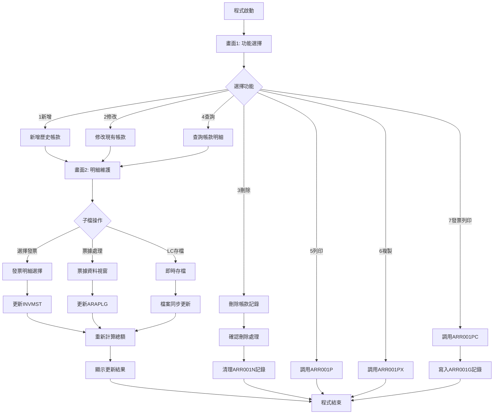
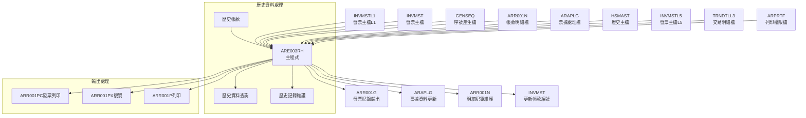
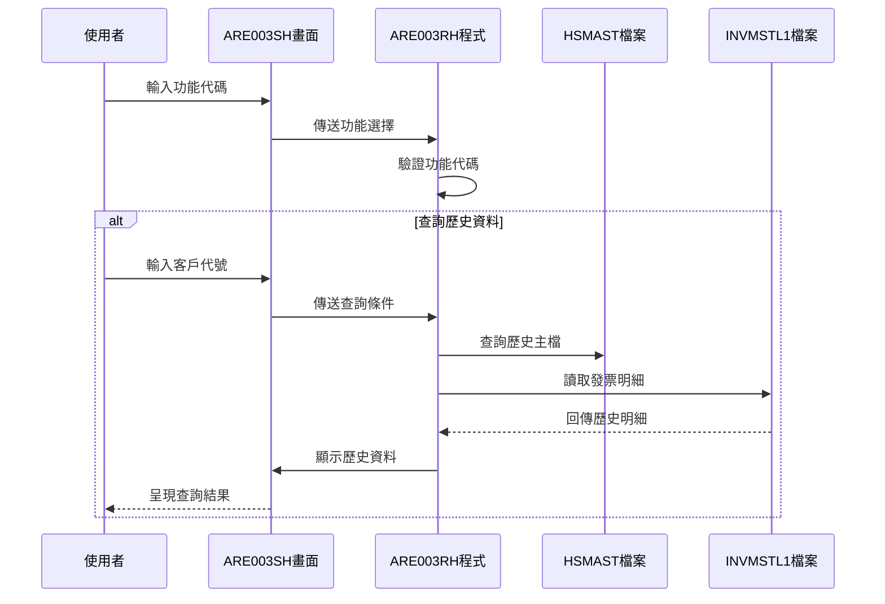
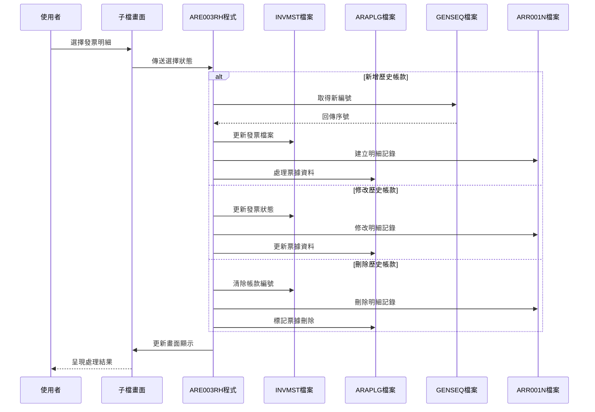
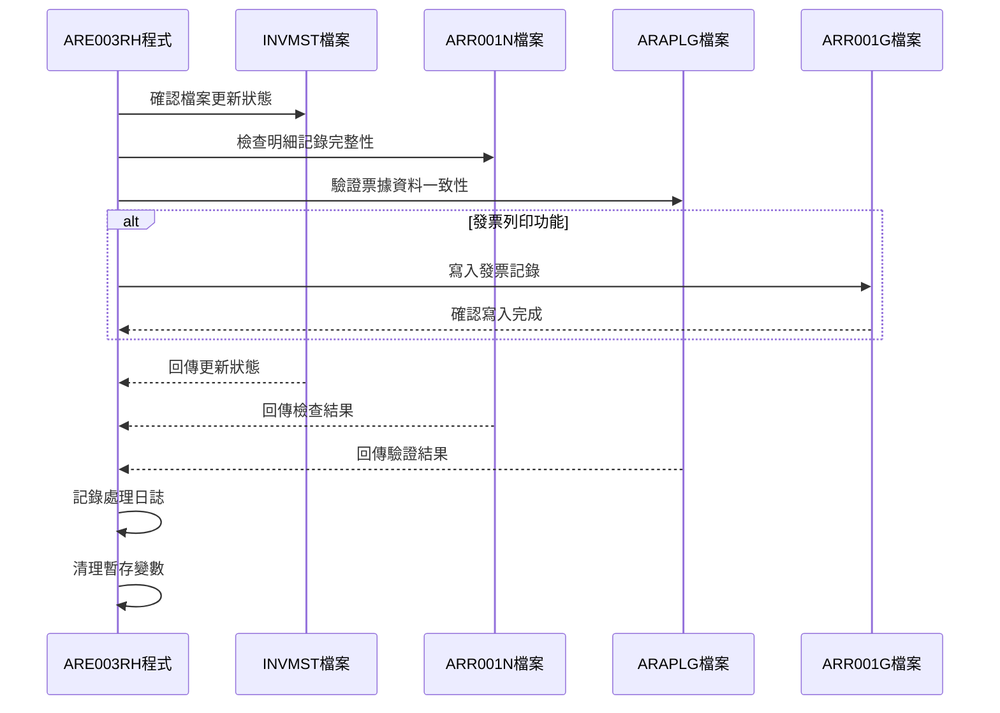
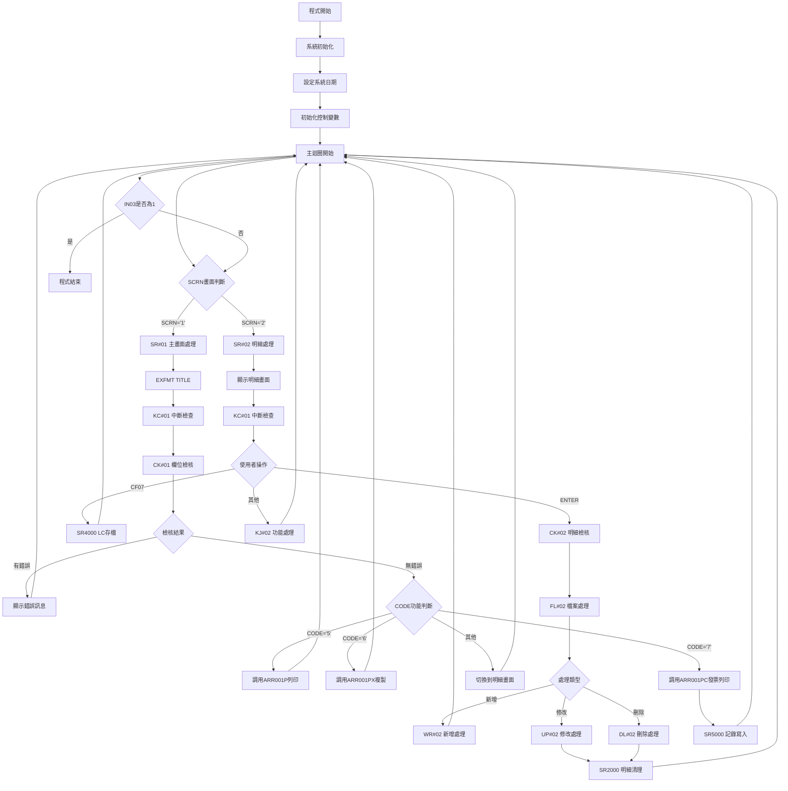

# ARE003RH_P02 程式規格書

## 1. 基本資料

| 項目 | 內容 |
|------|------|
| **程式編號** | ARE003RH |
| **程式名稱** | 應收帳款作業(歷史版) |
| **程式類型** | RPG |
| **廠區** | P02 |
| **系統名稱** | 應收帳款系統 |
| **子系統** | 帳款處理子系統 |
| **檔案位置** | 東鋼list/ARE003RH_P02.txt |

## 2. 🎯 程式功能說明

### 主要功能描述
ARE003RH為應收帳款歷史版本作業程式，從ARE003R複製並加以修改，專門處理歷史帳款資料維護。提供完整的應收帳款新增、修改、刪除、查詢功能，並整合票據處理、發票列印和各種報表輸出功能。

### 🎯 業務流程詳細說明

#### 完整業務流程圖


#### 業務流程關鍵階段說明

**階段1: 歷史資料識別階段**
- 程式專門處理歷史帳款資料
- 支援客戶和發票的歷史記錄維護
- 針對舊有資料提供完整操作功能
- 確保歷史資料的完整性和追蹤性

**階段2: 功能選擇與驗證階段**
- 提供7種主要功能選項
- 驗證使用者輸入的功能代碼
- 檢查客戶代號和帳款編號的有效性
- 根據操作模式設定畫面保護狀態

**階段3: 明細資料處理階段**
- 載入客戶相關的所有發票明細
- 提供子檔瀏覽和選擇功能
- 支援即時的總額計算和顯示
- 處理發票明細的選擇標記

**階段4: 檔案更新執行階段**
- 更新INVMST發票主檔的帳款編號
- 處理ARR001N帳款明細檔記錄
- 更新ARAPLG票據處理檔案
- 寫入ARR001G發票記錄檔

#### 多層次驗證機制
- **輸入驗證**: 功能代碼、客戶代號、帳款編號格式檢查
- **存在性驗證**: 客戶檔案、帳款檔案存在性確認
- **邏輯驗證**: 新增與修改模式的帳款編號邏輯檢查
- **業務規則驗證**: 發票選擇數量、總額計算正確性
- **權限驗證**: 列印功能的使用者權限檢查

#### 智能處理邏輯
- 自動產生唯一帳款編號(透過GENSEQ)
- 智能判斷新增或修改模式
- 自動計算和更新總額
- 即時反映選擇狀態變更
- 自動處理檔案關聯更新

#### 資料一致性確保機制
- 檔案間的連鎖更新處理
- 異動狀態的統一標記
- 系統日期和使用者追蹤
- 錯誤狀況的回復機制

## 3. 🎯 檔案架構與關聯圖

### 使用檔案清單

| 檔案名稱 | 檔案用途 | 存取方式 | 關聯鍵值 |
|----------|---------|---------|----------|
| **ARE003SH** | 顯示檔案 | WORKSTN | - |
| **INVMST** | 發票主檔 | UF | INNO |
| **INVMSTL1** | 發票主檔L1 | IF | INCUNO+INAPNO |
| **INVMSTL5** | 發票主檔L5 | IF | F#APNO+F#CUNO |
| **TRNDTLL3** | 交易明細檔L3 | IF | TXIVNO |
| **GENSEQ** | 序號產生檔 | UF | GEKIND+GEPRIN |
| **ARR001N** | 帳款明細檔 | UF | ANAPNO+ANAPIT |
| **ARAPLG** | 票據處理檔 | UF | A1APNO+A1ITEM |
| **HSMAST** | 歷史主檔 | IF | K#AREA+K#ORNO |
| **ARPRTF** | 列印檔案 | IF | D#USER |
| **ARR001G** | 發票記錄檔 | O | - |

### 🎯 檔案關聯詳細視覺化圖表



### 🎯 資料流向詳細說明

#### 環境準備階段的資料流向


#### 業務處理階段的資料流向


#### 環境清理階段的資料流向


## 4. 🎯 檔案欄位規格說明

### 主要資料結構

#### INVMSTL1 發票主檔記錄結構
```
INREC (發票記錄)
├── INCUNO (客戶代號, 6位)
├── INAPNO (帳款編號, 6位)
├── INNO (發票號碼, 10位)
├── AAMT (應收金額, 8位)
├── BAMT (已收金額, 8位)
├── CAMT (預收抵沖, 8位)
├── DAMT (稅額, 7位)
├── EAMT (其他費用, 8位)
├── NBAL (發票餘額, 8位)
├── INAPDT (帳款日期, 8位)
├── DECD (異動碼, 1位)
├── INFLAG (處理旗標, 1位)
├── INTXAR (廠區代碼, 1位)
└── INTXDT (異動日期, 8位)
```

### 🔍 重點欄位切割技術詳解

#### DS結構完整分析

**AADS資料結構分析**
```
AADS (30位元主結構)：[GGGGGGGGGG|AAAAAA|YYYYYYYY|DDDDDDDD]
位置範圍:              001-010   011-016 017-024   025-032
結構用途:              群組代碼   帳款號  日期欄位  擴充欄位
```

#### 欄位切割視覺化展示
```
AADS主結構 (30字元)：[GGGGGGGGGG|AAAAAA|YYYYYYYY|DD]
                     ↓         ↓      ↓        ↓
GRP  (10字元)：     [GGGGGGGGGG]              完整群組代碼
APNOG(6字元)：                 [AAAAAA]       帳款編號群組
YMD  (8字元)：                        [YYYYYYYY] 完整日期
DD   (2字元)：                                [DD] 日期補充
```

**詳細位置對應**
```
位置001-010: GRP   = 完整群組代碼
├── 位置001: GRP1  = 群組第一碼
├── 位置001: GE1   = 廠區識別碼
├── 位置002: GE2   = 年度代碼
├── 位置003: GE3   = 月份代碼
└── 位置004-010: GE4 = 流水序號部分

位置011-016: APNOG = 帳款編號群組
├── 位置011: APNO1 = 帳款類型碼
└── 位置012-016: APNO2 = 帳款流水號

位置021-028: YMD   = 完整日期欄位
├── 位置021-024: YY = 年度(4位)
├── 位置025-026: MM = 月份(2位)
└── 位置027-028: DD = 日期(2位)
```

#### 切割邏輯詳細說明

**群組代碼組合邏輯**
- GRP由廠區代碼(GE1) + 年度代碼(GE2) + 月份代碼(GE3) + 序號(GE4)組成
- 用於產生唯一的帳款編號群組識別
- 支援多廠區獨立編號管理
- 提供年度和月份的分類機制

**帳款編號產生邏輯**
- APNO1為帳款類型識別碼
- APNO2為該類型下的流水編號
- 透過GENSEQ檔案管理序號唯一性
- 支援序號達99999時的重置機制

#### 實際數據範例說明
```
原始群組: P312340567890120240315
切割結果:
├── GRP = "P312345678" (P廠區+312年3月+序號45678)
├── GE1 = "P" (P02廠區識別)
├── GE2 = "3" (年度代碼)
├── GE3 = "1" (1月份)
├── APNOG = "234567" (帳款編號群組)
├── YMD = "20240315" (2024年3月15日)
└── 完整APNO = "P34567" (最終帳款編號)
```

### 重要變數定義表

| 變數名稱 | 資料型態 | 長度 | 用途說明 |
|----------|---------|------|----------|
| **CODE** | 字元 | 1 | 功能代碼(1-7) |
| **CUNO** | 字元 | 6 | 客戶代號 |
| **APNO** | 字元 | 6 | 帳款編號 |
| **SCRN** | 字元 | 1 | 畫面控制變數 |
| **S#OPT** | 字元 | 1 | 輸出選項控制 |
| **TTLAMT** | 數值 | 9 | 總金額累計 |
| **RRN** | 數值 | 3 | 子檔記錄序號 |
| **OPT** | 字元 | 1 | 明細選擇標記 |
| **OPT1** | 字元 | 1 | 輔助選擇標記 |
| **W#APNO** | 字元 | 6 | 工作用帳款編號 |
| **W#LOOP** | 字元 | 1 | 迴圈控制變數 |
| **S#CODE** | 字元 | 1 | 票據收款代碼 |
| **S#VNNO** | 字元 | 20 | 票據號碼 |
| **S#BANK** | 字元 | 16 | 銀行代碼 |
| **S#DAT1** | 數值 | 8 | 票據開發日期 |
| **S#DAT2** | 數值 | 8 | 票據到期日期 |
| **S#BAMT** | 數值 | 11 | 票據金額 |
| **S#CURY** | 字元 | 3 | 票據幣別 |
| **S#ERW1** | 字元 | 34 | 錯誤訊息 |
| **K#AREA** | 字元 | 1 | 歷史區域代碼 |
| **K#ORNO** | 字元 | 50 | 歷史訂單編號 |

## 5. 🎯 輸出/入螢幕布局

### 螢幕布局完整視覺化

#### ARE003SH-1 功能選擇畫面
```
+----------------------------------------------------------+
|  2024/12/26        ***  應收帳款作業 ***        ARE003SH-1|
|                                                    P02DEV|
|                                                          |
|      [因新增修改：請輸入客戶、訂單號]                      |
|                                                          |
|                                                          |
|                     功能代號: [X]                        |
|                              (1:新增 2:修改              |
|                                                          |
|                               3:刪除 4:查詢              |
|                                                          |
|                               5:列印 6:複製              |
|                                                          |
|                               7:列印應收帳款發票)         |
|                                                          |
|                     客戶代號: [      ]                   |
|                                                          |
|                     應收編號: [      ]                   |
|                                                          |
|   請問列印時是否列出確認銷售明細: [X] (Y:列出 N:不列出)    |
|                                                          |
| [錯誤訊息顯示區]                                          |
| ENTER:執行         PF03:離開         PF12:返回          |
+----------------------------------------------------------+
```

#### ARE003SH-2 明細維護畫面
```
+----------------------------------------------------------+
|  2024/12/26    [新增] ***  應收帳款作業 ***    ARE003SH-2|
|                                                    P02DEV|
|                                                          |
| 客戶代號: [123456] 客戶名稱: [測試客戶公司]              |
| 應收編號: [234567] 業務員代號: [SALES01] 應收日期: [    ]|
|----------------------------------------------------------+
|             |                                           |
| 選 發票號碼  | 發票日期  訂單   工件編號  銷售額  費用額 餘額|
| [X] [12345678] [2024/03/15] [001234] [WK12345] [123456] [1234] [123456]|
| [X] [12345679] [2024/03/16] [001235] [WK12346] [234567] [2345] [234567]|
| [X] [12345680] [2024/03/17] [001236] [WK12347] [345678] [3456] [345678]|
| [ ] [        ] [    /  /  ] [      ] [        ] [      ] [    ] [      ]|
| [ ] [        ] [    /  /  ] [      ] [        ] [      ] [    ] [      ]|
| [ ] [        ] [    /  /  ] [      ] [        ] [      ] [    ] [      ]|
| [ ] [        ] [    /  /  ] [      ] [        ] [      ] [    ] [      ]|
| [ ] [        ] [    /  /  ] [      ] [        ] [      ] [    ] [      ]|
| [ ] [        ] [    /  /  ] [      ] [        ] [      ] [    ] [      ]|
| [ ] [        ] [    /  /  ] [      ] [        ] [      ] [    ] [      ]|
| [ ] [        ] [    /  /  ] [      ] [        ] [      ] [    ] [      ]|
|----------------------------------------------------------+
| 發票總數: [  3] 筆                        總計: [1,234,567]|
| ENTER:確認   PF03:離開   PF10:存檔   PF12:返回上層       |
| [錯誤訊息顯示區]                        PF07:LC存檔      |
+----------------------------------------------------------+
```

#### AR003W1 票據處理視窗
```
                    ┌────────────────────────┐
                    │       *票據資料*       │
                    │                        │
                    │ 收款代碼: [X]          │
                    │          (1.匯票2.支票3.現金)
                    │ 票據號碼: [              ] │
                    │ 開發日期: [    /  /  ]   │
                    │ 到期日期: [    /  /  ]   │
                    │ 銀行代碼: [            ]  │
                    │ 票據幣別: [   ]         │
                    │ 票據金額: [         ]    │
                    │                        │
                    │  F3:取消   12:返回畫面  │
                    │           F11:存檔     │
                    │ [錯誤訊息顯示區]        │
                    └────────────────────────┘
```

### 🎯 畫面欄位詳細說明

#### 功能選擇畫面欄位
| 欄位名稱 | 屬性 | 長度 | 輸入格式 | 驗證規則 |
|----------|------|------|----------|----------|
| **CODE** | 必填 | 1 | 數字 | 1-7範圍檢查 |
| **CUNO** | 必填 | 6 | 英數字 | 客戶檔存在性 |
| **APNO** | 條件必填 | 6 | 英數字 | 依功能代碼而定 |
| **S#OPT** | 條件必填 | 1 | Y/N | VALUES檢查 |

#### 明細維護畫面欄位
| 欄位名稱 | 屬性 | 長度 | 輸入格式 | 驗證規則 |
|----------|------|------|----------|----------|
| **OPT** | 選填 | 1 | 空白或X | 選擇標記 |
| **INVNO** | 唯讀 | 10 | 顯示用 | 發票號碼 |
| **S#INDT** | 唯讀 | 8 | 日期 | 發票日期 |
| **S#ORNO** | 唯讀 | 6 | 顯示用 | 訂單編號 |
| **S#CTNO** | 唯讀 | 10 | 顯示用 | 工件編號 |
| **S#XAMT** | 唯讀 | 8 | 數值 | 銷售金額 |
| **EAMT** | 唯讀 | 8 | 數值 | 費用金額 |
| **NBAL** | 唯讀 | 8 | 數值 | 餘額 |

#### 票據視窗欄位
| 欄位名稱 | 屬性 | 長度 | 輸入格式 | 驗證規則 |
|----------|------|------|----------|----------|
| **S#CODE** | 必填 | 1 | 數字 | 1-3範圍 |
| **S#VNNO** | 必填 | 20 | 英數字 | 非空白檢查 |
| **S#DAT1** | 必填 | 8 | 日期 | 日期格式驗證 |
| **S#DAT2** | 必填 | 8 | 日期 | 日期格式驗證 |
| **S#BANK** | 選填 | 16 | 英數字 | 銀行代碼驗證 |
| **S#CURY** | 必填 | 3 | 英數字 | 幣別代碼驗證 |
| **S#BAMT** | 必填 | 11 | 數值 | 大於0檢查 |

### 🎯 畫面控制邏輯

#### 指示器控制說明
| 指示器 | 控制項目 | 狀態說明 |
|--------|---------|----------|
| **IN41** | CODE欄位 | PC+RI (錯誤閃爍反白) |
| **IN42** | CUNO欄位 | PC+RI (錯誤閃爍反白) |
| **IN43** | APNO欄位 | PC+RI (錯誤閃爍反白) |
| **IN45** | S#OPT欄位 | PC+RI (錯誤閃爍反白) |
| **IN51** | 子檔選擇 | PC+RI (選擇標記控制) |
| **IN70** | 畫面保護 | PR (保護模式啟用) |
| **IN74** | 總額顯示 | ND (無資料時不顯示) |
| **IN80** | 子檔清除 | SFLCLR (清除子檔內容) |
| **IN88** | 子檔異動 | SFLNXTCHG (標記異動) |
| **IN91** | 票據欄位 | RI (票據視窗反白) |

### 功能鍵詳細定義

#### 主畫面功能鍵
| 功能鍵 | 處理邏輯 | 系統行為 |
|--------|---------|----------|
| **ENTER** | 執行選擇功能 | 根據CODE執行對應處理 |
| **CF03** | 離開程式 | 設定IN03='1'結束程式 |
| **CF12** | 返回上層 | 設定IN12='1'返回 |

#### 明細畫面功能鍵
| 功能鍵 | 處理邏輯 | 系統行為 |
|--------|---------|----------|
| **ENTER** | 確認操作 | 執行明細更新處理 |
| **CF03** | 離開 | 返回功能選擇畫面 |
| **CF07** | LC存檔 | 執行SR4000即時存檔 |
| **CF10** | 正式存檔 | 執行完整檔案更新 |
| **CF12** | 返回 | 返回上層處理 |

#### 票據視窗功能鍵
| 功能鍵 | 處理邏輯 | 系統行為 |
|--------|---------|----------|
| **CF03** | 取消操作 | 關閉視窗不存檔 |
| **CF11** | 存檔 | 執行票據資料存檔 |
| **CF12** | 返回 | 返回明細畫面 |

## 6. 🎯 處理流程程序說明

### 🎯 主程序邏輯深度分析

#### 程式執行流程圖


#### 🎯 詳細處理步驟逐一分析

**步驟1: 系統環境初始化**
- 計算系統日期並設定到U#SYSD變數 (*DATE - 19000000)
- 初始化畫面控制變數SCRN='1'
- 設定初始選項S#OPT='N'
- 啟用初始指示器IN90='1'

**步驟2: 主畫面輸入處理(SR#01)**
- 顯示TITLE功能選擇畫面
- 檢查CF12或KC中斷鍵的按下狀況
- 執行CK#01進行欄位檢核
- 根據功能代碼分派到不同處理邏輯

**步驟3: 功能分派執行**
- CODE='5': 調用ARR001P報表列印程式
- CODE='6': 調用ARR001PX複製處理程式
- CODE='7': 調用ARR001PC發票列印並執行SR5000
- 其他CODE: 切換到明細處理畫面(SCRN='2')

**步驟4: 明細畫面處理(SR#02)**
- 執行PR#02載入明細資料
- 顯示SFCTL1子檔控制畫面
- 處理使用者的各種操作指令
- 執行相應的檔案更新作業

**步驟5: 檔案更新執行(FL#02)**
- 根據CODE值執行對應的檔案處理
- WR#02: 新增帳款記錄處理
- UP#02: 修改帳款記錄處理
- DL#02: 刪除帳款記錄處理

#### 業務邏輯深度解析

**帳款編號自動產生機制**
```
序號產生邏輯(WR#02):
1. 設定GEKIND='03'(帳款類型)
2. 組合GEPRIN群組識別碼
3. 讀取GENSEQ取得目前序號
4. 檢查序號是否達99999上限
5. 序號+1並更新回GENSEQ檔案
6. 組合完整帳款編號到APNO變數
```

**明細資料載入機制**
```
資料載入邏輯(PR#02):
1. 清除子檔並重置計數器
2. 根據功能代碼執行不同載入
3. 使用IN2KEY讀取INVMSTL1檔案
4. 過濾DECD='D'的刪除記錄
5. 計算各項金額並累計總額
6. 寫入子檔SF1供畫面顯示
```

**票據處理窗口機制**
```
票據處理邏輯(SR4000-SR4300):
1. SR4000: 顯示票據輸入視窗
2. SR4100: 載入現有票據資料
3. SR4200: 檢核票據資料完整性
4. SR4300: 存檔票據資料到ARAPLG
5. 支援新增、修改、刪除操作
```

#### 條件判斷詳細說明

**功能代碼邏輯判斷**
- CODE=' ': 空白時顯示ERR002錯誤
- CODE='1': 新增模式，APNO必須空白
- CODE='2': 修改模式，APNO必須非空白
- CODE='3': 刪除模式，設定保護狀態
- CODE='4': 查詢模式，設定唯讀狀態
- CODE='5'/'6'/'7': 列印相關功能

**檔案存在性判斷**
- 新增時: 檢查客戶帳款是否已存在
- 修改時: 檢查帳款記錄是否存在
- 刪除時: 檢查是否有相關明細記錄
- 列印時: 檢查使用者權限設定

#### 變數使用和數據流向

**關鍵變數生命週期**
```
APNO (帳款編號):
初始化 → 檢核驗證 → 序號產生 → 檔案更新 → 畫面顯示

CUNO (客戶代號):
輸入 → 格式檢查 → 存在性驗證 → 資料載入 → 關聯處理

TTLAMT (總金額):
清零 → 逐筆累加 → 畫面顯示 → 存檔確認

RRN (記錄號):
初始化 → 逐筆遞增 → 子檔定位 → 資料處理
```

### 🎯 子程序邏輯分析

#### KC#01 中斷檢查子程序
**功能**: 檢查使用者是否按下中斷鍵
**參數**: 無
**處理邏輯**: 設定LR指示器並返回程式

#### CK#01 主要檢核子程序
**功能**: 驗證主畫面輸入資料的正確性
**檢核項目**:
- 功能代碼CODE的範圍檢查(1-7)
- 客戶代號CUNO的非空白檢查
- 帳款編號APNO的邏輯性檢查
- 輸出選項S#OPT的有效性檢查

#### FL#02 檔案處理分派子程序
**功能**: 根據功能代碼分派到對應的檔案處理
**參數**: 無
**分派邏輯**:
- CODE='1': 調用WR#02新增處理
- CODE='2': 調用UP#02修改處理
- CODE='3': 調用DL#02刪除處理

#### WR#02 新增處理子程序
**功能**: 執行新增帳款的完整處理
**處理步驟**:
1. 產生新的帳款編號
2. 處理選擇的發票明細
3. 更新INVMST發票主檔
4. 調用ARR001P列印程式
5. 回到主畫面顯示結果

#### UP#02 修改處理子程序
**功能**: 執行修改帳款的處理
**處理步驟**:
1. 掃描子檔中的所有記錄
2. 處理取消選擇的明細項目
3. 處理新選擇的明細項目
4. 更新發票主檔的異動狀態
5. 執行SR2000清理明細記錄

#### DL#02 刪除處理子程序
**功能**: 執行刪除帳款的處理
**處理步驟**:
1. 清除所有相關發票的帳款編號
2. 更新發票主檔的處理旗標
3. 設定異動日期和廠區代碼

### 🎯 特殊邏輯處理

#### 歷史資料處理邏輯
**HSMAST歷史主檔應用**:
- 使用K#AREA和K#ORNO作為複合鍵值
- 支援歷史區域的資料分類管理
- 提供歷史訂單的快速查詢功能
- 整合歷史資料與現行資料的關聯

#### 序號管理機制
**GENSEQ序號檔案處理**:
```
序號邏輯:
IF GECUNO = 99999 THEN
   GECUNO = 1 (重置為1)
ELSE
   GECUNO = GECUNO + 1 (遞增)
ENDIF
```

#### 發票記錄輸出邏輯(SR5000)
**ARR001G記錄檔案寫入**:
- 設定AGAPNO帳款編號
- 記錄AGAREA廠區代碼
- 設定AGPTDD處理日期
- 記錄AGPTSR處理人員
- 逐筆寫入相關發票記錄

## 7. 🎯 數據操作與轉換分析

### 檔案操作詳解

#### READ操作處理
**INVMSTL1檔案讀取機制**:
```
SETLL IN2KEY → READE循環讀取 → 條件過濾 → 資料處理
- 使用客戶代號+帳款編號複合鍵值
- 透過READE讀取相同條件的所有記錄
- 過濾DECD='D'的已刪除記錄
- 累計各項金額到TTLAMT變數
```

**GENSEQ序號檔案讀取**:
```
CHAIN GEKEY → 檢查存在性 → 序號處理 → UPDATE或WRITE
- 不存在時寫入新記錄GECUNO=1
- 存在時讀取目前序號進行遞增
- 處理序號上限99999的重置邏輯
```

#### WRITE操作處理
**子檔資料寫入邏輯**:
```
每筆發票明細:
1. 設定RRN記錄號
2. 計算各項金額
3. 設定選擇標記OPT/OPT1
4. 寫入SF1子檔供顯示
5. 累計總額到TTLAMT
```

**ARR001G記錄檔寫入**:
```
功能7發票列印時:
1. 設定記錄基本資訊
2. 讀取相關發票明細
3. 逐筆寫入ARR001G檔案
4. 記錄處理時間和人員
```

#### UPDATE操作處理
**INVMST發票主檔更新**:
```
新增: INAPNO=APNO, INAPDT=系統日期, INFLAG='C'
修改: 根據選擇狀態更新或清除帳款編號
刪除: INAPNO=空白, INFLAG='C', INTXDT=系統日期
```

**ARAPLG票據檔案更新**:
```
新增: A1FLAG='A', 設定完整票據資料
修改: A1FLAG='C', 更新票據內容
刪除: A1FLAG='D', 保留記錄但標記刪除
```

### 數據轉換邏輯

#### 日期格式轉換
**系統日期標準化**:
```
*DATE (系統日期6位YYMMDD)
SUB 19000000 → U#SYSD (8位YYYYMMDD)
確保年度格式的一致性和千年蟲問題解決
```

**使用者輸入日期**:
```
畫面輸入格式: YYYY/MM/DD
內部儲存格式: YYYYMMDD (數值型態)
透過EDTWRD控制顯示格式
使用日期驗證程式確保正確性
```

#### 金額計算轉換
**子檔金額處理**:
```
顯示欄位使用EDTCDE(J)千分位逗號格式
計算時使用數值型態避免格式問題
TTLAMT累計使用ADD指令確保精度
```

#### 字串操作處理
**帳款編號組合**:
```
MOVEL GRP1 → APNO1 (取群組第1碼)
Z-ADD GECUNO → APNO2 (序號轉換)
MOVEL APNOG → APNO (組合完整編號)
```

### 計算邏輯分析

#### 總額計算機制
**基本餘額計算公式**:
```
每筆發票餘額 = AAMT + BAMT + CAMT + DAMT + EAMT
其中各欄位代表不同的金額類型
```

**總計金額累計**:
```
選擇時: ADD NBAL → TTLAMT
取消時: SUB NBAL → TTLAMT
提供即時的金額回饋機制
```

#### 序號計算規則
**GENSEQ編號管理**:
```
GEKIND='03' (固定帳款類型)
GEPRIN=廠區代碼+分類組合
GECUNO=流水序號(1-99999循環)
```

### 檢核機制詳解

#### 資料完整性檢查
**帳款編號邏輯檢核**:
```
新增模式: APNO必須為空白
修改模式: APNO必須非空白且存在
刪除模式: 檢查相關明細記錄
```

**票據資料檢核**:
```
收款代碼: 1(匯票), 2(支票), 3(現金)
票據號碼: 非空白且符合格式要求
日期邏輯: 開發日期 ≤ 到期日期
金額檢查: 票據金額 > 0
```

#### 業務規則驗證
**檔案關聯性檢核**:
```
客戶代號 → 必須存在於客戶主檔
發票號碼 → 必須存在於INVMST檔案
歷史資料 → 檢查HSMAST歷史主檔
```

## 8. 🎯 錯誤處理程序說明

### 🎯 詳細錯誤代碼清冊

| 錯誤代碼 | 錯誤訊息 | 原因說明 | 處理方式 | 預防措施 |
|----------|---------|---------|---------|----------|
| **ERR001** | 請確認應收帳款列印已完成妥善處理作業 | 列印作業尚未完成或處理異常 | 1. 確認列印狀態<br>2. 重新執行列印作業<br>3. 檢查列印佇列 | 建立列印狀態追蹤機制 |
| **ERR002** | 請確認功能代號輸入錯誤 | 功能代碼不在1-7有效範圍內 | 1. 重新輸入有效代碼<br>2. 顯示功能選項說明<br>3. 清除錯誤欄位 | 使用VALUES限制輸入範圍 |
| **ERR003** | 請確認功能代號輸入錯誤，請重新輸入 | 功能代碼格式不正確或無效 | 1. 清除輸入欄位<br>2. 重新顯示選項<br>3. 提供輸入指引 | 加強格式驗證檢查 |
| **ERR004** | 請確認客戶代號輸入錯誤 | 客戶代號為空白或不存在 | 1. 檢查客戶主檔<br>2. 提供客戶查詢<br>3. 確認代號格式 | 建立客戶代號驗證 |
| **ERR005** | 請確認應收編號輸入錯誤 | 帳款編號格式錯誤或不存在 | 1. 驗證編號格式<br>2. 檢查檔案存在性<br>3. 提供有效編號 | 強化編號格式檢查 |
| **ERR006** | 請確認此客戶此訂單應收編號已存在，請選擇修改 | 嘗試新增已存在的帳款 | 1. 切換到修改模式<br>2. 載入現有資料<br>3. 提供編輯功能 | 建立唯一性檢查 |
| **ERR007** | 請確認此客戶此訂單應收編號不存在 | 嘗試修改不存在的帳款 | 1. 確認帳款編號<br>2. 提供新增選項<br>3. 檢查輸入資料 | 加強存在性驗證 |
| **ERR008** | 請確認新增或修改時，必須至少選擇一筆發票 | 未選擇任何發票明細進行處理 | 1. 至少選擇一筆發票<br>2. 檢查OPT標記<br>3. 確認操作意圖 | 強制選擇檢查機制 |
| **ERR009** | 請確認此客戶此訂單應收編號已有客戶，且客戶已過帳或沖抵 | 帳款已處理無法再修改 | 1. 檢查帳款狀態<br>2. 確認處理歷程<br>3. 提供查詢功能 | 建立狀態控制機制 |
| **ERR010** | 請確認此訂單應收編號已有票據，請先取消票據 | 存在票據記錄阻擋操作 | 1. 先處理票據資料<br>2. 取消票據關聯<br>3. 再執行主要作業 | 票據狀態檢查 |
| **ERR011** | 請確認程式錯誤 | 系統內部處理異常 | 1. 記錄錯誤資訊<br>2. 重新執行程式<br>3. 聯繫技術支援 | 強化異常處理 |
| **ERR012** | 請確認訂單編號輸入錯誤 | 訂單號碼格式錯誤 | 1. 驗證訂單格式<br>2. 檢查訂單檔案<br>3. 提供查詢輔助 | 訂單格式驗證 |
| **ERR013** | 請確認新增時應收編號請勿輸入 | 新增模式不應輸入編號 | 1. 清除編號欄位<br>2. 說明自動編號<br>3. 確認操作模式 | 模式控制機制 |
| **ERR014** | 請確認此訂單應收編號不可刪除或維護 | 帳款狀態限制操作 | 1. 檢查帳款狀態<br>2. 確認業務規則<br>3. 提供狀態說明 | 狀態控制檢查 |
| **ERR015** | 請確認開發應收編號，輸入票據資料 | 票據處理前需完成帳款設定 | 1. 先建立帳款記錄<br>2. 再輸入票據資料<br>3. 確認處理順序 | 處理順序控制 |
| **ERR016** | 收款代號輸入錯誤 | 票據收款代號不正確 | 1. 輸入1-3有效代號<br>2. 確認收款方式<br>3. 檢查代號對應 | VALUES範圍限制 |
| **ERR017** | 票據號碼請確實輸入 | 票據號碼欄位空白 | 1. 輸入完整票據號碼<br>2. 確認號碼格式<br>3. 檢查號碼唯一性 | 必填欄位檢查 |
| **ERR018** | 開發日期格式錯誤 | 票據開發日期不正確 | 1. 使用正確日期格式<br>2. 檢查日期有效性<br>3. 提供格式範例 | 日期格式驗證 |
| **ERR019** | 到期日期格式錯誤 | 票據到期日期不正確 | 1. 使用正確日期格式<br>2. 確認日期邏輯<br>3. 檢查日期範圍 | 日期邏輯檢查 |
| **ERR020** | 請輸入幣別 | 票據幣別代碼空白 | 1. 選擇有效幣別<br>2. 檢查幣別檔案<br>3. 確認幣別代碼 | 幣別代碼驗證 |
| **ERR021** | 收款代號請確實輸入 | 收款代號欄位空白 | 1. 輸入有效代號<br>2. 選擇收款方式<br>3. 確認代號意義 | 必填欄位控制 |
| **ERR022** | 請輸入應收帳款列印時是否列出確認銷售明細 | 列印選項未設定 | 1. 選擇Y或N選項<br>2. 確認列印內容<br>3. 設定輸出格式 | 選項必填檢查 |
| **ERR023** | 請確認應收帳款發票列印處理 | 發票列印功能處理異常 | 1. 確認發票資料<br>2. 檢查列印設定<br>3. 重新執行列印 | 發票列印狀態檢查 |
| **ERR024** | 請確認在此環境無法列印發票憑證，請聯繫相關單位處理 | 列印環境設定問題 | 1. 檢查列印環境<br>2. 聯繫系統管理員<br>3. 確認權限設定 | 環境檢查機制 |
| **ERR025** | 請確認使用者帳號設定廠區非本廠區，無法列印 | 使用者廠區權限不符 | 1. 確認使用者廠區<br>2. 申請適當權限<br>3. 聯繫管理員 | 廠區權限控制 |

### 🎯 系統異常處理邏輯

#### 檔案操作失敗處理
**INVMST檔案操作異常**:
```
讀取失敗: 設定IN96指示器 → 跳過該記錄 → 繼續處理
寫入失敗: 記錄錯誤資訊 → 回復異動 → 顯示錯誤
更新失敗: 檢查鎖定狀態 → 重試或跳過 → 記錄日誌
```

**GENSEQ序號衝突處理**:
```
併發存取: 重新讀取序號 → 重新計算 → 再次嘗試更新
序號耗盡: 重置為1 → 檢查唯一性 → 處理衝突
檔案鎖定: 等待解鎖 → 重新嘗試 → 錯誤回報
```

#### 程式調用失敗處理
**外部程式調用錯誤**:
```
ARR001P/ARR001PX/ARR001PC調用失敗:
1. 檢查程式存在性
2. 驗證參數正確性  
3. 記錄調用錯誤
4. 回到主畫面顯示錯誤訊息
```

**子程序執行異常**:
```
CK#01檢核失敗: 設定錯誤指示器 → 停留輸入畫面
PR#02載入失敗: 顯示空白明細 → 允許重新操作
SR4000票據失敗: 關閉視窗 → 回到明細畫面
```

#### 資料完整性錯誤處理
**檔案關聯性錯誤**:
```
客戶檔案錯誤: 設定IN42 → 顯示ERR004 → 重新輸入
帳款檔案錯誤: 設定IN43 → 顯示對應錯誤 → 提供選項
票據檔案衝突: 檢查票據狀態 → 提供處理建議
```

#### 並發控制失敗處理
**記錄鎖定處理**:
```
INVMST鎖定: 顯示忙碌訊息 → 等待或重試
ARAPLG鎖定: 重新讀取資料 → 顯示最新狀態
GENSEQ鎖定: 等待解鎖 → 重新取號 → 繼續處理
```

## 9. 🎯 備註

### 🎯 特殊注意事項

**歷史版本程式特性**:
- 程式為ARE003R的歷史版本，專門處理過往帳款資料
- 支援歷史資料的完整維護和查詢功能
- 保持與現行系統的資料格式相容性
- 提供歷史資料的追蹤和管理機制

**功能代碼操作規則**:
- 功能1(新增): 應收編號欄位必須保持空白，系統自動產生
- 功能2(修改): 必須輸入有效的應收編號才能進行修改
- 功能3(刪除): 執行前會檢查相關票據和明細記錄
- 功能7(發票列印): 新增功能，需要相關權限設定

**子檔操作機制**:
- 支援最多12筆記錄的分頁顯示
- OPT欄位使用'X'標記選擇發票明細
- 必須至少選擇一筆發票才能執行新增或修改
- CF07提供LC即時存檔，CF10提供正式存檔

**票據處理功能**:
- 收款代碼: 1=匯票, 2=支票, 3=現金
- 支援完整的票據資料維護(新增/修改/刪除)
- 開發日期不能大於到期日期
- 票據金額必須大於0且幣別不能空白

**檔案更新順序**:
- 首先更新INVMST發票主檔的帳款編號欄位
- 接著處理ARR001N帳款明細檔的記錄維護
- 最後更新ARAPLG票據處理檔的相關資料
- 功能7會額外寫入ARR001G發票記錄檔

**系統環境控制**:
- 程式僅能處理TXAR廠區的相關資料
- 列印功能需要ARPRTF檔案中的使用者權限
- 發票列印功能需要特定的環境設定
- 支援多廠區的獨立資料管理機制 