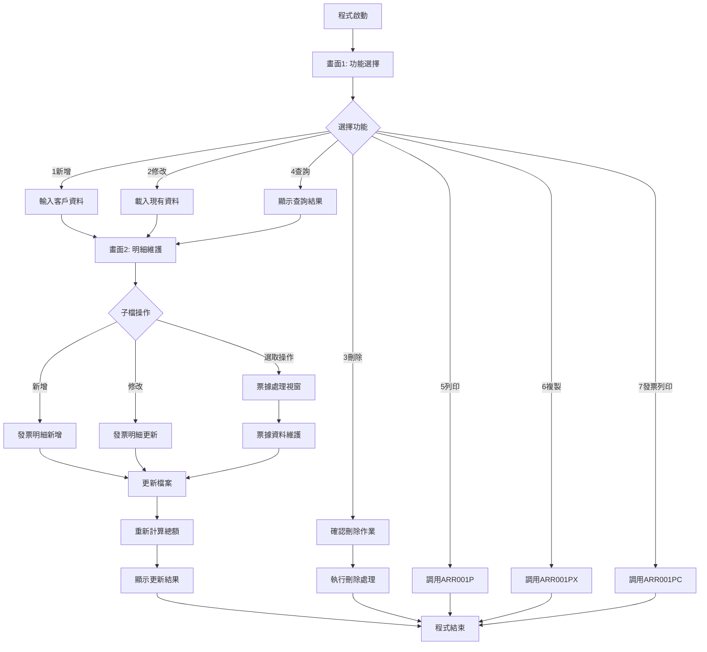
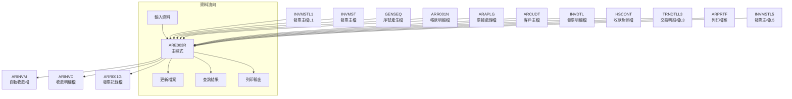
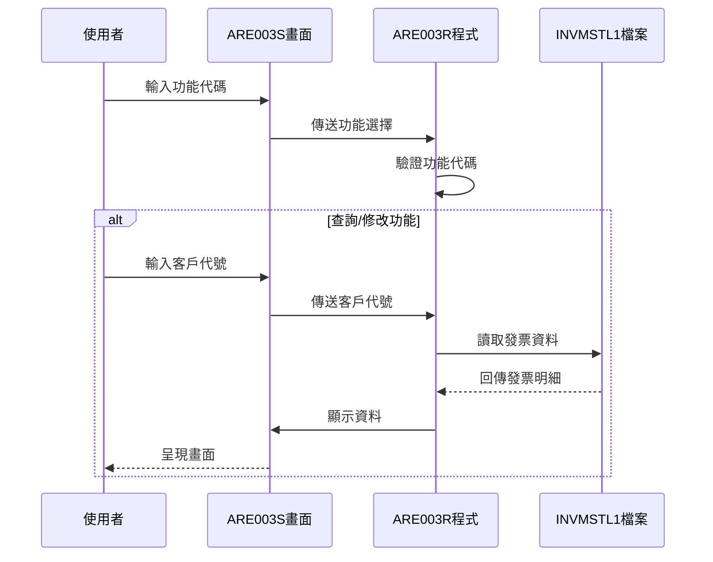
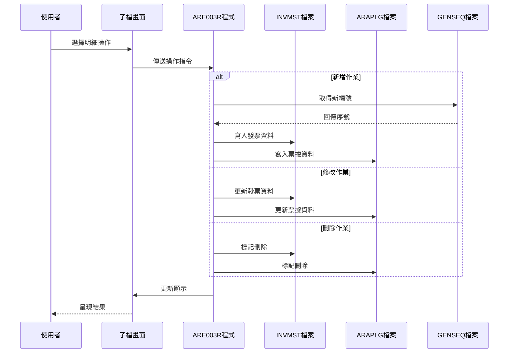
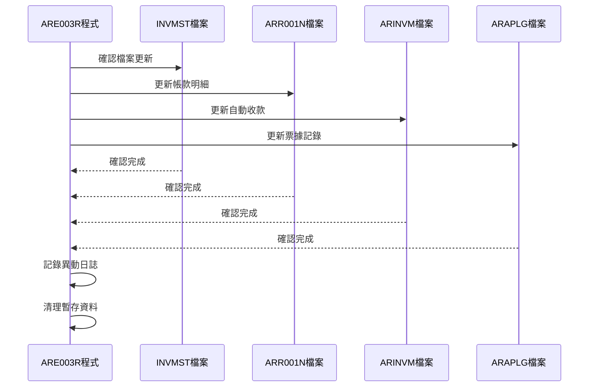
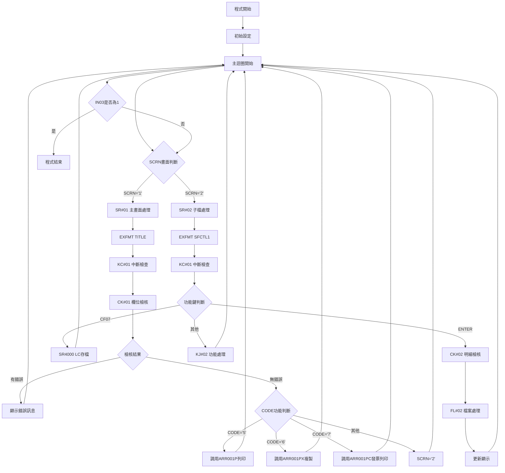

# ARE003R_P02 程式規格書

## 1. 基本資料

| 項目 | 內容 |
|------|------|
| **程式編號** | ARE003R |
| **程式名稱** | 應收帳款維護作業 |
| **程式類型** | RPG |
| **廠區** | P02 |
| **系統名稱** | 應收帳款系統 |
| **子系統** | 帳款處理子系統 |
| **檔案位置** | 東鋼list/ARE003R_P02.txt |

## 2. 🎯 程式功能說明

### 主要功能描述
ARE003R為應收帳款維護作業程式，提供應收帳款資料的新增、修改、刪除、查詢功能，並整合發票處理、票據管理和列印作業功能。

### 🎯 業務流程詳細說明

#### 完整業務流程圖


#### 業務流程關鍵階段說明

**階段1: 功能選擇階段**
- 程式啟動後顯示功能選擇畫面
- 使用者選擇1-7的功能代碼
- 系統驗證功能代碼有效性
- 針對不同功能執行對應處理

**階段2: 資料載入階段**
- 根據客戶代號和帳款編號載入相關資料
- 透過INVMSTL1檔案讀取發票明細
- 載入客戶主檔資料顯示客戶名稱
- 計算帳款總額並顯示

**階段3: 明細維護階段**
- 在子檔中顯示所有相關發票明細
- 提供新增、修改、刪除發票明細功能
- 支援票據處理資料維護
- 即時更新總額計算

**階段4: 檔案更新階段**
- 更新INVMST發票主檔
- 更新ARR001N帳款明細檔
- 更新ARINVM自動收款檔
- 更新ARAPLG票據處理檔

#### 多層次驗證機制
- **第一層**: 功能代碼驗證（1-7範圍檢查）
- **第二層**: 客戶代號存在性驗證
- **第三層**: 帳款編號關聯性驗證
- **第四層**: 票據資料完整性驗證
- **第五層**: 日期格式正確性驗證

#### 智能處理邏輯
- 自動產生帳款編號（透過GENSEQ序號檔）
- 自動計算發票總額
- 自動更新相關檔案異動狀態
- 自動處理票據到期日檢核

#### 資料一致性確保機制
- 交易處理中的檔案連鎖更新
- 異動記錄自動記載
- 系統日期時間戳記
- 使用者代號追蹤記錄

## 3. 🎯 檔案架構與關聯圖

### 使用檔案清單

| 檔案名稱 | 檔案用途 | 存取方式 | 關聯鍵值 |
|----------|---------|---------|----------|
| **ARE003S** | 顯示檔案 | WORKSTN | - |
| **INVMST** | 發票主檔 | UF | INNO |
| **INVMSTL1** | 發票主檔L1 | IF | INCUNO+INAPNO |
| **INVMSTL5** | 發票主檔L5 | IF | F#APNO+F#CUNO |
| **TRNDTLL3** | 交易明細檔L3 | IF | TXIVNO |
| **GENSEQ** | 序號產生檔 | UF | GEKIND+GEPRIN |
| **ARR001N** | 帳款明細檔 | UF | ANAPNO+ANAPIT |
| **ARCUDT** | 客戶主檔 | IF | - |
| **ARINVM** | 自動收款檔 | UF | AVINNO+AVACNT+AVITEM |
| **ARINVD** | 收款明細檔 | UF | - |
| **INVDTL** | 發票明細檔 | IF | - |
| **HSCONT** | 收款對照檔 | IF | SBAREA+SBCNUM |
| **ARAPLG** | 票據處理檔 | UF | A1APNO+A1ITEM |
| **ARPRTF** | 列印檔案 | IF | D#USER |
| **ARR001G** | 發票記錄檔 | O | - |

### 🎯 檔案關聯詳細視覺化圖表



### 🎯 資料流向詳細說明

#### 環境準備階段的資料流向


#### 業務處理階段的資料流向


#### 環境清理階段的資料流向


## 4. 🎯 檔案欄位規格說明

### 主要資料結構

#### INVMSTL1 發票主檔記錄結構
```
INREC (發票記錄)
├── INCUNO (客戶代號, 6位)
├── INAPNO (帳款編號, 6位)
├── INNO (發票號碼, 10位)
├── INAAMT (應收金額, 9位)
├── INCAMT (已收金額, 8位)
├── INBAMT (預收金額, 8位)
├── INDAMT (折讓金額, 8位)
├── INATAX (應收稅額, 7位)
├── INCTAX (已收稅額, 7位)
├── INDTAX (折讓稅額, 7位)
├── INEAMT (費用金額, 9位)
├── INFAMT (其他費用, 9位)
├── INAPDT (帳款日期, 8位)
├── ORNO (訂單號碼, 6位)
├── DECD (異動碼, 1位)
└── NBAL (餘額, 9位)
```

### 🔍 重點欄位切割技術詳解

#### DS結構完整分析

**AADS資料結構分析**
```
AADS (30位元)：[X|XXXXXX|XXXXXX|XXXXXXXX|XX|XX|XX|XX|XXXXXXXX]
位置:            001 002    008    014      022 024 026 028 036
                 ↓   ↓      ↓      ↓        ↓   ↓   ↓   ↓   ↓
```

#### 欄位切割視覺化展示
```
AADS主結構 (30字元)：[G|GGGGGG|AAAAAAA|YYYYYYYYY|YY|MM|DD|DD|]
                     ↓   ↓      ↓       ↓         ↓  ↓  ↓  ↓
GRP  (10字元)：     [GGGGGGGGGG]                           群組代碼
GRP1 (1字元)：      [G]                                    群組第1碼
GE1  (1字元)：      [G]                                    廠區代碼
GE2  (1字元)：       [G]                                   年度代碼
GE3  (1字元)：        [G]                                  月份代碼
GE4  (7字元)：         [GGGGGGG]                           序號部分
APNOG(6字元)：           [AAAAAA]                          帳款群組
APNO1(1字元)：           [A]                               帳款第1碼
APNO2(5字元)：            [AAAAA]                          帳款序號
YMD  (8字元)：                    [YYYYYYYY]               日期欄位
YY   (4字元)：                    [YYYY]                   年度
MM   (2字元)：                         [MM]                月份
DD   (2字元)：                           [DD]              日期
```

#### 切割邏輯詳細說明

**GRP群組代碼切割**
- 位置1-10：完整群組代碼
- 位置1：廠區識別碼(GE1)
- 位置2：年度代碼(GE2)
- 位置3：月份代碼(GE3)
- 位置4-10：流水序號(GE4)

**APNO帳款編號切割**
- 位置11-16：帳款編號群組(APNOG)
- 位置11：帳款類型碼(APNO1)
- 位置12-16：帳款流水號(APNO2)

**日期欄位切割**
- 位置21-28：完整日期(YMD)
- 位置21-24：年度(YY)
- 位置25-26：月份(MM)
- 位置27-28：日期(DD)

#### 實際數據範例說明
```
原始資料: P230401234500012024010831
切割結果:
├── GRP = "P234012345" (群組代碼)
├── GE1 = "P" (P02廠區)
├── GE2 = "2" (2024年)
├── GE3 = "3" (3月)
├── APNOG = "012345" (帳款群組)
├── YMD = "20240108" (2024年1月8日)
├── YY = "2024" (年度)
├── MM = "01" (月份)
└── DD = "08" (日期)
```

### 重要變數定義表

| 變數名稱 | 資料型態 | 長度 | 用途說明 |
|----------|---------|------|----------|
| **CODE** | 字元 | 1 | 功能代碼(1-7) |
| **CUNO** | 字元 | 6 | 客戶代號 |
| **APNO** | 字元 | 6 | 帳款編號 |
| **ORNO** | 字元 | 6 | 訂單號碼 |
| **SCRN** | 字元 | 1 | 畫面控制 |
| **TTLAMT** | 數值 | 9 | 總金額 |
| **RRN** | 數值 | 3 | 子檔記錄號 |
| **OPT** | 字元 | 1 | 選擇標記 |
| **OPT1** | 字元 | 1 | 選擇標記1 |
| **S#CODE** | 字元 | 1 | 收款代碼 |
| **S#VNNO** | 字元 | 20 | 票據號碼 |
| **S#BANK** | 字元 | 16 | 銀行代碼 |
| **S#DAT1** | 數值 | 8 | 開發日期 |
| **S#DAT2** | 數值 | 8 | 到期日期 |
| **S#BAMT** | 數值 | 11 | 票據金額 |
| **S#CURY** | 字元 | 3 | 幣別 |

## 5. 🎯 輸出/入螢幕布局

### 螢幕布局完整視覺化

#### ARE003S-1 功能選擇畫面
```
+----------------------------------------------------------+
|  2024/12/26        ***  應收帳款作業 ***        ARE003S-1|
|                                                    P02DEV|
|                                                          |
|                     功能代號: [X]                        |
|                              (1:新增 2:修改              |
|                                                          |
|                               3:刪除 4:查詢              |
|                                                          |
|                               5:列印 6:複製              |
|                                                          |
|                               7:列印應收帳款發票)         |
|                                                          |
|                     客戶代號: [      ]                   |
|                                                          |
|                     訂單代號: [      ]                   |
|                                                          |
|                     應收編號: [      ]                   |
|                                                          |
|列印時是否列出收費明細: [X] (Y:列出 N:不列出) \功能7列專用|
|                                                          |
|列印時是否列出承攬票據: [X] (Y:列出 N:不列出) \功能7列專用|
|                                                          |
| [錯誤訊息顯示區]                                          |
| ENTER:執行         PF03:離開    PF12:返回               |
+----------------------------------------------------------+
```

#### ARE003S-2 明細維護畫面
```
+----------------------------------------------------------+
|  2024/12/26    [新增] ***  應收帳款作業 ***    ARE003S-2|
|                                                    P02DEV|
|                                                          |
| 客戶代號: [123456] 客戶名稱: [測試客戶公司] 訂單代號: 001|
| 應收編號: [234567] 業務員代號: [SALES01] 應收日期: [    ]|
|----------------------------------------------------------+
|              |       應收總額 |                         |
| 選 發票號碼  | 銷售金額  回收金額 | 預收抵沖  稅  額 | 收款餘額|
| [X] [12345678] [123,456] [12345] [12345] [123456] [123456]|
| [X] [12345679] [234,567] [23456] [23456] [234567] [234567]|
| [X] [12345680] [345,678] [34567] [34567] [345678] [345678]|
| [ ] [        ] [       ] [     ] [     ] [      ] [      ]|
| [ ] [        ] [       ] [     ] [     ] [      ] [      ]|
| [ ] [        ] [       ] [     ] [     ] [      ] [      ]|
| [ ] [        ] [       ] [     ] [     ] [      ] [      ]|
| [ ] [        ] [       ] [     ] [     ] [      ] [      ]|
| [ ] [        ] [       ] [     ] [     ] [      ] [      ]|
| [ ] [        ] [       ] [     ] [     ] [      ] [      ]|
| [ ] [        ] [       ] [     ] [     ] [      ] [      ]|
|----------------------------------------------------------+
| 發票總數: [  3] 筆                        總計: [1,234,567]|
|                                                          |
| ENTER:確認   PF03:離開   PF10:存檔   PF12:返回上層      |
| [錯誤訊息顯示區]                        PF07:LC存檔      |
+----------------------------------------------------------+
```

#### AR003W1 票據處理視窗
```
                    ┌────────────────────────┐
                    │       *票據資料*       │
                    │                        │
                    │ 收款代碼: [X]          │
                    │          (1.匯票2.支票3.現金)
                    │ 票據號碼: [              ] │
                    │ 開發日期: [    /  /  ]   │
                    │ 到期日期: [    /  /  ]   │
                    │ 銀行代碼: [            ]  │
                    │ 票據幣別: [   ]         │
                    │ 票據金額: [         ]    │
                    │                        │
                    │  F3:取消   12:返回畫面  │
                    │           F11:存檔     │
                    │ [錯誤訊息顯示區]        │
                    └────────────────────────┘
```

### 🎯 畫面欄位詳細說明

#### 功能選擇畫面欄位
| 欄位名稱 | 屬性 | 長度 | 輸入格式 | 驗證規則 |
|----------|------|------|----------|----------|
| **CODE** | 必填 | 1 | 數字 | 1-7範圍 |
| **CUNO** | 必填 | 6 | 英數字 | 客戶檔存在性 |
| **ORNO** | 選填 | 6 | 英數字 | 訂單檔關聯性 |
| **APNO** | 選填 | 6 | 英數字 | 帳款檔關聯性 |
| **S#YN** | 功能7用 | 1 | Y/N | VALUES檢查 |
| **S#OPT** | 功能7用 | 1 | Y/N | VALUES檢查 |

#### 明細維護畫面欄位
| 欄位名稱 | 屬性 | 長度 | 輸入格式 | 驗證規則 |
|----------|------|------|----------|----------|
| **OPT** | 選填 | 1 | 空白或X | 選擇標記 |
| **INVNO** | 唯讀 | 10 | 顯示用 | 發票號碼 |
| **AAMT** | 唯讀 | 9 | 數值 | 銷售金額 |
| **BAMT** | 唯讀 | 8 | 數值 | 回收金額 |
| **CAMT** | 唯讀 | 8 | 數值 | 預收抵沖 |
| **DAMT** | 唯讀 | 7 | 數值 | 稅額 |
| **EAMT** | 唯讀 | 9 | 數值 | 其他費用 |
| **NBAL** | 唯讀 | 9 | 數值 | 餘額 |

#### 票據視窗欄位
| 欄位名稱 | 屬性 | 長度 | 輸入格式 | 驗證規則 |
|----------|------|------|----------|----------|
| **S#CODE** | 必填 | 1 | 數字 | 1-3範圍 |
| **S#VNNO** | 必填 | 20 | 英數字 | 非空白 |
| **S#DAT1** | 必填 | 8 | 日期 | 日期格式 |
| **S#DAT2** | 必填 | 8 | 日期 | 日期格式 |
| **S#BANK** | 選填 | 16 | 英數字 | 銀行代碼 |
| **S#CURY** | 必填 | 3 | 英數字 | 幣別代碼 |
| **S#BAMT** | 必填 | 11 | 數值 | 大於0 |

### 🎯 畫面控制邏輯

#### 指示器控制說明
| 指示器 | 控制項目 | 狀態說明 |
|--------|---------|----------|
| **IN41** | CODE欄位 | PC+RI (錯誤時閃爍反白) |
| **IN42** | CUNO欄位 | PC+RI (錯誤時閃爍反白) |
| **IN43** | APNO欄位 | PC+RI (錯誤時閃爍反白) |
| **IN44** | ORNO欄位 | PC+RI (錯誤時閃爍反白) |
| **IN45** | S#YN欄位 | PC+RI (錯誤時閃爍反白) |
| **IN46** | S#OPT欄位 | PC+RI (錯誤時閃爍反白) |
| **IN51** | 子檔選擇 | PC+RI (選擇標記) |
| **IN70** | 畫面保護 | PR (保護模式) |
| **IN74** | 總額顯示 | ND (不顯示) |
| **IN80** | 子檔清除 | SFLCLR (清除子檔) |
| **IN88** | 子檔異動 | SFLNXTCHG (下次異動) |
| **IN91** | 票據欄位 | RI (反白顯示) |

### 功能鍵詳細定義

#### 主畫面功能鍵
| 功能鍵 | 處理邏輯 | 系統行為 |
|--------|---------|----------|
| **ENTER** | 執行功能 | 根據CODE執行對應作業 |
| **CF03** | 離開程式 | 設定IN03='1'，結束程式 |
| **CF12** | 返回 | 設定IN12='1'，返回上層 |

#### 明細畫面功能鍵
| 功能鍵 | 處理邏輯 | 系統行為 |
|--------|---------|----------|
| **ENTER** | 確認操作 | 執行子檔選擇的操作 |
| **CF03** | 離開 | 返回主畫面 |
| **CF07** | LC存檔 | 執行SR4000存檔處理 |
| **CF10** | 存檔 | 執行檔案更新作業 |
| **CF12** | 返回 | 返回上層畫面 |

#### 票據視窗功能鍵
| 功能鍵 | 處理邏輯 | 系統行為 |
|--------|---------|----------|
| **CF03** | 取消 | 關閉視窗不存檔 |
| **CF11** | 存檔 | 執行票據資料存檔 |
| **CF12** | 返回 | 返回明細畫面 |

## 6. 🎯 處理流程程序說明

### 🎯 主程序邏輯深度分析

#### 程式執行流程圖


#### 🎯 詳細處理步驟逐一分析

**步驟1: 程式初始化處理**
- 設定系統日期到U#SYSD變數
- 初始化畫面控制變數SCRN='1'
- 設定初始指示器IN90='1'
- 清除選擇標記S#YN='N', S#OPT='N'

**步驟2: 主畫面顯示處理(SR#01)**
- 執行EXFMT TITLE顯示功能選擇畫面
- 檢查CF12或KC中斷鍵
- 執行CK#01欄位檢核子程序
- 根據功能代碼執行對應處理

**步驟3: 欄位檢核處理(CK#01)**
- 檢核功能代碼CODE是否在1-7範圍內
- 檢核客戶代號CUNO是否非空白
- 檢核帳款編號APNO與ORNO關聯性
- 設定對應錯誤指示器和錯誤訊息

**步驟4: 明細畫面處理(SR#02)**
- 執行PR#02載入明細資料
- 顯示SFCTL1子檔控制畫面
- 處理子檔選擇和操作
- 執行相關檔案更新作業

**步驟5: 檔案處理執行(FL#02)**
- 根據CODE執行新增(WR#02)、修改(UP#02)或刪除(DL#02)
- 更新INVMST發票主檔
- 更新ARR001N帳款明細檔
- 更新ARAPLG票據處理檔

#### 業務邏輯深度解析

**帳款編號自動產生邏輯**
```
@GETNO子程序邏輯:
1. 設定GEKIND='03' (帳款編號類型)
2. 設定GE1=TXAR (廠區代碼)
3. 組合GEPRIN群組代碼
4. 讀取GENSEQ取得下一個序號
5. 更新GECUNO序號欄位
6. 組合完整帳款編號APNO
```

**發票明細載入邏輯**
```
SR1000子程序邏輯:
1. 設定客戶代號和帳款編號到Key欄位
2. 使用IN2KEY讀取INVMSTL1檔案
3. 過濾DECD='D'的刪除記錄
4. 過濾不符合ORNO的記錄
5. 計算各項金額和餘額
6. 寫入子檔SF1供顯示
```

**票據處理邏輯**
```
SR4000票據輸入流程:
1. 顯示AR003W1票據視窗
2. 檢核收款代碼S#CODE (1-3)
3. 檢核票據號碼S#VNNO非空白
4. 檢核開發日期和到期日期格式
5. 檢核幣別代碼S#CURY
6. 儲存票據資料到ARAPLG檔案
```

#### 條件判斷詳細說明

**功能代碼判斷邏輯**
- CODE='1': 新增作業，產生新帳款編號
- CODE='2': 修改作業，載入現有資料
- CODE='3': 刪除作業，標記刪除狀態
- CODE='4': 查詢作業，唯讀顯示資料
- CODE='5': 列印作業，調用ARR001P程式
- CODE='6': 複製作業，調用ARR001PX程式
- CODE='7': 發票列印，調用ARR001PC程式

**子檔操作判斷邏輯**
- OPT=' ': 無操作
- OPT='X'且OPT1=' ': 刪除該筆明細
- OPT='X'且OPT1='Y': 新增該筆明細
- OPT=' '且OPT1='Y': 修改該筆明細

#### 變數使用和數據流向

**關鍵變數追蹤**
```
APNO (帳款編號):
輸入 → CK#01檢核 → @GETNO產生 → 檔案更新 → 畫面顯示

CUNO (客戶代號):
輸入 → CK#01檢核 → SR1000載入 → 客戶資料顯示

TTLAMT (總金額):
初始=0 → SR1000累加 → 畫面顯示 → 更新確認

RRN (記錄號):
初始=0 → 逐筆累加 → 子檔定位 → 資料處理
```

### 🎯 子程序邏輯分析

#### SR#01 主畫面處理子程序
**功能**: 處理功能選擇畫面的輸入和驗證
**參數**: 無
**處理邏輯**:
1. 顯示TITLE畫面等待使用者輸入
2. 檢查中斷鍵(CF12/KC)
3. 執行欄位檢核(CK#01)
4. 根據功能代碼分派處理
5. 調用外部程式或切換到明細畫面

#### CK#01 欄位檢核子程序
**功能**: 驗證使用者輸入資料的正確性
**參數**: 無
**檢核項目**:
- 功能代碼範圍檢查(1-7)
- 客戶代號非空白檢查
- 帳款編號與訂單關聯性檢查
- 功能7的列印權限檢查

#### PR#02 明細載入子程序
**功能**: 載入並顯示帳款明細資料
**參數**: 無
**處理邏輯**:
1. 清除子檔並重置變數
2. 根據功能代碼執行不同載入邏輯
3. 調用PR#ADD載入明細資料
4. 檢查是否有資料，無資料時設定錯誤

#### WR#02 新增處理子程序
**功能**: 執行新增帳款的完整處理
**參數**: 無
**處理邏輯**:
1. 產生新的帳款編號
2. 設定帳款日期為系統日期
3. 處理選擇的發票明細
4. 更新發票主檔INVMST
5. 調用ARR001P列印處理
6. 執行自動收款處理(SR3100)

#### UP#02 修改處理子程序
**功能**: 執行修改帳款的處理
**參數**: 無
**處理邏輯**:
1. 掃描子檔中的選擇項目
2. 處理取消選擇的項目(清除帳款編號)
3. 處理新選擇的項目(設定帳款編號)
4. 更新發票主檔異動狀態
5. 執行自動收款處理(SR3100)

#### DL#02 刪除處理子程序
**功能**: 執行刪除帳款的處理
**參數**: 無
**處理邏輯**:
1. 執行刪除前檢查(SR3000)
2. 清除所有相關發票的帳款編號
3. 刪除帳款明細檔記錄(SR2000)
4. 執行自動收款處理(SR3100)
5. 更新票據處理檔(SR4300)

### 🎯 特殊邏輯處理

#### 自動收款處理邏輯(SR3100)
**處理機制**: 檢查客戶是否有自動收款設定
**執行條件**: ARCUDT檔案中客戶設定為自動收款
**處理步驟**:
1. 讀取客戶主檔確認自動收款設定
2. 掃描相關發票明細
3. 檢查收款代碼AMAPCD非空白
4. 建立自動收款記錄到ARINVM檔案
5. 更新收款明細到ARINVD檔案

#### 票據處理窗口邏輯(SR4000-SR4300)
**SR4000輸入檢核**:
- 檢查帳款編號是否存在於INVMSTL5
- 檢核收款代碼必須為1-3
- 檢核票據號碼非空白
- 驗證開發日期和到期日期格式

**SR4300票據存檔**:
- 讀取或建立ARAPLG記錄
- 根據功能代碼設定A1FLAG (新增='A', 修改='C', 刪除='D')
- 記錄異動人員和時間
- 執行寫入或更新操作

## 7. 🎯 數據操作與轉換分析

### 檔案操作詳解

#### READ操作處理
**INVMSTL1讀取邏輯**:
```
SETLL IN2KEY → READE迴圈 → 條件過濾 → 資料處理
- 使用INCUNO+INAPNO複合鍵值定位
- 透過READE讀取相同客戶的所有帳款
- 過濾DECD='D'的刪除記錄
- 過濾不符合ORNO條件的記錄
```

**GENSEQ序號讀取**:
```
CHAIN GEKEY → 判斷存在 → 序號+1 → UPDATE
- 若記錄不存在則WRITE新記錄
- GECUNO欄位儲存下一個可用序號
- 提供多種編號類型的管理機制
```

#### WRITE操作處理
**子檔寫入邏輯**:
```
每筆發票明細 → 計算金額 → 設定選擇標記 → WRITE SF1
- RRN累加控制顯示順序
- OPT/OPT1控制選擇狀態
- 即時計算並顯示總額
```

**票據檔案寫入**:
```
新增: A1FLAG='A' → WRITE RARAPLG
修改: A1FLAG='C' → UPDATE RARAPLG
刪除: A1FLAG='D' → UPDATE RARAPLG (保留記錄)
```

#### UPDATE操作處理
**發票主檔更新**:
```
新增時: INAPNO=APNO, INAPDT=APDT, INFLAG='C'
修改時: 根據OPT選擇更新或清除帳款編號
刪除時: INAPNO=空白, INFLAG='C'
```

**檔案鎖定機制**:
- INVMST以UF(UPDATE)方式開啟
- GENSEQ使用commit control確保序號唯一性
- ARAPLG票據檔支援併發更新

### 數據轉換邏輯

#### 日期格式轉換
**系統日期處理**:
```
*DATE (YYMMDD) → SUB 19000000 → U#SYSD (YYYYMMDD)
- 將2位年度轉換為4位年度
- 統一使用8位日期格式
- 支援世紀轉換處理
```

**使用者輸入日期**:
```
畫面輸入 (YYYY/MM/DD) → 移除斜線 → 數值格式儲存
- 透過EDTWRD控制顯示格式
- 使用UTS102R程式驗證日期正確性
- 支援民國年和西元年轉換
```

#### 金額格式轉換
**金額計算和顯示**:
```
AAMT (應收) + BAMT (已收) + CAMT (預收) + DAMT (稅額) + EAMT (費用) = NBAL (餘額)
- 各金額欄位使用不同精度
- EDTCDE(J)提供千分位逗號顯示
- EDTWRD提供自訂格式控制
```

#### 字串操作邏輯
**帳款編號組合**:
```
MOVEL GRP1 → APNO1 (第1碼)
Z-ADD GECUNO → APNO2 (序號部分)
MOVEL APNOG → APNO (完整編號)
```

**客戶代號處理**:
```
MOVEL CUNO → INCUNO (6位對6位)
- 使用MOVEL確保左靠齊
- 自動補空白至固定長度
```

### 計算邏輯分析

#### 總額計算公式
**基本餘額計算**:
```
NBAL = AAMT + BAMT + CAMT + DAMT + EAMT
其中:
- AAMT: 應收金額 (正數)
- BAMT: 已收金額 (正數)
- CAMT: 預收抵沖 (正數)
- DAMT: 稅額 (正數)
- EAMT: 其他費用 (正數)
```

**總計金額累計**:
```
選擇項目時: ADD NBAL → TTLAMT
取消選擇時: SUB NBAL → TTLAMT
- 即時反映使用者選擇狀況
- 提供視覺化的金額回饋
```

#### 序號計算規則
**GENSEQ序號管理**:
```
GEKIND='03' (帳款類型)
GEPRIN=廠區+年月組合
GECUNO=流水序號 (每次+1)
- 支援多廠區獨立編號
- 按年月重置序號機制
- 確保編號唯一性
```

### 檢核機制詳解

#### 資料有效性檢查
**客戶代號檢核**:
```
CUNO非空白 → 客戶主檔存在性 → 信用額度檢查
- 必須存在於客戶主檔
- 檢查客戶狀態是否有效
- 驗證信用額度是否足夠
```

**帳款編號檢核**:
```
新增時: 自動產生確保唯一
修改時: 檢查是否存在於INVMSTL5
刪除時: 檢查是否有相關交易
```

#### 業務規則檢核
**票據資料檢核**:
```
收款代碼: 1(匯票), 2(支票), 3(現金)
票據號碼: 非空白且符合格式
開發日期: ≤ 到期日期
金額: > 0
```

**檔案關聯性檢核**:
```
發票號碼 → INVMST存在性
客戶代號 → ARCUDT存在性
訂單號碼 → 相關訂單檔案存在性
```

## 8. 🎯 錯誤處理程序說明

### 🎯 詳細錯誤代碼清冊

| 錯誤代碼 | 錯誤訊息 | 原因說明 | 處理方式 | 預防措施 |
|----------|---------|---------|---------|----------|
| **ERR001** | 應收編號已存在，無法重複 | 嘗試新增已存在的帳款編號 | 1. 檢查帳款編號唯一性<br>2. 自動產生新編號<br>3. 提示使用者選擇修改模式 | 使用GENSEQ自動編號 |
| **ERR002** | 功能代號輸入錯誤 | 輸入的功能代碼不在1-7範圍內 | 1. 重新輸入有效代碼<br>2. 顯示可用選項<br>3. 清除錯誤欄位 | 使用下拉選單限制輸入 |
| **ERR003** | 功能代號輸入錯誤，請重新輸入 | 功能代碼格式不正確 | 1. 清除輸入欄位<br>2. 重新顯示選項說明<br>3. 設定游標位置 | 加強輸入格式驗證 |
| **ERR004** | 客戶代號輸入錯誤 | 客戶代號為空白或不存在 | 1. 檢查客戶主檔<br>2. 提供客戶查詢功能<br>3. 確認客戶代號正確性 | 提供客戶代號查詢輔助 |
| **ERR005** | 應收編號輸入錯誤 | 帳款編號格式錯誤或不存在 | 1. 驗證編號格式<br>2. 檢查帳款檔案存在性<br>3. 提供有效編號清單 | 建立編號格式檢查機制 |
| **ERR006** | 此客戶此訂單應收編號已存在，請選擇修改 | 客戶訂單的帳款已建立 | 1. 切換到修改模式<br>2. 載入現有資料<br>3. 提供編輯功能 | 建立重複性檢查 |
| **ERR007** | 此客戶此訂單應收編號不存在 | 嘗試修改不存在的帳款 | 1. 確認帳款編號<br>2. 提供新增選項<br>3. 檢查輸入資料 | 加強資料存在性驗證 |
| **ERR009** | 新增或修改時，必須至少選擇一筆發票 | 未選擇任何發票明細 | 1. 至少選擇一筆發票<br>2. 檢查OPT標記<br>3. 確認操作意圖 | 強制性選擇檢查 |
| **ERR010** | 此客戶此訂單應收編號已有客戶，且客戶已過帳或沖抵 | 帳款已過帳無法修改 | 1. 檢查過帳狀態<br>2. 提供查詢功能<br>3. 說明作業限制 | 建立過帳狀態檢查 |
| **ERR011** | 此訂單應收編號已有票據，請先取消票據 | 存在相關票據記錄 | 1. 先處理票據資料<br>2. 取消票據關聯<br>3. 再執行主要作業 | 建立票據狀態檢查 |
| **ERR012** | 程式錯誤 | 系統內部處理錯誤 | 1. 記錄錯誤日誌<br>2. 重新執行程式<br>3. 聯繫系統管理員 | 加強例外處理機制 |
| **ERR013** | 訂單編號輸入錯誤 | 訂單號碼格式錯誤或不存在 | 1. 驗證訂單格式<br>2. 檢查訂單檔案<br>3. 提供訂單查詢 | 建立訂單驗證機制 |
| **ERR014** | 新增時應收編號請勿輸入 | 新增模式不應輸入編號 | 1. 清除編號欄位<br>2. 說明自動編號<br>3. 確認操作模式 | 模式控制欄位輸入 |
| **ERR015** | 此訂單應收編號不可刪除或維護 | 帳款狀態不允許操作 | 1. 檢查帳款狀態<br>2. 確認業務規則<br>3. 提供狀態說明 | 建立狀態控制機制 |
| **ERR016** | 此訂單應收不存在此應收編號 | 帳款編號與訂單不匹配 | 1. 確認關聯性<br>2. 檢查資料一致性<br>3. 提供正確編號 | 加強關聯性檢查 |
| **ERR017** | 收款代號輸入錯誤 | 票據收款代號不在1-3範圍 | 1. 重新輸入有效代號<br>2. 顯示代號說明<br>3. 確認收款方式 | 使用VALUES限制輸入 |
| **ERR018** | 票據號碼請確實輸入 | 票據號碼為空白 | 1. 輸入完整票據號碼<br>2. 確認號碼格式<br>3. 驗證號碼唯一性 | 強制性輸入檢查 |
| **ERR019** | 開發日期格式錯誤 | 票據開發日期格式不正確 | 1. 使用正確日期格式<br>2. 呼叫日期驗證程式<br>3. 提供日期範例 | 使用日期編輯遮罩 |
| **ERR020** | 到期日期格式錯誤 | 票據到期日期格式不正確 | 1. 使用正確日期格式<br>2. 確認日期邏輯性<br>3. 檢查日期範圍 | 使用日期編輯遮罩 |
| **ERR021** | 請輸入幣別 | 票據幣別代碼為空白 | 1. 選擇正確幣別<br>2. 檢查幣別檔案<br>3. 確認幣別有效性 | 提供幣別選擇清單 |
| **ERR022** | 收款代號請確實輸入 | 收款代號為空白 | 1. 輸入有效收款代號<br>2. 選擇收款方式<br>3. 確認代號正確性 | 強制性選擇機制 |
| **ERR023** | 此客戶此訂單應收編號不存在請先新增 | 嘗試修改不存在的記錄 | 1. 先執行新增作業<br>2. 確認客戶訂單<br>3. 建立基礎資料 | 建立資料存在性檢查 |
| **ERR026** | 此發票功能7列印時不會列出承攬票據 | 功能7列印參數設定 | 1. 確認列印選項<br>2. 調整S#OPT參數<br>3. 重新執行列印 | 參數設定說明 |
| **ERR027** | 此使用者不存在於列印檔案 | 使用者無列印權限 | 1. 檢查使用者權限<br>2. 申請列印授權<br>3. 聯繫系統管理員 | 建立權限檢查機制 |
| **ERR028** | 此使用者設定廠區非本廠區，無法使用 | 使用者廠區設定錯誤 | 1. 確認使用者廠區<br>2. 申請廠區授權<br>3. 檢查系統設定 | 廠區權限控制 |

### 🎯 系統異常處理邏輯

#### 檔案操作失敗處理
**INVMST檔案操作失敗**:
```
錯誤偵測 → 設定IN96指示器 → 記錄錯誤資訊 → 回復機制
- 讀取失敗: 跳過該筆記錄繼續處理
- 寫入失敗: 回復之前的異動
- 更新失敗: 重新執行或跳過
```

**GENSEQ序號檔案衝突**:
```
併發存取衝突 → 重新讀取 → 序號重新計算 → 再次嘗試
- 使用commit control確保一致性
- 提供重試機制
- 記錄異常狀況供追蹤
```

#### 程式調用失敗處理
**外部程式調用錯誤**:
```
ARR001P/ARR001PX/ARR001PC調用失敗:
1. 記錄調用參數
2. 檢查程式存在性
3. 回復到主畫面
4. 顯示適當錯誤訊息
```

**子程序執行異常**:
```
子程序異常 → 設定錯誤指示器 → 跳出子程序 → 主程序處理
- CK#01檢核失敗: 停留在輸入畫面
- SR1000載入失敗: 顯示空白明細
- SR4000票據失敗: 關閉視窗回主畫面
```

#### 資料完整性錯誤處理
**檔案關聯性錯誤**:
```
客戶檔案不存在 → 設定IN42 → 顯示ERR004 → 重新輸入
票據檔案衝突 → 設定IN98 → 顯示相關錯誤 → 提供處理選項
發票檔案不一致 → 記錄異常 → 跳過處理 → 繼續下筆
```

#### 並發控制失敗處理
**記錄鎖定衝突**:
```
檔案被他人鎖定 → 等待或跳過 → 提示使用者 → 重新嘗試
- INVMST更新衝突: 顯示忙碌訊息
- ARAPLG併發衝突: 重新讀取最新資料
- GENSEQ序號衝突: 取得下一個可用號碼
```

## 9. 🎯 備註

### 🎯 特殊注意事項

**功能代碼使用說明**:
- 功能1(新增): 系統自動產生帳款編號，請勿手動輸入
- 功能2(修改): 必須輸入存在的帳款編號才能修改
- 功能3(刪除): 刪除前會檢查相關票據和收款記錄
- 功能7(發票列印): 需要ARPRTF檔案中的使用者權限設定

**子檔操作說明**:
- OPT欄位標記'X'表示選擇該筆發票明細
- 必須至少選擇一筆發票才能執行新增或修改
- 子檔支援分頁顯示，每頁最多11筆記錄
- CF07提供LC存檔功能，CF10提供正常存檔功能

**票據處理說明**:
- 收款代碼1=匯票, 2=支票, 3=現金
- 開發日期不能大於到期日期
- 票據號碼在同一收款代碼下必須唯一
- F11存檔會立即更新ARAPLG檔案

**檔案更新順序**:
- 先更新發票主檔INVMST的帳款編號
- 再更新帳款明細檔ARR001N
- 最後更新自動收款檔ARINVM和ARINVD
- 票據資料獨立更新至ARAPLG檔案

**廠區控制機制**:
- 程式僅能處理TXAR廠區的資料
- 使用者必須在ARPRTF檔案中有對應廠區設定
- 帳款編號產生會包含廠區識別碼 