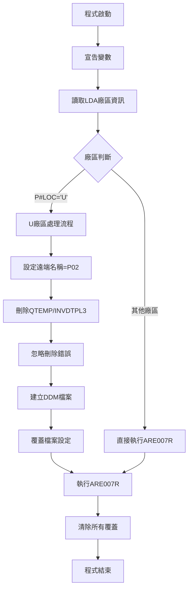
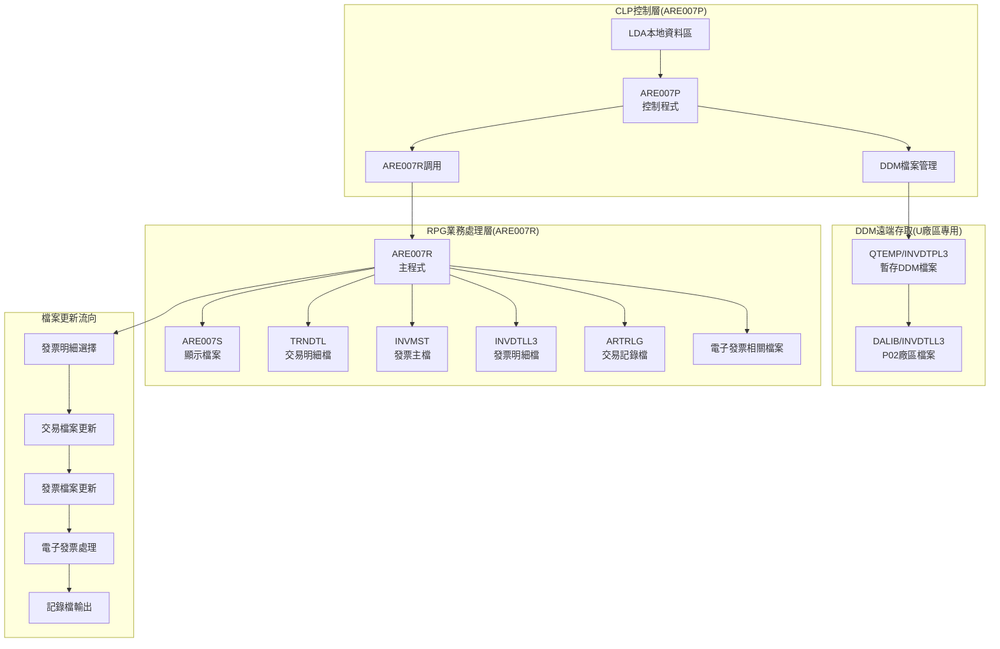
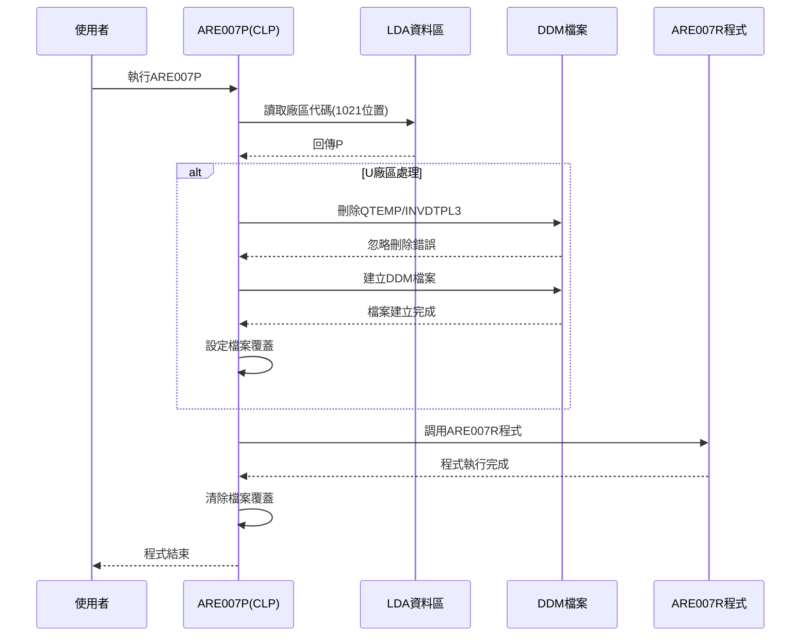
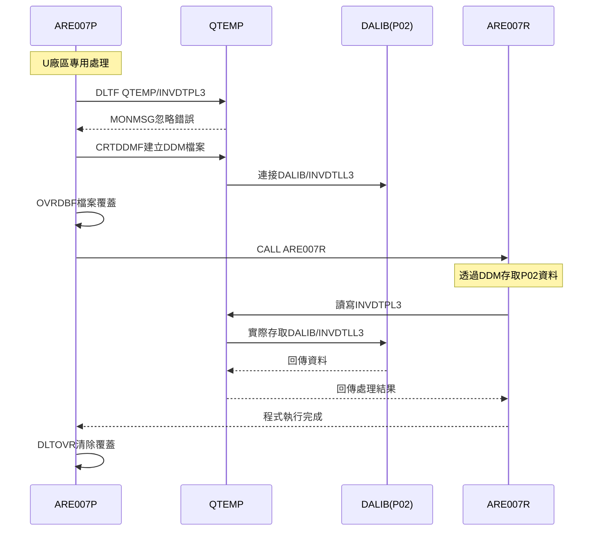
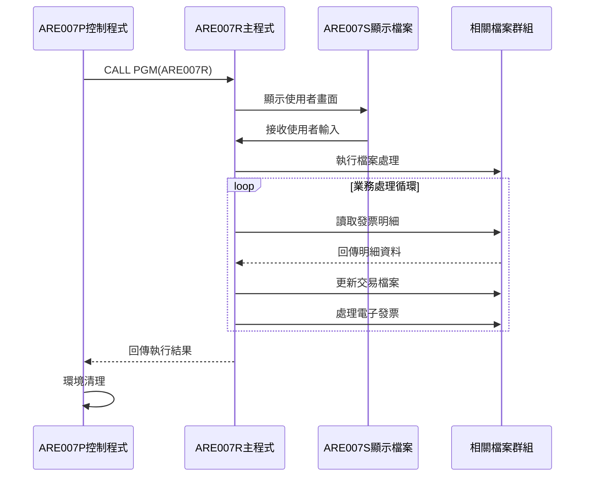
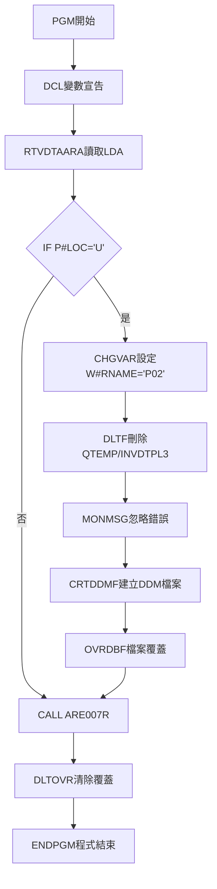
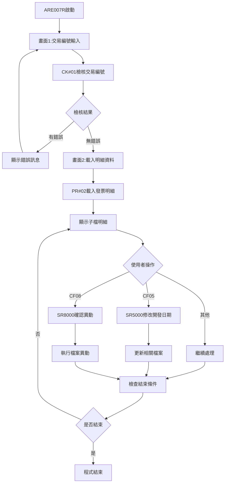

# ARE007P_P02 程式規格書

## 1. 基本資料

| 項目 | 內容 |
|------|------|
| **程式編號** | ARE007P |
| **程式名稱** | 銷售配銷作業程式(控制程式) |
| **程式類型** | CLP |
| **廠區** | P02 |
| **系統名稱** | 應收帳款系統 |
| **子系統** | 銷售配銷子系統 |
| **檔案位置** | 東鋼list/ARE007P_P02.txt |

## 2. 🎯 程式功能說明

### 主要功能描述
ARE007P為銷售配銷作業的CLP控制程式，主要負責執行環境準備、DDM檔案管理和調用ARE007R主要業務邏輯程式。程式提供跨廠區的檔案存取機制，特別為U廠區提供P02廠區檔案的遠端存取功能。

### 🎯 業務流程詳細說明

#### 完整業務流程圖


#### 業務流程關鍵階段說明

**階段1: 環境初始化階段**
- 宣告三個工作變數：廠區代碼、遠端名稱、發票號碼
- 從LDA (Local Data Area) 1021位置讀取廠區代碼
- 根據廠區代碼決定後續處理邏輯

**階段2: DDM檔案管理階段(U廠區專用)**
- 檢查廠區代碼是否為'U'
- 設定遠端連線名稱為'P02'廠區
- 刪除暫存DDM檔案以避免衝突
- 建立新的DDM檔案連接到P02廠區
- 設定檔案覆蓋確保正確檔案存取

**階段3: 主程式執行階段**
- 調用ARE007R銷售配銷主要業務程式
- 傳遞已設定的環境參數
- 等待ARE007R程式執行完成

**階段4: 環境清理階段**
- 刪除所有檔案覆蓋設定
- 確保系統環境回復原始狀態
- 程式正常結束

#### 跨廠區存取機制
- **本地存取**: 非U廠區直接存取本地檔案
- **遠端存取**: U廠區透過DDM存取P02廠區檔案
- **檔案映射**: INVDTPL3檔案映射到DALIB/INVDTLL3
- **安全控制**: 使用SECURE(*YES)確保檔案安全

## 3. 🎯 檔案架構與關聯圖

### 直接使用檔案清單

| 檔案名稱 | 檔案用途 | 存取方式 | 關聯說明 |
|----------|---------|---------|----------|
| **LDA** | 本地資料區 | 讀取 | 取得廠區代碼資訊 |
| **QTEMP/INVDTPL3** | 暫存DDM檔案 | 建立/刪除 | U廠區專用檔案橋接 |
| **DALIB/INVDTLL3** | 遠端發票明細檔 | 遠端存取 | P02廠區原始檔案 |

### 間接控制檔案清單(透過ARE007R)

| 檔案名稱 | 檔案用途 | 存取方式 | 關聯鍵值 |
|----------|---------|---------|----------|
| **ARE007S** | 顯示檔案 | WORKSTN | - |
| **TRNDTL** | 交易明細檔 | UF | TXCODE+TXNO+TXITEM |
| **INVMST** | 發票主檔 | UF | IVNO |
| **INVDTLL3** | 發票明細檔L3 | UF | IVNO+IVACNT+IVITEM |
| **INVDTPL3** | 發票明細檔P3 | IF | IVNO+IVACNT+IVITEM |
| **ARTRLG** | 交易記錄檔 | O | - |
| **ARDSDTL4** | 銷售明細檔L4 | UF | - |
| **INETRN** | 電子發票檔 | UF | - |
| **INETRNG** | 電子發票群組檔 | O | - |
| **INVTFR** | 發票轉檔 | IF | - |

### 🎯 檔案關聯詳細視覺化圖表



### 🎯 資料流向詳細說明

#### 環境準備階段的資料流向


#### DDM檔案處理的資料流向


#### 程式調用控制的資料流向


## 4. 🎯 程式變數規格說明

### CLP變數定義表

| 變數名稱 | 資料型態 | 長度 | 用途說明 | 使用範圍 |
|----------|---------|------|----------|----------|
| **&W#RNAME** | CHAR | 20 | 遠端系統名稱 | 設定為'P02'廠區標識 |
| **&P#LOC** | CHAR | 1 | 廠區代碼 | 從LDA讀取，判斷處理邏輯 |
| **&P#IVNO** | CHAR | 10 | 發票號碼 | 預留變數，程式中未使用 |

### LDA資料區結構

| 位置 | 長度 | 欄位用途 | 資料格式 |
|------|------|---------|----------|
| **1021** | 1 | 廠區代碼 | 字元 |

### 檔案操作參數

#### DDM檔案建立參數
```
CRTDDMF FILE(QTEMP/INVDTPL3) 
        RMTFILE(DALIB/INVDTLL3)
        RMTLOCNAME(&W#RNAME *SNA)
```

#### 檔案覆蓋參數
```
OVRDBF FILE(INVDTPL3) 
       TOFILE(QTEMP/INVDTPL3) 
       SECURE(*YES)
```

### 重要處理邏輯

#### 廠區判斷邏輯
```
IF COND(&P#LOC *EQ 'U') THEN(DO)
  [U廠區專用處理]
ENDDO
```

#### 錯誤處理機制
```
MONMSG MSGID(CPF0000)
- 監控所有CPF開頭的錯誤訊息
- 確保檔案刪除錯誤不中斷程式執行
```

## 5. 🎯 輸出/入螢幕布局

### 螢幕布局完整視覺化

**注意**: ARE007P為CLP控制程式，本身沒有使用者介面。所有畫面操作都由ARE007R程式提供。

#### ARE007S-1 交易編號輸入畫面
```
+----------------------------------------------------------+
|  2024/12/26        *** 銷售配銷作業 ***        ARE007S-1|
|                                                    P02DEV|
|                                                          |
|                                                          |
|                                                          |
|                                                          |
|                                                          |
|                     交易編號: [      ]                  |
|                                                          |
|                                                          |
|                                                          |
|                                                          |
|                                                          |
|                                                          |
|                                                          |
|                                                          |
|                                                          |
|                                                          |
|                                                          |
|                                                          |
|                                                          |
| [錯誤訊息顯示區]                                         |
| ENTER:執行         PF03:離開                            |
+----------------------------------------------------------+
```

#### ARE007S-2 發票明細處理畫面
```
+----------------------------------------------------------+
|  2024/12/26    [確認] *** 銷售配銷作業 ***     ARE007S-2|
|                                                    P02DEV|
|                                                          |
| 交易編號: [TX0001] 異動類型: [1] [客戶異動  ] |
| 客戶代號: [123456] 客戶名稱: [測試客戶公司  ] 訂單編號: [001234]|
| 開發日期: [2024/03/15] 確認日期: [2024/03/16] 入帳年月: [2024/03]|
|----------------------------------------------------------+
| 項次 發票號碼  帳 品名   數量     單價      金額      稅額 原因 標|
| [  1] [1234567890] [1] [12345] [ 1,000] [12.345] [12,345] [1,234] [1] [A]|
| [  2] [2345678901] [2] [23456] [ 2,000] [23.456] [23,456] [2,345] [2] [B]|
| [  3] [3456789012] [3] [34567] [ 3,000] [34.567] [34,567] [3,456] [3] [C]|
| [   ] [          ] [ ] [     ] [      ] [      ] [      ] [     ] [ ] [ ]|
| [   ] [          ] [ ] [     ] [      ] [      ] [      ] [     ] [ ] [ ]|
| [   ] [          ] [ ] [     ] [      ] [      ] [      ] [     ] [ ] [ ]|
| [   ] [          ] [ ] [     ] [      ] [      ] [      ] [     ] [ ] [ ]|
| [   ] [          ] [ ] [     ] [      ] [      ] [      ] [     ] [ ] [ ]|
| [   ] [          ] [ ] [     ] [      ] [      ] [      ] [     ] [ ] [ ]|
| [   ] [          ] [ ] [     ] [      ] [      ] [      ] [     ] [ ] [ ]|
|----------------------------------------------------------+
|                          總計: [  123,456] [  12,345] |
| [錯誤訊息顯示區]                                         |
| F03:離開 F05:修改開發日期 F08:確認異動 F12:返回上層     |
+----------------------------------------------------------+
```

#### AR07F3 開發日期修改視窗
```
                  ┌──────────────────────────┐
                  │                          │
                  │                          │
                  │ 開發日期: [    /  /  ]   │
                  │                          │
                  │ 是否變更工廠設定同步: [X] (Y) │
                  │                          │
                  │ 確認稅率異動稅率為零: [X] (Y) │
                  │ [錯誤訊息顯示區]          │
                  │ 功能選項: F3,F12=返回畫面 │
                  └──────────────────────────┘
```

#### AR07F4 確認異動視窗
```
                  ┌──────────────────────────┐
                  │                          │
                  │                          │
                  │ 確認異動編號: [TX0001]   │
                  │                          │
                  │ 是否變更工廠設定同步: [X] (Y) │
                  │                          │
                  │ 確認稅率異動稅率為零: [X] (Y) │
                  │ [錯誤訊息顯示區]          │
                  │ 功能選項: F3,F12=返回畫面 │
                  └──────────────────────────┘
```

### 🎯 畫面欄位詳細說明

#### 主畫面欄位(ARE007S-1)
| 欄位名稱 | 屬性 | 長度 | 輸入格式 | 驗證規則 |
|----------|------|------|----------|----------|
| **NO** | 必填 | 6 | 英數字 | 交易編號存在性檢查 |

#### 明細畫面欄位(ARE007S-2)
| 欄位名稱 | 屬性 | 長度 | 輸入格式 | 驗證規則 |
|----------|------|------|----------|----------|
| **INVOX** | 修改 | 10 | 英數字 | 發票號碼格式檢查 |
| **ACNT** | 修改 | 1 | 數字 | 帳務代碼驗證 |
| **PDNM** | 修改 | 5 | 英數字 | 品名代碼檢查 |
| **QTY** | 修改 | 7 | 數值 | 數量大於0檢查 |
| **UPRC** | 修改 | 5.3 | 數值 | 單價格式驗證 |
| **AMT** | 修改 | 9 | 數值 | 金額計算驗證 |
| **TAX** | 修改 | 9 | 數值 | 稅額計算驗證 |
| **WHY** | 修改 | 1 | 選擇 | 1-9或空白 |
| **FLAG** | 修改 | 1 | 英數字 | 處理旗標 |

#### 視窗欄位
| 欄位名稱 | 屬性 | 長度 | 輸入格式 | 驗證規則 |
|----------|------|------|----------|----------|
| **S@YMDA** | 修改 | 8 | 日期 | 日期格式驗證 |
| **S@YN** | 修改 | 1 | Y/空白 | 選項檢查 |
| **S@YN1** | 修改 | 1 | Y/空白 | 選項檢查 |
| **S1YN** | 修改 | 1 | Y/空白 | 選項檢查 |
| **S1YN1** | 修改 | 1 | Y/空白 | 選項檢查 |

### 功能鍵詳細定義

#### 主畫面功能鍵
| 功能鍵 | 處理邏輯 | 系統行為 |
|--------|---------|----------|
| **ENTER** | 執行交易查詢 | 載入交易明細資料 |
| **CF03** | 離開程式 | 結束程式執行 |

#### 明細畫面功能鍵
| 功能鍵 | 處理邏輯 | 系統行為 |
|--------|---------|----------|
| **CF03** | 離開 | 回到主畫面 |
| **CF05** | 修改開發日期 | 顯示日期修改視窗 |
| **CF08** | 確認異動 | 顯示確認視窗 |
| **CF12** | 返回上層 | 回到主畫面 |

## 6. 🎯 處理流程程序說明

### 🎯 主程序邏輯深度分析

#### CLP程式執行流程圖


#### 🎯 詳細處理步驟逐一分析

**步驟1: 程式初始化**
- 執行PGM指令開始程式
- 宣告三個CLP變數
- 設定變數型態和長度

**步驟2: 環境資訊取得**
- 使用RTVDTAARA讀取LDA第1021位置的廠區代碼
- 將讀取的廠區代碼存入&P#LOC變數
- 準備進行廠區判斷邏輯

**步驟3: 廠區邏輯判斷**
- 檢查&P#LOC是否等於'U'
- 如果是U廠區則執行DDM檔案處理
- 如果非U廠區則跳過DDM處理

**步驟4: DDM檔案管理(U廠區專用)**
- 設定遠端名稱變數為'P02'
- 刪除可能存在的舊DDM檔案
- 使用MONMSG忽略刪除時的錯誤
- 建立新的DDM檔案連接
- 設定檔案覆蓋和安全參數

**步驟5: 主程式調用**
- 調用ARE007R執行實際業務邏輯
- 等待ARE007R程式執行完成
- 接收程式回傳結果

**步驟6: 環境清理**
- 使用DLTOVR清除所有檔案覆蓋
- 確保系統環境回復正常狀態
- 執行ENDPGM正常結束程式

### 🎯 核心邏輯機制分析

#### DDM檔案建立機制
```
處理邏輯:
1. 檢查廠區代碼
2. 設定遠端系統名稱
3. 清理舊有檔案
4. 建立DDM連接
5. 設定安全覆蓋
```

#### 錯誤處理機制
```
MONMSG MSGID(CPF0000)
- 監控所有CPF系列錯誤
- 忽略檔案刪除失敗錯誤
- 確保程式繼續執行
```

#### 檔案覆蓋機制
```
OVRDBF設定:
- FILE(INVDTPL3): 邏輯檔案名稱
- TOFILE(QTEMP/INVDTPL3): 實際檔案位置
- SECURE(*YES): 啟用安全保護
```

### ARE007R主程式邏輯(由CLP調用)

#### 主要處理流程


#### 檔案更新邏輯
**TRNDTL交易明細檔處理**:
- 更新交易旗標TXFLAG='C'
- 清除處理旗標TXFL01和TXFL02
- 設定異動日期TXTXDT
- 清除帳款日期TXACDT和帳款年月TXACYM

**INVMST發票主檔處理**:
- 根據異動類型更新不同金額欄位
- 計算發票餘額INNBAL
- 設定結清旗標INFL01
- 更新處理旗標INFLAG='C'

**電子發票相關處理**:
- 調用ARS002R處理電子發票相關作業
- 傳遞交易編號和發票號碼參數

## 7. 🎯 錯誤處理程序說明

### 🎯 CLP層錯誤處理

#### 系統錯誤監控
```
MONMSG MSGID(CPF0000)
- 監控範圍: 所有CPF開頭的系統錯誤
- 處理方式: 忽略錯誤繼續執行
- 適用場景: 檔案刪除、覆蓋操作
```

#### DDM相關錯誤
| 錯誤類型 | 可能原因 | 處理方式 |
|----------|---------|----------|
| **檔案不存在** | QTEMP/INVDTPL3未建立 | MONMSG忽略錯誤 |
| **連線失敗** | 遠端系統無法連接 | 錯誤會中斷程式 |
| **權限不足** | 缺乏DDM建立權限 | 錯誤會中斷程式 |
| **檔案鎖定** | 其他使用者佔用檔案 | 錯誤會中斷程式 |

### 🎯 ARE007R業務邏輯錯誤(部分清單)

| 錯誤代碼 | 錯誤訊息 | 原因說明 | 處理方式 |
|----------|---------|---------|---------|
| **ERR001** | 請確認功能代號輸入錯誤 | 功能代碼不正確 | 重新輸入正確代碼 |
| **ERR002** | 請確認功能代號輸入錯誤，請重新輸入 | 功能代碼格式錯誤 | 清除後重新輸入 |
| **ERR003** | 請確認主新增時，交易編號請勿輸入 | 新增模式不能有編號 | 清除交易編號欄位 |
| **ERR004** | 請確認此訂單交易編號已存在 | 交易編號重複 | 使用不同編號 |
| **ERR005** | 請確認此訂單交易編號已確認，請先取消 | 交易已確認無法修改 | 先執行取消作業 |
| **ERR006** | 請確認此訂單交易編號已確認，請先刪除 | 交易已確認無法刪除 | 先執行取消作業 |
| **ERR007** | 請確認此訂單交易編號不存在 | 交易編號不存在 | 檢查編號正確性 |
| **ERR008** | 請確認發票號碼輸入錯誤 | 發票號碼格式錯誤 | 輸入正確發票號碼 |
| **ERR020** | 請確認開發日期錯誤 | 開發日期不正確 | 修改為有效日期 |
| **ERR021** | 請確認發票餘額已歸零處理，請先取消其他異動 | 發票已結清 | 先處理其他異動 |
| **ERR037** | 請確認資料已上傳電子發票系統時，無法異動 | 已上傳電子發票 | 無法再進行異動 |
| **ERR041** | 請確認資料已上傳電子發票系統時，無法異動 | 已上傳電子發票 | 無法再進行異動 |
| **ERR042** | 請確認電子發票系統時異動，請聯繫相關人員處理 | 電子發票系統異常 | 聯繫技術人員 |
| **ERR043** | 請確認電子發票已開立，請先取消開立，再繼續異動 | 發票已開立 | 先取消開立作業 |
| **ERR044** | 請確認開發日期已修改確認 | 開發日期修改完成 | 確認修改結果 |
| **ERR045** | 請確認異動作業已完成異動 | 異動作業執行完成 | 確認異動結果 |

### 🎯 檔案處理錯誤

#### DDM檔案錯誤處理
```
錯誤情況: CRTDDMF執行失敗
處理邏輯: 程式中斷，顯示CPF錯誤訊息
預防措施: 確保遠端系統可連接性
```

#### 檔案覆蓋錯誤處理
```
錯誤情況: OVRDBF執行失敗
處理邏輯: 程式中斷，檔案無法正確對應
預防措施: 檢查檔案存在性和權限
```

#### 程式調用錯誤處理
```
錯誤情況: ARE007R調用失敗
處理邏輯: 程式中斷，返回調用錯誤
預防措施: 確保ARE007R程式存在性
```

## 8. 🎯 備註

### 🎯 特殊注意事項

**CLP控制程式特性**:
- 程式為環境準備和程式調用的控制層
- 不直接處理業務邏輯，僅負責環境管理
- 提供跨廠區檔案存取的橋接功能
- 確保檔案操作的安全性和一致性

**廠區處理邏輯**:
- U廠區需要透過DDM存取P02廠區檔案
- 非U廠區直接存取本地檔案系統
- DDM檔案名稱固定為QTEMP/INVDTPL3
- 遠端檔案固定為DALIB/INVDTLL3

**環境管理機制**:
- LDA第1021位置存放廠區代碼資訊
- MONMSG確保檔案刪除錯誤不中斷程式
- SECURE(*YES)提供檔案存取安全保護
- DLTOVR確保環境清理的完整性

**檔案橋接功能**:
- INVDTPL3作為本地檔案名稱
- 透過DDM映射到遠端INVDTLL3
- 覆蓋設定讓ARE007R透明存取
- 程式結束時自動清除覆蓋設定

**程式調用關係**:
- ARE007P(CLP) → ARE007R(RPG) → ARE007S(DSPF)
- 控制層負責環境準備
- 業務層處理實際邏輯
- 顯示層提供使用者介面

**註解中的程式編號錯誤**:
- 程式註解中誤寫為ARE006P
- 實際程式編號應為ARE007P
- 功能說明正確為銷售配銷作業程式
- 此為複製程式時的文件錯誤 