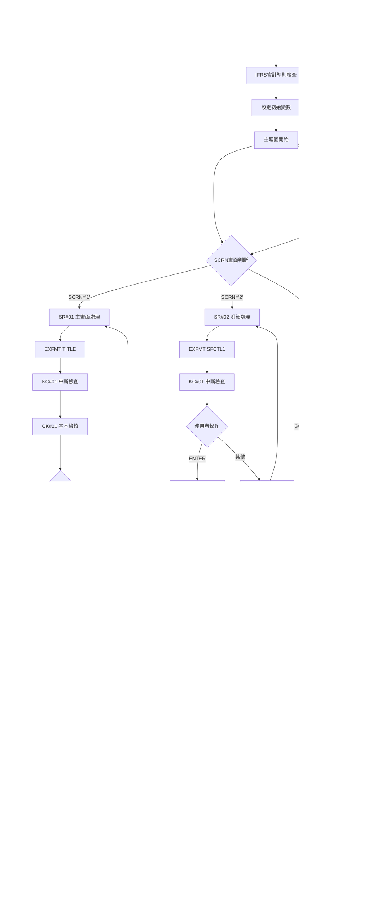

# ARE009R_U01 程式規格書

## 1. 基本資料

| 項目 | 內容 |
|------|------|
| **程式編號** | ARE009R |
| **程式名稱** | 主動申請收款查詢作業 |
| **程式類型** | RPG |
| **廠區** | U01 |
| **系統名稱** | 應收帳款系統 |
| **子系統** | 收款處理子系統 |
| **檔案位置** | 東鋼list/ARE009R_U01.txt |

## 2. 🎯 程式功能說明

### 主要功能描述
ARE009R為主動申請收款查詢作業程式，提供完整的收款申請資料維護功能。程式支援收款明細的新增、修改、刪除、查詢作業，同時整合帳務分錄處理，提供雙層子檔案顯示機制來處理收款明細和相關會計分錄。

### 🎯 業務流程詳細說明

#### 完整業務流程圖


#### 業務流程關鍵階段說明

**階段1: 功能選擇與初始化階段**
- 提供四種主要功能選項
- 檢查收款編號輸入格式和存在性
- 驗證廠區代碼權限
- 設定對應的處理模式和畫面保護狀態

**階段2: 收款明細維護階段**
- 載入現有收款明細資料到SF1子檔
- 提供收款明細的編輯功能
- 支援多種收款類型和付款方式
- 執行收款明細的業務規則檢核

**階段3: 會計分錄處理階段**
- 根據收款明細自動產生會計分錄
- 提供會計分錄的手動維護功能
- 支援借貸平衡檢查
- 整合總帳科目和部門代碼驗證

**階段4: 檔案更新執行階段**
- 同步更新RCVDTL收款明細檔
- 同步更新RCADTL會計分錄檔
- 處理收款編號的自動產生
- 維護檔案間的關聯性和一致性

#### 多重驗證機制
- **收款編號驗證**: 格式檢查、存在性驗證、廠區權限驗證
- **收款類型驗證**: 支援支票、匯票、現金等多種收款方式
- **金額驗證**: 收款金額必須大於0，借貸金額必須平衡
- **票據驗證**: 票據到期日格式和邏輯檢查
- **帳戶驗證**: 銀行帳戶存在性和有效性檢查
- **會計驗證**: 總帳科目、部門代碼、會計期間驗證

#### 智能處理邏輯
- 自動產生收款編號(透過編號規則)
- 智能判斷收款類型和付款條件
- 自動計算收款總額和分錄金額
- 智能偵測幣別和匯率變化
- 自動維護相關檔案的連動更新

#### 雙層子檔案架構
- **SF1子檔**: 處理收款明細資料
- **SF3子檔**: 處理會計分錄資料
- 兩層子檔案提供完整的資料編輯和顯示功能
- 支援分頁顯示和即時更新機制

## 3. 🎯 檔案架構與關聯圖

### 使用檔案清單

| 檔案名稱 | 檔案用途 | 存取方式 | 關聯鍵值 |
|----------|---------|---------|----------|
| **ARE009S** | 顯示檔案 | WORKSTN | - |
| **RCVDTL** | 收款明細檔 | UF | RVNO+RVITEM |
| **RCADTL** | 會計分錄檔 | UF | RANO+RAITEM |
| **BANKAC** | 銀行帳戶檔 | IF | SANO1+SANO2+SANO3 |
| **BCNAME** | 銀行名稱檔 | IF | BCCODE |
| **ACDEPT** | 部門檔案 | IF | DEPTCODE |
| **ACCNTL** | 會計科目檔 | IF | GLNO |
| **ACDSP1** | 會計科目說明檔1 | IF | ACCODE |
| **ACDSP2** | 會計科目說明檔2 | IF | ACCODE |
| **FAMSANO** | 家族銀行帳號檔 | IF | SANO |

### 🎯 檔案關聯詳細視覺化圖表


### 🎯 資料流向詳細說明

#### 環境準備階段的資料流向


#### 業務處理階段的資料流向


#### 環境清理階段的資料流向


## 4. 🎯 檔案欄位規格說明

### 主要資料結構

#### RCVDTL 收款明細檔記錄結構
```
RVREC (收款記錄)
├── RVNO (收款編號, 6位)
├── RVITEM (收款項次, 2位)
├── RVDATE (收款日期, 8位)
├── RVCUNM (客戶名稱, 10位)
├── RVTYPE (收款類型, 1位)
├── RVDPNO (部門編號, 4位)
├── RVUSTP (收款性質, 1位)
├── RVNTTP (票據性質, 1位)
├── RVPBID (付款銀行, 6位)
├── RVPANO (付款帳號, 10位)
├── RVACTP (收款類型, 1位)
├── RVACNO (收款帳號, 9位)
├── RVPLAC (票據發票地, 1位)
├── RVNTNO (票據號碼, 20位)
├── RVDUDT (票據到期日, 8位)
├── RVRAMT (收款金額, 10位)
├── RVSBID (收款銀行, 10位)
├── RVSANO (收款帳號, 10位)
├── RVRLNO (收款參考號, 10位)
├── RVFLAG (處理旗標, 1位)
├── RVAREA (處理廠區, 1位)
├── RVTXAR (異動廠區, 1位)
├── RVTXDT (異動日期, 8位)
├── RVCURR (幣別, 3位)
├── RVCAMT (幣別金額, 9位)
└── RVDEPT (部門代碼, 4位)
```

#### RCADTL 會計分錄檔記錄結構
```
RAREC (會計分錄記錄)
├── RANO (收款編號, 6位)
├── RAITEM (分錄項次, 2位)
├── RAACTP (借貸別, 1位)
├── RAACNO (總帳科目, 9位)
├── RADEPT (部門代碼, 4位)
├── RARLNO (參考號碼, 10位)
├── RAMUID (憑證號碼, 10位)
├── RAWAYC (費用代碼, 1位)
├── RACOMM (摘要說明, 30位)
├── RAAAMT (分錄金額, 10位)
├── RADUDT (傳票日期, 8位)
├── RARESV (備註, 10位)
├── RAFLAG (處理旗標, 1位)
├── RATXAR (異動廠區, 1位)
├── RATXDT (異動日期, 8位)
├── RACTNO (中心代號, 10位)
├── RADSC3 (說明3, 8位)
├── RADSC4 (說明4, 8位)
├── RACURR (幣別, 3位)
├── RACAMT (幣別金額, 9位)
└── RABGCD (預算代碼, 4位)
```

### 🔍 重點欄位切割技術詳解

#### DS結構完整分析

**AADS資料結構分析**
```
AADS (40位元主結構)：[SSSSSSSSSS|AAAAAAAA|DDDDDDDD|DDDDDDDD]
位置範圍:              021-030   031-040   001-008   009-016
結構用途:              編號群組   帳號群組  日期欄位  擴充欄位
```

#### 欄位切割視覺化展示
```
AADS主結構 (40字元)：[SSSSSSSSSS|AAAAAAAA|DDDDDDDD|DDDDDDDD]
                     ↓         ↓        ↓        ↓
SBID (10字元)：     [SSSSSSSSSS]                  收款銀行識別
SANO (10字元)：                [AAAAAAAA]        收款帳號群組
其他擴充欄位：                            [DDDDDDDD] [DDDDDDDD]
```

**詳細位置對應**
```
位置021-030: SBID  = 收款銀行識別碼
├── 位置021-023: SBID1 = 銀行代碼前段
├── 位置024-027: SBID2 = 銀行代碼中段
└── 位置028-030: SBID3 = 銀行代碼後段

位置031-040: SANO  = 收款帳號群組
├── 位置031: SANO1 = 帳號類型碼
├── 位置032: SANO2 = 帳號分類碼
└── 位置033-040: SANO3 = 帳號流水號
```

**BBDS群組編號結構分析**
```
BBDS (16位元結構)：[GGGGGGGGGG|AAAAAA]
位置範圍:            001-010   011-016
結構用途:            群組代碼   編號序列
```

#### 切割邏輯詳細說明

**收款編號組合邏輯**
- GRP由廠區代碼(GE1) + 年度月份(GE2)組成
- NOG為該群組下的收款編號序列
- NOA為編號類型識別碼，NOB為流水序號
- 支援多廠區獨立編號管理

**銀行帳戶切割邏輯**
- SBID為完整的銀行識別碼
- SANO為對應的帳戶號碼
- 透過BANKAC檔案驗證帳戶存在性
- 支援多層次的帳戶分類管理

#### 實際數據範例說明
```
原始銀行帳戶: U01BANK123ACCT567890
切割結果:
├── SBID = "U01BANK123" (U01廠區+BANK銀行+123代碼)
├── SBID1 = "U01" (廠區識別)
├── SBID2 = "BANK" (銀行代碼)
├── SBID3 = "123" (分行代碼)
├── SANO = "ACCT567890" (完整帳戶號碼)
├── SANO1 = "A" (帳戶類型)
├── SANO2 = "C" (帳戶分類)
└── SANO3 = "CT567890" (帳戶序號)
```

### 重要變數定義表

| 變數名稱 | 資料型態 | 長度 | 用途說明 |
|----------|---------|------|----------|
| **CODE** | 字元 | 1 | 功能代碼(1-4) |
| **NO** | 字元 | 6 | 收款編號 |
| **SCRN** | 字元 | 1 | 畫面控制變數 |
| **MOD** | 字元 | 6 | 處理模式說明 |
| **RR1** | 數值 | 2 | SF1子檔記錄序號 |
| **RR3** | 數值 | 2 | SF3子檔記錄序號 |
| **TTLAMT** | 數值 | 10 | 收款總額 |
| **TAAMT** | 數值 | 10 | 會計分錄總額 |
| **DATE** | 數值 | 8 | 收款日期 |
| **CUNM** | 字元 | 10 | 客戶名稱 |
| **DPNO** | 字元 | 4 | 部門編號 |
| **ACTP** | 字元 | 1 | 收款類型 |
| **A1NO** | 字元 | 9 | 收款帳號 |
| **USTP** | 字元 | 1 | 收款性質 |
| **NTTP** | 字元 | 1 | 票據性質 |
| **PBID** | 字元 | 6 | 付款銀行 |
| **PANO** | 字元 | 10 | 付款帳號 |
| **PLAC** | 字元 | 1 | 票據發票地 |
| **RLNO** | 字元 | 10 | 參考號碼 |
| **RAMT** | 數值 | 10 | 收款金額 |
| **NTNO** | 字元 | 20 | 票據號碼 |
| **SANO** | 字元 | 10 | 收款帳號 |
| **DUDT** | 數值 | 8 | 票據到期日 |
| **FLAG** | 字元 | 1 | 處理旗標 |
| **S#CURR** | 字元 | 3 | 幣別代碼 |
| **S#CAMT** | 數值 | 9 | 幣別金額 |
| **S#DEPT** | 字元 | 4 | 部門代碼 |

## 5. 🎯 輸出/入螢幕布局

### 螢幕布局完整視覺化

#### ARE009S-1 功能選擇畫面
```
+----------------------------------------------------------+
|  2024/12/26     *** 主動申請收款查詢作業 ***    ARE009S-1|
|                                                    U01DEV|
|                                                          |
|                                                          |
|                   功能代號: [X] (1:新增 2:修改          |
|                                                          |
|                               3:刪除 4:查詢)            |
|                                                          |
|                   收款編號: [      ]                    |
|                                                          |
|                                                          |
|                                                          |
|                                                          |
|                                                          |
|                                                          |
|                                                          |
|                                                          |
|                                                          |
|                                                          |
|                                                          |
|                                                          |
| [錯誤訊息顯示區]                                         |
| ENTER:執行         PF03:離開                            |
+----------------------------------------------------------+
```

#### ARE009S-2 收款明細維護畫面
```
+----------------------------------------------------------+
|  2024/12/26    [新增] *** 主動申請收款查詢作業 ***  ARE009S-2|
|                                                    U01DEV|
|                                                          |
| 收款編號: [RV0001] 收款部門: [1001] |
| 收款客戶: [測試客戶公司] 收款日期: [2024/03/15] |
|----------------------------------------------------------+
| 項  收  |         | | 付款銀行  付款帳號   | 參考號碼   收款金額    |
| 次  款  | 帳戶編號 |票|                     |           |           |
| 類  性  |         |據| 性      | 票據帳號  | 票據      |           |
| 別  質  |         |性| 質      |          | 發票地    |           |
|----------------------------------------------------------+
| [ 1] [C] [123456789] [A] [BK001] [1234567890] [REF001] [   100,000]|
| [   ] [  ] [         ] [ ] [     ] [          ] [      ] [         ]|
| [   ] [  ] [         ] [ ] [     ] [          ] [      ] [         ]|
|     票據號碼         帳號 收款帳號      票據    標|
|                          到期日      誌|
|     [            ] [  ] [        ] [  /  /  ] [ ]|
|                幣別  幣別金額  部門代碼|
|     [   ] [   ,   ] [    ]|
|----------------------------------------------------------+
|                                           總計: [  100,000]|
| [錯誤訊息顯示區]                                         |
| ENTER:確認   PF03-離開   PF10-刪除空項   PF12-返回上層   |
+----------------------------------------------------------+
```

#### ARE009S-3 會計分錄維護畫面
```
+----------------------------------------------------------+
|  2024/12/26    [新增] *** 主動申請收款查詢作業 ***  ARE009S-3|
|                                                    U01DEV|
|                                                          |
| 收款編號: [RV0001] 收款部門: [1001] 收款日期: [2024/03/15] |
| 收款客戶: [測試客戶公司] 收款總額: [   100,000] |
|                                                          |
|----------------------------------------------------------+
| 項|                                           |            |
| 次| 借    總帳      部門   參考號碼   憑證號碼   | 分錄金額   標|
|   | 貸    科目      代碼              票據     |            誌|
|   |               |        |期日|     摘要   |            |
|----------------------------------------------------------+
| [ 1] [D] [123456789] [1001] [REF001   ] [CV001   ] [   100,000] [ ]|
| [   ] [ ] [         ] [    ] [         ] [        ] [         ] [ ]|
| [   ] [ ] [         ] [    ] [        ] [        ] [         ] [ ]|
|     中心代號   幣別  幣別金額  備註八位|
|     部門名稱   |                |預算代碼|
|     [        ] [   ] [   ,   ] [        ] [    ]|
|----------------------------------------------------------+
|                                     總計: [   100,000]|
| [錯誤訊息顯示區]                                         |
| ENTER:確認   PF03:離開   PF10:存檔   PF12:返回上層     |
+----------------------------------------------------------+
```

### 🎯 畫面欄位詳細說明

#### 功能選擇畫面欄位
| 欄位名稱 | 屬性 | 長度 | 輸入格式 | 驗證規則 |
|----------|------|------|----------|----------|
| **CODE** | 必填 | 1 | 數字 | 1-4範圍檢查 |
| **NO** | 條件必填 | 6 | 英數字 | 依功能代碼而定 |

#### 收款明細畫面欄位
| 欄位名稱 | 屬性 | 長度 | 輸入格式 | 驗證規則 |
|----------|------|------|----------|----------|
| **ACTP** | 必填 | 1 | 英數字 | 收款類型代碼 |
| **A1NO** | 必填 | 9 | 英數字 | 帳戶編號格式 |
| **USTP** | 選填 | 1 | 英數字 | 收款性質代碼 |
| **NTTP** | 選填 | 1 | 英數字 | 票據性質代碼 |
| **PBID** | 選填 | 6 | 英數字 | 銀行代碼驗證 |
| **PANO** | 選填 | 10 | 英數字 | 帳戶格式驗證 |
| **PLAC** | 選填 | 1 | 英數字 | 票據發票地代碼 |
| **RLNO** | 選填 | 10 | 英數字 | 參考號碼 |
| **RAMT** | 必填 | 10 | 數值 | 大於0檢查 |
| **NTNO** | 條件必填 | 20 | 英數字 | 票據性質時必填 |
| **SANO** | 選填 | 10 | 英數字 | 收款帳號驗證 |
| **DUDT** | 條件必填 | 8 | 日期 | 票據性質時必填 |
| **FLAG** | 選填 | 1 | 英數字 | 處理旗標 |
| **S#CURR** | 選填 | 3 | 英數字 | 幣別代碼 |
| **S#CAMT** | 選填 | 9 | 數值 | 幣別金額 |
| **S#DEPT** | 選填 | 4 | 英數字 | 部門代碼驗證 |

#### 會計分錄畫面欄位
| 欄位名稱 | 屬性 | 長度 | 輸入格式 | 驗證規則 |
|----------|------|------|----------|----------|
| **DCCD** | 必填 | 1 | D/C | 借貸別檢查 |
| **GLNO** | 必填 | 9 | 英數字 | 總帳科目存在性 |
| **DEPT** | 必填 | 4 | 英數字 | 部門代碼驗證 |
| **RLNO** | 選填 | 10 | 英數字 | 參考號碼 |
| **MUID** | 選填 | 10 | 英數字 | 憑證號碼 |
| **WAYC** | 選填 | 1 | 英數字 | 費用代碼 |
| **AAMT** | 必填 | 10 | 數值 | 分錄金額大於0 |
| **DUE1** | 選填 | 8 | 日期 | 傳票日期格式 |
| **BNNM** | 選填 | 10 | 英數字 | 備註說明 |
| **FLAG** | 選填 | 1 | 英數字 | 處理旗標 |
| **S#CTNO** | 選填 | 10 | 英數字 | 中心代號 |
| **S#CUR1** | 選填 | 3 | 英數字 | 幣別代碼 |
| **S#CAM1** | 選填 | 9 | 數值 | 幣別金額 |
| **S#DSC3** | 選填 | 8 | 英數字 | 說明欄位3 |
| **S#DSC4** | 選填 | 8 | 英數字 | 說明欄位4 |
| **S#BGCD** | 選填 | 4 | 英數字 | 預算代碼 |

### 🎯 畫面控制邏輯

#### 指示器控制說明
| 指示器 | 控制項目 | 狀態說明 |
|--------|---------|----------|
| **IN41** | CODE欄位 | PC+RI (錯誤閃爍反白) |
| **IN42** | NO欄位 | PC+RI (錯誤閃爍反白) |
| **IN43** | DPNO欄位 | PC+RI (錯誤閃爍反白) |
| **IN45** | DATE欄位 | PC+RI (錯誤閃爍反白) |
| **IN51-65** | SF1子檔欄位 | PC+RI (明細欄位錯誤) |
| **IN31-44** | SF3子檔欄位 | PC+RI (分錄欄位錯誤) |
| **IN70** | 畫面保護 | PR (保護模式啟用) |
| **IN71** | 欄位保護 | PR (特定欄位保護) |
| **IN77** | IFRS控制 | IFRS會計準則控制 |
| **IN80** | 子檔清除 | SFLCLR (清除子檔內容) |
| **IN88** | 子檔異動 | SFLNXTCHG (標記異動) |

### 功能鍵詳細定義

#### 主畫面功能鍵
| 功能鍵 | 處理邏輯 | 系統行為 |
|--------|---------|----------|
| **ENTER** | 執行選擇功能 | 根據CODE執行對應處理 |
| **CF03** | 離開程式 | 設定*INKC='1'結束程式 |

#### 明細畫面功能鍵
| 功能鍵 | 處理邏輯 | 系統行為 |
|--------|---------|----------|
| **ENTER** | 確認操作 | 執行明細檢核和處理 |
| **CF03** | 離開 | 返回功能選擇畫面 |
| **CF10** | 刪除空項 | 清除空白的明細記錄 |
| **CF12** | 返回 | 返回上層處理 |

#### 會計分錄畫面功能鍵
| 功能鍵 | 處理邏輯 | 系統行為 |
|--------|---------|----------|
| **ENTER** | 確認操作 | 執行分錄檢核和處理 |
| **CF03** | 離開 | 返回明細維護畫面 |
| **CF10** | 存檔 | 執行檔案更新處理 |
| **CF12** | 返回 | 返回上層處理 |

## 6. 🎯 處理流程程序說明

### 🎯 主程序邏輯深度分析

#### 程式執行流程圖


#### 🎯 詳細處理步驟逐一分析

**步驟1: 系統環境初始化**
- 計算系統日期並設定到U#SYSD變數
- 檢查IFRS會計準則是否啟用
- 初始化畫面控制變數SCRN='1'
- 設定初始指示器和控制旗標

**步驟2: 主畫面輸入處理(SR#01)**
- 顯示TITLE功能選擇畫面
- 檢查中斷鍵(KC)的按下狀況
- 執行CK#01進行基本檢核
- 根據檢核結果決定後續處理

**步驟3: 收款明細處理(SR#02)**
- 執行PR#02載入現有收款明細
- 顯示SFCTL1子檔控制畫面
- 處理使用者的明細維護操作
- 執行CK#02明細檢核

**步驟4: 會計分錄處理(SR#03)**
- 執行PR#03載入相關會計分錄
- 顯示SFCTL3子檔控制畫面
- 處理使用者的分錄維護操作
- 執行CK#03分錄檢核

**步驟5: 檔案更新執行(FL#04)**
- 根據功能代碼分派到對應處理
- WR#04: 新增收款和分錄記錄
- UP#04: 修改收款和分錄記錄
- DL#04: 刪除收款和分錄記錄

#### 業務邏輯深度解析

**收款編號自動產生機制**
```
編號產生邏輯(WR#04):
1. 檢查是否為新增模式
2. 讀取現有收款記錄取得最大編號
3. 根據編號規則產生新編號
4. 更新收款明細檔案
5. 同步產生會計分錄記錄
```

**明細資料載入機制**
```
資料載入邏輯(PR#02):
1. 清除SF1子檔並重置計數器
2. 使用RVKEY讀取RCVDTL檔案
3. 載入所有相關收款明細
4. 計算收款金額總計
5. 寫入SF1子檔供畫面顯示
```

**會計分錄產生機制**
```
分錄產生邏輯(PR#03):
1. 根據收款明細自動產生分錄
2. 載入現有手動維護的分錄
3. 檢查借貸平衡狀況
4. 寫入SF3子檔供畫面顯示
5. 計算分錄金額總計
```

#### 條件判斷詳細說明

**功能代碼邏輯判斷**
- CODE='1': 新增模式，收款編號可空白
- CODE='2': 修改模式，收款編號必須存在
- CODE='3': 刪除模式，設定保護狀態
- CODE='4': 查詢模式，設定唯讀狀態

**收款類型邏輯判斷**
- ACTP='C': 貸項收款，金額加到總額
- ACTP='D': 借項收款，金額從總額扣除
- NTTP='A'-'E'或'I': 票據性質，需要票據資料
- USTP代表收款性質分類

**會計分錄邏輯判斷**
- DCCD='D': 借方分錄
- DCCD='C': 貸方分錄
- 必須維持借貸平衡
- 總帳科目必須存在於ACCNTL檔案

#### 變數使用和數據流向

**關鍵變數生命週期**
```
NO (收款編號):
初始化 → 檢核驗證 → 編號產生 → 檔案更新 → 畫面顯示

TTLAMT (收款總額):
清零 → 逐筆累加 → 畫面顯示 → 存檔確認

TAAMT (分錄總額):
清零 → 逐筆累加 → 借貸平衡檢查 → 存檔確認

RR1/RR3 (記錄號):
初始化 → 逐筆遞增 → 子檔定位 → 資料處理
```

### 🎯 子程序邏輯分析

#### KC#01 中斷檢查子程序
**功能**: 檢查使用者是否按下中斷鍵
**參數**: 無
**處理邏輯**: 設定LR指示器並返回程式

#### CK#01 基本檢核子程序
**功能**: 驗證主畫面輸入資料的正確性
**檢核項目**:
- 功能代碼CODE的範圍檢查(1-4)
- 收款編號NO的格式和存在性檢查
- 廠區代碼的權限驗證
- 收款類型的業務規則檢查

#### CK#02 收款明細檢核子程序
**功能**: 驗證收款明細資料的完整性和正確性
**檢核項目**:
- 收款類型和性質的組合邏輯
- 銀行帳戶的存在性驗證
- 票據資料的完整性檢查
- 收款金額的合理性驗證
- 幣別和匯率的一致性檢查

#### CK#03 會計分錄檢核子程序
**功能**: 驗證會計分錄資料的正確性
**檢核項目**:
- 總帳科目的存在性驗證
- 部門代碼的有效性檢查
- 借貸平衡的檢查
- 會計期間的合理性驗證
- 憑證號碼的唯一性檢查

#### FL#04 檔案處理分派子程序
**功能**: 根據功能代碼分派到對應的檔案處理
**參數**: 無
**分派邏輯**:
- CODE='1': 調用WR#04新增處理
- CODE='2': 調用UP#04修改處理
- CODE='3': 調用DL#04刪除處理

#### WR#04 新增處理子程序
**功能**: 執行新增收款和分錄的完整處理
**處理步驟**:
1. 產生新的收款編號
2. 處理SF1子檔中的收款明細
3. 寫入RCVDTL收款明細檔
4. 處理SF3子檔中的會計分錄
5. 寫入RCADTL會計分錄檔

#### UP#04 修改處理子程序
**功能**: 執行修改收款和分錄的處理
**處理步驟**:
1. 掃描SF1和SF3子檔的異動狀況
2. 更新異動的收款明細記錄
3. 更新異動的會計分錄記錄
4. 處理刪除標記的記錄
5. 維護檔案間的一致性

#### DL#04 刪除處理子程序
**功能**: 執行刪除收款和分錄的處理
**處理步驟**:
1. 標記相關收款明細為刪除
2. 標記相關會計分錄為刪除
3. 更新處理旗標和異動日期
4. 維護檔案的參考完整性

### 🎯 特殊邏輯處理

#### IFRS會計準則處理
**IFRS控制邏輯**:
- 檢查系統日期是否達到IFRS實施日期
- 根據IFRS狀態調整會計科目驗證
- 控制特定會計功能的啟用和停用
- 影響會計分錄的產生規則

#### 票據性質處理邏輯
**票據處理機制**:
```
票據邏輯:
IF NTTP IN ('A','B','C','D','E','I') THEN
   檢查PLAC票據發票地必須為'D'或'E'
   檢查NTNO票據號碼不可空白
   檢查DUDT票據到期日不可為0
   調用UTS102R驗證日期格式
ENDIF
```

#### 銀行帳戶驗證機制
**帳戶驗證邏輯**:
```
帳戶處理:
1. 組合SANO1+SANO2+SANO3形成完整帳號
2. 使用ACKEY查詢BANKAC銀行帳戶檔
3. 取得對應的銀行識別碼ACBAID
4. 設定到SBID收款銀行欄位
5. 驗證帳戶狀態和使用權限
```

#### 部門代碼處理邏輯
**部門驗證機制**:
```
部門處理:
1. 檢查S#DEPT部門代碼非空白
2. 使用部門代碼查詢ACDEPT部門檔案
3. 驗證部門的有效性和權限
4. 特殊處理71和72帳戶的部門限制
5. 更新相關的部門資訊
```

## 7. 🎯 錯誤處理程序說明

### 🎯 詳細錯誤代碼清冊

| 錯誤代碼 | 錯誤訊息 | 原因說明 | 處理方式 | 預防措施 |
|----------|---------|---------|---------|----------|
| **ERR001** | 請確認功能代號輸入錯誤 | 功能代碼不在1-4有效範圍內 | 1. 重新輸入有效代碼<br>2. 顯示功能選項說明<br>3. 清除錯誤欄位 | 使用VALUES限制輸入範圍 |
| **ERR002** | 請確認功能代號輸入錯誤，請重新輸入 | 功能代碼格式不正確 | 1. 清除輸入欄位<br>2. 重新顯示選項<br>3. 提供輸入指引 | 加強格式驗證檢查 |
| **ERR003** | 請確認收款編號輸入錯誤 | 收款編號為空白或格式錯誤 | 1. 檢查編號格式<br>2. 提供編號查詢<br>3. 確認編號有效性 | 建立編號格式驗證 |
| **ERR004** | 請確認此收款編號已存在，請選擇修改 | 嘗試新增已存在的收款 | 1. 切換到修改模式<br>2. 載入現有資料<br>3. 提供編輯功能 | 建立唯一性檢查 |
| **ERR021** | 請確認票據發票地輸入錯誤 | 票據發票地代碼不正確 | 1. 輸入D或E有效代碼<br>2. 確認票據類型<br>3. 檢查代碼對應 | 票據類型驗證規則 |
| **ERR022** | 請確認票據號碼輸入錯誤 | 票據號碼欄位空白 | 1. 輸入完整票據號碼<br>2. 確認號碼格式<br>3. 檢查號碼唯一性 | 必填欄位檢查 |
| **ERR023** | 請確認票據到期日輸入錯誤 | 票據到期日格式不正確 | 1. 使用正確日期格式<br>2. 檢查日期有效性<br>3. 提供格式範例 | 日期格式驗證 |
| **ERR024** | 請確認票據到期日格式錯誤 | 票據到期日邏輯不正確 | 1. 確認日期範圍<br>2. 檢查日期邏輯<br>3. 驗證業務規則 | 日期邏輯檢查 |
| **ERR025** | 請確認收款金額輸入錯誤 | 收款金額為0或負數 | 1. 輸入大於0的金額<br>2. 檢查金額格式<br>3. 確認金額合理性 | 金額範圍驗證 |
| **ERR028** | 請確認銀行帳戶不存在 | 銀行帳戶號碼無效 | 1. 檢查帳戶號碼<br>2. 確認銀行代碼<br>3. 驗證帳戶狀態 | 銀行帳戶檔案驗證 |
| **ERR034** | 請確認此收款編號不屬於本廠區編號 | 收款編號不屬於當前廠區 | 1. 確認廠區代碼<br>2. 檢查編號歸屬<br>3. 申請適當權限 | 廠區權限控制 |
| **ERR036** | 請確認部門代碼輸入錯誤 | 部門代碼不存在或無效 | 1. 輸入有效部門代碼<br>2. 檢查部門檔案<br>3. 確認部門權限 | 部門代碼驗證 |
| **ERR038** | 請確認憑證號碼輸入錯誤 | 憑證號碼格式不正確 | 1. 輸入正確憑證號碼<br>2. 確認號碼格式<br>3. 檢查號碼唯一性 | 憑證號碼格式檢查 |
| **ERR040** | 請確認收款項目至少需輸入一筆 | 未輸入任何收款明細 | 1. 至少輸入一筆明細<br>2. 檢查明細完整性<br>3. 確認處理意圖 | 強制明細檢查機制 |
| **ERR041** | 請確認此收款編號已開立憑證，無法修改 | 收款已開立憑證 | 1. 檢查憑證狀態<br>2. 先取消憑證<br>3. 聯繫會計人員 | 憑證狀態控制 |
| **ERR044** | 請確認傳票日期輸入錯誤 | 傳票日期格式錯誤 | 1. 使用正確日期格式<br>2. 檢查日期範圍<br>3. 確認會計期間 | 日期格式和期間驗證 |
| **ERR045** | 請確認傳票日期格式錯誤 | 傳票日期邏輯錯誤 | 1. 確認日期邏輯<br>2. 檢查會計期間<br>3. 驗證業務規則 | 會計期間控制 |
| **ERR046** | 請確認傳票日期不可為零 | 傳票日期為空白或零 | 1. 輸入有效日期<br>2. 確認日期必填<br>3. 提供預設日期 | 必填日期檢查 |
| **ERR049** | 請確認211開頭現金帳戶參考號碼請輸入 | 現金帳戶缺少參考號 | 1. 輸入參考號碼<br>2. 確認現金類型<br>3. 檢查帳戶規則 | 現金帳戶規則檢查 |
| **ERR050** | 資料已新增完成，收款編號為: | 新增作業完成訊息 | 1. 確認新增結果<br>2. 記錄收款編號<br>3. 繼續後續作業 | 正常完成訊息 |
| **ERR054** | 請確認會計科目71科目，部門編號需為B科目 | 71科目部門限制 | 1. 修改部門為B<br>2. 確認科目規則<br>3. 檢查會計邏輯 | 科目部門對應檢查 |
| **ERR055** | 請確認會計科目72科目，部門編號需為非B科目 | 72科目部門限制 | 1. 修改部門為非B<br>2. 確認科目規則<br>3. 檢查會計邏輯 | 科目部門對應檢查 |

### 🎯 系統異常處理邏輯

#### 檔案操作失敗處理
**RCVDTL收款檔案操作異常**:
```
讀取失敗: 設定IN97指示器 → 跳過該記錄 → 繼續處理
寫入失敗: 記錄錯誤資訊 → 回復異動 → 顯示錯誤
更新失敗: 檢查鎖定狀態 → 重試或跳過 → 記錄日誌
```

**RCADTL會計檔案操作異常**:
```
併發存取: 重新讀取記錄 → 重新計算 → 再次嘗試更新
記錄鎖定: 等待解鎖 → 重新嘗試 → 錯誤回報
檔案損壞: 檢查檔案完整性 → 修復或重建 → 記錄錯誤
```

#### 子檔案處理錯誤
**SF1收款子檔案錯誤**:
```
子檔案滿: 檢查記錄數限制 → 分頁處理 → 提示使用者
資料不一致: 重新載入子檔案 → 確認資料完整性
顯示錯誤: 重設畫面狀態 → 重新顯示資料
```

**SF3會計子檔案錯誤**:
```
借貸不平衡: 重新計算總額 → 檢查分錄邏輯 → 提示錯誤
科目不存在: 驗證總帳科目 → 提供有效選項 → 重新輸入
部門錯誤: 檢查部門權限 → 驗證部門代碼 → 修正錯誤
```

#### 資料完整性錯誤處理
**收款編號衝突處理**:
```
編號重複: 檢查編號唯一性 → 產生新編號 → 重新嘗試
編號格式錯誤: 驗證編號格式 → 提供正確範例 → 重新輸入
編號權限錯誤: 檢查廠區權限 → 提供適當編號 → 重新選擇
```

**銀行帳戶錯誤處理**:
```
帳戶不存在: 驗證帳戶資料 → 提供有效帳戶 → 重新選擇
帳戶已停用: 檢查帳戶狀態 → 選擇活動帳戶 → 更新資料
帳戶權限不足: 檢查使用權限 → 申請適當權限 → 重新授權
```

#### 會計邏輯錯誤處理
**借貸平衡錯誤**:
```
借貸不等: 重新計算金額 → 檢查分錄邏輯 → 調整分錄
金額錯誤: 驗證金額計算 → 檢查輸入資料 → 重新計算
科目錯誤: 驗證科目設定 → 檢查會計規則 → 修正科目
```

## 8. 🎯 備註

### 🎯 特殊注意事項

**收款作業特性**:
- 程式支援多種收款方式包含現金、支票、匯票等
- 提供完整的票據管理功能包含到期日驗證
- 整合銀行帳戶管理和驗證機制
- 支援多幣別收款和匯率處理

**雙層子檔案機制**:
- SF1子檔處理收款明細，最多90筆記錄
- SF3子檔處理會計分錄，最多40筆記錄
- 兩層子檔案提供完整的資料維護功能
- 支援分頁顯示和即時更新機制

**會計整合功能**:
- 自動產生對應的會計分錄
- 支援借貸平衡檢查機制
- 整合總帳科目和部門代碼驗證
- 支援IFRS會計準則控制

**IFRS會計準則控制**:
- 檢查系統日期與IFRS實施日期
- 根據IFRS狀態調整會計處理邏輯
- 控制特定會計功能的啟用狀態
- 影響科目驗證和分錄產生規則

**廠區權限控制**:
- 收款編號必須屬於當前處理廠區
- 支援跨廠區資料查詢功能
- 提供廠區代碼的權限驗證
- 確保資料安全和存取控制

**票據處理邏輯**:
- 票據性質A-E和I需要完整票據資料
- 票據發票地限制為D(國內)或E(國外)
- 票據到期日必須為有效日期格式
- 支援票據號碼的唯一性檢查

**銀行帳戶管理**:
- 支援多層次的銀行帳戶結構
- 整合BANKAC銀行帳戶檔案驗證
- 提供帳戶狀態和權限檢查
- 支援家族銀行帳號的關聯處理

**編號產生規則**:
- 收款編號依據廠區和年度產生
- 支援編號的自動遞增機制
- 提供編號唯一性檢查
- 維護編號的連續性和完整性

**金額計算邏輯**:
- 支援借項(D)和貸項(C)的金額處理
- 提供收款總額的自動計算
- 整合會計分錄的借貸平衡檢查
- 支援多幣別金額的換算處理 