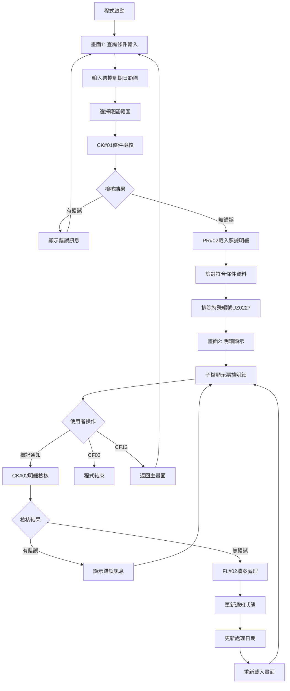
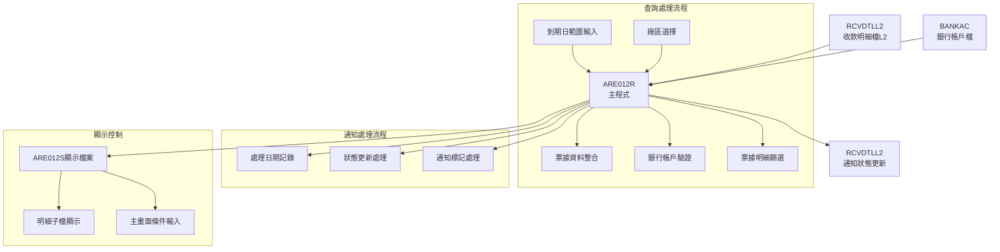
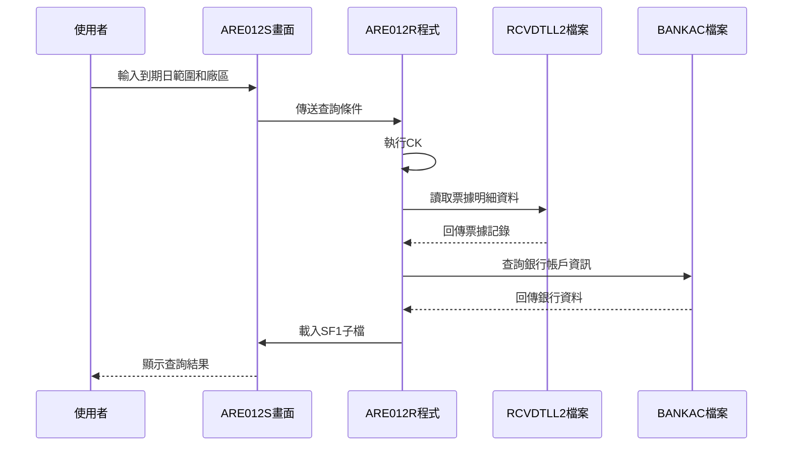
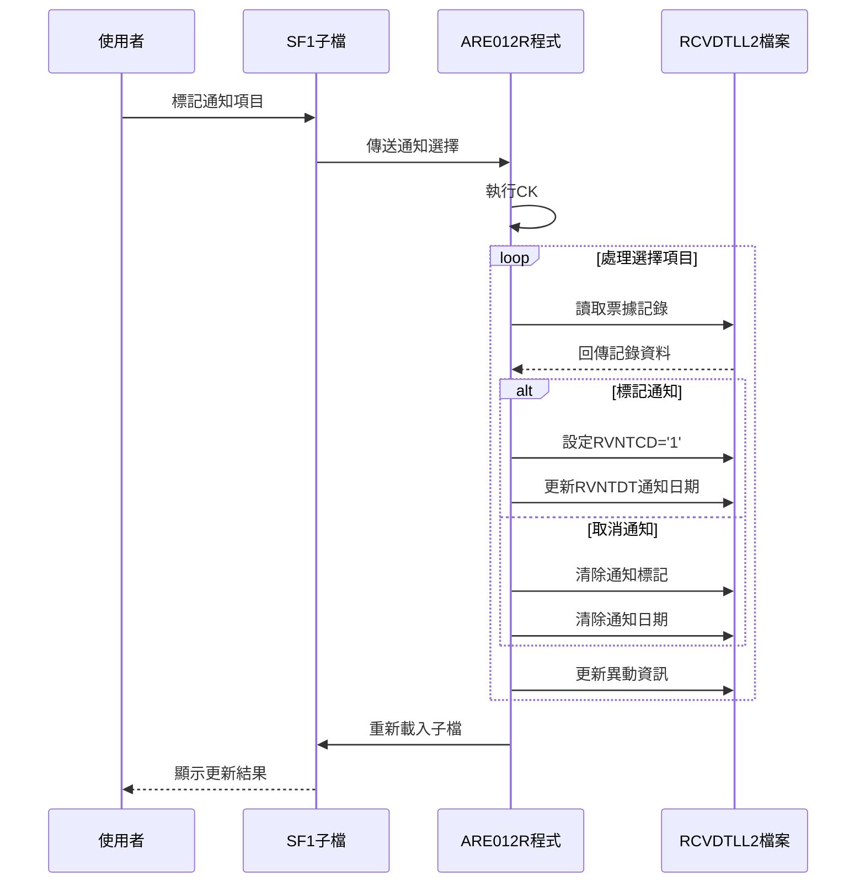
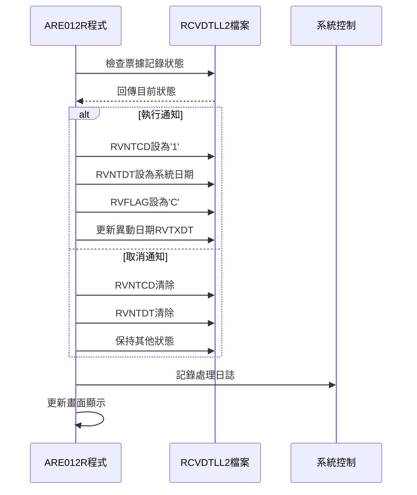
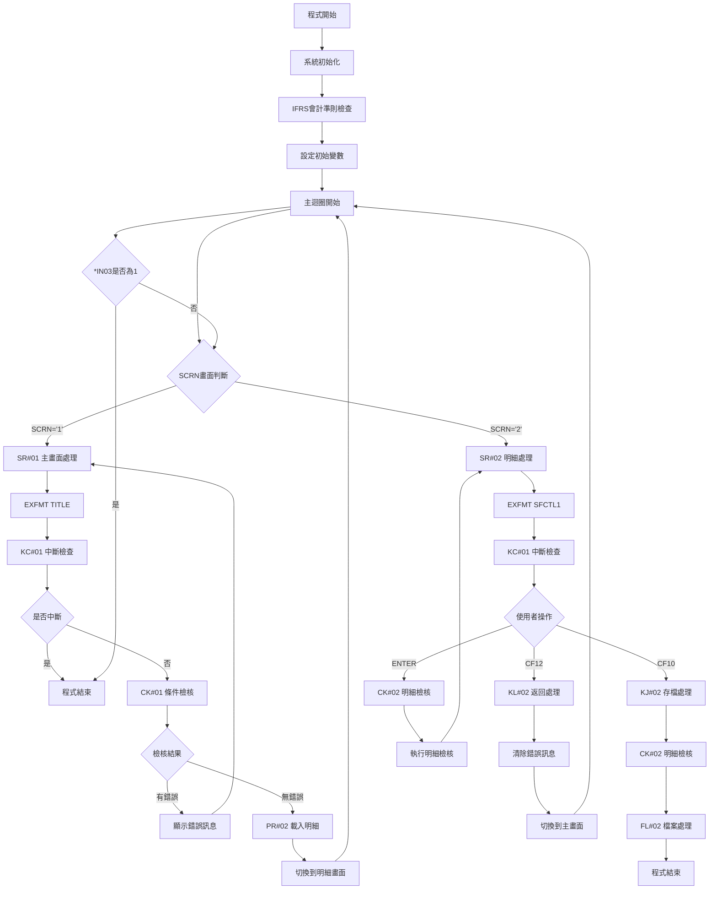

# ARE012R_U01 程式規格書

## 1. 基本資料

| 項目 | 內容 |
|------|------|
| **程式編號** | ARE012R |
| **程式名稱** | 到期處理作業 |
| **程式類型** | RPG |
| **廠區** | U01 |
| **系統名稱** | 應收帳款系統 |
| **子系統** | 票據到期通知子系統 |
| **檔案位置** | 東鋼list/ARE012R_U01.txt |

## 2. 🎯 程式功能說明

### 主要功能描述
ARE012R為票據到期處理作業程式，專門處理票據到期日的查詢、通知和狀態管理功能。程式提供票據到期日範圍查詢機制，支援多廠區選擇，載入符合條件的票據明細資料，並支援批次通知處理和狀態更新功能。

### 🎯 業務流程詳細說明

#### 完整業務流程圖


#### 業務流程關鍵階段說明

**階段1: 查詢條件設定階段**
- 輸入票據到期日起始和結束範圍
- 選擇查詢廠區(P/T/H/K/U)
- 驗證日期格式和邏輯正確性
- 檢查起始日期不能大於結束日期

**階段2: 資料載入篩選階段**
- 使用到期日範圍查詢RCVDTLL2收款明細檔L2
- 篩選指定廠區的票據記錄
- 排除UZ0227特殊編號的記錄
- 篩選有完整票據資料的記錄

**階段3: 明細顯示處理階段**
- 載入符合條件的票據明細到SF1子檔
- 顯示收款銀行、轉入銀行、票據資訊
- 提供通知狀態的視覺化顯示
- 支援分頁瀏覽和記錄定位功能

**階段4: 通知處理執行階段**
- 檢核使用者選擇的通知項目
- 驗證銀行帳戶的有效性
- 更新票據記錄的通知標記
- 記錄通知處理的日期和時間

#### 資料篩選機制
- **日期篩選**: 根據票據到期日範圍進行精確篩選
- **廠區篩選**: 支援多廠區選擇(P/T/H/K/U)
- **編號篩選**: 排除UZ0227特殊編號的記錄
- **票據篩選**: 僅處理有完整票據資料的記錄
- **IFRS篩選**: 根據IFRS會計準則調整查詢邏輯

#### 通知狀態管理
- **未通知**: 新的票據記錄，可進行通知
- **已通知**: 標記為'Y'的記錄，顯示通知日期
- **已取消**: 標記為'C'的記錄，清除通知資訊
- **狀態切換**: 支援通知狀態的動態切換

## 3. 🎯 檔案架構與關聯圖

### 使用檔案清單

| 檔案名稱 | 檔案用途 | 存取方式 | 關聯鍵值 |
|----------|---------|---------|----------|
| **ARE012S** | 顯示檔案 | WORKSTN | - |
| **RCVDTLL2** | 收款明細檔L2 | UF | RVDUDT+RVNTNO+RVNO+RVITEM |
| **BANKAC** | 銀行帳戶檔 | IF | ACTYPE+ACCURR+ACACNO |

### 🎯 檔案關聯詳細視覺化圖表



### 🎯 資料流向詳細說明

#### 查詢階段的資料流向


#### 通知處理階段的資料流向


#### 狀態管理的資料流向


## 4. 🎯 檔案欄位規格說明

### 主要資料結構

#### RCVDTLL2 收款明細檔L2記錄結構
```
RVREC (收款記錄)
├── RVDUDT (票據到期日, 8位)
├── RVNTNO (票據號碼, 20位)
├── RVNO (收款編號, 6位)
├── RVITEM (收款項次, 2位)
├── RVACNO (收款帳號, 9位)
├── RVVNO2 (票據編號2, 20位)
├── RVNTCD (票據代碼, 1位)
├── RVNTDT (通知日期, 8位)
├── RVSBID (收款銀行, 6位)
├── RVSANO (收款帳號, 10位)
├── RVTBID (轉入銀行, 6位)
├── RVTANO (轉入帳號, 10位)
├── RVNTTP (票據性質, 1位)
├── RVRAMT (收款金額, 10位)
├── RVCUNM (客戶名稱, 10位)
├── RVDATE (收款日期, 8位)
├── RVPLAC (票據發票地, 1位)
├── RVUSTP (收款性質, 1位)
├── RVFLAG (處理旗標, 1位)
├── RVAREA (處理廠區, 1位)
├── RVTXAR (異動廠區, 1位)
└── RVTXDT (異動日期, 8位)
```

#### BANKAC 銀行帳戶檔記錄結構
```
ACREC (帳戶記錄)
├── ACTYPE (帳戶類型, 1位)
├── ACCURR (帳戶幣別, 1位)
├── ACACNO (帳戶號碼, 8位)
├── ACBAID (銀行識別, 6位)
└── ACBNAM (銀行名稱, 10位)
```

### 🔍 重點欄位切割技術詳解

#### DS結構完整分析

**AADS資料結構分析**
```
AADS (26位元結構)：[YYYYYYYY|YYYYYY|YYYYYY|YYYYYY]
位置範圍:            021-026   001-006   007-012  013-018
結構用途:            年月日    年月     月日     其他
```

#### 欄位切割視覺化展示
```
YMD (6字元)：[YYMMDD]
位置021-026： 完整日期欄位
├── 位置021-022: YY = 年度(2位)
├── 位置023-024: MM = 月份(2位)
└── 位置025-026: DD = 日期(2位)
```

**BBDS帳戶結構分析**
```
BBDS (30位元結構)：[TTTTTTTTTT|TTTTTTTTTT|TTTTTTTTTT]
位置範圍:            011-020    021-030    031-040
結構用途:            收款帳戶   轉入帳戶   其他帳戶
```

#### 切割邏輯詳細說明

**收款帳戶切割邏輯**
- W02包含完整的收款帳戶資訊
- W02TT1為帳戶類型碼(1位)
- W02TT2為帳戶幣別碼(1位)
- W02TT3為實際帳戶號碼(8位)
- 透過BANKAC檔案取得銀行詳細資訊

**轉入帳戶切割邏輯**
- W22包含完整的轉入帳戶資訊
- W22TT1為帳戶類型碼(1位)
- W22TT2為帳戶幣別碼(1位)
- W22TT3為實際帳戶號碼(8位)
- 同樣透過BANKAC檔案驗證和取得資訊

#### 實際數據範例說明
```
原始收款帳戶: "A1234567890"
切割結果:
├── W02TT1 = "A" (帳戶類型)
├── W02TT2 = "1" (帳戶幣別)
└── W02TT3 = "234567890" (帳戶號碼)

原始轉入帳戶: "B2345678901"
切割結果:
├── W22TT1 = "B" (帳戶類型)
├── W22TT2 = "2" (帳戶幣別)
└── W22TT3 = "345678901" (帳戶號碼)
```

### 重要變數定義表

| 變數名稱 | 資料型態 | 長度 | 用途說明 |
|----------|---------|------|----------|
| **DATE1** | 數值 | 8 | 票據到期日起 |
| **DATE2** | 數值 | 8 | 票據到期日止 |
| **DATE0** | 數值 | 8 | 通知處理日期 |
| **S#LOC** | 字元 | 1 | 查詢廠區選擇 |
| **SCRN** | 字元 | 1 | 畫面控制變數 |
| **RRN** | 數值 | 3 | 子檔記錄序號 |
| **R#L01** | 數值 | 3 | 顯示記錄限制(990) |
| **DSPREC** | 數值 | 4 | 顯示記錄號 |
| **ACT** | 字元 | 1 | 處理動作標記 |
| **W01** | 字元 | 6 | 收款銀行代碼 |
| **W01X** | 字元 | 10 | 收款銀行名稱 |
| **W02** | 字元 | 10 | 收款帳號 |
| **W03** | 字元 | 20 | 票據號碼 |
| **W04** | 字元 | 10 | 票據性質說明 |
| **W05** | 數值 | 8 | 票據到期日 |
| **W06** | 數值 | 10 | 收款金額 |
| **W07** | 字元 | 1 | 通知代碼 |
| **W21** | 字元 | 6 | 轉入銀行代碼 |
| **W21X** | 字元 | 10 | 轉入銀行名稱 |
| **W22** | 字元 | 10 | 轉入帳號 |
| **W23** | 字元 | 6 | 收款編號 |
| **W24** | 字元 | 10 | 客戶名稱 |
| **W25** | 數值 | 8 | 收款日期 |
| **W26** | 字元 | 8 | 票據發票地說明 |
| **W27** | 字元 | 1 | 收款性質 |
| **H01-H05** | 字元 | 各異 | 原始值保存變數 |

## 5. 🎯 輸出/入螢幕布局

### 螢幕布局完整視覺化

#### ARE012S-1 查詢條件輸入畫面
```
+----------------------------------------------------------+
|  2024/12/26        ***  到期處理作業  ***        ARE012S-1|
|                                                    U01DEV|
|                                                          |
|                                                          |
|                                                          |
|                                                          |
|                   票據到期起: [2024/12/01]               |
|                                                          |
|                   　　　　止: [2024/12/31]               |
|                                                          |
|                   查詢廠區　: [U] (P:台北T:台中H:高雄     |
|                                   K:高雄U:新竹)          |
|                                                          |
|                                                          |
|                                                          |
|                                                          |
|                                                          |
|                                                          |
|                                                          |
| [錯誤訊息顯示區]                                         |
| ENTER:執行         PF03:離開                            |
+----------------------------------------------------------+
```

#### ARE012S-2 票據明細顯示畫面
```
+----------------------------------------------------------+
|  2024/12/26        ***  到期處理作業  ***        ARE012S-2|
|                                                    U01DEV|
|                                                          |
| 到期日期: [2024/12/26] 票據期間: [2024/12/01]-[2024/12/31]|
| 處理代號：Y:到期 C:取消                                  |
|----------------------------------------------------------+
| 處                                                       |
| 理   收             銀行名稱   票據號碼      收款編號   到|
| 代   款             　　　　   　　　　      　　　　   期|
| 號   銀行帳號       　　　　   票據性質     到期日 收款金額|
|----------------------------------------------------------+
| [Y] [1234567890] [中國信託銀行] [TK20241201001] [RV001] [Y]|
|     [9876543210] [台灣銀行    ] [支票        ] [12/31] [100,000.00]|
| [Y] [2345678901] [台北富邦銀行] [TK20241202002] [RV002] [Y]|
|     [8765432109] [第一銀行    ] [本票支票    ] [01/15] [250,000.00]|
| [ ] [3456789012] [國泰世華銀行] [TK20241203003] [RV003] [ ]|
|     [7654321098] [華南銀行    ] [現金        ] [    ] [150,000.00]|
|----------------------------------------------------------+
| [錯誤訊息顯示區]                                         |
| ENTER:確認   PF03:離開   PF10:存檔   PF12:返回上層     |
+----------------------------------------------------------+
```

### 🎯 畫面欄位詳細說明

#### 主畫面欄位
| 欄位名稱 | 屬性 | 長度 | 輸入格式 | 驗證規則 |
|----------|------|------|----------|----------|
| **DATE1** | 必填 | 8 | 日期 | YYYY/MM/DD格式 |
| **DATE2** | 必填 | 8 | 日期 | YYYY/MM/DD格式 |
| **S#LOC** | 必填 | 1 | P/T/H/K/U | 廠區代碼驗證 |

#### 明細畫面欄位
| 欄位名稱 | 屬性 | 長度 | 輸入格式 | 驗證規則 |
|----------|------|------|----------|----------|
| **DATE0** | 唯讀 | 8 | 日期 | 系統自動設定 |
| **ACT** | 修改 | 1 | Y/C/空白 | 處理代碼驗證 |
| **W02** | 修改 | 10 | 英數字 | 銀行帳號格式 |
| **W01X** | 唯讀 | 10 | 顯示用 | 收款銀行名稱 |
| **W21X** | 唯讀 | 10 | 顯示用 | 轉入銀行名稱 |
| **W03** | 唯讀 | 20 | 顯示用 | 票據號碼 |
| **W04** | 唯讀 | 10 | 顯示用 | 票據性質說明 |
| **W05** | 唯讀 | 8 | 日期 | 票據到期日 |
| **W06** | 唯讀 | 10 | 數值 | 收款金額 |
| **W07** | 唯讀 | 1 | 顯示用 | 通知代碼 |

### 🎯 畫面控制邏輯

#### 指示器控制說明
| 指示器 | 控制項目 | 狀態說明 |
|--------|---------|----------|
| **IN40** | DATE0欄位 | PC+RI (錯誤閃爍反白) |
| **IN41** | DATE1欄位 | PC+RI (錯誤閃爍反白) |
| **IN42** | DATE2欄位 | PC+RI (錯誤閃爍反白) |
| **IN43** | W02欄位 | PC+RI (錯誤閃爍反白) |
| **IN51** | 子檔保護 | PR (保護模式啟用) |
| **IN77** | IFRS控制 | IFRS會計準則控制 |
| **IN80** | 子檔清除 | SFLCLR (清除子檔內容) |
| **IN88** | 子檔異動 | SFLNXTCHG (標記異動) |

### 功能鍵詳細定義

#### 主畫面功能鍵
| 功能鍵 | 處理邏輯 | 系統行為 |
|--------|---------|----------|
| **ENTER** | 執行查詢 | 根據條件載入票據明細 |
| **CF03** | 離開程式 | 設定*IN03='1'結束程式 |

#### 明細畫面功能鍵
| 功能鍵 | 處理邏輯 | 系統行為 |
|--------|---------|----------|
| **ENTER** | 確認操作 | 執行明細檢核和處理 |
| **CF03** | 離開 | 返回功能選擇畫面 |
| **CF10** | 存檔 | 執行FL#02檔案更新 |
| **CF12** | 返回 | 返回條件輸入畫面 |

## 6. 🎯 處理流程程序說明

### 🎯 主程序邏輯深度分析

#### 程式執行流程圖


#### 🎯 詳細處理步驟逐一分析

**步驟1: 系統環境初始化**
- 計算系統日期並設定到U#SYSD變數
- 檢查IFRS會計準則實施狀態
- 初始化日期變數DATE0, DATE1, DATE2
- 設定顯示記錄限制R#L01=990
- 設定初始畫面SCRN='1'

**步驟2: 主畫面輸入處理(SR#01)**
- 顯示TITLE條件輸入畫面
- 檢查中斷鍵(CF03)的按下狀況
- 執行CK#01進行條件檢核
- 根據檢核結果決定後續處理

**步驟3: 明細畫面處理(SR#02)**
- 執行PR#02載入票據明細資料
- 顯示SFCTL1子檔控制畫面
- 處理使用者的各種操作指令
- 根據功能鍵執行對應處理

**步驟4: 檔案更新執行(FL#02)**
- 掃描子檔中的異動記錄
- 更新票據記錄的通知狀態
- 設定或清除通知標記
- 記錄處理日期和異動資訊

#### 業務邏輯深度解析

**條件檢核機制**
```
條件檢核邏輯(CK#01):
1. 檢查DATE1起始日期不大於DATE2結束日期
2. 調用UTS102R驗證DATE1日期格式
3. 調用UTS102R驗證DATE2日期格式
4. 驗證廠區代碼S#LOC的有效性
5. 設定對應的錯誤指示器和訊息
```

**資料載入機制**
```
資料載入邏輯(PR#02):
1. 清除SF1子檔並重置計數器
2. 使用RVKEY複合鍵讀取RCVDTLL2檔案
3. 依據到期日範圍和廠區條件篩選資料
4. 排除UZ0227特殊編號的記錄
5. 整合收款銀行和轉入銀行資訊
6. 載入到子檔供畫面顯示
```

**通知處理機制**
```
通知處理邏輯(FL#02):
1. 掃描子檔中的處理標記
2. 根據ACT處理代碼執行對應動作
3. Y:設定通知標記RVNTCD='1'和通知日期
4. C:清除通知標記和相關資訊
5. 更新檔案異動資訊
```

#### 條件判斷詳細說明

**廠區選擇判斷**
- 支援五個廠區代碼(P/T/H/K/U)
- 使用S#LOC變數控制查詢範圍
- 與收款記錄的RVAREA欄位比對
- 確保查詢範圍的準確性

**特殊編號過濾**
- 排除收款編號為UZ0227的記錄
- 這是系統特殊處理的編號
- 防止特殊記錄被一般處理流程影響

**IFRS會計準則判斷**
- 根據系統日期和IFRS實施日期比較
- 調整帳戶代碼的檢查邏輯
- 1131或111001帳戶的特殊處理

**票據資料完整性判斷**
- 檢查票據號碼(RVNTNO)非空白
- 檢查票據編號2(RVVNO2)非空白
- 只處理完整票據資料的記錄

#### 變數使用和數據流向

**關鍵變數生命週期**
```
DATE1/DATE2 (到期日範圍):
輸入 → 格式檢查 → 邏輯驗證 → 查詢條件 → 資料篩選

S#LOC (廠區選擇):
輸入 → 範圍檢查 → 權限驗證 → 篩選條件 → 資料過濾

RRN (記錄號):
初始化 → 逐筆遞增 → 子檔定位 → 資料處理

ACT (處理代碼):
輸入 → 格式檢查 → 處理分派 → 檔案更新

W01-W27 (顯示變數):
資料載入 → 格式轉換 → 畫面顯示 → 使用者檢視
```

### 🎯 子程序邏輯分析

#### KC#01 中斷檢查子程序
**功能**: 檢查使用者是否按下CF03中斷鍵
**參數**: 無
**處理邏輯**: 設定LR指示器並返回程式

#### CK#01 條件檢核子程序
**功能**: 驗證查詢條件的正確性
**檢核項目**:
- 起始日期不能大於結束日期
- 日期格式驗證(調用UTS102R)
- 廠區代碼的有效性檢查
- 設定對應的錯誤指示器

#### PR#02 資料準備子程序
**功能**: 載入符合條件的票據明細資料
**處理步驟**:
1. 清除子檔和重置變數
2. 設定查詢起始位置(以到期日為主鍵)
3. 循環讀取收款明細檔L2
4. 篩選符合條件的記錄
5. 排除特殊編號UZ0227
6. 整合銀行和票據資訊
7. 寫入子檔供顯示

#### CK#02 明細檢核子程序
**功能**: 檢核明細畫面的使用者輸入
**檢核項目**:
- 銀行帳戶的存在性驗證
- 處理代碼的有效性檢查
- 通知狀態的邏輯檢查
- 防止重複通知的控制

#### FL#02 檔案處理子程序
**功能**: 執行票據明細的狀態更新
**處理步驟**:
1. 掃描子檔中的異動記錄
2. 讀取對應的票據明細記錄
3. 根據處理代碼更新狀態
4. 設定或清除通知標記
5. 更新通知日期和異動資訊

### 🎯 特殊邏輯處理

#### IFRS會計準則控制
**IFRS處理邏輯**:
- 比較系統日期與IFRS實施日期
- 根據IFRS狀態調整帳戶代碼檢查
- 影響收款帳號的驗證邏輯
- 控制特定功能的啟用狀態

#### 票據性質處理
**票據類型轉換**:
```
票據性質對應:
A: 支票
B: 本票支票  
C: 現金
D: 本票匯票
E: 銀行匯票
I: 信用狀
其他: 顯示"其他"
```

#### 雙銀行帳戶整合
**帳戶資訊處理**:
```
收款帳戶處理邏輯:
1. 組合W02TT1+W02TT2+W02TT3查詢鍵值
2. 查詢BANKAC銀行帳戶檔
3. 取得銀行識別碼ACBAID到W01
4. 取得銀行名稱ACBNAM到W01X

轉入帳戶處理邏輯:
1. 組合W22TT1+W22TT2+W22TT3查詢鍵值
2. 查詢BANKAC銀行帳戶檔
3. 取得銀行識別碼ACBAID到W21
4. 取得銀行名稱ACBNAM到W21X
```

#### 特殊編號過濾機制
**UZ0227編號處理**:
```
特殊編號過濾邏輯:
IF RVNO = 'UZ0227' THEN
   ITER (跳過此記錄)
ENDIF

目的: 排除系統特殊處理的收款記錄
影響: 確保一般處理流程的純淨性
```

## 7. 🎯 錯誤處理程序說明

### 🎯 詳細錯誤代碼清冊

| 錯誤代碼 | 錯誤訊息 | 原因說明 | 處理方式 | 預防措施 |
|----------|---------|---------|---------|----------|
| **ERR001** | 日期錯誤 | 日期格式不正確或日期無效 | 1. 檢查日期格式<br>2. 使用YYYY/MM/DD格式<br>3. 確認日期有效性 | 日期格式驗證和範圍檢查 |
| **ERR002** | 查詢日期錯誤 | 起始日期大於結束日期 | 1. 調整日期範圍<br>2. 確認邏輯正確性<br>3. 重新輸入日期 | 日期邏輯驗證機制 |
| **ERR003** | 無符合條件資料 | 指定條件內無票據記錄 | 1. 擴大查詢範圍<br>2. 確認資料存在性<br>3. 檢查廠區設定 | 資料存在性提示 |
| **ERR004** | 處理代號錯誤 | 處理代碼不在有效範圍內 | 1. 使用Y或C代碼<br>2. 檢查輸入格式<br>3. 確認操作意圖 | 處理代碼VALUES限制 |
| **ERR005** | 銀行帳號錯誤 | 銀行帳號格式錯誤或不存在 | 1. 檢查帳號格式<br>2. 確認帳號存在性<br>3. 驗證帳號狀態 | 銀行帳號完整性檢查 |
| **ERR006** | 系統資料已到期無法再到期 | 記錄已標記為到期狀態 | 1. 確認到期狀態<br>2. 檢查處理代碼<br>3. 先取消再重新通知 | 到期狀態管理 |
| **ERR007** | 系統資料未到期無法匯入 | 嘗試取消未通知的記錄 | 1. 確認記錄狀態<br>2. 檢查處理歷程<br>3. 確認操作邏輯 | 狀態邏輯檢查 |
| **ERR008** | 廠區代碼錯誤 | 廠區代碼不在有效範圍內 | 1. 使用P/T/H/K/U代碼<br>2. 檢查代碼對應<br>3. 確認廠區權限 | 廠區代碼VALUES驗證 |
| **ERR009** | 票據資料不完整 | 票據號碼或相關資料缺失 | 1. 檢查票據資料<br>2. 確認資料完整性<br>3. 聯繫資料維護人員 | 票據資料完整性檢查 |
| **ERR010** | 轉入銀行錯誤 | 轉入銀行帳戶不存在 | 1. 檢查轉入銀行<br>2. 確認帳戶資料<br>3. 驗證銀行代碼 | 轉入銀行驗證機制 |

### 🎯 系統異常處理邏輯

#### 檔案操作失敗處理
**RCVDTLL2檔案操作異常**:
```
讀取失敗: 設定IN97指示器 → 跳過該記錄 → 繼續處理
更新失敗: 記錄錯誤資訊 → 回復異動 → 顯示錯誤
鎖定失敗: 等待解鎖 → 重新嘗試 → 記錄日誌
```

**BANKAC檔案操作異常**:
```
查詢失敗: 設定IN31指示器 → 清除銀行資訊 → 繼續顯示
連線異常: 重新連接檔案 → 檢查網路狀態 → 錯誤回報
```

#### 子檔案處理錯誤
**SF1子檔案錯誤**:
```
子檔案滿: 檢查記錄數限制(990筆) → 分批處理 → 提示使用者
資料不一致: 重新載入子檔案 → 確認資料完整性
顯示錯誤: 重設畫面狀態 → 重新顯示資料
```

#### 日期處理錯誤
**日期格式和邏輯錯誤**:
```
格式錯誤: 調用UTS102R驗證 → 顯示格式要求 → 重新輸入
邏輯錯誤: 檢查日期範圍 → 提供合理建議 → 修正輸入
系統日期異常: 使用預設日期 → 記錄異常狀況 → 繼續處理
```

#### 廠區和權限錯誤處理
**廠區選擇錯誤**:
```
代碼無效: 檢查廠區代碼 → 提供有效選項 → 重新選擇
權限不足: 檢查使用者權限 → 篩選可存取資料 → 提示限制
跨廠區存取: 檢查特殊權限 → 記錄存取日誌 → 控制功能
```

#### 特殊記錄處理錯誤
**UZ0227編號處理錯誤**:
```
編號識別錯誤: 重新檢查編號格式 → 確認過濾邏輯 → 修正處理
過濾失效: 檢查過濾條件 → 重新載入資料 → 確認結果
```

#### IFRS會計準則錯誤處理
**IFRS控制錯誤**:
```
日期判斷錯誤: 重新檢查系統日期 → 確認IFRS設定 → 修正邏輯
帳戶代碼錯誤: 根據IFRS狀態調整 → 提供正確代碼 → 重新處理
功能限制: 檢查IFRS功能權限 → 提示使用者 → 引導正確操作
```

## 8. 🎯 備註

### 🎯 特殊注意事項

**票據到期處理特性**:
- 程式專門處理票據到期日的查詢和通知管理
- 支援多廠區選擇的跨廠區查詢功能
- 提供完整的雙銀行資訊整合和顯示
- 整合票據資料驗證和完整性檢查功能

**到期日範圍查詢機制**:
- 支援精確的到期日範圍篩選功能
- 提供完整的日期格式驗證機制
- 整合UTS102R日期驗證程式
- 確保查詢效率和資料準確性

**多廠區選擇功能**:
- 支援五個主要廠區(P/T/H/K/U)的選擇
- 台北(P)、台中(T)、高雄(H)、高雄(K)、新竹(U)
- 靈活的廠區範圍控制機制
- 確保資料查詢的範圍準確性

**特殊編號過濾機制**:
- 自動排除UZ0227特殊系統編號
- 防止特殊記錄進入一般處理流程
- 確保處理結果的純淨性和正確性
- 維護系統資料的完整性

**雙銀行帳戶整合**:
- 同時處理收款銀行和轉入銀行資訊
- 透過BANKAC檔案取得完整銀行詳細資料
- 支援銀行代碼和帳號的組合驗證
- 提供雙銀行名稱的友善顯示

**通知狀態管理邏輯**:
- Y標記: 已通知狀態，記錄通知日期
- C標記: 取消通知，清除相關資訊
- 空白: 未處理狀態，可進行通知
- 防止重複通知的控制機制

**IFRS會計準則整合**:
- 檢查系統日期與IFRS實施日期
- 根據IFRS狀態調整帳戶代碼邏輯
- 影響收款帳號的驗證和顯示
- 確保會計準則的一致性

**票據資料完整性控制**:
- 檢查票據號碼(RVNTNO)的完整性
- 檢查票據編號2(RVVNO2)的存在性
- 確保只處理完整票據資料的記錄
- 維護票據處理的資料品質

**顯示記錄限制控制**:
- 最多顯示990筆票據記錄
- 防止系統資源過度消耗
- 提供分批查詢的建議機制
- 確保程式執行的穩定性 