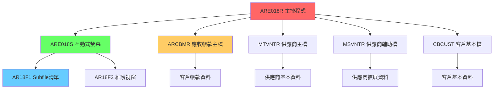
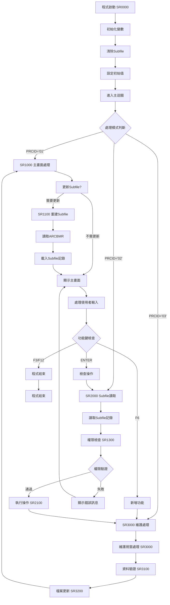

# ARE018R_H05 程式規格書

## 1. 基本資料

| 項目 | 內容 |
|------|------|
| **程式編號** | ARE018R |
| **程式名稱** | 應收帳款客戶維護互動式系統 |
| **程式類型** | RPG (Report Program Generator) |
| **廠區** | H05 |
| **系統名稱** | 應收帳款管理系統 (AR) |
| **子系統** | 客戶帳款維護 (互動式) |
| **檔案位置** | H05RPGSRC_THSRC/ARE018R.txt |

## 2. 程式功能說明

### 主要功能
ARE018R是應收帳款管理系統中的核心互動式維護程式，H05廠區版本提供完整的客戶帳款資料管理功能：

1. **互動式客戶維護**：提供完整的客戶帳款資料CRUD操作
2. **Subfile清單顯示**：以清單方式展示客戶帳款資料，支援大量資料瀏覽
3. **多功能操作模式**：支援新增、修改、複製、刪除、查詢等多種操作
4. **權限控制機制**：完整的功能權限檢查與控制
5. **即時資料查詢**：支援客戶編號範圍查詢和即時資料更新
6. **互動式特色**：視窗化操作介面，提供良好的使用者體驗

### 業務流程說明
此程式是應收帳款管理的核心操作介面，提供業務人員進行客戶帳款資料的日常維護作業：

```
權限驗證 → 客戶查詢 → Subfile顯示 → 操作選擇 → 資料維護 → 更新確認
```

### 系統特色
- **Subfile技術**：高效的清單顯示與操作機制
- **視窗化介面**：現代化的操作視窗設計
- **權限分級控制**：六種操作權限的精細控制
- **即時資料同步**：支援多使用者環境的資料一致性

## 3. 檔案架構與關聯圖

### 系統架構圖


### 檔案使用清單
| 檔案名稱 | 使用方式 | 說明 | 關鍵欄位 |
|----------|----------|------|----------|
| **主要檔案** |
| ARCBMR | UPDATE | 應收帳款客戶主檔 | CRVNTR(客戶編號), CRCUNO(客戶代號), CRFNAM(客戶名稱) |
| ARE018S | WORKSTATION | 互動式螢幕檔案 | 含AR18F1(Subfile), AR18F2(維護視窗) |
| **輔助檔案** |
| MTVNTR | INPUT | 供應商主檔 | 客戶資料驗證 |
| MSVNTR | INPUT | 供應商輔助檔 | 客戶資料擴展 |
| CBCUST | INPUT | 客戶基本檔 | 客戶基本資料參照 |
| **使用者資料區** |
| UDS | READ | 使用者資料區 | U#YYMM(年月), S#COMP(公司), S#USER(使用者), U#LOC(廠區) |

### 資料流向說明
1. **查詢流**：客戶編號輸入 → ARCBMR檔案查詢 → Subfile清單顯示
2. **維護流**：操作選擇 → 資料驗證 → 視窗操作 → 檔案更新
3. **權限流**：功能權限檢查 → 操作授權 → 執行確認

## 4. 檔案欄位規格說明

### 🎯 主要資料結構

#### ARCBMR (應收帳款客戶主檔) 欄位分析

##### ARCBMR核心欄位切割視覺化：
```
ARCBMR記錄：[FLAG|LOC|VNTR__|CUNO__|FNAM__________________|...]
位置:        001  002  003-08  009-14  015-62              063-
             ↓    ↓    ↓       ↓       ↓                   ↓
處理旗標:   [F]                                              處理狀態標記
廠區代號:    [L]                                             廠區識別
客戶編號:     [VNTR__]                                       6位客戶編號
客戶代號:            [CUNO__]                               6位客戶代號
客戶名稱:                    [FNAM__________________]        48位客戶名稱
時間戳記:                                           [ENTM/UPDT] 建立/更新時間
```

### 欄位切割技術詳解

#### 客戶識別碼雙重編號系統

##### 客戶編號系統分析：
```
主要識別: CRVNTR (6字元) - 客戶編號 (主鍵)
輔助識別: CRCUNO (6字元) - 客戶代號 (業務代號)
```

#### UDS (使用者資料區) 結構分析

##### UDS欄位切割視覺化：
```
UDS：[YM__|COMP___________________________|USER______|DEV_____|LOC]
位置: 002   951-985                       1001-1010  1011-1020 1021
      ↓     ↓                             ↓          ↓         ↓
年月: [YM__]                                                   處理年月
公司: [COMP___________________________]                        公司代號(35字元)
使用者:[USER______]                                            使用者ID(10字元)
設備: [DEV_____]                                               設備名稱(10字元)
廠區: [L]                                                      廠區代號(1字元)
```

### 欄位挪用分析

#### 處理旗標(CRFLAG)的多重用途
- **原始設計**：處理狀態標記(新增/修改/刪除)
- **業務挪用**：
  - ' '：正常狀態
  - 'D'：刪除標記
  - 'A'：新增狀態
  - 'U'：更新狀態
  - **挪用原因**：統一的資料處理狀態管理
  - **業務邏輯**：支援批次處理和即時處理的狀態追蹤

#### 客戶名稱(CRFNAM)的顯示優化
- **技術特色**：使用48O (Output-only)欄位定義
- **設計考量**：
  - 提供充足的中文字元顯示空間
  - 避免使用者直接修改，確保資料一致性
  - 支援完整的客戶名稱顯示

#### 權限控制欄位(D#AUT)的精細設計
```
D#AUT (6字元)：[A|M|C|D|I|P]
               ↓ ↓ ↓ ↓ ↓ ↓
D#AUTA (1字元)：[A]            新增權限 (1=允許, 0=禁止)
D#AUTM (1字元)： [M]           修改權限 (1=允許, 0=禁止)
D#AUTC (1字元)：  [C]          複製權限 (1=允許, 0=禁止)
D#AUTD (1字元)：   [D]         刪除權限 (1=允許, 0=禁止)
D#AUTI (1字元)：    [I]        查詢權限 (1=允許, 0=禁止)
D#AUTP (1字元)：     [P]       列印權限 (1=允許, 0=禁止)
```

### 欄位定義表格
| 欄位名稱 | 類型 | 長度 | 說明 | 業務用途 | 挪用情況 |
|----------|------|------|------|----------|----------|
| CRFLAG | CHAR | 1 | 處理旗標 | 狀態管理 | 多狀態標記 |
| CRLOCA | CHAR | 1 | 廠區代號 | 廠區識別 | 標準使用 |
| CRVNTR | CHAR | 6 | 客戶編號 | 主鍵識別 | 標準使用 |
| CRCUNO | CHAR | 6 | 客戶代號 | 業務代號 | 標準使用 |
| CRFNAM | CHAR | 48 | 客戶名稱 | 顯示名稱 | 唯讀優化 |
| D#AUT | CHAR | 6 | 權限控制 | 功能授權 | 六重權限切割 |

## 5. 輸出/入螢幕布局

### ARE018S 互動式螢幕設計

#### 主畫面 Subfile 清單布局視覺化：
```
+------------------------------------------------------------------------------+
|  2016/12/26    東鋼應收帳款客戶維護作業系統    ARE018R           H05TERM01  |
+------------------------------------------------------------------------------+
| 功能: 2=修改                                                                 |
|                                                                              |
| 廠區: H  客戶編號: [______]                                                  |
|                                                                              |
| 項  客戶編號  客戶代號   客    戶    名    稱                                |
| _   ______    ______     ______________________________________              |
| _   ______    ______     ______________________________________              |
| _   ______    ______     ______________________________________              |
| _   ______    ______     ______________________________________              |
| _   ______    ______     ______________________________________              |
| _   ______    ______     ______________________________________              |
| _   ______    ______     ______________________________________              |
| _   ______    ______     ______________________________________              |
| _   ______    ______     ______________________________________              |
| _   ______    ______     ______________________________________              |
| _   ______    ______     ______________________________________              |
| _   ______    ______     ______________________________________              |
|                                                                              |
| 執行功能: F3=結束作業 F12=回上層畫面 F6=新增                                |
| [錯誤訊息顯示區]                                                             |
+------------------------------------------------------------------------------+
```

#### 維護視窗 (AR18F2) 布局視覺化：
```
                    +--------------------------------------------+
                    | 客戶編號: [______]                         |
                    |                                            |
                    | 客戶代號: [______]                         |
                    |                                            |
                    | 執行功能: F3,F12=回上層畫面                |
                    | [錯誤訊息顯示區]                           |
                    +--------------------------------------------+
```

### 輸入欄位說明
| 欄位 | 名稱 | 類型 | 長度 | 必填 | 說明 |
|------|------|------|------|------|------|
| S@VNTR | 查詢客戶編號 | 6A | 6 | 否 | 客戶編號查詢條件 |
| S#OPT | 操作選項 | 1N | 1 | 條件 | 操作功能選擇 (2=修改, 5=查詢) |
| S1VNTR | 維護客戶編號 | 6A | 6 | 是 | 維護作業的客戶編號 |
| S1CUNO | 維護客戶代號 | 6A | 6 | 是 | 維護作業的客戶代號 |

### 螢幕特色功能
- **Subfile技術**：支援大量資料的清單顯示與捲動
- **視窗化操作**：維護功能使用彈出視窗，提升操作體驗
- **顏色標示**：錯誤訊息使用紅色顯示，功能說明使用藍色
- **游標定位**：自動定位到錯誤欄位，提升操作效率

### 功能鍵定義
| 功能鍵 | 功能說明 | 適用畫面 |
|--------|----------|----------|
| **F3** | 結束作業 | 主畫面、維護視窗 |
| **F6** | 新增客戶 | 主畫面 |
| **F12** | 回上層畫面 | 主畫面、維護視窗 |
| **ENTER** | 確認執行 | 所有畫面 |

## 6. 處理流程程序說明

### 🎯 主程序邏輯深度分析

#### 整體處理流程圖


### 子程序邏輯深度分析

#### SR0000 - 初始化處理邏輯
```
1. 清除Subfile控制 (CLEARAR18F1CL)
2. 設定Subfile序號為1 (S#NBR = 1)
3. 讀取廠區代號 (S#LOCA = U#LOC)
4. 初始化查詢條件 (W#VNTR = *LOVAL)
5. 設定更新旗標 (UPDSCR = 'Y')
6. 設定處理模式 (PRCID = '01')
```

#### SR1000 - 主畫面處理邏輯
```
1. 檢查是否需要更新Subfile (UPDSCR = 'Y')
2. 如需更新，執行SR1100重建Subfile
3. 檢查Subfile是否有記錄 (RRN檢查)
4. 顯示主畫面 (EXFMT AR18F1CL)
5. 處理功能鍵:
   - F3/F12: 結束程式
   - F6: 新增功能
   - ENTER: 繼續處理
6. 檢查客戶編號變更
7. 設定下一處理模式
```

#### SR1100 - Subfile重建邏輯
```
1. 設定Subfile清除旗標 (*IN73 = *ON)
2. 清除Subfile (WRITE AR18F1CL)
3. 關閉清除旗標 (*IN73 = *OFF)
4. 重設RRN計數器
5. 依客戶編號讀取ARCBMR:
   - SETLL操作定位
   - 循環READ讀取記錄
   - 載入Subfile欄位
   - 寫入Subfile記錄
6. 設定游標位置
```

#### SR1300 - 權限檢查邏輯
```
檢查六種操作權限:
1. D#AUTA = '0' 且 操作=新增 → 拒絕
2. D#AUTM = '0' 且 操作=修改 → 拒絕  
3. D#AUTC = '0' 且 操作=複製 → 拒絕
4. D#AUTD = '0' 且 操作=刪除 → 拒絕
5. D#AUTI = '0' 且 操作=查詢 → 拒絕
6. D#AUTP = '0' 且 操作=列印 → 拒絕
```

#### SR2000 - Subfile讀取處理邏輯
```
1. 循環讀取Subfile記錄 (READC AR18F1)
2. 檢查操作權限 (EXSR SR1300)
3. 依權限結果:
   - 權限不足: 設定錯誤旗標，返回主畫面
   - 權限充足: 執行SR2100操作準備
4. 更新Subfile記錄狀態
5. 設定下一處理模式
```

#### SR2100 - 操作準備邏輯
```
1. 設定操作模式旗標:
   - W#OPT = 2: 修改模式 (*IN60 = *ON)
   - W#OPT = 4/5: 刪除/查詢模式 (*IN61 = *ON)
2. 如為新增操作 (W#OPT = 1):
   - 清除維護畫面
   - 跳至結束處理
3. 如為其他操作:
   - 讀取ARCBMR記錄 (CHAIN RARCBMR)
   - 載入維護畫面欄位
   - 設定維護模式
```

#### SR3000 - 維護視窗處理邏輯
```
1. 顯示維護視窗 (EXFMT AR18F2)
2. 處理功能鍵:
   - F3: 結束程式
   - F12: 回主畫面
3. 如非查詢模式，執行欄位驗證 (SR3100)
4. 檢查驗證結果
5. 如驗證通過，執行檔案更新 (SR3200)
6. 設定處理結果
```

#### SR3100 - 欄位驗證邏輯
```
檢查必填欄位:
1. 客戶編號 (S1VNTR) 不可空白
2. 客戶代號 (S1CUNO) 不可空白
3. 欄位格式驗證
4. 業務邏輯檢查
5. 設定錯誤旗標和訊息
```

### 特殊邏輯處理

#### Subfile管理技術
- **清除控制**：使用*IN73控制Subfile清除
- **顯示控制**：使用*IN72控制Subfile顯示
- **游標管理**：SFLCSRRRN自動游標定位
- **記錄計數**：RRN管理Subfile記錄數量

#### 權限控制機制
- **六級權限**：新增、修改、複製、刪除、查詢、列印
- **即時驗證**：操作前即時檢查權限
- **錯誤提示**：權限不足時顯示具體錯誤訊息

#### 檔案鎖定機制
- **記錄鎖定**：UPDATE檔案使用記錄層級鎖定
- **併發控制**：支援多使用者同時操作
- **錯誤恢復**：檔案操作失敗時自動恢復

## 7. 數據操作與轉換分析

### 檔案操作詳解

#### ARCBMR主檔操作技術
```
1. SETLL定位操作:
   S@VNTR SETLL RARCBMR
   - 使用客戶編號快速定位
   - 支援範圍查詢的起始點設定

2. 循環讀取操作:
   READ RARCBMR N *IN52
   - 順序讀取客戶記錄
   - 使用*IN52控制EOF狀態

3. 隨機存取操作:
   S#VNTR CHAIN RARCBMR N *IN54
   - 精確查詢特定客戶記錄
   - 支援即時資料驗證
```

#### Subfile資料載入技術
```
Subfile記錄載入流程:
1. CLEAR AR18F1 (清除Subfile記錄)
2. 欄位對應:
   CRVNTR → S#VNTR (客戶編號)
   CRCUNO → S#CUNO (客戶代號)  
   CRFNAM → S#CUNM (客戶名稱)
3. RRN計數管理:
   ADD 1 RRN (記錄計數器遞增)
4. WRITE AR18F1 (寫入Subfile)
```

### 數據轉換邏輯

#### 使用者輸入轉換
```
查詢條件轉換:
S@VNTR → W#VNTR (查詢客戶編號)
- 支援部分比對查詢
- *LOVAL預設值處理

操作選項轉換:
S#OPT → W#OPT (操作模式)
- 數值轉換為操作識別碼
- 支援多種操作模式
```

#### 顯示格式轉換
```
客戶名稱顯示:
CRFNAM (48字元) → S#CUNM (36字元顯示)
- 自動截取適合顯示的長度
- 保持中文字元完整性

旗標狀態轉換:
CRFLAG → 顯示狀態
- ' ': 正常狀態
- 'D': 刪除標記
- 特殊符號顯示處理
```

### 計算邏輯分析

#### RRN (Record Number) 管理
```
Subfile記錄數管理:
1. W#LRRN記錄最後RRN
2. S#NBR游標位置計算
3. 記錄數範圍檢查:
   IF S#NBR > RRN AND RRN ≠ 0
   THEN S#NBR = RRN
```

#### 廠區代號處理
```
廠區識別邏輯:
U#LOC → S#LOCA (廠區代號傳遞)
- 自動讀取使用者廠區
- 支援多廠區資料隔離
```

### 檢核機制詳解

#### 資料完整性檢查
- **必填欄位檢查**：客戶編號、客戶代號不可空白
- **格式驗證**：客戶編號格式檢查
- **重複性檢查**：避免重複的客戶編號
- **關聯性檢查**：與其他主檔的關聯驗證

#### 業務邏輯檢查
- **廠區限制**：只能維護所屬廠區的客戶資料
- **狀態檢查**：檢查客戶狀態是否允許修改
- **權限驗證**：操作前的權限二次確認

#### 系統層級檢查
- **檔案鎖定檢查**：避免同時修改衝突
- **事務完整性**：確保資料更新的原子性
- **錯誤恢復機制**：操作失敗時的資料回復

## 8. 錯誤處理程序說明

### 錯誤代碼與處理方式清冊

| 錯誤代碼 | 錯誤訊息 | 原因說明 | 處理方式 | 預防措施 |
|----------|---------|---------|---------|----------|
| **F3/F12 取消** | 使用者取消操作 | 使用者主動按下F3或F12功能鍵 | 1. 立即清除處理狀態<br>2. 返回上層畫面或結束程式<br>3. 不保存任何變更 | 提供清楚的操作指引 |
| **權限不足** | 操作權限不足 | 使用者權限設定不允許執行特定操作 | 1. 顯示權限錯誤訊息<br>2. 返回主畫面<br>3. 記錄權限檢查日誌 | 建立完整的權限管理制度 |
| **必填欄位錯誤** | 客戶編號不可空白 | 必填欄位S1VNTR未輸入 | 1. 設定錯誤旗標*IN33<br>2. 顯示具體錯誤訊息<br>3. 游標定位到錯誤欄位 | 在畫面設計時明確標示必填欄位 |
| **檔案讀取錯誤** | 客戶資料不存在 | 指定的客戶編號在ARCBMR中不存在 | 1. 設定*IN54錯誤旗標<br>2. 清除顯示欄位<br>3. 提供新增建議 | 定期檢查主檔資料完整性 |
| **Subfile溢位** | 清單記錄過多 | Subfile記錄數超過系統限制 | 1. 限制查詢範圍<br>2. 分頁顯示處理<br>3. 提供更精確查詢條件 | 建立合理的查詢範圍限制 |
| **檔案鎖定錯誤** | 記錄被其他使用者鎖定 | 多使用者同時修改同一筆記錄 | 1. 顯示檔案忙碌訊息<br>2. 建議稍後重試<br>3. 自動重新整理資料 | 建立適當的記錄鎖定策略 |
| **廠區權限錯誤** | 無權限存取其他廠區資料 | 嘗試存取非所屬廠區的客戶資料 | 1. 顯示廠區限制訊息<br>2. 自動過濾顯示範圍<br>3. 返回主畫面 | 在查詢時自動加入廠區限制條件 |

### 處理方式說明

#### 功能鍵中斷處理
```
IF (*IN03 = *ON OR *IN12 = *ON)
THEN PRCID = '00' (結束程式)
LEAVE (離開處理迴圈)
```
- **處理邏輯**：立即中斷目前處理
- **清理作業**：自動清除暫存狀態
- **使用者回饋**：正常結束無錯誤訊息

#### 權限驗證錯誤處理
```
權限檢查邏輯 (SR1300):
各操作權限逐一檢查
設定對應錯誤訊息
返回主畫面重新選擇
```
- **即時檢查**：操作前立即驗證權限
- **明確提示**：顯示具體缺少的權限類型
- **安全記錄**：記錄權限違規嘗試

#### Subfile管理錯誤處理
```
RRN檢查邏輯:
IF (RRN = *ZEROS)
THEN 設定*IN72 (SFLDSP OFF)
顯示"清單記錄未建立"訊息
```
- **空清單處理**：優雅處理無資料情況
- **使用者引導**：提供下一步操作建議
- **效能優化**：避免不必要的Subfile顯示

#### 檔案操作錯誤處理
```
CHAIN操作錯誤:
*IN54 = *ON (記錄不存在)
清除顯示欄位
提供新增選項
```
- **資料驗證**：即時檢查資料存在性
- **替代方案**：提供相關操作選項
- **資料一致性**：確保顯示資料的正確性

## 9. 🎯 特殊技術實現說明

### Subfile互動技術

#### 動態Subfile管理技術
```
Subfile控制旗標:
*IN70: SFLNXTCHG (下次變更)
*IN72: SFLDSP (Subfile顯示)
*IN73: SFLCLR (Subfile清除)

控制流程:
1. *IN73=*ON → WRITE AR18F1CL (清除)
2. *IN73=*OFF → 開始載入記錄
3. *IN72=*ON → 顯示Subfile
4. *IN70=*ON → 標記需要重新載入
```
- **技術特色**：使用指示器精確控制Subfile狀態
- **效能優化**：只在必要時重建Subfile內容
- **使用者體驗**：流暢的清單操作體驗

#### 游標定位技術
```
游標控制機制:
SFLCSRRRN(&S#CSR) - 游標RRN定位
SFLRCDNBR(CURSOR) - 記錄號碼游標
S#NBR管理目前游標位置

定位邏輯:
1. 錯誤發生時自動定位到錯誤記錄
2. 操作完成後維持游標位置
3. 支援大清單的快速導覽
```

### 視窗化操作技術

#### 彈出視窗技術
```
AR18F2視窗定義:
WINDOW(6 20 10 46) - 視窗位置與大小
WDWBORDER((*COLOR PNK)(*DSPATR RI)) - 視窗邊框
OVERLAY - 覆蓋顯示模式

視覺效果:
- 粉紅色邊框，醒目顯示
- 覆蓋模式，不遮蔽主畫面
- 適中大小，符合操作需求
```
- **現代化介面**：類似現代GUI的視窗體驗
- **空間利用**：有效利用螢幕空間
- **操作直覺**：符合使用者操作習慣

### 權限控制技術

#### 六級權限控制系統
```
權限檢查矩陣:
操作類型 | 權限欄位 | 檢查邏輯
--------|----------|----------
新增     | D#AUTA  | = '1' 允許
修改     | D#AUTM  | = '1' 允許  
複製     | D#AUTC  | = '1' 允許
刪除     | D#AUTD  | = '1' 允許
查詢     | D#AUTI  | = '1' 允許
列印     | D#AUTP  | = '1' 允許
```
- **精細控制**：每種操作獨立授權
- **安全機制**：預設拒絕原則
- **審計追蹤**：完整的權限檢查記錄

#### 動態權限檢查技術
```
權限檢查時機:
1. 功能選擇時 - 預防性檢查
2. 資料操作前 - 執行前確認
3. 畫面顯示時 - 介面權限控制

檢查流程:
IF (操作類型 AND 對應權限 = '0')
THEN 拒絕操作 + 顯示錯誤
ELSE 允許操作
```

### 檔案存取優化技術

#### 智能檔案定位技術
```
SETLL/READ組合技術:
1. SETLL快速定位到起始點
2. READ循序讀取相關記錄
3. 支援範圍查詢和精確查詢

效能優化:
- 使用索引鍵快速定位
- 避免全檔掃描
- 支援大檔案高效查詢
```

#### 記錄鎖定策略
```
更新檔案定義:
FARCBMR UF E K DISK A
- UF: Update檔案
- K: 使用索引鍵存取
- A: 到達檔案結尾時新增

鎖定機制:
- 記錄層級鎖定
- 支援併發讀取
- 防止更新衝突
```

### 程式碼架構優化

#### 模組化設計技術
```
主要子程式模組:
SR0000: 初始化模組
SR1000: 主畫面控制模組
SR1100: Subfile管理模組
SR1300: 權限檢查模組
SR2000: 資料讀取模組
SR3000: 維護處理模組

模組化優勢:
- 功能清晰分離
- 易於維護和除錯
- 支援功能擴展
```

#### 狀態機設計模式
```
處理狀態控制:
PRCID='01': 主畫面狀態
PRCID='02': Subfile處理狀態
PRCID='03': 維護處理狀態
PRCID='00': 結束狀態

狀態轉換:
明確的狀態轉換邏輯
避免狀態混亂
支援復雜的處理流程
```

## 10. 跨廠區版本分析

### 版本分布情況
| 廠區 | 程式版本 | 存在狀態 | 特殊功能 | 互動特色 |
|------|----------|----------|----------|----------|
| **U01** | - | ❌不存在 | - | ❌無互動版本 |
| **H05** | 互動版 | ✅存在 | 完整互動維護 | ✅完整Subfile支援 |
| **K02** | - | ❌不存在 | - | - |
| **P02** | - | ❌不存在 | - | - |

### 程式特色分析

#### ARE018R H05版本特點
1. **完整互動系統**：
   - **業務需求**：提供完整的客戶帳款維護功能
   - **技術實現**：Subfile + 視窗化操作
   - **使用者體驗**：現代化的互動操作介面

2. **權限控制機制**：
   - **六級權限**：新增、修改、複製、刪除、查詢、列印
   - **安全設計**：預設拒絕，明確授權
   - **審計功能**：完整的操作記錄

3. **檔案管理功能**：
   - **主檔維護**：ARCBMR應收帳款客戶主檔
   - **關聯檢查**：與供應商、客戶基本檔的資料一致性
   - **併發控制**：支援多使用者同時操作

### 技術架構分析

#### Subfile技術應用
```
AR18F1 Subfile定義:
- SFLPAG(12): 每頁12筆記錄
- SFLSIZ(13): 總計13筆記錄
- OVERLAY: 覆蓋顯示模式

技術優勢:
1. 高效的大量資料顯示
2. 流暢的操作體驗
3. 記憶體使用優化
```

#### 視窗化操作設計
```
AR18F2維護視窗:
- 小型彈出視窗設計
- 專注於核心維護欄位
- 減少畫面切換複雜度

設計理念:
1. 操作步驟簡化
2. 視覺焦點集中
3. 錯誤處理優化
```

### 功能差異說明

#### H05版本的技術創新
1. **互動式設計**：
   - **傳統批次 vs 互動式**：從批次處理轉向即時互動
   - **使用者體驗**：提供即時回饋和錯誤檢查
   - **操作效率**：減少作業時間和錯誤率

2. **權限精細化**：
   - **功能級權限**：每個操作都有獨立權限控制
   - **安全強化**：避免越權操作和資料洩露
   - **管理便利**：靈活的權限分配機制

3. **技術先進性**：
   - **Subfile技術**：AS/400平台的先進清單處理技術
   - **視窗化介面**：類似現代GUI的操作體驗
   - **狀態管理**：清晰的處理狀態控制

## 11. 備註

### 特殊注意事項

1. **Subfile操作重要性**：
   - RRN管理的正確性會影響清單顯示效果
   - 注意大量資料時的效能影響

2. **權限控制管理**：
   - 權限設定變更需要重新登入才生效
   - 定期檢視權限分配的合理性

3. **檔案鎖定處理**：
   - 多使用者環境下注意記錄鎖定時間
   - 處理檔案忙碌時的使用者體驗 