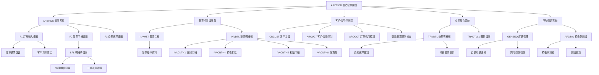
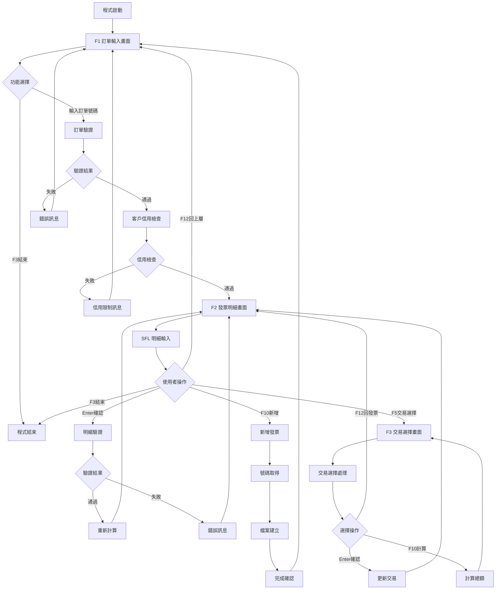
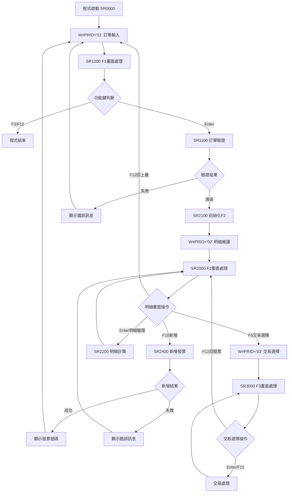
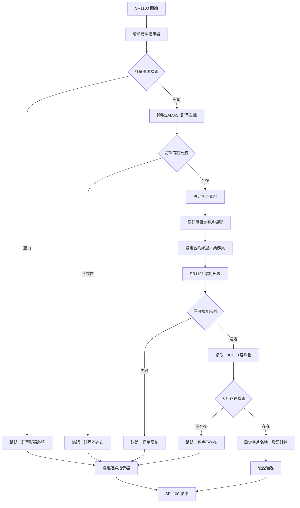
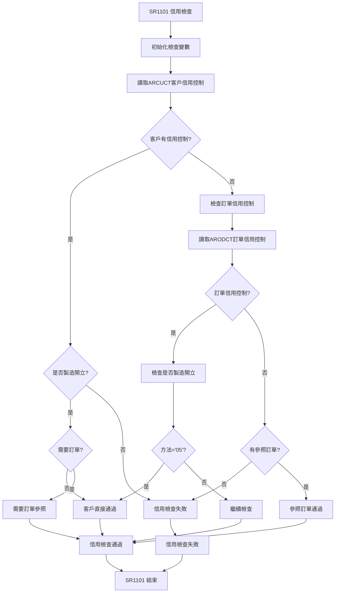
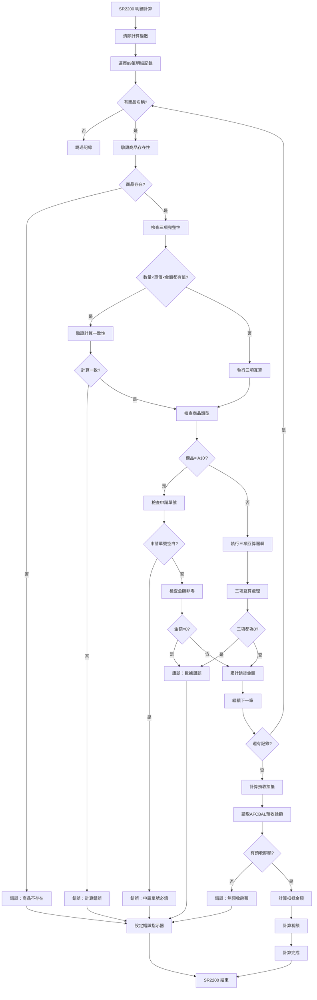
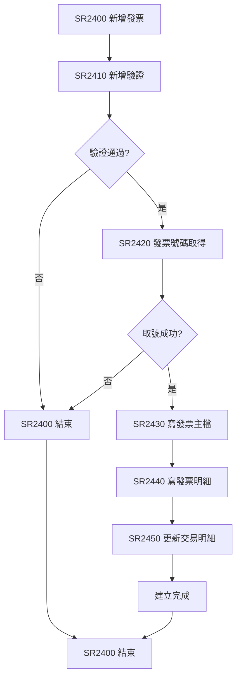
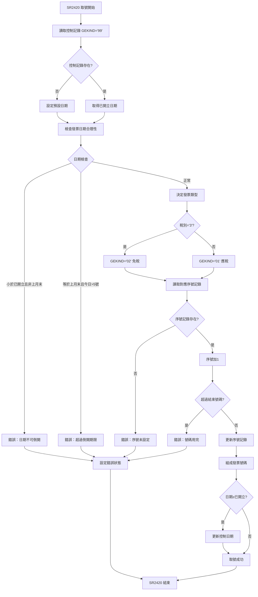

# ARE030R_P02 程式規格書

## 1. 基本資料

| 項目 | 內容 |
|------|------|
| 程式編號 | ARE030R |
| 程式名稱 | 製造發票開立作業 |
| 程式類型 | RPG/400 |
| 廠區 | P02 |
| 系統名稱 | 應收帳款管理系統 |
| 子系統 | 發票開立管理子系統 |
| 檔案位置 | P02RPGSRC_THSRC/ARE030R.txt |

## 2. 程式功能說明

### 主要功能
ARE030R為製造發票開立作業程式，負責處理製造業發票的建立作業，主要功能包括：

1. 訂單驗證與設定：驗證訂單號碼、客戶資料、合約條件設定
2. 發票明細維護：子檔案形式輸入發票商品明細
3. 自動計算機制：計算金額、稅額、預收款項
4. 發票號碼管理：自動取號、序號管理、跨月控制
5. 交易明細關聯：與交易明細檔案整合，支援選擇性沖銷
6. 客戶信用控制：檢查客戶信用額度、預收款餘額

### 業務流程說明
此程式處理製造業發票開立作業：
- 訂單基礎發票：基於訂單資料自動設定客戶和商品資訊
- 明細輸入：支援99筆明細輸入，包含數量、單價、金額
- 金額計算：三項互算（數量×單價=金額）
- 稅額計算：應稅商品自動計算5%營業稅
- 預收款處理：自動扣抵預收款，計算實際應收金額
- 交易整合沖銷：可選擇特定交易明細進行發票沖銷

## 3. 檔案架構與關聯圖

### 使用檔案清單

| 檔案名稱 | 檔案類型 | 使用方式 | 說明 |
|---------|---------|---------|------|
| ARE030S | DSPF | 讀寫 | 發票開立維護畫面檔案 |
| INVMST | PF | 寫入 | 發票主檔 |
| INVDTL | PF | 寫入 | 發票明細檔 |
| GENSEQ | PF | 讀寫更新 | 發票號碼序號檔 |
| AFCBAL | PF | 讀寫更新 | 預收款餘額檔 |
| TRNDTL | PF | 讀寫更新 | 交易明細檔 |
| TRNDTLL1 | LF | 讀取 | 交易明細邏輯檔案 |
| ARCUCT | PF | 讀取 | 客戶信用控制檔 |
| ARODCT | PF | 讀取 | 訂單信用控制檔 |
| CBCUST | PF | 讀取 | 客戶主檔 |
| SAMAST | PF | 讀取 | 訂單主檔 |

### 檔案關聯視覺化圖表



### 資料流向說明

1. **訂單驗證階段**：輸入訂單號碼，系統驗證並設定客戶、合約資訊
2. **明細輸入階段**：透過子檔案輸入商品明細，系統執行三項互算
3. **金額計算階段**：計算銷貨金額、稅額、預收扣抵、最終應收金額
4. **信用檢查階段**：檢查客戶信用額度、製造發票限制
5. **號碼取得階段**：自動從序號檔取得發票號碼
6. **檔案建立階段**：同步建立發票主檔、明細檔、更新相關檔案

## 4. 檔案欄位規格說明

### ARE030S 畫面檔案

#### F1 訂單輸入畫面格式
```
┌─────────────────────────────────────────────────────────────────────────────┐
│ 12/26/24      東和鋼鐵股份有限公司                           ARE030S-1      │
│                     *** 製造發票開立作業 ***                               │
│                                                           DEVNAME01         │
│                                                                             │
│                訂單號碼：[______]                                           │
│                                                                             │
│                                                                             │
│                                                                             │
│                                                                             │
│                                                                             │
│                                                                             │
│                                                                             │
│                                                                             │
│                                                                             │
│                                                                             │
│                                                                             │
│                                                                             │
│ [錯誤訊息顯示區域]                                                          │
│ ENTER:確認   PF03:結束                                                     │
└─────────────────────────────────────────────────────────────────────────────┘
```

#### F2 發票明細維護畫面格式
```
┌─────────────────────────────────────────────────────────────────────────────┐
│ 12/26/24      東和鋼鐵股份有限公司                           ARE030S-2      │
│ 訂單：OR113001  客戶：10001 東和公司        發票日期：1131226              │
│ 發票號碼：IV113002001                                     DEVNAME01         │
│ 發票種類：1  稅別：1  區域：H05                                            │
│   項次  商品名稱  數量     單價        金額      申請單號                   │
│    01  [______] [______] [________] [________] [________]                  │
│    02  [______] [______] [________] [________] [________]                  │
│    03  [______] [______] [________] [________] [________]                  │
│    ...                                                                     │
│                                                                             │
│                          銷貨金額：    125,000                            │
│                          營業稅額：      6,250                            │
│                          預收扣抵：     50,000                            │
│                          應收總額：     81,250                            │
│                                                                             │
│                                                                             │
│                                                                             │
│ [錯誤訊息顯示區域]                                                          │
│ ENTER:確認   PF03:結束   PF05:交易選擇   PF10:新增   PF12:回上層          │
└─────────────────────────────────────────────────────────────────────────────┘
```

#### F3 交易選擇畫面格式
```
┌─────────────────────────────────────────────────────────────────────────────┐
│ 12/26/24      東和鋼鐵股份有限公司                           ARE030S-3      │
│ 客戶：10001 東和公司      訂單：OR113001                                   │
│                                                           DEVNAME01         │
│                                                                             │
│   選擇 交易代碼 交易號碼  日期     商品    數量    單價     金額     稅額  │
│    []   TX001   0001   1131201  鋼材A   100.0  1,200  120,000    6,000  │
│    []   TX002   0002   1131202  鋼材B    50.0  1,000   50,000    2,500  │
│    []   TX003   0003   1131203  鋼材C    25.0  2,000   50,000    2,500  │
│    ...                                                                     │
│                                                                             │
│                                  選擇開始日期：[________]                  │
│                                  選擇結束日期：[________]                  │
│                                                                             │
│                                  選擇總金額：  220,000                    │
│                                                                             │
│                                                                             │
│ [錯誤訊息顯示區域]                                                          │
│ ENTER:確認選擇   PF10:計算總額   PF12:回發票明細                          │
└─────────────────────────────────────────────────────────────────────────────┘
```

### INVMST 發票主檔

| 欄位名稱 | 資料型態 | 長度 | 說明 | 特殊處理 |
|---------|---------|------|------|---------|
| INNO | CHAR | 10 | 發票號碼 | 主要索引 |
| INTYPE | CHAR | 1 | 發票類型 | '1'=製造發票 |
| INCUNO | CHAR | 5 | 客戶編號 | 客戶識別 |
| INCUNM | CHAR | 24 | 客戶名稱 | 客戶名稱 |
| INORNO | CHAR | 6 | 訂單號碼 | 關聯訂單 |
| ININDT | NUMERIC | 8,0 | 發票日期 | 開立日期 |
| INKIND | CHAR | 1 | 發票計算 | 稅額計算方式 |
| INSALE | CHAR | 2 | 銷售業務員 | 業務責任 |
| INRVID | CHAR | 2 | 應收業務員 | 收款責任 |
| INSATP | CHAR | 1 | 合約類型 | 合約分類 |
| INAREA | CHAR | 3 | 營業區域 | 區域代碼 |
| INTXTP | CHAR | 1 | 稅別類型 | 稅別識別 |
| INAAMT | NUMERIC | 11,2 | 銷貨金額 | 未稅金額 |
| INATAX | NUMERIC | 9,2 | 營業稅額 | 5%營業稅 |
| INBAMT | NUMERIC | 11,2 | 預收扣抵 | 負值扣抵 |
| INNBAL | NUMERIC | 11,2 | 發票餘額 | 動態更新 |
| INFLAG | CHAR | 1 | 處理標誌 | 處理狀態 |

### INVDTL 發票明細檔

| 欄位名稱 | 資料型態 | 長度 | 說明 | 特殊處理 |
|---------|---------|------|------|---------|
| IVNO | CHAR | 10 | 發票號碼 | 主要索引 |
| IVACNT | CHAR | 1 | 帳戶代碼 | 功能區分 |
| IVITEM | NUMERIC | 2,0 | 項次 | 序號 |
| IVACDT | NUMERIC | 8,0 | 會計日期 | 處理日期 |
| IVORNO | CHAR | 6 | 訂單號碼 | 關聯訂單 |
| IVPDCD | CHAR | 6 | 商品代碼 | 商品識別 |
| IVQTY | NUMERIC | 9,3 | 數量 | 商品數量 |
| IVUPRC | NUMERIC | 11,2 | 單價 | 商品單價 |
| IVAMT | NUMERIC | 11,2 | 金額 | 明細金額 |
| IVAPNO | CHAR | 6 | 申請單號 | 申請編號 |
| IVFLAG | CHAR | 1 | 處理標誌 | 狀態控制 |

### GENSEQ 發票號碼序號檔

| 欄位名稱 | 資料型態 | 長度 | 說明 | 特殊處理 |
|---------|---------|------|------|---------|
| GEKIND | CHAR | 2 | 序號類型 | '01'=應稅,'02'=免稅,'99'=控制 |
| GEPRIN | CHAR | 5 | 印表機別 | 印表機識別 |
| GEPRE | CHAR | 2 | 發票字軌 | 字軌前綴 |
| GECUNO | NUMERIC | 8,0 | 目前號碼 | 流水號 |
| GESTNO | NUMERIC | 8,0 | 起始號碼 | 起始編號 |
| GEENNO | NUMERIC | 8,0 | 結束號碼 | 結束編號 |

### 欄位切割視覺化

```
IVACNT 帳戶代碼功能區分：
┌─────────────────────────────────────────┐
│ '1' = 銷貨明細 (正常商品銷售)            │
│ '4' = 預收扣抵 (負值，扣抵預收款)        │
│ '5' = 營業稅額 (5%營業稅)               │
│ '8' = 服務費明細 (A10服務費收入)         │
└─────────────────────────────────────────┘

三項互算邏輯：
┌─────────────────────────────────────────┐
│ 輸入：數量 + 單價 → 計算：金額           │
│ 輸入：數量 + 金額 → 計算：單價           │
│ 輸入：單價 + 金額 → 計算：數量           │
└─────────────────────────────────────────┘

發票金額計算公式：
銷貨金額：Σ(數量 × 單價)
營業稅額：銷貨金額 × 5%（應稅商品）
預收扣抵：從AFCBAL扣抵
發票餘額：銷貨金額 + 營業稅額 + 預收扣抵
```

## 5. 輸出/入螢幕布局

### 畫面流程圖



### 功能鍵定義

#### F1 訂單輸入畫面
| 功能鍵 | 說明 | 處理邏輯 |
|--------|------|---------|
| Enter | 確認訂單號碼 | 執行訂單驗證、客戶設定、信用檢查 |
| F3 | 結束作業 | 結束程式執行 |

#### F2 發票明細畫面
| 功能鍵 | 說明 | 處理邏輯 |
|--------|------|---------|
| Enter | 明細驗證 | 執行明細驗證、三項互算、金額重算 |
| F3 | 結束作業 | 結束程式執行 |
| F5 | 交易選擇 | 進入交易選擇畫面 |
| F10 | 新增發票 | 執行發票建立作業 |
| F12 | 回到上層 | 回到F1訂單輸入畫面 |

#### F3 交易選擇畫面
| 功能鍵 | 說明 | 處理邏輯 |
|--------|------|---------|
| Enter | 確認選擇 | 更新選擇的交易明細 |
| F10 | 計算總額 | 計算選擇項目的總金額 |
| F12 | 回發票明細 | 回到F2發票明細畫面 |

## 6. 處理流程程序說明

### 主要程序流程

#### 程式主控迴圈


### 訂單驗證流程 (SR1100)

#### 複合驗證機制


#### SR1101 信用檢查細節


### 明細驗證與計算流程 (SR2200)

#### 三項互算機制


### 發票建立流程 (SR2400)

#### 建立機制


#### SR2420 發票號碼取得詳細流程


## 7. 數據操作與轉換說明

### 檔案操作說明

#### 檔案讀寫操作
1. INVMST發票主檔：
   - 寫入操作：建立新發票記錄
   - 檔案格式：固定格式記錄
   - 檔案命名：發票號碼為主鍵

2. INVDTL發票明細檔：
   - 寫入操作：建立明細記錄
   - 檔案格式：多筆明細記錄
   - 檔案命名：發票號碼+帳戶代碼為組合鍵

3. GENSEQ序號檔：
   - 讀寫更新：取得並更新發票號碼
   - 檔案格式：序號控制記錄
   - 檔案命名：序號類型為主鍵

### 數據轉換邏輯

#### 三項互算轉換
```
轉換邏輯說明：
數量、單價、金額三項中任意兩項有值時計算第三項
計算公式：數量 × 單價 = 金額
處理步驟：
1. 檢查三項欄位狀態
2. 根據空白欄位決定計算方向
3. 執行除法或乘法運算
4. 驗證計算結果一致性
```

#### 稅額計算轉換
```
轉換邏輯說明：
應稅商品自動計算5%營業稅
計算公式：銷貨金額 × 5% = 營業稅額
處理步驟：
1. 檢查發票計算類型
2. 累計應稅銷貨金額
3. 計算營業稅額
4. 建立稅額明細記錄
```

### 檢核機制說明

#### 訂單驗證檢核
- 檢核項目：訂單號碼存在性、客戶資料完整性
- 檢核時機：F1畫面Enter鍵執行時
- 檢核結果：通過則進入F2畫面，失敗則顯示錯誤訊息

#### 信用控制檢核
- 檢核項目：客戶製造發票開立權限、訂單信用狀況
- 檢核時機：訂單驗證通過後執行
- 檢核結果：通過則允許開立，失敗則禁止開立

#### 明細計算檢核
- 檢核項目：商品存在性、三項計算一致性、申請單號完整性
- 檢核時機：F2畫面Enter鍵執行時
- 檢核結果：通過則重新計算金額，失敗則標示錯誤欄位

## 8. 錯誤處理程序說明

### 錯誤代碼與處理方式清冊

| 錯誤編號 | 錯誤訊息 | 觸發條件 | 處理方式 | 預防措施 |
|----------|---------|---------|---------|----------|
| T#ERR,1 | 請輸入無此客戶編號 | 客戶不存在 | 確認客戶編號正確性 | 使用有效客戶編號 |
| T#ERR,2 | 請輸入無此訂單號碼 | 訂單不存在 | 確認訂單號碼正確性 | 使用有效訂單號碼 |
| T#ERR,4 | 此客戶不允許開立製造發票 | 信用控制限制 | 聯絡信用部門 | 檢查客戶信用狀況 |
| T#ERR,5 | 將會同時沖銷以下交易明細 | 沖銷確認提示 | 確認後按Enter | 仔細檢查沖銷項目 |
| T#ERR,6 | 此月份發票起訖號碼未設定 | 序號未設定 | 設定發票序號範圍 | 月初設定號碼範圍 |
| T#ERR,7 | 發票號碼已超過可用範圍 | 號碼用完 | 申請新的號碼範圍 | 監控號碼使用狀況 |
| T#ERR,8 | 服務費輸入請輸入申請編號 | A10缺申請單號 | 輸入申請單編號 | A10商品必填申請單號 |
| T#ERR,9 | 此訂單無此商品名稱 | 商品不在訂單中 | 確認商品名稱正確 | 使用訂單內商品 |
| T#ERR,10 | 發票日期不可早於已開立最後日期！ | 日期倒開限制 | 使用正確日期 | 順序開立發票 |
| T#ERR,11 | 發票銷貨金額不可空白 | 銷貨金額為0 | 輸入商品明細 | 確保有商品明細 |
| T#ERR,12 | 預收款餘額不足，請查看 | 預收餘額不足 | 確認預收款狀況 | 檢查預收款餘額 |
| T#ERR,13 | 預收款餘額現況不足，請注意 | 預收餘額警告 | 注意餘額不足 | 監控預收款餘額 |
| T#ERR,14 | 數量單價和金額計算錯誤！！！ | 三項計算不一致 | 重新輸入正確數據 | 仔細檢查計算 |
| T#ERR,15 | 數量單價和金額欄位請確實填入！ | 三項全部為空 | 輸入必要數據 | 完整填寫欄位 |
| T#ERR,16 | 商品單價和訂單不符 | 單價與訂單不符 | 確認單價正確性 | 使用訂單價格 |
| T#ERR,17 | 沖銷金額大於發票銷貨金額，不可新增！ | 沖銷金額過大 | 調整沖銷金額 | 合理選擇沖銷項目 |
| T#ERR,18 | 月初不可倒開上月發票！ | 跨月倒開限制 | 等待下次開立 | 注意開立時機 |

### 錯誤處理流程

#### 一般錯誤處理
```
錯誤檢測 → 錯誤分類 → 處理邏輯 → 恢復機制
```

## 9. 技術實現說明

### 發票開立系統

#### 訂單基礎建立機制
```
技術實現：
1. 讀取訂單主檔獲取客戶資訊
2. 自動設定合約類型和業務員
3. 檢查信用控制條件
4. 初始化發票基本資料

技術特點：
- 訂單資料自動帶入
- 多層次信用檢查
- 製造業務流程控制
```

### 計算引擎

#### 三項互算機制
```
技術實現：
1. 檢查數量、單價、金額三項狀態
2. 根據空白欄位決定計算方向
3. 執行相應數學運算
4. 驗證計算結果一致性

技術特點：
- 雙向計算邏輯
- 即時驗證機制
- 精度控制處理
```

### 明細維護技術

#### 子檔案管理機制
```
技術實現：
1. 支援99筆明細記錄輸入
2. 即時計算和驗證
3. 商品存在性檢查
4. 申請單號特殊控制

技術特點：
- 大容量明細處理
- 即時互動驗證
- 商品資料整合
```

### 序號管理技術

#### 自動取號機制
```
技術實現：
1. 讀取序號控制檔案
2. 檢查日期合理性
3. 自動遞增號碼
4. 更新序號記錄

技術特點：
- 自動號碼管理
- 日期控制邏輯
- 跨月處理機制
```

### 交易整合技術

#### 沖銷更新機制
```
技術實現：
1. 讀取交易明細檔案
2. 提供選擇介面
3. 批次更新選擇項目
4. 標記發票開立狀態

技術特點：
- 彈性選擇機制
- 批次處理功能
- 狀態追蹤管理
```

## 10. 技術架構

### 程式架構

#### 程式資訊
1. 程式碼：976行程式碼
2. 功能：製造發票開立作業

#### 功能實現
```
功能實現：
1. 訂單基礎開立：基於訂單資料自動設定發票資訊
2. 明細維護：支援99筆明細的輸入和計算
3. 信用控制：多層次信用檢查機制
4. 號碼管理：自動取得發票號碼
5. 交易整合：與交易明細的沖銷整合
```

### 系統整合

#### 與其他系統的整合方式
1. 訂單系統整合：讀取訂單主檔獲取客戶和商品資訊
2. 信用系統整合：檢查客戶和訂單的信用控制設定
3. 預收系統整合：自動扣抵預收款餘額
4. 交易系統整合：更新交易明細的發票開立狀態
5. 序號系統整合：管理發票號碼的取得和控制

## 11. 備註

- 程式支援製造業發票開立作業的完整流程
- 三項互算機制提供輸入便利性
- 多層次信用控制確保業務合規性
- 自動號碼管理機制避免重複開立
- 預收款自動扣抵功能提升作業效率
- 交易明細整合功能支援複雜業務需求
- 18種錯誤檢查機制確保資料正確性
- 跨月倒開控制機制符合會計規範 