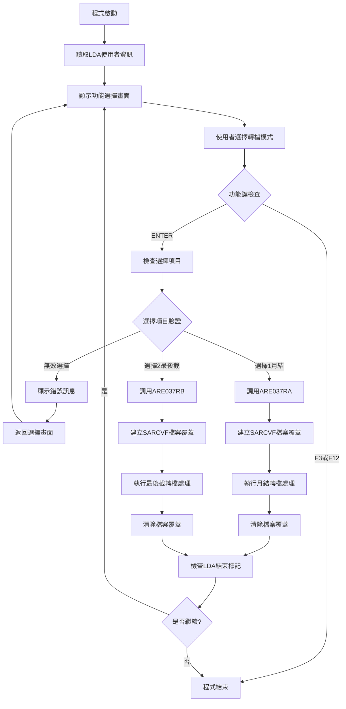
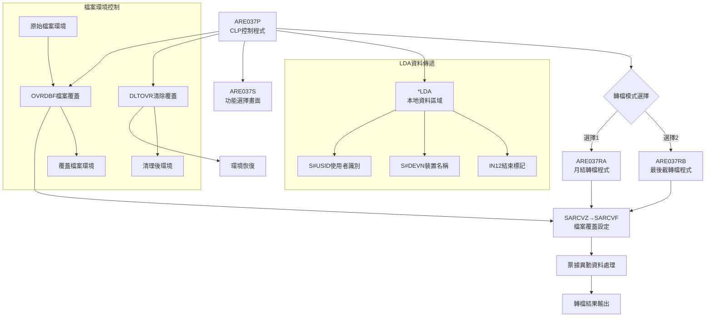
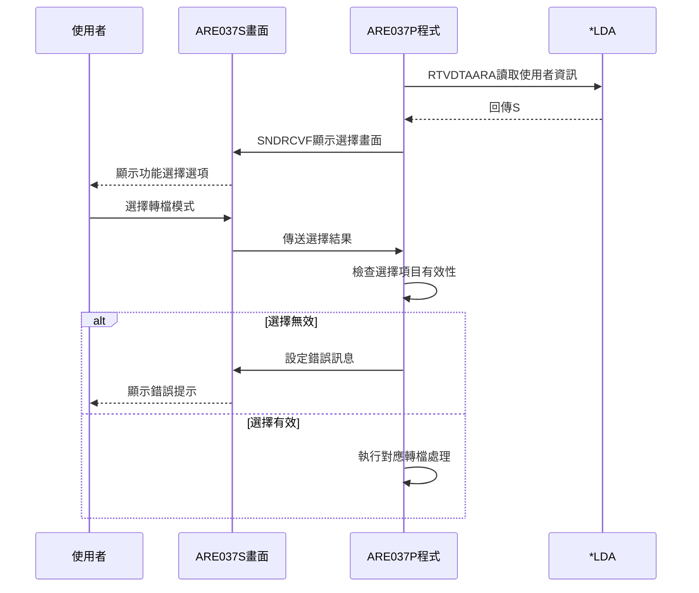
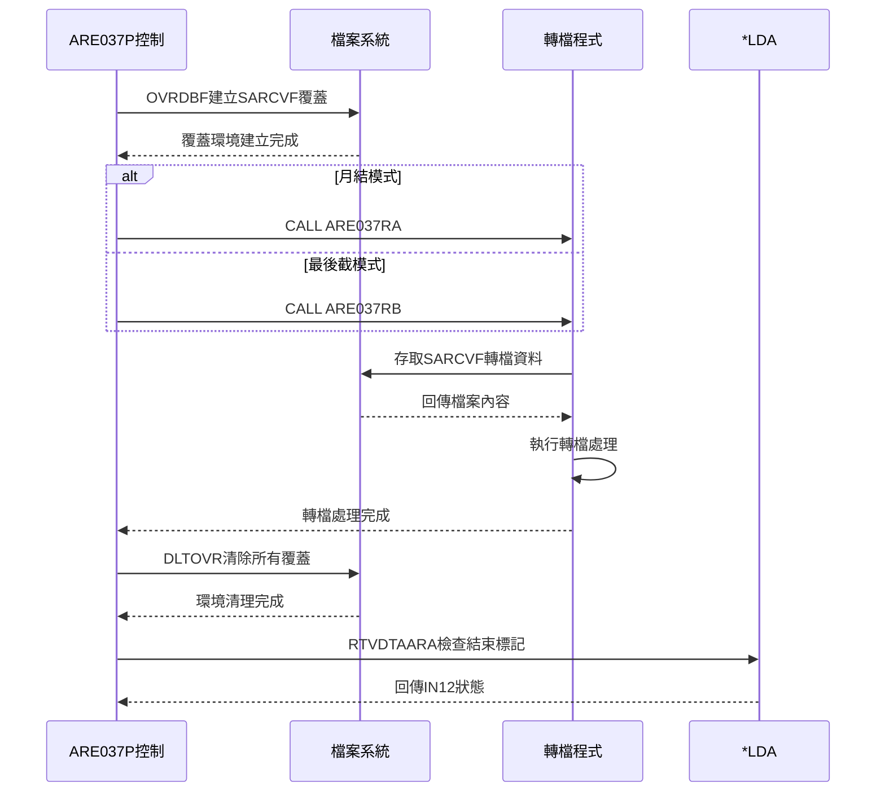
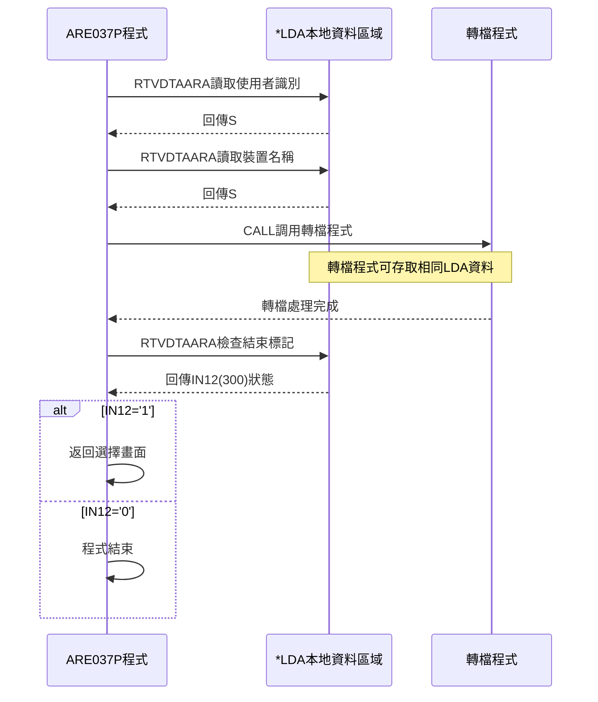
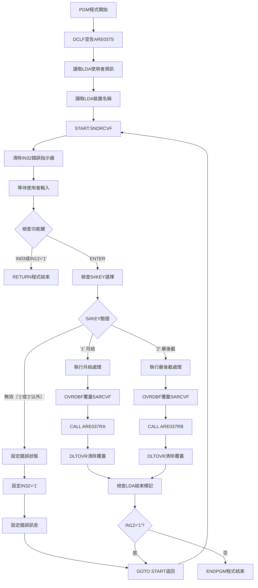

# ARE037P_P02 程式規格書

## 1. 基本資料

| 項目 | 內容 |
|------|------|
| **程式編號** | ARE037P |
| **程式名稱** | 票據異動應收帳款轉入程式 |
| **程式類型** | CLP |
| **廠區** | P02 |
| **系統名稱** | 應收帳款系統 |
| **子系統** | 票據異動轉檔子系統 |
| **檔案位置** | 東鋼list/ARE037P_P02.txt |

## 2. 🎯 程式功能說明

### 主要功能描述
ARE037P為票據異動應收帳款轉入程式，專門負責票據異動資料的轉檔處理控制。程式提供兩種轉檔模式選擇：月結處理和最後截處理，根據使用者選擇調用對應的轉檔程式，並透過檔案覆蓋機制控制轉檔檔案的存取環境。

### 🎯 業務流程詳細說明

#### 完整業務流程圖


#### 業務流程關鍵階段說明

**階段1: 系統環境初始化階段**
- 讀取LDA中的使用者識別碼(S#USID)
- 讀取LDA中的裝置名稱(S#DEVN)
- 初始化畫面顯示變數和控制指示器
- 準備功能選擇畫面的顯示環境

**階段2: 功能選擇處理階段**
- 顯示票據異動轉檔功能選擇畫面
- 提供兩種轉檔模式的選擇選項
- 檢查使用者的功能鍵操作
- 驗證選擇項目的有效性

**階段3: 轉檔模式分派階段**
- 根據選擇項目決定轉檔處理模式
- 建立對應的檔案覆蓋環境設定
- 調用對應的轉檔執行程式
- 等待轉檔處理完成並接收結果

**階段4: 檔案環境控制階段**
- 執行OVRDBF建立SARCVF檔案覆蓋
- 提供轉檔程式專用的檔案存取環境
- 執行DLTOVR清除所有檔案覆蓋設定
- 確保檔案環境的正確恢復

#### 轉檔模式控制機制
- **月結模式(選擇1)**: 調用ARE037RA執行月結轉檔處理
- **最後截模式(選擇2)**: 調用ARE037RB執行最後截轉檔處理
- **檔案覆蓋**: 統一使用SARCVZ覆蓋到SARCVF的機制
- **環境隔離**: 每種模式都有獨立的檔案存取環境

#### LDA參數傳遞機制
- **使用者識別**: LDA位置1001-1010儲存S#USID
- **裝置名稱**: LDA位置1011-1020儲存S#DEVN
- **結束標記**: LDA位置300檢查IN12結束指示器
- **資料共享**: 透過LDA與被調用程式共享執行參數

## 3. 🎯 檔案架構與關聯圖

### 使用檔案清單

| 檔案名稱 | 檔案用途 | 存取方式 | 控制方式 |
|----------|---------|---------|----------|
| **ARE037S** | 功能選擇顯示檔案 | DCLF | 畫面控制 |
| **SARCVZ/SARCVF** | 票據轉檔檔案 | 覆蓋 | OVRDBF指令 |
| **ARE037RA** | 月結轉檔程式 | 調用 | CALL指令 |
| **ARE037RB** | 最後截轉檔程式 | 調用 | CALL指令 |
| ***LDA** | 本地資料區域 | RTVDTAARA | 參數傳遞 |

### 🎯 檔案關聯詳細視覺化圖表



### 🎯 資料流向詳細說明

#### 功能選擇控制流向


#### 轉檔處理執行流向


#### LDA參數管理流向


## 4. 🎯 檔案欄位規格說明

### 主要變數結構

#### CLP變數詳細分析

**LDA資料區域變數**
```
*LDA參數結構：
├── S#USID (位置1001-1010, 10字元): 使用者識別碼
├── S#DEVN (位置1011-1020, 10字元): 裝置名稱
└── IN12 (位置300, 1字元): 結束標記指示器
```

**畫面控制變數**
```
ARE037S畫面變數：
├── S#KEY (1字元): 功能選擇項目 (1/2)
├── S#ERR (70字元): 錯誤訊息顯示
├── S#USID (10字元): 使用者識別顯示
├── S#DEVN (10字元): 裝置名稱顯示
├── IN03 (1字元): F3離開功能鍵
├── IN12 (1字元): F12返回功能鍵
└── IN32 (1字元): 錯誤指示器
```

### 🔍 重點參數技術詳解

#### LDA參數傳遞機制

**使用者識別參數(S#USID)**
```
RTVDTAARA DTAARA(*LDA (1001 10)) RTNVAR(&S#USID)
├── 資料區域: *LDA (本地資料區域)
├── 位置範圍: 1001-1010 (10字元)
├── 回傳變數: &S#USID
└── 用途: 識別執行程式的使用者
```

**裝置名稱參數(S#DEVN)**
```
RTVDTAARA DTAARA(*LDA (1011 10)) RTNVAR(&S#DEVN)
├── 資料區域: *LDA (本地資料區域)
├── 位置範圍: 1011-1020 (10字元)
├── 回傳變數: &S#DEVN
└── 用途: 識別執行程式的裝置
```

**結束標記參數(IN12)**
```
RTVDTAARA DTAARA(*LDA (300 1)) RTNVAR(&IN12)
├── 資料區域: *LDA (本地資料區域)
├── 位置範圍: 300 (1字元)
├── 回傳變數: &IN12
└── 用途: 控制程式執行循環
```

#### 檔案覆蓋參數

**SARCVF檔案覆蓋設定**
```
OVRDBF FILE(SARCVZ) TOFILE(SARCVF)
├── 來源檔案: SARCVZ (票據異動暫存檔)
├── 目標檔案: SARCVF (票據異動正式檔)
├── 覆蓋類型: 檔案重導向
└── 覆蓋期間: 程式執行期間有效
```

#### 功能選擇參數

**S#KEY選擇項目驗證**
```
選擇項目定義：
├── '1': 月結轉檔處理模式
├── '2': 最後截轉檔處理模式
├── ' ': 空白(無效選擇)
└── 其他: 無效選擇項目
```

### 重要變數定義表

| 變數名稱 | 資料型態 | 長度 | 用途說明 |
|----------|---------|------|----------|
| **S#USID** | 字元 | 10 | 使用者識別碼 |
| **S#DEVN** | 字元 | 10 | 裝置名稱 |
| **S#KEY** | 字元 | 1 | 功能選擇項目 |
| **S#ERR** | 字元 | 70 | 錯誤訊息內容 |
| **IN03** | 字元 | 1 | F3離開指示器 |
| **IN12** | 字元 | 1 | F12返回/結束指示器 |
| **IN32** | 字元 | 1 | 錯誤顯示指示器 |

## 5. 🎯 輸出/入螢幕布局

### 螢幕布局完整視覺化

#### ARE037S 功能選擇畫面
```
+----------------------------------------------------------+
|  2024/12/26  12:45  台灣東和鋼鐵股份有限公司應收帳款管理作業-  S02USER   |
|  2024/12/26         票據異動應收帳款轉入程式             DEV001    |
|                                                          |
|                                                          |
|                                                          |
|                                                          |
|                                                          |
|                                                          |
|                                                          |
|                                                          |
|                    功能項目： [1] (1.月結2.最後截)        |
|                                                          |
|                                                          |
|                                                          |
|                                                          |
|                                                          |
|                                                          |
|                                                          |
|                                                          |
|                                                          |
|                                                          |
|                                                          |
| F3=離開            F12=返回上層                          |
| [錯誤訊息顯示區]                                         |
+----------------------------------------------------------+
```

### 🎯 畫面欄位詳細說明

#### 主畫面欄位
| 欄位名稱 | 屬性 | 長度 | 輸入格式 | 驗證規則 |
|----------|------|------|----------|----------|
| **S#KEY** | 必填 | 1 | 1/2 | VALUES(' ' '1' '2') |
| **S#USID** | 唯讀 | 10 | 顯示用 | 系統自動設定 |
| **S#DEVN** | 唯讀 | 10 | 顯示用 | 系統自動設定 |
| **S#ERR** | 唯讀 | 70 | 顯示用 | 錯誤訊息內容 |

#### 功能選擇說明
| 選擇項目 | 功能說明 | 調用程式 | 處理內容 |
|----------|---------|---------|----------|
| **1** | 月結轉檔 | ARE037RA | 執行月結期間的票據異動轉檔 |
| **2** | 最後截轉檔 | ARE037RB | 執行最後截止日的票據異動轉檔 |

### 🎯 畫面控制邏輯

#### 指示器控制說明
| 指示器 | 控制項目 | 狀態說明 |
|--------|---------|----------|
| **IN03** | F3離開功能 | 設定時程式結束 |
| **IN12** | F12返回功能 | 設定時程式結束或返回 |
| **IN32** | S#KEY欄位 | RI+PC (錯誤反白閃爍) |

### 功能鍵詳細定義

#### 主畫面功能鍵
| 功能鍵 | 處理邏輯 | 系統行為 |
|--------|---------|----------|
| **ENTER** | 執行選擇功能 | 根據S#KEY調用對應轉檔程式 |
| **F3** | 離開程式 | 設定IN03='1'並RETURN |
| **F12** | 返回上層 | 設定IN12='1'並RETURN |

#### 錯誤處理顯示
| 錯誤狀況 | 錯誤訊息 | 顯示方式 |
|----------|---------|----------|
| **無效選擇** | 功能項目錯誤! | S#ERR顯示，IN32設定RI+PC |
| **系統錯誤** | 系統處理異常 | S#ERR顯示，停留在選擇畫面 |

## 6. 🎯 處理流程程序說明

### 🎯 主程序邏輯深度分析

#### 程式執行流程圖


#### 🎯 詳細處理步驟逐一分析

**步驟1: 程式環境初始化**
- PGM指令啟動CLP程式執行環境
- DCLF宣告ARE037S顯示檔案供後續使用
- 初始化程式執行所需的系統資源
- 準備LDA參數讀取和畫面顯示環境

**步驟2: LDA參數資訊讀取**
- 執行RTVDTAARA讀取LDA位置1001-1010的使用者識別
- 執行RTVDTAARA讀取LDA位置1011-1020的裝置名稱
- 將讀取的資訊設定到對應的畫面顯示變數
- 確保使用者和裝置資訊正確顯示

**步驟3: 功能選擇畫面處理**
- 執行SNDRCVF顷示ARE037S功能選擇畫面
- 清除IN32錯誤指示器確保畫面正常顯示
- 等待使用者輸入功能選擇和功能鍵操作
- 接收使用者的選擇結果進行後續處理

**步驟4: 功能鍵和選擇驗證**
- 檢查IN03(F3)或IN12(F12)是否被按下
- 若按下離開鍵則執行RETURN結束程式
- 檢查S#KEY選擇項目是否為有效值('1'或'2')
- 無效選擇時設定錯誤狀態並返回畫面

**步驟5: 轉檔模式處理執行**
- 根據S#KEY='1'或'2'決定轉檔處理模式
- 執行OVRDBF建立SARCVF檔案覆蓋環境
- 調用對應的轉檔程式(ARE037RA或ARE037RB)
- 執行DLTOVR清除所有檔案覆蓋設定

**步驟6: 循環控制和程式結束**
- 執行RTVDTAARA讀取LDA位置300的結束標記
- 檢查IN12是否為'1'決定是否繼續執行
- 若IN12='1'則返回功能選擇畫面
- 若IN12='0'則執行ENDPGM正常結束程式

#### 業務邏輯深度解析

**功能選擇驗證機制**
```
選擇驗證邏輯:
1. 檢查S#KEY是否等於'1'(月結模式)
2. 檢查S#KEY是否等於'2'(最後截模式)  
3. 兩者都不符合則視為無效選擇
4. 設定錯誤指示器和錯誤訊息顯示
```

**檔案覆蓋控制機制**
```
檔案覆蓋邏輯:
1. 使用OVRDBF FILE(SARCVZ) TOFILE(SARCVF)
2. 建立轉檔程式專用的檔案存取環境
3. 確保轉檔程式存取正確的檔案路徑
4. 使用DLTOVR FILE(*ALL)清除所有覆蓋
```

**程式調用控制機制**
```
程式調用邏輯:
1. 月結模式調用CALL PGM(ARE037RA)
2. 最後截模式調用CALL PGM(ARE037RB)
3. 採用同步調用等待程式完成
4. 檔案覆蓋設定自動傳遞給被調用程式
```

#### 條件判斷詳細說明

**功能鍵判斷邏輯**
- 檢查IN03='1'(F3離開)或IN12='1'(F12返回)
- 使用OR邏輯運算，任一條件成立即結束程式
- 優先處理功能鍵避免無效操作繼續執行
- 確保使用者能隨時離開程式

**選擇項目判斷邏輯**
- 檢查S#KEY不等於'1'且不等於'2'
- 使用AND邏輯運算，兩個條件都成立才視為錯誤
- 只允許'1'和'2'兩個有效選擇項目
- 其他任何輸入都視為無效選擇

**循環控制判斷邏輯**
- 檢查LDA位置300的IN12結束標記
- IN12='1'表示需要返回功能選擇畫面
- IN12='0'或其他值表示可以結束程式
- 提供轉檔程式控制主程式循環的機制

#### 變數使用和數據流向

**關鍵變數生命週期**
```
S#USID/S#DEVN (使用者資訊):
LDA讀取 → 畫面顯示 → 全程保持

S#KEY (功能選擇):
畫面輸入 → 格式驗證 → 分派處理 → 程式調用

IN32 (錯誤指示器):
初始化清除 → 錯誤時設定 → 畫面顯示

IN03/IN12 (功能鍵):
按鍵檢測 → 條件判斷 → 程式控制
```

### 🎯 子程序邏輯分析

#### LDA參數讀取處理
**功能**: 從本地資料區域讀取執行參數
**參數讀取**:
- S#USID: LDA位置1001-1010 (使用者識別)
- S#DEVN: LDA位置1011-1020 (裝置名稱)  
- IN12: LDA位置300 (結束控制標記)

#### 錯誤處理機制
**功能**: 處理無效選擇和顯示錯誤訊息
**處理步驟**:
1. 設定IN32='1'啟用錯誤指示器
2. 設定S#ERR='功能項目錯誤!'錯誤訊息
3. 執行GOTO CMDLBL(START)返回畫面
4. 在畫面上以反白閃爍顯示錯誤

#### 檔案環境管理
**功能**: 建立和清理檔案覆蓋環境
**管理機制**:
1. OVRDBF建立SARCVZ到SARCVF的覆蓋
2. 提供轉檔程式統一的檔案存取介面
3. DLTOVR清除所有檔案覆蓋設定
4. 確保環境恢復不影響其他程式

#### 轉檔程式調用控制
**功能**: 根據選擇調用對應的轉檔程式
**調用控制**:
- 選擇1: 調用ARE037RA執行月結轉檔
- 選擇2: 調用ARE037RB執行最後截轉檔
- 同步調用等待程式完成
- 檔案環境自動傳遞給被調用程式

### 🎯 特殊邏輯處理

#### LDA資料傳遞機制
**LDA整合邏輯**:
```
LDA資料傳遞:
1. 程式啟動時讀取LDA中的使用者和裝置資訊
2. 在畫面上顯示使用者識別和裝置名稱
3. 轉檔處理完成後檢查LDA的結束標記
4. 根據結束標記決定程式執行循環
```

#### 檔案覆蓋統一管理
**覆蓋管理邏輯**:
```
檔案覆蓋統一管理:
1. 無論選擇哪種模式都使用相同覆蓋設定
2. SARCVZ覆蓋到SARCVF提供統一檔案介面
3. 轉檔程式只需要存取SARCVF即可
4. 覆蓋設定在每次處理後都完全清除
```

#### 錯誤恢復和循環控制
**循環控制邏輯**:
```
程式循環控制:
1. 錯誤發生時返回功能選擇畫面重新輸入
2. 正常處理完成後檢查是否繼續執行
3. 被調用程式可透過LDA控制主程式循環
4. 提供完整的使用者操作控制機制
```

## 7. 🎯 錯誤處理程序說明

### 🎯 詳細錯誤代碼清冊

| 錯誤代碼 | 錯誤訊息 | 原因說明 | 處理方式 | 預防措施 |
|----------|---------|---------|---------|----------|
| **USER001** | 功能項目錯誤! | S#KEY選擇項目無效 | 1. 重新選擇有效項目<br>2. 確認輸入格式<br>3. 檢查選擇範圍 | 使用VALUES限制輸入 |
| **CPF2105** | 物件&1在&2中找不到 | ARE037RA/RB程式不存在 | 1. 檢查程式存在性<br>2. 確認程式路徑<br>3. 重新編譯程式 | 程式相依性檢查 |
| **CPF4101** | 檔案&1未正確建立覆蓋 | SARCVF檔案覆蓋失敗 | 1. 檢查檔案權限<br>2. 確認檔案路徑<br>3. 重新執行覆蓋 | 檔案權限預檢機制 |
| **CPF0999** | 程式&1執行時發生錯誤 | 轉檔程式執行失敗 | 1. 檢查程式日誌<br>2. 確認資料完整性<br>3. 檢查系統狀態 | 轉檔前資料檢查 |
| **CPF1221** | LDA不可使用 | 本地資料區域存取失敗 | 1. 檢查LDA狀態<br>2. 重新初始化LDA<br>3. 檢查系統權限 | LDA初始化檢查 |
| **CPF4138** | 檔案&1已被另一個工作使用 | SARCVF檔案被鎖定 | 1. 等待檔案釋放<br>2. 檢查鎖定程式<br>3. 強制解除鎖定 | 檔案鎖定狀態檢查 |
| **CPF9801** | 物件&1類型&2已損壞 | 顯示檔案ARE037S損壞 | 1. 檢查檔案完整性<br>2. 重新編譯顯示檔<br>3. 從備份恢復 | 顯示檔案完整性監控 |
| **CPF2817** | 複製到物件&2時發生錯誤 | 檔案覆蓋操作錯誤 | 1. 檢查磁碟空間<br>2. 確認檔案權限<br>3. 清理暫存檔案 | 磁碟空間監控 |
| **CPF3203** | 無法處理指令 | CLP指令執行錯誤 | 1. 檢查指令語法<br>2. 確認參數格式<br>3. 檢查系統狀態 | 指令語法驗證 |
| **CPF9999** | 功能檢查 | 一般系統執行錯誤 | 1. 檢查系統日誌<br>2. 確認系統狀態<br>3. 重新啟動作業 | 系統狀態監控 |

### 🎯 系統異常處理邏輯

#### 選擇項目錯誤處理
**無效選擇處理**:
```
選擇錯誤處理邏輯:
1. 檢查S#KEY是否為'1'或'2'以外的值
2. 設定IN32='1'啟用錯誤指示器
3. 設定S#ERR='功能項目錯誤!'錯誤訊息
4. 執行GOTO返回功能選擇畫面重新輸入
```

**輸入格式錯誤處理**:
```
格式錯誤處理邏輯:
1. 透過VALUES(' ' '1' '2')限制輸入範圍
2. 系統自動阻止無效字元輸入
3. 只允許空白、1、2三種選擇
4. 提供明確的選擇說明和格式要求
```

#### LDA參數錯誤處理
**LDA讀取失敗處理**:
```
LDA錯誤處理邏輯:
1. RTVDTAARA指令執行失敗時記錄錯誤
2. 檢查LDA的初始化狀態和權限設定
3. 嘗試重新讀取或使用預設值
4. 無法讀取時顯示錯誤訊息並中止程式
```

**LDA資料不完整處理**:
```
LDA資料不完整處理邏輯:
1. 檢查讀取的使用者識別是否為空白
2. 檢查裝置名稱是否正確設定
3. 提供預設值或要求重新登入
4. 記錄資料不完整的警告訊息
```

#### 檔案操作錯誤處理
**檔案覆蓋失敗處理**:
```
檔案覆蓋失敗處理邏輯:
1. 檢查SARCVZ和SARCVF檔案的存在性
2. 確認檔案覆蓋權限和系統資源
3. 嘗試清除現有覆蓋後重新建立
4. 記錄詳細錯誤資訊供系統管理員分析
```

**檔案鎖定錯誤處理**:
```
檔案鎖定錯誤處理邏輯:
1. 檢查檔案是否被其他程式或作業鎖定
2. 顯示等待訊息並嘗試定期重試
3. 提供強制解除鎖定的選項
4. 記錄鎖定狀況供後續分析
```

#### 程式調用錯誤處理
**轉檔程式調用失敗處理**:
```
程式調用失敗處理邏輯:
1. 檢查ARE037RA/RB程式的存在性和權限
2. 確認程式版本和相依程式庫
3. 嘗試清理檔案環境後重新調用
4. 記錄調用失敗的詳細資訊
```

**轉檔程式執行錯誤處理**:
```
轉檔執行錯誤處理邏輯:
1. 接收被調用程式的錯誤返回碼
2. 分析錯誤類型和嚴重程度
3. 根據錯誤類型決定後續處理方式
4. 清理已建立的檔案覆蓋環境
```

#### 系統資源錯誤處理
**記憶體不足處理**:
```
記憶體不足處理邏輯:
1. 檢查系統可用記憶體和程式需求
2. 嘗試釋放非必要的記憶體資源
3. 調整程式執行優先權和參數
4. 建議系統管理員檢查記憶體配置
```

**顯示檔案錯誤處理**:
```
顯示檔案錯誤處理邏輯:
1. 檢查ARE037S顯示檔案的完整性
2. 確認檔案編譯狀態和版本相容性
3. 嘗試重新編譯或從備份恢復
4. 提供替代的文字模式顯示選項
```

#### 環境清理錯誤處理
**DLTOVR失敗處理**:
```
環境清理失敗處理邏輯:
1. 檢查需要清理的覆蓋設定清單
2. 嘗試逐個清理各項覆蓋設定
3. 記錄無法清理的項目和原因
4. 在程式結束時發出清理警告
```

**資源釋放錯誤處理**:
```
資源釋放錯誤處理邏輯:
1. 檢查程式佔用的系統資源狀況
2. 強制釋放可以釋放的資源項目
3. 記錄無法釋放的資源清單
4. 提供手動清理的操作指引
```

## 8. 🎯 備註

### 🎯 特殊注意事項

**CLP控制程式特性**:
- 程式作為票據異動轉檔的主控制層
- 提供兩種轉檔模式的統一選擇介面
- 負責檔案環境建立、程式調用和環境清理
- 確保轉檔處理的標準化和一致性

**LDA參數傳遞機制**:
- 使用本地資料區域進行參數傳遞和共享
- 支援使用者識別和裝置名稱的顯示
- 提供轉檔程式控制主程式循環的機制
- 確保執行環境資訊的正確傳遞

**雙模式轉檔架構**:
- 月結模式調用ARE037RA處理月結期間資料
- 最後截模式調用ARE037RB處理截止日資料
- 兩種模式使用相同的檔案覆蓋機制
- 提供靈活的轉檔處理選擇

**檔案覆蓋統一管理**:
- 使用SARCVZ覆蓋到SARCVF的標準機制
- 為被調用程式提供統一的檔案存取介面
- 每次處理後完全清除覆蓋設定
- 確保檔案環境的隔離性和安全性

**使用者互動設計**:
- 簡潔的功能選擇畫面設計
- 清楚的功能說明和操作指引
- 完整的錯誤訊息顯示和處理
- 支援F3離開和F12返回的標準操作

**循環控制機制**:
- 錯誤發生時自動返回選擇畫面
- 支援連續執行多次轉檔處理
- 被調用程式可控制主程式執行循環
- 提供靈活的處理流程控制

**環境清理保證**:
- 無論成功或失敗都執行檔案覆蓋清理
- 確保不影響其他程式的檔案存取
- 提供完整的系統資源釋放機制
- 維護系統環境的穩定性

**系統整合特性**:
- 與ARE037RA/RB形成完整轉檔處理架構
- 提供標準化的CLP控制程式模式
- 支援票據異動轉檔的業務需求
- 確保轉檔處理的可靠性和一致性 