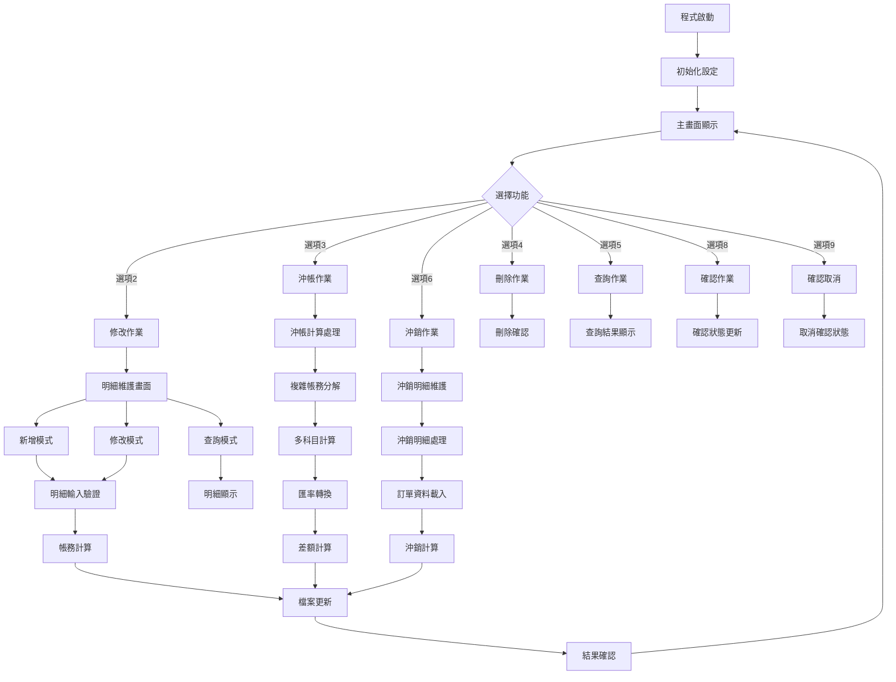
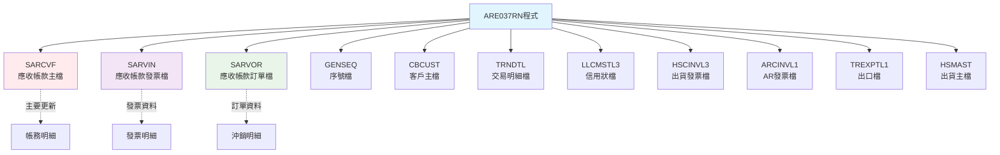
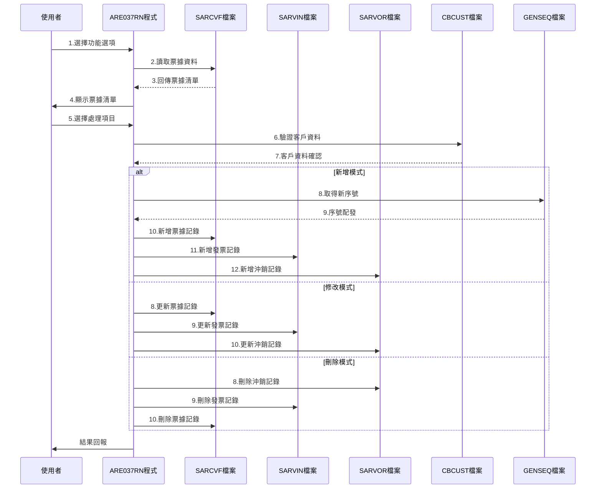

# ARE037RN_P02 程式規格書

## 1. 基本資料

| 項目 | 內容 |
|------|------|
| **程式編號** | ARE037RN |
| **程式名稱** | 票據異動應收帳款轉入程式（查詢處理） |
| **程式類型** | RPG |
| **廠區** | P02 |
| **系統名稱** | 應收帳款系統 |
| **子系統** | 票據異動轉檔子系統 |
| **檔案位置** | 東鋼list/ARE037RN_P02.txt |

## 2. 🎯 程式功能說明

### 主要功能描述
ARE037RN為票據異動應收帳款轉入程式的查詢處理模組，專門處理票據異動相關的應收帳款轉入、修改、刪除、查詢和沖帳作業。程式提供完整的票據異動生命週期管理，支援多階段確認機制、匯率處理、帳務分解計算，以及與多個相關檔案的同步更新功能。

### 🎯 業務流程詳細說明



## 3. 🎯 檔案結構與關聯圖

### 檔案關聯圖


### 資料流向序列圖


## 4. 🎯 資料欄位規格說明

### 主要資料結構分析

#### SARCVF（應收帳款主檔）關鍵欄位
```
SRRVNO - 票據編號（6A）
SRITEM - 項次（2,0）
SRCUNO - 客戶編號（6A）
SRRVDT - 票據日期（8,0）
SRNAMT - 票據金額（11,0）
SRXAMT - 沖銷金額（11,0）
SRACTP - 會計類別（1A）：C=貸項，D=借項
SRACNO - 會計科目（6A）
SRFL01 - 已確認旗標（1A）：Y=已確認
SRFL02 - 已過帳旗標（1A）
SRFL03 - 已列印旗標（1A）
SRCURY - 幣別（3A）：NTD/USD/EUR
SREXC1 - 本期匯率（8,4）
SREXC2 - 當時匯率（8,4）
SREXC3 - 結算匯率（8,4）
```

#### 重要資料結構定義

**D#ARY陣列結構（30位元組）**：
```
D#ACTP（1） - 會計類別
D#ACNO（7） - 會計科目
D#RAMT（12） - 金額
D#EXC2（7） - 匯率
D#CURY（3） - 幣別
```

**UDS使用者資料結構**：
```
U#USID - 使用者ID（10A）
U#USDP - 使用者部門（3A）
U#USTP - 使用者類型（1A）
U#AREA - 廠區代碼（1A）
```

### 欄位切割與挪用說明

#### 票據編號生成機制
- **GEKIND='04'，GEPRIN='H'**：票據編號前置碼
- **序號範圍**：00001-99999（5位數循環）
- **編號格式**：H+5位序號（如H00001）

#### 匯率處理邏輯
- **SREXC1（本期匯率）**：用於帳務計算
- **SREXC2（當時匯率）**：用於特定科目轉換
- **SREXC3（結算匯率）**：用於最終確認

## 5. 🎯 輸出/入螢幕布局

### ARE037F1 - 主要清單畫面
```
===== ARE037SC-1 票據異動應收帳款轉入作業 =====
功能: 2:修改 3:沖帳 4:刪除 5:查詢 6:沖銷 8:確認 9:確認取消

客戶編號查詢: [______] 票據編號: [______]

─────────────────────────────────────────────────
功能 客戶   客戶名稱   日期     沖銷合計   票據合計   確 過 列
─────────────────────────────────────────────────
[_] [____] [________] [__/__/__] [_______] [_______] [_][_][_]
[_] [____] [________] [__/__/__] [_______] [_______] [_][_][_]
```

### ARE037F2 - 明細維護畫面
```
===== ARE037SC-2 票據異動應收帳款轉入作業 =====
票據編號: [______]  客戶編號: [______] 客戶名稱: [________]
票據日期: [__/__/__]  部門編號: [____] 業務代號: [_]
本期匯率: [____.__] 結算匯率: [____.__]
票據金額合計: [_________]

─────────────────────────────────────────────────
會 帳 帳戶            票據銀行帳號      當時匯率    新增帳號
計 戶 類 科目編號     
項 號 別 票據憑證號碼   幣別  票據金額     到期日
     次               票據帳號 票據地點
─────────────────────────────────────────────────
[_][__][_][______][______________][__________][____.__][__________]
         [____________________] [___] [_________] [__/__/__]
                   [__________] [_]
```

### ARE037F3 - 沖銷明細畫面
```
===== ARE037SC-3 票據異動應收帳款轉入作業 =====
票據編號: [______]  客戶編號: [______] 客戶名稱: [________]
票據日期: [__/__/__] 部門編號: [____] 業務代號: [_]
本期匯率: [____.__] 結算匯率: [____.__]
票據金額合計: [_________] 沖銷金額合計: [_________]

─────────────────────────────────────────────────
  特殊編號    沖銷金額  訂單   特料金額   特料成本   確認沖銷   已過沖銷
─────────────────────────────────────────────────
[________] [_] [_________] [______] [_________] [_________] [_] [_________]
```

### ARE037F5 - 信用狀查詢畫面
```
┌─────── 相關信用狀查詢 ARE037S-5 ───────┐
│                                        │
│ 請點選欲選擇的筆，按確認鍵即可。        │
│                                        │
│ 信用狀編號         開狀銀行     到期日  │
│ ──────────────────────────────── │
│ [__________________] [____________] [__/__/__] │
│ [__________________] [____________] [__/__/__] │
│                                        │
│ ──────────────────────────────── │
│ F03:取消    F12:回上                    │
└────────────────────────────────┘
```

## 6. 🎯 處理流程描述

### 主程式邏輯流程

#### 初始化處理（SR0000）
1. **權限驗證**：根據使用者類型設定可用功能
2. **廠區控制**：依部門代碼設定廠區代碼（P/T/K/M/H）
3. **IFRS檢查**：檢查IFRS制度啟用狀態

#### 主畫面處理（SR1000）
1. **資料載入**：
   - 依查詢條件讀取SARCVF檔案
   - 支援客戶編號範圍查詢
   - 支援票據編號查詢
2. **清單顯示**：
   - 最多顯示13筆記錄
   - 顯示客戶名稱、票據日期、金額等關鍵資訊
   - 顯示確認、過帳、列印狀態

#### 選項處理（SR2000）
1. **修改作業（選項2）**：進入明細維護畫面
2. **沖帳作業（選項3）**：執行複雜帳務分解計算
3. **刪除作業（選項4）**：刪除所有相關記錄
4. **查詢作業（選項5）**：唯讀顯示明細資料
5. **沖銷作業（選項6）**：進入沖銷明細處理
6. **確認作業（選項8）**：更新確認狀態
7. **確認取消（選項9）**：取消確認狀態

### 詳細業務邏輯分析

#### 沖帳計算邏輯（SR2400-SR2421）
1. **科目分類處理**：
```
1111/110101 - 預收貨款（USD轉換）
1114/110104 - 代收貨款（USD轉換）
7119/710109 - 出口保險（匯率差異處理）
7142/710402 - 成品保險（匯率差異處理）
8211/820101 - 出險機（匯率差異處理）
8212/820201 - 成品保證金
8112/810201 - 出險貨款
8246/821204 - 差額調整（平衡項目）
```

2. **匯率轉換規則**：
   - 外幣科目：金額 × 本期匯率
   - 台幣科目：金額 ÷ 當時匯率 × 本期匯率
   - 差額計算：沖銷總額 - 各科目合計

3. **記錄新增邏輯**：
   - 自動新增對應的借貸項記錄
   - 設定正確的會計類別（C/D）
   - 更新所有相關旗標

#### 明細維護邏輯（SR3000-SR3400）
1. **欄位驗證**：
   - 客戶編號必須存在於CBCUST
   - 日期格式驗證（調用UTS102R）
   - 會計科目限制檢查
   - 匯率不得為零

2. **金額計算**：
   - 台幣金額：直接加減
   - 外幣金額：金額 × 本期匯率後加減
   - 即時更新票據金額合計

3. **序號處理**：
   - 新增時自動產生票據編號
   - 使用GENSEQ檔案序號控制

#### 沖銷處理邏輯（SR4000-SR4400）
1. **訂單驗證**：
   - 檢查訂單存在於HSCINVL3
   - 驗證客戶編號一致性
   - 檢查出貨記錄完整性

2. **沖銷計算**：
   - 讀取TRNDTLL4交易記錄
   - 計算特料金額（單價 × 數量）
   - 處理特殊訂單邏輯（H10001-H10006）
   - 匯率差異處理

3. **記錄維護**：
   - 新增/更新SARVOR沖銷記錄
   - 新增/更新SARVIN發票記錄
   - 更新SARCVF主檔沖銷金額

### 變數生命週期與資料流

#### 全域變數
- **W#PRID**：程式ID控制（01-05）
- **W#OPT**：功能選項暫存
- **W#HEAD**：廠區代碼控制
- **ARY陣列**：帳務分解暫存

#### 重要子程序呼叫
- **UTS102R**：日期格式驗證
- **SR2420**：複雜帳務分解計算
- **SR3320**：金額計算與累加
- **SR4220**：訂單資料載入處理

## 7. 🎯 錯誤處理程序說明

### 詳細錯誤代碼清冊

| 錯誤代碼 | 錯誤訊息 | 發生條件 | 處理方式 | 相關欄位 |
|---------|---------|---------|---------|---------|
| ERR,1 | 無資料發現！ | 查詢無結果 | 重新輸入查詢條件 | 查詢欄位 |
| ERR,2 | 該票據已過帳,請勿修改程式取消後再過帳！ | 已過帳記錄 | 取消作業 | SRFL02 |
| ERR,3 | 該票據已確認,請勿修改程式取消後再確認！ | 已確認記錄 | 取消確認 | SRFL01 |
| ERR,4 | 該票據未確認,無法取消！ | 未確認記錄 | 先執行確認 | SRFL01 |
| ERR,6 | 資料輸入錯誤！ | 驗證失敗 | 重新輸入 | 輸入欄位 |
| ERR,7 | 無此訂單！ | 訂單不存在 | 檢查訂單編號 | 訂單編號 |
| ERR,8 | 客戶不符！ | 客戶編號不符 | 確認客戶資料 | 客戶編號 |
| ERR,9 | 發票編號不存在！ | 發票查無 | 檢查發票編號 | 發票編號 |
| ERR,10 | 客戶編號不符！ | 客戶不一致 | 重新選擇 | 客戶編號 |
| ERR,11 | 訂單編號不符！ | 訂單不一致 | 重新輸入 | 訂單編號 |
| ERR,12 | 沖銷金額不得大於特料成本！ | 金額超限 | 調整金額 | 沖銷金額 |
| ERR,13 | 票據總額與沖銷總額不符 | 金額不平衡 | 重新計算 | 金額欄位 |
| ERR,15 | 結算匯率錯誤！ | 匯率異常 | 重新輸入匯率 | 匯率欄位 |
| ERR,17 | 沖銷項目尚未輸入！ | 遺漏必要欄位 | 完成輸入 | 沖銷項目 |
| ERR,18 | 無可使用查詢功能！ | 權限不足 | 聯絡管理員 | 使用者權限 |
| ERR,19 | 結算會計科目必須輸入訂單編號！ | 遺漏訂單 | 輸入訂單編號 | 訂單編號 |
| ERR,20 | 訂單客戶與票據客戶不符 | 客戶不一致 | 重新確認 | 客戶編號 |

### 系統異常處理邏輯

#### 檔案操作錯誤
- **檔案鎖定衝突**：等待重試機制
- **記錄不存在**：友善錯誤訊息顯示
- **權限不足**：導向主選單

#### 資料完整性控制
- **主外鍵關聯檢查**：確保參照完整性
- **金額平衡驗證**：借貸平衡控制
- **狀態一致性檢查**：確認狀態邏輯正確

## 8. 🎯 備註

### 特殊注意事項

#### IFRS會計制度整合
- 程式根據系統日期自動判斷IFRS啟用狀態
- 科目編號在IFRS模式下自動轉換為新科目編號
- 影響科目：1111→110101, 1114→110104, 8212→820201等

#### 權限控制機制
- 特定使用者（B01LLF, D00LCC, H293, D00CHH, H837）具備查詢功能
- 其他使用者僅能執行修改、刪除等維護功能
- 廠區權限根據使用者部門自動設定

#### 序號管理邏輯
- 票據編號採用GENSEQ統一管理
- 編號格式：廠區代碼 + 5位序號
- 達到99999時自動重新循環至00001

#### 複雜匯率處理
- 支援三種匯率同時存在
- 不同科目採用不同匯率計算規則
- 自動處理匯率差異調整

#### 帳務分解機制
- 支援複雜的多科目自動分解
- 差額自動計算並調整至8246科目
- 確保借貸平衡的完整性 