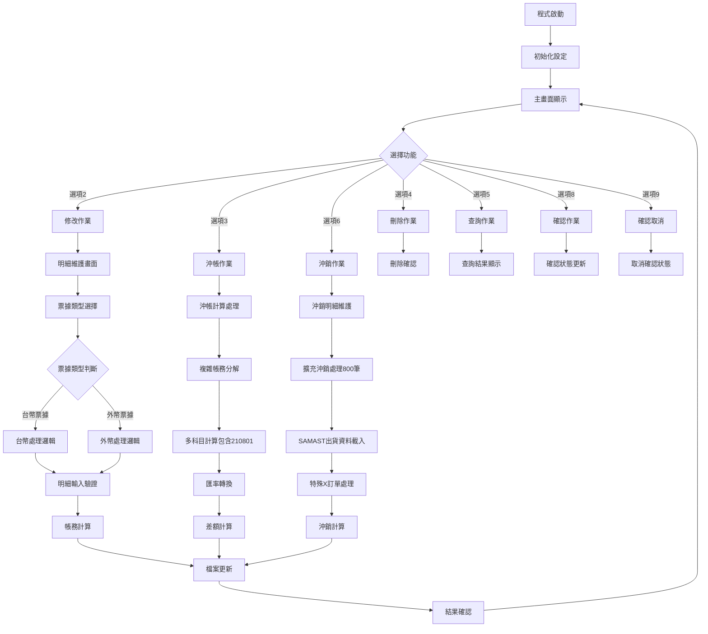
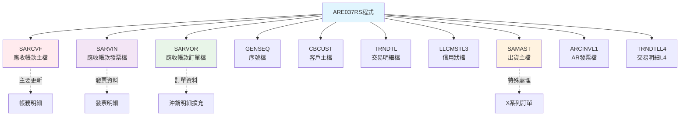
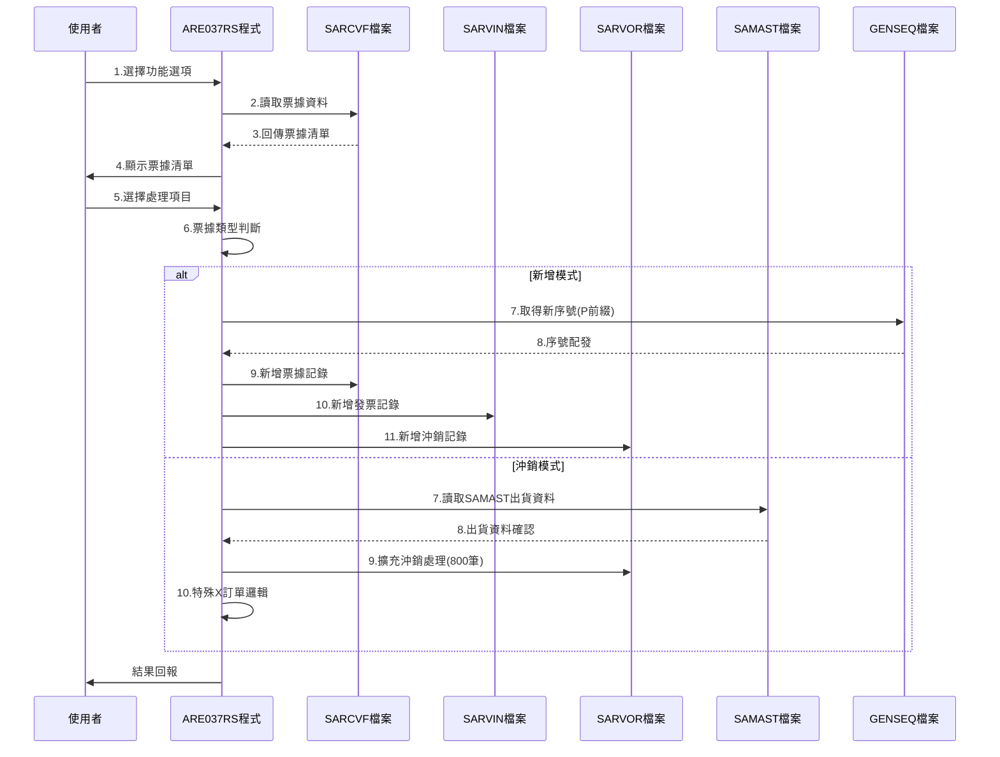

# ARE037RS_P02 程式規格書

## 1. 基本資料

| 項目 | 內容 |
|------|------|
| **程式編號** | ARE037RS |
| **程式名稱** | 票據異動應收帳款轉入程式（特殊處理版） |
| **程式類型** | RPG |
| **廠區** | P02 |
| **系統名稱** | 應收帳款系統 |
| **子系統** | 票據異動轉檔子系統 |
| **檔案位置** | 東鋼list/ARE037RS_P02.txt |

## 2. 🎯 程式功能說明

### 主要功能描述
ARE037RS為票據異動應收帳款轉入程式的特殊處理版本，專門處理特殊訂單類型的票據異動作業。與標準版本(ARE037RN)相比，此版本針對X系列訂單提供專門的處理邏輯，支援更複雜的出貨主檔整合、票據類型分類處理，以及擴充的沖銷容量管理功能。

### 🎯 業務流程詳細說明



## 3. 🎯 檔案結構與關聯圖

### 檔案關聯圖


### 資料流向序列圖


## 4. 🎯 資料欄位規格說明

### 主要資料結構分析

#### SARCVF（應收帳款主檔）關鍵欄位
```
SRRVNO - 票據編號（6A）：P+5位序號
SRITEM - 項次（2,0）
SRCUNO - 客戶編號（6A）
SRRVDT - 票據日期（8,0）
SRNAMT - 票據金額（11,0）
SRXAMT - 沖銷金額（11,0）
SRACTP - 會計類別（1A）：C=貸項，D=借項
SRACNO - 會計科目（6A）
SRFL01 - 已確認旗標（1A）：Y=已確認
SRFL02 - 已過帳旗標（1A）
SRFL03 - 已列印旗標（1A）
SRCURY - 幣別（3A）：NTD/USD/EUR
SREXC1 - 本期匯率（8,4）
SREXC2 - 當時匯率（8,4）
SREXC3 - 結算匯率（8,4）
```

#### SAMAST（出貨主檔）整合欄位
```
D#CUNO - 客戶編號（6A）
D#PRIC - 價格資料（10位，除以1000）
S1ADDL - 地址資料（10A，用於價格計算）
```

#### 票據類型分類結構
```
S#TYPE - 票據類型（1A）
  '1' = 台幣票據（匯率=1）
  '2' = 外幣票據（匯率≠1）
```

### 欄位切割與挪用說明

#### 票據編號生成機制（特殊版）
- **GEKIND='04'，GEPRIN='P'**：票據編號前置碼P（與標準版H不同）
- **序號範圍**：00001-99999（5位數循環）
- **編號格式**：P+5位序號（如P00001）

#### 特殊科目處理
- **210801科目**：追加的央行準備金科目，支援USD轉換
- **會計科目新增**：111101科目處理
- **X系列訂單識別**：X00163, X00166, X00174, X00173, X00177, X00188, X00197

#### 擴充處理容量
- **沖銷記錄上限**：從700筆擴充到800筆
- **明細處理上限**：從699筆擴充到799筆

## 5. 🎯 輸出/入螢幕布局

### ARE037F1 - 主要清單畫面
```
===== ARE037SC-1 票據異動應收帳款轉入作業 =====
功能: 2:修改 3:沖帳 4:刪除 5:查詢 6:沖銷 8:確認 9:確認取消

客戶編號查詢: [______]

─────────────────────────────────────────────────
功能 客戶   客戶名稱   日期     沖銷合計   票據合計   確 過 列
─────────────────────────────────────────────────
[_] [____] [________] [__/__/__] [_______] [_______] [_][_][_]
[_] [____] [________] [__/__/__] [_______] [_______] [_][_][_]
```

### ARE037F2 - 明細維護畫面（增強版）
```
===== ARE037SC-2 票據異動應收帳款轉入作業 =====
票據編號: [______] 匯率類型: [_] (1:台幣票據2:外幣票據)
客戶編號: [______] 客戶名稱: [________] 票據日期: [__/__/__]
部門編號: [____] 業務代號: [_] 本期匯率: [____.__] 結算匯率: [____.__]
票據金額合計: [_________]

─────────────────────────────────────────────────
會 帳 帳戶            票據銀行帳號      當時匯率    新增帳號
計 戶 類 科目編號     
項 號 別 票據憑證號碼   幣別  票據金額     到期日
─────────────────────────────────────────────────
[_][__][_][______][______________][__________][____.__][__________]
         [____________________] [___] [_________] [__/__/__]
```

### ARE037F3 - 沖銷明細畫面（擴充版）
```
===== ARE037SC-3 票據異動應收帳款轉入作業 =====
票據編號: [______]  客戶編號: [______] 客戶名稱: [________]
票據日期: [__/__/__] 部門編號: [____] 業務代號: [_]
本期匯率: [____.__] 結算匯率: [____.__]
票據金額合計: [_________] 沖銷金額合計: [_________]

─────────────────────────────────────────────────
  特殊編號    沖銷金額  訂單   特料金額   特料成本   確認沖銷   已過沖銷
─────────────────────────────────────────────────
[________] [_] [_________] [______] [_________] [_________] [_] [_________]
（最多支援800筆記錄）
```

### ARE037F5 - 信用狀查詢畫面
```
┌─────── 相關信用狀查詢 ARE037S-5 ───────┐
│                                        │
│ 請點選欲選擇的筆，按確認鍵即可。        │
│                                        │
│ 信用狀編號         開狀銀行     到期日  │
│ ──────────────────────────────── │
│ [__________________] [____________] [__/__/__] │
│ [__________________] [____________] [__/__/__] │
│                                        │
│ ──────────────────────────────── │
│ F03:取消    F12:回上                    │
└────────────────────────────────┘
```

## 6. 🎯 處理流程描述

### 主程式邏輯流程

#### 初始化處理（SR0000）
1. **權限驗證**：根據使用者類型設定可用功能
2. **廠區控制**：依部門代碼設定廠區代碼（P/T/K/M/H）
3. **IFRS檢查**：檢查IFRS制度啟用狀態

#### 主畫面處理（SR1000）
1. **資料載入**：
   - 依客戶編號查詢SARCVFL4檔案
   - 僅顯示第一項記錄的票據
   - 最多顯示13筆記錄
2. **清單顯示**：
   - 顯示客戶名稱、票據日期、金額等關鍵資訊
   - 顯示確認、過帳、列印狀態

#### 選項處理（SR2000）
1. **修改作業（選項2）**：進入明細維護畫面
2. **沖帳作業（選項3）**：執行複雜帳務分解計算（含210801）
3. **刪除作業（選項4）**：刪除所有相關記錄
4. **查詢作業（選項5）**：唯讀顯示明細資料
5. **沖銷作業（選項6）**：進入沖銷明細處理（800筆容量）
6. **確認作業（選項8）**：更新確認狀態
7. **確認取消（選項9）**：取消確認狀態

### 詳細業務邏輯分析

#### 沖帳計算邏輯（SR2400-SR2421）增強版
1. **科目分類處理（含新增科目）**：
```
1111/110101 - 預收貨款（USD轉換）
1114/110104 - 代收貨款（USD轉換）
210801 - 央行準備金（USD轉換，新增）
7119/710109 - 出口保險（匯率差異處理）
7142/710402 - 成品保險（匯率差異處理）
8211/820101 - 出險機（匯率差異處理）
8212/820201 - 成品保證金
8112/810201 - 出險貨款
8246/821204 - 差額調整（平衡項目）
```

2. **央行準備金處理邏輯**：
   - 科目210801支援USD轉換
   - 台幣直接累加，外幣需匯率轉換
   - 納入差額計算公式

#### 明細維護邏輯（SR3000-SR3400）增強版
1. **票據類型驗證**：
   - 新增S#TYPE欄位驗證（1或2）
   - 台幣票據時本期匯率可為0
   - 外幣票據時本期匯率必須>0

2. **序號處理特殊邏輯**：
   - 使用GEPRIN='P'產生P序列票據編號
   - 與標準版H序列區分

#### 沖銷處理邏輯（SR4000-SR4400）SAMAST整合版
1. **出貨主檔驗證**：
   - 使用SAMAST替代HSCINVL3
   - 客戶編號交叉驗證
   - 價格資料整合處理

2. **特殊X訂單處理**：
   - X00163, X00166, X00174等特殊訂單
   - X00173, X00177, X00188, X00197處理
   - 特殊數量計算邏輯

3. **擴充容量處理**：
   - 支援最多800筆沖銷記錄
   - 優化記憶體使用
   - 分批處理邏輯

4. **價格計算邏輯**：
   - SAMAST價格÷1000後×匯率
   - 支援TXUPRC直接使用和TXAMT金額

### 變數生命週期與資料流

#### 全域變數
- **W#PRID**：程式ID控制（01-05）
- **W#OPT**：功能選項暫存
- **W#HEAD**：廠區代碼控制
- **ARY陣列**：帳務分解暫存（含210801）
- **W#2122**：央行準備金科目金額暫存

#### 重要子程序呼叫
- **UTS102R**：日期格式驗證
- **SR2420**：複雜帳務分解計算（增強版）
- **SR3320**：金額計算與累加
- **SR4220**：SAMAST資料載入處理
- **SR4210**：SAMAST客戶驗證

## 7. 🎯 錯誤處理程序說明

### 詳細錯誤代碼清冊

| 錯誤代碼 | 錯誤訊息 | 發生條件 | 處理方式 | 相關欄位 |
|---------|---------|---------|---------|---------|
| ERR,1 | 無資料發現！ | 查詢無結果 | 重新輸入查詢條件 | 查詢欄位 |
| ERR,2 | 該票據已過帳,請勿修改程式取消後再過帳！ | 已過帳記錄 | 取消作業 | SRFL02 |
| ERR,3 | 該票據已確認,請勿修改程式取消後再確認！ | 已確認記錄 | 取消確認 | SRFL01 |
| ERR,4 | 該票據未確認,無法取消！ | 未確認記錄 | 先執行確認 | SRFL01 |
| ERR,6 | 資料輸入錯誤！ | 驗證失敗 | 重新輸入 | 輸入欄位 |
| ERR,7 | 無此訂單！ | SAMAST查無訂單 | 檢查訂單編號 | 訂單編號 |
| ERR,8 | 客戶不符！ | SAMAST客戶不符 | 確認客戶資料 | 客戶編號 |
| ERR,9 | 發票編號不存在！ | 發票查無 | 檢查發票編號 | 發票編號 |
| ERR,10 | 客戶編號不符！ | 客戶不一致 | 重新選擇 | 客戶編號 |
| ERR,11 | 訂單編號不符！ | 訂單不一致 | 重新輸入 | 訂單編號 |
| ERR,12 | 沖銷金額不得大於特料成本！ | 金額超限 | 調整金額 | 沖銷金額 |
| ERR,13 | 票據總額與沖銷總額不符 | 金額不平衡 | 重新計算 | 金額欄位 |
| ERR,15 | 結算匯率錯誤！ | 匯率異常 | 重新輸入匯率 | 匯率欄位 |
| ERR,17 | 沖銷項目尚未輸入！ | 遺漏必要欄位 | 完成輸入 | 沖銷項目 |
| ERR,18 | 無可使用查詢功能！ | 權限不足 | 聯絡管理員 | 使用者權限 |

### 系統異常處理邏輯

#### 檔案操作錯誤
- **SAMAST檔案存取失敗**：友善錯誤訊息顯示
- **記錄容量超限**：800筆上限控制
- **權限不足**：導向主選單

#### 資料完整性控制
- **SAMAST主外鍵關聯檢查**：確保參照完整性
- **央行準備金平衡驗證**：借貸平衡控制
- **票據類型一致性檢查**：確認邏輯正確

## 8. 🎯 備註

### 特殊注意事項

#### 與標準版本差異比較
- **序號前綴**：使用P而非H，避免與標準版衝突
- **檔案整合**：SAMAST替代HSCINVL3，提供更詳細的出貨資訊
- **容量擴充**：支援800筆沖銷記錄，較標準版700筆增加
- **科目新增**：210801央行準備金科目支援

#### 特殊X訂單處理機制
- **X系列訂單識別**：專門處理特殊出口訂單
- **價格計算方式**：SAMAST價格資料除以1000後計算
- **數量處理邏輯**：特定X訂單使用TXQTY數量
- **匯率差異處理**：X00173以外訂單需匯率驗證

#### 票據類型分類功能
- **自動分類**：結算匯率=1時判斷為台幣票據
- **驗證機制**：台幣票據本期匯率可為0
- **畫面提示**：明確顯示票據類型選擇

#### IFRS會計制度整合
- **科目自動轉換**：與標準版相同的IFRS邏輯
- **新增科目支援**：210801在IFRS模式下正常運作
- **央行準備金處理**：符合會計制度要求

#### 系統整合特點
- **SAMAST出貨整合**：提供完整的出貨訂單資訊
- **擴充處理能力**：支援大量沖銷記錄處理
- **特殊業務邏輯**：針對特定業務需求客製化
- **向下相容性**：保持與標準版本的介面一致性 