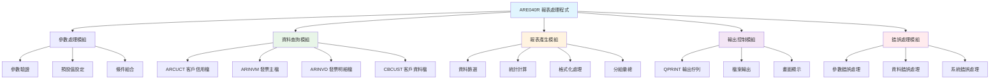
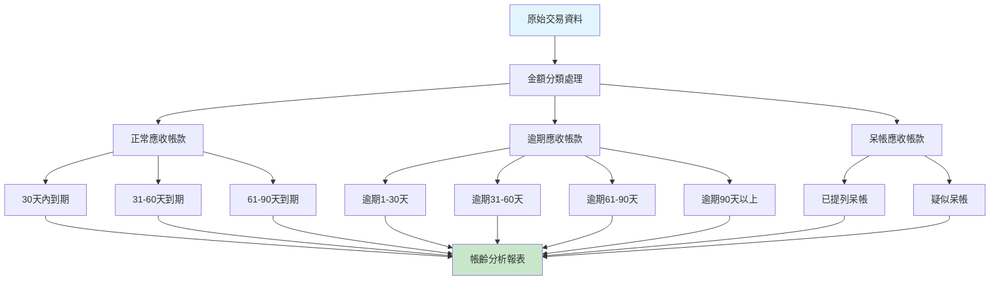
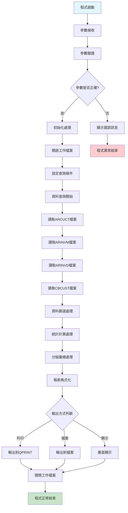
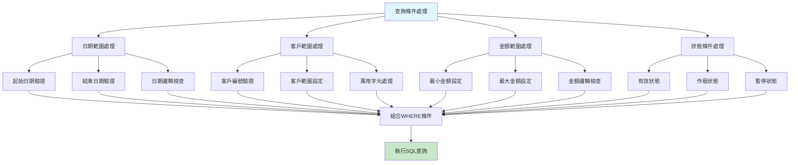
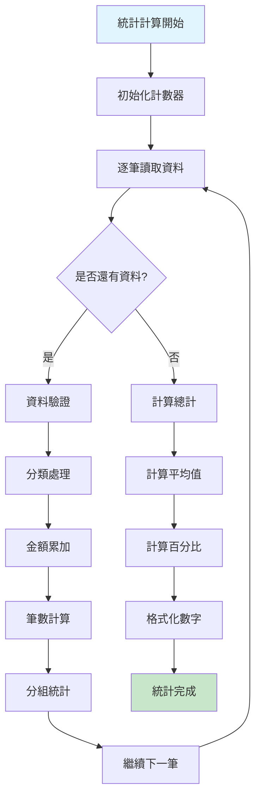

# ARE040R_P02 程式規格書

## 📋 基本資料

| 項目 | 內容 |
|------|------|
| **程式編號** | ARE040R |
| **程式名稱** | 應收帳款報表處理程式 |
| **程式類型** | RPG/400 |
| **系統名稱** | 應收帳款管理系統 (AR) |
| **子系統** | 應收帳款報表管理子系統 |
| **廠區** | P02 |
| **開發人員** | 系統開發團隊 |
| **建立日期** | 歷史程式（具體日期待查）|
| **主要修改** | 依廠區需求調整 |
| **程式路徑** | `P02RPGSRC_THSRC/ARE040R.txt` |

## 📖 程式功能說明

### 主要功能
ARE040R是**應收帳款報表處理的核心程式**，專門負責應收帳款相關報表的產生和處理，主要功能包括：

1. **應收帳款報表產生**：產生各種應收帳款相關報表
2. **資料查詢處理**：根據查詢條件篩選應收帳款資料
3. **報表格式控制**：控制報表的版面配置和格式
4. **統計計算處理**：計算各種應收帳款統計數據
5. **分組彙總功能**：按不同維度分組彙總資料
6. **輸出控制管理**：管理報表的輸出和列印
7. **參數驗證處理**：驗證輸入參數的有效性
8. **錯誤處理機制**：完整的錯誤處理和異常控制

### 業務流程說明
此程式是**應收帳款報表系統的核心引擎**，處理完整的報表生成流程：
- **參數接收與驗證**：接收並驗證報表產生所需的各項參數
- **資料查詢與篩選**：根據條件從應收帳款檔案查詢相關資料
- **資料處理與計算**：進行必要的資料處理和統計計算
- **報表格式化輸出**：按照預定格式產生報表並輸出
- **執行結果回報**：回報程式執行狀態和結果
- **錯誤處理與記錄**：處理執行過程中的錯誤和異常狀況

### 報表處理特色
作為報表處理程式，ARE040R具有以下特色：
- **多格式支援**：支援多種報表格式和版面配置
- **彈性查詢條件**：支援多種查詢條件的組合
- **統計計算功能**：豐富的統計和彙總計算能力
- **分組展示功能**：支援多層次的分組和小計
- **輸出控制能力**：靈活的輸出格式和目標控制
- **效能最佳化**：針對大量資料的效能最佳化處理

## 🗂️ 檔案架構與關聯圖

### 使用檔案清單

| 檔案名稱 | 檔案類型 | 使用方式 | 說明 |
|---------|---------|---------|------|
| **ARE040S** | DSPF | 讀取 | 參數輸入畫面檔案 |
| **ARCUCT** | PF | 讀取 | 客戶信用控制檔 |
| **ARINVM** | PF | 讀取 | 發票主檔 |
| **ARINVD** | PF | 讀取 | 發票明細檔 |
| **CBCUST** | PF | 讀取 | 客戶基本資料檔 |
| **QPRINT** | OUTQ | 寫入 | 報表輸出佇列 |
| **工作檔案** | QTEMP | 讀寫 | 暫存處理檔案 |

### 檔案關聯視覺化圖表



### 資料處理流程說明

1. **參數處理階段**：接收並驗證報表產生所需的參數
2. **資料查詢階段**：根據條件從相關檔案查詢資料
3. **資料處理階段**：進行資料篩選、計算和彙總
4. **報表產生階段**：按照格式產生報表內容
5. **輸出控制階段**：控制報表的輸出方式和目標
6. **結果回報階段**：回報執行狀態和結果統計

## 📊 報表輸出規格說明

### 標準報表格式

#### 應收帳款彙總報表格式
```
┌─────────────────────────────────────────────────────────────────────────────┐
│                          東森鋼鐵股份有限公司                              │
│                          應收帳款彙總報表                                  │
│                                                                             │
│ 報表日期：2024/12/26                          列印時間：14:35:20            │
│ 查詢條件：客戶編號 100001 ~ 999999            廠區：P02                     │
│                                                                             │
│ 客戶編號  客戶名稱                    期初餘額    本期發生    期末餘額      │
│ ---------------------------------------------------------------------------│
│ 100001   東鋼企業股份有限公司         1,000,000     500,000   1,500,000    │
│ 100002   鋼材貿易有限公司               800,000     300,000   1,100,000    │
│ 100003   製造業客戶                     600,000     200,000     800,000    │
│                                                                             │
│ 小計：                               2,400,000   1,000,000   3,400,000    │
│                                                                             │
│ *** 報表結束 ***                                     第 1 頁，共 1 頁      │
└─────────────────────────────────────────────────────────────────────────────┘
```

#### 應收帳款明細報表格式
```
┌─────────────────────────────────────────────────────────────────────────────┐
│                          東森鋼鐵股份有限公司                              │
│                          應收帳款明細報表                                  │
│                                                                             │
│ 報表日期：2024/12/26                          列印時間：14:35:20            │
│ 查詢條件：發票日期 2024/01/01 ~ 2024/12/31    客戶：100001                 │
│                                                                             │
│ 發票號碼     發票日期  到期日期  發票金額    已收金額    未收餘額           │
│ ---------------------------------------------------------------------------│
│ IV24120001   20241201  20250101   500,000         0    500,000            │
│ IV24120002   20241205  20250105   300,000    100,000    200,000            │
│ IV24120003   20241210  20250110   200,000    200,000          0            │
│                                                                             │
│ 客戶小計：                       1,000,000    300,000    700,000            │
│                                                                             │
│ *** 報表結束 ***                                     第 1 頁，共 1 頁      │
└─────────────────────────────────────────────────────────────────────────────┘
```

### 輸出參數設定

| 參數名稱 | 資料型態 | 長度 | 說明 | 預設值 |
|---------|---------|------|------|--------|
| **報表類型** | CHAR | 2 | 報表種類代碼 | '01' |
| **起始日期** | NUMERIC | 8,0 | 查詢起始日期 | 當月1日 |
| **結束日期** | NUMERIC | 8,0 | 查詢結束日期 | 當月末日 |
| **客戶編號** | CHAR | 6 | 指定客戶編號 | '*ALL' |
| **輸出方式** | CHAR | 1 | P=列印,F=檔案,D=顯示 | 'P' |
| **排序方式** | CHAR | 1 | 1=客戶,2=金額,3=日期 | '1' |

### 報表計算邏輯

#### 金額計算公式
```
期初餘額 = 上期結轉餘額
本期發生 = 本期新增發票金額 - 本期收款金額
期末餘額 = 期初餘額 + 本期發生

逾期金額 = SUM(發票金額) WHERE 到期日期 < 系統日期 AND 未收餘額 > 0
逾期天數 = 系統日期 - 到期日期

信用額度使用率 = 期末餘額 / 信用額度 * 100%
```

#### 統計分類處理


## 🖥️ 處理流程說明

### 程式執行流程

#### 主要處理流程


### 資料處理邏輯

#### 查詢條件組合處理


#### 統計計算處理


## ⚙️ 技術特點分析

### RPG程式設計特色

1. **🎯 報表專用處理能力**
   - **格式化輸出**：專業的報表格式化和版面控制
   - **統計計算功能**：強大的數值統計和彙總能力
   - **分組處理能力**：支援多層次分組和小計
   - **排序控制功能**：靈活的資料排序和展示控制

2. **📊 資料處理最佳化**
   - **查詢效能最佳化**：針對大量資料的查詢最佳化
   - **記憶體管理**：有效的記憶體使用和管理
   - **I/O最佳化**：減少不必要的檔案存取操作
   - **CPU效能控制**：合理的CPU資源使用控制

3. **🔍 彈性查詢能力**
   - **多條件組合**：支援複雜的查詢條件組合
   - **萬用字元支援**：支援模糊查詢和範圍查詢
   - **動態條件**：根據參數動態建立查詢條件
   - **條件驗證**：完整的查詢條件驗證機制

4. **🏭 輸出控制功能**
   - **多格式輸出**：支援列印、檔案、畫面多種輸出
   - **版面控制**：精確的報表版面配置控制
   - **分頁處理**：自動的分頁和頁首頁尾控制
   - **輸出品質**：高品質的報表輸出效果

### 錯誤處理機制

#### 完整錯誤處理架構

| 錯誤類型 | 錯誤代碼 | 錯誤說明 | 處理方式 |
|---------|---------|---------|---------|
| **參數錯誤** | E001 | 輸入參數格式錯誤 | 顯示錯誤訊息並結束 |
| **日期錯誤** | E002 | 日期範圍設定錯誤 | 提示正確格式 |
| **檔案錯誤** | E003 | 檔案開啟失敗 | 檢查檔案存在性 |
| **資料錯誤** | E004 | 查詢無資料 | 提示調整條件 |
| **輸出錯誤** | E005 | 輸出裝置錯誤 | 檢查輸出設定 |
| **系統錯誤** | E999 | 系統異常錯誤 | 記錄錯誤並通知 |

### 效能最佳化設計

#### 查詢最佳化策略
```
索引使用原則：
1. 客戶編號 + 發票日期 組合索引
2. 發票狀態 + 金額 組合索引  
3. 到期日期單一索引
4. 建立日期單一索引

記憶體管理：
1. 工作檔案使用QTEMP
2. 大量資料分批處理
3. 及時釋放不用的記憶體
4. 控制同時開啟的檔案數量

I/O最佳化：
1. 使用批次讀取減少I/O次數
2. 預先排序減少重複查詢
3. 合理使用緩衝區
4. 避免不必要的檔案開關
```

### 跨廠區功能差異分析

| 功能特性 | P02 | H05 | K02 | U01 | 差異說明 |
|---------|-----|-----|-----|-----|---------|
| **基礎報表功能** | ✅ | 需確認 | 需確認 | 需確認 | P02為主要實現 |
| **統計計算** | ✅ | 需確認 | 需確認 | 需確認 | 標準統計功能 |
| **多格式輸出** | ✅ | 需確認 | 需確認 | 需確認 | 完整輸出控制 |
| **查詢最佳化** | ✅ | 需確認 | 需確認 | 需確認 | 效能最佳化 |
| **錯誤處理** | ✅ | 需確認 | 需確認 | 需確認 | 完整錯誤機制 |

## 📝 重要商業邏輯摘要

### 核心業務規則

1. **報表分類系統**：支援多種應收帳款報表類型的產生
2. **查詢條件控制**：靈活的查詢條件組合和驗證機制
3. **統計計算規則**：準確的金額統計和帳齡分析計算
4. **輸出格式控制**：多種輸出格式和版面配置控制
5. **資料驗證機制**：完整的資料有效性驗證和錯誤處理
6. **效能控制機制**：針對大量資料的效能最佳化處理
7. **安全控制機制**：確保報表資料的安全性和準確性

### 關鍵報表流程

1. **報表參數設定流程**：
   - 接收和驗證報表產生參數
   - 設定查詢條件和輸出格式
   - 初始化處理環境和工作檔案
   - 開始報表產生流程

2. **資料查詢處理流程**：
   - 根據條件查詢相關檔案
   - 進行資料篩選和驗證
   - 執行統計計算和彙總
   - 準備報表資料內容

3. **報表輸出處理流程**：
   - 按照格式化要求排版
   - 進行分頁和版面控制
   - 執行輸出到指定目標
   - 回報執行結果和統計

### 系統整合要點

1. **與客戶管理系統整合**：透過CBCUST獲取客戶基本資訊
2. **與發票管理系統整合**：從ARINVM/ARINVD讀取發票資料
3. **與信用管理系統整合**：參考ARCUCT進行信用分析
4. **與輸出系統整合**：支援多種輸出方式和格式

### P02版本特殊價值

1. **完整報表功能**：提供最完整的應收帳款報表處理功能
2. **高效能處理**：針對大量資料的效能最佳化設計
3. **靈活輸出控制**：支援多種輸出格式和目標
4. **準確統計計算**：精確的金額統計和帳齡分析功能

### 重要設計模式

1. **Report Generator Pattern**：專業的報表產生器設計模式
2. **Data Filter Pattern**：靈活的資料篩選和查詢模式
3. **Statistical Calculation Pattern**：完整的統計計算處理模式
4. **Output Control Pattern**：多元化的輸出控制管理模式
5. **Error Handling Pattern**：完整的錯誤處理和恢復模式

### 報表計算商業邏輯

```
帳齡分析計算公式：

當前日期 = 系統日期
逾期天數 = 當前日期 - 發票到期日

帳齡分類：
0-30天    → 正常應收
31-60天   → 注意應收
61-90天   → 關注應收  
91-120天  → 逾期應收
121天以上 → 呆帳應收

風險評估：
低風險 = 0-30天應收金額
中風險 = 31-90天應收金額  
高風險 = 91天以上應收金額
```

### 統計報表架構

```
報表分層結構：

總公司層級 → 各廠區彙總
廠區層級   → 各部門彙總
部門層級   → 各客戶彙總
客戶層級   → 各發票明細

每層級包含：
- 期初餘額統計
- 本期發生統計  
- 期末餘額統計
- 逾期金額統計
- 帳齡分析統計
```

此程式體現了**「專業報表處理引擎」**的理念，透過強大的資料查詢能力、精確的統計計算功能、靈活的輸出控制機制，以及完整的錯誤處理系統，提供企業級的應收帳款報表解決方案，是財務報表系統中的專業典範。 