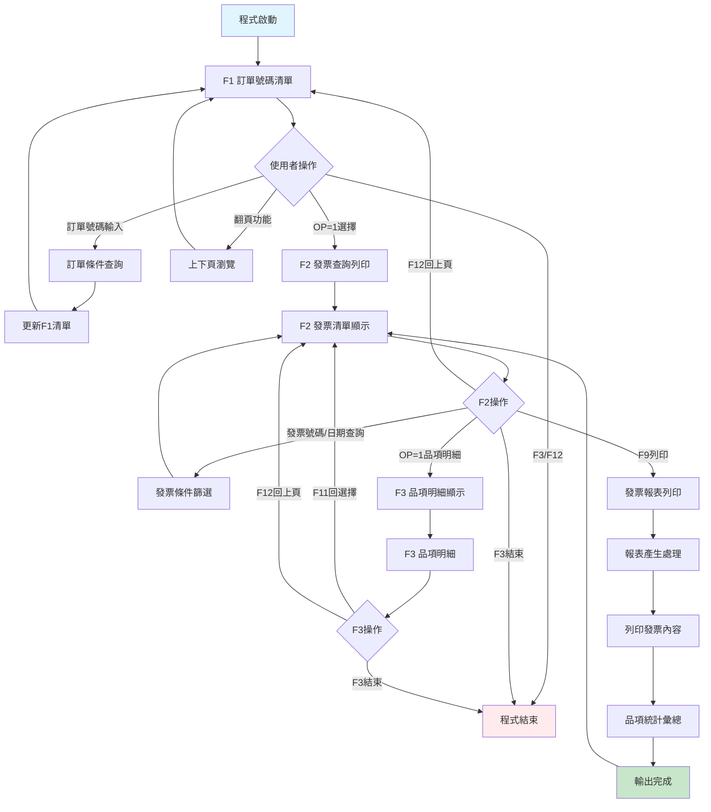
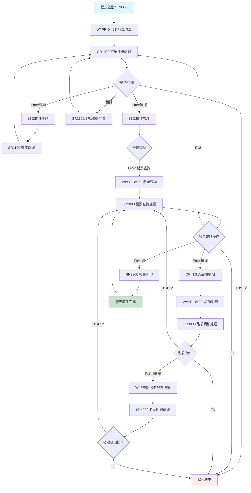
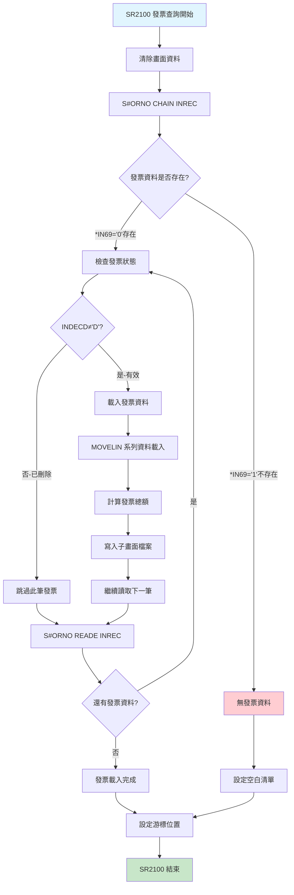
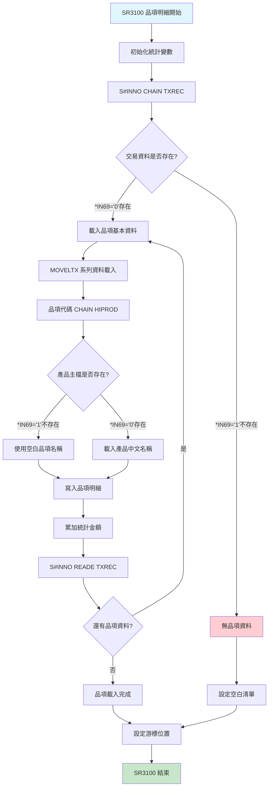
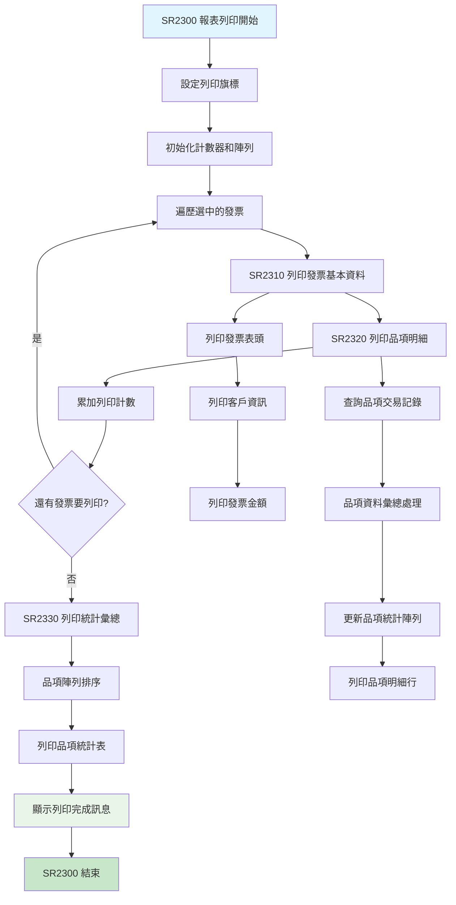

# ARE041R_P02 程式規格書

## 基本資料

| 項目 | 內容 |
|------|------|
| **程式編號** | ARE041R |
| **程式名稱** | 發票與品項查詢作業 |
| **程式類型** | RPG/400 |
| **系統名稱** | 應收帳款管理系統 (AR) |
| **子系統** | 發票查詢與品項管理子系統 |
| **廠區** | P02 |
| **程式路徑** | `P02RPGSRC_THSRC/ARE041R.txt` |

## 程式功能說明

### 主要功能
ARE041R是**發票與品項查詢的核心程式**，讓使用者從訂單號碼所產生的發票號碼，查詢最後所要輸出的發票詳細內容，主要功能包括：

1. **訂單號碼查詢**：顯示和查詢訂單號碼清單
2. **發票明細查詢**：查詢訂單對應的發票明細資訊  
3. **品項明細顯示**：顯示發票中的品項明細內容
4. **發票內容顯示**：展示完整的發票內容資訊
5. **發票報表列印**：提供發票與品項清單的列印功能
6. **品項統計彙總**：按品項代碼進行數量和金額彙總
7. **多層式查詢導航**：四層式階層查詢架構
8. **資料驗證處理**：完整的輸入資料驗證機制

### 業務流程說明
此程式是**發票查詢系統的中央操作平台**，處理完整的發票查詢流程：
- **F1訂單選擇**：從訂單主檔選擇要查詢的訂單
- **F2發票查詢**：顯示選定訂單的發票清單和基本資訊
- **F3品項明細**：展示發票中的品項交易明細
- **F4發票明細**：顯示發票的完整明細內容
- **報表列印功能**：提供發票內容的格式化列印輸出
- **品項統計分析**：按品項進行彙總統計和分析

## 檔案架構與關聯圖

### 使用檔案清單

| 檔案名稱 | 檔案類型 | 使用方式 | 說明 |
|---------|---------|---------|------|
| **ARE041S** | DSPF | 讀寫 | 四層式查詢畫面檔案 |
| **SAMAST** | PF | 讀取 | 訂單主檔 |
| **INVMSTL6** | LF | 讀取 | 發票主檔邏輯檔 |
| **TRNDTLL2** | LF | 讀取 | 交易明細邏輯檔 |
| **INVDTL** | PF | 讀取 | 發票明細檔 |
| **HIPROD** | PF | 讀取 | 產品主檔（品項資料）|
| **ARE041T** | PRTF | 寫入 | 發票報表列印檔案 |

### 檔案關聯視覺化圖表

```mermaid
graph TD
    A[ARE041R 發票品項查詢] --> B[四層式查詢系統]
    A --> C[發票資料整合]
    A --> D[品項管理系統]
    A --> E[報表列印系統]
    A --> F[統計分析系統]
    
    B --> G[F1 訂單號碼清單]
    B --> H[F2 發票查詢列印]
    B --> I[F3 品項明細顯示]
    B --> J[F4 發票明細顯示]
    
    C --> K[SAMAST 訂單主檔]
    C --> L[INVMSTL6 發票主檔]
    C --> M[TRNDTLL2 交易明細]
    C --> N[INVDTL 發票明細檔]
    
    D --> O[HIPROD 產品主檔]
    D --> P[品項代碼管理]
    D --> Q[品項名稱查詢]
    D --> R[品項規格資料]
    
    E --> S[ARE041T 報表檔]
    E --> T[發票格式化列印]
    E --> U[品項清單列印]
    E --> V[統計報表輸出]
    
    F --> W[品項數量統計]
    F --> X[金額彙總計算]
    F --> Y[品項分類統計]
    F --> Z[交易分析報告]
    
    style A fill:#e1f5fe
    style B fill:#e8f5e8
    style C fill:#fff3e0
    style D fill:#f3e5f5
    style E fill:#ffebee
    style F fill:#e3f2fd
```



### 資料流向說明

1. **訂單查詢階段**：從SAMAST讀取訂單基本資料
2. **發票資料階段**：透過INVMSTL6和TRNDTLL2獲取發票資訊
3. **品項明細階段**：結合INVDTL和HIPROD顯示品項詳細資料
4. **統計彙總階段**：進行品項數量和金額的統計計算
5. **報表輸出階段**：透過ARE041T產生格式化報表
6. **資料驗證階段**：完整的資料有效性檢查和錯誤處理

## 檔案欄位規格說明

### ARE041S 四層式畫面系統

#### F1 訂單號碼清單畫面格式
```
┌─────────────────────────────────────────────────────────────────────────────┐
│ 09/18/15      東森鋼鐵股份有限公司                          ARE041S-1       │
│ P02USER                      發票與品項查詢作業                     14:35:20│
│                                                                             │
│ 訂單號碼：[______]                                                          │
│                                                                             │
│ OP 訂單號碼    訂單日期  合約編號      客戶編號  客戶名稱                   │
│ ---------------------------------------------------------------------------│
│ [_] SA123001   20150918  CT202015001   100001   東鋼企業股份有限公司       │
│ [_] SA123002   20150919  CT202015002   100002   鋼材貿易有限公司           │
│ [_] SA123003   20150920  CT202015003   100003   製造業客戶                 │
│                                                                             │
│ 1=發票查詢                                                                  │
│ F3=結束 F12=取消 ROLLUP=下頁 ROLLDOWN=上頁 ENTER=選擇                      │
│ [錯誤訊息顯示區域]                                                          │
└─────────────────────────────────────────────────────────────────────────────┘
```

#### F2 發票查詢與列印畫面格式
```
┌─────────────────────────────────────────────────────────────────────────────┐
│ 09/18/15      東森鋼鐵股份有限公司                          ARE041S-2       │
│ P02USER                      發票與品項查詢作業                     14:35:20│
│                                                                             │
│ 訂單號碼：SA123001           客戶：100001 東鋼企業股份有限公司              │
│                                                                             │
│ 發票號碼：[__________] 發票日期：[______]                                   │
│                                                                             │
│ OP 發票號碼     發票日期  銷貨金額    營業稅額    總金額      餘額         │
│ ---------------------------------------------------------------------------│
│ [_] IV15091801  20150918  1,000,000     50,000  1,050,000   500,000      │
│ [_] IV15091802  20150919    800,000     40,000    840,000   840,000      │
│ [_] IV15091803  20150920    600,000     30,000    630,000   200,000      │
│                                                                             │
│ 1=品項明細                                                                  │
│ F3=結束 F9=列印 F12=回上頁 ENTER=選擇                                      │
│ [錯誤訊息顯示區域]                                                          │
└─────────────────────────────────────────────────────────────────────────────┘
```

#### F3 品項明細顯示畫面格式
```
┌─────────────────────────────────────────────────────────────────────────────┐
│ 09/18/15      東森鋼鐵股份有限公司                          ARE041S-3       │
│ P02USER                      發票與品項查詢作業                     14:35:20│
│                                                                             │
│ 發票號碼：IV15091801         總金額：1,050,000                              │
│                                                                             │
│ 項次 日期     品項代碼  品項名稱           數量      單價      金額        │
│ ---------------------------------------------------------------------------│
│  001 20150918 ST001    熱軋鋼板 3.2*1250*250  100.00   8,000   800,000   │
│  002 20150918 ST002    冷軋鋼板 2.0*1000*200   50.00   4,000   200,000   │
│  003 20150918          小計                   150.00          1,000,000   │
│                                                                             │
│ F3=結束 F11=回選擇 F12=回上頁                                              │
│ [錯誤訊息顯示區域]                                                          │
└─────────────────────────────────────────────────────────────────────────────┘
```

#### F4 發票明細顯示畫面格式  
```
┌─────────────────────────────────────────────────────────────────────────────┐
│ 09/18/15      東森鋼鐵股份有限公司                          ARE041S-4       │
│ P02USER                      發票與品項查詢作業                     14:35:20│
│                                                                             │
│ 發票號碼：IV15091801                                                        │
│                                                                             │
│ 帳戶 項次   入帳日期  品項代碼  數量      單價      金額      應收編號    │
│ ---------------------------------------------------------------------------│
│ 1101  001   20150918  ST001    100.00   8,000   800,000    AP150918001   │
│ 1101  002   20150918  ST002     50.00   4,000   200,000    AP150918002   │
│                                                                             │
│ F3=結束 F11=回選擇 F12=回上頁                                              │
│ [錯誤訊息顯示區域]                                                          │
└─────────────────────────────────────────────────────────────────────────────┘
```

### 資料結構定義

#### 發票查詢資料結構
| 欄位名稱 | 資料型態 | 長度 | 說明 | 特殊處理 |
|---------|---------|------|------|---------|
| **S#ORNO** | CHAR | 6 | 訂單號碼 | 🔑主要查詢鍵 |
| **S#ORDT** | NUMERIC | 8,0 | 訂單日期 | 📅日期格式 |
| **S#CTNO** | CHAR | 10 | 合約編號 | 📝合約參考 |
| **S#CUNO** | CHAR | 6 | 客戶編號 | 🏢客戶識別 |
| **S#CUNM** | CHAR | 20 | 客戶名稱 | 📛客戶資訊 |

#### 發票明細資料結構
| 欄位名稱 | 資料型態 | 長度 | 說明 | 特殊處理 |
|---------|---------|------|------|---------|
| **S#INNO** | CHAR | 10 | 發票號碼 | 🔑發票識別 |
| **S#INDT** | NUMERIC | 8,0 | 發票日期 | 📅發票開立日 |
| **S#INAA** | NUMERIC | 11,2 | 銷貨金額 | 💰未稅金額 |
| **S#INBA** | NUMERIC | 11,2 | 營業稅額 | 🧾稅額計算 |
| **S#INAT** | NUMERIC | 11,2 | 其他稅額 | 💱額外稅金 |
| **S#INAM** | NUMERIC | 11,2 | 發票總額 | 💸含稅總額 |
| **S#INBN** | NUMERIC | 11,2 | 發票餘額 | 💳未收餘額 |

#### 品項明細資料結構
| 欄位名稱 | 資料型態 | 長度 | 說明 | 特殊處理 |
|---------|---------|------|------|---------|
| **S#TXCD** | CHAR | 2 | 交易代碼 | 📊交易類型 |
| **S#TXNO** | CHAR | 10 | 交易編號 | 🔢交易序號 |
| **S#TXIT** | NUMERIC | 3,0 | 項次 | 🔢項目序號 |
| **S#TXDT** | NUMERIC | 8,0 | 交易日期 | 📅交易發生日 |
| **S#TXPD** | CHAR | 5 | 品項代碼 | 🏷️產品代碼 |
| **S#TXQT** | NUMERIC | 9,3 | 數量 | 📦交易數量 |
| **S#TXUP** | NUMERIC | 9,3 | 單價 | 💵單位價格 |
| **S#TXAM** | NUMERIC | 11,2 | 金額 | 💰交易金額 |
| **S#TXPC** | CHAR | 6 | 規格編號 | 📋規格參考 |

### 欄位切割視覺化

```
發票資料關聯結構：

訂單 → 發票 → 品項
SA123001 → IV15091801 → ST001 (熱軋鋼板)
        ↓              ↓
     合約編號        品項明細
   CT202015001      數量+單價+金額

品項統計彙總結構：
┌─────────────────────────────────────────┐
│ 品項代碼 → 總數量 → 總金額               │
│ ST001   →  100.00 → 800,000             │
│ ST002   →   50.00 → 200,000             │
│ 小計    →  150.00 → 1,000,000           │
└─────────────────────────────────────────┘

發票狀態處理流程：
┌─────────────────────────────────────────┐
│ 正常發票 ('C') → 可查詢列印             │
│ 作廢發票 ('D') → 不顯示                 │
│ 暫存發票 ('T') → 特殊標示               │
└─────────────────────────────────────────┘
```

## 輸出/入螢幕布局

### 畫面流程圖



### 功能鍵定義

#### F1 訂單號碼清單畫面
| 功能鍵 | 說明 | 處理邏輯 |
|--------|------|---------|
| **F3** | 結束作業 | 結束程式執行 |
| **F12** | 取消作業 | 結束程式執行 |
| **ROLLUP(91)** | 下頁 | 載入下一批訂單資料 |
| **ROLLDOWN(92)** | 上頁 | 回到上一批訂單資料 |
| **ENTER** | 確認選擇 | 根據OP欄位執行對應功能 |

#### F2 發票查詢與列印畫面
| 功能鍵 | 說明 | 處理邏輯 |
|--------|------|---------|
| **F3** | 結束程式 | 直接結束程式 |
| **F9** | 列印報表 | 執行發票報表列印 |
| **F12** | 回上頁 | 回到F1訂單清單 |
| **ENTER** | 執行操作 | 根據輸入條件篩選或選擇 |

#### F3 品項明細顯示畫面
| 功能鍵 | 說明 | 處理邏輯 |
|--------|------|---------|
| **F3** | 結束程式 | 直接結束程式 |
| **F11** | 回到選擇 | 回到F2發票清單 |
| **F12** | 回上頁 | 回到F2發票清單 |

#### F4 發票明細顯示畫面
| 功能鍵 | 說明 | 處理邏輯 |
|--------|------|---------|
| **F3** | 結束程式 | 直接結束程式 |
| **F11** | 回到選擇 | 回到F2發票清單 |
| **F12** | 回上頁 | 回到F2發票清單 |

## 處理流程程序說明

### 🎯 主要程序流程

#### 程式主控迴圈


### 🎯 發票查詢處理流程 (SR2100)

#### 發票資料載入機制


### 🎯 品項明細處理流程 (SR3100)

#### 品項資料查詢與顯示


### 報表列印處理流程 (SR2300)

#### 發票報表產生機制


## 技術特點分析

### RPG程式設計特色

1. **四層式階層架構設計**
   - **F1訂單層**：訂單號碼的清單瀏覽和選擇
   - **F2發票層**：發票資料的查詢和列印控制
   - **F3品項層**：品項明細的詳細顯示
   - **F4明細層**：發票明細的完整資訊展示

2. **📊 多檔案整合查詢**
   - **訂單整合**：SAMAST訂單主檔的基礎資料
   - **發票整合**：INVMSTL6和TRNDTLL2的發票資訊
   - **品項整合**：INVDTL明細檔和HIPROD產品檔
   - **報表整合**：ARE041T格式化輸出檔案

3. **🔍 智能資料處理**
   - **條件查詢**：支援訂單號碼和發票條件的靈活查詢
   - **狀態過濾**：自動過濾已刪除('D')的發票記錄
   - **品項彙總**：按品項代碼進行數量和金額統計
   - **動態陣列**：使用ARY1陣列進行品項統計排序

4. **🏭 完整報表功能**
   - **格式化列印**：專業的發票報表格式
   - **品項統計表**：按品項分類的彙總報表
   - **多重輸出**：支援畫面顯示和列印輸出
   - **列印控制**：完整的列印流程和狀態管理

### 錯誤處理機制

#### 完整錯誤訊息對照表 (5種錯誤類型)

| 錯誤編號 | 錯誤訊息 | 觸發條件 | 處理建議 |
|---------|---------|---------|---------|
| **MSG,1** | 請輸入訂單編號或數字！| 訂單號碼格式錯誤 | 輸入正確的訂單號碼 |
| **MSG,2** | 資料已到檔尾。| 翻頁到最後 | 使用上翻功能 |
| **MSG,3** | 資料已到檔頭。| 翻頁到最前 | 使用下翻功能 |
| **MSG,4** | 已選擇發票與品項明細已列印，列印筆數為：| 列印完成訊息 | 確認列印結果 |
| **MSG,5** | [空白訊息]| 清除訊息用 | 正常狀態 |

### 跨廠區功能差異分析

| 功能特性 | P02 (820行) | U01 (820行) | H05 | K02 | 差異說明 |
|---------|-------------|-------------|-----|-----|---------|
| **基礎查詢功能** | ✅ | ✅ | 超時 | 超時 | P02/U01有完整功能 |
| **四層式畫面** | ✅ | ✅ | 超時 | 超時 | 完整階層架構 |
| **HIPROD支援** | ✅ (0409A) | ✅ (0401A) | 超時 | 超時 | P02較新版本 |
| **報表列印** | ✅ | ✅ | 超時 | 超時 | 完整列印功能 |
| **品項統計** | ✅ | ✅ | 超時 | 超時 | 統計彙總功能 |
| **程式行數** | 820行 | 820行 | 未知 | 未知 | P02/U01結構相同 |
| **最後修改** | 2015/09/18 | 2015/04/01 | 未知 | 未知 | P02版本較新 |

## 重要商業邏輯摘要

### 核心業務規則

1. **四層式查詢架構**：F1訂單→F2發票→F3品項→F4明細的完整查詢流程
2. **發票狀態控制**：自動過濾已刪除('D')狀態的發票記錄
3. **品項統計彙總**：按品項代碼進行數量和金額的自動統計
4. **報表列印控制**：支援選擇性發票列印和品項統計報表
5. **產品資料整合**：結合HIPROD產品主檔顯示完整品項資訊
6. **多重查詢條件**：支援訂單號碼、發票號碼、發票日期等查詢
7. **資料驗證機制**：完整的輸入資料格式驗證和錯誤處理

### 關鍵業務流程

1. **訂單選擇流程**：
   - 從SAMAST讀取訂單基本資料
   - 支援訂單號碼條件查詢
   - 提供訂單清單的瀏覽和選擇
   - 顯示訂單的客戶和合約資訊

2. **發票查詢流程**：
   - 根據選定訂單載入發票清單
   - 支援發票號碼和日期的條件篩選
   - 顯示發票的金額和餘額資訊
   - 提供發票的列印和明細查詢

3. **品項明細流程**：
   - 載入選定發票的品項交易記錄
   - 結合產品主檔顯示品項名稱
   - 計算品項的數量和金額統計
   - 提供品項明細的詳細展示

4. **報表列印流程**：
   - 格式化發票資料為報表格式
   - 產生品項統計彙總表
   - 支援多發票的批次列印
   - 提供列印完成狀態回報

### 系統整合要點

1. **與訂單管理系統整合**：透過SAMAST獲取訂單基礎資料
2. **與發票管理系統整合**：從INVMSTL6和TRNDTLL2讀取發票資訊
3. **與產品管理系統整合**：利用HIPROD提供品項詳細資料
4. **與報表系統整合**：透過ARE041T產生專業格式報表

### 重要設計模式

1. **Hierarchical Navigation Pattern**：四層式階層導航的完整實現
2. **Multi-File Integration Pattern**：多檔案整合查詢的統一處理
3. **Report Generation Pattern**：專業報表產生的標準化處理
4. **Array Processing Pattern**：品項統計陣列的排序和處理
5. **State Filter Pattern**：發票狀態的智能過濾機制

### 發票查詢商業邏輯

```
四層式查詢架構：

F1 訂單清單 → 選擇訂單
    ↓
F2 發票查詢 → 選擇發票 → F9列印
    ↓              ↓
F3 品項明細 ←── 品項統計彙總
    ↓
F4 發票明細

查詢條件支援：
- 訂單號碼查詢
- 發票號碼查詢  
- 發票日期查詢
- 組合條件查詢
```

### 品項統計處理

```
品項統計陣列處理：

ARY1陣列結構：
Position 1-5:   品項代碼 (A#PNM2)
Position 6-14:  總數量   (A#QTY2)  
Position 15-25: 總金額   (A#AMT2)

統計處理流程：
1. 初始化陣列 (MOVEL*ALL'9' ARY1)
2. 逐筆處理品項交易記錄
3. 尋找相同品項代碼
4. 累加數量和金額
5. 陣列排序 (SORTA ARY1)
6. 列印統計報表
```

## 備註

### 特殊注意事項

1. **四層式查詢架構**：
   - F1訂單清單→F2發票查詢→F3品項明細→F4發票明細的完整查詢流程
   - 每層都有完整的功能鍵支援和資料驗證
   - 支援多重條件查詢和彈性導航

2. **發票狀態控制**：
   - 自動過濾已刪除('D')狀態的發票記錄
   - 只顯示有效的發票資料
   - 確保資料查詢的準確性

3. **品項資料整合**：
   - 結合HIPROD產品主檔顯示完整品項資訊
   - 支援品項代碼和中文名稱的對應顯示
   - 提供品項規格和詳細資料查詢

4. **報表列印功能**：
   - 支援選擇性發票列印和品項統計報表
   - 提供格式化的專業報表輸出
   - 包含品項統計彙總和陣列排序處理

5. **多檔案整合查詢**：
   - 整合SAMAST、INVMSTL6、TRNDTLL2、INVDTL等多個檔案
   - 提供一致的查詢介面和資料關聯
   - 確保資料的完整性和一致性

6. **品項統計處理**：
   - 使用ARY1陣列進行品項統計彙總
   - 支援品項代碼、數量、金額的排序和統計
   - 提供完整的統計報表輸出功能 