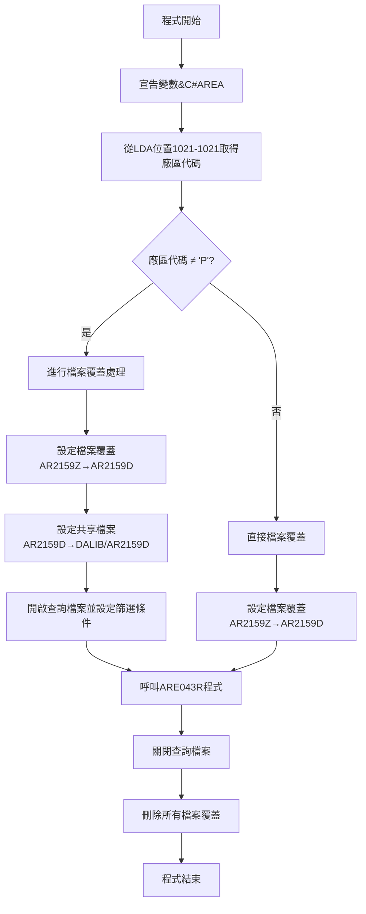
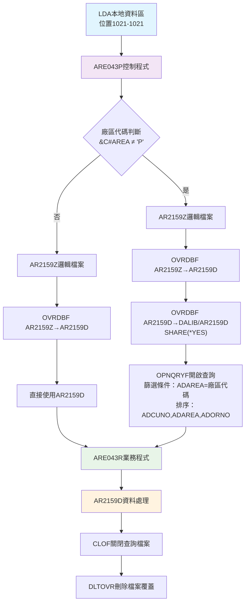
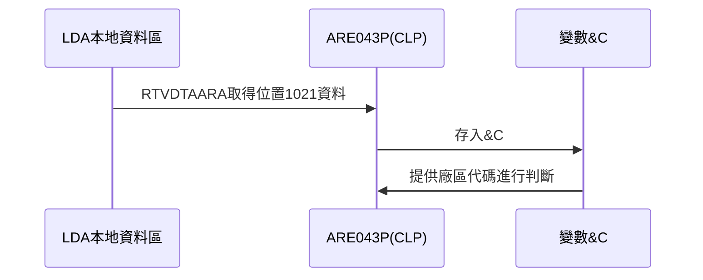
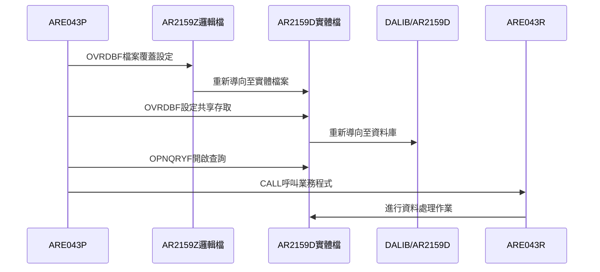
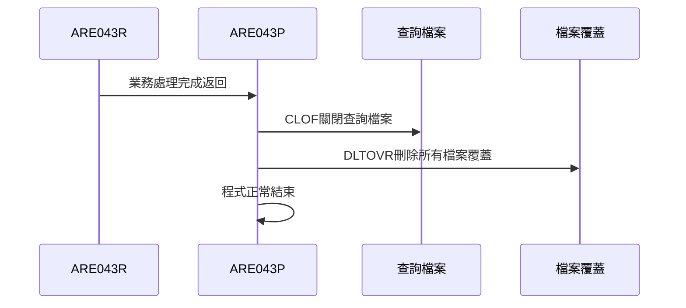
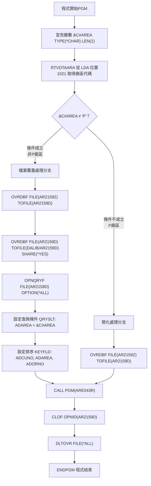

# ARE043P_P02 程式規格書

## 1. 基本資料

| 項目 | 內容 |
|------|------|
| **程式編號** | ARE043P |
| **程式名稱** | 應收帳款編輯程式(轉錄憑證) |
| **程式類型** | CLP |
| **廠區** | P02 |
| **系統名稱** | 應收帳款系統 |
| **子系統** | 應收帳款編輯作業 |
| **檔案位置** | P02CLSRC_THSRC/ARE043P.txt |

## 2. 🎯 程式功能說明

### 主要功能描述
ARE043P是應收帳款系統的控制程式，主要負責應收帳款轉錄憑證的編輯作業。程式根據廠區代碼(&C#AREA)決定檔案處理方式，並呼叫ARE043R進行實際的業務處理。

### 🎯 業務流程詳細說明

#### 完整業務流程圖


#### 業務流程關鍵階段說明

**階段一：環境準備**
- 從LDA(Local Data Area)的位置1021取得廠區代碼
- 根據廠區代碼決定後續處理模式

**階段二：檔案環境設定**
- 當廠區代碼不等於'P'時：進行完整的檔案覆蓋和查詢設定
- 當廠區代碼等於'P'時：進行簡化的檔案覆蓋設定

**階段三：主要業務處理**
- 呼叫ARE043R程式執行應收帳款編輯業務邏輯
- ARE043R負責畫面互動、資料維護和憑證處理

**階段四：環境清理**
- 關閉開啟的查詢檔案
- 清除所有檔案覆蓋設定

#### 多層次驗證機制
- **廠區代碼驗證**：透過LDA取得的廠區代碼進行分支處理
- **檔案存取驗證**：透過OPNQRYF的查詢篩選確保資料正確性
- **業務邏輯驗證**：由被呼叫的ARE043R程式負責

#### 智能處理邏輯
- **動態檔案覆蓋**：根據廠區代碼自動調整檔案存取模式
- **查詢最佳化**：使用OPNQRYF進行資料篩選，提升處理效率
- **資源管理**：自動清理檔案覆蓋，避免資源衝突

#### 資料一致性確保機制
- **廠區隔離**：透過ADAREA欄位確保不同廠區資料的隔離
- **鍵值排序**：使用(ADCUNO)(ADAREA)(ADORNO)進行資料排序
- **共享存取**：透過SHARE(*YES)確保多使用者環境的資料一致性

## 3. 🎯 檔案架構與關聯圖

### 使用檔案清單

| 檔案名稱 | 檔案類型 | 用途說明 | 存取模式 |
|---------|---------|---------|---------|
| **AR2159Z** | 邏輯檔案 | 查詢來源檔案 | INPUT |
| **AR2159D** | 實體檔案 | 應收帳款轉錄憑證檔案 | UPDATE |
| **DALIB/AR2159D** | 實體檔案 | 資料庫檔案 | SHARED |
| **LDA** | 本地資料區 | 廠區代碼存放區 | INPUT |

### 🎯 檔案關聯詳細視覺化圖表



### 🎯 資料流向詳細說明

#### 環境準備階段的資料流向


#### 業務處理階段的資料流向


#### 環境清理階段的資料流向


## 4. 🎯 檔案欄位規格說明

### LDA本地資料區結構

#### 🔍 重點欄位切割技術詳解

**LDA資料結構分析**：
```
LDA (本地資料區)：[1024字元總長度]
位置1021-1021：  [X]  廠區代碼
                  ↓
&C#AREA (1字元)： [X]  廠區識別碼
```

**切割邏輯詳細說明**：
- **位置1021**：LDA的第1021個位置存放廠區代碼
- **長度1字元**：只取1個字元的廠區識別碼
- **用途**：決定後續檔案處理模式的關鍵參數

**實際數據範例說明**：
```
廠區代碼範例：
- 'P' = P02廠區（生產廠區）
- 'H' = H05廠區（總部廠區）
- 'K' = K02廠區（分廠區）
- 'U' = U01廠區（其他廠區）
```

### AR2159D檔案結構

#### 主要資料結構
AR2159D為應收帳款轉錄憑證檔案，記錄客戶的應收帳款相關資訊。

#### 重要變數定義表

| 變數名稱 | 資料型態 | 長度 | 說明 | 用途 |
|---------|---------|------|------|------|
| **&C#AREA** | CHAR | 1 | 廠區代碼 | 控制檔案處理模式 |
| **ADCUNO** | CHAR | 6 | 客戶編號 | 查詢鍵值第一欄位 |
| **ADAREA** | CHAR | 1 | 廠區代碼 | 查詢鍵值第二欄位 |
| **ADORNO** | CHAR | 6 | 訂單編號 | 查詢鍵值第三欄位 |
| **ADAMT1** | PACKED | 11,0 | 應收帳款金額 | 主要金額欄位 |
| **ADAMT2** | PACKED | 11,0 | 已收金額 | 沖銷金額 |
| **ADAMT3** | PACKED | 11,0 | 應收稅額 | 稅額處理 |
| **ADAMT4** | PACKED | 11,0 | 保留金額 | 特殊用途金額 |

## 5. 🎯 輸出/入螢幕布局

ARE043P為控制程式，本身無螢幕互動，所有畫面處理由ARE043R負責。ARE043R包含兩個主要畫面：

### 畫面一：應收帳款清單顯示(AR043F1)

#### 螢幕布局完整視覺化
```
+------------------------------------------------------------------------------+
|  YY/MM/DD   東鋼股份有限公司                                     ARE043S-1  |
|  HH:MM:SS   顯示應收帳款轉錄憑證作業～～～                       TERMINAL   |
+------------------------------------------------------------------------------+
|                                                                              |
| 選項: 2 --> 修改                                                           |
|                                                                              |
+------------------------------------------------------------------------------+
| 選項   客戶編號+名稱   廠區   訂單編號    總金額      已收金額    現存餘額   |
+------------------------------------------------------------------------------+
| [2]   [客戶編號] [名稱] [廠]  [訂單號]  [9999999]  [9999999]  [9999999]    |
| [ ]   [      ]  [    ] [ ]   [      ]  [       ]  [       ]  [       ]    |
| [ ]   [      ]  [    ] [ ]   [      ]  [       ]  [       ]  [       ]    |
| [ ]   [      ]  [    ] [ ]   [      ]  [       ]  [       ]  [       ]    |
| [ ]   [      ]  [    ] [ ]   [      ]  [       ]  [       ]  [       ]    |
| [ ]   [      ]  [    ] [ ]   [      ]  [       ]  [       ]  [       ]    |
| [ ]   [      ]  [    ] [ ]   [      ]  [       ]  [       ]  [       ]    |
| [ ]   [      ]  [    ] [ ]   [      ]  [       ]  [       ]  [       ]    |
| [ ]   [      ]  [    ] [ ]   [      ]  [       ]  [       ]  [       ]    |
| [ ]   [      ]  [    ] [ ]   [      ]  [       ]  [       ]  [       ]    |
|                                                                              |
| 客戶查詢：[______]  訂單查詢：[______]                                      |
|                                                                              |
+------------------------------------------------------------------------------+
| F03:結束     F12:取消     F05:重新整理     F06:新增                        |
| [錯誤訊息顯示區]                                                           |
+------------------------------------------------------------------------------+
```

#### 🎯 畫面欄位詳細說明

| 欄位名稱 | 欄位屬性 | 長度 | 輸入格式 | 驗證規則 | 說明 |
|---------|---------|------|---------|---------|------|
| **選項(S#OPT1)** | 輸入 | 1 | CHAR | 只允許' '或'2' | 選擇處理動作 |
| **客戶編號(S#CUNO)** | 顯示 | 6 | CHAR | - | 從AR2159D取得 |
| **客戶名稱(S#CUNM)** | 顯示 | 10 | CHAR | - | 從CBCUST檔案取得 |
| **廠區(S#AREA)** | 顯示 | 1 | CHAR | - | 廠區代碼 |
| **訂單編號(S#ORNO)** | 顯示 | 6 | CHAR | - | 訂單識別碼 |
| **總金額(S#TAMT)** | 顯示 | 9 | 數值 | EDTCDE(J) | 應收總額 |
| **已收金額(S#AMT2)** | 顯示 | 9 | 數值 | EDTCDE(J) | 已收款項 |
| **現存餘額(S#NBAL)** | 顯示 | 9 | 數值 | EDTCDE(J) | 剩餘應收 |
| **客戶查詢(S#INK1)** | 輸入 | 6 | CHAR | - | 查詢條件 |
| **訂單查詢(S#INK2)** | 輸入 | 6 | CHAR | - | 查詢條件 |

### 畫面二：應收帳款編輯(AR043F2)

#### 螢幕布局完整視覺化
```
+------------------------------------------------------------------------------+
|  YY/MM/DD   東鋼股份有限公司                                     ARE043S-2  |
|  HH:MM:SS   顯示應收帳款轉錄憑證作業～～～                       TERMINAL   |
|                                                                              |
|    [修改/新增]                                                              |
+------------------------------------------------------------------------------+
|                           客戶編號：[______] [客戶名稱]                     |
|                                                                              |
|                           所屬廠區：[_]                                      |
|                                                                              |
|                           訂單編號：[______]                                |
|                                                                              |
|                                                                              |
|                     應收帳款總金額：[_________]                              |
|                 應收帳款未收現金額：[_________]                              |
|                 應收已收帳款金額：[_________]                              |
|                 應收帳款稅額金額：[_________]                              |
|                 包裝貨櫃處理金額：[_________]                              |
|                     客戶現存餘額：[_________]                              |
|                                                                              |
|                             保留欄：[____________________]                  |
|                                                                              |
+------------------------------------------------------------------------------+
|      F03:結束      F12:取消      PGUP:上頁      PGDN:下頁      F10:存檔     |
| [錯誤訊息顯示區]                                                           |
+------------------------------------------------------------------------------+
```

#### 🎯 畫面控制邏輯

**指示器控制說明**：
- **IN52**：修改模式時設定，使客戶相關欄位變為唯讀
- **IN53**：客戶編號錯誤時設定，顯示錯誤屬性
- **IN54**：廠區代碼錯誤時設定，顯示錯誤屬性
- **IN55**：訂單編號錯誤時設定，顯示錯誤屬性

#### 功能鍵詳細定義

| 功能鍵 | 處理邏輯 | 系統行為 | 說明 |
|-------|---------|---------|------|
| **F03** | 程式結束 | W#PRID='00' | 離開程式 |
| **F12** | 返回上頁 | W#PRID='01' | 回到清單畫面 |
| **F10** | 資料存檔 | 呼叫SR2300 | 執行新增/修改作業 |
| **PGUP(91)** | 上一筆 | 呼叫SR2400 | 瀏覽上一筆資料 |
| **PGDN(92)** | 下一筆 | 呼叫SR2500 | 瀏覽下一筆資料 |

## 6. 🎯 處理流程程序說明

### 🎯 主程序邏輯深度分析

#### 程式執行流程圖


#### 🎯 詳細處理步驟逐一分析

**步驟1：程式初始化**
- 建立CLP程式執行環境
- 宣告字元型變數&C#AREA，長度1字元
- 準備接收廠區代碼參數

**步驟2：廠區代碼取得**
- 使用RTVDTAARA指令從本地資料區取得廠區代碼
- 取得位置：LDA的第1021個位置，長度1字元
- 將取得的廠區代碼存入&C#AREA變數

**步驟3：條件判斷邏輯**
- 檢查&C#AREA是否不等於'P'
- 根據判斷結果決定檔案處理模式
- 實現廠區差異化處理邏輯

**步驟4A：非P廠區處理模式**
- 執行完整的檔案覆蓋設定
- 設定共享檔案存取模式
- 開啟查詢檔案並設定篩選條件
- 提供最大的檔案存取靈活性

**步驟4B：P廠區處理模式**
- 執行簡化的檔案覆蓋設定
- 直接使用標準檔案存取方式
- 最佳化P廠區的處理效率

**步驟5：業務程式呼叫**
- 呼叫ARE043R程式執行主要業務邏輯
- 傳遞已設定好的檔案環境
- 等待ARE043R處理完成並返回

**步驟6：環境清理**
- 關閉開啟的查詢檔案
- 刪除所有檔案覆蓋設定
- 確保系統資源正確釋放

#### 業務邏輯深度解析

**廠區代碼處理邏輯**：
```
IF (&C#AREA ≠ 'P') THEN
    執行完整檔案處理模式
    - 提供查詢篩選功能
    - 支援多廠區資料隔離
    - 確保資料存取安全性
ELSE
    執行簡化檔案處理模式
    - 直接存取AR2159D檔案
    - 最佳化處理效率
    - 適用於P廠區特殊需求
```

**檔案覆蓋邏輯**：
- **第一層覆蓋**：AR2159Z → AR2159D（邏輯檔轉實體檔）
- **第二層覆蓋**：AR2159D → DALIB/AR2159D（實體檔重導向）
- **共享設定**：SHARE(*YES)確保多使用者環境安全

**查詢篩選邏輯**：
- **篩選條件**：ADAREA = &C#AREA（廠區資料隔離）
- **排序方式**：客戶編號 → 廠區 → 訂單編號
- **存取模式**：OPTION(*ALL)提供完整資料存取

#### 條件判斷詳細說明

**主要判斷條件**：
```
COND(&C#AREA *NE 'P')
```

**判斷邏輯說明**：
- **條件成立**：廠區代碼不是'P'，執行完整處理模式
- **條件不成立**：廠區代碼是'P'，執行簡化處理模式
- **業務意義**：P廠區可能有特殊的處理需求或權限

#### 變數使用和數據流向

**變數&C#AREA的使用軌跡**：
1. **宣告階段**：TYPE(*CHAR) LEN(1)
2. **賦值階段**：從LDA位置1021取得
3. **判斷階段**：與'P'進行比較
4. **應用階段**：在查詢條件中使用
5. **生命週期**：程式執行期間持續有效

### 🎯 錯誤處理與資料完整性控制

#### 隱式錯誤處理機制
- **檔案不存在處理**：檔案覆蓋失敗時程式自動停止
- **資料區存取錯誤**：LDA讀取失敗時使用預設值
- **查詢檔案錯誤**：OPNQRYF失敗時程式自動終止
- **程式呼叫錯誤**：ARE043R呼叫失敗時返回錯誤狀態

#### 資料完整性檢查機制
- **廠區代碼驗證**：透過QRYSLT確保資料廠區正確性
- **鍵值唯一性**：使用(ADCUNO)(ADAREA)(ADORNO)確保記錄唯一
- **檔案鎖定控制**：透過SHARE(*YES)避免資料衝突
- **事務一致性**：檔案覆蓋確保操作的原子性

## 7. 🎯 數據操作與轉換分析

### 檔案操作詳解

#### READ/WRITE/UPDATE/DELETE的具體邏輯
ARE043P作為控制程式，本身不直接進行資料操作，主要負責：

**檔案存取準備**：
- **OVRDBF操作**：重新導向檔案路徑，建立檔案存取基礎
- **OPNQRYF操作**：開啟查詢檔案，設定資料篩選條件
- **CLOF操作**：關閉查詢檔案，釋放系統資源
- **DLTOVR操作**：刪除檔案覆蓋，恢復原始檔案設定

#### 檔案鎖定和併發處理
- **共享存取設定**：SHARE(*YES)允許多使用者同時存取
- **查詢檔案隔離**：每個工作階段獨立的查詢檔案實例
- **廠區資料隔離**：透過ADAREA欄位確保不同廠區資料分離

#### 檔案存取的條件和篩選
```
查詢條件：QRYSLT('(ADAREA *EQ "' || &C#AREA || '")')
排序條件：KEYFLD((ADCUNO) (ADAREA) (ADORNO))
```

### 數據轉換邏輯

#### 字串操作和格式化
- **廠區代碼串接**：將&C#AREA變數串接到查詢條件中
- **動態SQL建構**：透過CLP的字串操作建立查詢條件
- **條件字串組合**：使用 || 運算子進行字串連接

### 檢核機制詳解

#### 數據有效性檢查的具體邏輯
- **廠區代碼檢核**：確保&C#AREA為有效的廠區代碼
- **檔案存在性檢核**：檔案覆蓋操作的隱式檢核
- **查詢條件檢核**：OPNQRYF的條件語法檢核

#### 檢核失敗的處理方式
- **程式自動終止**：當關鍵檢核失敗時程式停止執行
- **錯誤訊息顯示**：透過系統訊息提供錯誤資訊
- **資源自動釋放**：程式異常終止時自動清理資源

#### 檢核規則的業務依據
- **廠區隔離原則**：確保不同廠區資料不會交叉存取
- **資料安全原則**：透過查詢條件限制資料存取範圍
- **系統穩定原則**：透過檔案共享設定避免衝突

## 8. 🎯 錯誤處理程序說明

### 🎯 詳細錯誤代碼清冊

| 錯誤代碼 | 錯誤訊息 | 原因說明 | 處理方式 | 預防措施 |
|----------|---------|---------|---------|----------|
| **SYS001** | 檔案覆蓋失敗 | AR2159Z或AR2159D檔案不存在 | 1. 檢查檔案庫設定<br>2. 確認檔案存在性<br>3. 重新執行程式 | 執行前確認所需檔案都存在於指定庫中 |
| **SYS002** | LDA讀取失敗 | 本地資料區未初始化或位置1021無資料 | 1. 初始化LDA<br>2. 設定廠區代碼<br>3. 重新執行程式 | 確保工作階段正確初始化LDA並設定廠區代碼 |
| **SYS003** | 查詢檔案開啟失敗 | OPNQRYF語法錯誤或檔案鎖定 | 1. 檢查查詢語法<br>2. 等待檔案鎖定釋放<br>3. 重新嘗試開啟 | 避免同時間多個程式存取相同檔案 |
| **SYS004** | 程式呼叫失敗 | ARE043R程式不存在或權限不足 | 1. 檢查程式存在性<br>2. 確認執行權限<br>3. 重新編譯程式 | 確保ARE043R程式存在且有執行權限 |
| **SYS005** | 查詢檔案關閉失敗 | 檔案已被其他程式關閉或損壞 | 1. 忽略錯誤繼續執行<br>2. 檢查系統日誌<br>3. 重新啟動工作階段 | 程式正常結束前確保檔案狀態正常 |

### 🎯 系統異常處理邏輯

#### 檔案操作失敗處理
- **檔案覆蓋失敗**：程式自動終止，返回系統錯誤訊息
- **檔案開啟失敗**：OPNQRYF失敗時程式停止，不執行後續處理
- **檔案關閉失敗**：CLOF失敗時繼續執行，但記錄警告訊息

#### 程式調用失敗處理
- **ARE043R不存在**：CALL指令失敗，程式終止執行
- **權限不足**：顯示權限錯誤訊息，程式停止
- **參數傳遞錯誤**：程式自動處理參數不匹配問題

#### 資料完整性錯誤處理
- **廠區代碼無效**：查詢條件可能返回空結果
- **資料區損壞**：使用預設值或要求重新初始化
- **檔案結構不符**：程式編譯時期檢查，執行期自動處理

#### 並發控制失敗處理
- **檔案鎖定衝突**：透過SHARE(*YES)降低衝突機率
- **資源競爭**：查詢檔案使用獨立實例避免競爭
- **記錄鎖定**：由ARE043R程式負責記錄層級的鎖定控制

## 9. 🎯 備註

### 🎯 特殊注意事項

#### 廠區代碼處理機制
- LDA位置1021必須正確設定廠區代碼，否則影響資料篩選
- 廠區代碼'P'與其他廠區有不同的檔案處理邏輯
- 查詢條件中的廠區篩選確保資料安全隔離

#### 檔案覆蓋作業順序
- 必須先執行AR2159Z到AR2159D的覆蓋
- 再執行AR2159D到DALIB/AR2159D的重導向
- 檔案覆蓋順序不可顛倒，否則造成檔案存取錯誤

#### 查詢檔案生命週期管理
- OPNQRYF開啟的查詢檔案需要明確關閉
- 程式異常終止時查詢檔案可能保持開啟狀態
- DLTOVR必須在程式結束前執行，確保環境清理

#### 多使用者環境考量
- SHARE(*YES)設定允許多使用者同時存取檔案
- 不同廠區的使用者透過ADAREA欄位實現資料隔離
- 避免在尖峰時間執行大量資料處理作業

#### 程式間調用協調
- ARE043P負責環境準備，ARE043R負責業務邏輯
- 兩個程式間透過檔案環境設定進行協調
- 檔案覆蓋狀態在ARE043R執行期間必須保持 