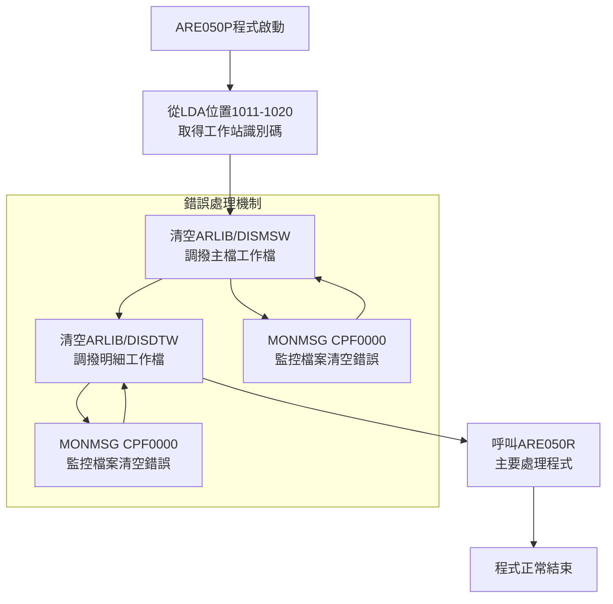
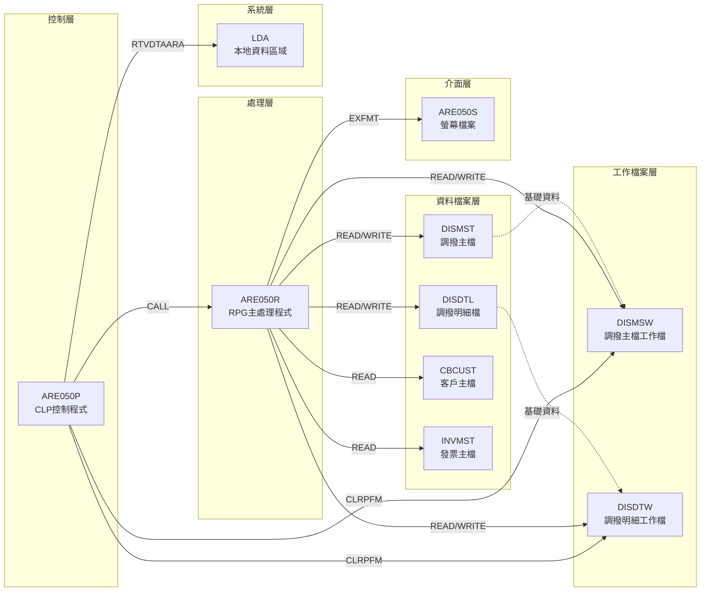
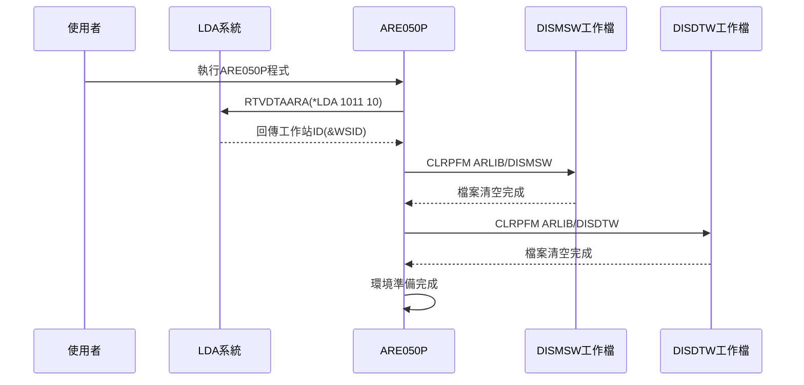
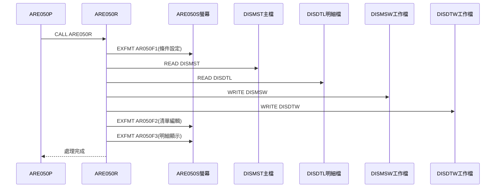
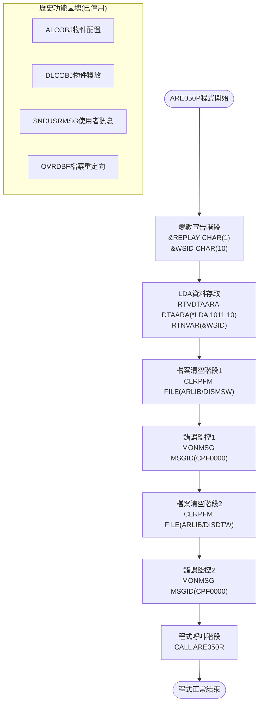
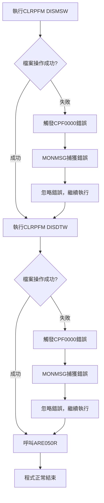

# ARE050P_P02 程式規格書

## 1. 基本資訊

| 項目 | 內容 |
|------|------|
| **程式編號** | ARE050P |
| **程式名稱** | 調撥單據處理程式 |
| **程式類型** | CLP/400 |
| **系統模組** | 應收帳款系統 (AR) |
| **廠區** | P02 |
| **程式路徑** | `P02CLSRC_THSRC/ARE050P.txt` |

## 2. 🎯 程式功能說明

### 主要功能
本程式為調撥單據處理作業的控制程式，執行以下功能：
- 從LDA取得工作站識別碼
- 清空調撥單據工作檔案
- 呼叫主要處理程式ARE050R
- 管理調撥單據的傳票處理流程

### 🎯 業務流程詳細說明

本程式作為調撥單據自動處理作業的控制程式，透過系統化的檔案準備和程式呼叫機制，實現調撥單據的完整處理流程。



### 🎯 多層次驗證機制
程式包含以下驗證機制：
- **LDA存取驗證**：確保工作站識別碼正確取得
- **檔案操作驗證**：透過MONMSG監控檔案清空操作
- **程式呼叫驗證**：確保ARE050R程式正常執行

### 🎯 智能處理邏輯
- **工作站識別管理**：自動從LDA取得當前使用者工作站資訊
- **檔案環境準備**：系統化清空工作檔案，確保處理環境清潔
- **錯誤容錯機制**：檔案操作失敗時不中斷主要處理流程

### 🎯 資料一致性確保機制
- **工作檔案重置**：每次執行前清空DISMSW和DISDTW工作檔案
- **程式間資料傳遞**：透過LDA工作站識別碼確保處理環境一致性
- **檔案狀態管理**：確保後續ARE050R程式取得乾淨的工作環境

## 3. 🎯 檔案結構與關聯圖

### 🎯 檔案關聯詳細視覺化圖表



### 🎯 資料流向詳細說明

#### 環境準備階段的資料流向



#### 業務處理階段的資料流向



### 檔案使用方式

| 檔案名稱 | 檔案類型 | 使用方式 | 關聯說明 |
|----------|----------|----------|----------|
| DISMSW | 工作檔 | 清空/寫入 | 調撥主檔工作檔，供ARE050R處理使用 |
| DISDTW | 工作檔 | 清空/寫入 | 調撥明細工作檔，供ARE050R處理使用 |
| LDA | 系統檔 | 讀取 | 本地資料區域，位置1011-1020存放工作站識別碼 |
| ARE050R | 程式檔 | 呼叫 | 主要業務邏輯處理程式 |

## 4. 🎯 檔案欄位規格說明

### 4.1 🔍 重點欄位切割技術詳解

#### LDA結構完整分析

LDA (Local Data Area) 資料結構在本程式中的使用方式：

```
LDA總長度：1024字元
ARE050P使用區段：位置1011-1020 (10字元)

LDA (1024字元)：[                    ...                    ]
位置:                                ↓1011        ↓1020
ARE050P存取區域：                   [XXXXXXXXXX]
                                     ↓         
工作站識別碼(&WSID)：               [XXXXXXXXXX]     工作站編號(10字元)
```

#### 🔍 欄位切割視覺化展示

**LDA存取欄位切割邏輯：**

```
RTVDTAARA DTAARA(*LDA (1011 10)) RTNVAR(&WSID)

LDA結構 (1024字元)：[1-1010][1011-1020][1021-1024]
                     ↓       ↓          ↓
其他程式使用區域：   [其他用途]         [其他用途]
ARE050P專用區域：           [工作站ID]
                           ↓
&WSID變數(10字元)：        [XXXXXXXXXX]    當前使用者工作站編號
```

#### 🔍 實際數據範例說明

**工作站識別碼格式範例：**
```
&WSID內容範例：
- 'WS001     ' (工作站001，右側填空白)
- 'TERMINAL05' (終端機05)
- 'PC00000123' (PC編號123)
```

### 4.2 DISMSW檔案欄位規格

| 欄位名稱 | 型態 | 長度 | 小數 | 說明 | 用途分析 |
|----------|------|------|------|------|----------|
| DMCUNO | CHAR | 6 | - | 客戶編號 | 調撥對象識別 |
| DMCUNM | OUTPUT | 10 | - | 客戶名稱 | 顯示用客戶名稱 |
| DMORNO | CHAR | 6 | - | 訂單編號 | 調撥單據編號 |
| DMYYMM | NUMERIC | 6 | 0 | 處理年月 | 格式YYYYMM |
| DMAREA | CHAR | 1 | - | 區域別 | H/K/P/U廠區代碼 |
| DMCONT | NUMERIC | 3 | 0 | 處理期間 | 001-999期間編號 |
| DMPROD | CHAR | 2 | - | 產品類別 | 產品分類代碼 |
| DMSALE | CHAR | 2 | - | 業務員 | 業務負責人代碼 |
| DMTYPE | CHAR | 1 | - | 開票類別 | 開票處理類型 |
| DMQTY1 | NUMERIC | 9 | 0 | 開票數量 | 開票產品數量 |
| DMAMT1 | NUMERIC | 12 | 0 | 開票含稅金額 | 含稅總金額 |
| DMAMT2 | NUMERIC | 12 | 0 | 超領退料金額 | 超額領料退回金額 |
| DMAMT3 | NUMERIC | 12 | 0 | 補退料金額 | 補料退料調整金額 |
| DMAMT4 | NUMERIC | 4 | 3 | 營業稅率/稅額 | 稅率或稅額(3位小數) |
| DMAMT5 | NUMERIC | 12 | 0 | 開票含稅額 | 最終開票金額 |
| DMQTY6 | NUMERIC | 9 | 0 | 加運數量 | 加運處理數量 |
| DMAMT6 | NUMERIC | 12 | 0 | 加運金額 | 加運費用金額 |
| DMCOD1 | CHAR | 1 | - | 開票處理模式 | 1:正常開票 2:退貨開票 |
| DMCOD2 | CHAR | 1 | - | 確認旗標 | Y:已確認 空白:未確認 |
| DMCOD3 | CHAR | 1 | - | 開票旗標 | 開票狀態標記 |
| DMCOD4 | CHAR | 1 | - | 轉帳旗標 | 轉帳處理標記 |
| DMADDM | CHAR | 10 | - | 建立人員 | 建立者使用者代碼 |
| DMADDD | NUMERIC | 8 | 0 | 建立日期 | 格式YYYYMMDD |
| DMADDT | NUMERIC | 6 | 0 | 建立時間 | 格式HHMMSS |
| DMUPDM | CHAR | 10 | - | 異動人員 | 最後修改者代碼 |
| DMUPDD | NUMERIC | 8 | 0 | 異動日期 | 格式YYYYMMDD |
| DMUPDT | NUMERIC | 6 | 0 | 異動時間 | 格式HHMMSS |
| DMACYM | NUMERIC | 6 | 0 | 入帳年月 | 會計入帳年月YYYYMM |

### 4.3 DISDTW檔案欄位規格

| 欄位名稱 | 型態 | 長度 | 小數 | 說明 | 用途分析 |
|----------|------|------|------|------|----------|
| DSCODE | CHAR | 1 | - | 開票旗標 | 開票狀態控制 |
| DSORNO | CHAR | 6 | - | 訂單編號 | 對應調撥單號 |
| DSYYMM | NUMERIC | 6 | 0 | 處理年月 | 處理年月YYYYMM |
| DSCONT | NUMERIC | 3 | 0 | 處理期間 | 會計期間001-999 |
| DSINNO | CHAR | 10 | - | 開票編號 | 發票單據編號 |
| DSAREA | CHAR | 1 | - | 開票廠區 | 開票所屬廠區 |
| DSPROD | CHAR | 5 | - | 產品類別 | 產品分類代碼(5碼) |
| DSQTY1 | NUMERIC | 9 | 0 | 產品數量 | 開票產品數量 |
| DSAMT3 | NUMERIC | 12 | 0 | 開票原金額 | 開票前原始金額 |
| DSAMT1 | NUMERIC | 12 | 0 | 營業稅額 | 營業稅金額 |
| DSAMT2 | NUMERIC | 8 | 0 | 營業稅額 | 營業稅額(較短格式) |
| DSTXNO | CHAR | 8 | - | 營業發票號 | 營業發票統一編號 |
| DSTXIT | NUMERIC | 2 | 0 | 發票聯數 | 發票列印聯數 |
| DSTXDT | NUMERIC | 8 | 0 | 入帳日期 | 會計入帳日期YYYYMMDD |
| DSCUNO | CHAR | 6 | - | 客戶編號 | 對應客戶代碼 |

### 4.4 重要變數定義表

| 變數名稱 | 型態 | 長度 | 用途說明 | 來源/設定方式 |
|----------|------|------|----------|---------------|
| &REPLAY | CHAR | 1 | 重試旗標 | 程式內部宣告，歷史功能已停用 |
| &WSID | CHAR | 10 | 工作站識別碼 | 從LDA位置1011-1020取得 |

## 5. 🎯 輸出入畫面配置

### 5.1 螢幕布局完整視覺化

本CLP程式不直接處理畫面，所有畫面操作由ARE050R程式處理。ARE050S螢幕檔案包含三個主要格式：

#### AR050F1 - 條件設定畫面布局

```
+----------------------------------------------------------+
| 91/02/20    東洋鋼鐵股份有限公司東鋼部門調撥管理中心-    |S#SRID |
| 14:30:15              調撥單據自動處理作業               |S#DEVI |
+----------------------------------------------------------+
|                                                          |
|                                                          |
|                                                          |
|                                                          |
|                                                          |
|                                                          |
|                                                          |
|                    上期處理年月: [____/__] 期 [___] 期    |
|                    處理處理年月: [____/__] 期 [___] 期    |
|                        業務類別: [__] (空白表示全部)     |
|                        客戶編號: [______] (空白表示全部) |
|                        訂單編號: [______] (空白表示全部) |
|                        產品類別: [_] ( 3:鋼料4:鋼胚5:鋼管|
|                                      6:I型鋼 空白=全部) |
|                        開票區域: [_] ( H:總部 K:高雄空白=全部)|
|                        入帳年月: [____/__]               |
|                                                          |
|                                                          |
|                                                          |
|                                                          |
|                                                          |
|                                                          |
| F3/F12:離開        ENTER:確認        F5:重新處理F7:重新列印|
| [錯誤訊息顯示區]                                          |
+----------------------------------------------------------+
```

#### AR050F2 - 清單編輯畫面布局 (子檔案)

```
+----------------------------------------------------------+
|                    條件設定結果顯示                       |
| 業務類別: [____]  客戶編號: [____] [________]  第[___]期處理|
| 處理年月: [____]  訂單編號: [____]  產品類別: [______] 區域別:[____]|
| OP: 1=編輯5=明細     (處理旗標: 1=確認2=開票)  (可編輯欄位: Y=轉帳)|
| ===============================================================|
| O 客戶編號  名稱      訂單   年月   區  含稅數量    含稅金額     超領退料|
| P 處理模式      開票含稅額   ú退料金額   稅  確  入帳  開  加運數量  加運金額|
| ===============================================================|
| [_] [______] [________] [____] [____] [_] [_____] [_______] [_______]|
| [___] [_______] [_______] [_] [_] [Y] [____] [_] [____] [______]|
| [_] [______] [________] [____] [____] [_] [_____] [_______] [_______]|
| [___] [_______] [_______] [_] [_] [Y] [____] [_] [____] [______]|
| [_] [______] [________] [____] [____] [_] [_____] [_______] [_______]|
| [___] [_______] [_______] [_] [_] [Y] [____] [_] [____] [______]|
|                                                          |
|                                                          |
|                                                          |
|                                                          |
|                                                          |
|                    H區總計: [________]  K區總計: [________]|
| F3:離開    F12:回上頁    F10:新增    F6:確認開票           |
| [錯誤訊息顯示區]                                          |
+----------------------------------------------------------+
```

#### AR050F3 - 明細顯示畫面布局 (子檔案)

```
+----------------------------------------------------------+
| 業務類別: [____]  客戶編號: [____] [________]  第[___]期處理|
| 處理年月: [____]  訂單編號: [____]  產品類別: [____] 區域別:[____]|
| ===============================================================|
| OP 開票編號    區域 類別    數量      銷項稅額    進項稅額    營業發票號|
| ===============================================================|
| [Y] [________] [_] [___] [______] [_____] [_____] [______] [__]|
| [Y] [________] [_] [___] [______] [_____] [_____] [______] [__]|
| [Y] [________] [_] [___] [______] [_____] [_____] [______] [__]|
| [Y] [________] [_] [___] [______] [_____] [_____] [______] [__]|
| [Y] [________] [_] [___] [______] [_____] [_____] [______] [__]|
| [Y] [________] [_] [___] [______] [_____] [_____] [______] [__]|
|                                                          |
|                                                          |
|                                                          |
|                                                          |
|                                                          |
|                                                          |
| F3:離開        F12:回上頁        F10:新增               |
| [錯誤訊息顯示區]                                          |
+----------------------------------------------------------+
```

### 5.2 🎯 畫面欄位詳細說明

#### AR050F1 畫面欄位屬性

| 欄位名稱 | 位置 | 長度 | 型態 | 屬性 | 說明 |
|----------|------|------|------|------|------|
| S#YM2 | 9,37 | 6 | NUMERIC | 輸入(B) | 處理年月，DSPATR(PC RI) |
| S#CON2 | 9,43 | 3 | NUMERIC | 輸入(B) | 處理期間，DSPATR(PC RI) |
| S#SAL1 | 10,37 | 2 | CHAR | 輸入(B) | 業務員別 |
| S#CUN1 | 11,37 | 6 | CHAR | 輸入(B) | 客戶編號 |
| S#ORN1 | 12,37 | 6 | CHAR | 輸入(B) | 訂單編號 |
| S#PRO1 | 13,37 | 1 | CHAR | 輸入(B) | 產品類別 |
| S#ARE1 | 15,37 | 1 | CHAR | 輸入(B) | 開票區域 |
| S1ACYM | 16,37 | 6 | NUMERIC | 輸入(B) | 入帳年月，DSPATR(PC RI) |

#### AR050F2 子檔案欄位屬性

| 欄位名稱 | 位置 | 長度 | 型態 | 屬性 | 說明 |
|----------|------|------|------|------|------|
| S#OPT | 11,2 | 1 | NUMERIC | 輸入(B) | 操作選項，VALUES(0 5 1) |
| S#AMT4 | 12,6 | 4 | NUMERIC | 輸入(B) | 營業稅率，EDTCDE(1) |
| S#COD1 | 12,43 | 1 | CHAR | 輸入(B) | 處理模式，VALUES(' ' '1' '2') |
| S#COD2 | 12,46 | 1 | CHAR | 輸入(B) | 轉帳旗標，VALUES(' ' 'Y') |
| S#ACYM | 12,48 | 6 | NUMERIC | 輸入(B) | 入帳年月，EDTCDE(4) |

### 5.3 🎯 畫面控制邏輯

#### 指示器控制邏輯

| 指示器 | 控制欄位 | 功能說明 |
|--------|----------|----------|
| *IN30 | S#YM2, S#CON2 | 必填欄位顯示屬性PC RI |
| *IN31 | S#AMT4, S#COD1, S#COD2, S#ACYM | 保護模式顯示屬性PR |
| *IN32 | S#AMT4 | 反白顯示屬性PC RI |
| *IN33 | S#COD1, S#ACYM | 反白顯示屬性PC RI |
| *IN38 | S1ACYM | 必填欄位顯示屬性PC RI |
| *IN70 | SFL | 子檔案變更指示器SFLNXTCHG |
| *IN71-74 | SFLCTL | 子檔案控制指示器 |
| *IN81 | SFL | 子檔案變更指示器SFLNXTCHG |

### 5.4 功能鍵詳細定義

| 功能鍵 | 程式碼 | 處理邏輯 | 系統行為 |
|--------|--------|----------|----------|
| F3 | CA03 | 程式離開 | 設定*IN03='1'，程式結束 |
| F12 | CA12 | 回上頁 | 設定*IN12='1'，返回上一畫面 |
| F5 | CF05 | 重新處理 | 設定*IN05='1'，重新執行處理邏輯 |
| F6 | CF06 | 確認開票 | 設定*IN06='1'，執行開票確認 |
| F7 | CF07 | 重新列印 | 設定*IN07='1'，執行列印作業 |
| F10 | CF10 | 新增 | 設定*IN10='1'，進入新增模式 |
| ENTER | - | 確認輸入 | 執行畫面驗證和資料處理 |

## 6. 🎯 處理流程程序說明

### 6.1 🎯 主程序邏輯深度分析

#### 🎯 詳細處理步驟逐一分析



#### 🎯 業務邏輯深度解析

**階段1：環境初始化**
- **變數宣告**：宣告&REPLAY和&WSID兩個CLP變數
- **LDA存取**：從本地資料區域位置1011-1020取得10字元工作站識別碼
- **目的**：建立程式執行的基礎環境和使用者識別

**階段2：工作檔案準備**
- **DISMSW清空**：清空調撥主檔工作檔案，移除前次處理殘留資料
- **DISDTW清空**：清空調撥明細工作檔案，確保處理環境清潔
- **錯誤容錯**：透過MONMSG CPF0000忽略檔案不存在或清空失敗錯誤

**階段3：主要處理委派**
- **程式呼叫**：呼叫ARE050R RPG程式執行實際業務邏輯
- **控制權轉移**：ARE050R負責使用者互動、資料處理、檔案更新
- **處理完成**：ARE050R執行完畢後控制權返回ARE050P

#### 🎯 條件判斷詳細說明

本程式為線性執行結構，不包含複雜的條件判斷邏輯：
- **檔案操作錯誤**：透過MONMSG機制處理，不中斷程式執行
- **LDA存取失敗**：系統層級處理，程式無需特殊判斷
- **程式呼叫失敗**：系統會產生例外，程式正常終止

#### 🎯 變數使用和數據流向

**&WSID變數追蹤：**
```
宣告階段：&WSID = 未初始化
LDA讀取後：&WSID = '工作站編號' (10字元)
程式結束：&WSID = 維持LDA取得值
```

**數據流向追蹤：**
```
LDA(1011-1020) → &WSID → (傳遞給ARE050R使用)
DISMSW檔案 → 清空 → (供ARE050R寫入使用)
DISDTW檔案 → 清空 → (供ARE050R寫入使用)
```

### 6.2 🎯 特殊邏輯處理

#### 🎯 錯誤處理與資料完整性控制

**CPF0000錯誤監控機制：**
- **適用範圍**：監控所有以CPF開頭的系統錯誤訊息
- **處理方式**：忽略錯誤，繼續執行後續指令
- **業務考量**：檔案不存在或已空不影響後續處理邏輯

**檔案清空容錯邏輯：**
- **DISMSW清空失敗**：不影響ARE050R的正常執行
- **DISDTW清空失敗**：ARE050R會重新建立所需記錄
- **設計原理**：確保主要業務流程不因輔助操作失敗而中斷

#### 歷史功能分析

**已停用的檔案鎖定機制：**
```
註解內容：ALCOBJ OBJ((DALIB/DISMST *FILE *EXCLRD)) WAIT(0)
原始用途：對DISMST檔案進行排他性讀取鎖定
停用原因：0304A版本後改為多工作站同時使用模式
```

**已停用的使用者互動機制：**
```
註解內容：SNDUSRMSG MSG('調撥單據自動處理作業正在處理中...')
原始用途：向使用者顯示處理狀態訊息
停用原因：改為直接執行，不需要使用者確認
```

### 6.3 🎯 版本演進技術實現

#### 0212A版本技術變更
- **新增功能**：須轉出作業處理
- **技術實現**：新增CLRPFM指令清空DISMSW和DISDTW
- **程式碼行**：41-44行的檔案清空操作

#### 0304A版本技術變更
- **新增功能**：工作站程式同時使用
- **技術實現**：新增&WSID變數和LDA存取邏輯
- **程式碼行**：26-28行的變數宣告和LDA讀取
- **停用功能**：註解原有的ALCOBJ檔案鎖定機制

#### 0407A版本技術變更
- **修改功能**：年度單據傳票新增同時使用工作站
- **技術影響**：程式碼本身無變更，主要影響ARE050R的處理邏輯

## 7. 🎯 數據操作與轉換分析

### 7.1 檔案操作詳解

#### CLRPFM檔案清空操作

**ARLIB/DISMSW檔案清空：**
- **操作類型**：CLRPFM (Clear Physical File Member)
- **目標檔案**：ARLIB程式庫中的DISMSW檔案
- **執行效果**：移除檔案中所有記錄，保留檔案結構
- **業務目的**：確保ARE050R程式取得乾淨的工作環境

**ARLIB/DISDTW檔案清空：**
- **操作類型**：CLRPFM (Clear Physical File Member)
- **目標檔案**：ARLIB程式庫中的DISDTW檔案
- **執行效果**：清空所有明細記錄，重置檔案狀態
- **業務目的**：避免前次處理殘留資料影響本次作業

#### LDA資料存取操作

**RTVDTAARA LDA存取：**
- **指令格式**：RTVDTAARA DTAARA(*LDA (1011 10)) RTNVAR(&WSID)
- **存取區域**：LDA第1011-1020位置，共10個字元
- **回傳變數**：&WSID (CHARACTER 10)
- **資料用途**：識別當前使用者的工作站編號

### 7.2 數據轉換邏輯

#### 變數型態轉換

本程式的資料轉換主要發生在LDA存取階段：

**LDA資料區域轉換：**
```
來源：LDA位置1011-1020 (系統二進位格式)
目標：&WSID變數 (CHARACTER 10)
轉換：系統自動進行字元型態轉換
結果：10字元工作站識別字串
```

### 7.3 檢核機制詳解

#### 系統層級檢核

**LDA存取檢核：**
- **檢核項目**：LDA可用性、存取權限、資料格式
- **失敗處理**：系統例外處理，程式終止
- **檢核時機**：RTVDTAARA指令執行時

**檔案操作檢核：**
- **檢核項目**：檔案存在性、存取權限、檔案狀態
- **失敗處理**：CPF0000錯誤，由MONMSG忽略
- **檢核時機**：CLRPFM指令執行時

#### 🔍 檢核規則業務依據

**工作站識別檢核：**
- **業務規則**：每個使用者必須有唯一工作站識別
- **檢核方式**：透過LDA系統機制確保資料有效性
- **檢核失敗**：系統層級處理，無需程式干預

**檔案狀態檢核：**
- **業務規則**：工作檔案必須在處理前清空
- **檢核方式**：CLRPFM執行成功即視為通過檢核
- **檢核失敗**：忽略錯誤，ARE050R會重建必要資料

## 8. 🎯 錯誤處理程序說明

### 8.1 🎯 詳細錯誤代碼清冊

| 錯誤代碼 | 錯誤訊息 | 原因說明 | 處理方式 | 預防措施 |
|----------|---------|---------|---------|----------|
| **CPF0000** | 系統檔案操作錯誤 | DISMSW或DISDTW檔案清空失敗，檔案可能不存在或被鎖定 | 1. MONMSG自動忽略錯誤<br>2. 繼續執行後續程式<br>3. ARE050R會重建必要資料 | 確保ARLIB程式庫存在且有適當權限 |
| **CPF1002** | 物件配置衝突(歷史) | 多個使用者同時存取DISMST檔案造成鎖定衝突 | 1. 已停用ALCOBJ機制<br>2. 改用多工作站模式<br>3. 不再需要檔案鎖定 | 使用0304A版本後的多工作站機制 |
| **檔案權限錯誤** | 使用者無權限存取ARLIB | 使用者對ARLIB程式庫沒有足夠的存取權限 | 1. 系統管理員檢查權限設定<br>2. 確保使用者有CLRPFM權限<br>3. 檢查程式庫授權 | 正確設定使用者權限和程式庫授權 |
| **LDA存取錯誤** | 無法從LDA取得工作站ID | LDA資料區域損壞或系統設定問題 | 1. 系統會產生例外終止程式<br>2. 檢查LDA完整性<br>3. 重新啟動工作階段 | 定期檢查LDA設定和系統狀態 |
| **程式呼叫失敗** | ARE050R程式無法執行 | ARE050R程式不存在或損壞 | 1. 系統產生例外訊息<br>2. 檢查ARE050R程式完整性<br>3. 重新編譯必要程式 | 確保相關程式檔案完整且可執行 |

### 8.2 🎯 系統異常處理邏輯

#### 檔案操作失敗處理



#### 程式呼叫失敗處理

**ARE050R呼叫異常：**
- **異常類型**：程式不存在、編譯錯誤、執行時錯誤
- **系統行為**：產生系統例外訊息，程式異常終止
- **恢復機制**：無自動恢復，需要系統管理員介入
- **影響範圍**：整個調撥單據處理作業無法完成

#### 並發控制失敗處理

**歷史鎖定機制(已停用)：**
```
原始邏輯：
ALCSTR: ALCOBJ OBJ((DALIB/DISMST *FILE *EXCLRD)) WAIT(0)
失敗處理：SNDUSRMSG詢問使用者是否重試
重試機制：GOTO CMDLBL(ALCSTR)重新嘗試鎖定

現行機制：
移除檔案鎖定，採用多工作站同時存取模式
ARE050R程式內部處理並發控制
```

### 8.3 錯誤恢復機制

#### 自動恢復機制

**檔案清空失敗自動恢復：**
- **恢復邏輯**：忽略清空失敗，ARE050R會覆寫或重建資料
- **業務影響**：可能存在前次處理殘留資料，但不影響正確性
- **恢復時間**：即時恢復，無延遲

**系統例外手動恢復：**
- **LDA問題**：需要重新啟動使用者工作階段
- **權限問題**：需要系統管理員調整權限設定
- **程式問題**：需要重新編譯或修復相關程式

## 9. 🎯 備註

### 9.1 程式特性

1. **控制程式角色**：本程式為純控制程式，不處理業務邏輯
2. **工作檔案管理**：負責清空工作檔案，確保處理環境清潔
3. **LDA依賴**：程式功能依賴LDA中的工作站識別碼
4. **錯誤容錯**：對檔案操作錯誤具有容忍性，不會中斷執行

### 9.2 版本異動技術實現

- **0212A版本**：新增須轉出作業處理功能，實現CLRPFM工作檔案清空
- **0304A版本**：支援多工作站同時使用，新增LDA工作站識別機制
- **0407A版本**：修改年度單據傳票新增同時使用工作站，影響ARE050R處理邏輯

### 9.3 系統整合

本程式為調撥單據處理系統的入口程式，與以下程式協作：
- **ARE050R**：主要業務邏輯處理程式
- **ARE050P4**：報表列印程式
- **ARE050P1**：重新處理程式

### 9.4 檔案庫管理

程式使用ARLIB作為主要工作檔案庫，包含：
- DISMSW（調撥主檔工作檔）
- DISDTW（調撥明細工作檔）

### 9.5 作業執行要點

1. 執行前LDA中工作站ID已設定
2. 工作檔案清空失敗不影響後續處理  
3. 程式設計包含錯誤處理機制 