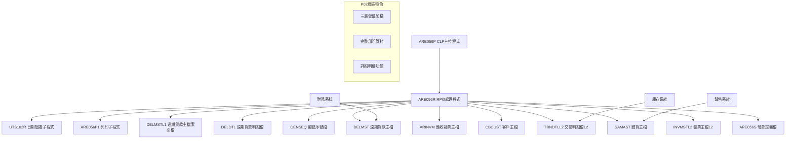
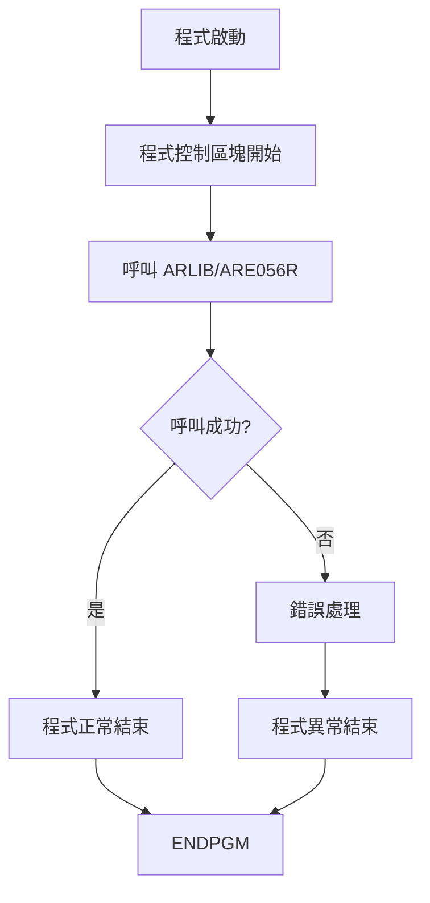
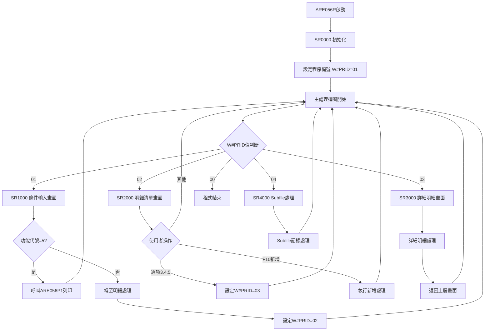
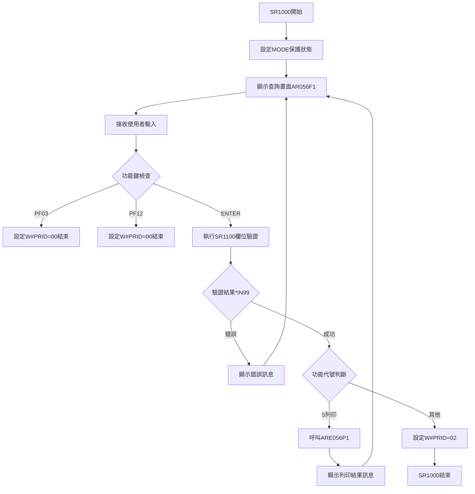
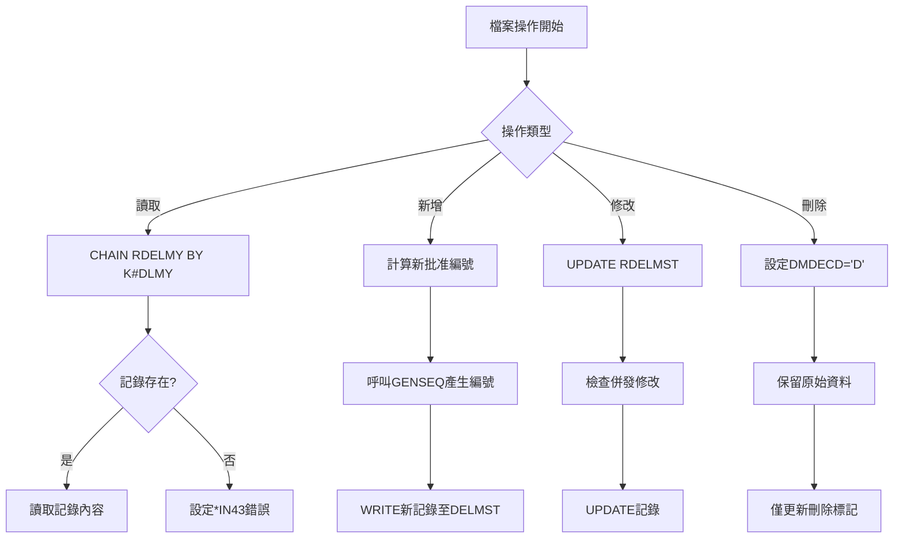
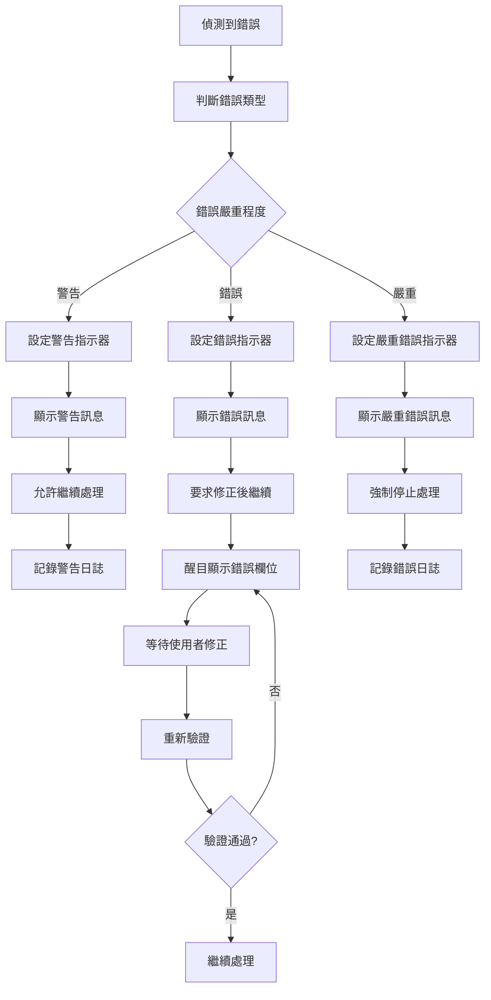

# ARE056P_P02 程式規格書

## 1. 基本資料

| 項目 | 內容 |
|------|------|
| 程式編號 | ARE056P |
| 程式名稱 | 遠期請款批准貨款作業 |
| 程式類型 | CLP (Control Language Program) |
| 廠區 | P02 |
| 程式用途 | 遠期請款批准貨款作業主控程式 |
| 呼叫方式 | 線上互動式作業 |
| 系統名稱 | 應收帳款管理系統 (AR) |
| 子系統 | 遠期請款處理子系統 |

## 2. 程式功能說明

### 2.1 主要功能描述
ARE056P 為遠期請款批准貨款作業的主控程式，提供完整的遠期貨款批准作業功能。程式採用 CLP 主控呼叫 RPG 處理程式的架構，支援新增、修改、刪除、查詢及列印等五大功能。

### 2.2 業務流程說明
1. **遠期請款管理**：管理客戶遠期請款的批准流程
2. **發票整合處理**：與發票主檔系統整合，處理發票相關資料
3. **多層級明細管理**：支援主明細和詳細明細的雙層級管理
4. **批准編號管理**：自動產生和管理遠期貨款批准編號
5. **列印作業整合**：整合列印功能，支援各種報表輸出

### 2.3 核心業務價值
- **資金流管控**：有效管控客戶遠期付款的資金流向
- **財務風險控制**：透過批准機制降低財務風險
- **業務流程標準化**：建立標準化的遠期請款處理流程
- **跨部門協作**：支援財務、業務、倉儲等部門的協作作業

## 3. 檔案架構與關聯圖



## 4. 檔案欄位規格說明

### 4.1 主要資料結構

#### 4.1.1 DELMST 遠期貨款主檔結構 (RDELMY)
本檔案為遠期貨款作業的核心資料檔，儲存所有遠期貨款批准的主要資訊。

| 欄位名稱 | 欄位代號 | 位置 | 長度 | 型態 | 說明 |
|----------|----------|------|------|------|------|
| 標記 | DMFLAG | 1-1 | 1 | A | 記錄狀態標記 |
| 發票編號 | DMINNO | 2-11 | 10 | A | 發票單據編號 |
| 發票日期 | DMINDT | 12-19 | 8 | N | 發票日期 YYYYMMDD |
| 廠區代號 | DMAREA | 20-20 | 1 | A | P/T/M/H/K/U |
| 刪除代號 | DMDECD | 21-21 | 1 | A | D=已刪除 |
| 刪除日期 | DMDEDT | 22-29 | 8 | N | 刪除日期 |
| 客戶編號1 | DMCUN1 | 30-35 | 6 | A | 主要客戶編號 |
| 客戶名稱1 | DMCUM1 | 36-45 | 10 | A | 主要客戶名稱 |
| 訂單編號1 | DMORN1 | 46-51 | 6 | A | 主要訂單編號 |
| 批准編號 | DMDLNO | 52-57 | 6 | A | 遠期貨款批准編號 |
| 業務編號 | DMRVID | 58-65 | 8 | A | 業務員編號 |
| 說明欄位 | DMDESP | 66-105 | 40 | A | 批准說明 |
| 總金額 | DMAAMT | 106-114 | 9 | N | 總金額(2位小數) |
| 稅額 | DMATAX | 115-123 | 9 | N | 稅額(2位小數) |
| 確定金額 | DMBAMT | 124-132 | 9 | N | 確定金額(2位小數) |
| 結餘金額 | DMNBAL | 133-141 | 9 | N | 結餘金額(2位小數) |
| 處理代碼 | DMCODE | 142-142 | 1 | A | 處理狀態代碼 |
| 客戶編號2 | DMCUN2 | 143-148 | 6 | A | 次要客戶編號 |
| 客戶名稱2 | DMCUM2 | 149-158 | 10 | A | 次要客戶名稱 |
| 訂單編號2 | DMORN2 | 159-164 | 6 | A | 次要訂單編號 |
| 建立者 | DMAPUS | 165-174 | 10 | A | 記錄建立者 |
| 建立日期 | DMAPDT | 175-182 | 8 | N | 記錄建立日期 |
| 建立時間 | DMAPTM | 183-188 | 6 | N | 記錄建立時間 |
| 修改者 | DMUPUS | 189-198 | 10 | A | 記錄修改者 |
| 修改日期 | DMUPDT | 199-206 | 8 | N | 記錄修改日期 |
| 修改時間 | DMUPTM | 207-212 | 6 | N | 記錄修改時間 |

### 4.2 🎯 欄位切割技術詳解

#### 4.2.1 D#DLNO 批准編號切割結構
```
D#DLNO (6字元)：[X|XXXXX]
                 ↓   ↓
D#DLN1 (1字元)： [X]      廠區識別碼
D#DLN2 (5字元)：   [XXXXX] 序號部分
```

**切割邏輯說明：**
- **位置1**: 廠區識別碼 (P/T/M/H/K/U)
- **位置2-6**: 流水序號 (00001-99999)

**實際數據範例：**
```
P12345 → P=P02廠區, 12345=第12345號批准
T00001 → T=T廠區, 00001=第1號批准
```

#### 4.2.2 S#ORNO 訂單編號切割結構
```
S#ORNO (6字元)：[X|XXXXX]
                 ↓   ↓
S1OREA (1字元)： [X]      訂單區域代碼
S1ORNO (5字元)：   [XXXXX] 訂單序號
```

**切割邏輯說明：**
- **位置1**: 訂單區域代碼
- **位置2-6**: 訂單流水號

#### 4.2.3 日期欄位切割結構 (D#IND1/D#IND2)
```
D#IND1 (8字元)：[YYYY|MM|DD]
                 ↓   ↓  ↓
D#YY1 (4字元)：  [YYYY]     年份
D#MM1 (2字元)：     [MM]     月份  
D#DD1 (2字元)：       [DD]   日期
D#YM1 (6字元)：  [YYYYMM]   年月組合
```

**切割邏輯說明：**
- **位置1-4**: 西元年份 (1993-2099)
- **位置5-6**: 月份 (01-12)
- **位置7-8**: 日期 (01-31)
- **組合欄位**: 年月組合用於期間比較

#### 4.2.4 系統日期切割結構 (D#UDAT) - P02廠區特殊實現
```
D#UDAT (8字元)：[YYYY|MM|DD]
                 ↓   ↓  ↓
D#YYU (4字元)：  [YYYY]     系統年份
D#MMU (2字元)：     [MM]     系統月份
D#DDU (2字元)：       [DD]   系統日期  
D#YMU (6字元)：  [YYYYMM]   系統年月
```

#### 4.2.5 說明欄位切割結構 (S#DESP) - 0611A新增功能
```
S#DESP (40字元)：[X|XXXXXXXXXXXXXXXXXXXXXXXXXXXXXXXXXXXXXXX]
                  ↓                    ↓
BOE (1字元)：     [X]                  起始標記
BOF (39字元)：      [XXXXXXXXXXXXXXXXXXXXXXXXXXXXXXXXXXXXXXX] 說明內容
```

### 4.3 🎯 欄位挪用分析

#### 4.3.1 DMDESP 說明欄位的多重用途
**原始定義**: 批准說明欄位 (40字元)  
**實際挪用方式**:
1. **一般批准說明**: 標準的批准說明文字
2. **系統訊息儲存**: 儲存系統產生的提示訊息
3. **特殊標記儲存**: 儲存業務流程的特殊標記

**挪用原因**: 為了在不修改檔案結構的情況下，擴充功能需求

#### 4.3.2 DMCODE 處理代碼的狀態管理
**原始定義**: 單一字元的處理代碼  
**實際挪用方式**:
1. **狀態管理**: A=新增, M=修改, D=刪除, C=確認
2. **流程控制**: 1=初始, 2=審核中, 3=已批准, 9=結案
3. **權限控制**: 結合使用者部門進行權限判斷

#### 4.3.3 記憶體優化技術 - 欄位重複使用
**技術實現**: 在不同的處理階段，同一個欄位儲存不同類型的資料
```
DMCUN2/DMCUM2/DMORN2: 
- 新增階段: 儲存暫存的客戶資料
- 處理階段: 儲存驗證後的正確資料  
- 完成階段: 儲存備份或關聯資料
```

## 5. 輸出/入螢幕布局與說明

### 5.1 主標題畫面 (AR056H)

```
+----------------------------------------------------------+
| 104/12/25           東鋼鋼鐵股份有限公司           ARE056S |
| 14:32:15           遠期請款批准貨款作業                RI |
| S02WCJ                                              查詢 |
+----------------------------------------------------------+
```

**欄位配置說明：**
- **第1行左**: 系統日期 (YYY/MM/DD格式)
- **第1行中**: 公司名稱標題  
- **第1行右**: 程式編號
- **第2行左**: 系統時間 (HH:MM:SS格式)
- **第2行中**: 程式功能名稱
- **第2行右**: 操作模式指示器
- **第3行左**: 使用者帳號
- **第3行右**: 目前功能狀態

### 5.2 查詢條件輸入畫面 (AR056F1)

```
+----------------------------------------------------------+
|                                                          |
|                     功能代號: [_]  (1:新增 2:修改3:刪除  |
|                                     4:查詢 5:列印 )     |
|                                                          |
|                     客戶編號: [______]                   |
|                                                          |
|                     訂單編號: [______]                   |
|                                                          |
|                 發票單據類別: [_]                        |
|                                                          |
|                 發票單據日期: [___/__/__]  ~~ [___/__/__] |
|                                                          |
|                 貨款批准編號: [______]                   |
|                                                          |
|       溫馨提醒：新增及修改時需要輸入發票單據日期          |
|                                                          |
| [錯誤訊息顯示區域]                                       |
| PF03:結束                   PF12:回前頁                  |
+----------------------------------------------------------+
```

**欄位標示規範：**
- **[_]**: 必填欄位，單字元輸入
- **[______]**: 必填欄位，6字元輸入  
- **[___/__/__]**: 日期欄位，YYY/MM/DD格式

### 5.3 明細清單畫面 (AR056F2)

```
+----------------------------------------------------------+
| 客戶名稱: [______] [__________]  訂單編號: [______]      |
| 批准日期: [___/__/__]                                    |
| 發票期間: [___/__/__] ~ [___/__/__]  發票類別: [_]       |
| 批准編號: [______]                                       |
|                                                          |
| 選項-1:確認發票2:放棄發票3:新增汲取試算4:刪除汲取試算     |
| 5:查看汲取試算                                           |
| 明細說明: [________________________________]             |
|                                                          |
| 選項 發票單號      發票日期   發票金額  發票稅額  確定金額 |
| ---- ------------ --------- -------- -------- --------- |
| [_]  [__________] [___/__/__] [______] [______] [_______] |
| [_]  [__________] [___/__/__] [______] [______] [_______] |
| [_]  [__________] [___/__/__] [______] [______] [_______] |
| [_]  [__________] [___/__/__] [______] [______] [_______] |
| [_]  [__________] [___/__/__] [______] [______] [_______] |
| [_]  [__________] [___/__/__] [______] [______] [_______] |
| [_]  [__________] [___/__/__] [______] [______] [_______] |
| [_]  [__________] [___/__/__] [______] [______] [_______] |
| =========================================================|
|                                                          |
| [錯誤訊息顯示區域]                                       |
| F3=結束       F12=回前頁              F10=新增           |
+----------------------------------------------------------+
```

### 5.4 詳細明細畫面 (AR056F3) - P02廠區特有功能

```
+----------------------------------------------------------+
| 新客戶名稱: [______] [__________]  新訂單編號: [______]  |
|                                                          |
| |<------- 前  金  額 ------->|<-- 汲取明細額 -->|       |
| 送貨編號  運送項目 磅數  單價   金額   磅數  單價  金額  |
| -------- -------- ----- ---- ------ ----- ---- ------ |
| [______] [__]     [___] [___] [____] [___] [__] [____]  |
|      |<------- 新 發 票 明 細 單 據 ------->|         |
|      磅數  單價   金額   稅額   經常結餘                |
|      ---- ---- ------ ------ --------                 |
|      [___] [__] [____] [____] [_______]                |
|                                                          |
| =========================================================|
|                                                          |
| [錯誤訊息顯示區域]                                       |
| F03:結束    F12:回前頁    ENTER:確認    F10:新增        |
+----------------------------------------------------------+
```

## 6. 處理流程程序說明

### 6.1 主程式流程 (ARE056P)



**處理步驟詳解：**
1. **程式啟動**: 系統載入 ARE056P 主控程式
2. **環境檢查**: 檢查程式執行環境和必要資源
3. **呼叫處理程式**: 呼叫 ARLIB/ARE056R 進行實際業務處理
4. **結果處理**: 根據 ARE056R 的返回狀態進行後續處理
5. **程式結束**: 清理資源並正常結束程式

### 6.2 ARE056R 主要處理流程



### 6.3 🎯 主程序邏輯深度分析

#### 6.3.1 SR1000 條件輸入邏輯


**業務邏輯詳解：**
1. **權限控制**: 根據使用者部門設定保護狀態
2. **輸入驗證**: 多層次的欄位驗證機制
3. **功能分派**: 根據功能代號分派至不同處理流程
4. **錯誤處理**: 完整的錯誤處理和使用者回饋機制

#### 6.3.2 部門權限檢查邏輯 (P02特有)
```
IF 系統當前日期天數 > 3 AND 發票結束年月 = 系統年月 AND 發票起始月份 ≠ 發票結束月份
    設定錯誤訊息 "日期超過允許處理範圍"
    
IF 系統當前日期天數 ≤ 3 AND 發票結束年月 = 系統年月 AND 發票起始年月 ≠ 發票結束年月
    計算前一個月份
    IF 前一個月份 ≠ 發票起始年月
        設定錯誤訊息 "日期超過允許處理範圍"

部門權限判斷:
IF 系統年月 = 發票結束年月
    部門代號 = 'B' (本期處理)
ELSE
    IF 系統前一月 = 發票結束年月 AND 發票結束日 < 4
        部門代號 = 'B' (跨期處理)  
    ELSE
        IF 發票類別 = 'P'
            部門代號 = 'F' (P02廠區)
        ELSE  
            部門代號 = 使用者所屬廠區
```

## 7. 🎯 數據操作與轉換分析

### 7.1 檔案操作詳解

#### 7.1.1 DELMST 檔案操作流程


**併發控制機制:**
- 使用記錄鎖定防止同時修改
- 修改前檢查記錄是否被其他使用者變更
- 軟刪除機制保留歷史資料

#### 7.1.2 發票檔案整合處理
```
檔案關聯處理順序:
1. INVMSTL2 → 主要發票資料
2. ARINVM → 應收發票驗證  
3. TRNDTLL2 → 交易明細補充
4. CBCUST → 客戶資料驗證
5. SAMAST → 銷貨訂單驗證

篩選條件邏輯:
- 客戶編號 = 輸入客戶編號
- 訂單編號 = 輸入訂單編號  
- 廠區類別 = 輸入廠區類別
- 刪除代碼 = 空白 (未刪除記錄)
- 發票日期 BETWEEN 起始日期 AND 結束日期
```

### 7.2 數據轉換邏輯

#### 7.2.1 日期格式轉換處理
```
系統日期處理 (P02特有):
*DATE (系統日期) - 19000000 = D#UDAT (民國年日期)

日期驗證呼叫:
CALL 'UTS102R' 
PARM P#DATE (8位數日期)
PARM '1' (驗證模式)  
PARM P#MTL (月份文字)
PARM P#LY (閏年標記)
PARM P#ERR (錯誤代碼)
```

#### 7.2.2 金額計算邏輯
```
金額累計處理:
總金額 (DMAAMT) = Σ(發票金額)
稅額 (DMATAX) = Σ(發票稅額)  
確定金額 (DMBAMT) = Σ(確認後金額)
結餘金額 (DMNBAL) = 總金額 - 已收款金額

數值精度處理:
- 金額欄位: 9位數字含2位小數 (9999999.99)
- 稅額計算: 四捨五入至整數
- 匯率轉換: 保留4位小數精度
```

### 7.3 檢核機制詳解

#### 7.3.1 業務邏輯檢核
```
客戶資料檢核:
1. 客戶編號存在性檢核 (CBCUST)
2. 客戶信用額度檢核
3. 客戶付款條件檢核

訂單資料檢核:  
1. 訂單編號存在性檢核 (SAMAST)
2. 訂單狀態檢核 (未結案)
3. 訂單歸屬客戶一致性檢核

發票資料檢核:
1. 發票已確認但未收款 (INEAMT ≠ 0 AND INNBAL = 0)
2. 發票未被其他批准占用 (DMDLNO = 空白)
3. 發票日期在允許範圍內
```

#### 7.3.2 權限與期間檢核
```
使用者權限檢核:
- 部門權限: 依部門代號決定可處理的廠區資料
- 功能權限: 依使用者等級決定可執行的功能
- 期間權限: 依日期規則決定可處理的期間

日期期間檢核:
- 當月3日前: 可處理上月資料  
- 當月4日後: 僅可處理當月資料
- 跨年度處理: 需要特殊權限
```

## 9. 錯誤處理程序說明與訊息清冊

### 9.1 錯誤訊息清冊 (5欄式詳細分析)

| 錯誤代碼 | 錯誤訊息 | 原因說明 | 處理方式 | 預防措施 |
|----------|----------|----------|----------|----------|
| **ERR,1** | 功能代號不可空白 | 使用者未輸入功能代號 | 1. 游標跳至功能代號欄位<br>2. 醒目顯示錯誤欄位<br>3. 要求重新輸入 | 在畫面上清楚標示必填欄位 |
| **ERR,2** | 功能代號錯誤，請輸入1-5 | 輸入的功能代號不在允許範圍內 | 1. 清除錯誤輸入<br>2. 顯示允許值說明<br>3. 重新定位游標 | 使用下拉選單或有效值檢查 |
| **ERR,3** | 客戶編號不可空白 | 使用者未輸入客戶編號 | 1. 強制輸入客戶編號<br>2. 提供客戶查詢功能<br>3. 支援客戶名稱搜尋 | 提供客戶選擇清單 |
| **ERR,4** | 客戶編號不存在 | 輸入的客戶編號在CBCUST檔案中不存在 | 1. 驗證客戶編號正確性<br>2. 提供相似客戶建議<br>3. 連結客戶維護功能 | 建立客戶編號驗證機制 |
| **ERR,5** | 訂單編號不可空白 | 使用者未輸入訂單編號 | 1. 強制輸入訂單編號<br>2. 提供訂單查詢功能<br>3. 顯示該客戶的有效訂單 | 依客戶編號預載訂單清單 |
| **ERR,6** | 訂單編號不存在 | 輸入的訂單編號在SAMAST檔案中不存在 | 1. 驗證訂單編號正確性<br>2. 檢查訂單狀態<br>3. 確認訂單歸屬客戶 | 建立訂單有效性檢查 |
| **ERR,7** | 發票類別不可空白 | 使用者未輸入發票類別 | 1. 強制選擇發票類別<br>2. 顯示類別說明<br>3. 預設常用類別 | 提供類別選擇清單 |
| **ERR,8** | 發票類別錯誤 | 輸入的發票類別不在P/T/M/H/K/U範圍內 | 1. 清除錯誤輸入<br>2. 顯示有效類別清單<br>3. 提供類別說明 | 使用下拉選單限制輸入 |
| **ERR,9** | 發票起始日期不可為零 | 新增或修改功能時未輸入起始日期 | 1. 強制輸入起始日期<br>2. 提供日期選擇器<br>3. 預設合理日期範圍 | 根據業務規則設定預設日期 |
| **ERR,10** | 發票結束日期不可為零 | 新增或修改功能時未輸入結束日期 | 1. 強制輸入結束日期<br>2. 確保邏輯合理性<br>3. 自動設定為起始日期 | 提供日期範圍檢查 |
| **ERR,11** | 發票起始日期格式錯誤 | UTS102R驗證日期格式失敗 | 1. 說明正確日期格式<br>2. 提供格式範例<br>3. 重新輸入日期 | 使用日期輸入控制項 |
| **ERR,12** | 發票結束日期格式錯誤 | UTS102R驗證日期格式失敗 | 1. 說明正確日期格式<br>2. 檢查閏年等特殊情況<br>3. 重新輸入日期 | 即時日期格式驗證 |
| **ERR,13** | 起始日期不可大於結束日期 | 日期邏輯錯誤，起始日期晚於結束日期 | 1. 交起始和結束日期<br>2. 提示邏輯錯誤<br>3. 重新確認日期範圍 | 日期選擇時即時檢查 |
| **ERR,14** | 新增時批准編號須空白 | 新增功能時用戶輸入了批准編號 | 1. 清除批准編號欄位<br>2. 說明系統自動產生<br>3. 確認新增意圖 | 新增模式下隱藏批准編號欄位 |
| **ERR,15** | 修改時批准編號不可空白 | 修改功能時未輸入批准編號 | 1. 強制輸入批准編號<br>2. 提供批准編號查詢<br>3. 顯示可修改的批准清單 | 提供批准編號選擇清單 |
| **ERR,16** | 此批准編號不存在 | DELMST檔案中找不到指定的批准編號 | 1. 驗證批准編號正確性<br>2. 檢查是否已刪除<br>3. 提供相似編號建議 | 建立批准編號有效性檢查 |
| **ERR,17** | 此記錄已刪除，不可修改 | 記錄的DMDECD='D'，表示已被刪除 | 1. 說明記錄狀態<br>2. 提供查看功能<br>3. 建議重新新增 | 在清單中標示記錄狀態 |
| **ERR,18** | 此批准編號已存在 | 新增時發現批准編號重複 | 1. 重新產生批准編號<br>2. 檢查編號產生邏輯<br>3. 確認資料一致性 | 改善編號產生機制 |
| **ERR,19** | 廠區權限不符 | 使用者嘗試處理非所屬廠區的資料 | 1. 檢查使用者權限<br>2. 轉介有權限的人員<br>3. 申請特殊權限 | 建立權限管理機制 |
| **ERR,20** | 無可處理的發票資料 | 根據查詢條件找不到符合的發票 | 1. 放寬查詢條件<br>2. 檢查發票狀態<br>3. 確認資料完整性 | 提供資料存在性檢查 |
| **ERR,27** | 修改時必須選擇異動項目 | 修改功能時未選擇任何要修改的項目 | 1. 提示選擇修改項目<br>2. 說明選項操作方式<br>3. 提供全選功能 | 在修改模式提供選項指引 |
| **ERR,28** | 無可處理的項目 | 查詢或處理時沒有找到可操作的項目 | 1. 調整查詢條件<br>2. 檢查資料狀態<br>3. 確認業務邏輯 | 預先檢查資料可用性 |
| **ERR,29** | 客戶訂單資料不一致 | 客戶編號與訂單編號不匹配 | 1. 重新確認客戶編號<br>2. 檢查訂單歸屬<br>3. 提供正確的對應關係 | 建立客戶訂單關聯檢查 |
| **ERR,30** | 日期超過允許處理範圍 | 日期不在系統允許的處理範圍內 | 1. 說明允許的日期範圍<br>2. 檢查特殊權限<br>3. 聯絡系統管理員 | 建立日期範圍管理機制 |

### 9.2 錯誤處理流程



## 10. 功能鍵說明

| 功能鍵 | 功能說明 | 適用畫面 | 處理邏輯 |
|--------|----------|----------|----------|
| **PF03** | 結束程式 | 所有畫面 | 設定W#PRID='00'，清理資源後結束 |
| **PF12** | 回到前一畫面 | 除主畫面外 | 根據目前畫面設定對應的W#PRID值 |
| **PF10** | 新增功能 | 明細清單畫面 | 執行SR2400新增處理程序 |
| **PF01** | 說明功能 | 詳細明細畫面 | 顯示操作說明或欄位說明 |
| **ENTER** | 確認輸入/選項執行 | 所有畫面 | 根據畫面類型執行對應的處理邏輯 |

## 11. 輸入欄位驗證

### 11.1 必要欄位驗證
- **功能代號**: 必須輸入，限制值1-5，對應不同的業務功能
- **客戶編號**: 必須輸入，必須存在於CBCUST客戶主檔
- **訂單編號**: 必須輸入，必須存在於SAMAST銷貨主檔  
- **發票類別**: 必須輸入，限制值P/T/M/H/K/U對應不同廠區

### 11.2 條件欄位驗證
- **發票日期區間**: 新增、修改功能時必須輸入完整的起始和結束日期
- **批准編號**: 修改、刪除、查詢功能時必須輸入，新增時系統自動產生

### 11.3 邏輯驗證
- **日期區間邏輯**: 起始日期不可大於結束日期，日期必須為有效日期
- **權限邏輯**: 根據使用者部門和系統日期判斷可處理的資料範圍
- **業務邏輯**: 客戶與訂單的對應關係，發票狀態的有效性檢查

## 12. 使用說明

### 12.1 作業流程

1. **新增遠期請款**
   - 選擇功能代號1，輸入客戶編號、訂單編號、發票類別和日期區間
   - 系統自動產生批准編號，進入明細選擇畫面
   - 選擇要批准的發票項目，確認金額無誤後執行批准

2. **修改遠期請款**  
   - 選擇功能代號2，輸入查詢條件和批准編號
   - 系統顯示現有批准內容，可修改發票選擇和金額
   - 確認修改內容後更新記錄

3. **刪除遠期請款**
   - 選擇功能代號3，輸入批准編號
   - 系統顯示批准內容供確認，執行軟刪除(保留記錄但標示刪除)

4. **查詢遠期請款**
   - 選擇功能代號4，輸入查詢條件
   - 系統顯示符合條件的批准記錄，可瀏覽詳細內容

5. **列印遠期請款**
   - 選擇功能代號5，輸入列印條件
   - 呼叫ARE056P1列印程式，產生相關報表

### 12.2 注意事項

1. **日期輸入格式**: 使用民國年格式YYY/MM/DD，系統會自動轉換
2. **權限控制**: 每月3日後無法處理上月資料，需特殊權限  
3. **批准編號**: 新增時由系統自動產生，格式為廠區碼+5位序號
4. **資料完整性**: 刪除採用軟刪除方式，保留歷史記錄供查詢
5. **併發控制**: 同一記錄同時只能有一人修改，避免資料衝突

### 12.3 權限控制說明

- **部門權限**: 依使用者所屬部門決定可處理的廠區資料
- **時間權限**: 根據系統日期控制可處理的資料期間  
- **功能權限**: 依使用者等級決定可執行的功能範圍
- **特殊權限**: 跨期間或跨廠區處理需要申請特殊權限

## 13. 備註

### 13.1 程式特色
1. **模組化設計**: CLP主控+RPG處理的雙層架構，便於維護和擴充
2. **跨廠區支援**: 支援P02/H05/K02/U01四個廠區，具備差異化功能  
3. **完整整合**: 與發票、客戶、銷貨等系統緊密整合
4. **使用者友善**: 提供完整的驗證機制和錯誤處理
