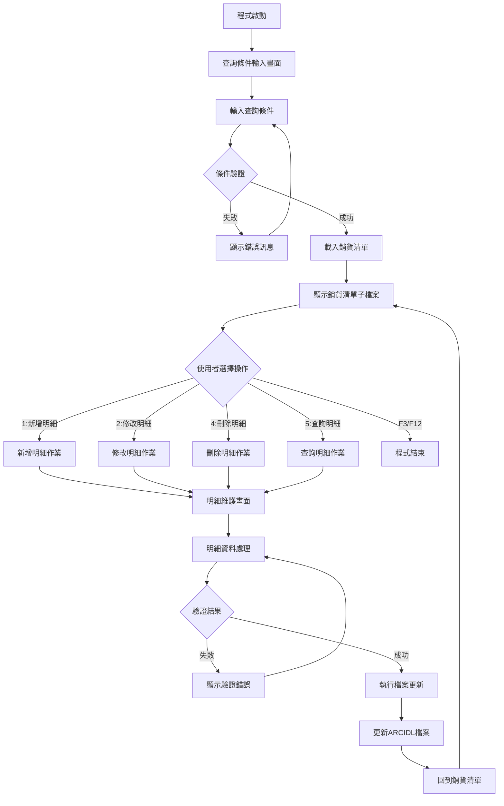
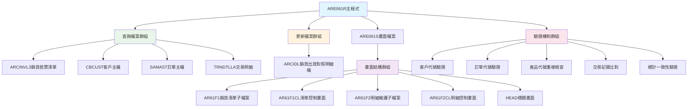
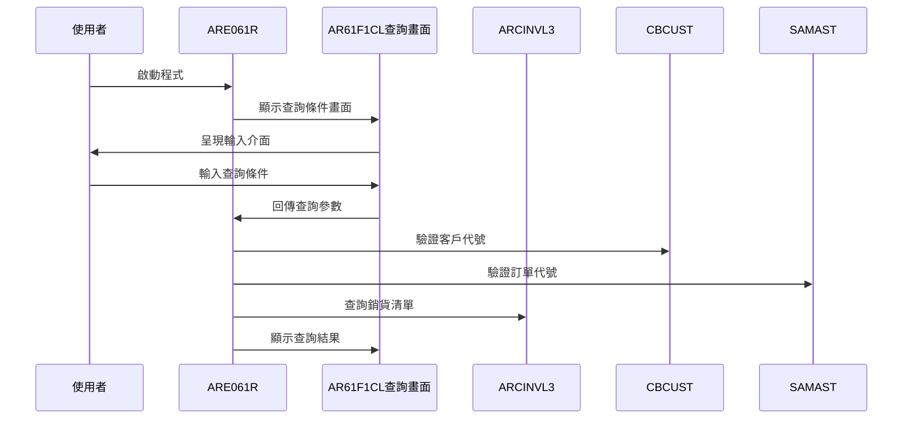
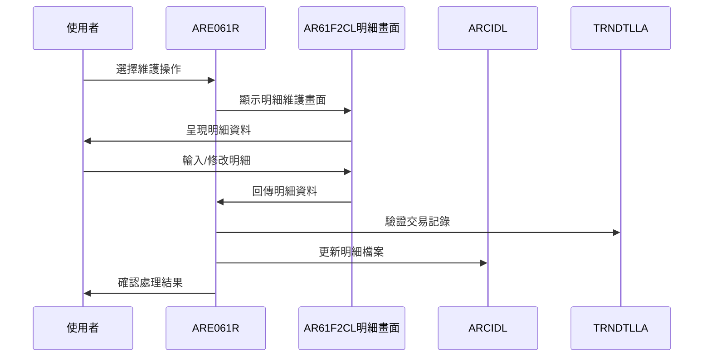
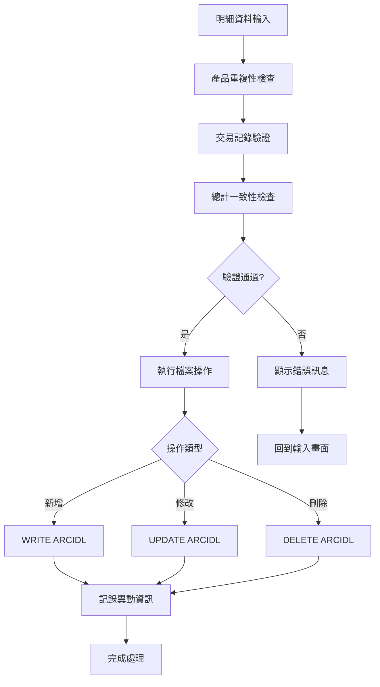
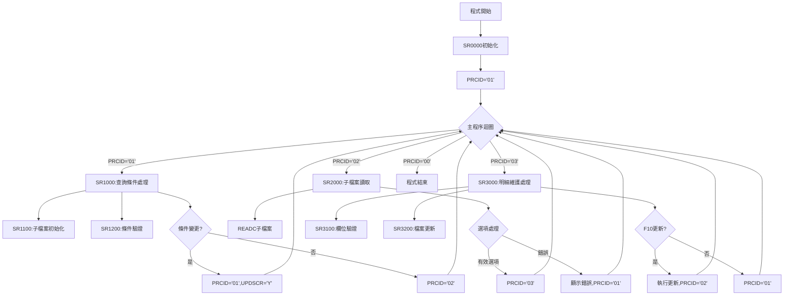
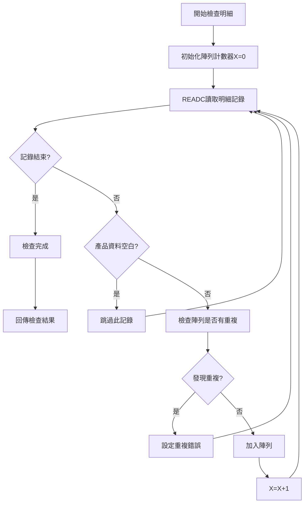
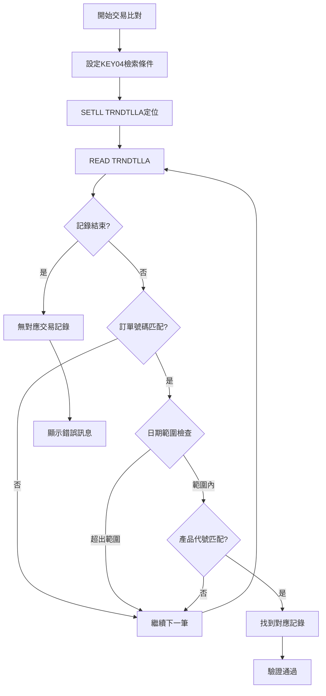
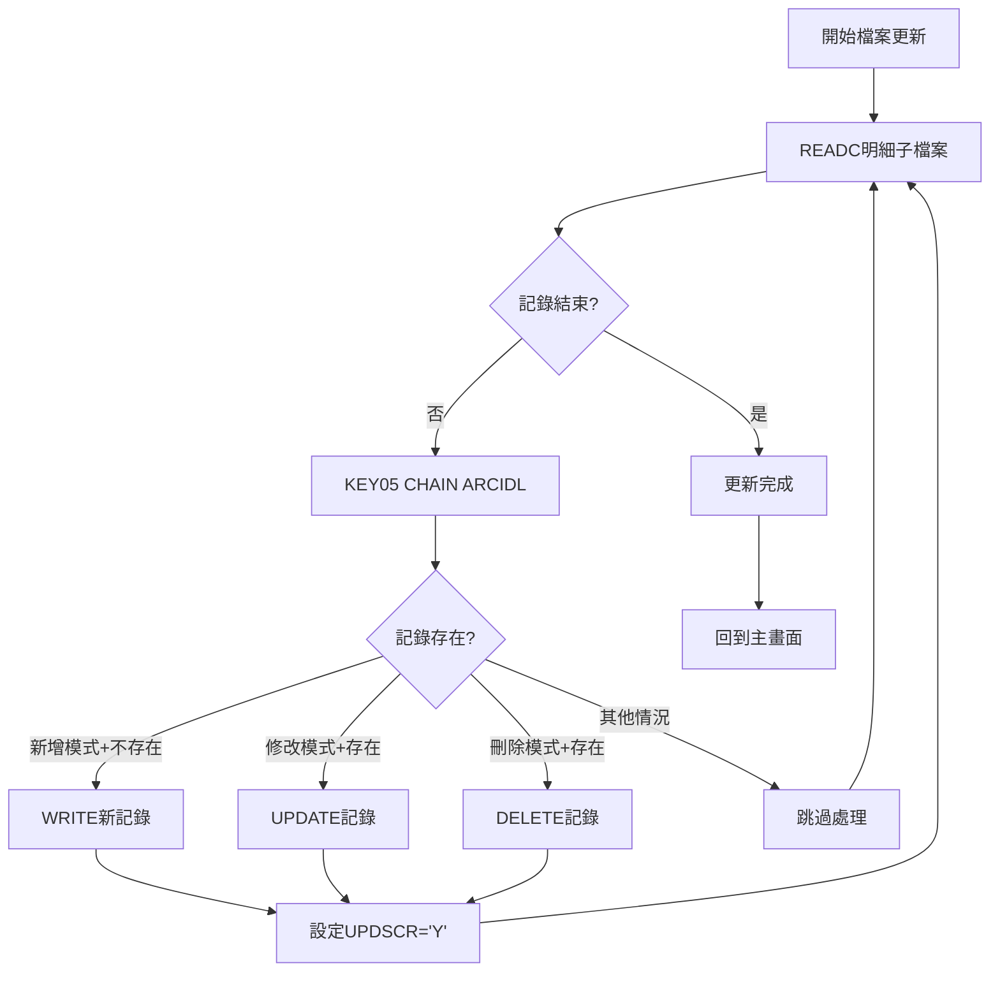
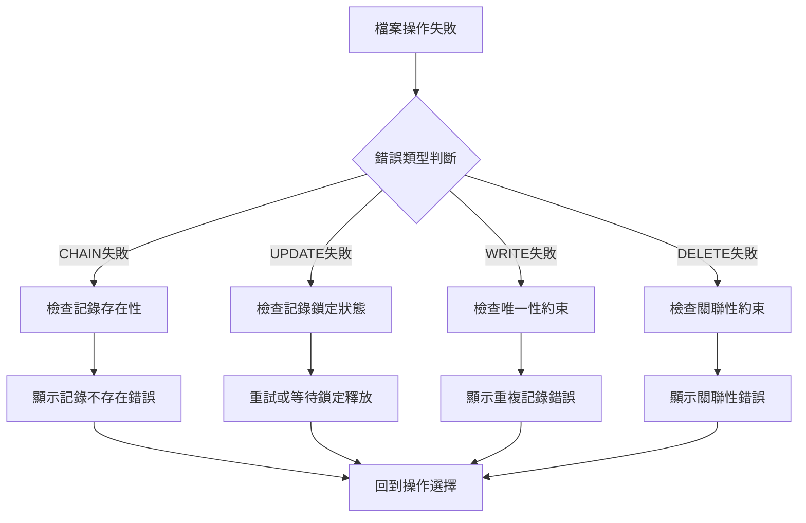

# ARE061R_U01 程式規格書

## 1. 基本資料

| 項目 | 內容 |
|------|------|
| **程式編號** | ARE061R |
| **程式名稱** | 銷貨與出貨對照明細查詢作業 |
| **程式類型** | RPG |
| **廠區** | U01 |
| **系統名稱** | 應收帳款系統 |
| **子系統** | 銷貨出貨管理 |
| **檔案位置** | U01RPGSRC_THSRC/ARE061R.txt |

## 2. 🎯 程式功能說明

### 主要功能描述
ARE061R為銷貨與出貨對照明細查詢作業程式，提供銷貨發票與實際出貨明細的對照查詢和維護功能。程式支援依據年月、客戶、訂單等條件查詢銷貨資料，並可對出貨明細進行新增、修改、刪除等維護作業，確保銷貨與出貨資料的一致性和準確性。

### 🎯 業務流程詳細說明

#### 完整業務流程圖


#### 業務流程關鍵階段說明

1. **查詢條件設定階段**：
   - 輸入廠區代碼、年月期間、客戶代號、訂單代號等查詢條件
   - 系統自動帶入使用者廠區和當前期間
   - 支援模糊查詢和精確查詢兩種模式

2. **銷貨清單載入階段**：
   - 從ARCINVL3檔案讀取符合條件的銷貨發票資料
   - 過濾廠區權限(K廠用戶不能查詢H廠資料)
   - 載入客戶名稱、總數量、總金額等彙總資訊

3. **明細維護選擇階段**：
   - 使用者在銷貨清單中選擇要處理的項目
   - 支援1:新增、2:修改、4:刪除、5:查詢等操作
   - 檢查記錄狀態和權限限制

4. **明細資料處理階段**：
   - 顯示詳細的出貨明細資料
   - 支援產品代號、產品名稱、數量、金額的維護
   - 提供批次輸入和修改功能

5. **資料驗證階段**：
   - 檢核產品代號的唯一性
   - 驗證數量和金額的合理性
   - 確認總計數量和金額的一致性
   - 檢查與實際交易記錄的對應關係

6. **檔案更新階段**：
   - 根據操作類型執行新增、修改或刪除
   - 更新ARCIDL銷貨出貨對照明細檔
   - 記錄異動人員和時間戳記
   - 維護資料的完整性和一致性

#### 智能處理邏輯

**廠區權限自動控制**：
- K廠用戶自動過濾H廠的資料，避免跨廠區存取
- 根據使用者登入廠區動態調整查詢範圍
- 確保資料安全性和權限控制

**產品重複性檢查**：
- 使用陣列機制檢查同一筆銷貨中產品代號的重複性
- 避免同一產品在同一筆銷貨中重複輸入
- 確保明細資料的唯一性和正確性

**交易記錄比對機制**：
- 與TRNDTLLA交易明細檔比對，確保出貨明細的真實性
- 檢查產品代號和日期的對應關係
- 防止虛假或錯誤的出貨明細建立

#### 資料一致性確保機制

**總計驗證控制**：
- 明細總數量必須等於銷貨清單的總數量
- 明細總金額必須等於銷貨清單的總金額
- 確保明細與主檔資料的一致性

**日期邏輯驗證**：
- 出貨開始日期不可大於出貨結束日期
- 日期格式和有效性驗證
- 與業務邏輯的時間順序檢查

**狀態控制機制**：
- 已確認或已處理的記錄不允許修改或刪除
- 根據處理狀態控制操作權限
- 維護業務流程的正確性

## 3. 🎯 檔案架構與關聯圖

### 使用檔案清單
| 檔案名稱 | 檔案類型 | 使用方式 | 說明 |
|----------|----------|----------|------|
| ARE061S | DSPF | 畫面檔案 | 查詢畫面及明細維護畫面 |
| ARCINVL3 | LF | 查詢檔案 | 銷貨發票清單邏輯檔 |
| CBCUST | PF | 查詢檔案 | 客戶主檔 |
| SAMAST | PF | 查詢檔案 | 訂單主檔 |
| ARCIDL | PF | 更新檔案 | 銷貨出貨對照明細檔 |
| TRNDTLLA | LF | 查詢檔案 | 交易明細邏輯檔 |

### 🎯 檔案關聯詳細視覺化圖表


### 🎯 資料流向詳細說明

#### 查詢處理階段的資料流向


#### 明細維護階段的資料流向


#### 檔案更新流程


## 4. 🎯 檔案欄位規格說明

### 主要資料結構

#### 查詢畫面欄位定義
| 欄位名稱 | 長度 | 型態 | 說明 |
|----------|------|------|------|
| S#AREA | 1A | 字元 | 廠區代碼 |
| S#SYM | 6P | 數值 | 查詢年月(YYYYMM) |
| S#SCUS | 6A | 字元 | 客戶代號(查詢條件) |
| S#SORS | 6A | 字元 | 訂單代號(查詢條件) |
| S#USER | 10A | 字元 | 使用者ID |
| S#SCRN | 10A | 字元 | 畫面識別碼 |

#### 銷貨清單子檔案欄位定義
| 欄位名稱 | 長度 | 型態 | 說明 |
|----------|------|------|------|
| S#OPT | 1A | 字元 | 操作選項(1,2,4,5) |
| S#YYMM | 6P | 數值 | 銷貨年月 |
| S#CDTE | 8P | 數值 | 建立日期 |
| S#CUNO | 6A | 字元 | 客戶代號 |
| S#CUNM | 10A | 字元 | 客戶名稱 |
| S#ORNO | 6A | 字元 | 訂單號碼 |
| S#APNO | 20A | 字元 | 申請號碼 |
| S#TQTY | 12P3 | 數值 | 總數量 |
| S#TAMT | 10P | 數值 | 總金額 |
| S#DATS | 8P | 數值 | 出貨開始日期 |
| S#DATE | 8P | 數值 | 出貨結束日期 |

#### 明細維護子檔案欄位定義
| 欄位名稱 | 長度 | 型態 | 說明 |
|----------|------|------|------|
| S#ITEM | 2P | 數值 | 項次 |
| S#PDNM | 5A | 字元 | 產品名稱 |
| S#PDS1 | 3A | 字元 | 產品代號 |
| S#QTY | 12P3 | 數值 | 數量 |
| S#AMT | 10P | 數值 | 金額 |
| H#PDNM | 5A | 字元 | 隱藏產品名稱 |
| H#PDS1 | 3A | 字元 | 隱藏產品代號 |
| H#QTY | 12P3 | 數值 | 隱藏數量 |
| H#AMT | 10P | 數值 | 隱藏金額 |

### 🔍 重點欄位切割技術詳解

#### 訂單號碼廠區切割視覺化：
```
R1ORNO記錄：[F|ORNO1]
位置:       1 2-6
            ↓ ↓
廠區代碼:   [U]       第1字元廠區識別
訂單號碼:     [OR123] 第2-6字元訂單主體
```

##### 訂單號碼廠區切割邏輯說明：
**切割策略**：訂單前綴分離法，透過DS重定義從6字元訂單號碼中提取廠區識別資訊
**分離機制**：
1. **廠區提取**：F#AREA (1) 提取第1字元作為廠區代碼
2. **號碼完整性**：R1ORNO (1-6) 保持完整訂單號碼的存取
3. **權限控制**：透過廠區代碼進行使用者權限驗證
4. **資料一致性**：確保訂單號碼的廠區前綴與實際廠區一致

**切割邏輯**：
- R1ORNO：6字元完整訂單號碼
- F#AREA (1)：第1字元廠區代碼，用於權限控制
- 用途：從訂單號碼提取廠區資訊進行存取權限驗證

#### 產品陣列切割視覺化：
```
D#ARY1記錄：[產品代號|產品名稱_]
位置:       001-03  004-08
            ↓       ↓
產品代號:   [STL]            3字元產品識別碼
產品名稱:          [STEEL] 5字元產品名稱
```

##### 產品陣列切割邏輯說明：
**切割策略**：產品資訊結構化陣列法，透過DS重定義實現8字元產品記錄的精確分割
**陣列架構**：
1. **陣列規模**：ARY1陣列20個元素，每個元素8字元
2. **代號分離**：D1PDS1 (1-3) 3字元產品代號分離
3. **名稱分離**：D1PDNM (4-8) 5字元產品名稱分離
4. **重複檢查**：用於儲存已輸入產品，避免重複輸入

**分割邏輯**：
- D#ARY1：8字元產品記錄結構
- D1PDS1 (1-3)：產品代號，3字元產品識別
- D1PDNM (4-8)：產品名稱，5字元產品描述
- 用途：陣列管理已輸入產品，進行重複性檢查

#### 查詢條件複合切割視覺化：
```
S#SORS記錄：[A|ORNO1]
位置:       1 2-6
            ↓ ↓
廠區篩選:   [U]       第1字元廠區條件
訂單篩選:     [OR123] 第2-6字元訂單條件
```

##### 查詢條件複合切割邏輯說明：
**切割策略**：複合查詢條件分離法，透過DS重定義將6字元查詢條件分割為廠區和訂單組件
**查詢架構**：
1. **廠區分離**：S1OREA (1) 提取1字元廠區查詢條件
2. **訂單分離**：S1ORNO (2-6) 提取5字元訂單查詢條件
3. **組合查詢**：支援廠區和訂單的靈活組合查詢
4. **條件彈性**：可單獨或組合使用廠區和訂單篩選

**分離邏輯**：
- S#SORS：6字元複合查詢條件
- S1OREA (1)：第1字元廠區查詢條件
- S1ORNO (2-6)：第2-6字元訂單查詢條件
- 用途：靈活的廠區和訂單組合查詢支援

#### 交易保留欄位切割視覺化：
```
TXRESV記錄：[..................|產品_|.......]
位置:       001-18            019-21 022-30
            ↓                 ↓      ↓
前段保留:   [..................]           前18字元保留區域
產品代號:                      [STL]       第19-21字元產品代號
後段保留:                             [.......] 後9字元保留區域
```

##### 交易保留欄位切割邏輯說明：
**切割策略**：保留欄位選擇性利用法，透過DS重定義從30字元保留欄位中精確提取產品代號
**利用機制**：
1. **選擇性提取**：只利用第19-21字元位置的產品代號資訊
2. **保留區域忽略**：前18和後9字元保留區域在此應用中被忽略
3. **產品比對**：提取的產品代號用於與輸入產品的比對驗證
4. **空間效率**：最大化利用現有保留欄位，避免額外欄位定義

**利用邏輯**：
- TXRESV：30字元交易保留欄位
- D#PDS1 (19-21)：第19-21字元產品代號提取
- 用途：從交易記錄保留欄位提取產品代號進行比對

#### UDS使用者環境切割視覺化：
```
UDS記錄：[........公司代碼______________________________|使用者__|裝置名__|廠_]
位置:    001-950 951-985                                1001-1010 1011-1020 1021
         ↓       ↓                                      ↓         ↓         ↓
前段保留: [.......]                                                          UDS前段保留
公司代碼:         [TUNGKANG_STEEL_CORPORATION____________]                      35字元公司識別
使用者ID:                                                [USER12345]          10字元使用者識別
裝置名稱:                                                          [TERM01___] 10字元終端識別
廠區代碼:                                                                    [U] 1字元廠區識別
```

##### UDS使用者環境切割邏輯說明：
**切割策略**：UDS環境資訊精確定位法，透過固定位置切割提取使用者和環境識別資訊
**環境架構**：
1. **公司識別區**：S#COMP (951-985) 35字元公司代碼識別
2. **使用者識別區**：D#USER (1001-1010) 10字元使用者ID
3. **裝置識別區**：S#DEVN (1011-1020) 10字元終端裝置名稱
4. **廠區識別區**：TXAR (1021) 1字元廠區代碼

**環境邏輯**：
- UDS：使用者資料區，包含完整環境識別資訊
- S#COMP (951-985)：公司代碼，35字元企業識別
- D#USER (1001-1010)：使用者ID，10字元使用者識別
- S#DEVN (1011-1020)：裝置名稱，10字元終端識別
- TXAR (1021)：廠區代碼，1字元廠區識別

#### 畫面控制變數切割視覺化：
```
控制變數：[PRCID] = [流程控制]
值範圍:   00-03     控制狀態
          ↓         ↓
初始化:   [00]      程式結束狀態
查詢畫面: [01]      主查詢畫面處理
子檔讀取: [02]      子檔案記錄讀取處理  
明細維護: [03]      明細維護畫面處理
```

##### 畫面控制變數切割邏輯說明：
**切割策略**：狀態機控制法，透過數值狀態編碼實現程式流程的精確控制
**控制機制**：
1. **狀態編碼**：使用2字元數值編碼代表不同的程式處理階段
2. **流程控制**：透過PRCID值控制程式的主要處理邏輯分支
3. **階段分離**：每個狀態對應特定的畫面處理和業務邏輯
4. **迴圈控制**：透過狀態變化控制主程式的執行迴圈

**控制邏輯**：
- PRCID='00'：程式結束，退出主處理迴圈
- PRCID='01'：查詢條件畫面處理 (SR1000)
- PRCID='02'：子檔案記錄讀取處理 (SR2000)
- PRCID='03'：明細維護畫面處理 (SR3000)

#### 子檔案操作選項切割視覺化：
```
操作選項：[S#OPT] = [功能選擇]
選項值:   1-5       操作功能
          ↓         ↓
新增:     [1]       新增明細記錄
修改:     [2]       修改現有記錄
刪除:     [4]       刪除指定記錄
查詢:     [5]       查詢明細內容
```

##### 子檔案操作選項切割邏輯說明：
**切割策略**：操作功能編碼法，透過數值編碼實現子檔案記錄的多重操作功能
**操作架構**：
1. **功能編碼**：使用1字元數值編碼代表不同的操作功能
2. **操作分離**：每個選項對應特定的子檔案處理邏輯
3. **使用者介面**：提供直觀的數字操作選項選擇
4. **功能完整性**：涵蓋CRUD完整的資料維護操作

**操作邏輯**：
- S#OPT='1'：新增操作，建立新的明細記錄
- S#OPT='2'：修改操作，更新現有明細記錄
- S#OPT='4'：刪除操作，移除指定明細記錄  
- S#OPT='5'：查詢操作，顯示明細記錄內容

### 🎯 欄位挪用詳細分析

#### ARCINVL3檔案欄位映射
| 原始欄位 | 映射用途 | 實際內容 | 挪用原因 |
|----------|----------|----------|----------|
| R1YYMM | 銷貨年月 | 發票建立年月 | 作為主要的期間查詢條件 |
| R1CDTE | 建立日期 | 發票建立日期 | 顯示發票的建立時間 |
| R1OCUS | 客戶代號 | 原始客戶代號 | 主要的客戶識別資訊 |
| R1OCNM | 客戶名稱 | 客戶中文名稱 | 提供友善的客戶識別 |
| R1ORNO | 訂單號碼 | 原始訂單號碼 | 關聯訂單的主鍵 |
| R1APNO | 申請號碼 | 申請單號碼 | 業務流程的追蹤依據 |
| R1QTY | 發票數量 | 發票總數量 | 作為明細數量的驗證基準 |
| R1AMT | 發票金額 | 發票總金額 | 作為明細金額的驗證基準 |

#### ARCIDL檔案欄位挪用
| 原始欄位 | 挪用用途 | 實際儲存 | 挪用技術 |
|----------|----------|----------|----------|
| DLAREA | 廠區代碼 | 銷貨廠區 | 直接對應廠區識別 |
| DLCDTE | 建立日期 | 銷貨建立日期 | 8位數值格式日期 |
| DLOCUS | 客戶代號 | 銷貨客戶代號 | 6字元客戶識別碼 |
| DLOCNM | 客戶名稱 | 客戶中文名稱 | 10字元客戶名稱 |
| DLORNO | 訂單號碼 | 相關訂單號碼 | 6字元訂單識別碼 |
| DLAPNO | 申請號碼 | 申請單號碼 | 20字元申請識別碼 |
| DLITEM | 明細項次 | 子檔案項次 | 2位數值項次編號 |
| DLPDS1 | 產品代號 | 實際產品代號 | 3字元產品識別碼 |
| DLPDNM | 產品名稱 | 產品中文名稱 | 5字元產品描述 |
| DLYYMM | 銷貨年月 | 銷貨發生年月 | 6位數值年月格式 |
| DLSACD | 開始日期 | 出貨開始日期 | 8位數值日期格式 |
| DLEACD | 結束日期 | 出貨結束日期 | 8位數值日期格式 |
| DLQTY | 明細數量 | 實際出貨數量 | 12位3小數數值 |
| DLAMT | 明細金額 | 實際出貨金額 | 10位整數金額 |

### 重要變數定義表
| 變數名稱 | 用途說明 | 數值範圍 | 預設值 |
|----------|----------|----------|--------|
| PRCID | 程式流程控制 | 00,01,02,03 | 01 |
| W#SYM | 工作年月暫存 | 6位數值 | *LOVAL |
| W#SCUS | 工作客戶暫存 | 6字元 | *BLANKS |
| W#SORS | 工作訂單暫存 | 6字元 | *BLANKS |
| W#OPT | 操作選項暫存 | 1,2,4,5 | 系統設定 |
| W#LRRN | 最後記錄號碼 | 數值 | 0 |
| UPDSCR | 畫面更新旗標 | Y/N | N |
| DELFLG | 刪除確認旗標 | Y/N | N |
| S2TQTY | 子檔案總數量 | 數值 | 0 |
| S2TAMT | 子檔案總金額 | 數值 | 0 |
| X | 陣列計數器 | 1-20 | 0 |

## 5. 🎯 輸出/入螢幕布局

### 查詢條件畫面(AR61F1CL)布局

```
+----------------------------------------------------------+
|  YY/MM/DD      [公司名稱]                        ARE061S-1|
|  HH:MM:SS      銷貨與出貨對照明細查詢作業        DEVNAME  |
|  USERID                                                  |
|                                                          |
|  銷貨廠區: [X]                      銷貨年月: [______]  |
|                                            ←請輸入年月    |
|  客戶代號: [______]  ←請輸入代號                         |
|                                                          |
|                                     訂單代號: [______]   |
|                                          ←請輸入代號     |
|     選項:1=新增2=修改4=刪除5=查詢                         |
|                                                          |
|  選項  年月  建立日期    客戶代號  訂單號碼  申請號碼     |
|===========================================================|
|  [X]  [____] [YY/MM/DD] [______]  [______]  [__________] |
|  [X]  [____] [YY/MM/DD] [______]  [______]  [__________] |
|  [X]  [____] [YY/MM/DD] [______]  [______]  [__________] |
|  [X]  [____] [YY/MM/DD] [______]  [______]  [__________] |
|  [X]  [____] [YY/MM/DD] [______]  [______]  [__________] |
|  [X]  [____] [YY/MM/DD] [______]  [______]  [__________] |
|  [X]  [____] [YY/MM/DD] [______]  [______]  [__________] |
|  [X]  [____] [YY/MM/DD] [______]  [______]  [__________] |
|  [X]  [____] [YY/MM/DD] [______]  [______]  [__________] |
|  [X]  [____] [YY/MM/DD] [______]  [______]  [__________] |
|  [X]  [____] [YY/MM/DD] [______]  [______]  [__________] |
|===========================================================|
|                                                          |
|  F3=結束    F12=返回                                     |
|  [錯誤訊息顯示區域]                                      |
+----------------------------------------------------------+
```

### 明細維護畫面(AR61F2CL)布局

```
+----------------------------------------------------------+
|  YY/MM/DD      [公司名稱]                        ARE061S-2|
|  HH:MM:SS      銷貨與出貨對照明細查詢作業        DEVNAME  |
|  [處理模式]                                      USERID   |
|                                                          |
|  建立日期: [YY/MM/DD]      客戶代號: [______] [客戶名稱] |
|  訂單代號: [______]        申請單號: [__________________]|
|  明細總數量: [_______]           明細總金額: [_______]   |
|  出貨期間起迄: [YY/MM/DD] 至 [YY/MM/DD]                 |
|                                                          |
|  項次 產品名稱 代號  數量      金額                      |
|===========================================================|
|  [__] [_____] [___] [_______] [_______]                  |
|  [__] [_____] [___] [_______] [_______]                  |
|  [__] [_____] [___] [_______] [_______]                  |
|  [__] [_____] [___] [_______] [_______]                  |
|  [__] [_____] [___] [_______] [_______]                  |
|  [__] [_____] [___] [_______] [_______]                  |
|  [__] [_____] [___] [_______] [_______]                  |
|  [__] [_____] [___] [_______] [_______]                  |
|  [__] [_____] [___] [_______] [_______]                  |
|  [__] [_____] [___] [_______] [_______]                  |
|===========================================================|
|                                                          |
|                        合 計: [_______] [_______]       |
|  作業功能:   F3=結束作業  F10=更新  F12=返回主選單     |
|  [錯誤訊息顯示區域]                                      |
+----------------------------------------------------------+
```

### 🎯 畫面欄位詳細說明

#### 查詢條件畫面欄位
| 位置 | 欄位 | 屬性 | 說明 |
|------|------|------|------|
| 1,2 | DATE | 輸出 | 系統日期，格式YY/MM/DD |
| 1,24 | S#COMP | 輸出 | 公司名稱(35字元) |
| 1,70 | S#SCRN | 輸出 | 畫面識別碼(10字元) |
| 2,2 | TIME | 輸出 | 系統時間，格式HH:MM:SS |
| 2,29 | 固定文字 | 輸出 | '銷貨與出貨對照明細查詢作業' |
| 2,70 | S#DEVN | 輸出 | 設備名稱(10字元) |
| 3,2 | S#USER | 輸出 | 使用者ID(10字元) |
| 5,12 | S#AREA | 輸出 | 廠區代碼(1字元) |
| 5,38 | S#SYM | 輸入 | 查詢年月(6數字) |
| 6,12 | S#SCUS | 輸入 | 客戶代號(6字元) |
| 6,50 | S#SORS | 輸入 | 訂單代號(6字元) |

#### 明細維護畫面欄位
| 位置 | 欄位 | 屬性 | 說明 |
|------|------|------|------|
| 3,2 | S#MODE | 輸出 | 處理模式(10字元) |
| 5,12 | S#CDTE | 輸出 | 建立日期(8數字) |
| 5,30 | S#CUNO | 輸出 | 客戶代號(6字元) |
| 5,37 | S#CUNM | 輸出 | 客戶名稱(10字元) |
| 6,12 | S#ORNO | 輸出 | 訂單代號(6字元) |
| 6,30 | S#APNO | 輸出 | 申請號碼(20字元) |
| 7,14 | S#TQTY | 輸出 | 總數量(12P3) |
| 7,40 | S#TAMT | 輸出 | 總金額(10P) |
| 8,14 | S#DATS | 輸入 | 開始日期(8數字) |
| 8,30 | S#DATE | 輸出 | 結束日期(8數字) |

#### 子檔案畫面控制邏輯
| 指示器 | 控制對象 | 狀態 | 說明 |
|--------|----------|------|------|
| IN26 | S#SYM欄位 | ON | 啟動反白和保護控制 |
| IN27 | S#SCUS欄位 | ON | 啟動反白和保護控制 |
| IN28 | S#SORS欄位 | ON | 啟動反白和保護控制 |
| IN29 | S#OPT欄位 | ON | 啟動反白和保護控制 |
| IN60 | 保護模式 | ON | 查詢和刪除模式欄位保護 |
| IN70 | 子檔案變更 | ON | 標記子檔案有變更 |
| IN80 | 明細變更 | ON | 標記明細子檔案有變更 |

### 功能鍵詳細定義
| 功能鍵 | 處理邏輯 | 系統行為 |
|--------|----------|----------|
| **F3** | 結束作業 | 回到呼叫程式或系統選單 |
| **F10** | 更新處理 | 執行明細資料的檔案更新 |
| **F12** | 返回上頁 | 回到前一個畫面 |

### 操作選項說明
| 選項 | 功能說明 | 處理模式 |
|------|----------|----------|
| **1** | 新增明細 | 開放所有欄位輸入，建立新記錄 |
| **2** | 修改明細 | 開放部分欄位修改，更新現有記錄 |
| **4** | 刪除明細 | 確認後刪除記錄，欄位保護顯示 |
| **5** | 查詢明細 | 唯讀模式顯示，所有欄位保護 |

## 6. 🎯 處理流程程序說明

### 🎯 主程序邏輯深度分析

#### 程式執行流程圖


#### 🎯 詳細處理步驟逐一分析

**步驟1：程式初始化(SR0000)**
- 計算系統日期U#SYSD = *DATE - 19000000
- 清除子檔案控制畫面AR61F1CL
- 設定子檔案記錄指標S#NBR = 1
- 初始化使用者ID和廠區資訊
- 重置所有工作變數為初始值

**步驟2：查詢條件處理(SR1000)**
- 檢查是否需要更新子檔案(UPDSCR='Y')
- 若需要更新則執行SR1100子檔案重新載入
- 顯示查詢條件畫面並等待使用者輸入
- 處理F3/F12離開功能
- 執行輸入條件驗證(SR1200)

**步驟3：子檔案初始化(SR1100)**
- 重置子檔案變更旗標UPDSCR=' '
- 清除子檔案內容(SFLCLR)
- 設定ARCINVL3檔案定位KEY01
- 循序讀取符合條件的銷貨發票資料
- 過濾廠區權限(K廠不可存取H廠資料)

**步驟4：條件驗證處理(SR1200)**
- 驗證客戶代號：CHAIN CBCUST檢查存在性
- 驗證訂單代號：CHAIN SAMAST檢查存在性
- 設定對應的錯誤指示器IN27、IN28
- 顯示相應的錯誤訊息

**步驟5：子檔案讀取處理(SR2000)**
- 使用READC讀取子檔案使用者選擇
- 重置子檔案變更旗標IN70
- 根據選項執行不同的驗證邏輯
- 檢查記錄存在性和處理狀態
- 設定下一步處理流程

**步驟6：明細維護處理(SR3000)**
- 根據操作選項設定欄位保護屬性
- 初始化明細子檔案AR61F2
- 執行SR2100載入或初始化明細資料
- 顯示明細維護畫面
- 處理使用者輸入和功能鍵

**步驟7：明細資料載入(SR2100)**
- 從TAB1/TAB2查詢表取得操作模式描述
- 設定明細子檔案的初始狀態
- 使用KEY03從ARCIDL讀取現有明細
- 計算總數量S2TQTY和總金額S2TAMT
- 建立明細子檔案顯示記錄

**步驟8：明細欄位驗證(SR3100)**
- 檢查總數量和總金額的一致性
- 驗證日期格式和邏輯正確性
- 執行SR3110子檔案明細驗證
- 處理刪除確認機制
- 設定相應的錯誤指示器

**步驟9：子檔案明細驗證(SR3110)**
- 使用READC批次讀取明細子檔案
- 檢查產品代號和名稱的必填性
- 執行產品重複性檢查(ARY1陣列)
- 與TRNDTLLA交易記錄比對驗證
- 驗證數量和金額的合理性

**步驟10：檔案更新處理(SR3200)**
- 使用READC讀取所有明細子檔案記錄
- 根據操作模式執行不同的檔案操作
- 新增：WRITE ARCIDL新記錄
- 修改：UPDATE ARCIDL現有記錄  
- 刪除：DELETE ARCIDL記錄
- 設定畫面更新旗標UPDSCR='Y'

**步驟11：記錄轉換處理(SR3210)**
- 清除ARCIDL檔案記錄結構
- 將畫面欄位值移轉到檔案欄位
- 設定記錄狀態旗標DLFLAG
- 記錄建立/更新的時間戳記
- 記錄操作人員資訊

### 🎯 子程序邏輯詳細分析

#### 產品重複性檢查邏輯(SR3110)


#### 交易記錄比對邏輯


#### 檔案更新選擇邏輯(SR3200)


### 🎯 特殊邏輯處理

#### 廠區權限控制機制
- K廠用戶自動過濾H廠資料：IF TXAR='K' AND F#AREA='H' THEN ITER
- 確保跨廠區資料存取的安全性
- 維護資料的保密性和完整性

#### 產品重複性控制機制
- 使用ARY1陣列(最多20個產品)進行重複性檢查，當產品種類超過20種時需要擴大陣列大小或改用其他檢查機制。

#### 總計一致性控制機制
- 明細總數量S2TQTY必須等於銷貨清單總數量S#TQTY
- 明細總金額S2TAMT必須等於銷貨清單總金額S#TAMT
- 確保明細與主檔資料的完全一致性

#### 交易記錄驗證機制
- 與TRNDTLLA檔案比對產品代號和日期
- 確保出貨明細對應到真實的交易記錄
- 防止虛假或錯誤的出貨明細建立

### 🎯 錯誤處理與資料完整性控制

#### 詳細的驗證機制
1. **必填欄位檢查**：產品代號、產品名稱、數量、金額的必填驗證
2. **格式檢查**：日期格式使用UTS102R程式驗證
3. **邏輯檢查**：開始日期不可大於結束日期
4. **一致性檢查**：明細總計與主檔總計的一致性
5. **重複性檢查**：同一產品的重複輸入檢查
6. **關聯性檢查**：與交易記錄的對應關係檢查

#### 錯誤恢復機制
- 錯誤發生時保留使用者已輸入的資料
- 提供明確的錯誤訊息和修正建議
- 支援欄位層級的錯誤定位和反白顯示
- 允許使用者重新輸入錯誤的資料

## 7. 🎯 數據操作與轉換分析

### 檔案操作詳解

#### 循序查詢操作
- **SETLL + READ組合**：用於ARCINVL3的條件查詢，實現高效的資料篩選
- **CHAIN操作**：用於CBCUST、SAMAST、ARCIDL的隨機存取
- **READC操作**：用於子檔案的批次讀取和使用者選擇處理

#### 子檔案控制操作
- **SFLCLR操作**：清除子檔案內容，重置顯示狀態
- **WRITE子檔案記錄**：建立子檔案顯示項目
- **UPDATE子檔案記錄**：更新子檔案的使用者輸入
- **SFLNXTCHG控制**：管理子檔案的變更狀態

#### 條件查詢操作
- **KEY01查詢**：S#AREA + S#SYM的複合條件查詢
- **KEY02查詢**：S1OREA + S1ORNO的訂單查詢
- **KEY03查詢**：多欄位複合查詢，用於明細定位
- **KEY04查詢**：S#ORNO + S#DATS的交易記錄查詢
- **KEY05查詢**：完整明細記錄的精確定位

### 數據轉換邏輯

#### 系統日期轉換
```
系統日期計算：
U#SYSD = *DATE - 19000000
轉換8位西元年為6位民國年格式
用於檔案記錄的日期欄位儲存
```

#### 陣列資料轉換
```
產品陣列處理：
ARY1陣列 → D#ARY1結構 → D1PDS1 + D1PDNM
8字元陣列元素分割為3字元代號 + 5字元名稱
支援20個產品的重複性檢查
```

#### 查詢條件轉換
```
訂單條件分割：
S#SORS → S1OREA(1字元) + S1ORNO(5字元)
支援按廠區和訂單號碼的組合查詢
```

#### 金額數量累計轉換
```
明細累計計算：
ADD S#QTY → S2TQTY (累計數量)
ADD S#AMT → S2TAMT (累計金額)
提供即時的小計資訊
```

### 計算邏輯分析

#### 陣列計數器控制
```
陣列索引計算：
X = X + 1 (遞增計數器)
Y = 1 TO X (循環比對)
控制陣列元素的動態管理
```

#### 記錄號碼管理
```
子檔案記錄號碼：
RRN = RRN + 1 (主子檔案)
RRN1 = RRN1 + 1 (明細子檔案)
S#ITEM = RRN1 (項次自動編號)
```

#### 總計驗證計算
```
一致性檢查：
IF S2TQTY <> S#TQTY THEN 錯誤
IF S2TAMT <> S#TAMT THEN 錯誤
確保明細總計與主檔一致
```

### 檢核機制詳解

#### 存在性檢核
```
客戶檢核：CHAIN CBCUST檢查客戶代號存在性
訂單檢核：CHAIN SAMAST檢查訂單代號存在性
明細檢核：CHAIN ARCIDL檢查明細記錄存在性
交易檢核：READ TRNDTLLA檢查交易記錄對應性
```

#### 格式檢核
```
日期格式檢核：
CALL 'UTS102R' 驗證日期有效性
P#MODE = '1' 使用標準日期檢核
FLAG1 <> '0' 表示日期無效
```

#### 邏輯檢核
```
日期邏輯檢核：
IF S#DATS > S#DATE THEN 錯誤
確保開始日期不大於結束日期

數量金額檢核：
IF S#QTY = 0 AND S#PDS1 <> *BLANKS THEN 錯誤
IF S#AMT = 0 AND S#PDS1 <> *BLANKS THEN 錯誤
```

#### 權限檢核
```
廠區權限檢核：
IF TXAR = 'K' AND F#AREA = 'H' THEN ITER
K廠用戶不可存取H廠資料

狀態檢核：
IF DLPDDF = 'Y' AND W#OPT <> '5' THEN 錯誤
IF DLSPRD = 'Y' AND W#OPT <> '5' THEN 錯誤
已確認/處理記錄的操作限制
```

## 8. 🎯 錯誤處理程序說明

### 🎯 詳細錯誤代碼清冊

| 錯誤代碼 | 錯誤訊息 | 原因說明 | 處理方式 | 預防措施 |
|----------|---------|---------|---------|----------|
| **ERR,1** | 資料已存在! | 嘗試新增已存在的明細記錄 | 1. 設定IN29='1'啟動選項欄位錯誤顯示<br>2. 顯示重複記錄錯誤訊息<br>3. 建議使用修改功能<br>4. 回到子檔案選擇 | 在新增前檢查記錄唯一性，提供重複記錄檢查機制 |
| **ERR,2** | 資料不存在! | 嘗試修改或刪除不存在的記錄 | 1. 設定IN29='1'啟動選項欄位錯誤顯示<br>2. 顯示記錄不存在訊息<br>3. 建議重新查詢或使用新增功能<br>4. 更新子檔案清單 | 確保子檔案資料與實際檔案同步，提供即時的記錄狀態檢查 |
| **ERR,3** | 欄位不可空白! | 必填欄位(產品代號、產品名稱、日期)未輸入 | 1. 設定對應欄位的錯誤指示器<br>2. 欄位反白顯示錯誤<br>3. 顯示必填欄位提示<br>4. 要求重新輸入 | 明確標示必填欄位，提供欄位說明和輸入格式範例 |
| **ERR,4** | 請確認後重新確認刪除 | 刪除操作需要二次確認 | 1. 設定DELFLG='Y'確認旗標<br>2. 顯示刪除確認訊息<br>3. 要求使用者再次執行刪除<br>4. 確認後執行實際刪除 | 重要資料刪除採用二階段確認機制，避免誤刪資料 |
| **ERR,5** | 客戶代號不存在! | 輸入的客戶代號在CBCUST檔案中不存在 | 1. 設定IN27='1'啟動客戶欄位錯誤<br>2. 欄位反白並顯示錯誤<br>3. 建議檢查客戶代號正確性<br>4. 提供客戶查詢功能 | 提供客戶代號查詢輔助功能，確保輸入的客戶代號存在 |
| **ERR,6** | 訂單代號不存在! | 輸入的訂單代號在SAMAST檔案中不存在 | 1. 設定IN28='1'啟動訂單欄位錯誤<br>2. 欄位反白並顯示錯誤<br>3. 建議檢查訂單代號正確性<br>4. 提供訂單查詢功能 | 提供訂單代號查詢輔助功能，確保輸入的訂單代號存在 |
| **ERR,7** | 資料已存在，不可重新新增! | 明細記錄已存在，不可使用新增功能 | 1. 設定IN29='1'啟動選項錯誤<br>2. 建議使用修改(2)或查詢(5)功能<br>3. 顯示現有記錄資訊<br>4. 引導正確的操作選項 | 在選項選擇前檢查記錄狀態，提供智能操作建議 |
| **ERR,8** | 資料已確認處理，不可修改或刪除! | 記錄已確認或已處理，狀態不允許修改 | 1. 設定IN29='1'啟動選項錯誤<br>2. 顯示記錄狀態說明<br>3. 建議使用查詢(5)功能<br>4. 說明業務流程限制 | 明確定義記錄的生命週期狀態，在不同狀態下限制對應操作 |
| **ERR,9** | 已存在其他明細無此產品名稱與代號，請檢查! | 產品代號在交易記錄中不存在 | 1. 設定產品相關欄位錯誤指示器<br>2. 顯示交易比對失敗訊息<br>3. 建議檢查產品代號正確性<br>4. 提供交易記錄查詢 | 實施產品代號與交易記錄的即時比對機制 |
| **ERR,10** | 請輸入數量不可為0 | 產品代號已輸入但數量為0 | 1. 設定IN43='1'啟動數量欄位錯誤<br>2. 數量欄位反白顯示<br>3. 要求輸入合理數量<br>4. 提供數量輸入建議 | 實施欄位關聯性檢查，產品代號與數量的邏輯驗證 |
| **ERR,11** | 請輸入金額不可為0 | 產品代號已輸入但金額為0 | 1. 設定IN44='1'啟動金額欄位錯誤<br>2. 金額欄位反白顯示<br>3. 要求輸入合理金額<br>4. 提供金額計算建議 | 實施欄位關聯性檢查，產品代號與金額的邏輯驗證 |
| **ERR,12** | 產品名稱代號重複請重新輸入 | 同一筆銷貨中產品代號重複輸入 | 1. 設定相關欄位錯誤指示器<br>2. 反白重複的產品欄位<br>3. 顯示重複項目位置<br>4. 要求修正重複資料 | 使用陣列機制即時檢查產品代號的唯一性 |
| **ERR,13** | 明細數量加總與清單總數量不符，請檢查! | 明細總數量與銷貨清單總數量不一致 | 1. 設定IN43和IN99錯誤指示器<br>2. 顯示總計比對錯誤<br>3. 說明正確的總數量<br>4. 要求調整明細數量 | 提供即時的總計計算和比對機制 |
| **ERR,14** | 明細金額加總與清單總金額不符，請檢查! | 明細總金額與銷貨清單總金額不一致 | 1. 設定IN44和IN99錯誤指示器<br>2. 顯示總計比對錯誤<br>3. 說明正確的總金額<br>4. 要求調整明細金額 | 提供即時的總計計算和比對機制 |
| **ERR,15** | 日期錯誤 | 日期格式不正確或日期不存在 | 1. 設定日期欄位錯誤指示器<br>2. 日期欄位反白顯示<br>3. 呼叫UTS102R檢核日期<br>4. 提供正確日期格式說明 | 使用標準日期檢核程式UTS102R進行格式驗證 |
| **ERR,16** | 起始日期錯誤，請檢查! | 開始日期大於結束日期的邏輯錯誤 | 1. 設定日期欄位錯誤指示器<br>2. 反白相關日期欄位<br>3. 顯示日期邏輯錯誤訊息<br>4. 要求輸入正確的日期範圍 | 實施日期邏輯檢查，確保開始日期小於等於結束日期 |

### 🎯 系統異常處理邏輯

#### 檔案操作失敗處理


#### 子檔案處理異常
- 當子檔案操作失敗時，重新初始化子檔案
- 保留使用者已輸入但未儲存的資料
- 提供明確的操作指引和恢復建議
- 自動調整子檔案顯示狀態

#### 資料驗證異常
- 多重驗證錯誤時優先顯示最重要的錯誤
- 使用指示器精確定位錯誤欄位
- 提供錯誤欄位的視覺反饋(反白、顏色)
- 保持友善的使用者互動體驗

#### 權限控制異常
- 檢測到廠區權限違規時自動過濾資料
- 記錄權限違規嘗試以供稽核
- 提供清楚的權限說明和限制原因
- 引導使用者進行正確的操作

#### 業務邏輯異常
- 記錄狀態衝突時提供狀態說明
- 總計不一致時顯示正確的期望值
- 產品重複時精確指出重複位置
- 交易比對失敗時提供查詢建議

## 9. 🎯 備註

### 🎯 特殊注意事項

#### 廠區權限控制規則
K廠用戶不能查詢H廠的銷貨資料，此權限控制在SR1100子程序中實施，修改權限規則時需同步調整查詢邏輯。

#### 產品重複性檢查機制
使用ARY1陣列(最多20個產品)進行重複性檢查，當產品種類超過20種時需要擴大陣列大小或改用其他檢查機制。

#### 總計一致性驗證要求
明細總數量和總金額必須與銷貨清單完全一致，此為強制性驗證，無法關閉或略過，確保資料的絕對準確性。

#### 交易記錄比對限制
產品代號必須在TRNDTLLA交易明細檔中存在對應記錄，且日期必須在出貨期間範圍內，此驗證確保出貨明細的真實性。

#### 子檔案記錄限制
AR61F1子檔案最多顯示13筆記錄，AR61F2子檔案最多顯示13筆記錄，超過限制時需要實施分頁機制或調整子檔案大小。

#### 日期處理格式限制
所有日期欄位都使用8位數值格式(YYYYMMDD)，程式依賴UTS102R日期檢核程式，修改日期格式時需確保相關程式的相容性。

#### 檔案更新順序要求
明細檔案ARCIDL的更新操作必須在子檔案驗證通過後進行，變更更新順序可能導致資料不一致或參考完整性錯誤。

#### 陣列處理效能考量
產品重複性檢查使用巢狀迴圈比對，當明細筆數較多時可能影響效能，建議優化比對演算法或限制明細筆數上限。

#### 使用者會話狀態管理
程式使用UPDSCR旗標控制子檔案的重新載入，會話中斷或異常結束時可能導致狀態不一致，需要適當的會話恢復機制。 