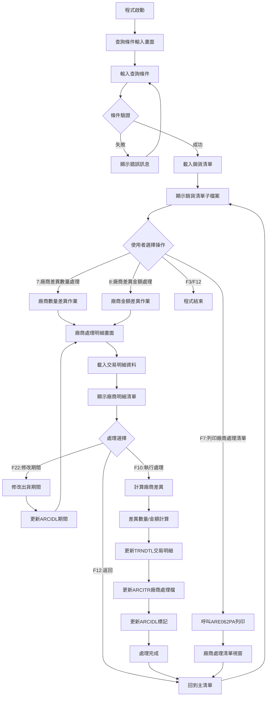
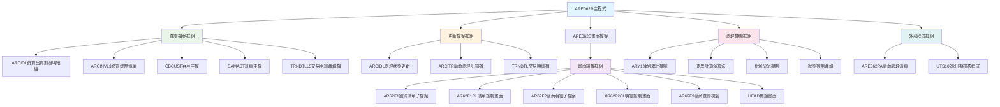
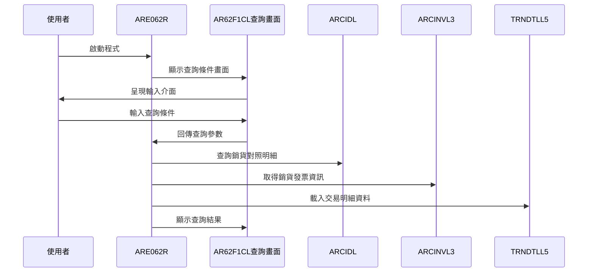
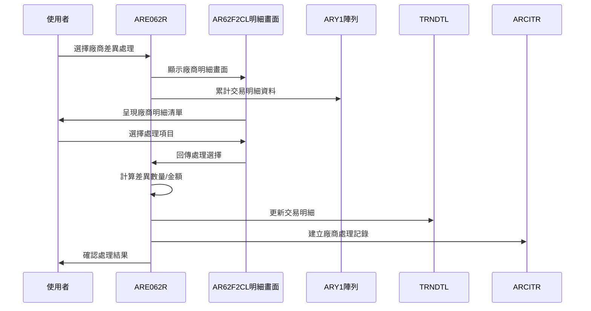
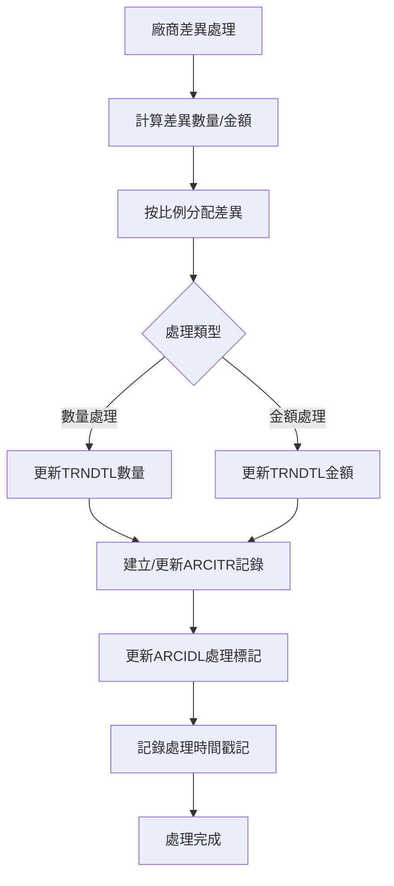
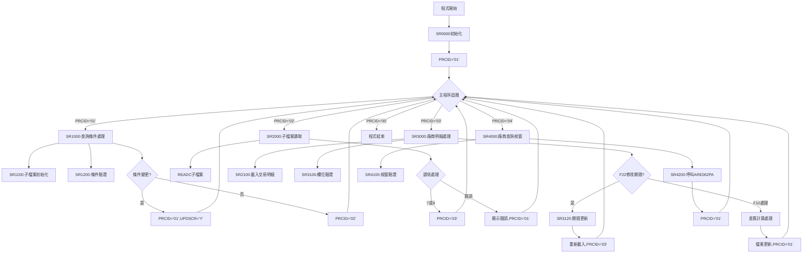
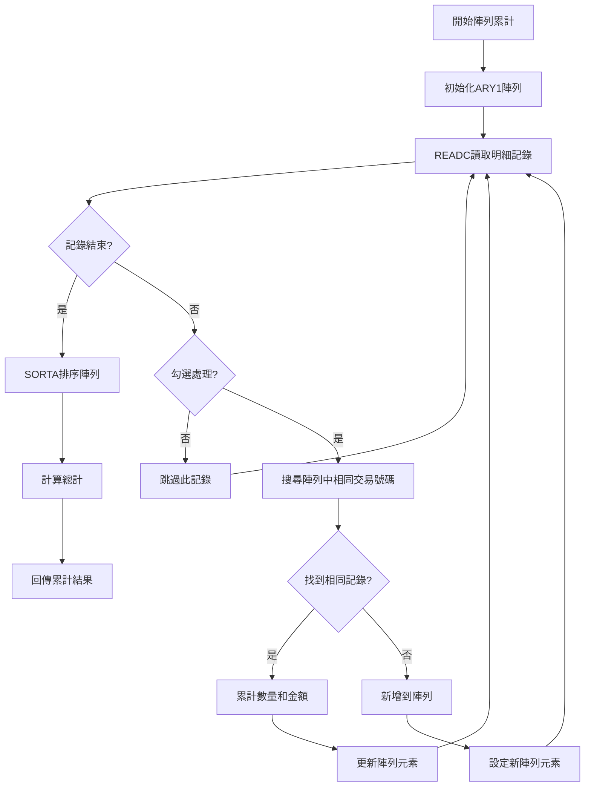
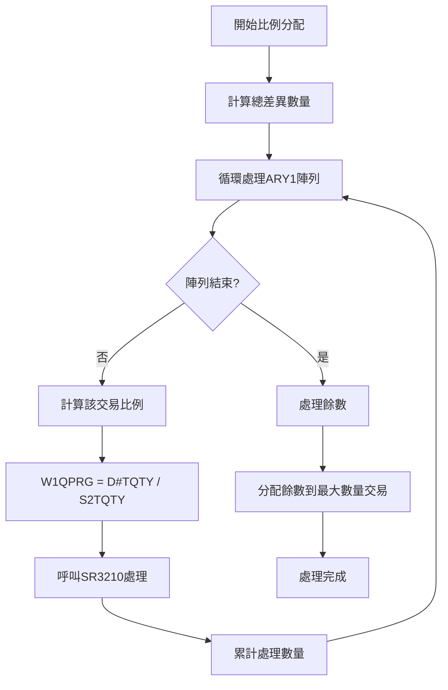
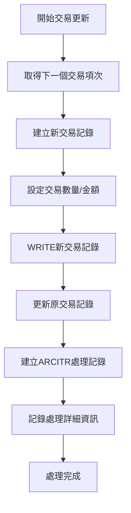
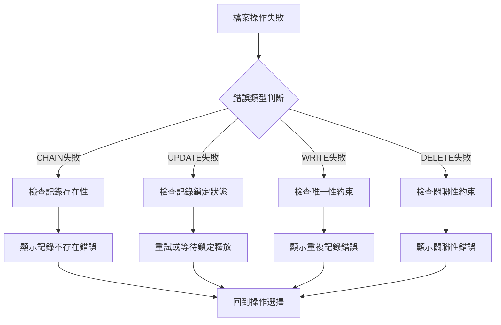

# ARE062R_U01 程式規格書

## 1. 基本資料

| 項目 | 內容 |
|------|------|
| **程式編號** | ARE062R |
| **程式名稱** | 銷貨與出貨廠商處理作業 |
| **程式類型** | RPG |
| **廠區** | U01 |
| **系統名稱** | 應收帳款系統 |
| **子系統** | 銷貨出貨管理 |
| **檔案位置** | U01RPGSRC_THSRC/ARE062R.txt |

## 2. 🎯 程式功能說明

### 主要功能描述
ARE062R為銷貨與出貨廠商處理作業程式，主要處理銷貨發票與實際出貨明細間的廠商差異問題。程式提供廠商差異的查詢、計算和處理功能，包括廠商差異數量處理(選項7)和廠商差異金額處理(選項8)，並能自動計算差異數量和金額，更新相關的交易明細和廠商處理記錄，確保銷貨與出貨資料的一致性。

### 🎯 業務流程詳細說明

#### 完整業務流程圖


#### 業務流程關鍵階段說明

1. **查詢條件設定階段**：
   - 輸入廠區代碼、銷貨年月、客戶代號、訂單代號等查詢條件
   - 系統自動帶入使用者廠區和當前期間
   - 支援日期格式驗證和條件邏輯檢查

2. **銷貨清單載入階段**：
   - 從ARCIDL檔案讀取銷貨出貨對照明細資料
   - 顯示銷貨基本資訊、產品資訊、處理狀態等
   - 標示已廠商處理(PDDF='Y')和已廠商處理(SPRD='Y')狀態

3. **廠商差異檢測階段**：
   - 載入對應的TRNDTL交易明細資料
   - 比對銷貨明細與實際交易數量和金額
   - 計算出廠商差異數量和金額
   - 使用ARY1陣列累計相同交易號碼的數據

4. **差異處理選擇階段**：
   - 選項7：處理廠商差異數量，調整交易明細的數量
   - 選項8：處理廠商差異金額，調整交易明細的金額
   - 支援狀態檢查，已處理的項目不允許重複處理

5. **廠商明細處理階段**：
   - 顯示詳細的交易明細資料
   - 支援期間修改功能(F22)
   - 提供總計數量和金額資訊
   - 允許勾選要處理的交易項目

6. **差異計算處理階段**：
   - 計算廠商差異 = 銷貨數量/金額 - 實際交易數量/金額
   - 按比例分配差異到各交易明細
   - 更新TRNDTL交易明細檔案
   - 建立或更新ARCITR廠商處理記錄

7. **廠商處理記錄階段**：
   - 記錄廠商處理的詳細資訊
   - 更新ARCIDL的處理標記
   - 記錄處理人員和處理時間
   - 維護廠商處理的稽核軌跡

#### 智能處理邏輯

**陣列累計機制**：
- 使用ARY1陣列(99個元素)累計相同交易號碼的數量和金額
- 自動排序和合併重複的交易記錄
- 提供精確的差異計算基礎

**比例分配演算法**：
- 根據各交易明細的比例分配差異數量或金額
- 確保分配後的總計與原始差異一致
- 處理分配餘數，避免計算誤差

**狀態控制機制**：
- 已廠商處理(PDDF='Y')的項目不允許再進行數量處理
- 已廠商處理(SPRD='Y')的項目不允許再進行金額處理
- 確保處理流程的正確性和不重複處理

#### 資料一致性確保機制

**差異驗證控制**：
- 廠商差異數量必須等於銷貨數量減去實際交易數量
- 廠商差異金額必須等於銷貨金額減去實際交易金額
- 確保差異計算的準確性

**檔案同步更新**：
- TRNDTL、ARCITR、ARCIDL三個檔案的同步更新
- 確保所有相關檔案的資料一致性
- 提供完整的處理追蹤記錄

**交易完整性保護**：
- 使用交易號碼和項次的複合鍵確保唯一性
- 防止重複處理或資料遺漏
- 維護交易記錄的完整性

## 3. 🎯 檔案架構與關聯圖

### 使用檔案清單
| 檔案名稱 | 檔案類型 | 使用方式 | 說明 |
|----------|----------|----------|------|
| ARE062S | DSPF | 畫面檔案 | 主畫面、明細畫面及廠商查詢視窗 |
| ARCIDL | PF | 更新檔案 | 銷貨出貨對照明細檔 |
| ARCINVL3 | LF | 查詢檔案 | 銷貨發票清單邏輯檔 |
| CBCUST | PF | 查詢檔案 | 客戶主檔 |
| SAMAST | PF | 查詢檔案 | 訂單主檔 |
| ARCITR | PF | 更新檔案 | 廠商處理記錄檔 |
| TRNDTL | PF | 更新檔案 | 交易明細檔 |
| TRNDTLL5 | LF | 查詢檔案 | 交易明細邏輯檔 |

### 🎯 檔案關聯詳細視覺化圖表


### 🎯 資料流向詳細說明

#### 查詢處理階段的資料流向


#### 廠商差異處理階段的資料流向


#### 檔案更新流程


## 4. 🎯 檔案欄位規格說明

### 主要資料結構

#### 查詢畫面欄位定義
| 欄位名稱 | 長度 | 型態 | 說明 |
|----------|------|------|------|
| S#AREA | 1A | 字元 | 廠區代碼 |
| S#SYM | 6P | 數值 | 銷貨年月(YYYYMM) |
| S#SCUS | 6A | 字元 | 客戶代號(查詢條件) |
| S#SORS | 6A | 字元 | 訂單代號(查詢條件) |
| S#USER | 10A | 字元 | 使用者ID |
| S#SCRN | 10A | 字元 | 畫面識別碼 |

#### 銷貨清單子檔案欄位定義
| 欄位名稱 | 長度 | 型態 | 說明 |
|----------|------|------|------|
| S#OPT | 1A | 字元 | 操作選項(7,8) |
| S#YYMM | 6P | 數值 | 銷貨年月 |
| S#CDTE | 8P | 數值 | 建立日期 |
| S#CUNO | 6A | 字元 | 客戶代號 |
| S#CUNM | 10A | 字元 | 客戶名稱 |
| S#ORNO | 6A | 字元 | 訂單號碼 |
| S#APNO | 20A | 字元 | 申請號碼 |
| S#PDN1 | 5A | 字元 | 產品名稱 |
| S#PDS1 | 3A | 字元 | 產品代號 |
| S#PDDF | 1A | 字元 | 廠商處理標記 |
| S#SPRD | 1A | 字元 | 廠商處理標記 |
| S#QTY | 12P3 | 數值 | 銷貨數量 |
| S#AMT | 10P | 數值 | 銷貨金額 |
| S#DATS | 8P | 數值 | 出貨開始日期 |
| S#DATE | 8P | 數值 | 出貨結束日期 |
| S#ITEM | 2P | 數值 | 項次 |

#### 廠商明細子檔案欄位定義
| 欄位名稱 | 長度 | 型態 | 說明 |
|----------|------|------|------|
| S#OPT1 | 1A | 字元 | 選擇標記(Y/空白) |
| S#ACDT | 8P | 數值 | 會計日期 |
| S#TXNO | 8A | 字元 | 交易號碼 |
| S#TXEM | 2P | 數值 | 交易項次 |
| S#PDNM | 5A | 字元 | 產品名稱 |
| S#TXPD | 3A | 字元 | 交易產品代號 |
| S#TXQY | 7P | 數值 | 交易數量 |
| S#UPRC | 5P3 | 數值 | 單價 |
| S#TXMT | 11P | 數值 | 交易金額 |
| S#ORN1 | 9A | 字元 | 訂單號碼1 |
| S#TPRC | 7A | 字元 | 交易價格 |

#### 廠商查詢視窗欄位定義
| 欄位名稱 | 長度 | 型態 | 說明 |
|----------|------|------|------|
| S@YYMM | 6P | 數值 | 查詢年月 |
| S@ORNO | 6A | 字元 | 查詢訂單號碼 |
| S@APNO | 20A | 字元 | 查詢申請號碼 |

### 🔍 重點欄位切割技術詳解

#### DS陣列處理切割視覺化：
```
D#ARY1記錄：[交易號碼__|數量___|金額________|產品名|單價_|訂單號碼__|價格___|]
位置:       001-08     009-15   016-26       027-31 032-36 037-45     046-52
            ↓          ↓        ↓            ↓      ↓      ↓          ↓
交易號碼:   [TX240315]                                                  8字元交易識別
交易數量:              [1250.00]                                        7字元數量(含小數)
交易金額:                       [15000000.00]                           11字元金額(含小數)  
產品名稱:                                    [STEEL]                    5字元產品識別
單價:                                               [125.3]             5字元單價(含小數)
訂單號碼:                                                   [OR240315]  9字元訂單識別
交易價格:                                                              [1250.00] 7字元價格
```

##### DS陣列處理切割邏輯說明：
**切割策略**：固定位置陣列分割法，透過DS重定義實現52字元記錄的精確欄位分割
**關鍵技術**：
1. **陣列結構化**：ARY1陣列99個元素，每個元素52字元的統一結構
2. **位置精確定位**：使用固定起始和結束位置進行欄位分割
3. **數值格式處理**：數量、金額、單價使用固定小數位數格式
4. **累計比較邏輯**：用於廠商差異計算和交易明細比對

**分割邏輯**：
- D#TXNO (1-8)：交易號碼，作為交易記錄的主要識別
- D#TQTY (9-15)：交易數量，7字元含小數格式
- D#TAMT (16-26)：交易金額，11字元含小數格式
- D#PDNM (27-31)：產品名稱，5字元產品識別碼
- D#UPRC (32-36)：單價，5字元含小數格式
- D#ORN1 (37-45)：訂單號碼，9字元訂單識別
- D#TPR1 (46-52)：交易價格，7字元價格資訊

#### 系統日期分割視覺化：
```
日期記錄：[YYYYMM|DD]
位置:     001-06 07-08
          ↓      ↓
年月:     [202403]      系統年月提取
日期:            [15]   系統日期提取
```

##### 系統日期分割邏輯說明：
**切割策略**：日期組件分離法，透過DS重定義將8字元日期分割為年月和日期組件
**分離機制**：
1. **年月提取**：S#SYM (1-6) 提取YYYYMM格式年月
2. **日期提取**：D#SYDD (7-8) 提取DD格式日期
3. **查詢應用**：年月用於主要查詢條件，日期用於輔助篩選
4. **格式統一**：確保日期格式在整個系統中的一致性

**分割邏輯**：
- D#SYMD：8字元完整系統日期
- S#SYM：前6字元年月，用於查詢條件設定
- D#SYDD：後2字元日期，用於明細篩選

#### 查詢條件分割視覺化：
```
查詢條件：[A|ORNO1]
位置:     1 2-6
          ↓ ↓
廠區:     [U]       廠區代碼提取
訂單:       [OR123] 訂單號碼提取
```

##### 查詢條件分割邏輯說明：
**切割策略**：複合查詢鍵分離法，透過DS重定義將6字元查詢條件分割為廠區和訂單組件
**分離架構**：
1. **廠區分離**：S1OREA (1) 提取1字元廠區代碼
2. **訂單分離**：S1ORNO (2-6) 提取5字元訂單號碼
3. **查詢組合**：支援廠區和訂單的組合查詢
4. **彈性篩選**：可單獨或組合使用廠區和訂單條件

**分割邏輯**：
- S#SORS：6字元複合查詢條件
- S1OREA：第1字元廠區代碼
- S1ORNO：第2-6字元訂單號碼

#### 交易保留欄位切割視覺化：
```
TXRESV記錄：[交易價格_|.|保留__|.......|產品_|標_|.......]
位置:       001-07   08 009-09 010-18 019-21 022 023-30
            ↓        ↓  ↓      ↓      ↓      ↓   ↓
交易價格:   [1250.00]                                交易價格資訊
保留分隔:           [.]                               分隔字元
保留欄位:              [   ]                         保留空間
中間填充:                     [.......]              中間填充區域
產品代號:                              [STL]         產品代號提取
標記欄位:                                     [Y]    處理標記
尾端保留:                                        [......] 尾端保留區
```

##### 交易保留欄位切割邏輯說明：
**切割策略**：保留欄位重用法，透過DS重定義從30字元保留欄位中提取有用資訊
**重用機制**：
1. **價格資訊重用**：D#TPRC (1-7) 提取交易價格資訊
2. **保留欄位利用**：D#TXRV (10) 利用第10位置存放特殊標記
3. **產品代號嵌入**：D1PDS1 (19-21) 在保留欄位中嵌入產品代號
4. **處理標記**：D#WTMK (22) 使用第22位置作為處理標記

**重用邏輯**：
- TXRESV：30字元交易保留欄位
- D#TPRC (1-7)：交易價格，重用前7字元
- D#TXRV (10)：交易保留標記，重用第10字元
- D1PDS1 (19-21)：產品代號，重用第19-21字元
- D#WTMK (22)：處理標記，重用第22字元

#### L7保留欄位切割視覺化：
```
L7RESV記錄：[交易價格_|.........|產品_|.......]
位置:       001-07    008-18   019-21 022-30
            ↓         ↓        ↓      ↓
交易價格:   [1250.00]                   L7交易價格
中間保留:            [.........]       中間保留區域
產品代號:                     [STL]    L7產品代號
尾端保留:                            [.......] 尾端保留區
```

##### L7保留欄位切割邏輯說明：
**切割策略**：L7層級重用法，透過DS重定義對L7記錄的保留欄位進行特殊切割
**L7機制**：
1. **L7價格提取**：D1TPRC (1-7) 提取L7層級的交易價格
2. **L7產品識別**：D#PDS1 (19-21) 提取L7層級的產品代號
3. **層級區分**：與主記錄的保留欄位形成對比和驗證
4. **數據一致性**：確保L7層級與主記錄的數據一致性

**L7邏輯**：
- L7RESV：30字元L7保留欄位
- D1TPRC (1-7)：L7交易價格資訊
- D#PDS1 (19-21)：L7產品代號資訊

#### 建立日期年月切割視覺化：
```
建立日期：[YYYYMM|DD]
位置:     001-06 07-08
          ↓      ↓
年月提取: [202403]      建立年月
日期忽略:        [XX]   日期部分不使用
```

##### 建立日期年月切割邏輯說明：
**切割策略**：年月提取法，透過DS重定義從8字元建立日期中提取年月資訊
**提取機制**：
1. **年月焦點**：D#SYM (1-6) 只關注年月部分
2. **日期忽略**：第7-8字元日期部分在此應用中被忽略
3. **查詢比對**：提取的年月用於與查詢條件的年月比對
4. **期間控制**：作為資料期間篩選的重要依據

**提取邏輯**：
- DLCDTE：8字元建立日期
- D#SYM (1-6)：建立年月，用於查詢比對

#### UDS使用者資料區切割視覺化：
```
UDS記錄：[........公司代碼______________________________|使用者__|裝置名__|廠_]
位置:    001-950 951-985                                1001-1010 1011-1020 1021
         ↓       ↓                                      ↓         ↓         ↓
前段保留: [.......]                                                          UDS前段保留
公司代碼:         [TUNGKANG_STEEL_CORPORATION____________]                      35字元公司識別
使用者ID:                                                [USER12345]          10字元使用者識別
裝置名稱:                                                          [TERM01___] 10字元終端識別
廠區代碼:                                                                    [U] 1字元廠區識別
```

##### UDS使用者資料區切割邏輯說明：
**切割策略**：UDS固定位置切割法，透過精確位置定義提取使用者環境資訊
**位置架構**：
1. **公司代碼區**：S#COMP (951-985) 35字元公司識別資訊
2. **使用者識別區**：D#USER (1001-1010) 10字元使用者ID
3. **裝置名稱區**：S#DEVN (1011-1020) 10字元終端裝置名稱
4. **廠區識別區**：TXAR (1021) 1字元廠區代碼

**環境邏輯**：
- UDS：使用者資料區，包含環境和識別資訊
- S#COMP (951-985)：公司代碼，35字元企業識別
- D#USER (1001-1010)：使用者ID，10字元使用者識別
- S#DEVN (1011-1020)：裝置名稱，10字元終端識別
- TXAR (1021)：廠區代碼，1字元廠區識別

### 🎯 欄位挪用詳細分析

#### ARCIDL檔案欄位映射
| 原始欄位 | 映射用途 | 實際內容 | 挪用原因 |
|----------|----------|----------|----------|
| DLAREA | 廠區代碼 | 銷貨廠區 | 主要的廠區識別資訊 |
| DLYYMM | 銷貨年月 | 銷貨發生年月 | 作為主要的期間查詢條件 |
| DLCDTE | 建立日期 | 明細建立日期 | 記錄建立時間戳記 |
| DLOCUS | 客戶代號 | 銷貨客戶代號 | 主要的客戶識別資訊 |
| DLOCNM | 客戶名稱 | 客戶中文名稱 | 提供友善的客戶識別 |
| DLORNO | 訂單號碼 | 原始訂單號碼 | 關聯訂單的主鍵 |
| DLAPNO | 申請號碼 | 申請單號碼 | 業務流程的追蹤依據 |
| DLITEM | 明細項次 | 明細項次編號 | 明細記錄的唯一識別 |
| DLPDN1 | 產品名稱 | 產品中文名稱 | 產品的友善識別資訊 |
| DLPDS1 | 產品代號 | 實際產品代號 | 產品的主鍵識別碼 |
| DLPDDF | 廠商處理標記 | 數量處理狀態 | Y=已處理數量差異 |
| DLSPRD | 廠商處理標記 | 金額處理狀態 | Y=已處理金額差異 |
| DLSACD | 開始日期 | 出貨開始日期 | 出貨期間的起始點 |
| DLEACD | 結束日期 | 出貨結束日期 | 出貨期間的結束點 |
| DLQTY | 明細數量 | 銷貨數量 | 作為差異計算的基準 |
| DLAMT | 明細金額 | 銷貨金額 | 作為差異計算的基準 |
| DLCHDS | 變更日期標記 | 期間變更標記 | Y=已變更出貨期間 |

#### ARCITR檔案欄位挪用
| 原始欄位 | 挪用用途 | 實際儲存 | 挪用技術 |
|----------|----------|----------|----------|
| TRFLAG | 記錄狀態 | A=新增、C=異動 | 記錄的生命週期狀態 |
| TRAREA | 廠區代碼 | 銷貨廠區 | 廠區識別資訊 |
| TRCDTE | 建立日期 | 銷貨建立日期 | 8位數值格式日期 |
| TROCUS | 客戶代號 | 銷貨客戶代號 | 6字元客戶識別碼 |
| TROCNM | 客戶名稱 | 客戶中文名稱 | 10字元客戶名稱 |
| TRORNO | 訂單號碼 | 相關訂單號碼 | 6字元訂單識別碼 |
| TRAPNO | 申請號碼 | 申請單號碼 | 20字元申請識別碼 |
| TRITEM | 明細項次 | 明細項次編號 | 2位數值項次編號 |
| TRPDS1 | 產品代號 | 實際產品代號 | 3字元產品識別碼 |
| TRPDN1 | 產品名稱 | 產品中文名稱 | 5字元產品描述 |
| TRACNT | 會計科目 | 處理類型 | 1=金額處理、2=數量處理 |
| TRTXNO | 交易號碼 | 對應交易號碼 | 8字元交易識別碼 |
| TRTXIT | 交易項次 | 交易明細項次 | 交易明細的項次編號 |
| TRTSQT | 廠商差異數量 | 處理的差異數量 | 計算出的數量差異 |
| TRTSAM | 廠商差異金額 | 處理的差異金額 | 計算出的金額差異 |
| TRPRTG | 處理比例 | 分配比例 | 差異分配的比例值 |
| TR2QTY | 處理後數量 | 更新後的交易數量 | 處理後的實際數量 |
| TR2PRC | 處理後單價 | 更新後的交易單價 | 處理後的實際單價 |
| TR2AMT | 處理後金額 | 更新後的交易金額 | 處理後的實際金額 |
| TRTQDF | 數量差異標記 | 數量差異標記 | 標記數量處理狀態 |
| TRTLDF | 金額差異標記 | 金額差異標記 | 標記金額處理狀態 |

### 重要變數定義表
| 變數名稱 | 用途說明 | 數值範圍 | 預設值 |
|----------|----------|----------|--------|
| PRCID | 程式流程控制 | 00,01,02,03,04 | 01 |
| W#SYM | 工作年月暫存 | 6位數值 | *LOVAL |
| W#SCUS | 工作客戶暫存 | 6字元 | *BLANKS |
| W#SORS | 工作訂單暫存 | 6字元 | *BLANKS |
| W#OPT | 操作選項暫存 | 7,8 | 系統設定 |
| W#IN22 | F22功能旗標 | Y/N | N |
| W#TQTY | 差異數量計算 | 數值 | 0 |
| W#TAMT | 差異金額計算 | 數值 | 0 |
| W1QQTY | 餘數數量暫存 | 數值 | 0 |
| W1TTAT | 餘數金額暫存 | 數值 | 0 |
| W1QPRG | 處理比例 | 數值 | 0 |
| W1TTQY | 最大數量暫存 | 數值 | 0 |
| W2TXNO | 最大交易號碼 | 8字元 | *BLANKS |
| W2ITEM | 最大交易項次 | 數值 | 0 |
| S2TQTY | 子檔案總數量 | 數值 | 0 |
| S2TAMT | 子檔案總金額 | 數值 | 0 |
| W#CKOP | 操作檢查旗標 | Y/N | N |
| W#CKAP | 申請檢查旗標 | Y/N | N |

## 5. 🎯 輸出/入螢幕布局

### 查詢條件畫面(AR62F1CL)布局

```
+----------------------------------------------------------+
|  YY/MM/DD      [公司名稱]                        ARE062S-1|
|  HH:MM:SS      銷貨與出貨廠商處理作業            DEVNAME  |
|  USERID                                                  |
|                                                          |
|  銷貨廠區: [X]                      銷貨年月: [______]  |
|                                            ←請輸入年月    |
|  客戶代號: [______]  ←請輸入代號                         |
|                                                          |
|                                     訂單代號: [______]   |
|                                          ←請輸入代號     |
|      OP :7=廠商差異處理 8=廠商差異處理                     |
|                                                          |
|  O 年月  建立日期    客戶 訂單            項 廠商廠商    |
|  P ────  ────────  ──── ────────  產品代號 ──── ── ──  |
|                                                          |
|  選項  年月  建立日期    客戶  訂單  產品名稱代號  廠商處理|
|===========================================================|
|  [X]  [____] [YY/MM/DD] [____] [____] [___][__] [X] [X]  |
|  [X]  [____] [YY/MM/DD] [____] [____] [___][__] [X] [X]  |
|  [X]  [____] [YY/MM/DD] [____] [____] [___][__] [X] [X]  |
|  [X]  [____] [YY/MM/DD] [____] [____] [___][__] [X] [X]  |
|  [X]  [____] [YY/MM/DD] [____] [____] [___][__] [X] [X]  |
|  [X]  [____] [YY/MM/DD] [____] [____] [___][__] [X] [X]  |
|  [X]  [____] [YY/MM/DD] [____] [____] [___][__] [X] [X]  |
|  [X]  [____] [YY/MM/DD] [____] [____] [___][__] [X] [X]  |
|  [X]  [____] [YY/MM/DD] [____] [____] [___][__] [X] [X]  |
|  [X]  [____] [YY/MM/DD] [____] [____] [___][__] [X] [X]  |
|  [X]  [____] [YY/MM/DD] [____] [____] [___][__] [X] [X]  |
|===========================================================|
|                                                          |
|  F3=結束    F7=列印廠商處理清單    F12=返回             |
|  [錯誤訊息顯示區域]                                      |
+----------------------------------------------------------+
```

### 廠商明細處理畫面(AR62F2CL)布局

```
+----------------------------------------------------------+
|  YY/MM/DD      [公司名稱]                        ARE062S-2|
|  HH:MM:SS      銷貨與出貨廠商處理作業            DEVNAME  |
|  [處理模式]                                      USERID   |
|                                                          |
|  建立日期: [YY/MM/DD]      客戶代號: [______] [客戶名稱] |
|  訂單代號: [______]        申請單號: [__________________]|
|  明細總數量: [_______]           明細總金額: [_______]   |
|  出貨期間起迄: [YY/MM/DD] 至 [YY/MM/DD]                 |
|                           產品名稱: [_____] 產品代號: [___]|
|  銷貨數量: [_______]                 銷貨金額: [_______] |
|                                                          |
|  勾 會計日期  交易號碼 項 產品名稱代號 數量   單價   金額 |
|===========================================================|
|  [Y] [YY/MM/DD] [______] [__] [___][__] [____] [___] [____]|
|  [Y] [YY/MM/DD] [______] [__] [___][__] [____] [___] [____]|
|  [Y] [YY/MM/DD] [______] [__] [___][__] [____] [___] [____]|
|  [Y] [YY/MM/DD] [______] [__] [___][__] [____] [___] [____]|
|  [Y] [YY/MM/DD] [______] [__] [___][__] [____] [___] [____]|
|  [Y] [YY/MM/DD] [______] [__] [___][__] [____] [___] [____]|
|  [Y] [YY/MM/DD] [______] [__] [___][__] [____] [___] [____]|
|  [Y] [YY/MM/DD] [______] [__] [___][__] [____] [___] [____]|
|  [Y] [YY/MM/DD] [______] [__] [___][__] [____] [___] [____]|
|===========================================================|
|                                                          |
|                        合 計: [_______] [_______]       |
|  作業功能:   F3=結束作業  F10=處理  F12=返回主選單     |
|              F22=修改期間                                |
|  [錯誤訊息顯示區域]                                      |
+----------------------------------------------------------+
```

### 廠商查詢視窗(AR62F3)布局

```
           +-----------------------------------------------------+
           |                                                     |
           |    銷貨年月: [______]  訂單代號: [______]           |
           |                              ←請輸入代號           |
           |                                                     |
           |    申請單號: [__________________]                   |
           |                              ←請輸入代號           |
           |    [錯誤訊息顯示區域]                               |
           |    作業功能: F3,F12=返回主選單                      |
           |                                                     |
           +-----------------------------------------------------+
```

### 🎯 畫面欄位詳細說明

#### 查詢條件畫面欄位
| 位置 | 欄位 | 屬性 | 說明 |
|------|------|------|------|
| 1,2 | DATE | 輸出 | 系統日期，格式YY/MM/DD |
| 1,24 | S#COMP | 輸出 | 公司名稱(35字元) |
| 1,70 | S#SCRN | 輸出 | 畫面識別碼(10字元) |
| 2,2 | TIME | 輸出 | 系統時間，格式HH:MM:SS |
| 2,27 | 固定文字 | 輸出 | '銷貨與出貨廠商處理作業' |
| 2,70 | S#DEVN | 輸出 | 設備名稱(10字元) |
| 3,2 | S#USER | 輸出 | 使用者ID(10字元) |
| 5,12 | S#AREA | 輸出 | 廠區代碼(1字元) |
| 5,38 | S#SYM | 輸入 | 銷貨年月(6數字) |
| 6,12 | S#SCUS | 輸入 | 客戶代號(6字元) |
| 6,50 | S#SORS | 輸入 | 訂單代號(6字元) |

#### 廠商明細處理畫面欄位
| 位置 | 欄位 | 屬性 | 說明 |
|------|------|------|------|
| 3,2 | S#MODE | 輸出 | 處理模式(10字元) |
| 5,12 | S#CDTE | 輸出 | 建立日期(8數字) |
| 5,33 | S#CUNO | 輸出 | 客戶代號(6字元) |
| 5,40 | S#CUNM | 輸出 | 客戶名稱(10字元) |
| 6,12 | S#ORNO | 輸出 | 訂單代號(6字元) |
| 6,33 | S#APNO | 輸出 | 申請號碼(20字元) |
| 7,14 | S#TQTY | 輸出 | 總數量(12P3) |
| 7,40 | S#TAMT | 輸出 | 總金額(10P) |
| 8,14 | S#DATS | 輸入 | 開始日期(8數字) |
| 8,30 | S#DATE | 輸入 | 結束日期(8數字) |
| 8,50 | S#PDN1 | 輸出 | 產品名稱(5字元) |
| 8,70 | S#PDS1 | 輸出 | 產品代號(3字元) |
| 9,14 | S#QTY | 輸出 | 銷貨數量(12P3) |
| 9,40 | S#AMT | 輸出 | 銷貨金額(10P) |

#### 廠商查詢視窗欄位
| 位置 | 欄位 | 屬性 | 說明 |
|------|------|------|------|
| 3,14 | S@YYMM | 輸入 | 查詢年月(6數字) |
| 3,35 | S@ORNO | 輸入 | 查詢訂單代號(6字元) |
| 5,14 | S@APNO | 輸入 | 查詢申請號碼(20字元) |

#### 子檔案畫面控制邏輯
| 指示器 | 控制對象 | 狀態 | 說明 |
|--------|----------|------|------|
| IN26 | S#SYM欄位 | ON | 啟動反白和保護控制 |
| IN27 | S#SCUS欄位 | ON | 啟動反白和保護控制 |
| IN28 | S#SORS欄位 | ON | 啟動反白和保護控制 |
| IN29 | S#OPT欄位 | ON | 啟動反白和保護控制 |
| IN32 | S#DATS欄位 | ON | 啟動反白和保護控制 |
| IN33 | S#DATE欄位 | ON | 啟動反白和保護控制 |
| IN60 | 保護模式 | ON | F22修改期間模式欄位保護 |
| IN70 | 子檔案變更 | ON | 標記子檔案有變更 |
| IN80 | 明細變更 | ON | 標記明細子檔案有變更 |

### 功能鍵詳細定義
| 功能鍵 | 處理邏輯 | 系統行為 |
|--------|----------|----------|
| **F3** | 結束作業 | 回到呼叫程式或系統選單 |
| **F7** | 列印廠商處理清單 | 呼叫ARE062PA列印程式 |
| **F10** | 執行處理 | 執行廠商差異的檔案更新 |
| **F12** | 返回上頁 | 回到前一個畫面 |
| **F22** | 修改期間 | 啟動出貨期間修改功能 |

### 操作選項說明
| 選項 | 功能說明 | 處理模式 |
|------|----------|----------|
| **7** | 廠商差異數量處理 | 處理銷貨與出貨間的數量差異，更新DLPDDF='Y' |
| **8** | 廠商差異金額處理 | 處理銷貨與出貨間的金額差異，更新DLSPRD='Y' |

## 6. 🎯 處理流程程序說明

### 🎯 主程序邏輯深度分析

#### 程式執行流程圖


#### 🎯 詳細處理步驟逐一分析

**步驟1：程式初始化(SR0000)**
- 計算系統日期U#SYSD = *DATE - 19000000
- 清除子檔案控制畫面AR62F1CL
- 設定子檔案記錄指標S#NBR = 1
- 初始化使用者ID、廠區資訊
- 重置所有工作變數和旗標

**步驟2：查詢條件處理(SR1000)**
- 檢查是否需要更新子檔案(UPDSCR='Y')
- 若需要更新則執行SR1100子檔案重新載入
- 顯示查詢條件畫面並等待使用者輸入
- 處理F3/F12離開功能和F7列印功能
- 執行輸入條件驗證(SR1200)

**步驟3：子檔案初始化(SR1100)**
- 重置子檔案變更旗標UPDSCR=' '
- 清除子檔案內容(SFLCLR)
- 設定ARCIDL檔案定位KEY01
- 循序讀取符合條件的銷貨出貨對照明細
- 載入產品資訊和處理狀態標記

**步驟4：條件驗證處理(SR1200)**
- 驗證客戶代號：CHAIN CBCUST檢查存在性
- 驗證訂單代號：CHAIN SAMAST檢查存在性
- 驗證銷貨年月：呼叫UTS102R檢查日期格式
- 設定對應的錯誤指示器和錯誤訊息

**步驟5：子檔案讀取處理(SR2000)**
- 使用READC讀取子檔案使用者選擇
- 重置子檔案變更旗標IN70
- 檢查處理狀態：已廠商處理不可重複處理
- 驗證操作選項的有效性
- 設定下一步處理流程

**步驟6：交易明細載入(SR2100)**
- 從TAB1/TAB2查詢表取得操作模式描述
- 從ARCINVL3取得銷貨發票總數量和總金額
- 使用KEY03從TRNDTLL5讀取交易明細
- 過濾SA04交易碼的記錄
- 建立明細子檔案顯示記錄

**步驟7：廠商明細處理(SR3000)**
- 顯示廠商明細處理畫面
- 處理F22修改期間功能
- 執行SR3100欄位驗證
- 根據處理選項執行差異計算
- 呼叫相應的差異處理程序

**步驟8：明細欄位驗證(SR3100)**
- 執行SR3110子檔案明細驗證和累計
- 檢查總數量和總金額的一致性
- 驗證出貨期間的格式和邏輯
- 檢查是否有勾選處理項目
- 設定相應的錯誤指示器

**步驟9：子檔案明細驗證(SR3110)**
- 使用READC批次讀取明細子檔案
- 將勾選的交易明細累計到ARY1陣列
- 使用SORTA排序陣列資料
- 累計相同交易號碼的數量和金額
- 計算總數量S2TQTY和總金額S2TAMT

**步驟10：期間更新處理(SR3120)**
- 使用KEY12定位ARCIDL記錄
- 更新出貨開始日期DLSACD和結束日期DLEACD
- 設定期間變更標記DLCHDS='Y'
- 記錄更新人員和時間戳記
- 重置F22相關的指示器

**步驟11：數量差異處理(SR3200)**
- 計算廠商差異數量 = 銷貨數量 - 交易總數量
- 使用ARY1陣列進行比例分配處理
- 呼叫SR3210進行個別交易處理
- 更新TRNDTL交易明細檔案
- 建立或更新ARCITR廠商處理記錄

**步驟12：金額差異處理(SR3300)**
- 計算廠商差異金額 = 銷貨金額 - 交易總金額
- 使用ARY1陣列進行比例分配處理
- 呼叫SR3310進行個別交易處理
- 更新TRNDTL交易明細檔案
- 建立或更新ARCITR廠商處理記錄

**步驟13：個別交易處理(SR3210/SR3310)**
- 計算個別交易的分配比例
- 產生新的交易明細記錄
- 更新原有交易記錄的數量或金額
- 建立ARCITR廠商處理追蹤記錄
- 記錄處理的詳細資訊

**步驟14：廠商查詢視窗(SR4000)**
- 顯示廠商查詢視窗
- 執行SR4100驗證輸入條件
- 呼叫SR4200執行ARE062PA列印程式
- 處理查詢結果回饋
- 回到主查詢畫面

### 🎯 子程序邏輯詳細分析

#### 陣列累計處理邏輯(SR3110)


#### 比例分配處理邏輯(SR3200)


#### 交易記錄更新邏輯(SR3210/SR3310)


### 🎯 特殊邏輯處理

#### 陣列排序和累計機制
- ARY1陣列使用SORTA自動排序，確保相同交易號碼聚集
- 累計邏輯處理相同交易號碼的多筆明細
- 提供精確的差異計算基礎

#### 比例分配演算法
- 根據各交易明細的比例分配差異數量或金額
- 使用最大數量交易處理分配餘數
- 確保分配後的總計與原始差異一致

#### 交易項次自動編號
- 使用SETGT + READPE取得下一個可用項次
- 避免交易項次重複的問題
- 確保交易記錄的唯一性

#### 檔案同步更新機制
- TRNDTL、ARCITR、ARCIDL三個檔案的協調更新
- 確保所有相關檔案的資料一致性
- 提供完整的處理追蹤記錄

### 🎯 錯誤處理與資料完整性控制

#### 詳細的驗證機制
1. **狀態檢查**：已處理的項目不允許重複處理
2. **數量一致性**：廠商差異數量與銷貨數量的一致性檢查
3. **金額一致性**：廠商差異金額與銷貨金額的一致性檢查
4. **期間邏輯**：出貨開始日期不可大於結束日期
5. **選擇驗證**：必須勾選至少一個處理項目
6. **檔案關聯**：ARCITR記錄與ARCIDL的關聯性檢查

#### 錯誤恢復機制
- 錯誤發生時保留使用者已輸入的資料
- 提供明確的錯誤訊息和處理建議
- 支援F22重新修改期間的恢復功能
- 允許使用者重新選擇處理項目

## 7. 🎯 數據操作與轉換分析

### 檔案操作詳解

#### 複合條件查詢操作
- **KEY01-KEY12查詢**：使用複雜的複合鍵值進行精確定位
- **SETLL + READ組合**：用於ARCIDL和TRNDTLL5的條件查詢
- **CHAIN操作**：用於ARCINVL3、CBCUST、SAMAST的隨機存取
- **READC操作**：用於子檔案的批次讀取和使用者選擇處理

#### 陣列處理操作
- **ARY1陣列管理**：99個元素的動態資料累計和排序
- **SORTA排序**：自動排序陣列元素，聚集相同交易號碼
- **陣列搜尋**：循環搜尋陣列中的相同交易記錄
- **陣列累計**：將相同交易號碼的數量和金額進行累計

#### 檔案更新操作
- **WRITE新記錄**：建立新的交易明細和廠商處理記錄
- **UPDATE現有記錄**：更新交易數量、金額和處理狀態
- **DELETE記錄**：刪除金額為0的交易記錄
- **狀態標記**：更新ARCIDL的處理狀態標記

### 數據轉換邏輯

#### 系統日期轉換
```
系統日期計算：
U#SYSD = *DATE - 19000000
轉換8位西元年為6位民國年格式
用於檔案記錄的日期欄位儲存
```

#### 陣列資料轉換
```
ARY1陣列處理：
D#ARY1結構 → 各個欄位分解
52字元陣列元素分割為多個子欄位
支援99個交易明細的累計處理
```

#### 比例計算轉換
```
比例分配計算：
W1QPRG = D#TQTY / S2TQTY (數量比例)
W1QPRG = D#TAMT / S2TAMT (金額比例)
確保分配的精確性
```

#### 差異計算轉換
```
差異數量計算：
W#TQTY = S#QTY - S2TQTY
廠商差異 = 銷貨數量 - 實際交易數量

差異金額計算：
W#TAMT = S#AMT - S2TAMT
廠商差異 = 銷貨金額 - 實際交易金額
```

### 計算邏輯分析

#### 比例分配演算法
```
分配數量計算：
處理數量 = 差異數量 × (該交易數量 / 總交易數量)
餘數處理：分配到最大數量的交易項目
```

#### 交易項次計算
```
下一個項次計算：
SETGT + READPE取得最大項次
新項次 = 最大項次 + 1
避免項次重複
```

#### 金額重新計算
```
金額重算邏輯：
新金額 = 新數量 × 單價
確保數量和金額的一致性
```

### 檢核機制詳解

#### 存在性檢核
```
ARCIDL檢核：KEY08 CHAIN檢查明細記錄存在性
ARCITR檢核：KEY05 CHAIN檢查廠商處理記錄
TRNDTL檢核：KEY06/KEY07檢查交易記錄
客戶檢核：CHAIN CBCUST檢查客戶存在性
訂單檢核：CHAIN SAMAST檢查訂單存在性
```

#### 狀態檢核
```
處理狀態檢核：
IF S#PDDF = 'Y' AND S#OPT = '7' THEN 錯誤
IF S#SPRD = 'Y' AND S#OPT = '8' THEN 錯誤
避免重複處理

選擇檢核：
IF S2TQTY = 0 AND S2TAMT = 0 THEN 錯誤
確保有勾選處理項目
```

#### 邏輯檢核
```
日期邏輯檢核：
IF S#DATS > S#DATE THEN 錯誤
確保開始日期不大於結束日期

一致性檢核：
數量處理：S2TQTY必須等於S#QTY
金額處理：S2TAMT必須等於S#AMT
```

#### 格式檢核
```
日期格式檢核：
CALL 'UTS102R' 驗證日期有效性
P#MODE = '1' 使用標準日期檢核
FLAG1 <> '0' 表示日期無效
```

## 8. 🎯 錯誤處理程序說明

### 🎯 詳細錯誤代碼清冊

| 錯誤代碼 | 錯誤訊息 | 原因說明 | 處理方式 | 預防措施 |
|----------|---------|---------|---------|----------|
| **ERR,1** | 資料已存在! | 嘗試建立已存在的廠商處理記錄 | 1. 設定相關欄位錯誤指示器<br>2. 顯示重複記錄錯誤訊息<br>3. 建議檢查處理狀態<br>4. 回到操作選擇 | 在處理前檢查ARCITR記錄是否已存在 |
| **ERR,2** | 資料不存在! | 查詢條件沒有找到符合的資料 | 1. 設定IN72='1'關閉子檔案顯示<br>2. 顯示無資料訊息<br>3. 建議重新設定查詢條件<br>4. 回到條件輸入畫面 | 提供查詢條件的輸入建議和範例 |
| **ERR,3** | 欄位不可空白! | 必填欄位(銷貨年月)未輸入 | 1. 設定IN34='1'啟動年月欄位錯誤<br>2. 欄位反白顯示錯誤<br>3. 顯示必填欄位提示<br>4. 要求重新輸入 | 明確標示必填欄位，提供年月格式說明 |
| **ERR,4** | 請確認後重新確認刪除 | 刪除操作需要二次確認 | 1. 設定DELFLG='Y'確認旗標<br>2. 顯示刪除確認訊息<br>3. 要求使用者再次確認<br>4. 確認後執行實際刪除 | 重要資料刪除採用雙重確認機制 |
| **ERR,5** | 客戶代號不存在! | 輸入的客戶代號在CBCUST檔案中不存在 | 1. 設定IN27='1'啟動客戶欄位錯誤<br>2. 欄位反白並顯示錯誤<br>3. 建議檢查客戶代號正確性<br>4. 提供客戶查詢功能 | 提供客戶代號查詢輔助功能 |
| **ERR,6** | 訂單代號不存在! | 輸入的訂單代號在SAMAST檔案中不存在 | 1. 設定IN28='1'啟動訂單欄位錯誤<br>2. 欄位反白並顯示錯誤<br>3. 建議檢查訂單代號正確性<br>4. 提供訂單查詢功能 | 提供訂單代號查詢輔助功能 |
| **ERR,7** | 輸入年月錯誤，請檢查! | 銷貨年月格式不正確或日期不存在 | 1. 設定年月欄位錯誤指示器<br>2. 欄位反白顯示<br>3. 呼叫UTS102R檢核日期<br>4. 提供正確年月格式說明 | 使用標準日期檢核程式進行格式驗證 |
| **ERR,8** | 資料已確認處理，不可處理! | 記錄已確認處理，狀態不允許重複處理 | 1. 設定IN29='1'啟動選項錯誤<br>2. 顯示處理狀態說明<br>3. 建議使用查詢功能檢視<br>4. 說明業務流程限制 | 明確定義記錄的處理狀態和限制條件 |
| **ERR,9** | 廠商差異處理前請先進行廠商差異處理! | 執行金額差異處理前必須先執行數量差異處理 | 1. 設定IN29='1'啟動選項錯誤<br>2. 顯示處理順序要求<br>3. 建議先執行選項7<br>4. 說明處理順序邏輯 | 建立清楚的處理順序說明和檢查機制 |
| **ERR,10** | 請確認是否選擇相關處理項目! | 沒有勾選任何處理項目進行處理 | 1. 設定IN99='1'全域錯誤<br>2. 顯示選擇提示訊息<br>3. 要求勾選處理項目<br>4. 說明勾選方式 | 提供明確的勾選操作說明 |
| **ERR,11** | 請用廠商差異處理，廠商數量與原數量不符，請檢查! | 廠商差異金額處理時數量不一致 | 1. 設定IN99='1'全域錯誤<br>2. 顯示數量不符警告<br>3. 建議先執行數量差異處理<br>4. 說明處理順序要求 | 實施嚴格的處理順序檢查機制 |
| **ERR,12** | 無相關作業資料，請等待!! | 呼叫ARE062PA程式時無可列印資料 | 1. 顯示無資料訊息<br>2. 建議檢查查詢條件<br>3. 確認是否有廠商處理記錄<br>4. 等待系統回應 | 在呼叫列印前檢查資料是否存在 |
| **ERR,13** | 該年月無相關處理資料，請檢查! | 查詢的年月沒有廠商處理資料 | 1. 設定IN34='1'年月欄位錯誤<br>2. 顯示無資料訊息<br>3. 建議檢查年月設定<br>4. 提供資料存在的年月範圍 | 提供年月範圍的查詢輔助功能 |
| **ERR,14** | 該年月及訂單代號無相關處理資料，請檢查!! | 指定年月和訂單號碼無廠商處理資料 | 1. 設定IN34和IN35錯誤指示器<br>2. 顯示組合條件無資料<br>3. 建議調整查詢條件<br>4. 提供條件組合建議 | 實施查詢條件的有效性預檢查 |
| **ERR,15** | 該年月及訂單代號及申請單號無相關處理資料，請檢查! | 指定的三個條件組合無廠商處理資料 | 1. 設定IN34、IN35、IN36錯誤<br>2. 顯示完整條件無資料<br>3. 建議簡化查詢條件<br>4. 提供分段查詢建議 | 提供查詢條件的層次化檢查 |
| **ERR,16** | 該年月及申請單號無相關處理資料，請檢查! | 指定年月和申請號碼無廠商處理資料 | 1. 設定IN34和IN36錯誤指示器<br>2. 顯示條件組合無資料<br>3. 建議檢查申請號碼正確性<br>4. 提供申請號碼查詢功能 | 建立申請號碼的有效性檢查機制 |
| **ERR,17** | 起始日期錯誤，請檢查! | 開始日期大於結束日期的邏輯錯誤 | 1. 設定IN32和IN33日期錯誤<br>2. 反白相關日期欄位<br>3. 顯示日期邏輯錯誤訊息<br>4. 要求輸入正確的日期範圍 | 實施日期邏輯檢查，確保邏輯正確性 |
| **ERR,18** | 請先＜F22＞確認修改出貨期間!! | F22修改期間後未確認就執行其他操作 | 1. 設定IN32和IN33錯誤<br>2. 要求先確認期間修改<br>3. 說明F22操作流程<br>4. 引導正確的操作順序 | 明確說明F22功能的操作流程和確認機制 |
| **ERR,19** | 請用廠商差異處理，總數量與原數量不符，請按F10處理! | 廠商差異數量不一致，需要執行F10處理 | 1. 設定IN99='1'全域錯誤<br>2. 顯示數量不符警告<br>3. 要求按F10執行處理<br>4. 說明F10處理功能 | 提供F10處理功能的明確說明 |
| **ERR,20** | 請選擇相關處理項目，請確認!! | 沒有選擇任何處理項目 | 1. 設定IN99='1'全域錯誤<br>2. 強調選擇的重要性<br>3. 要求勾選處理項目<br>4. 提供選擇操作指引 | 建立明確的項目選擇檢查機制 |

### 🎯 系統異常處理邏輯

#### 檔案操作失敗處理


#### 陣列處理異常
- 當ARY1陣列溢位時，顯示警告訊息並限制處理範圍
- 陣列排序失敗時，使用備用的線性搜尋機制
- 提供陣列狀態的檢查和恢復機制
- 確保陣列資料的完整性和正確性

#### 差異計算異常
- 差異計算結果為負數時，顯示警告並要求確認
- 比例分配結果不平衡時，自動調整餘數分配
- 計算溢位時，使用高精度算術處理
- 提供計算結果的驗證和修正機制

#### 外部程式呼叫異常
- ARE062PA程式呼叫失敗時，顯示系統忙碌訊息
- UTS102R日期檢核失敗時，提供日期格式說明
- 外部程式返回錯誤時，記錄錯誤資訊供查詢
- 提供外部程式的狀態監控和恢復機制

#### 使用者操作異常
- F22修改期間操作中斷時，保留修改狀態
- 子檔案操作異常時，重新初始化子檔案
- 長時間無操作時，自動保存當前狀態
- 提供操作過程的中斷恢復機制

## 9. 🎯 備註

### 🎯 特殊注意事項

#### 陣列處理限制
ARY1陣列最多支援99個交易明細的累計處理，當交易明細數量超過此限制時，需要實施分批處理機制或調整陣列大小。

#### 廠商處理順序要求
必須先執行廠商差異數量處理(選項7)，再執行廠商差異金額處理(選項8)，違反順序將產生錯誤，此為業務邏輯的強制要求。

#### 比例分配精確度限制
比例分配使用有限精度計算，可能產生微小的計算誤差，系統會將餘數分配給最大數量的交易項目以確保總計一致性。

#### F22修改期間功能限制
F22修改期間功能需要在明細處理畫面中執行，修改後必須確認才能進行其他操作，未確認狀態下執行其他功能將產生錯誤。

#### 交易記錄項次限制
TRNDTL檔案的項次欄位有數值範圍限制，當項次達到上限時需要進行項次重整或使用其他識別機制。

#### 外部程式依賴性
程式依賴ARE062PA列印程式和UTS102R日期檢核程式，這些外部程式異常時會影響相關功能的正常運作。

#### 檔案同步更新要求
TRNDTL、ARCITR、ARCIDL三個檔案必須同步更新，任一檔案更新失敗都可能導致資料不一致，需要實施完整的事務處理機制。

#### 狀態標記永久性
DLPDDF和DLSPRD標記一旦設定為'Y'，表示已完成廠商處理，無法透過本程式復原，需要其他管理程式進行狀態重置。

#### 日期格式相依性
所有日期欄位都使用8位數值格式(YYYYMMDD)，程式依賴UTS102R日期檢核程式，修改日期格式時需確保相關程式的相容性。

#### 陣列排序效能考量
ARY1陣列使用SORTA進行排序，當陣列元素較多時可能影響程式執行效能，建議監控處理時間並考慮優化排序演算法。 