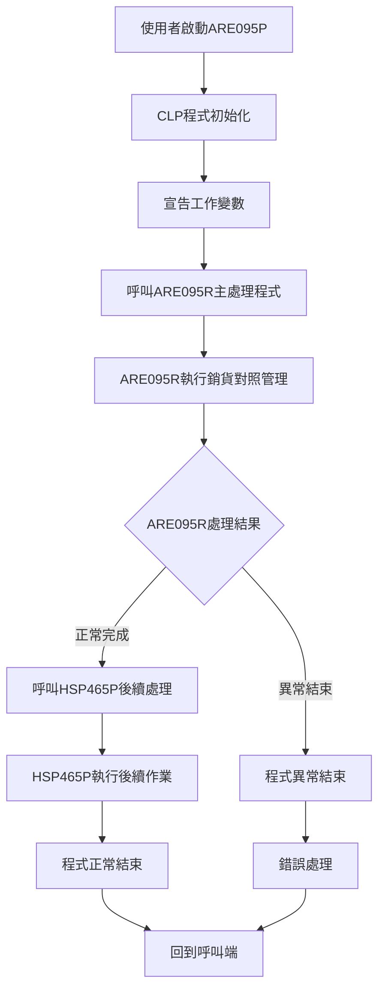
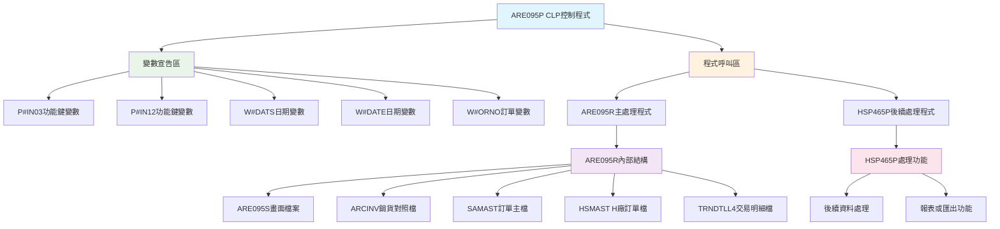
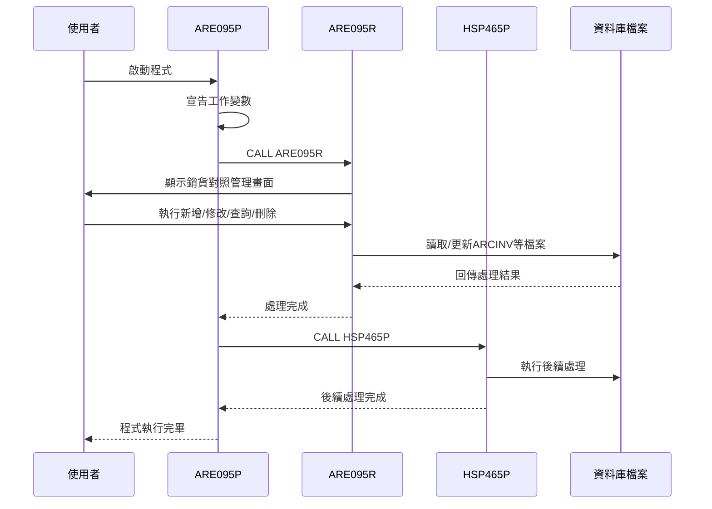
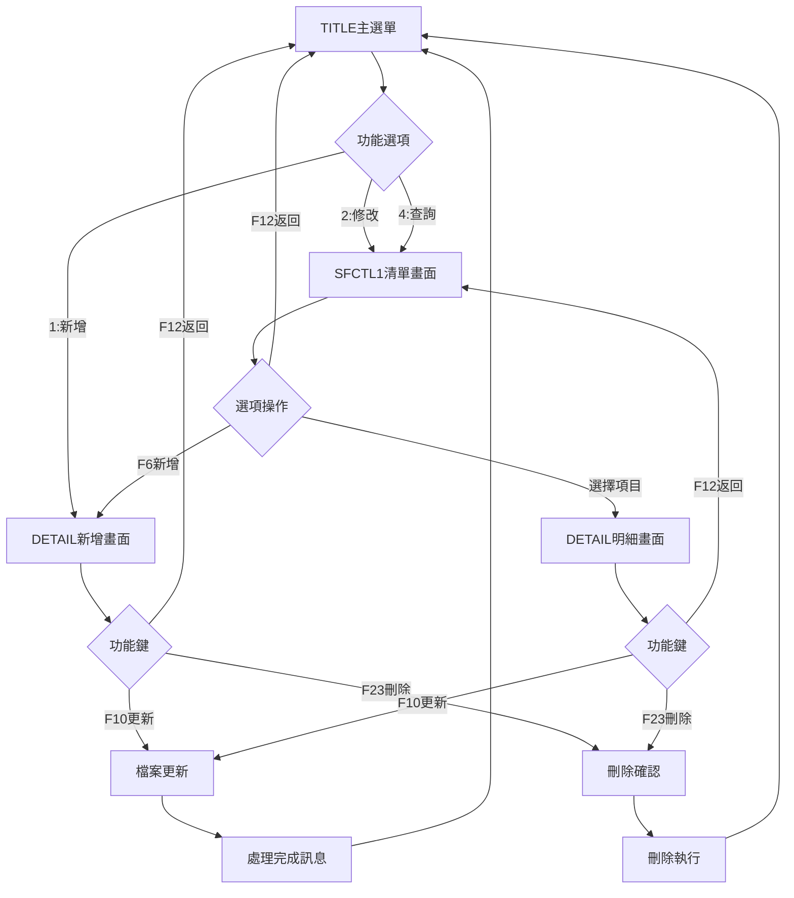
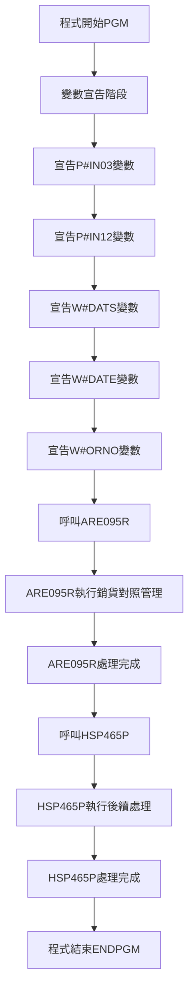
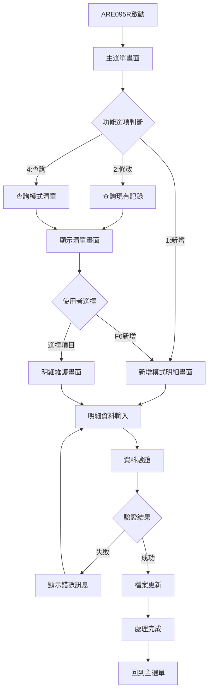
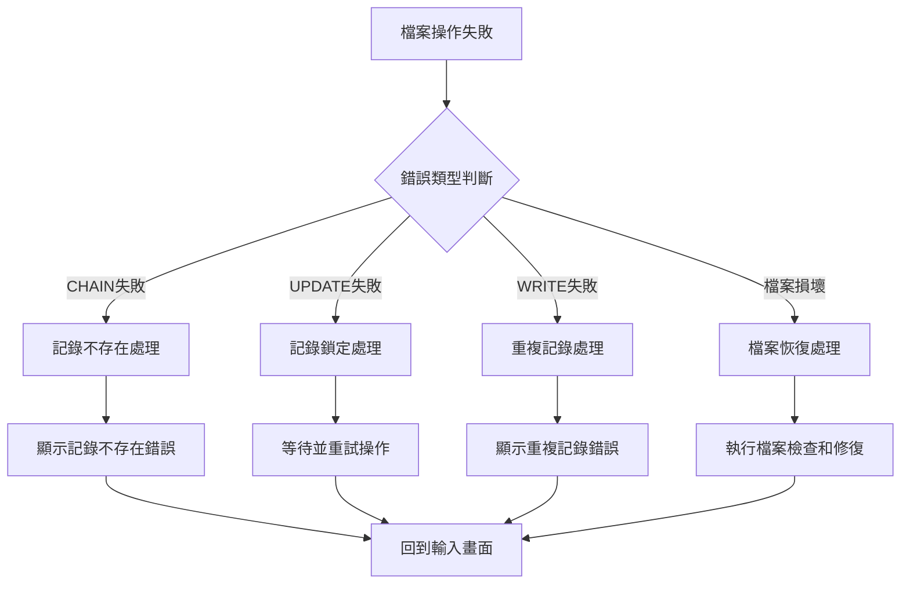

# ARE095P_P02 程式規格書

## 1. 基本資料

| 項目 | 內容 |
|------|------|
| **程式編號** | ARE095P |
| **程式名稱** | 銷貨與出貨對照管理作業 |
| **程式類型** | CLP |
| **廠區** | P02 |
| **系統名稱** | 應收帳款系統 |
| **子系統** | 銷貨出貨管理 |
| **檔案位置** | P02CLSRC_THSRC/ARE095P.txt |

## 2. 🎯 程式功能說明

### 主要功能描述
ARE095P為銷貨與出貨對照管理作業的控制程式，作為整個銷貨對照管理系統的入口點。此CLP程式負責變數宣告、程式流程控制，並依序呼叫ARE095R主處理程式和HSP465P後續處理程式，提供完整的銷貨與出貨對照資料的建立、修改、查詢和刪除功能。

### 🎯 業務流程詳細說明

#### 完整業務流程圖


#### 業務流程關鍵階段說明

1. **程式啟動階段**：
   - CLP程式ARE095P作為主控程式啟動
   - 初始化程式執行環境
   - 準備必要的工作變數和參數

2. **變數宣告階段**：
   - 宣告P#IN03和P#IN12功能鍵控制變數
   - 宣告W#DATS和W#DATE日期處理變數
   - 宣告W#ORNO訂單號碼處理變數
   - 建立與ARE095R程式的參數傳遞介面

3. **主處理程式呼叫階段**：
   - 呼叫ARE095R主處理程式
   - ARE095R執行銷貨對照的核心業務邏輯
   - 包含新增、修改、查詢、刪除等完整功能

4. **後續處理程式呼叫階段**：
   - 呼叫HSP465P執行後續處理作業
   - 可能包含資料匯出、報表產生或系統整合功能
   - 完成整個業務流程的後續作業

5. **程式結束階段**：
   - 所有子程式執行完畢
   - 清理暫存資料和釋放系統資源
   - 回到呼叫端程式或系統選單

#### 智能處理邏輯

**程式協調機制**：
- CLP作為控制層，負責程式流程的順序控制
- 確保ARE095R和HSP465P的正確執行順序
- 提供統一的錯誤處理和程式結束機制

**參數傳遞機制**：
- 通過宣告的工作變數實現程式間的資料傳遞
- 支援功能鍵狀態、日期和訂單號碼的參數傳遞
- 確保各子程式間的資料一致性

**模組化設計**：
- 將複雜的業務邏輯分離到專用的RPG程式
- CLP專注於流程控制和程式呼叫
- 提高系統的可維護性和可擴展性

#### 資料流向分析

**輸入資料流**：
- 使用者透過ARE095R程式輸入銷貨對照資料
- 系統參數和設定檔案的載入
- 外部系統介面資料的匯入

**處理資料流**：
- ARE095R執行銷貨對照的CRUD操作
- 資料驗證和邏輯檢查
- 檔案更新和狀態維護

**輸出資料流**：
- 更新的銷貨對照檔案資料
- HSP465P產生的後續處理結果
- 系統日誌和稽核記錄

## 3. 🎯 檔案架構與關聯圖

### 使用檔案清單
| 檔案名稱 | 檔案類型 | 使用方式 | 說明 |
|----------|----------|----------|------|
| ARE095R | RPG | 程式呼叫 | 主要處理程式，執行銷貨對照管理邏輯 |
| HSP465P | 程式 | 程式呼叫 | 後續處理程式，執行相關後續作業 |

### 🎯 檔案關聯詳細視覺化圖表


### 🎯 程式執行序列圖


## 4. 🎯 檔案欄位規格說明

### CLP變數定義

#### 功能鍵控制變數
| 變數名稱 | 型態 | 長度 | 說明 |
|----------|------|------|------|
| P#IN03 | *CHAR | 1 | F3結束功能鍵狀態控制 |
| P#IN12 | *CHAR | 1 | F12返回功能鍵狀態控制 |

#### 日期處理變數
| 變數名稱 | 型態 | 長度 | 說明 |
|----------|------|------|------|
| W#DATS | *CHAR | 8 | 出貨開始日期工作變數 |
| W#DATE | *CHAR | 8 | 出貨結束日期工作變數 |

#### 業務資料變數
| 變數名稱 | 型態 | 長度 | 說明 |
|----------|------|------|------|
| W#ORNO | *CHAR | 6 | 訂單號碼工作變數 |

### 🎯 變數用途詳細分析

#### 功能鍵變數用途
```
P#IN03用途：
- 控制F3結束功能的執行
- 與ARE095R程式的功能鍵處理協調
- 提供統一的程式結束機制

P#IN12用途：
- 控制F12返回功能的執行
- 支援多層畫面的返回導航
- 維護使用者操作的一致性
```

#### 日期變數用途
```
W#DATS用途：
- 儲存出貨開始日期
- 支援日期範圍查詢和篩選
- 與ARE095R的日期處理邏輯配合

W#DATE用途：
- 儲存出貨結束日期
- 完成日期範圍的定義
- 提供期間查詢的參數傳遞
```

#### 業務變數用途
```
W#ORNO用途：
- 儲存訂單號碼
- 作為主要的業務鍵值傳遞
- 支援訂單相關的查詢和處理
```

### 🔍 重點欄位切割技術詳解

#### 變數宣告切割視覺化：
```
變數記錄：[型態__|長度_|變數名稱__|用途說明________________]
位置:     001-06 07-09 010-17     018-40
          ↓      ↓     ↓          ↓
功能鍵1:  [*CHAR|1____| &P#IN03___|F3結束功能鍵控制_________]
功能鍵2:  [*CHAR|1____| &P#IN12___|F12返回功能鍵控制________]
日期起:   [*CHAR|8____| &W#DATS___|出貨開始日期_____________]
日期迄:   [*CHAR|8____| &W#DATE___|出貨結束日期_____________]
訂單號:   [*CHAR|6____| &W#ORNO___|訂單號碼工作變數_________]
```

##### 變數宣告切割邏輯說明：
**切割策略**：型態標準化分配法，透過DCL指令的結構化參數定義實現統一變數規格控制
**關鍵技術**：
1. **型態統一化**：全部使用*CHAR字元型態，簡化參數傳遞和相容性
2. **長度最適化**：根據業務資料特性定義最佳的儲存長度配置
3. **命名規範化**：使用前綴(&P#、&W#)實現功能分類和識別管理
4. **用途功能化**：每個變數對應特定的業務功能和介面需求

**宣告邏輯**：
- 功能鍵變數：DCL VAR(&P#IN03) TYPE(*CHAR) LEN(1) - 1字元狀態控制
- 日期工作變數：DCL VAR(&W#DATS) TYPE(*CHAR) LEN(8) - 8字元YYYYMMDD格式
- 業務工作變數：DCL VAR(&W#ORNO) TYPE(*CHAR) LEN(6) - 6字元訂單編號

#### 程式呼叫序列切割視覺化：
```
執行序列：[ARE095P] → [ARE095R] → [HSP465P] → [ENDPGM]
階段:     控制程式    主處理      後續處理    程式結束
          ↓           ↓           ↓           ↓
初始化:   [ARE095P]                           CLP控制程式啟動
主處理:               [ARE095R]               銷貨對照管理邏輯
後處理:                           [HSP465P]   資料同步後續處理
結束:                                         [ENDPGM] 程式正常結束
```

##### 程式呼叫序列切割邏輯說明：
**切割策略**：三階段流水線處理法，透過CALL指令實現模組化的程式執行序列
**序列架構**：
1. **控制階段**：ARE095P負責變數宣告和流程控制
2. **處理階段**：ARE095R執行核心的銷貨對照管理邏輯
3. **後處理階段**：HSP465P執行資料同步和後續處理作業
4. **結束階段**：ENDPGM確保程式正常結束和資源釋放

**呼叫邏輯**：
- 階段1：CALL PGM(ARE095R) - 主要銷貨對照處理邏輯
- 階段2：CALL PGM(HSP465P) - 後續資料同步處理
- 階段3：ENDPGM - 程式執行完畢，釋放系統資源

#### 功能鍵狀態切割視覺化：
```
功能鍵：[P#IN03] 與 [P#IN12] = [狀態控制]
狀態:   F3控制    F12控制   操作結果
        ↓         ↓         ↓
F3狀態: ['0']                   F3未按下，繼續執行
F3狀態: ['1']                   F3已按下，程式結束
F12狀態:          ['0']         F12未按下，繼續執行
F12狀態:          ['1']         F12已按下，返回上層
```

##### 功能鍵狀態切割邏輯說明：
**切割策略**：二進制狀態映射法，透過字元'0'/'1'實現功能鍵狀態的精確控制
**狀態機制**：
1. **狀態編碼**：使用'0'和'1'字元代表功能鍵的按下狀態
2. **功能分離**：F3負責程式結束，F12負責返回上層功能
3. **狀態傳遞**：透過CLP變數將功能鍵狀態傳遞給ARE095R程式
4. **操作一致性**：維護整個系統功能鍵操作的統一性

**狀態邏輯**：
- P#IN03='0'：F3功能鍵未按下，程式繼續執行
- P#IN03='1'：F3功能鍵已按下，觸發程式結束流程
- P#IN12='0'：F12功能鍵未按下，維持當前畫面
- P#IN12='1'：F12功能鍵已按下，返回上一層選單

#### 日期範圍切割視覺化：
```
日期範圍：[W#DATS] 到 [W#DATE] = [查詢期間]
格式:     起始日期    結束日期    期間定義
          ↓           ↓           ↓
起始:     [20240301]              出貨開始日期
結束:                 [20240331]  出貨結束日期
期間:                             [2024年3月期間] 完整查詢範圍
```

##### 日期範圍切割邏輯說明：
**切割策略**：期間範圍定義法，透過起迄日期的組合實現靈活的時間範圍查詢
**範圍機制**：
1. **日期格式標準化**：統一使用YYYYMMDD 8字元格式
2. **範圍邊界定義**：W#DATS定義查詢下限，W#DATE定義查詢上限
3. **期間邏輯控制**：支援BETWEEN運算子的SQL查詢邏輯
4. **彈性查詢支援**：可設定任意日期範圍的出貨資料查詢

**範圍邏輯**：
- W#DATS：出貨開始日期，定義查詢期間的起始點
- W#DATE：出貨結束日期，定義查詢期間的結束點
- 查詢邏輯：WHERE 出貨日期 BETWEEN W#DATS AND W#DATE

#### 訂單號碼切割視覺化：
```
訂單號碼：[W#ORNO] = [業務鍵值]
格式:     訂單編號    業務識別
          ↓           ↓
編號:     [AR2024]    6字元訂單號碼
用途:                 [主要業務鍵值] 訂單查詢和處理識別
```

##### 訂單號碼切割邏輯說明：
**切割策略**：業務鍵值標準化法，透過6字元固定長度實現訂單號碼的統一管理
**鍵值機制**：
1. **長度標準化**：固定6字元長度，確保訂單編號的一致性
2. **業務鍵值**：作為訂單相關處理的主要識別依據
3. **查詢參數**：傳遞給ARE095R程式作為查詢條件
4. **資料關聯**：與訂單主檔SAMAST的關聯鍵值

**鍵值邏輯**：
- 格式：6字元英數字組合
- 用途：訂單查詢、銷貨對照、出貨管理的主要識別
- 傳遞：作為參數傳遞給ARE095R進行業務處理

#### 模組化架構切割視覺化：
```
架構層次：[CLP控制] + [RPG處理] + [同步處理] = [完整流程]
模組:     控制層      業務層      後處理層    系統整合
          ↓           ↓           ↓           ↓
控制層:   [ARE095P]                           流程控制和變數管理
業務層:               [ARE095R]               銷貨對照管理邏輯
後處理:                           [HSP465P]   資料同步和整合處理
整合:                                         [完整業務流程] 端到端處理
```

##### 模組化架構切割邏輯說明：
**切割策略**：三層架構分離法，透過CLP-RPG-處理程式的分工實現業務邏輯的模組化
**架構原理**：
1. **控制層分離**：CLP負責流程控制和參數管理，不涉及業務邏輯
2. **業務層集中**：RPG程式專注於核心業務邏輯處理
3. **後處理獨立**：HSP465P專門處理資料同步和系統整合
4. **模組間協作**：透過標準化的參數傳遞實現模組間通訊

**架構邏輯**：
- 控制層：ARE095P提供變數宣告、流程控制、程式呼叫
- 業務層：ARE095R執行銷貨與出貨對照的核心管理邏輯
- 後處理：HSP465P執行資料同步、整合、後續處理作業
- 系統性：三個模組協作完成完整的銷貨對照管理業務流程

### 🎯 ARE095R主處理程式規格概要

#### 主要檔案操作
| 檔案名稱 | 檔案類型 | 使用方式 | 主要用途 |
|----------|----------|----------|----------|
| ARE095S | DSPF | 畫面顯示 | 銷貨對照管理操作介面 |
| ARCINV | PF | 更新 | 銷貨發票對照主檔 |
| ARCINVL1 | LF | 查詢 | 銷貨發票邏輯檔1 |
| ARCINVL2 | LF | 查詢 | 銷貨發票邏輯檔2 |
| SAMAST | PF | 查詢 | 訂單主檔 |
| HSMAST | PF | 查詢 | H廠訂單主檔 |
| TRNDTLL4 | LF | 查詢 | 交易明細邏輯檔 |

#### 主要處理功能
| 功能代碼 | 功能說明 | 處理方式 |
|----------|----------|----------|
| 1 | 新增銷貨對照 | 建立新的銷貨發票對照記錄 |
| 2 | 修改銷貨對照 | 更新現有的銷貨發票對照記錄 |
| 4 | 查詢銷貨對照 | 顯示銷貨發票對照記錄詳細資訊 |
| 23 | 刪除銷貨對照 | 刪除銷貨發票對照記錄 |

## 5. 🎯 輸出/入螢幕布局

### CLP程式流程示意

```
+----------------------------------------------------------+
|                    ARE095P CLP控制程式                    |
|                                                          |
|  ┌─────────────────────────────────────────────────────┐  |
|  │               變數宣告區                             │  |
|  │  DCL VAR(&P#IN03) TYPE(*CHAR) LEN(1)               │  |
|  │  DCL VAR(&P#IN12) TYPE(*CHAR) LEN(1)               │  |
|  │  DCL VAR(&W#DATS) TYPE(*CHAR) LEN(8)               │  |
|  │  DCL VAR(&W#DATE) TYPE(*CHAR) LEN(8)               │  |
|  │  DCL VAR(&W#ORNO) TYPE(*CHAR) LEN(6)               │  |
|  └─────────────────────────────────────────────────────┘  |
|                           ↓                              |
|  ┌─────────────────────────────────────────────────────┐  |
|  │               主處理程式呼叫                         │  |
|  │          CALL PGM(ARE095R)                          │  |
|  │     [執行銷貨對照管理主要功能]                       │  |
|  └─────────────────────────────────────────────────────┘  |
|                           ↓                              |
|  ┌─────────────────────────────────────────────────────┐  |
|  │               後續處理程式呼叫                       │  |
|  │          CALL PGM(HSP465P)                          │  |
|  │       [執行相關後續處理作業]                         │  |
|  └─────────────────────────────────────────────────────┘  |
|                           ↓                              |
|                      程式結束                            |
+----------------------------------------------------------+
```

### ARE095R主要畫面配置概要

#### 主選單畫面(TITLE)
```
+----------------------------------------------------------+
|  YY/MM/DD      東鋼鋼鐵股份有限公司              ARE095S-1 |
|                **銷貨與出貨對照管理作業**        DEVNAME  |
|                                                          |
|                                                          |
|                                                          |
|                                                          |
|                                                          |
|                                                          |
|                        功能選項: [X]                     |
|                              (1:新增2:修改4:查詢)        |
|                                                          |
|                        訂單單號: [______]                |
|                                                          |
|                        銷貨年月: [______]                |
|                    (功能選項2或4時，訂單代號或銷貨年月擇一輸入) |
|                                                          |
|                                                          |
|                                                          |
|                                                          |
|                                                          |
|                                                          |
|  [錯誤訊息顯示區域]                                      |
|  ENTER:確認    PF03:結束                                 |
+----------------------------------------------------------+
```

#### 清單顯示畫面(SFCTL1)
```
+----------------------------------------------------------+
|  YY/MM/DD      東鋼鋼鐵股份有限公司              ARE095S-2 |
|  [模式]        **銷貨與出貨對照管理作業**                |
|                                                          |
|  銷貨修改                                                |
|  -------------------------------------------------------- |
|                                                          |
|  -------------------------------------------------------- |
|  選項 訂單     申請單號           客戶代號 金額    建立日期 |
|  ===========================================================|
|  [X] [____] [__________________] [____] [______] [YY/MM/DD]|
|  [X] [____] [__________________] [____] [______] [YY/MM/DD]|
|  [X] [____] [__________________] [____] [______] [YY/MM/DD]|
|  [X] [____] [__________________] [____] [______] [YY/MM/DD]|
|  [X] [____] [__________________] [____] [______] [YY/MM/DD]|
|  [X] [____] [__________________] [____] [______] [YY/MM/DD]|
|  [X] [____] [__________________] [____] [______] [YY/MM/DD]|
|  [X] [____] [__________________] [____] [______] [YY/MM/DD]|
|  [X] [____] [__________________] [____] [______] [YY/MM/DD]|
|  [X] [____] [__________________] [____] [______] [YY/MM/DD]|
|  [X] [____] [__________________] [____] [______] [YY/MM/DD]|
|  ===========================================================|
|  --------------------------------------------------------- |
|  [錯誤訊息顯示區域]                                      |
|  ENTER:檢核  PF03:結束  PF06:新增  PF12:返回主畫面     |
+----------------------------------------------------------+
```

#### 明細維護畫面(DETAIL)
```
+----------------------------------------------------------+
|  YY/MM/DD      東鋼鋼鐵股份有限公司              ARE095S-3 |
|  [模式]        **銷貨與出貨對照管理作業**        DEVNAME  |
|                                                          |
|                                                          |
|                      訂單代號: [______]                  |
|                                                          |
|                      申請單號: [__________________]      |
|                                                          |
|                      銷貨廠區: [X]                       |
|                                                          |
|                      建立日期: [YY/MM/DD]                |
|                                                          |
|                      出貨日期: [YY/MM/DD]~[YY/MM/DD]     |
|                                                          |
|                      匯率倍率: [_____.__]                |
|                                                          |
|                    外幣金額總額: [_______.__]            |
|                                                          |
|                    台幣金額總額: [_______.__]            |
|                                                          |
|                      銷貨數量: [_______.__] (噸數)       |
|                                                          |
|  [錯誤訊息顯示區域]                                      |
|  ENTER:檢核  PF03:結束  PF10:更新  PF12:返回主畫面     |
|           PF23:刪除資料                                  |
+----------------------------------------------------------+
```

### 🎯 畫面流程控制

#### 畫面轉換邏輯


## 6. 🎯 處理流程程序說明

### 🎯 CLP主程序邏輯分析

#### 程式執行流程圖


#### 🎯 詳細處理步驟逐一分析

**步驟1：程式初始化**
- 執行PGM指令啟動CLP程式
- 建立程式執行環境
- 準備變數宣告和程式呼叫架構

**步驟2：變數宣告階段**
- 宣告P#IN03功能鍵控制變數，TYPE(*CHAR) LEN(1)
- 宣告P#IN12功能鍵控制變數，TYPE(*CHAR) LEN(1)  
- 宣告W#DATS日期處理變數，TYPE(*CHAR) LEN(8)
- 宣告W#DATE日期處理變數，TYPE(*CHAR) LEN(8)
- 宣告W#ORNO訂單號碼變數，TYPE(*CHAR) LEN(6)

**步驟3：主處理程式呼叫**
- 執行CALL PGM(ARE095R)指令
- 將控制權轉移到ARE095R RPG程式
- ARE095R執行銷貨對照管理的核心業務邏輯
- 包含新增、修改、查詢、刪除等完整功能

**步驟4：後續處理程式呼叫**
- 執行CALL PGM(HSP465P)指令
- 將控制權轉移到HSP465P程式
- 執行銷貨對照相關的後續處理作業
- 可能包含資料整合、報表處理等功能

**步驟5：程式結束**
- 執行ENDPGM指令結束CLP程式
- 釋放程式佔用的系統資源
- 回到呼叫端程式或系統選單

### 🎯 ARE095R主處理邏輯概要

#### 主要子程序結構
| 子程序名稱 | 功能說明 | 觸發條件 |
|------------|----------|----------|
| SR#01 | 主選單處理 | SCRN='1' |
| SR#02 | 清單畫面處理 | SCRN='2' |
| SR#03 | 明細畫面處理 | SCRN='3' |
| KC#01 | F3結束處理 | *IN03='1' |
| KL#01 | F12返回處理 | *IN12='1' |
| KJ#02 | F10更新處理 | *IN10='1' |
| CK#01 | 主選單驗證 | 條件檢查時 |
| CK#02 | 明細資料驗證 | 明細輸入時 |
| PR#021 | 子檔案載入1 | 有訂單號碼查詢 |
| PR#023 | 子檔案載入2 | 有年月查詢 |
| PR#022 | 明細畫面準備 | 進入明細維護 |
| FL#02 | 檔案更新控制 | 執行更新時 |
| WR#02 | 新增記錄 | W#CODE='1' |
| UP#02 | 修改記錄 | W#CODE='2' |

#### 業務邏輯處理流程


### 🎯 關鍵處理邏輯

#### 工廠權限控制
- H廠用戶不能執行修改功能(TXAR='H' AND S#CODE='2')
- 確保不同工廠間的資料安全性
- 維護工廠作業的獨立性

#### 訂單驗證機制
- 新增時檢查訂單號碼在TXREC檔案的存在性
- 確保只能對有效訂單建立銷貨對照
- 避免建立無效的銷貨對照記錄

#### 資料完整性控制
- 必填欄位驗證：申請單號、銷貨廠區、建立日期等
- 日期邏輯驗證：建立日期不可大於系統日期
- 數值合理性驗證：匯率、金額、數量必須大於0

## 7. 🎯 數據操作與轉換分析

### CLP變數資料型態分析

#### 字元型變數處理
```
功能鍵變數處理：
P#IN03, P#IN12 = TYPE(*CHAR) LEN(1)
用於儲存功能鍵的ON/OFF狀態
與RPG程式的指示器配合使用

日期變數處理：
W#DATS, W#DATE = TYPE(*CHAR) LEN(8)
儲存YYYYMMDD格式的日期資料
支援日期範圍查詢和期間處理

訂單變數處理：
W#ORNO = TYPE(*CHAR) LEN(6)
儲存6位數的訂單號碼
作為主要的業務鍵值傳遞
```

#### 程式間參數傳遞
```
CLP到RPG參數傳遞：
透過共用資料區域(UDS)或全域變數
確保資料的一致性傳遞
支援雙向的資料交換

RPG到HSP465P參數傳遞：
可能透過檔案或參數清單
確保後續處理的資料完整性
維護整個處理流程的連貫性
```

### ARE095R檔案操作分析

#### 讀取操作
```
ARCINV檔案讀取：
CHAIN操作：隨機存取特定記錄
SETLL + READPE：範圍查詢
READ操作：循序讀取

SAMAST/HSMAST檔案讀取：
驗證訂單存在性
取得客戶資訊
確認訂單狀態
```

#### 更新操作
```
新增記錄(WR#02)：
建立新的ARCINV記錄
設定R1FLAG='A'(新增)
記錄建立時間和人員

修改記錄(UP#02)：
更新現有ARCINV記錄
設定R1FLAG='C'(修改)
記錄更新時間和人員

刪除記錄：
設定R1FLAG='D'(刪除)
保留稽核軌跡
避免實體刪除
```

### 資料轉換邏輯

#### 日期格式轉換
```
系統日期轉換：
*DATE - 19000000 = 民國年格式
YYYYMMDD轉換為YY/MM/DD顯示格式
支援UTS102R日期檢核程式驗證
```

#### 訂單號碼處理
```
訂單結構分解：
S#ORNO → D#AREA(廠區) + D#ORNO(號碼)
支援多廠區的訂單管理
確保訂單號碼的唯一性
```

#### 客戶資料處理
```
客戶代號分解：
D#CUNO → D#KIND + D#CUN1 + D#CUN2 + D#CUN3
支援複雜的客戶編碼結構
提供客戶資訊的完整識別
```

### 計算邏輯分析

#### 匯率計算
```
外幣轉台幣計算：
台幣金額 = 外幣金額 × 匯率倍率
提供精確的匯率轉換
支援多幣別的處理
```

#### 序號產生
```
自動序號邏輯：
取得最大序號 + 1
確保序號的連續性
避免序號重複
```

### 檢核機制詳解

#### 必填欄位檢核
```
申請單號檢核：S#APNO不可空白
銷貨廠區檢核：S#ARED必須為H/K/U/N
建立日期檢核：S#CDTD必須為有效日期
匯率倍率檢核：S#TRAT必須大於0
金額檢核：S#FCUR, S#AMT必須大於0
數量檢核：S#QTY必須大於0
```

#### 邏輯檢核
```
日期邏輯檢核：
建立日期不可大於系統日期
起始日期不可大於結束日期

權限檢核：
H廠用戶不可執行修改功能
確保操作權限的正確性

存在性檢核：
訂單號碼必須在SAMAST/HSMAST存在
客戶代號必須有效
```

## 8. 🎯 錯誤處理程序說明

### 🎯 CLP層級錯誤處理

#### 程式呼叫失敗處理
| 錯誤狀況 | 處理方式 | 預防措施 |
|----------|----------|----------|
| **ARE095R程式不存在** | 1. 檢查程式庫清單<br>2. 顯示程式未找到錯誤<br>3. 結束CLP程式<br>4. 記錄錯誤日誌 | 確保ARE095R程式存在於指定程式庫中 |
| **HSP465P程式不存在** | 1. 忽略HSP465P呼叫錯誤<br>2. 記錄警告訊息<br>3. 繼續執行程式結束<br>4. 不影響主要功能 | 檢查HSP465P程式的可用性和必要性 |
| **參數傳遞錯誤** | 1. 檢查變數宣告<br>2. 確認資料型態匹配<br>3. 重置變數初值<br>4. 重新呼叫程式 | 確保變數宣告的正確性和一致性 |

#### 系統資源錯誤處理
| 錯誤狀況 | 處理方式 | 復原機制 |
|----------|----------|----------|
| **記憶體不足** | 1. 釋放不必要的變數<br>2. 清理暫存資料<br>3. 重新分配記憶體<br>4. 如失敗則結束程式 | 優化變數使用，減少記憶體佔用 |
| **檔案鎖定衝突** | 1. 等待檔案釋放<br>2. 重試檔案操作<br>3. 顯示系統忙碌訊息<br>4. 提供重試選項 | 實施檔案鎖定的超時機制 |

### 🎯 ARE095R詳細錯誤代碼清冊

| 錯誤代碼 | 錯誤訊息 | 原因說明 | 處理方式 | 預防措施 |
|----------|---------|---------|---------|----------|
| **ERR,1** | 功能選項請擇一輸入 | 主選單未選擇功能選項 | 1. 設定IN41='1'啟動選項欄位錯誤<br>2. 欄位反白顯示錯誤<br>3. 要求輸入有效選項<br>4. 提供選項說明 | 明確標示功能選項的輸入要求 |
| **ERR,2** | 功能選項輸入錯誤，重輸 | 輸入無效的功能選項 | 1. 設定IN41='1'啟動選項欄位錯誤<br>2. 顯示有效選項範圍<br>3. 清除錯誤輸入<br>4. 重新輸入正確選項 | 提供功能選項的有效值列表 |
| **ERR,3** | 訂單單號請擇一輸入 | 修改或查詢時未輸入訂單號碼或年月 | 1. 設定IN42和IN43錯誤指示器<br>2. 反白相關輸入欄位<br>3. 說明輸入要求<br>4. 提供輸入格式範例 | 明確說明訂單號碼和年月的擇一輸入要求 |
| **ERR,4** | 該訂單單號不存在 | 輸入的訂單號碼在SAMAST/HSMAST中不存在 | 1. 設定IN42='1'啟動訂單欄位錯誤<br>2. 顯示訂單不存在錯誤<br>3. 建議檢查訂單號碼<br>4. 提供訂單查詢功能 | 實施訂單號碼的即時驗證機制 |
| **ERR,5** | 申請單號不可空白 | 明細畫面中申請單號未輸入 | 1. 設定IN51='1'啟動申請單號錯誤<br>2. 欄位反白顯示<br>3. 要求輸入申請單號<br>4. 提供申請單號格式說明 | 明確標示申請單號為必填欄位 |
| **ERR,6** | 銷貨廠區輸入錯誤 | 廠區代碼不是H/K/U/N其中之一 | 1. 設定IN52='1'啟動廠區欄位錯誤<br>2. 顯示有效廠區代碼<br>3. 要求重新輸入<br>4. 提供廠區代碼選擇 | 提供廠區代碼的下拉選單或驗證 |
| **ERR,7** | 建立日期輸入錯誤 | 日期格式不正確或日期不存在 | 1. 設定IN53='1'啟動日期欄位錯誤<br>2. 呼叫UTS102R檢核日期<br>3. 顯示正確日期格式<br>4. 提供日期輸入輔助 | 使用標準日期檢核程式進行驗證 |
| **ERR,8** | 建立日期不可大於系統日期 | 輸入的建立日期超過當前系統日期 | 1. 設定IN53='1'啟動日期欄位錯誤<br>2. 顯示系統當前日期<br>3. 要求輸入合理日期<br>4. 說明日期邏輯限制 | 實施日期邏輯檢查機制 |
| **ERR,9** | 起始出貨日期輸入錯誤 | 起始出貨日期格式錯誤 | 1. 設定IN54='1'啟動起始日期錯誤<br>2. 提供正確日期格式範例<br>3. 重新輸入日期<br>4. 使用日期輸入輔助工具 | 提供日期格式的明確說明和範例 |
| **ERR,10** | 起始出貨日期不可大於系統日期 | 起始日期超過系統日期 | 1. 設定IN54='1'啟動起始日期錯誤<br>2. 顯示日期邏輯錯誤<br>3. 要求輸入合理日期範圍<br>4. 說明業務邏輯限制 | 實施起始日期的邏輯檢查 |
| **ERR,11** | 匯率倍率請務必輸入 | 匯率倍率欄位為0或空白 | 1. 設定IN56='1'啟動匯率欄位錯誤<br>2. 要求輸入有效匯率<br>3. 提供匯率輸入建議<br>4. 說明匯率的重要性 | 明確標示匯率為必填且必須大於0 |
| **ERR,15** | 請選擇或查詢該資料，再重新選擇欄位前置選項 | 子檔案選項輸入錯誤 | 1. 設定IN40='1'啟動選項錯誤<br>2. 清除錯誤選項<br>3. 說明正確的選項操作<br>4. 提供操作指引 | 提供清楚的子檔案操作說明 |
| **ERR,17** | 銷貨資料已修改完成 | 修改操作成功完成 | 1. 顯示成功訊息<br>2. 更新畫面資料<br>3. 回到主選單或清單<br>4. 記錄操作日誌 | 提供明確的操作完成確認 |
| **ERR,18** | 在查詢功能下，不可新增資料 | 查詢模式下嘗試新增 | 1. 顯示功能限制訊息<br>2. 說明查詢模式的限制<br>3. 建議使用新增功能<br>4. 引導正確的操作流程 | 明確區分不同功能模式的操作限制 |
| **ERR,19** | 銷貨資料已新增完成 | 新增操作成功完成 | 1. 顯示成功訊息<br>2. 清除輸入資料<br>3. 準備下一筆新增<br>4. 記錄新增日誌 | 提供新增完成的明確回饋 |
| **ERR,20** | 在修改功能下，查不到該修改資料不存在 | 修改時找不到指定記錄 | 1. 設定IN51='1'錯誤狀態<br>2. 建議重新查詢<br>3. 檢查輸入條件<br>4. 提供資料存在性說明 | 確保修改前的資料存在性檢查 |
| **ERR,24** | 外幣金額總額請務必輸入 | 外幣金額為0或空白 | 1. 設定IN57='1'啟動外幣金額錯誤<br>2. 要求輸入有效金額<br>3. 提供金額輸入格式<br>4. 說明金額的必要性 | 明確標示外幣金額為必填欄位 |
| **ERR,25** | 台幣金額總額請務必輸入 | 台幣金額為0或空白 | 1. 設定IN58='1'啟動台幣金額錯誤<br>2. 要求輸入有效金額<br>3. 檢查匯率計算<br>4. 提供金額輸入協助 | 確保台幣金額的正確輸入和計算 |
| **ERR,26** | 銷貨數量請務必輸入 | 銷貨數量為0或空白 | 1. 設定IN59='1'啟動數量欄位錯誤<br>2. 要求輸入有效數量<br>3. 提供數量單位說明<br>4. 檢查數量合理性 | 明確標示銷貨數量為必填欄位 |
| **ERR,27** | 資料不存在 | 查詢條件沒有找到符合資料 | 1. 設定IN72='1'關閉子檔案顯示<br>2. 建議調整查詢條件<br>3. 提供查詢建議<br>4. 說明資料範圍 | 提供有效的查詢條件建議 |
| **ERR,28** | 請擇一輸入 | 查詢條件輸入不完整 | 1. 設定相關欄位錯誤指示器<br>2. 說明輸入要求<br>3. 提供輸入範例<br>4. 引導正確輸入 | 明確說明查詢條件的輸入要求 |
| **ERR,29** | 銷貨資料已刪除 | 刪除操作成功完成 | 1. 顯示刪除成功訊息<br>2. 更新清單顯示<br>3. 回到主畫面<br>4. 記錄刪除日誌 | 提供刪除操作的明確確認 |
| **ERR,30** | 請按F10確認刪除 | 刪除操作需要F10確認 | 1. 顯示確認提示<br>2. 等待F10確認<br>3. 提供取消選項<br>4. 說明刪除的影響 | 實施刪除操作的二次確認機制 |
| **ERR,31** | 不可修改! | H廠用戶嘗試執行修改功能 | 1. 設定IN41='1'功能選項錯誤<br>2. 顯示權限限制訊息<br>3. 說明H廠的操作限制<br>4. 建議使用查詢功能 | 明確定義不同廠區的操作權限 |
| **ERR,32** | 該訂單無相關資料異常，不可新增 | 新增時訂單在TXREC檔案中不存在 | 1. 設定IN42和IN49錯誤指示器<br>2. 顯示訂單驗證失敗<br>3. 建議檢查訂單有效性<br>4. 提供訂單查詢功能 | 實施新增前的訂單存在性檢查 |

### 🎯 系統異常處理邏輯

#### 檔案操作失敗處理


#### 使用者介面異常處理
- 畫面顯示異常時重新初始化畫面
- 子檔案載入失敗時提供重新載入選項
- 功能鍵響應異常時重置指示器狀態
- 提供友善的錯誤訊息和操作指引

## 9. 🎯 備註

### 🎯 特殊注意事項

#### CLP程式依賴性
ARE095P依賴ARE095R和HSP465P兩個子程式的正確執行，任一程式異常都可能影響整體功能，需要確保所有相關程式的可用性。

#### 廠區權限限制
H廠用戶不能執行修改功能，此權限控制在ARE095R中實施，修改權限規則時需要同步調整相關的驗證邏輯。

#### 訂單驗證機制
新增銷貨對照時必須確保訂單在TXREC檔案中存在，此驗證是業務邏輯的重要組成部分，不可略過或簡化。

#### 日期處理限制
所有日期欄位都使用8位數值格式(YYYYMMDD)，程式依賴UTS102R日期檢核程式，修改日期格式時需確保相關程式的相容性。

#### HSP465P程式功能
HSP465P為後續處理程式，具體功能需要進一步確認，可能包含資料匯出、報表產生或系統整合等功能。

#### 子檔案分頁限制
清單畫面的子檔案支援25筆記錄，每頁顯示13筆，當資料量較大時需要實施適當的分頁導航機制。

#### 匯率計算精確度
外幣與台幣的轉換計算需要注意精確度問題，建議使用適當的四捨五入機制確保計算結果的準確性。

#### 序號產生機制
新增記錄時的序號產生使用SETGT + READPE機制，在高並發環境下可能需要額外的鎖定機制確保序號唯一性。

#### 刪除操作安全性
刪除功能使用邏輯刪除(R1FLAG='D')而非實體刪除，確保重要資料的可恢復性和稽核軌跡的完整性。

#### 變數傳遞機制
CLP程式中宣告的變數可能透過UDS或其他機制與ARE095R進行資料交換，具體的傳遞方式需要確認實際的實作方法。 