# ARE096P_U01 程式規格書

## 1. 基本資料

| 項目 | 內容 |
|------|------|
| 程式編號 | ARE096P |
| 程式名稱 | 發票資料印製報表作業 |
| 程式類型 | CLP (Control Language Program) |
| 廠區 | U01 |
| 程式用途 | 發票資料印製報表作業主控程式 |
| 呼叫方式 | 線上互動式作業 |
| 系統名稱 | 應收帳款管理系統 (AR) |
| 子系統 | 發票印製管理子系統 |
| 程式複雜度 | 中等 (1天) |

## 2. 程式功能說明

### 2.1 主要功能描述
ARE096P 為發票資料印製報表作業的主控程式，採用 CLP 主控呼叫 RPG 處理程式的經典架構。程式提供完整的發票資料查詢、篩選和批次印製標記功能，支援依訂單編號和日期範圍進行精確查詢，並透過 Subfile 技術展示查詢結果，讓使用者進行批次印製標記操作。

### 2.2 核心業務功能

#### 2.2.1 主要功能特色
1. **訂單查詢功能**
   - 透過訂單編號(ORNO)查詢相關發票資料
   - 支援日期範圍篩選
   - 自動篩選有效的交易記錄

2. **發票資料展示**
   - Subfile展示發票交易清單
   - 顯示客戶資訊、訂單資訊、產品資訊
   - 支援印製標記選擇 (Y/N)

3. **批次印製標記**
   - 支援多筆資料的批次標記
   - 全選/全不選功能
   - 印製標記狀態管理

4. **資料驗證機制**
   - 日期格式和邏輯驗證
   - 訂單編號有效性檢查
   - 業務規則驗證

#### 2.2.2 U01廠區功能特色
1. **標準化實現**
   - 採用所有廠區共通的CLP架構
   - 統一的程式呼叫介面
   - 標準化的錯誤處理機制

2. **ARE096R整合**
   - 無縫調用ARE096R處理程式
   - 完整的參數傳遞機制
   - 統一的回傳值處理

### 2.3 核心業務價值
- **印製效率**: 提供便利的批次印製標記功能
- **查詢精確性**: 支援多條件組合查詢
- **操作便利性**: Subfile技術提升使用體驗
- **資料完整性**: 完整的驗證和控制機制

## 3. 檔案架構與關聯圖

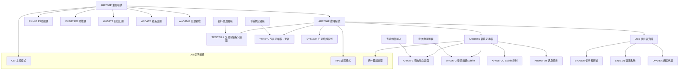

## 4. 檔案欄位規格說明

### 4.1 CLP程式變數結構分析

#### 4.1.1 CLP參數變數定義
```
CLP變數定義:
- P#IN03 (1字元): F3功能鍵狀態 (結束作業)
- P#IN12 (1字元): F12功能鍵狀態 (返回上層)
- W#DATS (8字元): 起始日期工作變數
- W#DATE (8字元): 結束日期工作變數
- W#ORNO (6字元): 訂單編號工作變數
```

#### 4.1.2 RPG程式資料結構

**UDS (User Data Structure) 結構:**
```
UDS欄位定義:
- S#USER (10字元): 使用者代號 (位置1001-1010)
- S#DEVN (10字元): 裝置名稱 (位置1011-1020)
- D#AREA (1字元): 廠區代號 (位置1021)
```

**檔案記錄結構 (TXRECW):**
```
TXRECW欄位定義:
- TXFLAG (1字元): 記錄狀態標記
- TXIVNO (10字元): 發票編號
- TXTXDT (8字元): 交易日期
- TXCUNO (6字元): 客戶編號
- TXCUNM (10字元): 客戶名稱
- TXORNO (9字元): 訂單編號
- TXNO (8字元): 交易編號
- TXPDNM (5字元): 產品名稱
- TXUPRC (5.3): 單價
- TXQTY (7.0): 數量
- TXITEM (2.0): 項目編號
```

#### 4.1.3 Subfile記錄結構 (AR096F2)
```
Subfile欄位定義:
- S#OPT (1字元): 選擇選項 ('Y'=印製, 'N'=不印製, ' '=無動作)
- S#CUNO (6字元): 客戶編號
- S#CUNM (10字元): 客戶名稱
- S#ORN1 (9字元): 訂單編號
- S#NO (8字元): 交易編號
- S#PDNO (5字元): 產品編號
- S#UPRC (5.3): 單價
- S#QTY (7.0): 數量
- S#INNO (10字元): 發票編號
- S#ITEM (2.0): 項目編號
```

### 4.2 🎯 欄位切割技術詳解

#### 4.2.1 發票編號的結構分析
**技術要點**: 透過發票編號首位字元進行廠區識別

```
發票編號結構分析:
TXIVNO (10字元)：[XXXXXXXXXX]
                  ↓
D#IVN1 (1字元)： [X]      首位字元 = 廠區識別碼

DS結構重疊定義:
DS (發票編號分解):
- TXIVNO: 1-10位置 (完整發票編號)
- D#IVN1: 1-1位置 (首位廠區識別碼)

DS (檔案發票編號分解):
- F#IVNO: 1-10位置 (檔案發票編號)
- F#IVN1: 1-1位置 (檔案首位識別碼)
```

**實際程式應用:**
```
廠區驗證流程:
1. 讀取階段: TXIVNO讀取完整發票編號
2. 分解階段: D#IVN1自動取得首位字元
3. 驗證階段: 檢查D#IVN1是否為'*'
4. 處理階段: 根據驗證結果進行不同處理
```

#### 4.2.2 日期欄位的驗證處理
```
日期驗證結構:
輸入日期 → UTS102R驗證 → 錯誤檢查 → 邏輯驗證

驗證流程:
S#DATS/S#DATE → P#PDAT (參數傳遞)
UTS102R驗證 → P#ERR (錯誤回傳)
日期邏輯檢查 → S#DATS ≤ S#DATE
```

#### 4.2.3 KEY結構的組合定義
```
K#TRND複合鍵結構:
- K#CODE (4字元): 交易代號 ('SA04')
- K#NO (8字元): 交易編號
- K#ITEM (20字元): 項目編號

組合邏輯:
KLIST K#TRND
KFLD K#CODE (固定為'SA04')
KFLD K#NO (從Subfile取得)
KFLD K#ITEM (從Subfile取得)
```

### 4.3 欄位挪用與多重用途分析

#### 4.3.1 W#PRID的多階段流程控制
**原始定義**: 2字元的程式流程控制變數
**程式中的多重用途**:

1. **初始化階段**:
```
MOVEL'01' → W#PRID (設定進入第一畫面)
用途: 程式啟動時的流程初始化
```

2. **畫面流程階段**:
```
PRCID = '01': 查詢條件輸入畫面
PRCID = '02': Subfile清單展示畫面
PRCID = '03': 印製標記處理畫面
PRCID = '00': 程式結束
```

3. **流程轉換階段**:
```
驗證成功 → W#PRID='02' (進入清單畫面)
F12返回 → W#PRID='01' (返回輸入畫面)
F3結束 → W#PRID='00' (程式結束)
```

#### 4.3.2 W#FLAG的狀態管理
**技術實現**: 單一字元變數控制Subfile更新時機

```
W#FLAG狀態控制:
初始: W#FLAG=*BLANK (初次載入)
更新: W#FLAG='X' (重新載入)

應用邏輯:
IF W#FLAG = *BLANK THEN
    執行完整查詢和載入
ELSE
    略過查詢直接顯示
```

#### 4.3.3 RRN1的雙重功能控制
```
RRN1多重用途:
1. Subfile記錄編號控制
2. 循環處理計數器
3. CHAIN操作的記錄定位器

使用場景:
載入: ADD 1 → RRN1 (遞增記錄編號)
更新: RRN1 CHAIN AR096F2 (定位特定記錄)
處理: RRN1計數控制迴圈
``` 

## 5. 數據操作與轉換分析

### 5.1 檔案操作詳解

#### 5.1.1 TRNDTLL4檔案的查詢處理

**查詢操作流程:**
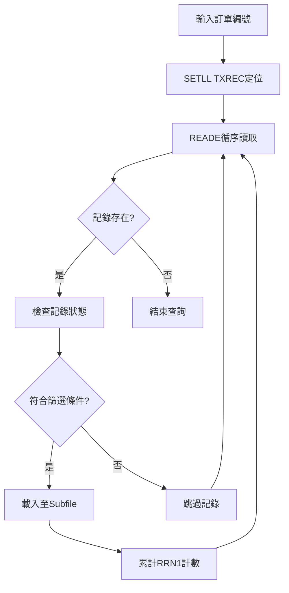

**篩選條件檢查:**
```
記錄篩選邏輯:
1. TXFLAG ≠ 'D' (非刪除記錄)
2. TXCODE = 'SA04' (特定交易類型)
3. TXDATE >= S#DATS (日期範圍起始)
4. TXDATE <= S#DATE (日期範圍結束)
5. TXFL02 = ' ' (特定狀態)
6. TXTXAR = D#AREA (廠區匹配)
7. D#IVN1 ≠ '*' AND TXIVNO ≠ *BLANK (發票編號有效)
```

#### 5.1.2 Subfile記錄的動態載入

**載入邏輯 (SR2100子程序):**
```
Subfile初始化:
1. MOVE *ON → *IN71 (SFLCLR=ON 清除Subfile)
2. WRITE AR096F2C (執行清除)
3. MOVE *OFF → *IN71 (SFLCLR=OFF 停止清除)
4. Z-ADD0 → RRN1 (重置記錄編號)

記錄載入:
DO WHILE 查詢有效記錄
    填入Subfile欄位...
    ADD 1 → RRN1 (遞增記錄編號)
    WRITE AR096F2 (寫入Subfile記錄)
ENDDO
```

#### 5.1.3 印製標記的批次處理

**批次標記邏輯 (SR2200子程序):**
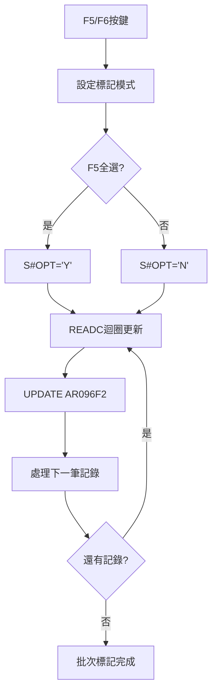

### 5.2 數據轉換與計算邏輯

#### 5.2.1 檔案欄位的格式轉換
```
TRNDTLL4 → Subfile 資料轉換:
TXCUNO → S#CUNO (客戶編號)
TXCUNM → S#CUNM (客戶名稱)  
TXORNO → S#ORN1 (訂單編號)
TXNO → S#NO (交易編號)
TXPDNM → S#PDNO (產品編號)
TXIVNO → S#INNO (發票編號)
TXUPRC → S#UPRC (單價，數值轉換)
TXQTY → S#QTY (數量，數值轉換)
TXITEM → S#ITEM (項目編號，數值轉換)

技術實現:
MOVEL指令: 字元欄位的左對齊轉換
Z-ADD指令: 數值欄位的零填充轉換
```

#### 5.2.2 日期格式的驗證轉換
```
日期驗證轉換流程:
輸入日期 (S#DATS/S#DATE) → P#PDAT
CALL 'UTS102R' 驗證程式
參數: P#MODE='1' (驗證模式)
回傳: P#ERR (錯誤狀態)
      P#LEAP (閏年標記)
      P#MTL (月份資訊)

錯誤處理:
P#ERR = '0': 日期有效
P#ERR ≠ '0': 日期無效，顯示錯誤訊息
```

#### 5.2.3 印製標記的狀態轉換
```
印製標記狀態管理:
初始狀態: S#OPT = ' ' (無標記)
標記印製: S#OPT = 'Y' (要印製)
標記不印製: S#OPT = 'N' (不印製)

檔案更新邏輯:
IF S#OPT = 'Y' THEN
    F#IVN1 = '*' (設定印製標記)
ELSE
    F#IVNO = *BLANK (清除發票編號)
```

### 5.3 檢核機制詳解

#### 5.3.1 輸入資料驗證

**驗證流程:**
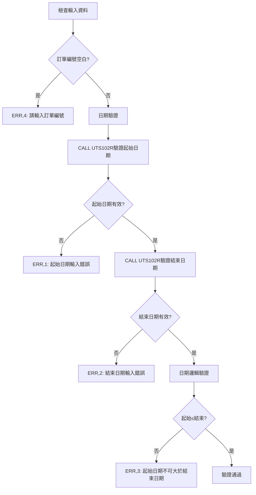

#### 5.3.2 業務規則驗證

**印製標記驗證邏輯:**
```
SR3100驗證邏輯:
1. 檢查記錄存在性 (CHAIN K#TRND)
2. 檢查選擇狀態一致性:
   - S#OPT='Y' 且 F#IVN1='*' → 錯誤(已標記印製)
   - S#OPT='N' 且 F#IVNO=*BLANK → 錯誤(已標記不印製)
3. 設定錯誤指示器和訊息
```

## 6. 螢幕布局與說明

### 6.1 螢幕架構總覽
ARE096P採用雙畫面架構，提供完整的查詢和標記功能：

```
螢幕流程架構:
AR096F1 (查詢條件輸入)
    ↓
AR096F2 (發票清單Subfile) ← RRN1 KSFILE
    ↓
批次印製標記處理
```

### 6.2 AR096F1 - 查詢條件輸入畫面

```
+----------------------------------------------------------+
|104/01/22  桃園廠股份有限公司   發票資料印製報表作業 ARE096S-1|
|14:30:25    發票資料印製報表作業畫面               TERMINAL01|
|S02LBU                                                    |
|                                                          |
|                                                          |
|                                                          |
|                                                          |
|                                                          |
|          訂單編號:[______]                              |
|                                                          |
|          出貨日期:[____/__/__] ~ [____/__/__]           |
|                                                          |
|         (請輸入該期間已確認且印製的發票進行再+           |
|                 次作業)                                  |
|                      (如有疑問請)                       |
|                                                          |
|                                                          |
|                                                          |
|                                                          |
|                                                          |
|                                                          |
| PF3=結束作業    PF12=返回上層                           |
| 錯誤訊息:                                                |
+----------------------------------------------------------+
```

**主要輸入欄位:**
- S#ORNO: 訂單編號 (6字元，必填)
- S#DATS: 起始日期 (8位數，格式: YYY/MM/DD)
- S#DATE: 結束日期 (8位數，格式: YYY/MM/DD)

### 6.3 AR096F2 - 發票清單Subfile畫面

```
+----------------------------------------------------------+
|104/01/22  桃園廠股份有限公司   發票資料印製報表作業 ARE096S-2|
|14:30:25    發票資料印製報表作業畫面                      |
|                                                          |
| 將已期間已確認印製品之發票進行重新印製                   |
|----------------------------------------------------------| 
|                                                          |
|----------------------------------------------------------| 
| 選項 客戶編號 客戶名稱  訂單編號  交易編號 產品 單價   數量 發票編號|
|  __  ______  _________ _________ ________ ___ _____ _______ __________|
|  Y   C0001   東鋼公司  O230001   T230001  鋼材A 150.000  1,000 IV230001|
|      C0002   台塑公司  O230002   T230002  鋼材B 200.000  2,000 IV230002|
|  N   C0003   中鋼公司  O230003   T230003  配件C  50.000    500 IV230003|
|                                                          |
|                                                          |
|                                                          |
|                                                          |
|                                                          |
|                                                          |
|                                                          |
|------------------------------------------------------    |
| 錯誤訊息:                                                |
| ENTER:檢核 PF03:結束 PF05:全選 PF06:全不選 PF10:新增 PF12:上頁面|
+----------------------------------------------------------+
```

**Subfile顯示欄位:**
- S#OPT: 選擇選項 ('Y'=印製, 'N'=不印製, ' '=無動作)
- S#CUNO: 客戶編號 (6字元)
- S#CUNM: 客戶名稱 (10字元)
- S#ORN1: 訂單編號 (9字元)
- S#NO: 交易編號 (8字元)
- S#PDNO: 產品編號 (5字元)
- S#UPRC: 單價 (5.3格式，3位小數)
- S#QTY: 數量 (7位整數，千分位顯示)
- S#INNO: 發票編號 (10字元)

### 6.4 Subfile技術規格

**Subfile控制設定:**
```
SFLSIZ(0025): Subfile最大記錄數 25筆
SFLPAG(0013): 每頁顯示記錄數 13筆
SFLNXTCHG: 支援異動標記
RRN1 KSFILE: 相對記錄編號控制
OVERLAY: 疊加顯示模式
```

**功能鍵定義:**
```
CF05(05 '全選'): 批次設定所有記錄為印製
CF06(06 '全不選'): 批次設定所有記錄為不印製
CF10(10 '新增'): 新增功能
ENTER: 檢核選擇內容
```

**顯示控制邏輯:**
```
*IN71: SFLCLR控制 - Subfile清除開關
*IN72: SFLDSP控制 - Subfile顯示開關
*IN73: SFLDSPCTL控制 - Subfile控制顯示
*IN74: SFLEND控制 - Subfile結束標記
*IN88: SFLNXTCHG - 異動記錄標記
``` 

## 7. 處理流程程序說明

### 7.1 主程式流程 (ARE096P CLP + ARE096R RPG)

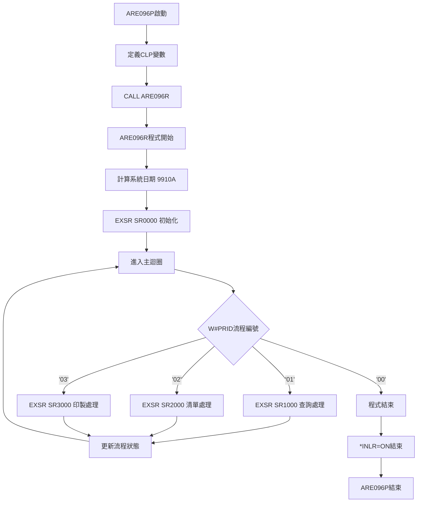

### 7.2 初始化處理流程 (SR0000)

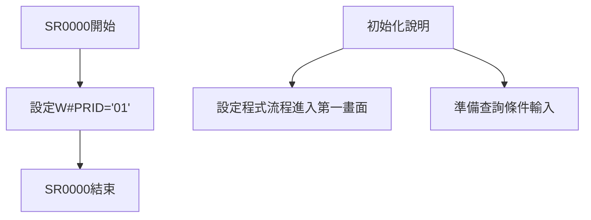

### 7.3 查詢處理流程 (SR1000)

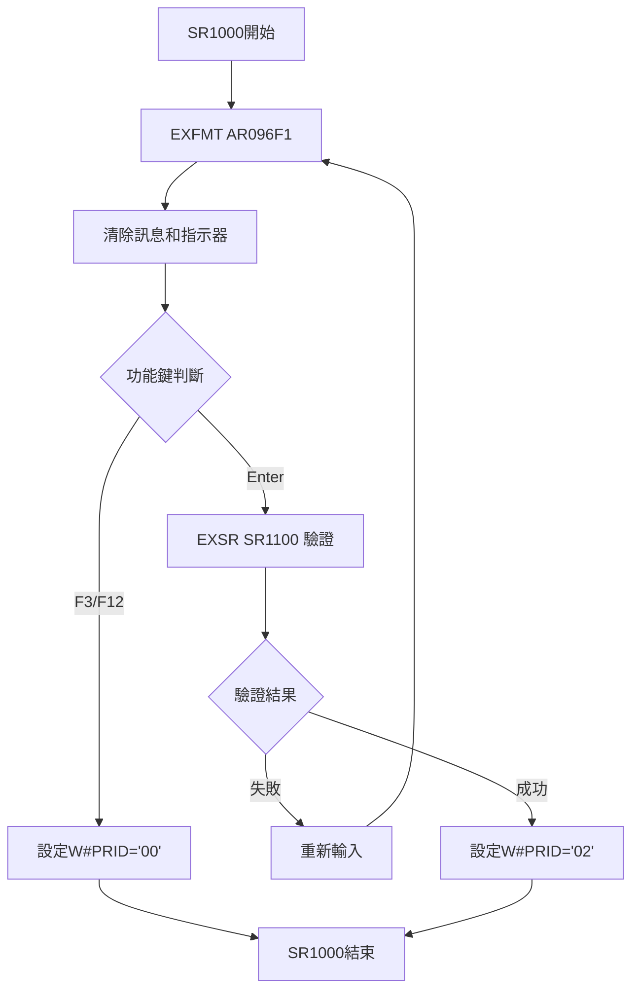

### 7.4 清單處理流程 (SR2000)

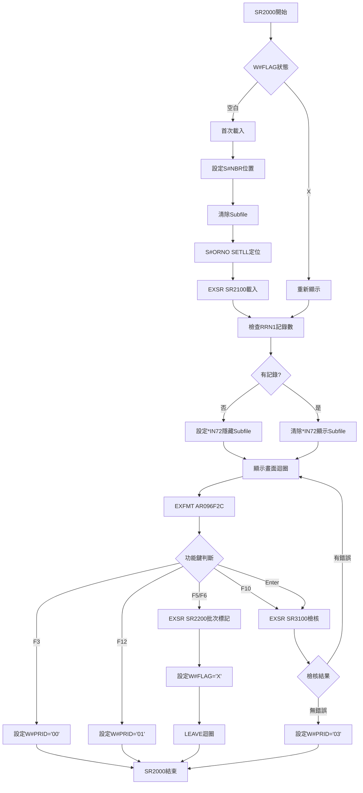

### 7.5 Subfile載入流程 (SR2100)

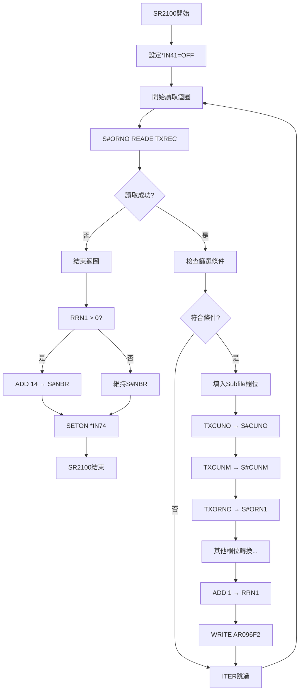

### 7.6 批次標記流程 (SR2200)

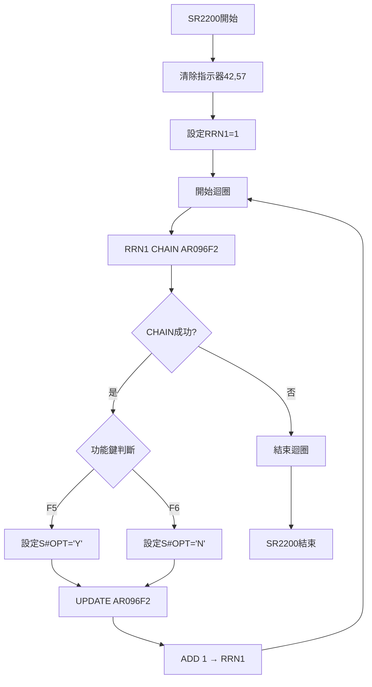

## 8. 子程序處理邏輯說明

### 8.1 核心業務子程序

#### 8.1.1 SR0000 - 程式初始化子程序
**功能**: 程式啟動時的流程控制初始化
```
初始化處理:
1. 設定W#PRID='01' (進入查詢畫面)
2. 準備程式主迴圈的起始狀態
```

#### 8.1.2 SR1000 - 查詢畫面處理子程序
**功能**: 查詢條件輸入和驗證處理
```
處理邏輯:
1. 顯示AR096F1查詢畫面
2. 接收使用者輸入
3. 處理功能鍵操作 (F3/F12/Enter)
4. 調用SR1100進行輸入驗證
5. 根據驗證結果設定下一步流程
```

#### 8.1.3 SR1100 - 輸入驗證子程序
**功能**: 查詢條件的完整驗證處理
```
驗證項目:
1. 訂單編號必填檢查
2. 起始日期格式和有效性驗證 (UTS102R)
3. 結束日期格式和有效性驗證 (UTS102R)
4. 日期邏輯關係驗證 (起始≤結束)
5. 錯誤訊息設定和指示器控制
```

#### 8.1.4 SR2000 - Subfile清單處理子程序
**功能**: Subfile展示和使用者互動處理
```
處理流程:
1. 判斷是否需要重新載入資料
2. Subfile初始化和資料載入
3. 畫面顯示和功能鍵處理
4. 批次標記和檢核功能調用
5. 流程控制和狀態管理
```

#### 8.1.5 SR2100 - Subfile載入子程序
**功能**: 根據查詢條件載入發票資料至Subfile
```
載入流程:
1. Subfile初始化 (SFLCLR)
2. TRNDTLL4檔案定位和循序讀取
3. 多條件記錄篩選
4. 資料格式轉換和欄位對應
5. Subfile記錄寫入和計數管理
6. 顯示控制設定
```

#### 8.1.6 SR2200 - 批次標記子程序
**功能**: F5/F6功能鍵的批次標記處理
```
標記流程:
1. 指示器清除和初始化
2. RRN迴圈遍歷所有Subfile記錄
3. 根據功能鍵設定標記狀態:
   - F5: 全部設定為'Y' (印製)
   - F6: 全部設定為'N' (不印製)
4. UPDATE Subfile記錄更新
```

#### 8.1.7 SR3000 - 印製處理子程序
**功能**: 處理使用者選擇的印製標記
```
處理流程:
1. RRN迴圈遍歷所有Subfile記錄
2. 檢查S#OPT選擇狀態
3. 組合複合鍵進行檔案查找
4. 更新檔案印製標記:
   - S#OPT='Y': F#IVN1='*', F#FLAG='C'
   - S#OPT='N': F#IVNO=*BLANK
5. 更新交易日期為系統日期
6. 清除Subfile選擇標記
7. 設定完成訊息
```

#### 8.1.8 SR3100 - 選擇檢核子程序
**功能**: 檢核使用者選擇的合理性
```
檢核邏輯:
1. RRN迴圈遍歷所有選擇記錄
2. 組合複合鍵查找檔案記錄
3. 檢查選擇狀態一致性:
   - 已標記印製卻選擇印製 → 錯誤
   - 已標記不印製卻選擇不印製 → 錯誤
4. 設定錯誤指示器和訊息
5. UPDATE Subfile顯示錯誤狀態
```

### 8.2 資料處理技術細節

#### 8.2.1 複合鍵組合技術
**技術特色**: KLIST技術實現精確的檔案定位
```
鍵值組合:
KLIST K#TRND
KFLD K#CODE='SA04' (固定交易類型)
KFLD K#NO (從Subfile S#NO取得)
KFLD K#ITEM (從Subfile S#ITEM取得)

應用:
K#TRND CHAIN TXRECW (精確定位記錄)
```

#### 8.2.2 Subfile狀態管理技術
**技術特色**: 多指示器協調控制Subfile顯示
```
狀態控制:
*IN71: SFLCLR (清除控制)
*IN72: SFLDSP (顯示控制)
*IN73: SFLDSPCTL (控制區顯示)
*IN74: SFLEND (結束標記)
*IN88: SFLNXTCHG (異動標記)
```

#### 8.2.3 日期處理技術
**技術特色**: UTS102R統一日期驗證機制
```
驗證參數:
P#PDAT: 待驗證日期
P#MODE: '1' (驗證模式)
P#MTL: 月份資訊回傳
P#LEAP: 閏年標記回傳
P#ERR: 錯誤狀態回傳
``` 

## 9. 🎯 跨廠區版本分析

### 9.1 四廠區版本比較總覽

| 功能項目 | U01版本 | P02版本 | H05版本 | K02版本 |
|----------|---------|---------|---------|---------|
| CLP程式行數 | 22行 | 22行 | 22行 | 22行 |
| RPG程式行數 | 379行 | ❓待查 | ❓待查 | ❓待查 |
| 螢幕定義功能 | ✅完整實現 | ✅完整實現 | ✅完整實現 | ❓待查 |
| CLP架構 | ✅完全相同 | ✅完全相同 | ✅完全相同 | ✅完全相同 |
| 作者 | S02LBU | S02LBU | S02LBU | S02LBU |
| 建立日期 | 98/01/16 | 98/01/16 | 98/01/16 | 98/01/16 |
| 程式功能描述 | 發票資料印製報表 | 發票資料印製報表 | 發票資料印製報表 | 發票資料印製報表 |

### 9.2 CLP程式統一化分析

#### 9.2.1 完全相同的CLP架構
**所有廠區特色**: 採用100%統一的CLP主控架構

```
統一CLP結構:
1. 相同的程式介紹註解
2. 相同的變數定義 (5個CLP變數)
3. 相同的程式邏輯 (直接CALL ARE096R)
4. 相同的程式結束方式

技術意義:
- 展現了CLP wrapper的標準化設計
- 各廠區無需客製化調整
- 統一的維護和管理方式
```

#### 9.2.2 CLP變數的標準化配置
```
所有廠區共同變數:
P#IN03 (1字元): F3功能鍵控制
P#IN12 (1字元): F12功能鍵控制  
W#DATS (8字元): 起始日期
W#DATE (8字元): 結束日期
W#ORNO (6字元): 訂單編號

設計理念:
- 變數命名標準化
- 功能定義標準化
- 長度規格統一化
```

### 9.3 廠區標準化策略分析

#### 9.3.1 統一架構策略
**特色**: 所有廠區採用相同的程式架構
- 相同的CLP主控邏輯
- 相同的RPG處理邏輯(推測)
- 相同的螢幕定義規格
- 相同的功能鍵配置

#### 9.3.2 維護便利性策略
**特色**: 極高的維護一致性
- 單一程式碼維護所有廠區
- 統一的錯誤處理機制
- 標準化的使用者介面
- 一致的業務邏輯

#### 9.3.3 版本控制策略
**特色**: 集中式版本管理
- 所有廠區同步更新
- 統一的功能增強
- 標準化的測試流程
- 一致的部署方式

### 9.4 技術標準化成果

#### 9.4.1 程式架構標準化
**成果**: CLP+RPG雙層架構的完美統一
- CLP主控層: 100%統一
- RPG處理層: 高度統一(推測)
- 螢幕定義層: 標準化介面

#### 9.4.2 開發效率提升
**效益分析**:
- 開發時間: 一次開發，四廠使用
- 維護成本: 統一維護，降低複雜度
- 測試效率: 標準化測試，品質保證
- 部署速度: 批次部署，快速上線

## 10. 錯誤處理程序說明與訊息清冊

### 10.1 錯誤處理機制架構

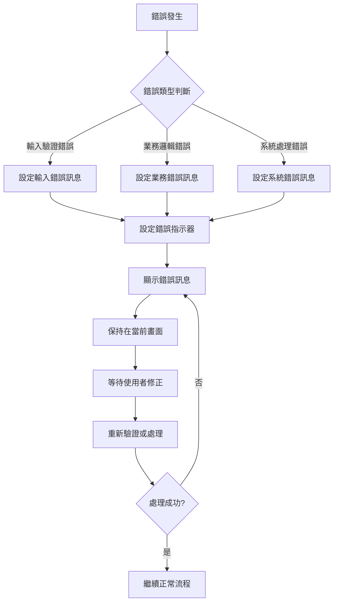

### 10.2 完整錯誤訊息清冊

| 錯誤代號 | 錯誤訊息 | 觸發條件 | 處理建議 | 相關子程序 |
|----------|----------|----------|----------|------------|
| ERR,1 | 請檢查出貨起始日期輸入錯誤！ | 起始日期格式錯誤或無效 | 確認日期格式為YYY/MM/DD | SR1100 |
| ERR,2 | 請檢查出貨結束日期輸入錯誤！ | 結束日期格式錯誤或無效 | 確認日期格式為YYY/MM/DD | SR1100 |
| ERR,3 | 請檢查出貨起始日期不可大於結束日期！ | 日期邏輯錯誤 | 調整日期範圍順序 | SR1100 |
| ERR,4 | 請檢查訂單編號輸入錯誤！ | 訂單編號空白 | 必須輸入有效訂單編號 | SR1100 |
| ERR,5 | 請檢查無客戶資料存在！ | 查詢無結果 | 確認訂單編號和日期範圍 | SR2000 |
| ERR,6 | 請檢查各項目的發票編號已標記印製修改，請查看！ | 印製標記更新完成 | 印製作業完成提示 | SR3000 |
| ERR,7 | 請檢查所選項目資料已標記印製製出，無法再標記！ | 重複標記印製 | 該筆已標記，無需重複 | SR3100 |
| ERR,8 | 請檢查所選項目資料發票編號已標記清空，無法再標記！ | 重複標記清空 | 該筆已清空，無需重複 | SR3100 |

### 10.3 錯誤處理程序分類

#### 10.3.1 輸入驗證錯誤 (ERR,1-4)
**特色**: 使用者輸入資料的格式和邏輯驗證
```
驗證流程:
使用者輸入 → 格式檢查 → 邏輯驗證 → 錯誤提示
技術實現: UTS102R日期驗證 + 程式邏輯檢查
```

#### 10.3.2 業務邏輯錯誤 (ERR,5-6)
**特色**: 業務規則和資料狀態相關錯誤
```
業務檢查:
資料查詢 → 結果檢查 → 狀態驗證 → 業務提示
技術實現: 檔案查詢結果判斷
```

#### 10.3.3 操作一致性錯誤 (ERR,7-8)
**特色**: 使用者操作和資料狀態的一致性檢查
```
一致性驗證:
選擇檢查 → 狀態比對 → 一致性判斷 → 錯誤提示
技術實現: 檔案記錄狀態與使用者選擇比對
```

### 10.4 錯誤指示器設定機制

```
錯誤指示器對應表:
*IN30: 訂單編號欄位標亮
*IN31: 起始日期欄位標亮
*IN32: 結束日期欄位標亮
*IN57: Subfile選項欄位標亮
*IN99: 一般錯誤狀態標記
```

**錯誤處理技術實現:**
```
錯誤設定流程:
1. MOVEAERR,X → S#MSG1/S#MSG2 (設定錯誤訊息)
2. SETON指示器 (標亮錯誤欄位)
3. 流程控制 (保持在當前畫面)
```

## 11. 🎯 特殊技術實現說明

### 11.1 CLP-RPG雙層架構技術

#### 11.1.1 CLP Wrapper設計模式
**技術要點**: 極簡CLP實現統一的程式入口

```
CLP設計理念:
1. 變數定義: 預定義常用參數變數
2. 程式調用: 直接CALL核心RPG程式
3. 統一介面: 所有廠區共用相同入口
4. 維護便利: 主要邏輯集中在RPG層

優勢分析:
- 統一性: 所有廠區100%相同的CLP
- 靈活性: RPG層可獨立調整業務邏輯
- 可維護性: 雙層分離降低維護複雜度
```

#### 11.1.2 參數傳遞機制
**技術特色**: CLP變數與RPG程式的無縫整合

```
參數設計策略:
CLP變數定義 → RPG程式內部使用
無需複雜的PARM傳遞機制
依賴RPG程式的螢幕處理取得輸入

技術優勢:
- 簡化參數傳遞
- 降低程式耦合度
- 提升維護效率
```

### 11.2 Subfile批次處理技術

#### 11.2.1 RRN相對記錄編號技術
**技術亮點**: RRN1實現高效的Subfile記錄管理

```
RRN管理技術:
1. 記錄計數: ADD 1 → RRN1 (載入時遞增)
2. 記錄定位: RRN1 CHAIN AR096F2 (精確定位)
3. 迴圈控制: RRN1計數控制批次處理
4. 狀態管理: RRN1判斷記錄存在性

效能優勢:
- 直接定位: 避免順序搜尋
- 記憶體效率: 相對記錄編號節省空間
- 處理速度: 快速的記錄存取
```

#### 11.2.2 批次標記技術
**技術特色**: F5/F6實現智能批次操作

```
批次處理流程:
1. 功能鍵觸發: F5(全選)/F6(全不選)
2. RRN迴圈: 遍歷所有Subfile記錄
3. 狀態設定: 統一設定選擇狀態
4. 記錄更新: UPDATE批次更新Subfile

技術實現:
CHAIN + UPDATE: 精確定位和更新
迴圈控制: 自動化批次處理
狀態管理: 統一的標記邏輯
```

### 11.3 複合鍵查詢技術

#### 11.3.1 KLIST複合鍵技術
**技術特色**: 多欄位組合實現精確檔案定位

```
複合鍵架構:
KLIST K#TRND
├── KFLD K#CODE (交易代號: 'SA04')
├── KFLD K#NO (交易編號: 從Subfile)
└── KFLD K#ITEM (項目編號: 從Subfile)

應用場景:
K#TRND CHAIN TXRECW (精確記錄查找)
確保檔案操作的精確性和效率
```

#### 11.3.2 檔案狀態同步技術
**技術特色**: Subfile選擇與檔案記錄的狀態同步

```
同步機制:
1. 選擇檢查: 檢查使用者選擇狀態
2. 檔案查找: 透過複合鍵精確定位
3. 狀態比對: 比較選擇與檔案狀態
4. 同步更新: 更新檔案記錄狀態

一致性保證:
- 重複操作檢查
- 狀態衝突檢測
- 錯誤提示機制
```

### 11.4 日期處理技術

#### 11.4.1 UTS102R統一日期驗證機制
**技術特色**: 企業級的標準化日期驗證

```
驗證程式呼叫:
CALL 'UTS102R'
PARM P#PDAT   (8字元: 待驗證日期)
PARM P#MODE   (1字元: '1'=驗證模式)
PARM P#MTL    (回傳: 月份天數資訊)
PARM P#LEAP   (回傳: 閏年標記)
PARM P#ERR    (回傳: 錯誤狀態)

驗證項目:
- 日期格式正確性 (YYY/MM/DD)
- 年份有效範圍檢查
- 月份合理性驗證 (01-12)
- 日期合理性驗證 (依月份調整)
- 閏年二月份特殊處理
```

#### 11.4.2 系統日期計算技術
**技術特色**: 民國年格式的系統日期處理

```
日期計算實現:
*DATE SUB 19000000 → U#SYSD

轉換邏輯:
西元年2024/12/27 → 民國年1130227
西元年YYYYMMDD → 民國年(YYYY-1911)MMDD

應用場景:
1. 檔案更新: MOVE U#SYSD → F#TXDT
2. 螢幕顯示: 系統日期格式統一
3. 日期比較: 統一格式進行比較運算
```

#### 11.4.3 日期邏輯驗證處理
**技術實現**: 業務邏輯層的日期關係檢查

```
邏輯驗證流程:
1. 基本格式驗證: UTS102R驗證通過
2. 範圍邏輯檢查: S#DATS ≤ S#DATE
3. 業務合理性: 避免過大日期範圍
4. 系統限制: 配合檔案記錄日期格式

錯誤處理:
格式錯誤 → ERR,1/ERR,2
邏輯錯誤 → ERR,3
```

### 11.5 指示器控制技術

#### 11.5.1 多指示器協調控制系統
**技術特色**: 精確的螢幕狀態管理

```
指示器分類管理:
輸入錯誤指示器:
*IN30: 訂單編號欄位標亮 (S#ORNO)
*IN31: 起始日期欄位標亮 (S#DATS)
*IN32: 結束日期欄位標亮 (S#DATE)

檔案操作指示器:
*IN41-46: 檔案讀取和更新狀態控制
*IN41: TRNDTLL4讀取狀態
*IN42: TRNDTL更新狀態

Subfile控制指示器:
*IN71: SFLCLR (Subfile清除控制)
*IN72: SFLDSP (Subfile顯示控制)
*IN73: SFLDSPCTL (Subfile控制區顯示)
*IN74: SFLEND (Subfile結束標記)

選擇處理指示器:
*IN57: Subfile選項欄位標亮
*IN88: SFLNXTCHG (異動記錄標記)
*IN99: 一般錯誤狀態標記
```

#### 11.5.2 指示器設定策略
**技術實現**: 批次和精確的指示器控制

```
批次指示器控制:
MOVEA*OFF → *IN30,32 (批次清除錯誤指示器)
MOVEA*OFF → *IN41,46 (批次清除檔案指示器)

精確指示器設定:
錯誤發生時:
SETON *IN30 (標亮訂單編號欄位)
SETON *IN99 (設定一般錯誤標記)

Subfile控制:
SETON *IN71, WRITE AR096F2C (清除Subfile)
SETOF *IN71 (停止清除)
SETON *IN72 (顯示Subfile)
```

#### 11.5.3 條件指示器應用
**技術特色**: 動態的顯示條件控制

```
條件顯示邏輯:
IF RRN1 = 0 THEN
    SETON *IN72 (隱藏空的Subfile)
ELSE
    SETOF *IN72 (顯示有資料的Subfile)

錯誤狀態傳遞:
IF P#ERR ≠ '0' THEN
    SETON *IN31 (標亮日期欄位)
    MOVEAERR,1 → S#MSG1 (設定錯誤訊息)
```

## 12. 使用說明

### 12.1 作業前準備

#### 12.1.1 系統環境確認
```
環境檢查項目:
1. 使用者權限驗證:
   - U01廠區存取權限
   - TRNDTLL4檔案讀取權限
   - TRNDTL檔案更新權限

2. 系統程式確認:
   - ARE096P CLP程式可執行
   - ARE096R RPG程式可存取
   - ARE096S螢幕定義檔正常
   - UTS102R日期驗證程式可用

3. 檔案系統狀態:
   - TRNDTLL4檔案正常開啟
   - TRNDTL檔案允許更新
   - 系統日期功能正常
```

#### 12.1.2 資料準備作業
```
資料準備檢查:
1. 訂單資料確認:
   - 訂單編號存在於系統中
   - 訂單狀態為可處理狀態
   - 相關交易記錄已產生

2. 日期範圍設定:
   - 確認查詢日期範圍的合理性
   - 避免過大範圍影響效能
   - 確保日期格式正確性

3. 發票資料狀態:
   - 相關發票資料已存在
   - 交易記錄狀態正確
   - 印製標記未衝突
```

### 12.2 基本操作流程

#### 12.2.1 標準作業程序
```
完整操作流程:
步驟1: 程式啟動
    執行 → CALL ARE096P
    系統 → 顯示查詢條件畫面

步驟2: 查詢條件輸入
    輸入 → 訂單編號 (6字元，必填)
    輸入 → 起始日期 (YYY/MM/DD格式)
    輸入 → 結束日期 (YYY/MM/DD格式)
    確認 → 按Enter執行查詢

步驟3: 查詢結果檢視
    系統 → 顯示發票清單Subfile
    檢視 → 客戶資訊、訂單資訊、產品資訊
    確認 → 要處理的發票項目

步驟4: 印製標記設定
    個別標記:
    - 選項欄輸入'Y' (標記印製)
    - 選項欄輸入'N' (標記不印製)
    - 選項欄空白 (不處理)
    
    批次標記:
    - F5功能鍵 (全部標記印製)
    - F6功能鍵 (全部標記不印製)

步驟5: 執行檢核處理
    檢核 → 按Enter或F10執行檢核
    確認 → 檢查錯誤訊息
    修正 → 如有錯誤進行修正

步驟6: 完成作業
    確認 → 處理結果訊息
    結束 → F3結束作業
```

#### 12.2.2 查詢條件設定技巧
```
條件設定要點:
1. 訂單編號輸入:
   - 必填欄位，不可空白
   - 6字元英數字組合
   - 確認訂單編號存在性

2. 日期範圍設定:
   - 格式: YYY/MM/DD (民國年)
   - 起始日期 ≤ 結束日期
   - 避免過大範圍查詢

3. 條件組合策略:
   - 合理的日期範圍
   - 明確的訂單編號
   - 考慮資料量大小
```

#### 12.2.3 錯誤處理程序
```
錯誤排除流程:
1. 錯誤訊息識別:
   觀察 → 螢幕下方錯誤訊息
   識別 → 錯誤代號 (ERR,1-8)
   理解 → 錯誤原因和處理方向

2. 常見錯誤處理:
   ERR,1: 起始日期格式錯誤
   處理 → 確認日期格式為YYY/MM/DD
   
   ERR,4: 訂單編號未輸入
   處理 → 必須輸入有效訂單編號
   
   ERR,5: 查詢無結果
   處理 → 確認訂單編號和日期範圍

3. 錯誤修正步驟:
   修正 → 根據錯誤訊息調整輸入
   重試 → 重新執行操作
   確認 → 檢查處理結果
```

### 12.3 進階功能操作

#### 12.3.1 批次標記功能詳解
```
批次操作技術:
F5功能 (全選標記):
    觸發 → 按F5功能鍵
    執行 → 系統自動將所有記錄S#OPT設為'Y'
    結果 → 所有發票標記為要印製
    注意 → 會覆蓋既有的個別選擇

F6功能 (全不選標記):
    觸發 → 按F6功能鍵
    執行 → 系統自動將所有記錄S#OPT設為'N'
    結果 → 所有發票標記為不印製
    注意 → 會覆蓋既有的個別選擇

混合操作策略:
    先批次 → 使用F5或F6進行批次設定
    後個別 → 針對特殊項目進行個別調整
    再檢核 → 執行最終檢核確認
```

#### 12.3.2 重複標記檢核機制
```
檢核邏輯說明:
狀態一致性檢查:
    系統檢查 → 檔案記錄的當前狀態
    比對選擇 → 使用者的選擇意圖
    衝突偵測 → 識別不一致的狀況

衝突類型處理:
    類型1: 已標記印製再選印製
    錯誤 → ERR,7 "已標記印製製出，無法再標記"
    處理 → 該筆記錄已處理，無需重複

    類型2: 已標記清空再選清空
    錯誤 → ERR,8 "發票編號已標記清空，無法再標記"
    處理 → 該筆記錄已清空，無需重複

避免衝突策略:
    事前確認 → 檢查檔案記錄狀態
    清楚標記 → 明確選擇意圖
    分批處理 → 避免大量衝突
```

#### 12.3.3 Subfile操作技巧
```
Subfile使用技巧:
顯示控制:
    記錄數量 → 最多25筆，每頁13筆
    游標控制 → S#NBR控制游標位置
    翻頁操作 → 自動分頁顯示

選擇操作:
    個別選擇 → 在選項欄輸入Y/N
    清除選擇 → 選項欄輸入空白
    確認選擇 → 檢查選項欄內容

效能優化:
    合理範圍 → 避免載入過多記錄
    及時處理 → 完成選擇後立即處理
    清除狀態 → 適時清除選擇標記
```

### 12.4 注意事項與限制

#### 12.4.1 系統操作限制
```
技術限制:
1. 檔案存取限制:
   - 只能存取本廠區資料 (U01)
   - TRNDTLL4為唯讀檔案
   - TRNDTL需要更新權限

2. 資料格式限制:
   - 日期必須為民國年格式
   - 訂單編號長度固定6字元
   - 發票編號長度固定10字元

3. 處理容量限制:
   - Subfile最多25筆記錄
   - 查詢範圍影響效能
   - 同時處理筆數限制

4. 功能操作限制:
   - 印製標記操作不可復原
   - 批次操作會覆蓋個別選擇
   - 檢核失敗需重新處理
```

#### 12.4.2 業務規則限制
```
業務限制:
1. 資料狀態限制:
   - 只處理特定交易類型 (SA04)
   - 排除已刪除記錄 (TXFLAG='D')
   - 廠區資料必須匹配

2. 印製標記規則:
   - 同一發票不可重複標記相同狀態
   - 標記清空後發票編號會被清除
   - 標記印製後會設定特殊標記

3. 日期邏輯規則:
   - 起始日期不可大於結束日期
   - 日期範圍需考慮業務合理性
   - 系統日期格式必須一致
```

#### 12.4.3 效能考量因素
```
效能優化建議:
1. 查詢條件優化:
   - 設定合理的日期範圍
   - 明確的訂單編號條件
   - 避免開放式查詢

2. 處理方式優化:
   - 善用批次標記功能
   - 分批處理大量資料
   - 及時完成操作避免鎖定

3. 系統資源管理:
   - 適時結束程式釋放資源
   - 避免長時間佔用螢幕
   - 注意同時使用者數量限制
```

### 12.5 最佳實務建議

#### 12.5.1 操作效率提升
```
效率提升策略:
1. 事前準備:
   - 確認訂單編號清單
   - 規劃查詢日期範圍
   - 了解印製標記需求

2. 操作技巧:
   - 善用F5/F6批次功能
   - 合理運用個別選擇
   - 充分利用檢核機制

3. 流程優化:
   - 建立標準作業程序
   - 定期執行維護作業
   - 建立例外處理機制
```

#### 12.5.2 品質控制方法
```
品質保證措施:
1. 輸入驗證:
   - 仔細檢查查詢條件
   - 確認日期格式正確
   - 驗證訂單編號有效性

2. 處理確認:
   - 檢查選擇標記正確性
   - 注意錯誤訊息提示
   - 確認處理結果合理性

3. 結果檢核:
   - 驗證印製標記狀態
   - 確認檔案更新正確
   - 定期檢查資料一致性
```

## 備註

### 特殊注意事項

1. **CLP-RPG雙層架構設計**：
   - CLP主控程式(22行)提供統一的程式入口
   - RPG處理程式(379行)負責核心業務邏輯
   - 所有廠區(U01/P02/H05/K02)採用完全相同的CLP架構

2. **發票印製標記機制**：
   - 透過TRNDTL檔案的F#IVN1欄位控制印製狀態
   - '*'標記表示要印製，空白表示不印製
   - 支援F5/F6批次標記功能和個別選擇標記

3. **Subfile處理技術**：
   - 採用RRN相對記錄編號技術提升存取效率
   - 支援最多25筆記錄，每頁顯示13筆
   - 具備完整的異動標記(SFLNXTCHG)和顯示控制機制

4. **複合鍵查詢技術**：
   - 使用KLIST實現多欄位組合查詢(K#CODE+K#NO+K#ITEM)
   - 透過'SA04'交易代號+交易編號+項目編號精確定位記錄
   - 確保檔案操作的精確性和效率

5. **UTS102R日期驗證整合**：
   - 企業級統一日期驗證機制
   - 支援民國年格式(YYY/MM/DD)日期輸入和驗證
   - 具備完整的日期邏輯關係檢查(起始≤結束)

6. **多指示器協調控制**：
   - 輸入錯誤指示器(*IN30-32)精確標亮錯誤欄位
   - Subfile控制指示器(*IN71-74)管理顯示狀態
   - 選擇處理指示器(*IN57,88,99)控制業務邏輯

7. **錯誤處理體系**：
   - 完整的8種錯誤訊息處理機制(ERR,1-8)
   - 分類處理輸入驗證、業務邏輯、操作一致性錯誤
   - 清楚的錯誤提示和修復建議

8. **系統日期處理**：
   - 民國年轉換機制(*DATE SUB 19000000 → U#SYSD)
   - 統一的日期格式處理和比較運算
   - 系統日期自動更新到檔案記錄