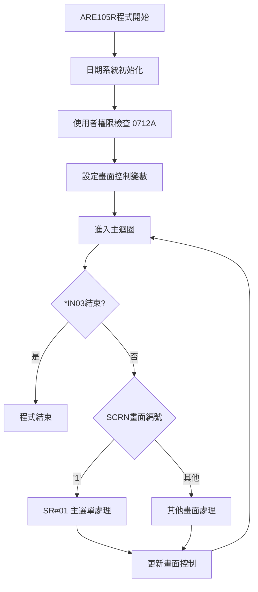
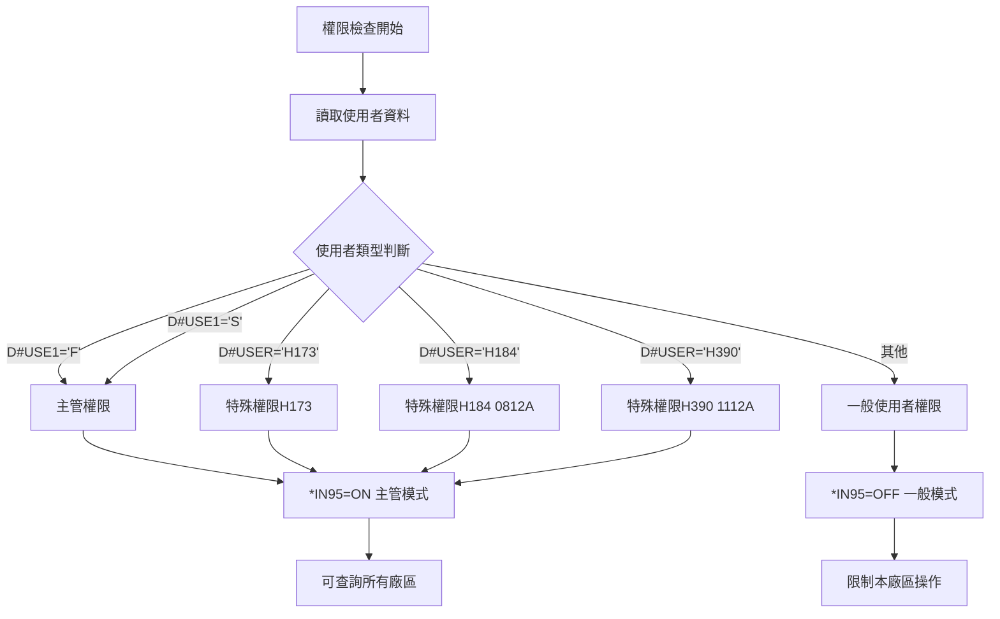
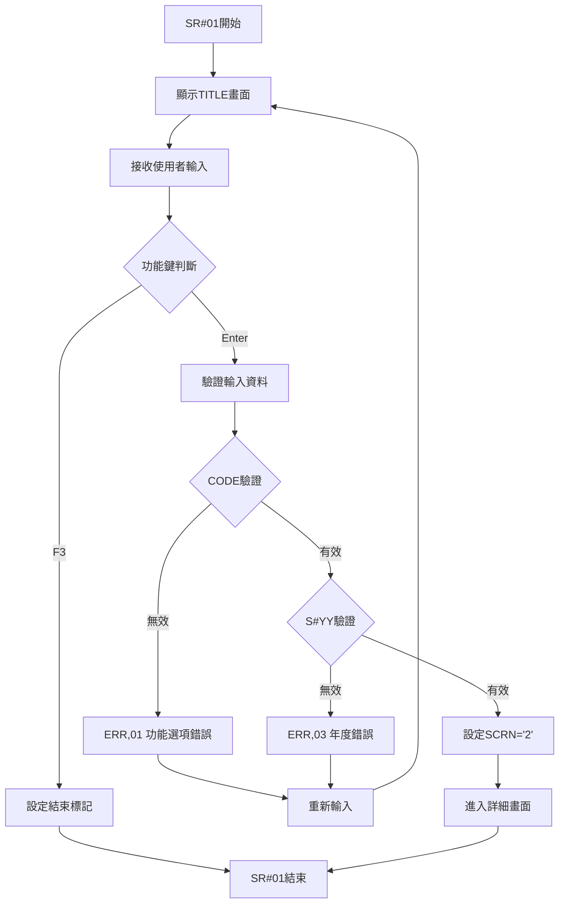
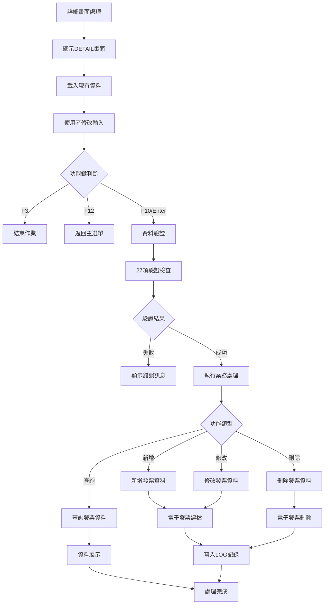
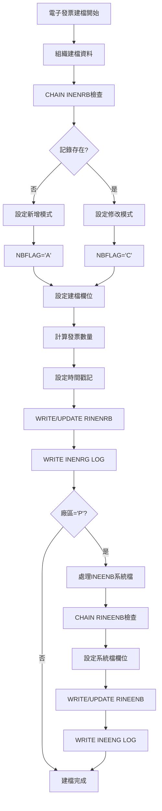
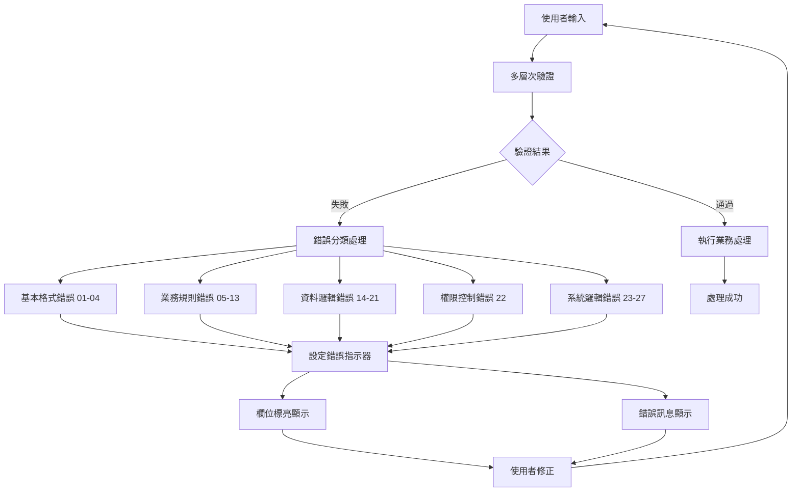

# ARE105R_K02 程式規格書

## 1. 基本資料

| 項目 | 內容 |
|------|------|
| 程式編號 | ARE105R |
| 程式名稱 | 產品電子發票列印作業 |
| 程式類型 | RPG/400 |
| 廠區 | K02 |
| 程式用途 | 產品電子發票列印作業處理程式 |
| 呼叫方式 | 線上互動式作業 |
| 系統名稱 | 應收帳款管理系統 (AR) |
| 子系統 | 電子發票管理子系統 |

## 2. 程式功能說明

ARE105R 為產品電子發票列印作業的處理程式，採用多廠區整合架構。程式提供電子發票管理功能，包括發票資料的新增、修改、刪除、查詢和列印功能，支援七大廠區系統(P, U, M, H, K, I, N)的發票作業，並具備權限控制、資料驗證和電子發票系統整合能力。

主要功能包含：
1. 多廠區電子發票管理：支援P02、U01、M廠、H05、K02、I廠、N廠七大系統
2. 發票作業流程：新增發票、修改發票、刪除發票、查詢發票
3. 電子發票系統整合：電子發票建檔處理、電子發票系統檔案寫入、LOG異動資訊記錄
4. 權限管理：使用者權限分級控制、主管專用查詢功能、特殊權限使用者管理
5. 資料驗證：27種錯誤檢核機制、發票號碼範圍驗證、跨廠區資料一致性檢查

## 3. 檔案架構與關聯圖

### 系統檔案清單

| 檔案名稱 | 檔案類型 | 使用方式 | 說明 |
|----------|----------|----------|------|
| ARE105S | DSPF | 螢幕定義 | 螢幕定義檔 |
| INESEQ | PF | 更新 | 發票序號檔 |
| GENSEQ | PF | 讀取 | 一般序號檔 |
| INENRB | PF | 更新 | 電子發票建檔 |
| INENRBG | PF | 輸出 | 電子發票建檔LOG |
| INEENB | PF | 更新 | 電子發票系統檔 (0708A) |
| INEENBG | PF | 輸出 | 電子發票系統LOG (0708A) |

### 檔案關聯視覺化圖表

```mermaid
graph TD
    A[ARE105R 處理程式] --> B[ARE105S 螢幕定義檔]
    
    A --> C[INESEQ 發票序號檔]
    A --> D[GENSEQ 一般序號檔]
    A --> E[INENRB 電子發票建檔]
    A --> F[INENRBG 電子發票LOG]
    A --> G[INEENB 電子發票系統檔]
    A --> H[INEENBG 電子發票系統LOG]
    
    B --> I[TITLE 主選單畫面]
    B --> J[DETAIL 詳細作業畫面]
    
    A --> L[AADS 日期處理DS]
    A --> M[UDS 使用者資料結構]
    A --> N[KLIST鍵值結構]
    
    N --> O[GEKEY 一般鍵值]
    N --> P[KEY01 年月廠區鍵]
    N --> Q[KEY02 月份廠區鍵]
    
    A --> R[七廠區變數群組]
    R --> S[P02廠區變數]
    R --> T[U01廠區變數]
    R --> U[M廠變數]
    R --> V[H05廠區變數]
    R --> W[K02廠區變數]
    R --> X[I廠變數 1012A]
    R --> Y[N廠變數 1202A]
    
    A --> Z[權限檢查機制]
    Z --> AA[主管查詢權限]
    Z --> BB[特殊使用者權限]
    Z --> CC[廠區隔離權限]
```



### 資料流向說明

1. 輸入階段：使用者透過ARE105S螢幕輸入發票資料和功能選擇
2. 驗證階段：系統執行27種錯誤檢核機制驗證輸入資料
3. 權限階段：檢查使用者權限等級和廠區存取權限
4. 處理階段：根據功能選擇執行新增、修改、刪除、查詢等業務邏輯
5. 建檔階段：更新INENRB電子發票建檔和INEENB系統檔案
6. 記錄階段：寫入INENRBG和INEENBG LOG記錄異動軌跡

## 4. 檔案欄位規格說明

### INESEQ 發票序號檔

發票序號檔案用於發票編號的分配和管理，存取模式為更新(UF)，採用鍵值存取(K)。

### 電子發票相關檔案

**INENRB 電子發票建檔**
- 功能：電子發票主檔建檔作業
- 存取：更新模式
- 輸出檔：INENRBG (LOG記錄)
- 重命名：RINENRB → INENRG

**INEENB 電子發票系統檔 (0708A新增)**
- 功能：電子發票系統整合檔案
- 存取：更新模式
- 輸出檔：INEENBG (LOG記錄)
- 重命名：RINEENB → INEENG

### 資料結構欄位

**AADS 日期處理資料結構**

| 欄位名稱 | 位置 | 長度 | 型態 | 說明 |
|----------|------|------|------|------|
| YYMM | 1-6 | 6 | A | 年月組合欄位 |
| S#YY | 1-4 | 4 | A | 年份欄位 |
| MM | 5-6 | 2 | A | 月份欄位 |
| GRP | 11-20 | 10 | A | 群組代號 |
| GE1 | 11 | 1 | A | 群組第一位 |
| GE2 | 12-17 | 6 | A | 群組中段 |
| GE3 | 18-20 | 3 | A | 群組末段 |

**UDS 使用者資料結構**

| 欄位名稱 | 位置 | 長度 | 型態 | 說明 |
|----------|------|------|------|------|
| COMP | 951-985 | 35 | A | 公司名稱 |
| D#USER | 1001-1010 | 10 | A | 使用者代號 |
| D#USE1 | 1001 | 1 | A | 使用者第一位 (0712A) |
| DEVNM | 1011-1020 | 10 | A | 裝置名稱 |
| TXAR | 1021 | 1 | A | 廠區代號 |

### 多廠區變數架構

程式採用七廠區變數命名規範：

```
廠區變數命名規則:
P02廠區：S#PS12, S#PE12, S#PS34, S#PE34, S#PS56, S#PE56...
U01廠區：S#US12, S#UE12, S#US34, S#UE34, S#US56, S#UE56...
M廠區： S#MS12, S#ME12, S#MS34, S#ME34, S#MS56, S#ME56...
H05廠區：S#HS12, S#HE12, S#HS34, S#HE34, S#HS56, S#HE56...
K02廠區：S#KS12, S#KE12, S#KS34, S#KE34, S#KS56, S#KE56...
I廠區： S#IS12, S#IE12, S#IS34, S#IE34, S#IS56, S#IE56... (1012A)
N廠區： S#NS12, S#NE12, S#NS34, S#NE34, S#NS56, S#NE56... (1202A)

變數結構解析:
S# + [廠區代號] + [S/E] + [月份編號]
    ↓        ↓      ↓        ↓
  螢幕變數  廠區   起始/結束  1~2月/3~4月/5~6月...
```

月份區間編碼：
- 12: 1~2月期間
- 34: 3~4月期間  
- 56: 5~6月期間
- 78: 7~8月期間
- 9A: 9~10月期間
- BC: 11~12月期間

### 複合鍵值結構

**GEKEY 一般鍵值結構**
```
KLIST GEKEY
├── KFLD GEKIND (種類代號)
└── KFLD GEPRIN (主要代號)
```

**KEY01 年月廠區複合鍵**
```
KLIST KEY01
├── KFLD S#YY (年份)
├── KFLD SQYYMM (年月)
└── KFLD SQFACT (廠區代號)
```

**KEY02 月份廠區鍵值**
```
KLIST KEY02
├── KFLD SQYYMM (年月)
└── KFLD SQFACT (廠區代號)
```

### 電子發票欄位

**電子發票建檔欄位 (INENRB)**

| 欄位名稱 | 說明 |
|----------|------|
| NBFLAG | 處理標記 ('A'=新增, 'C'=修改, 'D'=刪除) |
| NBMSTE | 訊息編號 ('E0401') |
| NBHEBN | 表頭分類編號 |
| NBBRBN | 分類編號 |
| NBINTE | 發票類型 ('07') |
| NBYEMH | 發票年月 |
| NBINTK | 發票字軌 |
| NBINBN | 發票起始編號 |
| NBINEN | 發票結束編號 |
| NBINB1 | 發票起始編號1 |
| NBINE1 | 發票結束編號1 |
| NBINBT | 發票數量 |
| NBFACT | 廠區代號 |

**電子發票系統檔欄位 (INEENB) 0708A**

| 欄位名稱 | 說明 |
|----------|------|
| ENFLAG | 處理標記 |
| ENFACT | 廠區代號 |
| ENMSTE | 訊息編號 ('E0501') |
| ENHEBN | 表頭編號 |
| ENINTE | 發票類型 |
| ENYEMH | 發票年月 |
| ENINTK | 發票字軌 |
| ENINBN | 發票起始編號 |
| ENINEN | 發票結束編號 |
| ENINBT | 發票數量 |

**LOG記錄欄位 (0805A新增)**

| 欄位名稱 | 說明 |
|----------|------|
| NBAPNM/ENAPNM | 應用程式名稱 ('ARE105R') |
| NBCHDD/ENCHDD | 異動日期 (系統日期) |
| NBCHDT/ENCHDT | 異動時間 (系統時間) |
| NBCUSR/ENCUSR | 異動使用者 (使用者代號) |

## 5. 輸出/入螢幕布局與說明

### 螢幕架構

ARE105R採用雙畫面架構：
- ARE105S-1 TITLE (主選單畫面)
- ARE105S-2 DETAIL (詳細作業畫面)

### ARE105S-1 TITLE - 主選單畫面

```
┌─────────────────────────────────────────────────────────────────────────────┐
│113/11/25  桃園廠股份有限公司   **產品電子發票列印作業** ARE105S-1            │
│14:30:25                                        TERMINAL01                   │
│                                                                             │
│                                                                             │
│                                                                             │
│                                                                             │
│                                                                             │
│                                                                             │
│          功能選項:[_]                                                       │
│                    (1:新增 2:修改                                           │
│                                                                             │
│                     3:刪除 4:查詢)                                          │
│                                                                             │
│          年度:[____]                                                        │
│                                                                             │
│                                                                             │
│                                                                             │
│                                                                             │
│                                                                             │
│                                                                             │
│錯誤訊息:                                                                   │
│ ENTER:執行    PF03:結束                                                    │
└─────────────────────────────────────────────────────────────────────────────┘
```

**輸入欄位：**
- CODE: 功能選項 (1=新增, 2=修改, 3=刪除, 4=查詢)
- S#YY: 年度 (4位數，民國年)

### ARE105S-2 DETAIL - 詳細作業畫面

```
┌─────────────────────────────────────────────────────────────────────────────┐
│113/11/25  桃園廠股份有限公司   **產品電子發票列印作業** ARE105S-2            │
│修改      **產品電子發票列印作業**             TERMINAL01                    │
│ 年度:113 1~2月  3~4月  5~6月  7~8月  9~10月  11~12月                      │
│ 字軌:[__][__][__][__][__][__]                                             │
│ P    [__________][__________][__________][__________][__________][__________] │
│ U    [__________][__________][__________][__________][__________][__________] │
│ M    [__________][__________][__________][__________][__________][__________] │
│ H    [__________][__________][__________][__________][__________][__________] │
│ K    [__________][__________][__________][__________][__________][__________] │
│ I    [__________][__________][__________][__________][__________][__________] │
│ N    [__________][__________][__________][__________][__________][__________] │
│                                                                             │
│                                                                             │
│                                                                             │
│                                                                             │
│                                                                             │
│                                                                             │
│                                                                             │
│                                                                             │
│                                                                             │
│錯誤訊息:                                                                   │
│ ENTER:執行 PF03:結束 PF10:建檔 PF12:返回                                  │
└─────────────────────────────────────────────────────────────────────────────┘
```

**輸入結構：**
```
字軌輸入欄位: PRE2, PRE4, PRE6, PRE8, PRE10, PRE12 (6個雙月期間字軌)

廠區發票編號範圍矩陣 (7×6=42個輸入欄位):
P02廠: S#PS12~S#PE12, S#PS34~S#PE34, ..., S#PSBC~S#PEBC
U01廠: S#US12~S#UE12, S#US34~S#UE34, ..., S#USBC~S#UEBC
M廠:   S#MS12~S#ME12, S#MS34~S#ME34, ..., S#MSBC~S#MEBC
H05廠: S#HS12~S#HE12, S#HS34~S#HE34, ..., S#HSBC~S#HEBC
K02廠: S#KS12~S#KE12, S#KS34~S#KE34, ..., S#KSBC~S#KEBC
I廠:   S#IS12~S#IE12, S#IS34~S#IE34, ..., S#ISBC~S#IEBC (1012A)
N廠:   S#NS12~S#NE12, S#NS34~S#NE34, ..., S#NSBC~S#NEBC (1202A)
```

### 螢幕控制

**螢幕設定：**
- DSPSIZ(24 80 *DS3): 24行80列顯示
- PRINT(*LIBL/QSYSPRT): 支援列印功能
- INDARA: 使用指示器陣列
- OVERLAY: 疊加顯示模式

**功能鍵定義：**
- CF03(03): 結束作業
- CF10: 建檔作業
- CF12: 返回上層

**顯示屬性：**
- DSPATR(PC): 程式控制顯示
- DSPATR(RI): 反向顯示
- DSPATR(HI): 高亮度顯示
- DSPATR(UL): 底線顯示

## 6. 處理流程程序說明

### 主程式流程



### 權限檢查處理流程 (0712A)



### 主選單處理流程 (SR#01)



### 詳細資料處理流程



### 電子發票建檔處理流程



## 7. 數據操作與轉換說明

### 電子發票處理

#### 電子發票建檔流程

建檔操作包含以下步驟：
1. 使用者輸入發票資料並通過驗證檢核
2. CHAIN INENRB檢查記錄是否存在
3. 根據檢查結果設定處理標記（新增'A'或修改'C'）
4. 設定電子發票欄位和計算發票數量
5. 執行WRITE/UPDATE RINENRB操作
6. 寫入INENRG LOG記錄
7. 若為P02廠區則額外處理INEENB系統檔

#### 多廠區發票號碼分配

廠區表頭編號分配邏輯：
```
P02廠、U01廠、M廠、I廠 → HD,1 (標準廠區)
H05廠 → HD,1 (表頭), HD,2 (分類)
K02廠、N廠 → HD,1 (表頭), HD,3 (分類)
```

#### 發票數量計算

發票數量計算公式：
```
W#INB1 = SQINB1 (起始編號)
W#INB2 = SQINE1 (結束編號)
W#INBS = W#INB2 - W#INB1 + 1 (總數量)
NBINBT = W#INBS / 50 (發票數量，每50張為一批)
```

特殊處理 (1012A新增)：
- 若起始編號=0且結束編號=0，新增模式跳過建檔，修改模式設定刪除標記('D')

### 資料驗證機制

#### 多層次資料驗證

驗證流程包含：
1. 基本格式驗證（空值、格式、範圍、類型檢查）
2. 業務規則驗證（重複性、邏輯性、完整性、一致性檢查）
3. 廠區權限驗證（使用者權限和廠區存取檢查）
4. 資料一致性驗證（跨欄位和歷史資料驗證）
5. 跨廠區邏輯驗證（系統狀態和整合性檢查）

#### 發票號碼範圍驗證

範圍驗證包含：
- 月份區間重複檢查：PRE2 ≠ PRE4 ≠ PRE6 ≠ PRE8 ≠ PRE10 ≠ PRE12
- 起始結束編號邏輯檢查：SNO > 0, ENO > 0, SNO ≤ ENO
- 一致性記憶檢查：比較螢幕輸入與記憶資料

#### 廠區資料完整性驗證

完整性檢查邏輯：
- 檢查所有廠區的所有期間是否皆為空白
- 若非查詢模式且所有廠區資料皆為0則產生ERR,05錯誤
- 設定對應錯誤指示器進行欄位標亮

### 權限控制與安全機制

#### 多層級權限檢查 (0712A)

權限檢查邏輯：
```
使用者權限分級:
D#USE1 = 'F' OR 'S' → *IN95 = ON (主管權限)
D#USER = 'H173'/'H184'/'H390' → *IN95 = ON (特殊權限)
其他 → *IN95 = OFF (一般使用者權限)
```

權限功能：
- 主管權限：可查詢所有廠區資料
- 一般權限：限制本廠區操作

#### 廠區隔離安全機制

安全隔離設計：
1. 廠區代號檢查：TXAR廠區代號控制存取範圍
2. 資料顯示限制：依使用者廠區顯示對應資料
3. 操作權限控制：只能修改本廠區發票資料
4. 查詢範圍限制：一般使用者無法跨廠區查詢

### 電子發票系統整合

#### 雙重電子發票檔案寫入 (0708A)

雙重寫入架構：
- INENRB/INENRBG：電子發票建檔主檔/LOG檔
- INEENB/INEENBG：電子發票系統檔/LOG檔（僅P02廠）

雙重寫入邏輯：
1. 所有廠區寫入INENRB建檔主檔
2. P02廠額外寫入INEENB系統檔
3. 兩套檔案獨立維護
4. LOG檔案記錄所有異動軌跡

#### LOG異動追蹤機制 (0805A)

LOG記錄欄位：
- NBAPNM/ENAPNM = 'ARE105R' (程式名稱)
- NBCHDD/ENCHDD = U#SYSD (異動日期)
- NBCHDT/ENCHDT = TIME (異動時間)
- NBCUSR/ENCUSR = D#USER (異動使用者)

追蹤功能：
- 記錄操作軌跡
- 使用者操作審計
- 電子發票法規遵循
- 系統異動證據保存

## 8. 錯誤處理程序說明與訊息清冊

### 錯誤處理架構



### 錯誤訊息清冊

#### 基本格式錯誤 (01-04)

| 錯誤編號 | 錯誤訊息 | 觸發條件 | 處理方式 | 預防措施 |
|----------|----------|----------|----------|----------|
| ERR,01 | 功能選項需要輸入！ | CODE欄位為空白 | 輸入1-4的功能選項 | 檢查輸入完整性 |
| ERR,02 | 功能選項錯誤：新增、修改、刪除、查詢 | CODE不是1,2,3,4 | 選擇正確的功能選項 | 驗證輸入範圍 |
| ERR,03 | 需要輸入年度 | S#YY欄位為0或空白 | 輸入正確的民國年度 | 檢查必填欄位 |
| ERR,04 | 年度格式錯誤 | S#YY格式不正確 | 輸入4位數的民國年 | 格式驗證 |

#### 業務規則錯誤 (05-13)

| 錯誤編號 | 錯誤訊息 | 觸發條件 | 處理方式 | 預防措施 |
|----------|----------|----------|----------|----------|
| ERR,05 | 系統廠區不可皆為空白 | 所有廠區資料皆為0 | 至少輸入一個廠區資料 | 檢查資料完整性 |
| ERR,06 | 此年度已輸入發票編號，不可新增 | 新增模式但資料已存在 | 改用修改模式 | 檢查資料存在性 |
| ERR,07 | 此年度尚未輸入發票編號！ | 修改/刪除模式但資料不存在 | 先新增資料或改用新增模式 | 檢查資料存在性 |
| ERR,08 | 字軌不可重複 | 字軌欄位有重複值 | 檢查並修正重複的字軌 | 重複性檢查 |
| ERR,09 | 發票編號不可重複 | 發票編號範圍重複 | 調整發票編號範圍避免重複 | 範圍重疊檢查 |
| ERR,10 | 起始編號不可大於結束編號 | 起始>結束 | 確認起始編號小於等於結束編號 | 邏輯一致性檢查 |
| ERR,11 | 系統廠區超過限制不可設定等級一起使用 | 廠區使用限制衝突 | 檢查廠區設定規則 | 設定規則檢查 |
| ERR,12 | 系統廠區請在發票期間內查詢，請確認 | 查詢期間超出範圍 | 調整查詢期間到有效範圍內 | 期間範圍檢查 |
| ERR,13 | 系統廠區設定錯誤 | 廠區設定不正確 | 檢查廠區設定的正確性 | 設定正確性檢查 |

#### 資料邏輯錯誤 (14-21)

| 錯誤編號 | 錯誤訊息 | 觸發條件 | 處理方式 | 預防措施 |
|----------|----------|----------|----------|----------|
| ERR,14 | 字軌輸入錯誤 | 字軌格式或邏輯錯誤 | 檢查字軌輸入格式 | 格式邏輯檢查 |
| ERR,15 | 系統廠區期間與發票期間不符 | 期間邏輯不一致 | 確認期間設定的一致性 | 一致性檢查 |
| ERR,16 | 此年度的發票編號已開始發票，不可修改 | 已發票不可修改 | 確認是否需要特殊處理程序 | 狀態檢查 |
| ERR,17 | 請輸入發票編號已開始發票，不可刪除 | 已發票不可刪除 | 確認刪除的必要性和合規性 | 狀態檢查 |
| ERR,18 | 發票編號已傳送電子發票平台，不可修改 | 已傳送不可修改 | 聯絡系統管理員處理 | 傳送狀態檢查 |
| ERR,19 | 發票起始編號輸入與確認值不同 | 輸入不一致 | 重新確認起始編號輸入 | 一致性檢查 |
| ERR,20 | 發票結束編號輸入與確認值不同 | 輸入不一致 | 重新確認結束編號輸入 | 一致性檢查 |
| ERR,21 | 系統廠區月份上下限相同，各欄位輸入1~2期間(重複輸入同上一期間) | 重複輸入錯誤 | 避免重複輸入相同期間資料 | 重複輸入檢查 |

#### 權限控制錯誤 (22)

| 錯誤編號 | 錯誤訊息 | 觸發條件 | 處理方式 | 預防措施 |
|----------|----------|----------|----------|----------|
| ERR,22 | 無此功能查詢權限 | 使用者權限不足 | 聯絡管理員申請權限 | 權限檢查 |

#### 系統邏輯錯誤 (23-27)

| 錯誤編號 | 錯誤訊息 | 觸發條件 | 處理方式 | 預防措施 |
|----------|----------|----------|----------|----------|
| ERR,23 | 系統廠區請依檢查項目分類開始系統 | 系統檢查項目錯誤 | 按照檢查項目正確分類 | 檢查項目驗證 |
| ERR,24 | 系統廠區請依檢查項目超過期限系統 | 超過期限限制 | 確認期限設定的正確性 | 期限檢查 |
| ERR,25 | 系統廠區幣別起始、結束值不可重複！ | 幣別設定重複 | 調整幣別起始結束值 | 重複檢查 |
| ERR,26 | 系統廠區幣別結束、起始值不可重複！ | 幣別設定重複 | 調整幣別結束起始值 | 重複檢查 |
| ERR,27 | 發票系統需滿50張批次(一批50張) | 發票數量不符批次規則 | 調整發票數量為50的倍數 | 批次規則檢查 |

### 錯誤處理機制

#### 錯誤指示器設定

錯誤指示器對應：
- *IN41: CODE功能選項欄位
- *IN42: S#YY年度欄位  
- *IN43-48: PRE2-PRE12字軌欄位群
- *IN51-57: P02廠區欄位群
- *IN61-67: U01廠區欄位群
- *IN71-79: 其他廠區欄位群

設定方式：
- SETON 9941 → *IN41錯誤標亮
- SETON 994243 → *IN42,*IN43錯誤標亮
- SETON 515763 → 多欄位組合錯誤標亮

#### 錯誤訊息處理

錯誤訊息處理：
- 錯誤陣列：ERR,1-27 (35字元×70字元陣列)
- 動態載入：MOVELERR,編號 ERRMSG
- 即時顯示：DSPATR(HI)高亮度顯示

錯誤處理流程：
1. 偵測錯誤條件
2. 設定對應指示器
3. 載入錯誤訊息
4. 標亮錯誤欄位
5. 等待使用者修正

#### 錯誤優先順序

錯誤處理優先順序：
1. 基本格式錯誤 (01-04)
2. 業務規則錯誤 (05-13)  
3. 資料邏輯錯誤 (14-21)
4. 權限控制錯誤 (22)
5. 系統邏輯錯誤 (23-27)

處理策略：
- 發現高優先順序錯誤立即停止檢查
- 顯示重要的錯誤訊息
- 修正後繼續下一層檢查

## 9. 備註

### 程式架構說明

程式採用7340行RPG/400結構，包含檔案定義區、資料結構區、主程式區、初始化區、驗證邏輯區、業務處理區、檔案處理區和錯誤訊息區的分層架構。

### 多廠區變數管理

程式使用168個變數統一管理七廠區資料，採用螢幕層變數(S#)和工作層變數(H#)的雙層設計，支援批次初始化和動態對應處理。

### 月份編碼系統

採用16進位月份編碼：12(1-2月)、34(3-4月)、56(5-6月)、78(7-8月)、9A(9-10月)、BC(11-12月)，提供簡潔的2字元表達方式。

### 電子發票整合

支援雙重電子發票檔案系統，所有廠區使用INENRB/INENRBG，P02廠額外使用INEENB/INEENBG系統檔。

### 版本擴展記錄

- 1012A：新增I廠區支援
- 1202A：新增N廠區支援
- 0708A：新增INEENB電子發票系統檔
- 0712A：新增使用者權限分級檢查
- 0805A：新增LOG異動記錄欄位
- 0812A：新增H184特殊權限使用者
- 1112A：新增H390特殊權限使用者

### 權限控制機制

程式支援三層級權限控制：主管權限(*IN95=ON)可查詢所有廠區，特殊權限(H173/H184/H390)具備跨廠區存取能力，一般權限限制本廠區操作。

### 檔案操作說明

程式使用CHAIN、WRITE、UPDATE等操作處理INESEQ、INENRB、INEENB等檔案，採用複合鍵值GEKEY、KEY01、KEY02進行檔案存取。

### 記憶體管理

採用重疊資料結構設計和統一欄位命名規範，通過變數重用和檔案緩衝最佳化，實現大型程式的記憶體管理。