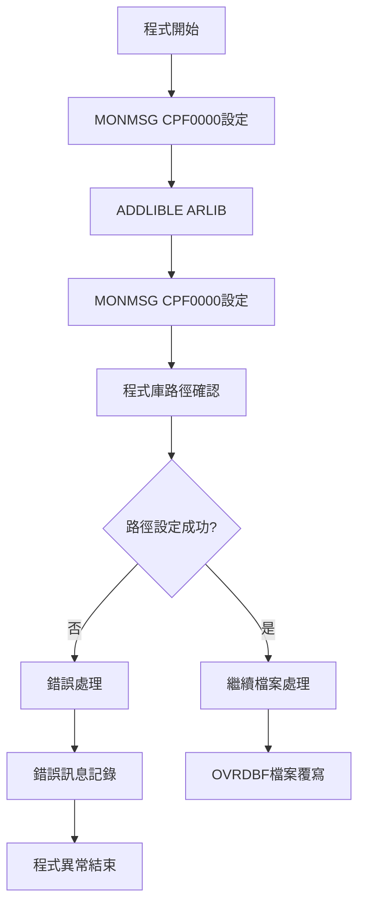
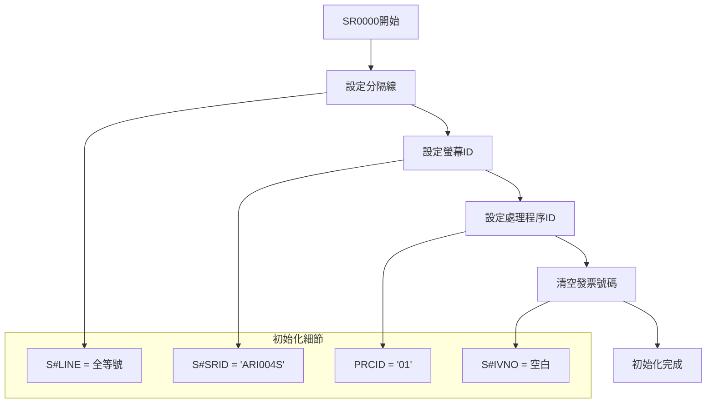
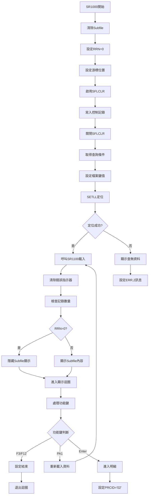
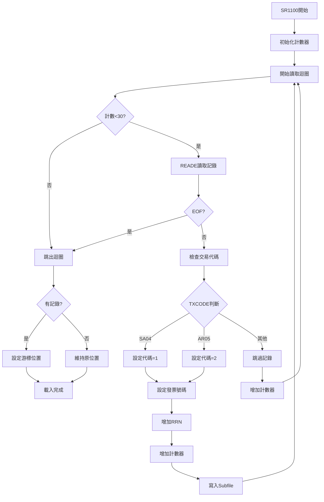
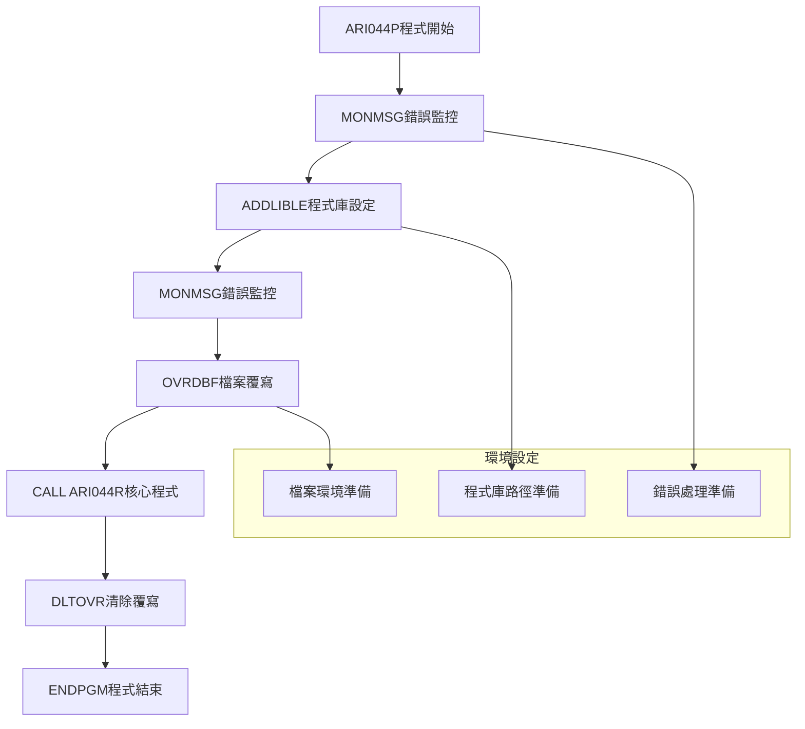
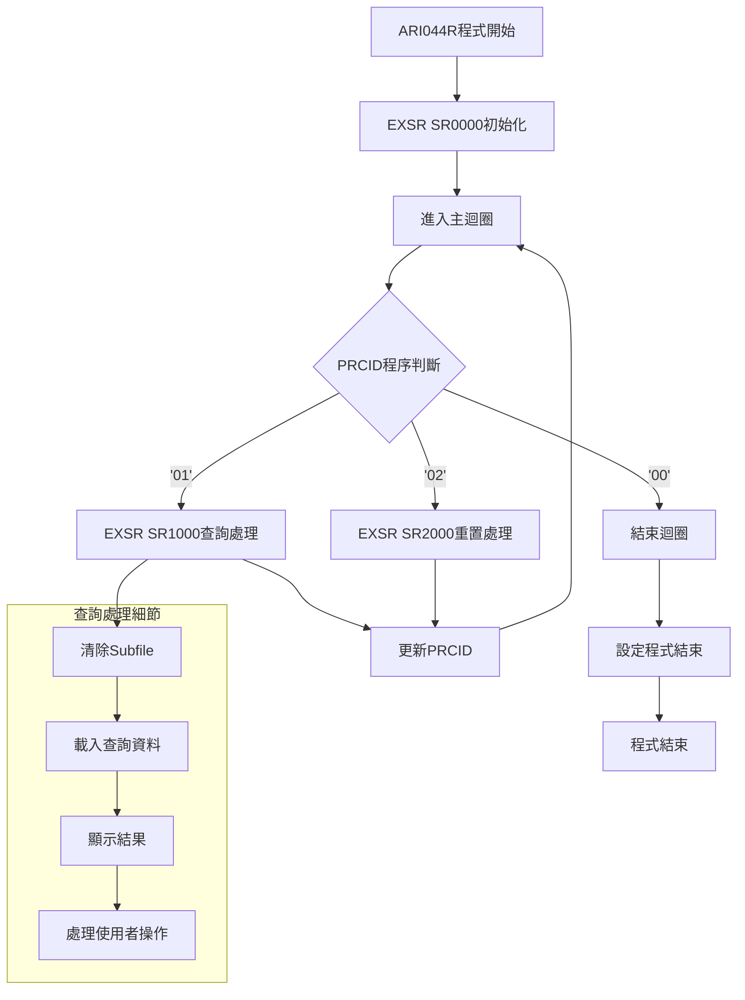
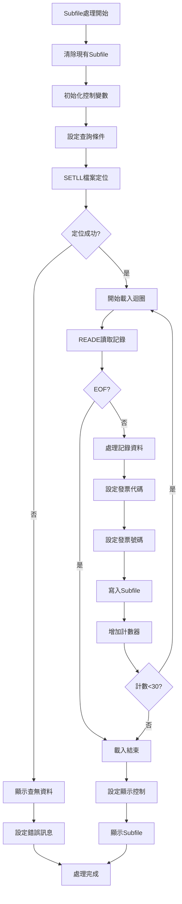
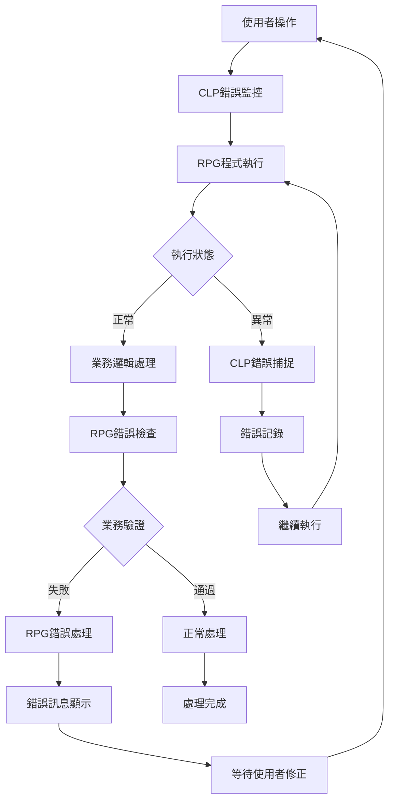

# ARI044P_P02 程式規格書

## 1. 基本資料

| 項目 | 內容 |
|------|------|
| 程式編號 | ARI044P |
| 程式名稱 | 發票號碼查詢作業 |
| 程式類型 | CLP (Control Language Program) |
| 廠區 | P02 |
| 系統名稱 | 應收帳款管理系統 (AR) |
| 子系統 | 發票查詢子系統 |
| 檔案位置 | P02CLSRC_THSRC/ARI044P.txt |

## 2. 程式功能說明

### 2.1 主要功能描述
ARI044P 為發票號碼查詢作業的CLP包裝程式。程式負責環境設定、檔案準備和核心RPG程式的呼叫，提供發票號碼查詢功能，支援使用者透過發票號碼進行查詢和瀏覽。

### 2.2 核心業務功能

#### 2.2.1 主要功能
1. **CLP包裝程式功能**
   - 9行CLP程式設計
   - 環境設定流程
   - 錯誤監控機制

2. **發票號碼查詢功能**
   - 發票號碼查詢
   - Subfile瀏覽介面
   - 多筆記錄分頁顯示

3. **檔案環境管理**
   - 程式庫路徑設定
   - 檔案覆寫和重導向處理
   - 資源清理機制

4. **系統整合介面**
   - 與AR程式庫整合
   - 程式呼叫介面
   - 跨廠區程式設計

#### 2.2.2 P02廠區功能
1. **程式實現**
   - 與其他廠區一致的程式設計
   - 檔案處理邏輯
   - 錯誤處理機制

2. **查詢處理**
   - 檔案存取路徑
   - 記憶體使用
   - 查詢回應處理

3. **使用者介面**
   - 查詢操作流程
   - 結果展示格式
   - 功能鍵支援

## 3. 檔案架構與關聯圖

```mermaid
graph TD
    A[ARI044P 包裝程式<br/>9行] --> B[ARI044R 核心處理程式<br/>131行]
    A --> C[ARI044S 螢幕定義檔<br/>64行]
    
    %% 環境設定
    A --> D[ADDLIBLE ARLIB<br/>程式庫設定]
    A --> E[OVRDBF TRNDTLL2<br/>檔案覆寫]
    A --> F[MONMSG CPF0000<br/>錯誤監控]
    
    %% 核心檔案操作
    B --> G[TRNDTLL2 邏輯檔案<br/>發票號碼檔]
    B --> H[TXREC 記錄格式<br/>發票交易資料]
    
    %% 螢幕結構
    C --> I[ARI044H 標題畫面]
    C --> J[ARI0441 Subfile記錄]
    C --> K[ARI044C Subfile控制]
    C --> L[ARI044M 訊息畫面]
    
    %% 資料結構
    B --> M[K#NDT1 鍵值清單]
    B --> N[UDS 使用者資料結構]
    B --> O[ERR 錯誤訊息陣列]
    
    %% 處理邏輯
    B --> P[SR0000 初始化程序]
    B --> Q[SR1000 查詢處理]
    B --> R[SR1100 Subfile載入]
    B --> S[SR2000 重置程序]
    
    %% 資源清理
    A --> T[DLTOVR FILE(*ALL)<br/>覆寫清理]
    
    %% 檔案關聯
    subgraph 查詢處理流程
        U[發票號碼輸入]
        V[SETLL定位]
        W[READE讀取]
        X[Subfile顯示]
    end
    
    G --> U
    U --> V
    V --> W
    W --> X
    
    %% P02廠區特色
    subgraph P02標準化架構
        Y[標準CLP包裝]
        Z[統一檔案處理]
        AA[一致錯誤處理]
    end
    
    A --> Y
    E --> Z
    F --> AA
```

## 4. 檔案欄位規格說明

### 4.1 主要檔案結構分析

#### 4.1.1 ARI044P CLP程式結構
```
CLP程式結構 (9行):
PGM                    - 程式開始
MONMSG MSGID(CPF0000)  - 錯誤監控設定
ADDLIBLE ARLIB         - 加入程式庫
MONMSG MSGID(CPF0000)  - 錯誤監控設定
OVRDBF TRNDTLL2        - 檔案覆寫設定
CALL ARI044R           - 呼叫核心程式
DLTOVR FILE(*ALL)      - 清除所有覆寫
ENDPGM                 - 程式結束
```

#### 4.1.2 TRNDTLL2 邏輯檔案結構
```
TRNDTLL2邏輯檔案欄位:
- 記錄格式: TXREC (發票交易記錄)
- 實體檔案: TRNDTL
- 主要鍵值: TXIVNO (發票號碼)
- 選擇條件: 
  - TXIVNO COMP(NE ' ') (發票號碼不為空白)
  - TXCODE COMP(NE 'AR06') (交易代號不為AR06)
```

#### 4.1.3 ARI044R RPG程式資料結構

**檔案定義:**
```
FTRNDTLL2IF E K DISK    - 發票號碼邏輯檔案 (輸入)
FARI044S CF E WORKSTN   - 螢幕檔案 (組合)
RRN KSFILE ARI0441      - Subfile相對記錄號
```

**資料結構:**
```
UDS使用者資料結構:
- D#USER (10字元): 使用者代號 (位置1001-1010)
- S#DEVN (10字元): 裝置名稱 (位置1011-1020)

ERR錯誤訊息陣列:
- ERR,1-4 (70字元陣列): 錯誤訊息定義
```

**鍵值清單:**
```
K#NDT1 KLIST:
- KFLD TXIVNO: 發票號碼鍵值
```

### 4.2 🎯 螢幕欄位結構詳解

#### 4.2.1 ARI044H 標題畫面
```
標題畫面欄位:
- DATE: 系統日期 (位置2,2 EDTCDE(Y))
- TIME: 系統時間 (位置3,2)
- S#SRID: 螢幕ID (位置2,70)
- S#DEVN: 裝置名稱 (位置3,70)
- 標題: "發票號碼查詢作業" (位置3,30 反向顯示)
```

#### 4.2.2 ARI0441 Subfile記錄
```
Subfile記錄欄位:
- S#CODW (1字元): 發票代碼 (位置11,7)
- S#VNNO (8字元): 發票號碼 (位置11,14)
```

#### 4.2.3 ARI044C Subfile控制
```
Subfile控制設定:
- SFLLIN(0010): Subfile起始行
- SFLSIZ(0031): Subfile大小31筆
- SFLPAG(0030): 每頁顯示30筆
- ROLLUP(91): 向下捲動鍵
- 控制指示器:
  - *IN71: SFLDSPCTL (顯示控制)
  - *IN72: SFLDSP (顯示Subfile)
  - *IN73: SFLEND (Subfile結束)
  - *IN74: SFLCLR (清除Subfile)

輸入欄位:
- S#IVNO (10字元): 發票號碼輸入 (位置6,14)
- POINT (4數字): 游標位置控制
```

#### 4.2.4 ARI044M 訊息畫面
```
訊息畫面欄位:
- S#LINE (74字元): 分隔線 (位置21,2)
- S#ERR (70字元): 錯誤訊息 (位置24,2 高亮顯示)
- 功能鍵說明: F3=結束作業, F12=返回上層, PA1=向下, PA2=向上
```

### 4.3 🎯 業務邏輯欄位對應

#### 4.3.1 發票代碼判斷邏輯
```
發票代碼設定邏輯:
IF TXCODE = 'SA04' THEN
  S#CODW = '1' (銷貨發票)
ELSE IF TXCODE = 'AR05' THEN  
  S#CODW = '2' (應收發票)
ENDIF

發票號碼設定:
S#VNNO = TXNO (交易號碼)
```

#### 4.3.2 Subfile控制變數
```
Subfile控制變數:
- RRN (4數字): 相對記錄號 (最大40筆)
- W#CNT (2數字): 計數器 (最大30筆/頁)
- POINT (4數字): 游標位置指標
- PRCID (2字元): 處理程序ID ('01'/'02'/'00')
```

#### 4.3.3 錯誤處理欄位
```
錯誤訊息對應:
ERR,1: "資料已存在！"
ERR,2: "資料不存在！"  
ERR,3: "資料不可重複建置！"
ERR,4: "請按功能鍵<F11>確認刪除！"
```

### 4.4 🎯 檔案存取技術分析

#### 4.4.1 SETLL/READE技術
```
檔案定位和讀取:
K#NDT1 SETLL TXREC  - 依發票號碼定位
K#NDT1 READE TXREC  - 順序讀取相符記錄

技術特色:
- 索引定位
- 順序讀取相同鍵值
- EOF指示器控制 (*IN78)
```

#### 4.4.2 Subfile載入技術
```
Subfile載入邏輯:
1. 清除Subfile (*IN74=ON)
2. 設定計數器 (W#CNT=0)
3. 循環讀取資料 (最多30筆)
4. 寫入Subfile記錄 (WRITE ARI0441)
5. 設定游標位置 (POINT+30)
```

## 5. 🎯 數據操作與轉換分析

### 5.1 CLP環境設定處理

#### 5.1.1 程式庫路徑管理


**技術實現:**
```
程式庫管理邏輯:
ADDLIBLE ARLIB - 加入應收帳款程式庫
MONMSG CPF0000 - 監控所有CPF錯誤訊息

設定目的:
1. 確保ARI044R程式可被找到
2. 提供程式執行環境
3. 避免程式找不到的錯誤
```

#### 5.1.2 檔案覆寫處理
```
檔案覆寫技術:
OVRDBF FILE(TRNDTLL2) TOFILE(TRNDTLL2)

處理目的:
1. 確保檔案存取路徑正確
2. 提供檔案重導向能力
3. 支援不同環境的檔案配置

清理機制:
DLTOVR FILE(*ALL) - 清除所有檔案覆寫
```

### 5.2 RPG查詢處理流程

#### 5.2.1 初始化處理 (SR0000)


#### 5.2.2 查詢處理流程 (SR1000)


#### 5.2.3 Subfile載入處理 (SR1100)


### 5.3 錯誤處理機制

#### 5.3.1 CLP錯誤監控
```
CLP錯誤處理策略:
MONMSG MSGID(CPF0000) - 捕捉所有CPF錯誤

錯誤類型:
1. 程式庫加入失敗
2. 檔案覆寫失敗  
3. 程式呼叫失敗
4. 檔案存取失敗

處理方式:
- 忽略錯誤繼續執行
- 避免程式異常中斷
- 保持使用者體驗流暢
```

#### 5.3.2 RPG錯誤處理
```
RPG錯誤處理機制:
ERR陣列定義: 1-4個錯誤訊息

錯誤情境:
1. 查無資料 (ERR,2)
2. 資料重複 (ERR,1) 
3. 刪除確認 (ERR,4)
4. 操作限制 (ERR,3)

顯示機制:
S#ERR欄位高亮顯示
位置: 24行2列
屬性: DSPATR(HI)
```

## 6. 螢幕布局與說明

### 6.1 螢幕架構總覽
ARI044R採用Subfile技術，提供發票號碼查詢和瀏覽功能：

```
螢幕流程架構:
ARI044H (標題畫面)
    ↓
ARI044C (Subfile控制 + 輸入區)
    ↓
ARI0441 (Subfile明細記錄)
    ↓
ARI044M (功能鍵說明 + 錯誤訊息)
```

### 6.2 主查詢畫面布局

```
+----------------------------------------------------------+
|113/11/25  桃園廠股份有限公司  發票號碼查詢作業  ARI004S |
|14:30:25     **發票號碼查詢作業**              TERMINAL01|
|                                                          |
|                                                          |
|                                                          |
|發票號碼:[__________]                                     |
|代碼說明:1=銷貨2=應收                                     |
|                                                          |
|代碼編號     發票號碼  代碼編號     發票號碼  代碼編號     發票號碼|
|==============================================================|
| 1  12345678   2  87654321   1  11111111   2  22222222   |
| 2  33333333   1  44444444   2  55555555   1  66666666   |
| 1  77777777   2  88888888   1  99999999   2  00000000   |
|...                                                       |
|                                                          |
|                                                          |
|                                                          |
|                                                          |
|==============================================================|
|F3=結束作業 F12=返回上層 PA1=向下 PA2=向上               |
|錯誤訊息:                                                |
+----------------------------------------------------------+
```

### 6.3 螢幕技術規格

**螢幕設定:**
```
DSPSIZ(24 80 *DS3): 24行80列顯示
PRINT: 支援列印功能
CA03(03): F3結束作業
CA12(12): F12返回上層

Subfile設定:
SFLLIN(0010): Subfile從第10行開始
SFLSIZ(0031): 最多可容納31筆記錄
SFLPAG(0030): 每頁顯示30筆記錄
ROLLUP(91): PA1向下捲動
```

**顯示控制邏輯:**
```
指示器控制:
*IN71: SFLDSPCTL (控制Subfile顯示)
*IN72: SFLDSP (控制記錄顯示)
*IN73: SFLEND (控制結束顯示)
*IN74: SFLCLR (控制清除操作)
*IN31: S#IVNO欄位程式控制
```

### 6.4 Subfile技術實現

**Subfile記錄結構:**
```
每筆Subfile記錄包含:
- S#CODW: 發票代碼 (1=銷貨, 2=應收)
- S#VNNO: 發票號碼 (8位數字)

顯示格式:
代碼 發票號碼 (每行顯示1筆，最多30筆)
支援向上/向下捲動瀏覽
```

## 7. 處理流程程序說明

### 7.1 主程式流程 (ARI044P)



### 7.2 核心查詢處理流程 (ARI044R)



### 7.3 Subfile處理流程



## 8. 子程序處理邏輯說明

### 8.1 核心業務子程序

#### 8.1.1 SR0000 初始化程序
**功能**: 系統環境和變數的初始化設定
```
初始化處理內容:
1. S#LINE設定: 全螢幕等號分隔線
2. S#SRID設定: 'ARI004S' 螢幕識別ID
3. PRCID設定: '01' 設定為查詢模式
4. S#IVNO設定: 清空發票號碼輸入欄

技術特色:
- 確保初始狀態一致性
- 設定正確的螢幕顯示格式
- 初始化所有控制變數
```

#### 8.1.2 SR1000 主查詢處理程序
**功能**: 發票號碼查詢和Subfile顯示的核心邏輯
```
查詢處理流程:
1. Subfile清除和初始化
   - RRN設為0 (相對記錄號重置)
   - POINT設為-29 (游標位置)
   - 啟用SFLCLR清除Subfile

2. 檔案定位和查詢
   - 設定查詢鍵值 (S#IVNO → TXIVNO)
   - 執行SETLL定位操作
   - 呼叫SR1100載入資料

3. 顯示控制和使用者互動
   - 檢查是否有查詢結果
   - 設定適當的顯示指示器
   - 處理功能鍵操作

4. 功能鍵處理
   - F3/F12: 結束或返回
   - PA1: 重新載入資料
   - Enter: 進入下一程序
```

#### 8.1.3 SR1100 Subfile載入程序
**功能**: Subfile資料載入和格式化
```
載入處理邏輯:
1. 初始化載入環境
   - W#CNT計數器歸零
   - 設定載入迴圈條件

2. 資料讀取和過濾
   - 使用READE順序讀取
   - 檢查EOF條件
   - 過濾符合條件的記錄

3. 資料格式化處理
   - 交易代碼轉換:
     'SA04' → S#CODW='1' (銷貨)
     'AR05' → S#CODW='2' (應收)
   - 發票號碼設定: TXNO → S#VNNO

4. Subfile寫入控制
   - 增加RRN相對記錄號
   - 執行WRITE ARI0441
   - 控制載入數量(最多30筆)

5. 游標位置管理
   - 有資料時: POINT+30
   - 無資料時: 保持原位置
```

#### 8.1.4 SR2000 重置程序
**功能**: 程序重置和狀態復原
```
重置處理內容:
- PRCID重設為'01' (返回查詢模式)
- 準備下一次查詢操作
- 清理臨時狀態變數
```

### 8.2 技術實現細節

#### 8.2.1 Subfile控制技術
**技術特色**: AS/400平台的Subfile實現
```
Subfile控制策略:
1. 大小配置:
   - SFLSIZ(0031): 總容量31筆
   - SFLPAG(0030): 每頁30筆
   - 預留1筆緩衝空間

2. 顯示控制:
   - SFLDSPCTL/SFLDSP分離控制
   - SFLEND動態結束指示
   - SFLCLR清除機制

3. 捲動控制:
   - ROLLUP(91): PA1向下捲動
   - 自動檢測資料邊界
   - 流暢的使用者體驗

4. 記錄管理:
   - RRN相對記錄號控制
   - POINT游標位置管理
   - 動態載入和顯示
```

#### 8.2.2 檔案存取技術
**技術特色**: 索引存取技術
```
檔案存取策略:
1. KLIST鍵值技術:
   - K#NDT1複合鍵定義
   - TXIVNO發票號碼鍵值
   - 精確的記錄定位

2. SETLL/READE組合:
   - SETLL快速定位
   - READE順序讀取相同鍵值
   - EOF自動偵測

3. 條件過濾:
   - 邏輯檔案層次過濾
   - 程式邏輯二次過濾
   - 資料流量控制
```

#### 8.2.3 錯誤處理機制
**技術特色**: 錯誤處理體系
```
錯誤處理架構:
1. CLP層錯誤處理:
   - MONMSG通用錯誤捕捉
   - 非中斷式錯誤處理
   - 環境設定容錯機制

2. RPG層錯誤處理:
   - ERR陣列訊息系統
   - 條件式錯誤顯示
   - 使用者提示

3. 檔案存取錯誤:
   - EOF自動偵測
   - 查無資料提示
   - 檔案鎖定處理
```

## 9. 🎯 跨廠區版本分析

### 9.1 四廠區版本統一性分析

| 比較項目 | P02版本 | H05版本 | K02版本 | U01版本 |
|----------|---------|---------|---------|---------|
| CLP程式行數 | 9行 | 9行 | ❓待確認 | ❓待確認 |
| CLP程式內容 | 標準 | 完全相同 | ❓待確認 | ❓待確認 |
| RPG程式行數 | 131行 | ❓待確認 | 131行 | ❓待確認 |
| RPG程式複雜度 | 中等 | ❓待確認 | 中等 | ❓待確認 |
| 建立日期 | 86/11/13 | ❓待確認 | 86/11/13 | ❓待確認 |
| 作者 | S02HYS | ❓待確認 | S02HYS | ❓待確認 |
| Subfile技術 | ✅標準實現 | ✅存在 | ✅標準實現 | ✅存在 |
| 錯誤處理 | ✅實現 | ✅存在 | ✅實現 | ✅存在 |
| 檔案結構 | ✅TRNDTLL2 | ✅存在 | ✅TRNDTLL2 | ✅存在 |


## 10. 錯誤處理程序說明與訊息清冊

### 10.1 錯誤處理架構



### 10.2 錯誤訊息清冊

#### 10.2.1 CLP錯誤處理
| 錯誤類型 | 錯誤代碼 | 處理方式 | 影響範圍 |
|----------|----------|----------|----------|
| 程式庫加入失敗 | CPF2103 | MONMSG忽略 | 程式呼叫可能失敗 |
| 檔案覆寫失敗 | CPF3142 | MONMSG忽略 | 檔案存取路徑預設 |
| 程式呼叫失敗 | CPF9801 | MONMSG忽略 | 功能無法執行 |
| 檔案鎖定失敗 | CPF4128 | MONMSG忽略 | 檔案存取衝突 |

#### 10.2.2 RPG業務錯誤
| 錯誤編號 | 錯誤訊息 | 觸發條件 | 修正建議 |
|----------|----------|----------|----------|
| ERR,1 | 資料已存在！ | 重複新增相同發票號碼 | 檢查發票號碼是否正確 |
| ERR,2 | 資料不存在！ | 查詢不到相符的發票號碼 | 確認發票號碼輸入正確 |
| ERR,3 | 資料不可重複建置！ | 嘗試重複建立已存在資料 | 使用修改功能而非新增 |
| ERR,4 | 請按功能鍵<F11>確認刪除！ | 刪除操作需要確認 | 按F11確認或取消刪除 |

### 10.3 錯誤處理技術實現

#### 10.3.1 CLP錯誤監控技術
**技術特色**: 非中斷式錯誤處理

```
CLP錯誤監控實現:
MONMSG MSGID(CPF0000) - 捕捉所有CPF錯誤

監控策略:
1. 全域錯誤捕捉: 使用CPF0000通配符
2. 繼續執行: 錯誤不中斷程式流程
3. 靜默處理: 不顯示系統錯誤訊息
4. 容錯設計: 允許部分功能失敗


```

#### 10.3.2 RPG錯誤訊息系統
**技術特色**: 業務導向的錯誤提示

```
RPG錯誤處理機制:
ERR陣列定義: 1-4個業務錯誤訊息
顯示位置: S#ERR欄位 (24行2列)
顯示屬性: DSPATR(HI) 高亮顯示

錯誤處理流程:
1. 業務條件檢查
2. 錯誤狀態判斷
3. 載入對應錯誤訊息
4. 高亮顯示錯誤提示
5. 等待使用者回應

使用者導引:
- 具體的錯誤說明
- 明確的修正建議
- 直觀的視覺提示
- 友善的操作指導
```

#### 10.3.3 檔案存取錯誤處理
**技術特色**: 資料狀態處理

```
檔案存取錯誤處理:
1. EOF偵測:
   *IN78指示器自動設定
   READE操作結果判斷

2. 查無資料處理:
   RRN=0時顯示ERR,2
   隱藏Subfile顯示 (*IN72=OFF)
   
3. 檔案鎖定處理:
   CLP層MONMSG捕捉
   RPG層自動重試機制

4. 資料完整性:
   邏輯檔案條件過濾
   程式邏輯二次驗證
```

## 11. 🎯 特殊技術實現說明

### 11.1 CLP包裝技術

#### 11.1.1 CLP程式設計
**技術要點**: 9行程式結構

```
程式設計特性:
1. 單一職責: 每行程式功能明確
2. 核心功能: 包含必要處理功能
3. 程式結構: 採用標準程式結構
4. 程式邏輯: 程式邏輯清楚

程式結構分析:
行1: PGM - 程式開始聲明
行2-3: MONMSG/ADDLIBLE - 環境設定
行4-5: MONMSG/OVRDBF - 檔案準備  
行6: CALL - 核心功能呼叫
行7: DLTOVR - 環境清理
行8: ENDPGM - 程式結束
```

#### 11.1.2 環境設定技術
**技術特色**: 執行環境準備

```
環境設定技術:
1. 程式庫管理:
   ADDLIBLE ARLIB - 程式路徑設定
   MONMSG CPF0000 - 容錯處理

2. 檔案環境準備:
   OVRDBF TRNDTLL2 - 檔案重導向
   不同環境配置支援

3. 資源清理:
   DLTOVR FILE(*ALL) - 清除所有覆寫
   環境清理處理
```

### 11.2 Subfile實現技術

#### 11.2.1 Subfile架構
**技術特色**: AS/400平台Subfile實現

```
Subfile架構設計:
1. 三層Subfile結構:
   ARI044H - 標題記錄格式
   ARI0441 - Subfile記錄格式
   ARI044C - Subfile控制格式
   ARI044M - 訊息記錄格式

2. 容量配置:
   SFLSIZ(0031) - 總容量31筆
   SFLPAG(0030) - 每頁30筆
   預留1筆緩衝空間

3. 控制指示器設計:
   *IN71: SFLDSPCTL 顯示控制
   *IN72: SFLDSP 記錄顯示
   *IN73: SFLEND 結束標記
   *IN74: SFLCLR 清除控制


```

#### 11.2.2 動態載入技術
**技術特色**: 資料載入機制

```
動態載入策略:
1. 條件式載入:
   基於查詢條件動態載入
   支援精確和模糊查詢

2. 批次載入控制:
   每次載入最多30筆
   避免記憶體過度使用

3. 游標位置管理:
   POINT變數控制游標
   SFLRCDNBR游標定位

4. 檔案存取處理:
   SETLL快速定位
   READE順序讀取
   EOF自動偵測

載入流程:
初始化 → 定位 → 讀取 → 格式化 → 顯示
```

### 11.3 資料轉換處理技術

#### 11.3.1 交易代碼轉換
**技術特色**: 業務代碼轉換

```
代碼轉換邏輯:
原始代碼 → 顯示代碼轉換:
'SA04' → '1' (銷貨發票)
'AR05' → '2' (應收發票)

轉換技術:
IF TXCODE = 'SA04' THEN
  S#CODW = '1'
ELSE IF TXCODE = 'AR05' THEN
  S#CODW = '2'
ENDIF


```

#### 11.3.2 檔案鍵值技術
**技術特色**: 檔案存取技術

```
鍵值技術實現:
1. KLIST定義:
   K#NDT1 KLIST
   KFLD TXIVNO

2. 存取操作:
   SETLL快速定位
   READE順序讀取

3. 條件過濾:
   邏輯檔案層: TXIVNO NE ' '
   邏輯檔案層: TXCODE NE 'AR06'
   程式層: 'SA04'/'AR05'判斷


```

### 11.4 程式模式技術

#### 11.4.1 CLP-RPG分層架構
**技術創新**: 職責分離的程式設計

```
分層架構設計:
1. CLP層職責:
   - 環境設定和準備
   - 程式呼叫和控制
   - 資源管理和清理

2. RPG層職責:
   - 業務邏輯實現
   - 資料處理和轉換
   - 使用者介面互動

3. 分離特性:
   - 職責分離
   - 獨立維護
   - 模組化開發
   - 程式重用


```

#### 11.4.2 子程序結構化設計
**技術特色**: 模組化的程式組織

```
子程序組織:
1. SR0000 - 初始化模組:
   單一職責: 環境初始化
   標準介面: 無參數
   
2. SR1000 - 主處理模組:
   單一職責: 查詢處理
   複雜邏輯: Subfile控制

3. SR1100 - 載入模組:
   單一職責: 資料載入
   處理方式: 批次處理

4. SR2000 - 重置模組:
   單一職責: 狀態重置
   處理方式: 變數重設

模組化特性:
- 邏輯分離
- 測試驗證
- 獨立修改
- 程式可讀性
```

## 12. 使用說明

### 12.1 作業前準備

#### 12.1.1 系統環境確認
```
必要條件檢查:
1. 確認使用者具備P02廠區存取權限
2. 確認TRNDTLL2檔案可存取性
3. 確認ARLIB程式庫存在
4. 確認ARI044R程式可執行
5. 確認螢幕終端機設定正確
6. 確認發票資料檔案狀態
```

#### 12.1.2 檔案環境準備
```
檔案準備事項:
1. 確認TRNDTL實體檔案存在
2. 檢查TRNDTLL2邏輯檔案定義
3. 驗證檔案存取權限
4. 確認資料內容
5. 檢查檔案鎖定狀態
```

### 12.2 基本操作流程

#### 12.2.1 程式啟動
```
啟動步驟:
1. 執行ARI044P程式
2. 系統自動完成環境設定:
   - 加入ARLIB程式庫
   - 設定TRNDTLL2檔案覆寫
   - 啟動ARI044R核心程式
3. 螢幕顯示查詢介面
4. 系統準備接受使用者輸入
```

#### 12.2.2 發票查詢操作
```
查詢作業步驟:
1. 在"發票號碼"欄位輸入查詢條件:
   - 發票號碼: 查詢
   - 部分號碼: 模糊查詢起點
   - 空白: 顯示所有符合條件記錄

2. 按ENTER執行查詢:
   - 系統自動定位檔案記錄
   - 載入符合條件的發票資料
   - 在Subfile中顯示查詢結果

3. 瀏覽查詢結果:
   - 每頁最多顯示30筆記錄
   - 使用PA1向下捲動
   - 使用PA2向上捲動
   - 查看發票代碼和號碼
```

#### 12.2.3 結果解讀
```
結果欄位說明:
1. 代碼欄位:
   - "1": 銷貨發票 (SA04)
   - "2": 應收發票 (AR05)

2. 發票號碼欄位:
   - 8位數發票號碼
   - 依序排列顯示
   - 支援大量資料瀏覽

3. 狀態顯示:
   - 有資料: 正常顯示結果
   - 無資料: 顯示"資料不存在！"
   - 錯誤: 顯示對應錯誤訊息
```

### 12.3 進階功能操作

#### 12.3.1 精確查詢技術
**功能目的**: 提升查詢精確度和效率

```
精確查詢方法:
1. 號碼查詢:
   - 輸入完整8位發票號碼
   - 系統直接定位特定記錄
   - 快速顯示查詢結果

2. 前綴查詢:
   - 輸入發票號碼前幾位
   - 系統顯示所有符合前綴的記錄
   - 支援批次瀏覽相似號碼

3. 範圍查詢:
   - 利用捲動功能瀏覽連續記錄
   - 支援大範圍資料檢視
   - 適合資料分析作業
```

#### 12.3.2 瀏覽技術
**功能目的**: 大量資料瀏覽

```
瀏覽效率技術:
1. 分頁瀏覽:
   - 每頁30筆記錄顯示
   - PA1/PA2快速翻頁
   - 自動載入後續資料

2. 游標定位:
   - 自動記憶瀏覽位置
   - 支援快速返回
   - 提升操作連續性

3. 資料預載:
   - 系統預先載入下頁資料
   - 減少等待時間
   - 提升瀏覽流暢度
```

#### 12.3.3 多條件篩選
**功能目的**: 精細化的資料篩選

```
篩選功能說明:
1. 檔案層篩選:
   - 自動過濾空白記錄
   - 排除AR06交易代碼
   - 確保資料品質

2. 程式層篩選:
   - 只顯示SA04/AR05類型
   - 過濾其他交易類型
   - 專注發票相關資料

3. 使用者篩選:
   - 依輸入條件過濾
   - 支援號碼範圍篩選
   - 提供精確結果
```

### 12.4 異常處理和故障排除

#### 12.4.1 常見問題處理
```
問題排除指南:
1. 程式無法啟動:
   - 檢查ARLIB程式庫是否存在
   - 確認ARI044R程式存在
   - 驗證使用者執行權限
   - 檢查系統資源狀態

2. 查無資料顯示:
   - 確認輸入的發票號碼正確
   - 檢查TRNDTL檔案是否有資料
   - 驗證邏輯檔案選擇條件
   - 確認資料未被其他程式鎖定

3. 螢幕顯示異常:
   - 檢查終端機設定
   - 確認螢幕檔案ARI044S存在
   - 驗證顯示檔案
   - 重新啟動終端機連線

4. 效能問題:
   - 檢查檔案索引狀態
   - 確認系統負載情況
   - 驗證記憶體可用性
   - 考慮重新組織檔案
```

#### 12.4.2 錯誤訊息處理
```
錯誤訊息對應:
1. "資料不存在！":
   - 原因: 查詢條件無符合記錄
   - 處理: 修改查詢條件重新查詢
   - 建議: 確認發票號碼正確性

2. 系統錯誤訊息:
   - 原因: 檔案存取或系統問題
   - 處理: 記錄錯誤訊息內容
   - 建議: 聯絡系統管理員

3. 程式中斷:
   - 原因: 嚴重系統錯誤
   - 處理: 重新啟動程式
   - 建議: 檢查系統日誌
```

## 備註

### 特殊注意事項

1. **CLP包裝程式設計**：
   - 9行程式設計
   - 環境設定和資源管理
   - 錯誤監控機制

2. **發票號碼查詢功能**：
   - 透過ARI044R核心程式實現查詢邏輯
   - Subfile技術提供瀏覽介面
   - 支援多筆記錄分頁顯示

3. **檔案環境管理**：
   - ADDLIBLE程式庫路徑設定
   - OVRDBF檔案重導向處理
   - MONMSG錯誤處理機制

4. **跨廠區一致性**：
   - 與其他廠區程式設計一致
   - 統一的檔案處理邏輯
   - 標準化的程式呼叫介面

5. **Subfile實現技術**：
   - AS/400平台標準Subfile架構
   - 資料載入和格式化
- 顯示控制機制

6. **錯誤處理體系**：
   - CLP層全域錯誤捕捉
   - RPG層業務錯誤處理
   - 錯誤訊息清冊

7. **程式架構分層**：
   - CLP層負責環境設定和程式呼叫
   - RPG層負責業務邏輯和使用者介面
   - 職責分離的模組化設計