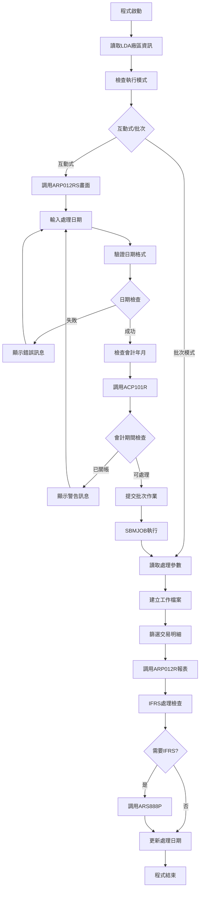
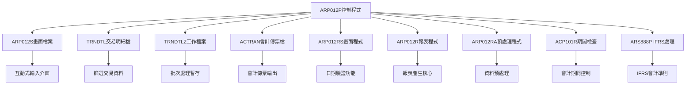
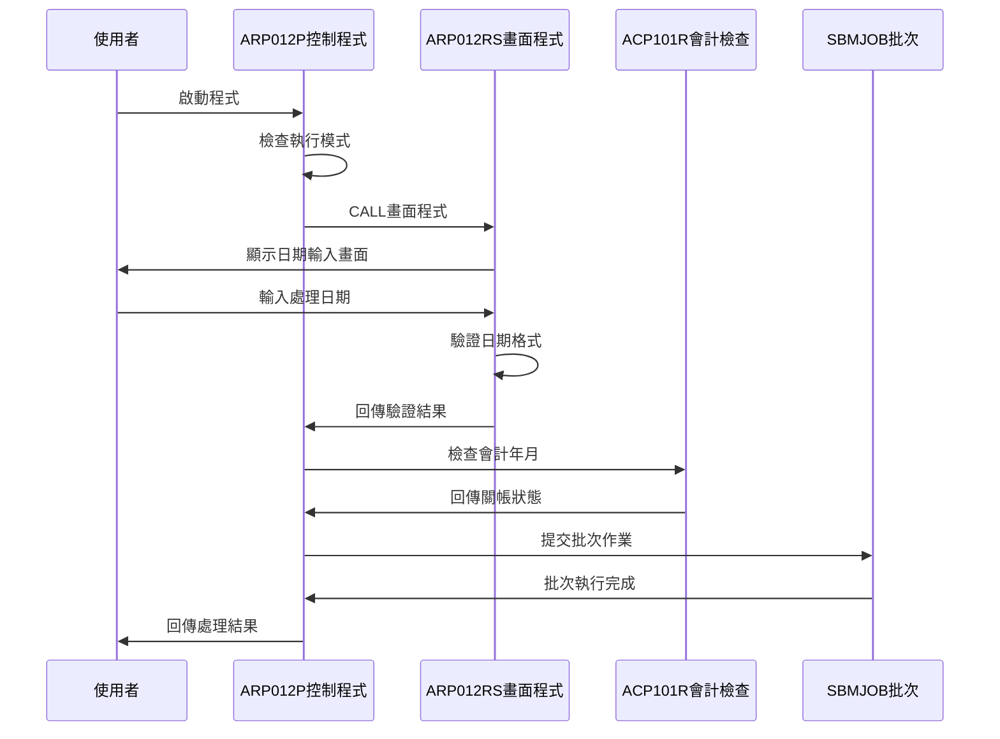
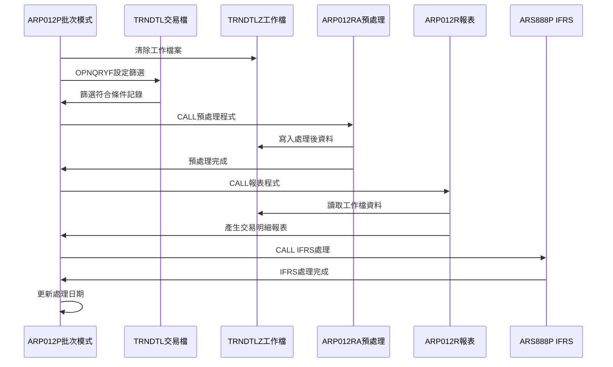
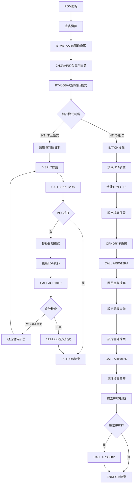

# ARP012P_K02 程式規格書

## 1. 基本資料

| 項目 | 內容 |
|------|------|
| **程式編號** | ARP012P |
| **程式名稱** | 應收帳款交易明細報表作業 |
| **程式類型** | CLP |
| **廠區** | K02 |
| **系統名稱** | 應收帳款系統 |
| **子系統** | 交易明細管理 |
| **檔案位置** | K02CLSRC_THSRC/ARP012P.txt |

## 🎯 2. 程式功能說明

### 主要功能描述
ARP012P是應收帳款交易明細報表作業的控制程式，負責處理交易明細的查詢、篩選和報表產生作業。程式提供互動式畫面輸入和批次處理雙重模式，支援多廠區交易明細管理和IFRS會計準則相關處理。

### 🎯 業務流程詳細說明

#### 完整業務流程圖


#### 業務流程關鍵階段說明

**階段一：環境初始化與模式判斷**
- 從LDA讀取廠區代碼設定ACCTLDTA資料區名稱
- 使用RTVJOBA檢查執行類型(互動式='1'/批次='0')
- 互動式模式進入畫面處理，批次模式直接執行作業

**階段二：互動式處理階段**
- 調用ARP012RS進行日期輸入和驗證
- 檢查日期格式正確性和合理性範圍
- 調用ACP101R檢查會計年月是否已關帳
- 關帳期間發出警告訊息並返回重新輸入
- 通過檢查後提交批次作業執行實際處理

**階段三：批次資料處理階段**
- 清除TRNDTLZ工作檔案準備處理
- 使用OPNQRYF篩選條件：
  * TXVUNO='        '(傳票號碼空白)
  * TXCODE='AR05'(應收帳款交易)
  * TXFLAG<>'D'(非刪除記錄)
  * TXACDT=處理日期
  * TXTXAR=廠區代碼
- 調用ARP012RA進行資料預處理
- 建立報表查詢檔案進行排序和分組

**階段四：報表產生與IFRS處理**
- 調用ARP012R產生交易明細報表
- 檢查IFRS控制日期決定是否執行IFRS處理
- 處理日期小於IFRS啟用日期時調用ARS888P
- 更新ARCTLDTA最新處理日期記錄

## 🎯 3. 檔案架構與關聯圖

### 使用檔案清單

| 檔案名稱 | 檔案用途 | 存取方式 | 關聯說明 |
|---------|----------|----------|----------|
| **ARP012S** | 日期輸入畫面 | WORKSTN | 互動式輸入介面 |
| **TRNDTL** | 交易明細主檔 | INPUT | 原始交易資料來源 |
| **TRNDTLZ** | 交易明細工作檔 | OUTPUT | 批次處理工作檔 |
| **ACTRAN** | 會計傳票檔案 | OUTPUT | 依廠區動態命名 |
| **ARP012RS** | 畫面處理程式 | CALL | 日期輸入驗證 |
| **ARP012R** | 報表處理程式 | CALL | 主要報表生成 |
| **ARP012RA** | 資料預處理程式 | CALL | 資料篩選整理 |
| **ACP101R** | 會計期間檢查 | CALL | 關帳狀態驗證 |
| **ARS888P** | IFRS處理程式 | CALL | 國際會計準則 |

### 🎯 檔案關聯詳細視覺化圖表



### 🎯 資料流向詳細說明

#### 互動式操作的資料流向


#### 批次處理階段的資料流向


## 🎯 4. 檔案欄位規格說明

### 主要變數結構

#### CLP程式變數定義
| 變數名稱 | 資料型態 | 長度 | 用途說明 |
|---------|----------|------|----------|
| **&P#YYMM** | CHAR | 6 | 會計年月(YYMMDD格式) |
| **&P#DATE** | CHAR | 8 | 處理日期(YYYYMMDD) |
| **&P#CODE** | CHAR | 1 | 會計檢查回傳碼 |
| **&INT** | CHAR | 1 | 執行模式(1=互動/0=批次) |
| **&OUTQ** | CHAR | 10 | 輸出佇列名稱 |
| **&IN03** | LGL | 1 | F3功能鍵指示器 |
| **&DATE** | DEC | 8,0 | 數值型日期 |
| **&DATEA** | CHAR | 8 | 字元型日期A |
| **&DATEB** | CHAR | 8 | 字元型日期B |
| **&AREA** | CHAR | 1 | 廠區代碼 |
| **&Y** | CHAR | 4 | 年份 |
| **&M** | CHAR | 2 | 月份 |
| **&DTARA** | CHAR | 11 | 資料區名稱 |
| **&WSID** | CHAR | 10 | 工作站ID |
| **&D#VNO1** | CHAR | 6 | 傳票號碼起始 |
| **&D#VNO2** | CHAR | 6 | 傳票號碼結束 |
| **&YM** | CHAR | 6 | 年月 |
| **&IFRSD** | CHAR | 8 | IFRS啟用日期 |
| **&D#DATE** | CHAR | 8 | 處理日期控制 |

### 🔍 重點欄位切割技術詳解

#### LDA資料區切割視覺化：
```
LDA記錄：[YYYYMMDD|A|.......................|工作站ID__|X|.....|保留區................|FXXXXX|....|FXXXXX|..]
位置:    001-08   09 010-1010             1011-1020 1021 1022-200 201-206               207-210 211-216 217-1024
         ↓        ↓  ↓                    ↓         ↓    ↓        ↓                     ↓       ↓       ↓
處理日期: [20240315]                                                                              處理日期主儲存
廠區設定:         [K]                                                                             批次模式廠區識別
系統預留:           [...................] 系統預留空間
工作站ID:                               [TERM01___]                                               使用者終端
廠區代碼:                                         [K]                                           廠區主識別
預留區間:                                           [........]                                  預留緩衝空間
IFRS起始:                                                    [F00001]                           IFRS傳票起始號
緩衝區A:                                                            [....]                     保留緩衝區
IFRS結束:                                                                   [F99999]             IFRS傳票結束號
尾端保留:                                                                           [........]   尾端保留區域
```

##### LDA切割邏輯說明：
**切割策略**：LDA採用多重區域劃分法，利用AS/400系統的RTVDTAARA和CHGDTAARA指令進行精確位置存取
**關鍵技術**：
1. **重疊讀取法**：從位置1開始，使用不同長度參數讀取年、月、日期等資料
2. **區域功能化**：不同位置範圍分配給不同功能模組使用
3. **動態識別**：位置9和1021的雙重廠區代碼存放機制
4. **IFRS專區**：位置201-216專門用於IFRS會計準則處理

**存取範例**：
- RTVDTAARA DTAARA(*LDA (1 8)) RTNVAR(&DATEA) - 讀取位置1-8的完整處理日期
- CHGDTAARA DTAARA(*LDA (9 1)) VALUE(&AREA) - 設定位置9的批次廠區代碼

#### LDA重疊讀取切割視覺化：
```
位置重疊：[2|0|2|4|0|3|1|5]
位置:     1 2 3 4 5 6 7 8
          ↓   ↓   ↓   ↓
年份:     [2024]                 4字元年份提取
年月:     [202403]               6字元年月提取  
完整日期: [20240315]             8字元完整日期
月份:           [03]             2字元月份提取
```

##### 重疊讀取切割邏輯說明：
**切割原理**：利用相同記憶體位置的不同長度讀取，實現一次儲存多次使用的效率優化
**技術實現**：
1. **位置重疊技術**：從位置1開始，使用不同長度參數讀取不同資料粒度
2. **長度控制法**：透過RTVDTAARA的長度參數精確控制讀取範圍
3. **資料分解**：將8位完整日期分解為4位年份、6位年月、2位月份
4. **記憶體效率**：減少LDA空間使用，提高資料存取效率

**讀取邏輯**：
- 位置1-4：年份(&Y) = '2024'
- 位置1-6：年月(&YM) = '202403'  
- 位置1-8：完整日期(&DATEA) = '20240315'
- 位置5-6：月份(&M) = '03'

#### MAPFLD轉換切割視覺化：
```
轉換階段：[20240315] → ['20240315'] → ['202403']
階段:     原始日期     CHAR轉換      年月切割
位置:     12345678     12345678      123456
          ↓            ↓             ↓
TXACDT:   [20240315]                 原始會計日期
ACDT:                  ['20240315']  字元轉換
TXFL02:                              ['03'] %SST(TXPCNO 1 1)切割第1字元
```

##### MAPFLD轉換切割邏輯說明：
**切割策略**：雙重轉換法，結合直接欄位映射與%SST字串切割技術
**技術核心**：
1. **直接映射**：ACDT TXACDT *CHAR 8 將數值日期轉為字元格式
2. **字串切割**：%SST(TXPCNO 1 1) 提取產品代碼的第1個字元作為分類依據
3. **欄位重定義**：將原始欄位重新定義為查詢需要的格式
4. **效能優化**：在OPNQRYF層級進行轉換，避免程式內二次處理

**轉換邏輯**：
- 階段1：TXACDT → ACDT(*CHAR 8) 日期字元化
- 階段2：TXPCNO → TXFL02('%SST(TXPCNO 1 1)') 產品代碼首字元提取

#### OPNQRYF篩選條件切割視覺化：
```
篩選條件：[TXVUNO=''] AND [TXCODE='AR05'] AND [TXFLAG≠'D'] AND [ACDT=DATE] AND [TXTXAR=AREA]
條件:     條件1         條件2            條件3           條件4        條件5
          ↓             ↓                ↓               ↓            ↓
廠商篩選: [空值]                                                      排除有廠商代碼記錄
代碼限制:               [AR05]                                        限制交易代碼為AR05
刪除檢查:                                [≠D]                         排除已刪除記錄
日期篩選:                                                [20240315]   指定處理日期
廠區篩選:                                                             [K] 指定廠區代碼
```

##### OPNQRYF篩選切割邏輯說明：
**切割策略**：五重條件組合篩選，採用AND邏輯鏈實現精確資料過濾
**邏輯架構**：
1. **串聯篩選法**：5個條件必須全部通過，任一失敗即排除記錄
2. **優先順序**：廠商→代碼→刪除→日期→廠區，按業務重要性排序
3. **動態變數**：使用||運算子將CLP變數嵌入查詢條件
4. **條件隔離**：每個條件獨立評估，避免條件間相互影響

**篩選邏輯**：
- 條件1：TXVUNO *EQ "        " (廠商代碼為空白，內部交易)
- 條件2：TXCODE *EQ "AR05" (交易代碼為AR05)
- 條件3：TXFLAG *NE "D" (排除標記刪除記錄)
- 條件4：ACDT *EQ &DATEA (符合處理日期)
- 條件5：TXTXAR *EQ &AREA (符合指定廠區)

#### 檔案名稱組合切割視覺化：
```
檔案組合：[AC] + [廠區] + [R] = [會計檔名]
組合:     前綴   變動     後綴   結果
          ↓      ↓        ↓      ↓
前綴:     [AC]                   會計檔案前綴
廠區:            [K]             K02廠區代碼
後綴:                     [R]    記錄檔案後綴
結果:                            [ACKR] K02廠區會計傳票檔
```

##### 檔案名稱組合切割邏輯說明：
**切割策略**：三段式字串拼接法，透過固定前後綴與變動廠區代碼實現動態檔案命名
**組合原理**：
1. **前綴識別**：'AC'代表會計(Accounting)檔案類型
2. **廠區變數**：從LDA讀取的廠區代碼作為變動識別符
3. **後綴分類**：'R'代表記錄(Record)檔案格式
4. **字串串接**：使用||運算子進行CLP字串拼接

**組合邏輯**：
- 步驟1：固定前綴 'AC' (會計檔案識別)
- 步驟2：動態廠區 &AREA (從LDA位置1021讀取)
- 步驟3：固定後綴 'R' (記錄檔案標識)
- 最終：'AC' || &AREA || 'R' = 'ACKR'

#### 資料區名稱組合切割視覺化：
```
名稱組合：[ACCTLDTA] + [廠區] = [資料區名稱]
組合:     基本名稱     變動     最終名稱
          ↓            ↓        ↓
基本:     [ACCTLDTA]            會計資料區基本名
廠區:                  [K]      K02廠區識別碼
結果:                           [ACCTLDTAK] K02廠區專屬會計資料區
```

##### 資料區名稱組合切割邏輯說明：
**切割策略**：雙段式字串拼接法，透過基本名稱與廠區標識符實現動態資料區命名
**組合架構**：
1. **基本標識**：'ACCTLDTA'代表會計帳款主資料區(ACCounting Ledger DaTa Area)
2. **廠區後綴**：廠區代碼直接附加，無分隔符號
3. **動態變數**：&AREA從LDA位置1021動態讀取
4. ***CAT運算**：CLP的字串串接運算子

**組合邏輯**：
- 步驟1：基本識別 'ACCTLDTA' (會計主資料區標識)
- 步驟2：串接運算子 *CAT (字串拼接指令)
- 步驟3：廠區變數 &AREA (動態廠區代碼)
- 最終：'ACCTLDTA' *CAT &AREA = 'ACCTLDTAK'

#### IFRS控制切割視覺化：
```
IFRS判斷：[處理日期] < [IFRS控制] = [處理結果]
比較:     待處理     比較算子  控制基準   執行判斷
          ↓          ↓        ↓          ↓
處理日期: [20240315]                     待處理的日期
比較符號:            [<]                 小於比較
控制日期:                     [20240401] IFRS啟用基準
判斷結果:                                [✓執行IFRS] 需要執行IFRS處理
```

##### IFRS控制切割邏輯說明：
**切割策略**：時間軸比較法，透過日期字元比較判斷是否需要執行IFRS會計準則處理
**比較機制**：
1. **字元比較**：CLP使用*LT運算子進行字元序列比較
2. **時間邏輯**：YYYYMMDD格式確保字典序等同時間序
3. **控制切點**：IFRS啟用日期作為處理分界點
4. **條件執行**：只有早於IFRS啟用期間的資料才需要特殊處理

**判斷邏輯**：
- 讀取：RTVDTAARA DTAARA(ARIFRSCTL (1 8)) RTNVAR(&IFRSD)
- 比較：IF COND(&DATEA *LT &IFRSD)
- 範例：'20240315' < '20240401' = TRUE (需要IFRS處理)
- 範例：'20240405' < '20240401' = FALSE (不需要IFRS處理)

#### ARCTLDTA控制區切割視覺化：
```
控制區：[最新處理日期] 與 [當前處理日期] = [更新判斷]
比較:   儲存值         輸入值         更新邏輯
        ↓              ↓              ↓
儲存值: [20240314]                     ARCTLDTA中的最新日期
輸入值:                [20240315]      當前處理的日期
判斷:                                 [✓更新] 當前日期較新，需要更新
```

##### ARCTLDTA控制切割邏輯說明：
**切割策略**：日期比較更新法，確保記錄系統最新處理日期
**控制機制**：
1. **日期比較**：*GT運算子比較當前處理日期與儲存的最新日期
2. **條件更新**：只有當前日期較新時才更新ARCTLDTA
3. **處理記錄**：維護系統處理日期的連續性記錄
4. **避免倒退**：防止使用較舊的日期覆蓋較新的處理記錄

**更新邏輯**：
- 讀取：RTVDTAARA DTAARA(ARCTLDTA (1 8)) RTNVAR(&D#DATE)
- 比較：IF COND(&DATEA *GT &D#DATE)
- 更新：CHGDTAARA DTAARA(ARCTLDTA (1 8)) VALUE(&DATEA)

### 🎯 欄位挪用詳細分析

#### LDA多用途挪用分析
| 位置範圍 | 原始用途 | 實際挪用 | 挪用原因 |
|----------|----------|----------|----------|
| **1-8** | 暫存區域 | 處理日期存放 | 跨程式日期傳遞 |
| **9** | 暫存區域 | 廠區代碼設定 | 批次模式廠區識別 |
| **201-206** | 保留區域 | IFRS傳票號碼起始 | IFRS處理範圍控制 |
| **211-216** | 保留區域 | IFRS傳票號碼結束 | IFRS處理範圍控制 |
| **1011-1020** | 使用者資訊 | 工作站識別 | 訊息發送目標 |
| **1021** | 環境設定 | 廠區代碼 | 多廠區環境識別 |

#### 檔案覆蓋技術應用
```
動態檔案命名：
ACTRAN → 'AC' || &AREA || 'R'

實際對應：
K02廠區: ACKR (ACK02R簡稱)
P02廠區: ACPR (ACP02R簡稱)
U01廠區: ACUR (ACU01R簡稱)
```

## 🎯 5. 輸出/入螢幕布局

### 🎯 主輸入畫面(ARP012S)

```
+----------------------------------------------------------+
|  99/12/26    東鋼企業股份有限公司              ARP012S   |
|  09:30:25      應收帳款交易明細報表作業          DEVNAME |
|                                                          |
|                                                          |
|                                                          |
|                                                          |
|                      報表產生:                          |
| 廠區代碼:[K] ( P:台北 L:林口 T:桃園                     |
|              M:台中 K:高雄 H:其他)                      |
|                                                          |
| 報表日期:[  /  /  ]                                     |
|                                                          |
|                                                          |
|                                                          |
|                                                          |
|                                                          |
|                                                          |
|                                                          |
|                                                          |
|                                                          |
| [錯誤訊息顯示區]                                          |
| ENTER:確認                    PF03:離開                  |
+----------------------------------------------------------+
```

### 🎯 畫面欄位詳細說明

#### 輸入欄位規格
| 欄位名稱 | 型態 | 長度 | 輸入格式 | 驗證規則 | 說明 |
|---------|------|------|----------|----------|------|
| **AREA** | 字元 | 1 | P/L/T/M/K/H | 廠區代碼檢查 | 廠區代碼(唯讀顯示) |
| **DATE** | 數值 | 8 | YYYY/MM/DD | 日期格式驗證 | 報表處理日期(必填) |

#### 顯示欄位規格
| 欄位名稱 | 型態 | 長度 | 顯示格式 | 說明 |
|---------|------|------|----------|------|
| **COMP** | 字元 | 35 | 左對齊 | 公司名稱 |
| **DEVNM** | 字元 | 10 | 右對齊 | 終端機名稱 |
| **ERRMSG** | 字元 | 70 | 左對齊反白 | 錯誤訊息顯示 |

### 🎯 畫面控制邏輯

#### 指示器控制
| 指示器 | 控制邏輯 | 畫面效果 |
|--------|----------|----------|
| **IN41** | 日期錯誤時設定 | DATE欄位反白並強制輸入 |
| **IN99** | 程式結束控制 | 設定後結束畫面處理 |

### 功能鍵詳細定義

| 功能鍵 | 處理邏輯 | 系統行為 |
|--------|----------|----------|
| **F3** | 離開程式 | 設定*IN03='1'，結束程式執行 |
| **ENTER** | 確認處理 | 執行日期驗證和批次作業提交 |

## 🎯 6. 處理流程程序說明

### 🎯 主程序邏輯深度分析

#### 程式執行流程圖


#### 🎯 詳細處理步驟逐一分析

**步驟1: 環境初始化處理**
1. 宣告所有CLP變數並設定初始型態
2. 從LDA位置1021讀取廠區代碼存入&AREA
3. 組合資料區名稱：'ACCTLDTA' || &AREA
4. 使用RTVJOBA取得執行類型和輸出佇列

**步驟2: 互動式模式處理邏輯**
1. 從廠區資料區讀取上次處理日期(&DATEB)
2. 從LDA讀取工作站ID供後續訊息發送使用
3. 進入DISPLY迴圈調用ARP012RS畫面程式
4. 畫面程式驗證日期格式和合理性範圍
5. 檢查F3功能鍵，按下則RETURN結束程式
6. 轉換日期格式並更新LDA暫存區域
7. 調用ACP101R檢查會計年月關帳狀態
8. 關帳期間發送警告訊息並返回重新輸入
9. 通過檢查後使用SBMJOB提交批次作業

**步驟3: 批次模式核心處理**
1. 從LDA讀取處理日期、年份、月份、廠區等參數
2. 清除TRNDTLZ工作檔案準備資料處理
3. 設定TRNDTL和TRNDTLK檔案覆蓋為共享模式
4. 建立OPNQRYF查詢篩選條件：
   - TXVUNO='        '：傳票號碼為空白
   - TXCODE='AR05'：應收帳款交易類型
   - TXFLAG<>'D'：非刪除記錄狀態
   - ACDT=處理日期：指定日期交易
   - TXTXAR=廠區：對應廠區交易
5. 調用ARP012RA進行資料預處理和篩選

**步驟4: 報表處理與檔案管理**
1. 關閉TRNDTL查詢檔案釋放資源
2. 設定TRNDTLZ工作檔案為共享模式存取
3. 建立報表用OPNQRYF依關鍵欄位排序：
   - TXFL02：處理標記
   - TXRESV：保留欄位
   - TXCUNO：客戶編號
   - TXIVNO：發票號碼
   - TXUPRC：單價
   - TXSTNO：規格編號
4. 設定ACTRAN會計傳票檔案覆蓋為廠區檔案
5. 設定QPRINT報表格式(176行寬，13.3字元間距)
6. 調用ARP012R產生交易明細報表

**步驟5: IFRS處理與收尾作業**
1. 關閉所有查詢檔案並刪除檔案覆蓋
2. 從ARCTLDTA讀取上次處理日期進行比較
3. 處理日期較新時更新ARCTLDTA記錄
4. 從ARIFRSCTL讀取IFRS啟用控制日期
5. 處理日期小於IFRS啟用日期時執行IFRS處理：
   - 從LDA讀取傳票號碼範圍(&D#VNO1, &D#VNO2)
   - 調用ARS888P進行IFRS會計準則處理
6. 執行ENDPGM正常結束程式

### 🎯 子程序邏輯分析

#### 日期驗證邏輯(ARP012RS)
1. **格式驗證**：調用UTS102R檢查YYYYMMDD格式
2. **範圍檢查**：處理日期不可大於系統日期
3. **錯誤處理**：設定指示器41進行欄位反白
4. **使用者互動**：錯誤時保持畫面等待重新輸入

#### 會計期間控制邏輯(ACP101R)
1. **年月檢查**：傳入處理日期的年月部分
2. **關帳狀態**：回傳P#CODE='1'表示已關帳
3. **警告機制**：已關帳時發送即時訊息
4. **流程控制**：關帳期間阻止批次作業執行

#### IFRS處理判斷邏輯
1. **日期比較**：處理日期 < IFRS啟用日期
2. **範圍傳遞**：傳票號碼起始和結束範圍
3. **廠區識別**：傳遞廠區代碼進行分類處理
4. **年月參數**：傳遞處理年月供IFRS分析

### 🎯 特殊邏輯處理

#### 動態檔案命名技術
- 會計傳票檔案依廠區動態命名：'AC'+廠區+'R'
- 資料區名稱依廠區組合：'ACCTLDTA'+廠區代碼
- 支援多廠區獨立處理避免資料混合

#### 批次作業控制機制
- SBMJOB使用相同程式名稱但批次模式執行
- 作業描述檔(ARJOBD)和作業佇列(不指定則用預設)
- 輸出佇列依互動式使用者設定自動繼承

#### 檔案共享與鎖定控制
- SHARE(*YES)設定允許多使用者同時存取
- OPNQRYF使用OPTION(*ALL)取得完整存取權限
- 適時關閉檔案(CLOF)釋放系統資源

## 🎯 7. 數據操作與轉換分析

### 檔案操作詳解

#### LDA資料區操作
1. **RTVDTAARA讀取操作**：
   - 語法：RTVDTAARA DTAARA(*LDA (位置 長度)) RTNVAR(&變數)
   - 用途：讀取LDA指定位置的資料到CLP變數
   - 範例：RTVDTAARA DTAARA(*LDA (1021 1)) RTNVAR(&AREA)

2. **CHGDTAARA更新操作**：
   - 語法：CHGDTAARA DTAARA(*LDA (位置 長度)) VALUE(&變數)
   - 用途：將CLP變數值寫入LDA指定位置
   - 範例：CHGDTAARA DTAARA(*LDA (1 8)) VALUE(&DATEA)

#### OPNQRYF查詢檔案操作
1. **篩選條件設定**：
   ```
   QRYSLT條件語法：
   (TXVUNO *EQ "        ") *AND
   (TXCODE *EQ "AR05") *AND  
   (TXFLAG *NE "D") *AND
   (ACDT *EQ "' || &DATEA || '") *AND
   (TXTXAR *EQ "' || &AREA || '")
   ```

2. **欄位對應設定**：
   ```
   MAPFLD對應：
   (ACDT TXACDT *CHAR 8) - 日期欄位格式轉換
   (TXFL02 '%SST(TXPCNO 1 1)') - 字串截取對應
   ```

3. **排序鍵值設定**：
   ```
   KEYFLD排序：
   ((TXFL02) (TXRESV) (TXCUNO) (TXIVNO) (TXUPRC) (TXSTNO))
   ```

### 數據轉換邏輯

#### 日期格式轉換
1. **數值轉字元**：
   - CHGVAR VAR(&DATEA) VALUE(&DATE)
   - 8位數值型日期轉為8字元字串
   - 範例：1131226 → '1131226 '

2. **日期分解**：
   - RTVDTAARA DTAARA(*LDA (1 4)) RTNVAR(&Y) - 提取年份
   - RTVDTAARA DTAARA(*LDA (5 2)) RTNVAR(&M) - 提取月份
   - RTVDTAARA DTAARA(*LDA (1 6)) RTNVAR(&YM) - 提取年月

#### 字串組合操作
1. **資料區名稱組合**：
   - CHGVAR VAR(&DTARA) VALUE('ACCTLDTA' *CAT &AREA)
   - 基本名稱與廠區代碼連接
   - 範例：'ACCTLDTA' + 'K' = 'ACCTLDTAK'

2. **會計檔案名稱組合**：
   - OVRDBF FILE(ACTRAN) TOFILE('AC' || &AREA || 'R')
   - 動態組合會計傳票檔案名稱
   - 範例：'AC' + 'K' + 'R' = 'ACKR'

### 計算邏輯分析

#### 日期比較計算
1. **IFRS日期判斷**：
   - IF COND(&DATEA *LT &IFRSD) - 字元型日期比較
   - 處理日期小於IFRS啟用日期時執行特殊處理
   - 確保會計準則正確適用

2. **處理日期更新**：
   - IF COND(&DATEA *GT &D#DATE) - 比較最新處理日期
   - 較新日期時更新控制檔案記錄
   - 維護系統處理進度追蹤

### 檢核機制詳解

#### 會計期間檢核
1. **關帳狀態檢查**：
   - 調用ACP101R傳入年月參數
   - 回傳P#CODE='1'表示期間已關帳
   - 已關帳期間禁止資料異動

2. **日期合理性檢核**：
   - ARP012RS中檢查日期格式
   - 處理日期不可大於系統日期
   - 確保資料處理的時間邏輯正確

#### 資料存在性檢核
1. **檔案記錄檢核**：
   - OPNQRYF篩選特定條件記錄
   - 確保只處理符合條件的交易
   - 避免處理錯誤或無效資料

2. **廠區代碼檢核**：
   - 從LDA讀取的廠區代碼必須有效
   - 廠區代碼決定檔案命名和資料分類
   - 確保多廠區環境資料正確性

## 🎯 8. 錯誤處理程序說明

### 🎯 詳細錯誤代碼清冊

| 錯誤代碼 | 錯誤訊息 | 原因說明 | 處理方式 | 預防措施 |
|----------|---------|---------|---------|----------|
| **ERR,1** | 日期錯誤 | 輸入日期格式不正確或無效日期 | 1. 重新輸入正確日期格式<br>2. 檢查年月日合理性<br>3. 使用YYYY/MM/DD格式 | 提供日期格式說明和範例 |
| **ERR,2** | 日期不可大於今日 | 處理日期超過系統當前日期 | 1. 輸入今日或以前日期<br>2. 檢查系統日期設定<br>3. 確認業務處理邏輯 | 系統自動帶出合理日期範圍 |
| **P#CODE='1'** | 會計期間已關帳 | 輸入日期所屬會計期間已關帳 | 1. 選擇未關帳期間日期<br>2. 聯繫會計人員確認<br>3. 等待期間重新開啟 | 顯示可處理期間範圍 |
| **檔案鎖定** | 檔案被其他程式使用 | TRNDTL檔案被其他使用者鎖定 | 1. 等待其他使用者完成<br>2. 稍後重新執行<br>3. 聯繫系統管理員 | 設定合理的檔案共享參數 |
| **資料區錯誤** | 無法存取廠區資料區 | ACCTLDTA資料區不存在或損壞 | 1. 檢查資料區是否存在<br>2. 重建資料區結構<br>3. 恢復備份資料 | 定期備份重要資料區 |

### 🎯 系統異常處理邏輯

#### 檔案操作失敗處理
1. **OPNQRYF失敗處理**：
   - 檢查檔案是否存在和可存取權限
   - 驗證查詢條件語法正確性
   - 提供檔案狀態診斷資訊
   - 記錄失敗原因供後續分析

2. **檔案覆蓋失敗處理**：
   - 檢查目標檔案是否存在
   - 驗證檔案結構相容性
   - 確認使用者存取權限
   - 提供替代處理方案

#### 程式調用失敗處理
1. **ARP012RS調用失敗**：
   - 檢查畫面程式是否存在
   - 驗證參數傳遞正確性
   - 提供手動日期輸入替代方案
   - 記錄調用失敗詳細資訊

2. **ACP101R調用失敗**：
   - 檢查會計檢查程式可用性
   - 提供會計期間狀態查詢替代方式
   - 允許強制執行選項(管理員權限)
   - 記錄會計檢查異常狀況

#### 批次作業異常處理
1. **SBMJOB提交失敗**：
   - 檢查作業描述檔(ARJOBD)存在性
   - 驗證使用者批次執行權限
   - 檢查系統資源可用性
   - 提供即時執行替代方案

2. **記憶體不足處理**：
   - 監控工作檔案大小成長
   - 設定合理的資料處理批次大小
   - 適時清理暫存檔案釋放空間
   - 提供分批處理選項

#### 資料完整性錯誤處理
1. **交易資料不一致**：
   - 重新讀取交易明細檔案
   - 同步更新相關檔案狀態
   - 防止部分處理造成資料錯亂
   - 提供資料一致性檢查機制

2. **多廠區資料衝突**：
   - 檢查廠區代碼設定正確性
   - 確認資料區廠區參數一致
   - 避免跨廠區資料誤用
   - 建立廠區資料隔離機制

## 🎯 9. 備註

### 🎯 特殊注意事項

#### 多廠區環境控制
- 程式依靠LDA位置1021的廠區代碼進行環境區分
- 資料區名稱和會計檔案名稱都會依廠區動態組合
- 確保不同廠區的資料完全獨立處理避免混淆

#### IFRS會計準則處理
- 系統根據ARIFRSCTL控制檔判斷是否執行IFRS處理
- 處理日期早於IFRS啟用日期時才執行ARS888P程式
- IFRS處理使用LDA位置201-216的傳票號碼範圍控制

#### 批次作業執行控制
- 互動式和批次模式使用相同程式但執行路徑不同
- SBMJOB提交的批次作業會自動檢測為批次模式執行
- 批次模式直接從BATCH標籤開始執行避免畫面處理

#### 檔案共享機制
- 所有檔案都設定SHARE(*YES)支援多使用者同時存取
- OPNQRYF查詢檔案使用後必須使用CLOF適時關閉
- 檔案覆蓋使用DLTOVR FILE(*ALL)統一清除避免影響其他程式

#### 日期處理注意事項
- 系統使用民國年格式進行日期處理和儲存
- 日期驗證包含格式檢查和合理性範圍檢查
- 會計期間檢查確保不會處理已關帳期間的資料

#### 錯誤訊息處理
- 互動式模式的錯誤會透過畫面顯示供使用者處理
- 批次模式的錯誤會記錄到作業日誌供後續查看
- 關帳期間的警告訊息會即時發送到使用者工作站 