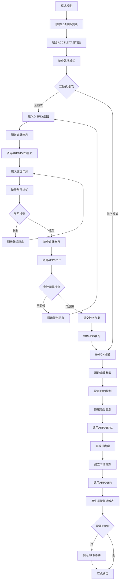
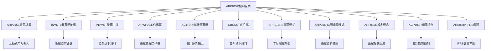
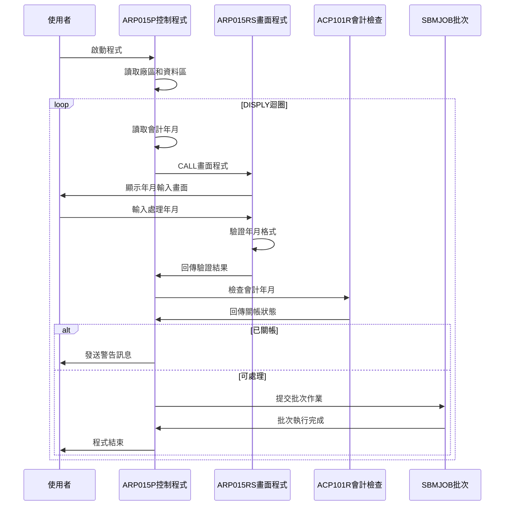
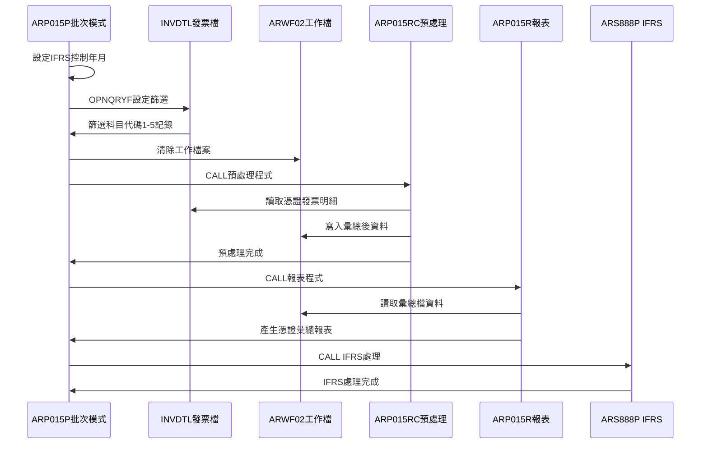
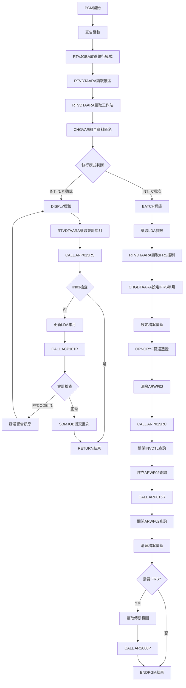

# ARP015P_K02 程式規格書

## 1. 基本資料

| 項目 | 內容 |
|------|------|
| **程式編號** | ARP015P |
| **程式名稱** | 應收憑證彙總報表作業 |
| **程式類型** | CLP |
| **廠區** | K02 |
| **系統名稱** | 應收帳款系統 |
| **子系統** | 憑證彙總管理 |
| **檔案位置** | K02CLSRC_THSRC/ARP015P.txt |

## 🎯 2. 程式功能說明

### 主要功能描述
ARP015P是應收憑證彙總報表作業的控制程式，負責處理指定年月的發票憑證資料，產生憑證彙總報表和會計傳票。程式專門處理科目代碼1-5的發票資料，提供互動式年月輸入和批次處理雙重模式，支援多廠區憑證管理和IFRS會計準則相關處理。

### 🎯 業務流程詳細說明

#### 完整業務流程圖


#### 業務流程關鍵階段說明

**階段一：環境初始化與參數設定**
- 使用RTVJOBA檢查執行類型和輸出佇列
- 從LDA讀取廠區代碼和工作站ID
- 組合廠區專屬的資料區名稱：'ACCTLDTA'+廠區代碼

**階段二：互動式處理階段**
- 進入DISPLY迴圈持續處理使用者輸入
- 從ACCTLDTA讀取上次處理的會計年月作為預設值
- 調用ARP015RS進行年月輸入和驗證
- 檢查年月格式正確性(YYYYMM格式)
- 調用ACP101R檢查會計年月是否已關帳
- 關帳期間發出警告訊息並返回重新輸入
- 通過檢查後使用SBMJOB提交批次作業

**階段三：憑證發票篩選處理**
- 從ARIFRSCTL讀取IFRS控制年月並設定LDA
- 使用OPNQRYF篩選INVDTL發票明細檔案：
  * IVDECD<>'D'(非刪除記錄)
  * IVFLAG<>'D'(非刪除標記)
  * IVYM=處理年月
  * IVACNT=%RANGE("1" "5")(科目代碼1-5)
- 按發票號碼、訂單號碼、會計日期排序建立查詢檔案

**階段四：憑證彙總處理與報表產生**
- 清除ARWF02工作檔案準備資料處理
- 調用ARP015RC進行憑證資料預處理和彙總
- 建立ARWF02工作檔案查詢按會計日期、保留欄位、編號排序
- 調用ARP015R產生憑證彙總報表
- 根據年月判斷是否執行IFRS處理(年月<IFRS啟用年月)

## 🎯 3. 檔案架構與關聯圖

### 使用檔案清單

| 檔案名稱 | 檔案用途 | 存取方式 | 關聯說明 |
|---------|----------|----------|----------|
| **ARP015S** | 年月輸入畫面 | WORKSTN | 互動式輸入介面 |
| **INVDTL** | 發票明細主檔 | INPUT | 原始憑證發票資料 |
| **INVMST** | 發票主檔 | INPUT | 發票基本資料 |
| **ARWF02** | 憑證工作檔案 | OUTPUT | 批次處理工作檔 |
| **ACTRAN** | 會計傳票檔案 | OUTPUT | 依廠區動態命名 |
| **CBCUST** | 客戶基本檔 | INPUT | 客戶基本資料 |
| **ARP015RS** | 畫面處理程式 | CALL | 年月輸入驗證 |
| **ARP015RC** | 資料預處理程式 | CALL | 憑證資料預處理 |
| **ARP015R** | 報表處理程式 | CALL | 主要報表生成 |
| **ACP101R** | 會計期間檢查 | CALL | 關帳狀態驗證 |
| **ARS888P** | IFRS處理程式 | CALL | 國際會計準則 |

### 🎯 檔案關聯詳細視覺化圖表



### 🎯 資料流向詳細說明

#### 互動式操作的資料流向


#### 批次處理階段的資料流向


## 🎯 4. 檔案欄位規格說明

### 主要變數結構

#### CLP程式變數定義
| 變數名稱 | 資料型態 | 長度 | 用途說明 |
|---------|----------|------|----------|
| **&P#YYMM** | CHAR | 6 | 會計年月(YYMMDD格式) |
| **&P#DATE** | CHAR | 8 | 處理日期(YYYYMMDD) |
| **&P#CODE** | CHAR | 1 | 會計檢查回傳碼 |
| **&INT** | CHAR | 1 | 執行模式(1=互動/0=批次) |
| **&OUTQ** | CHAR | 10 | 輸出佇列名稱 |
| **&IN03** | LGL | 1 | F3功能鍵指示器 |
| **&YMD** | CHAR | 8 | 年月日 |
| **&ACYM** | CHAR | 6 | 會計年月 |
| **&YM** | CHAR | 6 | 處理年月 |
| **&AREA** | CHAR | 1 | 廠區代碼 |
| **&Y** | CHAR | 4 | 年份 |
| **&M** | CHAR | 2 | 月份 |
| **&DTARA** | CHAR | 11 | 資料區名稱 |
| **&WSID** | CHAR | 10 | 工作站ID |
| **&D#VNO1** | CHAR | 6 | 傳票號碼起始 |
| **&D#VNO2** | CHAR | 6 | 傳票號碼結束 |
| **&IFRSD** | CHAR | 6 | IFRS啟用年月 |

### 🔍 重點欄位切割技術詳解

#### *LDA資料區位置切割視覺化
```
*LDA位置分配圖：
位置01-06: [YYYYMM]                    處理年月
位置07-08: [01]                       固定日期補齊
位置09-200: [保留區域]
位置201-206: [DXXXXX]                 IFRS傳票起始號
位置207-210: [保留]
位置211-216: [DXXXXX]                 IFRS傳票結束號
位置217-220: [保留]
位置221-226: [YYYYMM]                 IFRS控制年月
位置227-1010: [保留區域]
位置1011-1020: [XXXXXXXXXX]           工作站ID
位置1021: [X]                         廠區代碼

位置使用視覺化：
&YM = '202312' → CHGDTAARA DTAARA(*LDA (1 6)) VALUE('202312')
固定'01' → CHGDTAARA DTAARA(*LDA (7 2)) VALUE('01')
組合結果：*LDA(1-8) = '20231201'

IFRS控制年月：
&IFRSD = '202401' → CHGDTAARA DTAARA(*LDA (221 6)) VALUE('202401')
```

#### ACCTLDTA動態資料區視覺化
```
動態名稱組合：
CHGVAR VAR(&DTARA) VALUE('ACCTLDTA' *CAT &AREA)

組合邏輯：
[ACCTLDTA] + [X] = [ACCTLDTAX]
    ↓        ↓        ↓
  固定前綴  廠區碼   完整名稱

實際範例：
&AREA = 'K' → &DTARA = 'ACCTLDTAK'
&AREA = 'P' → &DTARA = 'ACCTLDTAP'
&AREA = 'M' → &DTARA = 'ACCTLDTAM'

讀取操作：
RTVDTAARA DTAARA(&DTARA (1 6)) RTNVAR(&ACYM)
實際路徑：ACCTLDTAK → 讀取K02廠區會計年月
```

#### MAPFLD日期轉換切割技術視覺化
```
MAPFLD日期轉換流程：
原始欄位：IVACDT (會計日期)
步驟1：ZONE6 IVACDT *ZONED 8
步驟2：CHAR6 ZONE6 *CHAR 8
步驟3：IVYM '%SST(CHAR6 1 6)' *CHAR 6

轉換流程視覺化：
IVACDT(數值) → ZONE6(ZONED) → CHAR6(字元) → IVYM(年月)
[20231215]   →  [20231215]   → ['20231215'] → ['202312']
     ↓              ↓             ↓            ↓
   原始數值      數值格式      字元格式     年月部分

%SST切割邏輯：
'%SST(CHAR6 1 6)' - 從字元位置1開始取6位
'20231215' → '%SST(位置1, 長度6)' → '202312'

範例：
IVACDT = 20231215 → IVYM = '202312'
IVACDT = 20230331 → IVYM = '202303'
IVACDT = 20240101 → IVYM = '202401'
```

#### %RANGE範圍篩選技術視覺化
```
%RANGE範圍篩選語法：
IVACNT *EQ %RANGE("1" "5")

範圍篩選視覺化：
科目代碼範圍：["1" "2" "3" "4" "5"]
                ↓
            通過篩選的值

篩選邏輯：
IVACNT = '1' → ✓ 通過篩選（在範圍內）
IVACNT = '2' → ✓ 通過篩選（在範圍內）
IVACNT = '3' → ✓ 通過篩選（在範圍內）
IVACNT = '4' → ✓ 通過篩選（在範圍內）
IVACNT = '5' → ✓ 通過篩選（在範圍內）
IVACNT = '6' → ✗ 不通過篩選（超出範圍）
IVACNT = '0' → ✗ 不通過篩選（小於範圍）

等效邏輯：
%RANGE("1" "5") ≡ %VALUES("1" "2" "3" "4" "5")
但%RANGE更簡潔且支援範圍擴展
```

### 🎯 欄位挪用詳細分析

#### LDA多用途挪用分析
| 位置範圍 | 原始用途 | 實際挪用 | 挪用原因 |
|----------|----------|----------|----------|
| **1-6** | 暫存區域 | 處理年月存放 | 跨程式年月傳遞 |
| **7-8** | 暫存區域 | 日期補齊('01') | 年月轉換為完整日期 |
| **201-206** | 保留區域 | IFRS傳票號碼起始 | IFRS處理範圍控制 |
| **211-216** | 保留區域 | IFRS傳票號碼結束 | IFRS處理範圍控制 |
| **221-226** | 保留區域 | IFRS控制年月 | IFRS啟用日期控制 |
| **1011-1020** | 使用者資訊 | 工作站識別 | 訊息發送目標 |
| **1021** | 環境設定 | 廠區代碼 | 多廠區環境識別 |

#### 憑證篩選條件對比分析
```
OPNQRYF複合篩選條件組合：
├─ IVDECD *NE "D"                    (非刪除記錄)
├─ IVFLAG *NE "D"                    (非刪除標記)
├─ IVYM *EQ &YM                      (指定年月匹配)
└─ IVACNT *EQ %RANGE("1" "5")        (科目範圍1-5)

篩選流程視覺化：
憑證記錄 → [刪除檢查] → [標記檢查] → [年月篩選] → [科目篩選] → 最終結果

實際範例：
IVDECD = ' '        ✓ 非刪除記錄
IVFLAG = ' '        ✓ 非刪除標記
IVYM = '202312'     ✓ 年月匹配
IVACNT = '3'        ✓ 科目在範圍內
→ 記錄通過篩選

排序鍵值結構：
KEYFLD((IVNO) (IVORNO) (IVACDT))

排序優先順序：
第1鍵：IVNO     [XXXXXX]     發票號碼（主要排序）
第2鍵：IVORNO   [XXXXXXX]    訂單號碼（次要排序）
第3鍵：IVACDT   [XXXXXXXX]   會計日期（最終排序）

排序範例：
記錄A：IVNO='123456', IVORNO='ORD001', IVACDT=20231201
記錄B：IVNO='123456', IVORNO='ORD001', IVACDT=20231215
記錄C：IVNO='123456', IVORNO='ORD002', IVACDT=20231201
記錄D：IVNO='123457', IVORNO='ORD001', IVACDT=20231201

排序結果：A → B → C → D
```

#### 傳票號碼範圍控制視覺化
```
傳票號碼範圍分配：
標準傳票範圍：'G00000' - 'G99999'
IFRS傳票範圍：從*LDA動態讀取

範圍結構視覺化：
標準範圍：[G][00000] - [G][99999]
           ↓   ↓         ↓   ↓
         前綴 起始      前綴 結束

IFRS範圍：[D][XXXXX] - [D][XXXXX]
           ↓   ↓         ↓   ↓
         前綴 起始      前綴 結束

*LDA位置讀取：
位置201-206: [DXXXXX] → &D#VNO1 (起始)
位置211-216: [DXXXXX] → &D#VNO2 (結束)

實際範例：
標準處理：G00001, G00002, ..., G99999
IFRS處理：D00001, D00002, ..., D99999

年月比較邏輯：
IF (&YM *LT &IFRSD) THEN(執行IFRS處理)
範例：
&YM = '202312', &IFRSD = '202401'
比較：'202312' < '202401' → 執行IFRS處理
```

#### 年月日期組合技術視覺化
```
年月日期組合邏輯：
輸入：&YM = '202312'
步驟1：CHGDTAARA DTAARA(*LDA (1 6)) VALUE('202312')
步驟2：CHGDTAARA DTAARA(*LDA (7 2)) VALUE('01')

*LDA位置組合：
位置1-6：  [202312]    年月部分
位置7-8：  [01]        固定日期
組合結果： [20231201]  完整日期

用途分析：
*LDA(1-6) → &P#YYMM (會計年月)
*LDA(1-8) → &P#DATE (會計日期)

ACP101R參數傳遞：
CALL PGM(ACP101R) PARM(&P#YYMM &P#CODE)
傳遞：&P#YYMM = '202312'

實際流程：
輸入 → *LDA存儲 → 讀取切割 → 程式傳遞
'202312' → [202312|01] → '202312' → ACP101R
```

#### 檔案覆蓋技術視覺化
```
會計檔案覆蓋：
OVRDBF FILE(ACTRAN) TOFILE('AC' || &AREA || 'R')

組合視覺化：
[AC] + [X] + [R] = [ACXR]
  ↓    ↓    ↓      ↓
前綴  廠區  後綴   檔名

實際範例：
&AREA = 'K' → ACKR
&AREA = 'P' → ACPR
&AREA = 'M' → ACMR

ARWF02工作檔處理：
1. OVRDBF FILE(ARWF02) TOFILE(ARWF02) SHARE(*YES)
2. CLRPFM FILE(ARWF02)                     ← 清除舊資料
3. CALL PGM(ARP015RC)                      ← 填入新資料
4. OPNQRYF FILE((ARWF02)) KEYFLD(...)      ← 建立查詢
5. CALL PGM(ARP015R)                       ← 報表處理
6. CLOF OPNID(ARWF02)                      ← 關閉查詢

工作檔排序：
KEYFLD((W2ACDT) (W2RESV) (W2NO))
第1鍵：W2ACDT (會計日期)
第2鍵：W2RESV (保留欄位)
第3鍵：W2NO (編號)
```

## 🎯 5. 輸出/入螢幕布局

### 🎯 主輸入畫面(ARP015S)

```
+----------------------------------------------------------+
|  99/12/26    東鋼企業股份有限公司              ARP015S   |
|  09:30:25      應收憑證彙總報表作業              DEVNAME |
|                                                          |
|                                                          |
|                                                          |
|                                                          |
|                      報表產生:                          |
| 廠區代碼:[K] (P:台北K:高雄M:台中)                       |
|                                                          |
| 報表年月:[____]                                         |
|                                                          |
|                                                          |
|                                                          |
|                                                          |
|                                                          |
|                                                          |
|                                                          |
|                                                          |
|                                                          |
| [錯誤訊息顯示區]                                          |
| ENTER:確認                    PF03:離開                  |
+----------------------------------------------------------+
```

### 🎯 畫面欄位詳細說明

#### 輸入欄位規格
| 欄位名稱 | 型態 | 長度 | 輸入格式 | 驗證規則 | 說明 |
|---------|------|------|----------|----------|------|
| **AREA** | 字元 | 1 | P/K/M | 廠區代碼檢查 | 廠區代碼(唯讀顯示) |
| **YM** | 數值 | 6 | YYYYMM | 年月格式驗證 | 處理年月(必填) |

#### 顯示欄位規格
| 欄位名稱 | 型態 | 長度 | 顯示格式 | 說明 |
|---------|------|------|----------|------|
| **COMP** | 字元 | 35 | 左對齊 | 公司名稱 |
| **DEVNM** | 字元 | 10 | 右對齊 | 終端機名稱 |
| **ERRMSG** | 字元 | 70 | 左對齊反白 | 錯誤訊息顯示 |

### 🎯 畫面控制邏輯

#### 指示器控制
| 指示器 | 控制邏輯 | 畫面效果 |
|--------|----------|----------|
| **IN41** | 年月錯誤時設定 | YM欄位反白並強制輸入 |
| **IN99** | 程式結束控制 | 設定後結束畫面處理 |

### 功能鍵詳細定義

| 功能鍵 | 處理邏輯 | 系統行為 |
|--------|----------|----------|
| **F3** | 離開程式 | 設定*IN03='1'，結束程式執行 |
| **ENTER** | 確認處理 | 執行年月驗證和批次作業提交 |

## 🎯 6. 處理流程程序說明

### 🎯 主程序邏輯深度分析

#### 程式執行流程圖


#### 🎯 詳細處理步驟逐一分析

**步驟1: 環境初始化處理**
1. 宣告所有CLP變數並設定初始型態
2. 使用RTVJOBA取得執行類型和輸出佇列
3. 從LDA位置1021讀取廠區代碼存入&AREA
4. 從LDA位置1011-1020讀取工作站ID存入&WSID
5. 組合資料區名稱：'ACCTLDTA' || &AREA

**步驟2: 互動式模式處理邏輯**
1. 進入DISPLY迴圈標籤，可重複執行
2. 從ACCTLDTA資料區讀取上次處理的會計年月作為預設值
3. 調用ARP015RS畫面程式進行年月輸入和驗證
4. 檢查F3功能鍵，按下則RETURN結束程式
5. 將年月存入LDA位置1-6，日期部分設為'01'
6. 調用ACP101R檢查會計年月關帳狀態
7. 關帳期間發送警告訊息並GOTO返回DISPLY標籤
8. 通過檢查後使用SBMJOB提交批次作業並RETURN結束

**步驟3: 批次模式核心處理**
1. 從LDA讀取處理年月、年份、月份、廠區等參數
2. 從ARIFRSCTL資料區讀取IFRS控制年月
3. 將IFRS控制年月設定到LDA位置221-226
4. 設定INVDTL檔案共享模式存取
5. 設定INVMST發票主檔覆蓋
6. 建立OPNQRYF查詢篩選條件：
   - IVDECD<>'D'：非刪除記錄
   - IVFLAG<>'D'：非刪除標記
   - IVYM=處理年月：指定年月的發票
   - IVACNT=%RANGE("1" "5")：科目代碼1-5
7. 按發票號碼、訂單號碼、會計日期排序

**步驟4: 憑證彙總處理與報表產生**
1. 設定ACTRAN會計傳票檔案覆蓋為廠區檔案
2. 設定ARWF02工作檔案為共享模式
3. 清除ARWF02工作檔案準備資料處理
4. 調用ARP015RC進行憑證資料預處理和彙總：
   - 讀取INVDTL憑證發票明細記錄
   - 根據廠區進行憑證分類處理
   - 進行憑證資料彙總計算
   - 寫入ARWF02工作檔案
5. 關閉INVDTL查詢檔案釋放資源
6. 建立ARWF02查詢檔案按會計日期、保留欄位、編號排序
7. 調用ARP015R產生憑證彙總報表

**步驟5: IFRS處理與收尾作業**
1. 關閉ARWF02查詢檔案並刪除檔案覆蓋
2. 檢查處理年月是否小於IFRS控制年月
3. 需要IFRS處理時：
   - 從LDA位置201-206讀取傳票號碼起始
   - 從LDA位置211-216讀取傳票號碼結束
   - 調用ARS888P進行IFRS會計準則處理
   - 傳遞廠區、年月、傳票範圍參數
4. 執行ENDPGM正常結束程式

### 🎯 子程序邏輯分析

#### 年月驗證邏輯(ARP015RS)
1. **格式驗證**：調用UTS102R檢查YYYYMM年月格式
2. **範圍檢查**：年月合理性驗證
3. **錯誤處理**：設定指示器41進行欄位反白
4. **使用者互動**：錯誤時保持畫面等待重新輸入

#### 憑證彙總預處理邏輯(ARP015RC)
1. **傳票範圍設定**：使用G00000-G99999傳票號碼範圍
2. **廠區分類**：根據TXAR廠區進行憑證分類
3. **客戶資料**：CHAIN CBCUST讀取客戶基本資料
4. **憑證彙總**：將憑證資料進行分類彙總
5. **傳票處理**：產生會計傳票記錄到ACTRAN檔案
6. **工作檔案**：將彙總結果寫入ARWF02工作檔案

#### 彙總報表生成邏輯(ARP015R)
1. **資料讀取**：從ARWF02工作檔案讀取彙總後資料
2. **報表格式**：使用132行寬格式產生彙總報表
3. **統計計算**：計算憑證的數量和金額統計
4. **分類報表**：按科目代碼分類產生憑證彙總

### 🎯 特殊邏輯處理

#### 科目代碼範圍篩選技術
- 使用%RANGE("1" "5")篩選科目代碼1-5的發票
- 與ARP014P的單一科目代碼4篩選不同
- 提供更廣泛的憑證資料範圍處理

#### 傳票號碼範圍管理
- ARP015RC使用G00000-G99999傳票號碼範圍
- 與ARP014RC的F00000-F99999範圍區分
- 避免不同報表程式的傳票號碼衝突

#### 憑證彙總邏輯
- 按發票號碼、訂單號碼、會計日期排序
- 進行多維度憑證資料彙總處理
- 支援不同廠區的憑證分類彙總

## 🎯 7. 數據操作與轉換分析

### 檔案操作詳解

#### OPNQRYF憑證篩選技術
1. **篩選條件設定**：
   ```
   QRYSLT條件語法：
   IVDECD *NE "D"                    非刪除記錄
   IVFLAG *NE "D"                    非刪除標記
   IVYM *EQ "' || &YM || '"          指定年月憑證
   IVACNT *EQ %RANGE("1" "5")        科目代碼1-5
   ```

2. **欄位對應設定**：
   ```
   MAPFLD對應：
   (ZONE6 IVACDT *ZONED 8)          日期數值格式
   (CHAR6 ZONE6 *CHAR 8)            轉換為字元格式
   (IVYM '%SST(CHAR6 1 6)' *CHAR 6) 截取年月部分
   ```

3. **排序鍵值設定**：
   ```
   KEYFLD排序：
   ((IVNO) (IVORNO) (IVACDT))       按發票號碼、訂單號碼、會計日期排序
   ```

#### 科目代碼範圍處理
1. **%RANGE函數使用**：
   - %RANGE("1" "5")：篩選科目代碼1到5的範圍
   - 比單一條件更有效率的範圍篩選
   - 支援多科目代碼的憑證處理

2. **科目分類邏輯**：
   - 科目代碼1：基本憑證類型
   - 科目代碼2-5：不同憑證分類
   - 支援綜合憑證彙總報表

#### LDA和資料區操作
1. **RTVDTAARA讀取操作**：
   - RTVDTAARA DTAARA(*LDA (1021 1)) RTNVAR(&AREA) - 讀取廠區
   - RTVDTAARA DTAARA(&DTARA (1 6)) RTNVAR(&ACYM) - 讀取會計年月
   - RTVDTAARA DTAARA(ARIFRSCTL (1 6)) RTNVAR(&IFRSD) - 讀取IFRS控制

2. **CHGDTAARA更新操作**：
   - CHGDTAARA DTAARA(*LDA (1 6)) VALUE(&YM) - 設定處理年月
   - CHGDTAARA DTAARA(*LDA (7 2)) VALUE('01') - 設定日期部分
   - CHGDTAARA DTAARA(*LDA (221 6)) VALUE(&IFRSD) - 設定IFRS控制

### 數據轉換邏輯

#### 年月格式轉換
1. **年月輸入驗證**：
   - MOVE YM APDT - 年月轉為日期變數
   - MOVE 01 APDT - 補齊日期為01日
   - 調用UTS102R進行日期格式檢查

2. **年月分解處理**：
   - RTVDTAARA DTAARA(*LDA (1 4)) RTNVAR(&Y) - 提取年份
   - RTVDTAARA DTAARA(*LDA (5 2)) RTNVAR(&M) - 提取月份
   - RTVDTAARA DTAARA(*LDA (1 6)) RTNVAR(&YM) - 完整年月

#### 字串組合操作
1. **資料區名稱組合**：
   - CHGVAR VAR(&DTARA) VALUE('ACCTLDTA' *CAT &AREA)
   - 組合廠區專屬的會計資料區名稱

2. **會計檔案名稱組合**：
   - OVRDBF FILE(ACTRAN) TOFILE('AC' || &AREA || 'R')
   - 動態組合廠區專屬的會計傳票檔案

#### 傳票號碼管理
1. **傳票範圍設定**：
   - ARP015RC中設定起始號碼'G00000'
   - 結束號碼'G99999'提供99999筆傳票容量
   - 與其他報表程式使用不同字母前綴區分

2. **IFRS傳票範圍**：
   - 從LDA位置201-206和211-216讀取IFRS專用範圍
   - 傳遞給ARS888P進行IFRS範圍處理

### 計算邏輯分析

#### IFRS年月比較
1. **IFRS處理判斷**：
   - IF COND(&YM *LT &IFRSD) - 年月字元型比較
   - 處理年月小於IFRS啟用年月時執行特殊處理
   - 確保會計準則正確適用

2. **條件處理邏輯**：
   - 條件成立時執行IFRS處理
   - 條件不成立時跳過IFRS處理
   - 避免不必要的IFRS處理執行

### 檢核機制詳解

#### 會計期間檢核
1. **關帳狀態檢查**：
   - 調用ACP101R傳入年月參數
   - 回傳P#CODE='1'表示期間已關帳
   - 已關帳期間禁止資料異動

2. **年月合理性檢核**：
   - ARP015RS中檢查年月格式
   - 確保年月輸入的正確性

#### 憑證資料檢核
1. **憑證狀態檢核**：
   - IVDECD<>'D'：確保非刪除憑證
   - IVFLAG<>'D'：確保非刪除標記
   - 確保處理有效憑證資料

2. **科目代碼檢核**：
   - IVACNT=%RANGE("1" "5")：只處理科目代碼1-5的憑證
   - 確保處理指定範圍的憑證類型

## 🎯 8. 錯誤處理程序說明

### 🎯 詳細錯誤代碼清冊

| 錯誤代碼 | 錯誤訊息 | 原因說明 | 處理方式 | 預防措施 |
|----------|---------|---------|---------|----------|
| **ERR,1** | 年月不合格式 | 輸入年月格式不正確或無效年月 | 1. 重新輸入正確年月格式<br>2. 檢查年月合理性<br>3. 使用YYYYMM格式 | 提供年月格式說明和範例 |
| **P#CODE='1'** | 會計期間已關帳 | 輸入年月所屬會計期間已關帳 | 1. 選擇未關帳期間年月<br>2. 聯繫會計人員確認<br>3. 等待期間重新開啟 | 顯示可處理期間範圍 |
| **檔案鎖定** | 檔案被其他程式使用 | INVDTL檔案被其他使用者鎖定 | 1. 等待其他使用者完成<br>2. 稍後重新執行<br>3. 聯繫系統管理員 | 設定合理的檔案共享參數 |
| **資料區錯誤** | 無法存取廠區資料區 | ACCTLDTA資料區不存在或損壞 | 1. 檢查資料區是否存在<br>2. 重建資料區結構<br>3. 恢復備份資料 | 定期備份重要資料區 |
| **IFRS控制錯誤** | ARIFRSCTL資料區異常 | IFRS控制資料區存取失敗 | 1. 檢查IFRS控制設定<br>2. 重建IFRS資料區<br>3. 確認IFRS啟用狀態 | 維護IFRS控制資料一致性 |
| **科目範圍錯誤** | 科目代碼不在1-5範圍 | 憑證資料科目代碼異常 | 1. 檢查憑證資料正確性<br>2. 重新整理憑證科目<br>3. 確認科目設定規則 | 建立科目代碼檢核機制 |

### 🎯 系統異常處理邏輯

#### 檔案操作失敗處理
1. **OPNQRYF失敗處理**：
   - 檢查INVDTL檔案是否存在和可存取
   - 驗證%RANGE查詢條件語法正確性
   - 提供檔案狀態診斷資訊
   - 記錄失敗原因供後續分析

2. **工作檔案操作失敗**：
   - 檢查ARWF02工作檔案權限
   - 確認檔案空間充足
   - 驗證檔案結構完整性
   - 提供檔案重建機制

#### 程式調用失敗處理
1. **ARP015RS調用失敗**：
   - 檢查畫面程式是否存在
   - 驗證參數傳遞正確性
   - 提供手動年月輸入替代方案
   - 記錄調用失敗詳細資訊

2. **ACP101R調用失敗**：
   - 檢查會計檢查程式可用性
   - 提供會計期間狀態查詢替代方式
   - 允許強制執行選項(管理員權限)
   - 記錄會計檢查異常狀況

#### 資料完整性錯誤處理
1. **憑證資料不一致**：
   - 重新讀取INVDTL憑證發票檔案
   - 同步更新相關檔案狀態
   - 防止部分處理造成資料錯亂
   - 提供資料一致性檢查機制

2. **傳票號碼衝突**：
   - 檢查G範圍傳票號碼可用性
   - 確認與其他程式傳票範圍不衝突
   - 提供傳票號碼重新分配機制
   - 建立傳票號碼使用記錄

## 🎯 9. 備註

### 🎯 特殊注意事項

#### 憑證範圍處理特性
- 程式專門處理科目代碼1-5的憑證資料
- 使用%RANGE函數提供範圍篩選功能
- 支援多種憑證類型的綜合彙總處理

#### 傳票號碼管理機制
- 使用G00000-G99999傳票號碼範圍
- 與ARP014P的F範圍區分避免衝突
- 提供足夠的傳票號碼容量

#### IFRS會計準則處理
- 系統根據ARIFRSCTL控制檔判斷是否執行IFRS處理
- 處理年月早於IFRS啟用年月時才執行ARS888P程式
- IFRS處理使用LDA位置201-216的傳票號碼範圍控制

#### 多廠區環境控制
- 程式依靠LDA位置1021的廠區代碼進行環境區分
- 資料區名稱和會計檔案名稱都會依廠區動態組合
- 憑證彙總處理會根據廠區進行分類處理

#### 檔案共享機制
- 所有檔案都設定SHARE(*YES)支援多使用者同時存取
- OPNQRYF查詢檔案使用後必須使用CLOF適時關閉
- 檔案覆蓋使用DLTOVR FILE(*ALL)統一清除

#### 年月處理注意事項
- 系統使用YYYYMM格式進行年月輸入和處理
- 年月驗證包含格式檢查和合理性範圍檢查
- 會計期間檢查確保不會處理已關帳期間的資料

#### 工作檔案管理
- ARWF02工作檔案在每次處理前會先清除
- 工作檔案按會計日期、保留欄位、編號排序提升報表效率
- 適時關閉和清理工作檔案避免佔用系統資源

#### 憑證彙總處理邏輯
- 支援多維度憑證資料彙總分析
- 按發票號碼、訂單號碼、會計日期進行排序處理
- 提供完整的憑證彙總報表功能 