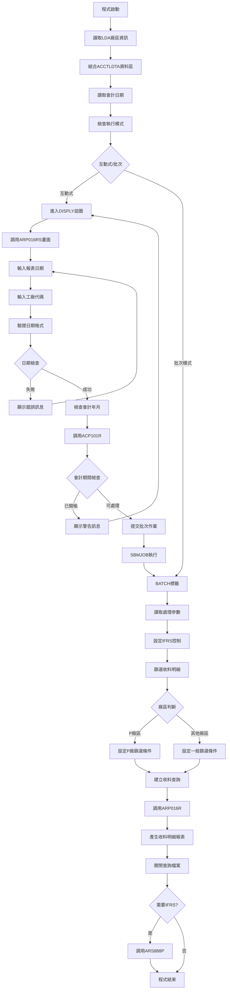
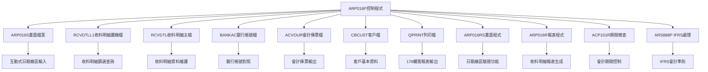
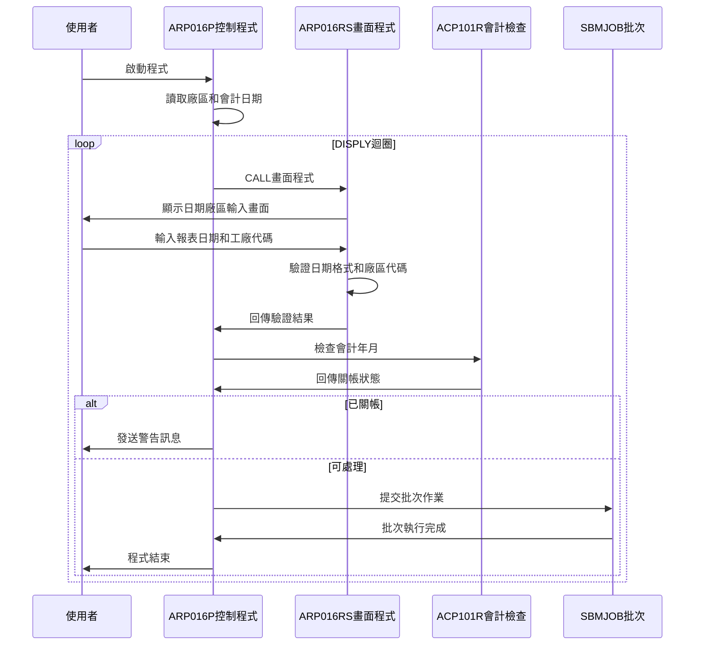
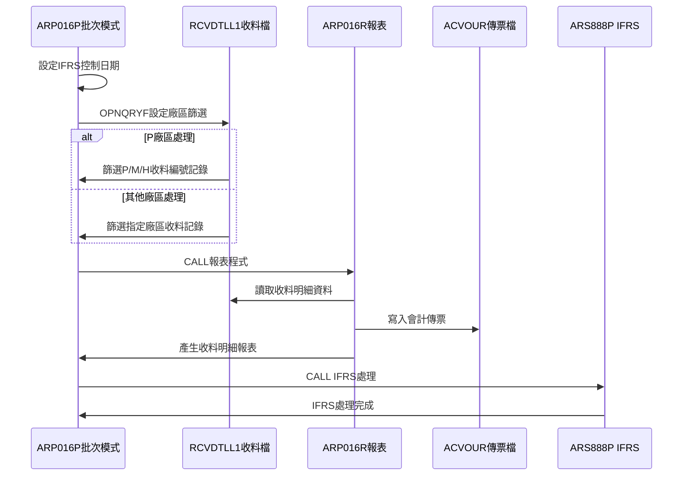
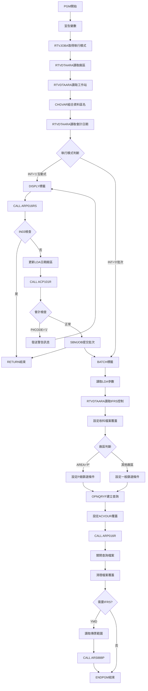

# ARP016P_U01 程式規格書

## 1. 基本資料

| 項目 | 內容 |
|------|------|
| **程式編號** | ARP016P |
| **程式名稱** | 收料明細分廠報表作業 |
| **程式類型** | CLP |
| **廠區** | U01 |
| **系統名稱** | 應收帳款系統 |
| **子系統** | 收料明細管理 |
| **檔案位置** | U01CLSRC_THSRC/ARP016P.txt |

## 🎯 2. 程式功能說明

### 主要功能描述
ARP016P是收料明細分廠報表作業的控制程式，負責處理指定日期的收料明細資料，依廠區分類產生收料明細報表和會計傳票。程式專門處理收料明細檔案(RCVDTL)，提供互動式日期和廠區輸入功能，支援多廠區收料分類處理和IFRS會計準則相關處理。

### 🎯 業務流程詳細說明

#### 完整業務流程圖


#### 業務流程關鍵階段說明

**階段一：環境初始化與參數設定**
- 使用RTVJOBA檢查執行類型和輸出佇列
- 從LDA讀取廠區代碼和工作站ID
- 組合廠區專屬的資料區名稱：'ACCTLDTA'+廠區代碼
- 從ACCTLDTA讀取上次處理的會計日期作為預設值

**階段二：互動式處理階段**
- 進入DISPLY迴圈持續處理使用者輸入
- 調用ARP016RS進行日期和廠區輸入
- 檢查日期格式正確性(YYYYMMDD格式)
- 驗證廠區代碼正確性(P/K/T/H/台)
- 檢查日期是否大於等於會計期間日期
- 調用ACP101R檢查會計年月是否已關帳
- 關帳期間發出警告訊息並返回重新輸入
- 通過檢查後使用SBMJOB提交批次作業

**階段三：收料明細篩選處理**
- 從ARIFRSCTL讀取IFRS控制日期並設定
- 根據廠區設定不同的篩選條件：
  * P廠區：篩選收料編號第一碼為P/M/H的記錄
  * 其他廠區：篩選收料編號第一碼與指定廠區相符的記錄
- 使用OPNQRYF篩選RCVDTLL1收料明細檔案：
  * RVNTDT=處理日期
  * RVNTCD='1'(收料類型)
  * RVVNO2=' '(空白)
  * RVDECD<>'D'(非刪除記錄)
  * RVAREA=工廠代碼(非P廠區時)
- 按收料帳號、收料編號、項次排序建立查詢檔案

**階段四：收料明細報表處理與收尾**
- 設定ACVOUR會計傳票檔案覆蓋為廠區檔案
- 設定報表格式為176欄寬、CPI 13.3
- 調用ARP016R產生收料明細分廠報表
- 關閉RCVDTLL1查詢檔案釋放資源
- 檢查處理日期是否小於IFRS控制日期
- 需要IFRS處理時調用ARS888P進行會計準則處理

## 🎯 3. 檔案架構與關聯圖

### 使用檔案清單

| 檔案名稱 | 檔案用途 | 存取方式 | 關聯說明 |
|---------|----------|----------|----------|
| **ARP016S** | 日期廠區輸入畫面 | WORKSTN | 互動式輸入介面 |
| **RCVDTLL1** | 收料明細邏輯檔 | INPUT | 按日期、發票號碼、收料編號排序 |
| **RCVDTL** | 收料明細主檔 | UPDATE | 收料明細資料更新 |
| **BANKAC** | 銀行帳號檔 | INPUT | 銀行帳號資料 |
| **ACVOUR** | 會計傳票檔案 | UPDATE | 依廠區動態命名 |
| **CBCUST** | 客戶基本檔 | INPUT | 客戶基本資料 |
| **QPRINT** | 列印輸出檔 | OUTPUT | 報表列印輸出 |
| **ARP016RS** | 畫面處理程式 | CALL | 日期廠區輸入驗證 |
| **ARP016R** | 報表處理程式 | CALL | 主要報表生成 |
| **ACP101R** | 會計期間檢查 | CALL | 關帳狀態驗證 |
| **ARS888P** | IFRS處理程式 | CALL | 國際會計準則 |

### 🎯 檔案關聯詳細視覺化圖表



### 🎯 資料流向詳細說明

#### 互動式操作的資料流向


#### 批次處理階段的資料流向


## 🎯 4. 檔案欄位規格說明

### 主要變數結構

#### CLP程式變數定義
| 變數名稱 | 資料型態 | 長度 | 用途說明 |
|---------|----------|------|----------|
| **&P#YYMM** | CHAR | 6 | 會計年月(YYMMDD格式) |
| **&P#DATE** | CHAR | 8 | 處理日期(YYYYMMDD) |
| **&P#CODE** | CHAR | 1 | 會計檢查回傳碼 |
| **&INT** | CHAR | 1 | 執行模式(1=互動/0=批次) |
| **&OUTQ** | CHAR | 10 | 輸出佇列名稱 |
| **&IN03** | LGL | 1 | F3功能鍵指示器 |
| **&YMD** | CHAR | 8 | 報表日期 |
| **&ACYMDX** | CHAR | 8 | 會計日期讀取 |
| **&ACYMD** | CHAR | 8 | 會計日期 |
| **&T#AREA** | CHAR | 1 | 工廠代碼 |
| **&AREA** | CHAR | 1 | 廠區代碼 |
| **&Y** | CHAR | 4 | 年份 |
| **&M** | CHAR | 2 | 月份 |
| **&DTARA** | CHAR | 11 | 資料區名稱 |
| **&DTAR** | CHAR | 10 | 資料區名稱(短) |
| **&WSID** | CHAR | 10 | 工作站ID |
| **&D#VNO1** | CHAR | 6 | 傳票號碼起始 |
| **&D#VNO2** | CHAR | 6 | 傳票號碼結束 |
| **&YM** | CHAR | 6 | 年月 |
| **&IFRSD** | CHAR | 8 | IFRS啟用日期 |

### 🔍 重點欄位切割技術詳解

#### LDA資料區位置切割視覺化
```
*LDA位置分配圖：
位置01-08: [YYYYMMDD]                  報表處理日期
位置09-10: [  ]                       保留空間
位置11:    [X]                        工廠代碼 ← 特殊位置
位置12-200: [保留區域]
位置201-206: [DXXXXX]                 IFRS傳票起始號
位置207-210: [保留]
位置211-216: [DXXXXX]                 IFRS傳票結束號
位置217-1010: [保留區域]
位置1011-1020: [XXXXXXXXXX]           工作站ID
位置1021: [X]                         廠區代碼

實際切割範例：
&YMD = '20231215' → CHGDTAARA DTAARA(*LDA (1 8)) VALUE(&YMD)
&T#AREA = 'K' → CHGDTAARA DTAARA(*LDA (11 1)) VALUE(&T#AREA)
```

#### ACCTLDTA動態資料區視覺化
```
動態名稱組合：
CHGVAR VAR(&DTARA) VALUE('ACCTLDTA' *CAT &AREA)

組合邏輯：
[ACCTLDTA] + [X] = [ACCTLDTAX]
    ↓        ↓        ↓
  固定前綴  廠區碼   完整名稱

實際範例：
&AREA = 'U' → &DTARA = 'ACCTLDTAU'
&AREA = 'K' → &DTARA = 'ACCTLDTAK'
&AREA = 'P' → &DTARA = 'ACCTLDTAP'

讀取操作：
RTVDTAARA DTAARA(DALIB/&DTARA (1 8)) RTNVAR(&ACYMDX)
實際路徑：DALIB/ACCTLDTAU
```

#### 收料編號切割技術視覺化
```
收料編號結構：
RVNO = [X][XXXXX]
        ↓   ↓
     廠區碼 收料序號

%SST切割邏輯：
%SST(RVNO 1 1) - 取第1碼作為廠區識別

P廠區特殊處理：
%SST(RVNO 1 1) *EQ %VALUES("P" "M" "H")
P → 台北廠
M → M廠區（併入P廠區處理）
H → H廠區（併入P廠區處理）

其他廠區標準處理：
%SST(RVNO 1 1) *EQ &AREA
僅匹配單一廠區代碼
```

### 🎯 欄位挪用詳細分析

#### LDA多用途挪用分析
| 位置範圍 | 原始用途 | 實際挪用 | 挪用原因 |
|----------|----------|----------|----------|
| **1-8** | 暫存區域 | 報表處理日期 | 跨程式日期傳遞 |
| **11** | 暫存區域 | 工廠代碼存放 | 廠區篩選控制 |
| **201-206** | 保留區域 | IFRS傳票號碼起始 | IFRS處理範圍控制 |
| **211-216** | 保留區域 | IFRS傳票號碼結束 | IFRS處理範圍控制 |
| **1011-1020** | 使用者資訊 | 工作站識別 | 訊息發送目標 |
| **1021** | 環境設定 | 廠區代碼 | 多廠區環境識別 |

#### 廠區篩選條件對比分析
```
P廠區OPNQRYF篩選：
├─ RVNTDT *EQ &YMD          (通知日期)
├─ RVNTCD *EQ "1"           (通知代碼)  
├─ RVVNO2 *EQ " "           (發票號碼2空白)
├─ %SST(RVNO 1 1) *EQ %VALUES("P" "M" "H")  (多廠支援)
└─ RVDECD *NE "D"           (非刪除)

其他廠區OPNQRYF篩選：
├─ RVNTDT *EQ &YMD          (通知日期)
├─ RVNTCD *EQ "1"           (通知代碼)
├─ RVVNO2 *EQ " "           (發票號碼2空白)
├─ %SST(RVNO 1 1) *EQ &AREA (單廠匹配)
├─ RVDECD *NE "D"           (非刪除)
└─ RVAREA *EQ &T#AREA       (工廠代碼) ← 額外條件

關鍵差異：
1. P廠區支援多廠區代碼("P", "M", "H")
2. 其他廠區僅支援單一廠區代碼
3. 其他廠區增加RVAREA工廠代碼篩選
```

#### 會計檔案名稱組合
```
ACVOUR檔案覆蓋：
'AC' + &AREA + 'R'

組合視覺化：
[AC] + [X] + [R] = [ACXR]
  ↓    ↓    ↓      ↓
前綴  廠區  後綴   檔名

實際範例：
U01廠區 → ACUR
K02廠區 → ACKR  
P02廠區 → ACPR
```

#### 工廠代碼驗證流程
```
驗證邏輯：
1. 空白檢查：T#AREA *EQ ' ' → ERR,3
2. P廠檢查：T#AREA *EQ 'P' → 通過
3. TXAR檢查：T#AREA *EQ TXAR → 通過
4. 其他情況：→ ERR,4

流程圖：
T#AREA輸入 → [空白?] → 是 → ERR,3
             ↓ 否
           [='P'?] → 是 → 通過
             ↓ 否  
          [=TXAR?] → 是 → 通過
             ↓ 否
           ERR,4

有效工廠代碼：
- 'P': 台北廠（特殊處理）
- 'K': 高雄廠
- 'T': 台中廠  
- 'H': 新廠
```

#### 會計期間日期比較
```
比較邏輯：
YMDA IFLT ACYMD

數據流：
1. RTVDTAARA DTAARA(DALIB/&DTARA (1 8)) RTNVAR(&ACYMDX)
2. CHGVAR VAR(&ACYMD) VALUE(&ACYMDX)
3. 畫面輸入 → &YMD → YMDA
4. 比較：YMDA < ACYMD → ERR,2

範例：
&ACYMD = '20231201' (會計期間)
&YMD = '20231130' → 錯誤（小於會計期間）
&YMD = '20231215' → 正確（大於等於會計期間）
```

#### 排序鍵值結構
```
KEYFLD((RVSANO)(RVNO)(RVITEM))

排序優先順序：
第1鍵：RVSANO (收料帳號)
第2鍵：RVNO (收料編號)  
第3鍵：RVITEM (項次)

排序範例：
記錄A：RVSANO='0001234567', RVNO='U12345', RVITEM=01
記錄B：RVSANO='0001234567', RVNO='U12345', RVITEM=02
記錄C：RVSANO='0001234567', RVNO='U12346', RVITEM=01
記錄D：RVSANO='0001234568', RVNO='U12345', RVITEM=01

排序結果：A → B → C → D
```

## 🎯 5. 輸出/入螢幕布局

### 🎯 主輸入畫面(ARP016S)

```
+----------------------------------------------------------+
|  99/12/26    東鋼企業股份有限公司              ARP016S   |
|           收料明細分廠報表作業                   DEVNAME |
|                                                          |
|                                                          |
|                                                          |
|                                                          |
|                      報表產生:                          |
| 廠區代碼:[U] (P:台北K:高雄T:台中H:新廠台:台灣)          |
|                                                          |
| 報表日期:[________]                                     |
|                                                          |
| 工廠代碼:[_]                                            |
|                                                          |
|                                                          |
|                                                          |
|                                                          |
|                                                          |
|                                                          |
| [錯誤訊息顯示區]                                          |
| ENTER:確認                    PF03:離開                  |
+----------------------------------------------------------+
```

### 🎯 畫面欄位詳細說明

#### 輸入欄位規格
| 欄位名稱 | 型態 | 長度 | 輸入格式 | 驗證規則 | 說明 |
|---------|------|------|----------|----------|------|
| **AREA** | 字元 | 1 | P/K/T/H/台 | 廠區代碼檢查 | 廠區代碼(唯讀顯示) |
| **YMD** | 數值 | 8 | YYYYMMDD | 日期格式驗證 | 報表日期(必填) |
| **T#AREA** | 字元 | 1 | P/K/T/H/台 | 工廠代碼驗證 | 工廠代碼(必填) |

#### 顯示欄位規格
| 欄位名稱 | 型態 | 長度 | 顯示格式 | 說明 |
|---------|------|------|----------|------|
| **COMP** | 字元 | 35 | 左對齊 | 公司名稱 |
| **DEVNM** | 字元 | 10 | 右對齊 | 終端機名稱 |
| **ERRMSG** | 字元 | 70 | 左對齊反白 | 錯誤訊息顯示 |

### 🎯 畫面控制邏輯

#### 指示器控制
| 指示器 | 控制邏輯 | 畫面效果 |
|--------|----------|----------|
| **IN41** | 日期錯誤時設定 | YMD欄位反白並強制輸入 |
| **IN42** | 工廠代碼錯誤時設定 | T#AREA欄位反白並強制輸入 |
| **IN99** | 程式結束控制 | 設定後結束畫面處理 |

### 功能鍵詳細定義

| 功能鍵 | 處理邏輯 | 系統行為 |
|--------|----------|----------|
| **F3** | 離開程式 | 設定*IN03='1'，結束程式執行 |
| **ENTER** | 確認處理 | 執行日期廠區驗證和批次作業提交 |

### 🎯 錯誤訊息清冊

| 錯誤編號 | 錯誤訊息 | 觸發條件 | 解決方式 |
|----------|---------|----------|----------|
| **ERR,1** | 日期輸入格式錯誤 | 日期格式不符YYYYMMDD | 重新輸入正確日期格式 |
| **ERR,2** | 日期小於會計期間日期 | 輸入日期<會計期間日期 | 輸入大於等於會計期間的日期 |
| **ERR,3** | 工廠代碼欄位必填 | T#AREA為空白 | 輸入有效的工廠代碼 |
| **ERR,4** | 工廠代碼錯誤 | T#AREA不是P/K/T/H/台 | 輸入正確的工廠代碼 |

## 🎯 6. 處理流程程序說明

### 🎯 主程序邏輯深度分析

#### 程式執行流程圖


#### 🎯 詳細處理步驟逐一分析

**步驟1: 環境初始化處理**
1. 宣告所有CLP變數並設定初始型態
2. 使用RTVJOBA取得執行類型和輸出佇列
3. 從LDA位置1021讀取廠區代碼存入&AREA
4. 從LDA位置1011-1020讀取工作站ID存入&WSID
5. 組合資料區名稱：'ACCTLDTA' || &AREA
6. 從DALIB/ACCTLDTA讀取上次處理的會計日期

**步驟2: 互動式模式處理邏輯**
1. 檢查執行模式，若為互動式進入DISPLY處理
2. 調用ARP016RS畫面程式進行日期和廠區輸入
3. 傳遞參數：&IN03、&YMD、&ACYMD、&T#AREA
4. 檢查F3功能鍵，按下則RETURN結束程式
5. 將日期存入LDA位置1-8，工廠代碼存入位置11
6. 從LDA讀取年月進行會計期間檢查
7. 調用ACP101R檢查會計年月關帳狀態
8. 關帳期間發送警告訊息並GOTO返回DISPLY標籤
9. 通過檢查後使用SBMJOB提交批次作業並RETURN結束

**步驟3: 批次模式核心處理**
1. 從LDA讀取處理日期、年份、月份、年月、工廠代碼、廠區等參數
2. 從ARIFRSCTL資料區讀取IFRS控制日期
3. 設定RCVDTLL1檔案共享模式存取
4. 根據廠區進行不同的篩選邏輯：
   
   **P廠區處理邏輯**：
   ```
   篩選條件：
   - RVNTDT = 處理日期
   - RVNTCD = "1" (收料類型)
   - RVVNO2 = " " (空白發票號碼2)
   - %SST(RVNO 1 1) *EQ %VALUES("P" "M" "H")
   - RVDECD *NE "D" (非刪除記錄)
   ```
   
   **其他廠區處理邏輯**：
   ```
   篩選條件：
   - RVNTDT = 處理日期
   - RVNTCD = "1" (收料類型)
   - RVVNO2 = " " (空白發票號碼2)
   - %SST(RVNO 1 1) *EQ 廠區代碼
   - RVDECD *NE "D" (非刪除記錄)
   - RVAREA *EQ 工廠代碼
   ```

5. 按收料帳號(RVSANO)、收料編號(RVNO)、項次(RVITEM)排序

**步驟4: 收料明細報表處理**
1. 設定ACVOUR會計傳票檔案覆蓋為廠區檔案：'AC'+廠區+'R'
2. 設定報表列印格式：176欄寬、CPI 13.3
3. 調用ARLIB/ARP016R產生收料明細分廠報表：
   - 讀取RCVDTLL1篩選後的收料明細記錄
   - 處理收料明細資料並進行分廠分類
   - 鏈結BANKAC取得銀行帳號資料
   - 鏈結CBCUST取得客戶基本資料
   - 更新RCVDTL收料明細檔案
   - 產生會計傳票記錄到ACVOUR檔案
   - 輸出176欄寬收料明細報表

**步驟5: IFRS處理與收尾作業**
1. 關閉RCVDTLL1查詢檔案並刪除檔案覆蓋
2. 組合ACTTX資料區名稱：'ACTTX'+廠區
3. 檢查處理日期是否小於IFRS控制日期
4. 需要IFRS處理時：
   - 從LDA位置201-206讀取傳票號碼起始
   - 從LDA位置211-216讀取傳票號碼結束
   - 調用ARS888P進行IFRS會計準則處理
   - 傳遞廠區、年月、傳票範圍參數
5. 執行ENDPGM正常結束程式

### 🎯 子程序邏輯分析

#### 日期廠區驗證邏輯(ARP016RS)
1. **日期格式驗證**：調用UTS102R檢查YYYYMMDD日期格式
2. **日期範圍檢查**：確保輸入日期大於等於會計期間日期
3. **廠區代碼驗證**：檢查T#AREA是否為空白或不在有效範圍
4. **廠區權限檢查**：驗證T#AREA是否為'P'或等於當前廠區TXAR
5. **錯誤處理**：設定對應指示器進行欄位反白顯示
6. **使用者互動**：錯誤時保持畫面等待重新輸入

#### 收料明細報表生成邏輯(ARP016R)
1. **資料讀取**：從RCVDTLL1查詢檔案讀取篩選後收料明細
2. **資料處理**：進行收料明細的分廠分類和彙總計算
3. **關聯查詢**：鏈結BANKAC、CBCUST等檔案取得相關資料
4. **報表格式**：使用176欄寬格式產生收料明細報表
5. **傳票處理**：產生會計傳票記錄並寫入ACVOUR檔案
6. **資料更新**：更新RCVDTL收料明細檔案的相關狀態

### 🎯 特殊邏輯處理

#### 廠區差異化處理技術
- P廠區特殊處理：支援P/M/H三種收料編號前綴
- 其他廠區標準處理：收料編號前綴必須與廠區代碼一致
- 工廠代碼篩選：非P廠區增加RVAREA工廠代碼條件

#### 會計傳票檔案管理
- 使用ACVOUR取代傳統ACTRAN檔案
- 依廠區動態組合傳票檔案名稱：'AC'+廠區+'R'
- 支援多廠區獨立的會計傳票管理

#### 收料明細資料完整性控制
- 篩選收料類型代碼為'1'的正常收料記錄
- 排除發票號碼2不為空白的特殊記錄
- 排除已刪除(RVDECD='D')的收料記錄
- 按收料帳號、編號、項次進行排序確保報表順序

## 🎯 7. 數據操作與轉換分析

### 檔案操作詳解

#### OPNQRYF收料明細篩選技術
1. **P廠區篩選條件設定**：
   ```
   QRYSLT條件語法：
   RVNTDT *EQ 處理日期                指定日期收料
   RVNTCD *EQ "1"                     收料類型代碼
   RVVNO2 *EQ " "                     空白發票號碼2
   %SST(RVNO 1 1) *EQ %VALUES("P" "M" "H")  收料編號前綴篩選
   RVDECD *NE "D"                     非刪除記錄
   ```

2. **其他廠區篩選條件設定**：
   ```
   QRYSLT條件語法：
   RVNTDT *EQ 處理日期                指定日期收料
   RVNTCD *EQ "1"                     收料類型代碼
   RVVNO2 *EQ " "                     空白發票號碼2
   %SST(RVNO 1 1) *EQ 廠區代碼        收料編號前綴對應廠區
   RVDECD *NE "D"                     非刪除記錄
   RVAREA *EQ 工廠代碼                工廠代碼篩選
   ```

3. **排序鍵值設定**：
   ```
   KEYFLD排序：
   ((RVSANO)(RVNO)(RVITEM))           按收料帳號、收料編號、項次排序
   ```

#### 廠區差異化處理邏輯
1. **P廠區特殊處理**：
   - 支援多種收料編號前綴：P(台北)、M(台中)、H(新廠)
   - 不需要額外的工廠代碼篩選條件
   - 適用於總公司或跨廠區收料統一處理

2. **其他廠區標準處理**：
   - 收料編號前綴必須與廠區代碼一致
   - 增加RVAREA工廠代碼篩選條件
   - 適用於各廠區獨立收料處理

#### LDA和資料區操作
1. **RTVDTAARA讀取操作**：
   - RTVDTAARA DTAARA(*LDA (1021 1)) RTNVAR(&AREA) - 讀取廠區
   - RTVDTAARA DTAARA(DALIB/&DTARA (1 8)) RTNVAR(&ACYMDX) - 讀取會計日期
   - RTVDTAARA DTAARA(ARIFRSCTL (1 8)) RTNVAR(&IFRSD) - 讀取IFRS控制

2. **CHGDTAARA更新操作**：
   - CHGDTAARA DTAARA(*LDA (1 8)) VALUE(&YMD) - 設定處理日期
   - CHGDTAARA DTAARA(*LDA (11 1)) VALUE(&T#AREA) - 設定工廠代碼

### 數據轉換邏輯

#### 日期格式處理
1. **日期輸入驗證**：
   - 使用UTS102R進行YYYYMMDD日期格式檢查
   - 確保日期有效性和合理性範圍
   - 檢查日期是否大於等於會計期間日期

2. **日期參數傳遞**：
   - 從畫面輸入的YMD傳遞到批次處理
   - 在LDA中存儲完整8位日期格式
   - 提取年月部分進行會計期間檢查

#### 字串組合操作
1. **資料區名稱組合**：
   - CHGVAR VAR(&DTARA) VALUE('ACCTLDTA' *CAT &AREA)
   - 組合廠區專屬的會計資料區名稱

2. **會計檔案名稱組合**：
   - OVRDBF FILE(ACVOUR) TOFILE('AC' || &AREA || 'R')
   - 動態組合廠區專屬的會計傳票檔案

3. **其他資料區組合**：
   - CHGVAR VAR(&DTARA) VALUE('ACTTX' *CAT &AREA)
   - 組合廠區專屬的交易資料區名稱

#### 收料編號前綴篩選技術
1. **%SST函數使用**：
   - %SST(RVNO 1 1)：截取收料編號第一個字元
   - 用於識別收料記錄所屬廠區

2. **%VALUES函數使用**：
   - %VALUES("P" "M" "H")：P廠區支援的多種前綴
   - 比多個OR條件更有效率的篩選方式

### 計算邏輯分析

#### IFRS日期比較
1. **IFRS處理判斷**：
   - IF COND(&YMD *LT &IFRSD) - 日期字元型比較
   - 處理日期早於IFRS啟用日期時執行特殊處理
   - 確保會計準則正確適用

2. **日期比較邏輯**：
   - 使用8位日期格式進行完整日期比較
   - 比年月比較更精確的日期控制

### 檢核機制詳解

#### 會計期間檢核
1. **關帳狀態檢查**：
   - 調用ACP101R傳入年月參數
   - 回傳P#CODE='1'表示期間已關帳
   - 已關帳期間禁止資料異動

2. **日期合理性檢核**：
   - ARP016RS中檢查日期格式和範圍
   - 確保日期大於等於會計期間日期

#### 收料資料檢核
1. **收料狀態檢核**：
   - RVDECD<>'D'：確保非刪除收料記錄
   - RVNTCD='1'：確保收料類型正確
   - RVVNO2=' '：確保發票號碼2為空白

2. **廠區代碼檢核**：
   - 收料編號前綴與廠區代碼對應檢查
   - 工廠代碼與指定廠區一致性檢查

#### 檔案存取控制
1. **檔案共享設定**：
   - RCVDTLL1設定SHARE(*YES)支援多使用者存取
   - 查詢檔案使用後使用CLOF適時關閉

2. **檔案覆蓋管理**：
   - 使用DLTOVR FILE(*ALL)統一清除覆蓋設定
   - 確保檔案覆蓋不影響其他程式執行

## 🎯 8. 錯誤處理程序說明

### 🎯 詳細錯誤代碼清冊

| 錯誤代碼 | 錯誤訊息 | 原因說明 | 處理方式 | 預防措施 |
|----------|---------|---------|---------|----------|
| **ERR,1** | 日期輸入格式錯誤 | 輸入日期格式不正確或無效日期 | 1. 重新輸入正確日期格式<br>2. 檢查日期有效性<br>3. 使用YYYYMMDD格式 | 提供日期格式說明和範例 |
| **ERR,2** | 日期小於會計期間日期 | 輸入日期早於會計期間起始日期 | 1. 輸入大於等於會計期間的日期<br>2. 確認會計期間設定<br>3. 聯繫會計人員確認 | 顯示可處理日期範圍 |
| **ERR,3** | 工廠代碼欄位必填 | T#AREA欄位為空白未輸入 | 1. 輸入有效的工廠代碼<br>2. 選擇對應廠區代碼<br>3. 確認廠區設定正確 | 設定預設工廠代碼值 |
| **ERR,4** | 工廠代碼錯誤 | T#AREA不是有效的廠區代碼 | 1. 輸入P/K/T/H/台之一<br>2. 確認廠區權限<br>3. 聯繫系統管理員 | 建立廠區代碼選擇清單 |
| **P#CODE='1'** | 會計期間已關帳 | 輸入年月所屬會計期間已關帳 | 1. 選擇未關帳期間年月<br>2. 聯繫會計人員確認<br>3. 等待期間重新開啟 | 顯示可處理期間範圍 |
| **檔案鎖定** | 檔案被其他程式使用 | RCVDTLL1檔案被其他使用者鎖定 | 1. 等待其他使用者完成<br>2. 稍後重新執行<br>3. 聯繫系統管理員 | 設定合理的檔案共享參數 |
| **資料區錯誤** | 無法存取廠區資料區 | ACCTLDTA資料區不存在或損壞 | 1. 檢查資料區是否存在<br>2. 重建資料區結構<br>3. 恢復備份資料 | 定期備份重要資料區 |

### 🎯 系統異常處理邏輯

#### 檔案操作失敗處理
1. **OPNQRYF失敗處理**：
   - 檢查RCVDTLL1檔案是否存在和可存取
   - 驗證%SST和%VALUES查詢條件語法正確性
   - 提供檔案狀態診斷資訊
   - 記錄失敗原因供後續分析

2. **ACVOUR檔案操作失敗**：
   - 檢查會計傳票檔案權限和存在性
   - 確認檔案空間充足
   - 驗證檔案結構完整性
   - 提供檔案重建機制

#### 程式調用失敗處理
1. **ARP016RS調用失敗**：
   - 檢查畫面程式是否存在於ARLIB
   - 驗證參數傳遞正確性
   - 提供手動日期輸入替代方案
   - 記錄調用失敗詳細資訊

2. **ARP016R調用失敗**：
   - 檢查報表程式可用性和路徑設定
   - 確認ARLIB程式庫可存取
   - 提供報表生成狀態查詢
   - 記錄報表處理異常資訊

#### 資料完整性錯誤處理
1. **收料明細資料不一致**：
   - 重新讀取RCVDTLL1收料明細檔案
   - 同步更新相關檔案狀態
   - 防止部分處理造成資料錯亂
   - 提供資料一致性檢查機制

2. **廠區資料不匹配**：
   - 檢查廠區代碼設定一致性
   - 確認工廠代碼與收料編號對應關係
   - 提供廠區資料同步機制
   - 建立廠區代碼驗證規則

#### 報表輸出失敗處理
1. **列印輸出異常**：
   - 檢查QPRINT輸出佇列狀態
   - 確認報表格式設定正確
   - 提供報表重新產生機制
   - 記錄列印失敗詳細原因

2. **176欄寬格式問題**：
   - 檢查CPI 13.3設定是否支援
   - 確認列印設備相容性
   - 提供格式調整選項
   - 建立格式相容性檢查

## 🎯 9. 備註

### 🎯 特殊注意事項

#### 收料明細廠區處理特性
- 程式支援P廠區的特殊多前綴處理(P/M/H)
- 其他廠區採用標準單一前綴對應模式
- 工廠代碼篩選僅適用於非P廠區處理

#### 會計傳票檔案變更
- 原ACTRAN檔案改用ACVOUR檔案
- 保持相同的檔案命名規則：'AC'+廠區+'R'
- 1998年5月更新，增加傳票編號ACVOUR欄位

#### 報表格式特殊設定
- 使用176欄寬輸出格式
- CPI設定為13.3提供最佳列印效果
- 支援大容量收料明細資料列印

#### 日期處理精確度
- 使用完整8位日期格式(YYYYMMDD)進行處理
- 比年月格式更精確的IFRS日期比較
- 支援單日收料明細報表產生

#### 檔案共享機制
- RCVDTLL1設定SHARE(*YES)支援多使用者同時存取
- OPNQRYF查詢檔案使用後必須使用CLOF適時關閉
- 檔案覆蓋使用DLTOVR FILE(*ALL)統一清除

#### 廠區代碼驗證規則
- 支援P(台北)、K(高雄)、T(台中)、H(新廠)、台(台灣)
- 工廠代碼必須與程式執行環境廠區相符或為P
- 提供完整的廠區權限控制機制

#### IFRS處理時機
- 根據處理日期與IFRS啟用日期比較決定是否執行
- 使用LDA位置201-216的傳票號碼範圍控制
- 確保會計準則的正確時間適用

#### 收料明細篩選邏輯
- 只處理收料類型代碼為'1'的正常收料記錄
- 排除發票號碼2不為空白的特殊處理記錄
- 嚴格排除已刪除標記的收料資料

#### 資料區名稱動態組合
- ACCTLDTA、ACTTX等資料區依廠區動態命名
- 支援多廠區獨立的資料管理環境
- 確保廠區間資料隔離和安全性

#### 程式庫路徑設定
- ARP016R程式位於ARLIB程式庫
- 確保ARLIB在程式庫清單中
- 支援集中化的應收帳款程式管理 