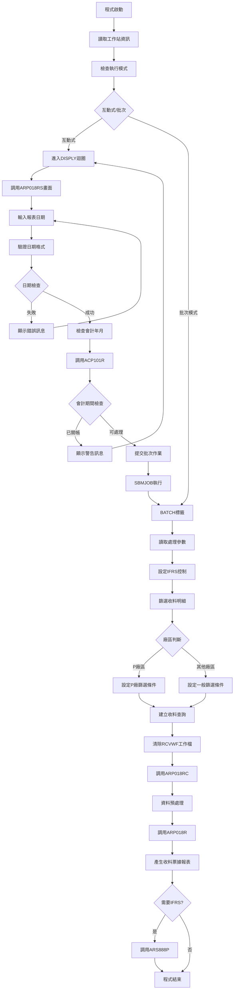
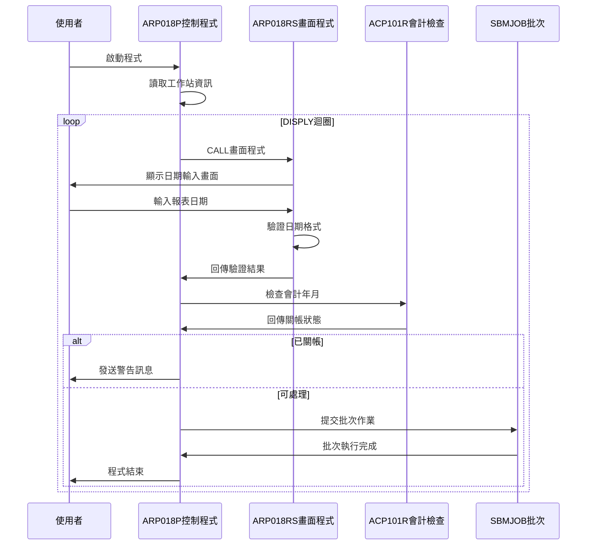
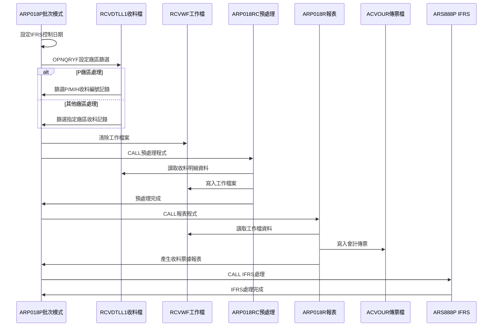
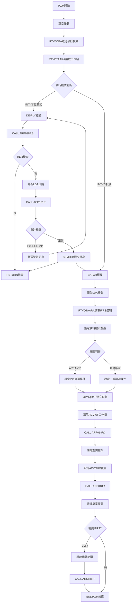

# ARP018P_U01 程式規格書

## 1. 基本資料

| 項目 | 內容 |
|------|------|
| **程式編號** | ARP018P |
| **程式名稱** | 銀行收料票據報表作業 |
| **程式類型** | CLP |
| **廠區** | U01 |
| **系統名稱** | 應收帳款系統 |
| **子系統** | 收料票據管理 |
| **檔案位置** | U01CLSRC_THSRC/ARP018P.txt |

## 🎯 2. 程式功能說明

### 主要功能描述
ARP018P是銀行收料票據報表作業的控制程式，負責處理指定日期的收料明細資料，專門產生銀行收料票據相關報表和會計傳票。程式處理收料類型1(一般收料)和類型2(特殊收料)的資料，提供互動式日期輸入功能，支援多廠區收料分類處理和IFRS會計準則相關處理。

### 🎯 業務流程詳細說明

#### 完整業務流程圖


#### 業務流程關鍵階段說明

**階段一：環境初始化與參數設定**
- 使用RTVJOBA檢查執行類型和輸出佇列
- 從LDA讀取工作站ID
- 簡化的初始化流程，主要關注日期處理

**階段二：互動式處理階段**
- 進入DISPLY迴圈持續處理使用者輸入
- 調用ARP018RS進行日期輸入和驗證
- 檢查日期格式正確性(YYYYMMDD格式)
- 調用ACP101R檢查會計年月是否已關帳
- 關帳期間發出警告訊息並返回重新輸入
- 通過檢查後使用SBMJOB提交批次作業

**階段三：收料明細篩選處理**
- 從ARIFRSCTL讀取IFRS控制日期並設定
- 根據廠區設定不同的篩選條件：
  * P廠區：篩選收料編號第一碼為P/M/H的記錄
  * 其他廠區：篩選收料編號第一碼與指定廠區相符的記錄
- 使用OPNQRYF篩選RCVDTLL1收料明細檔案：
  * RVDATE=處理日期
  * RVTYPE=%VALUES("1" "2")(收料類型1和2)
  * %SST(RVNO 1 1)廠區對應
  * RVDECD<>'D'(非刪除記錄)
- 按收料編號、保留欄位、項次排序建立查詢檔案
- 使用MAPFLD將RVVNO1的第3-6碼對應到RVRESV欄位

**階段四：收料票據報表處理與收尾**
- 清除RCVWF工作檔案準備資料處理
- 調用ARP018RC進行收料資料預處理：
  * 從RCVDTLL1讀取篩選後的收料明細
  * 寫入RCVWF工作檔案進行暫存
- 設定ACVOUR會計傳票檔案覆蓋為廠區檔案
- 設定報表格式為176欄寬、CPI 13.3
- 調用ARP018R產生銀行收料票據報表
- 檢查處理日期是否小於IFRS控制日期
- 需要IFRS處理時調用ARS888P進行會計準則處理

## 🎯 3. 檔案架構與關聯圖

### 使用檔案清單

| 檔案名稱 | 檔案用途 | 存取方式 | 關聯說明 |
|---------|----------|----------|----------|
| **ARP018S** | 日期輸入畫面 | WORKSTN | 互動式輸入介面 |
| **RCVDTLL1** | 收料明細邏輯檔 | INPUT | 按日期、發票號碼、收料編號排序 |
| **RCVWF** | 收料工作檔案 | OUTPUT | 批次處理暫存檔 |
| **RCVDTL** | 收料明細主檔 | UPDATE | 收料明細資料維護 |
| **INVDTLL1** | 發票明細邏輯檔 | UPDATE | 發票明細資料 |
| **INVMST** | 發票主檔 | INPUT | 發票基本資料 |
| **BCNAME** | 銀行名稱檔 | INPUT | 銀行名稱對照 |
| **BANKAC** | 銀行帳號檔 | INPUT | 銀行帳號資料 |
| **SARVIN** | 存入票據檔 | INPUT | 存入票據明細 |
| **SARVOR** | 存出票據檔 | INPUT | 存出票據明細 |
| **ACVOUR** | 會計傳票檔案 | UPDATE | 依廠區動態命名 |
| **CBCUST** | 客戶基本檔 | INPUT | 客戶基本資料 |
| **QPRINT** | 列印輸出檔 | OUTPUT | 報表列印輸出 |
| **ARP018RS** | 畫面處理程式 | CALL | 日期輸入驗證 |
| **ARP018RC** | 資料預處理程式 | CALL | 收料資料預處理 |
| **ARP018R** | 報表處理程式 | CALL | 主要報表生成 |
| **ACP101R** | 會計期間檢查 | CALL | 關帳狀態驗證 |
| **ARS888P** | IFRS處理程式 | CALL | 國際會計準則 |

### 🎯 檔案關聯詳細視覺化圖表

```mermaid
graph TD
    A[ARP018P控制程式] --> B[ARP018S畫面檔案]
    A --> C[RCVDTLL1收料明細邏輯檔]
    A --> D[RCVWF收料工作檔]
    A --> E[RCVDTL收料明細主檔]
    A --> F[INVDTLL1發票明細檔]
    A --> G[INVMST發票主檔]
    A --> H[BCNAME銀行名稱檔]
    A --> I[BANKAC銀行帳號檔]
    A --> J[SARVIN存入票據檔]
    A --> K[SARVOR存出票據檔]
    A --> L[ACVOUR會計傳票檔]
    A --> M[CBCUST客戶檔]
    A --> N[QPRINT列印檔]
    
    A --> O[ARP018RS畫面程式]
    A --> P[ARP018RC預處理程式]
    A --> Q[ARP018R報表程式]
    A --> R[ACP101R期間檢查]
    A --> S[ARS888P IFRS處理]
    
    B --> T[互動式日期輸入]
    C --> U[收料明細篩選查詢]
    D --> V[收料資料暫存]
    E --> W[收料明細資料維護]
    F --> X[發票明細更新]
    G --> Y[發票基本資料]
    H --> Z[銀行名稱對照]
    I --> AA[銀行帳號對照]
    J --> BB[存入票據明細]
    K --> CC[存出票據明細]
    L --> DD[會計傳票輸出]
    M --> EE[客戶基本資料]
    N --> FF[176欄寬報表輸出]
    
    O --> GG[日期驗證功能]
    P --> HH[收料資料預處理]
    Q --> II[收料票據報表生成]
    R --> JJ[會計期間控制]
    S --> KK[IFRS會計準則]
```



### 🎯 資料流向詳細說明

#### 互動式操作的資料流向


#### 批次處理階段的資料流向


## 🎯 4. 檔案欄位規格說明

### 主要變數結構

#### CLP程式變數定義
| 變數名稱 | 資料型態 | 長度 | 用途說明 |
|---------|----------|------|----------|
| **&P#YYMM** | CHAR | 6 | 會計年月(YYMMDD格式) |
| **&P#DATE** | CHAR | 8 | 處理日期(YYYYMMDD) |
| **&P#CODE** | CHAR | 1 | 會計檢查回傳碼 |
| **&INT** | CHAR | 1 | 執行模式(1=互動/0=批次) |
| **&OUTQ** | CHAR | 10 | 輸出佇列名稱 |
| **&IN03** | LGL | 1 | F3功能鍵指示器 |
| **&YMD** | CHAR | 8 | 報表日期 |
| **&AREA** | CHAR | 1 | 廠區代碼 |
| **&VRNOF** | CHAR | 4 | 傳票號碼(未使用) |
| **&Y** | CHAR | 4 | 年份 |
| **&M** | CHAR | 2 | 月份 |
| **&WSID** | CHAR | 10 | 工作站ID |
| **&D#VNO1** | CHAR | 6 | 傳票號碼起始 |
| **&D#VNO2** | CHAR | 6 | 傳票號碼結束 |
| **&YM** | CHAR | 6 | 年月 |
| **&IFRSD** | CHAR | 8 | IFRS啟用日期 |

### 🔍 重點欄位切割技術詳解

#### *LDA位置切割技術完整展示

***LDA資料區位置切割對應圖：**
```
*LDA資料區位置切割對應圖：

位置1-8：    [YYYYMMDD]              → &YMD報表處理日期
位置1-4：    [YYYY]                  → &Y年份部分
位置5-2：         [MM]               → &M月份部分
位置1-6：    [YYYYMM]                → &YM年月部分

位置201-206： [DXXXXX]               → &D#VNO1 IFRS傳票起始號
位置211-216： [DXXXXX]               → &D#VNO2 IFRS傳票結束號
位置1011-1020：[XXXXXXXXXX]          → &WSID工作站識別碼
位置1021：     [X]                   → &AREA廠區代碼

實際範例：
&YMD = '20231215'
RTVDTAARA DTAARA(*LDA (1 4)) → &Y = '2023'
RTVDTAARA DTAARA(*LDA (5 2)) → &M = '12'
RTVDTAARA DTAARA(*LDA (1 6)) → &YM = '202312'
```

#### %SST字串切割技術視覺化

**收料編號(RVNO)切割技術：**
```
RVNO收料編號切割邏輯：
%SST(RVNO 1 1) *EQ &AREA
%SST(RVNO 1 1) *EQ %VALUES("P" "M" "H")

收料編號結構：[X|XXXXX]
               ↓  ↓
第1碼：        [X]       廠區識別碼
第2-6碼：         [XXXXX] 收料序號

實際範例：
RVNO = 'U12345'
%SST(RVNO 1 1) = 'U'  ← 與&AREA='U'匹配

P廠區特殊處理：
RVNO = 'P12345' → 匹配
RVNO = 'M12345' → 匹配  
RVNO = 'H12345' → 匹配
```

**收料傳票編號(RVVNO1)切割技術：**
```
RVVNO1傳票編號切割邏輯：
MAPFLD((RVRESV '%SST(RVVNO1 3 4)'))

傳票編號結構：[XX|XXXX|XX]
              ↓  ↓    ↓
前2碼：       [XX]         傳票類型
第3-6碼：        [XXXX]    序號部分 ← 擷取目標
後2碼：              [XX]  其他資訊

實際範例：
RVVNO1 = 'AR123456'
%SST(RVVNO1 3 4) = '1234'  → RVRESV = '1234'

切割邏輯說明：
- 起始位置：3（第3個字元）
- 擷取長度：4（連續4個字元）
- 對應欄位：RVRESV保留欄位
```

#### 多值篩選技術視覺化

**%VALUES多值篩選技術：**
```
收料類型多值篩選：
RVTYPE *EQ %VALUES("1" "2")

篩選條件視覺化：
RVTYPE = '1' → ✓ 通過篩選（一般收料）
RVTYPE = '2' → ✓ 通過篩選（特殊收料）
RVTYPE = '3' → ✗ 不通過篩選（退貨收料）

P廠區特殊多值篩選：
%SST(RVNO 1 1) *EQ %VALUES("P" "M" "H")

廠區碼篩選視覺化：
第1碼 = 'P' → ✓ 通過篩選（P廠區）
第1碼 = 'M' → ✓ 通過篩選（M廠區）
第1碼 = 'H' → ✓ 通過篩選（H廠區）
第1碼 = 'U' → ✗ 不通過篩選（其他廠區）
```

#### 動態檔案名稱組合視覺化

**會計傳票檔案名稱組合技術：**
```
動態檔案名稱組合：
DALIB/('AC' || &AREA || 'R')

組合結構：[DALIB/|AC|X|R]
          ↓      ↓ ↓ ↓
前綴：    [DALIB/]        目錄路徑
固定：           [AC]     會計檔案前綴
變數：             [X]    廠區代碼
後綴：               [R]  檔案後綴

實際範例：
&AREA = 'U' → DALIB/ACUR
&AREA = 'K' → DALIB/ACKR  
&AREA = 'P' → DALIB/ACPR
&AREA = 'M' → DALIB/ACMR
&AREA = 'H' → DALIB/ACHR
```

#### OPNQRYF複合篩選條件視覺化

**P廠區複合篩選條件結構：**
```
P廠區OPNQRYF篩選條件組合：
RVDATE *EQ &YMD *AND 
RVTYPE *EQ %VALUES("1" "2") *AND 
%SST(RVNO 1 1) *EQ %VALUES("P" "M" "H") *AND 
RVDECD *NE "D"

篩選流程視覺化：
收料記錄 → [日期篩選] → [類型篩選] → [廠區篩選] → [刪除篩選] → 最終結果

實際範例：
RVDATE = '20231215' ✓ 日期匹配
RVTYPE = '1'        ✓ 類型匹配  
RVNO = 'P12345'     ✓ 廠區匹配（P）
RVDECD = ' '        ✓ 非刪除
→ 記錄通過篩選
```

**其他廠區篩選條件結構：**
```
其他廠區OPNQRYF篩選條件組合：
RVDATE *EQ &YMD *AND 
RVTYPE *EQ %VALUES("1" "2") *AND 
%SST(RVNO 1 1) *EQ &AREA *AND 
RVDECD *NE "D"

篩選差異對比：
P廠區：%SST(RVNO 1 1) *EQ %VALUES("P" "M" "H")  ← 多廠區支援
其他：  %SST(RVNO 1 1) *EQ &AREA                ← 單一廠區

實際範例：
&AREA = 'U'
RVNO = 'U12345' → %SST(RVNO 1 1) = 'U' ✓ 匹配
RVNO = 'K12345' → %SST(RVNO 1 1) = 'K' ✗ 不匹配
```

#### KEYFLD排序鍵值切割邏輯

**排序鍵值結構視覺化：**
```
KEYFLD排序鍵值組合：
KEYFLD((RVNO)(RVRESV)(RVITEM))

排序優先順序：
第1鍵：RVNO     [XXXXXX]     收料編號（主要排序）
第2鍵：RVRESV   [XXXX]       保留欄位（次要排序）
第3鍵：RVITEM   [XX]         項次（最終排序）

排序範例：
記錄1：RVNO='P12345', RVRESV='1234', RVITEM=1
記錄2：RVNO='P12345', RVRESV='1234', RVITEM=2  
記錄3：RVNO='P12345', RVRESV='5678', RVITEM=1
記錄4：RVNO='P12346', RVRESV='1234', RVITEM=1

排序結果：記錄1 → 記錄2 → 記錄3 → 記錄4
```

### 🎯 欄位挪用詳細分析

#### LDA多用途挪用分析
| 位置範圍 | 原始用途 | 實際挪用 | 挪用原因 |
|----------|----------|----------|----------|
| **1-8** | 暫存區域 | 報表處理日期 | 跨程式日期傳遞 |
| **201-206** | 保留區域 | IFRS傳票號碼起始 | IFRS處理範圍控制 |
| **211-216** | 保留區域 | IFRS傳票號碼結束 | IFRS處理範圍控制 |
| **1011-1020** | 使用者資訊 | 工作站識別 | 訊息發送目標 |
| **1021** | 環境設定 | 廠區代碼 | 多廠區環境識別 |

#### 收料明細篩選條件技術
```
P廠區OPNQRYF篩選條件：
RVDATE *EQ 處理日期                    指定日期收料
RVTYPE *EQ %VALUES("1" "2")            收料類型1和2
%SST(RVNO 1 1) *EQ %VALUES("P" "M" "H") 收料編號第一碼
RVDECD *NE "D"                         非刪除記錄

其他廠區OPNQRYF篩選條件：
RVDATE *EQ 處理日期                    指定日期收料
RVTYPE *EQ %VALUES("1" "2")            收料類型1和2
%SST(RVNO 1 1) *EQ 廠區代碼            收料編號第一碼對應廠區
RVDECD *NE "D"                         非刪除記錄

排序鍵值：
KEYFLD((RVNO)(RVRESV)(RVITEM))         按收料編號、保留欄位、項次排序

欄位對應：
MAPFLD((RVRESV '%SST(RVVNO1 3 4)'))    將RVVNO1第3-6碼對應到RVRESV
```

#### 會計傳票檔案名稱組合
```
ACVOUR檔案覆蓋設定：
原始檔案: ACVOUR
覆蓋目標: DALIB/'AC' + &AREA + 'R'

範例：
U01廠區 → DALIB/ACU01R
K02廠區 → DALIB/ACK02R
P02廠區 → DALIB/ACP02R
```

#### 收料類型處理邏輯
```
收料類型篩選：
RVTYPE='1': 一般收料(正常收料作業)
RVTYPE='2': 特殊收料(特殊處理收料)

與其他程式差異：
- ARP016P: 只處理RVNTCD='1'
- ARP018P: 處理RVTYPE='1'和'2'
```

## 🎯 5. 輸出/入螢幕布局

### 🎯 主輸入畫面(ARP018S)

```
+----------------------------------------------------------+
|  99/12/26    東鋼企業股份有限公司              ARP018S   |
|           銀行收料票據報表作業                   DEVNAME |
|                                                          |
|                                                          |
|                                                          |
|                                                          |
|                      報表產生:                          |
| 廠區代碼:[U]                                            |
|                                                          |
| 報表日期:[________]                                     |
|                                                          |
|                                                          |
|                                                          |
|                                                          |
|                                                          |
|                                                          |
|                                                          |
|                                                          |
| [錯誤訊息顯示區]                                          |
| ENTER:確認                    PF03:離開                  |
+----------------------------------------------------------+
```

### 🎯 畫面欄位詳細說明

#### 輸入欄位規格
| 欄位名稱 | 型態 | 長度 | 輸入格式 | 驗證規則 | 說明 |
|---------|------|------|----------|----------|------|
| **TXAR** | 字元 | 1 | 廠區代碼 | 唯讀顯示 | 廠區代碼(唯讀顯示) |
| **YMD** | 數值 | 8 | YYYYMMDD | 日期格式驗證 | 報表日期(必填) |

#### 顯示欄位規格
| 欄位名稱 | 型態 | 長度 | 顯示格式 | 說明 |
|---------|------|------|----------|------|
| **COMP** | 字元 | 35 | 左對齊 | 公司名稱 |
| **DEVNM** | 字元 | 10 | 右對齊 | 終端機名稱 |
| **ERRMSG** | 字元 | 70 | 左對齊反白 | 錯誤訊息顯示 |

### 🎯 畫面控制邏輯

#### 指示器控制
| 指示器 | 控制邏輯 | 畫面效果 |
|--------|----------|----------|
| **IN41** | 日期錯誤時設定 | YMD欄位反白並強制輸入 |
| **IN99** | 程式結束控制 | 設定後結束畫面處理 |

### 功能鍵詳細定義

| 功能鍵 | 處理邏輯 | 系統行為 |
|--------|----------|----------|
| **F3** | 離開程式 | 設定*IN03='1'，結束程式執行 |
| **ENTER** | 確認處理 | 執行日期驗證和批次作業提交 |

### 🎯 錯誤訊息清冊

| 錯誤編號 | 錯誤訊息 | 觸發條件 | 解決方式 |
|----------|---------|----------|----------|
| **ERR,1** | 日期輸入格式錯誤 | 日期格式不符YYYYMMDD | 重新輸入正確日期格式 |

## 🎯 6. 處理流程程序說明

### 🎯 主程序邏輯深度分析

#### 程式執行流程圖


#### 🎯 詳細處理步驟逐一分析

**步驟1: 環境初始化處理**
1. 宣告所有CLP變數並設定初始型態
2. 使用RTVJOBA取得執行類型和輸出佇列
3. 從LDA位置1011-1020讀取工作站ID存入&WSID
4. 簡化的初始化流程，不需要廠區資料區設定

**步驟2: 互動式模式處理邏輯**
1. 檢查執行模式，若為互動式進入DISPLY處理
2. 調用ARP018RS畫面程式進行日期輸入
3. 傳遞參數：&IN03、&YMD
4. 檢查F3功能鍵，按下則RETURN結束程式
5. 將日期存入LDA位置1-8
6. 從LDA讀取年月進行會計期間檢查
7. 調用ACP101R檢查會計年月關帳狀態
8. 關帳期間發送警告訊息並GOTO返回DISPLY標籤
9. 通過檢查後使用SBMJOB提交批次作業並RETURN結束

**步驟3: 批次模式核心處理**
1. 從LDA讀取處理日期、年份、月份、年月等參數
2. 從LDA位置1021讀取廠區代碼
3. 從ARIFRSCTL資料區讀取IFRS控制日期
4. 設定RCVDTLL1檔案共享模式存取
5. 根據廠區進行不同的篩選邏輯：
   
   **P廠區處理邏輯**：
   ```
   篩選條件：
   - RVDATE = 處理日期
   - RVTYPE *EQ %VALUES("1" "2") (收料類型1和2)
   - %SST(RVNO 1 1) *EQ %VALUES("P" "M" "H")
   - RVDECD *NE "D" (非刪除記錄)
   ```
   
   **其他廠區處理邏輯**：
   ```
   篩選條件：
   - RVDATE = 處理日期
   - RVTYPE *EQ %VALUES("1" "2") (收料類型1和2)
   - %SST(RVNO 1 1) *EQ 廠區代碼
   - RVDECD *NE "D" (非刪除記錄)
   ```

6. 按收料編號(RVNO)、保留欄位(RVRESV)、項次(RVITEM)排序
7. 使用MAPFLD將RVVNO1的第3-6碼對應到RVRESV欄位

**步驟4: 收料票據資料預處理**
1. 設定RCVWF工作檔案覆蓋
2. 清除RCVWF工作檔案準備資料處理
3. 調用ARP018RC進行收料資料預處理：
   - 從RCVDTLL1讀取篩選後的收料明細記錄
   - 直接寫入RCVWF工作檔案進行暫存
   - 簡單的資料轉移處理
4. 關閉RCVDTLL1查詢檔案並刪除檔案覆蓋

**步驟5: 收料票據報表處理**
1. 設定ACVOUR會計傳票檔案覆蓋為DALIB廠區檔案
2. 設定報表列印格式：176欄寬、CPI 13.3
3. 調用ARP018R產生銀行收料票據報表：
   - 讀取RCVWF工作檔案的收料明細資料
   - 關聯INVDTL、INVMST發票檔案
   - 關聯BCNAME、BANKAC銀行相關檔案
   - 關聯SARVIN、SARVOR票據檔案
   - 關聯CBCUST客戶基本檔案
   - 更新RCVDTL收料明細檔案
   - 產生會計傳票記錄到ACVOUR檔案
   - 輸出176欄寬銀行收料票據報表
4. 刪除所有檔案覆蓋設定

**步驟6: IFRS處理與收尾作業**
1. 檢查處理日期是否小於IFRS控制日期
2. 需要IFRS處理時：
   - 從LDA位置201-206讀取傳票號碼起始
   - 從LDA位置211-216讀取傳票號碼結束
   - 調用ARS888P進行IFRS會計準則處理
   - 傳遞廠區、年月、傳票範圍參數
3. 執行ENDPGM正常結束程式

### 🎯 子程序邏輯分析

#### 日期驗證邏輯(ARP018RS)
1. **日期格式驗證**：調用UTS102R檢查YYYYMMDD日期格式
2. **日期合理性檢查**：確保日期有效性
3. **錯誤處理**：設定指示器41進行欄位反白顯示
4. **使用者互動**：錯誤時保持畫面等待重新輸入

#### 收料資料預處理邏輯(ARP018RC)
1. **資料讀取**：從RCVDTLL1查詢檔案讀取篩選後收料明細
2. **資料轉移**：直接將收料記錄寫入RCVWF工作檔案
3. **簡化處理**：不進行複雜的資料轉換或計算
4. **暫存準備**：為後續報表處理提供資料來源

#### 收料票據報表生成邏輯(ARP018R)
1. **資料讀取**：從RCVWF工作檔案讀取預處理後資料
2. **關聯處理**：鏈結多個檔案取得完整的票據資訊
3. **報表格式**：使用176欄寬格式產生銀行收料票據報表
4. **傳票處理**：產生會計傳票記錄並寫入ACVOUR檔案
5. **資料更新**：更新RCVDTL和INVDTL相關檔案狀態

### 🎯 特殊邏輯處理

#### 收料類型差異化處理技術
- 支援收料類型1(一般收料)和類型2(特殊收料)
- 與ARP016P的收料性質代碼處理不同
- 專門針對銀行收料票據業務

#### MAPFLD欄位對應技術
- 使用MAPFLD將RVVNO1的第3-6碼對應到RVRESV
- 提供更靈活的資料存取和處理方式
- 支援複雜的欄位重新定義需求

#### 工作檔案管理機制
- 使用RCVWF作為中間暫存檔案
- 分階段處理：篩選→預處理→報表生成
- 確保資料處理的完整性和一致性

## 🎯 7. 數據操作與轉換分析

### 檔案操作詳解

#### OPNQRYF收料明細篩選技術
1. **P廠區篩選條件設定**：
   ```
   QRYSLT條件語法：
   RVDATE *EQ 處理日期                指定日期收料
   RVTYPE *EQ %VALUES("1" "2")        收料類型1和2
   %SST(RVNO 1 1) *EQ %VALUES("P" "M" "H")  收料編號前綴篩選
   RVDECD *NE "D"                     非刪除記錄
   ```

2. **其他廠區篩選條件設定**：
   ```
   QRYSLT條件語法：
   RVDATE *EQ 處理日期                指定日期收料
   RVTYPE *EQ %VALUES("1" "2")        收料類型1和2
   %SST(RVNO 1 1) *EQ 廠區代碼        收料編號前綴對應廠區
   RVDECD *NE "D"                     非刪除記錄
   ```

3. **排序鍵值設定**：
   ```
   KEYFLD排序：
   ((RVNO)(RVRESV)(RVITEM))           按收料編號、保留欄位、項次排序
   ```

4. **欄位對應設定**：
   ```
   MAPFLD對應：
   (RVRESV '%SST(RVVNO1 3 4)')       將RVVNO1第3-6碼對應到RVRESV
   ```

#### 收料類型處理邏輯
1. **%VALUES函數使用**：
   - %VALUES("1" "2")：處理收料類型1和2
   - 比多個OR條件更有效率的篩選方式
   - 支援一般收料和特殊收料的綜合處理

2. **收料類型分類邏輯**：
   - 收料類型1：一般收料業務
   - 收料類型2：特殊收料處理
   - 支援銀行收料票據的多種業務類型

#### LDA和資料區操作
1. **RTVDTAARA讀取操作**：
   - RTVDTAARA DTAARA(*LDA (1011 10)) RTNVAR(&WSID) - 讀取工作站
   - RTVDTAARA DTAARA(*LDA (1021 1)) RTNVAR(&AREA) - 讀取廠區
   - RTVDTAARA DTAARA(ARIFRSCTL (1 8)) RTNVAR(&IFRSD) - 讀取IFRS控制

2. **CHGDTAARA更新操作**：
   - CHGDTAARA DTAARA(*LDA (1 8)) VALUE(&YMD) - 設定處理日期

### 數據轉換邏輯

#### 日期格式處理
1. **日期輸入驗證**：
   - 使用UTS102R進行YYYYMMDD日期格式檢查
   - 確保日期有效性和合理性範圍

2. **日期參數傳遞**：
   - 從畫面輸入的YMD傳遞到批次處理
   - 在LDA中存儲完整8位日期格式
   - 提取年月部分進行會計期間檢查

#### 字串組合操作
1. **會計檔案名稱組合**：
   - OVRDBF FILE(ACVOUR) TOFILE(DALIB/('AC' || &AREA || 'R'))
   - 動態組合廠區專屬的會計傳票檔案
   - 使用DALIB程式庫路徑

#### 欄位對應轉換
1. **MAPFLD欄位重新定義**：
   - RVRESV '%SST(RVVNO1 3 4)'：將發票號碼1的第3-6碼對應到保留欄位
   - 提供更靈活的資料存取方式
   - 支援複雜的欄位重新組合需求

2. **收料編號前綴處理**：
   - %SST(RVNO 1 1)：截取收料編號第一個字元
   - 用於識別收料記錄所屬廠區
   - 支援多廠區收料分類處理

### 計算邏輯分析

#### IFRS日期比較
1. **IFRS處理判斷**：
   - IF COND(&YMD *LT &IFRSD) - 日期字元型比較
   - 處理日期早於IFRS啟用日期時執行特殊處理
   - 確保會計準則正確適用

2. **日期比較邏輯**：
   - 使用8位日期格式進行完整日期比較
   - 比年月比較更精確的日期控制

### 檢核機制詳解

#### 會計期間檢核
1. **關帳狀態檢查**：
   - 調用ACP101R傳入年月參數
   - 回傳P#CODE='1'表示期間已關帳
   - 已關帳期間禁止資料異動

2. **日期合理性檢核**：
   - ARP018RS中檢查日期格式
   - 確保日期輸入的正確性

#### 收料資料檢核
1. **收料狀態檢核**：
   - RVDECD<>'D'：確保非刪除收料記錄
   - RVTYPE=%VALUES("1" "2")：確保收料類型正確
   - 確保處理有效收料資料

2. **廠區代碼檢核**：
   - 收料編號前綴與廠區代碼對應檢查
   - 確保收料資料的廠區歸屬正確

#### 檔案存取控制
1. **檔案共享設定**：
   - RCVDTLL1設定SHARE(*YES)支援多使用者存取
   - 查詢檔案使用後使用CLOF適時關閉

2. **檔案覆蓋管理**：
   - 使用DLTOVR FILE(*ALL)統一清除覆蓋設定
   - 確保檔案覆蓋不影響其他程式執行

## 🎯 8. 錯誤處理程序說明

### 🎯 詳細錯誤代碼清冊

| 錯誤代碼 | 錯誤訊息 | 原因說明 | 處理方式 | 預防措施 |
|----------|---------|---------|---------|----------|
| **ERR,1** | 日期輸入格式錯誤 | 輸入日期格式不正確或無效日期 | 1. 重新輸入正確日期格式<br>2. 檢查日期有效性<br>3. 使用YYYYMMDD格式 | 提供日期格式說明和範例 |
| **P#CODE='1'** | 會計期間已關帳 | 輸入年月所屬會計期間已關帳 | 1. 選擇未關帳期間年月<br>2. 聯繫會計人員確認<br>3. 等待期間重新開啟 | 顯示可處理期間範圍 |
| **檔案鎖定** | 檔案被其他程式使用 | RCVDTLL1檔案被其他使用者鎖定 | 1. 等待其他使用者完成<br>2. 稍後重新執行<br>3. 聯繫系統管理員 | 設定合理的檔案共享參數 |
| **工作檔案錯誤** | 無法存取RCVWF工作檔案 | RCVWF工作檔案權限或空間問題 | 1. 檢查工作檔案權限<br>2. 確認檔案空間充足<br>3. 重建工作檔案 | 定期清理工作檔案 |
| **IFRS控制錯誤** | ARIFRSCTL資料區異常 | IFRS控制資料區存取失敗 | 1. 檢查IFRS控制設定<br>2. 重建IFRS資料區<br>3. 確認IFRS啟用狀態 | 維護IFRS控制資料一致性 |
| **收料類型錯誤** | 收料類型不在1-2範圍 | 收料資料類型代碼異常 | 1. 檢查收料資料正確性<br>2. 重新整理收料類型<br>3. 確認類型設定規則 | 建立收料類型檢核機制 |

### 🎯 系統異常處理邏輯

#### 檔案操作失敗處理
1. **OPNQRYF失敗處理**：
   - 檢查RCVDTLL1檔案是否存在和可存取
   - 驗證%SST和%VALUES查詢條件語法正確性
   - 檢查MAPFLD欄位對應設定正確性
   - 提供檔案狀態診斷資訊
   - 記錄失敗原因供後續分析

2. **RCVWF工作檔案操作失敗**：
   - 檢查RCVWF工作檔案權限和存在性
   - 確認檔案空間充足
   - 驗證檔案結構完整性
   - 提供檔案重建機制

#### 程式調用失敗處理
1. **ARP018RS調用失敗**：
   - 檢查畫面程式是否存在
   - 驗證參數傳遞正確性
   - 提供手動日期輸入替代方案
   - 記錄調用失敗詳細資訊

2. **ARP018R調用失敗**：
   - 檢查報表程式可用性
   - 確認相關檔案存取權限
   - 提供報表生成狀態查詢
   - 記錄報表處理異常資訊

#### 資料完整性錯誤處理
1. **收料明細資料不一致**：
   - 重新讀取RCVDTLL1收料明細檔案
   - 同步更新相關檔案狀態
   - 防止部分處理造成資料錯亂
   - 提供資料一致性檢查機制

2. **票據資料不匹配**：
   - 檢查銀行票據資料完整性
   - 確認收料與票據的對應關係
   - 提供票據資料同步機制
   - 建立票據資料驗證規則

#### 報表輸出失敗處理
1. **列印輸出異常**：
   - 檢查QPRINT輸出佇列狀態
   - 確認報表格式設定正確
   - 提供報表重新產生機制
   - 記錄列印失敗詳細原因

2. **176欄寬格式問題**：
   - 檢查CPI 13.3設定是否支援
   - 確認列印設備相容性
   - 提供格式調整選項
   - 建立格式相容性檢查

## 🎯 9. 備註

### 🎯 特殊注意事項

#### 收料類型處理特性
- 程式專門處理收料類型1(一般收料)和類型2(特殊收料)
- 與ARP016P的收料性質代碼(RVNTCD)處理不同
- 支援銀行收料票據的多種業務類型

#### 會計傳票檔案位置特殊設定
- 使用DALIB程式庫路徑：DALIB/'AC'+廠區+'R'
- 與其他程式的一般路徑設定不同
- 確保銀行相關傳票的集中管理

#### MAPFLD欄位對應技術
- 使用MAPFLD將RVVNO1第3-6碼對應到RVRESV欄位
- 提供更靈活的資料存取和重新組合能力
- 支援複雜的欄位重新定義需求

#### 工作檔案處理機制
- 使用RCVWF作為中間暫存檔案
- 分階段處理架構：篩選→預處理→報表生成
- 確保大量資料處理的效率和穩定性

#### 報表格式專業設定
- 使用176欄寬輸出格式
- CPI設定為13.3提供最佳列印效果
- 專門適用於銀行收料票據報表格式

#### 日期處理精確度
- 使用完整8位日期格式(YYYYMMDD)進行處理
- 比年月格式更精確的IFRS日期比較
- 支援單日收料票據報表產生

#### 檔案共享機制
- RCVDTLL1設定SHARE(*YES)支援多使用者同時存取
- OPNQRYF查詢檔案使用後必須使用CLOF適時關閉
- 檔案覆蓋使用DLTOVR FILE(*ALL)統一清除

#### 廠區代碼處理邏輯
- P廠區支援P/M/H多種收料編號前綴
- 其他廠區採用標準單一前綴對應模式
- 支援多廠區銀行收料票據管理

#### IFRS處理時機
- 根據處理日期與IFRS啟用日期比較決定是否執行
- 使用LDA位置201-216的傳票號碼範圍控制
- 確保會計準則的正確時間適用

#### 銀行票據檔案關聯
- 整合BCNAME銀行名稱檔和BANKAC銀行帳號檔
- 關聯SARVIN存入票據檔和SARVOR存出票據檔
- 提供完整的銀行收料票據資訊處理

#### 程式版本歷史重要更新
- 1998年5月：ACTRAN檔案改用ACVOUR檔案
- 2000年12月：加入IFRS處理邏輯
- 2001年12月：優化IFRS處理流程
- 多次更新：持續優化報表格式和資料處理邏輯

#### 簡化設計特色
- 比ARP016P更簡化的參數輸入(只需日期)
- 專注於銀行收料票據業務處理
- 使用工作檔案提升處理效率 