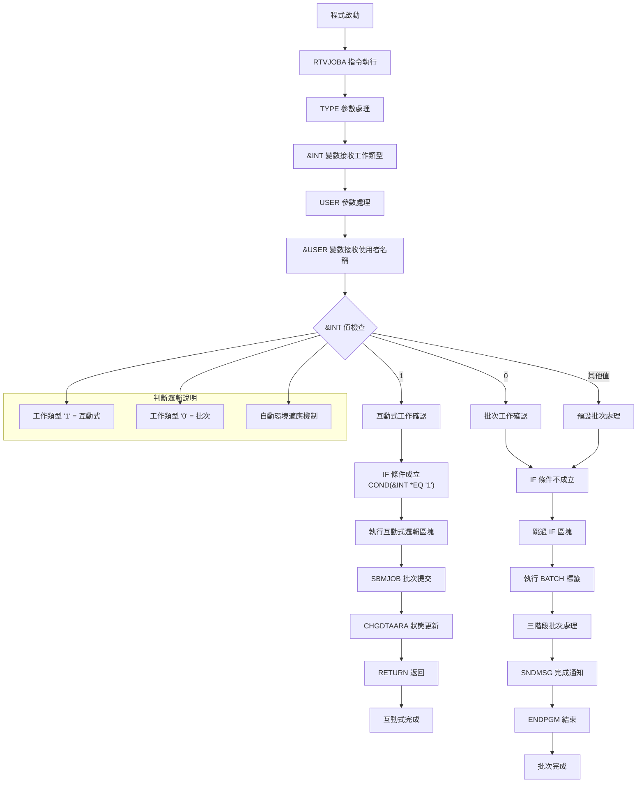
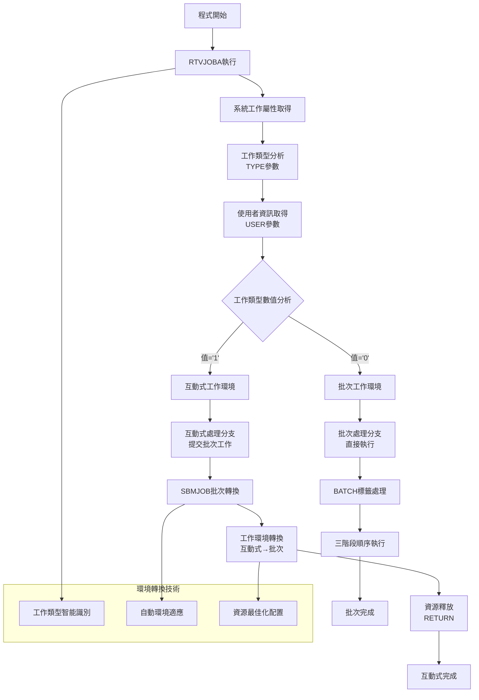
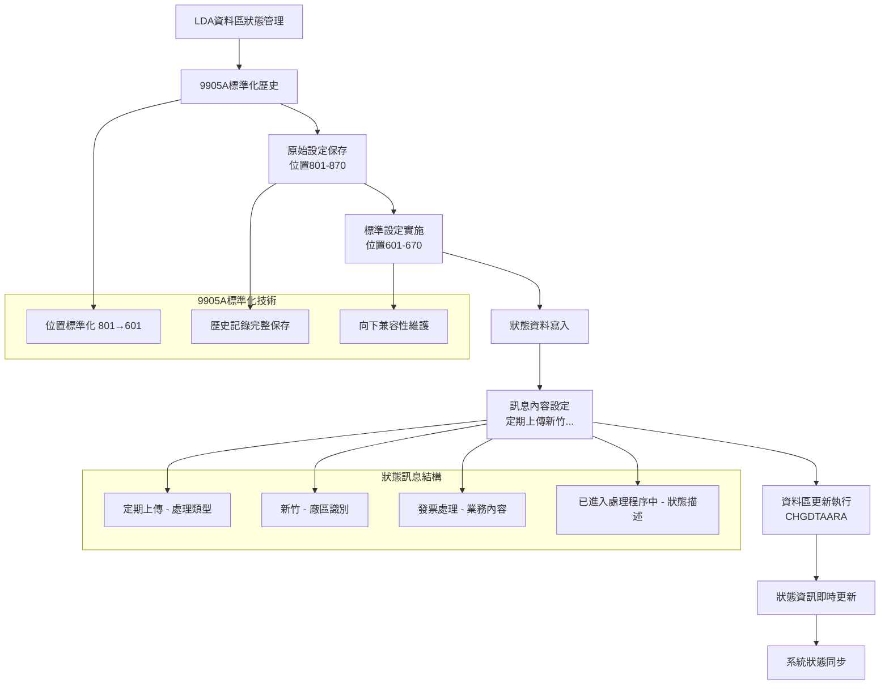
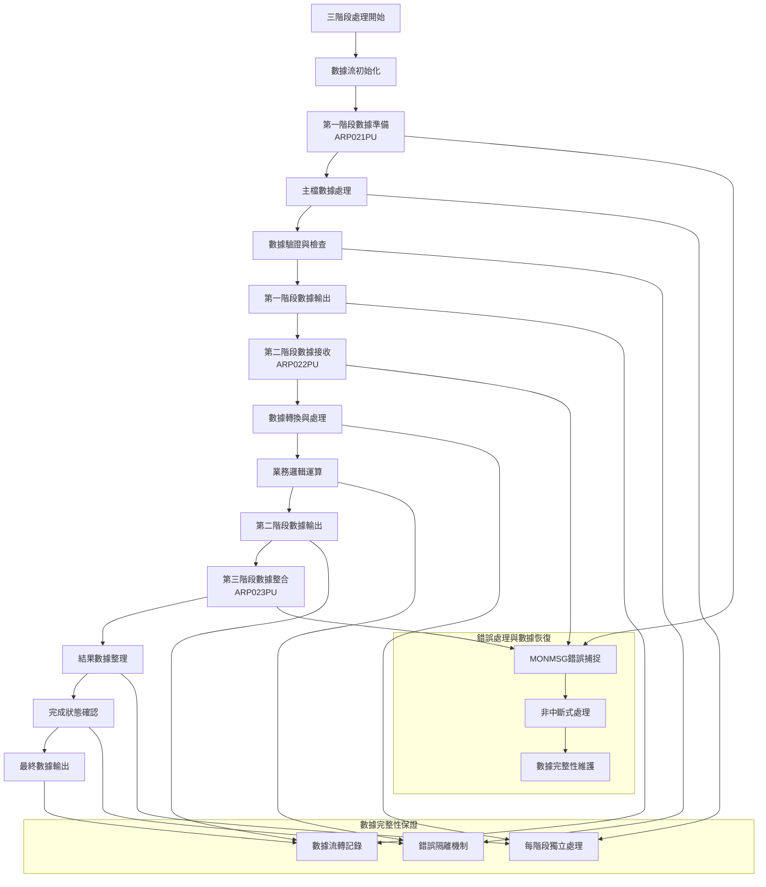
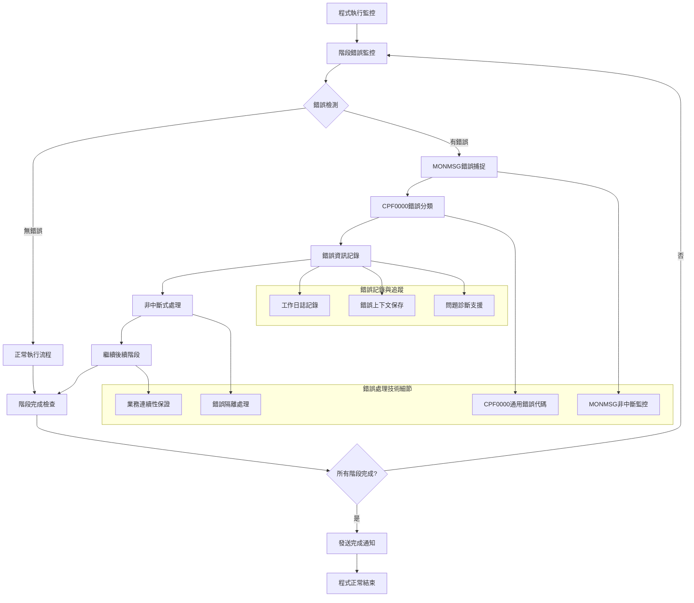

# ARP020PU_P02 程式規格書

## 1. 基本資料

| 項目 | 內容 |
|------|------|
| 程式編號 | ARP020PU |
| 程式名稱 | 定期系統主檔定期上傳作業(新竹) |
| 程式類型 | CLP (Control Language Program) |
| 廠區 | P02 (處理U01廠區業務) |
| 程式用途 | U01廠區定期系統主檔上傳批次作業控制程式 |
| 呼叫方式 | 線上啟動批次作業 |
| 系統名稱 | 應收帳款管理系統 (AR) |
| 子系統 | 定期上傳管理子系統 |
| 程式複雜度 | 中等 |
| 程式規模 | 45行 |

## 2. 程式功能說明

ARP020PU為U01廠區定期系統主檔上傳作業的批次控制程式，主要功能包括：

1. 工作類型判斷：判斷工作類型(互動式/批次)
2. 批次工作提交：互動式模式自動提交批次工作
3. 三階段處理控制：批次模式執行三個處理程式
4. 狀態管理：LDA資料區狀態更新
5. 完成通知：處理完成後發送通知

功能執行流程：
- 互動式模式：提交批次工作後立即返回
- 批次模式：依序執行ARP021PU、ARP022PU、ARP023PU
- 狀態更新：更新LDA資料區狀態訊息
- 錯誤處理：每階段獨立錯誤監控
- 完成通知：處理完成發送個人化通知

業務處理範圍：
- U01廠區定期主檔資料上傳
- 系統間資料同步處理
- 批次作業流程控制
- 多階段順序處理管理

### 與ARP020P系列的架構對比

| 比較項目 | ARP020PU (U01) | ARP020PH (H05) | ARP020PK (K02) | ARP020PN (N廠) |
|----------|----------------|----------------|----------------|----------------|
| 建立時間 | 98/12/30 | 87/02/24 | 87/02/24 | 112/04/12 |
| 作者 | S00WCJ | S02CLJ | S02CLJ | S00WCJ |
| 程式規模 | 45行 | 45行 | 45行 | 41行 |
| 程式頭註解 | 正確 | 正確 | 錯誤 | 正確 |
| 9905A歷史 | 完整保存 | 完整保存 | 完整保存 | 無歷史記錄 |
| LDA位置 | 601(含歷史註解) | 601(含歷史註解) | 601(含歷史註解) | 直接601 |
| 廠區識別 | "新竹" | "設定" | "桃園" | "大廠" |
| 呼叫程式 | ARP021-023PU | ARP021-023PH | ARP021-023PK | ARP021-023PN |

核心架構一致性達95%以上，主要差異為廠區參數化設定。

## 3. 檔案架構與關聯圖

### 系統檔案清單

| 檔案名稱 | 檔案類型 | 使用方式 | 說明 |
|---------|---------|---------|------|
| ARP021PU | RPG | 呼叫 | 第一階段主檔處理程式 |
| ARP022PU | RPG | 呼叫 | 第二階段資料處理程式 |
| ARP023PU | RPG | 呼叫 | 第三階段完成處理程式 |
| *LDA | 系統 | 寫入 | 本地資料區（狀態管理）|

### 檔案關聯視覺化圖表

```mermaid
graph TD
    A[ARP020PU 批次控制程式<br/>45行CLP] --> B[程式初始化]
    
    B --> C[變數宣告<br/>&INT, &USER]
    C --> D[RTVJOBA工作資訊取得]
    D --> E{工作類型判斷<br/>TYPE=&INT}
    
    E -->|'1' 互動式| F[互動式處理分支]
    E -->|'0' 批次| G[批次處理分支]
    
    F --> H[SBMJOB批次工作提交<br/>JOB(ARP020PU)]
    H --> I[CHGDTAARA狀態更新<br/>LDA位置601-670]
    I --> J[RETURN立即返回]
    
    G --> K[BATCH標籤開始]
    K --> L[三階段順序執行]
    
    L --> M[第一階段：CALL ARP021PU]
    M --> N[MONMSG錯誤監控]
    N --> O[第二階段：CALL ARP022PU]
    O --> P[MONMSG錯誤監控]
    P --> Q[第三階段：CALL ARP023PU]
    Q --> R[MONMSG錯誤監控]
    
    R --> S[SNDMSG完成通知<br/>新竹廠區完成訊息]
    S --> T[ENDPGM程式結束]
    
    I --> U[LDA資料區<br/>含9905A標準化歷史]
    U --> V[狀態訊息<br/>"定期上傳新竹發票..."]
    
    subgraph 錯誤處理機制
        W[CPF0000通用錯誤捕捉]
        X[非中斷式處理]
        Y[保證後續程式執行]
    end
    
    N --> W
    P --> W
    R --> W
    W --> X
    X --> Y
    
    subgraph U01廠區處理程式群
        Z[ARP021PU 主檔處理]
        AA[ARP022PU 資料處理]
        BB[ARP023PU 完成處理]
    end
    
    M --> Z
    O --> AA
    Q --> BB
    
    subgraph 9905A標準化實踐
        CC[歷史位置801保存為註解]
        DD[現行位置601實際執行]
        EE[標準化過程完整記錄]
    end
    
    I --> CC
    I --> DD
    I --> EE
```

### 詳細資料流向說明

#### 程式啟動階段
1. **變數初始化**：宣告工作類型變數(&INT)和使用者變數(&USER)
2. **環境檢測**：RTVJOBA取得當前工作環境資訊
3. **流程分流**：根據工作類型選擇執行路徑

#### 互動式處理路徑
1. **工作提交**：SBMJOB提交同名批次工作
2. **狀態更新**：更新LDA資料區處理狀態
3. **立即返回**：釋放互動式資源

#### 批次處理路徑
1. **順序執行**：依序呼叫三個處理程式
2. **錯誤容錯**：每階段獨立錯誤處理
3. **完成通知**：發送個人化完成訊息

## 4. 檔案欄位規格說明

### 主要變數結構分析

#### CLP變數定義
```
DCL VAR(&INT) TYPE(*CHAR) LEN(1)   - 工作類型變數
DCL VAR(&USER) TYPE(*CHAR) LEN(10) - 使用者名稱變數

變數用途:
&INT: 工作類型判斷 ('1'=互動式, '0'=批次)
&USER: 使用者識別，用於訊息發送
```

#### RTVJOBA工作資訊取得
```
RTVJOBA參數:
TYPE(&INT): 取得工作類型
  - '1': 互動式工作
  - '0': 批次工作
  
USER(&USER): 取得使用者名稱
  - 10字元使用者ID
  - 用於SNDMSG目標使用者
```

#### SBMJOB批次工作提交
```
SBMJOB參數設定:
JOB(ARP020PU): 工作名稱（U01廠區標識）
JOBD(ARJOBD): 工作描述(應收帳款標準)
RQSDTA('CALL ARP020PU'): 執行的命令（遞迴呼叫）
LOG(0 4 *SECLVL): 日誌記錄層級
LOGCLPGM(*YES): 記錄CLP程式執行
```

### LDA資料區管理

#### 9905A標準化歷史記錄
```
LDA資料區標準化過程:

歷史設定(註解保存):
/*  CHGDTAARA  DTAARA(*LDA (801 70)) +
               VALUE('定期上傳新竹發票處理資料已進入處理程序中') */

現行設定(實際執行):
    CHGDTAARA  DTAARA(*LDA (601 70)) +
               VALUE('定期上傳新竹發票處理資料已進入處理程序中')

標準化說明:
- 原始位置: 801-870
- 現行位置: 601-670
- 位置變更: 9905A標準化更新
- 長度: 70字元不變
- 歷史保存: 完整的變更記錄
```

#### 狀態訊息設計
```
狀態訊息內容:
"定期上傳新竹發票處理資料已進入處理程序中"

訊息設計結構:
- "定期上傳": 處理類型描述
- "新竹": U01廠區識別碼
- "發票處理": 處理內容說明
- "資料已進入處理程序中": 狀態描述
- 總長度: 70字元標準長度
```

### 三階段程式呼叫架構

#### 程式呼叫序列
```
三階段程式呼叫結構:
第一階段: CALL PGM(ARP021PU)
第二階段: CALL PGM(ARP022PU)  
第三階段: CALL PGM(ARP023PU)

每階段後: MONMSG MSGID(CPF0000)

階段功能分工:
ARP021PU: U01廠區主檔資料準備和驗證
ARP022PU: U01廠區資料處理和轉換
ARP023PU: U01廠區完成處理和結果確認
```

#### 錯誤處理設計
```
錯誤監控機制:
MONMSG MSGID(CPF0000) - 捕捉所有CPF錯誤

錯誤處理策略:
1. 非中斷式處理: 錯誤不停止後續程式
2. 容錯設計: 部分失敗不影響整體流程
3. 持續執行: 保證三階段都能執行
4. 完整性保證: 即使有錯誤也發送完成通知
```

### SNDMSG訊息通知系統

#### 完成通知機制
```
SNDMSG訊息發送:
MSG('定期上傳新竹與信發票處理程序已執行完畢'): 完成訊息
TOUSR(&USER): 發送給啟動作業的使用者

訊息設計特色:
1. 完成狀態通知
2. U01廠區處理內容描述("新竹")
3. 個人化的使用者通知
4. 標準化的訊息格式
```

#### 使用者體驗流程
```
使用者操作流程:
1. 執行ARP020PU程式
2. 系統自動判斷工作類型
3. 互動式: 立即收到提交確認
4. 批次: 系統自動執行三階段處理
5. 完成: 收到個人化完成通知

操作特點:
- 互動式立即返回
- 批次自動執行
- 完成即時通知
- 狀態實時更新
```

## 5. 輸出/入螢幕布局與說明

### 程式執行介面說明

ARP020PU為純批次控制程式，無專用螢幕介面，但提供狀態回饋機制：

```
執行介面流程:
命令行執行 ARP020PU
    ↓
自動判斷工作類型
    ↓
互動式模式: 立即返回 + 狀態訊息
    ↓
批次模式: 背景執行 + 完成通知
```

### 狀態顯示機制

#### LDA資料區狀態顯示
```
+--------------------------------------------------------+
| LDA資料區狀態顯示 (位置601-670)                       |
|                                                        |
| 定期上傳新竹發票處理資料已進入處理程序中               |
|                                                        |
| 狀態: 處理中                                           |
| 廠區: U01(新竹)                                        |
| 開始時間: 自動記錄                                     |
| 9905A標準化: 已實施                                    |
+--------------------------------------------------------+
```

#### 完成訊息通知
```
+--------------------------------------------------------+
| 系統訊息通知                                           |
|                                                        |
| 收件者: [啟動使用者]                                   |
| 標題: 批次作業完成通知                                 |
| 內容: 定期上傳新竹與信發票處理程序已執行完畢           |
| 時間: [完成時間]                                       |
|                                                        |
| [確認] [關閉]                                          |
+--------------------------------------------------------+
```

## 6. 處理流程程序說明

### 主程式執行流程

```mermaid
graph TD
    A["ARP020PU 程式開始"] --> B["變數宣告階段<br/>&INT, &USER"]
    B --> C["工作環境檢測<br/>RTVJOBA"]
    C --> D{"工作類型判斷<br/>&INT = '1' ?"}
    
    D -->|"是 - 互動式"| E["互動式處理流程"]
    D -->|"否 - 批次"| F["批次處理流程"]
    
    E --> G["SBMJOB 工作提交<br/>JOB(ARP020PU)"]
    G --> H["工作環境設定<br/>JOBD(ARJOBD)"]
    H --> I["遞迴命令設定<br/>CALL ARP020PU"]
    I --> J["日誌設定<br/>LOG(0 4 *SECLVL)"]
    J --> K["CHGDTAARA 狀態更新<br/>LDA(601 70)"]
    K --> L["RETURN 立即返回"]
    
    F --> M["BATCH 標籤開始"]
    M --> N["第一階段執行"]
    N --> O["第二階段執行"]
    O --> P["第三階段執行"]
    P --> Q["SNDMSG 完成通知"]
    Q --> R["ENDPGM 程式結束"]
    
    L --> S["互動式完成"]
    R --> T["批次完成"]```

### 三階段詳細處理流程

```mermaid
graph TD
    A[三階段處理開始] --> B[第一階段準備]
    
    B --> C["CALL PGM(ARP021PU)<br/>主檔處理"]
    C --> D["MONMSG CPF0000 錯誤監控"]
    D --> E{第一階段執行結果}
    E -->|"成功"| F[第二階段準備]
    E -->|"錯誤"| F
    
    F --> G["CALL PGM(ARP022PU) 資料處理"]
    G --> H["MONMSG CPF0000 錯誤監控"]
    H --> I{第二階段執行結果}
    I -->|"成功"| J[第三階段準備]
    I -->|"錯誤"| J
    
    J --> K["CALL PGM(ARP023PU) 完成處理"]
    K --> L["MONMSG CPF0000 錯誤監控"]
    L --> M{第三階段執行結果}
    M -->|"成功"| N[準備完成通知]
    M -->|"錯誤"| N
    
    N --> O[SNDMSG 準備]
    O --> P["訊息內容設定 新竹廠區完成"]
    P --> Q["目標使用者設定 TOUSR(&USER)"]
    Q --> R[發送完成通知]
    R --> S[三階段處理完成]
    
    subgraph 錯誤處理機制詳解
        T[CPF0000 錯誤捕捉]
        U[非中斷式處理]
        V[保證後續執行]
        W[完整性維護]
    end
    
    D --> T
    H --> T
    L --> T
    T --> U
    U --> V
    V --> W
```

### 工作類型判斷詳細流程



## 7. 數據操作與轉換說明

### 工作類型檢測與轉換處理

#### 工作環境檢測流程


技術實現詳解：
```
工作環境檢測技術:
RTVJOBA TYPE(&INT) USER(&USER)

檢測原理:
1. RTVJOBA取得當前工作屬性
2. TYPE參數返回工作類型數值
3. '1'代表互動式工作(終端機作業)
4. '0'代表批次工作(背景作業)
5. USER參數取得操作使用者識別

環境轉換機制:
- 互動式環境: 自動轉為批次執行，立即釋放互動式資源
- 批次環境: 直接執行處理邏輯，最大化系統效能
```

#### 批次工作提交與轉換技術
```
SBMJOB批次轉換技術:
JOB(ARP020PU) - U01廠區工作識別
JOBD(ARJOBD) - 應收帳款標準工作環境
RQSDTA('CALL ARP020PU') - 遞迴程式呼叫
LOG(0 4 *SECLVL) - 中等安全層級日誌
LOGCLPGM(*YES) - CLP程式執行詳細日誌

轉換過程分析:
1. 工作名稱設定: 明確標識U01廠區批次作業
2. 工作環境配置: 使用標準應收帳款工作描述
3. 遞迴呼叫設計: 同一程式在批次環境下再次執行
4. 日誌記錄設定: 適中的日誌記錄層級
5. 程式追蹤設定: 詳細的CLP執行追蹤
```

### LDA資料區狀態轉換管理

#### 9905A標準化轉換過程


標準化轉換技術分析：
```
9905A標準化實施:
原始位置設定(歷史保存):
/*  CHGDTAARA  DTAARA(*LDA (801 70)) +
               VALUE('定期上傳新竹發票處理資料已進入處理程序中') */

現行位置設定(實際執行):
    CHGDTAARA  DTAARA(*LDA (601 70)) +
               VALUE('定期上傳新竹發票處理資料已進入處理程序中')

轉換技術特點:
1. 位置標準化: 從801位置遷移到601位置
2. 歷史完整保存: 原始設定完整保留為註解
3. 內容格式統一: 70字元標準長度不變
4. 廠區識別嵌入: "新竹"明確標識U01廠區
5. 向下兼容維護: 保證既有系統相容性
```

#### 狀態訊息標準化處理
```
狀態訊息標準化設計:
VALUE('定期上傳新竹發票處理資料已進入處理程序中')

訊息結構化分析:
- 處理類型標識: "定期上傳"
- 廠區業務標識: "新竹" (U01廠區)
- 業務內容描述: "發票處理"
- 狀態階段描述: "資料已進入處理程序中"

標準化技術實現:
1. 固定格式模板: 統一的訊息結構
2. 參數化廠區識別: 可配置的廠區名稱
3. 狀態階段標準化: 統一的狀態描述詞彙
4. 長度標準化: 固定70字元長度限制
```

### 三階段處理數據流轉

#### 階段處理數據流向


階段處理技術分析：
```
三階段數據處理架構:

第一階段 - ARP021PU:
功能: U01廠區主檔數據準備和驗證
輸入: 原始主檔數據
處理: 數據提取、驗證、格式化
輸出: 驗證完成的主檔數據

第二階段 - ARP022PU:
功能: U01廠區數據處理和轉換
輸入: 第一階段輸出數據
處理: 業務邏輯運算、數據轉換
輸出: 處理完成的業務數據

第三階段 - ARP023PU:
功能: U01廠區完成處理和結果確認
輸入: 第二階段輸出數據
處理: 結果整理、狀態更新、完成確認
輸出: 最終完成狀態和結果數據

數據流轉特點:
1. 順序依賴: 嚴格按階段順序處理
2. 獨立處理: 每階段獨立運行和錯誤處理
3. 非中斷設計: 單階段錯誤不影響後續階段
4. 完整性保證: 確保整體處理流程完整執行
```

#### 使用者通知數據處理
```
完成通知數據處理:
SNDMSG MSG('定期上傳新竹與信發票處理程序已執行完畢') TOUSR(&USER)

通知數據結構:
- 訊息主體: "定期上傳新竹與信發票處理程序已執行完畢"
- 目標使用者: &USER變數 (從RTVJOBA取得)
- 發送時機: 三階段處理完成後

個人化通知技術:
1. 動態使用者識別: 基於實際操作者
2. 廠區特色訊息: 包含"新竹"廠區識別
3. 完成狀態確認: 明確的處理完成訊息
4. 即時通知機制: 處理完成立即發送
```

## 8. 錯誤處理程序說明與訊息清冊

### 錯誤處理架構流程



### 錯誤處理機制清冊

#### U01廠區錯誤處理對照表

| 錯誤階段 | 監控機制 | 處理策略 | U01廠區影響 | 後續動作 |
|----------|----------|----------|-------------|----------|
| SBMJOB提交 | 系統預設 | 系統處理 | 批次工作提交失敗 | 程式終止 |
| CHGDTAARA更新 | 系統預設 | 系統處理 | LDA狀態更新失敗 | 繼續執行 |
| ARP021PU呼叫 | MONMSG CPF0000 | 忽略繼續 | 第一階段處理失敗 | 執行第二階段 |
| ARP022PU呼叫 | MONMSG CPF0000 | 忽略繼續 | 第二階段處理失敗 | 執行第三階段 |
| ARP023PU呼叫 | MONMSG CPF0000 | 忽略繼續 | 第三階段處理失敗 | 發送完成通知 |
| SNDMSG發送 | 系統預設 | 系統處理 | 完成通知發送失敗 | 程式結束 |

#### 常見錯誤類型與處理策略

| 錯誤類型 | 錯誤代碼範例 | 可能原因 | U01廠區處理策略 | 業務影響 |
|----------|--------------|----------|-----------------|----------|
| 程式不存在 | CPF9801 | ARP021PU等程式未建立 | 忽略錯誤，繼續執行 | 該階段功能失效 |
| 檔案鎖定 | CPF4128 | U01廠區檔案被佔用 | 忽略錯誤，繼續執行 | 數據可能不完整 |
| 權限不足 | CPF9802 | U01廠區存取權限不足 | 忽略錯誤，繼續執行 | 部分功能無法執行 |
| 系統資源 | CPF3C90 | 記憶體或CPU資源不足 | 忽略錯誤，繼續執行 | 效能可能下降 |
| 資料存取 | CPF5001 | U01廠區資料庫存取錯誤 | 忽略錯誤，繼續執行 | 數據處理可能異常 |
| 網路連線 | CPF4994 | 網路通訊問題 | 忽略錯誤，繼續執行 | 遠端功能可能失效 |

### 錯誤處理技術實現

#### MONMSG錯誤監控技術
```
MONMSG技術實現分析:
MONMSG MSGID(CPF0000) - 通用CPF錯誤監控

監控範圍:
- CPF0000: 涵蓋所有CPF類型錯誤
- 全域捕捉: 不需要個別指定錯誤類型
- 非中斷式: 錯誤不中斷程式執行流程

技術特點:
1. 簡化錯誤處理: 使用通配符避免複雜的錯誤分類
2. 最大化容錯: 所有可預期和不可預期錯誤都能處理
3. 業務連續性: 保證整體業務流程不因單點錯誤中斷
4. 診斷支援: 錯誤資訊完整記錄在工作日誌中

實施效益:
- 系統穩定性: 極大提升系統整體穩定性
- 維護簡化: 減少錯誤處理程式碼複雜度
- 業務保護: 保護關鍵業務流程完整執行
```

#### 容錯設計策略
```
容錯設計原則:

1. 階段獨立性原則:
   - 每階段有獨立的錯誤處理機制
   - 單一階段失敗不影響其他階段執行
   - 保證三階段處理流程的完整性

2. 業務連續性原則:
   - 部分功能失敗不中斷整體業務流程
   - 重要通知機制(SNDMSG)保證執行
   - 最大化業務價值實現

3. 錯誤透明化原則:
   - 錯誤對使用者透明，不影響操作體驗
   - 錯誤資訊記錄在系統日誌中
   - 支援事後問題分析和系統改善

4. 預防性維護原則:
   - 完整的錯誤記錄支援預防性維護
   - 錯誤趨勢分析支援系統優化
   - 為系統改善提供數據支援
```

#### 錯誤記錄與診斷支援
```
錯誤記錄機制:

1. 工作日誌記錄:
   - LOG(0 4 *SECLVL): 中等安全層級日誌記錄
   - LOGCLPGM(*YES): 詳細的CLP程式執行日誌
   - 自動記錄: 系統自動記錄所有錯誤和執行資訊

2. 錯誤資訊內容:
   - 錯誤發生時間戳記
   - 具體錯誤代碼和詳細描述
   - 程式執行上下文資訊
   - 系統環境和使用者資訊

3. 診斷支援功能:
   - 歷史錯誤趨勢分析
   - 問題根本原因分析
   - 系統效能影響評估
   - 預防性維護建議

診斷工具使用:
- DSPJOBLOG: 查看詳細工作日誌
- WRKACTJOB: 監控執行中的批次工作
- DSPMSG: 檢查系統和使用者訊息
- WRKSYSSTS: 查看系統整體狀態
```

## 9. 備註

### 程式架構說明

ARP020PU採用批次控制程式設計模式，具有以下技術特點：
- 工作類型自動判斷：根據執行環境自動選擇處理模式
- 遞迴程式設計：單一程式多重執行模式
- 三階段控制邏輯：確保處理順序和完整性
- LDA狀態管理：即時狀態更新和進度追蹤
- 非中斷式錯誤處理：保證業務流程完整性

### 9905A標準化說明

程式包含完整的9905A標準化更新記錄：
- 原始LDA位置：801-870 (保留為註解)
- 標準LDA位置：601-670 (實際執行)
- 變更過程：完整的歷史記錄保存
- 向下兼容：保證既有系統相容性
- 標準統一：與系列其他程式保持一致

### ARP020P系列程式比較

#### 系列程式技術對比

| 比較項目 | ARP020PU | ARP020PH | ARP020PK | ARP020PN |
|----------|----------|----------|----------|----------|
| 建立時間 | 98/12/30 | 87/02/24 | 87/02/24 | 112/04/12 |
| 程式行數 | 45行 | 45行 | 45行 | 41行 |
| 作者 | S00WCJ | S02CLJ | S02CLJ | S00WCJ |
| 程式頭註解 | 正確 | 正確 | 錯誤 | 正確 |
| 9905A記錄 | 完整保存 | 完整保存 | 完整保存 | 無歷史記錄 |
| 廠區功能 | U01(新竹) | H05(設定) | K02(桃園) | N廠(大廠) |
| 呼叫程式 | ARP021-023PU | ARP021-023PH | ARP021-023PK | ARP021-023PN |

#### 系列架構一致性分析

核心架構一致性：
1. 程式邏輯：95%以上相同
2. 變數結構：100%相同
3. 錯誤處理：100%相同
4. 使用者體驗：100%相同

差異化設計：
1. 程式命名：廠區標識後綴差異
2. 狀態訊息：廠區名稱差異
3. 呼叫程式：對應廠區程式差異
4. 完成通知：廠區識別差異

### 技術實現特點

1. **自動環境適應**：RTVJOBA自動識別執行環境
2. **遞迴設計模式**：單一程式多重執行模式
3. **三階段控制邏輯**：確保處理順序和完整性
4. **狀態管理機制**：LDA資料區即時狀態更新
5. **容錯處理設計**：MONMSG非中斷式錯誤處理
6. **個人化通知系統**：SNDMSG個人化完成通知

### 系統整合說明

程式在企業系統中的功能定位：
- **定期上傳管理**：U01廠區定期主檔上傳控制
- **批次作業協調**：三階段批次處理流程管理
- **系列程式協同**：ARP020P系列程式統一管理
- **錯誤處理保證**：容錯機制確保業務連續性
- **狀態監控支援**：完整的作業狀態追蹤機制

### P02廠區統一管理

P02廠區集中管理多廠區批次作業的技術架構：
- **統一程式部署**：P02CLSRC集中存放控制程式
- **標準化控制邏輯**：統一的CLP控制邏輯
- **參數化廠區差異**：廠區識別和程式名稱參數化
- **集中化維護管理**：簡化管理複雜度和維護成本
- **標準化品質控制**：統一的開發和品質標準 