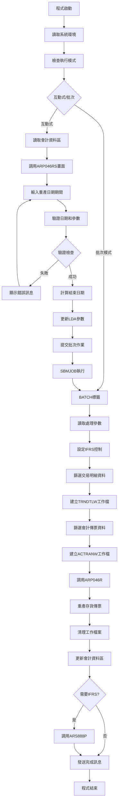
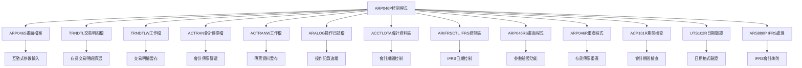
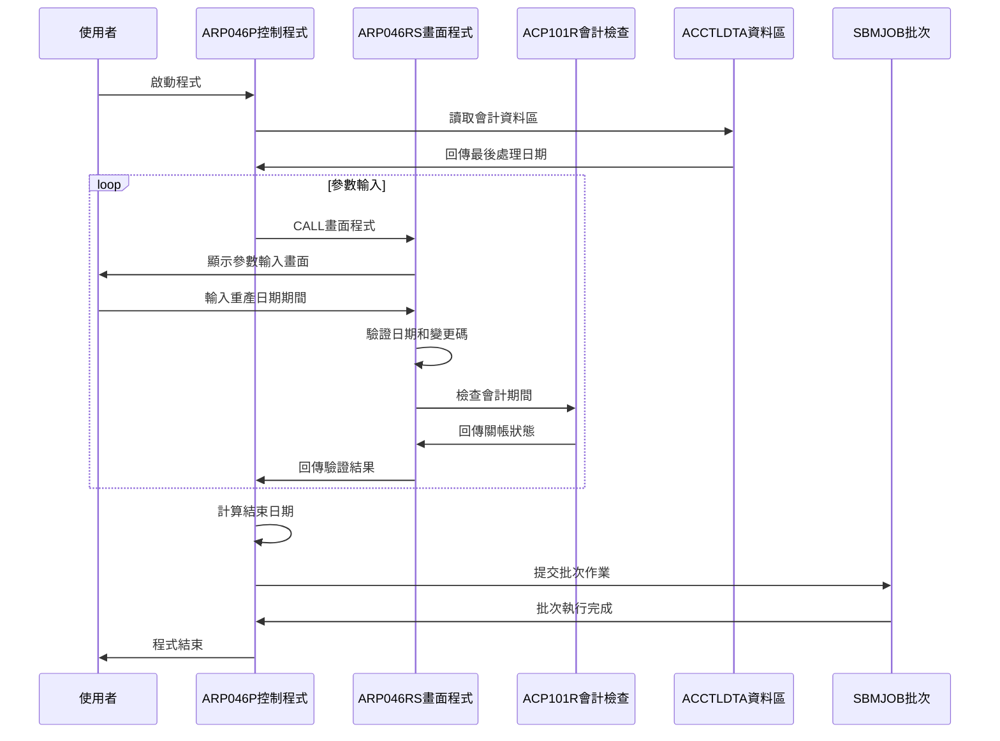
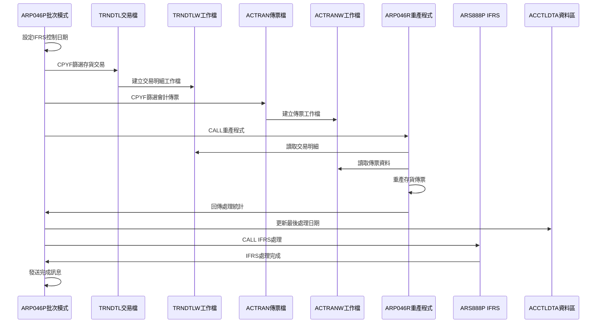
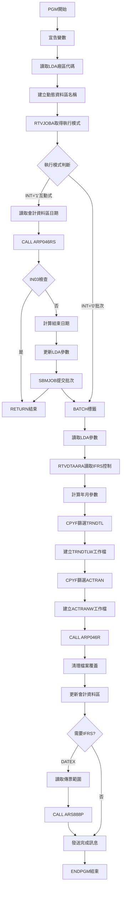

# ARP046P_U01 程式規格書

## 1. 基本資料

| 項目 | 內容 |
|------|------|
| **程式編號** | ARP046P |
| **程式名稱** | 彈性存貨傳票重產作業 |
| **程式類型** | CLP |
| **廠區** | U01 |
| **系統名稱** | 應收帳款系統 |
| **子系統** | 存貨傳票管理 |
| **檔案位置** | U01CLSRC_THSRC/ARP046P.txt |

## 🎯 2. 程式功能說明

### 主要功能描述
ARP046P是彈性存貨傳票重產作業的控制程式，專門處理存貨相關會計傳票的重新產生和計算作業。程式提供互動式日期和期間輸入功能，支援彈性的重產範圍設定，能夠重新計算指定期間內的存貨相關交易明細(SA04)和會計傳票(C00000-C00799系列)，並整合IFRS會計準則相關處理，確保存貨評價和傳票資料的正確性。

### 🎯 業務流程詳細說明

#### 完整業務流程圖


#### 業務流程關鍵階段說明

**階段一：環境初始化與參數設定**
- 讀取LDA廠區代碼並建立動態資料區名稱
- 使用RTVJOBA檢查執行類型和使用者資訊
- 從會計資料區讀取最後處理日期作為預設值

**階段二：互動式處理階段**
- 調用ARP046RS進行重產參數輸入
- 輸入重產開始日期和結束日期
- 驗證日期格式和合理性檢查
- 檢查會計期間是否已關帳
- 驗證變更碼(CGCA)必須輸入
- 計算期間結束日期並更新LDA參數
- 提交批次作業進行實際處理

**階段三：存貨交易明細篩選處理**
- 設定TRNDTL交易明細檔案覆蓋
- 使用CPYF篩選存貨相關交易明細：
  * TXVUNO<>' '(有傳票號碼)
  * TXCODE='SA04'(存貨交易代碼)
  * TXACNT<=3(帳戶層級<=3)
  * TXFLAG<>'D'(非刪除記錄)
  * TXACDT介於處理日期區間
  * TXTXAR=廠區代碼
- 建立QTEMP/TRNDTLW工作檔案

**階段四：會計傳票篩選處理**
- 設定ACTRAN會計傳票檔案覆蓋
- 使用CPYF篩選存貨相關會計傳票：
  * ACVRNO介於'C00000'-'C00799'(存貨傳票號碼範圍)
  * ACAREA=廠區代碼
  * ACYM=年月
  * ACYMD介於處理日期區間
- 建立QTEMP/ACTRANW工作檔案

**階段五：存貨傳票重產與收尾**
- 調用ARP046R進行存貨傳票重產處理
- 返回比對筆數和刪除筆數統計
- 清理所有檔案覆蓋設定
- 更新會計資料區的最後處理日期
- 檢查是否需要IFRS處理
- 調用ARS888P進行IFRS會計準則處理
- 發送處理完成訊息給執行使用者

## 🎯 3. 檔案架構與關聯圖

### 使用檔案清單

| 檔案名稱 | 檔案用途 | 存取方式 | 關聯說明 |
|---------|----------|----------|----------|
| **ARP046S** | 日期輸入畫面 | WORKSTN | 互動式輸入介面 |
| **TRNDTL** | 交易明細主檔 | INPUT | 存貨交易明細資料 |
| **TRNDTLW** | 交易明細工作檔 | OUTPUT | 篩選後交易明細暫存 |
| **ACTRAN** | 會計傳票主檔 | INPUT | 會計傳票資料 |
| **ACTRANW** | 會計傳票工作檔 | OUTPUT | 篩選後傳票暫存 |
| **ARALOG** | 系統操作日誌檔 | OUTPUT | 操作記錄追蹤 |
| **ACCTLDTA** | 會計資料區 | UPDATE | 廠區會計控制資訊 |
| **ARIFRSCTL** | IFRS控制資料區 | INPUT | IFRS啟用日期控制 |
| **ARP046RS** | 畫面處理程式 | CALL | 參數輸入驗證 |
| **ARP046R** | 重產處理程式 | CALL | 主要重產邏輯 |
| **ACP101R** | 會計期間檢查 | CALL | 關帳狀態驗證 |
| **UTS102R** | 日期驗證程式 | CALL | 日期格式檢查 |
| **ARS888P** | IFRS處理程式 | CALL | 國際會計準則 |

### 🎯 檔案關聯詳細視覺化圖表



### 🎯 資料流向詳細說明

#### 互動式操作的資料流向


#### 批次處理階段的資料流向


## 🎯 4. 檔案欄位規格說明

### 主要資料結構

#### ARP046P程式變數宣告結構

| 變數名稱 | 型態 | 長度 | 宣告行 | 用途說明 |
|----------|------|------|--------|---------|
| **&INT** | *CHAR | 1 | 11 | 執行模式判斷變數 |
| **&WHOAMI** | *CHAR | 10 | 12 | 執行使用者識別 |
| **&DATEX** | *CHAR | 8 | 13 | 重產開始日期 |
| **&DATEE** | *CHAR | 8 | 14 | 重產結束日期 |
| **&DATEY** | *CHAR | 8 | 15 | 預設處理日期 |
| **&DATEZ** | *CHAR | 8 | 16 | 備份處理日期 |
| **&ENDD** | *CHAR | 2 | 17 | 結束日期天數 |
| **&AREA** | *CHAR | 1 | 18 | 廠區代碼 |
| **&DTARA** | *CHAR | 11 | 19 | 動態資料區名稱 |
| **&YM** | *CHAR | 6 | 20 | 年月變數 |
| **&IN03** | *CHAR | 1 | 21 | F3功能鍵指示器 |
| **&CNTT** | *CHAR | 6 | 22 | 比對筆數回傳 |
| **&CNTA** | *CHAR | 6 | 23 | 刪除筆數回傳 |
| **&D#VNO1** | *CHAR | 6 | 24 | IFRS傳票起始號 |
| **&D#VNO2** | *CHAR | 6 | 25 | IFRS傳票結束號 |
| **&IFRSD** | *CHAR | 8 | 26 | IFRS啟用日期 |

#### ARP046RS程式DS結構完整分析

```
ARP046RS程式中的DS結構：

DS#1: W#SYST (總長度140字元)
位置001-140: [XXXXXXXXXXXXXXXXXXXXXXXXXXXXXXXXXXXXXXXXXXXXXXXXXXXXXXXXXXXXXXXXXXXXXXXXXXXXXXXXXXXXXXXXXXXXXXXXXXXXXXXXXXXXXXXXXXXXXXXXXXXXXXXXXXXXXXXX]
            ↓                    ↓                  ↓                     ↓
位置001-006: [XXXXXX]            系統日期字串
位置007-010: [XXXX]              系統年份
位置011-014: [XXXX]              系統月日

DS#2: W#DATE (總長度8字元) 
位置001-008: [XXXXXXXX]
            ↓        ↓
位置001-004: [XXXX]              年份部分
位置005-008: [XXXX]              月日部分
```

#### ARP046S螢幕檔案欄位結構

| 欄位名稱 | 型態 | 長度 | 位置 | 屬性 | 說明 |
|----------|------|------|------|------|------|
| **S#COMP** | CHAR | 35 | 1,23 | OUTPUT | 公司名稱顯示 |
| **S#DEVI** | CHAR | 10 | 2,70 | OUTPUT | 終端機名稱 |
| **S#DATE** | NUMERIC | 8 | 10,28 | BOTH | 重產日期輸入 |
| **S#ENDD** | NUMERIC | 2 | 10,54 | BOTH | 結束天數輸入 |
| **S#CGCA** | CHAR | 40 | 12,28 | BOTH | 變更代號輸入 |
| **S#MSG1** | CHAR | 70 | 24,2 | OUTPUT | 錯誤訊息顯示 |

### 🔍 重點欄位切割技術詳解

#### DS結構完整分析

**W#SYST結構切割視覺化：**
```
W#SYST (140字元)：[XXXXXX|XXXX|XXXXXXXXXXXXXXXXXXXXXXXXXXXXXXXXXXXXXXXXXXXXXXXXXXXXXXXXXXXXXXXXXXXXXXXXXXXXXXXXXXXXXXXXXXXXXXXXXXXXXXXXXXXXXXXXXXXX]
                   ↓      ↓    ↓
D#ST   (6字元)：  [XXXXXX]                    系統日期字串部分
D#SY   (4字元)：        [XXXX]                系統年份部分  
D#SMD  (4字元)：             [XXXX]           系統月日部分
保留區域：                       [XXXXXXXXXXXXXXXXXXXXXXXXXXXXXXXXXXXXXXXXXXXXXXXXXXXXXXXXXXXXXXXXXXXXXXXXXXXXXXXXXXXXXXXXXXXXXXXXXXXXXXXXXXXX]
```

**W#DATE結構切割視覺化：**
```
W#DATE (8字元)：[XXXX|XXXX]
                 ↓    ↓
W#YY   (4字元)：[XXXX]        年份部分
未命名 (4字元)：     [XXXX]   月日部分
```

#### 欄位切割視覺化展示

**%SST函數切割技術完整展示：**
```
原始變數切割對應圖：

&DATEX (8字元)：[YYYY|MM|DD]
                 ↓    ↓  ↓
切割位置1-6：    [YYYYMM]      → %SST(&DATEX 1 6) → &YM
切割位置7-2：           [DD]   → %SST(&DATEE 7 2) → 結束日期最後2位

實際範例：
&DATEX = '20231215'
%SST(&DATEX 1 6) = '202312'  ← 年月提取至&YM
%SST(&DATEE 7 2) 寫入位置   ← 第7-8位覆寫
```

**結束日期組合技術：**
```
結束日期組合邏輯：
CHGVAR VAR(&DATEE) VALUE(&DATEX)      ← 複製完整開始日期
CHGVAR VAR(%SST(&DATEE 7 2)) VALUE(&ENDD)  ← 覆寫最後2位

組合過程視覺化：
步驟1: &DATEE = &DATEX = '20231215'
       [2023|12|15]
步驟2: %SST(&DATEE 7 2) = &ENDD = '31'
       [2023|12|31]  ← 最終結果
```

#### 切割邏輯詳細說明

**%SST切割函數語法解析：**
1. **%SST(&DATEX 1 6)**：
   - 來源變數：&DATEX
   - 起始位置：1（第1個字元）
   - 擷取長度：6（連續6個字元）
   - 用途：提取年月部分(YYYYMM)

2. **%SST(&DATEE 7 2)**：
   - 目標變數：&DATEE
   - 起始位置：7（第7個字元）
   - 覆寫長度：2（連續2個字元）
   - 用途：覆寫日期部分(DD)

**動態字串組合技術：**
```
資料區名稱組合：
'ACCTLDTA' *CAT &AREA
基礎字串(8) + 廠區碼(1) = 完整名稱(9)

會計檔案名稱組合：
'AC' || &AREA || 'R'
前綴(2) + 廠區碼(1) + 後綴(1) = 檔案名(4)
```

#### 實際數據範例說明

**範例1：U01廠區月底處理**
```
輸入資料：
&AREA = 'U'
&DATEX = '20231201'
&ENDD = '31'

處理過程：
1. &DTARA = 'ACCTLDTA' *CAT 'U' = 'ACCTLDTAU'
2. &YM = %SST('20231201' 1 6) = '202312'
3. &DATEE = '20231201'
4. %SST(&DATEE 7 2) = '31' → &DATEE = '20231231'

最終結果：
&DTARA = 'ACCTLDTAU'     ← 動態資料區名稱
&YM = '202312'           ← 處理年月
&DATEE = '20231231'      ← 結束日期
```

**範例2：IFRS傳票範圍處理**
```
*LDA位置讀取：
RTVDTAARA DTAARA(*LDA (201 6)) RTNVAR(&D#VNO1)
RTVDTAARA DTAARA(*LDA (211 6)) RTNVAR(&D#VNO2)

假設*LDA內容：
位置201-206: 'D00001'
位置211-216: 'D99999'

讀取結果：
&D#VNO1 = 'D00001'     ← IFRS傳票起始號
&D#VNO2 = 'D99999'     ← IFRS傳票結束號
```

### 🎯 欄位挪用詳細分析

#### 挪用情況對比表

| 欄位名稱 | 原始定義 | 實際挪用 | 挪用位置 | 挪用方式 |
|----------|----------|----------|----------|----------|
| ***LDA** | 系統共用資料區域 | 程式間參數傳遞 | 多個固定位置 | 位置分割使用 |
| **位置1-8** | 通用暫存區域 | 重產開始日期 | *LDA(1 8) | RTVDTAARA/CHGDTAARA |
| **位置9-16** | 通用暫存區域 | 重產結束日期 | *LDA(9 8) | RTVDTAARA/CHGDTAARA |
| **位置201-206** | 預留擴充區域 | IFRS傳票起始號 | *LDA(201 6) | RTVDTAARA專用讀取 |
| **位置211-216** | 預留擴充區域 | IFRS傳票結束號 | *LDA(211 6) | RTVDTAARA專用讀取 |
| **位置1021** | 系統環境設定 | 廠區識別碼 | *LDA(1021 1) | 廠區代碼儲存 |

#### 挪用原因深度分析

***LDA多位置挪用原因：**
1. **跨程式資料傳遞需求**：
   - ARP046P（控制程式）→ ARP046P（批次模式）
   - 互動式輸入的參數需要傳遞給批次處理

2. **IFRS特殊處理需求**：
   - 位置201-206、211-216專門用於IFRS相關處理
   - 與ARS888P程式的參數介面協定

3. **廠區多版本環境**：
   - 位置1021儲存廠區代碼
   - 支援U01/K02/P02/H05多廠區版本

#### 挪用方式詳細說明

***LDA位置挪用技術實現：**
```
讀取操作：
RTVDTAARA DTAARA(*LDA (位置 長度)) RTNVAR(變數)

寫入操作：
CHGDTAARA DTAARA(*LDA (位置 長度)) VALUE(數值)

位置計算：
位置1-8：   8字元重產開始日期
位置9-16：  8字元重產結束日期  
位置201-206：6字元IFRS起始號
位置211-216：6字元IFRS結束號
位置1021：  1字元廠區代碼
```

**動態檔案名稱挪用：**
```
會計資料區挪用：
基礎名稱 'ACCTLDTA' + 廠區代碼 &AREA
結果名稱儲存至 &DTARA(11字元)

會計檔案挪用：
檔案名稱 'AC' + 廠區代碼 + 'R'
OVRDBF動態覆寫至對應廠區檔案
```

#### 挪用影響評估

**系統設計影響：**
- *LDA的固定位置使用形成了程式間的隱含協定
- 位置分配必須與其他程式協調避免衝突
- 廠區代碼挪用支援了多廠區環境的靈活性

**維護作業影響：**
- *LDA位置變更需要同步修改所有相關程式
- 挪用位置的文件記錄對維護作業至關重要
- IFRS相關位置的挪用與法規要求緊密關聯

### 重要變數定義表

| 變數名稱 | 資料型態 | 長度 | 來源 | 傳遞方式 | 用途說明 |
|----------|----------|------|------|----------|---------|
| **&INT** | *CHAR | 1 | RTVJOBA | 系統取得 | 執行模式('0'批次/'1'互動) |
| **&WHOAMI** | *CHAR | 10 | RTVJOBA | 系統取得 | 執行使用者ID |
| **&DATEX** | *CHAR | 8 | *LDA | 資料區讀取 | 重產開始日期(YYYYMMDD) |
| **&DATEE** | *CHAR | 8 | 計算產生 | 程式計算 | 重產結束日期(YYYYMMDD) |
| **&DATEY** | *CHAR | 8 | ACCTLDTA | 資料區讀取 | 會計資料區預設日期 |
| **&DATEZ** | *CHAR | 8 | *LDA | 資料區讀取 | 備份處理日期 |
| **&ENDD** | *CHAR | 2 | ARP046RS | 畫面輸入 | 結束日期天數 |
| **&AREA** | *CHAR | 1 | *LDA | 資料區讀取 | 廠區代碼(U/K/P/H) |
| **&DTARA** | *CHAR | 11 | 字串組合 | 程式計算 | 動態組合資料區名稱 |
| **&YM** | *CHAR | 6 | %SST切割 | 程式切割 | 年月(%SST(&DATEX 1 6)) |
| **&IN03** | *CHAR | 1 | ARP046RS | 畫面回傳 | F3功能鍵指示器 |
| **&CNTT** | *CHAR | 6 | ARP046R | 程式回傳 | 比對筆數統計 |
| **&CNTA** | *CHAR | 6 | ARP046R | 程式回傳 | 刪除筆數統計 |
| **&D#VNO1** | *CHAR | 6 | *LDA | 資料區讀取 | IFRS傳票起始號 |
| **&D#VNO2** | *CHAR | 6 | *LDA | 資料區讀取 | IFRS傳票結束號 |
| **&IFRSD** | *CHAR | 8 | ARIFRSCTL | 資料區讀取 | IFRS啟用基準日期 |

### 檔案存取欄位規格

#### TRNDTL交易明細檔案欄位

| 欄位名稱 | 型態 | 長度 | 篩選條件 | 業務用途 |
|----------|------|------|----------|----------|
| **TXVUNO** | CHAR | 7 | *NE '       ' | 傳票號碼(必須有值) |
| **TXCODE** | CHAR | 4 | *EQ 'SA04' | 交易代碼(存貨專用) |
| **TXACNT** | CHAR | 1 | *LE '3' | 帳戶標記(主要存貨帳戶) |
| **TXFLAG** | CHAR | 1 | *NE 'D' | 處理旗標(非刪除記錄) |
| **TXACDT** | NUMERIC | 8 | 日期範圍 | 入帳日期(篩選條件) |
| **TXTXAR** | CHAR | 1 | *EQ &AREA | 異動廠區(廠區匹配) |

#### ACTRAN會計傳票檔案欄位

| 欄位名稱 | 型態 | 長度 | 篩選條件 | 業務用途 |
|----------|------|------|----------|----------|
| **ACVRNO** | CHAR | 6 | 'C00000'-'C00799' | 傳票號碼(存貨範圍) |
| **ACAREA** | CHAR | 1 | *EQ &AREA | 廠區代碼(廠區匹配) |
| **ACYM** | CHAR | 6 | *EQ &YM | 年月(期間匹配) |
| **ACYMD** | NUMERIC | 8 | 日期範圍 | 傳票日期(篩選條件) |

## 🎯 5. 輸出/入螢幕布局

### 🎯 主輸入畫面(ARP046S)

```
+----------------------------------------------------------+
|  99/12/26    東鋼企業股份有限公司              ARP046RS  |
| 14:30:25  東鋼企業外幣處理彈性存貨傳票重產     DEVNAME   |
|                                                          |
|                                                          |
|                                                          |
|                                                          |
|       注意事項:重產功能僅限於存貨相關傳票進行處理。      |
|                                                          |
|        -------------------------------------------       |
|        重產日期:[________] 至同月底或輸入[__]            |
|                  (若未輸入則至月底)                     |
|        變更代號:[________________________]              |
|        -------------------------------------------       |
|                                                          |
|                                                          |
|                                                          |
|                                                          |
|                                                          |
|                                                          |
|                                                          |
|           F3:結束程式    F12:結束程式    ENTER:確認      |
| [錯誤訊息顯示區]                                          |
+----------------------------------------------------------+
```

### 🎯 畫面欄位詳細說明

#### 輸入欄位規格
| 欄位名稱 | 型態 | 長度 | 輸入格式 | 驗證規則 | 說明 |
|---------|------|------|----------|----------|------|
| **S#DATE** | 數值 | 8 | YYYYMMDD | 日期格式驗證 | 重產開始日期(必填) |
| **S#ENDD** | 數值 | 2 | DD | 天數驗證 | 結束日期天數(選填) |
| **S#CGCA** | 字元 | 40 | 變更代號 | 必填檢查 | 變更代號(必填) |

#### 顯示欄位規格
| 欄位名稱 | 型態 | 長度 | 顯示格式 | 說明 |
|---------|------|------|----------|------|
| **S#COMP** | 字元 | 35 | 左對齊 | 公司名稱 |
| **S#DEVI** | 字元 | 10 | 右對齊 | 終端機名稱 |
| **S#MSG1** | 字元 | 70 | 左對齊反白 | 錯誤訊息顯示 |

### 🎯 畫面控制邏輯

#### 驗證規則詳細說明
1. **日期驗證**：
   - 調用UTS102R檢查YYYYMMDD日期格式
   - 不可大於系統當日
   - 不可大於會計資料區的處理日期
   - 年份必須>=100年(避免Y2K問題)

2. **會計期間檢查**：
   - 調用ACP101R檢查會計年月關帳狀態
   - 已關帳期間禁止重產作業

3. **變更代號檢查**：
   - 必須輸入變更代號
   - 用於操作記錄追蹤

### 功能鍵詳細定義

| 功能鍵 | 處理邏輯 | 系統行為 |
|--------|----------|----------|
| **F3** | 結束程式 | 設定P#IN03='1'，結束程式執行 |
| **F12** | 結束程式 | 同F3功能 |
| **ENTER** | 確認處理 | 執行驗證並提交批次作業 |

### 🎯 錯誤訊息清冊

| 錯誤編號 | 錯誤訊息 | 觸發條件 | 解決方式 |
|----------|---------|----------|----------|
| **T#ERR,1** | 日期輸入格式錯誤 | 日期格式不符YYYYMMDD | 重新輸入正確日期格式 |
| **T#ERR,2** | 不可大於系統日期 | 輸入日期>系統日期 | 輸入正確的處理日期 |
| **T#ERR,3** | 已經處理或不可重產 | 輸入日期>會計處理日期 | 確認會計處理進度 |
| **T#ERR,4** | 變更代號必須輸入 | 變更代號欄位空白 | 輸入有效的變更代號 |
| **T#ERR,5** | 會計期間已關帳 | 會計期間已關帳 | 聯繫會計人員確認 |
| **T#ERR,6** | 輸入年份錯誤(可輸入至100年) | 年份<100 | 輸入正確的年份 |

## 🎯 6. 處理流程程序說明

### 🎯 主程序邏輯深度分析

#### 程式執行流程圖


#### 🎯 詳細處理步驟逐一分析

**步驟1: 環境初始化處理**
1. 宣告所有CLP變數並設定初始型態
2. 從LDA位置1021讀取廠區代碼
3. 建立動態會計資料區名稱：'ACCTLDTA'+廠區代碼
4. 使用RTVJOBA取得執行類型和使用者資訊

**步驟2: 互動式模式處理邏輯**
1. 檢查執行模式，若非批次進入互動式處理
2. 從會計資料區位置9-16讀取預設處理日期
3. 設定預設開始日期為讀取值
4. 調用ARP046RS畫面程式進行參數輸入
5. 傳遞參數：&IN03、&DATEX、&ENDD
6. 檢查F3/F12功能鍵，按下則RETURN結束程式
7. 通過驗證後計算結束日期：
   ```
   &DATEE = &DATEX的前6碼 + &ENDD(結束天數)
   如果&ENDD為0，則設為31(月底)
   ```
8. 更新LDA參數：
   - 位置1-8：重產開始日期
   - 位置9-16：重產結束日期
9. 使用SBMJOB提交批次作業

**步驟3: 批次模式核心處理**
1. 從LDA讀取重產日期區間和廠區代碼
2. 從ARIFRSCTL資料區讀取IFRS控制日期
3. 計算年月參數：%SST(&DATEX 1 6)
4. 執行存貨交易明細篩選處理：
   ```
   OVRDBF設定TRNDTL檔案覆蓋
   CPYF篩選條件：
   - TXVUNO *NE '       ' (有傳票號碼)
   - TXCODE *EQ 'SA04' (存貨交易代碼)
   - TXACNT *LE '3' (帳戶層級<=3)
   - TXFLAG *NE 'D' (非刪除記錄)
   - TXACDT介於重產日期區間
   - TXTXAR *EQ 廠區代碼
   ```
5. 建立QTEMP/TRNDTLW工作檔案並設定覆蓋

**步驟4: 會計傳票篩選處理**
1. 執行會計傳票篩選處理：
   ```
   OVRDBF設定ACTRAN檔案覆蓋為廠區檔案
   CPYF篩選條件：
   - ACVRNO介於'C00000'-'C00799' (存貨傳票號碼範圍)
   - ACAREA *EQ 廠區代碼
   - ACYM *EQ 年月
   - ACYMD介於重產日期區間
   ```
2. 建立QTEMP/ACTRANW工作檔案並設定覆蓋

**步驟5: 存貨傳票重產與收尾**
1. 調用ARP046R進行存貨傳票重產處理：
   - 傳遞參數：&CNTT(比對筆數)、&CNTA(刪除筆數)
   - 處理TRNDTLW和ACTRANW工作檔案
   - 重新計算存貨相關傳票
2. 清理所有檔案覆蓋設定：DLTOVR FILE(*ALL)
3. 更新會計資料區的最後處理日期：
   - CHGDTAARA DTAARA(&DTARA (9 8)) VALUE(&DATEZ)
4. 檢查是否需要IFRS處理：
   - 若處理日期<IFRS啟用日期則執行IFRS處理
5. IFRS處理時：
   - 從LDA位置201-206讀取傳票號碼起始
   - 從LDA位置211-216讀取傳票號碼結束
   - 調用ARS888P進行IFRS會計準則處理
6. 發送處理完成訊息給執行使用者：
   ```
   訊息內容：'彈性存貨傳票重產作業已經完成，共計比對
            筆數'+&CNTT+'筆，刪除'+&CNTA+'筆。'+&DATEX
   ```

### 🎯 子程序邏輯分析

#### 參數驗證邏輯(ARP046RS)
1. **日期格式驗證**：調用UTS102R檢查YYYYMMDD日期格式
2. **年份範圍檢查**：確保年份>=100年(避免Y2K問題)
3. **日期合理性檢查**：不可大於系統日期和會計處理日期
4. **會計期間檢查**：調用ACP101R檢查是否已關帳
5. **變更代號檢查**：必須輸入變更代號用於追蹤
6. **操作記錄**：寫入ARALOG系統操作日誌

#### 存貨傳票重產邏輯(ARP046R)
1. **工作檔案讀取**：從TRNDTLW和ACTRANW讀取篩選後資料
2. **存貨傳票重產**：重新計算存貨相關會計傳票
3. **資料比對**：比對原始傳票和重新計算結果
4. **差異處理**：處理差異記錄並統計筆數
5. **統計回傳**：回傳比對筆數和刪除筆數

### 🎯 特殊邏輯處理

#### 存貨專門處理技術
- 專門處理SA04存貨交易代碼
- 限制帳戶層級<=3(主要存貨帳戶)
- 傳票號碼範圍C00000-C00799專供存貨使用

#### 動態檔案覆蓋技術
- 使用QTEMP暫存檔案避免影響原始資料
- 動態建立會計資料區名稱支援多廠區
- 彈性的日期區間篩選機制

#### 工作檔案管理機制
- 分階段處理：篩選→重產→清理
- 確保資料處理的完整性和一致性
- 提供詳細的處理統計資訊

## 🎯 7. 數據操作與轉換分析

### 檔案操作詳解

#### CPYF存貨交易篩選技術
1. **存貨交易明細篩選設定**：
   ```
   CPYF INCREL條件語法：
   TXVUNO *NE '       '              有傳票號碼
   TXCODE *EQ 'SA04'                 存貨交易代碼
   TXACNT *LE '3'                    帳戶層級<=3
   TXFLAG *NE 'D'                    非刪除記錄
   TXACDT *LE &DATEE                 入帳日期<=結束日期
   TXACDT *GE &DATEX                 入帳日期>=開始日期
   TXTXAR *EQ &AREA                  廠區對應
   ```

2. **會計傳票篩選設定**：
   ```
   CPYF INCREL條件語法：
   ACVRNO *GE 'C00000'               傳票號碼>=C00000
   ACVRNO *LE 'C00799'               傳票號碼<=C00799
   ACAREA *EQ &AREA                  廠區對應
   ACYM   *EQ &YM                    年月對應
   ACYMD  *LE &DATEE                 傳票日期<=結束日期
   ACYMD  *GE &DATEX                 傳票日期>=開始日期
   ```

#### 動態資料區操作
1. **RTVDTAARA讀取操作**：
   - RTVDTAARA DTAARA(*LDA (1021 1)) RTNVAR(&AREA) - 讀取廠區
   - RTVDTAARA DTAARA(&DTARA (9 8)) RTNVAR(&DATEY) - 讀取預設日期
   - RTVDTAARA DTAARA(ARIFRSCTL (1 8)) RTNVAR(&IFRSD) - 讀取IFRS控制

2. **CHGDTAARA更新操作**：
   - CHGDTAARA DTAARA(*LDA (1 8)) VALUE(&DATEX) - 設定開始日期
   - CHGDTAARA DTAARA(*LDA (9 8)) VALUE(&DATEE) - 設定結束日期
   - CHGDTAARA DTAARA(&DTARA (9 8)) VALUE(&DATEZ) - 更新處理日期

### 數據轉換邏輯

#### 日期計算處理
1. **結束日期計算**：
   ```
   CHGVAR VAR(&DATEE) VALUE(&DATEX)
   CHGVAR VAR(%SST(&DATEE 7 2)) VALUE(&ENDD)
   
   邏輯說明：
   - 取開始日期的前6碼(年月)
   - 將結束天數設定到第7-8碼
   - 形成完整的結束日期
   ```

2. **年月提取處理**：
   ```
   CHGVAR VAR(&YM) VALUE(%SST(&DATEX 1 6))
   
   用途：
   - 用於會計傳票篩選的年月條件
   - 確保年月一致性
   ```

#### 字串組合操作
1. **動態資料區名稱組合**：
   ```
   CHGVAR VAR(&DTARA) VALUE('ACCTLDTA' *CAT &AREA)
   
   結果：
   - U01廠區：ACCTLDTAU
   - K02廠區：ACCTLDTAK
   - P02廠區：ACCTLDTAP
   ```

2. **會計檔案名稱組合**：
   ```
   OVRDBF FILE(ACTRAN) TOFILE('AC' || &AREA || 'R')
   
   結果：
   - U01廠區：ACU01R
   - K02廠區：ACK02R
   - P02廠區：ACP02R
   ```

### 計算邏輯分析

#### IFRS日期比較
1. **IFRS處理判斷**：
   ```
   IF COND(&DATEX *LT &IFRSD) THEN(DO)
   
   邏輯：
   - 處理開始日期早於IFRS啟用日期時執行特殊處理
   - 確保會計準則正確適用
   ```

2. **日期比較邏輯**：
   - 使用8位日期格式進行完整日期比較
   - 支援彈性的重產期間設定

#### 存貨傳票號碼範圍處理
1. **傳票號碼範圍控制**：
   ```
   範圍設定：'C00000' 到 'C00799'
   總數：800個傳票號碼
   用途：專供存貨相關會計傳票使用
   ```

### 檢核機制詳解

#### 存貨交易檢核
1. **存貨交易代碼檢核**：
   - TXCODE='SA04'：確保只處理存貨相關交易
   - TXACNT<='3'：限制為主要存貨帳戶層級
   - TXVUNO<>' '：確保有關聯的會計傳票

2. **資料完整性檢核**：
   - TXFLAG<>'D'：確保非刪除交易記錄
   - 日期區間檢核：確保處理範圍正確
   - 廠區代碼檢核：確保資料歸屬正確

#### 會計傳票檢核
1. **傳票範圍檢核**：
   - 傳票號碼必須在C00000-C00799範圍內
   - 確保只處理存貨相關傳票
   - 年月和廠區必須對應

2. **日期一致性檢核**：
   - 會計年月與處理日期一致
   - 傳票日期在處理區間內
   - 防止跨期間重產造成錯誤

#### 檔案存取控制
1. **工作檔案管理**：
   - 使用QTEMP確保暫存檔案隔離
   - LVLCHK(*NO)跳過檔案層級檢查
   - 適時清理避免檔案殘留

2. **檔案覆蓋管理**：
   - 使用DLTOVR FILE(*ALL)統一清除覆蓋設定
   - 確保檔案覆蓋不影響其他程式執行

## 🎯 8. 錯誤處理程序說明

### 🎯 詳細錯誤代碼清冊

| 錯誤代碼 | 錯誤訊息 | 原因說明 | 處理方式 | 預防措施 |
|----------|---------|---------|---------|----------|
| **T#ERR,1** | 日期輸入格式錯誤 | 輸入日期格式不正確或無效日期 | 1. 重新輸入正確日期格式<br>2. 檢查日期有效性<br>3. 使用YYYYMMDD格式 | 提供日期格式說明和範例 |
| **T#ERR,2** | 不可大於系統日期 | 輸入日期大於系統當日 | 1. 輸入正確的處理日期<br>2. 確認系統日期正確<br>3. 聯繫系統管理員 | 顯示系統當日作為參考 |
| **T#ERR,3** | 已經處理或不可重產 | 輸入日期大於會計處理日期 | 1. 確認會計處理進度<br>2. 聯繫會計人員<br>3. 等待正常處理完成 | 顯示會計處理日期範圍 |
| **T#ERR,4** | 變更代號必須輸入 | 變更代號欄位空白 | 1. 輸入有效的變更代號<br>2. 確認操作授權<br>3. 聯繫系統管理員 | 建立變更代號規範 |
| **T#ERR,5** | 會計期間已關帳 | 輸入年月所屬會計期間已關帳 | 1. 選擇未關帳期間<br>2. 聯繫會計人員確認<br>3. 等待期間重新開啟 | 顯示可處理期間範圍 |
| **T#ERR,6** | 輸入年份錯誤(可輸入至100年) | 年份小於100年 | 1. 輸入正確的年份<br>2. 檢查日期合理性<br>3. 確認系統設定 | 年份範圍說明和驗證 |

### 🎯 系統異常處理邏輯

#### 檔案操作失敗處理
1. **CPYF篩選失敗處理**：
   - 檢查來源檔案是否存在和可存取
   - 驗證INCREL篩選條件語法正確性
   - 確認QTEMP暫存空間充足
   - 提供檔案狀態診斷資訊
   - 記錄失敗原因供後續分析

2. **工作檔案建立失敗**：
   - 檢查QTEMP暫存檔案權限
   - 確認磁碟空間充足
   - 驗證檔案結構相容性
   - 提供檔案重建機制

#### 程式調用失敗處理
1. **ARP046RS調用失敗**：
   - 檢查畫面程式是否存在
   - 驗證參數傳遞正確性
   - 提供手動參數輸入替代方案
   - 記錄調用失敗詳細資訊

2. **ARP046R調用失敗**：
   - 檢查重產程式可用性
   - 確認工作檔案存取權限
   - 提供重產狀態查詢機制
   - 記錄重產處理異常資訊

#### 資料完整性錯誤處理
1. **存貨交易資料不一致**：
   - 重新讀取TRNDTL存貨交易檔案
   - 同步更新相關檔案狀態
   - 防止部分處理造成資料錯亂
   - 提供資料一致性檢查機制

2. **會計傳票資料不匹配**：
   - 檢查ACTRAN會計傳票資料完整性
   - 確認存貨與傳票的對應關係
   - 提供傳票資料同步機制
   - 建立傳票資料驗證規則

#### 重產處理失敗處理
1. **重產邏輯異常**：
   - 檢查重產程式處理邏輯
   - 確認存貨計算規則正確
   - 提供重產過程追蹤機制
   - 記錄重產失敗詳細原因

2. **統計資訊錯誤**：
   - 檢查比對筆數和刪除筆數計算
   - 確認統計邏輯正確性
   - 提供統計資訊驗證機制
   - 建立統計資料審核規則

## 🎯 9. 備註

### 🎯 特殊注意事項

#### 存貨專門處理特性
- 程式專門處理存貨相關的會計傳票重產
- 限制交易代碼為SA04(存貨交易)
- 帳戶層級限制<=3確保主要存貨帳戶
- 傳票號碼範圍C00000-C00799專供存貨使用

#### 彈性重產機制設計
- 支援彈性的重產日期區間設定
- 可指定結束天數或預設至月底
- 提供變更代號追蹤重產操作
- 整合操作日誌記錄完整追蹤

#### 動態資料區管理
- 使用動態資料區名稱支援多廠區
- 會計資料區存儲最後處理日期
- LDA用於跨程式參數傳遞
- 確保廠區間資料隔離

#### 工作檔案處理機制
- 使用QTEMP暫存檔案避免影響原始資料
- 分階段處理：篩選→重產→清理
- CPYF和INCREL提供彈性的資料篩選
- 確保重產處理的安全性和可控性

#### 日期處理邏輯
- 支援YYYYMMDD完整日期格式
- 年份範圍>=100年避免Y2K問題
- 結束日期智能計算(前6碼+後2碼)
- 預設月底處理確保期間完整

#### 會計期間控制
- 整合ACP101R進行關帳狀態檢查
- 已關帳期間禁止重產操作
- 確保會計期間控制的一致性

#### IFRS處理整合
- 根據處理日期與IFRS啟用日期比較
- 使用LDA位置201-216的傳票號碼範圍控制
- 調用ARS888P進行IFRS會計準則處理
- 確保國際會計準則的正確適用

#### 操作記錄與追蹤
- 寫入ARALOG系統操作日誌
- 記錄操作者、時間、變更代號
- 提供完整的重產操作審計軌跡
- 支援後續查詢和分析

#### 處理結果通知
- 發送詳細的處理完成訊息
- 包含比對筆數和刪除筆數統計
- 顯示處理日期範圍
- 提供處理結果確認

#### 程式版本歷史重要更新
- 2000年12月：加入IFRS處理邏輯
- 2001年12月：優化IFRS處理流程
- 2002年12月：新增年份範圍檢查功能
- 持續優化存貨傳票重產邏輯和錯誤處理

#### 存貨業務特色
- 專門針對存貨評價和調整業務
- 支援彈性的重產期間控制
- 提供完整的操作追蹤和審計功能
- 整合國際會計準則處理要求 