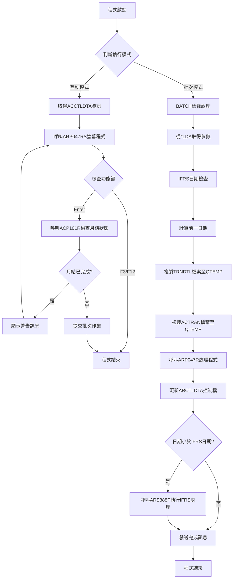
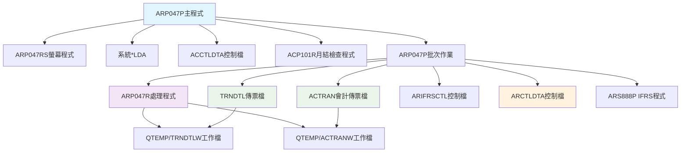
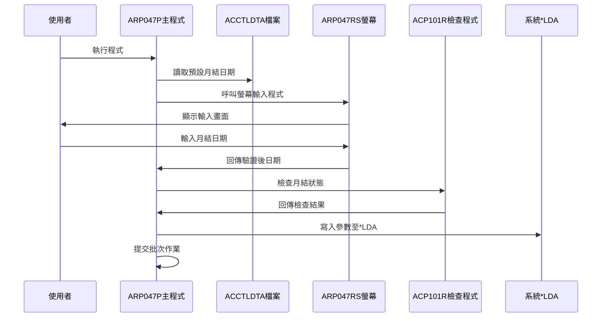
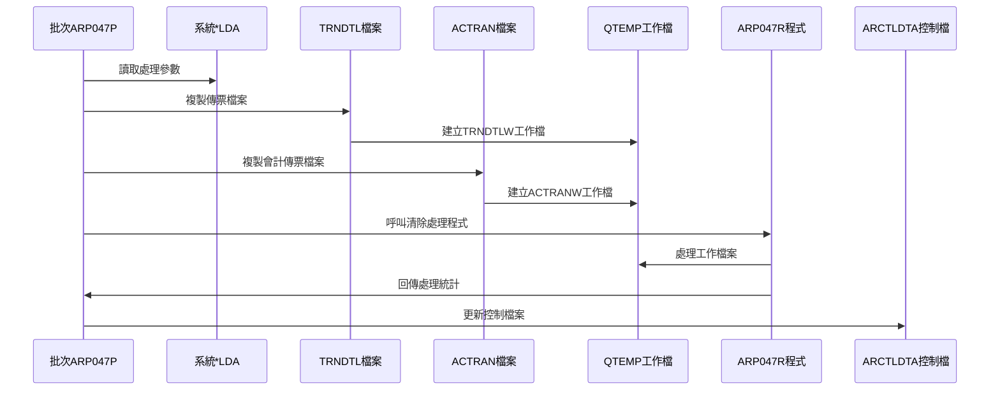
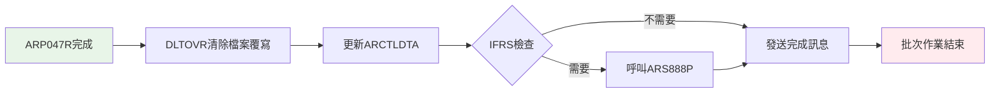
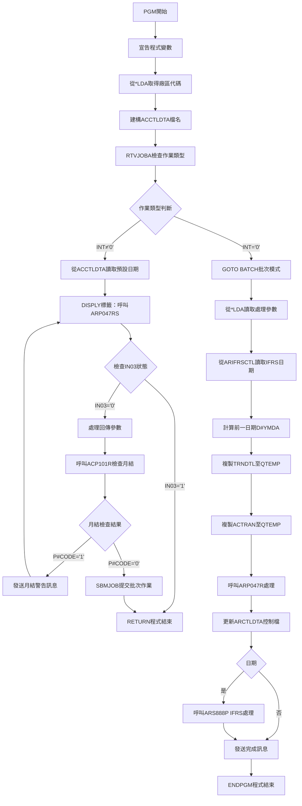

# ARP047P_K02 程式規格書

## 1. 基本資料

| 項目 | 內容 |
|------|------|
| **程式編號** | ARP047P |
| **程式名稱** | 傳票中間檔清除作業 |
| **程式類型** | CLP |
| **廠區** | K02 |
| **系統名稱** | 應收帳款系統 |
| **子系統** | 月結處理 |
| **檔案位置** | K02CLSRC_THSRC/ARP047P.txt |

## 2. 🎯 程式功能說明

### 主要功能描述
ARP047P為應收帳款系統的月結處理控制程式，負責清除傳票中間檔和會計傳票暫存檔。程式採用雙模式設計：互動模式負責接收月結日期參數並進行相關驗證，批次模式負責執行實際的檔案清除作業，並支援IFRS相關的日期控制機制。

### 🎯 業務流程詳細說明

#### 完整業務流程圖


#### 業務流程關鍵階段說明

**階段一：互動模式初始化**
- 程式啟動時檢查作業類型決定執行模式
- 從*LDA取得廠區代碼並建構ACCTLDTA檔案名稱
- 從ACCTLDTA檔案讀取預設月結日期
- 呼叫ARP047RS螢幕程式接收使用者輸入

**階段二：輸入驗證與月結檢查**
- ARP047RS進行日期格式驗證和業務邏輯檢查
- 檢查輸入日期不可大於系統日期和控制日期
- 呼叫ACP101R檢查指定月份是否已完成月結
- 月結已完成時顯示警告訊息並返回輸入畫面

**階段三：批次作業提交**
- 將驗證通過的日期參數寫入*LDA
- 提交ARP047P批次作業至ARJOBD作業佇列
- 程式返回並結束互動模式處理

**階段四：批次檔案處理**
- 從*LDA讀取月結日期參數和廠區代碼
- 執行IFRS日期檢查和前一日期計算
- 複製TRNDTL和ACTRAN檔案至QTEMP進行篩選
- 設定檔案覆寫並建立工作檔案

**階段五：傳票清除作業**
- 呼叫ARP047R執行實際的傳票清除處理
- 統計清除的傳票數量和刪除的傳票數量
- 更新ARCTLDTA控制檔案的處理日期
- 根據IFRS設定決定是否執行額外處理

**階段六：IFRS相關處理**
- 檢查處理日期是否小於IFRS基準日期
- 符合條件時呼叫ARS888P執行IFRS相關處理
- 傳遞廠區、年月、傳票範圍等參數
- 發送處理完成訊息並結束程式

#### 多層次驗證機制
- **輸入層驗證**：日期格式檢查和必填欄位驗證
- **業務層驗證**：月結狀態檢查和日期邏輯驗證
- **系統層驗證**：IFRS日期控制和檔案存在性檢查
- **權限層驗證**：使用者權限和廠區權限檢查

#### 智能處理邏輯
- **智能日期計算**：自動計算前一日期支援跨月跨年
- **條件篩選邏輯**：根據廠區、日期、傳票類型進行精確篩選
- **錯誤恢復機制**：月結檢查失敗後返回輸入畫面繼續處理

#### 資料一致性確保機制
- **檔案備份保護**：使用QTEMP確保原始檔案不受影響
- **交易完整性**：確保傳票清除過程的原子性操作
- **控制檔案更新**：及時更新ARCTLDTA確保狀態一致性

## 3. 🎯 檔案架構與關聯圖

### 使用檔案清單

| 檔案名稱 | 檔案類型 | 使用方式 | 說明 |
|----------|---------|---------|------|
| ARP047RS | 呼叫程式 | 輸入處理 | 螢幕輸入處理程式 |
| ARP047R | 呼叫程式 | 更新處理 | 傳票清除處理程式 |
| TRNDTL | PF | 複製查詢 | 傳票明細檔 |
| ACTRAN | PF | 複製查詢 | 會計傳票檔 |
| ACCTLDTA | 資料區 | 讀取 | 會計控制資料區 |
| ARIFRSCTL | 資料區 | 讀取 | IFRS控制資料區 |
| ARCTLDTA | 資料區 | 更新 | 應收控制資料區 |

### 🎯 檔案關聯詳細視覺化圖表



### 🎯 資料流向詳細說明

#### 環境準備階段的資料流向


#### 業務處理階段的資料流向


#### 環境清理階段的資料流向


## 4. 🎯 檔案欄位規格說明

### 主要資料結構

#### *LDA資料區配置

| 位置 | 長度 | 欄位名稱 | 用途說明 |
|------|------|---------|---------|
| 1-8 | 8 | 月結起始日期 | 月結處理起始日期 |
| 9-16 | 8 | 月結結束日期 | 月結處理結束日期 |
| 201-206 | 6 | IFRS傳票起始號 | IFRS處理傳票範圍起始 |
| 211-216 | 6 | IFRS傳票結束號 | IFRS處理傳票範圍結束 |
| 1021 | 1 | 廠區代碼 | 處理廠區識別碼 |

#### ACCTLDTA檔案結構

| 位置 | 長度 | 欄位名稱 | 用途說明 |
|------|------|---------|---------|
| 9-16 | 8 | 預設月結日期 | 螢幕顯示的預設日期 |

### 🔍 重點欄位切割技術詳解

#### 日期計算變數結構分析
```
&DATEX (8字元)：[YYYYMMDD]
                 ↓
用途：月結處理日期

&DATEE (8字元)：[YYYYMMDD]
                 ↓  
用途：月結結束日期（DATEX + ENDD）

&D#YMDA前一日期計算：
&DATEX：[2020][12][07] → 分割為年月日
         ↓     ↓    ↓
&YY(4)： [2020]
&MM(2)：        [12]  
&DD(2)：             [07]

前一日期計算邏輯：
IF &DD = 01 THEN
   &DD = 31
   IF &MM = 01 THEN
      &MM = 12
      &YY = &YY - 1
   ELSE  
      &MM = &MM - 1
ELSE
   &DD = &DD - 1

最終組合：&D#YMDA = &YYA || &MMA || &DDA
```

#### 檔案過濾條件切割
```
TRNDTL檔案篩選條件：
[廠區條件|傳票範圍|交易代碼|處理狀態|日期範圍]
[INCCHAR |  TXVUNO |  TXCODE |  TXFLAG | TXACDT ]
    ↓        ↓        ↓        ↓        ↓
&AREA   '≠空白'   'AR05'   '≠D'    DATEX-DATEE

ACTRAN檔案篩選條件：
[傳票範圍|傳票類型|廠區|年月|日期範圍]
[ACVRNO  |傳票代碼|AREA|YM  |ACYMD  ]
   ↓        ↓      ↓   ↓     ↓
'D00000' 'D99999' &AREA &YM DATEX-DATEE
'D99999'
```

#### 實際數據範例說明
```
處理參數範例：
&DATEX = '20201207' （民國109年12月7日）
&DATEE = '20201231' （民國109年12月31日）
&AREA = 'K' （K02廠區）
&YM = '202012' （年月）

計算&D#YMDA前一日期：
輸入：2020/12/07
計算：DD=07-1=06
結果：&D#YMDA = '20201206'

IFRS參數範例：
&D#VNO1 = 'D00001' （傳票起始號）
&D#VNO2 = 'D99999' （傳票結束號）
```

### 重要變數定義表

| 變數名稱 | 型態 | 長度 | 用途說明 |
|----------|------|------|---------|
| &P#YYMM | *CHAR | 6 | ACP101R月結檢查用年月 |
| &P#CODE | *CHAR | 1 | ACP101R回傳的月結狀態 |
| &INT | *CHAR | 1 | 作業類型（'0'=批次） |
| &WHOAMI | *CHAR | 10 | 執行程式的使用者ID |
| &DATEX/&DATEE | *CHAR | 8 | 月結處理日期範圍 |
| &AREA | *CHAR | 1 | 廠區代碼 |
| &DTARA | *CHAR | 11 | 動態建構的ACCTLDTA檔名 |
| &YM | *CHAR | 6 | 處理年月（YYYYMM） |
| &CNTT/&CNTA | *CHAR | 6 | ARP047R回傳的處理統計 |
| &IFRSD | *CHAR | 8 | IFRS控制日期 |
| &D#YMDA | *CHAR | 8 | 計算的前一日期 |

## 5. 🎯 輸出/入螢幕布局

### 螢幕布局完整視覺化

```
+----------------------------------------------------------+
|1986/05/08        東明鋼鐵股份有限公司            ARP047RS|
|09:11:56        應收賬外處理－傳票中間檔清除作業         |
|                                                          |
|                                                          |
|                                                          |
|                                                          |
|      注意事項:請慎重\除只要確認一次即為永久性刪除處理。  |
|                                                          |
|      ------------------------------------------------------|
|      清除日期：[____/__/__] 至同月最後一日[__]           |
|                                        (請輸入日期最後兩位)|
|      異動代號：[____________________________________]    |
|      ------------------------------------------------------|
|                                                          |
|                                                          |
|                                                          |
|                                                          |
|                                                          |
|                                                          |
|                                                          |
|                                                          |
|                                                          |
|                                                          |
|            F3:結束程式        F12:結束程式        ENTER:執行|
|[錯誤訊息顯示區域]                                        |
+----------------------------------------------------------+
```

### 🎯 畫面欄位詳細說明

| 欄位名稱 | 位置 | 長度 | 型態 | 輸入格式 | 驗證規則 | 說明 |
|----------|------|------|------|---------|---------|------|
| S#DATE | 10,28 | 8 | 數值 | YYYY/MM/DD | 日期格式、不可大於系統日期 | 月結處理日期 |
| S#ENDD | 10,54 | 2 | 數值 | DD | 1-31、預設31 | 月結結束日 |
| S#CGCA | 12,28 | 40 | 字元 | 中文字串 | 必填、異動原因 | 異動代號說明 |
| S#COMP | 1,23 | 35 | 字元 | 唯讀 | 無 | 公司名稱 |
| S#DEVI | 2,70 | 10 | 字元 | 唯讀 | 無 | 裝置名稱 |
| S#MSG1 | 24,2 | 70 | 字元 | 唯讀 | 無 | 錯誤訊息顯示 |

### 🎯 畫面控制邏輯

#### 指示器控制說明
- **IN03**：F3功能鍵按下指示器
- **IN12**：F12功能鍵按下指示器  
- **DSPATR(PR)**：保護顯示屬性
- **DSPATR(HI)**：高亮度顯示（錯誤訊息）

#### 欄位顯示屬性
- **EDTCDE(Y)**：日期編輯碼（年/月/日格式）
- **EDTCDE(4)**：數值編輯碼
- **EDTWRD('  :  :  ')**：時間編輯字元（時:分:秒）

### 功能鍵詳細定義

| 功能鍵 | 處理邏輯 | 系統行為 |
|--------|---------|---------|
| **F3** | 結束程式 | 設定P#IN03='1'，結束ARP047RS並返回主程式 |
| **F12** | 結束程式 | 設定P#IN03='1'，結束ARP047RS並返回主程式 |
| **Enter** | 執行處理 | 執行輸入驗證並回傳處理參數 |

### 操作流程
1. 輸入月結處理日期
2. 輸入月結結束日（預設31）
3. 輸入異動代號說明
4. 按Enter執行驗證和處理

## 6. 🎯 處理流程程序說明

### 🎯 主程序邏輯深度分析

#### 程式執行流程圖


#### 🎯 詳細處理步驟逐一分析

**步驟1：程式初始化與環境設定**
- 宣告所有必要的程式變數和工作變數
- 從*LDA(1021,1)讀取廠區代碼設定處理範圍
- 動態建構ACCTLDTA檔案名稱：'ACCTLDTA' + 廠區代碼
- 使用RTVJOBA判斷互動或批次執行模式

**步驟2：互動模式參數收集**
- 從ACCTLDTA檔案第9-16位讀取預設月結日期
- 呼叫ARP047RS螢幕程式進行互動輸入處理
- 接收月結日期、結束日期、異動代號等參數
- 檢查功能鍵狀態決定是否繼續處理

**步驟3：月結狀態驗證**
- 從輸入日期前6位組成年月參數
- 呼叫ACP101R檢查指定年月的月結完成狀態
- 月結已完成時顯示警告訊息並返回輸入畫面
- 月結未完成時繼續後續處理流程

**步驟4：批次作業提交與參數傳遞**
- 將驗證通過的處理參數寫入*LDA對應位置
- 使用SBMJOB提交ARP047P批次作業至ARJOBD
- 設定RQSDTA指定批次執行的CALL命令
- 互動模式結束並返回呼叫程式

**步驟5：批次模式初始化處理**
- 從*LDA讀取月結日期範圍和廠區代碼
- 從ARIFRSCTL讀取IFRS控制基準日期
- 執行複雜的前一日期計算邏輯
- 建立工作年月變數供後續檔案篩選使用

**步驟6：檔案複製與篩選處理**
- 設定TRNDTL檔案覆寫並複製至QTEMP/TRNDTLW
- 設定複雜的INCREL篩選條件進行資料過濾
- 設定ACTRAN檔案覆寫並複製至QTEMP/ACTRANW
- 建立檔案覆寫確保ARP047R使用正確的工作檔

**步驟7：傳票清除作業執行**
- 呼叫ARP047R執行實際的傳票清除處理
- 接收處理統計：清除傳票數量和刪除記錄數量
- 清除所有檔案覆寫恢復原始檔案狀態
- 更新ARCTLDTA控制檔案記錄處理完成狀態

**步驟8：IFRS相關後處理**
- 檢查處理日期是否小於IFRS基準日期
- 符合條件時呼叫ARS888P執行IFRS特殊處理
- 傳遞廠區、年月、傳票範圍等必要參數
- 發送處理完成訊息並正常結束程式

#### 業務邏輯深度解析

**前一日期計算邏輯**：
- 支援跨日、跨月、跨年的複雜日期計算
- 月初日期(01)需要退回到上月最後一日(31)
- 年初月份(01)需要退回到上年十二月
- 使用字元和數值變數的組合處理

**檔案篩選條件邏輯**：
- TRNDTL篩選：廠區+傳票類型+處理狀態+日期範圍
- ACTRAN篩選：傳票代碼範圍+廠區+年月+日期範圍
- 使用INCCHAR和INCREL進行高效率的資料篩選

**月結控制機制**：
- 透過ACP101R檢查月結完成狀態
- 防止重複執行已完成月結的清除作業
- 提供使用者明確的狀態回饋訊息

#### 條件判斷詳細說明

**作業類型判斷**：
```
IF COND(&INT *EQ '0') THEN(GOTO BATCH)
```
- 條件：INT='0'表示批次作業環境
- 動作：直接跳轉至BATCH標籤執行批次邏輯

**ARP047RS回傳狀態檢查**：
```
IF COND(&IN03 *EQ '0') THEN(DO)
```
- 條件：IN03='0'表示正常完成輸入
- 動作：繼續處理流程並進行月結檢查

**月結狀態檢查**：
```
IF COND(&P#CODE *EQ '1') THEN(DO)
```
- 條件：P#CODE='1'表示月結已完成
- 動作：顯示警告訊息並返回輸入畫面

**IFRS處理條件檢查**：
```
IF COND(&DATEX *LT &IFRSD) THEN(DO)
```
- 條件：處理日期小於IFRS基準日期
- 動作：執行ARS888P IFRS相關處理

#### 變數使用和數據流向

**關鍵變數流向追蹤**：
1. 廠區設定：*LDA(1021) → &AREA → &DTARA檔名
2. 日期流向：ACCTLDTA → ARP047RS → *LDA → 批次處理
3. 月結檢查：&DATEX前6位 → &P#YYMM → ACP101R
4. 統計回傳：ARP047R → &CNTT/&CNTA → 訊息顯示

**檔案名稱動態組合**：
1. ACCTLDTA檔名：'ACCTLDTA' + &AREA
2. ACTRAN檔名：'AC' + &AREA + 'R'
3. 工作檔名：QTEMP/TRNDTLW、QTEMP/ACTRANW

## 7. 🎯 數據操作與轉換分析

### 檔案操作詳解

#### TRNDTL傳票檔案操作
- **操作類型**：CPYF複製篩選
- **篩選條件**：
  - INCCHAR：廠區代碼匹配（第6位=&AREA）
  - INCREL：傳票編號非空白
  - INCREL：交易代碼='AR05'
  - INCREL：處理旗標≠'D'（未刪除）
  - INCREL：入帳日期範圍（DATEX≤TXACDT≤DATEE）
- **目標檔案**：QTEMP/TRNDTLW
- **建立選項**：CRTFILE(*YES)、MBROPT(*ADD)

#### ACTRAN會計傳票檔案操作
- **操作類型**：CPYF複製篩選
- **篩選條件**：
  - INCREL：傳票代碼範圍（'D00000'≤ACVRNO≤'D99999'）
  - INCREL：廠區匹配（ACAREA=&AREA）
  - INCREL：年月匹配（ACYM=&YM）
  - INCREL：日期範圍（DATEX≤ACYMD≤DATEE）
- **目標檔案**：QTEMP/ACTRANW
- **建立選項**：CRTFILE(*YES)、MBROPT(*ADD)

#### 檔案覆寫和併發處理
- **OVRDBF設定**：確保ARP047R使用正確的工作檔案
- **LVLCHK(*NO)**：跳過層級檢查提高處理效率
- **QTEMP使用**：避免影響原始檔案資料
- **DLTOVR清理**：處理完成後清除所有覆寫

### 數據轉換邏輯

#### 日期格式處理與計算
- **輸入格式**：YYYYMMDD（8位數字）
- **日期分割**：%SST函數分割年月日部分
- **數值轉換**：字元型日期轉換為數值進行計算
- **前一日計算**：支援跨日跨月跨年的複雜邏輯

#### 前一日期計算邏輯詳解
```
原始日期：&DATEX = '20201207'
分割處理：
&YY = %SST(&DATEX 1 4) = '2020' → 數值2020
&MM = %SST(&DATEX 5 2) = '12'   → 數值12  
&DD = %SST(&DATEX 7 2) = '07'   → 數值7

計算邏輯：
IF &DD = 01 THEN
   &DD = 31（退回上月最後一日）
   IF &MM = 01 THEN
      &MM = 12（退回上年十二月）
      &YY = &YY - 1（年份減一）
   ELSE
      &MM = &MM - 1（月份減一）
ELSE
   &DD = &DD - 1（日期減一）

結果組合：
&YYA = '2020'、&MMA = '12'、&DDA = '06'
&D#YMDA = &YYA || &MMA || &DDA = '20201206'
```

#### 檔案路徑動態組合
- **ACCTLDTA路徑**：'ACCTLDTA' + &AREA → 'ACCTLDTAK'
- **ACTRAN路徑**：'AC' + &AREA + 'R' → 'ACKR'
- **參數傳遞格式**：確保變數長度和格式一致性

### 計算邏輯分析

#### 月結年月參數計算
- **來源**：&DATEX前6位
- **公式**：&YM = %SST(&DATEX 1 6)
- **範例**：'20201207' → '202012'
- **用途**：ACTRAN檔案年月欄位篩選

#### 統計數量計算
- **清除傳票數**：&CNTT（ARP047R回傳）
- **刪除記錄數**：&CNTA（ARP047R回傳）
- **訊息組合**：統計數字串接至完成訊息

### 檢核機制詳解

#### 檔案存在性檢查
- **ACCTLDTA檔案**：動態檔名的存在性確認
- **ARIFRSCTL檔案**：IFRS控制檔案存在性
- **來源檔案**：TRNDTL和ACTRAN的可存取性

#### 日期有效性檢查
- **格式檢查**：透過ARP047RS進行日期格式驗證
- **邏輯檢查**：起始日期不可大於系統日期
- **範圍檢查**：確保日期在合理的業務範圍內

#### 月結狀態檢查
- **ACP101R檢查**：防止重複執行月結處理
- **狀態回饋**：提供明確的月結完成訊息
- **流程控制**：檢查失敗時返回輸入畫面

## 8. 🎯 錯誤處理程序說明

### 🎯 詳細錯誤代碼清冊

| 錯誤代碼 | 錯誤訊息 | 原因說明 | 處理方式 | 預防措施 |
|----------|---------|---------|---------|----------|
| **USER001** | 日期輸入錯誤 | ARP047RS日期格式驗證失敗 | 1. 顯示錯誤訊息於S#MSG1<br>2. 返回輸入畫面<br>3. 游標定位到日期欄位 | 使用日期編輯碼限制輸入格式 |
| **USER002** | 日期大於系統日期 | 輸入日期超過當前系統日期 | 1. 顯示錯誤訊息<br>2. 返回輸入畫面<br>3. 重新輸入日期 | 系統日期比對檢查 |
| **USER003** | 日期大於控制日期 | 輸入日期大於ARCTLDTA控制日期 | 1. 顯示錯誤訊息<br>2. 返回輸入畫面<br>3. 確認控制日期設定 | 定期更新控制檔案日期 |
| **USER004** | 異動代號空白 | 未輸入異動原因說明 | 1. 顯示錯誤訊息<br>2. 返回輸入畫面<br>3. 強制輸入異動代號 | 設定必填欄位驗證 |
| **SYS001** | 月結已完成無法執行 | ACP101R檢查顯示月結已完成 | 1. 發送中斷訊息警告<br>2. 返回DISPLY標籤<br>3. 重新輸入處理日期 | 執行前確認月結狀態 |
| **FILE001** | ACCTLDTA檔案讀取失敗 | 控制檔案不存在或無讀取權限 | 1. 檢查檔案存在性<br>2. 確認檔案權限<br>3. 重新建立控制檔案 | 定期檢查控制檔案狀態 |
| **FILE002** | TRNDTL檔案複製失敗 | 傳票檔案複製至QTEMP失敗 | 1. 檢查來源檔案狀態<br>2. 確認QTEMP空間<br>3. 重新執行複製作業 | 監控檔案系統空間 |
| **FILE003** | ACTRAN檔案複製失敗 | 會計傳票檔案複製失敗 | 1. 檢查來源檔案狀態<br>2. 確認檔案路徑正確<br>3. 重新執行複製作業 | 確認檔案命名規則 |
| **SYS002** | ARP047R執行失敗 | 清除處理程式執行異常 | 1. 檢查ARP047R程式狀態<br>2. 確認工作檔案完整性<br>3. 重新執行處理程式 | 定期維護處理程式 |
| **SYS003** | ARCTLDTA更新失敗 | 控制檔案更新作業失敗 | 1. 檢查檔案鎖定狀態<br>2. 確認更新權限<br>3. 重新執行更新作業 | 避免並發更新操作 |

### 🎯 系統異常處理邏輯

#### 檔案操作失敗處理
- **CPYF失敗處理**：檢查來源檔案狀態和QTEMP可用空間
- **OVRDBF失敗處理**：確認檔案路徑正確性和存取權限
- **RTVDTAARA失敗**：檢查資料區存在性和格式正確性

#### 程式調用失敗處理
- **ARP047RS調用失敗**：確認螢幕程式存在和參數正確性
- **ACP101R調用失敗**：檢查月結檢查程式的完整性
- **ARP047R調用失敗**：確認清除程式狀態和檔案準備
- **ARS888P調用失敗**：檢查IFRS程式存在性和參數傳遞

#### 資料完整性錯誤處理
- **日期計算錯誤**：驗證日期計算邏輯和變數轉換
- **參數傳遞錯誤**：確認*LDA參數寫入和讀取的一致性
- **檔案篩選錯誤**：檢查INCREL條件語法和欄位對應

#### 並發控制失敗處理
- **檔案鎖定衝突**：使用適當的檔案共享模式
- **資料區競用**：避免同時更新相同的控制檔案
- **作業佇列滿載**：監控ARJOBD佇列狀態

## 9. 🎯 備註

### 🎯 特殊注意事項

#### 月結處理安全性
本程式執行傳票中間檔的永久性刪除作業，執行前需要確認月結狀態和異動原因。程式透過ACP101R檢查機制防止重複執行已完成的月結處理。

#### IFRS相關處理機制
程式支援IFRS（國際財務報告準則）相關的日期控制和特殊處理。當處理日期早於IFRS基準日期時，會自動呼叫ARS888P執行額外的IFRS處理程序。

#### 檔案複製與篩選策略
採用QTEMP工作檔案策略確保原始檔案安全，透過複雜的INCREL篩選條件確保只處理符合條件的傳票記錄，避免誤刪重要資料。

#### 廠區動態處理機制
程式支援多廠區環境，透過*LDA廠區代碼動態組合檔案名稱，確保各廠區資料的獨立處理和安全隔離。

#### 前一日期計算邏輯
程式實現複雜的前一日期計算，支援跨日、跨月、跨年的日期退回邏輯，確保ARCTLDTA控制檔案記錄正確的處理基準日期。

#### 處理統計與記錄機制
程式透過ARP047R回傳詳細的處理統計，包括清除傳票數量和刪除記錄數量，並透過訊息機制通知使用者處理結果。

#### 月結日期範圍設定
支援靈活的月結日期範圍設定，使用者可以指定起始日期和結束日期，系統自動組合完整的處理範圍進行檔案篩選。