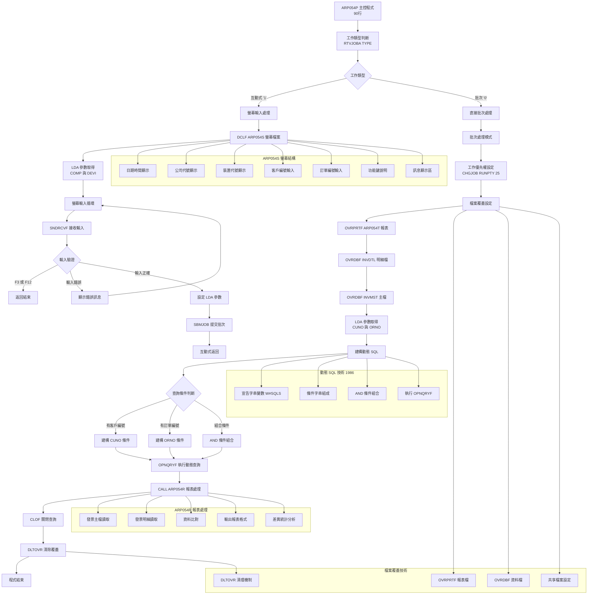
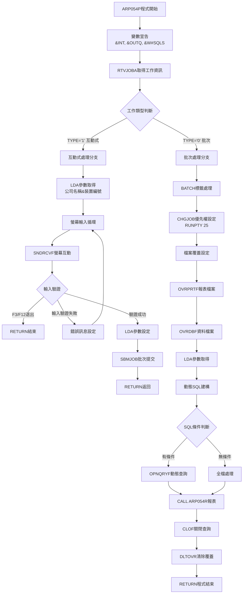

# ARP054P_P02 程式規格書

## 1. 基本資料

| 項目 | 內容 |
|------|------|
| 程式編號 | ARP054P |
| 程式名稱 | 發票主檔與明細檔比對查詢系統 |
| 程式類型 | CLP (Control Language Program) |
| 廠區 | P02 |
| 系統名稱 | 應收帳款管理系統 (AR) |
| 子系統 | 發票資料比對管理子系統 |
| 檔案位置 | P02CLSRC_THSRC/ARP054P.txt |


## 2. 程式功能說明

### 2.1 主要功能描述
ARP054P 為發票主檔與明細檔比對查詢系統。程式提供互動式查詢介面，讓使用者輸入客戶編號和訂單編號，動態建構SQL查詢條件，查詢發票主檔資料並與明細檔進行比對，產生資料一致性分析報表。

### 2.2 核心業務功能

#### 2.2.1 主要功能
1. **互動式查詢介面**
   - 螢幕輸入介面(ARP054S)
   - 支援客戶編號(CUNO)和訂單編號(ORNO)查詢
   - 查詢條件組合

2. **動態SQL查詢技術**
   - 動態建構OPNQRYF查詢條件
   - 根據輸入參數組合SQL語句
   - 資料檢索機制

3. **發票資料比對分析**
   - 發票主檔(INVMST)與明細檔(INVDTL)比對
   - 金額欄位一致性檢查
   - 差異分析報告

4. **報表輸出**
   - 報表格式設計(ARP054T)
   - 比對結果呈現
   - 支援列印和螢幕顯示

#### 2.2.2 發票比對業務邏輯
1. **發票主檔分析**
   - 讀取INVMST發票主檔記錄
   - 按訂單編號排序處理
   - 提取各類金額資料

2. **明細檔對應檢查**
   - 對應INVDTL明細檔記錄
   - 核對金額資料一致性
   - 識別資料不符項目

3. **多維度金額比對**
   - 出貨金額比對
   - 稅額比對  
   - 折讓金額比對
   - 退貨金額比對
   - 其他費用比對


### 2.3 核心系統架構

#### 2.3.1 四元件系統架構
```
ARP054P系統架構:

ARP054P (CLP主控程式)
    ├── ARP054S (DDS螢幕檔案) - 互動式輸入
    ├── ARP054R (RPG報表程式) - 資料處理
    └── ARP054T (DDS報表檔案) - 報表格式

資料檔案:
    ├── INVMST (發票主檔) - 主要資料來源
    └── INVDTL (發票明細檔) - 比對資料來源
```

#### 2.3.2 程式間協作流程
```
使用者操作流程:
1. 執行ARP054P
2. 輸入查詢條件(客戶/訂單編號)  
3. 系統動態建構SQL查詢
4. 執行OPNQRYF查詢發票主檔
5. 呼叫ARP054R進行比對處理
6. 產生ARP054T格式報表
7. 顯示比對結果
```


## 3. 檔案架構與關聯圖



## 4. 螢幕規格說明

### 4.1 螢幕布局設計 (ARP054S)

#### 4.1.1 主畫面布局 (AR054F1)
```
+----------------------------------------------------------------+
|86/12/31    東鋼股份有限公司                        ARP054S    |
|09:30:15   發票主檔與明細檔比對系統查詢            TERMINAL01  |
|                                                                |
|                                                                |
|                                                                |
|     請輸入客戶編號或訂單編號來印出比對報表。                   |
|                                                                |
|   --------------------------------------------------          |
|                  客戶編號: ______                             |
|                                                                |
|                  訂單編號: _____                              |
|   --------------------------------------------------          |
|                                                                |
|                                                                |
|                                                                |
|                                                                |
|                                                                |
|                                                                |
|                                                                |
|                                                                |
|                                                                |
|                                                                |
|         F3:結束程式    F12:回到主選單    ENTER:執行           |
|錯誤訊息顯示區域                                                |
+----------------------------------------------------------------+
```

### 4.2 螢幕欄位規格

#### 4.2.1 顯示欄位規格
| 欄位名稱 | 欄位代號 | 位置 | 長度 | 型態 | 屬性 | 說明 |
|----------|----------|------|------|------|------|------|
| 日期 | DATE | 1,2 | 8 | 日期 | 顯示 | 系統日期(YY/MM/DD) |
| 時間 | TIME | 2,2 | 8 | 時間 | 顯示 | 系統時間(HH:MM:SS) |
| 公司名稱 | S#COMP | 1,23 | 35 | 文字 | 顯示 | 從LDA取得公司名稱 |
| 程式編號 | - | 1,70 | 7 | 文字 | 常數 | "ARP054S" |
| 標題 | - | 2,25 | 22 | 文字 | 常數 | "發票主檔與明細檔比對系統查詢" |
| 裝置代號 | S#DEVI | 2,70 | 10 | 文字 | 顯示 | 從LDA取得裝置編號 |

#### 4.2.2 輸入欄位規格
| 欄位名稱 | 欄位代號 | 位置 | 長度 | 型態 | 屬性 | 說明 |
|----------|----------|------|------|------|------|------|
| 客戶編號 | S#CUNO | 10,43 | 6 | 文字 | 輸入 | 客戶代號，可空白 |
| 訂單編號 | S#ORNO | 12,43 | 5 | 文字 | 輸入 | 訂單代號，可空白 |
| 訊息顯示 | S#MSG1 | 24,2 | 70 | 文字 | 顯示 | 錯誤或狀態訊息 |

### 4.3 功能鍵說明

| 功能鍵 | 功能說明 | 處理方式 |
|--------|----------|----------|
| F3 | 結束程式 | 設定&IN03='1'，程式RETURN |
| F12 | 回到主選單 | 設定&IN12='1'，程式RETURN |
| ENTER | 執行查詢 | 驗證輸入，提交批次作業 |

### 4.4 輸入欄位驗證

#### 4.4.1 必要欄位檢查
- **客戶編號與訂單編號**: 至少必須輸入一個
- **錯誤處理**: 兩個都空白時顯示"請至少輸入一個查詢條件"

#### 4.4.2 輸入格式驗證  
- **客戶編號**: 6位英數字，可包含空白
- **訂單編號**: 5位英數字，可包含空白
- **特殊處理**: 空白視為未輸入該條件

## 5. 報表規格說明

### 5.1 報表結構 (ARP054T)

#### 5.1.1 報表標題區
```
 PRT-ID  : ARP054T              東鋼股份有限公司                列印日期:86/12/31
 USR-ID  :S02CLJ               發票主檔與明細檔比對系統報表      列印時間:09:30:15
客戶編號:ALL001     訂單編號:ALL001                            頁次    :001
```

#### 5.1.2 報表欄位標題
```
訂單     發票號碼    出貨金額    稅額     折讓金額     退貨金額     特殊金額     其他金額
-----   ----------  ----------  --------  ----------  ----------  ----------  ----------
```

### 5.2 報表欄位規格

#### 5.2.1 標題欄位規格
| 欄位名稱 | 欄位代號 | 位置 | 長度 | 型態 | 格式 | 說明 |
|----------|----------|------|------|------|------|------|
| 報表編號 | - | 1,13 | 7 | 文字 | 常數 | "ARP054T" |
| 公司名稱 | - | 1,45 | 20 | 文字 | 常數 | "東鋼股份有限公司" |
| 列印日期 | DATE | 1,105 | 8 | 日期 | YY/MM/DD | 系統日期 |
| 使用者編號 | U#USID | 2,11 | 10 | 文字 | 顯示 | 執行使用者 |
| 報表標題 | - | 2,32 | 22 | 文字 | 常數 | "發票主檔與明細檔比對系統報表" |
| 列印時間 | TIME | 2,105 | 8 | 時間 | HH:MM:SS | 系統時間 |
| 客戶編號 | R#INCU | 3,9 | 6 | 文字 | 顯示 | 查詢客戶編號 |
| 訂單編號 | R#INOR | 3,22 | 6 | 文字 | 顯示 | 查詢訂單編號 |
| 頁次 | PAGNBR | 3,105 | 3 | 數字 | 編輯 | 報表頁次 |

#### 5.2.2 明細欄位規格
| 欄位名稱 | 欄位代號 | 位置 | 長度 | 型態 | 格式 | 說明 |
|----------|----------|------|------|------|------|------|
| 訂單編號 | R#ORNO | 明細,3 | 6 | 文字 | 顯示 | 訂單編號 |
| 發票號碼 | R#INNO | 明細,+1 | 10 | 文字 | 顯示 | 發票號碼 |
| 金額1 | R#AMT1 | 明細,+2 | 11 | 數字 | 金額格式 | 出貨金額 |
| 金額2 | R#AMT2 | 明細,+2 | 11 | 數字 | 金額格式 | 稅額 |
| 金額3 | R#AMT3 | 明細,+2 | 11 | 數字 | 金額格式 | 折讓金額 |
| 金額4 | R#AMT4 | 明細,+2 | 11 | 數字 | 金額格式 | 退貨金額 |
| 金額5 | R#AMT5 | 明細,+2 | 11 | 數字 | 金額格式 | 特殊金額 |
| 金額6 | R#AMT6 | 明細,+2 | 11 | 數字 | 金額格式 | 其他金額 |

### 5.3 報表產生邏輯

#### 5.3.1 資料來源處理
- **主要來源**: INVMST(發票主檔) 按INORNO排序
- **對照來源**: INVDTL(發票明細檔) 
- **比對邏輯**: 按發票號碼比對兩檔金額資料

#### 5.3.2 特殊顯示處理
- **差異標記**: 不符項目以"異常"標記
- **空值處理**: 未查詢欄位顯示"全部"
- **統計資訊**: 報表結尾顯示總筆數

## 6. 檔案欄位規格說明

### 6.1 主要變數結構分析

#### 6.1.1 CLP變數定義
```
CLP變數宣告:
DCL VAR(&INT) TYPE(*CHAR) LEN(1)     - 工作類型變數
DCL VAR(&OUTQ) TYPE(*CHAR) LEN(10)   - 輸出佇列變數
DCL VAR(&W#SQLS) TYPE(*CHAR) LEN(100) - 動態SQL字串變數
DCLF FILE(ARP054S)                    - 螢幕檔案宣告

變數用途分析:
&INT: 工作類型判斷 ('1'=互動式, '0'=批次)
&OUTQ: 輸出佇列名稱，用於批次工作提交
&W#SQLS: 動態SQL條件字串建構
ARP054S: 螢幕檔案，包含所有輸入輸出欄位

變數設計:
- 變數命名規範
- 功能導向的變數設計
- 動態SQL技術應用
```

#### 6.1.2 LDA資料區結構
```
LDA資料區配置:
位置951-985: S#COMP (35字元) - 公司名稱
位置1011-1020: S#DEVI (10字元) - 裝置編號
位置1-6: S#CUNO (6字元) - 客戶編號參數
位置11-16: S#ORNO (5字元) - 訂單編號參數

參數傳遞機制:
1. 螢幕顯示: 從LDA取得公司名稱和裝置編號
2. 參數設定: 將螢幕輸入存入LDA
3. 批次處理: 從LDA取得查詢參數
4. 跨程式傳遞: 透過LDA在CLP和RPG間傳遞參數

設計特性:
- 參數管理機制
- 跨程式通訊
- 資料區配置
```

## 7. 處理流程程序說明

### 7.1 主程式流程 (ARP054P)



## 8. 子程序處理邏輯說明

### 8.1 核心處理模組

#### 8.1.1 動態SQL建構模組
**功能**: 根據輸入條件動態建構OPNQRYF查詢語句
```
SQL建構邏輯:
1. 字串初始化:
   CHGVAR VAR(&W#SQLS) VALUE(' ')

2. 客戶條件建構:
   IF COND(&S#CUNO *NE ' ') THEN(DO)
   CHGVAR VAR(&W#SQLS) VALUE('INCUNO *EQ "' || &S#CUNO || '"')

3. 訂單條件組合:
   IF COND(&S#ORNO *NE ' ') THEN(DO)
     IF COND(&W#SQLS *EQ ' ') THEN(
       CHGVAR VAR(&W#SQLS) VALUE('INORNO *EQ "' || &S#ORNO || '"'))
     ELSE CMD(
       CHGVAR VAR(&W#SQLS) VALUE(&W#SQLS || ' *AND ' || 
                                 'INORNO *EQ "' || &S#ORNO || '"'))

SQL技術實現:
- 動態SQL應用
- 字串連接技術
- 條件邏輯運用
- OPNQRYF應用
```

## 9. 錯誤處理程序說明與訊息清冊

### 9.1 錯誤處理機制清冊

#### 9.1.1 輸入驗證錯誤處理
| 錯誤情況 | 錯誤訊息 | 處理方式 | 恢復機制 |
|----------|----------|----------|----------|
| 兩個查詢條件都空白 | "請至少輸入一個查詢條件" | 訊息顯示 | 返回輸入畫面 |
| 客戶編號格式錯誤 | 系統自動檢查 | 欄位驗證 | 重新輸入 |
| 訂單編號格式錯誤 | 系統自動檢查 | 欄位驗證 | 重新輸入 |

## 10. 特殊技術實現說明

### 10.1 動態SQL技術

#### 10.1.1 動態查詢技術
**功能**: OPNQRYF動態查詢實現

```
動態查詢技術分析:
1. 字串變數技術:
   DCL VAR(&W#SQLS) TYPE(*CHAR) LEN(100)
   - 100字元字串變數宣告
   - 支援動態SQL條件建構

2. 條件字串組合:
   CHGVAR VAR(&W#SQLS) VALUE('INCUNO *EQ "' || &S#CUNO || '"')
   - 字串連接運算子應用
   - 動態條件值嵌入

3. OPNQRYF執行:
   OPNQRYF FILE(INVMST) QRYSLT(&W#SQLS) KEYFLD((INORNO))
   - 動態SQL執行
   - 排序鍵指定

技術實現:
- SQL技術應用
- 動態查詢實踐
- 查詢系統設計
- AS/400平台SQL技術
```

## 11. 使用說明

### 11.1 操作流程說明

#### 11.1.1 標準操作程序
```
操作流程:
1. 程式啟動:
   執行命令: CALL ARP054P
   
2. 輸入查詢條件:
   - 客戶編號: 6位英數字(可選)
   - 訂單編號: 5位英數字(可選)
   - 至少必須輸入其中一個條件

3. 執行查詢:
   - 按下ENTER鍵執行
   - 系統自動提交批次作業
   - 互動式立即返回

4. 查看結果:
   - 查看輸出佇列中的報表
   - 檢查比對結果和差異分析
   - 列印或顯示報表內容

功能鍵操作:
- F3: 結束程式返回
- F12: 回到主選單
- ENTER: 執行查詢處理
```

---

## 備註

### 特殊注意事項

1. **動態SQL查詢技術**：
   - OPNQRYF動態查詢條件建構
   - 字串變數SQL語句組合
   - 查詢條件動態組合邏輯

2. **互動式+批次雙模式設計**：
   - RTVJOBA工作類型判斷
   - 螢幕輸入循環處理
   - SBMJOB批次作業提交

3. **LDA資料區參數傳遞**：
   - 公司名稱和裝置編號顯示
   - 查詢條件跨程式傳遞
   - CLP-RPG程式間資料交換

4. **檔案覆蓋技術應用**：
   - OVRPRTF報表檔案重導向
   - OVRDBF資料檔案覆蓋
   - 程式執行環境設定

5. **發票資料比對系統**：
   - 發票主檔(INVMST)查詢
   - 與明細檔(INVDTL)比對
   - 多維度金額一致性檢查

6. **螢幕輸入驗證機制**：
   - 查詢條件必填檢查
   - 功能鍵處理(F3/F12)
   - 錯誤訊息顯示處理

7. **P02廠區程式特性**：
   - 90行CLP程式設計
   - 四元件系統架構
   - 標準化報表格式 