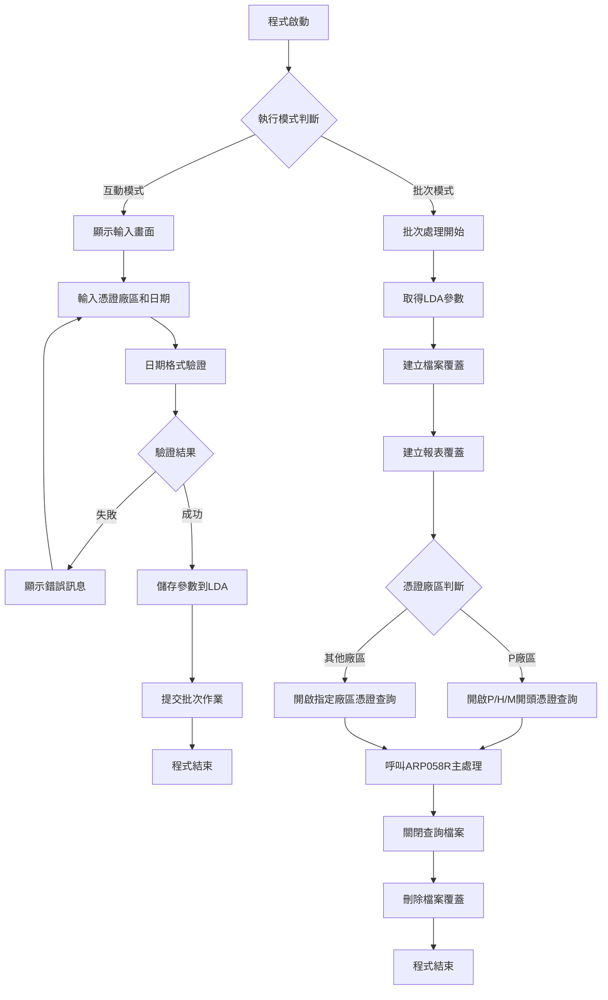
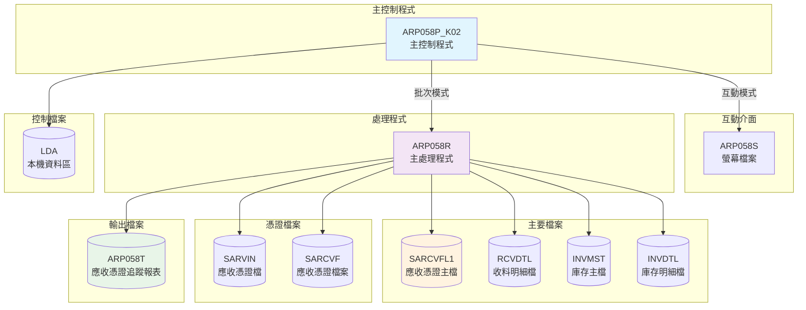
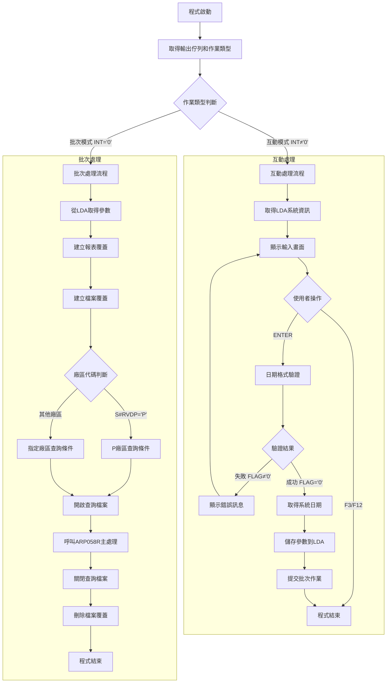

# ARP058P_K02 程式規格書

## 1. 基本資料

| 項目 | 內容 |
|------|------|
| **程式編號** | ARP058P |
| **程式名稱** | 應收憑證過帳憑據處理作業 |
| **程式類型** | CLP |
| **廠區** | K02 |
| **系統名稱** | 應收帳款系統 |
| **子系統** | 應收憑證處理 |
| **檔案位置** | 東鋼list/ARP058P_K02.txt |

## 2. 🎯 程式功能說明

### 主要功能描述
本程式為應收憑證過帳憑據處理作業的主控制程式，負責處理應收憑證的過帳作業，將憑證資料寫入應收憑證檔，並產生相關的應收憑證追蹤報表。

### 🎯 業務流程詳細說明



### 🎯 業務流程關鍵階段說明

#### 互動模式階段
1. **參數輸入階段**：收集憑證廠區代碼和憑證日期
2. **資料驗證階段**：透過UTS102R驗證日期格式和有效性
3. **參數儲存階段**：將驗證通過的參數儲存至LDA資料區
4. **批次提交階段**：提交批次作業至ARJOBD作業佇列

#### 批次處理階段
1. **環境設定階段**：建立各檔案的覆蓋和報表設定
2. **查詢建立階段**：根據廠區代碼建立不同的憑證查詢條件
3. **憑證處理階段**：呼叫ARP058R處理符合條件的憑證記錄
4. **環境清理階段**：關閉查詢檔案並清除檔案覆蓋

### 🎯 多層次驗證機制
1. **日期格式檢查**：透過UTS102R確認日期格式正確性
2. **憑證廠區驗證**：確認輸入的廠區代碼有效性
3. **檔案存取檢查**：確認必要檔案的存在和存取權限
4. **查詢條件驗證**：根據廠區建立正確的查詢篩選條件

### 🎯 智能處理邏輯
1. **廠區別處理邏輯**：P廠區處理P/H/M開頭憑證，其他廠區只處理本廠區憑證
2. **日期範圍控制**：根據輸入日期篩選需要處理的憑證記錄
3. **憑證狀態篩選**：只處理已確認且未過帳的有效憑證
4. **自動報表產生**：處理完成後自動產生應收憑證追蹤報表

### 🎯 資料一致性確保機制
1. **查詢檔案控制**：使用OPNQRYF確保資料篩選的一致性
2. **檔案覆蓋管理**：透過OVRDBF確保檔案存取路徑正確
3. **報表格式控制**：統一的報表格式和輸出設定
4. **處理狀態追蹤**：確保憑證處理狀態的正確更新

## 3. 🎯 檔案架構與關聯圖

### 使用檔案清單

| 檔案名稱 | 用途說明 | 存取方式 | 關聯程式 |
|----------|----------|----------|----------|
| **SARCVFL1** | 應收憑證主檔 | 查詢/讀取 | ARP058R |
| **RCVDTL** | 收料明細檔 | 讀取/更新 | ARP058R |
| **INVMST** | 庫存主檔 | 讀取/更新 | ARP058R |
| **INVDTL** | 庫存明細檔 | 讀取/更新 | ARP058R |
| **SARVIN** | 應收憑證檔 | 讀取/更新 | ARP058R |
| **SARCVF** | 應收憑證檔案 | 讀取/更新 | ARP058R |
| **ARP058T** | 應收憑證追蹤報表 | 寫入 | ARP058R |
| **ARP058S** | 螢幕檔案 | 互動顯示 | 本程式 |

### 🎯 檔案關聯詳細視覺化圖表



## 4. 🎯 檔案欄位規格說明

### 主要資料結構

#### *LDA資料區配置

| 位置 | 長度 | 欄位名稱 | 用途說明 |
|------|------|---------|---------|
| 1 | 1 | 憑證廠區代碼 | 處理對象廠區識別碼(P/M/T/H/K) |
| 2-9 | 8 | 憑證處理日期 | 批次處理的憑證日期(YYYYMMDD) |
| 951-985 | 35 | 公司名稱 | 螢幕顯示的公司名稱字串 |
| 1011-1020 | 10 | 設備代碼 | 螢幕顯示的設備識別碼 |
| 1021 | 1 | 使用者廠區 | 使用者所屬廠區代碼 |

#### SARCVF/SARCVFL1應收憑證檔案結構

| 欄位名稱 | 型態 | 長度 | 說明 | 查詢使用 |
|----------|------|------|------|---------|
| SRRVNO | CHAR | 6 | 憑證編號 | 用%SST(SRRVNO 1 1)判斷廠區 |
| SRFL01 | CHAR | 1 | 應收確認旗標 | 必須='Y'(有效憑證) |
| SRFL02 | CHAR | 1 | 過帳處理旗標 | 必須=' '(未處理) |
| SRFL03 | CHAR | 1 | 應收列印旗標 | 必須='Y'(已列印) |
| SRRVDT | NUMERIC | 8 | 憑證日期 | 日期篩選條件欄位 |
| SRRVID | CHAR | 2 | 銷售業務員代碼 | 查詢排序鍵值 |
| SRITEM | NUMERIC | 2 | 項次 | 查詢排序鍵值 |
| SRCUNO | CHAR | 6 | 客戶編號 | 客戶相關處理 |
| SRNAMT | PACKED | 11,0 | 憑證淨額合計 | 金額處理欄位 |
| SRXAMT | PACKED | 11,0 | 扣稅發票淨額合計 | 稅額相關處理 |

#### ARP058S螢幕檔案欄位規格

| 欄位名稱 | 位置 | 長度 | 型態 | 屬性 | 用途說明 |
|----------|------|------|------|------|---------|
| S#COMP | 1,23 | 35 | CHAR | 輸出 | 公司名稱顯示 |
| S#DEVI | 2,70 | 10 | CHAR | 輸出 | 設備代碼顯示 |
| S#RVDP | 10,17 | 1 | CHAR | 輸出入 | 憑證廠區代碼輸入 |
| S#RVDT | 12,17 | 8 | NUMERIC | 輸入 | 憑證日期輸入(YYYY/MM/DD) |
| S#MSG1 | 24,2 | 70 | CHAR | 輸出 | 錯誤訊息顯示 |

### 🔍 重點欄位切割技術詳解

#### 憑證編號廠區識別切割
```
憑證編號SRRVNO結構分析：
[廠區碼][流水號碼]
  ↓        ↓
[P/H/M]  [XXXXX]

廠區識別邏輯：
%SST(SRRVNO 1 1) *EQ %VALUES("P" "H" "M")  ← P廠區查詢條件
%SST(SRRVNO 1 1) *EQ "K"                  ← K廠區查詢條件

實際範例：
P12345 → P廠區憑證
H23456 → H廠區憑證（P廠區一併處理）
M34567 → M廠區憑證（P廠區一併處理）
K45678 → K廠區憑證（僅K廠區處理）
```

#### 查詢條件組合切割技術
```
P廠區查詢條件完整結構：
'SRFL02 *EQ " " *AND +                    ← 未過帳條件
 SRFL03 *EQ "Y" *AND +                    ← 已列印條件
 SRFL01 *EQ "Y" *AND +                    ← 已確認條件
 %SST(SRRVNO 1 1) *EQ %VALUES("P" "H" "M") *AND +  ← 多廠區憑證
 SRRVDT *LE ' || &W#RVDT                  ← 日期≤條件

其他廠區查詢條件完整結構：
'SRFL02 *EQ " " *AND +                    ← 未過帳條件
 SRFL03 *EQ "Y" *AND +                    ← 已列印條件
 SRFL01 *EQ "Y" *AND +                    ← 已確認條件
 %SST(SRRVNO 1 1) *EQ "' || &S#RVDP || '" *AND +  ← 單廠區憑證
 SRRVDT *EQ ' || &W#RVDT                  ← 日期=條件
```

#### 日期變數轉換切割邏輯
```
日期格式轉換流程：
S#RVDT(螢幕數值8位) → P#PDAT(字元8位) → UTS102R驗證
                                          ↓
W#RVDT(字元8位) ← 驗證成功 ← W#FLAG='0'
      ↓
*LDA(2-9位置) ← 參數儲存
      ↓
批次讀取 → 查詢條件使用

系統日期處理：
RTVJOBA CYMDDATE(&W#UDATE) → 取得系統日期
CHGVAR VAR(&W#UDATE) VALUE('0' *CAT &W#UDATE) → 補零處理
CHGVAR VAR(&W#DATE) VALUE(&W#UDATE) → 數值格式轉換
```

#### UTS102R驗證參數切割
```
驗證程式參數結構：
&P#PDAT (輸入)：[YYYYMMDD] 待驗證日期
&P#MODE (輸入)：['1'] 驗證模式(標準日期驗證)
&P#MTL (輸出)：[月份中文] 月份文字描述
&P#LEAP (輸出)：['Y'/'N'] 閏年旗標
&W#FLAG (輸出)：['0'=成功/'1'=失敗] 驗證結果

驗證結果判斷切割：
IF (&W#FLAG *NE '0') THEN(DO)
   CHGVAR VAR(&IN52) VALUE('1')          ← 錯誤指示器
   CHGVAR VAR(&S#MSG1) VALUE('日期格式有誤！')  ← 錯誤訊息
   GOTO INPUT                            ← 回到輸入
ENDDO
```

### 重要變數定義表

| 變數名稱 | 型態 | 長度 | 用途說明 |
|----------|------|------|---------|
| **&S#RVDP** | *CHAR | 1 | 憑證廠區代碼(P/M/T/H/K) |
| **&S#RVDT** | 螢幕數值 | 8 | 螢幕輸入憑證日期 |
| **&W#RVDT** | *CHAR | 8 | 字元格式憑證日期 |
| **&W#FLAG** | *CHAR | 1 | UTS102R驗證結果旗標 |
| **&INT** | *CHAR | 1 | 作業類型('0'=批次) |
| **&OUTQ** | *CHAR | 10 | 輸出佇列名稱 |
| **&P#PDAT** | *CHAR | 8 | UTS102R驗證輸入參數 |
| **&P#MODE** | *CHAR | 1 | UTS102R驗證模式('1') |
| **&P#MTL** | *CHAR | 24 | UTS102R回傳月份文字 |
| **&P#LEAP** | *CHAR | 1 | UTS102R回傳閏年旗標 |
| **&W#DATE** | *DEC | 8,0 | 數值格式系統日期 |
| **&W#UDATE** | *CHAR | 8 | 字元格式系統日期 |

### 檔案覆寫對應表

| 邏輯檔名 | 實體檔案路徑 | 用途說明 |
|----------|--------------|---------|
| SARCVFL1 | DALIB/SARCVFL1 | 應收憑證查詢檔案(共享存取) |
| RCVDTL | DALIB/RCVDTL | 收料明細檔 |
| INVMST | DALIB/INVMST | 庫存主檔 |
| INVDTL | DALIB/INVDTL | 庫存明細檔 |
| SARVIN | DALIB/SARVIN | 應收憑證檔 |
| SARCVF | DALIB/SARCVF | 應收憑證檔案 |
| ARP058T | ARLIB/ARP058T | 應收憑證追蹤報表(保存列印) |

## 5. 🎯 輸出/入螢幕布局

### 螢幕布局完整視覺化

```
+----------------------------------------------------------+
|2024/12/26          東鋼綜合股份有限公司          ARR058S |
|09:30:45      東鋼應收憑證過帳憑據處理作業程式     K02   |
+----------------------------------------------------------+
|                                                          |
|                                                          |
|                                                          |
|                                                          |
|       請輸入處理條件:                                    |
|                                                          |
|           1.憑證廠區: [P] (P:生產 M:材料 T:測試          |
|                                H:加工 K:成品)           |
|                                                          |
|           2.憑證日期: [____/  /  ]                       |
|                                                          |
|                                                          |
|                                                          |
|                                                          |
|                                                          |
|                                                          |
|                                                          |
|                                                          |
|                                                          |
|F3:結束             F12:回前頁面           ENTER:確認  |
|[錯誤訊息顯示區域]                                        |
+----------------------------------------------------------+
```

### 🎯 畫面欄位詳細說明

| 欄位名稱 | 欄位屬性 | 長度 | 輸入格式 | 驗證規則 | 說明 |
|----------|----------|------|----------|----------|------|
| **S#RVDP** | 字元輸入 | 1 | 單一字元 | 必填，P/M/T/H/K其中之一 | 憑證廠區代碼 |
| **S#RVDT** | 數值輸入 | 8 | YYYY/MM/DD | 必填，有效日期格式 | 憑證處理日期 |
| **S#COMP** | 字元顯示 | 35 | 唯讀 | - | 公司名稱顯示 |
| **S#DEVI** | 字元顯示 | 10 | 唯讀 | - | 設備代碼顯示 |
| **S#MSG1** | 字元顯示 | 70 | 唯讀 | - | 錯誤訊息顯示 |

### 🎯 畫面控制邏輯

#### 指示器控制
- **IN03**：F3功能鍵控制，程式結束
- **IN12**：F12功能鍵控制，程式結束
- **IN52**：日期驗證錯誤指示器，控制錯誤顯示
- **DSPATR(PC RI)**：保護字元、反相顯示屬性

#### 欄位顯示屬性
- **必填欄位**：S#RVDP、S#RVDT使用輸入保護屬性
- **唯讀欄位**：S#COMP、S#DEVI使用正常顯示
- **錯誤顯示**：S#MSG1使用高亮（HI）屬性

### 功能鍵詳細定義

| 功能鍵 | 處理邏輯 | 系統行為 | 說明 |
|--------|----------|----------|------|
| **F3** | 設定IN03='1' | 直接結束程式 | 結束功能 |
| **F12** | 設定IN12='1' | 回到前頁面或結束 | 回前頁面功能 |
| **ENTER** | 執行資料驗證 | 驗證通過則處理，失敗則顯示錯誤 | 確認執行功能 |

## 6. 🎯 處理流程程序說明

### 🎯 主程序邏輯深度分析

#### 程式執行流程圖


#### 🎯 詳細處理步驟逐一分析

##### 步驟1：環境初始化階段
```
1.1 變數宣告和初始化
    - 宣告8個主要控制變數
    - 初始化作業類型、輸出佇列、日期變數
    - 宣告螢幕檔案格式

1.2 作業環境取得
    - RTVJOBA OUTQ(&OUTQ) TYPE(&INT)
    - 取得輸出佇列名稱供批次使用
    - 取得作業類型判斷互動/批次模式

1.3 執行模式分支
    - INT='0'：批次模式，跳轉BATCH標籤
    - INT≠'0'：互動模式，繼續互動流程
```

##### 步驟2：互動模式處理邏輯
```
2.1 系統資訊取得
    - 從LDA位置951-985取得公司名稱
    - 從LDA位置1011-1020取得設備代碼
    - 從LDA位置1021取得使用者廠區代碼

2.2 輸入畫面處理
    - SNDRCVF RCDFMT(AR058F1)顯示輸入畫面
    - 等待使用者輸入憑證廠區和日期
    - 處理F3/F12結束功能鍵

2.3 日期驗證處理
    - 將S#RVDT複製到P#PDAT
    - 設定驗證模式P#MODE='1'
    - 呼叫UTS102R進行日期格式驗證
    - 根據W#FLAG結果判斷驗證成功與否

2.4 參數儲存和批次提交
    - 取得系統當前日期RTVJOBA CYMDDATE
    - 儲存廠區代碼到LDA位置1
    - 儲存憑證日期到LDA位置2-9
    - 提交批次作業到ARJOBD佇列
```

##### 步驟3：批次模式處理邏輯
```
3.1 參數復原
    - 從LDA位置1取得憑證廠區代碼
    - 從LDA位置2-9取得憑證日期

3.2 檔案環境設定
    - 建立ARP058T報表覆蓋，設定頁面格式
    - 建立RCVDTL、INVMST等主檔覆蓋
    - 建立SARVIN、SARCVF等憑證檔覆蓋
    - 設定SARCVFL1共享存取模式

3.3 查詢條件建立
    - P廠區：篩選P/H/M開頭憑證，日期≤輸入日期
    - 其他廠區：篩選指定廠區憑證，日期=輸入日期
    - 建立排序鍵值：SRRVID, SRRVDT, SRRVNO

3.4 主要處理執行
    - 呼叫ARP058R執行憑證過帳處理
    - 處理符合條件的憑證記錄
    - 產生應收憑證追蹤報表

3.5 環境清理
    - 關閉查詢檔案CLOF OPNID(SARCVFL1)
    - 刪除所有檔案覆蓋DLTOVR FILE(*ALL)
    - 程式正常結束
```

#### 🎯 業務邏輯深度解析

##### P廠區特殊處理邏輯
```
查詢條件組合：
'SRFL02 *EQ " " *AND +           // 狀態欄位2為空白
 SRFL03 *EQ "Y" *AND +           // 狀態欄位3為Y
 SRFL01 *EQ "Y" *AND +           // 狀態欄位1為Y
 %SST(SRRVNO 1 1) *EQ %VALUES("P" "H" "M") *AND + // 憑證號碼開頭
 SRRVDT *LE ' || &W#RVDT         // 憑證日期小於等於輸入日期

業務意義：
- 處理生產(P)、加工(H)、材料(M)相關憑證
- 包含指定日期之前的所有未處理憑證
- 用於批次處理多種類型憑證
```

##### 其他廠區處理邏輯
```
查詢條件組合：
'SRFL02 *EQ " " *AND +           // 狀態欄位2為空白
 SRFL03 *EQ "Y" *AND +           // 狀態欄位3為Y
 SRFL01 *EQ "Y" *AND +           // 狀態欄位1為Y
 %SST(SRRVNO 1 1) *EQ "' || &S#RVDP || '" *AND + // 指定廠區憑證
 SRRVDT *EQ ' || &W#RVDT         // 憑證日期等於輸入日期

業務意義：
- 只處理指定廠區的憑證
- 只處理指定日期的憑證
- 確保廠區別的資料隔離
```

##### 日期驗證處理邏輯
```
驗證步驟：
1. 複製使用者輸入日期到驗證參數
2. 設定驗證模式為'1'（標準日期驗證）
3. 呼叫UTS102R驗證程式
4. 檢查回傳的W#FLAG結果

結果處理：
- W#FLAG='0'：日期格式正確，繼續處理
- W#FLAG≠'0'：日期格式錯誤，顯示錯誤訊息
- 錯誤時設定IN52='1'，觸發錯誤顯示
```

#### 🎯 條件判斷詳細說明

##### 作業類型判斷條件
```
RTVJOBA TYPE(&INT)取得的作業類型：
- 互動作業：INT≠'0'，執行畫面互動流程
- 批次作業：INT='0'，直接執行批次處理
- 系統根據作業提交方式自動設定此值
```

##### 廠區代碼判斷條件
```
IF (&S#RVDP *EQ 'P') THEN
    條件說明：輸入廠區代碼為P（生產廠區）
    執行動作：建立多類型憑證查詢條件
    業務意義：P廠區需要處理P/H/M三種類型憑證
ELSE
    條件說明：輸入廠區代碼為其他（M/T/H/K）
    執行動作：建立單一廠區憑證查詢條件
    業務意義：其他廠區只處理本廠區憑證
```

##### 日期驗證條件
```
IF (&W#FLAG *NE '0') THEN
    條件說明：UTS102R驗證程式回傳錯誤
    執行動作：
    1. 設定IN52='1'觸發錯誤顯示
    2. 設定S#MSG1='日期格式有誤！'
    3. GOTO INPUT回到輸入畫面
    業務意義：確保輸入日期格式正確有效
```

#### 🎯 變數使用和數據流向

##### 關鍵變數生命週期
```
S#RVDT變數流向：
畫面輸入 → P#PDAT複製 → UTS102R驗證 → W#RVDT轉換 → LDA儲存 → 批次讀取

S#RVDP變數流向：
畫面輸入 → 條件判斷 → LDA儲存 → 批次讀取 → 查詢條件建立

系統日期流向：
RTVJOBA取得 → W#UDATE儲存 → W#DATE轉換 → 比較運算
```

##### 資料轉換追蹤
```
日期格式轉換：
S#RVDT(數值8) → P#PDAT(字元8) → UTS102R驗證 → W#RVDT(字元8)
↓
LDA儲存(位置2-9)
↓
批次讀取 → 查詢條件使用
```

## 7. 🎯 數據操作與轉換分析

### 檔案操作詳解

#### SARCVFL1查詢檔案操作邏輯
```
查詢建立操作：
- 使用OPNQRYF建立條件篩選查詢
- 設定複雜的AND條件組合
- 指定排序鍵值：SRRVID, SRRVDT, SRRVNO
- 使用SHARE(*YES)共享存取模式

資料篩選邏輯：
- SRFL02欄位檢查：確保狀態欄位2為空白
- SRFL03欄位檢查：確保狀態欄位3為'Y'（已確認）
- SRFL01欄位檢查：確保狀態欄位1為'Y'（有效）
- 憑證號碼篩選：根據廠區代碼篩選對應憑證
- 日期範圍篩選：根據廠區類型使用不同日期條件

查詢關閉操作：
- 使用CLOF OPNID(SARCVFL1)關閉查詢
- 確保資源正確釋放
- 避免檔案鎖定問題
```

#### 檔案覆蓋操作邏輯
```
主檔案覆蓋設定：
OVRDBF FILE(RCVDTL) TOFILE(DALIB/RCVDTL)     // 收料明細檔
OVRDBF FILE(INVMST) TOFILE(DALIB/INVMST)     // 庫存主檔
OVRDBF FILE(INVDTL) TOFILE(DALIB/INVDTL)     // 庫存明細檔
OVRDBF FILE(SARVIN) TOFILE(DALIB/SARVIN)     // 應收憑證檔
OVRDBF FILE(SARCVF) TOFILE(DALIB/SARCVF)     // 應收憑證檔案

特殊設定：
OVRDBF FILE(SARCVFL1) TOFILE(DALIB/SARCVFL1) SHARE(*YES)
// 設定共享存取，避免多使用者衝突

報表檔案覆蓋：
OVRPRTF FILE(ARP058T) TOFILE(ARLIB/ARP058T)
        PAGESIZE(66 158) LPI(6) CPI(12) OVRFLW(57) 
        HOLD(*YES) SAVE(*YES) USRDTA('應收憑證')
// 固定格式報表設定，支援保存和列印
```

#### 檔案鎖定和併發處理
```
併發控制機制：
- SARCVFL1使用SHARE(*YES)允許多使用者同時查詢
- 其他檔案使用預設鎖定模式確保資料完整性
- ARP058R處理程式負責實際的檔案更新操作

資源管理：
- 處理完成後執行DLTOVR FILE(*ALL)清除所有覆蓋
- 使用CLOF關閉查詢檔案釋放系統資源
- 確保沒有資源洩漏問題
```

### 數據轉換邏輯

#### 日期格式轉換處理
```
使用者輸入轉換：
S#RVDT (數值8位) → P#PDAT (字元8位)
轉換目的：配合UTS102R驗證程式的輸入格式要求
轉換方式：CHGVAR VAR(&P#PDAT) VALUE(&S#RVDT)

驗證後轉換：
P#PDAT (字元8位) → W#RVDT (字元8位)
轉換目的：準備儲存到LDA和後續查詢使用
轉換方式：CHGVAR VAR(&W#RVDT) VALUE(&S#RVDT)

系統日期處理：
RTVJOBA CYMDDATE(&W#UDATE)取得系統日期
格式：YYYYMMDD (8位字元)
前置處理：CHGVAR VAR(&W#UDATE) VALUE('0' *CAT &W#UDATE)
數值轉換：CHGVAR VAR(&W#DATE) VALUE(&W#UDATE)
```

#### LDA資料區操作轉換
```
儲存操作轉換：
廠區代碼儲存：
CHGDTAARA DTAARA(*LDA (1 1)) VALUE(&S#RVDP)
位置：LDA第1位置，長度1字元

憑證日期儲存：
CHGDTAARA DTAARA(*LDA (2 8)) VALUE(&W#RVDT)
位置：LDA第2-9位置，長度8字元

讀取操作轉換：
廠區代碼讀取：
RTVDTAARA DTAARA(*LDA (1 1)) RTNVAR(&S#RVDP)
日期資料讀取：
RTVDTAARA DTAARA(*LDA (2 8)) RTNVAR(&W#RVDT)
```

#### 查詢條件字串組合
```
P廠區查詢條件組合：
基本條件 + 
'%SST(SRRVNO 1 1) *EQ %VALUES("P" "H" "M")' +
' *AND SRRVDT *LE ' || &W#RVDT

其他廠區查詢條件組合：
基本條件 +
'%SST(SRRVNO 1 1) *EQ "' || &S#RVDP || '"' +
' *AND SRRVDT *EQ ' || &W#RVDT

動態字串處理：
使用|| (CAT)操作符進行字串連接
使用%SST函數進行憑證號碼首字元提取
使用%VALUES函數建立多值比較條件
```

### 計算邏輯分析

#### 日期比較運算邏輯
```
P廠區日期條件：
SRRVDT *LE &W#RVDT
運算邏輯：憑證日期 ≤ 輸入日期
業務意義：處理指定日期及之前的所有未處理憑證
範圍：包含歷史累積的未處理憑證

其他廠區日期條件：
SRRVDT *EQ &W#RVDT  
運算邏輯：憑證日期 = 輸入日期
業務意義：只處理指定日期當天的憑證
範圍：限制在單日處理，確保資料隔離
```

#### 廠區代碼比較邏輯
```
字元提取比較：
%SST(SRRVNO 1 1)
功能：提取憑證號碼的第一個字元
用途：判斷憑證所屬廠區類型

多值比較邏輯：
%VALUES("P" "H" "M")
功能：建立多選一的比較條件
適用：P廠區需要處理三種類型憑證

單值比較邏輯：
*EQ "' || &S#RVDP || '"
功能：動態建立單一廠區比較條件
適用：其他廠區只處理本廠區憑證
```

#### 系統日期計算處理
```
日期前置補零：
原始：CYMDDATE (7位或6位)
處理：'0' *CAT &W#UDATE
結果：8位標準日期格式

數值轉換計算：
字元轉數值：CHGVAR VAR(&W#DATE) VALUE(&W#UDATE)
用途：提供數值格式供比較運算
格式：8位數值 (YYYYMMDD)
```

### 檢核機制詳解

#### 日期有效性檢核
```
檢核程式：UTS102R
輸入參數：
- P#PDAT：待檢核日期 (字元8位)
- P#MODE：檢核模式 ('1'標準模式)
- P#MTL：月份文字 (回傳)
- P#LEAP：閏年標記 (回傳)
- W#FLAG：檢核結果 (回傳)

檢核邏輯：
1. 格式檢查：確認YYYYMMDD格式正確
2. 範圍檢查：年份、月份、日期的有效範圍
3. 邏輯檢查：月份天數、閏年二月份檢查
4. 特殊檢查：日期邏輯合理性驗證

結果判斷：
W#FLAG = '0'：日期有效，通過檢核
W#FLAG ≠ '0'：日期無效，顯示錯誤
```

#### 廠區代碼有效性檢核
```
有效值檢查：
允許值：P, M, T, H, K
檢查方式：透過螢幕欄位屬性限制
錯誤處理：畫面層級即時檢查

業務邏輯檢核：
P廠區：特殊處理邏輯，處理多種憑證類型
其他廠區：標準處理邏輯，單一廠區處理
檢核目的：確保查詢條件建立正確
```

#### 檔案存取權限檢核
```
檔案存在性檢查：
檢查項目：DALIB程式庫中的主檔案
檢查項目：ARLIB程式庫中的報表檔案
檢查項目：SARCVFL1應收憑證主檔
錯誤處理：OVRDBF失敗時系統錯誤處理

存取權限檢查：
讀取權限：確認程式對主檔案的讀取權限
寫入權限：確認程式對報表檔案的寫入權限
共享權限：確認SARCVFL1的共享存取權限
檢核目的：避免執行時權限錯誤
```

#### 查詢條件完整性檢核
```
語法有效性檢查：
檢查項目：OPNQRYF的查詢條件語法
檢查項目：欄位名稱的正確性
檢查項目：比較運算子的合法性
檢查項目：字串格式的完整性

資料一致性檢查：
日期格式：確保查詢條件中的日期格式正確
廠區代碼：確保廠區代碼在憑證號碼中的位置正確
狀態欄位：確保狀態欄位值的有效性
排序欄位：確保排序鍵值欄位存在且可用
```

## 8. 🎯 錯誤處理程序說明

### 🎯 詳細錯誤代碼清冊

| 錯誤代碼 | 錯誤訊息 | 原因說明 | 處理方式 | 預防措施 |
|----------|---------|---------|----------|----------|
| **W#FLAG≠'0'** | 日期格式有誤！ | 輸入的日期格式不符合YYYY/MM/DD規範 | 1. 設定IN52='1'觸發錯誤顯示<br>2. 顯示錯誤訊息於畫面<br>3. 回到輸入狀態等待重新輸入 | 在畫面提供日期格式範例和說明 |
| **IN03='1'** | 使用者按F3結束 | 使用者主動選擇結束程式 | 1. 直接執行RETURN結束程式<br>2. 不執行任何處理邏輯<br>3. 正常程式結束 | 在功能鍵說明中明確標示結束功能 |
| **IN12='1'** | 使用者按F12結束 | 使用者選擇回到前一頁面或結束 | 1. 直接執行RETURN結束程式<br>2. 不執行任何處理邏輯<br>3. 正常程式結束 | 在功能鍵說明中明確標示回前頁功能 |
| **FILE001** | 檔案覆蓋失敗 | OVRDBF或OVRPRTF指令執行失敗 | 1. 檢查檔案是否存在於指定程式庫<br>2. 確認程式對檔案的存取權限<br>3. 記錄錯誤並通知系統管理員 | 確保所有相關檔案存在且權限正確 |
| **FILE002** | 查詢檔案開啟失敗 | OPNQRYF指令執行失敗 | 1. 檢查SARCVFL1檔案狀態<br>2. 確認查詢條件語法正確<br>3. 檢查檔案是否被其他程式鎖定 | 定期檢查主檔案完整性和索引狀態 |
| **SYS001** | 批次作業提交失敗 | SBMJOB指令執行失敗 | 1. 檢查ARJOBD作業佇列狀態<br>2. 確認QCTL作業佇列可用<br>3. 檢查系統資源是否充足 | 監控作業佇列狀態和系統資源使用情況 |

### 🎯 系統異常處理邏輯

#### 檔案操作失敗處理
```
檔案覆蓋異常處理：
1. 錯誤檢測：檢查每個OVRDBF/OVRPRTF的執行結果
2. 路徑驗證：確認檔案存在於DALIB/ARLIB程式庫
3. 權限檢查：驗證程式對檔案的讀寫權限
4. 替代處理：提供預設檔案路徑或手動介入選項
5. 清理機制：執行DLTOVR清理已建立的覆蓋設定
```

#### 查詢檔案處理失敗
```
OPNQRYF異常處理：
1. 語法檢查：驗證查詢條件語法的正確性
2. 資料檢查：確認主檔案中存在符合條件的記錄
3. 鎖定檢查：確認檔案未被其他程式獨占使用
4. 索引檢查：驗證排序鍵值欄位的索引完整性
5. 恢復機制：執行CLOF清理查詢檔案狀態
```

#### 日期驗證失敗處理
```
UTS102R驗證異常：
1. 格式檢查：確認日期輸入符合數值格式要求
2. 範圍檢查：驗證年、月、日的有效範圍
3. 邏輯檢查：確認日期的邏輯正確性（如閏年）
4. 顯示處理：設定適當的錯誤指示器和訊息
5. 重試機制：允許使用者重新輸入正確日期
```

## 9. 🎯 備註

### 🎯 特殊注意事項

#### 廠區別處理邏輯注意事項
- P廠區會同時處理P/H/M三種開頭的憑證，處理範圍較大
- 其他廠區只處理本廠區憑證，確保資料隔離性
- 日期條件在P廠區使用≤比較，其他廠區使用=比較

#### 查詢檔案使用注意事項
- SARCVFL1使用共享模式開啟，避免檔案鎖定問題
- 查詢條件包含多個狀態欄位檢查，確保資料品質
- 必須在處理完成後執行CLOF關閉查詢檔案

#### 日期處理注意事項
- 系統日期取得使用RTVJOBA CYMDDATE確保格式一致
- 日期驗證使用UTS102R標準驗證程式確保正確性
- LDA儲存的日期格式必須與查詢條件格式相符

#### 報表輸出設定注意事項
- ARP058T報表使用固定頁面格式66行158字元
- 報表輸出到指定的輸出佇列，支援保存和列印
- 報表內容包含憑證追蹤資訊供後續查核使用

#### 檔案覆蓋管理注意事項
- 所有主檔案使用DALIB程式庫路徑
- 報表檔案使用ARLIB程式庫路徑
- 處理完成後必須執行DLTOVR清除所有覆蓋設定

#### 批次作業執行注意事項
- 使用ARJOBD作業佇列確保處理順序
- 指定QCTL作業佇列確保執行優先權
- 輸出使用互動模式取得的輸出佇列設定 