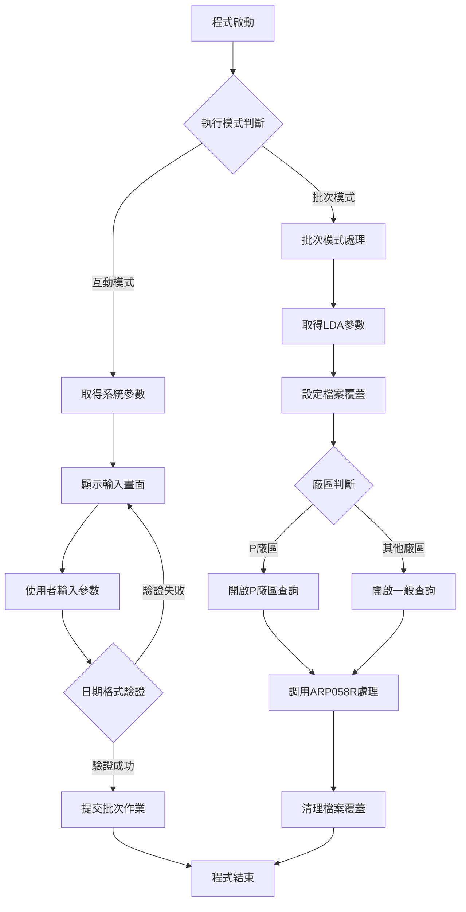
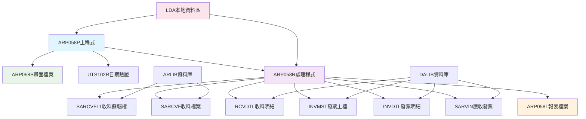
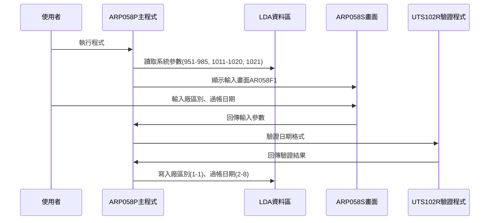
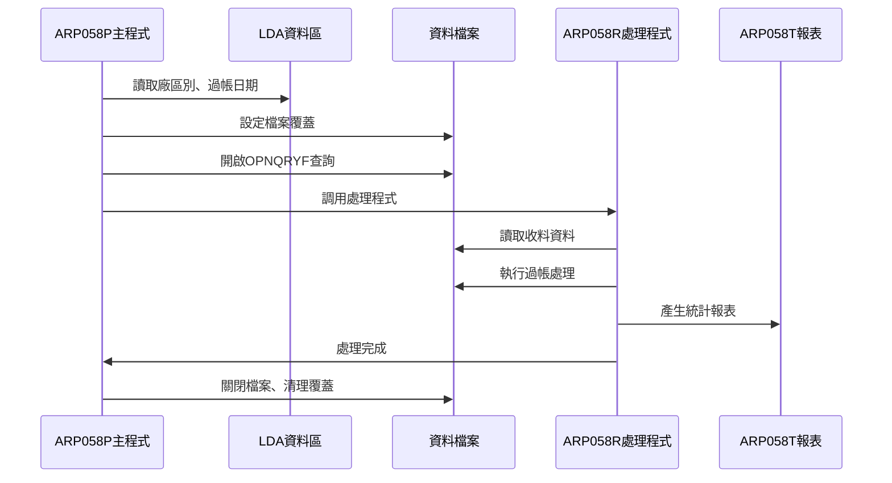
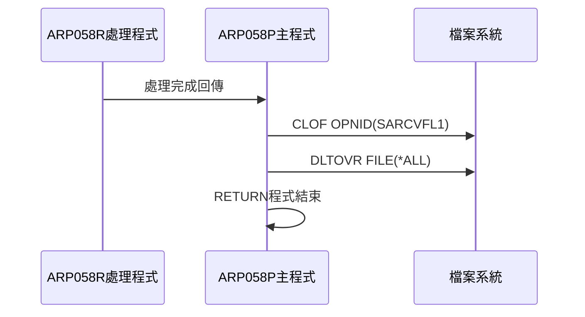
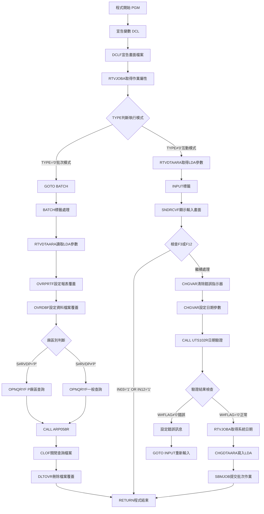

# ARP058P_U01 程式規格書

## 1. 基本資料

| 項目 | 內容 |
|------|------|
| **程式編號** | ARP058P |
| **程式名稱** | 應收帳款過帳處理作業 |
| **程式類型** | CLP |
| **廠區** | U01 |
| **系統名稱** | 應收帳款系統 |
| **子系統** | 應收帳款過帳處理 |
| **檔案位置** | U01CLSRC_THSRC/ARP058P.txt |

## 2. 🎯 程式功能說明

### 主要功能描述
此程式為應收帳款過帳處理控制程式，執行應收帳款的過帳與統計作業。程式提供互動式參數輸入及批次處理兩種執行模式，透過調用RPG處理程式完成實際的過帳邏輯。

### 🎯 業務流程詳細說明

#### 完整業務流程圖


#### 業務流程關鍵階段說明

**第一階段：執行模式識別**
- 透過RTVJOBA檢查執行環境類型
- TYPE='0'為批次模式，其他為互動模式
- 依據模式採用不同的處理流程

**第二階段：互動模式處理**
- 從LDA取得公司名稱、設備代號、廠區別等系統參數
- 顯示AR058F1畫面供使用者輸入參數
- 驗證輸入的過帳日期格式正確性
- 將參數寫入LDA後提交批次作業執行

**第三階段：批次模式處理**
- 從LDA讀取廠區別和過帳日期參數
- 設定檔案覆蓋指向正確的資料檔案和列印檔案
- 根據廠區別執行不同的OPNQRYF查詢條件
- 調用ARP058R程式執行實際過帳處理

**第四階段：查詢條件設定**
- P廠區：處理收料單號開頭為P、H、M的記錄，過帳日期小於等於指定日期
- 其他廠區：處理特定廠區的收料記錄，過帳日期等於指定日期
- 套用SRFL02、SRFL03、SRFL01的狀態篩選條件

#### 多層次驗證機制
- 日期格式驗證：調用UTS102R程式驗證過帳日期格式
- 參數完整性檢查：確保所有必要參數已正確設定
- 檔案存在性驗證：確認所有相關檔案可正常存取

#### 智能處理邏輯
- 自動判斷執行模式並採用相應處理流程
- 依據廠區別自動設定不同的查詢條件
- 動態產生OPNQRYF查詢語句處理不同廠區需求

#### 資料一致性確保機制
- 透過LDA確保參數在各程式間正確傳遞
- 使用檔案覆蓋確保存取正確的資料檔案
- 透過KLIST確保檔案存取的鍵值正確性

## 3. 🎯 檔案架構與關聯圖

### 使用檔案清單

| 檔案名稱 | 檔案類型 | 使用方式 | 說明 |
|----------|----------|----------|------|
| **ARP058S** | DSPF | DCLF | 應收帳款過帳輸入畫面檔案 |
| **ARP058T** | PRTF | OVRPRTF | 應收帳款過帳統計報表檔案 |
| **RCVDTL** | 邏輯檔 | OVRDBF | 收料明細檔案 |
| **INVMST** | 邏輯檔 | OVRDBF | 發票主檔 |
| **INVDTL** | 邏輯檔 | OVRDBF | 發票明細檔案 |
| **SARVIN** | 邏輯檔 | OVRDBF | 應收發票檔案 |
| **SARCVF** | 邏輯檔 | OVRDBF | 應收收料檔案 |
| **SARCVFL1** | 邏輯檔 | OVRDBF | 應收收料邏輯檔案1 |

### 🎯 檔案關聯詳細視覺化圖表



### 🎯 資料流向詳細說明

#### 環境準備階段的資料流向


#### 業務處理階段的資料流向


#### 環境清理階段的資料流向


## 4. 🎯 檔案欄位規格說明

### 主要資料結構

#### ARP058S 螢幕檔案欄位規格

| 欄位名稱 | 型態 | 長度 | 位置 | 屬性 | 說明 |
|----------|------|------|------|------|------|
| S#COMP | CHAR | 35 | 1,23 | O | 公司名稱 |
| S#DEVI | CHAR | 10 | 2,70 | O | 設備代號 |
| S#RVDP | CHAR | 1 | 11,34 | B | 過帳廠區別 |
| S#RVDT | CHAR | 8 | 13,34 | B | 過帳日期(YYYYMMDD) |
| S#MSG1 | CHAR | 70 | 23,2 | O | 錯誤訊息顯示 |

#### LDA本地資料區結構

| 位置範圍 | 長度 | 欄位名稱 | 用途說明 | 存取方式 |
|----------|------|----------|----------|----------|
| 1 | 1 | 廠區別 | 使用者輸入的廠區代號 | 讀寫 |
| 2-9 | 8 | 過帳日期 | 過帳日期(YYYYMMDD) | 讀寫 |
| 951-985 | 35 | 公司名稱 | 系統公司名稱資訊 | 讀取 |
| 1011-1020 | 10 | 設備代號 | 終端機設備識別代號 | 讀取 |
| 1021 | 1 | 廠區參數 | 系統預設廠區別 | 讀取 |

### 🔍 重點欄位切割技術詳解

#### 日期參數轉換處理

**螢幕輸入轉換邏輯**：

```
螢幕輸入：&S#RVDT → 驗證處理 → 參數轉換

轉換流程：
&P#PDAT = &S#RVDT    // 複製螢幕輸入
&W#RVDT = &S#RVDT    // 工作變數賦值

日期格式視覺化：
[YYYY|MM|DD]
 ↓    ↓  ↓
2024  12  25

範例：
&S#RVDT = '20241225'
&P#PDAT = '20241225'
&W#RVDT = '20241225'
```

#### LDA參數區域詳細切割

**LDA參數存放結構**：

```
LDA參數配置 (位置1-9)：
[廠區|過帳日期]
 ↓    ↓
 1    2-9
 1字元  8字元

寫入操作：
CHGDTAARA DTAARA(*LDA (1 1)) VALUE(&S#RVDP)
CHGDTAARA DTAARA(*LDA (2 8)) VALUE(&W#RVDT)

讀取操作：
RTVDTAARA DTAARA(*LDA (1 1)) RTNVAR(&S#RVDP)
RTVDTAARA DTAARA(*LDA (2 8)) RTNVAR(&W#RVDT)

實際範例：
位置1：  'P'
位置2-9：'20241225'
```

#### 系統日期取得與比較機制

**系統日期處理邏輯**：

```
系統日期取得：
RTVJOBA CYMDDATE(&W#UDATE)          // 取得YYMMDD格式
CHGVAR VAR(&W#UDATE) VALUE('0' *CAT &W#UDATE)  // 轉為YYYYMMDD

日期格式轉換視覺化：
RTVJOBA取得：[YY|MM|DD] → [241225]
加前綴處理：['0'] + [241225] → ['0241225']

實際範例：
原始：'241225' (2024年12月25日)
處理後：'0241225'
轉數值：&W#DATE = 241225

※註：此機制用於日期比較驗證
```

#### 廠區代號處理邏輯

**廠區代號分類機制**：

```
廠區代號對應表：
&S#RVDP = 'P' → P廠區 (台電)
&S#RVDP = 'M' → M廠區 (台南)
&S#RVDP = 'T' → T廠區 (廠外)
&S#RVDP = 'H' → H廠區 (高雄)
&S#RVDP = 'K' → K廠區 (廠內)
&S#RVDP = 'U' → U廠區 (新竹)

廠區代號視覺化：
輸入：[廠區] → 判斷 → 處理邏輯
      ↓        ↓      ↓
      'P'   →  P廠區  → 特殊查詢條件
      其他  →  一般   → 標準查詢條件
```

#### UTS102R日期驗證參數切割

**日期驗證呼叫參數**：

```
日期驗證參數結構：
CALL PGM(UTS102R) PARM(&P#PDAT &P#MODE &P#MTL &P#LEAP &W#FLAG)

參數切割視覺化：
&P#PDAT  [8字元] → 輸入日期    → '20241225'
&P#MODE  [1字元] → 驗證模式    → '1'
&P#MTL   [24字元]← 回傳月份標題 ← '2024年12月'
&P#LEAP  [1字元] ← 回傳閏年標記 ← '0'
&W#FLAG  [1字元] ← 回傳處理結果 ← '0'(成功)/'1'(失敗)

參數流向：
輸入：&P#PDAT, &P#MODE
輸出：&P#MTL, &P#LEAP, &W#FLAG
```

### 🎯 U01版本特殊處理分析

#### P廠區與一般廠區查詢條件差異

**P廠區特殊查詢條件**：

```
P廠區查詢邏輯：
IF &S#RVDP = 'P' THEN
    查詢條件：
    - SRFL02 = ' '
    - SRFL03 = 'Y'  
    - SRFL01 = 'Y'
    - %SST(SRRVNO 1 1) = 'P' OR 'H' OR 'M'
    - SRRVDT <= &W#RVDT
END

一般廠區查詢邏輯：
ELSE
    查詢條件：
    - SRFL02 = ' '
    - SRFL03 = 'Y'
    - SRFL01 = 'Y'  
    - %SST(SRRVNO 1 1) = &S#RVDP
    - SRRVDT = &W#RVDT
END

條件差異視覺化：
P廠區：[收款單號第1字元] IN ('P','H','M') AND [日期] <= 過帳日期
一般：  [收款單號第1字元] =  廠區代號      AND [日期] =  過帳日期
```

#### 收款單號欄位切割處理

**收款單號字串切割**：

```
收款單號切割邏輯：
%SST(SRRVNO 1 1) = 取收款單號第1字元

收款單號結構：
SRRVNO: [廠區|流水號]
        ↓    ↓
        1字元  7字元

範例：
SRRVNO = 'P1234567'
%SST(SRRVNO 1 1) = 'P'

切割用途：
1. P廠區：比對 'P','H','M'
2. 一般廠區：比對單一廠區代號
```

#### 報表輸出格式設定

**U01版本報表格式**：

```
報表設定：
OVRPRTF FILE(ARP058T) 
        TOFILE(ARLIB/ARP058T)
        PAGESIZE(66 158)    // 66行，158欄位
        LPI(6)              // 每吋6行
        CPI(12)             // 每吋12字元
        OVRFLW(57)          // 第57行溢位
        HOLD(*YES)          // 保留報表
        SAVE(*YES)          // 儲存報表
        USRDTA('應收過帳')   // 使用者資料

格式視覺化：
頁面：[66行] × [158欄位]
密度：[6行/吋] × [12字元/吋]
控制：第57行溢位，保留並儲存
```

### 重要變數定義表

| 變數名稱 | 類型 | 長度 | 說明 | 切割來源 | 使用範圍 |
|----------|------|------|------|----------|----------|
| **&INT** | CHAR | 1 | 執行模式識別(0=批次,其他=互動) | RTVJOBA | 程式流程控制 |
| **&OUTQ** | CHAR | 10 | 輸出佇列名稱 | RTVJOBA | 批次作業提交 |
| **&P#PDAT** | CHAR | 8 | 過帳日期輸入參數 | &S#RVDT複製 | 日期驗證處理 |
| **&P#MODE** | CHAR | 1 | 日期驗證模式(固定為'1') | 程式設定 | UTS102R調用 |
| **&P#MTL** | CHAR | 24 | 月份標題資訊 | UTS102R回傳 | 日期處理結果 |
| **&P#LEAP** | CHAR | 1 | 閏年標記 | UTS102R回傳 | 閏年判斷 |
| **&W#FLAG** | CHAR | 1 | 處理結果旗標(0=正常,其他=錯誤) | UTS102R回傳 | 錯誤控制 |
| **&W#DATE** | DEC | 8,0 | 系統日期數值格式 | &W#UDATE轉換 | 日期比較處理 |
| **&W#RVDT** | CHAR | 8 | 過帳日期字元格式 | &S#RVDT複製 | 參數傳遞 |
| **&W#UDATE** | CHAR | 8 | 系統目前日期 | RTVJOBA+前綴 | 日期驗證使用 |
| **&S#RVDP** | CHAR | 1 | 螢幕輸入廠區代號 | 螢幕輸入 | 廠區控制 |
| **&S#RVDT** | CHAR | 8 | 螢幕輸入過帳日期 | 螢幕輸入 | 日期輸入 |

## 5. 🎯 輸出/入螢幕布局

### 螢幕布局完整視覺化

```
+------------------------------------------------------------------------------+
|                           應收帳款過帳處理作業                    ARR058S    |
|                                                                              |
|       請輸入處理參數:                                                        |
|                                                                              |
|          1.過帳廠區: [P] (P:台電M:台南T:廠外H:高雄K:廠內U:新竹)               |
|                                                                              |
|          2.過帳日期: [____/__/__]                                            |
|                                                                              |
|                                                                              |
|                                                                              |
|                                                                              |
|                                                                              |
|                                                                              |
|                                                                              |
|                                                                              |
|                                                                              |
|                                                                              |
|                                                                              |
|                                                                              |
|                                                                              |
|F3:離開                F12:回前畫面                ENTER:執行                |
|[錯誤訊息顯示區]                                                              |
+------------------------------------------------------------------------------+
```

### 🎯 畫面欄位詳細說明

| 欄位名稱 | 欄位屬性 | 位置 | 長度 | 輸入格式 | 驗證規則 | 說明 |
|----------|----------|------|------|----------|----------|------|
| **S#RVDP** | 輸入 | 10,12 | 1 | 英文字元 | P/M/T/H/K/U | 過帳廠區別選擇 |
| **S#RVDT** | 輸入 | 12,12 | 8 | ____/__/__ | 日期格式 | 過帳日期輸入(YYYY/MM/DD) |
| **S#COMP** | 顯示 | 1,23 | 35 | 中文字元 | 唯讀 | 公司名稱顯示 |
| **S#DEVI** | 顯示 | 2,70 | 10 | 英數字元 | 唯讀 | 設備代號顯示 |
| **S#MSG1** | 顯示 | 24,2 | 70 | 中文字元 | 唯讀 | 錯誤訊息顯示區 |

### 🎯 畫面控制邏輯

#### 指示器控制說明
- **IN03**: F3功能鍵，程式結束
- **IN12**: F12功能鍵，程式結束  
- **IN52**: 錯誤指示器，控制錯誤訊息顯示屬性

#### 欄位顯示屬性
- **S#RVDT**: 當IN52='1'時顯示為PC(保護+游標)+RI(反白+強度)
- **S#MSG1**: 固定顯示為HI(高亮度)屬性

### 功能鍵詳細定義

| 功能鍵 | 處理邏輯 | 系統行為 | 說明 |
|--------|----------|----------|------|
| **F3** | 設定IN03='1' | 程式立即返回結束 | 離開程式不執行任何處理 |
| **F12** | 設定IN12='1' | 程式立即返回結束 | 回到前一個畫面 |
| **ENTER** | 執行驗證與處理 | 驗證輸入後提交批次作業 | 執行主要處理邏輯 |

### 操作流程
1. 畫面顯示時自動載入系統預設值
2. 使用者輸入廠區別和過帳日期
3. 按ENTER鍵進行日期格式驗證
4. 驗證通過後自動提交批次作業
5. 驗證失敗則顯示錯誤訊息並停留在輸入畫面

## 6. 🎯 處理流程程序說明

### 🎯 主程序邏輯深度分析

#### 程式執行流程圖


#### 🎯 詳細處理步驟逐一分析

**步驟1：程式初始化階段**
- 宣告12個程式變數，包含控制變數、日期變數、旗標變數
- 宣告ARP058S畫面檔案供互動式輸入使用
- 透過RTVJOBA取得作業類型和輸出佇列資訊

**步驟2：執行模式判斷邏輯**
- 檢查TYPE變數值判斷執行環境
- TYPE='0'表示批次模式，直接跳轉至BATCH標籤
- TYPE≠'0'表示互動模式，繼續互動式處理流程

**步驟3：互動模式參數設定**
- 從LDA位置951-985讀取35字元公司名稱
- 從LDA位置1011-1020讀取10字元設備代號
- 從LDA位置1021讀取1字元預設廠區別

**步驟4：使用者輸入處理循環**
- 顯示AR058F1畫面等待使用者輸入
- 檢查F3/F12功能鍵，若按下則直接結束程式
- 清除IN52錯誤指示器準備進行驗證

**步驟5：日期驗證處理機制**
- 將使用者輸入的S#RVDT複製到&P#PDAT變數
- 設定&P#MODE為'1'表示日期格式驗證模式
- 調用UTS102R程式進行日期格式驗證
- 檢查&W#FLAG回傳值判斷驗證結果

**步驟6：錯誤處理與重新輸入**
- 若&W#FLAG≠'0'表示日期格式錯誤
- 設定IN52='1'啟動錯誤顯示屬性
- 設定錯誤訊息'日期格式有誤！'
- 跳轉回INPUT標籤重新顯示輸入畫面

**步驟7：參數寫入與批次作業提交**
- 使用RTVJOBA CYMDDATE取得系統目前日期
- 在日期前加'0'字元形成9位數格式
- 將廠區別寫入LDA位置1-1
- 將過帳日期寫入LDA位置2-8
- 提交ARP058P批次作業到QCTL佇列執行

**步驟8：批次模式處理初始化**
- 從LDA位置1-1讀取廠區別參數
- 從LDA位置2-8讀取過帳日期參數
- 設定ARP058T報表檔案覆蓋到ARLIB/ARP058T

**步驟9：資料檔案覆蓋設定**
- RCVDTL覆蓋到DALIB/RCVDTL收料明細檔案
- INVMST覆蓋到DALIB/INVMST發票主檔
- INVDTL覆蓋到DALIB/INVDTL發票明細檔案
- SARVIN覆蓋到DALIB/SARVIN應收發票檔案
- SARCVF覆蓋到DALIB/SARCVF應收收料檔案
- SARCVFL1覆蓋到DALIB/SARCVFL1並設定共享模式

**步驟10：查詢條件動態設定**
- 判斷廠區別S#RVDP是否等於'P'
- P廠區：開啟包含P、H、M開頭收料單號的查詢
- 其他廠區：開啟特定廠區當日收料記錄查詢
- 設定KEYFLD排序為SRRVID、SRRVDT、SRRVNO

#### 業務邏輯深度解析

**互動模式業務邏輯**：
1. 提供友好的使用者介面供參數輸入
2. 即時驗證輸入參數的有效性
3. 將驗證通過的參數傳遞給批次處理程式
4. 確保批次作業在背景正確執行

**批次模式業務邏輯**：
1. 從LDA讀取互動模式設定的參數
2. 根據廠區別設定不同的資料處理範圍
3. 調用RPG程式執行實際的過帳業務邏輯
4. 確保檔案正確關閉和資源清理

#### 條件判斷詳細說明

**執行模式判斷**：
- `COND(&INT *EQ '0')` - 判斷是否為批次執行環境
- 批次模式時直接進入BATCH處理段
- 互動模式時進入參數輸入流程

**功能鍵檢查**：
- `COND(&IN03 *EQ '1' *OR &IN12 *EQ '1')` - 檢查結束功能鍵
- 任一功能鍵按下即立即結束程式執行

**日期驗證檢查**：
- `COND(&W#FLAG *NE '0')` - 檢查UTS102R驗證結果
- 非'0'值表示日期格式錯誤需重新輸入

**廠區別處理判斷**：
- `COND(&S#RVDP *EQ 'P')` - P廠區特殊處理邏輯
- P廠區處理多種單號開頭(P/H/M)和日期範圍
- 其他廠區僅處理當日特定廠區記錄

#### 變數使用和數據流向追蹤

**參數傳遞軌跡**：
1. S#RVDT(畫面輸入) → &P#PDAT(驗證參數) → &W#RVDT(LDA寫入)
2. S#RVDP(畫面輸入) → LDA(1-1) → OPNQRYF查詢條件
3. &OUTQ(系統取得) → SBMJOB(批次作業輸出佇列)

**錯誤控制軌跡**：
1. &W#FLAG(UTS102R回傳) → IN52(錯誤指示器) → S#MSG1(錯誤訊息)
2. IN03/IN12(功能鍵) → 程式流程控制 → RETURN(程式結束)

### 🎯 子程序邏輯分析

#### UTS102R日期驗證子程序
- **輸入參數**：&P#PDAT(日期)、&P#MODE(模式)
- **輸出參數**：&P#MTL(月份標題)、&P#LEAP(閏年)、&W#FLAG(結果)
- **功能**：驗證日期格式有效性並回傳處理結果

#### ARP058R主要處理子程序
- **輸入來源**：SARCVFL1查詢結果集
- **處理邏輯**：執行應收帳款過帳業務處理
- **輸出結果**：ARP058T統計報表

### 🎯 特殊邏輯處理

#### P廠區特殊查詢條件
```sql
QRYSLT('SRFL02 *EQ " " *AND 
        SRFL03 *EQ "Y" *AND 
        SRFL01 *EQ "Y" *AND 
        %SST(SRRVNO 1 1) *EQ %VALUES("P" "H" "M") *AND 
        SRRVDT *LE ' || &W#RVDT)
```
- 處理狀態為已確認但未過帳的記錄
- 單號開頭為P、H、M的多廠區收料記錄
- 過帳日期小於等於指定日期的累積處理

#### 一般廠區查詢條件
```sql
QRYSLT('SRFL02 *EQ " " *AND 
        SRFL03 *EQ "Y" *AND 
        SRFL01 *EQ "Y" *AND 
        %SST(SRRVNO 1 1) *EQ "' || &S#RVDP || '" *AND 
        SRRVDT *EQ ' || &W#RVDT)
```
- 處理特定廠區當日的收料記錄
- 單號開頭必須符合指定廠區代號
- 過帳日期必須等於指定的處理日期

#### 檔案共享模式設定
- SARCVFL1設定為SHARE(*YES)允許多程式同時存取
- 其他檔案使用預設的排他存取模式
- 確保資料一致性和併發處理能力

### 🎯 錯誤處理與資料完整性控制

#### 詳細的錯誤處理邏輯
1. **日期格式錯誤處理**
   - 檢查UTS102R回傳的&W#FLAG值
   - 設定錯誤指示器IN52控制畫面顯示
   - 顯示中文錯誤訊息引導使用者修正

2. **功能鍵中斷處理**
   - 即時檢查IN03和IN12指示器狀態
   - 提供使用者隨時中斷程式執行的能力
   - 確保程式正常結束不留殘留處理

3. **檔案存取錯誤預防**
   - 透過OVRDBF確保檔案正確對應
   - 使用CLOF和DLTOVR確保資源正確釋放
   - 避免檔案鎖定和資源洩漏問題

#### 資料完整性檢查機制
1. **參數傳遞完整性**
   - 透過LDA確保參數在程式間正確傳遞
   - 使用固定位置確保資料不被覆蓋
   - 驗證參數有效性後才進行後續處理

2. **檔案操作完整性**
   - 設定正確的檔案覆蓋確保存取正確資料
   - 使用KEYFLD確保檔案讀取順序正確
   - 處理完成後清理所有覆蓋設定

## 7. 🎯 數據操作與轉換分析

### 檔案操作詳解

#### OPNQRYF動態查詢操作
- **操作方式**：動態建立查詢條件篩選SARCVFL1檔案
- **條件設定**：根據廠區別採用不同的QRYSLT條件
- **排序控制**：使用KEYFLD確保資料按SRRVID、SRRVDT、SRRVNO排序
- **併發處理**：透過SHARE(*YES)支援多程式同時存取

#### 檔案覆蓋操作邏輯
- **OVRPRTF**：將ARP058T覆蓋到ARLIB並設定列印格式
- **OVRDBF**：將所有相關檔案覆蓋到DALIB資料庫
- **存取控制**：確保程式存取正確的實體檔案位置

### 數據轉換邏輯

#### 日期格式轉換處理
- **輸入格式**：使用者畫面輸入YYYY/MM/DD格式
- **內部格式**：轉換為YYYYMMDD 8位數字格式
- **系統日期**：RTVJOBA CYMDDATE取得YYMMDD格式後加'0'前置

#### 字元數值轉換機制
- **LDA位置控制**：精確控制資料在LDA中的位置和長度
- **格式統一**：確保日期資料在各程式間格式一致
- **編碼處理**：確保中文字元正確傳遞和顯示

### 計算邏輯分析

#### 日期計算和比較
- 註解掉的日期比較邏輯：`&S#RVDT *GT &W#DATE`
- 原設計用於防止過帳日期超過系統日期
- 目前版本移除此限制允許彈性的日期處理

#### 查詢範圍計算
- P廠區：處理小於等於指定日期的累積資料
- 其他廠區：僅處理等於指定日期的當日資料
- 透過QRYSLT動態產生不同的日期比較條件

### 檢核機制詳解

#### 輸入參數檢核
- **日期有效性**：調用UTS102R驗證日期格式和邏輯正確性
- **廠區代碼**：畫面限制只能輸入P/M/T/H/K/U等有效廠區
- **必填檢查**：確保所有必要參數都已正確輸入

#### 資料狀態檢核
- **SRFL02檢查**：確保記錄未被標記為刪除狀態
- **SRFL03檢查**：確保記錄已被確認可進行過帳
- **SRFL01檢查**：確保記錄為有效的收料記錄
- **收料單號檢查**：依據廠區別檢查單號開頭是否符合規定

## 8. 🎯 錯誤處理程序說明

### 🎯 詳細錯誤代碼清冊

| 錯誤代碼 | 錯誤訊息 | 原因說明 | 處理方式 | 預防措施 |
|----------|---------|---------|---------|----------|
| **IN03='1'** | F3鍵中斷 | 使用者按下F3功能鍵要求離開程式 | 1. 立即執行RETURN指令<br>2. 正常結束程式執行<br>3. 不執行任何過帳處理 | 在畫面說明中明確標示F3功能 |
| **IN12='1'** | F12鍵中斷 | 使用者按下F12功能鍵要求回到前畫面 | 1. 立即執行RETURN指令<br>2. 正常結束程式執行<br>3. 回到呼叫程式或選單 | 在畫面說明中明確標示F12功能 |
| **W#FLAG≠'0'** | 日期格式有誤！ | UTS102R驗證日期格式或邏輯錯誤 | 1. 設定IN52='1'顯示錯誤<br>2. 設定錯誤訊息到S#MSG1<br>3. GOTO INPUT重新輸入 | 在畫面提供日期格式說明 |
| **FILE001** | 檔案存取錯誤 | SARCVFL1或相關檔案無法開啟存取 | 1. 檢查檔案是否存在<br>2. 檢查檔案權限設定<br>3. 重新執行OVRDBF設定 | 執行前確認所有檔案可正常存取 |
| **SYS001** | 系統資源不足 | LDA空間不足或系統記憶體不夠 | 1. 清理LDA不必要資料<br>2. 重新啟動作業<br>3. 檢查系統資源狀況 | 定期清理系統暫存資料 |

### 🎯 系統異常處理邏輯

#### 檔案操作失敗處理
- **檔案不存在**：透過OVRDBF確保檔案正確對應到DALIB
- **權限不足**：檢查程式執行使用者對檔案的存取權限
- **檔案鎖定**：使用SHARE(*YES)設定允許多程式存取

#### 程式調用失敗處理
- **UTS102R調用失敗**：檢查程式是否存在於程式庫中
- **ARP058R調用失敗**：確認RPG程式編譯正確且可執行
- **參數傳遞錯誤**：確保LDA參數格式和位置正確

#### 資料完整性錯誤處理
- **LDA讀寫失敗**：檢查LDA空間是否足夠且未被其他程式佔用
- **參數格式錯誤**：透過UTS102R驗證確保日期格式正確
- **廠區代碼錯誤**：限制輸入範圍防止無效的廠區代碼

#### 並發控制失敗處理
- **檔案鎖定衝突**：設定SHARE(*YES)允許共享存取
- **作業佇列滿載**：SBMJOB失敗時顯示適當錯誤訊息
- **資源競爭**：透過CLOF和DLTOVR確保資源正確釋放

## 9. 🎯 備註

### 🎯 特殊注意事項

#### 廠區處理差異
- P廠區採用累積處理模式，處理過帳日期小於等於指定日期的所有記錄
- 其他廠區採用單日處理模式，僅處理指定日期當日的收料記錄
- 收料單號開頭檢查：P廠區包含P/H/M，其他廠區依據實際廠區別

#### 程式執行模式
- 互動模式提供參數輸入介面，適合臨時性的過帳處理需求
- 批次模式用於大量資料處理，透過作業排程自動執行
- 兩種模式透過LDA進行參數傳遞確保資料一致性

#### 檔案覆蓋機制
- 所有檔案覆蓋到DALIB確保存取正確的生產資料
- SARCVFL1設定共享模式支援併發存取
- 程式結束時必須執行DLTOVR清理所有覆蓋設定

#### 日期處理邏輯
- 移除過帳日期不得大於系統日期的限制(1303A版本修改)
- 支援跨日期範圍的補帳處理功能
- 透過UTS102R確保日期格式和邏輯正確性

#### 報表輸出設定
- ARP058T報表設定為66行158欄的固定格式
- 列印設定為LPI(6)和CPI(12)確保列印品質
- 設定HOLD(*YES)和SAVE(*YES)保留報表供後續查閱 