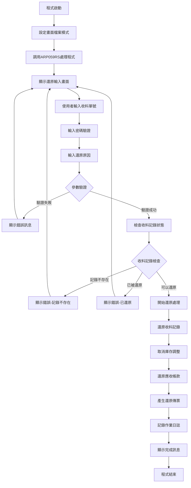
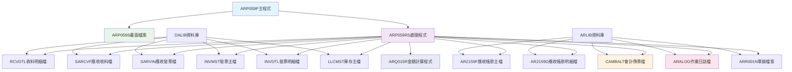
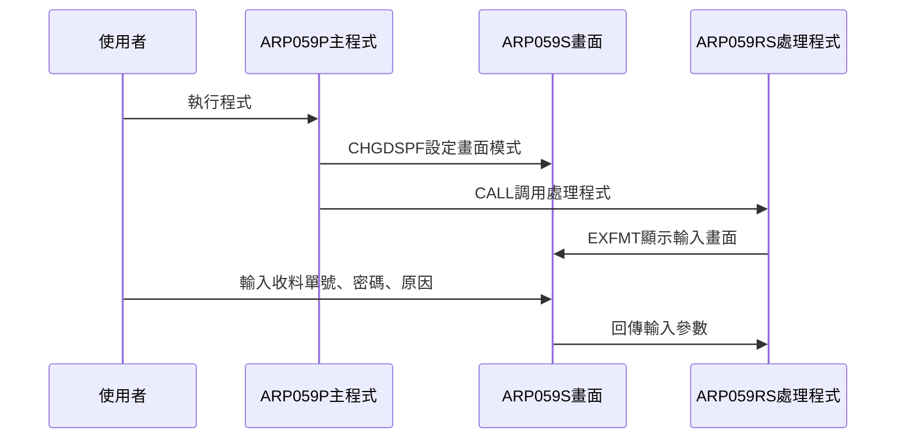
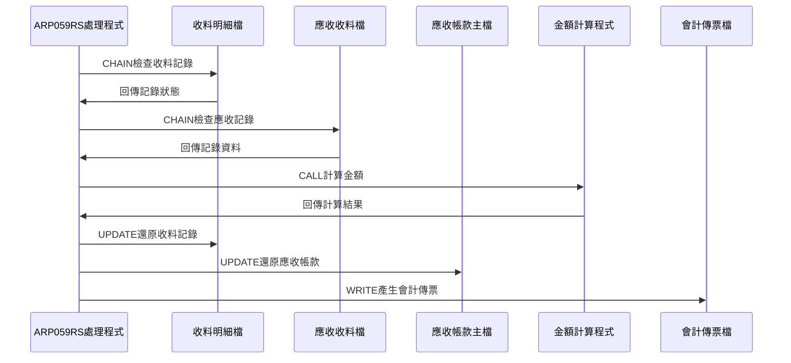
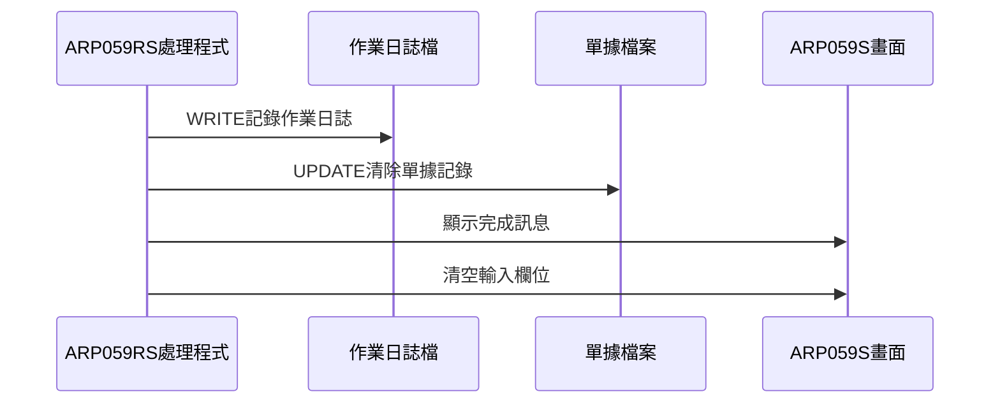
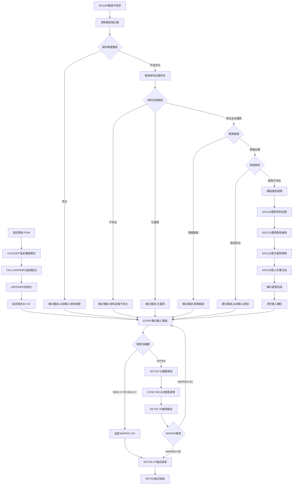

# ARP059P_U01 程式規格書

## 1. 基本資料

| 項目 | 內容 |
|------|------|
| **程式編號** | ARP059P |
| **程式名稱** | 應收帳款過帳還原作業 |
| **程式類型** | CLP |
| **廠區** | U01 |
| **系統名稱** | 應收帳款系統 |
| **子系統** | 應收帳款過帳還原處理 |
| **檔案位置** | U01CLSRC_THSRC/ARP059P.txt |

## 2. 🎯 程式功能說明

### 主要功能描述
此程式為應收帳款過帳還原控制程式，用於取消已過帳的應收帳款記錄。程式提供安全的還原作業介面，透過密碼驗證確保操作安全性，並執行完整的帳務還原處理，包括收料記錄還原、庫存調整取消、應收帳款餘額回復等作業。

### 🎯 業務流程詳細說明

#### 完整業務流程圖


#### 業務流程關鍵階段說明

**第一階段：系統初始化與畫面設定**
- 設定ARP059S畫面檔案為不延遲寫入模式(DFRWRT(*NO))
- 調用ARP059RS主要處理程式執行實際還原邏輯
- 初始化系統參數和使用者資訊

**第二階段：使用者輸入與驗證**
- 顯示還原作業輸入畫面
- 要求輸入收料單號(必填)
- 要求輸入操作密碼進行安全驗證
- 要求輸入還原原因說明(必填)

**第三階段：收料記錄狀態檢查**
- 檢查收料單號是否存在於RCVDTL檔案
- 驗證收料記錄是否已被過帳
- 確認收料記錄未被標記為已還原
- 檢查相關的應收帳款記錄狀態

**第四階段：還原處理執行**
- 將收料記錄標記為已作廢(RVFLAG='D', RVDECD='D')
- 更新收料記錄的作廢日期和作廢人員
- 調用ARQ015R程式計算相關金額
- 執行庫存數量調整還原

**第五階段：應收帳款處理還原**
- 還原現金帳戶的借貸金額調整
- 取消應收帳款餘額的變動
- 還原AR2159D檔案的相關記錄
- 產生還原作業的會計傳票

**第六階段：作業記錄與完成**
- 在ARALOG檔案記錄還原作業日誌
- 清除ARR001N檔案的相關記錄
- 顯示處理完成訊息
- 清空輸入欄位準備下次操作

#### 多層次驗證機制
- **密碼安全驗證**：要求輸入正確的操作密碼'CHLPASS'
- **收料記錄存在性檢查**：確認收料單號存在於系統中
- **狀態有效性驗證**：檢查記錄未被重複還原或作廢
- **關聯性檢查**：驗證應收帳款記錄的完整性

#### 智能處理邏輯
- 自動判斷收料類型並採用相應的還原邏輯
- 根據科目代碼自動處理不同類型的帳務調整
- 智能識別現金帳戶和應收帳款的處理方式
- 自動產生對應的會計傳票和日誌記錄

#### 資料一致性確保機制
- 透過檔案鎖定確保還原過程中資料不被其他程式修改
- 使用交易概念確保所有相關檔案同步更新
- 提供完整的錯誤回滾機制
- 記錄詳細的作業軌跡供後續查核

## 3. 🎯 檔案架構與關聯圖

### 使用檔案清單

| 檔案名稱 | 檔案類型 | 使用方式 | 說明 |
|----------|----------|----------|------|
| **ARP059S** | DSPF | CHGDSPF | 應收帳款過帳還原輸入畫面檔案 |
| **RCVDTL** | 邏輯檔 | UF/UPDATE | 收料明細檔案(主要還原對象) |
| **SARCVF** | 邏輯檔 | UF/UPDATE | 應收收料檔案 |
| **SARVIN** | 邏輯檔 | UF/UPDATE | 應收發票檔案 |
| **INVMST** | 邏輯檔 | UF/UPDATE | 發票主檔 |
| **INVDTL** | 邏輯檔 | UF/UPDATE | 發票明細檔案 |
| **LLCMST** | 邏輯檔 | UF/UPDATE | 庫存主檔 |
| **AR2159F** | 邏輯檔 | UF/UPDATE | 應收帳款主檔 |
| **AR2159D** | 邏輯檔 | UF/UPDATE | 應收帳款明細檔 |
| **CAMBALT** | 邏輯檔 | O/OUTPUT | 會計傳票檔案 |
| **ARALOG** | 邏輯檔 | O/OUTPUT | 應收帳款作業日誌檔 |
| **ARR001N** | 邏輯檔 | UF/UPDATE | 應收帳款單據檔案 |

### 🎯 檔案關聯詳細視覺化圖表



### 🎯 資料流向詳細說明

#### 環境準備階段的資料流向


#### 業務處理階段的資料流向


#### 環境清理階段的資料流向


## 4. 🎯 檔案欄位規格說明

### 主要資料結構

#### UDS使用者資料結構
| 位置 | 長度 | 欄位名稱 | 用途說明 |
|------|------|----------|----------|
| 951-985 | 35 | S#COMP | 公司名稱 |
| 1011-1020 | 10 | S#DEVI | 設備代號 |
| 1001-1010 | 10 | U#USID | 使用者代號 |
| 1021-1021 | 1 | U#AREA | 區域代號 |

### 🔍 重點欄位切割技術詳解

#### 系統控制結構分析(W#SYST)
程式中使用14字元的系統控制結構：

**W#SYST結構 (14字元)**：
```
W#SYST (14字元)：[XXXXXX|XXXX|XXXX]
                  ↓      ↓    ↓
D#ST (6字元)：    [XXXXXX]           系統狀態
D#SY (4字元)：            [XXXX]     系統年度
D#SMD (4字元)：                [XXXX] 系統月日
```

#### 收料保留欄位結構(RVRESV)
**RVRESV結構 (12字元)**：
```
RVRESV (12字元)：[XXXXXXXXXXXX]
                  ↓
D#RESV (1字元)：  [X]              保留字元('*'/'#')
```

#### 金額計算結構(D#ARY1)
**D#ARY1結構 (19字元)**：
```
D#ARY1 (19字元)：[XX|XXXXXX|XXXXXXXXXXX]
                  ↓   ↓      ↓
D#ITEM (2字元)：  [XX]               項目代號
D#ORNO (6字元)：    [XXXXXX]         訂單編號
D#RAMT (11字元)：          [XXXXXXXXXXX] 金額
```

### 🎯 欄位挪用詳細分析

#### 收料保留欄位的特殊用途
- **原始定義**：RVRESV為一般保留欄位
- **實際使用方式**：用於標記現金帳戶類型
- **挪用原因**：區分不同類型的現金帳戶處理邏輯
- **挪用方式詳細說明**：
  * '*'：表示已預付現金帳戶
  * '#'：表示未預付現金帳戶
  * 空白：表示一般收料記錄

#### 欄位挪用影響評估
此挪用方式對系統的影響：
- 提供了額外的帳戶類型判斷依據
- 簡化了現金帳戶的處理邏輯
- 維持了原有檔案結構的完整性

### 重要變數定義表

| 變數名稱 | 類型 | 長度 | 說明 | 使用範圍 |
|----------|------|------|------|----------|
| **W#PRID** | CHAR | 2 | 程式流程控制ID('01'=主畫面) | 主流程控制 |
| **S#RVNO** | CHAR | 6 | 收料單號輸入 | 畫面輸入/檔案查詢 |
| **S#PASS** | CHAR | 10 | 密碼驗證輸入 | 安全驗證 |
| **S#CGCA** | CHAR | 40 | 還原原因說明 | 作業記錄 |
| **W#CCAM** | NUM | 11,0 | 現金帳戶累計金額 | 金額計算 |
| **W#2159** | NUM | 11,0 | 應收帳款累計金額 | 金額計算 |
| **W#FLAG** | CHAR | 1 | 處理旗標 | 流程控制 |
| **W#MKTP** | CHAR | 1 | 收料類型 | 業務邏輯 |
| **P#RAMT** | NUM | 11,0 | 計算金額參數 | ARQ015R調用 |
| **U#SYSD** | NUM | 8,0 | 系統日期 | 日期處理 |

## 5. 🎯 輸出/入螢幕布局

### 螢幕布局完整視覺化

```
+------------------------------------------------------------------------------+
|                         應收帳款過帳還原作業                       ARR059S   |
|                                                                              |
|       收料單號: [______]                                                     |
|                                                                              |
|    請輸入密碼(覆蓋顯示): [__________]                                        |
|                                                                              |
|      輸入還原的原因: [____________________________________]                  |
|                                                                              |
|                                                                              |
|                                                                              |
|                                                                              |
|                                                                              |
|                                                                              |
|                                                                              |
|                                                                              |
|                                                                              |
|                                                                              |
|                                                                              |
|                                                                              |
|                                                                              |
|F3:離開                F12:回前畫面                ENTER:執行                |
|[錯誤訊息顯示區]                                                              |
+------------------------------------------------------------------------------+
```

### 🎯 畫面欄位詳細說明

| 欄位名稱 | 欄位屬性 | 位置 | 長度 | 輸入格式 | 驗證規則 | 說明 |
|----------|----------|------|------|----------|----------|------|
| **S#RVNO** | 輸入/輸出 | 8,18 | 6 | 英數字元 | 必填 | 收料單號輸入 |
| **S#PASS** | 輸入 | 10,6 | 10 | 英數字元 | 必填/隱藏顯示 | 操作密碼輸入 |
| **S#CGCA** | 輸入/輸出 | 12,12 | 40 | 中文字元 | 必填 | 還原原因說明 |
| **S#COMP** | 顯示 | 1,23 | 35 | 中文字元 | 唯讀 | 公司名稱顯示 |
| **S#DEVI** | 顯示 | 2,70 | 10 | 英數字元 | 唯讀 | 設備代號顯示 |
| **S#MSG1** | 顯示 | 24,2 | 70 | 中文字元 | 唯讀 | 錯誤訊息顯示區 |

### 🎯 畫面控制邏輯

#### 指示器控制說明
- **IN03**: F3功能鍵，程式結束
- **IN12**: F12功能鍵，程式結束
- **IN50**: 畫面鎖定指示器，處理過程中鎖定畫面
- **IN51**: 收料單號錯誤指示器
- **IN52**: 還原原因錯誤指示器  
- **IN53**: 密碼錯誤指示器

#### 欄位顯示屬性
- **S#RVNO**: 當IN51='1'時顯示為PC(保護+游標)+RI(反白+強度)
- **S#PASS**: 固定顯示為ND(不顯示)+CS(游標選擇)屬性
- **S#CGCA**: 當IN52='1'時顯示為PC(保護+游標)+RI(反白+強度)
- **S#MSG1**: 固定顯示為HI(高亮度)屬性

### 功能鍵詳細定義

| 功能鍵 | 處理邏輯 | 系統行為 | 說明 |
|--------|----------|----------|------|
| **F3** | 設定IN03='1' | 程式立即返回結束 | 離開程式不執行任何處理 |
| **F12** | 設定IN12='1' | 程式立即返回結束 | 回到前一個畫面 |
| **ENTER** | 執行驗證與還原處理 | 驗證輸入後執行還原作業 | 執行主要還原邏輯 |

### 操作流程
1. 畫面顯示時自動載入系統參數
2. 使用者輸入收料單號
3. 輸入操作密碼進行安全驗證
4. 輸入還原原因說明
5. 按ENTER鍵進行驗證和還原處理
6. 系統鎖定畫面防止重複操作
7. 處理完成後顯示結果訊息並清空欄位

## 6. 🎯 處理流程程序說明

### 🎯 主程序邏輯深度分析

#### 程式執行流程圖


#### 🎯 詳細處理步驟逐一分析

**步驟1：程式環境初始化**
- 使用CHGDSPF設定ARP059S畫面檔案為不延遲寫入模式
- 調用ARLIB/ARP059RS程式執行主要處理邏輯
- 程式採用簡潔的控制結構確保穩定執行

**步驟2：ARP059RS主程序初始化**
- 設定程式流程ID為'01'表示主畫面處理
- 進入主要處理循環直到使用者選擇離開
- 透過CASE結構控制不同的處理流程

**步驟3：使用者輸入處理循環**
- 使用EXFMT顯示AR059F1畫面等待使用者輸入
- 檢查F3/F12功能鍵，若按下則設定結束旗標
- 若按ENTER則鎖定畫面並進入驗證處理

**步驟4：輸入參數驗證處理**
- 清除所有錯誤指示器(IN51, IN52, IN53)
- 檢查收料單號是否為空白，空白則顯示錯誤
- 使用SETLL和READ檢查收料記錄是否存在

**步驟5：收料記錄狀態檢查**
- 檢查RVVNO2欄位確認記錄未被還原
- 檢查RVTANO欄位確認記錄未被標記
- 驗證密碼是否等於'CHLPASS'

**步驟6：收料記錄詳細驗證**
- 使用CHAIN檢查收料記錄的完整狀態
- 確認RVVNO1(還原單號)為空白
- 確認RVFLAG和RVDECD未標記為已作廢('D')

**步驟7：應收收料記錄檢查**
- 使用CHAIN檢查SARCVF檔案的對應記錄
- 確認應收記錄存在且狀態正常
- 為後續還原處理做準備

**步驟8：還原處理執行開始**
- 顯示'還原收料處理中...'訊息
- 調用SR1110子程序執行收料記錄還原
- 呼叫ARQ015R程式計算相關金額

**步驟9：收料記錄還原處理(SR1110)**
- 將RVFLAG和RVDECD設定為'D'表示已作廢
- 更新RVDEDT(作廢日期)為系統當前日期
- 更新RVTXAR(作廢區域)和RVTXDT(作廢日期)

**步驟10：庫存調整還原處理**
- 檢查收料類型(RVNTTP)是否為庫存相關
- 若為庫存收料則調整LLCMST庫存主檔
- 還原庫存數量的增減調整

**步驟11：現金帳戶處理還原**
- 檢查D#RESV標記('*'或'#')判斷現金帳戶類型
- 調整AR2159F應收帳款主檔的相關金額
- 累計現金帳戶金額供後續傳票產生

**步驟12：應收帳款還原處理(SR1120)**
- 檢查科目代碼(RVACNO)為'2159'或'211301'
- 調整應收帳款餘額(ARAMT2)
- 更新應收帳款狀態旗標

**步驟13：會計傳票產生(SR1130)**
- 根據累計金額產生CAMBALT會計傳票
- 記錄借貸方科目和金額
- 設定傳票日期和憑證資訊

**步驟14：作業日誌記錄(SR1140)**
- 在ARALOG檔案記錄還原作業日誌
- 記錄操作人員、時間、收料單號
- 記錄還原原因和處理結果

**步驟15：ARR001N檔案清理**
- 清除ARR001N檔案中的相關記錄
- 將ANFLAG、ANCODE、ANRCNO清空
- 確保單據追蹤的完整性

#### 業務邏輯深度解析

**還原作業的核心邏輯**：
1. 採用標記刪除而非實際刪除確保資料追蹤性
2. 透過多重驗證確保還原操作的安全性
3. 分階段處理確保各子系統資料同步
4. 完整的日誌記錄支援後續查核

**安全控制機制**：
1. 密碼驗證防止未授權操作
2. 畫面鎖定防止重複操作
3. 狀態檢查防止錯誤還原
4. 作業記錄確保操作可追蹤

#### 條件判斷詳細說明

**收料記錄狀態判斷**：
- `RVVNO2 *NE *BLANK` - 檢查是否已有還原記錄
- `RVFLAG *EQ 'D'` - 檢查是否已標記作廢
- `RVDECD *EQ 'D'` - 檢查作廢碼狀態

**現金帳戶類型判斷**：
- `D#RESV *EQ '*'` - 已預付現金帳戶處理
- `D#RESV *EQ '#'` - 未預付現金帳戶處理
- 根據類型調整不同的應收帳款科目

**科目代碼判斷**：
- `RVACNO *EQ '2159'` - 一般應收帳款科目
- `RVACNO *EQ '211301'` - 特殊應收帳款科目
- 不同科目採用不同的金額調整邏輯

#### 變數使用和數據流向追蹤

**主要控制變數軌跡**：
1. W#PRID('01') → 主畫面處理 → W#PRID('00') → 程式結束
2. S#RVNO(輸入) → RCVDTL查詢 → 還原處理 → 清空
3. S#PASS(輸入) → 密碼驗證 → 清空

**金額計算變數軌跡**：
1. P#RAMT(ARQ015R回傳) → 應收帳款調整 → CAMBALT傳票
2. W#CCAM(累計) → 現金帳戶傳票
3. W#2159(累計) → 應收帳款傳票

### 🎯 子程序邏輯分析

#### SR1100驗證處理子程序
- **功能**：輸入參數驗證和收料記錄狀態檢查
- **輸入來源**：畫面輸入的S#RVNO, S#PASS, S#CGCA
- **處理邏輯**：多層次驗證確保資料有效性
- **輸出結果**：錯誤指示器設定和錯誤訊息顯示

#### SR1110收料記錄還原子程序  
- **功能**：執行收料記錄的作廢標記和相關調整
- **處理邏輯**：調用ARQ015R、更新RCVDTL、調整庫存
- **關鍵操作**：RVFLAG='D', RVDECD='D'設定

#### SR1120應收帳款還原子程序
- **功能**：還原應收帳款相關的金額調整
- **處理邏輯**：調整AR2159F檔案的應收餘額
- **金額處理**：根據科目代碼調整不同的金額欄位

#### SR1130會計傳票產生子程序
- **功能**：產生還原作業的會計傳票
- **輸入來源**：累計的W#CCAM和W#2159金額
- **輸出結果**：CAMBALT傳票記錄

#### SR1140作業日誌記錄子程序
- **功能**：記錄還原作業的完整日誌
- **記錄內容**：操作人員、時間、單號、原因
- **輸出檔案**：ARALOG作業日誌檔

### 🎯 特殊邏輯處理

#### 收料類型特殊處理
- **庫存收料(RVNTTP='I')**：需要調整庫存數量
- **現金收料(RVUSTP='A2')**：需要調整現金帳戶
- **一般收料**：僅調整應收帳款餘額不影響庫存

#### 現金帳戶分類處理
```sql
-- 已預付現金帳戶
IF D#RESV = '*' THEN
    調整 ARAMT1 (已預付金額)
    累計 W#2159 (應收帳款金額)
-- 未預付現金帳戶  
ELSE IF D#RESV = '#' THEN
    調整 ARAMT3 (未預付金額)
ENDIF
```

#### 科目代碼特殊處理
- **2159科目**：一般應收帳款處理
- **211301科目**：特殊應收帳款處理(0108A版本新增)
- 兩種科目都調整ARAMT2應收餘額

### 🎯 錯誤處理與資料完整性控制

#### 詳細的錯誤處理邏輯
1. **輸入欄位驗證錯誤**
   - 檢查所有必填欄位的完整性
   - 設定對應的錯誤指示器
   - 顯示具體的錯誤訊息引導修正

2. **業務邏輯驗證錯誤**
   - 檢查收料記錄的存在性和狀態
   - 驗證密碼的正確性
   - 確認記錄未被重複還原

3. **檔案操作錯誤預防**
   - 使用CHAIN確保記錄存在後才進行更新
   - 透過指示器檢查檔案操作結果
   - 提供完整的錯誤回復機制

#### 資料完整性檢查機制
1. **交易一致性控制**
   - 所有相關檔案在同一邏輯交易中更新
   - 確保部分失敗時能完整回滾
   - 維持各檔案間的資料一致性

2. **狀態追蹤機制**
   - 透過RVFLAG和RVDECD雙重標記
   - 記錄詳細的作廢日期和人員
   - 提供完整的操作軌跡

## 7. 🎯 數據操作與轉換分析

### 檔案操作詳解

#### RCVDTL收料明細檔案操作
- **SETLL操作**：快速定位到指定收料單號的記錄位置
- **READ操作**：讀取收料記錄驗證狀態和內容
- **CHAIN操作**：精確讀取指定收料記錄進行更新
- **UPDATE操作**：更新作廢標記和相關欄位

#### 關聯檔案同步更新
- **SARCVF**：應收收料檔案的對應記錄檢查
- **LLCMST**：庫存主檔的數量調整還原
- **AR2159F**：應收帳款主檔的餘額調整
- **AR2159D**：應收帳款明細檔的記錄維護

### 數據轉換邏輯

#### 日期格式轉換處理
- **系統日期取得**：`*DATE SUB 19000000 → U#SYSD`
- **作廢日期設定**：`Z-ADD U#SYSD → RVDEDT`
- **傳票日期設定**：使用系統日期作為會計傳票日期

#### 金額數值轉換機制
- **ARQ015R計算結果**：回傳的P#RAMT用於各種金額調整
- **累計金額控制**：W#CCAM和W#2159累計不同類型金額
- **正負號處理**：使用ADD和SUB確保金額方向正確

### 計算邏輯分析

#### 庫存數量調整計算
```rpg
SUB RVRAMT LLAAMT   // 減少庫存數量
ADD RVRAMT LLBAMT   // 增加庫存數量
```
- 還原庫存收料時將數量從LLAAMT減少並加回LLBAMT
- 確保庫存數量回到收料前的狀態

#### 應收帳款金額調整計算
```rpg
SUB P#RAMT ARAMT1   // 減少已預付金額
SUB P#RAMT ARAMT3   // 減少未預付金額  
SUB RVRAMT ARAMT2   // 減少應收餘額
```
- 根據現金帳戶類型調整不同的金額欄位
- 確保應收帳款餘額正確還原

#### 會計傳票金額計算
- **現金帳戶傳票**：使用累計的W#CCAM金額
- **應收帳款傳票**：使用累計的W#2159金額
- **借貸方向**：還原作業產生相反方向的傳票

### 檢核機制詳解

#### 收料記錄狀態檢核
- **RVVNO2檢查**：確保未被其他還原作業處理
- **RVFLAG/RVDECD檢查**：確保未被標記為已作廢
- **RVTANO檢查**：確保未被其他作業標記

#### 密碼安全檢核
- **固定密碼**：'CHLPASS'作為操作授權密碼
- **空白檢查**：未輸入密碼時的處理邏輯
- **錯誤密碼**：顯示相應錯誤訊息

#### 關聯性檢核
- **SARCVF記錄**：確認應收收料檔案的對應記錄存在
- **AR2159F記錄**：確認應收帳款主檔記錄存在
- **檔案一致性**：確保所有相關檔案同步更新

## 8. 🎯 錯誤處理程序說明

### 🎯 詳細錯誤代碼清冊

| 錯誤代碼 | 錯誤訊息 | 原因說明 | 處理方式 | 預防措施 |
|----------|---------|---------|---------|----------|
| **IN03='1'** | F3鍵中斷 | 使用者按下F3功能鍵要求離開程式 | 1. 立即設定W#PRID='00'<br>2. 正常結束程式執行<br>3. 不執行任何還原處理 | 在畫面說明中明確標示F3功能 |
| **IN12='1'** | F12鍵中斷 | 使用者按下F12功能鍵要求回到前畫面 | 1. 立即設定W#PRID='00'<br>2. 正常結束程式執行<br>3. 回到呼叫程式或選單 | 在畫面說明中明確標示F12功能 |
| **T#MSG,1** | 請先輸入收料單號！ | S#RVNO欄位為空白未輸入 | 1. 設定IN51='1'顯示錯誤<br>2. 游標停留在收料單號欄位<br>3. 要求重新輸入 | 在畫面提供必填欄位說明 |
| **T#MSG,2** | 請先輸入還原的原因！ | S#CGCA原因欄位為空白 | 1. 設定IN52='1'顯示錯誤<br>2. 游標停留在原因欄位<br>3. 要求重新輸入 | 強調原因輸入的重要性 |
| **T#MSG,3** | 該收料單號不存在！ | RCVDTL檔案中找不到對應記錄 | 1. 設定IN51='1'顯示錯誤<br>2. 檢查單號輸入正確性<br>3. 確認收料記錄是否存在 | 提供收料單號查詢功能 |
| **T#MSG,4** | 該收料單已被其他作業處理！ | RVVNO1欄位不為空白 | 1. 設定IN51='1'顯示錯誤<br>2. 顯示已被處理狀態<br>3. 不允許重複處理 | 建立收料狀態查詢機制 |
| **T#MSG,5** | 該收料單已作廢！ | RVFLAG或RVDECD為'D' | 1. 設定IN51='1'顯示錯誤<br>2. 顯示已作廢狀態<br>3. 不允許重複作廢 | 提供收料狀態查詢 |
| **T#MSG,6** | 該應收收料記錄不存在！ | SARCVF檔案中找不到對應記錄 | 1. 設定IN51='1'顯示錯誤<br>2. 檢查資料一致性<br>3. 確認檔案同步狀態 | 定期檢查檔案一致性 |
| **T#MSG,11** | 該收料單已還原！ | RVTANO欄位不為空白 | 1. 設定IN53='1'顯示錯誤<br>2. 顯示已還原狀態<br>3. 不允許重複還原 | 提供還原狀態查詢 |
| **T#MSG,12** | 請輸入密碼！ | S#PASS密碼欄位為空白 | 1. 設定IN53='1'顯示錯誤<br>2. 游標停留在密碼欄位<br>3. 要求輸入正確密碼 | 強調密碼驗證的必要性 |
| **T#MSG,13** | 該收料單已還原！ | RVVNO2欄位不為空白 | 1. 設定IN53='1'顯示錯誤<br>2. 顯示已還原狀態<br>3. 避免重複還原 | 建立還原記錄追蹤 |

### 🎯 系統異常處理邏輯

#### 檔案操作失敗處理
- **RCVDTL檔案鎖定**：當其他程式正在使用時的等待機制
- **SARCVF檔案異常**：確保應收收料檔案可正常存取
- **庫存檔案衝突**：處理LLCMST檔案的併發存取問題

#### 程式調用失敗處理
- **ARQ015R調用失敗**：檢查金額計算程式是否正常運作
- **參數傳遞錯誤**：確保CALL程式的參數格式正確
- **程式庫問題**：檢查ARLIB程式庫的存取權限

#### 資料完整性錯誤處理
- **關聯記錄不存在**：處理主檔與明細檔不一致的情況
- **金額計算錯誤**：處理數值運算溢位或格式錯誤
- **日期邏輯錯誤**：處理系統日期異常的情況

#### 並發控制失敗處理
- **畫面鎖定機制**：透過IN50防止同時操作
- **檔案鎖定處理**：處理多使用者同時存取的衝突
- **資源釋放**：確保異常時正確釋放所有資源

## 9. 🎯 備註

### 🎯 特殊注意事項

#### 還原作業安全機制
- 必須輸入正確密碼'CHLPASS'才能執行還原作業
- 透過多重狀態檢查防止錯誤還原或重複還原
- 採用標記刪除方式保留完整的操作軌跡
- 所有還原操作都會記錄在ARALOG作業日誌中

#### 收料類型處理差異
- 庫存收料(RVNTTP='I')需要調整LLCMST庫存數量
- 現金收料(RVUSTP='A2')需要產生現金帳戶會計傳票
- 一般收料僅調整應收帳款餘額不影響庫存

#### 現金帳戶分類邏輯
- D#RESV='*'表示已預付現金帳戶，調整ARAMT1和累計W#2159
- D#RESV='#'表示未預付現金帳戶，僅調整ARAMT3
- 空白表示一般收料記錄，不進行現金帳戶處理

#### 科目代碼特殊處理
- 2159科目為一般應收帳款科目
- 211301科目為特殊應收帳款科目(0108A版本新增)
- 兩種科目都會調整ARAMT2應收餘額並產生會計傳票

#### 程式版本更新記錄
- 8907版本：新增ARR001N單據追蹤檔案處理
- 9910A版本：修改日期處理邏輯
- 0108A版本：新增211301科目的特殊處理邏輯

#### 作業日誌完整性
- 每次還原作業都會在ARALOG檔案記錄完整的操作資訊
- 包含操作人員、操作時間、收料單號、還原原因
- 提供完整的操作軌跡供後續查核和分析使用 