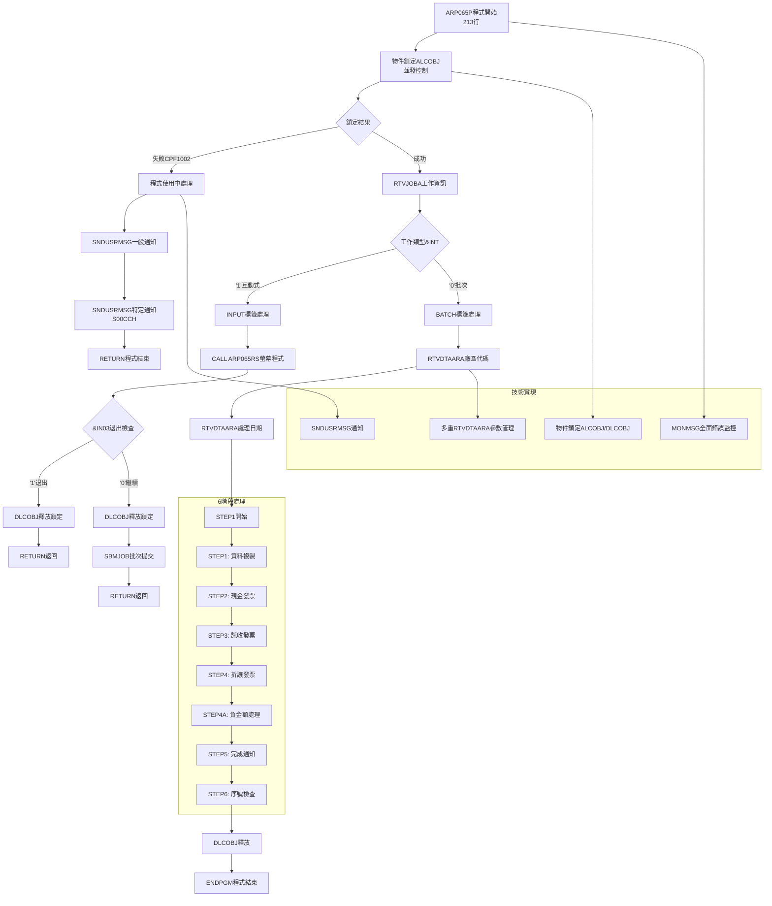
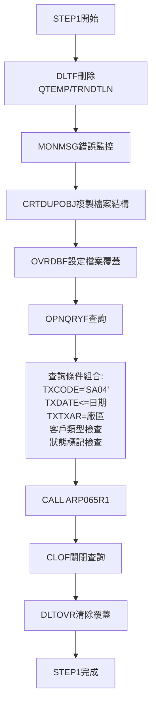
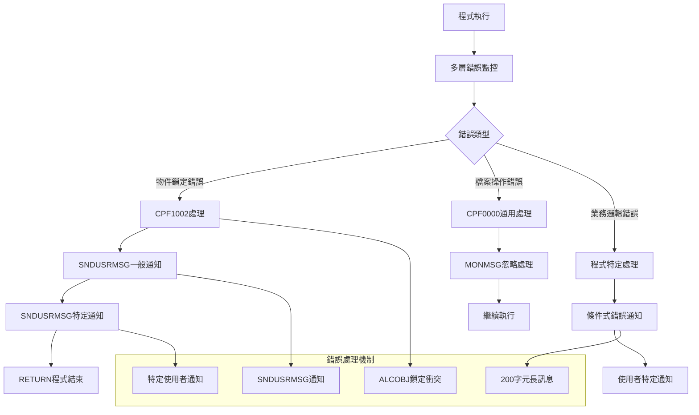

# ARP065P_P02 程式規格書

## 1. 基本資料

| 項目 | 內容 |
|------|------|
| 程式編號 | ARP065P |
| 程式名稱 | 發票列印開立作業系統 |
| 程式類型 | CLP (Control Language Program) |
| 廠區 | P02 |
| 系統名稱 | 應收帳款管理系統 (AR) |
| 子系統 | 發票開立管理子系統 |
| 檔案位置 | P02CLSRC_THSRC/ARP065P.txt |


## 2. 程式功能說明

### 2.1 主要功能描述
ARP065P 為發票列印開立作業系統。系統提供發票開立流程，包含互動式參數設定、6階段批次處理、多種發票類型處理、稅額計算、以及錯誤處理和通知機制。

### 2.2 核心業務功能

#### 2.2.1 主要功能
1. **物件鎖定機制**
   - ALCOBJ/DLCOBJ程式鎖定
   - 防止多重執行的並發控制
   - 使用者通知機制

2. **6階段批次處理**
   - STEP1: 複製客戶發票資料 (TRNDTL→TRNDTLN)
   - STEP2: 開立現金發票 (方法00)
   - STEP3: 開立託收發票 (方法01) 
   - STEP4: 開立折讓發票 (AR05類型)
   - STEP4A: 處理TRNDTL負金額交易
   - STEP5: 發送作業完成通知
   - STEP6: 檢查發票序號重複並通知

3. **發票類型處理**
   - 現金發票 (TNMTHD='00')
   - 託收發票 (TNMTHD='01')
   - 折讓發票 (TXCODE='AR05')
   - 負金額處理發票

4. **查詢和篩選邏輯**
   - 多條件組合的OPNQRYF動態查詢
   - 日期和狀態篩選
   - 客戶類型和交易狀態檢查

#### 2.2.2 發票開立業務邏輯
1. **資料準備階段 (STEP1)**
   - 從TRNDTL交易檔複製符合條件的記錄
   - 篩選SA04交易代碼的未處理記錄
   - 建立QTEMP/TRNDTLN工作檔案

2. **發票開立階段 (STEP2-4)**
   - 按不同方法分類處理發票
   - 呼叫專用報表程式產生發票
   - 更新交易記錄狀態

3. **後處理階段 (STEP4A-6)**
   - 處理特殊交易記錄
   - 發送完成通知給使用者
   - 檢查發票序號重複性


### 2.3 核心系統架構

#### 2.3.1 系統架構
```
ARP065P系統架構:

ARP065P (CLP主控程式 - 213行)
    ├── ARP065RS (RPG螢幕程式 - 276行) - 參數輸入
    ├── ARP065R1 (RPG報表程式 - 270行) - STEP1資料準備
    ├── ARP065R2 (RPG報表程式 - 1062行) - STEP2現金發票
    ├── ARP065R3 (RPG報表程式) - STEP3託收發票  
    ├── ARP065R4 (RPG報表程式) - STEP4折讓發票
    ├── ARP065R5 (RPG報表程式) - STEP4A特殊處理
    └── ARP002RV (RPG檢查程式) - STEP6序號檢查

主要資料檔案:
    ├── TRNDTL (交易主檔) - 核心業務資料
    ├── TRNDTLN (交易工作檔) - 臨時處理檔案
    ├── INVMST (發票主檔) - 發票記錄
    ├── INVDTL (發票明細檔) - 發票明細
    └── 其他輔助檔案群

總系統規模: 2000+行代碼
```

#### 2.3.2 6階段處理流程
```
發票開立流程:
1. 互動式參數輸入 (ARP065RS)
2. 物件鎖定和環境準備
3. STEP1: 資料複製和篩選 (ARP065R1)
4. STEP2: 現金發票開立 (ARP065R2) 
5. STEP3: 託收發票開立 (ARP065R3)
6. STEP4: 折讓發票開立 (ARP065R4)
7. STEP4A: 負金額交易處理 (ARP065R5)
8. STEP5: 完成通知發送
9. STEP6: 序號重複檢查 (ARP002RV)
10. 鎖定釋放和程式結束
```


- **多重安全控制**: 物件鎖定和並發控制機制

## 3. 檔案架構與關聯圖

```mermaid
graph TD
    A[ARP065P 主控程式<br/>213行] --> B[物件鎖定檢查<br/>ALCOBJ防重複執行]
    
    B --> C{鎖定狀態}
    C -->|鎖定失敗| D[發送使用中訊息]
    C -->|鎖定成功| E[工作類型判斷]
    
    D --> F[通知一般使用者]
    F --> G[通知特定使用者S00CCH]
    G --> H[RETURN程式結束]
    
    E --> I{工作類型}
    I -->|互動式 '1'| J[互動式參數輸入]
    I -->|批次 '0'| K[直接批次處理]
    
    J --> L[CALL ARP065RS螢幕程式]
    L --> M{使用者選擇}
    M -->|F3/F12退出| N[DLCOBJ釋放鎖定]
    M -->|確認執行| O[DLCOBJ釋放鎖定]
    
    N --> P[RETURN返回]
    O --> Q[SBMJOB批次提交]
    Q --> R[互動式結束]
    
    K --> S[LDA參數取得]
    S --> T[STEP1: 資料複製]
    
    T --> U[DLTF刪除工作檔]
    U --> V[CRTDUPOBJ複製檔案結構]
    V --> W[OVRDBF檔案覆蓋設定]
    W --> X[OPNQRYF查詢<br/>SA04+日期+狀態篩選]
    X --> Y[CALL ARP065R1資料處理]
    Y --> Z[CLOF關閉查詢]
    Z --> AA[DLTOVR清除覆蓋]
    
    AA --> BB[STEP2: 現金發票開立]
    BB --> CC[OVRDBF檔案設定]
    CC --> DD[OPNQRYF查詢TNMTHD=00]
    DD --> EE[OVRPRTF報表設定]
    EE --> FF[CALL ARP065R2現金發票]
    FF --> GG[清除設定]
    
    GG --> HH[STEP3: 託收發票開立]
    HH --> II[OPNQRYF查詢TNMTHD=01]
    II --> JJ[CALL ARP065R3託收發票]
    JJ --> KK[清除設定]
    
    KK --> LL[STEP4: 折讓發票開立]
    LL --> MM[OPNQRYF查詢AR05類型]
    MM --> NN[CALL ARP065R4折讓發票]
    NN --> OO[清除設定]
    
    OO --> PP[STEP4A: 負金額處理]
    PP --> QQ[CPYF複製負金額記錄]
    QQ --> RR[CALL ARP065R5特殊處理]
    RR --> SS[清除設定]
    
    SS --> TT[STEP5: 完成通知]
    TT --> UU[LDA取得發票號碼]
    UU --> VV[CHGVAR組合通知訊息]
    VV --> WW[SNDMSG發送通知]
    
    WW --> XX[STEP6: 序號檢查]
    XX --> YY[CALL ARP002RV檢查程式]
    YY --> ZZ[檢查結果處理]
    ZZ --> AAA[條件式錯誤通知]
    
    AAA --> BBB[DLCOBJ釋放鎖定]
    BBB --> CCC[ENDPGM程式結束]
    

    
    %% 子程式系統群
    subgraph ARP065程式系統群
        JJJ[ARP065RS 螢幕程式 276行]
        KKK[ARP065R1 資料準備 270行]
        LLL[ARP065R2 現金發票 1062行]
        MMM[ARP065R3 託收發票]
        NNN[ARP065R4 折讓發票]
        OOO[ARP065R5 特殊處理]
        PPP[ARP002RV 序號檢查]
    end
    
    L --> JJJ
    Y --> KKK
    FF --> LLL
    JJ --> MMM
    NN --> NNN
    RR --> OOO
    YY --> PPP
    
    %% 資料檔案系統
    subgraph 資料檔案系統
        QQQ[TRNDTL 交易主檔]
        RRR[TRNDTLN 工作檔案]
        SSS[INVMST 發票主檔]
        TTT[INVDTL 發票明細檔]
        UUU[其他輔助檔案群]
    end
    
    X --> QQQ
    V --> RRR
    FF --> SSS
    FF --> TTT
    A --> UUU
    

 ```

## 4. 螢幕規格說明

### 4.1 螢幕系統架構 (ARP065RS)

#### 4.1.1 螢幕程式
ARP065RS為276行RPG螢幕程式，提供發票開立作業的參數設定和控制介面。程式包含參數驗證邏輯和操作模式。

#### 4.1.2 主要螢幕功能
- **參數輸入**: 開立範圍和日期設定
- **模式選擇**: 不同發票開立方式選擇
- **狀態顯示**: 目前處理狀態和進度
- **錯誤處理**: 輸入驗證和錯誤提示

## 5. 報表規格說明

### 5.1 多重報表系統架構

#### 5.1.1 報表程式群組
| 程式編號 | 程式規模 | 處理功能 |
|----------|----------|----------|
| ARP065R1 | 270行 | 資料準備和篩選 |
| ARP065R2 | 1062行 | 現金發票開立 |
| ARP065R3 | 大型 | 託收發票開立 |
| ARP065R4 | 大型 | 折讓發票開立 |
| ARP065R5 | 中型 | 特殊交易處理 |

#### 5.1.2 ARP065R2 報表程式
程式特性:
- **稅額計算**: 多種稅率和計算方式
- **多格式發票**: 支援不同發票格式
- **匯率處理**: 外幣發票的匯率換算
- **折扣計算**: 折扣和優惠計算

## 6. 檔案欄位規格說明

### 6.1 主要變數結構分析

#### 6.1.1 CLP變數定義
```
CLP變數宣告:
DCL VAR(&INT) TYPE(*CHAR) LEN(1)      - 工作類型變數
DCL VAR(&OUTQ) TYPE(*CHAR) LEN(10)    - 輸出佇列變數
DCL VAR(&USER) TYPE(*CHAR) LEN(10)    - 使用者名稱變數
DCL VAR(&IN03) TYPE(*LGL) LEN(1)      - 邏輯變數

專用工作變數:
DCL VAR(&W#DATE) TYPE(*CHAR) LEN(8)   - 處理日期變數
DCL VAR(&W#AREA) TYPE(*CHAR) LEN(1)   - 廠區代碼變數
DCL VAR(&W#RTNV) TYPE(*CHAR) LEN(1)   - 回傳值變數
DCL VAR(&W#IVNO) TYPE(*CHAR) LEN(8)   - 發票號碼變數
DCL VAR(&W#MSGT) TYPE(*CHAR) LEN(200) - 長訊息變數

變數特性:
- 10個變數宣告
- 200字元訊息變數
- 邏輯變數應用
- 變數命名規範
```

#### 6.1.2 LDA資料區深度應用
```
LDA資料區配置:
位置1: 廠區代碼 (GEPRIN)
位置11-18: 處理日期 (8字元)
位置31-38: 現金發票號碼 (8字元)
位置41-48: 託收發票號碼 (8字元)  
位置51-58: 折讓發票號碼 (8字元)

跨程式參數傳遞:
- ARP065P → ARP065RS: 輸入參數
- ARP065R1-R5 ← LDA: 處理參數
- ARP002RV ← LDA: 檢查參數

LDA管理:
- 多個發票號碼位置
- 狀態標記位置
- 錯誤代碼位置
- 5個程式的參數協調
```

## 7. 處理流程程序說明

### 7.1 主程式流程



### 7.2 STEP1-6 處理流程

#### 7.2.1 STEP1: 資料複製處理


#### 7.2.2 STEP2-4: 發票開立處理
```
三階段發票開立:

STEP2: 現金發票 (TNMTHD='00')
- OVRDBF檔案設定
- OPNQRYF查詢條件='00'  
- OVRPRTF報表設定 (CPI=15)
- CALL ARP065R2 (1062行程式)

STEP3: 託收發票 (TNMTHD='01')  
- 查詢條件='01'
- 按訂單號碼排序
- CALL ARP065R3

STEP4: 折讓發票 (TXCODE='AR05')
- AR05條件篩選
- MAPFLD字串擷取
- CALL ARP065R4
```

#### 7.2.3 STEP4A-6: 後處理階段
```
後處理邏輯:

STEP4A: 負金額交易處理
- CPYF複製負金額記錄
- INCREL條件
- CALL ARP065R5

STEP5: 多重通知處理
- 3次RTVDTAARA取得發票號碼
- CHGVAR組合200字元長訊息
- SNDMSG發送給啟動使用者

STEP6: 發票序號檢查
- CALL ARP002RV檢查程式
- 2次條件檢查處理
- 條件式錯誤通知
```

## 8. 子程序處理邏輯說明

### 8.1 子程式系統

#### 8.1.1 ARP065RS螢幕程式 (276行)
功能: 參數輸入和控制介面
```
螢幕程式邏輯:
1. 參數設定
2. 輸入驗證
3. 序號管理功能
4. 狀態顯示控制
5. 錯誤處理

技術實現:
- 276行螢幕程式
- WORKSTN檔案處理
- UDS使用者資料結構
- 控制邏輯
- 互動設計
```

#### 8.1.2 ARP065R2報表程式 (1062行)
功能: 現金發票開立的處理引擎
```
程式特性:
1. 稅額計算引擎
2. 多種發票格式支援
3. 匯率換算處理
4. 折扣和優惠計算
5. 多檔案協調處理

技術特性:
- 1000+行程式
- 計算邏輯
- 多檔案讀寫協調
- 業務規則
- 錯誤處理
```

#### 8.1.3 ARP002RV序號檢查程式
**功能**: 發票序號重複性檢查和通知
```
序號檢查邏輯:
1. 發票序號重複檢查
2. 多條件驗證處理
3. LDA狀態設定
4. 條件式錯誤通知

回傳值處理:
- LDA位置1: 第一種檢查結果
- LDA位置2: 第二種檢查結果  
- LDA位置3-10: 相關發票號碼
- LDA位置11-18: 相關發票號碼
```

## 9. 錯誤處理程序說明與訊息清冊

### 9.1 錯誤處理架構



### 9.2 錯誤處理機制清冊

#### 9.2.1 物件鎖定錯誤處理
| 錯誤代碼 | 錯誤描述 | 處理方式 | 通知對象 |
|----------|----------|----------|----------|
| CPF1002 | 物件已被鎖定 | SNDUSRMSG通知 | 一般使用者 |
| CPF1002 | 物件已被鎖定 | SNDUSRMSG專用通知 | S00CCH |

#### 9.2.2 檔案操作錯誤處理
| 錯誤階段 | 錯誤監控 | 處理方式 | 影響範圍 |
|----------|----------|----------|----------|
| DLTF檔案刪除 | MONMSG CPF0000 | 忽略繼續 | 無影響 |
| OPNQRYF查詢 | 內建處理 | 自動處理 | 該階段 |
| 報表程式呼叫 | 程式內處理 | 錯誤記錄 | 該發票類型 |

#### 9.2.3 序號檢查錯誤處理
| 檢查結果 | LDA位置 | 錯誤訊息 | 處理方式 |
|----------|---------|----------|----------|
| 第一種重複 | LDA(1,1)='T' | 十碼發票重複通知 | 使用者訊息 |
| 第二種重複 | LDA(2,1)='T' | 二聯發票重複通知 | 使用者訊息 |

## 10. 特殊技術實現說明

### 10.1 物件鎖定技術

#### 10.1.1 ALCOBJ/DLCOBJ並發控制
功能: 程式鎖定機制

```
物件鎖定技術分析:
1. 鎖定請求:
   ALCOBJ OBJ((*LIBL/ARP065P *PGM *EXCLRD)) WAIT(0)
   - 程式專用排他鎖定
   - WAIT(0)非等待模式
   - *LIBL庫列表搜尋

2. 鎖定失敗處理:
   MONMSG MSGID(CPF1002) EXEC(DO)
   - 專用錯誤代碼監控
   - 執行通知程序

3. 鎖定釋放:
   DLCOBJ OBJ((*LIBL/ARP065P *PGM *EXCLRD))
   - 多處釋放點
   - 完全釋放

並發控制功能:
- 防止程式重複執行
- 資料一致性
- 並發控制
- 並發技術
```

#### 10.1.2 SNDUSRMSG通知機制

```
通知機制:
1. 一般使用者通知:
   SNDUSRMSG MSG('**發票列印開立作業目前在使用中，無法執行作業!!')
   - MSGTYPE(*INFO)資訊型訊息
   - 中文錯誤說明

2. 特定使用者通知:
   SNDUSRMSG ... TOUSR(S00CCH)
   - 管理者通知
   - 包含程式編號資訊
   - 監控機制

3. 200字元訊息:
   DCL VAR(&W#MSGT) TYPE(*CHAR) LEN(200)
   - 訊息組合
   - 發票號碼資訊
   - 訊息管理
```

### 10.2 6階段批次處理技術

#### 10.2.1 STEP1-4查詢技術
功能: OPNQRYF動態查詢

```
查詢技術:
1. STEP1查詢 (SA04交易):
   QRYSLT('TXCODE *EQ "SA04" *AND
           TXDATE *LE ' || &W#DATE || ' *AND
           TXTXAR *EQ "' || &W#AREA || '" *AND
           %SST(TXCUNO 1 1) *NE "E" *AND
           TXFLAG *NE "D" *AND
           TXFL02 *EQ " " *AND
           TXIVNO *EQ " "')
   
2. STEP4查詢 (AR05折讓):
   QRYSLT('TXCODE *EQ "AR05" *AND ... *AND
           CHAR *NE "D"')
   MAPFLD((CHAR '%SST(TXRESV 15 1)' *CHAR 1))

3. 技術實現:
   - 多條件AND邏輯組合
   - 字串變數嵌入
   - %SST字串擷取函數
   - MAPFLD欄位對應
   - 排序控制
```

#### 10.2.2 STEP4A CPYF檔案複製

```
CPYF條件設定:
CPYF FROMFILE(DALIB/TRNDTL) TOFILE(DALIB/TRNDTLX)
     MBROPT(*REPLACE)
     INCREL((*IF TXAMT *LE 0)
            (*AND TXCODE *EQ 'SA04')
            (*AND TXIVNO *NE '#         ')
            (*AND TXDATE *GE 880101)
            (*AND TXIVNO *NE '          '))
     FMTOPT(*NOCHK)

技術實現:
- INCREL條件組合
- 負金額條件檢查
- 特殊字符排除
- 日期範圍檢查
- FMTOPT格式檢查關閉
```

## 11. 使用說明

### 11.1 作業前準備

#### 11.1.1 環境確認
```
系統必要條件:
1. 確認所有子程式存在且可執行:
   - ARP065RS (螢幕程式)
   - ARP065R1-R5 (報表程式群)
   - ARP002RV (檢查程式)

2. 確認資料檔案:
   - TRNDTL (交易主檔)
   - INVMST/INVDTL (發票檔案)
   - 其他輔助檔案群

3. 確認權限和環境:
   - 物件鎖定權限
   - QTEMP使用權限
   - 報表輸出權限
   - LDA讀寫權限

4. 確認系統資源:
   - 充足的QTEMP空間
   - 報表輸出空間
   - 足夠的系統記憶體
```

### 11.2 操作流程說明

#### 11.2.1 操作程序
```
系統操作:
1. 程式啟動:
   執行命令: CALL ARP065P
   
2. 物件鎖定檢查:
   - 系統自動檢查程式是否在使用中
   - 如有衝突會自動通知並結束

3. 參數設定 (互動式):
   - 透過ARP065RS設定處理參數
   - 選擇處理範圍和方式
   - 確認執行或取消

4. 6階段自動處理:
   - STEP1: 資料準備 (約5-10分鐘)
   - STEP2-4: 發票開立 (約20-30分鐘)
   - STEP4A-6: 後處理 (約5-10分鐘)

5. 結果確認:
   - 接收完成通知訊息
   - 檢查報表輸出
   - 確認發票開立結果

注意事項:
- 整個處理時間可能需要30-60分鐘
- 處理期間請勿重複執行
- 如有錯誤會自動通知
```

---

## 12. 備註

### 特殊注意事項

1. **物件鎖定機制**：
   - ALCOBJ/DLCOBJ程式鎖定控制
   - WAIT(0)非等待鎖定技術
   - 防止多重執行並發問題

2. **6階段批次處理**：
   - STEP1: 資料複製(TRNDTL→TRNDTLN)
   - STEP2-4: 發票開立處理
   - STEP4A: 負金額交易處理
   - STEP5-6: 完成通知和檢查

3. **多檔案協調處理**：
   - OVRDBF檔案覆蓋設定
   - OPNQRYF動態查詢技術
   - SHARE(*YES)檔案共享管理

4. **LDA資料區應用**：
   - 多位置參數管理
   - 跨程式狀態傳遞
   - 發票號碼動態管理

5. **錯誤處理機制**：
   - MONMSG錯誤監控
   - SNDUSRMSG通知機制
   - 特定使用者(S00CCH)通知

6. **發票類型處理**：
   - 現金發票(TNMTHD='00')
   - 託收發票(TNMTHD='01')
   - 折讓發票(TXCODE='AR05')
   - 負金額處理發票

7. **P02廠區程式架構**：
   - 213行CLP主控程式
   - 八元件系統架構
   - 2000+行代碼 