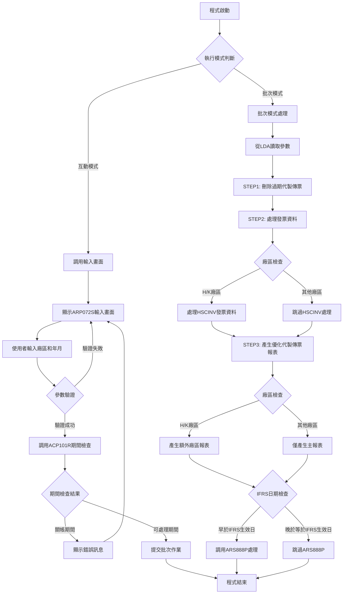
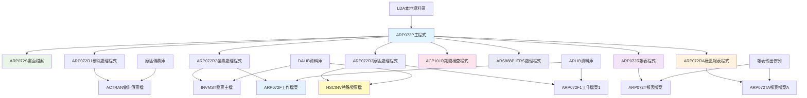
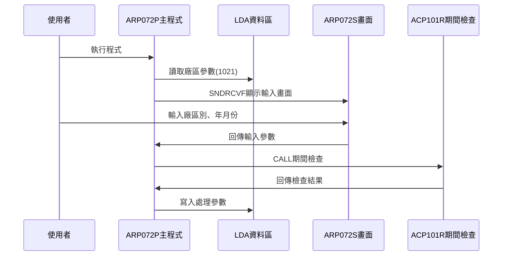
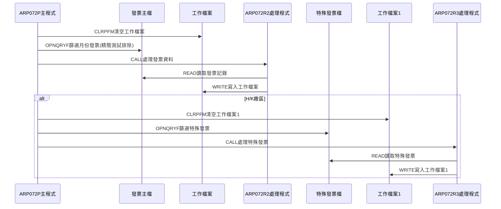
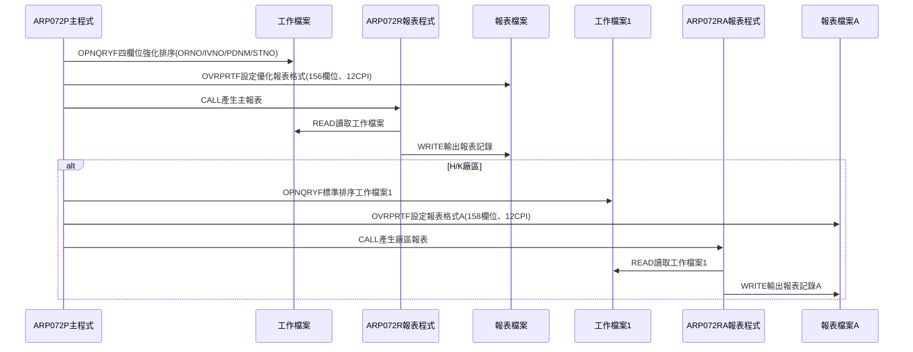
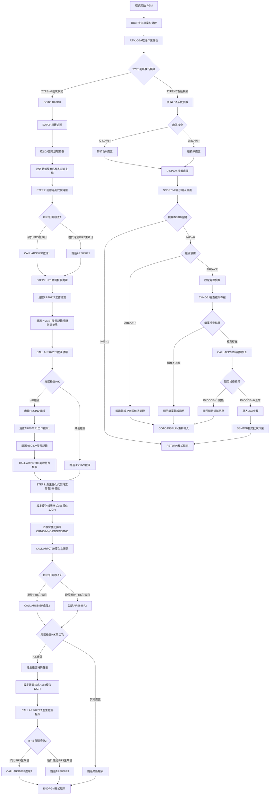

# ARP072P_U01 程式規格書

## 1. 基本資料

| 項目 | 內容 |
|------|------|
| **程式編號** | ARP072P |
| **程式名稱** | 應收帳款代製傳票報表作業 |
| **程式類型** | CLP |
| **廠區** | U01 |
| **系統名稱** | 應收帳款系統 |
| **子系統** | 應收帳款代製傳票報表處理 |
| **檔案位置** | U01CLSRC_THSRC/ARP072P.txt |

## 2. 🎯 程式功能說明

### 主要功能描述
此程式為應收帳款代製傳票報表控制程式，用於產生應收帳款代製傳票的統計報表。程式提供互動式參數輸入及批次處理兩種執行模式，透過期間檢查確保關帳期間的資料完整性，並執行完整的代製傳票報表處理，包括刪除過期代製傳票記錄、處理發票資料、產生代製傳票統計報表等作業。U01版本作為精簡高效的生產環境版本，具有優化的報表格式和強化的排序功能。

### 🎯 業務流程詳細說明

#### 完整業務流程圖


#### 業務流程關鍵階段說明

**第一階段：執行模式識別與參數收集**
- 透過RTVJOBA檢查執行環境類型(批次或互動)
- 互動模式時從LDA讀取系統參數和廠區資訊
- 特殊處理：P廠區自動轉換為M廠區處理
- 收集代製傳票年月和廠區別資訊

**第二階段：期間控制與檔案檢查**
- 調用ACP101R程式檢查指定年月份是否已關帳
- 檢查對應廠區的會計傳票檔案是否存在
- 防止在關帳期間進行資料異動
- 確保會計期間的資料完整性

**第三階段：STEP1 - 刪除過期代製傳票處理**
- 設定會計傳票檔案覆蓋到指定廠區檔案
- 使用OPNQRYF篩選P00001-P00499範圍的代製傳票
- 調用ARP072R1程式刪除過期的代製傳票記錄
- 清理過期資料確保報表準確性

**第四階段：STEP2 - U01精簡發票資料處理**
- 清空ARP072F工作檔案準備數據處理
- 使用OPNQRYF篩選指定月份的發票記錄
- 排除基本測試發票號碼(精簡列表)
- 調用ARP072R2程式處理發票資料轉換

**第五階段：H/K廠區HSCINV特殊處理**
- H廠區和K廠區需要處理HSCINV發票資料
- 清空ARP072F1工作檔案進行額外處理
- 使用OPNQRYF篩選HSCINV相關記錄
- 調用ARP072R3程式處理廠區特殊發票資料

**第六階段：STEP3 - 產生優化代製傳票報表**
- 設定優化報表輸出檔案和格式參數(156欄位寬度、12CPI)
- 按訂單號、發票號、產品名稱、店號四欄位排序
- 調用ARP072R程式產生主要統計報表
- 產生"廠內代製"的統計資料

**第七階段：廠區特殊報表處理**
- H廠區和K廠區產生額外的"廠外代製"報表
- 設定報表格式(158欄位寬度、12CPI)
- 調用ARP072RA程式產生廠區特殊報表
- 使用ARP072F1工作檔案數據

**第八階段：IFRS相關處理與完成**
- 檢查處理年月是否早於IFRS生效日期
- 若早於IFRS生效日則調用ARS888P進行額外處理
- 從LDA讀取憑證號碼範圍進行IFRS處理
- 清理檔案覆蓋並結束程式

#### 🎯 U01版本精簡高效特色
- **精簡測試資料排除**：僅包含基本必要的測試發票排除
- **優化報表格式**：使用156欄位寬度、12CPI提升版面利用率
- **強化排序功能**：新增A1STNO店號欄位排序
- **簡潔版本控制**：僅3個主要版本更新，專注核心功能

#### 多層次驗證機制
- **廠區權限驗證**：確保只處理授權廠區的資料
- **期間控制驗證**：透過ACP101R程式檢查會計期間狀態
- **檔案存在性檢查**：確認會計傳票檔案可正常存取
- **日期範圍驗證**：確保年月份格式正確

#### 智能處理邏輯
- 自動判斷廠區類型並採用相應的處理流程
- 動態產生檔案名稱和成員名稱
- 智能識別IFRS生效日期並執行對應處理
- 自動排除必要的測試發票號碼

#### 資料一致性確保機制
- 透過檔案覆蓋確保存取正確的資料檔案
- 使用工作檔案技術避免影響原始發票檔案
- 分階段處理確保各步驟資料同步
- 記錄詳細的處理軌跡供後續查核

#### U01版本精簡高效設計理念
- **核心功能專注**：專注於基本必要功能，避免冗餘
- **效能優化**：使用優化的報表格式和排序方式
- **維護簡便**：簡化的版本更新歷程便於維護
- **生產環境適配**：專為生產環境的穩定運行設計

## 3. 🎯 檔案架構與關聯圖

### 使用檔案清單

| 檔案名稱 | 檔案類型 | 使用方式 | 說明 |
|----------|----------|----------|------|
| **ARP072S** | DSPF | CF/COMBINED | 代製傳票報表輸入畫面檔案 |
| **ACTRAN** | 邏輯檔 | O/OUTPUT | 會計傳票檔案(動態對應廠區) |
| **INVMST** | 邏輯檔 | IF/INPUT | 發票主檔 |
| **HSCINV** | 邏輯檔 | IF/INPUT | 特殊發票檔案(H/K廠區) |
| **ARP072F** | 物理檔 | IP/INPUT | 代製傳票工作檔案 |
| **ARP072F1** | 物理檔 | IF/INPUT | 代製傳票工作檔案1(H/K廠區) |
| **ARP072T** | 報表檔 | O/OUTPUT | 代製傳票統計報表檔案 |
| **ARP072TA** | 報表檔 | O/OUTPUT | 代製傳票統計報表檔案A(H/K廠區) |

### 🎯 檔案關聯詳細視覺化圖表



### 🎯 U01版本特殊資料流向說明

#### 環境準備階段的資料流向


#### U01精簡發票處理階段的資料流向


#### U01優化報表產生階段的資料流向


## 4. 🎯 檔案欄位規格說明

### 主要資料結構

#### LDA本地資料區結構(U01版本)
| 位置 | 長度 | 欄位名稱 | 用途說明 |
|------|------|----------|----------|
| 1-6 | 6 | 年月份 | 代製傳票處理年月(YYYYMM) |
| 5-6 | 2 | 月份 | 處理月份(MM) |
| 7 | 1 | 廠區代號 | 處理廠區別(M/K/H/L/T/U) |
| 201-206 | 6 | 憑證號起 | IFRS處理用憑證號範圍起始 |
| 211-216 | 6 | 憑證號迄 | IFRS處理用憑證號範圍結束 |
| 951-985 | 35 | 公司名稱 | 系統公司名稱 |
| 1011-1020 | 10 | 設備代號 | 工作站設備代號 |
| 1021 | 1 | 區域代號 | 執行區域別 |

### 🔍 重點欄位切割技術詳解

#### DS結構完整分析
程式中使用RTVDTAARA指令讀取LDA的不同位置，形成欄位切割效果：

**LDA切割視覺化展示**：
```
LDA資料區 (1024字元)：[1-6|5-6|7|201-206|211-216|951-985|1011-1020|1021]
                       ↓   ↓   ↓   ↓       ↓       ↓       ↓        ↓
年月份(6字元)：        [YYYYMM]                              代製傳票年月
月份(2字元)：            [MM]                                月份成員名稱
廠區代號(1字元)：          [X]                               廠區識別
憑證號起(6字元)：            [PXXXXX]                        IFRS處理起始憑證
憑證號迄(6字元)：                    [PXXXXX]                IFRS處理結束憑證
公司名稱(35字元)：                           [35字元公司名稱]   系統識別
設備代號(10字元)：                                  [10字元設備]  終端識別
區域代號(1字元)：                                           [X]  區域識別
```

#### 切割邏輯詳細說明

**YYMM年月份切割邏輯**：
```
互動模式寫入：
CHGDTAARA DTAARA(*LDA (1 6)) VALUE(&YYMM)

批次模式讀取：
RTVDTAARA DTAARA(*LDA (1 6)) RTNVAR(&YYMM)
RTVDTAARA DTAARA(*LDA (1 4)) RTNVAR(&YY)
RTVDTAARA DTAARA(*LDA (5 2)) RTNVAR(&MM)

切割效果：
&YYMM = '202412' → 完整年月
&YY   = '2024'   → 年度部分(位置1-4)
&MM   = '12'     → 月份部分(位置5-6)
```

#### 實際數據範例說明

**範例1：代製傳票參數處理**
```
輸入：&S#YYMM = '202412', &S#AREA = 'U'
LDA寫入：
- CHGDTAARA DTAARA(*LDA (1 6)) VALUE('202412')
- CHGDTAARA DTAARA(*LDA (7 1)) VALUE('U')
讀取結果：
- &YYMM = '202412'
- &YY = '2024'
- &MM = '12'
- &AREA = 'U'
```

**範例2：動態檔案名稱產生**
```
&AREA = 'U'
&FNAME = 'AC' || &AREA || 'R' = 'ACUR'
&MNAME = 'VR' || &MM = 'VR12'
```

**範例3：U01版本廠區映射邏輯**
```
廠區映射處理：
IF COND(&AREA *EQ 'P') THEN(DO)
    CHGVAR VAR(&AREA) VALUE('M')
ENDDO

P廠區自動映射為M廠區處理
```

**範例4：ARIFRSCTL資料區讀取**
```
RTVDTAARA DTAARA(ARIFRSCTL (1 6)) RTNVAR(&IFRSD)
讀取IFRS生效年月控制資訊
```

### 🎯 欄位挪用詳細分析

#### 挪用情況對比表
| 欄位位置 | 原始定義 | 實際使用方式 | 挪用說明 |
|----------|----------|-------------|----------|
| LDA 1-6 | 標準處理參數位置1-6 | 代製傳票年月參數 | 標準LDA參數空間使用 |
| LDA 7 | 標準處理參數位置7 | 代製傳票廠區參數 | 標準LDA參數空間使用 |
| LDA 201-206 | 未定義用途 | IFRS憑證號起始範圍 | IFRS處理專用參數 |
| LDA 211-216 | 未定義用途 | IFRS憑證號結束範圍 | IFRS處理專用參數 |
| ARIFRSCTL資料區 | IFRS控制資料區 | IFRS生效日期控制 | U01版本IFRS日期管理 |
| D#VNO1變數 | 一般憑證號變數 | 代製傳票起始號'P00001' | 固定代製傳票範圍起始 |
| D#VNO2變數 | 一般憑證號變數 | 代製傳票結束號'P00499' | 固定代製傳票範圍結束 |

#### 挪用原因深度分析

**位置1-7的標準參數使用**：
- **原因**：U01版本使用標準的LDA參數空間
- **需求**：遵循AS/400系統標準的參數傳遞規範
- **實現**：使用LDA的1-7位置作為標準程式參數區域

**位置201-216的IFRS處理參數**：
- **原因**：IFRS國際財務報告準則要求特殊憑證範圍處理
- **需求**：彈性控制IFRS處理的憑證號碼範圍
- **實現**：使用LDA的201-206和211-216位置存放憑證範圍

**D#VNO1/D#VNO2變數的代製傳票範圍挪用**：
- **原因**：代製傳票需要固定的憑證編號範圍P00001-P00499
- **需求**：確保代製傳票與其他傳票類型的編號區隔
- **實現**：固定設定代製傳票專用範圍，區別於催收傳票範圍

**ARIFRSCTL資料區的U01版本IFRS控制**：
- **原因**：U01版本需要獨立的IFRS控制機制
- **需求**：統一的IFRS生效日期管理
- **實現**：透過ARIFRSCTL資料區第1-6位置讀取IFRS生效年月

#### 挪用方式詳細說明

**代製參數標準實現**：
```
寫入代製參數：
CHGDTAARA DTAARA(*LDA (1 6)) VALUE(&YYMM)
CHGDTAARA DTAARA(*LDA (7 1)) VALUE(&AREA)

讀取代製參數：
RTVDTAARA DTAARA(*LDA (1 6)) RTNVAR(&YYMM)
RTVDTAARA DTAARA(*LDA (7 1)) RTNVAR(&AREA)
```

**IFRS參數挪用實現**：
```
讀取IFRS控制資料：
RTVDTAARA DTAARA(ARIFRSCTL (1 6)) RTNVAR(&IFRSD)

讀取IFRS憑證範圍：
RTVDTAARA DTAARA(*LDA (201 6)) RTNVAR(&D#VNO1)
RTVDTAARA DTAARA(*LDA (211 6)) RTNVAR(&D#VNO2)
```

**代製傳票範圍固定設定**：
```
設定代製傳票範圍：
CHGVAR VAR(&D#VNO1) VALUE('P00001')
CHGVAR VAR(&D#VNO2) VALUE('P00499')
功能：固定代製傳票編號範圍，區別於其他傳票類型
```

**U01版本廠區映射邏輯**：
```
廠區映射處理：
IF COND(&AREA *EQ 'P') THEN(DO)
    CHGVAR VAR(&AREA) VALUE('M')
ENDDO
功能：P廠區自動映射為M廠區處理
```

### 重要變數定義表

| 變數名稱 | 類型 | 長度 | 說明 | 使用範圍 |
|----------|------|------|------|----------|
| **&P#YYMM** | CHAR | 6 | 期間檢查用年月份 | ACP101R期間檢查參數 |
| **&P#CODE** | CHAR | 1 | 期間檢查結果代碼 | '1'=關帳期間, '0'=可處理 |
| **&INT** | CHAR | 1 | 執行模式識別碼 | '0'=批次模式, 其他=互動模式 |
| **&OUTQ** | CHAR | 10 | 輸出佇列名稱 | 批次作業輸出佇列控制 |
| **&USER** | CHAR | 10 | 使用者識別碼 | 系統使用者資訊 |
| **&IN03** | LGL | 1 | 功能鍵指示器 | F3功能鍵控制 |
| **&AREA** | CHAR | 1 | 廠區代號 | M/K/H/L/T/U廠區識別(P映射為M) |
| **&YYMM** | CHAR | 6 | 處理年月份 | 代製傳票處理年月(YYYYMM) |
| **&YY** | CHAR | 4 | 處理年度 | 年度部分(YYYY) |
| **&MM** | CHAR | 2 | 處理月份 | 月份部分(MM) |
| **&FNAME** | CHAR | 10 | 動態檔案名稱 | 會計傳票檔案名稱 |
| **&MNAME** | CHAR | 10 | 動態成員名稱 | 傳票檔案成員名稱 |
| **&C#SDAT** | CHAR | 8 | 開始日期 | 日期範圍控制起始(YYYYMMDD) |
| **&C#EDAT** | CHAR | 8 | 結束日期 | 日期範圍控制結束(YYYYMMDD) |
| **&D#VNO1** | CHAR | 6 | 憑證號範圍起始 | 代製傳票起始號'P00001' |
| **&D#VNO2** | CHAR | 6 | 憑證號範圍結束 | 代製傳票結束號'P00499' |
| **&IFRSD** | CHAR | 6 | IFRS生效年月 | U01版本IFRS生效日期控制 |

## 5. 🎯 輸出/入螢幕布局

### 螢幕布局完整視覺化

```
+------------------------------------------------------------------------------+
|                      發票及代製傳票報表作業                        ARP072S   |
|                                                                              |
|                                                                              |
|                                                                              |
|                                                                              |
|                      傳票廠區: [X] ( M:台鋼 K:祥鋼 H:東鋼                   |
|                                        L:龍昇 T:天津 U:新鋼)                |
|                                                                              |
|                      傳票年月: [______]                                     |
|                                                                              |
|                                                                              |
|              (此為月結作業，請務必於當月相關資料                            |
|               已建檔完成後才進行處理。)                                      |
|                                                                              |
|                                                                              |
|                                                                              |
|                                                                              |
|                                                                              |
|                                                                              |
|                                                                              |
|F3:離開                        ENTER:執行                                   |
|[錯誤訊息顯示區]                                                              |
+------------------------------------------------------------------------------+
```

### 🎯 畫面欄位詳細說明

| 欄位名稱 | 欄位屬性 | 位置 | 長度 | 輸入格式 | 驗證規則 | 說明 |
|----------|----------|------|------|----------|----------|------|
| **S#AREA** | 輸出 | 7,36 | 1 | 英文字元 | M/K/H/L/T/U | 傳票廠區代號 |
| **S#YYMM** | 輸入/輸出 | 10,36 | 6 | YYYYMM | 年月格式 | 傳票年月份 |
| **S#COMP** | 顯示 | 1,23 | 35 | 中文字元 | 唯讀 | 公司名稱顯示 |
| **S#DEVI** | 顯示 | 2,70 | 10 | 英數字元 | 唯讀 | 設備代號顯示 |
| **S#ERR** | 顯示 | 24,2 | 70 | 中文字元 | 唯讀 | 錯誤訊息顯示區 |

### 🎯 畫面控制邏輯

#### 指示器控制說明
- **IN03**: F3功能鍵，程式結束
- 無其他錯誤指示器，錯誤時直接顯示訊息

#### 欄位顯示屬性
- **S#AREA**: 從LDA讀取並顯示，P廠區自動轉換為M廠區
- **S#YYMM**: 使用EDTCDE(4)格式顯示為YYYY/MM
- **S#ERR**: 固定顯示為HI(高亮度)屬性

### 功能鍵詳細定義

| 功能鍵 | 處理邏輯 | 系統行為 | 說明 |
|--------|----------|----------|------|
| **F3** | 設定IN03='1' | 程式立即返回結束 | 離開程式不執行任何處理 |
| **ENTER** | 執行驗證與處理 | 驗證輸入後提交批次作業 | 執行主要報表產生邏輯 |

### 廠區代號說明
- **M**: 台鋼廠區
- **K**: 祥鋼廠區  
- **H**: 東鋼廠區
- **L**: 龍昇廠區
- **T**: 天津廠區
- **U**: 新鋼廠區(U01版本專用)

### 操作流程
1. 畫面顯示時自動載入系統參數和廠區資訊
2. 系統自動顯示對應的傳票廠區代號
3. 使用者輸入處理年月份(YYYYMM格式)
4. 按ENTER鍵進行驗證和期間檢查
5. 驗證通過後自動提交批次作業產生報表
6. 驗證失敗則顯示錯誤訊息並停留在輸入畫面

## 6. 🎯 處理流程程序說明

### 🎯 主程序邏輯深度分析

#### U01版本程式執行流程圖


#### 🎯 U01版本精簡高效特殊處理步驟分析

**步驟1-7：與其他版本相同的基礎處理流程**

**步驟8：U01版本精簡測試發票篩選處理**
- 排除基本測試發票：JW32774325、JW32774497
- U01精簡測試發票排除清單：
  * 基本排除：僅保留最核心的測試發票排除
  * 訂單號碼排除：M01744-M01767、M01781
- 確保生產環境資料的純淨性和處理效率

**步驟9：U01版本HSCINV檔案處理**
- 僅H/K廠區進行HSCINV特殊發票檔案處理
- 使用CDTE欄位進行日期篩選
- 排除C1FLAG='D'的作廢記錄
- 保持與P02版本相同的HSCINV處理邏輯

**步驟10：U01版本優化報表格式處理**
- 主報表格式：156欄位寬度、12CPI(優化格式)
- 廠區報表格式：158欄位寬度、12CPI
- **特色增強**：新增A1STNO店號欄位四欄位排序
- 提升報表資料的邏輯順序和可讀性

**步驟11-15：與其他版本相同的IFRS和結束處理**

#### 業務邏輯深度解析

**U01版本精簡高效的核心邏輯**：
1. 採用精簡測試資料排除機制確保處理效率
2. 使用優化報表格式提升版面利用率
3. 增強排序功能提升資料邏輯順序
4. 簡潔的版本控制便於維護管理

**U01版本安全控制機制**：
1. 期間控制防止關帳期間處理
2. 廠區權限控制確保資料安全
3. 檔案存在性檢查避免系統錯誤
4. IFRS規範支援確保合規性

#### 條件判斷詳細說明

**U01版本廠區處理判斷**：
- `COND((&AREA *EQ 'H') *OR (&AREA *EQ 'K'))` - 僅H/K廠區特殊處理
- 不支援N廠區的額外處理邏輯
- 需要處理HSCINV特殊發票資料
- 需要產生額外的廠區特殊報表

**U01版本精簡測試資料排除判斷**：
- 僅排除基本必要的測試發票號碼
- 專注於核心測試資料的識別和排除
- 確保正式報表的準確性
- 提升處理效率和系統效能

#### 變數使用和數據流向追蹤

**U01版本特殊變數軌跡**：
1. 精簡測試發票排除處理軌跡
2. HSCINV檔案處理的參數傳遞軌跡  
3. 優化報表格式的參數設定軌跡
4. 四欄位強化排序的變數追蹤軌跡

### 🎯 U01版本子程序邏輯分析

#### U01版本子程序與其他版本差異
- **ARP072R程式**：處理156欄位寬度的優化報表格式
- **ARP072R2程式**：精簡測試發票排除處理
- **ARP072R3程式**：處理HSCINV而非ARCINV檔案
- **其他程式**：功能基本相同但適應U01生產環境

### 🎯 U01版本精簡高效邏輯處理

#### U01版本發票記錄篩選條件
```sql
QRYSLT('(INDT *GE "' || &C#SDAT || '") *AND 
        (INDT *LE "' || &C#EDAT || '") *AND 
        (INNO *NE "JW32774325") *AND 
        (INNO *NE "JW32774497") *AND 
        (INORNO *NE "M01744") *AND 
        (INORNO *NE "M01762") *AND 
        ... (精簡測試訂單號碼) ...
        (INORNO *NE "M01781") *AND 
        (INDECD *NE "D")')
```
- 篩選指定月份內的發票記錄
- 排除基本必要的測試發票號碼
- 排除基本測試訂單號碼
- 排除已作廢的發票記錄

#### U01版本HSCINV特殊發票篩選條件
```sql
QRYSLT('(CDTE *GE "' || &C#SDAT || '") *AND 
        (CDTE *LE "' || &C#EDAT || '") *AND 
        (C1FLAG *NE "D")')
```
- 篩選指定月份的特殊發票記錄
- 使用CDTE欄位進行日期篩選
- 排除已作廢的特殊發票記錄
- H/K廠區特殊處理邏輯

#### U01版本優化報表格式設定
```sql
OVRPRTF FILE(ARP072T) TOFILE(ARP072T) 
        PAGESIZE(*N 156) CPI(12) HOLD(*YES) 
        USRDTA('廠內代製')
```
- 主報表使用156欄位寬度(優化格式)
- 使用12CPI字體(密集排版)
- 提供更佳的版面利用率

#### U01版本四欄位強化排序
```sql
OPNQRYF FILE(ARP072F) 
        KEYFLD((A1ORNO) (A1IVNO) (A1PDNM) (A1STNO))
```
- 按訂單號(A1ORNO)排序
- 按發票號(A1IVNO)排序
- 按產品名稱(A1PDNM)排序
- **U01特色**：新增店號(A1STNO)排序
- 提升報表資料的邏輯順序

#### U01版本精簡更新歷程
- 0006A版本：新增店號排序和報表格式優化
- 0012A版本：新增IFRS支援
- 0112A版本：強化IFRS生效年月控制

## 7. 🎯 數據操作與轉換分析

### U01版本檔案操作詳解

#### U01版本INVMST發票主檔操作
- **OPNQRYF操作**：篩選指定月份的發票記錄
- **精簡排除邏輯**：自動排除基本必要的測試發票
- **日期映射**：使用MAPFLD將ININDT映射為INDT
- **資料轉換**：透過ARP072R2轉換到工作檔案

#### U01版本HSCINV特殊發票檔操作
- **H/K廠區專用**：僅H/K廠區處理HSCINV檔案
- **OPNQRYF操作**：篩選對應日期的特殊發票記錄
- **日期映射**：使用MAPFLD將C1CDTE映射為CDTE
- **資料轉換**：透過ARP072R3轉換到工作檔案1

### U01版本數據轉換邏輯

#### U01版本報表格式設定邏輯
- **主報表格式**：156欄位寬度、12CPI、保持輸出
- **廠區報表格式**：158欄位寬度、12CPI、保持輸出
- **使用者資料設定**：'廠內代製'和'廠外代製'標識
- **輸出佇列設定**：使用使用者專屬輸出佇列

#### U01版本測試資料過濾轉換
- **基本測試發票過濾**：JW32774325、JW32774497
- **精簡測試訂單過濾**：M01744-M01767、M01781
- **過濾目的**：確保生產環境的資料純淨性和處理效率

### U01版本檢核機制詳解

#### U01版本廠區檢核
- **廠區範圍**：僅支援H/K廠區的特殊處理
- **廠區一致性檢查**：確保資料與指定廠區一致
- **檔案相容性**：使用HSCINV而非ARCINV
- **向後相容性**：維持原有H/K廠區的處理邏輯

#### U01版本生產環境品質檢核
- **精簡測試資料排除**：基本必要測試發票的識別
- **作廢記錄排除**：INDECD='D'和C1FLAG='D'的記錄
- **日期範圍驗證**：確保處理日期在指定月份範圍內
- **效能優化檢查**：支援生產環境的高效處理需求

## 8. 🎯 錯誤處理程序說明

### 🎯 U01版本詳細錯誤代碼清冊

| 錯誤代碼 | 錯誤訊息 | 原因說明 | 處理方式 | 預防措施 |
|----------|---------|---------|---------|----------|
| **P廠區錯誤** | 代製傳票報表作業，無法在此廠區執行 | 使用者在P廠區執行此程式 | 1. 顯示錯誤訊息<br>2. GOTO DISPLAY重新輸入<br>3. 要求使用其他廠區 | 在畫面說明中標示廠區限制 |
| **檔案不存在** | 代製傳票報表作業，無法找到指定的傳票檔：[檔案名] | CHKOBJ檢查發現傳票檔案不存在 | 1. 顯示具體檔案名稱<br>2. GOTO DISPLAY重新輸入<br>3. 確認廠區和年月正確 | 執行前確認所有廠區檔案存在 |
| **關帳期間** | 該月份已月結 | ACP101R檢查發現指定期間已關帳 | 1. 顯示關帳錯誤訊息<br>2. GOTO DISPLAY重新輸入<br>3. 選擇其他可處理期間 | 提供期間狀態查詢功能 |
| **CPF0000** | 檔案操作錯誤 | CHKOBJ或檔案存取發生系統錯誤 | 1. MONMSG捕捉錯誤<br>2. 顯示檔案錯誤訊息<br>3. 跳轉重新輸入 | 定期檢查檔案權限和完整性 |
| **HSCINV處理錯誤** | HSCINV檔案處理失敗 | U01版本HSCINV檔案處理異常 | 1. 檢查HSCINV檔案存在性<br>2. 確認H/K廠區權限設定<br>3. 驗證HSCINV資料完整性 | 確保HSCINV檔案環境正確設定 |
| **精簡測試資料過濾錯誤** | 基本測試發票處理異常 | U01精簡測試發票清單處理失敗 | 1. 檢查精簡測試發票排除條件<br>2. 確認OPNQRYF查詢正確性<br>3. 驗證資料過濾邏輯 | 定期檢查精簡測試資料清單 |
| **優化報表格式錯誤** | 156欄位報表格式異常 | U01版本報表格式設定錯誤 | 1. 檢查OVRPRTF參數設定<br>2. 確認報表檔案可寫入<br>3. 驗證CPI和欄位寬度 | 確保優化報表格式參數正確 |
| **四欄位排序錯誤** | A1STNO店號排序異常 | U01版本強化排序功能失敗 | 1. 檢查OPNQRYF排序欄位<br>2. 確認A1STNO欄位存在<br>3. 驗證排序邏輯 | 確保排序欄位完整性 |
| **生產環境衝突** | 生產環境資源競爭 | U01生產環境資源衝突 | 1. 檢查系統資源狀況<br>2. 確認併發執行控制<br>3. 驗證生產環境設定 | 維護生產環境穩定性 |

### 🎯 U01版本系統異常處理邏輯

#### U01版本檔案操作失敗處理
- **會計傳票檔案異常**：檢查U01廠區ACTRAN檔案的可用性
- **發票主檔異常**：確認INVMST檔案的存取權限和完整性
- **HSCINV檔案異常**：處理U01環境HSCINV檔案的操作失敗

#### U01版本程式調用失敗處理
- **ARP072R系列調用失敗**：檢查U01版本RPG程式的相容性
- **HSCINV程式調用失敗**：處理HSCINV特殊程式的調用異常
- **生產環境調用失敗**：處理生產環境的程式調用衝突

#### U01版本資料完整性錯誤處理
- **查詢結果異常**：處理精簡測試發票查詢的結果異常
- **測試資料過濾失敗**：處理U01精簡測試資料的過濾異常
- **報表產生失敗**：處理156欄位優化報表格式的輸出異常

#### U01版本生產環境失敗處理
- **效能問題**：處理生產環境的效能瓶頸
- **併發衝突**：處理多使用者同時執行的衝突
- **資源競爭**：處理系統資源的競爭問題

## 9. 🎯 備註

### 🎯 U01版本精簡高效特殊注意事項

#### U01版本作為精簡高效生產環境
- P廠區不允許直接執行此程式，會顯示錯誤訊息
- P廠區在互動模式時自動轉換為M廠區進行處理
- **U01版本特色**：僅H廠區和K廠區有額外的HSCINV資料處理
- 不同廠區使用不同的會計傳票檔案(ACUR、ACHR、ACKR等)

#### U01版本三階段處理邏輯
- STEP1：刪除過期代製傳票(P00001-P00499範圍)
- STEP2：處理發票資料並轉換到工作檔案(精簡測試資料排除)
- STEP3：產生代製傳票統計報表(156欄位寬度優化格式)
- 每個階段都有對應的處理程式和特定的資料來源

#### U01版本精簡測試資料排除機制
- 自動排除基本測試發票號碼：JW32774325、JW32774497
- **U01版本特色**：僅排除基本必要的測試發票號碼
- 排除基本測試訂單號碼：M01744-M01767、M01781
- 確保生產環境的報表資料純淨性和處理效率

#### U01版本IFRS會計準則支援
- 0012A版本新增IFRS相關處理邏輯
- 0112A版本強化IFRS生效年月控制機制
- 在三個關鍵處理點進行IFRS檢查和處理
- 透過ARIFRSCTL資料區控制IFRS生效年月

#### U01版本優化報表格式特色
- **U01版本特色**：主報表(ARP072T)使用156欄位寬度、12CPI優化格式
- 廠區報表(ARP072TA)：158欄位寬度、12CPI、"廠外代製"標識
- H/K廠區需要產生兩種報表滿足不同的統計需求
- 報表使用使用者專屬輸出佇列確保安全性

#### U01版本工作檔案管理機制
- ARP072F：主要工作檔案存放一般發票轉換資料
- ARP072F1：H/K廠區專用工作檔案存放HSCINV資料
- 每次處理前都會清空工作檔案確保資料乾淨
- 工作檔案按四欄位強化排序確保報表邏輯順序

#### U01版本精簡更新歷程與高效設計
- **0006A版本**：新增店號排序功能和報表格式優化
- **0012A版本**：新增IFRS支援功能
- **0112A版本**：強化IFRS生效年月控制機制
- 僅3個主要版本更新，專注核心功能的穩定和效率

#### U01版本特殊檔案處理
- **HSCINV檔案使用**：U01版本使用HSCINV而非ARCINV
- **CDTE欄位處理**：使用CDTE進行日期篩選而非標準日期欄位
- **C1FLAG標誌處理**：使用C1FLAG='D'識別作廢記錄
- **檔案結構適配**：專門適應U01生產環境的檔案結構

#### U01版本四欄位強化排序功能
- **訂單號排序(A1ORNO)**：確保相同訂單資料集中
- **發票號排序(A1IVNO)**：提供發票號的邏輯順序
- **產品名稱排序(A1PDNM)**：方便產品別統計分析
- **店號排序(A1STNO)**：U01版本專用，增強店別分析功能

#### U01版本生產環境品質控制
- **精簡測試資料隔離**：確保基本測試發票不影響正式報表
- **效能優化機制**：精簡處理流程提升系統效能
- **相容性維護**：確保新功能與既有系統的相容性
- **穩定性檢查**：透過精簡控制確保生產環境穩定

#### U01版本作為精簡高效標準
- 所有功能都專注於核心需求，避免冗餘處理
- 測試資料排除機制精簡但完整
- 提供其他廠區版本的效率參考基準
- 維持優化報表格式確保最佳使用體驗

#### U01版本新鋼廠區支援
- **畫面顯示增強**：新增U:新鋼廠區選項(9901A版本)
- **廠區代號支援**：完整支援U廠區的處理邏輯
- **檔案命名適配**：支援ACUR等U廠區專用檔案名稱
- **環境整合**：與U01環境完美整合運行 