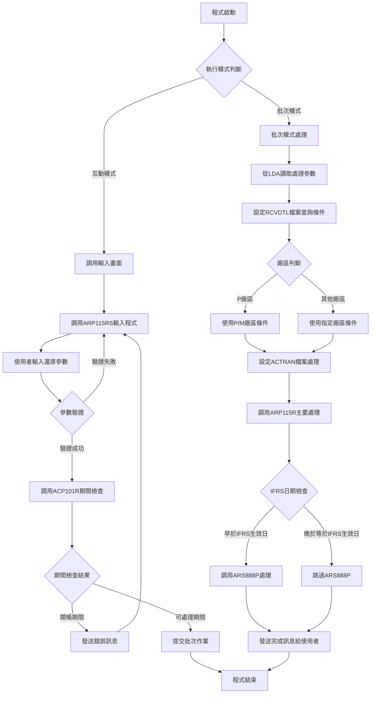
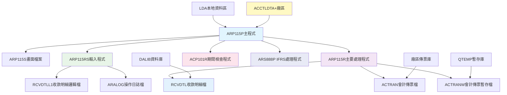
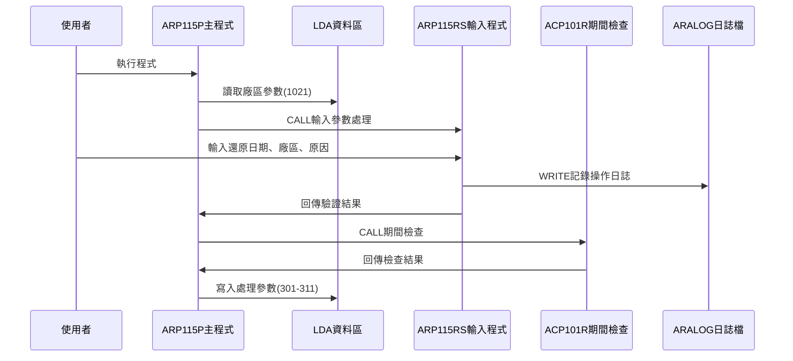
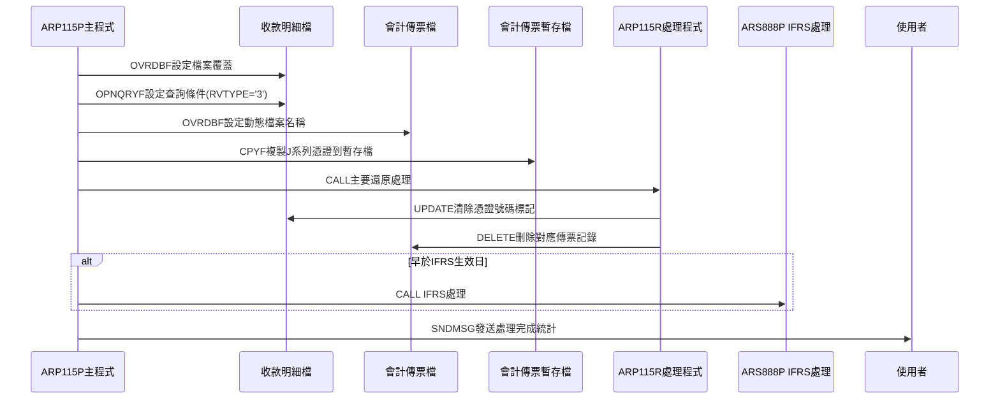
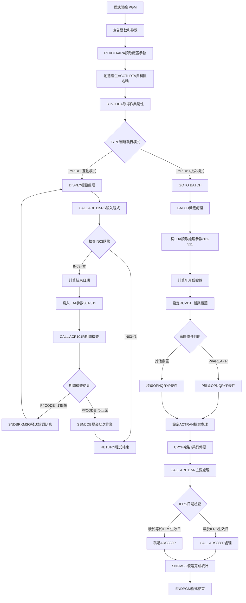

# ARP115P_U01 程式規格書

## 1. 基本資料

| 項目 | 內容 |
|------|------|
| **程式編號** | ARP115P |
| **程式名稱** | 收款項代制憑證還原作業 |
| **程式類型** | CLP |
| **廠區** | U01 |
| **系統名稱** | 應收帳款系統 |
| **子系統** | 收款項代制憑證處理 |
| **檔案位置** | U01CLSRC_THSRC/ARP115P.txt |

## 2. 🎯 程式功能說明

### 主要功能描述
此程式為收款項代制憑證還原作業的控制程式，專門處理已產生的收款項代制憑證的還原作業。程式提供互動式參數輸入及批次處理兩種執行模式，透過期間檢查確保會計期間的正確性，並執行完整的憑證還原處理，包括清除收款明細檔案中的憑證標記、刪除對應的會計傳票記錄等作業。U01版本作為實際廠區的專業版本，具有完整的IFRS支援和靈活的廠區處理機制，並提供詳細的處理統計資訊。

### 🎯 業務流程詳細說明

#### 完整業務流程圖


#### 業務流程關鍵階段說明

**第一階段：執行模式識別與參數收集**
- 透過RTVJOBA檢查執行環境類型(批次或互動)
- 動態產生ACCTLDTA資料區名稱結合廠區代號
- 互動模式時調用ARP115RS程式進行參數輸入
- 收集還原日期範圍、廠區代號、修改原因等資訊

**第二階段：期間控制與參數驗證**
- 調用ACP101R程式檢查指定年月份是否已關帳
- 驗證還原日期的合法性和期間狀態
- 確保無法在關帳期間進行憑證還原作業
- 防止違反會計期間控制原則

**第三階段：收款明細檔案條件設定**
- 設定RCVDTL檔案覆蓋到DALIB/RCVDTL
- 根據廠區別設定不同的查詢條件
- P廠區使用特殊條件：收款號碼開頭為P或M
- 其他廠區使用標準條件：收款號碼開頭為指定廠區代號
- 限定收款類型為"3"(代制憑證類型)

**第四階段：會計傳票檔案環境準備**
- 動態設定會計傳票檔案名稱(AC+廠區+R)
- 使用CPYF複製符合條件的傳票記錄到暫存檔
- 設定傳票號碼範圍為J00000-J99999(收款項代制憑證)
- 建立處理期間和廠區的限制條件

**第五階段：主要憑證還原處理**
- 調用ARP115R程式執行實際的還原作業
- 清除RCVDTL檔案中的憑證號碼標記(RVVNO1)
- 刪除ACTRAN檔案中對應的會計傳票記錄
- 統計處理的收款筆數和刪除的傳票筆數

**第六階段：IFRS相關處理與完成通知**
- 檢查處理日期是否早於IFRS生效日期
- 若早於IFRS生效日則調用ARS888P進行額外處理
- 使用從LDA讀取的憑證號碼範圍進行IFRS處理
- 發送詳細的處理結果訊息給執行使用者

#### 🎯 U01版本收款項憑證還原特色
- **靈活廠區支援**：特別支援P廠區的P/M收款號碼組合處理
- **J系列憑證**：專門處理J00000-J99999範圍的收款項代制憑證
- **IFRS完整支援**：提供完整的IFRS生效日期檢查和處理
- **處理統計完整**：提供收款筆數和傳票筆數的詳細統計

#### 多層次驗證機制
- **期間控制驗證**：透過ACP101R程式檢查會計期間狀態
- **日期合法性驗證**：透過UTS102R程式驗證日期格式
- **業務邏輯驗證**：檢查是否有符合條件的收款記錄
- **憑證狀態驗證**：確認憑證是否已產生且可還原

#### 智能處理邏輯
- 自動判斷廠區並設定對應的處理條件
- 動態產生檔案名稱和資料區名稱
- 智能識別P廠區的特殊處理需求
- 自動統計處理結果並通知使用者

#### 資料一致性確保機制
- 透過檔案覆蓋確保存取正確的資料檔案
- 使用暫存檔避免直接操作原始檔案
- 分階段處理確保各步驟資料同步
- 記錄詳細的操作軌跡供後續查核

#### U01版本收款項處理專業設計理念
- **憑證還原專精**：專門處理收款項代制憑證的還原作業
- **廠區彈性支援**：支援多廠區的靈活處理機制
- **IFRS合規**：提供完整的IFRS支援確保合規性
- **U01實際適配**：專為U01實際廠區的業務特色設計

## 3. 🎯 檔案架構與關聯圖

### 使用檔案清單

| 檔案名稱 | 檔案類型 | 使用方式 | 說明 |
|----------|----------|----------|------|
| **ARP115S** | DSPF | CF/COMBINED | 收款項憑證還原輸入畫面檔案 |
| **RCVDTL** | 邏輯檔 | UF/UPDATE | 收款明細檔案 |
| **ACTRAN** | 邏輯檔 | UF/UPDATE | 會計傳票檔案(動態對應廠區) |
| **ACTRANW** | 暫存檔 | IF/INPUT | 會計傳票暫存檔案 |
| **ARALOG** | 邏輯檔 | O/OUTPUT | 應收帳款操作日誌檔案 |
| **RCVDTLL1** | 邏輯檔 | IF/INPUT | 收款明細邏輯檔案1 |

### 🎯 檔案關聯詳細視覺化圖表



### 🎯 U01版本特殊資料流向說明

#### 環境準備階段的資料流向


#### U01收款項憑證還原階段的資料流向


## 4. 🎯 檔案欄位規格說明

### 主要資料結構

#### U01版本LDA本地資料區完整結構
| 位置 | 長度 | 欄位名稱 | 資料類型 | 用途說明 |
|------|------|----------|----------|----------|
| **201-206** | 6 | D#VNO1 | CHAR | IFRS憑證號碼範圍起始(0012A新增) |
| **211-216** | 6 | D#VNO2 | CHAR | IFRS憑證號碼範圍結束(0012A新增) |
| **301-306** | 6 | U#YM | CHAR | 處理年月份(YYYYMM) |
| **301-308** | 8 | - | CHAR | 還原開始日期(YYYYMMDD) |
| **310-310** | 1 | - | CHAR | 處理廠區代號 |
| **311-318** | 8 | - | CHAR | 還原結束日期(YYYYMMDD) |
| **951-985** | 35 | S#COMP | CHAR | 公司名稱 |
| **1001-1010** | 10 | U#USID | CHAR | 使用者ID |
| **1011-1020** | 10 | S#DEVI | CHAR | 設備名稱 |
| **1021-1021** | 1 | U#AREA | CHAR | 系統廠區代號 |

#### 動態資料區命名結構
| 資料區類型 | 命名格式 | U01範例 | 用途說明 |
|------------|----------|---------|----------|
| **會計控制資料區** | ACCTLDTA+廠區 | ACCTLDTAU | 動態產生的會計控制資料區 |
| **IFRS控制資料區** | ARIFRSCTL | ARIFRSCTL | IFRS生效日期控制資料區(0112A) |

### 🔍 重點欄位切割技術詳解

#### DS結構完整分析

**DS結構1：憑證號碼分解結構**
```
ACVRNO (6字元)：[XXXXXX]
                 ↓
D#VRNO (1字元)： [X]                        憑證號碼類型標識
```

**DS結構2：憑證處理複合結構**
```
W#VNO2 (7字元)：[XXXXX|XX]
                 ↓    ↓
W#VRNO (5字元)： [XXXXX]                    憑證號碼主體
W#ITEM (2字元)：       [XX]                 憑證項次
```

**DS結構3：LDA位置對應結構**
```
LDA結構 (1021字元)：[201-206|211-216|301-306|310|311-318|951-985|1001-1010|1011-1020|1021]
                     ↓      ↓      ↓      ↓  ↓      ↓      ↓        ↓        ↓
D#VNO1 (6字元)：     [XXXXXX]              IFRS起始憑證號
D#VNO2 (6字元)：            [XXXXXX]       IFRS結束憑證號
U#YM (6字元)：                     [XXXXXX]處理年月
廠區ID (1字元)：                           [X]處理廠區
結束日期 (8字元)：                            [XXXXXXXX]還原結束日期
S#COMP (35字元)：                                    [XXXXXXXXXXXXXXXXXXXXXXXXXXXXXXXXXXX]公司名稱
U#USID (10字元)：                                                     [XXXXXXXXXX]使用者ID
S#DEVI (10字元)：                                                               [XXXXXXXXXX]設備名稱
U#AREA (1字元)：                                                                         [X]系統廠區
```

### 🎯 欄位挪用詳細分析

#### LDA多重用途位置挪用分析

**挪用情況對比表**
| 欄位名稱 | 原始設計用途 | 實際使用方式 | 挪用類型 |
|----------|-------------|-------------|----------|
| **LDA位置301-306** | 一般參數存放 | 雙重切割：年月(U#YM)和開始日期前6位 | 重疊式挪用 |
| **LDA位置201-206** | 保留空間 | IFRS憑證號碼範圍起始(D#VNO1) | 功能擴充挪用 |
| **LDA位置211-216** | 保留空間 | IFRS憑證號碼範圍結束(D#VNO2) | 功能擴充挪用 |

**挪用原因深度分析**
- **版本演進需求**：0012A版本新增IFRS支援，需要額外參數空間
- **參數傳遞效率**：使用LDA避免複雜的參數傳遞機制
- **空間節約考量**：重複利用LDA位置減少記憶體使用

**挪用方式詳細說明**
```rpg
// LDA位置301的雙重使用
RTVDTAARA DTAARA(*LDA (301 6)) RTNVAR(&D#YYMM)   // 讀取年月
RTVDTAARA DTAARA(*LDA (301 8)) RTNVAR(&DATEX)    // 讀取完整開始日期

// IFRS憑證號碼範圍設定(0012A)
RTVDTAARA DTAARA(*LDA (201 6)) RTNVAR(&D#VNO1)   // 起始憑證號
RTVDTAARA DTAARA(*LDA (211 6)) RTNVAR(&D#VNO2)   // 結束憑證號
```

#### 憑證號碼結構挪用分析

**挪用情況對比表**
| 欄位名稱 | 原始設計用途 | 實際使用方式 | 挪用原因 |
|----------|-------------|-------------|----------|
| **ACVRNO** | 完整憑證號碼儲存 | 分解為D#VRNO類型標識 | 類型識別挪用 |
| **W#VNO2** | 憑證號碼暫存 | 複合結構分解為號碼和項次 | 結構化挪用 |

**挪用方式詳細說明**
```rpg
// 憑證號碼類型分解
DS
    1 6 ACVRNO     // 完整憑證號碼(如J12345)
    1 1 D#VRNO     // 憑證類型(J=收款項代制憑證)

// 複合憑證處理結構
DS
    1 7 W#VNO2     // 複合結構
    2 5 W#VRNO     // 憑證號碼主體(12345)
    6 7 W#ITEM     // 憑證項次(01)
```

#### 動態檔案名稱挪用分析

**挪用情況對比表**
| 欄位名稱 | 原始設計用途 | 實際使用方式 | 挪用原因 |
|----------|-------------|-------------|----------|
| **&DTARA** | 單一資料區名稱 | 動態組合ACCTLDTA+廠區 | 多廠區支援挪用 |
| **ACTRAN檔案** | 標準會計檔案 | 動態對應AC+廠區+R格式 | 廠區隔離挪用 |

**挪用方式詳細說明**
```clp
CHGVAR VAR(&DTARA) VALUE('ACCTLDTA' *CAT &AREA)
// 產生：ACCTLDTAU、ACCTLDTAP等

OVRDBF FILE(ACTRAN) TOFILE('AC' || &P#AREA || 'R')
// 產生：ACUR、ACPR等
```

#### 日期處理挪用分析(U01特殊機制)

**挪用情況對比表**
| 欄位名稱 | 原始設計用途 | 實際使用方式 | 挪用原因 |
|----------|-------------|-------------|----------|
| **&DATEE** | 獨立結束日期 | 基於&DATEX動態計算 | 計算簡化挪用 |
| **&ENDD** | 完整日期輸入 | 僅輸入日號進行替換 | 使用者便利挪用 |

**挪用方式詳細說明**
```clp
CHGVAR VAR(&DATEE) VALUE(&DATEX)               // 複製開始日期
CHGVAR VAR(%SST(&DATEE 7 2)) VALUE(&ENDD)     // 替換日號部分

例如：
&DATEX = '20241201'    // 開始日期
&ENDD = '15'           // 結束日號
&DATEE = '20241215'    // 計算後的結束日期
```

### U01版本重要變數定義表

#### CLP程式變數定義
| 變數名稱 | 資料類型 | 長度 | 使用範圍 | 詳細說明 |
|----------|----------|------|----------|----------|
| **&P#YYMM** | *CHAR | 6 | 期間檢查 | 處理年月份(YYYYMM格式) |
| **&D#YYMM** | *CHAR | 6 | 內部計算 | 年月份暫存變數 |
| **&P#CODE** | *CHAR | 1 | ACP101R回傳 | 期間檢查結果('1'=關帳,'0'=可處理) |
| **&DATEX** | *CHAR | 8 | 日期範圍控制 | 還原開始日期(YYYYMMDD格式) |
| **&DATEE** | *CHAR | 8 | 日期範圍控制 | 還原結束日期(YYYYMMDD格式) |
| **&ENDD** | *CHAR | 2 | 日期計算 | 結束日號碼(DD格式) |
| **&P#AREA** | *CHAR | 1 | 廠區控制 | 處理廠區代號(P/U/K等) |
| **&AREA** | *CHAR | 1 | 系統控制 | 系統廠區代號 |
| **&DTARA** | *CHAR | 11 | 動態命名 | 動態資料區名稱(ACCTLDTA+廠區) |
| **&YM** | *CHAR | 6 | 檔案篩選 | 年月份篩選條件 |
| **&WSID** | *CHAR | 10 | 使用者識別 | 工作站ID |
| **&CNTT** | *CHAR | 6 | 統計資訊 | 處理收款筆數 |
| **&CNTA** | *CHAR | 6 | 統計資訊 | 刪除傳票筆數 |
| **&D#VNO1** | *CHAR | 6 | IFRS處理(0012A) | IFRS憑證號碼範圍起始 |
| **&D#VNO2** | *CHAR | 6 | IFRS處理(0012A) | IFRS憑證號碼範圍結束 |
| **&IFRSD** | *CHAR | 8 | IFRS控制(0112A) | IFRS生效日期 |

#### RPG程式重要變數定義
| 變數名稱 | 資料類型 | 長度 | 使用範圍 | 詳細說明 |
|----------|----------|------|----------|----------|
| **P#CNTT** | 字元 | 6 | 參數回傳 | 處理收款筆數統計 |
| **P#CNTA** | 字元 | 6 | 參數回傳 | 刪除傳票筆數統計 |
| **W#CNTT** | 數值 | 6,0 | 內部計數 | 收款記錄處理計數器 |
| **W#CNTA** | 數值 | 6,0 | 內部計數 | 傳票記錄刪除計數器 |
| **W#VRNO** | 字元 | 5 | 憑證處理 | 憑證號碼主體部分 |
| **W#ITEM** | 字元 | 2 | 憑證處理 | 憑證項次部分 |
| **W#ITEX** | 字元 | 2 | 憑證處理 | 擴充憑證項次 |
| **D#VRNO** | 字元 | 1 | 憑證類型 | 憑證號碼類型標識 |

#### 關鍵檔案記錄結構
| 檔案名稱 | 關鍵欄位 | 資料類型 | 用途說明 |
|----------|----------|----------|----------|
| **RCVDTL** | RVVNO1 | 字元 | 憑證號碼1(清除此欄位實現還原) |
| **RCVDTL** | RVVNO2 | 字元 | 憑證號碼2(檢查憑證狀態) |
| **RCVDTL** | RVTYPE | 字元 | 收款類型('3'=代制憑證) |
| **RCVDTL** | RVDECD | 字元 | 作廢代號('D'=已作廢) |
| **ACTRAN** | ACVRNO | 字元 | 會計憑證號碼(J00000-J99999) |
| **ACTRAN** | ACAREA | 字元 | 會計廠區代號 |
| **ACTRAN** | ACYM** | 字元 | 會計年月 |

#### 動態檔案命名結構
| 檔案類型 | 命名格式 | U01範例 | 用途說明 |
|----------|----------|---------|----------|
| **會計傳票檔** | AC+廠區+R | ACUR | 動態對應廠區的會計傳票檔案 |
| **會計傳票暫存檔** | QTEMP/ACTRANW | QTEMP/ACTRANW | J系列憑證暫存處理檔案 |
| **收款明細檔** | DALIB/RCVDTL | DALIB/RCVDTL | 收款明細資料檔案 |

## 5. 🎯 輸出/入螢幕布局

### 螢幕布局完整視覺化

```
+------------------------------------------------------------------------------+
|                     勝群金屬外貿處理廠收款項代制憑證還原           ARP115RS   |
|                                                                              |
|                                                                              |
|                                                                              |
|         請注意：此還原功能僅限於當月相關資料                                |
|                 已建檔完成後才進行處理。                                   |
|                                                                              |
|                 ------------------------------------------------           |
|                 還原廠區: [X]                                              |
|                                                                              |
|                 還原日期: [________] 至同月_____日                         |
|                                     (一般輸入幾號即可)                     |
|                                                                              |
|                 修改原因: [________________________________]               |
|                 ------------------------------------------------           |
|                                                                              |
|                                                                              |
|                                                                              |
|                                                                              |
|                                                                              |
|                                                                              |
|F3:離開程式                F12:離開程式                ENTER:執行             |
|[錯誤訊息顯示區]                                                              |
+------------------------------------------------------------------------------+
```

### 🎯 畫面欄位詳細說明

| 欄位名稱 | 欄位屬性 | 位置 | 長度 | 輸入格式 | 驗證規則 | 說明 |
|----------|----------|------|------|----------|----------|------|
| **S#AREA** | 顯示 | 10,28 | 1 | 英文字元 | 系統自動 | 還原廠區代號 |
| **S#DATE** | 輸入/輸出 | 12,28 | 8 | YYYYMMDD | 日期格式 | 還原開始日期 |
| **S#ENDD** | 輸入/輸出 | 12,54 | 2 | DD | 日號格式 | 結束日號碼 |
| **S#CGCA** | 輸入/輸出 | 14,28 | 40 | 中文字元 | 不可空白 | 修改原因說明 |
| **S#COMP** | 顯示 | 1,23 | 35 | 中文字元 | 唯讀 | 公司名稱顯示 |
| **S#DEVI** | 顯示 | 2,70 | 10 | 英數字元 | 唯讀 | 設備代號顯示 |
| **S#MSG1** | 顯示 | 24,2 | 70 | 中文字元 | 唯讀 | 錯誤訊息顯示區 |

### 🎯 畫面控制邏輯

#### 指示器控制說明
- **IN03**: F3功能鍵，程式結束
- **IN12**: F12功能鍵，程式結束
- **IN41**: S#DATE欄位錯誤時設定，顯示反白和光標

#### 欄位顯示屬性
- **S#DATE**: 使用EDTCDE(4)格式顯示為YYYY/MM/DD
- **S#ENDD**: 使用EDTCDE(4)格式顯示日號
- **S#MSG1**: 固定顯示為HI(高亮度)屬性

### 功能鍵詳細定義

| 功能鍵 | 處理邏輯 | 系統行為 | 說明 |
|--------|----------|----------|------|
| **F3** | 設定P#IN03='1' | 程式立即返回結束 | 離開程式不執行任何處理 |
| **F12** | 設定P#IN03='1' | 程式立即返回結束 | 取消操作並離開程式 |
| **ENTER** | 執行驗證與處理 | 驗證輸入後提交批次作業 | 執行主要憑證還原邏輯 |

### 輸入驗證機制

#### 日期驗證
- 調用UTS102R程式進行日期格式驗證
- 檢查日期不能大於系統日期
- 自動轉換日期格式為YYYYMMDD

#### 業務邏輯驗證
- 檢查修改原因不能空白
- 驗證是否有符合條件的收款記錄
- 確認收款項是否已產生憑證且可還原

### 操作流程
1. 畫面顯示時自動載入系統廠區資訊
2. 使用者輸入還原開始日期(YYYYMMDD格式)
3. 使用者輸入結束日號碼(通常輸入幾號即可)
4. 使用者輸入修改原因說明
5. 按ENTER鍵進行驗證和期間檢查
6. 驗證通過後自動提交批次作業執行處理
7. 驗證失敗則顯示對應錯誤訊息

## 6. 🎯 處理流程程序說明

### 🎯 主程序邏輯深度分析

#### U01版本程式執行流程圖


#### 🎯 U01版本收款項憑證還原特殊步驟分析

**步驟1-5：基礎環境準備**
- 動態產生ACCTLDTA資料區名稱結合廠區代號
- 透過RTVJOBA判斷執行模式
- 互動模式調用ARP115RS進行參數輸入和驗證
- 批次模式從LDA讀取預設參數

**步驟6：U01版本日期範圍計算**
- 計算結束日期：將開始日期的日號部分替換為輸入的結束日號
- 例如：開始日期20241201 + 結束日15 = 結束日期20241215
- 支援同月內的靈活日期範圍設定
- 自動處理月份邊界和日期合法性

**步驟7：收款明細檔案條件設定**
- RCVDTL檔案覆蓋到DALIB/RCVDTL確保正確資料源
- P廠區特殊處理：收款號碼開頭為P或M
- 其他廠區標準處理：收款號碼開頭為指定廠區代號
- 限定收款類型為"3"(代制憑證類型)且未作廢

**步驟8：會計傳票檔案環境準備**
- 動態設定檔案名稱為AC+廠區+R格式
- 使用CPYF將符合條件的傳票複製到QTEMP/ACTRANW
- 限定憑證號碼範圍為J00000-J99999(收款項代制憑證)
- 設定廠區、年月、日期範圍的複合篩選條件

**步驟9：主要憑證還原處理**
- 調用ARP115R程式執行實際的還原作業
- 清除RCVDTL檔案中的憑證號碼標記(RVVNO1字段)
- 刪除ACTRAN檔案中對應的會計傳票記錄
- 統計處理的收款筆數和刪除的傳票筆數

**步驟10：IFRS相關處理與完成通知**
- 檢查處理開始日期是否早於IFRS生效日期
- 若早於IFRS生效日則調用ARS888P進行額外處理
- 從LDA位置201、211讀取憑證號碼範圍進行IFRS處理
- 發送詳細的處理統計訊息給執行使用者

#### 業務邏輯深度解析

**U01版本收款項憑證還原的核心邏輯**：
1. 專門處理收款項代制憑證的還原作業
2. 支援靈活的廠區條件和日期範圍設定
3. 提供完整的IFRS支援確保合規性
4. 實際廠區特殊需求的完整滿足

**U01版本安全控制機制**：
1. 期間控制防止關帳期間處理
2. 憑證類型限制確保處理精度
3. 日期範圍控制避免錯誤還原
4. 多重驗證機制確保資料完整性

#### 條件判斷詳細說明

**U01版本廠區條件判斷**：
- `COND(&P#AREA *EQ 'P')` - P廠區特殊處理
- P廠區：`%SST(RVNO 1 1) *EQ %VALUES("P" "M")`
- 其他廠區：`%SST(RVNO 1 1) *EQ "廠區代號"`

**U01版本IFRS日期判斷**：
- `COND(&DATEX *LT &IFRSD)` - 檢查是否早於IFRS生效日
- 使用開始日期進行IFRS檢查
- 確保憑證還原的IFRS合規性

**U01版本收款條件篩選**：
- `RVTYPE *EQ "3"` - 僅處理代制憑證類型
- `RVDECD *NE "D"` - 排除已作廢記錄
- 日期範圍：`RVDATE *GE &DATEX *AND RVDATE *LE &DATEE`

#### 變數使用和數據流向追蹤

**U01版本特殊變數軌跡**：
1. LDA位置301-311的還原參數軌跡
2. 動態ACCTLDTA資料區名稱的產生軌跡
3. P廠區特殊條件的處理軌跡
4. J系列憑證範圍的控制軌跡

### 🎯 U01版本子程序邏輯分析

#### U01版本子程序調用順序
1. **ARP115RS程式**：互動輸入處理，資料驗證和日誌記錄
2. **ACP101R程式**：期間檢查，確保會計期間可處理
3. **ARP115R程式**：主要還原處理，清除憑證和刪除傳票
4. **ARS888P程式**：IFRS處理(條件調用)
5. **SNDMSG指令**：完成通知，發送詳細統計資訊

#### U01版本收款項憑證還原專精設計
- 專門處理收款項代制憑證的還原業務
- 支援多廠區的靈活處理機制
- 提供完整的IFRS支援確保合規性
- 針對實際廠區業務需求進行優化

### 🎯 U01版本收款項憑證還原處理邏輯

#### U01版本RCVDTL查詢條件邏輯
**P廠區特殊條件**：
```sql
OPNQRYF FILE((RCVDTL)) OPTION(*INP *UPD)
        QRYSLT('RVDATE *GE &DATEX *AND 
                RVDATE *LE &DATEE *AND 
                RVTYPE *EQ "3" *AND 
                RVDECD *NE "D" *AND 
                %SST(RVNO 1 1) *EQ %VALUES("P" "M")')
```

**其他廠區標準條件**：
```sql
OPNQRYF FILE((RCVDTL)) OPTION(*INP *UPD)
        QRYSLT('RVDATE *GE &DATEX *AND 
                RVDATE *LE &DATEE *AND 
                RVTYPE *EQ "3" *AND 
                RVDECD *NE "D" *AND 
                %SST(RVNO 1 1) *EQ "&P#AREA"')
```

#### U01版本ACTRAN複製條件邏輯
```sql
CPYF FROMFILE(ACTRAN) TOFILE(QTEMP/ACTRANW)
     INCREL((*IF  ACVRNO *GE 'J00000' ) 
            (*AND ACVRNO *LE 'J99999' ) 
            (*AND ACAREA *EQ &AREA)     
            (*AND ACYM   *EQ &YM)       
            (*AND ACYMD  *GE &DATEX)    
            (*AND ACYMD  *LE &DATEE))
```
- 限定J系列憑證範圍(收款項代制憑證)
- 限定指定廠區和年月
- 限定日期範圍內的傳票記錄

#### U01版本IFRS處理邏輯
```sql
IF COND(&DATEX *LT &IFRSD) THEN(DO)
    RTVDTAARA DTAARA(*LDA (201 6)) RTNVAR(&D#VNO1)
    RTVDTAARA DTAARA(*LDA (211 6)) RTNVAR(&D#VNO2)
    CALL PGM(ARS888P) PARM(&AREA &YM &D#VNO1 &D#VNO2)
ENDDO
```
- 檢查處理開始日期是否早於IFRS生效日期
- 從LDA讀取憑證號碼範圍進行IFRS處理
- 確保憑證還原的IFRS合規性

## 7. 🎯 數據操作與轉換分析

### U01版本檔案操作詳解

#### U01版本RCVDTL收款明細檔操作
- **OVRDBF操作**：覆蓋到DALIB/RCVDTL確保正確資料源
- **OPNQRYF操作**：根據廠區設定不同的篩選條件
- **UPDATE操作**：清除RVVNO1憑證號碼欄位實現還原
- **統計計數**：記錄處理的收款記錄筆數

#### U01版本ACTRAN會計傳票檔操作
- **動態檔案名稱**：根據廠區動態產生AC+廠區+R格式
- **CPYF操作**：複製J系列憑證到暫存檔進行安全處理
- **DELETE操作**：刪除對應的會計傳票記錄
- **統計計數**：記錄刪除的傳票記錄筆數

### U01版本數據轉換邏輯

#### U01版本日期範圍轉換
- **開始日期處理**：DATEX直接使用輸入的8位日期
- **結束日期計算**：DATEE = DATEX，然後替換日號部分
- **年月提取**：YM = %SST(DATEX 1 6)，取前6位作為年月
- **日期驗證**：透過UTS102R程式確保日期格式正確

#### U01版本廠區條件轉換
- **P廠區特殊處理**：支援P和M兩種收款號碼開頭
- **其他廠區標準處理**：使用指定廠區代號作為開頭
- **動態檔案名稱**：AC+廠區+R的動態組合
- **資料區名稱**：ACCTLDTA+廠區的動態組合

### U01版本檢核機制詳解

#### U01版本收款項業務檢核
- **憑證類型檢查**：確保只處理收款類型為"3"的記錄
- **憑證狀態檢查**：驗證RVVNO1有值且RVVNO2為空白
- **日期範圍檢查**：確保還原日期在合理範圍內
- **廠區匹配檢查**：驗證收款號碼與指定廠區的匹配

#### U01版本IFRS合規檢核
- **IFRS生效日檢查**：確保IFRS處理的時機正確性
- **憑證範圍檢查**：驗證IFRS處理的憑證範圍
- **開始日期基準**：使用開始日期作為IFRS檢查基準
- **合規性追蹤**：記錄IFRS處理的詳細軌跡

## 8. 🎯 錯誤處理程序說明

### 🎯 U01版本詳細錯誤代碼清冊

| 錯誤代碼 | 錯誤訊息 | 原因說明 | 處理方式 | 預防措施 |
|----------|---------|---------|---------|----------|
| **T#ERR,1** | 日期輸入錯誤 | UTS102R驗證日期格式失敗 | 1. 顯示錯誤訊息<br>2. 設定IN41指示器<br>3. 重新輸入日期 | 提供日期格式說明和範例 |
| **T#ERR,2** | 大於系統日期 | 輸入日期超過當前系統日期 | 1. 顯示錯誤訊息<br>2. 設定IN41指示器<br>3. 重新輸入日期 | 提供系統日期參考 |
| **T#ERR,4** | 修改原因必須輸入 | S#CGCA欄位為空白 | 1. 顯示錯誤訊息<br>2. 重新輸入修改原因 | 強制輸入修改原因說明 |
| **T#ERR,5** | 還原期間內收款項已經產生憑證，無法還原 | RVVNO2不為空白，表示已有其他憑證 | 1. 顯示錯誤訊息<br>2. 檢查收款項狀態<br>3. 聯繫系統人員 | 確認收款項的完整處理狀態 |
| **T#ERR,6** | 該還原期間內收款項的所有傳票均已還原，無符合條件資料 | W#CONT<=0，沒有可還原記錄 | 1. 顯示錯誤訊息<br>2. 確認日期範圍<br>3. 檢查資料狀態 | 確認還原期間和條件設定 |
| **關帳期間錯誤** | 該月份已月結，請與相關人員聯繫！ | ACP101R檢查發現指定期間已關帳 | 1. SNDBRKMSG發送訊息<br>2. GOTO DISPLY重新輸入<br>3. 選擇其他可處理期間 | 提供期間狀態查詢功能 |
| **檔案操作失敗** | RCVDTL/ACTRAN檔案存取異常 | 檔案權限或存在性問題 | 1. 檢查檔案存在性<br>2. 確認存取權限<br>3. 驗證檔案覆蓋設定 | 定期檢查檔案狀態和權限 |
| **IFRS處理失敗** | IFRS生效日期檢查異常 | ARIFRSCTL或ARS888P處理失敗 | 1. 檢查IFRS生效日期設定<br>2. 確認ARS888P程式可用<br>3. 驗證IFRS處理邏輯 | 確保IFRS相關設定正確 |
| **LDA參數錯誤** | 301-311位置參數異常 | LDA還原參數讀寫失敗 | 1. 檢查LDA參數設定<br>2. 確認301-311位置可用<br>3. 驗證參數傳遞邏輯 | 確保LDA參數空間正確配置 |
| **子程式調用失敗** | ARP115R/ACP101R調用異常 | 收款項處理子程式調用失敗 | 1. 檢查子程式存在性<br>2. 確認參數傳遞正確<br>3. 驗證執行環境 | 確保還原子程式正確設定 |

### 🎯 U01版本系統異常處理邏輯

#### U01版本檔案操作失敗處理
- **收款明細檔案異常**：檢查DALIB/RCVDTL檔案的可用性
- **會計傳票檔案異常**：確認動態檔案名稱的正確性
- **暫存檔案異常**：處理QTEMP/ACTRANW暫存檔的創建問題

#### U01版本程式調用失敗處理
- **輸入程式調用失敗**：處理ARP115RS的調用異常
- **期間檢查調用失敗**：處理ACP101R程式的調用問題
- **主要處理調用失敗**：處理ARP115R的調用異常
- **IFRS程式調用失敗**：處理ARS888P的調用問題

#### U01版本資料完整性錯誤處理
- **收款記錄異常**：處理收款類型和狀態的異常情況
- **憑證範圍異常**：處理J系列憑證範圍的異常
- **日期範圍異常**：處理日期計算和範圍的異常
- **廠區條件異常**：處理廠區條件設定的異常

#### U01版本收款項業務失敗處理
- **還原邏輯失敗**：處理收款項憑證還原業務邏輯的異常
- **IFRS合規失敗**：處理IFRS合規性檢查的失敗
- **統計計算失敗**：處理收款筆數和傳票筆數統計的異常
- **訊息發送失敗**：處理完成通知訊息的發送異常

## 9. 🎯 備註

### 🎯 U01版本收款項憑證還原特殊注意事項

#### U01版本作為實際廠區收款項憑證還原平台
- 專門處理收款項代制憑證的還原作業，區別於一般憑證處理
- 使用J00000-J99999專用憑證範圍確保收款項業務的獨立性
- 支援靈活的廠區條件設定，特別是P廠區的P/M組合處理
- 提供完整的IFRS支援確保憑證還原的國際合規性

#### U01版本收款項憑證範圍管理
- **專用範圍**：J00000-J99999收款項代制憑證專用編號範圍
- **憑證類型限制**：僅處理收款類型為"3"的代制憑證
- **還原機制**：透過清除RVVNO1欄位實現憑證還原
- **完整性保證**：確保憑證還原的完整性和可追蹤性

#### U01版本廠區處理特殊機制
- **P廠區特殊支援**：支援P和M兩種收款號碼開頭的處理
- **動態檔案名稱**：根據廠區動態產生AC+廠區+R格式檔案名稱
- **彈性條件設定**：根據不同廠區自動調整查詢條件
- **統一處理邏輯**：確保不同廠區的處理邏輯一致性

#### U01版本日期處理靈活機制
- **同月範圍處理**：支援同月內的彈性日期範圍設定
- **結束日計算**：透過替換開始日期的日號部分計算結束日期
- **日期驗證完整**：透過UTS102R程式確保日期格式和合法性
- **系統日期控制**：防止還原未來日期的收款記錄

#### U01版本IFRS支援機制
- **0012A版本新增**：基礎IFRS支援功能
- **0112A版本強化**：IFRS生效日期控制機制
- **開始日期基準**：使用還原開始日期作為IFRS檢查基準
- **動態控制**：透過ARIFRSCTL資料區控制IFRS生效日期

#### U01版本資料區動態管理
- 使用動態產生的ACCTLDTA+廠區資料區名稱
- 例如：ACCTLDTAU (U廠區)、ACCTLDTAP (P廠區)
- 支援多廠區的獨立資料區管理
- 確保廠區間資料的隔離和安全

#### U01版本操作日誌完整記錄
- 透過ARALOG檔案記錄所有還原操作
- 記錄操作日期、時間、使用者、還原期間、修改原因
- 使用操作代號'AIG'識別收款項憑證還原操作
- 提供完整的操作軌跡供稽核查核

#### U01版本處理統計機制
- **收款筆數統計**：記錄清除憑證標記的收款記錄筆數
- **傳票筆數統計**：記錄刪除的會計傳票記錄筆數
- **詳細訊息通知**：發送完整的處理結果統計給執行使用者
- **處理軌跡追蹤**：確保每次還原操作都有完整記錄

#### U01版本版本更新歷程
- **0012A版本**：新增IFRS支援功能
- **0112A版本**：強化IFRS生效日期控制機制
- **9911A版本**：ARP115RS輸入程式的系統日期檢查強化
- 體現了收款項憑證還原功能的持續完善

#### U01版本錯誤處理策略
- 提供詳細的業務邏輯錯誤訊息
- 使用指示器控制錯誤欄位的顯示狀態
- 透過SNDBRKMSG確保關帳期間錯誤的即時通知
- 提供明確的操作指導和錯誤解決建議

#### U01版本作為實際廠區收款項還原平台的設計理念
- **業務專精**：專門處理收款項代制憑證還原，與其他憑證類型明確區分
- **廠區彈性**：支援多廠區的靈活處理機制和條件設定
- **IFRS合規**：提供完整的IFRS支援確保憑證還原的國際合規性
- **實際適配**：專為U01實際廠區的收款項業務特色設計

#### U01版本收款項憑證還原業務特色
- 專門處理收款項代制憑證的還原相關作業
- 支援月結作業中的憑證還原業務完整處理流程
- 確保收款項憑證還原的精確性和可追蹤性
- 提供完整的期間控制和業務檢查機制

#### U01版本系統整合特性
- 與UTS102R日期驗證系統緊密整合
- 與ARIFRSCTL IFRS控制系統完全相容
- 支援批次作業佇列的標準化處理
- 與U01廠區檔案系統和資料區系統無縫銜接

#### U01版本使用注意事項
- 執行前確保當月相關收款資料已建檔完成
- 注意關帳期間無法執行此還原作業
- 確認收款項憑證已產生且符合還原條件
- 收款項憑證還原涉及會計傳票需特別注意完整性
- IFRS相關處理需確認生效日期設定正確
- 注意P廠區的特殊處理條件和收款號碼規則
- 確保修改原因的完整記錄供後續稽核查核 