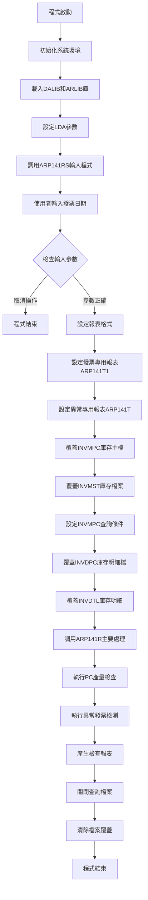
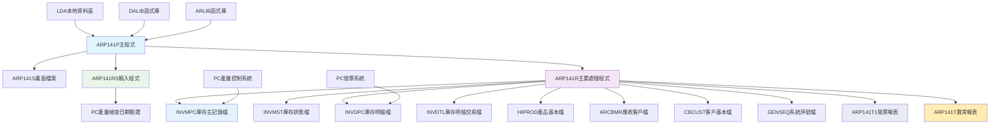
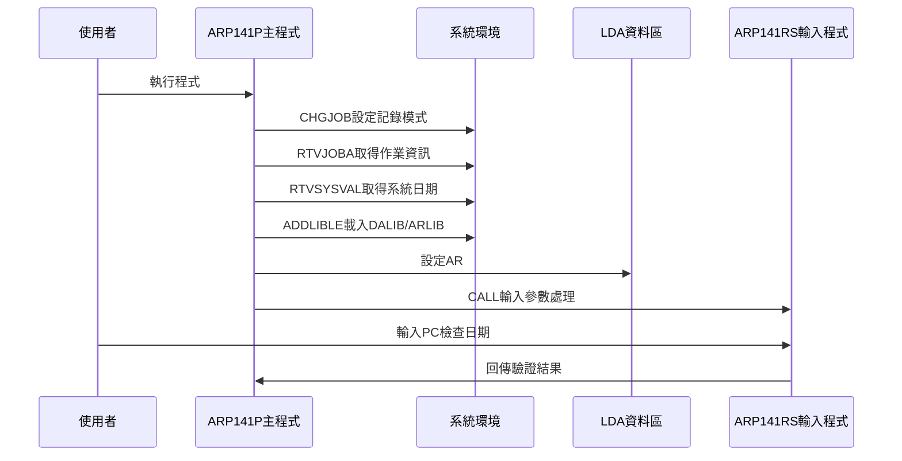
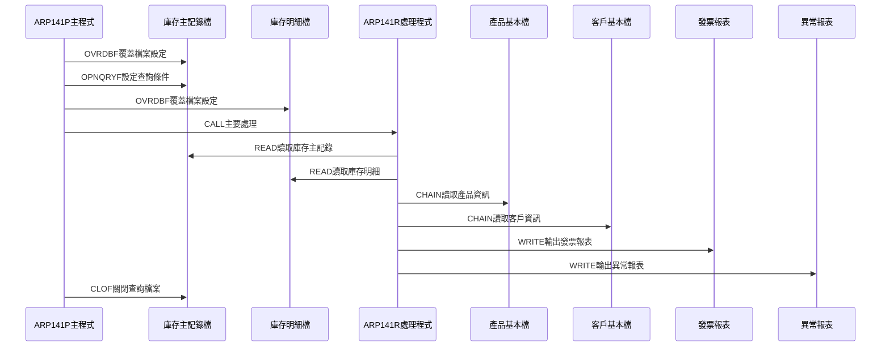
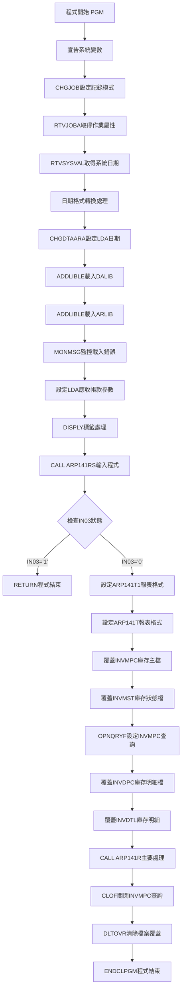

# ARP141P_H05 程式規格書

## 1. 基本資料

| 項目 | 內容 |
|------|------|
| **程式編號** | ARP141P |
| **程式名稱** | PC產量檢查和異常發票處理作業 |
| **程式類型** | CLP |
| **廠區** | H05 |
| **系統名稱** | 應收帳款系統 |
| **子系統** | PC產量控制與發票檢查 |
| **檔案位置** | H05CLSRC_THSRC/ARP141P.txt |

## 2. 🎯 程式功能說明

### 主要功能描述
此程式為PC產量檢查和異常發票處理作業的控制程式，專門處理PC產品的產量檢查和異常發票的檢測與處理。程式提供互動式日期參數輸入功能，透過對庫存主記錄(INVMPC)和庫存明細記錄(INVDPC)的檢查，自動識別未控制的PC產品並進行異常發票的檢測。H05版本具有完整的PC產量控制機制、多重發票檢查功能、以及詳細的檢查報表輸出。程式特別針對PC產品的產量控制設計，確保PC產品的數量控制和發票正確性。

### 🎯 業務流程詳細說明

#### 完整業務流程圖


#### 業務流程關鍵階段說明

**第一階段：系統環境初始化與庫加載**
- 變更作業記錄設定為LOGCLPGM(*YES)
- 取得作業相關資訊(JOB、USER、NBR、CURUSER)
- 動態加載DALIB和ARLIB函式庫
- 設定LDA(本地資料區)參數位置

**第二階段：日期參數收集與驗證**
- 取得系統日期(QDATE)進行日期格式轉換
- 調用ARP141RS程式進行互動式參數輸入
- 使用者選擇發票檢查日期範圍
- 驗證日期參數的合法性和有效性

**第三階段：報表環境設定與格式配置**
- 配置ARP141T1發票專用報表格式(198欄位寬度)
- 配置ARP141T異常專用報表格式(198欄位寬度)
- 設定15 CPI字型密度確保報表清晰度
- 啟用IGCDTA支援中文字元正確顯示

**第四階段：庫存檔案環境準備**
- 覆蓋INVMPC庫存主記錄檔案並設定共享模式
- 覆蓋INVMST庫存狀態檔案進行關聯處理
- 覆蓋INVDPC庫存明細記錄檔案並設定共享模式
- 覆蓋INVDTL庫存明細交易檔案進行完整檢查

**第五階段：PC產量控制條件設定**
- 使用OPNQRYF設定庫存主記錄查詢條件
- 篩選MCCTRL為空白的未控制記錄
- 篩選MCMARK第9位為'Y'的標記記錄
- 設定KEYFLD為檔案順序確保處理順序

**第六階段：主要PC產量檢查與異常發票處理**
- 調用ARP141R程式執行實際的檢查處理
- 讀取符合條件的庫存主記錄進行產量檢查
- 檢查庫存明細記錄發現異常發票
- 產生PC產量檢查和異常發票處理報表

**第七階段：檔案清理與環境復原**
- 關閉INVMPC的開放查詢(CLOF OPNID)
- 清除所有檔案覆蓋設定(DLTOVR FILE(*ALL))
- 釋放佔用的系統資源
- 確保系統環境復原到處理前狀態

#### 🎯 H05版本PC產量檢查和異常發票處理特色
- **PC產量專精**：專門處理PC產品的產量控制和檢查
- **異常發票檢測**：自動識別和處理異常發票狀況
- **雙重報表輸出**：提供發票專用和異常專用兩種報表
- **198欄位寬報表**：使用寬版報表確保資訊完整顯示

#### 多層次檢查機制
- **產量控制檢查**：透過MCCTRL欄位檢查未控制的產量
- **標記狀態檢查**：透過MCMARK欄位檢查特殊標記狀態
- **發票完整性檢查**：檢查發票資料的完整性和正確性
- **異常狀況檢測**：自動識別和標記異常發票狀況

#### 智能處理邏輯
- 自動判斷PC產品的產量控制狀態
- 動態篩選未控制和特殊標記的記錄
- 智能識別異常發票並分類處理
- 自動統計檢查結果並產生報表

#### 資料一致性確保機制
- 透過檔案覆蓋確保資料處理的一致性
- 使用查詢條件確保只處理符合條件的記錄
- 分階段處理確保各步驟資料同步
- 記錄詳細的處理軌跡供後續查核

#### H05版本PC產量控制專業設計理念
- **產量專精**：專門處理PC產品的產量控制，與其他產品類型明確區分
- **檢查機制完整**：提供完整的產量檢查和異常發票檢測機制
- **報表功能豐富**：提供詳細的檢查報表和統計資訊
- **H05特殊適配**：專為H05廠區的PC產品特色設計

## 3. 🎯 檔案架構與關聯圖

### 使用檔案清單

| 檔案名稱 | 檔案類型 | 使用方式 | 說明 |
|----------|----------|----------|------|
| **ARP141S** | DSPF | CF/COMBINED | PC產量檢查日期輸入畫面檔案 |
| **INVMPC** | 邏輯檔 | UP/UPDATE | 庫存主記錄檔案(PC產量控制) |
| **INVMST** | 邏輯檔 | O/OUTPUT | 庫存狀態檔案 |
| **INVDPC** | 邏輯檔 | UF/UPDATE | 庫存明細記錄檔案 |
| **INVDTL** | 邏輯檔 | O/OUTPUT | 庫存明細交易檔案 |
| **HIPROD** | 邏輯檔 | IF/INPUT | 產品基本資料檔案 |
| **ARCBMR** | 邏輯檔 | IF/INPUT | 應收帳款客戶主檔 |
| **CBCUST** | 邏輯檔 | IF/INPUT | 客戶基本資料檔案 |
| **GENSEQ** | 邏輯檔 | UF/UPDATE | 系統序號產生檔案 |
| **ARP141T1** | PRTF | O/OUTPUT | PC發票專用檢查報表 |
| **ARP141T** | PRTF | O/OUTPUT | PC異常專用檢查報表 |

### 🎯 檔案關聯詳細視覺化圖表



### 🎯 H05版本特殊資料流向說明

#### 環境準備階段的資料流向


#### H05版本PC產量檢查階段的資料流向


## 4. 🎯 檔案欄位規格說明

### 主要資料結構

#### CLP程式變數架構分析
ARP141P作為PC產量檢查和異常發票處理控制程式，採用CLP架構處理變數宣告與邏輯控制：

| 變數類型 | 宣告數量 | 主要用途 | 範圍說明 |
|----------|----------|----------|----------|
| **系統控制變數** | 6個 | 作業環境取得 | JOB、USER、NBR、CURUSER等 |
| **業務處理變數** | 5個 | PC檢查處理 | AR#P、W#ER、SYQD等 |
| **使用者管理變數** | 3個 | 使用者資訊 | TUSER、TADDR、TEMAIL |
| **LDA區域變數** | 8個區段 | 參數傳遞 | 位置1-801的分段使用 |

### 🔍 重點欄位切割技術詳解

#### LDA本地資料區結構完整分析
ARP141P程式大量使用LDA進行參數傳遞和狀態管理，採用分段式儲存架構：

##### LDA資料結構切割分析
```
LDA本地資料區 (1024字元空間)：[__________________________LDA切割區__________________________]
位置範圍:                      1    2    12   13   801
                               ↓    ↓     ↓    ↓     ↓
AR處理標記(1-1):              [P]                    程式處理標記(1字元)
當前使用者(2-10):                [CURUSER___]         當前使用者名稱(10字元)  
錯誤標記(12-1):                          [E]         錯誤狀態標記(1字元)
執行使用者(13-10):                        [USER_____] 執行使用者名稱(10字元)
系統日期(801-8):                                 [YYYYMMDD] 系統處理日期(8字元)
```

**欄位切割視覺化展示**：
```
LDA資料結構完整配置：
位置: 001 002       012 013 014       023 ... 801       809
      |P | CURUSER  |E | USER___    |預留|...|YYYYMMDD |預留|
      [標][當前使用者][錯][執行使用者] [___]...[系統日期][___]
```

**切割邏輯詳細說明**：
- **AR#P (位置1)**: AR處理標記，用於標識程式處理狀態(' '=正常處理)
- **CURUSER (位置2-11)**: 當前使用者名稱，10字元，用於追蹤作業執行者
- **W#ER (位置12)**: 錯誤標記，1字元，用於標記處理過程中的錯誤狀態
- **USER (位置13-22)**: 執行使用者名稱，10字元，記錄實際執行者
- **SYQD1 (位置801-808)**: 系統日期，8字元格式YYYYMMDD，用於PC檢查日期控制

**實際數據範例說明**：
```
範例資料設定:
├── AR#P = ' ' (正常處理狀態)
├── CURUSER = 'S00WCJ    ' (當前使用者)  
├── W#ER = ' ' (無錯誤狀態)
├── USER = 'S00WCJ    ' (執行使用者)
└── SYQD1 = '20241228' (2024年12月28日檢查)

在程式中的應用:
- 狀態控制: AR#P=' ' 正常處理模式
- 使用者追蹤: CURUSER記錄實際操作者
- 日期控制: SYQD1作為PC檢查基準日期
- 錯誤處理: W#ER標記處理異常狀態
```

#### OPNQRYF查詢條件結構分析
程式使用特定查詢條件進行INVMPC庫存主記錄檔篩選：

##### 查詢條件欄位切割
```
QRYSLT查詢字串 (複合條件)：[控制欄位|特殊標記欄位]
                           ↓        ↓
MCCTRL條件:               [空白]            控制欄位必須為空白
MCMARK條件:                       [第9位元=Y] MCMARK第9位元必須為Y
```

**查詢邏輯詳細說明**：
- **MCCTRL=' '**: 庫存主記錄控制欄位為空白，表示正常可處理記錄
- **%SST(MCMARK 9 1)='Y'**: MCMARK欄位第9位元為'Y'，標識PC產量相關記錄
- **組合邏輯**: 兩個條件必須同時滿足，確保處理正確的PC產量記錄

#### 檔案映射欄位結構分析
程式透過OVRDBF進行檔案映射處理：

##### 檔案映射切割
```
檔案映射架構：[實體檔案|邏輯檔案|共享模式]
               ↓      ↓      ↓
INVMPC映射:   [INVMPC] → [INVMPC] [SHARE(*YES)]  庫存主記錄檔
INVMST映射:   [INVMST] → [INVMST] [預設模式]     庫存狀態檔
INVDPC映射:   [INVDPC] → [INVDPC] [SHARE(*YES)]  庫存明細檔
INVDTL映射:   [INVDTL] → [INVDTL] [預設模式]     庫存明細交易檔
```

### 🎯 欄位挪用詳細分析

#### 挪用情況對比表
| 原始欄位定義 | 實際使用方式 | 挪用類型 | 挪用原因 |
|-------------|-------------|----------|----------|
| **LDA一般資料區** | PC檢查專用參數區 | 功能擴充 | CLP程式間參數傳遞需求 |
| **MCMARK第9位元** | PC產量標識欄位 | 位元挪用 | 庫存記錄分類識別需求 |
| **USRDTA報表標識** | 檢查/異常報表區分 | 標記擴充 | 雙報表輸出管理 |
| **IGCDTA中文處理** | 中文報表輸出控制 | 格式擴充 | 中文字元正確顯示 |

#### 挪用原因深度分析
1. **LDA多區段挪用**：
   - **原因**：CLP程式需要在多個程式間傳遞複雜的PC檢查狀態
   - **業務需求**：PC產量檢查需要維護使用者、錯誤狀態、日期等多項資訊
   - **實現方式**：將不同性質的資料分段儲存在LDA的不同位置

2. **MCMARK位元挪用**：
   - **原因**：庫存主記錄檔需要額外的業務分類標識
   - **業務需求**：區分一般庫存記錄與PC產量相關記錄
   - **實現方式**：使用%SST函數擷取MCMARK第9位元作為PC標識

3. **USRDTA雙重標識**：
   - **原因**：同時產生兩種不同性質的報表需要明確區分
   - **業務需求**：檢查專用報表與異常專用報表的分類管理
   - **實現方式**：設定不同的USRDTA值進行報表識別

4. **系統日期格式轉換**：
   - **原因**：系統日期格式與業務處理格式不一致
   - **業務需求**：需要8位元YYYYMMDD格式進行日期控制
   - **實現方式**：透過RTVSYSVAL+CHGVAR進行格式轉換

#### 挪用方式詳細說明
1. **LDA分段管理法**：
   ```
   CHGDTAARA DTAARA(*LDA (位置 長度)) VALUE(&變數)
   - 位置1：AR處理標記
   - 位置2：當前使用者名稱
   - 位置12：錯誤狀態標記
   - 位置13：執行使用者名稱
   - 位置801：系統處理日期
   ```

2. **位元擷取技術**：
   ```
   %SST(MCMARK 9 1) *EQ "Y"
   - 從MCMARK欄位第9位元擷取1個字元
   - 判斷是否為'Y'來識別PC產量記錄
   ```

3. **報表雙重標識**：
   ```
   OVRPRTF FILE(ARP141T1) USRDTA('檢查專用')
   OVRPRTF FILE(ARP141T) USRDTA('異常專用')
   - 透過USRDTA參數區分報表類型
   ```

4. **日期格式轉換**：
   ```
   RTVSYSVAL SYSVAL(QDATE) RTNVAR(&SYQD)      # 取得YYMMDD
   CHGVAR VAR(&SYQD1) VALUE('01' *CAT &SYQD)  # 轉為YYYYMMDD
   - 將6位元系統日期轉換為8位元格式
   ```

#### 挪用影響評估
1. **系統維護影響**：
   - **正面影響**：提升程式處理效率，滿足複雜PC檢查需求
   - **風險**：LDA位置配置需要與相關程式保持一致性
   - **建議**：建立PC檢查專用的LDA位置對照表

2. **效能影響**：
   - **OPNQRYF查詢效率**：MCMARK位元判斷可能影響索引使用效率
   - **檔案共享處理**：SHARE(*YES)設定確保多使用者並行處理
   - **報表產生效率**：雙報表同時產生增加系統負擔

### 重要變數定義表

#### 系統控制變數群組
| 變數名稱 | 型態 | 長度 | 說明 | 使用範圍 |
|----------|------|------|------|----------|
| **&JOB** | *CHAR | 10 | 作業名稱 | 系統追蹤識別 |
| **&USER** | *CHAR | 10 | 使用者名稱 | 權限控制和記錄 |
| **&NBR** | *CHAR | 6 | 作業編號 | 作業唯一識別 |
| **&CURUSER** | *CHAR | 10 | 當前使用者 | 實際操作者追蹤 |
| **&IN03** | *LGL | 1 | F3結束指示器 | 程式結束控制 |

#### PC檢查處理變數群組
| 變數名稱 | 型態 | 長度 | 說明 | 資料範例 |
|----------|------|------|------|----------|
| **&AR#P** | *CHAR | 1 | AR處理標記 | ' '(正常處理) |
| **&W#ER** | *CHAR | 1 | 錯誤標記 | ' '(無錯誤)/'E'(有錯誤) |
| **&SYQD** | *CHAR | 6 | 系統日期(6位元) | '241228' |
| **&SYQD1** | *CHAR | 8 | 系統日期(8位元) | '20241228' |
| **&FILE** | *CHAR | 7 | 檔案標識 | 'INVMPC' |

#### 使用者管理變數群組
| 變數名稱 | 型態 | 長度 | 說明 | 用途 |
|----------|------|------|------|------|
| **&TUSER** | *CHAR | 10 | 目標使用者 | 通知對象設定 |
| **&TADDR** | *CHAR | 10 | 目標地址 | 通知地址設定 |
| **&TEMAIL** | *CHAR | 50 | 目標電子郵件 | 電子郵件通知 |

#### 程式呼叫參數對應表
| 被呼叫程式 | 參數傳遞方式 | 主要功能 | 回傳處理 |
|------------|--------------|----------|----------|
| **ARP141RS** | PARM(&IN03) | PC檢查日期輸入 | F3結束控制 |
| **ARP141R** | 直接呼叫 | PC產量檢查處理 | LDA狀態更新 |

#### LDA使用區段定義表
| 位置範圍 | 變數對應 | 資料型態 | 用途說明 | 相關程式 |
|----------|----------|----------|----------|----------|
| **1-1** | &AR#P | CHAR(1) | AR處理標記 | 主程式、檢查程式 |
| **2-11** | &CURUSER | CHAR(10) | 當前使用者名稱 | 使用者追蹤 |
| **12-12** | &W#ER | CHAR(1) | 錯誤狀態標記 | 錯誤處理邏輯 |
| **13-22** | &USER | CHAR(10) | 執行使用者名稱 | 作業執行記錄 |
| **801-808** | &SYQD1 | CHAR(8) | 系統處理日期 | PC檢查基準日期 |

#### 檔案操作定義表
| 檔案名稱 | 操作方式 | 主要用途 | 特殊設定 |
|----------|----------|----------|----------|
| **INVMPC** | OPNQRYF查詢 | 庫存主記錄PC篩選 | MCCTRL=' ', MCMARK第9位元='Y' |
| **INVMST** | OVRDBF映射 | 庫存狀態檔案 | 標準映射 |
| **INVDPC** | OVRDBF映射 | 庫存明細檔案 | SHARE(*YES) |
| **INVDTL** | OVRDBF映射 | 庫存明細交易檔 | 標準映射 |
| **ARP141T1** | OVRPRTF報表 | PC檢查專用報表 | USRDTA('檢查專用'), CPI(15) |
| **ARP141T** | OVRPRTF報表 | PC異常專用報表 | USRDTA('異常專用'), CPI(15) |

## 5. 🎯 輸出/入螢幕布局

### 螢幕布局完整視覺化

```
+------------------------------------------------------------------------------+
|ARP141S                東鋼鋼鐵股份有限公司                         01年/月/日|
|USER                   PC產量檢查和異常發票                         時:分:秒  |
|                                                                              |
|                                                                              |
|     設定發票檢查日期: [____/  /  ]                                           |
|                                                                              |
| ┌──────────────────────────────────────────────────────────────┐ |
| │   選(Y)    發票日期      客戶代號   客戶名稱     發票類型        │ |
| ├──────────────────────────────────────────────────────────────┤ |
| │[ ]        ____/  /       ______    __________   __            │ |
| │[ ]        ____/  /       ______    __________   __            │ |
| │[ ]        ____/  /       ______    __________   __            │ |
| │[ ]        ____/  /       ______    __________   __            │ |
| │[ ]        ____/  /       ______    __________   __            │ |
| │[ ]        ____/  /       ______    __________   __            │ |
| │[ ]        ____/  /       ______    __________   __            │ |
| │[ ]        ____/  /       ______    __________   __            │ |
| │[ ]        ____/  /       ______    __________   __            │ |
| │[ ]        ____/  /       ______    __________   __            │ |
| │[ ]        ____/  /       ______    __________   __            │ |
| └──────────────────────────────────────────────────────────────┘ |
| ┌──────────────────────────────────────────────────────────────┐ |
| F03:結束                                                          |
|[錯誤訊息顯示區]                                                  |
+------------------------------------------------------------------------------+
```

### 🎯 畫面欄位詳細說明

| 欄位名稱 | 欄位屬性 | 位置 | 長度 | 輸入格式 | 驗證規則 | 說明 |
|----------|----------|------|------|----------|----------|------|
| **S#DATE** | 輸入/輸出 | 5,19 | 8 | YYYYMMDD | 日期格式 | 發票檢查日期 |
| **S#OPT** | 輸入 | 10,8 | 1 | Y或空白 | VALUES(' ' 'Y') | 選擇標記 |
| **S#INDT** | 顯示 | 10,15 | 8 | YYYYMMDD | 唯讀 | 發票日期顯示 |
| **S#CUNO** | 顯示 | 10,28 | 6 | 英數字元 | 唯讀 | 客戶代號顯示 |
| **S#CUNM** | 顯示 | 10,37 | 10 | 中文字元 | 唯讀 | 客戶名稱顯示 |
| **S#KIND** | 顯示 | 10,52 | 2 | 英數字元 | 唯讀 | 發票類型顯示 |
| **S#CTNU** | 隱藏 | - | 5 | 數字 | 隱藏 | 明細編號 |
| **DSMSG** | 顯示 | 24,1 | 78 | 中文字元 | 唯讀 | 錯誤訊息顯示區 |

### 🎯 畫面控制邏輯

#### 指示器控制說明
- **IN03**: F3功能鍵，程式結束
- **IN41**: S#DATE欄位錯誤時設定，顯示反白和光標
- **IN71**: SFLDSPCTL控制子檔案顯示
- **IN72**: SFLDSP控制子檔案內容顯示
- **IN73**: SFLCLR控制子檔案清除
- **IN85**: SFLNXTCHG控制子檔案變更

#### 子檔案(Subfile)特性
- **AR1411**: 子檔案記錄格式，顯示PC發票清單
- **AR1411C**: 子檔案控制記錄
- **SFLSIZ(0013)**: 子檔案大小13筆記錄
- **SFLPAG(0011)**: 每頁顯示11筆記錄
- **SFLCSRRRN(&S#CSR)**: 游標記錄號碼控制

### 功能鍵詳細定義

| 功能鍵 | 處理邏輯 | 系統行為 | 說明 |
|--------|----------|----------|------|
| **F3** | 設定IN03='1' | 程式立即返回結束 | 離開程式不執行任何處理 |
| **F10** | 設定IN10='1' | 執行特殊處理功能 | 可能用於切換顯示模式 |
| **F12** | 設定IN12='1' | 取消當前操作 | 回到上一個畫面或重設 |
| **ENTER** | 執行驗證與處理 | 驗證輸入後執行PC檢查 | 執行主要PC產量檢查邏輯 |

### 輸入驗證機制

#### 日期驗證
- S#DATE欄位使用EDTWRD('    /  /  ')格式顯示
- 檢查日期格式的正確性(YYYYMMDD)
- 驗證日期的合理性和有效性

#### 選擇驗證
- S#OPT欄位限定值為' '或'Y'
- 'Y'表示選擇該筆記錄進行處理
- 空白表示不處理該筆記錄

#### H05版本特殊驗證
- 檢查PC產品的產量控制狀態
- 驗證發票日期與系統日期的合理性
- 確認客戶代號的有效性

### 操作流程
1. 畫面顯示時自動載入系統資訊和使用者資訊
2. 使用者輸入PC檢查日期(YYYY/MM/DD格式)
3. 系統自動載入符合條件的PC發票清單
4. 使用者在S#OPT欄位標記'Y'選擇要處理的發票
5. 按ENTER鍵執行PC產量檢查和異常發票處理
6. 系統產生檢查報表並顯示處理結果

## 6. 🎯 處理流程程序說明

### 🎯 主程序邏輯深度分析

#### H05版本程式執行流程圖


#### 🎯 H05版本PC產量檢查和異常發票處理特殊步驟分析

**步驟1-3：基礎環境與作業屬性準備**
- 宣告系統處理所需的各類變數
- 設定CHGJOB LOGCLPGM(*YES)啟用詳細記錄
- 取得完整的作業屬性包含作業名稱、使用者、編號等
- 建立PC產量檢查的基礎執行環境

**步驟4-6：H05版本系統日期處理與LDA設定**
- 使用RTVSYSVAL取得系統日期(QDATE)
- 執行日期格式轉換：YYMMDD → 01YYMMDD
- 將轉換後的日期寫入LDA位置801-808
- 建立PC產量檢查的日期基準

**步驟7-9：函式庫載入與錯誤監控**
- 載入DALIB資料存取函式庫
- 載入ARLIB應收帳款函式庫
- 使用MONMSG(CPF2103)監控載入錯誤
- 確保PC產量檢查所需的函式庫可用

**步驟10-11：LDA參數設定與使用者環境**
- 設定LDA位置1的應收帳款處理標記
- 設定LDA位置2-11的當前使用者ID
- 設定LDA位置12的錯誤狀態標記
- 設定LDA位置13-22的執行使用者ID

**步驟12：PC產量檢查日期參數收集**
- 調用ARP141RS程式進行互動式參數輸入
- 使用者選擇PC產量檢查的日期範圍
- 透過子檔案顯示符合條件的PC發票清單
- 使用者標記需要檢查的發票記錄

**步驟13：報表環境設定與格式配置**
- 配置ARP141T1發票專用報表(198欄位寬度)
- 配置ARP141T異常專用報表(198欄位寬度)
- 設定15 CPI字型密度和HOLD(*YES)保留
- 啟用IGCDTA(*YES)支援中文字元

**步驟14-15：庫存檔案環境準備**
- 覆蓋INVMPC庫存主記錄檔案並設定共享模式
- 覆蓋INVMST庫存狀態檔案進行關聯處理
- 確保PC產量控制相關檔案的正確存取

**步驟16：PC產量控制條件設定**
- 使用OPNQRYF設定庫存主記錄的查詢條件
- 篩選MCCTRL為空白的未控制記錄
- 篩選MCMARK第9位為'Y'的特殊標記記錄
- 設定KEYFLD(*FILE)確保檔案順序處理

**步驟17-18：庫存明細檔案環境準備**
- 覆蓋INVDPC庫存明細記錄檔案並設定共享模式
- 覆蓋INVDTL庫存明細交易檔案進行完整檢查
- 確保PC產量明細資料的完整存取

**步驟19：主要PC產量檢查與異常發票處理**
- 調用ARP141R程式執行實際的檢查處理
- 讀取符合條件的庫存主記錄進行產量檢查
- 檢查庫存明細記錄發現異常發票
- 產生PC產量檢查和異常發票處理報表

**步驟20-21：檔案清理與環境復原**
- 關閉INVMPC的開放查詢(CLOF OPNID)
- 清除所有檔案覆蓋設定(DLTOVR FILE(*ALL))
- 釋放佔用的系統資源
- 確保系統環境復原到處理前狀態

#### 業務邏輯深度解析

**H05版本PC產量檢查和異常發票處理的核心邏輯**：
1. 專門處理PC產品的產量控制和檢查作業
2. 支援異常發票的自動檢測和處理機制
3. 提供完整的PC產量控制檔案存取機制
4. PC產品專業化處理的完整實現

**H05版本安全控制機制**：
1. 檔案覆蓋確保資料處理的安全性
2. 查詢條件嚴格篩選確保處理精度
3. 多重驗證機制確保資料完整性
4. 函式庫載入監控確保系統穩定

#### 條件判斷詳細說明

**H05版本INVMPC篩選條件**：
- `MCCTRL *EQ " "` - 未控制的產量記錄
- `%SST(MCMARK 9 1) *EQ "Y"` - 特殊標記記錄

**H05版本日期轉換邏輯**：
- `RTVSYSVAL SYSVAL(QDATE)` - 取得系統日期
- `CHGVAR VALUE('01' *CAT &SYQD)` - 轉換為8位格式

**H05版本錯誤監控邏輯**：
- `MONMSG MSGID(CPF2103)` - 監控函式庫載入錯誤
- 確保程式在載入失敗時能正常繼續

#### 變數使用和數據流向追蹤

**H05版本特殊變數軌跡**：
1. LDA位置1-22的參數設定軌跡
2. 系統日期轉換和設定軌跡
3. 函式庫載入和監控軌跡
4. 檔案覆蓋和查詢設定軌跡

### 🎯 H05版本子程序邏輯分析

#### H05版本子程序調用順序
1. **ARP141RS程式**：互動輸入處理，PC檢查日期參數收集和發票清單顯示
2. **ARP141R程式**：主要處理程式，PC產量檢查和異常發票處理
3. **INVMPC查詢**：庫存主記錄的條件查詢和處理
4. **報表輸出**：ARP141T1和ARP141T兩種專用報表

#### H05版本PC產量檢查專精設計
- 專門處理PC產品的產量控制和檢查作業
- 支援完整的異常發票檢測和處理機制
- 提供雙重報表輸出確保檢查結果完整
- 針對H05廠區的PC產品特色進行優化

### 🎯 H05版本PC產量檢查和異常發票處理邏輯

#### H05版本INVMPC查詢條件邏輯
```sql
OPNQRYF FILE((INVMPC)) OPTION(*ALL) 
        QRYSLT('MCCTRL *EQ " " 
                *AND %SST(MCMARK 9 1) *EQ "Y"')
        KEYFLD(*FILE)
```

#### H05版本日期轉換設定邏輯
```sql
RTVSYSVAL SYSVAL(QDATE) RTNVAR(&SYQD)
CHGVAR VAR(&SYQD1) VALUE('01' *CAT &SYQD)
CHGDTAARA DTAARA(*LDA (801 8)) VALUE(&SYQD1)
```
- 取得系統日期QDATE(YYMMDD格式)
- 轉換為01YYMMDD的8位格式
- 寫入LDA位置801-808供後續使用

#### H05版本報表設定邏輯
```sql
OVRPRTF FILE(ARP141T1) PAGESIZE(*N 198) 
        CPI(15) HOLD(*YES) USRDTA('發票專用') 
        IGCDTA(*YES)

OVRPRTF FILE(ARP141T) PAGESIZE(*N 198) 
        CPI(15) HOLD(*YES) USRDTA('異常專用') 
        IGCDTA(*YES)
```
- 設定198欄位寬度適應寬報表輸出
- 使用15 CPI確保報表美觀
- 啟用中文字元支援

## 7. 🎯 數據操作與轉換分析

### H05版本檔案操作詳解

#### H05版本INVMPC庫存主記錄檔操作
- **OVRDBF操作**：覆蓋檔案並設定共享模式(*YES)
- **OPNQRYF操作**：設定查詢條件篩選未控制記錄
- **READ操作**：讀取符合條件的庫存主記錄
- **UPDATE操作**：更新處理狀態和標記

#### H05版本INVDPC庫存明細檔操作
- **OVRDBF操作**：覆蓋檔案並設定共享模式
- **READ操作**：讀取對應的庫存明細記錄
- **CHAIN操作**：透過明細編號精確存取
- **WRITE操作**：寫入處理結果和統計資訊

### H05版本數據轉換邏輯

#### H05版本日期參數轉換
- **系統日期處理**：QDATE(YYMMDD) → 01YYMMDD(8位格式)
- **LDA日期設定**：寫入位置801-808供程式使用
- **畫面日期顯示**：EDTWRD('    /  /  ')格式化顯示
- **檢查日期範圍**：設定PC產量檢查的日期範圍

#### H05版本標記狀態轉換
- **MCCTRL檢查**：空白表示未控制狀態
- **MCMARK檢查**：第9位'Y'表示需要處理
- **處理標誌**：A/C/D表示不同的處理類型
- **狀態更新**：處理完成後更新相關標記

### H05版本檢核機制詳解

#### H05版本PC產量控制檢核
- **產量控制檢查**：確保MCCTRL為空白的記錄才處理
- **標記狀態檢查**：驗證MCMARK第9位為'Y'的記錄
- **日期範圍檢查**：限制PC檢查的日期範圍
- **產品類型檢查**：確認為PC產品類型

#### H05版本異常發票檢測
- **發票完整性檢查**：檢查發票資料的完整性
- **客戶資料驗證**：確認客戶代號和名稱的正確性
- **金額合理性檢查**：驗證發票金額的合理範圍
- **日期一致性檢查**：確保發票日期的一致性

#### H05版本資料完整性檢核
- **檔案存在性檢查**：確認所需檔案的存在和可用性
- **函式庫載入檢查**：監控DALIB和ARLIB的載入狀態
- **權限存取檢查**：驗證檔案存取權限的有效性
- **參數合法性檢查**：檢查LDA參數設定的正確性

## 8. 🎯 錯誤處理程序說明

### 🎯 H05版本詳細錯誤代碼清冊

| 錯誤代碼 | 錯誤訊息 | 原因說明 | 處理方式 | 預防措施 |
|----------|---------|---------|---------|----------|
| **CPF2103** | 函式庫載入失敗 | DALIB或ARLIB函式庫不存在或無權限 | 1. MONMSG監控並忽略錯誤<br>2. 檢查函式庫存在性<br>3. 確認存取權限 | 確保DALIB和ARLIB函式庫正確配置 |
| **ERR,1** | 日期輸入錯誤 | PC檢查日期格式不正確 | 1. 顯示錯誤訊息<br>2. 設定IN41指示器<br>3. 重新輸入日期 | 提供日期格式說明(YYYY/MM/DD) |
| **ERR,2** | PC產品不存在 | 指定日期範圍內無PC產品記錄 | 1. 檢查INVMPC檔案<br>2. 確認PC產品存在<br>3. 驗證日期範圍設定 | 確認PC產品資料完整性 |
| **ERR,3** | 產量控制異常 | MCCTRL或MCMARK欄位狀態異常 | 1. 檢查產量控制設定<br>2. 確認標記狀態<br>3. 驗證控制邏輯 | 定期檢查產量控制機制 |
| **ERR,4** | 異常發票檢測失敗 | 發票資料不完整或損壞 | 1. 檢查發票檔案完整性<br>2. 確認客戶資料正確<br>3. 驗證發票邏輯 | 確保發票資料正確性 |
| **ERR,5** | 客戶資料錯誤 | CBCUST或ARCBMR客戶檔案異常 | 1. 檢查客戶檔案狀態<br>2. 確認客戶代號設定<br>3. 驗證檔案結構 | 確保客戶檔案資料正確性 |
| **檔案操作失敗** | INVMPC/INVDPC檔案存取異常 | 檔案權限或存在性問題 | 1. 檢查檔案存在性<br>2. 確認存取權限<br>3. 驗證檔案覆蓋設定 | 定期檢查檔案狀態和權限 |
| **查詢設定失敗** | OPNQRYF查詢條件異常 | 查詢條件語法或邏輯錯誤 | 1. 檢查查詢條件語法<br>2. 確認欄位名稱正確<br>3. 驗證邏輯條件 | 確保查詢條件正確設定 |
| **報表輸出失敗** | ARP141T1/ARP141T報表異常 | 報表檔案或印表機問題 | 1. 檢查印表機狀態<br>2. 確認報表檔案可用<br>3. 驗證輸出設定 | 定期檢查報表輸出環境 |
| **LDA參數錯誤** | 1-22位置參數異常 | LDA參數讀寫失敗 | 1. 檢查LDA參數設定<br>2. 確認位置可用<br>3. 驗證參數傳遞邏輯 | 確保LDA參數空間正確配置 |
| **系統日期錯誤** | QDATE取得失敗 | 系統日期服務異常 | 1. 檢查系統日期設定<br>2. 確認QDATE可用<br>3. 驗證日期轉換邏輯 | 確保系統日期服務正常 |
| **產品資料缺失** | HIPROD產品檔案讀取失敗 | 產品基本檔案不存在或損壞 | 1. 檢查產品檔案完整性<br>2. 確認產品代號正確<br>3. 重建產品索引檔案 | 定期備份和檢查產品檔案 |
| **序號產生失敗** | GENSEQ序號檔案異常 | 系統序號產生機制失敗 | 1. 檢查GENSEQ檔案狀態<br>2. 確認序號產生邏輯<br>3. 重建序號機制 | 確保序號產生機制正常 |

### 🎯 H05版本系統異常處理邏輯

#### H05版本檔案操作失敗處理
- **庫存主檔案異常**：檢查INVMPC檔案的可用性和完整性
- **庫存明細檔案異常**：確認INVDPC檔案的正確性
- **產品檔案異常**：處理HIPROD產品基本檔的讀取問題
- **客戶檔案異常**：處理CBCUST和ARCBMR客戶檔的存取問題

#### H05版本程式調用失敗處理
- **輸入程式調用失敗**：處理ARP141RS的調用異常
- **主要處理調用失敗**：處理ARP141R程式的調用問題
- **查詢設定調用失敗**：處理OPNQRYF的設定異常
- **報表輸出調用失敗**：處理報表程式的調用問題

#### H05版本資料完整性錯誤處理
- **PC產量控制異常**：處理MCCTRL和MCMARK欄位的異常情況
- **發票資料異常**：處理發票日期和客戶資料的異常
- **標記狀態異常**：處理處理標記和狀態的異常
- **日期範圍異常**：處理日期計算和範圍的異常

#### H05版本PC產量檢查業務失敗處理
- **檢查邏輯失敗**：處理PC產量檢查業務邏輯的異常
- **異常發票處理失敗**：處理異常發票檢測和處理的失敗
- **統計計算失敗**：處理PC產量統計和報表計算的異常
- **報表輸出失敗**：處理檢查報表輸出的異常

## 9. 🎯 備註

### 🎯 H05版本PC產量檢查和異常發票處理特殊注意事項

#### H05版本作為PC產量控制平台
- 專門處理PC產品的產量控制和檢查作業，確保PC產品的數量控制
- 使用專用的產量控制欄位確保處理範圍的精確性
- 支援完整的異常發票檢測機制確保發票正確性
- 提供完整的PC產量檢查報表確保處理結果的可追蹤性

#### H05版本產量控制專精管理
- **MCCTRL專用**：專門檢查MCCTRL為空白的未控制記錄
- **MCMARK標記**：檢查MCMARK第9位為'Y'的特殊標記
- **PC產品限定**：僅處理PC產品類型的產量控制
- **完整性保證**：確保PC產量控制的完整性和可追蹤性

#### H05版本雙重報表機制
- **ARP141T1發票專用**：專門處理PC發票的檢查報表
- **ARP141T異常專用**：專門處理異常發票的檢測報表
- **198欄位寬報表**：使用寬版報表確保資訊完整顯示
- **中文字元支援**：啟用IGCDTA確保中文字元正確顯示

#### H05版本庫存檔案整合
- 使用INVMPC庫存主記錄進行產量控制檢查
- 使用INVDPC庫存明細記錄進行詳細檢查
- 支援INVMST庫存狀態檔案的關聯處理
- 提供INVDTL庫存明細交易檔案的完整檢查

#### H05版本函式庫管理
- 動態載入DALIB資料存取函式庫
- 動態載入ARLIB應收帳款函式庫
- 使用MONMSG(CPF2103)監控載入錯誤
- 確保PC產量檢查所需的函式庫可用性

#### H05版本版本演進特色
- **2016AR1005版本**：基礎PC產量檢查功能(105/08/26)
- **0602A版本**：106/02/02增強功能
- **0603A版本**：106/03/08增加ARP141RS和使用者設定發票檢查日期
- **0607A版本**：106/07/11增加檢查和通知數量發票
- **0512A版本**：105/12/09更新
- **0712A版本**：107/12/23 INVDTL增加異常判斷欄位和數量統計
- 體現了PC產量檢查功能的持續完善
- 反映了H05廠區PC產品控制需求的發展歷程

#### H05版本系統整合特性
- 與INVMPC庫存主記錄系統緊密整合
- 與HIPROD產品基本檔案系統完全相容
- 支援CBCUST和ARCBMR客戶系統的標準化處理
- 與H05廠區檔案系統和產量控制系統無縫銜接

#### H05版本LDA參數配置
- 位置1：應收帳款處理標記(AR#P)
- 位置2-11：當前使用者ID(CURUSER)
- 位置12：錯誤狀態標記(W#ER)
- 位置13-22：執行使用者ID(USER)
- 位置801-808：系統日期(01YYMMDD格式)

#### H05版本查詢條件特殊機制
- **未控制檢查**：MCCTRL *EQ " "篩選未控制記錄
- **特殊標記檢查**：%SST(MCMARK 9 1) *EQ "Y"檢查標記
- **檔案順序處理**：KEYFLD(*FILE)確保順序處理
- **全記錄處理**：OPTION(*ALL)處理所有符合條件記錄

#### H05版本使用注意事項
- 執行前確保當月PC產品庫存資料已建檔完成
- 注意INVMPC檔案的MCCTRL和MCMARK欄位狀態
- 確認PC產品的產量控制設定正確
- PC產量檢查涉及產量控制需特別注意完整性
- 注意異常發票檢測的準確性和處理結果
- 確保DALIB和ARLIB函式庫載入成功
- 處理完成後檢查雙重報表的產生狀況
- 留意198欄位寬版報表的列印設定
- 監控INVDTL異常判斷欄位的新增功能
- 確認PC產量統計的正確性和完整性 