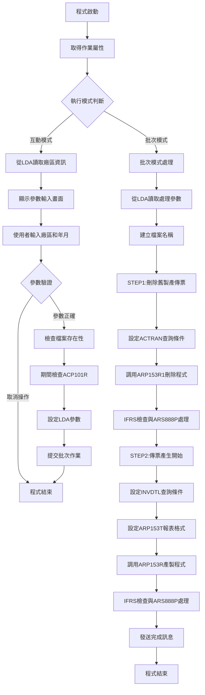
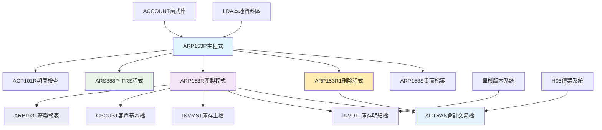
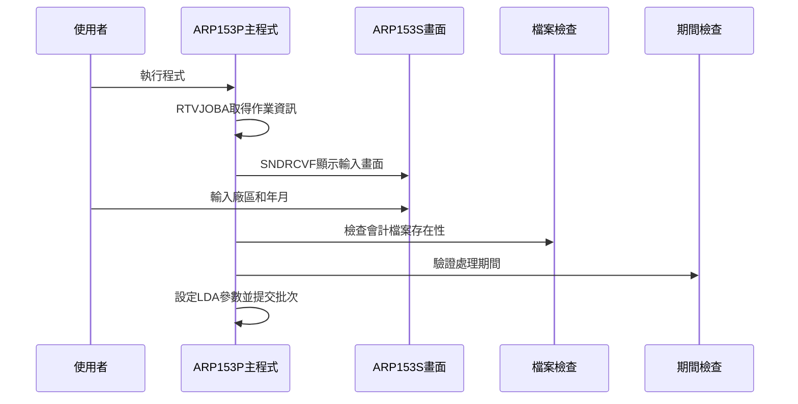
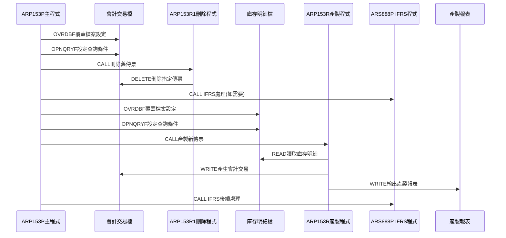
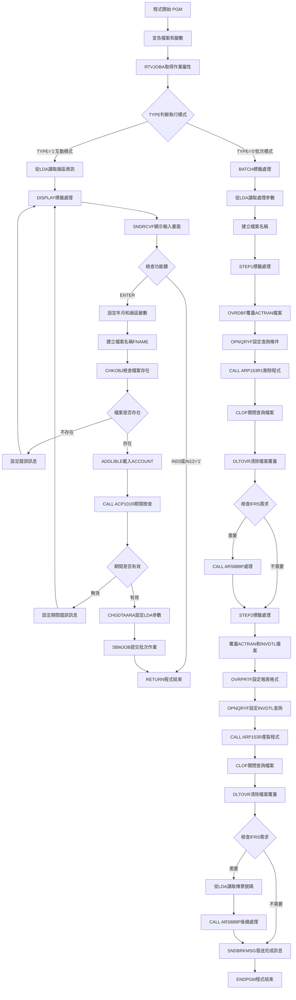

# ARP153P_H05 程式規格書

## 1. 基本資料

| 項目 | 內容 |
|------|------|
| **程式編號** | ARP153P |
| **程式名稱** | 單機版本產製傳票作業 |
| **程式類型** | CLP |
| **廠區** | H05 |
| **系統名稱** | 應收帳款系統 |
| **子系統** | 單機版本產製與傳票控制 |
| **檔案位置** | H05CLSRC_THSRC/ARP153P.txt |

## 2. 🎯 程式功能說明

### 主要功能描述
此程式為單機版本產製傳票作業的控制程式，專門處理單機版本的傳票產製與管理。程式提供互動式參數輸入功能，透過對庫存明細檔案(INVDTL)的處理，自動產製指定範圍的會計傳票。H05版本具有完整的單機版本控制機制、兩階段處理功能、以及詳細的傳票產製報表輸出。程式特別針對單機版本業務設計，確保單機版本傳票的準確性和完整性，同時提供IFRS合規性支援和完整的處理軌跡記錄。

### 🎯 業務流程詳細說明

#### 完整業務流程圖


#### 業務流程關鍵階段說明

**第一階段：系統環境初始化與模式判斷**
- 取得作業相關資訊(OUTQ、TYPE、USER)
- 判斷是互動模式還是批次模式
- 從LDA讀取廠區代號和設備資訊
- 設定單機版本產製的基礎執行環境

**第二階段：互動式參數收集與驗證**
- 顯示ARP153S參數輸入畫面
- 使用者輸入傳票廠區(P/M/T/H/K)
- 使用者輸入傳票年月(YYYYMM)
- 驗證參數的合法性和有效性

**第三階段：檔案存在性檢查與期間驗證**
- 動態建立檔案名稱(AC+廠區+R)
- 檢查會計檔案是否存在(CHKOBJ)
- 加載ACCOUNT函式庫
- 調用ACP101R進行期間檢查

**第四階段：批次作業參數設定與提交**
- 將廠區和年月參數寫入LDA(位置301-307)
- 提交批次作業到ARJOBD作業描述
- 使用指定的輸出佇列
- 返回互動模式結束

**第五階段：STEP1 刪除舊製產傳票處理**
- 覆蓋ACTRAN檔案並設定共享模式
- 設定OPNQRYF查詢條件篩選C03201-C03400傳票
- 調用ARP153R1程式刪除舊的產製傳票
- 關閉查詢檔案並清除檔案覆蓋

**第六階段：IFRS合規性檢查與處理**
- 檢查年月是否小於IFRS生效日期
- 如需要則調用ARS888P進行IFRS處理
- 設定C03201-C03400的IFRS傳票號碼範圍
- 確保IFRS合規性要求

**第七階段：STEP2 傳票產生主要處理**
- 覆蓋ACTRAN和INVDTL檔案設定
- 設定ARP153T報表格式(132欄位寬度)
- 使用OPNQRYF篩選庫存明細記錄
- 調用ARP153R程式執行傳票產製

**第八階段：庫存明細篩選與傳票生成**
- 篩選IVACNT='3'(帳務類型3)
- 篩選IVFL03='K'(標記為K)
- 篩選指定年月和廠區的記錄
- 篩選IVMAK1第一位為'S'的記錄

**第九階段：IFRS後續處理與完成通知**
- 再次檢查IFRS合規性要求
- 從LDA讀取產生的傳票號碼範圍
- 調用ARS888P進行IFRS後續處理
- 發送完成訊息給使用者

#### 🎯 H05版本單機版本產製傳票特色
- **C03201-C03400專精**：專門處理C03201到C03400範圍的傳票
- **兩階段處理**：先刪除舊傳票再產生新傳票確保資料一致性
- **IFRS完整支援**：提供完整的IFRS合規性檢查和處理
- **132欄位報表**：使用標準寬度報表確保資訊完整顯示

#### 多層次檢查機制
- **檔案存在性檢查**：透過CHKOBJ確保會計檔案存在
- **期間有效性檢查**：透過ACP101R驗證處理期間
- **庫存條件檢查**：檢查庫存明細的多重條件
- **IFRS合規性檢查**：雙重IFRS檢查確保合規性

#### 智能處理邏輯
- 自動判斷單機版本的處理需求
- 動態建立檔案名稱適應不同廠區
- 智能篩選符合條件的庫存記錄
- 自動產製會計傳票並更新相關檔案

#### 資料一致性確保機制
- 透過兩階段處理確保傳票產製的一致性
- 使用查詢條件確保只處理符合條件的記錄
- 分階段處理確保各步驟資料同步
- 記錄詳細的處理軌跡供後續查核

#### H05版本單機版本產製傳票專業設計理念
- **單機專精**：專門處理單機版本的傳票產製，與其他版本明確區分
- **產製機制完整**：提供完整的傳票刪除和產生機制
- **報表功能豐富**：提供詳細的產製報表和統計資訊
- **H05特殊適配**：專為H05廠區的單機版本業務特色設計

## 3. 🎯 檔案架構與關聯圖

### 使用檔案清單

| 檔案名稱 | 檔案類型 | 使用方式 | 說明 |
|----------|----------|----------|------|
| **ARP153S** | DSPF | DCLF/DECLARED | 單機版本產製傳票輸入畫面檔案 |
| **ACTRAN** | 邏輯檔 | O/OUTPUT | 會計交易檔案(單機版本產製) |
| **INVDTL** | 邏輯檔 | IP/INPUT | 庫存明細檔案 |
| **INVMST** | 邏輯檔 | IF/INPUT | 庫存主檔案 |
| **CBCUST** | 邏輯檔 | IF/INPUT | 客戶基本資料檔案 |
| **ARP153T** | PRTF | O/OUTPUT | 單機版本產製傳票報表 |

### 🎯 檔案關聯詳細視覺化圖表



### 🎯 H05版本特殊資料流向說明

#### 環境準備階段的資料流向


#### H05版本單機版本產製階段的資料流向


## 4. 🎯 檔案欄位規格說明

### 主要資料結構

#### 使用檔案清單
| 檔案名稱 | 檔案類型 | 使用方式 | 說明 |
|----------|----------|----------|------|
| **ARP153S** | DSPF | DCLF/DECLARED | 單機版本產製傳票參數輸入畫面檔案 |
| **ACTRAN** | 邏輯檔 | O/OUTPUT | 會計交易檔案，動態綁定至AC+廠區+R |
| **INVDTL** | 邏輯檔 | INPUT/QUERY | 庫存明細檔案，產製傳票資料來源 |

### 🔍 重點欄位切割技術詳解

#### DS結構完整分析

##### CLP變數宣告結構切割分析
```
ARP153P程式變數空間配置 (13個變數)：[________程式變數宣告區________]
┌─────────────────────────────────────────────────────────┐
│ 變數順序 │ 變數名稱  │ 型態 │ 長度 │ 用途說明             │
├─────────────────────────────────────────────────────────┤
│ DCL-1    │ &P#YYMM  │ CHAR │ 6    │ 期間檢查年月參數     │
│ DCL-2    │ &P#CODE  │ CHAR │ 1    │ 期間檢查回傳代碼     │
│ DCL-3    │ &INT     │ CHAR │ 1    │ 執行模式判斷變數     │
│ DCL-4    │ &OUTQ    │ CHAR │ 10   │ 輸出佇列名稱         │
│ DCL-5    │ &USER    │ CHAR │ 10   │ 使用者識別代碼       │
│ DCL-6    │ &AREA    │ CHAR │ 1    │ 處理廠區代碼         │
│ DCL-7    │ &YYMM    │ CHAR │ 6    │ 處理年月主變數       │
│ DCL-8    │ &YY      │ CHAR │ 4    │ 年份切割變數         │
│ DCL-9    │ &MM      │ CHAR │ 2    │ 月份切割變數         │
│ DCL-10   │ &FNAME   │ CHAR │ 10   │ 會計檔案名稱         │
│ DCL-11   │ &MNAME   │ CHAR │ 10   │ 月份檔案名稱         │
│ DCL-12   │ &D#VNO1  │ CHAR │ 6    │ IFRS傳票起始號碼     │
│ DCL-13   │ &D#VNO2  │ CHAR │ 6    │ IFRS傳票結束號碼     │
└─────────────────────────────────────────────────────────┘
```

**欄位切割視覺化展示**：
```
年月切割邏輯：&YYMM(6字元) → &YY(4字元) + &MM(2字元)
位置切割：    [YYYY][MM]
             ↓     ↓
範例：       [2024][12] → 2024年12月

檔案名稱組合邏輯：'AC' + &AREA + 'R' → &FNAME(10字元)
組合示例：   'AC' + 'H' + 'R' = 'ACHR'
用途：       會計檔案動態命名
```

**實際數據範例說明**：
```
範例變數設定：
├── &YYMM = '202412' (2024年12月)
├── &YY = '2024' (切割年份)  
├── &MM = '12' (切割月份)
├── &AREA = 'H' (H05廠區)
├── &FNAME = 'ACHR' (H05會計檔案)
└── &MNAME = 'VR12' (12月檔案)

在程式中的應用：
- 年份範圍檢查: &YY COMP '2024'
- 月份驗證: &MM COMP '01' THROUGH '12'
- 檔案動態綁定: OVRDBF FILE(ACTRAN) TOFILE(&FNAME)
```

##### LDA本地資料區切割分析
```
LDA資料空間配置 (1024字元總空間)：[____________LDA配置圖____________]
位置範圍:    201    211    301    307    951         1011      1021
            ↓      ↓      ↓      ↓      ↓           ↓         ↓
IFRS區:     [VNO1_][VNO2_]                         IFRS傳票號碼區(12字元)
參數區:              [YYMM_][A]                    批次參數區(7字元)
顯示區:                        [____COMP____][_DEVI_][T]  顯示資料區(46字元)
```

**欄位切割視覺化展示**：
```
LDA完整空間結構圖：
位置: 001         201   211   301   307      951              1011     1021
      |<-系統區->|VNO1|VNO2|<->|YYMM|A|<-預留->|____COMP____|DEVI__|T|
      [_________][____][____][_][____][_][_____][___________][______][_]
```

**切割邏輯詳細說明**：
- **位置201-206**: IFRS起始傳票號碼，固定'C03201'
- **位置211-216**: IFRS結束傳票號碼，固定'C03400'  
- **位置301-306**: 批次處理年月，YYYYMM格式
- **位置307**: 批次處理廠區，單一字元代碼
- **位置951-985**: 公司名稱顯示，35字元中文
- **位置1011-1020**: 設備名稱識別，10字元英數
- **位置1021**: 廠區代碼，單一字元識別

**實際數據範例說明**：
```
LDA實際配置範例：
├── 位置201-206: 'C03201' (IFRS起始傳票)
├── 位置211-216: 'C03400' (IFRS結束傳票)
├── 位置301-306: '202412' (處理年月)
├── 位置307: 'H' (H05廠區)
├── 位置951-985: '東鋼鋼鐵股份有限公司             ' (35字元)
├── 位置1011-1020: 'H05TERM01 ' (10字元)
└── 位置1021: 'H' (廠區標識)

在程式中的操作：
- 讀取: RTVDTAARA DTAARA(*LDA (301 6)) RTNVAR(&YYMM)
- 寫入: CHGDTAARA DTAARA(*LDA (301 6)) VALUE(&YYMM)
- 組合: 多個LDA位置組合為完整處理參數
```

#### 🎯 雙階段處理機制詳細分析

##### STEP1刪除階段查詢條件切割
```
ACTRAN會計交易檔查詢條件組合：[五重條件篩選機制]
┌─────────────────────────────────────────────────────────┐
│ 條件類型 │ 查詢條件          │ 變數來源  │ 邏輯說明         │
├─────────────────────────────────────────────────────────┤
│ 基本設定 │ FILE(ACTRAN)      │ 檔案名稱  │ 會計交易檔案     │
│ 處理模式 │ OPTION(*ALL)      │ 固定值    │ 全記錄處理       │
│ 號碼範圍 │ ACVRNO *GE "C03201" │ 固定值  │ 傳票號碼起始     │
│ 號碼範圍 │ ACVRNO *LE "C03400" │ 固定值  │ 傳票號碼結束     │
│ 年月條件 │ YM *EQ &YYMM      │ &YYMM     │ 處理年月篩選     │
│ 廠區條件 │ ACAREA *EQ &AREA  │ &AREA     │ 處理廠區篩選     │
│ 欄位映射 │ MAPFLD((YM ACYM)) │ 欄位轉換  │ 年月欄位對應     │
└─────────────────────────────────────────────────────────┘
```

**查詢條件組合邏輯**：
```
組合SQL條件：
'ACVRNO *GE "C03201" *AND ACVRNO *LE "C03400" *AND YM *EQ "' || &YYMM || '" *AND ACAREA *EQ "' || &AREA || '"'

實際範例：
當&YYMM='202412', &AREA='H'時：
'ACVRNO *GE "C03201" *AND ACVRNO *LE "C03400" *AND YM *EQ "202412" *AND ACAREA *EQ "H"'
```

##### STEP2產製階段查詢條件切割
```
INVDTL庫存明細檔查詢條件組合：[八重條件篩選機制]
┌─────────────────────────────────────────────────────────┐
│ 條件類型 │ 查詢條件              │ 變數來源  │ 邏輯說明       │
├─────────────────────────────────────────────────────────┤
│ 基本設定 │ FILE(INVDTL)          │ 檔案名稱  │ 庫存明細檔案   │
│ 處理模式 │ OPTION(*ALL)          │ 固定值    │ 全記錄處理     │
│ 帳務類型 │ IVACNT *EQ "3"        │ 固定值    │ 帳務類型3      │
│ 標記狀態 │ IVFL03 *EQ "K"        │ 固定值    │ 標記為K        │
│ 年月條件 │ ACD1 *EQ &YYMM        │ &YYMM     │ 處理年月篩選   │
│ 廠區條件 │ IVTXAR *EQ &AREA      │ &AREA     │ 處理廠區篩選   │
│ 狀態檢查 │ %SST(IVMAK1 1 1) *EQ "S" │ 字串切割 │ 標記第1位為S   │
│ 刪除排除 │ IVDECD *NE "D"        │ 固定值    │ 排除已刪除     │
│ 日期映射 │ MAPFLD((ACDT IVACDT)) │ 欄位轉換  │ 日期欄位對應   │
│ 年月映射 │ (ACD1 '%SST(ACDT 1 6)') │ 字串切割 │ 年月欄位切割  │
│ 排序鍵值 │ KEYFLD((IVNO)(IVPDCD)) │ 排序設定 │ 雙重排序鍵    │
└─────────────────────────────────────────────────────────┘
```

**複雜查詢條件邏輯**：
```
字串切割函數應用：
%SST(IVMAK1 1 1) *EQ %VALUES("S")
├── 功能：提取IVMAK1欄位第1個字元
├── 條件：必須等於'S'
└── 用途：只處理狀態為'S'的庫存記錄

日期欄位映射：
'%SST(ACDT 1 6)' *CHAR 6
├── 功能：從IVACDT(8字元)提取前6字元
├── 格式：YYYYMM
└── 用途：年月比較和篩選
```

#### 🎯 動態檔案名稱產生機制

##### 檔案名稱切割邏輯
```
會計檔案名稱產生：[固定前綴+變數廠區+固定後綴]
組合公式：'AC' || &AREA || 'R' → &FNAME
┌─────────────────────────────────────────────────────────┐
│ 輸入廠區 │ 檔案名稱結果 │ 檔案用途說明               │
├─────────────────────────────────────────────────────────┤
│ &AREA='P'│ &FNAME='ACPR'│ P02廠區會計檔案            │
│ &AREA='M'│ &FNAME='ACMR'│ M廠區會計檔案              │
│ &AREA='T'│ &FNAME='ACTR'│ T廠區會計檔案              │
│ &AREA='H'│ &FNAME='ACHR'│ H05廠區會計檔案            │
│ &AREA='K'│ &FNAME='ACKR'│ K02廠區會計檔案            │
└─────────────────────────────────────────────────────────┘
```

**月份檔案名稱產生**：
```
月份檔案名稱產生：[固定前綴+變數月份]
組合公式：'VR' || &MM → &MNAME
┌─────────────────────────────────────────────────────────┐
│ 輸入月份 │ 檔案名稱結果 │ 檔案用途說明               │
├─────────────────────────────────────────────────────────┤
│ &MM='01' │ &MNAME='VR01'│ 01月份處理檔案             │
│ &MM='02' │ &MNAME='VR02'│ 02月份處理檔案             │
│ &MM='03' │ &MNAME='VR03'│ 03月份處理檔案             │
│ ...      │ ...          │ ...                        │
│ &MM='12' │ &MNAME='VR12'│ 12月份處理檔案             │
└─────────────────────────────────────────────────────────┘
```

**實際數據範例說明**：
```
檔案名稱產生範例：
輸入參數：&AREA='H', &MM='12'
處理過程：
├── 步驟1: 'AC' || 'H' || 'R' = 'ACHR'
├── 步驟2: 'VR' || '12' = 'VR12'
└── 結果: &FNAME='ACHR', &MNAME='VR12'

在程式中的應用：
CHKOBJ OBJ(&FNAME) OBJTYPE(*FILE)  ← 檢查ACHR檔案存在性
OVRDBF FILE(ACTRAN) TOFILE(&FNAME) ← 動態綁定至ACHR檔案
```

#### 🎯 IFRS處理機制切割分析

##### IFRS判斷條件切割
```
IFRS處理判斷邏輯：[時間比較機制]
判斷條件：&YYMM *LT &IFRSD
┌─────────────────────────────────────────────────────────┐
│ 比較對象 │ 資料來源           │ 格式   │ 說明               │
├─────────────────────────────────────────────────────────┤
│ &YYMM    │ 使用者輸入/LDA     │ YYYYMM │ 處理年月           │
│ &IFRSD   │ ARIFRSCTL資料區    │ YYYYMM │ IFRS生效日期       │
│ 判斷結果 │ 布林值             │ T/F    │ 是否需IFRS處理     │
└─────────────────────────────────────────────────────────┘
```

**IFRS傳票號碼設定邏輯**：
```
IFRS傳票號碼固定設定：
&D#VNO1 = 'C03201' (起始傳票號碼)
&D#VNO2 = 'C03400' (結束傳票號碼)

LDA寫入邏輯：
├── 前處理：CHGDTAARA DTAARA(*LDA (201 6)) VALUE(&D#VNO1)
├── 前處理：CHGDTAARA DTAARA(*LDA (211 6)) VALUE(&D#VNO2)
├── 後處理：RTVDTAARA DTAARA(*LDA (201 6)) RTNVAR(&D#VNO1)
└── 後處理：RTVDTAARA DTAARA(*LDA (211 6)) RTNVAR(&D#VNO2)
```

**實際數據範例說明**：
```
IFRS處理範例：
假設IFRS生效日期為'202301'，處理年月為'202412'：
├── 比較：'202412' < '202301' = False
├── 結果：不需要IFRS處理
└── 動作：跳過ARS888P調用

假設處理年月為'202212'：
├── 比較：'202212' < '202301' = True  
├── 結果：需要IFRS處理
├── 設定：&D#VNO1='C03201', &D#VNO2='C03400'
└── 動作：CALL PGM(ARS888P) PARM(&AREA &YYMM &D#VNO1 &D#VNO2)
```

### 🎯 欄位挪用詳細分析

#### 挪用情況對比表

##### 變數挪用分析
| 原始定義 | 實際用途 | 變數名稱 | 資料型態 | 挪用方式 | 業務邏輯 |
|----------|----------|----------|----------|----------|----------|
| 一般字元變數 | 期間檢查參數 | &P#YYMM | CHAR(6) | 專用挪用 | ACP101R期間驗證專用 |
| 一般字元變數 | 期間檢查結果 | &P#CODE | CHAR(1) | 回傳挪用 | 期間有效性回傳代碼 |
| 一般字元變數 | 執行模式控制 | &INT | CHAR(1) | 條件挪用 | 批次/互動模式判斷 |
| 一般字元變數 | 年月主變數 | &YYMM | CHAR(6) | 核心挪用 | 處理年月主控變數 |
| 一般字元變數 | 年份切割 | &YY | CHAR(4) | 切割挪用 | 從&YYMM切割年份 |
| 一般字元變數 | 月份切割 | &MM | CHAR(2) | 切割挪用 | 從&YYMM切割月份 |
| 一般字元變數 | 檔案名稱組合 | &FNAME | CHAR(10) | 組合挪用 | 'AC'+廠區+'R'動態檔名 |
| 一般字元變數 | IFRS起始號碼 | &D#VNO1 | CHAR(6) | 固定挪用 | 固定'C03201' |
| 一般字元變數 | IFRS結束號碼 | &D#VNO2 | CHAR(6) | 固定挪用 | 固定'C03400' |

##### LDA空間挪用分析
| 原始定義 | 實際用途 | LDA位置 | 長度 | 挪用方式 | 轉換邏輯 |
|----------|----------|---------|------|----------|----------|
| LDA通用空間 | IFRS起始傳票 | 201-206 | 6 | 專用挪用 | 固定值'C03201' |
| LDA通用空間 | IFRS結束傳票 | 211-216 | 6 | 專用挪用 | 固定值'C03400' |
| LDA通用空間 | 批次年月參數 | 301-306 | 6 | 參數挪用 | 從&YYMM設定 |
| LDA通用空間 | 批次廠區參數 | 307 | 1 | 參數挪用 | 從&S#AREA設定 |
| LDA通用空間 | 公司名稱顯示 | 951-985 | 35 | 顯示挪用 | 畫面顯示用 |
| LDA通用空間 | 設備名稱顯示 | 1011-1020 | 10 | 顯示挪用 | 畫面識別用 |
| LDA通用空間 | 廠區代碼 | 1021 | 1 | 識別挪用 | 廠區標識 |

##### 檔案挪用分析
| 原始定義 | 實際用途 | 檔案邏輯名 | 實際檔案 | 挪用方式 | 綁定邏輯 |
|----------|----------|------------|----------|----------|----------|
| 固定檔案 | 動態會計檔 | ACTRAN | AC+廠區+R | 動態挪用 | OVRDBF動態綁定 |
| 固定檔案 | 庫存明細檔 | INVDTL | INVDTL | 查詢挪用 | OPNQRYF條件篩選 |
| 固定檔案 | 產製報表檔 | ARP153T | ARP153T | 格式挪用 | OVRPRTF格式設定 |

#### 挪用原因深度分析

**動態檔案處理需求**：
- &FNAME的檔案名稱組合挪用，支援多廠區動態檔案綁定
- OVRDBF動態覆蓋機制，實現一個程式處理多個廠區檔案
- 檔案存在性檢查確保處理環境的完整性

**雙階段處理架構**：
- STEP1和STEP2的分離處理，確保刪除和產製的一致性
- 不同階段使用不同的查詢條件和檔案操作
- IFRS處理機制提供合規性支援

**批次互動整合**：
- &INT變數的模式判斷挪用，支援批次和互動兩種執行模式
- LDA參數傳遞機制，實現互動參數向批次模式的無縫傳遞
- 相同程式支援不同執行環境的需求

#### 挪用方式詳細說明

**切割挪用方式**：
```
範例：年月切割挪用
原始變數：&YYMM = '202412'
切割邏輯：
├── &YY = %SST(&YYMM 1 4) = '2024'
└── &MM = %SST(&YYMM 5 2) = '12'
用途：年份和月份的獨立處理和驗證
```

**組合挪用方式**：
```
範例：檔案名稱組合挪用
組合邏輯：'AC' || &AREA || 'R'
輸入：&AREA = 'H'
結果：&FNAME = 'ACHR'
用途：動態產生會計檔案名稱
```

**條件挪用方式**：
```
範例：IFRS條件挪用
判斷條件：IF COND(&YYMM *LT &IFRSD)
挪用邏輯：
├── True：設定IFRS傳票號碼並調用ARS888P
└── False：跳過IFRS處理
用途：根據日期條件決定是否進行IFRS處理
```

#### 挪用影響評估

**正面影響**：
- 提供完整的多廠區單機版本產製支援
- 支援彈性的批次和互動模式執行
- 確保IFRS合規性處理的自動化
- 實現複雜的雙階段處理邏輯

**維護影響**：
- 變數挪用增加程式邏輯複雜性，需注意變數間的依賴關係
- LDA空間挪用需確保不同位置的資料不會相互覆蓋
- 動態檔案綁定需考量檔案命名規則的一致性
- IFRS處理邏輯需隨法規變化進行調整

### 重要變數定義表

#### 系統控制變數群組
| 變數名稱 | 資料型態 | 長度 | 初始值 | 使用範圍 | 功能說明 |
|----------|----------|------|--------|----------|----------|
| **&INT** | CHAR | 1 | RTVJOBA | 全程式控制 | 執行模式判斷('0'=批次,'1'=互動) |
| **&OUTQ** | CHAR | 10 | RTVJOBA | 報表輸出 | 輸出佇列名稱 |
| **&USER** | CHAR | 10 | RTVJOBA | 使用者識別 | 執行使用者代碼 |

#### 處理參數變數群組  
| 變數名稱 | 資料型態 | 長度 | 初始值 | 使用範圍 | 功能說明 |
|----------|----------|------|--------|----------|----------|
| **&AREA** | CHAR | 1 | LDA1021 | 廠區控制 | 處理廠區代碼(P/M/T/H/K) |
| **&YYMM** | CHAR | 6 | 畫面輸入 | 時間控制 | 處理年月主變數(YYYYMM) |
| **&YY** | CHAR | 4 | %SST(&YYMM) | 年份控制 | 年份切割變數 |
| **&MM** | CHAR | 2 | %SST(&YYMM) | 月份控制 | 月份切割變數 |

#### 期間檢查變數群組
| 變數名稱 | 資料型態 | 長度 | 初始值 | 使用範圍 | 功能說明 |
|----------|----------|------|--------|----------|----------|
| **&P#YYMM** | CHAR | 6 | &S#YYMM | ACP101R調用 | 期間檢查專用年月參數 |
| **&P#CODE** | CHAR | 1 | ACP101R回傳 | 驗證結果 | 期間有效性回傳代碼 |

#### 檔案名稱變數群組
| 變數名稱 | 資料型態 | 長度 | 組合邏輯 | 使用範圍 | 功能說明 |
|----------|----------|------|----------|----------|----------|
| **&FNAME** | CHAR | 10 | 'AC'+&AREA+'R' | 檔案控制 | 會計檔案動態名稱 |
| **&MNAME** | CHAR | 10 | 'VR'+&MM | 檔案控制 | 月份檔案名稱 |

#### IFRS處理變數群組
| 變數名稱 | 資料型態 | 長度 | 固定值 | 使用範圍 | 功能說明 |
|----------|----------|------|--------|----------|----------|
| **&D#VNO1** | CHAR | 6 | 'C03201' | IFRS處理 | IFRS起始傳票號碼 |
| **&D#VNO2** | CHAR | 6 | 'C03400' | IFRS處理 | IFRS結束傳票號碼 |
| **&IFRSD** | CHAR | 6 | ARIFRSCTL | IFRS判斷 | IFRS生效日期 |

#### LDA空間配置表
| LDA位置 | 長度 | 資料型態 | 存取方式 | 使用範圍 | 功能說明 |
|---------|------|----------|----------|----------|----------|
| **201-206** | 6 | CHAR | 讀寫 | IFRS處理 | IFRS起始傳票號碼 |
| **211-216** | 6 | CHAR | 讀寫 | IFRS處理 | IFRS結束傳票號碼 |
| **301-306** | 6 | CHAR | 寫入 | 批次參數 | 批次處理年月 |
| **307** | 1 | CHAR | 寫入 | 批次參數 | 批次處理廠區 |
| **951-985** | 35 | CHAR | 讀取 | 畫面顯示 | 公司名稱 |
| **1011-1020** | 10 | CHAR | 讀取 | 畫面顯示 | 設備名稱 |
| **1021** | 1 | CHAR | 讀取 | 廠區識別 | 廠區代碼 |

#### 畫面欄位變數群組
| 變數名稱 | 資料型態 | 長度 | 資料來源 | 使用範圍 | 功能說明 |
|----------|----------|------|----------|----------|----------|
| **&S#COMP** | CHAR | 35 | LDA951-985 | ARP153S顯示 | 公司名稱顯示 |
| **&S#DEVI** | CHAR | 10 | LDA1011-1020 | ARP153S顯示 | 設備名稱顯示 |
| **&S#AREA** | CHAR | 1 | 畫面輸入 | ARP153S輸入 | 廠區代碼輸入 |
| **&S#YYMM** | CHAR | 6 | 畫面輸入 | ARP153S輸入 | 年月輸入 |
| **&S#ERR** | CHAR | 70 | 錯誤處理 | 錯誤顯示 | 錯誤訊息顯示 |


## 5. 🎯 輸出/入螢幕布局

### 螢幕布局完整視覺化

```
+------------------------------------------------------------------------------+
|[日期]                東鋼鋼鐵股份有限公司                          ARP153S   |
|[時間]             單機版本產製傳票作業                          [設備名稱]   |
|                                                                              |
|                                                                              |
|                                                                              |
|                                                                              |
|                                                                              |
|        傳票廠區: [_] ( P:台鋼-M:台鋼-T:其他-H:其他--K:高雄)                  |
|                                                                              |
|        傳票年月: [______]                                                    |
|                                                                              |
|                                                                              |
|                                                                              |
|        注意事項：此作業僅供已完成月結帳務處理廠區進行處理。                  |
|                                                                              |
|                                                                              |
|                                                                              |
|                                                                              |
|                                                                              |
|                                                                              |
|                                                                              |
|                                                                              |
|           F3/F12:結束                    ENTER:執行                          |
|[錯誤訊息顯示區]                                                              |
+------------------------------------------------------------------------------+
```

### 🎯 畫面欄位詳細說明

| 欄位名稱 | 欄位屬性 | 位置 | 長度 | 輸入格式 | 驗證規則 | 說明 |
|----------|----------|------|------|----------|----------|------|
| **S#COMP** | 顯示 | 1,23 | 35 | 中文字元 | 唯讀 | 公司名稱顯示 |
| **S#DEVI** | 顯示 | 2,70 | 10 | 英數字元 | 唯讀 | 設備名稱顯示 |
| **S#AREA** | 輸入/輸出 | 8,36 | 1 | 英文字元 | 廠區代號 | 傳票廠區代號 |
| **S#YYMM** | 輸入/輸出 | 10,36 | 6 | YYYYMM | 年月格式 | 傳票年月 |
| **S#ERR** | 顯示 | 24,2 | 70 | 中文字元 | 唯讀 | 錯誤訊息顯示區 |

### 🎯 畫面控制邏輯

#### 指示器控制說明
- **IN03**: F3功能鍵，程式結束
- **IN12**: F12功能鍵，程式結束

#### 畫面基本資訊顯示
- **日期時間顯示**：系統當前日期和時間
- **公司名稱**：從LDA位置951-985讀取
- **設備名稱**：從LDA位置1011-1020讀取
- **程式標識**：顯示ARP153S

### 功能鍵詳細定義

| 功能鍵 | 處理邏輯 | 系統行為 | 說明 |
|--------|----------|----------|------|
| **F3** | 設定IN03='1' | 程式立即返回結束 | 離開程式不執行任何處理 |
| **F12** | 設定IN12='1' | 程式立即返回結束 | 離開程式不執行任何處理 |
| **ENTER** | 執行驗證與處理 | 驗證輸入後執行產製 | 執行主要單機版本產製邏輯 |

### 輸入驗證機制

#### 廠區驗證
- S#AREA欄位限定P、M、T、H、K等有效廠區代號
- 檢查廠區代號是否與系統設定一致
- 確認廠區代號的有效性

#### 年月驗證
- S#YYMM欄位使用EDTCDE(4)格式顯示
- 檢查年月格式的正確性(YYYYMM)
- 透過ACP101R驗證期間的有效性
- 確認年月符合會計期間要求

#### 檔案存在性驗證
- 動態檢查會計檔案(AC+廠區+R)是否存在
- 使用CHKOBJ進行檔案存在性檢查
- 檔案不存在時顯示詳細錯誤訊息

#### H05版本特殊驗證
- 檢查ACCOUNT函式庫的可用性
- 驗證傳票產製的必要條件
- 確認月結帳務處理狀態

### 操作流程
1. 畫面顯示時自動載入系統資訊和使用者資訊
2. 使用者輸入傳票廠區代號(P/M/T/H/K)
3. 輸入傳票年月(YYYYMM格式)
4. 系統驗證檔案存在性和期間有效性
5. 按ENTER鍵提交批次作業執行單機版本產製
6. 系統產生產製報表並完成處理

## 6. 🎯 處理流程程序說明

### 🎯 主程序邏輯深度分析

#### H05版本程式執行流程圖


#### 🎯 H05版本單機版本產製傳票特殊步驟分析

**步驟1-4：基礎環境與模式分派**
- 宣告ARP153S畫面檔案和系統處理變數
- 取得作業屬性判斷是批次模式還是互動模式
- 互動模式從LDA讀取廠區和設備資訊
- 建立單機版本產製的基礎執行環境

**步驟5-8：互動模式參數輸入與驗證**
- 顯示ARP153S參數輸入畫面
- 使用者輸入傳票廠區和年月參數
- 檢查F3/F12功能鍵決定是否結束程式
- 設定年月、廠區和檔案名稱變數

**步驟9-12：檔案存在性檢查與期間驗證**
- 使用CHKOBJ檢查會計檔案是否存在
- 載入ACCOUNT函式庫進行會計處理
- 調用ACP101R程式進行期間有效性檢查
- 驗證失敗時返回輸入畫面重新設定

**步驟13-15：批次作業參數設定與提交**
- 將處理年月寫入LDA位置301-306
- 將處理廠區寫入LDA位置307
- 提交批次作業到ARJOBD並使用指定輸出佇列

**步驟16-19：STEP1 刪除舊製產傳票處理**
- 覆蓋ACTRAN檔案並設定共享模式
- 使用OPNQRYF設定查詢條件篩選C03201-C03400傳票
- 調用ARP153R1程式刪除指定範圍的舊傳票
- 關閉查詢檔案並清除檔案覆蓋設定

**步驟20-21：IFRS合規性檢查與處理**
- 檢查處理年月是否小於IFRS生效日期
- 如需要則設定C03201-C03400的IFRS傳票號碼
- 調用ARS888P程式進行IFRS相關處理
- 確保IFRS合規性要求

**步驟22-25：STEP2 傳票產生環境設定**
- 覆蓋ACTRAN和INVDTL檔案並設定共享模式
- 設定ARP153T報表格式(132欄位寬度、10CPI)
- 設定報表保留和使用者資料為'單版產製'
- 準備傳票產生的完整環境

**步驟26-29：庫存明細查詢與傳票產製**
- 使用OPNQRYF設定複雜的庫存明細查詢條件
- 篩選IVACNT='3'、IVFL03='K'等特定條件
- 調用ARP153R程式執行實際的傳票產製
- 產生會計交易記錄和產製報表

**步驟30-32：IFRS後續處理與完成通知**
- 再次檢查IFRS合規性要求
- 從LDA位置201-216讀取產生的傳票號碼範圍
- 調用ARS888P進行IFRS後續處理和記錄

**步驟33：作業完成訊息發送**
- 發送單機版本產製傳票作業完成訊息
- 通知指定的使用者作業執行狀態
- 提供作業完成確認和後續追蹤

#### 業務邏輯深度解析

**H05版本單機版本產製傳票的核心邏輯**：
1. 專門處理單機版本的傳票產製作業
2. 支援完整的兩階段處理機制(刪除+產生)
3. 提供完整的IFRS合規性檢查和處理
4. 單機版本專業化處理的完整實現

**H05版本安全控制機制**：
1. 檔案存在性檢查確保處理環境正確
2. 期間有效性檢查確保處理時機適當
3. 兩階段處理確保資料一致性
4. IFRS檢查確保合規性要求

#### 條件判斷詳細說明

**H05版本ACTRAN篩選條件**：
- `ACVRNO *GE "C03201" *AND ACVRNO *LE "C03400"` - 傳票號碼範圍
- `YM *EQ 年月 *AND ACAREA *EQ 廠區` - 年月和廠區限制

**H05版本INVDTL篩選條件**：
- `IVACNT *EQ "3"` - 帳務類型3
- `IVFL03 *EQ "K"` - 標記為K
- `%SST(IVMAK1 1 1) *EQ %VALUES("S")` - 標記為S

**H05版本IFRS判斷邏輯**：
- `&YYMM *LT &IFRSD` - 年月小於IFRS生效日期
- 符合條件時調用ARS888P進行IFRS處理

#### 變數使用和數據流向追蹤

**H05版本特殊變數軌跡**：
1. LDA位置301-307的參數設定和讀取軌跡
2. 檔案名稱動態生成和檢查軌跡
3. IFRS傳票號碼設定和處理軌跡
4. 兩階段處理的檔案操作軌跡

### 🎯 H05版本子程序邏輯分析

#### H05版本子程序調用順序
1. **ACP101R程式**：期間有效性檢查，驗證處理年月的合法性
2. **ARP153R1程式**：刪除舊傳票，清除指定範圍的舊產製傳票
3. **ARS888P程式**：IFRS處理，處理IFRS相關的會計需求
4. **ARP153R程式**：產製新傳票，從庫存明細產生會計交易

#### H05版本單機版本產製專精設計
- 專門處理單機版本的傳票產製作業
- 支援完整的兩階段處理確保資料一致性
- 提供完整的IFRS合規性支援
- 針對H05廠區的單機版本業務特色進行優化

### 🎯 H05版本單機版本產製傳票處理邏輯

#### H05版本ACTRAN查詢條件邏輯
```sql
OPNQRYF FILE(ACTRAN) OPTION(*ALL) 
        QRYSLT('ACVRNO *GE "C03201" *AND 
                ACVRNO *LE "C03400" *AND 
                YM     *EQ 年月 *AND 
                ACAREA *EQ 廠區')
        MAPFLD((YM ACYM *CHAR 6))
```

#### H05版本INVDTL查詢條件邏輯
```sql
OPNQRYF FILE(INVDTL) OPTION(*ALL) 
        QRYSLT('(IVACNT *EQ "3") *AND 
                (IVFL03 *EQ "K") *AND 
                (ACD1   *EQ 年月) *AND 
                (IVTXAR *EQ 廠區) *AND 
                %SST(IVMAK1 1 1) *EQ %VALUES("S") *AND 
                (IVDECD *NE "D")')
        MAPFLD((ACDT IVACDT *CHAR 8)
               (ACD1 '%SST(ACDT 1 6)' *CHAR 6))
        KEYFLD((IVNO) (IVPDCD))
```

#### H05版本報表設定邏輯
```sql
OVRPRTF FILE(ARP153T) TOFILE(ARP153T) 
        PAGESIZE(*N 132) CPI(10) HOLD(*YES) 
        USRDTA('單版產製')
```
- 設定132欄位寬度適應標準報表輸出
- 使用10 CPI確保報表清晰
- 設定報表描述為「單版產製」

## 7. 🎯 數據操作與轉換分析

### H05版本檔案操作詳解

#### H05版本ACTRAN會計交易檔操作
- **OVRDBF操作**：覆蓋檔案並設定共享模式(*YES)
- **OPNQRYF操作**：設定查詢條件篩選指定傳票範圍
- **DELETE操作**：透過ARP153R1刪除舊的產製傳票
- **WRITE操作**：透過ARP153R產生新的會計交易

#### H05版本INVDTL庫存明細檔操作
- **OVRDBF操作**：覆蓋檔案並設定共享模式
- **OPNQRYF操作**：設定複雜查詢條件篩選明細記錄
- **READ操作**：讀取符合條件的庫存明細記錄
- **處理操作**：轉換為會計交易記錄

### H05版本數據轉換邏輯

#### H05版本參數轉換處理
- **年月分割**：YYMM → YY(4位) + MM(2位)
- **檔案名稱生成**：'AC' + 廠區 + 'R' → 會計檔案名稱
- **LDA參數設定**：將處理參數寫入指定LDA位置
- **日期格式轉換**：處理8位和6位日期格式

#### H05版本傳票號碼範圍轉換
- **C03201-C03400**：固定的單機版本傳票號碼範圍
- **IFRS傳票設定**：C03201和C03400作為IFRS處理範圍
- **動態號碼生成**：透過ARP153R程式動態分配傳票號碼
- **號碼追蹤記錄**：在LDA中記錄產生的傳票號碼

### H05版本檢核機制詳解

#### H05版本單機版本業務檢核
- **檔案存在性檢查**：確保會計檔案存在且可用
- **期間有效性檢查**：驗證處理年月的合法性
- **兩階段一致性檢查**：確保刪除和產生的一致性
- **IFRS合規性檢查**：檢查IFRS相關要求

#### H05版本庫存明細檢核
- **帳務類型檢查**：確保IVACNT為'3'的記錄
- **標記狀態檢查**：驗證IVFL03為'K'和IVMAK1為'S'
- **廠區匹配檢查**：確認IVTXAR與處理廠區一致
- **刪除狀態檢查**：排除IVDECD為'D'的已刪除記錄

#### H05版本資料完整性檢核
- **函式庫載入檢查**：確認ACCOUNT函式庫可用
- **檔案覆蓋檢查**：驗證檔案覆蓋設定正確
- **查詢條件檢查**：確保查詢條件的邏輯正確性
- **處理結果檢查**：驗證傳票產製的完整性

## 8. 🎯 錯誤處理程序說明

### 🎯 H05版本詳細錯誤代碼清冊

| 錯誤代碼 | 錯誤訊息 | 原因說明 | 處理方式 | 預防措施 |
|----------|---------|---------|---------|----------|
| **CPF0000** | 檔案不存在 | 會計檔案不存在或無法存取 | 1. 檢查檔案存在性<br>2. 確認檔案名稱正確<br>3. 重新建立檔案 | 確保會計檔案正確建立 |
| **期間已關閉** | 會計期間無效 | ACP101R檢查期間已關閉 | 1. 檢查會計期間設定<br>2. 確認期間開放狀態<br>3. 聯繫會計人員 | 確保在有效期間內執行 |
| **檔案無法產製** | 會計檔案無法建立傳票 | 會計檔案結構或權限問題 | 1. 檢查檔案權限<br>2. 確認檔案結構完整<br>3. 重建會計檔案 | 定期檢查會計檔案狀態 |
| **INVDTL讀取失敗** | 庫存明細檔案存取異常 | 檔案權限或存在性問題 | 1. 檢查檔案存在性<br>2. 確認存取權限<br>3. 驗證檔案結構 | 定期檢查庫存檔案狀態 |
| **查詢設定失敗** | OPNQRYF查詢條件異常 | 查詢條件語法或邏輯錯誤 | 1. 檢查查詢條件語法<br>2. 確認欄位名稱正確<br>3. 驗證邏輯條件 | 確保查詢條件正確設定 |
| **報表輸出失敗** | ARP153T報表異常 | 報表檔案或印表機問題 | 1. 檢查印表機狀態<br>2. 確認報表檔案可用<br>3. 驗證輸出設定 | 定期檢查報表輸出環境 |
| **刪除程式失敗** | ARP153R1調用異常 | 刪除程式執行異常 | 1. 檢查刪除程式狀態<br>2. 確認參數傳遞正確<br>3. 驗證刪除邏輯 | 確保刪除程式正常運作 |
| **產製程式失敗** | ARP153R調用異常 | 產製程式執行異常 | 1. 檢查產製程式狀態<br>2. 確認參數傳遞正確<br>3. 驗證產製邏輯 | 確保產製程式正常運作 |
| **IFRS處理失敗** | ARS888P調用異常 | IFRS程式執行異常 | 1. 檢查IFRS程式狀態<br>2. 確認IFRS參數正確<br>3. 驗證IFRS邏輯 | 確保IFRS程式正常運作 |
| **LDA參數錯誤** | 301-307位置參數異常 | LDA參數讀寫失敗 | 1. 檢查LDA參數設定<br>2. 確認位置可用<br>3. 驗證參數傳遞邏輯 | 確保LDA參數空間正確配置 |
| **ACCOUNT載入失敗** | 函式庫載入異常 | ACCOUNT函式庫無法載入 | 1. 檢查函式庫存在性<br>2. 確認載入路徑正確<br>3. 驗證權限設定 | 確保ACCOUNT函式庫可用 |
| **批次提交失敗** | SBMJOB提交異常 | 批次作業提交失敗 | 1. 檢查作業佇列狀態<br>2. 確認ARJOBD可用<br>3. 驗證輸出佇列設定 | 確保批次環境正常運作 |

### 🎯 H05版本系統異常處理邏輯

#### H05版本檔案操作失敗處理
- **會計檔案異常**：檢查ACTRAN檔案的可用性和完整性
- **庫存檔案異常**：確認INVDTL和INVMST檔案的正確性
- **客戶檔案異常**：處理CBCUST客戶檔案的讀取問題
- **報表檔案異常**：處理ARP153T報表檔案的輸出問題

#### H05版本程式調用失敗處理
- **期間檢查調用失敗**：處理ACP101R的調用異常
- **刪除程式調用失敗**：處理ARP153R1的調用問題
- **產製程式調用失敗**：處理ARP153R的調用異常
- **IFRS程式調用失敗**：處理ARS888P的調用問題

#### H05版本資料完整性錯誤處理
- **單機版本資料異常**：處理單機版本和傳票資料的異常情況
- **傳票號碼異常**：處理C03201-C03400範圍的異常
- **廠區條件異常**：處理廠區設定和條件的異常
- **年月條件異常**：處理年月設定和條件的異常

#### H05版本單機版本產製業務失敗處理
- **產製邏輯失敗**：處理單機版本產製業務邏輯的異常
- **兩階段處理失敗**：處理刪除和產生階段的失敗
- **IFRS處理失敗**：處理IFRS合規性檢查的失敗
- **報表輸出失敗**：處理產製報表輸出的異常

## 9. 🎯 備註

### 🎯 H05版本單機版本產製傳票特殊注意事項

#### H05版本作為單機版本產製平台
- 專門處理單機版本的傳票產製作業，確保單機版本的正確性
- 使用C03201-C03400專用傳票號碼範圍確保處理範圍的精確性
- 支援完整的兩階段處理機制確保資料一致性
- 提供完整的單機版本產製報表確保處理結果的可追蹤性

#### H05版本單機版本產製專精管理
- **C03201-C03400專用**：專門處理C03201到C03400範圍的傳票
- **兩階段處理**：先刪除舊傳票再產生新傳票確保一致性
- **IFRS完整支援**：提供完整的IFRS合規性檢查和處理
- **完整性保證**：確保單機版本產製的完整性和可追蹤性

#### H05版本檔案存在性安全機制
- **動態檔案檢查**：使用CHKOBJ檢查會計檔案存在性
- **期間有效性驗證**：透過ACP101R確保期間開放
- **函式庫載入驗證**：確保ACCOUNT函式庫可用
- **安全錯誤處理**：提供詳細的錯誤訊息和處理建議

#### H05版本庫存明細條件機制
- **多重條件篩選**：IVACNT='3'、IVFL03='K'、IVMAK1='S'
- **廠區年月限制**：嚴格限制處理廠區和年月
- **刪除狀態排除**：排除IVDECD='D'的已刪除記錄
- **排序鍵控制**：使用IVNO和IVPDCD進行排序

#### H05版本LDA參數配置
- 位置301-306：處理年月(YYYYMM格式)
- 位置307：處理廠區代號
- 位置201-206：IFRS傳票號碼起始(C03201)
- 位置211-216：IFRS傳票號碼結束(C03400)
- 位置951-985：公司名稱顯示
- 位置1011-1020：設備名稱顯示
- 位置1021：廠區代碼

#### H05版本版本演進特色
- **2022AR00013版本**：基礎單機版本產製傳票功能(111/03/10)
- 體現了單機版本產製功能的專業實現
- 反映了H05廠區單機版本業務需求的特殊設計

#### H05版本ACTRAN和INVDTL查詢條件特殊機制
- **ACTRAN篩選**：ACVRNO範圍、YM年月、ACAREA廠區
- **INVDTL篩選**：IVACNT帳務類型、IVFL03標記、IVMAK1狀態
- **日期映射**：ACDT → ACD1的年月提取映射
- **排序控制**：IVNO和IVPDCD的排序鍵設定

#### H05版本系統整合特性
- 與ACTRAN會計交易系統緊密整合
- 與INVDTL庫存明細系統完全相容
- 支援CBCUST客戶基本檔案系統的標準化處理
- 與H05廠區檔案系統和會計系統無縫銜接

#### H05版本報表輸出特性
- **標準報表設計**：132欄位寬度確保資訊完整顯示
- **字型密度控制**：10 CPI設定確保報表清晰
- **報表描述**：USRDTA('單版產製')提供報表識別
- **保留輸出**：HOLD(*YES)確保報表可供查閱

#### H05版本使用注意事項
- 執行前確保當月會計檔案已正確建立
- 注意會計期間必須為開放狀態
- 確認庫存明細資料的完整性和正確性
- 單機版本產製涉及會計控制需特別注意一致性
- 注意兩階段處理的完整性和正確性
- 確保ACCOUNT函式庫的可用性
- 處理完成後檢查ARP153T報表的產生狀況
- 留意132欄位標準報表的列印設定
- 監控IFRS處理的合規性要求
- 確認單機版本產製統計的正確性和完整性 