# ARQ001R_P02 程式規格書

## 1. 基本資料

| 項目 | 內容 |
|------|------|
| **程式編號** | ARQ001R |
| **程式名稱** | 查詢發票明細查詢作業 |
| **程式類型** | RPG |
| **廠區** | P02 |
| **系統名稱** | 應收帳款系統 |
| **子系統** | 查詢發票明細與資料瀏覽 |
| **檔案位置** | P02RPGSRC_THSRC/ARQ001R.txt |

## 2. 🎯 程式功能說明

### 主要功能描述
此程式為查詢發票明細查詢作業的主要處理程式，專門提供發票資料的查詢和瀏覽功能。程式採用三階段式畫面設計，透過發票主檔(INVMSTL2)和發票明細檔(INVDTL)的資料處理，提供完整的發票資訊查詢服務。P02版本具有雙重子檔案顯示機制、智能資料篩選功能、以及詳細的發票明細瀏覽。程式特別針對發票查詢業務設計，確保查詢結果的準確性和完整性，同時提供使用者友善的操作介面和完整的資料展示功能。

### 🎯 業務流程詳細說明

#### 完整業務流程圖


#### 業務流程關鍵階段說明

**第一階段：查詢條件輸入與驗證**
- 顯示TITLE畫面進行查詢條件輸入
- 使用者輸入發票單據號碼起始(W0101)
- 使用者輸入發票號碼起始(W0102)
- 使用者輸入發票號碼結束(W0103)

**第二階段：輸入條件檢查與驗證**
- 檢查發票單據號碼是否存在於INVMSTL2
- 驗證發票號碼範圍的合理性
- 檢查起始號碼不可大於結束號碼
- 設定相應的錯誤指示器和錯誤訊息

**第三階段：發票主檔資料查詢與準備**
- 從INVMSTL2讀取指定範圍的發票主檔資料
- 篩選發票類型(INTYPE='1','2','3')
- 計算各項金額統計(含稅金額、未稅金額、稅額)
- 區分已刪除(INDECD='D')和正常發票

**第四階段：發票清單子檔案顯示**
- 顯示SFCTL1控制的SF1子檔案
- 展示發票號碼、發票日期、各項金額資訊
- 提供統計資料(T03-T07)
- 支援使用者選擇特定發票進行明細查看

**第五階段：發票明細資料查詢與處理**
- 根據選擇的發票從INVDTL讀取明細資料
- 顯示發票表頭資訊(客戶、訂單等)
- 讀取最多220筆明細記錄(防止資料過多)
- 計算明細總金額(TTLAMT)

**第六階段：發票明細子檔案顯示**
- 顯示SFLCTL控制的SFLREC子檔案
- 展示明細項目、帳務代號、產品代號等
- 顯示數量、單價、金額、帳務日期
- 提供完整的明細資訊瀏覽功能

#### 🎯 P02版本查詢發票明細查詢特色
- **雙重子檔案**：SF1顯示發票清單，SFLREC顯示明細資料
- **220筆限制**：防止資料量過大造成顯示問題
- **完整統計**：提供各項金額的合計統計
- **三畫面設計**：條件輸入→清單瀏覽→明細查看

#### 多層次檢查機制
- **條件輸入檢查**：驗證發票單據號碼和號碼範圍
- **資料存在性檢查**：確認發票主檔資料存在
- **範圍合理性檢查**：檢查起始結束號碼邏輯
- **資料完整性檢查**：確保查詢結果的完整性

#### 智能處理邏輯
- 自動判斷發票類型並進行不同的金額計算
- 動態篩選正常和已刪除的發票資料
- 智能限制明細顯示數量防止系統負載
- 自動計算統計資料提供決策參考

#### 資料一致性確保機制
- 透過KLIST建立正確的檔案讀取鍵值
- 使用指示器控制子檔案的顯示狀態
- 分階段處理確保各步驟資料同步
- 記錄詳細的查詢軌跡供後續分析

#### P02版本查詢發票明細查詢專業設計理念
- **查詢專精**：專門提供發票資料的查詢和瀏覽功能
- **使用者導向**：三階段操作流程符合使用者習慣
- **效能優化**：限制資料量確保查詢效能
- **P02特殊適配**：專為P02廠區的發票查詢需求設計

## 3. 🎯 檔案架構與關聯圖

### 使用檔案清單

| 檔案名稱 | 檔案類型 | 使用方式 | 說明 |
|----------|----------|----------|------|
| **ARQ001S** | DSPF | CF/COMBINED | 查詢發票明細查詢畫面檔案 |
| **INVMSTL2** | 邏輯檔 | IF/INPUT | 發票主檔案(邏輯檔2) |
| **INVDTL** | 邏輯檔 | IF/INPUT | 發票明細檔案 |

### 🎯 檔案關聯詳細視覺化圖表


### 🎯 P02版本特殊資料流向說明

#### 查詢條件輸入階段的資料流向


#### P02版本發票查詢階段的資料流向


## 4. 🎯 檔案欄位規格說明

### 主要資料結構

#### 使用檔案清單
| 檔案名稱 | 檔案類型 | 使用方式 | 說明 |
|----------|----------|----------|------|
| **ARQ001S** | DSPF | CF/COMBINED | 查詢發票明細查詢畫面檔案，三階段畫面設計 |
| **INVMSTL2** | 邏輯檔 | IF/INPUT | 發票主檔案(邏輯檔L2)，主要查詢檔案 |
| **INVDTL** | 邏輯檔 | IF/INPUT | 發票明細檔案，明細資料來源 |

### 🔍 重點欄位切割技術詳解

#### DS結構完整分析

##### AADS日期資料結構切割分析
```
AADS日期資料結構 (6字元)：[_____日期資料_____]
位置:                      21            26
                           ↓             ↓
位置21-26:                [YMD___]       年月日資料(6字元)
```

**日期資料三重切割邏輯**：
```
YMD年月日資料 (6字元)：[年|月|日]
位置:                  21 22 23 24 25 26
                       ↓  ↓  ↓  ↓  ↓  ↓
YY(21-22):            [91]           年份(2字元)
MM(23-24):               [12]        月份(2字元)
DD(25-26):                  [31]     日期(2字元)
```

**切割邏輯詳細說明**：
- **YMD (21-26)**: 完整日期欄位，供格式化顯示使用
- **YY (21-22)**: 年份部分，用於年度控制邏輯
- **MM (23-24)**: 月份部分，用於月份範圍控制
- **DD (25-26)**: 日期部分，用於日期驗證邏輯

##### UDS使用者資料空間切割分析
```
UDS使用者資料空間完整結構：[___________使用者資料___________]
位置範圍:                    951               1021
                             ↓                 ↓
COMP區段:                   [COMP____]         公司名稱(35字元)
DEVNM區段:                           [DEVNM__] 設備名稱(10字元)
TXAR區段:                                   [T] 交易廠區(1字元)
```

**UDS三重切割功能說明**：
```
位置951-985:  COMP公司名稱   → 35字元 → 畫面標題顯示控制
位置1011-1020: DEVNM設備名稱 → 10字元 → 設備識別控制
位置1021:     TXAR交易廠區  → 1字元  → P02廠區標識控制
```

#### 🎯 雙重KLIST查詢鍵值系統詳細分析

##### INKEY發票主檔查詢鍵值結構
```
INKEY KLIST結構分析：[主檔查詢組合鍵]
┌─────────────────────────────────────────────────┐
│ KFLD1: INORNO  │ 6字元 │ 發票單據號碼 │ 主要識別 │
│ KFLD2: INNO    │ 8字元 │ 發票號碼     │ 次要識別 │
└─────────────────────────────────────────────────┘
```

**INKEY組合鍵使用邏輯**：
- **查詢起點設定**: MOVEL W0101→INORNO, MOVEL W0102→INNO
- **範圍查詢控制**: SETLL INVMSTL2, READE範圍讀取
- **結束條件檢查**: INNO COMP W0103判斷結束範圍
- **檔案定位策略**: 先定位起始點，再順序讀取至結束點

##### IVKEY發票明細查詢鍵值結構
```
IVKEY KLIST結構分析：[明細查詢組合鍵]
┌─────────────────────────────────────────────────┐
│ KFLD1: IVNO    │ 8字元 │ 發票號碼     │ 主要識別 │
│ KFLD2: IVACNT  │ 3字元 │ 帳務代號     │ 次要識別 │
│ KFLD3: IVITEM  │ 3字元 │ 項目編號     │ 第三識別 │
└─────────────────────────────────────────────────┘
```

**IVKEY三重組合鍵邏輯**：
- **明細定位**: MOVEL W01→IVNO 設定查詢發票
- **帳務初始化**: MOVE *BLANK→IVACNT 從最小帳務開始
- **項目初始化**: Z-ADD 0→IVITEM 從最小項目開始
- **順序讀取控制**: SETLL定位+READE順序讀取單一發票的所有明細

#### 🎯 三階段畫面控制系統

##### 畫面流程控制切割分析
```
SCRN畫面控制邏輯：[三階段查詢流程]
初始化 → SCRN='1' → SR#01條件輸入畫面
驗證成功 → SCRN='2' → SR#02發票清單畫面  
選擇發票 → SCRN='3' → SR#03明細顯示畫面
```

**三階段控制變數詳細分析**：
```
階段1控制變數：
├── SCRN='1'     → 條件輸入畫面控制
├── W0101-W0103  → 查詢範圍變數
├── ERRMSG       → 錯誤訊息控制
└── 指示器41-43,99 → 輸入驗證控制

階段2控制變數：
├── SCRN='2'     → 發票清單畫面控制
├── RRN          → SF1子檔案記錄號
├── T03-T07      → 統計金額變數
├── ACT          → 使用者選擇動作
└── W01-W08      → 發票清單顯示變數

階段3控制變數：
├── SCRN='3'     → 明細顯示畫面控制
├── RRN2         → SFLREC子檔案記錄號
├── TTLAMT       → 明細總金額統計
├── ITEM-DECD    → 明細顯示變數
└── 220筆限制    → P02版本效能平衡
```

#### 🎯 雙重子檔案架構詳細分析

##### SF1發票清單子檔案結構
```
SF1子檔案資料流向：INVMSTL2 → PR#02處理 → SF1顯示
┌─────────────────────────────────────────────────┐
│ RRN記錄號    │ 自動遞增   │ 子檔案記錄控制      │
│ ACT選擇      │ 使用者輸入 │ 'Y'選擇該筆發票     │
│ W01發票號碼  │ INNO      │ 發票識別顯示        │
│ W02發票日期  │ ININDT    │ 發票日期顯示        │
│ W03未稅金額  │ 依類型計算 │ 未稅金額統計        │
│ W04發票金額  │ INCAMT    │ 發票總金額顯示      │
│ W05含稅金額  │ 依類型計算 │ 含稅金額統計        │
│ W06稅額合計  │ 三稅合計   │ 稅額統計顯示        │
│ W07應收餘額  │ INNBAL    │ 未收金額顯示        │
│ W08作廢標記  │ 'V'/' '   │ 作廢狀態標示        │
└─────────────────────────────────────────────────┘
```

##### SFLREC明細子檔案結構
```
SFLREC子檔案資料流向：INVDTL → PR#03處理 → SFLREC顯示
┌─────────────────────────────────────────────────┐
│ RRN2記錄號   │ 自動遞增   │ 明細記錄控制(限220)  │
│ ITEM項目編號 │ IVITEM    │ 明細項目識別         │
│ ACNT帳務代號 │ IVACNT    │ 帳務分類識別         │
│ PDNM產品代號 │ IVPDCD    │ 產品代號顯示         │
│ QTY數量      │ IVQTY     │ 明細數量顯示         │
│ UPRC單價     │ IVUPRC    │ 明細單價顯示         │
│ AMT金額      │ IVAMT     │ 明細金額顯示         │
│ ACDT帳務日期 │ IVACDT    │ 帳務日期顯示         │
│ APNO單據號碼 │ IVAPNO    │ 相關單據號碼         │
│ ACNO分錄號碼 │ IVACNO    │ 分錄識別號碼         │
│ DECD刪除代號 │ IVDECD    │ 刪除狀態標示         │
└─────────────────────────────────────────────────┘
```

#### 🎯 發票類型金額計算邏輯系統

##### 三種發票類型處理機制
```
發票類型判斷流程：INTYPE → 金額計算邏輯 → 統計累計
┌─────────────────────────────────────────────────┐
│ INTYPE='1'   │ 一般銷貨   │ W03=INAAMT, W05=INBAMT+INDAMT │
│ INTYPE='2'   │ 預收款     │ W03=0, W05=INAAMT              │
│ INTYPE='3'   │ 產製發票   │ W03=INAAMT, W05=INBAMT+INDAMT │
│ 其他類型     │ 跳過處理   │ ITER不進入統計                 │
└─────────────────────────────────────────────────┘
```

**類型2預收款特殊處理邏輯**：
```
類型2發票金額切割：
W03未稅金額 = 0          ← 預收款無未稅概念
W05含稅金額 = INAAMT     ← 直接使用A金額
稅額計算 = INATAX + INCTAX + INDTAX  ← 三稅合計
```

**類型1和類型3標準處理邏輯**：
```
標準發票金額切割：
W03未稅金額 = INAAMT              ← 使用A金額作為未稅
W05含稅金額 = INBAMT + INDAMT     ← B金額+D金額作為含稅
稅額計算 = INATAX + INCTAX + INDTAX  ← 三稅合計
```

#### 🎯 P02版本220筆明細限制機制

##### 明細讀取控制邏輯
```
明細數量控制流程：RRN2計數 → 220筆檢查 → 效能平衡
┌─────────────────────────────────────────────────┐
│ 初始設定     │ RRN2=0     │ 明細記錄號初始化     │
│ 讀取條件     │ RRN2<220   │ 最大220筆限制        │
│ 過濾條件     │ IVFLAG≠'D' │ 非刪除記錄篩選       │
│ 金額累計     │ TTLAMT累加 │ 有效明細金額統計     │
│ 記錄寫入     │ WRITE SFLREC │ 子檔案記錄建立     │
└─────────────────────────────────────────────────┘
```

**220筆限制的技術實現與版本演進**：
```
DO WHILE迴圈控制：
原始190筆限制 (0908A前)：RRN2 DOWLT 190  ← 較嚴格限制
修正220筆限制 (0908A後)：RRN2 DOWLT 220  ← 平衡效能和資料完整性
*IN97 ANDEQ '0'                          ← 檔案未結束時繼續
W01 READE INVDTL                         ← 讀取同一發票明細
IVFLAG IFNE 'D'                          ← 非刪除記錄才處理
ADD 1 RRN2                               ← 記錄號遞增
ADD IVAMT TTLAMT                         ← 金額累計
WRITE SFLREC                             ← 寫入子檔案
```

**P02版本109/08/12更新說明**：
```
版本更新重點：
- 原因：發票明細資料過多導致顯示問題
- 解決：增加第二個SFL顯示功能
- 調整：將明細限制從190筆提升至220筆
- 目標：平衡效能與資料完整性顯示需求
```

### 🎯 欄位挪用詳細分析

#### 查詢條件欄位挪用對比表
| 原始用途 | 挪用後用途 | 欄位名稱 | 長度 | 挪用原因 | 影響分析 |
|----------|------------|----------|------|----------|----------|
| **一般輸入欄位** | 發票單據號碼起始 | W0101 | 6 | 查詢範圍控制需要 | 提供精確的單據範圍查詢 |
| **一般輸入欄位** | 發票號碼起始 | W0102 | 8 | 發票範圍查詢起點 | 提供彈性的號碼範圍設定 |
| **一般輸入欄位** | 發票號碼結束 | W0103 | 8 | 發票範圍查詢終點 | 避免過大範圍影響效能 |

#### 子檔案顯示欄位挪用對比表
| 原始用途 | 挪用後用途 | 欄位名稱 | 資料來源 | 挪用原因 | 影響分析 |
|----------|------------|----------|----------|----------|----------|
| **一般顯示欄位** | 發票號碼顯示 | W01 | INNO | 清單識別需要 | 提供發票唯一識別 |
| **一般顯示欄位** | 發票日期顯示 | W02 | ININDT | 日期資訊顯示 | 提供時間序列參考 |
| **一般顯示欄位** | 未稅金額顯示 | W03 | 依類型計算 | 金額分類統計 | 提供稅務計算基礎 |
| **一般顯示欄位** | 發票金額顯示 | W04 | INCAMT | 主要金額顯示 | 提供發票總額資訊 |
| **一般顯示欄位** | 含稅金額顯示 | W05 | 依類型計算 | 含稅金額統計 | 提供完整金額資訊 |
| **一般顯示欄位** | 稅額合計顯示 | W06 | 三稅合計 | 稅額統計需要 | 提供稅務統計資訊 |
| **一般顯示欄位** | 應收餘額顯示 | W07 | INNBAL | 未收金額追蹤 | 提供收款進度資訊 |

#### 統計變數挪用對比表
| 原始用途 | 挪用後用途 | 欄位名稱 | 統計內容 | 挪用原因 | 影響分析 |
|----------|------------|----------|----------|----------|----------|
| **一般數值變數** | 未稅金額合計 | T03 | W03累計 | 統計報表需要 | 提供未稅金額總計 |
| **一般數值變數** | 發票金額合計 | T04 | W04累計 | 統計報表需要 | 提供發票金額總計 |
| **一般數值變數** | 含稅金額合計 | T05 | W05累計 | 統計報表需要 | 提供含稅金額總計 |
| **一般數值變數** | 稅額合計 | T06 | W06累計 | 統計報表需要 | 提供稅額總計 |
| **一般數值變數** | 應收餘額合計 | T07 | W07累計 | 統計報表需要 | 提供應收總計 |

#### P02版本特殊挪用對比表
| 版本演進 | 挪用調整 | 欄位名稱 | 調整內容 | 調整原因 | 影響分析 |
|----------|----------|----------|----------|----------|----------|
| **0908A前版本** | 190筆明細限制 | RRN2 | DOWLT 190 | 較嚴格效能控制 | 可能無法完整顯示大量明細 |
| **0908A後版本** | 220筆明細限制 | RRN2 | DOWLT 220 | 平衡效能與完整性 | 提供更完整的明細資訊顯示 |

#### 挪用原因深度分析
1. **查詢效能優化**: 透過範圍控制減少不必要的資料讀取
2. **統計功能需求**: 即時計算各項金額統計提供決策參考
3. **使用者體驗**: 清楚的欄位分類和顯示提升操作便利性
4. **資料完整性**: P02版本透過220筆限制平衡效能與完整性
5. **版本演進考量**: 從190筆提升至220筆體現持續改進

#### 挪用影響評估
**正面影響**：
- 提供專業的發票查詢功能界面
- 支援靈活的範圍查詢和統計功能
- P02版本的220筆限制提供更好的資料完整性
- 版本演進展現持續的功能優化

**維護考量**：
- 需要注意欄位挪用後的邏輯一致性
- 確保統計計算的準確性和完整性
- 保持與其他系統的介面相容性
- 注意版本更新對現有功能的影響

### 重要變數定義表

#### 查詢控制變數群組
| 變數名稱 | 類型 | 長度 | 使用範圍 | 說明 |
|----------|------|------|----------|------|
| **SCRN** | CHAR | 1 | 全程式 | 畫面控制變數('1','2','3') |
| **W0101** | CHAR | 6 | 查詢條件 | 發票單據號碼起始 |
| **W0102** | CHAR | 8 | 查詢條件 | 發票號碼起始 |
| **W0103** | CHAR | 8 | 查詢條件 | 發票號碼結束 |

#### 子檔案控制變數群組
| 變數名稱 | 類型 | 長度 | 使用範圍 | 說明 |
|----------|------|------|----------|------|
| **RRN** | NUM | 4 | SF1子檔案 | 發票清單相對記錄號 |
| **RRN2** | NUM | 4 | SFLREC子檔案 | 明細清單相對記錄號(限220) |
| **NBR** | NUM | 4 | 全程式 | 子檔案編號控制 |
| **ACT** | CHAR | 1 | SF1子檔案 | 使用者選擇動作 |

#### 金額統計變數群組
| 變數名稱 | 類型 | 長度 | 使用範圍 | 說明 |
|----------|------|------|----------|------|
| **T03** | NUM | 7 | 統計顯示 | 未稅金額合計 |
| **T04** | NUM | 7 | 統計顯示 | 發票金額合計 |
| **T05** | NUM | 9 | 統計顯示 | 含稅金額合計 |
| **T06** | NUM | 7 | 統計顯示 | 稅額合計 |
| **T07** | NUM | 7 | 統計顯示 | 應收餘額合計 |
| **TTLAMT** | NUM | 9 | 明細統計 | 明細總金額 |

#### 顯示資料變數群組
| 變數名稱 | 類型 | 長度 | 使用範圍 | 說明 |
|----------|------|----------|----------|------|
| **W01-W08** | 混合 | 不定 | SF1顯示 | 發票清單顯示變數 |
| **ITEM-DECD** | 混合 | 不定 | SFLREC顯示 | 發票明細顯示變數 |

#### 錯誤處理變數群組
| 變數名稱 | 類型 | 長度 | 使用範圍 | 說明 |
|----------|------|------|----------|------|
| **ERRMSG** | CHAR | 70 | 錯誤處理 | 錯誤訊息顯示 |
| **指示器41-43** | IND | 1 | 欄位驗證 | 輸入欄位錯誤指示 |
| **指示器99** | IND | 1 | 一般錯誤 | 處理錯誤指示 |

#### P02版本特殊變數群組
| 變數名稱 | 類型 | 長度 | 使用範圍 | P02版本特色說明 |
|----------|------|------|----------|------------------|
| **版本控制** | 註解 | - | 程式標頭 | 109/08/12更新記錄(0908A) |
| **明細限制** | NUM | 4 | RRN2控制 | 220筆明細限制(從190筆提升) |
| **SFL增強** | 功能 | - | 子檔案 | 第二個SFL顯示功能增加 |


### 🎯 P02版本欄位挪用詳細分析

#### SF1發票清單子檔案欄位重點
| 欄位名稱 | 用途說明 | 設定值 |
|----------|----------|--------|
| **ACT** | 選擇動作 | 使用者輸入'Y'選擇 |
| **W01** | 發票號碼 | 來自INNO |
| **W02** | 發票日期 | 來自ININDT |
| **W03** | 未稅金額 | 依類型計算 |
| **W04** | 發票金額 | 來自INCAMT |
| **W05** | 含稅金額 | 依類型計算 |
| **W06** | 稅額合計 | INATAX+INCTAX+INDTAX |
| **W07** | 應收餘額 | 來自INNBAL |
| **W08** | 作廢標記 | 'V'=作廢, ' '=正常 |

#### SFLREC發票明細子檔案欄位重點
| 欄位名稱 | 用途說明 | 設定值 |
|----------|----------|--------|
| **ITEM** | 項目編號 | 來自IVITEM |
| **ACNT** | 帳務代號 | 來自IVACNT |
| **PDNM** | 產品代號 | 來自IVPDCD |
| **QTY** | 數量 | 來自IVQTY |
| **UPRC** | 單價 | 來自IVUPRC |
| **AMT** | 金額 | 來自IVAMT |
| **ACDT** | 帳務日期 | 來自IVACDT |
| **APNO** | 單據號碼 | 來自IVAPNO |
| **ACNO** | 分錄號碼 | 來自IVACNO |
| **DECD** | 刪除代號 | 來自IVDECD |

### P02版本重要變數定義表

| 變數名稱 | 類型 | 長度 | 說明 | 使用範圍 |
|----------|------|------|------|----------|
| **W0101** | CHAR | 6 | 發票單據號碼起始 | 查詢條件 |
| **W0102** | CHAR | 8 | 發票號碼起始 | 查詢條件 |
| **W0103** | CHAR | 8 | 發票號碼結束 | 查詢條件 |
| **SCRN** | CHAR | 1 | 畫面控制變數 | 畫面流程 |
| **NBR** | NUM | 4 | 子檔案記錄號碼 | 子檔案控制 |
| **RRN** | NUM | 4 | SF1相對記錄號碼 | 清單子檔案 |
| **RRN2** | NUM | 4 | SFLREC相對記錄號碼 | 明細子檔案 |
| **T03-T07** | NUM | 7-9 | 統計金額變數 | 金額統計 |
| **TTLAMT** | NUM | 9 | 明細總金額 | 明細統計 |
| **ERRMSG** | CHAR | 70 | 錯誤訊息 | 錯誤處理 |

## 5. 🎯 輸出/入螢幕布局

### 畫面1：查詢條件輸入畫面(TITLE)

```
+------------------------------------------------------------------------------+
|[日期]                東鋼鋼鐵股份有限公司                          ARQ001S-1 |
|                   ***查詢應收帳款發票查詢***                      [設備名稱] |
|                                                                              |
|                                                                              |
|                                                                              |
|                                                                              |
|                      發票單據號: [______]                                    |
|                                                                              |
|                                                                              |
|                      發票號碼: [________] - [________]                       |
|                                                                              |
|                                                                              |
|                                                                              |
|                                                                              |
|                                                                              |
|                                                                              |
|                                                                              |
|                                                                              |
|                                                                              |
|                                                                              |
|                                                                              |
|[錯誤訊息顯示區]                                                              |
|    ENTER:執行                    PF03:結束                                   |
+------------------------------------------------------------------------------+
```

### 畫面2：發票清單顯示畫面(SFCTL1)

```
+------------------------------------------------------------------------------+
|[日期]                東鋼鋼鐵股份有限公司                          ARQ001S-2 |
|                    ***  查詢發票查詢  ***                         [設備名稱] |
| 發票單據號: [______]                                                        |
| 客戶編號: [______] 客戶名稱: [__________]                                   |
|----------------------------------------------------------------------------- |
|       發票           發票                                                    |
| 發票號碼  日期   號碼金額  已收金額  稅金額   發票餘額                        |
|----------------------------------------------------------------------------- |
| [________][____/__/__][_______][_______][_______][_______][_______] [ ]     |
| [________][____/__/__][_______][_______][_______][_______][_______] [ ]     |
| [________][____/__/__][_______][_______][_______][_______][_______] [ ]     |
|                                                                              |
|----------------------------------------------------------------------------- |
| 合計: [_______][_______][_______][_______][_______]                         |
| 輸入"Y"查詢發票明細                                                         |
|    PF03:結束              PF12:回到上頁                                     |
+------------------------------------------------------------------------------+
```

### 畫面3：發票明細顯示畫面(SFLCTL)

```
+------------------------------------------------------------------------------+
|[日期]                東鋼鋼鐵股份有限公司                          ARQ001S-3 |
|                    ***  查詢發票查詢  ***                         [設備名稱] |
|    發票號碼: [__________]       應付單據: [_______]                          |
|    客戶編號: [______] 客戶名稱: [__________] 是否業務: [_] 收費類別: [_]     |
|    發票編號: [______] 業務員代號: [_]       發票類別: [_] 開發廠區: [_]     |
|    發票類型: [_] (1:銷貨2:預收3:產製9:其他)   發票確認: [_]                |
|----------------------------------------------------------------------------- |
|  項目編 帳    產品名稱   數量     單價      金額     入帳日期 單據編號 分錄|作|
|  次編號 號                                                              |  |
|----------------------------------------------------------------------------- |
| [___][___][_____][_______][_____][_________][____/__/__][_______][___][_] |
| [___][___][_____][_______][_____][_________][____/__/__][_______][___][_] |
|                                                                              |
|----------------------------------------------------------------------------- |
|                        ***總計: [_________]                                 |
|[錯誤訊息顯示區]                                                              |
|    ENTER:執行          PF03:結束          PF12:回到上頁                      |
+------------------------------------------------------------------------------+
```

### 🎯 畫面欄位詳細說明

#### 畫面1輸入欄位
| 欄位名稱 | 欄位屬性 | 位置 | 長度 | 輸入格式 | 驗證規則 | 說明 |
|----------|----------|------|------|----------|----------|------|
| **W0101** | 輸入/輸出 | 7,40 | 6 | 英數字元 | 單據號碼 | 發票單據號碼起始 |
| **W0102** | 輸入/輸出 | 10,36 | 8 | 英數字元 | 發票號碼 | 發票號碼起始 |
| **W0103** | 輸入/輸出 | 10,47 | 8 | 英數字元 | 發票號碼 | 發票號碼結束 |

#### 畫面2顯示欄位
| 欄位名稱 | 欄位屬性 | 說明 |
|----------|----------|------|
| **ACT** | 輸入 | 選擇動作('Y'查看明細) |
| **W01-W08** | 顯示 | 發票清單資料 |
| **T03-T07** | 顯示 | 統計合計資料 |

#### 畫面3顯示欄位
| 欄位名稱 | 欄位屬性 | 說明 |
|----------|----------|------|
| **表頭欄位** | 顯示 | 發票基本資訊 |
| **ITEM-DECD** | 顯示 | 發票明細資料 |
| **TTLAMT** | 顯示 | 明細總金額 |

### 功能鍵詳細定義

| 功能鍵 | 處理邏輯 | 系統行為 | 說明 |
|--------|----------|----------|------|
| **F3** | 設定IN03='1' | 程式立即結束 | 離開查詢作業 |
| **F12** | 回到上一畫面 | 畫面流程控制 | 返回上一個操作畫面 |
| **ENTER** | 執行查詢或選擇 | 根據畫面執行相應動作 | 執行查詢或確認選擇 |

### 輸入驗證機制

#### 查詢條件驗證
- W0101發票單據號碼必須存在於INVMSTL2
- W0102起始號碼不可為空白
- W0103結束號碼不可小於起始號碼
- 範圍設定合理性檢查

#### P02版本特殊驗證
- 檢查發票主檔的資料完整性
- 驗證發票類型的有效性
- 確認明細資料的存在性

## 6. 🎯 處理流程程序說明

### 🎯 主程序邏輯深度分析

#### P02版本程式執行流程圖

```mermaid
flowchart TD
    A[程式開始] --> B[初始化設定]
    B --> C[畫面控制主迴圈]
    C --> D{SCRN畫面判斷}
    D -->|SCRN='1'| E[SR#01畫面1處理]
    D -->|SCRN='2'| F[SR#02畫面2處理]
    D -->|SCRN='3'| G[SR#03畫面3處理]
    
    E --> H[EXFMT TITLE顯示]
    H --> I{功能鍵檢查}
    I -->|F3| J[KC#01結束程式]
    I -->|ENTER| K[CK#01輸入檢查]
    K --> L{驗證結果}
    L -->|錯誤| M[設定錯誤訊息]
    L -->|正確| N[PR#02準備畫面2]
    M --> E
    N --> O[設定SCRN='2']
    
    F --> P[WRITE UND01統計區]
    P --> Q[EXFMT SFCTL1清單]
    Q --> R{功能鍵檢查}
    R -->|F3| J
    R -->|F12| S[KL#02回畫面1]
    R -->|ENTER| T[IUD02處理選擇]
    S --> U[設定SCRN='1']
    T --> V[PR#03準備畫面3]
    V --> W[設定SCRN='3']
    
    G --> X[WRITE ERRFMT錯誤區]
    X --> Y[EXFMT SFLCTL明細]
    Y --> Z{功能鍵檢查}
    Z -->|F3| J
    Z -->|F12| AA[KL#03回畫面2]
    Z -->|ENTER| T
    AA --> BB[設定SCRN='2']
    
    J --> CC[程式結束]
    O --> C
    U --> C
    W --> C
    BB --> C
```


#### 🎯 P02版本查詢發票明細查詢特殊步驟分析

**步驟1：程式初始化設定**
- 設定初始變數值(W0101, W0102, W0103='999999999')
- 設定初始畫面編號(SCRN='1')
- 設定初始子檔案記錄號碼(NBR=1)
- 啟動主控制迴圈

**步驟2：SR#01畫面1查詢條件輸入處理**
- 顯示TITLE畫面進行條件輸入
- 檢查F3功能鍵決定是否結束程式
- 執行CK#01輸入條件檢查
- 驗證通過則執行PR#02準備畫面2資料

**步驟3：CK#01輸入條件檢查邏輯**
- 檢查發票單據號碼(W0101)是否存在於INVMSTL2
- 驗證發票號碼範圍(W0102 <= W0103)
- 設定相應的錯誤指示器(41, 42, 43, 99)
- 產生相應的錯誤訊息供使用者參考

**步驟4：PR#02發票主檔資料準備**
- 清除統計變數(T03-T07)和錯誤訊息
- 從INVMSTL2讀取指定範圍的發票主檔資料
- 篩選發票類型(INTYPE='1','2','3')
- 根據不同類型計算相應的金額欄位

**步驟5：發票主檔金額計算邏輯**
- 類型2發票：W03=0, W05=INAAMT
- 其他類型：W03=INAAMT, W05=INBAMT+INDAMT
- 計算稅額合計：W06=INATAX+INCTAX+INDTAX
- 累計統計資料(T03-T07)並標記作廢狀態

**步驟6：SR#02畫面2發票清單顯示處理**
- 顯示UND01統計資訊區域
- 顯示SFCTL1控制的SF1子檔案
- 處理使用者的功能鍵操作
- 執行IUD02處理使用者選擇的發票

**步驟7：IUD02使用者選擇處理邏輯**
- 讀取SF1子檔案中的使用者選擇(ACT='Y')
- 更新子檔案記錄清除選擇標記
- 執行PR#03準備選定發票的明細資料
- 切換到畫面3進行明細顯示

**步驟8：PR#03發票明細資料準備**
- 根據選擇的發票號碼從INVDTL讀取明細
- 讀取最多220筆明細記錄(防止資料過多)
- 篩選非已刪除的明細記錄(IVFLAG≠'D')
- 計算明細總金額(TTLAMT)

**步驟9：SR#03畫面3發票明細顯示處理**
- 顯示ERRFMT錯誤資訊區域
- 顯示SFLCTL控制的SFLREC子檔案
- 提供明細資料瀏覽功能
- 支援回到上一畫面或結束程式

#### 業務邏輯深度解析

**P02版本查詢發票明細查詢的核心邏輯**：
1. 提供三階段式的發票查詢和瀏覽功能
2. 支援雙重子檔案顯示機制確保資料完整性
3. 提供智能的資料篩選和統計功能
4. 查詢專業化處理的完整實現

**P02版本效能優化機制**：
1. 限制明細顯示220筆防止系統負載
2. 使用相對記錄號碼控制子檔案顯示
3. 分階段處理確保查詢效能
4. 智能篩選減少不必要的資料處理

#### 條件判斷詳細說明

**P02版本發票類型判斷**：
- `INTYPE COMP '1'` - 一般銷貨發票
- `INTYPE COMP '2'` - 預收款發票
- `INTYPE COMP '3'` - 產製發票

**P02版本資料狀態判斷**：
- `INDECD = 'D'` - 已刪除發票
- `IVFLAG ≠ 'D'` - 正常明細記錄

#### 變數使用和數據流向追蹤

**P02版本特殊變數軌跡**：
1. 畫面控制變數(SCRN)的狀態轉換軌跡
2. 子檔案記錄號碼(RRN, RRN2)的管理軌跡
3. 統計變數(T03-T07, TTLAMT)的累計軌跡
4. 錯誤處理變數(ERRMSG, 指示器)的設定軌跡

### 🎯 P02版本子程序邏輯分析

#### P02版本子程序調用順序
1. **CK#01程序**：輸入條件檢查，驗證查詢條件的合法性
2. **PR#02程序**：發票主檔準備，讀取和處理發票清單資料
3. **PR#03程序**：發票明細準備，讀取和處理選定發票的明細
4. **IUD02程序**：使用者選擇處理，處理子檔案中的使用者操作

#### P02版本查詢發票明細查詢專精設計
- 專門提供發票資料的查詢和瀏覽功能
- 支援完整的三階段操作流程
- 提供雙重子檔案顯示機制
- 針對P02廠區的發票查詢業務特色進行優化

## 7. 🎯 數據操作與轉換分析

### P02版本檔案操作詳解

#### P02版本INVMSTL2發票主檔操作
- **SETLL操作**：設定檔案指標到起始位置
- **READE操作**：順序讀取指定範圍的發票記錄
- **CHAIN操作**：直接讀取指定鍵值的發票記錄
- **條件篩選**：根據發票類型和狀態進行篩選

#### P02版本INVDTL發票明細檔操作
- **SETLL操作**：設定檔案指標到指定發票的明細
- **READE操作**：順序讀取發票的明細記錄
- **數量限制**：最多讀取220筆明細記錄
- **狀態篩選**：排除已刪除的明細記錄

### P02版本數據轉換邏輯

#### P02版本金額計算轉換
- **類型2發票**：未稅金額=0, 含稅金額=INAAMT
- **其他類型**：未稅金額=INAAMT, 含稅金額=INBAMT+INDAMT
- **稅額計算**：INATAX+INCTAX+INDTAX
- **統計累計**：各項金額的合計計算

#### P02版本畫面資料轉換
- **發票清單轉換**：主檔資料轉換為清單顯示格式
- **明細清單轉換**：明細檔資料轉換為明細顯示格式
- **統計資料轉換**：累計數據轉換為統計顯示格式
- **狀態標記轉換**：作廢狀態轉換為顯示標記

### P02版本檢核機制詳解

#### P02版本查詢條件檢核
- **存在性檢查**：發票單據號碼是否存在於主檔
- **範圍合理性檢查**：起始號碼不可大於結束號碼
- **格式有效性檢查**：輸入格式是否符合規範
- **邏輯一致性檢查**：查詢條件的邏輯合理性

#### P02版本資料完整性檢核
- **主檔資料檢查**：確保發票主檔資料的完整性
- **明細資料檢查**：確保發票明細資料的正確性
- **關聯性檢查**：主檔與明細的關聯一致性
- **狀態一致性檢查**：各狀態欄位的一致性

#### P02版本顯示效能檢核
- **資料量控制**：限制明細顯示數量防止效能問題
- **子檔案管理**：正確管理雙重子檔案的顯示狀態
- **記憶體使用**：控制資料載入量避免記憶體不足
- **響應時間**：確保查詢響應時間在合理範圍

## 8. 🎯 錯誤處理程序說明

### 🎯 P02版本詳細錯誤代碼清冊

| 錯誤代碼 | 錯誤訊息 | 原因說明 | 處理方式 | 預防措施 |
|----------|---------|---------|---------|----------|
| **ERR,1** | 無符合資料 | 發票單據號碼不存在 | 1. 檢查輸入的單據號碼<br>2. 確認發票是否已建檔<br>3. 重新輸入正確號碼 | 確保輸入的單據號碼正確 |
| **ERR,2** | 發票結束編號異常 | 起始號碼大於結束號碼 | 1. 檢查號碼範圍設定<br>2. 調整起始和結束號碼<br>3. 確認查詢範圍邏輯 | 檢查輸入範圍的合理性 |
| **指示器41** | W0101欄位錯誤 | 發票單據號碼輸入錯誤 | 1. 重新輸入單據號碼<br>2. 檢查號碼格式<br>3. 確認號碼存在性 | 提供號碼格式說明 |
| **指示器42** | W0102欄位錯誤 | 發票號碼起始輸入錯誤 | 1. 重新輸入起始號碼<br>2. 檢查號碼格式<br>3. 確認範圍設定 | 提供有效號碼範圍參考 |
| **指示器43** | W0103欄位錯誤 | 發票號碼結束輸入錯誤 | 1. 重新輸入結束號碼<br>2. 檢查範圍邏輯<br>3. 確認號碼有效性 | 檢查號碼範圍邏輯關係 |
| **指示器99** | 一般處理錯誤 | 資料處理或驗證失敗 | 1. 檢查資料完整性<br>2. 重新執行查詢<br>3. 確認系統狀態 | 定期檢查資料檔案狀態 |
| **子檔案顯示失敗** | SF1清單異常 | 子檔案資料載入問題 | 1. 檢查記憶體使用<br>2. 重新載入資料<br>3. 減少查詢範圍 | 控制查詢資料量 |
| **明細讀取失敗** | SFLREC明細異常 | 明細資料存取問題 | 1. 檢查明細檔案狀態<br>2. 確認檔案權限<br>3. 重新查詢明細 | 定期檢查明細檔案完整性 |
| **統計計算錯誤** | 金額統計異常 | 統計計算邏輯錯誤 | 1. 檢查金額資料正確性<br>2. 重新計算統計<br>3. 驗證計算邏輯 | 確保金額資料的完整性 |
| **畫面轉換失敗** | SCRN控制異常 | 畫面流程控制錯誤 | 1. 檢查畫面控制邏輯<br>2. 重新執行操作<br>3. 確認功能鍵處理 | 確保畫面流程控制正確 |

### 🎯 P02版本系統異常處理邏輯

#### P02版本檔案操作失敗處理
- **發票主檔異常**：檢查INVMSTL2檔案的可用性和完整性
- **發票明細異常**：確認INVDTL檔案的正確性和存取權限
- **畫面檔案異常**：處理ARQ001S畫面檔案的顯示問題
- **子檔案異常**：處理雙重子檔案的管理和顯示問題

#### P02版本資料完整性錯誤處理
- **查詢條件異常**：處理輸入條件和驗證的異常情況
- **發票資料異常**：處理發票主檔和明細資料的異常
- **關聯性異常**：處理主檔與明細關聯的異常
- **統計資料異常**：處理金額統計和計算的異常

#### P02版本使用者操作錯誤處理
- **輸入格式異常**：處理使用者輸入格式的錯誤
- **選擇操作異常**：處理子檔案選擇操作的錯誤
- **功能鍵異常**：處理功能鍵操作的異常情況
- **畫面流程異常**：處理畫面切換和流程的異常

#### P02版本查詢發票明細查詢業務失敗處理
- **查詢邏輯失敗**：處理查詢發票明細查詢業務邏輯的異常
- **資料載入失敗**：處理大量資料載入的效能問題
- **顯示功能失敗**：處理雙重子檔案顯示的異常
- **統計功能失敗**：處理金額統計和彙總的異常

## 9. 🎯 備註

### 🎯 P02版本查詢發票明細查詢特殊注意事項

#### P02版本作為查詢發票明細查詢平台
- 專門提供發票資料的查詢和瀏覽功能，確保查詢結果的準確性
- 使用雙重子檔案機制確保資料顯示的完整性
- 支援完整的三階段操作流程確保使用者體驗
- 提供完整的發票查詢功能確保業務需求的滿足

#### P02版本查詢發票明細查詢專精管理
- **雙重子檔案**：SF1顯示發票清單，SFLREC顯示明細資料
- **三階段操作**：條件輸入→清單瀏覽→明細查看的完整流程
- **效能優化**：限制220筆明細記錄確保查詢效能
- **完整性保證**：確保查詢發票明細查詢的完整性和可追蹤性

#### P02版本資料顯示安全機制
- **資料量控制**：限制明細顯示數量防止系統負載
- **狀態標記**：清楚標示作廢和正常發票狀態
- **統計功能**：提供完整的金額統計和彙總
- **安全查詢**：確保只顯示使用者有權查看的資料

#### P02版本發票類型處理機制
- **類型1處理**：一般銷貨發票的標準處理
- **類型2處理**：預收款發票的特殊金額計算
- **類型3處理**：產製發票的專業處理
- **狀態管理**：正常、作廢狀態的完整管理

#### P02版本版本演進特色
- **109/08/12版本**：增加第二個SFL顯示功能(0908A)
- **104/09/24版本**：修正欄位顯示問題(2015AR953)
- 體現了查詢功能的持續改進和效能優化
- 反映了P02廠區查詢發票明細查詢業務需求的發展歷程

#### P02版本INVMSTL2和INVDTL查詢條件特殊機制
- **INVMSTL2查詢**：INORNO+INNO的組合鍵查詢
- **INVDTL查詢**：IVNO+IVACNT+IVITEM的組合鍵查詢
- **範圍控制**：支援發票號碼範圍的精確查詢
- **類型篩選**：根據發票類型進行智能篩選

#### P02版本系統整合特性
- 與INVMSTL2發票主檔系統緊密整合
- 與INVDTL發票明細系統完全相容
- 支援ARQ001S畫面系統的標準化處理
- 與P02廠區檔案系統和發票系統無縫銜接

#### P02版本使用者體驗特性
- **直觀操作**：三階段操作流程符合使用者習慣
- **豐富資訊**：提供完整的發票和明細資訊
- **靈活查詢**：支援範圍查詢和單筆查詢
- **即時統計**：提供即時的金額統計和彙總

#### P02版本使用注意事項
- 執行前確保發票主檔和明細檔資料完整
- 注意查詢範圍不宜過大以免影響效能
- 確認使用者有查詢相關發票資料的權限
- 查詢發票明細查詢涉及敏感資料需特別注意保密性
- 注意220筆明細限制可能無法顯示全部明細
- 確保畫面檔案ARQ001S的正確設定
- 處理完成後注意子檔案資料的清理
- 留意雙重子檔案的記憶體使用情況
- 監控查詢效能避免長時間等待
- 確認發票明細查詢統計的正確性和完整性 