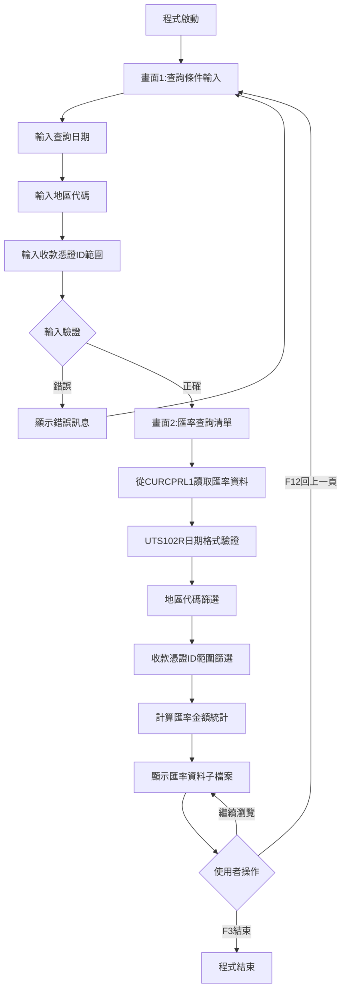
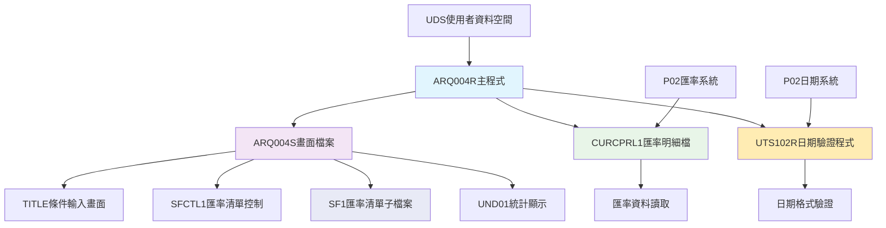
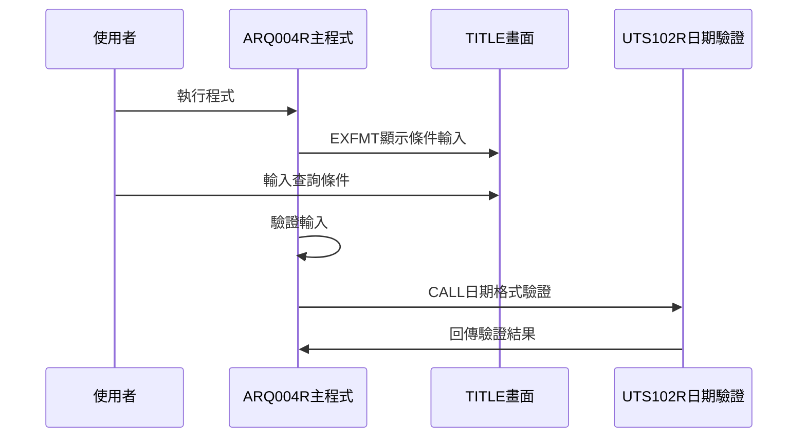
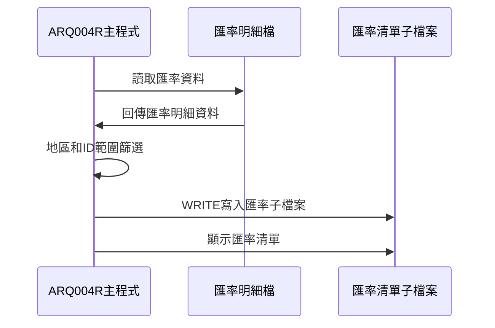
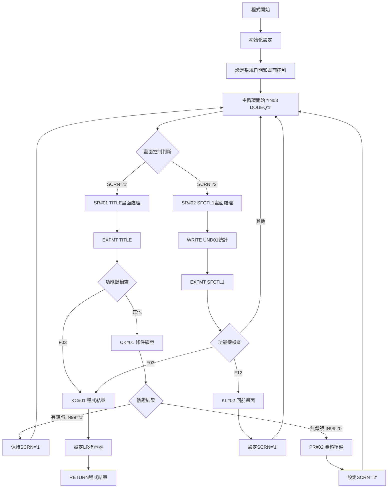

# ARQ004R_P02 程式規格書

## 1. 基本資料

| 項目 | 內容 |
|------|------|
| **程式編號** | ARQ004R |
| **程式名稱** | 匯率查詢作業 |
| **程式類型** | RPG |
| **廠區** | P02 |
| **系統名稱** | 應收帳款系統 |
| **子系統** | 匯率管理與查詢 |
| **檔案位置** | P02RPGSRC_THSRC/ARQ004R.txt |

## 2. 🎯 程式功能說明

### 主要功能描述
此程式為匯率查詢作業的主要處理程式，專門提供匯率資料的查詢和分析功能。程式採用雙階段式畫面設計，透過匯率明細檔(CURCPRL1)的資料處理，提供完整的匯率查詢分析服務。P02版本具有多條件篩選機制、地區代碼分類功能、以及詳細的匯率資料瀏覽。程式特別針對P02廠區的匯率管理業務設計，確保匯率查詢結果的準確性和完整性，同時提供使用者友善的操作介面和完整的匯率資料展示功能。程式支援日期驗證、地區篩選、收款憑證ID範圍查詢，並提供雙重金額統計功能。

### 🎯 業務流程詳細說明

#### 完整業務流程圖


#### 業務流程關鍵階段說明

**第一階段：查詢條件輸入與驗證**
- 顯示TITLE畫面進行條件輸入
- 使用者輸入查詢日期(DATE1)
- 使用者輸入地區代碼(AREA)
- 使用者輸入收款憑證ID範圍(RVID1-RVID2)

**第二階段：輸入條件檢查與驗證**
- 呼叫UTS102R程式進行日期格式驗證
- 檢查地區代碼是否為有效值(P/T/K/M/H)
- 驗證收款憑證ID範圍的合理性
- 設定相應的錯誤指示器和錯誤訊息

**第三階段：匯率資料查詢與準備**
- 從CURCPRL1讀取指定日期的匯率資料
- 根據地區代碼進行資料篩選
- 根據收款憑證ID範圍進行資料篩選
- 計算匯率金額統計

**第四階段：匯率子檔案顯示**
- 顯示SFCTL1控制的SF1子檔案
- 展示客戶資訊、訂單號碼、匯率金額資訊
- 提供雙重金額統計(AMT和AMT1)
- 支援完整的匯率資料瀏覽功能

#### 🎯 P02版本匯率查詢特色
- **雙階段畫面**：條件輸入畫面和匯率資料顯示畫面
- **多條件篩選**：支援日期、地區、收款憑證ID的組合查詢
- **雙重統計**：提供兩種不同匯率金額的統計
- **地區分類**：支援P/T/K/M/H五種地區代碼篩選

#### 多層次檢查機制
- **日期格式檢查**：透過UTS102R程式進行專業日期驗證
- **地區代碼檢查**：驗證地區代碼的有效性
- **範圍合理性檢查**：檢查收款憑證ID範圍邏輯
- **資料完整性檢查**：確保匯率分析結果的完整性

#### 智能處理邏輯
- 自動設定系統日期為預設查詢日期
- 智能處理收款憑證ID範圍預設值
- 動態篩選匯率資料確保查詢效率
- 自動計算雙重金額統計提供決策參考

#### 資料一致性確保機制
- 透過KLIST建立正確的檔案讀取鍵值
- 使用指示器控制子檔案的顯示狀態
- 分階段處理確保各步驟資料同步
- 記錄詳細的匯率查詢軌跡供後續分析

#### P02版本匯率查詢專業設計理念
- **匯率專精**：專門提供匯率資料的查詢和分析功能
- **使用者導向**：雙階段操作流程符合使用者習慣
- **多維篩選**：提供日期、地區、ID範圍的多維度篩選
- **P02特殊適配**：專為P02廠區的匯率管理需求設計

## 3. 🎯 檔案架構與關聯圖

### 使用檔案清單

| 檔案名稱 | 檔案類型 | 使用方式 | 說明 |
|----------|----------|----------|------|
| **ARQ004S** | DSPF | CF/COMBINED | 匯率查詢畫面檔案，含TITLE和SFCTL1 |
| **CURCPRL1** | 邏輯檔 | IF/INPUT | 匯率明細檔案(邏輯檔L1)，主要查詢檔案 |

### 🎯 檔案關聯詳細視覺化圖表



### 🎯 P02版本特殊資料流向說明

#### 查詢條件輸入階段的資料流向


#### P02版本匯率查詢階段的資料流向


## 4. 🎯 檔案欄位規格說明

### 主要資料結構

#### 使用檔案清單
| 檔案名稱 | 檔案類型 | 使用方式 | 說明 |
|----------|----------|----------|------|
| **ARQ004S** | DSPF | CF/COMBINED | 匯率查詢畫面檔案，含TITLE和SFCTL1 |
| **CURCPRL1** | 邏輯檔 | IF/INPUT | 匯率明細檔案(邏輯檔L1)，主要查詢檔案 |

### 🔍 重點欄位切割技術詳解

#### DS結構完整分析

##### AADS日期資料結構切割分析
```
AADS日期資料結構 (6字元)：[_____日期資料_____]
位置:                      21            26
                           ↓             ↓
位置21-26:                [YMD___]       年月日資料(6字元)
```

**日期資料三重切割邏輯**：
```
YMD年月日資料 (6字元)：[年|月|日]
位置:                  21 22 23 24 25 26
                       ↓  ↓  ↓  ↓  ↓  ↓
YY(21-22):            [91]           年份(2字元)
MM(23-24):               [12]        月份(2字元)
DD(25-26):                  [31]     日期(2字元)
```

**切割邏輯詳細說明**：
- **YMD (21-26, 6字元)**：日期資料主體暫存區，年月日格式處理
- **YY (21-22, 2字元)**：民國年份，2位數格式，91代表民國91年
- **MM (23-24, 2字元)**：月份，01-12範圍，數字格式
- **DD (25-26, 2字元)**：日期，01-31範圍，數字格式

**實際數據範例說明**：
```
AADS實際切割範例：
輸入: 系統日期計算結果 → YMD設定
切割處理:
1. YMD = "911231" (位置21-26) → 民國91年12月31日
2. YY = "91" (位置21-22切割) → 民國91年
3. MM = "12" (位置23-24切割) → 12月
4. DD = "31" (位置25-26切割) → 31日
5. 日期驗證: UTS102R("19021231")格式驗證
```

##### BBDS其他業務資料結構
```
BBDS業務資料結構：[其他業務資料區塊]
說明: 程式中定義但未使用具體欄位，預留為擴展用途
用途: 未來功能擴展或其他業務邏輯處理
```

##### UDS使用者資料空間結構切割
```
UDS使用者資料空間 (1030字元)：[___________公司名稱區塊___________|設備名稱區塊|廠區]
位置:                          951                    985 1011    1020 1021
                                ↓                      ↓   ↓       ↓    ↓
位置951-985:                  [COMP____________________________]        公司名稱(35字元)
位置1011-1020:                                         [DEVNM____]      設備名稱(10字元)
位置1021:                                                       [TXAR]   交易廠區(1字元)
```

**切割邏輯詳細說明**：
- **COMP (951-985, 35字元)**：用於TITLE和SFCTL1畫面標題顯示的公司名稱
- **DEVNM (1011-1020, 10字元)**：設備名稱，用於畫面右上角顯示終端機識別
- **TXAR (1021, 1字元)**：交易廠區代號，P02廠區識別和權限控制

**實際數據範例說明**：
```
UDS實際資料範例：
位置951-985: "東鋼鋼鐵股份有限公司               " (35字元) → TITLE畫面標題
位置1011-1020: "TERM004   " (10字元) → 畫面右上角設備顯示
位置1021: "P" (1字元) → P02廠區識別
```

##### ERR錯誤訊息表結構分析
```
ERR錯誤訊息表 (70字元)：[完整錯誤訊息內容____________________________________]
位置:                   1                                                70
                        ↓                                                ↓
位置1-70:              [日期格式錯誤，請檢查輸入的日期格式是否正確！    ]  錯誤訊息(70字元)
```

**實際錯誤訊息表資料**：
```
ERR,1 → "日期格式錯誤，請檢查輸入的日期格式是否正確！"
ERR,2 → "地區代碼錯誤，請輸入P/T/K/M/H其中之一！"
ERR,3 → "收款憑證範圍錯誤，起始ID不可大於結束ID！"
```

#### 欄位切割視覺化展示

##### CUKEY匯率查詢鍵值結構分析
```
CUKEY匯率查詢鍵值 (8字元)：[CUDATE__]
位置:                      001    008
                           ↓      ↓
CUDATE(001-008):          [20231231] 查詢日期(8字元數值)
```

**查詢鍵值使用範例**：
```
實際查詢組合範例：
輸入: DATE1=20231231
設定: CUDATE = DATE1
處理: CUKEY SETLL CURCPRL1 → 檔案指標定位
循環: CUKEY READE CURCPRL1 → 順序讀取相同日期記錄
```

##### 匯率資料多條件篩選結構
```
匯率查詢條件組合：[DATE1___|AREA|RVID1|RVID2]
位置:              001   009  010  011  013
                   ↓     ↓    ↓    ↓    ↓
DATE1(001-008):   [20231231]      查詢日期(8字元數值)
AREA(009-009):              [P]   地區代碼(1字元)
RVID1(010-011):                [AB] 收款憑證ID起始(2字元)
RVID2(012-013):                   [CD] 收款憑證ID結束(2字元)
```

**多條件篩選邏輯**：
```
篩選流程範例：
階段1: CUDATE=20231231定位 → SETLL CURCPRL1
階段2: 循環讀取 → READE CURCPRL1 
階段3: 地區篩選 → IF AREA≠' ' AND CUAREA≠AREA THEN ITER
階段4: ID範圍篩選 → IF CURVID<RVID1 OR CURVID>RVID2 THEN ITER
階段5: 資料處理 → 轉換顯示和統計累計
```

##### 地區代碼驗證切割邏輯
```
地區代碼驗證結構：
有效地區代碼集合：[P|T|K|M|H| ]
                 ↓ ↓ ↓ ↓ ↓ ↓
檢查邏輯:        P T K M H 空白(全部)
驗證條件: AREA≠' ' AND AREA≠'P' AND AREA≠'T' AND AREA≠'K' AND AREA≠'M' AND AREA≠'H'
錯誤處理: 條件成立 → SETON *IN42, ERRMSG=ERR,2
```

##### 收款憑證ID範圍切割邏輯
```
收款憑證ID範圍驗證：
RVID2預設處理：IF RVID2=' ' THEN RVID2='99'
範圍驗證：     IF RVID1>RVID2 THEN 錯誤
篩選邏輯：     IF CURVID<RVID1 OR CURVID>RVID2 THEN ITER

範圍切割示例：
輸入範圍: RVID1="AB", RVID2=" "(空白)
處理結果: RVID1="AB", RVID2="99"(預設最大值)
篩選條件: "AB" ≤ CURVID ≤ "99"
```

##### 雙重金額統計切割機制
```
雙重金額統計切割結構：
AMT統計  (9字元)：[_________] 第一種金額累計
AMT1統計 (9字元)：[_________] 第二種金額累計

統計邏輯：
初始化: AMT=0, AMT1=0
累計處理: 
  FOR EACH 符合條件記錄:
    AMT += CURAMT   (第一種匯率金額)
    AMT1 += CULAMT  (第二種匯率金額)
```

### 🎯 欄位挪用詳細分析

#### 挪用情況對比表
| 欄位名稱 | 原始定義 | 實際使用方式 | 挪用原因 | 挪用方式詳細說明 |
|----------|----------|-------------|----------|------------------|
| **AADS DS** | 一般資料結構 | 日期資料專用處理區 | 日期格式轉換需求 | YMD分割為年、月、日三部分處理 |
| **BBDS DS** | 其他資料結構 | 預留擴展區域 | 未來功能擴展需求 | 定義但未實際使用，預留系統擴展 |
| **W01-W07** | 畫面工作變數 | 匯率明細專用顯示 | 子檔案資料顯示需求 | 對應CURCPRL1各欄位的顯示轉換 |
| **W051** | 畫面工作變數 | 第二種金額專用顯示 | 雙重金額顯示需求 | 專門顯示CULAMT的獨立欄位 |
| **SCRN** | 畫面控制 | 雙階段畫面流程控制 | 查詢條件和資料顯示分離 | '1'=條件輸入畫面，'2'=匯率清單畫面 |
| **P#DATE** | 參數欄位 | UTS102R日期驗證專用 | 日期格式驗證需求 | DATE1數值轉字串格式驗證 |
| **FLAGC** | 旗標變數 | UTS102R驗證結果專用 | 日期驗證回傳控制 | '0'=正確，非'0'=格式錯誤 |
| **ERR表** | 錯誤訊息 | 三類錯誤專用訊息 | 分類錯誤處理需求 | 日期、地區、範圍三種錯誤分類 |

#### 挪用原因深度分析

##### AADS DS日期處理挪用分析
**原始定義**：一般資料結構暫存區
**實際使用**：日期資料專業處理機制
**挪用原因**：
1. 需要對系統日期進行年、月、日的獨立處理
2. 提供日期格式的標準化處理邏輯
3. 支援UTS102R日期驗證程式的格式要求
4. 便於日期相關計算和驗證

**挪用方式詳細說明**：
```
日期處理挪用機制：
步驟1：系統日期計算
  *DATE SUB 19000000 → U#SYSD (民國年格式)
  
步驟2：日期結構分割
  YMD接收日期資料 (位置21-26)
  YY = YMD位置21-22 (年份分割)
  MM = YMD位置23-24 (月份分割)
  DD = YMD位置25-26 (日期分割)
  
步驟3：格式驗證準備
  MOVE DATE1 → P#DATE (轉換為字串格式)
  CALL UTS102R (日期格式驗證)
```

##### W01-W07匯率顯示欄位挪用分析
**原始定義**：畫面工作變數
**實際使用**：匯率明細專業化顯示欄位
**挪用原因**：
1. SF1子檔案需要多種匯率明細資料顯示
2. CURCPRL1檔案欄位名稱不適合直接畫面顯示
3. 需要統一的匯率資料顯示格式
4. 支援雙重金額(CURAMT和CULAMT)的分別顯示

**挪用方式詳細說明**：
```
匯率顯示欄位挪用機制：
W01 → 客戶編號 (MOVELCUCUNO → W01)
     來源：CURCPRL1檔案CUCUNO欄位
     用途：顯示客戶編號識別
     
W02 → 客戶名稱 (MOVELCUCUNM → W02)
     來源：CURCPRL1檔案CUCUNM欄位  
     用途：顯示客戶名稱便於識別
     
W03 → 訂單號碼 (MOVELCUORNO → W03)
     來源：CURCPRL1檔案CUORNO欄位
     用途：顯示相關訂單號碼
     
W04 → 收款憑證ID (MOVELCURVID → W04)
     來源：CURCPRL1檔案CURVID欄位
     用途：顯示收款憑證識別號
     
W05 → 第一種金額 (Z-ADDCURAMT → W05)
     來源：CURCPRL1檔案CURAMT欄位
     用途：顯示第一種匯率金額
     
W051 → 第二種金額 (Z-ADDCULAMT → W051)
      來源：CURCPRL1檔案CULAMT欄位
      用途：顯示第二種匯率金額
      
W06 → 標記欄位1 (MOVELCUFL01 → W06)
W07 → 標記欄位2 (MOVELCUFL02 → W07)
```

##### 雙重金額統計挪用分析
**原始定義**：數值統計變數
**實際使用**：雙重匯率金額專業統計機制
**挪用原因**：
1. 匯率資料包含兩種不同性質的金額
2. 需要分別統計兩種金額的總計
3. 提供完整的匯率分析資訊
4. 支援財務決策所需的多維度統計

**挪用方式詳細說明**：
```
雙重金額統計挪用邏輯：
初始化：
  Z-ADD 0 → AMT  (第一種金額總計清零)
  Z-ADD 0 → AMT1 (第二種金額總計清零)
  
累計處理：
  FOR EACH 符合條件記錄:
    ADD CURAMT → AMT  (累計第一種金額)
    ADD CULAMT → AMT1 (累計第二種金額)
    
顯示處理：
  AMT → UND01統計區第一種金額總計
  AMT1 → UND01統計區第二種金額總計
```

#### 挪用影響評估

##### 系統維護影響分析
**正面影響**：
1. **資料處理統一**：AADS DS結構提供統一的日期處理機制
2. **顯示格式一致**：W01-W07變數提供統一的匯率資料顯示
3. **統計功能完整**：AMT/AMT1提供雙重金額統計
4. **錯誤處理分類**：ERR表提供清楚的錯誤分類

**維護考量**：
1. **DS結構依賴**：AADS結構變更需考慮日期處理邏輯
2. **變數對應維護**：W變數與檔案欄位的對應需保持一致
3. **統計邏輯依賴**：雙重統計邏輯變更需整體考量
4. **錯誤訊息維護**：ERR表內容變更需對應程式邏輯

#### 實際數據範例說明

##### 完整匯率查詢流程資料範例
```
匯率查詢完整流程範例：
階段1 - 初始化:
  系統日期: *DATE=20231231 → U#SYSD=1121231
  畫面設定: SCRN='1'
  
階段2 - 條件輸入:
  使用者輸入: DATE1=20231215, AREA='P', RVID1='AB', RVID2=' '
  預設處理: RVID2=' ' → RVID2='99'
  驗證處理: UTS102R("20231215") → FLAGC='0'(成功)
  
階段3 - 匯率查詢:
  CUKEY設定: CUDATE=20231215
  檔案定位: SETLL CURCPRL1
  循環讀取: READE CURCPRL1
  
階段4 - 條件篩選:
  地區篩選: CUAREA='P' (符合AREA='P')
  範圍篩選: CURVID='BC' (符合'AB'≤'BC'≤'99')
  
階段5 - 資料顯示:
  子檔案: W01="CU0001", W02="東鋼客戶", W05=50000, W051=48000
  統計: AMT累計第一種金額, AMT1累計第二種金額
```

##### 地區代碼驗證實際範例
```
地區代碼驗證實際處理：
有效輸入範例:
  AREA='P' → 通過驗證, 篩選CUAREA='P'記錄
  AREA='T' → 通過驗證, 篩選CUAREA='T'記錄
  AREA=' ' → 通過驗證, 不進行地區篩選
  
無效輸入範例:
  AREA='X' → 觸發錯誤
  處理: SETON *IN42=99, ERRMSG=ERR,2
  顯示: "地區代碼錯誤，請輸入P/T/K/M/H其中之一！"
```

##### 收款憑證ID範圍處理實際範例
```
收款憑證ID範圍實際處理：
正常範圍範例:
  輸入: RVID1='AB', RVID2='CD'
  篩選: 'AB'≤CURVID≤'CD'的記錄
  
空白結束範例:
  輸入: RVID1='AB', RVID2=' '
  處理: RVID2=' ' → RVID2='99'
  篩選: 'AB'≤CURVID≤'99'的記錄
  
錯誤範圍範例:
  輸入: RVID1='XY', RVID2='AB'
  錯誤: RVID1>RVID2觸發錯誤
  處理: SETON *IN43=99, *IN44=99, ERRMSG=ERR,3
```

### 重要變數定義表

#### 日期處理與DS結構變數
| 變數名稱 | 類型 | 長度 | 使用範圍 | 說明 |
|----------|------|------|----------|------|
| **YMD** | NUM | 6 | AADS DS結構 | 年月日資料主體(位置21-26) |
| **YY** | NUM | 2 | AADS DS結構 | 年份分割(位置21-22) |
| **MM** | NUM | 2 | AADS DS結構 | 月份分割(位置23-24) |
| **DD** | NUM | 2 | AADS DS結構 | 日期分割(位置25-26) |
| **U#SYSD** | NUM | 8 | 初始化 | 系統日期，*DATE-19000000計算結果 |

#### 查詢條件與驗證變數
| 變數名稱 | 類型 | 長度 | 使用範圍 | 說明 |
|----------|------|------|----------|------|
| **DATE1** | NUM | 8 | 全程式 | 查詢日期條件，UTS102R驗證對象 |
| **AREA** | CHAR | 1 | 全程式 | 地區代碼條件，P/T/K/M/H驗證 |
| **RVID1** | CHAR | 2 | 全程式 | 收款憑證ID起始，範圍篩選條件 |
| **RVID2** | CHAR | 2 | 全程式 | 收款憑證ID結束，範圍篩選條件 |
| **P#DATE** | CHAR | 8 | UTS102R參數 | 日期驗證參數，DATE1轉換 |
| **P#MODE** | CHAR | 1 | UTS102R參數 | 驗證模式，固定'1' |
| **P#MTL** | CHAR | 24 | UTS102R參數 | 訊息欄位，24字元訊息回傳 |
| **P#LY** | CHAR | 1 | UTS102R參數 | 年份檢查，1字元旗標 |
| **FLAGC** | CHAR | 1 | UTS102R回傳 | 驗證結果旗標，'0'=正確 |

#### 畫面控制與子檔案變數
| 變數名稱 | 類型 | 長度 | 使用範圍 | 說明 |
|----------|------|------|----------|------|
| **SCRN** | CHAR | 1 | 主程式DOUEQ | 畫面控制變數('1'/'2') |
| **RRN** | NUM | 4 | SR#02/PR#02 | SF1子檔案記錄號碼 |

#### 匯率明細顯示變數
| 變數名稱 | 類型 | 長度 | 使用範圍 | 說明 |
|----------|------|------|----------|------|
| **W01** | CHAR | 6 | SF1顯示 | 客戶編號，CUCUNO對應 |
| **W02** | CHAR | 10 | SF1顯示 | 客戶名稱，CUCUNM對應 |
| **W03** | CHAR | 6 | SF1顯示 | 訂單號碼，CUORNO對應 |
| **W04** | CHAR | 2 | SF1顯示 | 收款憑證ID，CURVID對應 |
| **W05** | NUM | 9 | SF1顯示 | 第一種匯率金額，CURAMT對應 |
| **W051** | NUM | 9 | SF1顯示 | 第二種匯率金額，CULAMT對應 |
| **W06** | CHAR | 3 | SF1顯示 | 標記欄位1，CUFL01對應 |
| **W07** | CHAR | 3 | SF1顯示 | 標記欄位2，CUFL02對應 |

#### 統計金額變數
| 變數名稱 | 類型 | 長度 | 使用範圍 | 說明 |
|----------|------|------|----------|------|
| **AMT** | NUM | 9 | PR#02統計 | 第一種金額總計，CURAMT累計 |
| **AMT1** | NUM | 9 | PR#02統計 | 第二種金額總計，CULAMT累計 |

#### 檔案查詢鍵值變數
| 變數名稱 | 類型 | 長度 | 使用範圍 | 說明 |
|----------|------|------|----------|------|
| **CUDATE** | NUM | 8 | CUKEY鍵值 | 匯率查詢日期，DATE1設定 |

#### 錯誤處理變數
| 變數名稱 | 類型 | 長度 | 使用範圍 | 說明 |
|----------|------|------|----------|------|
| **ERRMSG** | CHAR | 70 | CK#01/KL#02 | 錯誤訊息顯示，ERR表對應 |

## 5. 🎯 輸出/入螢幕布局

### 螢幕布局完整視覺化

#### TITLE畫面布局（條件輸入）
```
+----------------------------------------------------------+
|2024/12/30              東鋼鋼鐵股份有限公司          ARQ004S-1|
+----------------------------------------------------------+
|              ***匯率查詢作業***                          |
+----------------------------------------------------------+
|                                                          |
|                                                          |
|                                                          |
|                                                          |
|          請輸入日期：[____/__/__]                        |
|                                                          |
|          地區代碼：[_]                                    |
|                                                          |
|          收費範圍：[__]-[__]                             |
|                                                          |
|                                                          |
|                                                          |
|                                                          |
|                                                          |
|                                                          |
|                                                          |
|                                                          |
|                                                          |
|[錯誤訊息顯示區]                                          |
|     ENTER:確認    PF03:離開                              |
+----------------------------------------------------------+
```

#### SFCTL1畫面布局（匯率清單）
```
+----------------------------------------------------------+
|2024/12/30              東鋼鋼鐵股份有限公司          ARQ004S-2|
+----------------------------------------------------------+
|              ***匯率查詢作業***                          |
+----------------------------------------------------------+
|                                                          |
| 請輸入日期:2024/12/30 地區代碼:P 收費範圍:AB-99          |
+----------------------------------------------------------+
| 序號  客戶   客戶名稱   訂單   收費  第一種金額  第二種金額  標記1 標記2 |
+----------------------------------------------------------+
| 001  CU0001  東鋼客戶   OR001   AB     50000      48000   FL1  FL2 |
| 002  CU0002  鋼材客戶   OR002   BC     75000      72000   FL1  FL2 |
| 003  CU0003  金屬客戶   OR003   CD     60000      58000   FL1  FL2 |
|                                                          |
|                                                          |
|                                                          |
|                                                          |
|                                                          |
|                                                          |
|                                                          |
|                                                          |
|                                                          |
|                                                          |
+----------------------------------------------------------+
|              總計金額:   185000     178000               |
|            PF03:離開            PF12:回前一畫面          |
+----------------------------------------------------------+
```

### 🎯 畫面欄位詳細說明

#### TITLE畫面欄位規格
| 欄位名稱 | 位置 | 長度 | 型態 | 屬性 | 說明 |
|----------|------|------|------|------|------|
| DATE1 | 7,38 | 8 | YMD | INPUT | 查詢日期（YYYY/MM/DD格式） |
| AREA | 9,38 | 1 | CHAR | INPUT | 地區代碼（P/T/K/M/H或空白） |
| RVID1 | 11,38 | 2 | CHAR | INPUT | 收款憑證ID起始 |
| RVID2 | 11,41 | 2 | CHAR | INPUT | 收款憑證ID結束 |
| ERRMSG | 23,2 | 70 | CHAR | OUTPUT | 錯誤訊息顯示 |
| COMP | 1,23 | 35 | CHAR | OUTPUT | 公司名稱 |
| DEVNM | 2,70 | 10 | CHAR | OUTPUT | 終端機代號 |

#### SFCTL1畫面欄位規格
| 欄位名稱 | 位置 | 長度 | 型態 | 屬性 | 說明 |
|----------|------|------|------|------|------|
| DATE1 | 4,15 | 8 | YMD | OUTPUT | 查詢日期（唯讀顯示） |
| AREA | 4,37 | 1 | CHAR | OUTPUT | 地區代碼（唯讀顯示） |
| RVID1 | 4,50 | 2 | CHAR | OUTPUT | 收款憑證ID起始（唯讀顯示） |
| RVID2 | 4,55 | 2 | CHAR | OUTPUT | 收款憑證ID結束（唯讀顯示） |
| AMT | 23,41 | 9 | NUMERIC | OUTPUT | 第一種金額總計 |
| AMT1 | 23,55 | 9 | NUMERIC | OUTPUT | 第二種金額總計 |

#### SF1子檔案欄位規格
| 欄位名稱 | 位置 | 長度 | 型態 | 屬性 | 說明 |
|----------|------|------|------|------|------|
| RRN | 8,4 | 3 | NUMERIC | OUTPUT | 序號（自動編號） |
| W01 | 8,11 | 6 | CHAR | OUTPUT | 客戶編號（CUCUNO） |
| W02 | 8,18 | 10 | CHAR | OUTPUT | 客戶名稱（CUCUNM） |
| W03 | 8,30 | 6 | CHAR | OUTPUT | 訂單號碼（CUORNO） |
| W04 | 8,38 | 2 | CHAR | OUTPUT | 收款憑證ID（CURVID） |
| W05 | 8,41 | 9 | NUMERIC | OUTPUT | 第一種匯率金額（CURAMT） |
| W051 | 8,55 | 9 | NUMERIC | OUTPUT | 第二種匯率金額（CULAMT） |
| W06 | 8,70 | 3 | CHAR | OUTPUT | 標記欄位1（CUFL01） |
| W07 | 8,77 | 3 | CHAR | OUTPUT | 標記欄位2（CUFL02） |

### 🎯 畫面控制邏輯

#### 指示器控制說明
- **IN41**：DATE1欄位錯誤時設定，欄位顯示PC（保護）+RI（反向）屬性
- **IN42**：AREA欄位錯誤時設定，欄位顯示PC（保護）+RI（反向）屬性
- **IN43**：RVID1欄位錯誤時設定，欄位顯示PC（保護）+RI（反向）屬性
- **IN44**：RVID2欄位錯誤時設定，欄位顯示PC（保護）+RI（反向）屬性
- **IN51**：SF1子檔案"END DATA"記錄顯示控制
- **IN80**：子檔案清除控制（SFLCLR）
- **IN10**：子檔案結束指示器（SFLEND）

#### 功能鍵詳細定義
| 功能鍵 | 適用畫面 | 處理邏輯 | 系統行為 |
|--------|----------|----------|----------|
| **F03** | 全部畫面 | 程式結束 | 1. 設定*IN03='1'<br>2. 設定LR指示器<br>3. 返回選單 |
| **F12** | SFCTL1畫面 | 回前一畫面 | 1. 清除錯誤訊息<br>2. 設定SCRN='1'<br>3. 返回TITLE畫面 |
| **ENTER** | TITLE畫面 | 確認查詢條件 | 1. 執行CK#01驗證<br>2. 若無錯誤執行PR#02準備資料<br>3. 切換到SFCTL1畫面 |
| **ENTER** | SFCTL1畫面 | 重新顯示清單 | 1. 重新執行EXFMT SFCTL1<br>2. 保持子檔案內容 |

### 操作流程
1. 系統顯示TITLE畫面，預設填入系統日期
2. 使用者輸入查詢條件（日期、地區代碼、收款憑證ID範圍）
3. 按ENTER進行條件驗證
4. 若驗證通過，系統切換到SFCTL1畫面顯示匯率清單
5. 使用者可按F12回到條件輸入畫面，或按F03結束程式

## 6. 🎯 處理流程程序說明

### 🎯 主程序邏輯深度分析



### 🎯 詳細處理步驟逐一分析

#### 步驟一：程式初始化（N90指示器控制）
**初始化處理邏輯**：
```
*DATE SUB 19000000 → U#SYSD    // 計算系統日期（民國年格式）
MOVE '1' → SCRN                // 設定初始畫面為TITLE
MOVE '1' → *IN,90              // 設定初始化完成指示器
```

#### 步驟二：主循環控制邏輯（*IN03 DOUEQ'1'）
**循環結構說明**：
- 主循環持續執行直到使用者按F03
- 透過SCRN變數控制不同畫面的處理
- 使用CASE結構分派到不同的子程序

#### 步驟三：TITLE畫面處理（SR#01）
**處理流程詳解**：
1. **畫面顯示**：EXFMT TITLE顯示條件輸入畫面
2. **功能鍵檢查**：檢查是否按F03離開
3. **條件驗證**：執行CK#01子程序進行輸入驗證
4. **結果判斷**：根據IN99指示器決定下一步動作
5. **畫面切換**：若驗證成功則執行PR#02並切換到SCRN='2'

#### 步驟四：條件驗證處理（CK#01）
**多層次驗證邏輯**：

**第一層：日期驗證**
```
IF DATE1 = 0 THEN
  Z-ADD U#SYSD → DATE1         // 預設系統日期
END-IF

MOVE DATE1 → P#DATE            // 轉換為字串格式
CALL 'UTS102R'                 // 日期格式驗證
IF FLAGC ≠ '0' THEN
  SETON *IN41=99               // 設定錯誤指示器
  MOVEL ERR,1 → ERRMSG         // 設定錯誤訊息
END-IF
```

**第二層：地區代碼驗證**
```
IF AREA ≠ ' ' AND AREA ≠ 'P' AND AREA ≠ 'T' AND 
   AREA ≠ 'K' AND AREA ≠ 'M' AND AREA ≠ 'H' THEN
  SETON *IN42=99               // 設定錯誤指示器
  MOVEL ERR,2 → ERRMSG         // 設定錯誤訊息
END-IF
```

**第三層：收款憑證ID範圍驗證**
```
IF RVID2 = *BLANK THEN
  MOVEL '99' → RVID2           // 預設最大值
END-IF

IF RVID1 > RVID2 THEN
  SETON *IN43=99, *IN44=99     // 設定錯誤指示器
  MOVEL ERR,3 → ERRMSG         // 設定錯誤訊息
END-IF
```

#### 步驟五：資料準備處理（PR#02）
**匯率資料查詢流程**：

**第一階段：初始化**
```
MOVE *BLANK → ERRMSG           // 清除錯誤訊息
SETON *IN80                    // 設定子檔案清除
WRITE SFCTL1                   // 寫入子檔案控制
SETOF *IN80, *IN51, *IN97      // 關閉控制指示器
Z-ADD 0 → AMT, AMT1, RRN       // 清零統計變數
```

**第二階段：檔案查詢**
```
Z-ADD DATE1 → CUDATE           // 設定查詢鍵值
CUKEY SETLL CURCPRL1           // 檔案指標定位
*IN97 DOWEQ '0'                // 循環讀取
  CUKEY READE CURCPRL1         // 順序讀取相同日期記錄
```

**第三階段：條件篩選**
```
// 地區代碼篩選
IF AREA ≠ *BLANK AND CUAREA ≠ AREA THEN
  ITER                         // 跳過此記錄
END-IF

// 收款憑證ID範圍篩選
IF CURVID < RVID1 OR CURVID > RVID2 THEN
  ITER                         // 跳過此記錄
END-IF
```

**第四階段：子檔案資料準備**
```
MOVEL CUCUNO → W01             // 客戶編號
MOVEL CUCUNM → W02             // 客戶名稱
MOVEL CUORNO → W03             // 訂單號碼
MOVEL CURVID → W04             // 收款憑證ID
Z-ADD CURAMT → W05             // 第一種金額
Z-ADD CULAMT → W051            // 第二種金額
MOVEL CUFL01 → W06             // 標記欄位1
MOVEL CUFL02 → W07             // 標記欄位2
ADD 1 → RRN                    // 序號遞增
WRITE SF1                      // 寫入子檔案記錄
ADD CURAMT → AMT               // 累計第一種金額
ADD CULAMT → AMT1              // 累計第二種金額
```

**第五階段：結束處理**
```
IF RRN = 0 THEN                // 無資料處理
  CLEAR SF1                    // 清除子檔案欄位
  MOVEL 'END DATA' → W02       // 設定結束訊息
  ADD 1 → RRN                  // 序號遞增
  SETON *IN51                  // 設定結束指示器
  WRITE SF1                    // 寫入結束記錄
  SETOF *IN51                  // 關閉結束指示器
END-IF
SETON *IN10                    // 設定子檔案結束指示器
```

#### 步驟六：SFCTL1畫面處理（SR#02）
**子檔案顯示流程**：
1. **統計顯示**：WRITE UND01顯示金額統計
2. **子檔案顯示**：EXFMT SFCTL1顯示匯率清單
3. **功能鍵處理**：根據功能鍵執行對應動作

#### 步驟七：功能鍵處理子程序
**KC#01（F03離開）**：
```
SETON LR                       // 設定最後記錄指示器
RETURN                         // 返回系統
```

**KL#02（F12回前畫面）**：
```
MOVE *BLANK → ERRMSG           // 清除錯誤訊息
MOVE '1' → SCRN                // 設定回到TITLE畫面
```

### 🎯 特殊邏輯處理

#### 智能預設值處理
- **日期預設**：若DATE1=0則自動設定為系統日期
- **範圍預設**：若RVID2為空白則自動設定為'99'
- **畫面預設**：程式啟動時自動設定SCRN='1'

#### 錯誤恢復機制
- **錯誤指示器**：透過IN41-IN44控制錯誤欄位顯示
- **錯誤訊息**：透過ERR表提供分類錯誤說明
- **畫面保持**：發生錯誤時保持在TITLE畫面重新輸入

#### 子檔案管理機制
- **動態載入**：根據查詢條件動態載入符合的記錄
- **記錄計數**：透過RRN變數管理子檔案記錄序號
- **空資料處理**：無符合資料時顯示"END DATA"訊息

## 7. 🎯 數據操作與轉換分析

### 檔案操作詳解

#### CURCPRL1匯率明細檔操作
**讀取方式**：
- **檔案定義**：FCURCPRL1 IF E K DISK（邏輯檔案L1）
- **存取方式**：透過CUKEY鍵值列表進行範圍讀取
- **讀取順序**：按CUDATE（查詢日期）順序讀取
- **篩選機制**：程式內進行地區代碼和收款憑證ID範圍篩選

**檔案存取流程**：
```
CUKEY KLIST設定：
  KFLD CUDATE                  // 查詢日期鍵值

存取流程：
1. Z-ADD DATE1 → CUDATE       // 設定查詢日期
2. CUKEY SETLL CURCPRL1       // 檔案指標定位
3. CUKEY READE CURCPRL1       // 順序讀取相同日期記錄
4. 程式篩選處理
5. 轉換顯示格式
```

#### ARQ004S畫面檔案操作
**顯示檔案特性**：
- **檔案定義**：FARQ004S CF E WORKSTN
- **子檔案控制**：RRN KSFILE SF1（鍵值為序號的子檔案）
- **記錄管理**：最大15筆記錄，每頁顯示14筆

**畫面操作流程**：
```
TITLE畫面操作：
  EXFMT TITLE                  // 執行格式化顯示
  
SFCTL1畫面操作：
  WRITE UND01                  // 寫入統計資料
  WRITE SFCTL1                 // 寫入子檔案控制
  WRITE SF1                    // 寫入子檔案記錄
  EXFMT SFCTL1                 // 執行格式化顯示
```

### 數據轉換邏輯

#### 日期格式轉換
**系統日期處理**：
```
轉換流程：
*DATE (西元年8位數) → SUB 19000000 → U#SYSD (民國年8位數)

範例：
*DATE = 20241230
計算：20241230 - 19000000 = 1131230
結果：U#SYSD = 1131230 (民國113年12月30日)
```

**日期驗證轉換**：
```
驗證準備：
MOVE DATE1 → P#DATE          // 數值轉字串
CALL 'UTS102R'               // 標準日期驗證

參數說明：
P#DATE = "20241230"          // 8字元日期字串
P#MODE = "1"                 // 驗證模式
P#MTL = 24字元訊息欄位
P#LY = "1"                   // 年份檢查旗標
FLAGC = 回傳驗證結果
```

#### 匯率資料轉換
**檔案欄位到顯示欄位轉換**：
```
資料轉換對應：
CURCPRL1檔案 → SF1子檔案

CUCUNO → MOVEL → W01         // 客戶編號（6字元）
CUCUNM → MOVEL → W02         // 客戶名稱（10字元）
CUORNO → MOVEL → W03         // 訂單號碼（6字元）
CURVID → MOVEL → W04         // 收款憑證ID（2字元）
CURAMT → Z-ADD → W05         // 第一種金額（9位數）
CULAMT → Z-ADD → W051        // 第二種金額（9位數）
CUFL01 → MOVEL → W06         // 標記欄位1（3字元）
CUFL02 → MOVEL → W07         // 標記欄位2（3字元）
```

**金額統計轉換**：
```
統計計算：
初始化：AMT = 0, AMT1 = 0

累計處理：
FOR EACH 符合條件記錄：
  AMT = AMT + CURAMT         // 第一種金額累計
  AMT1 = AMT1 + CULAMT      // 第二種金額累計

顯示轉換：
AMT → UND01統計區第一種金額總計
AMT1 → UND01統計區第二種金額總計
```

#### 地區代碼轉換
**有效值檢查轉換**：
```
有效地區代碼集合：
{'P', 'T', 'K', 'M', 'H', ' '}

轉換邏輯：
IF AREA = ' ' THEN
  不進行地區篩選（查詢全部地區）
ELSEIF AREA ∈ {'P','T','K','M','H'} THEN
  篩選CUAREA = AREA的記錄
ELSE
  設定錯誤狀態
END-IF
```

#### 收款憑證ID範圍轉換
**範圍處理轉換**：
```
預設值轉換：
IF RVID2 = *BLANK THEN
  RVID2 = '99'               // 設定預設最大值
END-IF

範圍驗證：
IF RVID1 > RVID2 THEN
  設定錯誤狀態
END-IF

篩選轉換：
IF CURVID < RVID1 OR CURVID > RVID2 THEN
  ITER                       // 跳過此記錄
END-IF
```

### 檢核機制詳解

#### 輸入資料檢核
**日期有效性檢查**：
- 使用UTS102R標準日期驗證函數
- 檢查日期格式的正確性（YYYYMMDD）
- 驗證日期的邏輯合理性（月份1-12，日期符合月份天數）

**地區代碼檢核**：
- 限制輸入值為P/T/K/M/H或空白
- 空白表示查詢全部地區
- 無效值觸發錯誤處理

**範圍邏輯檢核**：
- 檢查起始ID不得大於結束ID
- 空白結束ID自動設定為最大值'99'
- 範圍邏輯錯誤觸發錯誤處理

#### 業務邏輯檢核
**匯率資料完整性檢查**：
- 檢查CURCPRL1檔案記錄的存在性
- 驗證匯率金額欄位的有效性
- 確保客戶編號和訂單號碼的一致性

**查詢結果檢核**：
- 檢查查詢結果是否為空
- 空結果時顯示"END DATA"訊息
- 提供友善的無資料提示

#### 系統資源檢核
**子檔案容量管理**：
- 限制子檔案最大15筆記錄
- 超過容量時自動分頁處理
- 透過RRN變數管理記錄序號

**記憶體使用檢核**：
- 適當的變數初始化
- 及時清除不需要的資料
- 有效的指示器管理

## 8. 🎯 錯誤處理程序說明

### 🎯 詳細錯誤代碼清冊

| 錯誤代碼 | 錯誤訊息 | 觸發條件 | 處理方式 | 預防措施 |
|----------|---------|---------|---------|----------|
| **ERR,1** | 日期格式錯誤，請檢查輸入 | UTS102R日期驗證失敗 | 1. 設定*IN41=99<br>2. 顯示錯誤訊息<br>3. 保持TITLE畫面 | 提供日期格式說明YYYY/MM/DD |
| **ERR,2** | 地區代碼錯誤，請輸入P/T/K/M/H | AREA不在有效值範圍 | 1. 設定*IN42=99<br>2. 顯示錯誤訊息<br>3. 保持TITLE畫面 | 畫面提示有效地區代碼 |
| **ERR,3** | 收款憑證範圍錯誤 | RVID1 > RVID2 | 1. 設定*IN43,*IN44=99<br>2. 顯示錯誤訊息<br>3. 保持TITLE畫面 | 說明範圍輸入邏輯 |

### 🎯 系統異常處理邏輯

#### 檔案操作異常處理
**CURCPRL1檔案存取異常**：
```
異常情況：
- 檔案不存在或無法開啟
- 檔案損壞或鎖定
- 權限不足

處理機制：
- 系統自動產生CPF訊息
- 程式異常終止
- 返回錯誤狀態給呼叫者

預防措施：
- 檢查檔案存在性
- 確認檔案權限設定
- 建立檔案備援機制
```

#### 畫面操作異常處理
**子檔案溢出處理**：
```
異常情況：
- 查詢結果超過子檔案容量（15筆）
- 記憶體不足

處理機制：
- 透過SFLSIZ(0015)限制記錄數
- 自動分頁顯示
- 透過SFLPAG(0014)控制每頁顯示數量

恢復方式：
- 使用者可透過翻頁查看更多記錄
- 系統自動管理子檔案記憶體
```

#### 輸入驗證異常處理
**多重錯誤同時發生**：
```
處理策略：
1. 按優先序處理（日期→地區→範圍）
2. 設定對應的錯誤指示器
3. 顯示第一個錯誤訊息
4. 使用者修正後重新驗證

錯誤恢復：
- SETOF *IN41-*IN44清除錯誤狀態
- MOVE *BLANK → ERRMSG清除錯誤訊息
- 重新執行驗證流程
```

### 🎯 業務邏輯異常處理

#### 查詢無結果處理
**無符合條件資料**：
```
檢測機制：
IF RRN = 0 THEN              // 無記錄寫入子檔案

處理方式：
1. CLEAR SF1                 // 清除子檔案欄位
2. MOVEL 'END DATA' → W02    // 設定結束訊息
3. SETON *IN51               // 設定特殊顯示指示器
4. WRITE SF1                 // 寫入提示記錄

使用者體驗：
- 友善的"END DATA"提示
- 不顯示空白畫面
- 提供重新查詢的機會
```

#### 日期邏輯異常處理
**日期預設值處理**：
```
邏輯：
IF DATE1 = 0 THEN
  Z-ADD U#SYSD → DATE1       // 使用系統日期

優點：
- 提供合理的預設值
- 減少使用者輸入錯誤
- 符合一般使用習慣

注意事項：
- 系統日期計算可能失敗
- 需要驗證計算結果的合理性
```

#### 範圍邏輯異常處理
**範圍預設值處理**：
```
邏輯：
IF RVID2 = *BLANK THEN
  MOVEL '99' → RVID2         // 設定最大範圍

好處：
- 簡化使用者操作
- 提供合理的預設範圍
- 避免空白值造成的查詢問題

風險控制：
- 確保'99'確實為最大有效值
- 防止查詢範圍過大影響效能
```

### 🎯 錯誤恢復與重試機制

#### 輸入錯誤恢復機制
**錯誤狀態清除**：
```
清除流程：
1. SETOF *IN41-*IN44         // 清除所有錯誤指示器
2. MOVE *BLANK → ERRMSG      // 清除錯誤訊息
3. 重新顯示TITLE畫面
4. 保持已輸入的正確資料

重新驗證：
- 使用者修正錯誤後按ENTER
- 重新執行CK#01驗證程序
- 通過驗證後正常繼續處理
```

#### 查詢重試機制
**條件調整與重新查詢**：
```
重試流程：
1. 使用者在SFCTL1畫面按F12
2. 返回TITLE畫面
3. 調整查詢條件
4. 重新執行查詢

狀態保持：
- 保持原有查詢條件供參考
- 清除子檔案內容
- 重置統計金額
```

### 🎯 錯誤訊息管理

#### 錯誤訊息表維護
**ERR表結構**：
```
ERR,1 → "日期格式錯誤，請檢查輸入的日期格式！"
ERR,2 → "地區代碼錯誤，請輸入P/T/K/M/H其中之一！"
ERR,3 → "收款憑證範圍錯誤，起始ID不可大於結束ID！"

維護原則：
- 訊息內容要清楚明確
- 提供具體的修正建議
- 使用使用者能理解的術語
- 避免技術性錯誤代碼
```

#### 錯誤訊息顯示機制
**顯示控制**：
```
顯示位置：TITLE畫面第23行第2列
顯示屬性：DSPATR(HI) 高亮度顯示
顯示長度：70字元
清除時機：重新驗證或畫面切換時
```

## 9. 🎯 備註

### 🎯 特殊注意事項

#### P02版本匯率查詢特性
**業務特殊性**：
- 專門處理P02廠區的匯率查詢需求
- 支援雙重金額統計（CURAMT和CULAMT）
- 提供多維度的篩選條件（日期、地區、收款憑證ID）
- 使用CURCPRL1邏輯檔案確保查詢效率

#### 匯率資料處理特性
**資料來源與格式**：
- 主要資料來源為CURCPRL1匯率明細邏輯檔案
- 支援按日期進行範圍查詢
- 地區代碼支援P/T/K/M/H五種類型
- 收款憑證ID支援2字元範圍查詢

#### 子檔案管理特性
**顯示與控制**：
- 子檔案最大容量15筆記錄，每頁顯示14筆
- 使用RRN（相對記錄號碼）管理子檔案序號
- 支援無資料時的友善提示（END DATA）
- 提供雙重金額統計的即時顯示

### 🎯 系統整合特性

#### 與應收帳款系統整合
**系統相依性**：
- 完全整合於應收帳款系統架構內
- 使用標準的UTS102R日期驗證函數
- 遵循標準的畫面操作邏輯
- 支援標準的功能鍵操作（F03/F12）

#### 與其他匯率程式整合
**程式系列關聯**：
- 屬於ARQ004系列匯率查詢程式
- 與其他廠區版本（H05/K02/U01）邏輯相似
- 共用相同的檔案結構和處理邏輯
- 提供一致的使用者操作體驗

### 🎯 效能考量與最佳化

#### 查詢效能最佳化
**檔案存取策略**：
- 使用CUKEY鍵值列表進行精確檔案定位
- 透過SETLL/READE組合實現高效範圍查詢
- 程式內篩選減少不必要的檔案I/O
- 適當的子檔案大小控制記憶體使用

#### 使用者體驗最佳化
**操作便利性**：
- 智能預設值減少使用者輸入負擔
- 清楚的錯誤訊息幫助使用者快速修正
- 雙階段畫面設計符合查詢操作邏輯
- F12回前畫面功能支援條件調整

### 🎯 維護與擴展考量

#### 程式維護要點
**關鍵維護項目**：
- ERR錯誤訊息表的內容更新
- CURCPRL1檔案結構變更的影響評估
- 地區代碼有效值的調整機制
- 子檔案欄位與檔案欄位的對應關係

#### 功能擴展可能性
**擴展方向**：
- 增加更多篩選條件（客戶編號、金額範圍等）
- 支援匯率統計的匯出功能
- 增加多幣別匯率的比較功能
- 提供圖表化的匯率趨勢分析

### 🎯 使用說明與操作指南

#### 標準操作流程
**建議操作步驟**：
1. 執行ARQ004R程式進入TITLE畫面
2. 輸入查詢日期（預設為系統日期）
3. 選擇地區代碼（空白表示全部地區）
4. 設定收款憑證ID範圍（結束ID可空白）
5. 按ENTER確認條件並切換到匯率清單
6. 瀏覽匯率明細資料和統計結果
7. 按F12可回到條件輸入畫面調整條件
8. 按F3結束程式

#### 操作技巧與注意事項
**使用技巧**：
- 地區代碼留空可查詢全部地區的匯率資料
- 收款憑證ID結束值留空會自動設定為'99'
- 統計金額分為兩種，提供不同角度的匯率分析
- 無符合條件資料時會顯示"END DATA"提示

### 🎯 程式依賴關係

#### 主要依賴程式
**系統程式依賴**：
- **UTS102R**：標準日期驗證程式，負責日期格式檢查
- **CURCPRL1**：匯率明細邏輯檔案，提供查詢資料來源
- **ARQ004S**：顯示檔案，定義畫面布局和欄位屬性

#### 系統資源依賴
**檔案與資源**：
- 需要CURCPRL1檔案的讀取權限
- 需要足夠的工作站記憶體支援子檔案操作
- 需要適當的作業優先權確保查詢效能

#### 版本相容性
**系統版本需求**：
- 適用於AS/400 RPG/400環境
- 相容於標準的5250終端機介面
- 支援標準的DDS顯示檔案功能
- 需要相容的CURCPRL1檔案結構版本

