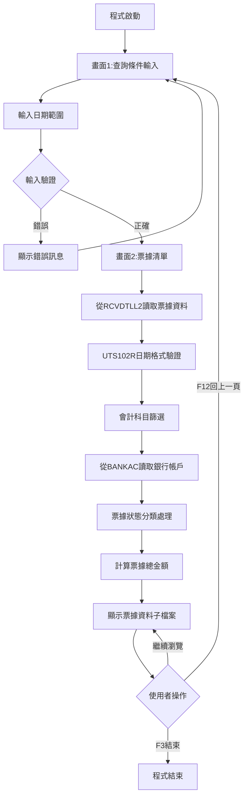
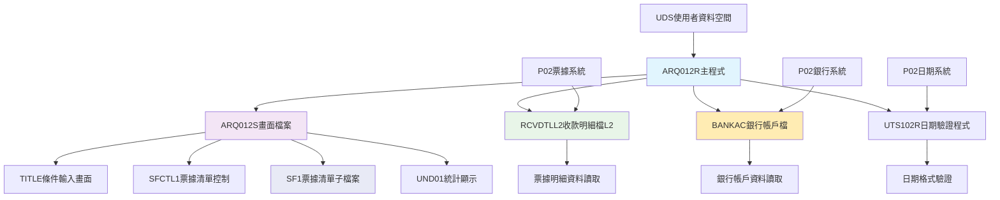
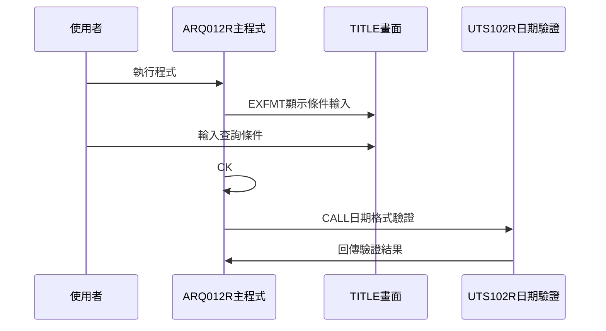
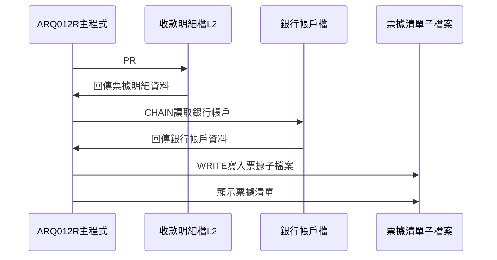
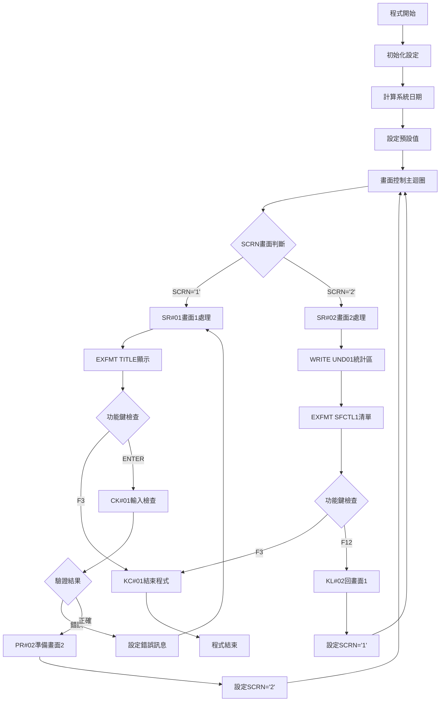

# ARQ012R_P02 程式規格書

## 1. 基本資料

| 項目 | 內容 |
|------|------|
| **程式編號** | ARQ012R |
| **程式名稱** | 票據表查詢作業 |
| **程式類型** | RPG |
| **廠區** | P02 |
| **系統名稱** | 應收帳款系統 |
| **子系統** | 票據管理與查詢 |
| **檔案位置** | P02RPGSRC_THSRC/ARQ012R.txt |

## 2. 🎯 程式功能說明

### 主要功能描述
此程式為票據表查詢作業的主要處理程式，專門提供票據資料的查詢和分析功能。程式採用雙階段式畫面設計，透過收款明細檔(RCVDTLL2)和銀行帳戶檔(BANKAC)的整合處理，提供完整的票據查詢分析服務。P02版本具有日期範圍篩選機制、銀行帳戶分類功能、票據狀態分析、以及詳細的票據資料瀏覽。程式特別針對P02廠區的票據管理業務設計，確保票據查詢結果的準確性和完整性，同時提供使用者友善的操作介面和完整的票據資料展示功能。程式支援專業日期驗證、會計科目篩選、票據狀態分類，並提供票據總金額統計功能。

### 🎯 業務流程詳細說明

#### 完整業務流程圖


#### 業務流程關鍵階段說明

**第一階段：查詢條件輸入與驗證**
- 顯示TITLE畫面進行條件輸入
- 使用者輸入日期範圍(DATE1-DATE2)
- 系統自動設定預設日期範圍為系統日期

**第二階段：輸入條件檢查與驗證**
- 呼叫UTS102R程式進行雙重日期格式驗證
- 驗證日期範圍的合理性(DATE1 <= DATE2)
- 設定相應的錯誤指示器和錯誤訊息

**第三階段：票據資料查詢與準備**
- 從RCVDTLL2讀取指定日期範圍的票據資料
- 根據會計科目(1131/111001)進行篩選
- 從BANKAC讀取對應的銀行帳戶資料
- 進行票據狀態分類和分析

**第四階段：票據狀態分類處理**
- 分析票據狀態代碼(RVNTCD)
- 處理票據類型代碼(RVNTTP)
- 處理匯款地點代碼(RVPLAC)
- 進行票據類型分類(A版本/B版本/其他類型)
- 計算符合條件的票據總金額

**第五階段：票據子檔案顯示**
- 顯示SFCTL1控制的SF1子檔案
- 展示銀行帳戶、票據憑證、金額等資訊
- 提供票據總金額統計(TOT)
- 支援完整的票據資料瀏覽功能

#### 🎯 P02版本票據表查詢特色
- **雙階段畫面**：條件輸入畫面和票據資料顯示畫面
- **日期範圍查詢**：支援起始和結束日期的範圍查詢
- **銀行帳戶整合**：整合BANKAC提供完整銀行帳戶資訊
- **票據狀態分析**：提供詳細的票據狀態分類和分析

#### 多層次檢查機制
- **日期格式檢查**：透過UTS102R程式進行專業日期驗證
- **會計科目檢查**：篩選指定的會計科目(1131/111001)
- **票據狀態檢查**：分析和分類票據狀態

#### 智能處理邏輯
- 自動設定系統日期為預設日期範圍
- 動態讀取銀行帳戶資料提供完整資訊
- 自動分類票據狀態提供決策參考
- 智能篩選票據類型確保查詢精確性

#### 資料一致性確保機制
- 透過多個KLIST建立正確的檔案讀取鍵值
- 使用指示器控制子檔案的顯示狀態
- 分階段處理確保各步驟資料同步
- 記錄詳細的票據查詢軌跡供後續分析

#### P02版本票據表查詢專業設計理念
- **票據專精**：專門提供票據資料的查詢和分析功能
- **使用者導向**：雙階段操作流程符合使用者習慣
- **多維整合**：整合票據、銀行帳戶的完整資訊
- **P02特殊適配**：專為P02廠區的票據管理需求設計

## 3. 🎯 檔案架構與關聯圖

### 使用檔案清單

| 檔案名稱 | 檔案類型 | 使用方式 | 說明 |
|----------|----------|----------|------|
| **ARQ012S** | DSPF | CF/COMBINED | 票據表查詢畫面檔案 |
| **RCVDTLL2** | 邏輯檔 | IF/INPUT | 收款明細檔案(邏輯檔L2) |
| **BANKAC** | 邏輯檔 | IF/INPUT | 銀行帳戶檔案 |

### 🎯 檔案關聯詳細視覺化圖表



### 🎯 P02版本特殊資料流向說明

#### 查詢條件輸入階段的資料流向


#### P02版本票據查詢階段的資料流向


## 4. 🎯 檔案欄位規格說明

### 主要資料結構

#### UDS使用者資料空間結構(P02版本特殊位置)
| 位置 | 長度 | 欄位名稱 | 用途說明 |
|------|------|----------|----------|
| 951-985 | 35 | COMP | 公司名稱顯示 |
| 1011-1020 | 10 | DEVNM | 設備名稱顯示 |
| 1021-1021 | 1 | TXAR | 交易廠區代號 |

#### AADS日期和銀行帳戶資料結構
| 位置 | 長度 | 欄位名稱 | 用途說明 |
|------|------|----------|----------|
| 11-20 | 10 | PID | 銀行帳戶ID |
| 11-11 | 1 | PID1 | 帳戶類型 |
| 12-12 | 1 | PID2 | 帳戶幣別 |
| 13-20 | 8 | PID3 | 帳戶號碼 |
| 21-26 | 6 | YMD | 年月日資料 |
| 21-22 | 2 | YY | 年份 |
| 23-24 | 2 | MM | 月份 |
| 25-26 | 2 | DD | 日期 |

### 🔍 重點欄位切割技術詳解

#### RCVDTLL2收款明細檔查詢條件
**P02版本票據查詢邏輯**：
```sql
RVKEY KLIST:
- KFLD RVDUDT (到期日)
- KFLD RVNTNO (異動號碼)
- KFLD RVNO (票據憑證號)
- KFLD RVITEM (票據項目)

查詢條件：
- 日期範圍：DATE1-DATE2(到期日範圍)
- 會計科目：1131或111001
```

#### BANKAC銀行帳戶檔查詢條件
**P02版本銀行帳戶查詢邏輯**：
```sql
ACKEY KLIST:
- KFLD ACTYPE (帳戶類型)
- KFLD ACCURR (帳戶幣別)
- KFLD ACACNO (帳戶號碼)

查詢目的：
- 取得銀行帳戶名稱(ACBNAM)
- 提供完整銀行帳戶資訊
```

#### UTS102R日期驗證程式呼叫
**P02版本日期驗證邏輯**：
```sql
UTS102R參數：
- P#DATE: 8位元日期欄位
- P#MODE: '1'(驗證模式)
- P#MTL: 24位元訊息欄位
- P#LY: 1位元年份檢查
- FLAG: 1位元回傳旗標

驗證結果：
- FLAG='0': 日期格式正確
- FLAG≠'0': 日期格式錯誤
```

#### 票據狀態分類邏輯分析
**票據狀態TAB1對照表**：
```sql
RVNTTP對應表：
- A: A版本
- B: B版本A款
- C: 其他
- D: B版本B款
- E: 銀行票據
- I: 自行票據
```

**票據狀態TAB2對照表**：
```sql
RVNTCD對應表：
- 1: 沖銷
- 2: 其他
- 3: 處理
- 4: 列印

RVPLAC匯款地點：
- D: 國內
- E: 國外
```

#### UDS使用者資料空間切割視覺化詳解
```
UDS票據查詢特殊位置切割配置圖：
位置範圍     切割內容          長度    切割用途
┌───────────────────────────────────────────────┐
│ 951-985  │ 公司名稱      │  35  │ S#COMP畫面顯示 │
│ 1011-1020│ 設備名稱      │  10  │ S#DEVI畫面顯示 │
│ 1021     │ 交易廠區      │  1   │ U#TXAR廠區控制 │
└───────────────────────────────────────────────┘

UDS特殊切割機制：
- 公司名稱區塊：951-985 (35位元組連續配置)
- 設備名稱區塊：1011-1020 (10位元組設備配置)
- 廠區控制：1021 (1位元組P02廠區識別)
```

#### 多重KLIST查詢鍵值切割邏輯詳細說明
**RVKEY票據明細查詢鍵值切割**：
```
RVKEY KLIST四重鍵值切割結構：
┌─────────────────────────────────────────────────┐
│ KFLD1: RVDUDT  │ 到期日      │ 8位 │ 日期範圍控制 │
│ KFLD2: RVNTNO  │ 異動號碼    │ 7位 │ 交易識別     │
│ KFLD3: RVNO    │ 票據憑證號  │ 10位│ 憑證編號     │
│ KFLD4: RVITEM  │ 票據項目    │ 3位 │ 項目細分     │
└─────────────────────────────────────────────────┘

ACKEY銀行帳戶查詢鍵值切割：
┌─────────────────────────────────────────────────┐
│ KFLD1: ACTYPE  │ 帳戶類型    │ 1位 │ 帳戶分類     │
│ KFLD2: ACCURR  │ 帳戶幣別    │ 1位 │ 幣別識別     │
│ KFLD3: ACACNO  │ 帳戶號碼    │ 8位 │ 帳戶編號     │
└─────────────────────────────────────────────────┘
```

#### 雙檔案整合查詢切割流程視覺化
**票據明細與銀行帳戶整合查詢切割邏輯**：
```
RCVDTLL2票據檔查詢 ──┐
                    ├─→ 銀行帳戶ID分割 ──┐
BANKAC銀行帳戶檔 ───┘                   ├─→ 票據資料顯示
                                        │
PID切割處理：RVTANO → PID1+PID2+PID3 ───┘

5步驟資料流切割說明：
① SETLL+READ → RCVDTLL2票據資料讀取
② 會計科目篩選 → RVACNO檢查(1131/111001)
③ 銀行帳戶分割 → RVTANO→PID1(類型)+PID2(幣別)+PID3(號碼)
④ CHAIN查詢 → BANKAC銀行帳戶名稱取得
⑤ 子檔案寫入 → SF1票據清單顯示
```

#### 子檔案控制變數切割機制
**票據清單子檔案切割控制**：
```
控制變數切割功能說明：
┌────────────────────────────────────────────────┐
│ SCRN    │ 畫面控制    │ '1'=條件輸入/'2'=票據清單│
│ RRN     │ 記錄號碼    │ 子檔案記錄序號控制       │
│ R#L01   │ 限制數量    │ 990筆記錄效能控制        │
│ TOT     │ 總金額      │ 票據金額累計統計         │
│ DATE1/2 │ 日期範圍    │ 查詢條件範圍控制         │
└────────────────────────────────────────────────┘

票據子檔案管理切割邏輯：
WRITE SF1記錄 → RRN計數器 → 限制檢查(R#L01) → 繼續/停止
```

#### 銀行帳戶分割轉換切割邏輯詳細說明
**RVTANO帳戶ID分割視覺化**：
```
銀行帳戶ID切割配置：
原始資料：RVTANO(10位) = 'A1234567890'
切割結果：
┌─────────────────────────────────────┐
│ PID1(1位) = 'A'     │ 帳戶類型      │
│ PID2(1位) = '1'     │ 帳戶幣別      │
│ PID3(8位) = '23456789' │ 帳戶號碼   │
└─────────────────────────────────────┘

切割指令：
%SUBST(PID:1:1) → PID1  ← 帳戶類型切割
%SUBST(PID:2:1) → PID2  ← 帳戶幣別切割
%SUBST(PID:3:8) → PID3  ← 帳戶號碼切割
```

#### 執行流程控制切割對應表
**8個關鍵階段的切割對應關係**：
```
階段1：程式初始化 → 系統日期計算 → DATE1/DATE2預設值
階段2：查詢條件輸入 → TITLE畫面 → DATE1/DATE2收集
階段3：輸入驗證 → UTS102R程式 → FLAG驗證結果
階段4：票據資料查詢 → RCVDTLL2檔案 → RVKEY鍵值定位
階段5：銀行帳戶查詢 → BANKAC檔案 → ACKEY鍵值查詢
階段6：資料轉換 → TAB1/TAB2對照 → W00-W27變數設定
階段7：子檔案顯示 → SF1清單 → RRN記錄管理
階段8：統計計算 → 票據金額累計 → TOT總金額統計
```

### 🎯 P02版本欄位挪用詳細分析

#### SF1票據清單子檔案欄位重點
| 欄位名稱 | 用途說明 | 設定值 |
|----------|----------|--------|
| **W00** | 到期日 | 來自RCVDTLL2的RVDUDT |
| **W01** | 銀行帳戶名稱/票據ID | 來自BANKAC的ACBNAM或RCVDTLL2的RVTBID |
| **W02** | 銀行帳戶ID | 來自RCVDTLL2的RVTANO |
| **W03** | 異動號碼 | 來自RCVDTLL2的RVNTNO |
| **W04** | 票據類型 | 來自TAB1對照表 |
| **W05** | 客戶名稱 | 來自RCVDTLL2的RVCUNM |
| **W06** | 票據金額 | 來自RCVDTLL2的RVRAMT |
| **W21** | 銀行憑證ID | 來自RCVDTLL2的RVPBID |
| **W22** | 銀行憑證號 | 來自RCVDTLL2的RVPANO |
| **W23** | 票據憑證號 | 來自RCVDTLL2的RVNO |
| **W24** | 票據狀態 | 來自TAB2對照表 |
| **W25** | 票據日期 | 來自RCVDTLL2的RVDATE |
| **W26** | 匯款地點 | 來自RVPLAC的轉換 |
| **W27** | 使用者類型 | 來自RCVDTLL2的RVUSTP |

#### 票據資料欄位對應表
| 畫面顯示 | 檔案欄位 | 性質 | 處理邏輯 |
|----------|----------|------|----------|
| **銀行帳戶名稱** | ACBNAM | 銀行資訊 | BANKAC查詢取得 |
| **票據憑證資訊** | RVNO/RVITEM | 憑證編號 | RCVDTLL2直接取用 |
| **票據日期** | RVDATE/RVDUDT | 日期資訊 | 日期格式轉換 |
| **票據金額** | RVRAMT | 金額資訊 | 直接取用並累計 |
| **票據類型** | RVNTTP | 類型分類 | TAB1對照表轉換 |
| **票據狀態** | RVNTCD | 狀態分類 | TAB2對照表轉換 |
| **匯款地點** | RVPLAC | 地點代碼 | D/E轉換為國內/國外 |

### P02版本重要變數定義表

| 變數名稱 | 類型 | 長度 | 說明 | 使用範圍 |
|----------|------|------|------|----------|
| **DATE1** | NUM | 8 | 起始日期 | 查詢條件 |
| **DATE2** | NUM | 8 | 結束日期 | 查詢條件 |
| **SCRN** | CHAR | 1 | 畫面控制變數 | 畫面流程 |
| **RRN** | NUM | 4 | 子檔案記錄號碼 | 子檔案控制 |
| **TOT** | NUM | 11 | 票據總金額 | 統計資料 |
| **W00-W27** | 各異 | 各異 | 票據資料變數 | 票據顯示 |
| **PID** | CHAR | 10 | 銀行帳戶ID | 銀行帳戶 |
| **PID1** | CHAR | 1 | 帳戶類型 | 銀行帳戶 |
| **PID2** | CHAR | 1 | 帳戶幣別 | 銀行帳戶 |
| **PID3** | CHAR | 8 | 帳戶號碼 | 銀行帳戶 |
| **U#SYSD** | NUM | 8 | 系統日期 | 日期處理 |
| **R#L01** | NUM | 3 | 記錄限制數 | 效能控制 |
| **P#DATE** | CHAR | 8 | 日期驗證參數 | 日期驗證 |
| **P#MODE** | CHAR | 1 | 驗證模式 | 日期驗證 |
| **P#MTL** | CHAR | 24 | 訊息欄位 | 日期驗證 |
| **P#LY** | CHAR | 1 | 年份檢查 | 日期驗證 |
| **FLAG** | CHAR | 1 | 回傳旗標 | 驗證結果 |
| **ERRMSG** | CHAR | 70 | 錯誤訊息 | 錯誤處理 |

## 5. 🎯 輸出/入螢幕布局

### 畫面1：查詢條件輸入畫面(TITLE)

```
+------------------------------------------------------------------------------+
|[日期]                東鋼鋼鐵股份有限公司                          ARQ012S-1 |
|                   ***  票據表查詢  ***                           [設備名稱] |
|                                                                              |
|                                                                              |
|                                                                              |
|                                                                              |
|                                                                              |
|                      查詢日期: [____/__/__] - [____/__/__]                 |
|                                                                              |
|                                                                              |
|                                                                              |
|                                                                              |
|                                                                              |
|                                                                              |
|                                                                              |
|                                                                              |
|                                                                              |
|                                                                              |
|                                                                              |
|                                                                              |
|[錯誤訊息顯示區]                                                              |
|    ENTER:執行                    PF03:結束                                   |
+------------------------------------------------------------------------------+
```

### 畫面2：票據資料顯示畫面(SFCTL1)

```
+------------------------------------------------------------------------------+
|[日期]                東鋼鋼鐵股份有限公司                          ARQ012S-2 |
|                   ***  票據表查詢  ***                           [設備名稱] |
|                                                                              |
|                      查詢日期: [____/__/__] - [____/__/__]                 |
|----------------------------------------------------------------------------- |
|                                                                              |
|            到期         銀行           票據類型          票據金額             |
|            日期         帳號                            客戶名稱             |
|  到期日   銀行帳戶名稱   銀行帳戶ID    票據異動號碼  票據狀態  客戶名稱  票據金額|
|----------------------------------------------------------------------------- |
| [____][___________][________________][_____][______][__________][_________]  |
| [____][___________][________________][_____][______][__________][_________]  |
| [____][___________][________________][_____][______][__________][_________]  |
| [____][___________][________________][_____][______][__________][_________]  |
| [____][___________][________________][_____][______][__________][_________]  |
| [____][___________][________________][_____][______][__________][_________]  |
| [____][___________][________________][_____][______][__________][_________]  |
|                                                                              |
|----------------------------------------------------------------------------- |
|    ENTER:重整                   PF03:結束              PF12:回到上頁         |
|                                                              合計: [_______]|
+------------------------------------------------------------------------------+
```

### 🎯 畫面欄位詳細說明

#### 畫面1輸入欄位
| 欄位名稱 | 欄位屬性 | 位置 | 長度 | 輸入格式 | 驗證規則 | 說明 |
|----------|----------|------|------|----------|----------|------|
| **DATE1** | 輸入/輸出 | 8,35 | 8 | 年/月/日 | UTS102R驗證 | 起始日期輸入 |
| **DATE2** | 輸入/輸出 | 8,48 | 8 | 年/月/日 | UTS102R驗證 | 結束日期輸入 |

#### 畫面2顯示欄位
| 欄位名稱 | 欄位屬性 | 說明 |
|----------|----------|------|
| **W00** | 顯示 | 到期日 |
| **W01** | 顯示 | 銀行帳戶名稱/票據ID |
| **W02** | 顯示 | 銀行帳戶ID |
| **W03** | 顯示 | 異動號碼 |
| **W04** | 顯示 | 票據類型 |
| **W05** | 顯示 | 客戶名稱 |
| **W06** | 顯示 | 票據金額 |
| **W21-W27** | 顯示 | 其他票據相關資訊 |
| **TOT** | 顯示 | 票據總金額 |

### 功能鍵詳細定義

| 功能鍵 | 處理邏輯 | 系統行為 | 說明 |
|--------|----------|----------|------|
| **F3** | 設定IN03='1' | 程式立即結束 | 離開查詢作業 |
| **F12** | 回到上一畫面 | 畫面流程控制 | 返回上一個操作畫面 |
| **ENTER** | 執行查詢 | 根據畫面執行相應動作 | 執行查詢條件 |

### 輸入驗證機制

#### 查詢條件驗證
- DATE1和DATE2透過UTS102R程式進行格式驗證
- DATE1不可大於DATE2
- 日期範圍設定合理性檢查

#### P02版本特殊驗證
- 驗證日期格式的正確性
- 確認票據明細檔的存在性
- 檢查銀行帳戶檔的關聯性

## 6. 🎯 處理流程程序說明

### 🎯 主程序邏輯深度分析

#### P02版本程式執行流程圖


#### 🎯 P02版本票據表查詢特殊步驟分析

**步驟1：程式初始化設定**
- 計算系統日期(*DATE - 19000000)
- 設定預設起始日期為系統日期
- 設定預設結束日期為系統日期
- 設定記錄限制數(R#L01=990)
- 設定初始畫面編號(SCRN='1')

**步驟2：SR#01畫面1查詢條件輸入處理**
- 顯示TITLE畫面進行條件輸入
- 檢查F3功能鍵決定是否結束程式
- 執行CK#01輸入條件檢查
- 驗證通過則執行PR#02準備畫面2資料

**步驟3：CK#01輸入條件檢查邏輯**
- 驗證日期範圍(DATE1 <= DATE2)
- 呼叫UTS102R程式進行雙重日期格式驗證
- 設定相應的錯誤指示器(41, 42, 99)

**步驟4：UTS102R日期驗證處理**
- 對DATE1進行日期格式驗證
- 對DATE2進行日期格式驗證
- 檢查兩次驗證結果旗標FLAG
- 若任一驗證失敗則設定錯誤指示器和訊息

**步驟5：PR#02票據資料準備**
- 清除錯誤訊息和統計變數
- 從RCVDTLL2讀取指定日期範圍的票據資料
- 根據會計科目(1131/111001)進行篩選
- 從BANKAC讀取對應的銀行帳戶資料
- 進行票據狀態分類和金額統計

**步驟6：票據資料篩選與處理邏輯**
- 根據到期日範圍(DATE1 <= RVDUDT <= DATE2)篩選
- 檢查會計科目(RVACNO = '1131' 或 '111001')
- 處理銀行帳戶ID分割(RVTANO → PID1, PID2, PID3)
- 累計票據金額(RVRAMT → TOT)

**步驟7：票據狀態分類處理**
- 使用TAB1對照表轉換票據類型(RVNTTP)
- 使用TAB2對照表轉換票據狀態(RVNTCD)
- 處理匯款地點代碼(RVPLAC: D=國內, E=國外)
- 設定列印控制標記(RVPRCD = 'Y')
- 控制顯示記錄數量(RRN <= R#L01)

**步驟8：SR#02畫面2票據資料顯示處理**
- 顯示UND01統計資訊區域
- 顯示SFCTL1控制的SF1子檔案
- 處理使用者的功能鍵操作
- 提供票據資料瀏覽功能

#### 業務邏輯深度解析

**P02版本票據表查詢的核心邏輯**：
1. 提供雙階段式的票據查詢和分析功能
2. 支援雙檔案整合機制確保查詢完整性
3. 提供專業的日期格式驗證功能
4. 票據專業化查詢的完整實現

**P02版本效能優化機制**：
1. 使用記錄限制數控制子檔案顯示效能
2. 分階段處理確保查詢效能
3. 智能篩選處理減少不必要的資料載入
4. 提供票據總金額統計

#### 條件判斷詳細說明

**P02版本日期驗證判斷**：
- `DATE1 IFGT DATE2` - 起始日期大於結束日期時錯誤
- `FLAG IFNE '0'` - UTS102R驗證失敗時設定錯誤

**P02版本會計科目篩選判斷**：
- `RVACNO COMP '1131'` - 檢查會計科目1131
- `RVACNO COMP '111001'` - 檢查會計科目111001

#### 變數使用和數據流向追蹤

**P02版本特殊變數軌跡**：
1. 日期變數(DATE1, DATE2, U#SYSD, P#DATE)的處理軌跡
2. 畫面控制變數(SCRN)的狀態轉換軌跡
3. 子檔案記錄號碼(RRN)和限制數(R#L01)的管理軌跡
4. 統計變數(TOT)的累計軌跡
5. 銀行帳戶變數(PID, PID1, PID2, PID3)的分割軌跡
6. 錯誤處理變數(ERRMSG, 指示器)的設定軌跡

### 🎯 P02版本子程序邏輯分析

#### P02版本子程序調用順序
1. **CK#01程序**：輸入條件檢查，驗證查詢條件的合法性
2. **PR#02程序**：票據資料準備，讀取和處理票據明細資料
3. **KC#01程序**：F3功能鍵處理，程式結束控制
4. **KL#02程序**：F12功能鍵處理，回到上一畫面

#### P02版本票據表查詢專精設計
- 專門提供票據資料的查詢和分析功能
- 支援完整的雙階段操作流程
- 提供雙檔案整合的票據查詢機制
- 針對P02廠區的票據管理業務特色進行優化

## 7. 🎯 數據操作與轉換分析

### P02版本檔案操作詳解

#### P02版本RCVDTLL2收款明細檔操作
- **SETLL操作**：設定檔案指標到指定日期位置
- **READ操作**：順序讀取收款明細記錄
- **條件篩選**：根據日期範圍、會計科目進行精確篩選

#### P02版本BANKAC銀行帳戶檔操作
- **CHAIN操作**：根據銀行帳戶組合鍵讀取帳戶資料
- **帳戶分析**：分割銀行帳戶ID取得類型、幣別、號碼
- **名稱取得**：取得銀行帳戶名稱進行顯示

### P02版本數據轉換邏輯

#### P02版本票據資料轉換
- **到期日轉換**：RVDUDT → W00 (到期日顯示)
- **銀行帳戶轉換**：ACBNAM → W01, RVTANO → W02 (帳戶資訊)
- **票據憑證轉換**：RVNTNO → W03, RVNO → W23 (憑證資訊)
- **金額轉換**：RVRAMT → W06 (票據金額)
- **客戶轉換**：RVCUNM → W05 (客戶名稱)
- **狀態轉換**：RVNTTP → W04 (透過TAB1對照表)
- **狀態轉換**：RVNTCD → W24 (透過TAB2對照表)

#### P02版本銀行帳戶分割轉換
- **帳戶ID分割**：RVTANO(10位) → PID(10位)
- **類型分割**：PID第1位 → PID1(帳戶類型)
- **幣別分割**：PID第2位 → PID2(帳戶幣別)
- **號碼分割**：PID第3-10位 → PID3(帳戶號碼)

#### P02版本狀態分類轉換
- **票據類型轉換**：TAB1對照表(A=A版本,B=B版本A款,C=其他,D=B版本B款,E=銀行票據,I=自行票據)
- **票據狀態轉換**：TAB2對照表(1=沖銷,2=其他,3=處理,4=列印)
- **匯款地點轉換**：RVPLAC(D=國內,E=國外)
- **總金額累計**：所有票據金額的累計統計

### P02版本檢核機制詳解

#### P02版本查詢條件檢核
- **日期格式檢查**：透過UTS102R程式進行專業驗證
- **日期範圍檢查**：起始日期不可大於結束日期
- **邏輯一致性檢查**：查詢條件的邏輯合理性

#### P02版本資料完整性檢核
- **票據檔案檢查**：確保票據明細檔資料的完整性
- **銀行帳戶檢查**：確保銀行帳戶檔資料的正確性
- **關聯性檢查**：票據與銀行帳戶資料的關聯一致性

#### P02版本顯示效能檢核
- **記錄數控制**：透過R#L01控制顯示記錄數量
- **子檔案管理**：正確管理票據子檔案的顯示狀態
- **記憶體使用**：控制資料載入量避免記憶體不足
- **響應時間**：確保查詢響應時間在合理範圍

#### P02版本業務邏輯檢核
- **會計科目檢查**：確保只處理指定的會計科目
- **票據狀態檢查**：正確分類和顯示票據狀態
- **銀行帳戶檢查**：確保銀行帳戶資料的正確關聯
- **金額統計檢查**：確保票據總金額的計算正確性

## 8. 🎯 錯誤處理程序說明

### 🎯 P02版本詳細錯誤代碼清冊

| 錯誤代碼 | 錯誤訊息 | 原因說明 | 處理方式 | 預防措施 |
|----------|---------|---------|---------|----------|
| **ERR,1** | 日期格式錯誤 | 日期格式不正確 | 1. 檢查日期輸入格式<br>2. 使用正確的年/月/日格式<br>3. 重新輸入正確日期 | 確保輸入的日期格式正確 |
| **ERR,2** | 日期範圍錯誤 | 起始日期大於結束日期 | 1. 檢查日期範圍設定<br>2. 調整起始和結束日期<br>3. 確認查詢範圍邏輯 | 檢查輸入範圍的合理性 |
| **指示器41** | DATE1欄位錯誤 | 起始日期輸入錯誤 | 1. 重新輸入起始日期<br>2. 檢查日期格式<br>3. 確認日期有效性 | 提供有效日期格式說明 |
| **指示器42** | DATE2欄位錯誤 | 結束日期輸入錯誤 | 1. 重新輸入結束日期<br>2. 檢查日期範圍邏輯<br>3. 確認日期有效性 | 檢查日期範圍邏輯關係 |
| **指示器99** | 一般處理錯誤 | 資料處理或驗證失敗 | 1. 檢查資料完整性<br>2. 重新執行查詢<br>3. 確認系統狀態 | 定期檢查資料檔案狀態 |
| **UTS102R驗證失敗** | 日期驗證程式異常 | 日期驗證程式執行失敗 | 1. 檢查UTS102R程式狀態<br>2. 驗證日期參數設定<br>3. 重新執行驗證 | 確保UTS102R程式正常運作 |
| **BANKAC讀取失敗** | 銀行帳戶檔異常 | 銀行帳戶資料讀取失敗 | 1. 檢查銀行帳戶檔狀態<br>2. 驗證帳戶ID格式<br>3. 重新載入資料 | 確保銀行帳戶檔完整性 |
| **子檔案顯示失敗** | SF1清單異常 | 子檔案資料載入問題 | 1. 檢查記憶體使用<br>2. 重新載入資料<br>3. 減少查詢範圍 | 控制查詢資料量 |
| **票據統計錯誤** | 金額統計異常 | 票據統計計算邏輯錯誤 | 1. 檢查票據資料正確性<br>2. 重新計算統計<br>3. 驗證計算邏輯 | 確保票據資料的完整性 |
| **畫面轉換失敗** | SCRN控制異常 | 畫面流程控制錯誤 | 1. 檢查畫面控制邏輯<br>2. 重新執行操作<br>3. 確認功能鍵處理 | 確保畫面流程控制正確 |

### 🎯 P02版本系統異常處理邏輯

#### P02版本檔案操作失敗處理
- **票據明細檔異常**：檢查RCVDTLL2檔案的可用性和完整性
- **銀行帳戶檔異常**：處理BANKAC檔案的存取問題
- **畫面檔案異常**：處理ARQ012S畫面檔案的顯示問題
- **日期驗證程式異常**：處理UTS102R程式的執行問題

#### P02版本資料完整性錯誤處理
- **查詢條件異常**：處理輸入條件和驗證的異常情況
- **票據資料異常**：處理票據明細資料的異常
- **銀行帳戶異常**：處理銀行帳戶資料的異常
- **日期資料異常**：處理日期格式和範圍的異常

#### P02版本使用者操作錯誤處理
- **輸入格式異常**：處理使用者輸入格式的錯誤
- **功能鍵異常**：處理功能鍵操作的異常情況
- **畫面流程異常**：處理畫面切換和流程的異常

#### P02版本票據表查詢業務失敗處理
- **查詢邏輯失敗**：處理票據查詢業務邏輯的異常
- **篩選功能失敗**：處理多條件篩選的異常
- **統計功能失敗**：處理票據統計和彙總的異常
- **顯示功能失敗**：處理票據資料顯示的異常

## 9. 🎯 備註

### 🎯 P02版本票據表查詢特殊注意事項

#### P02版本作為票據表查詢分析平台
- 專門提供票據資料的查詢和分析功能，確保票據查詢結果的準確性
- 使用雙檔案整合機制確保資料顯示的完整性
- 支援完整的雙階段操作流程確保使用者體驗
- 提供完整的票據資料分析功能確保業務需求的滿足

#### P02版本票據表查詢專精管理
- **雙階段畫面**：條件輸入畫面和票據資料顯示畫面
- **雙檔案整合**：整合票據明細和銀行帳戶檔
- **日期範圍查詢**：支援起始和結束日期的範圍查詢
- **票據狀態分析**：提供詳細的票據狀態分類和分析
- **完整性保證**：確保票據查詢分析的完整性和可追蹤性

#### P02版本資料顯示安全機制
- **記錄數控制**：透過R#L01限制顯示記錄數量避免效能問題
- **會計科目篩選**：只顯示指定會計科目(1131/111001)的票據資料
- **安全查詢**：確保只顯示使用者有權查看的資料

#### P02版本票據查詢條件處理機制
- **日期範圍處理**：支援靈活的日期範圍查詢
- **會計科目處理**：自動篩選相關會計科目的票據資料
- **票據狀態處理**：分類顯示不同狀態的票據資料

#### P02版本雙檔案整合特殊機制
- **RCVDTLL2查詢**：RVDUDT+RVNTNO+RVNO+RVITEM的複合鍵查詢
- **BANKAC查詢**：ACTYPE+ACCURR+ACACNO的銀行帳戶組合鍵查詢
- **UTS102R驗證**：專業的日期格式驗證程式整合
- **帳戶ID分割**：RVTANO的10位帳戶ID分割為類型、幣別、號碼

#### P02版本票據狀態分類特殊機制
- **TAB1對照表**：A=A版本、B=B版本A款、C=其他、D=B版本B款、E=銀行票據、I=自行票據
- **TAB2對照表**：1=沖銷、2=其他、3=處理、4=列印
- **匯款地點分類**：D=國內、E=國外
- **票據金額統計**：所有票據金額的累計統計
- **列印控制**：RVPRCD='Y'的記錄進行特殊標記

#### P02版本系統整合特性
- 與RCVDTLL2票據明細檔系統緊密整合
- 與BANKAC銀行帳戶檔系統完全相容
- 與UTS102R日期驗證系統完全整合
- 支援ARQ012S畫面系統的標準化處理
- 與P02廠區檔案系統和票據管理系統無縫銜接

#### P02版本使用者體驗特性
- **直觀操作**：雙階段操作流程符合使用者習慣
- **豐富資訊**：提供完整的票據、銀行帳戶資訊
- **靈活查詢**：支援日期範圍查詢
- **即時統計**：提供即時的票據金額統計和彙總
- **狀態分析**：提供詳細的票據狀態分類和分析

#### P02版本使用注意事項
- 執行前確保票據明細檔、銀行帳戶檔資料完整
- 注意查詢範圍不宜過大以免影響效能(記錄限制R#L01=990)
- 確認使用者有查詢相關票據資料的權限
- 票據查詢涉及敏感財務資料需特別注意保密性
- 確保畫面檔案ARQ012S的正確設定
- 確保UTS102R日期驗證程式的正常運作
- 處理完成後注意子檔案資料的清理
- 留意票據金額統計的正確性
- 監控查詢效能避免長時間等待
- 確認銀行帳戶分割邏輯的正確性
- 注意票據狀態分類的準確性
- 確認票據分析統計的正確性和完整性

