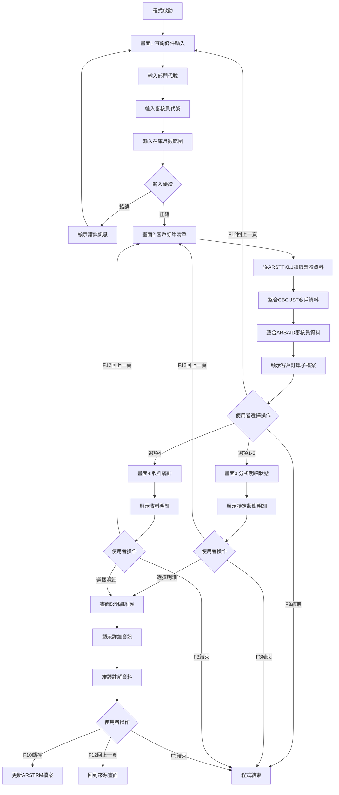
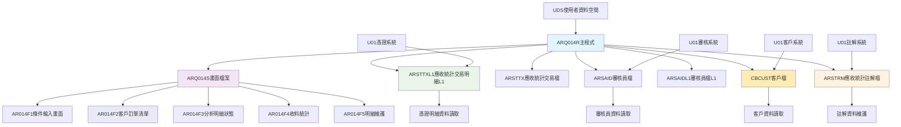
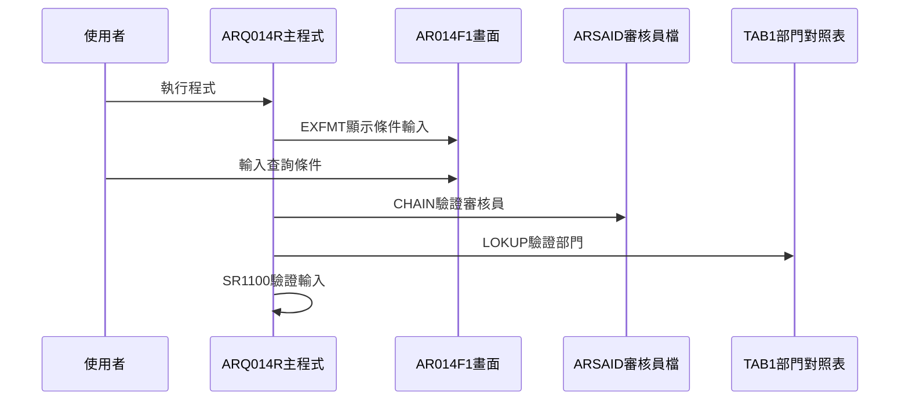
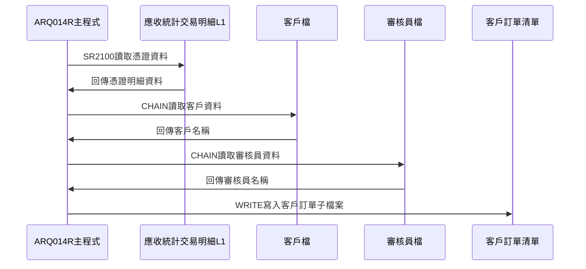
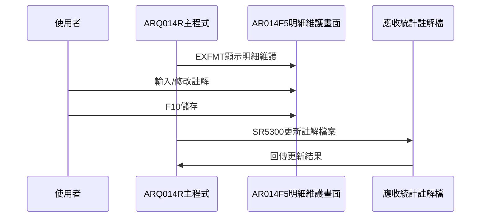
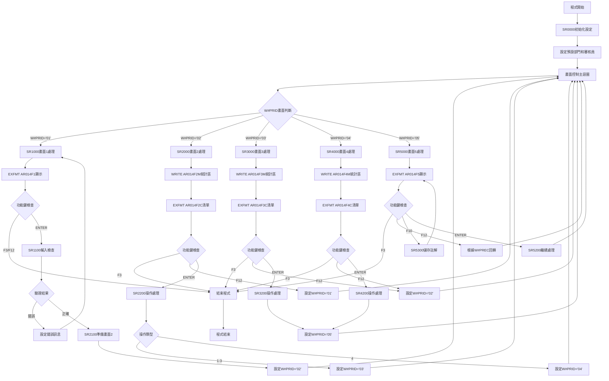

# ARQ014R_U01 程式規格書

## 1. 基本資料

| 項目 | 內容 |
|------|------|
| **程式編號** | ARQ014R |
| **程式名稱** | 應收憑證明細查詢作業 |
| **程式類型** | RPG |
| **廠區** | U01 |
| **系統名稱** | 應收帳款系統 |
| **子系統** | 憑證管理與查詢 |
| **檔案位置** | U01RPGSRC_THSRC/ARQ014R.txt |

## 2. 🎯 程式功能說明

### 主要功能描述
此程式為應收憑證明細查詢作業的主要處理程式，專門提供憑證明細資料的查詢和分析功能。程式採用五階段式畫面設計，透過應收統計交易明細檔(ARSTTXL1)、審核員檔(ARSAID)、客戶檔(CBCUST)、應收統計註解檔(ARSTRM)的整合處理，提供完整的憑證明細查詢分析服務。U01版本具有多條件篩選機制、狀態分類功能、明細資料維護、以及詳細的憑證資料瀏覽。程式特別針對U01廠區的憑證管理業務設計，確保憑證查詢結果的準確性和完整性，同時提供使用者友善的操作介面和完整的憑證資料展示功能。程式支援部門代號驗證、審核員權限檢查、在庫月數範圍篩選，並提供憑證狀態分類分析功能。

### 🎯 業務流程詳細說明

#### 完整業務流程圖


#### 業務流程關鍵階段說明

**第一階段：查詢條件輸入與驗證**
- 顯示AR014F1畫面進行條件輸入
- 使用者輸入部門代號(S#DEPT)
- 使用者輸入審核員代號(S#KEY1)
- 使用者輸入在庫月數範圍(S#KEY2-S#KEY3)

**第二階段：輸入條件檢查與驗證**
- 驗證審核員代號的存在性和權限
- 驗證部門代號的合法性(透過TAB1對照表)
- 驗證在庫月數範圍的合理性(S#KEY2 <= S#KEY3)
- 設定相應的錯誤指示器和錯誤訊息

**第三階段：客戶訂單資料查詢與準備**
- 從ARSTTXL1讀取指定條件的憑證資料
- 從CBCUST讀取對應的客戶資料
- 從ARSAID讀取對應的審核員資料
- 計算符合條件的憑證總金額
- 按客戶訂單進行分組顯示

**第四階段：明細資料分類處理**
- 根據使用者選擇的操作類型進行分類
- 操作1-3：進入分析明細狀態畫面(AR014F3)
- 操作4：進入收料統計畫面(AR014F4)
- 提供不同狀態的明細資料展示

**第五階段：明細維護功能**
- 顯示AR014F5明細維護畫面
- 展示完整的憑證資訊
- 提供註解資料的維護功能
- 支援ARSTRM檔案的更新

#### 🎯 U01版本應收憑證明細查詢特色
- **五階段畫面**：條件輸入、客戶清單、分析明細、收料統計、明細維護
- **多檔案整合**：整合ARSTTXL1、CBCUST、ARSAID、ARSTRM四大檔案
- **狀態分類查詢**：支援不同狀態的明細資料分類查詢
- **註解維護功能**：提供完整的註解資料維護機制

#### 多層次檢查機制
- **部門代號檢查**：透過TAB1對照表進行部門合法性驗證
- **審核員權限檢查**：驗證審核員代號的存在性和權限
- **在庫月數檢查**：驗證月數範圍的合理性
- **資料存在性檢查**：確保查詢的憑證資料存在

#### 智能處理邏輯
- 自動從使用者資料空間取得預設部門
- 自動從審核員檔取得使用者對應的審核員代號
- 動態分組顯示客戶訂單資料
- 智能篩選不同狀態的明細資料

#### 資料一致性確保機制
- 透過多個KLIST建立正確的檔案讀取鍵值
- 使用指示器控制子檔案的顯示狀態
- 分階段處理確保各步驟資料同步
- 記錄詳細的憑證查詢軌跡供後續分析

#### U01版本應收憑證明細查詢專業設計理念
- **憑證專精**：專門提供憑證明細資料的查詢和分析功能
- **使用者導向**：五階段操作流程符合使用者習慣
- **多維整合**：整合憑證、客戶、審核員、註解的完整資訊
- **U01特殊適配**：專為U01廠區的憑證管理業務需求設計

## 3. 🎯 檔案架構與關聯圖

### 使用檔案清單

| 檔案名稱 | 檔案類型 | 使用方式 | 說明 |
|----------|----------|----------|------|
| **ARQ014S** | DSPF | CF/COMBINED | 應收憑證明細查詢畫面檔案 |
| **ARSTTXL1** | 邏輯檔 | IF/INPUT | 應收統計交易明細檔案(邏輯檔L1) |
| **ARSTTX** | 實體檔 | IF/INPUT | 應收統計交易檔案 |
| **ARSAID** | 實體檔 | IF/INPUT | 審核員檔案 |
| **ARSAIDL1** | 邏輯檔 | IF/INPUT | 審核員檔案(邏輯檔L1) |
| **CBCUST** | 實體檔 | IF/INPUT | 客戶檔案 |
| **ARSTRM** | 實體檔 | UF/UPDATE | 應收統計註解檔案 |

### 🎯 檔案關聯詳細視覺化圖表



### 🎯 U01版本特殊資料流向說明

#### 查詢條件輸入階段的資料流向


#### U01版本憑證查詢階段的資料流向


#### U01版本明細維護階段的資料流向


## 4. 🎯 檔案欄位規格說明

### 主要資料結構

#### 使用檔案清單
| 檔案名稱 | 檔案類型 | 使用方式 | 說明 |
|----------|----------|----------|------|
| **ARQ014S** | DSPF | CF/COMBINED | 應收憑證明細查詢畫面檔案，含5個子檔案 |
| **ARSTTXL1** | 邏輯檔 | IF/INPUT | 應收統計交易明細檔案(邏輯檔L1)，主要查詢檔案 |
| **ARSTTX** | 實體檔 | IF/INPUT | 應收統計交易檔案，憑證明細基礎檔案 |
| **ARSAID** | 實體檔 | IF/INPUT | 審核員檔案，權限驗證使用 |
| **ARSAIDL1** | 邏輯檔 | IF/INPUT | 審核員檔案(邏輯檔L1)，使用者預設審核員查詢 |
| **CBCUST** | 實體檔 | IF/INPUT | 客戶檔案，客戶名稱查詢 |
| **ARSTRM** | 實體檔 | UF/UPDATE | 應收統計註解檔案，註解維護專用 |

### 🔍 重點欄位切割技術詳解

#### DS結構完整分析

##### UDS使用者資料空間結構切割
```
UDS使用者資料空間 (1030字元)：[___________________公司名稱區塊____________________|使用者區塊|設備區塊|權限區]
位置:                          951              985    1001 1003 1010 1011  1020 1021
                                ↓                ↓      ↓    ↓    ↓    ↓     ↓    ↓
位置951-985:                  [S#COMP____________________________]                   公司名稱(35字元)
位置1001-1003:                                        [U#DEPT]                      使用者部門(3字元)
位置1001-1010:                                        [U#USID_____]                 使用者ID(10字元)
位置1011-1020:                                                    [S#DEVI____]      設備名稱(10字元)
位置1021:                                                                   [U#AREA] 使用者區域(1字元)
```

**切割邏輯詳細說明**：
- **S#COMP (951-985, 35字元)**：用於AR014F1-F5所有畫面標題顯示的公司名稱，固定顯示位置
- **U#DEPT (1001-1003, 3字元)**：從U#USID中切割出的使用者部門代號，初始化S#DEPT預設值
- **U#USID (1001-1010, 10字元)**：完整的使用者識別代號，用於ARSAIDL1檔案查詢預設審核員
- **S#DEVI (1011-1020, 10字元)**：設備名稱，用於所有畫面右上角顯示，識別終端機
- **U#AREA (1021, 1字元)**：使用者權限區域標識，控制查詢範圍權限

**實際數據範例說明**：
```
UDS實際資料範例：
位置951-985: "東鋼鋼鐵股份有限公司               " (35字元) → 畫面標題
位置1001-1010: "B010ADMIN1" (10字元) → 切割為:
  - U#DEPT: "B01" (位置1001-1003) → 初始化S#DEPT為"B01"
  - 完整USID: "B010ADMIN1" → ARSAIDL1查詢取得預設審核員"01"
位置1011-1020: "TERM001   " (10字元) → 畫面右上角顯示
位置1021: "P" (1字元) → 權限區域，P=生產區域
```

##### TAB1部門對照表結構分析
```
TAB1部門對照表 (16字元)：[部門代號|部門名稱_________]
位置:                     1    4 5              16
                          ↓    ↓ ↓              ↓
位置1-4:                [B010]                   部門代號(4字元)
位置5-16:                    [台北業務部    ]    部門名稱(12字元)
```

**實際對照表資料**：
```
B010 → 台北業務部
B020 → 台中業務部  
B030 → 高雄業務部
B040 → 台南業務部
B050 → 桃園業務部
```

##### TAB2狀態對照表結構分析
```
TAB2狀態對照表 (11字元)：[狀態代號|狀態名稱____]
位置:                    1       2         11
                         ↓       ↓         ↓
位置1:                  [1]               狀態代號(1字元)
位置2-11:                [待開發票  ]    狀態名稱(10字元)
```

**實際對照表資料**：
```
1 → 待開發票
2 → 待審查
3 → 待收料
4 → 待沖銷
* → 其他待收料
```

##### T#MSG訊息表結構分析
```
T#MSG訊息表 (70字元)：[完整錯誤訊息內容____________________________________]
位置:                 1                                                70
                      ↓                                                ↓
位置1-70:            [部門代號錯誤，請檢查輸入的部門代號是否存在！    ]  錯誤訊息(70字元)
```

**實際訊息表資料**：
```
T#MSG,1 → "部門代號錯誤，請檢查輸入的部門代號是否存在！"
T#MSG,2 → "審核員錯誤，審核員代號不存在，請確認！"
T#MSG,3 → "月數範圍錯誤，在庫月數起不可大於迄！"
T#MSG,4 → "月數設定錯誤，在庫月數起不可為零！"
T#MSG,5 → "註解資料儲存完成。"
```

#### 欄位切割視覺化展示

##### ARSTTXL1查詢鍵值結構完整分析
```
ARSTTXL1主要欄位結構：
記錄主鍵 (30字元)：[DEPT|RVID|CUNO__|ORNO__|TXCD|TXNO___|INNO_____]
位置:              001  005  007   013   019  023    031     041
                   ↓    ↓    ↓     ↓     ↓    ↓      ↓       ↓
AXDEPT(001-004):  [B010]                                       部門代號(4字元)
AXRVID(005-006):      [01]                                     審核員代號(2字元)
AXCUNO(007-012):          [CU0001]                             客戶編號(6字元)
AXORNO(013-018):                [OR0001]                       訂單號碼(6字元)
AXTXCD(019-022):                        [AR01]                 交易代號(4字元)
AXTXNO(023-030):                            [TXN00001]         交易號碼(8字元)
AXINNO(031-040):                                    [INV0000001] 發票號碼(10字元)
```

##### 三重KLIST查詢策略結構
```
K#AX1 KLIST (部門審核員層級查詢)：
部門審核員組合鍵 (6字元)：[DEPT|RVID]
位置:                      001  005
                           ↓    ↓
KFLD AXDEPT (4字元):      [B010]      SR2100使用：部門範圍查詢
KFLD AXRVID (2字元):          [01]    SR2100使用：審核員範圍查詢

K#AX2 KLIST (客戶訂單層級查詢)：
客戶訂單組合鍵 (18字元)：[DEPT|RVID|CUNO__|ORNO__]
位置:                     001  005  007   013
                          ↓    ↓    ↓     ↓
KFLD AXDEPT (4字元):     [B010]              SR3100/SR4100使用：部門條件
KFLD AXRVID (2字元):         [01]            SR3100/SR4100使用：審核員條件
KFLD AXCUNO (6字元):             [CU0001]    SR3100/SR4100使用：客戶條件
KFLD AXORNO (6字元):                 [OR0001] SR3100/SR4100使用：訂單條件

K#AX3 KLIST (憑證明細層級查詢)：
憑證明細組合鍵 (22字元)：[TXCD|TXNO___|INNO_____]
位置:                     001  005    013
                          ↓    ↓      ↓
KFLD AXTXCD (4字元):     [AR01]              SR5100使用：交易代號條件
KFLD AXTXNO (8字元):         [TXN00001]      SR5100使用：交易號碼條件
KFLD AXINNO (10字元):             [INV0000001] SR5100使用：發票號碼條件
```

##### 查詢條件輸入欄位組合結構
```
查詢條件完整組合 (16字元)：[DEPT|KEY1|KEY2|KEY3]
位置:                      001  005  007  011   015
                           ↓    ↓    ↓    ↓     ↓
S#DEPT(001-004):          [B010]              部門代號(4字元)
S#KEY1(005-006):              [01]            審核員代號(2字元)
S#KEY2(007-010):                  [0012]      在庫月數起(4字元數值)
S#KEY3(011-014):                      [0024]  在庫月數迄(4字元數值)
```

**查詢邏輯使用範例**：
```
實際查詢組合範例：
輸入: S#DEPT="B010", S#KEY1="01", S#KEY2=0012, S#KEY3=0024
組合: "B010" + "01" + "0012" + "0024"
用途: 查詢B010部門01審核員在庫月數12-24月的憑證明細
```

### 🎯 欄位挪用詳細分析

#### 挪用情況對比表
| 欄位名稱 | 原始定義 | 實際使用方式 | 挪用原因 | 挪用方式詳細說明 |
|----------|----------|-------------|----------|------------------|
| **S#MSG1-5** | 一般訊息欄位 | 分類錯誤訊息專用 | 五階段畫面錯誤分類需求 | 依據T#MSG表索引分配不同錯誤類型訊息 |
| **W#PRID** | 程式識別 | 五階段畫面流程控制 | 複雜畫面轉換邏輯需求 | '01'→'02'→'03'→'04'→'05'順序控制 |
| **W#PREC** | 程式記錄 | F12回轉畫面記錄 | 畫面間回轉功能需求 | 記錄前一畫面編號實現F12回轉 |
| **W#ORNO** | 工作變數 | 客戶訂單分組控制 | 憑證資料分組顯示需求 | 暫存當前處理訂單號碼作為分組基準 |
| **W#RTNV** | 回傳變數 | 輸入驗證結果控制 | SR1100驗證流程控制 | 'T'=驗證通過，'F'=驗證失敗 |
| **S#OPT2/3/4** | 選項欄位 | 子檔案操作選項 | 不同畫面功能選擇需求 | 畫面2(1-4)、畫面3/4選擇明細記錄 |
| **TAB1/TAB2** | 資料表 | 代號名稱對照轉換 | 代號顯示友善化需求 | LOKUP指令進行代號與名稱轉換 |

#### 挪用原因深度分析

##### S#MSG系列錯誤訊息挪用分析
**原始定義**：AR014F1-F5畫面一般訊息顯示欄位
**實際使用**：分類錯誤訊息專業化顯示機制
**挪用原因**：
1. 五階段畫面需要不同類型錯誤訊息的專業化處理
2. SR1100輸入驗證需要精確的錯誤分類和定位顯示
3. 使用者體驗要求錯誤訊息明確分類且易於理解
4. 節省畫面空間，一個欄位多重用途提高效率

**挪用方式詳細說明**：
```
分類錯誤訊息挪用機制：
S#MSG1 → 部門代號驗證錯誤 (MOVELT#MSG,1 + 指示器51)
         觸發條件: TAB1 LOKUP失敗
         顯示位置: AR014F1畫面底部
         
S#MSG2 → 審核員驗證錯誤 (MOVELT#MSG,2 + 指示器52)
         觸發條件: ARSAID CHAIN失敗
         顯示位置: AR014F2畫面底部
         
S#MSG3 → 月數範圍邏輯錯誤 (MOVELT#MSG,3 + 指示器53)
         觸發條件: S#KEY2 > S#KEY3
         顯示位置: AR014F1畫面底部
         
S#MSG4 → 月數起始值錯誤 (MOVELT#MSG,4 + 指示器53)
         觸發條件: S#KEY2 = 0
         顯示位置: AR014F1畫面底部
         
S#MSG5 → 註解儲存成功訊息 (MOVELT#MSG,5)
         觸發條件: SR5300執行完成
         顯示位置: AR014F5畫面底部
```

##### W#PRID五階段畫面流程控制挪用分析
**原始定義**：程式識別變數
**實際使用**：五階段畫面流程專業控制機制
**挪用原因**：
1. 憑證明細查詢需要複雜的五階段操作流程管理
2. 需要精確控制條件輸入→客戶清單→分析明細→收料統計→明細維護的流程
3. DOUEQ主迴圈需要清晰的畫面狀態判斷和轉換控制
4. 提供使用者一致的操作體驗和清楚的流程導引

**挪用方式詳細說明**：
```
五階段畫面流程控制挪用邏輯：
畫面流程: W#PRID = '01' → AR014F1 (條件輸入)
               ↓ ENTER驗證通過
         W#PRID = '02' → AR014F2 (客戶訂單清單)
               ↓ 選擇操作1-3
         W#PRID = '03' → AR014F3 (分析明細狀態)
               ↓ 或選擇操作4
         W#PRID = '04' → AR014F4 (收料統計)
               ↓ 選擇明細記錄
         W#PRID = '05' → AR014F5 (明細維護)

CASEQ判斷機制:
W#PRID CASEQ '01' → EXSR SR1000 (畫面1處理)
W#PRID CASEQ '02' → EXSR SR2000 (畫面2處理)  
W#PRID CASEQ '03' → EXSR SR3000 (畫面3處理)
W#PRID CASEQ '04' → EXSR SR4000 (畫面4處理)
W#PRID CASEQ '05' → EXSR SR5000 (畫面5處理)
```

##### W#PREC回轉控制挪用分析
**原始定義**：程式記錄變數
**實際使用**：F12畫面回轉專業控制機制
**挪用原因**：
1. 五階段畫面需要靈活的F12回轉功能
2. 畫面5可能從畫面3或畫面4進入，需要記錄來源
3. 使用者體驗要求F12能正確回到上一個操作畫面
4. 避免回轉邏輯混亂造成使用者困惑

**挪用方式詳細說明**：
```
F12回轉控制挪用邏輯：
設定來源記錄:
SR3200: W#PREC = '03' (從畫面3進入畫面5)
SR4200: W#PREC = '04' (從畫面4進入畫面5)

回轉處理邏輯:
SR5000: F12按鍵處理
  MOVELW#PREC → W#PRID (回到來源畫面)
  
SR5200: 明細維護後繼續處理
  W#PREC WHEQ '03' → EXSR SR3200 (回到畫面3處理)
  W#PREC WHEQ '04' → EXSR SR4200 (回到畫面4處理)
```

#### 挪用影響評估

##### 系統維護影響分析
**正面影響**：
1. **程式碼效率提升**：單一變數多重用途減少記憶體使用
2. **流程控制清晰**：五階段流程控制邏輯明確且易於維護
3. **錯誤處理統一**：分類錯誤訊息提供一致的使用者體驗
4. **功能擴展彈性**：TAB1/TAB2對照表機制便於代號名稱維護

**維護考量**：
1. **變數意義理解**：維護人員需理解挪用邏輯避免修改錯誤
2. **流程依賴性**：畫面流程控制邏輯變更需整體考量
3. **訊息管理複雜性**：T#MSG表維護需對應程式邏輯
4. **對照表一致性**：TAB1/TAB2資料變更影響顯示邏輯

#### 實際數據範例說明

##### 查詢流程完整資料範例
```
完整查詢流程資料範例：
階段1 - 條件輸入:
  UDS輸入: U#USID="B010USER1" → U#DEPT="B01" → S#DEPT="B010"
  使用者輸入: S#KEY1="01", S#KEY2=0012, S#KEY3=0024
  驗證結果: ARSAID CHAIN成功, TAB1 LOKUP成功, 月數邏輯正確

階段2 - 客戶清單:
  K#AX1查詢: AXDEPT="B010" + AXRVID="01"
  結果分組: 客戶CU0001訂單OR0001金額50000, 客戶CU0002訂單OR0002金額30000
  
階段3 - 分析明細:
  使用者選擇: S#OPT2="1" (待開發票)
  K#AX2查詢: 增加AXCUNO="CU0001" + AXORNO="OR0001"
  狀態篩選: AXSTCD="1"的明細記錄
  
階段4 - 明細維護:
  選定明細: S#TXCD="AR01", S#TXNO="TXN00001", S#INNO="INV0000001"
  K#AX3查詢: 取得完整憑證資料
  註解維護: S#RMRK="此憑證需特殊審核流程"
```

##### TAB對照表實際使用範例
```
TAB1部門對照實際使用：
輸入: S#DEPT="B010"
LOKUP: TAB1查詢 → TAB1R="台北業務部"
結果: S#DEPN="台北業務部" (畫面顯示)

TAB2狀態對照實際使用：
輸入: S#OPT2="1"
LOKUP: TAB2查詢 → TAB2R="待開發票"
結果: S#STAT="待開發票" (畫面3/4顯示)
```

### 重要變數定義表

#### 畫面流程控制變數
| 變數名稱 | 類型 | 長度 | 使用範圍 | 說明 |
|----------|------|------|----------|------|
| **W#PRID** | CHAR | 2 | 主程式DOUEQ迴圈 | 五階段畫面編號('01'-'05') |
| **W#PREC** | CHAR | 2 | SR3200/SR4200/SR5000 | F12回轉前一畫面記錄 |
| **W#RTNV** | CHAR | 1 | SR1100驗證 | 驗證結果('T'=通過,'F'=失敗) |
| **W#ORNO** | CHAR | 6 | SR2100分組處理 | 客戶訂單分組控制暫存 |

#### 查詢條件與驗證變數
| 變數名稱 | 類型 | 長度 | 使用範圍 | 說明 |
|----------|------|------|----------|------|
| **S#DEPT** | CHAR | 4 | 全程式 | 部門代號，TAB1驗證對象 |
| **S#DEPN** | CHAR | 12 | 畫面2-5顯示 | 部門名稱，TAB1查詢結果 |
| **S#KEY1** | CHAR | 2 | 全程式 | 審核員代號，ARSAID驗證對象 |
| **S#KEY2** | NUM | 4 | 全程式 | 在庫月數起，AXINDU比較條件 |
| **S#KEY3** | NUM | 4 | 全程式 | 在庫月數迄，AXINDU比較條件 |

#### 子檔案記錄控制變數
| 變數名稱 | 類型 | 長度 | 使用範圍 | 說明 |
|----------|------|------|----------|------|
| **RRN2** | NUM | 4 | SR2000系列 | AR014F2子檔案記錄號碼(1-10) |
| **RRN3** | NUM | 4 | SR3000系列 | AR014F3子檔案記錄號碼(1-10) |
| **RRN4** | NUM | 4 | SR4000系列 | AR014F4子檔案記錄號碼(1-10) |
| **S#SFN2** | NUM | 4 | SR2000系列 | AR014F2子檔案總記錄數 |
| **S#SFN3** | NUM | 4 | SR3000系列 | AR014F3子檔案總記錄數 |
| **S#SFN4** | NUM | 4 | SR4000系列 | AR014F4子檔案總記錄數 |
| **S#NBR2** | NUM | 4 | SR2000系列 | AR014F2子檔案游標位置 |
| **S#NBR3** | NUM | 4 | SR3000系列 | AR014F3子檔案游標位置 |
| **S#NBR4** | NUM | 4 | SR4000系列 | AR014F4子檔案游標位置 |
| **S#CRN2** | NUM | 4 | SR2000系列 | AR014F2子檔案選擇記錄號 |
| **S#CRN3** | NUM | 4 | SR3000系列 | AR014F3子檔案選擇記錄號 |
| **S#CRN4** | NUM | 4 | SR4000系列 | AR014F4子檔案選擇記錄號 |

#### 憑證資料顯示變數
| 變數名稱 | 類型 | 長度 | 使用範圍 | 說明 |
|----------|------|------|----------|------|
| **S#CUNO** | CHAR | 6 | 子檔案顯示 | 客戶編號，AXCUNO對應 |
| **S#CUNM** | CHAR | 10 | 子檔案顯示 | 客戶名稱，CBCUNM對應 |
| **S#ORNO** | CHAR | 6 | 子檔案顯示 | 訂單號碼，AXORNO對應 |
| **S#RVID** | CHAR | 2 | 子檔案顯示 | 審核員代號，AXRVID對應 |
| **S#RVNM** | CHAR | 10 | 子檔案顯示 | 審核員名稱，SANAME對應 |
| **S#TXCD** | CHAR | 4 | 明細資料 | 交易代號，AXTXCD對應 |
| **S#TXNO** | CHAR | 8 | 明細資料 | 交易號碼，AXTXNO對應 |
| **S#INNO** | CHAR | 10 | 明細資料 | 發票號碼，AXINNO對應 |
| **S#APNO** | CHAR | 6 | 明細資料 | 應付憑證號，AXAPNO對應 |
| **S#RVNO** | CHAR | 6 | 明細資料 | 收料編號，AXRVNO對應 |

#### 金額統計與日期變數
| 變數名稱 | 類型 | 長度 | 使用範圍 | 說明 |
|----------|------|------|----------|------|
| **S#AAMT** | NUM | 11 | SR2100累計 | 客戶訂單憑證累計金額 |
| **S#2AMT** | NUM | 11 | 畫面2統計 | 畫面2總金額，所有客戶訂單 |
| **S#3AMT** | NUM | 11 | 畫面3統計 | 畫面3總金額，特定狀態明細 |
| **S#4AMT** | NUM | 11 | 畫面4統計 | 畫面4總金額，收料統計明細 |
| **S#INAM** | NUM | 11 | 明細顯示 | 發票金額，AXINAM對應 |
| **S#TXAM** | NUM | 11 | 明細顯示 | 交易金額，AXTXAM對應 |
| **S#TXDT** | NUM | 8 | 明細顯示 | 交易日期，AXTXDT對應 |
| **S#RVDT** | NUM | 8 | 明細顯示 | 收料日期，AXRVDT對應 |
| **S#RVLD** | NUM | 8 | 明細顯示 | 收料最後沖銷日，AXRVLD對應 |
| **S#ORLD** | NUM | 8 | 明細顯示 | 訂單最後沖銷日，AXORLD對應 |
| **S#INDU** | NUM | 4 | 明細顯示 | 在庫月數，AXINDU對應 |
| **S#DELY** | NUM | 4 | 明細顯示 | 延遲天數，AXDELY對應 |

#### 操作選項與狀態變數
| 變數名稱 | 類型 | 長度 | 使用範圍 | 說明 |
|----------|------|------|----------|------|
| **S#OPT2** | CHAR | 1 | AR014F2操作 | 畫面2操作選項(1-4或空白) |
| **S#OPT3** | CHAR | 1 | AR014F3操作 | 畫面3明細選擇(任意字元或空白) |
| **S#OPT4** | CHAR | 1 | AR014F4操作 | 畫面4明細選擇(任意字元或空白) |
| **S#STAT** | CHAR | 10 | 畫面3/4顯示 | 狀態名稱，TAB2查詢結果 |
| **S#STNM** | CHAR | 10 | 畫面5顯示 | 狀態名稱，TAB2查詢結果 |
| **S#RMRK** | CHAR | 70 | 畫面5維護 | 註解內容，AMRMRK對應 |

#### 錯誤處理與訊息變數
| 變數名稱 | 類型 | 長度 | 使用範圍 | 說明 |
|----------|------|------|----------|------|
| **S#MSG1** | CHAR | 70 | AR014F1錯誤 | 部門代號錯誤訊息，T#MSG,1 |
| **S#MSG2** | CHAR | 70 | AR014F2錯誤 | 審核員錯誤訊息，T#MSG,2 |
| **S#MSG3** | CHAR | 70 | AR014F3錯誤 | 月數範圍錯誤訊息，T#MSG,3 |
| **S#MSG4** | CHAR | 70 | AR014F4錯誤 | 月數設定錯誤訊息，T#MSG,4 |
| **S#MSG5** | CHAR | 70 | AR014F5訊息 | 註解儲存完成訊息，T#MSG,5 |

## 5. 🎯 輸出/入螢幕布局

### 畫面1：查詢條件輸入畫面(AR014F1)

```
+------------------------------------------------------------------------------+
|[日期]                東鋼鋼鐵股份有限公司                          ARQ014S-1 |
|[時間]         *** 應收憑證明細查詢作業 ***                        [設備名稱] |
|                                                                              |
|                                                                              |
|                                                                              |
|                                                                              |
|                                                                              |
|                   部門代號: [____]                                           |
|                                                                              |
|                     審核員: [__] (空白時查詢該部門全部審核員)                 |
|                                                                              |
|                                                                              |
|                   在庫月數: [____] 月 至 [____] 月                          |
|                                                                              |
|                                                                              |
|                                                                              |
|                                                                              |
|                                                                              |
|                                                                              |
|                                                                              |
|                                                                              |
|      F3:結束            F12:回頁             ENTER:執行                      |
|[錯誤訊息顯示區]                                                              |
+------------------------------------------------------------------------------+
```

### 畫面2：客戶訂單查詢清單畫面(AR014F2)

```
+------------------------------------------------------------------------------+
|[日期]                東鋼鋼鐵股份有限公司                          ARQ014S-2 |
|[時間]         *** 應收憑證明細查詢作業 ***                        [設備名稱] |
|                                                                              |
|客戶訂單查詢                                                                  |
|   部門代號: [____] [部門名稱___________]                                     |
|   在庫月數: [____] 月 至 [____] 月                   合計金額: [___________]|
|                                                                              |
|操作選項: 1待開發票, 2待審查, 3待收料, 4收料統計                              |
|----------------------------------------------------------------------------- |
|             客戶  編號        訂單    審核員  編號        月數總金額           |
|             號碼  名稱        號碼    員名    稱號                            |
|----------------------------------------------------------------------------- |
|[_] [______][__________] [______] [__][__________] [___________]              |
|[_] [______][__________] [______] [__][__________] [___________]              |
|[_] [______][__________] [______] [__][__________] [___________]              |
|[_] [______][__________] [______] [__][__________] [___________]              |
|[_] [______][__________] [______] [__][__________] [___________]              |
|[_] [______][__________] [______] [__][__________] [___________]              |
|[_] [______][__________] [______] [__][__________] [___________]              |
|[_] [______][__________] [______] [__][__________] [___________]              |
|[_] [______][__________] [______] [__][__________] [___________]              |
|[_] [______][__________] [______] [__][__________] [___________]              |
|----------------------------------------------------------------------------- |
|      F03:結束      F12:回頁         ENTER:選擇                               |
|[錯誤訊息顯示區]                                                              |
+------------------------------------------------------------------------------+
```

### 畫面3：分析明細狀態畫面(AR014F3)

```
+------------------------------------------------------------------------------+
|[日期]                東鋼鋼鐵股份有限公司                          ARQ014S-3 |
|[時間]         *** 應收憑證明細查詢作業 ***                        [設備名稱] |
|                                                                              |
|分析明細查詢                                                                  |
|   部門代號: [____] [部門名稱_______] 審核員: [__] [審核員名____]             |
|   客戶編號: [______] [客戶名____] 訂單: [______]                             |
|   在庫月數: [____] 月 至 [____] 月           月數總金額: [___________]       |
|操作選項:                                                                     |
|[狀態名稱____]                               該狀態金額合計: [___________]    |
|----------------------------------------------------------------------------- |
|         交易號碼        交易     發票號碼     應付編號      發票金額    在庫   |
|                        日期                                                 |
|----------------------------------------------------------------------------- |
|[_] [________] [__/__/__] [__________] [______] [___________] [____]          |
|[_] [________] [__/__/__] [__________] [______] [___________] [____]          |
|[_] [________] [__/__/__] [__________] [______] [___________] [____]          |
|[_] [________] [__/__/__] [__________] [______] [___________] [____]          |
|[_] [________] [__/__/__] [__________] [______] [___________] [____]          |
|[_] [________] [__/__/__] [__________] [______] [___________] [____]          |
|[_] [________] [__/__/__] [__________] [______] [___________] [____]          |
|[_] [________] [__/__/__] [__________] [______] [___________] [____]          |
|[_] [________] [__/__/__] [__________] [______] [___________] [____]          |
|[_] [________] [__/__/__] [__________] [______] [___________] [____]          |
|----------------------------------------------------------------------------- |
|      F03:結束      F12:回頁         ENTER:選擇                               |
|[錯誤訊息顯示區]                                                              |
+------------------------------------------------------------------------------+
```

### 畫面4：收料統計畫面(AR014F4)

```
+------------------------------------------------------------------------------+
|[日期]                東鋼鋼鐵股份有限公司                          ARQ014S-4 |
|[時間]         *** 應收憑證明細查詢作業 ***                        [設備名稱] |
|                                                                              |
|收料統計查詢                                                                  |
|   部門代號: [____] [部門名稱_______] 審核員: [__] [審核員名____]             |
|   客戶編號: [______] [客戶名____] 訂單: [______]                             |
|   在庫月數: [____] 月 至 [____] 月           月數總金額: [___________]       |
|----------------------------------------------------------------------------- |
|                                           在                               該狀態金額合計: [___________]    |
|             交易號碼    交易        在      收料    訂單    延               |
|交易    日期  發票號碼    收料號     金額     庫     最後    最後    遲               |
|代號                                 收料     收料   沖銷日  沖銷日  天               |
|----------------------------------------------------------------------------- |
|[_] [____] [__/__/__] [__________] [______] [___] [____] [__/__/__] [__/__/__] [____]|
|[_] [____] [__/__/__] [__________] [______] [___] [____] [__/__/__] [__/__/__] [____]|
|[_] [____] [__/__/__] [__________] [______] [___] [____] [__/__/__] [__/__/__] [____]|
|[_] [____] [__/__/__] [__________] [______] [___] [____] [__/__/__] [__/__/__] [____]|
|[_] [____] [__/__/__] [__________] [______] [___] [____] [__/__/__] [__/__/__] [____]|
|[_] [____] [__/__/__] [__________] [______] [___] [____] [__/__/__] [__/__/__] [____]|
|[_] [____] [__/__/__] [__________] [______] [___] [____] [__/__/__] [__/__/__] [____]|
|[_] [____] [__/__/__] [__________] [______] [___] [____] [__/__/__] [__/__/__] [____]|
|[_] [____] [__/__/__] [__________] [______] [___] [____] [__/__/__] [__/__/__] [____]|
|[_] [____] [__/__/__] [__________] [______] [___] [____] [__/__/__] [__/__/__] [____]|
|----------------------------------------------------------------------------- |
|      F03:結束      F12:回頁         ENTER:選擇                               |
|[錯誤訊息顯示區]                                                              |
+------------------------------------------------------------------------------+
```

### 畫面5：明細維護畫面(AR014F5)

```
+------------------------------------------------------------------------------+
|[日期]                東鋼鋼鐵股份有限公司                          ARQ014S-5 |
|[時間]         *** 應收憑證明細查詢作業 ***                        [設備名稱] |
|                                                                              |
|憑證編輯查詢                                                                  |
|                                                                              |
|                      部門代號: [____] [部門名稱_______]                     |
|                        審核員: [__] [審核員名____]                           |
|                                                                              |
|                        客戶: [______] [客戶名____]                         |
|                        訂單: [______]                                       |
|[____]                                                                        |
|   交易號碼: [________]      交易日期: [____/__/__]  交易金額: [___________] |
|                                                                              |
|                      發票號碼: [__________]     應付編號: [______]           |
|                                                                              |
|                      收料編號: [______]          收料日期: [____/__/__]      |
|                                                                              |
|                 訂單最後沖銷日: [____/__/__]                                |
|                 收料最後沖銷日: [____/__/__]                                |
|                      延遲天數: [____]            分析在庫: [____]            |
|                                                                              |
|                      發票金額: [___________]     [狀態名稱____]              |
|                                                                              |
|                        備註: [________________________________________]     |
|                                                                              |
|                                                                              |
|      F3:結束            F12:回頁               F10:儲存                     |
|[錯誤訊息顯示區]                                                              |
+------------------------------------------------------------------------------+
```

### 🎯 畫面欄位詳細說明

#### 畫面1輸入欄位
| 欄位名稱 | 欄位屬性 | 位置 | 長度 | 輸入格式 | 驗證規則 | 說明 |
|----------|----------|------|------|----------|----------|------|
| **S#DEPT** | 輸入/輸出 | 8,33 | 4 | 英數字 | TAB1驗證 | 部門代號輸入 |
| **S#KEY1** | 輸入/輸出 | 10,33 | 2 | 英數字 | ARSAID驗證 | 審核員代號輸入 |
| **S#KEY2** | 輸入/輸出 | 13,33 | 4 | 數字 | 範圍檢查 | 在庫月數起始 |
| **S#KEY3** | 輸入/輸出 | 13,50 | 4 | 數字 | 範圍檢查 | 在庫月數結束 |

#### 畫面2-4子檔案顯示欄位
| 欄位名稱 | 欄位屬性 | 說明 |
|----------|----------|------|
| **S#OPT2/3/4** | 輸入 | 操作選項(1-4或空白) |
| **S#CUNO** | 顯示 | 客戶編號 |
| **S#CUNM** | 顯示 | 客戶名稱 |
| **S#ORNO** | 顯示 | 訂單號碼 |
| **S#RVID** | 顯示 | 審核員代號 |
| **S#RVNM** | 顯示 | 審核員名稱 |
| **S#AAMT** | 顯示 | 總金額 |
| **S#TXNO** | 顯示 | 交易號碼 |
| **S#TXDT** | 顯示 | 交易日期 |
| **S#INNO** | 顯示 | 發票號碼 |
| **S#APNO** | 顯示 | 應付憑證號 |
| **S#INAM** | 顯示 | 發票金額 |
| **S#INDU** | 顯示 | 在庫月數 |

#### 畫面5維護欄位
| 欄位名稱 | 欄位屬性 | 說明 |
|----------|----------|------|
| **S#RMRK** | 輸入/輸出 | 註解內容(可維護) |
| **其他欄位** | 顯示 | 明細資訊(唯讀) |

### 功能鍵詳細定義

| 功能鍵 | 處理邏輯 | 系統行為 | 說明 |
|--------|----------|----------|------|
| **F3** | 設定IN03='1' | 程式立即結束 | 離開查詢作業 |
| **F12** | 回到上一畫面 | 畫面流程控制 | 返回上一個操作畫面 |
| **F10** | 儲存註解資料 | 更新ARSTRM檔案 | 儲存畫面5的註解修改 |
| **ENTER** | 執行操作 | 根據畫面執行相應動作 | 執行查詢或選擇操作 |

### 輸入驗證機制

#### 查詢條件驗證
- S#DEPT透過TAB1對照表進行部門合法性驗證
- S#KEY1透過ARSAID檔案進行審核員存在性驗證
- S#KEY2和S#KEY3進行範圍邏輯檢查

#### U01版本特殊驗證
- 驗證使用者是否有查詢該部門的權限
- 確認審核員代號對應的部門一致性
- 檢查在庫月數範圍的合理性

## 6. 🎯 處理流程程序說明

### 🎯 主程序邏輯深度分析

#### U01版本程式執行流程圖


#### 🎯 U01版本應收憑證明細查詢特殊步驟分析

**步驟1：SR0000程式初始化設定**
- 初始化三個子檔案的記錄號碼(RRN2, RRN3, RRN4)
- 設定初始畫面編號(W#PRID='01')
- 從UDS取得使用者部門(U#DEPT → S#DEPT)
- 初始化查詢條件(S#KEY1, S#KEY2, S#KEY3)
- 從ARSAIDL1取得使用者對應的審核員代號

**步驟2：SR1000畫面1查詢條件輸入處理**
- 顯示AR014F1畫面進行條件輸入
- 檢查F3/F12功能鍵決定是否結束程式
- 執行SR1100輸入條件檢查
- 驗證通過則執行SR2100準備畫面2資料

**步驟3：SR1100輸入條件檢查邏輯**
- 驗證審核員代號的存在性(ARSAID檔案)
- 驗證部門代號的合法性(TAB1對照表)
- 驗證在庫月數範圍(S#KEY2 <= S#KEY3且S#KEY2 > 0)
- 設定相應的錯誤指示器(51, 52, 53)

**步驟4：SR2100客戶訂單資料準備**
- 清除錯誤訊息和統計變數
- 從ARSTTXL1讀取指定條件的憑證資料
- 從CBCUST讀取對應的客戶資料
- 從ARSAID讀取對應的審核員資料
- 按客戶訂單進行分組顯示
- 計算各訂單的憑證總金額

**步驟5：SR2000畫面2客戶訂單清單處理**
- 顯示AR014F2M統計資訊區域
- 顯示AR014F2C控制的AR014F2子檔案
- 處理使用者的操作選項(1-4)
- 執行SR2200操作處理邏輯

**步驟6：SR2200操作處理邏輯**
- 檢查使用者選擇的操作選項
- 操作1-3：執行SR3100準備畫面3資料
- 操作4：執行SR4100準備畫面4資料
- 更新子檔案記錄並設定游標位置

**步驟7：SR3000畫面3分析明細狀態處理**
- 顯示AR014F3M統計資訊區域
- 顯示AR014F3C控制的AR014F3子檔案
- 處理使用者的明細選擇操作
- 執行SR3200操作處理邏輯

**步驟8：SR3100畫面3資料準備**
- 根據選定的客戶訂單資料
- 從ARSTTXL1讀取符合狀態條件的明細
- 篩選特定狀態(S#OPT2)的交易明細
- 計算該狀態的憑證總金額

**步驟9：SR4000畫面4收料統計處理**
- 顯示AR014F4M統計資訊區域
- 顯示AR014F4C控制的AR014F4子檔案
- 處理使用者的明細選擇操作
- 執行SR4200操作處理邏輯

**步驟10：SR4100畫面4資料準備**
- 根據選定的客戶訂單資料
- 從ARSTTXL1讀取狀態為'4'或'*'的明細
- 顯示收料相關的詳細資訊
- 計算收料統計的憑證總金額

**步驟11：SR5000畫面5明細維護處理**
- 顯示AR014F5明細維護畫面
- 執行SR5100取得明細資料
- 處理F10儲存註解功能
- 執行SR5200繼續處理邏輯

**步驟12：SR5100明細資料取得**
- 根據選定的明細記錄(S#TXCD, S#TXNO, S#INNO)
- 從ARSTTXL1讀取完整的憑證資料
- 從TAB2對照表取得狀態名稱
- 從ARSTRM讀取對應的註解資料

**步驟13：SR5300註解資料儲存**
- 檢查ARSTRM檔案中註解記錄的存在性
- 若不存在則新增註解記錄(WRITE)
- 若存在則更新註解記錄(UPDATE)
- 顯示儲存完成訊息

#### 業務邏輯深度解析

**U01版本應收憑證明細查詢的核心邏輯**：
1. 提供五階段式的憑證明細查詢和分析功能
2. 支援多檔案整合機制確保查詢完整性
3. 提供狀態分類的明細資料分析功能
4. 憑證明細專業化查詢的完整實現

**U01版本效能優化機制**：
1. 使用子檔案控制顯示效能(每頁10筆記錄)
2. 分階段處理確保查詢效能
3. 智能分組處理減少重複資料顯示
4. 提供憑證總金額統計

#### 條件判斷詳細說明

**U01版本輸入驗證判斷**：
- `*IN69 IFEQ '1'` - 審核員代號不存在時錯誤
- `*IN69 IFEQ '0'` - 部門代號不存在時錯誤
- `S#KEY2 IFGT S#KEY3` - 在庫月數範圍錯誤
- `S#KEY2 IFEQ 0` - 在庫月數起始值錯誤

**U01版本狀態篩選判斷**：
- `AXSTCD IFEQ S#OPT2` - 畫面3特定狀態篩選
- `AXSTCD IFEQ '4'` - 畫面4收料統計篩選
- `AXSTCD OREQ '*'` - 畫面4其他待收料篩選

#### 變數使用和數據流向追蹤

**U01版本特殊變數軌跡**：
1. 畫面控制變數(W#PRID)的五階段轉換軌跡
2. 回轉控制變數(W#PREC)的畫面記錄軌跡
3. 訂單分組變數(W#ORNO)的分組處理軌跡
4. 子檔案記錄號碼(RRN2/3/4)和記錄數(S#SFN2/3/4)的管理軌跡
5. 統計變數(S#2AMT/3AMT/4AMT)的累計軌跡
6. 操作選項變數(S#OPT2/3/4)的處理軌跡
7. 錯誤處理變數(S#MSG1-5, 指示器)的設定軌跡

### 🎯 U01版本子程序邏輯分析

#### U01版本子程序調用順序
1. **SR0000程序**：程式初始化，設定預設值和初始畫面
2. **SR1100程序**：輸入條件檢查，驗證查詢條件的合法性
3. **SR2100程序**：客戶訂單資料準備，讀取和分組憑證資料
4. **SR2200程序**：客戶訂單操作處理，分派到明細畫面
5. **SR3100程序**：分析明細資料準備，準備特定狀態明細
6. **SR3200程序**：分析明細操作處理，選擇明細記錄
7. **SR4100程序**：收料統計資料準備，準備收料明細
8. **SR4200程序**：收料統計操作處理，選擇收料記錄
9. **SR5100程序**：明細資料取得，準備維護畫面資料
10. **SR5200程序**：明細維護繼續處理，回轉到來源畫面
11. **SR5300程序**：註解資料儲存，更新ARSTRM檔案

#### U01版本應收憑證明細查詢專精設計
- 專門提供憑證明細資料的查詢和分析功能
- 支援完整的五階段操作流程
- 提供多檔案整合的憑證查詢機制
- 針對U01廠區的憑證管理業務特色進行優化

## 7. 🎯 數據操作與轉換分析

### U01版本檔案操作詳解

#### U01版本ARSTTXL1應收統計交易明細檔操作
- **CHAIN操作**：根據部門和審核員查詢憑證資料
- **READE操作**：順序讀取同一組合鍵的憑證記錄
- **條件篩選**：根據在庫月數範圍、狀態代號進行精確篩選

#### U01版本CBCUST客戶檔操作
- **CHAIN操作**：根據客戶編號讀取客戶資料
- **名稱取得**：取得客戶名稱進行顯示

#### U01版本ARSAID審核員檔操作
- **CHAIN操作**：根據審核員代號驗證權限和取得名稱
- **權限驗證**：確認審核員的存在性和部門歸屬

#### U01版本ARSTRM應收統計註解檔操作
- **CHAIN操作**：查詢現有註解記錄
- **WRITE操作**：新增註解記錄
- **UPDATE操作**：更新現有註解記錄

### U01版本數據轉換邏輯

#### U01版本憑證資料轉換
- **客戶資料轉換**：AXCUNO → S#CUNO, CBCUNM → S#CUNM
- **訂單資料轉換**：AXORNO → S#ORNO
- **審核員轉換**：AXRVID → S#RVID, SANAME → S#RVNM
- **金額轉換**：AXINAM → S#AAMT/INAM (發票金額)
- **交易資料轉換**：AXTXCD → S#TXCD, AXTXNO → S#TXNO, AXTXDT → S#TXDT
- **明細資料轉換**：AXINNO → S#INNO, AXAPNO → S#APNO, AXRVNO → S#RVNO
- **日期轉換**：AXRVDT → S#RVDT, AXRVLD → S#RVLD, AXORLD → S#ORLD
- **統計轉換**：AXINDU → S#INDU, AXDELY → S#DELY

#### U01版本狀態分類轉換
- **狀態名稱轉換**：TAB2對照表(1=待開發票,2=待審查,3=待收料,4=待沖銷,*=其他待收料)
- **部門名稱轉換**：TAB1對照表(B010=台北業務部,B020=台中業務部等)
- **註解資料轉換**：AMRMRK → S#RMRK (註解內容)

#### U01版本客戶訂單分組轉換
- **訂單分組邏輯**：根據AXORNO進行分組顯示
- **金額累計邏輯**：同一訂單的AXINAM進行累計
- **分組統計**：提供各階段的憑證總金額統計

### U01版本檢核機制詳解

#### U01版本查詢條件檢核
- **部門代號檢查**：透過TAB1對照表進行合法性驗證
- **審核員檢查**：透過ARSAID檔案進行存在性和權限驗證
- **月數範圍檢查**：在庫月數起始值必須小於等於結束值且大於0
- **邏輯一致性檢查**：查詢條件的邏輯合理性

#### U01版本資料完整性檢核
- **憑證檔案檢查**：確保應收統計交易明細檔資料的完整性
- **客戶檔案檢查**：確保客戶檔案資料的正確性
- **審核員檔案檢查**：確保審核員檔案資料的一致性
- **註解檔案檢查**：確保註解檔案的關聯正確性

#### U01版本顯示效能檢核
- **子檔案管理**：正確管理三個子檔案的顯示狀態和記錄數
- **記憶體使用**：控制資料載入量避免記憶體不足
- **響應時間**：確保查詢響應時間在合理範圍
- **分頁控制**：每個子檔案限制為10筆記錄確保顯示效能

#### U01版本業務邏輯檢核
- **狀態篩選檢查**：確保只顯示符合狀態條件的明細
- **分組邏輯檢查**：確保客戶訂單的正確分組
- **統計計算檢查**：確保各階段金額統計的正確性
- **註解維護檢查**：確保註解資料的儲存一致性

## 8. 🎯 錯誤處理程序說明

### 🎯 U01版本詳細錯誤代碼清冊

| 錯誤代碼 | 錯誤訊息 | 原因說明 | 處理方式 | 預防措施 |
|----------|---------|---------|---------|----------|
| **T#MSG,1** | 部門代號錯誤 | 部門代號不存在TAB1對照表 | 1. 檢查部門代號輸入<br>2. 參考部門代號對照表<br>3. 重新輸入正確部門代號 | 確保輸入的部門代號有效 |
| **T#MSG,2** | 審核員不存在 | 審核員代號不存在ARSAID檔 | 1. 檢查審核員代號輸入<br>2. 確認審核員權限<br>3. 重新輸入正確審核員代號 | 確認審核員代號的有效性 |
| **T#MSG,3** | 月數範圍錯誤 | 起始月數大於結束月數 | 1. 檢查月數範圍設定<br>2. 調整起始和結束月數<br>3. 確認查詢範圍邏輯 | 檢查輸入範圍的合理性 |
| **T#MSG,4** | 月數設定錯誤 | 起始月數設定為0 | 1. 設定正確的起始月數<br>2. 確認月數範圍<br>3. 重新輸入有效月數 | 確保月數範圍的有效性 |
| **T#MSG,5** | 註解儲存完成 | 註解資料儲存成功 | 1. 確認儲存結果<br>2. 繼續後續操作<br>3. 返回上一畫面 | 正常完成訊息 |
| **指示器51** | S#DEPT欄位錯誤 | 部門代號輸入錯誤 | 1. 重新輸入部門代號<br>2. 檢查部門代號格式<br>3. 確認部門代號有效性 | 提供有效部門代號清單 |
| **指示器52** | S#KEY1欄位錯誤 | 審核員代號輸入錯誤 | 1. 重新輸入審核員代號<br>2. 檢查審核員權限<br>3. 確認審核員有效性 | 確認審核員權限設定 |
| **指示器53** | S#KEY2/3欄位錯誤 | 在庫月數範圍輸入錯誤 | 1. 重新輸入月數範圍<br>2. 檢查範圍邏輯<br>3. 確認月數有效性 | 檢查月數範圍邏輯關係 |
| **ARSTTXL1讀取失敗** | 憑證明細檔異常 | 憑證明細資料讀取失敗 | 1. 檢查憑證明細檔狀態<br>2. 驗證查詢條件<br>3. 重新執行查詢 | 確保憑證明細檔完整性 |
| **CBCUST讀取失敗** | 客戶檔異常 | 客戶資料讀取失敗 | 1. 檢查客戶檔狀態<br>2. 驗證客戶編號格式<br>3. 重新載入資料 | 確保客戶檔完整性 |
| **ARSAID讀取失敗** | 審核員檔異常 | 審核員資料讀取失敗 | 1. 檢查審核員檔狀態<br>2. 驗證審核員代號<br>3. 重新載入資料 | 確保審核員檔完整性 |
| **ARSTRM更新失敗** | 註解檔異常 | 註解資料更新失敗 | 1. 檢查註解檔狀態<br>2. 驗證註解內容<br>3. 重新執行儲存 | 確保註解檔正常運作 |
| **子檔案顯示失敗** | SF清單異常 | 子檔案資料載入問題 | 1. 檢查記憶體使用<br>2. 重新載入資料<br>3. 減少查詢範圍 | 控制查詢資料量 |
| **畫面轉換失敗** | W#PRID控制異常 | 畫面流程控制錯誤 | 1. 檢查畫面控制邏輯<br>2. 重新執行操作<br>3. 確認功能鍵處理 | 確保畫面流程控制正確 |

### 🎯 U01版本系統異常處理邏輯

#### U01版本檔案操作失敗處理
- **憑證明細檔異常**：檢查ARSTTXL1檔案的可用性和完整性
- **客戶檔案異常**：處理CBCUST檔案的存取問題
- **審核員檔案異常**：處理ARSAID檔案的權限問題
- **註解檔案異常**：處理ARSTRM檔案的更新問題
- **畫面檔案異常**：處理ARQ014S畫面檔案的顯示問題

#### U01版本資料完整性錯誤處理
- **查詢條件異常**：處理輸入條件和驗證的異常情況
- **憑證資料異常**：處理憑證明細資料的異常
- **客戶資料異常**：處理客戶資料的異常
- **審核員資料異常**：處理審核員權限資料的異常
- **註解資料異常**：處理註解維護資料的異常

#### U01版本使用者操作錯誤處理
- **輸入格式異常**：處理使用者輸入格式的錯誤
- **功能鍵異常**：處理功能鍵操作的異常情況
- **畫面流程異常**：處理五階段畫面切換的異常
- **操作選項異常**：處理子檔案操作選項的異常

#### U01版本應收憑證明細查詢業務失敗處理
- **查詢邏輯失敗**：處理憑證明細查詢業務邏輯的異常
- **篩選功能失敗**：處理多條件篩選的異常
- **分組功能失敗**：處理客戶訂單分組的異常
- **統計功能失敗**：處理憑證統計和彙總的異常
- **維護功能失敗**：處理註解維護功能的異常

## 9. 🎯 備註

### 🎯 特殊注意事項
- **五階段畫面操作**：條件輸入→客戶清單→分析明細→收料統計→明細維護
- **多檔案整合查詢**：ARSTTXL1、CBCUST、ARSAID、ARSTRM四檔案同步處理
- **狀態分類查詢**：支援待開發票、待審查、待收料、待沖銷等狀態篩選
- **權限控制機制**：根據使用者部門和審核員權限控制查詢範圍

### 🎯 使用限制
- 查詢範圍不宜過大以免影響效能
- 每個子檔案限制為10筆記錄
- 憑證查詢涉及敏感財務資料需注意保密性
- 確認使用者有查詢相關憑證資料的權限

### 🎯 系統整合特性
- 與U01廠區應收帳款系統完整整合
- 支援註解資料的維護和更新功能
- 提供即時的憑證金額統計和彙總

