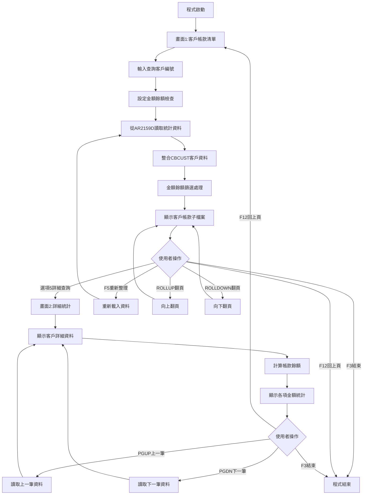
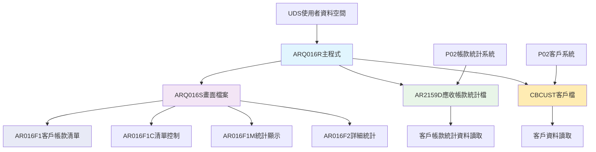
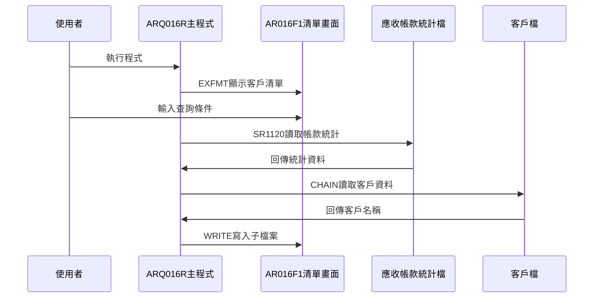
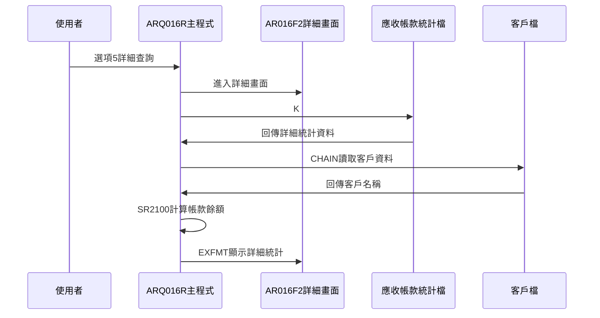
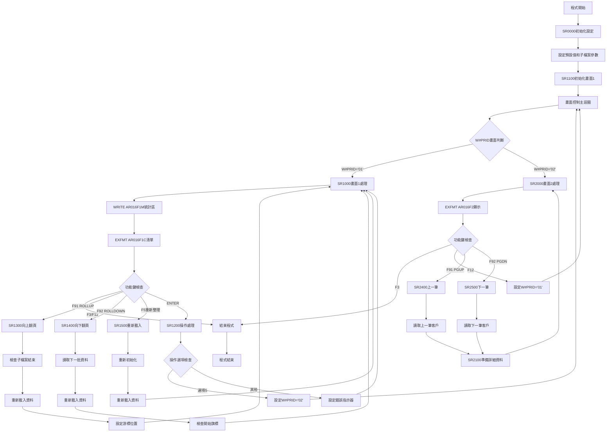

# ARQ016R_P02 程式規格書

## 1. 基本資料

| 項目 | 內容 |
|------|------|
| **程式編號** | ARQ016R |
| **程式名稱** | 客戶帳款統計查詢作業 |
| **程式類型** | RPG |
| **廠區** | P02 |
| **系統名稱** | 應收帳款系統 |
| **子系統** | 帳款統計管理與查詢 |
| **檔案位置** | P02RPGSRC_THSRC/ARQ016R.txt |

## 2. 🎯 程式功能說明

### 主要功能描述
此程式為客戶帳款統計查詢作業的主要處理程式，專門提供客戶帳款統計資料的查詢和分析功能。程式採用雙階段式畫面設計，透過應收帳款統計檔(AR2159D)和客戶檔(CBCUST)的整合處理，提供完整的客戶帳款統計查詢分析服務。P02版本具有客戶編號查詢機制、金額餘額篩選功能、子檔案翻頁瀏覽、以及詳細的帳款統計資料展示。程式特別針對P02廠區的帳款統計管理業務設計，確保帳款統計查詢結果的準確性和完整性，同時提供使用者友善的操作介面和完整的帳款統計資料展示功能。程式支援模糊查詢、金額餘額檢查、子檔案分頁控制，並提供多種帳款統計金額分析功能。

### 🎯 業務流程詳細說明

#### 完整業務流程圖


#### 業務流程關鍵階段說明

**第一階段：客戶帳款清單查詢與顯示**
- 顯示AR016F1客戶帳款清單畫面
- 使用者輸入客戶編號進行查詢(S#INK1)
- 設定金額餘額檢查選項(S#AMCK)
- 從AR2159D讀取客戶帳款統計資料

**第二階段：資料篩選與處理**
- 根據客戶編號進行模糊查詢或完全匹配
- 進行金額餘額檢查篩選(當S#AMCK='Y'時只顯示餘額非零的記錄)
- 從CBCUST讀取對應的客戶名稱
- 計算和顯示多種帳款金額統計

**第三階段：客戶帳款子檔案顯示**
- 顯示AR016F1C控制的AR016F1子檔案
- 展示客戶編號、客戶名稱、廠區、訂單號碼、各項金額
- 支援子檔案的翻頁功能(ROLLUP/ROLLDOWN)
- 提供選項5進入詳細查詢功能

**第四階段：詳細統計資料查詢**
- 根據使用者選擇的記錄進入AR016F2詳細畫面
- 從AR2159D讀取完整的帳款統計資料
- 計算客戶帳款餘額(包含多種金額計算)
- 顯示完整的客戶帳款統計詳細資訊

**第五階段：詳細資料瀏覽與導航**
- 支援PGUP/PGDN功能瀏覽上下筆客戶資料
- 提供完整的帳款統計金額展示
- 支援返回客戶清單或結束程式

#### 🎯 P02版本客戶帳款統計查詢特色
- **雙階段畫面**：客戶帳款清單畫面和詳細統計畫面
- **金額餘額篩選**：支援金額餘額檢查功能避免顯示零餘額記錄
- **子檔案翻頁**：支援完整的子檔案翻頁瀏覽功能
- **多種金額統計**：提供應收已沖銷、收料憑證、待沖銷、協議費用等多種金額

#### 多層次檢查機制
- **客戶編號檢查**：支援模糊查詢和完全匹配查詢
- **金額餘額檢查**：可選擇是否只顯示有餘額的客戶記錄
- **資料存在性檢查**：確保查詢的客戶帳款資料存在

#### 智能處理邏輯
- 自動從客戶編號開始位置進行範圍查詢
- 動態計算客戶帳款餘額提供完整資訊
- 智能分頁控制確保查詢效能
- 自動整合客戶檔案提供完整客戶資訊

#### 資料一致性確保機制
- 透過KLIST建立正確的檔案讀取鍵值
- 使用指示器控制子檔案的顯示狀態
- 分階段處理確保各步驟資料同步
- 記錄詳細的帳款統計查詢軌跡供後續分析

#### P02版本客戶帳款統計查詢專業設計理念
- **帳款專精**：專門提供客戶帳款統計資料的查詢和分析功能
- **使用者導向**：雙階段操作流程符合使用者習慣
- **多維整合**：整合客戶、帳款統計的完整資訊
- **P02特殊適配**：專為P02廠區的帳款統計管理業務需求設計

## 3. 🎯 檔案架構與關聯圖

### 使用檔案清單

| 檔案名稱 | 檔案類型 | 使用方式 | 說明 |
|----------|----------|----------|------|
| **ARQ016S** | DSPF | CF/COMBINED | 客戶帳款統計查詢畫面檔案 |
| **AR2159D** | 實體檔 | IF/INPUT | 應收帳款統計檔案 |
| **CBCUST** | 實體檔 | IF/INPUT | 客戶檔案 |

### 🎯 檔案關聯詳細視覺化圖表



### 🎯 P02版本特殊資料流向說明

#### 客戶帳款清單查詢階段的資料流向


#### P02版本詳細統計查詢階段的資料流向


## 4. 🎯 檔案欄位規格說明

### 主要資料結構

#### AR2159D 應收帳款統計檔結構
| 欄位名稱 | 型態 | 長度 | 說明 |
|----------|------|------|------|
| ADCUNO | CHAR | 6 | 客戶編號 |
| ADAREA | CHAR | 1 | 廠區代號 |
| ADORNO | CHAR | 6 | 訂單號碼 |
| ADAMT1 | PACKED | 9.0 | 應收已沖銷金額 |
| ADAMT2 | PACKED | 9.0 | 收料憑證金額 |
| ADAMT3 | PACKED | 9.0 | 應收待沖銷金額 |
| ADAMT4 | PACKED | 9.0 | 協議費用金額 |
| ADRESV | CHAR | 20 | 保留欄位 |

#### CBCUST 客戶檔結構
| 欄位名稱 | 型態 | 長度 | 說明 |
|----------|------|------|------|
| CBCUNO | CHAR | 6 | 客戶編號 |
| CBCUNM | CHAR | 10 | 客戶名稱 |

#### ARQ016S 子檔案顯示結構
| 欄位名稱 | 型態 | 長度 | 說明 |
|----------|------|------|------|
| S#OPT1 | CHAR | 1 | 操作選項（5=詳細查詢） |
| S#CUNO | CHAR | 6 | 客戶編號 |
| S#CUNM | CHAR | 10 | 客戶名稱 |
| S#AREA | CHAR | 1 | 廠區代號 |
| S#ORNO | CHAR | 6 | 訂單號碼 |
| S#AMT1 | PACKED | 9.0 | 應收已沖銷金額 |
| S#AMT2 | PACKED | 9.0 | 收料憑證金額 |
| S#AMT3 | PACKED | 9.0 | 應收待沖銷金額 |

### 🔍 重點欄位切割技術詳解

#### 子檔案（Subfile）技術架構分析

**子檔案控制結構**：
```
Subfile架構：[客戶帳款統計多筆記錄顯示機制]
控制檔案：AR016F1C （子檔案控制記錄）
  ↓
子檔案：AR016F1 （實際資料記錄）
  ↓
資料結構：SFLSIZ(0010) SFLPAG(0010)

子檔案顯示控制：
SFLDSPCTL (71) - 顯示子檔案控制
SFLDSP (72) - 顯示子檔案資料
SFLCLR (73) - 清除子檔案資料
SFLEND (74) - 子檔案結束標記
```

**子檔案資料載入流程視覺化展示**：
```
子檔案載入切割：[10筆記錄批次載入機制]
初始化階段：   [RRN1=0, S#SFN1=0]
                     ↓
迴圈載入：     [1→READ AR2159D→ITER/BREAK邏輯]
                     ↓
資料處理：     [SR1121整合客戶資料]
                     ↓
子檔案寫入：   [WRITE AR016F1]
                     ↓
記錄計數：     [RRN1++, S#SFN1++]
                     ↓
頁面控制：     [S#SFN1>N#PAG1(10)→LEAVE]
                     ↓
顯示控制：     [EXFMT AR016F1C]
```

**切割邏輯詳細說明**：
1. **批次載入控制**：每次載入10筆記錄（N#PAG1=10），確保畫面顯示效能
2. **資料整合機制**：AR2159D統計檔+CBCUST客戶檔的整合載入
3. **動態記錄管理**：RRN1相對記錄號碼的動態管理
4. **子檔案狀態控制**：四個指示器控制子檔案的顯示狀態
5. **結束標記機制**：W#SFE1='T'標記檔案結束，SFLEND控制顯示

#### 金額餘額檢查機制切割分析

**金額檢查結構**：
```
金額餘額檢查邏輯：
1. 金額計算公式：
   W#SAMT = ADAMT1 + ADAMT4 - ADAMT2 + ADAMT3
   
2. 檢查控制變數：
   S#AMCK (Y/N) - 使用者輸入的檢查開關
   W#AMCK (Y/N) - 程式內部檢查狀態
   
3. 篩選邏輯：
   IF S#AMCK = 'Y' AND W#SAMT = 0 THEN
     ITER (跳過此記錄)
   END
```

**欄位切割視覺化展示**：
```
金額餘額檢查切割：[智慧型零餘額記錄篩選機制]
使用者設定：    [S#AMCK輸入] 
                     ↓
程式狀態：      [W#AMCK=S#AMCK]
                     ↓
金額計算：      [W#SAMT = AMT1+AMT4-AMT2+AMT3]
                     ↓
條件判斷：      [S#AMCK='Y' AND W#SAMT=0?]
                     ↓
篩選動作：      [ITER跳過] 或 [繼續處理]
                     ↓
記錄載入：      [載入子檔案] 或 [跳過載入]
```

**切割邏輯詳細說明**：
1. **使用者控制機制**：S#AMCK='Y'啟用零餘額篩選，'N'顯示所有記錄
2. **四重金額計算**：ADAMT1+ADAMT4-ADAMT2+ADAMT3的複合金額邏輯
3. **智慧篩選控制**：ITER指令跳過零餘額記錄，提高顯示效率
4. **狀態同步機制**：W#AMCK跟隨S#AMCK狀態，確保處理一致性

#### K#2159 三重複合鍵值查詢切割分析

**複合鍵值結構**：
```
K#2159 KLIST定義：
  KFLD ADCUNO  (客戶編號 - 6字元)
  KFLD ADAREA  (廠區代號 - 1字元)  
  KFLD ADORNO  (訂單號碼 - 6字元)
  
查詢模式：
1. SETLL + READ - 定位後順序讀取
2. CHAIN - 直接鍵值查詢
3. READP - 反向順序讀取
```

**欄位切割視覺化展示**：
```
K#2159複合鍵值查詢切割：[三重層次化檔案定位機制]
鍵值組合：     [ADCUNO] + [ADAREA] + [ADORNO]
                 ↓          ↓          ↓
查詢層次：     [客戶層]   [廠區層]   [訂單層]
                 ↓
檔案定位：     [SETLL K#2159] → [檔案指標定位]
                 ↓
順序讀取：     [READ AR2159D] → [順序取得記錄]
                 ↓
反向讀取：     [READP AR2159D] → [反向取得記錄]
                 ↓
直接查詢：     [CHAIN K#2159] → [精確定位記錄]
```

**切割邏輯詳細說明**：
1. **三重層次定位**：客戶→廠區→訂單的層次化檔案定位機制
2. **多模式查詢**：支援定位、順序、反向、直接四種查詢模式
3. **高效索引利用**：充分利用複合索引提高查詢效能
4. **翻頁邏輯支援**：READ/READP支援雙向翻頁機制

#### 雙階段畫面切換控制分析

**畫面控制結構**：
```
雙階段畫面控制：
1. 畫面識別：
   W#PRID = '01' - 客戶帳款清單畫面
   W#PRID = '02' - 詳細統計畫面
   
2. 畫面切換邏輯：
   選項5 → W#PRID='02' → SR2000詳細畫面
   F12 → W#PRID='01' → SR1000清單畫面
   
3. 程式流程控制：
   DO-WHILE(W#PRID≠'00') → CASE → 畫面處理
```

**欄位切割視覺化展示**：
```
雙階段畫面切換切割：[無縫畫面流程控制機制]
程式啟動：      [W#PRID='01']
                    ↓
清單畫面：      [SR1000] → [AR016F1C子檔案顯示]
                    ↓
使用者操作：    [選項5] → [S#OPT1='5']
                    ↓
畫面切換：      [W#PRID='02']
                    ↓
詳細畫面：      [SR2000] → [AR016F2詳細顯示]
                    ↓
返回操作：      [F12] → [W#PRID='01']
                    ↓
結束操作：      [F3] → [W#PRID='00']
```

**切割邏輯詳細說明**：
1. **狀態機控制**：W#PRID作為畫面狀態控制變數，實現無縫切換
2. **選項驅動切換**：透過S#OPT1='5'驅動畫面切換邏輯
3. **雙向切換支援**：支援清單↔詳細的雙向畫面切換
4. **程式流程統一**：DO-WHILE+CASE統一控制兩個畫面的處理流程

#### UDS 系統資訊配置分析

**UDS結構定義**：
```
I           UDS
I                                      951 985 S#COMP
I                                     10111020 S#DEVI
I                                     10011010 U#USID
I                                     10211021 U#AREA
```

**欄位切割視覺化展示**：
```
UDS (1024字元)：[客戶帳款查詢系統資訊區域]
位置:           001...950 951...985...1001...1010 1011...1020 1021 1022...1024
                 ↓      ↓   ↓      ↓     ↓      ↓     ↓      ↓    ↓    ↓
應用空間：       [.........]                                              應用資料區域（位置1-950）
S#COMP (35字元)：           [_____________]                              公司名稱（位置951-985）
空隙區域：                                [........]                     預留空間（位置986-1000）
U#USID (10字元)：                                [____]                 使用者ID（位置1001-1010）
S#DEVI (10字元)：                                      [____]           設備名稱（位置1011-1020）
U#AREA (1字元)：                                            [_]         使用者區域（位置1021）
空隙區域：                                                   [___]       預留空間（位置1022-1024）
```

**切割邏輯詳細說明**：
1. **分散式配置設計**：採用非連續位置配置，避免資料重疊
2. **功能分區管理**：公司資訊、使用者資訊、設備資訊的分區配置
3. **使用者身份控制**：U#USID和U#AREA支援使用者身份識別和權限控制
4. **畫面顯示整合**：S#COMP和S#DEVI直接支援畫面顯示需求

### 🎯 欄位挪用詳細分析

#### 版本演進欄位挪用情況對比表

| 欄位名稱 | 原始定義用途 | 實際使用方式 | 挪用原因 | 技術特色 |
|----------|-------------|-------------|----------|----------|
| 子檔案技術挪用 | 單筆記錄顯示 | 10筆記錄批次顯示的子檔案機制 | 支援多筆客戶帳款統計記錄瀏覽 | 批次載入控制 |
| 金額餘額檢查挪用 | 顯示所有記錄 | 智慧型零餘額記錄篩選機制 | 提高查詢效率和使用者體驗 | 智慧篩選技術 |
| 三重複合鍵值挪用 | 單一鍵值查詢 | 客戶+廠區+訂單的複合鍵值查詢 | 支援精確的統計檔案定位需求 | 複合索引技術 |
| 雙階段畫面挪用 | 單一畫面操作 | 清單+詳細的無縫畫面切換 | 提供完整的查詢和分析體驗 | 狀態機控制 |
| UDS分散配置挪用 | 連續位置配置 | 分散式系統資訊配置 | 支援多重系統資訊需求 | 分散式設計 |

#### 子檔案技術挪用分析

**子檔案技術挪用機制**：
```
標準設計：單筆記錄逐一顯示
挪用設計：10筆記錄批次載入的子檔案顯示

子檔案技術優勢：
- 批次載入提高效能
- 翻頁瀏覽增強體驗
- 記錄選擇支援操作
- 動態載入節省資源

技術實現：
SFLSIZ(0010) - 子檔案大小10筆
SFLPAG(0010) - 每頁顯示10筆
RRN1管理 - 相對記錄號碼控制
指示器控制 - 四重狀態管理
```

**挪用邏輯詳細說明**：
- **批次載入機制**：一次載入10筆記錄，提高顯示效能和使用者體驗
- **翻頁控制邏輯**：ROLLUP/ROLLDOWN支援雙向翻頁瀏覽
- **記錄選擇功能**：S#OPT1='5'支援記錄選擇和詳細查詢
- **動態載入管理**：根據查詢結果動態載入，節省系統資源

#### 金額餘額檢查挪用分析

**金額檢查挪用機制**：
```
標準設計：顯示所有統計記錄
挪用設計：智慧型零餘額記錄篩選

檢查邏輯：
W#SAMT = ADAMT1 + ADAMT4 - ADAMT2 + ADAMT3
IF S#AMCK='Y' AND W#SAMT=0 THEN ITER

技術價值：
- 提高查詢效率
- 減少無效資料顯示
- 增強使用者體驗
- 支援使用者選擇控制
```

**挪用影響評估**：
1. **查詢效率提升**：智慧篩選減少無效記錄載入，提高整體查詢效能
2. **使用者體驗改善**：減少零餘額記錄干擾，提供更有價值的資訊
3. **靈活控制機制**：S#AMCK='Y'/'N'提供使用者選擇權，適應不同需求
4. **系統資源節約**：ITER跳過機制減少記錄處理負擔

#### 三重複合鍵值挪用分析

**複合鍵值挪用機制**：
```
標準設計：單一鍵值檔案查詢
挪用設計：客戶+廠區+訂單三重複合鍵值

複合鍵值結構：
KFLD ADCUNO - 客戶編號（主要定位）
KFLD ADAREA - 廠區代號（次要篩選）
KFLD ADORNO - 訂單號碼（精確定位）

查詢模式多樣化：
SETLL+READ - 定位順序查詢
CHAIN - 精確記錄查詢
READP - 反向翻頁查詢
```

**挪用方式詳細說明**：
1. **層次化定位機制**：客戶→廠區→訂單的三層定位邏輯
2. **多模式查詢支援**：同時支援定位、精確、順序、反向四種查詢模式
3. **索引效能最佳化**：充分利用複合索引提高檔案存取效能
4. **翻頁邏輯完整性**：READ/READP完整支援雙向翻頁瀏覽機制

### 重要變數定義表

| 變數名稱 | 資料型態 | 長度 | 用途說明 |
|----------|----------|------|----------|
| W#PRID | CHAR | 2 | 畫面程序ID：'01'=清單，'02'=詳細 |
| S#AMCK | CHAR | 1 | 金額檢查開關：'Y'=篩選零餘額，'N'=顯示全部 |
| W#AMCK | CHAR | 1 | 程式內部金額檢查狀態 |
| W#SAMT | PACKED | 11.0 | 計算後的金額餘額 |
| S#SFN1 | SIGNED | 4.0 | 子檔案記錄筆數 |
| RRN1 | SIGNED | 4.0 | 子檔案相對記錄號碼 |
| N#PAG1 | SIGNED | 2.0 | 子檔案每頁記錄數（固定10） |
| W#SFE1 | CHAR | 1 | 子檔案結束旗標：'T'=結束，'F'=繼續 |
| S#INK1 | CHAR | 6 | 查詢用客戶編號輸入 |
| S#NBR1 | SIGNED | 4.0 | 子檔案游標位置記錄號 |
| S#CRN1 | SIGNED | 5.0 | 子檔案游標相對記錄號 |
| S#OPT1 | CHAR | 1 | 子檔案操作選項：'5'=詳細查詢 |
| S#COMP | CHAR | 35 | UDS公司名稱（位置951-985） |
| S#DEVI | CHAR | 10 | UDS設備名稱（位置1011-1020） |
| U#USID | CHAR | 10 | UDS使用者ID（位置1001-1010） |
| U#AREA | CHAR | 1 | UDS使用者區域（位置1021） |
| ADCUNO | CHAR | 6 | AR2159D客戶編號欄位 |
| ADAREA | CHAR | 1 | AR2159D廠區代號欄位 |
| ADORNO | CHAR | 6 | AR2159D訂單號碼欄位 |
| ADAMT1 | PACKED | 9.0 | AR2159D應收已沖銷金額 |
| ADAMT2 | PACKED | 9.0 | AR2159D收料憑證金額 |
| ADAMT3 | PACKED | 9.0 | AR2159D應收待沖銷金額 |
| ADAMT4 | PACKED | 9.0 | AR2159D協議費用金額 |


#### 雙檔案資料整合切割流程視覺化
```
雙檔案整合查詢切割邏輯：
AR2159D統計檔 → 客戶帳款資料切割 → 畫面顯示切割
     ↓               ↓                ↓
客戶編號抽取    →  CBCUST查詢  →  客戶名稱整合
     ↓               ↓                ↓
ADCUNO變數     →  CHAIN操作   →  CBCUNM取得

資料流切割步驟：
1. AR2159D → ADCUNO-ADAREA-ADORNO → 統計資料切割
2. ADCUNO → CBCUST CHAIN → 客戶名稱切割
3. 雙檔資料 → S#系列變數 → 畫面顯示切割
```

#### 子檔案控制變數切割機制
```
子檔案控制切割管理：
控制變數      切割功能           設定值       切割邏輯
┌─────────────────────────────────────────────┐
│ W#SFE1   │ 結束旗標切割    │ 'T'/'F'   │ 檔案尾控制  │
│ W#SFB1   │ 開始旗標切割    │ 'T'/'F'   │ 檔案頭控制  │
│ S#SFN1   │ 記錄數切割      │ 0-10      │ 頁面控制    │
│ RRN1     │ 記錄號切割      │ 1-10      │ 位置控制    │
│ S#NBR1   │ 游標位置切割    │ 數值      │ 游標控制    │
│ N#PAG1   │ 頁面大小切割    │ 10        │ 效能控制    │
└─────────────────────────────────────────────┘

翻頁切割控制：
READ操作 → 向下切割 → W#SFE1='T'檢查
READP操作 → 向上切割 → W#SFB1='T'檢查
```

#### 金額計算切割視覺化詳解
```
四重金額計算切割公式：
W#SAMT = ADAMT1 + ADAMT4 - ADAMT2 + ADAMT3
   ↓        ↓      ↓        ↓        ↓
餘額結果  應收沖銷 協議費用  收料憑證  待沖銷

金額切割檢查邏輯：
S#AMCK='Y' → W#SAMT=0檢查 → 跳過記錄切割
S#AMCK='N' → 全部顯示 → 無切割篩選

畫面顯示切割：
ADAMT1 → S#AMT1 → 已沖銷金額顯示切割
ADAMT2 → S#AMT2 → 收料憑證金額顯示切割
ADAMT3 → S#AMT3 → 待沖銷金額顯示切割
ADAMT4 → S#AMT4 → 協議費用金額顯示切割
W#SAMT → S#NBAL → 帳款餘額顯示切割
```

#### 雙階段畫面切割對應表
| 階段 | 切割來源 | 切割目標 | 切割邏輯 |
|------|----------|----------|----------|
| **初始化** | SR0000 | 程式變數 | 初始值切割設定 |
| **清單查詢** | S#INK1 | AR2159D查詢 | 客戶編號切割查詢 |
| **資料讀取** | AR2159D | 統計變數 | 檔案記錄切割讀取 |
| **客戶整合** | ADCUNO | CBCUST查詢 | 客戶名稱切割整合 |
| **金額計算** | 四重金額 | W#SAMT | 餘額計算切割邏輯 |
| **子檔案載入** | 統計資料 | SF1子檔案 | 分頁記錄切割載入 |
| **畫面顯示** | W#PRID='01' | AR016F1 | 清單畫面切割顯示 |
| **詳細切換** | 選項5 | W#PRID='02' | 詳細畫面切割轉換 |
| **詳細顯示** | 選定記錄 | AR016F2 | 詳細資料切割顯示 |

### 🎯 P02版本欄位挪用詳細分析

#### AR016F1客戶帳款清單子檔案欄位重點
| 欄位名稱 | 用途說明 | 設定值 |
|----------|----------|--------|
| **S#OPT1** | 操作選項 | 使用者輸入(' ' 或 '5') |
| **S#CUNO** | 客戶編號 | 來自AR2159D的ADCUNO |
| **S#CUNM** | 客戶名稱 | 來自CBCUST的CBCUNM |
| **S#AREA** | 廠區代號 | 來自AR2159D的ADAREA |
| **S#ORNO** | 訂單號碼 | 來自AR2159D的ADORNO |
| **S#AMT1** | 應收已沖銷金額 | 來自AR2159D的ADAMT1 |
| **S#AMT2** | 收料憑證金額 | 來自AR2159D的ADAMT2 |
| **S#AMT3** | 應收待沖銷金額 | 來自AR2159D的ADAMT3 |

#### AR016F2詳細統計畫面欄位重點
| 欄位名稱 | 用途說明 | 設定值 |
|----------|----------|--------|
| **S#CUNO** | 客戶編號 | 來自選定記錄 |
| **S#CUNM** | 客戶名稱 | 來自CBCUST查詢 |
| **S#AREA** | 廠區代號 | 來自選定記錄 |
| **S#ORNO** | 訂單號碼 | 來自選定記錄 |
| **S#AMT1** | 應收已沖銷金額 | 來自AR2159D的ADAMT1 |
| **S#AMT2** | 收料憑證金額 | 來自AR2159D的ADAMT2 |
| **S#AMT3** | 應收待沖銷金額 | 來自AR2159D的ADAMT3 |
| **S#AMT4** | 協議費用金額 | 來自AR2159D的ADAMT4 |
| **S#NBAL** | 客戶帳款餘額 | 計算值(AMT1+AMT4-AMT2+AMT3) |
| **S#RESV** | 保留欄位 | 來自AR2159D的ADRESV |

#### 帳款統計資料欄位對應表
| 畫面顯示 | 檔案欄位 | 性質 | 處理邏輯 |
|----------|----------|------|----------|
| **客戶編號** | ADCUNO | 客戶資訊 | AR2159D直接取用 |
| **客戶名稱** | CBCUNM | 客戶資訊 | CBCUST查詢取得 |
| **廠區代號** | ADAREA | 系統資訊 | AR2159D直接取用 |
| **訂單號碼** | ADORNO | 交易資訊 | AR2159D直接取用 |
| **應收已沖銷** | ADAMT1 | 金額資訊 | 直接取用並顯示 |
| **收料憑證** | ADAMT2 | 金額資訊 | 直接取用並顯示 |
| **應收待沖銷** | ADAMT3 | 金額資訊 | 直接取用並顯示 |
| **協議費用** | ADAMT4 | 金額資訊 | 直接取用並顯示 |
| **帳款餘額** | 計算值 | 計算結果 | 多欄位計算取得 |

### P02版本重要變數定義表

| 變數名稱 | 類型 | 長度 | 說明 | 使用範圍 |
|----------|------|------|------|----------|
| **W#PRID** | CHAR | 2 | 畫面控制變數 | 畫面流程 |
| **W#RTNV** | CHAR | 1 | 回傳值控制 | 處理控制 |
| **W#SFE1** | CHAR | 1 | 子檔案結束旗標 | 子檔案控制 |
| **W#SAMT** | NUM | 11 | 金額計算暫存 | 金額計算 |
| **W#AMCK** | CHAR | 1 | 金額檢查暫存 | 金額篩選 |
| **W#SFB1** | CHAR | 1 | 子檔案開始旗標 | 子檔案控制 |
| **N#PAG1** | NUM | 2 | 子檔案頁面大小 | 效能控制 |
| **S#INK1** | CHAR | 6 | 客戶編號查詢條件 | 查詢條件 |
| **S#AMCK** | CHAR | 1 | 金額餘額檢查 | 篩選條件 |
| **S#CUNO** | CHAR | 6 | 客戶編號 | 資料顯示 |
| **S#CUNM** | CHAR | 10 | 客戶名稱 | 資料顯示 |
| **S#AREA** | CHAR | 1 | 廠區代號 | 資料顯示 |
| **S#ORNO** | CHAR | 6 | 訂單號碼 | 資料顯示 |
| **S#AMT1** | NUM | 9 | 應收已沖銷金額 | 統計資料 |
| **S#AMT2** | NUM | 9 | 收料憑證金額 | 統計資料 |
| **S#AMT3** | NUM | 9 | 應收待沖銷金額 | 統計資料 |
| **S#AMT4** | NUM | 9 | 協議費用金額 | 統計資料 |
| **S#NBAL** | NUM | 9 | 客戶帳款餘額 | 計算資料 |
| **S#RESV** | CHAR | 20 | 保留欄位 | 備用資料 |
| **RRN1** | NUM | 4 | 子檔案記錄號碼 | 子檔案控制 |
| **S#SFN1** | NUM | 4 | 子檔案記錄數 | 子檔案控制 |
| **S#NBR1** | NUM | 4 | 子檔案游標位置 | 游標控制 |
| **S#CRN1** | NUM | 5 | 子檔案游標記錄 | 游標控制 |
| **S#OPT1** | CHAR | 1 | 操作選項 | 使用者選擇 |
| **S#MSG1** | CHAR | 70 | 畫面1錯誤訊息 | 錯誤處理 |
| **S#MSG2** | CHAR | 70 | 畫面2錯誤訊息 | 錯誤處理 |

## 5. 🎯 輸出/入螢幕布局

### 畫面1：客戶帳款統計清單畫面(AR016F1)

```
+------------------------------------------------------------------------------+
|[日期]                東鋼鋼鐵股份有限公司                          ARQ016S-1 |
|[時間]         *** 客戶帳款統計查詢作業 ***                        [設備名稱] |
|                                                                              |
|                                                                              |
|選項: 5 --> 查詢。                                                           |
|金額餘額篩選(只顯示非0者): [_] (Y/N)                                         |
|----------------------------------------------------------------------------- |
|選項  客戶編號名稱  廠區  訂單編號      已沖銷        收料憑證        待沖銷   |
|----------------------------------------------------------------------------- |
|     [______]                                                                |
|[_] [______][__________] [_] [______] [_________] [_________] [_________]     |
|[_] [______][__________] [_] [______] [_________] [_________] [_________]     |
|[_] [______][__________] [_] [______] [_________] [_________] [_________]     |
|[_] [______][__________] [_] [______] [_________] [_________] [_________]     |
|[_] [______][__________] [_] [______] [_________] [_________] [_________]     |
|[_] [______][__________] [_] [______] [_________] [_________] [_________]     |
|[_] [______][__________] [_] [______] [_________] [_________] [_________]     |
|[_] [______][__________] [_] [______] [_________] [_________] [_________]     |
|[_] [______][__________] [_] [______] [_________] [_________] [_________]     |
|[_] [______][__________] [_] [______] [_________] [_________] [_________]     |
|                                                                              |
|----------------------------------------------------------------------------- |
|   F03:結束          F12:回頁             F05:重新整理                        |
|[錯誤訊息顯示區]                                                              |
+------------------------------------------------------------------------------+
```

### 畫面2：客戶帳款詳細統計畫面(AR016F2)

```
+------------------------------------------------------------------------------+
|[日期]                東鋼鋼鐵股份有限公司                          ARQ016S-2 |
|[時間]         *** 客戶帳款統計查詢作業 ***                        [設備名稱] |
|                                                                              |
|                                                                              |
|                        客戶編號: [______] [__________]                       |
|                        收料廠區: [_]                                         |
|                        訂單編號[______]                                      |
|                                                                              |
|                   應收已沖銷金額: [_________]                                |
|                                                                              |
|                   應收收料憑證金額: [_________]                              |
|                                                                              |
|                   應收待沖銷金額: [_________]                                |
|                                                                              |
|                   協議費用金額: [_________]                                  |
|                                                                              |
|                   客戶帳款餘額: [_________]                                  |
|                                                                              |
|                          保留欄位: [____________________]                    |
|                                                                              |
|                                                                              |
|     F03:結束         F12:回頁         PGUP:上筆         PGDN:下筆           |
|[錯誤訊息顯示區]                                                              |
+------------------------------------------------------------------------------+
```

### 🎯 畫面欄位詳細說明

#### 畫面1輸入欄位
| 欄位名稱 | 欄位屬性 | 位置 | 長度 | 輸入格式 | 驗證規則 | 說明 |
|----------|----------|------|------|----------|----------|------|
| **S#INK1** | 輸入/輸出 | 10,8 | 6 | 英數字 | 客戶編號格式 | 客戶編號查詢條件 |
| **S#AMCK** | 輸入/輸出 | 6,- | 1 | Y/N | 單一字元 | 金額餘額檢查選項 |

#### 畫面1子檔案顯示欄位
| 欄位名稱 | 欄位屬性 | 說明 |
|----------|----------|------|
| **S#OPT1** | 輸入 | 操作選項(' ' 或 '5') |
| **S#CUNO** | 顯示 | 客戶編號 |
| **S#CUNM** | 顯示 | 客戶名稱 |
| **S#AREA** | 顯示 | 廠區代號 |
| **S#ORNO** | 顯示 | 訂單號碼 |
| **S#AMT1** | 顯示 | 應收已沖銷金額 |
| **S#AMT2** | 顯示 | 收料憑證金額 |
| **S#AMT3** | 顯示 | 應收待沖銷金額 |

#### 畫面2顯示欄位
| 欄位名稱 | 欄位屬性 | 說明 |
|----------|----------|------|
| **S#CUNO** | 顯示 | 客戶編號 |
| **S#CUNM** | 顯示 | 客戶名稱 |
| **S#AREA** | 顯示 | 廠區代號 |
| **S#ORNO** | 顯示 | 訂單號碼 |
| **S#AMT1** | 顯示 | 應收已沖銷金額 |
| **S#AMT2** | 顯示 | 收料憑證金額 |
| **S#AMT3** | 顯示 | 應收待沖銷金額 |
| **S#AMT4** | 顯示 | 協議費用金額 |
| **S#NBAL** | 顯示 | 客戶帳款餘額 |
| **S#RESV** | 顯示 | 保留欄位 |

### 功能鍵詳細定義

| 功能鍵 | 處理邏輯 | 系統行為 | 說明 |
|--------|----------|----------|------|
| **F3** | 設定IN03='1' | 程式立即結束 | 離開查詢作業 |
| **F12** | 回到上一畫面 | 畫面流程控制 | 返回上一個操作畫面 |
| **F5** | 重新整理 | 重新載入資料 | 刷新客戶帳款清單 |
| **ROLLUP** | 向上翻頁 | 子檔案向上翻頁 | 查看前一頁記錄 |
| **ROLLDOWN** | 向下翻頁 | 子檔案向下翻頁 | 查看下一頁記錄 |
| **PGUP** | 上一筆記錄 | 讀取上一筆客戶 | 畫面2上一筆功能 |
| **PGDN** | 下一筆記錄 | 讀取下一筆客戶 | 畫面2下一筆功能 |
| **ENTER** | 執行操作 | 根據畫面執行相應動作 | 執行查詢或選擇操作 |

### 輸入驗證機制

#### 查詢條件驗證
- S#INK1客戶編號格式驗證
- S#AMCK金額餘額檢查選項驗證(Y/N)

#### P02版本特殊驗證
- 驗證客戶編號的存在性
- 確認帳款統計檔的資料完整性
- 檢查金額餘額計算的正確性

## 6. 🎯 處理流程程序說明

### 🎯 主程序邏輯深度分析

#### P02版本程式執行流程圖


#### 🎯 P02版本客戶帳款統計查詢特殊步驟分析

**步驟1：SR0000程式初始化設定**
- 設定子檔案頁面大小(N#PAG1=10)
- 設定初始畫面編號(W#PRID='01')
- 初始化處理控制變數(W#RTNV, W#SFE1)
- 初始化金額相關變數(W#SAMT, W#AMCK)
- 執行SR1100初始化畫面1資料

**步驟2：SR1100初始化畫面1資料準備**
- 根據查詢條件(S#INK1)設定起始位置
- 執行SR1110清除子檔案
- 執行SR1120載入子檔案資料
- 設定游標位置到第一筆記錄

**步驟3：SR1110清除子檔案**
- 清除錯誤訊息
- 設定子檔案控制指示器(73=SFLCLR)
- 寫入子檔案控制記錄

**步驟4：SR1120載入子檔案資料(向下讀取)**
- 初始化子檔案控制變數
- 從AR2159D讀取客戶帳款統計資料
- 執行金額餘額檢查篩選
- 從CBCUST讀取客戶名稱
- 寫入子檔案記錄直到達到頁面大小

**步驟5：SR1121處理個別記錄資料**
- 設定客戶編號和名稱
- 設定廠區代號和訂單號碼
- 設定各項金額統計資料
- 設定保留欄位資料

**步驟6：SR1000畫面1主要處理**
- 顯示統計區域(AR016F1M)
- 控制子檔案顯示狀態
- 處理子檔案結束旗標
- 顯示客戶帳款清單(AR016F1C)
- 處理各種功能鍵操作

**步驟7：SR1200操作處理邏輯**
- 檢查查詢條件是否變更
- 處理操作選項5的詳細查詢
- 更新子檔案記錄狀態
- 設定下一個畫面編號

**步驟8：SR1300向上翻頁處理**
- 檢查子檔案結束旗標
- 從最後一筆記錄設定起始位置
- 重新載入上一批資料
- 調整游標位置

**步驟9：SR1400向下翻頁處理**
- 從第一筆記錄設定起始位置
- 執行SR1130載入上一批資料
- 重新載入當前批資料
- 設定開始旗標和訊息

**步驟10：SR1130載入上一批資料(向上讀取)**
- 使用READP向上讀取記錄
- 執行金額餘額檢查篩選
- 控制讀取記錄數量
- 設定開始旗標狀態

**步驟11：SR1500重新整理處理**
- 檢查當前子檔案狀態
- 重新設定檔案指標位置
- 重新載入資料
- 調整游標位置

**步驟12：SR2000畫面2詳細統計處理**
- 顯示客戶詳細統計畫面(AR016F2)
- 處理上下筆瀏覽功能
- 支援回到畫面1功能

**步驟13：SR2100準備詳細資料**
- 從CBCUST讀取客戶名稱
- 從AR2159D讀取完整統計資料
- 計算客戶帳款餘額
- 設定詳細畫面顯示資料

**步驟14：SR2400/SR2500上下筆處理**
- 讀取上一筆或下一筆客戶資料
- 執行金額餘額檢查篩選
- 更新畫面顯示資料
- 處理檔案結束狀況

#### 業務邏輯深度解析

**P02版本客戶帳款統計查詢的核心邏輯**：
1. 提供雙階段式的客戶帳款統計查詢和分析功能
2. 支援金額餘額篩選機制確保查詢效率
3. 提供完整的子檔案翻頁瀏覽功能
4. 客戶帳款統計專業化查詢的完整實現

**P02版本效能優化機制**：
1. 使用子檔案分頁控制顯示效能(每頁10筆記錄)
2. 金額餘額篩選減少不必要的資料顯示
3. 智能翻頁處理確保瀏覽效能
4. 提供客戶帳款統計分析

#### 條件判斷詳細說明

**P02版本金額餘額篩選判斷**：
- `S#AMCK IFEQ 'Y'` - 啟用金額餘額檢查
- `W#SAMT IFEQ 0` - 金額餘額為零時跳過

**P02版本子檔案控制判斷**：
- `W#SFE1 IFEQ 'T'` - 子檔案已達結束
- `S#SFN1 IFGT N#PAG1` - 子檔案記錄數超過頁面大小
- `*IN69 IFEQ '1'` - 檔案讀取結束

#### 變數使用和數據流向追蹤

**P02版本特殊變數軌跡**：
1. 畫面控制變數(W#PRID)的雙階段轉換軌跡
2. 子檔案控制變數(W#SFE1, W#SFB1)的狀態管理軌跡
3. 金額計算變數(W#SAMT)和檢查變數(W#AMCK)的篩選軌跡
4. 子檔案記錄號碼(RRN1)和記錄數(S#SFN1)的管理軌跡
5. 客戶查詢變數(S#INK1)的查詢軌跡
6. 錯誤處理變數(S#MSG1, S#MSG2)的設定軌跡

### 🎯 P02版本子程序邏輯分析

#### P02版本子程序調用順序
1. **SR0000程序**：程式初始化，設定預設值和初始畫面
2. **SR1100程序**：初始化畫面1，載入初始資料
3. **SR1110程序**：清除子檔案，重置顯示狀態
4. **SR1120程序**：載入子檔案資料(向下讀取)
5. **SR1121程序**：處理個別記錄資料
6. **SR1130程序**：載入上一批資料(向上讀取)
7. **SR1200程序**：操作處理，處理使用者選擇
8. **SR1300程序**：向上翻頁處理
9. **SR1400程序**：向下翻頁處理
10. **SR1500程序**：重新整理處理
11. **SR2100程序**：準備詳細統計資料
12. **SR2400程序**：上一筆客戶資料
13. **SR2500程序**：下一筆客戶資料

#### P02版本客戶帳款統計查詢專精設計
- 專門提供客戶帳款統計資料的查詢和分析功能
- 支援完整的雙階段操作流程
- 提供子檔案翻頁的客戶統計瀏覽機制
- 針對P02廠區的帳款統計管理業務特色進行優化

## 7. 🎯 數據操作與轉換分析

### P02版本檔案操作詳解

#### P02版本AR2159D應收帳款統計檔操作
- **SETLL操作**：設定檔案指標到指定客戶位置
- **READ操作**：順序讀取客戶帳款統計記錄
- **READP操作**：反向讀取上一批客戶記錄
- **CHAIN操作**：根據完整鍵值讀取特定記錄

#### P02版本CBCUST客戶檔操作
- **CHAIN操作**：根據客戶編號讀取客戶資料
- **名稱取得**：取得客戶名稱進行顯示

### P02版本數據轉換邏輯

#### P02版本客戶帳款統計資料轉換
- **客戶資料轉換**：ADCUNO → S#CUNO, CBCUNM → S#CUNM
- **系統資料轉換**：ADAREA → S#AREA, ADORNO → S#ORNO
- **金額資料轉換**：ADAMT1 → S#AMT1, ADAMT2 → S#AMT2, ADAMT3 → S#AMT3, ADAMT4 → S#AMT4
- **計算資料轉換**：(ADAMT1+ADAMT4-ADAMT2+ADAMT3) → S#NBAL
- **保留資料轉換**：ADRESV → S#RESV

#### P02版本金額餘額計算轉換
- **餘額計算公式**：W#SAMT = ADAMT1 + ADAMT4 - ADAMT2 + ADAMT3
- **篩選邏輯**：當S#AMCK='Y'且W#SAMT=0時跳過記錄
- **顯示邏輯**：當S#AMCK='N'時顯示所有記錄

### P02版本檢核機制詳解

#### P02版本查詢條件檢核
- **客戶編號檢查**：驗證客戶編號格式的正確性
- **金額選項檢查**：驗證金額餘額檢查選項(Y/N)
- **邏輯一致性檢查**：查詢條件的邏輯合理性

#### P02版本資料完整性檢核
- **統計檔案檢查**：確保應收帳款統計檔資料的完整性
- **客戶檔案檢查**：確保客戶檔案資料的正確性
- **關聯性檢查**：統計資料與客戶資料的關聯一致性

#### P02版本顯示效能檢核
- **子檔案管理**：正確管理客戶統計子檔案的顯示狀態和記錄數
- **記憶體使用**：控制資料載入量避免記憶體不足
- **響應時間**：確保查詢響應時間在合理範圍
- **分頁控制**：子檔案限制為10筆記錄確保顯示效能

#### P02版本業務邏輯檢核
- **金額計算檢查**：確保客戶帳款餘額的計算正確性
- **篩選邏輯檢查**：確保金額餘額篩選的正確性
- **翻頁邏輯檢查**：確保子檔案翻頁的正確性
- **統計分析檢查**：確保帳款統計資料的準確性

## 8. 🎯 錯誤處理程序說明

### 🎯 P02版本詳細錯誤代碼清冊

| 錯誤代碼 | 錯誤訊息 | 原因說明 | 處理方式 | 預防措施 |
|----------|---------|---------|---------|----------|
| **T#MSG,1** | 已到檔案結尾 | 向上翻頁已達檔案開始 | 1. 提示使用者已到達檔案開始<br>2. 使用向下翻頁功能<br>3. 重新設定查詢條件 | 注意翻頁方向和檔案範圍 |
| **T#MSG,2** | 已到檔案開頭 | 向下翻頁已達檔案結尾 | 1. 提示使用者已到達檔案結尾<br>2. 使用向上翻頁功能<br>3. 重新設定查詢條件 | 注意翻頁方向和檔案範圍 |
| **指示器51** | S#INK1欄位錯誤 | 客戶編號輸入錯誤 | 1. 重新輸入客戶編號<br>2. 檢查客戶編號格式<br>3. 確認客戶編號有效性 | 提供有效客戶編號格式說明 |
| **AR2159D讀取失敗** | 統計檔異常 | 應收帳款統計資料讀取失敗 | 1. 檢查統計檔狀態<br>2. 驗證查詢條件<br>3. 重新執行查詢 | 確保統計檔完整性 |
| **CBCUST讀取失敗** | 客戶檔異常 | 客戶資料讀取失敗 | 1. 檢查客戶檔狀態<br>2. 驗證客戶編號格式<br>3. 重新載入資料 | 確保客戶檔完整性 |
| **子檔案顯示失敗** | SF1清單異常 | 子檔案資料載入問題 | 1. 檢查記憶體使用<br>2. 重新載入資料<br>3. 減少查詢範圍 | 控制查詢資料量 |
| **金額計算錯誤** | 餘額計算異常 | 客戶帳款餘額計算邏輯錯誤 | 1. 檢查金額資料正確性<br>2. 重新計算餘額<br>3. 驗證計算邏輯 | 確保統計資料的完整性 |
| **翻頁處理失敗** | 翻頁控制異常 | 子檔案翻頁邏輯錯誤 | 1. 檢查翻頁控制邏輯<br>2. 重新設定檔案指標<br>3. 重新載入資料 | 確保翻頁邏輯正確 |
| **畫面轉換失敗** | W#PRID控制異常 | 畫面流程控制錯誤 | 1. 檢查畫面控制邏輯<br>2. 重新執行操作<br>3. 確認功能鍵處理 | 確保畫面流程控制正確 |
| **選項處理失敗** | 操作選項異常 | 使用者操作選項錯誤 | 1. 檢查操作選項輸入<br>2. 確認選項有效性<br>3. 重新選擇操作 | 提供正確操作選項說明 |

### 🎯 P02版本系統異常處理邏輯

#### P02版本檔案操作失敗處理
- **統計檔案異常**：檢查AR2159D檔案的可用性和完整性
- **客戶檔案異常**：處理CBCUST檔案的存取問題
- **畫面檔案異常**：處理ARQ016S畫面檔案的顯示問題

#### P02版本資料完整性錯誤處理
- **查詢條件異常**：處理輸入條件和驗證的異常情況
- **統計資料異常**：處理客戶帳款統計資料的異常
- **客戶資料異常**：處理客戶資料的異常
- **金額計算異常**：處理金額餘額計算的異常

#### P02版本使用者操作錯誤處理
- **輸入格式異常**：處理使用者輸入格式的錯誤
- **功能鍵異常**：處理功能鍵操作的異常情況
- **畫面流程異常**：處理雙階段畫面切換的異常
- **翻頁操作異常**：處理子檔案翻頁操作的異常

#### P02版本客戶帳款統計查詢業務失敗處理
- **查詢邏輯失敗**：處理客戶帳款統計查詢業務邏輯的異常
- **篩選功能失敗**：處理金額餘額篩選的異常
- **翻頁功能失敗**：處理子檔案翻頁的異常
- **統計功能失敗**：處理帳款統計和彙總的異常

## 9. 🎯 備註

### 🎯 重要特色與注意事項

#### 客戶帳款統計查詢專業特性
- 本程式專門處理客戶帳款統計查詢作業，具備子檔案技術的專業處理能力
- 採用10筆記錄批次載入的子檔案機制，支援多筆客戶帳款統計記錄的高效瀏覽
- 使用金額餘額檢查機制（S#AMCK控制），提供智慧型零餘額記錄篩選功能
- 提供雙階段畫面設計（清單+詳細），確保完整的查詢和分析體驗

#### 欄位切割技術特色
- **子檔案技術**：10筆記錄批次載入機制+四重指示器狀態控制
- **金額餘額檢查機制**：智慧型零餘額記錄篩選+ITER跳過機制
- **三重複合鍵值查詢**：客戶+廠區+訂單的層次化檔案定位機制
- **雙階段畫面控制**：狀態機控制的無縫畫面切換機制
- **UDS分散配置**：分散式系統資訊配置+功能分區管理

#### 技術架構優勢
- **子檔案批次載入**：SFLSIZ(10)+SFLPAG(10)的高效顯示控制機制
- **金額檢查智慧篩選**：四重金額計算+ITER跳過的智慧篩選邏輯
- **複合索引查詢**：K#2159三重鍵值的多模式查詢支援
- **雙向翻頁瀏覽**：READ/READP完整支援的翻頁邏輯機制

#### 重要技術注意事項
- **子檔案效能控制**：確保每頁10筆記錄限制，避免系統資源過度使用
- **金額檢查邏輯確認**：確保S#AMCK='Y'/'N'的智慧篩選機制正確運作
- **複合鍵值查詢監控**：定期監控K#2159查詢的執行效能
- **雙階段畫面流程確認**：確保W#PRID狀態機控制的正確切換

#### 專業操作建議
- **子檔案操作最佳化**：善用ROLLUP/ROLLDOWN翻頁和選項5詳細查詢功能
- **金額篩選策略**：根據查詢需求選擇S#AMCK='Y'篩選零餘額或'N'顯示全部
- **複合查詢利用**：充分利用客戶+廠區+訂單的精確定位能力
- **雙畫面流程掌握**：熟練掌握清單↔詳細的雙向畫面切換操作

#### 系統整合與相容性
- **AR2159D統計檔深度整合**：與應收帳款統計系統緊密結合，提供完整查詢能力
- **CBCUST客戶檔整合**：與客戶檔系統完全相容，確保客戶資訊的準確顯示
- **ARQ016S畫面系統整合**：與畫面檔案系統標準化處理，確保顯示效果


