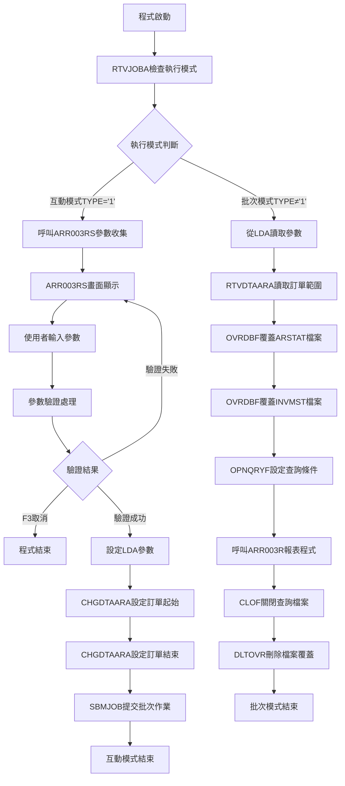
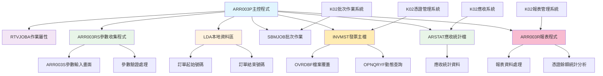
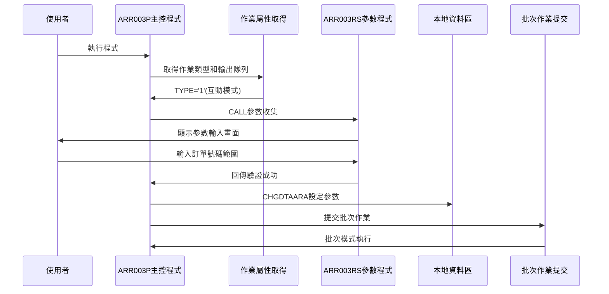
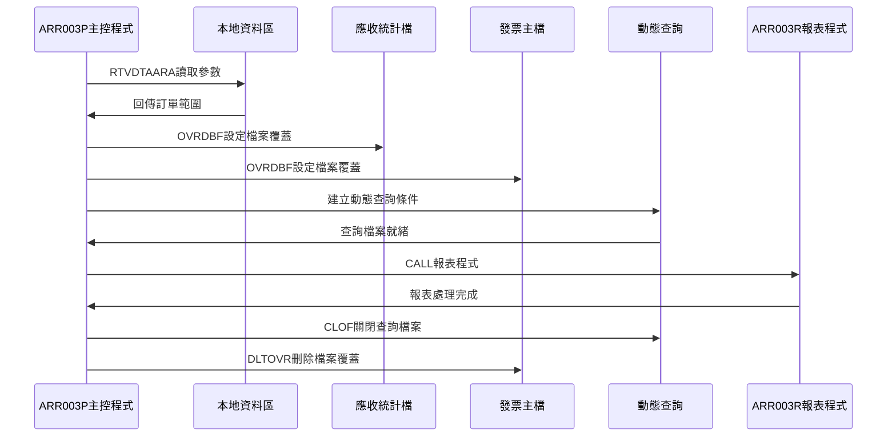
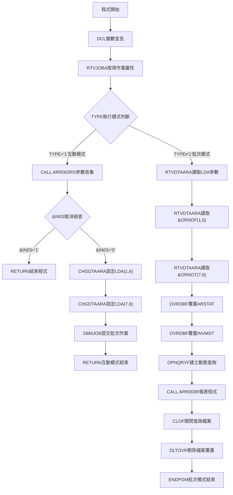

# ARR003P_K02 程式規格書

## 1. 基本資料

| 項目 | 內容 |
|------|------|
| **程式編號** | ARR003P |
| **程式名稱** | 應收憑證餘額報表作業 |
| **程式類型** | CLP |
| **廠區** | K02 |
| **系統名稱** | 應收帳款系統 |
| **子系統** | 憑證餘額報表管理 |
| **檔案位置** | K02CLSRC_THSRC/ARR003P.txt |

## 2. 🎯 程式功能說明

### 主要功能描述
此程式為應收憑證餘額報表作業的主要控制程式，專門提供按訂單號碼範圍的應收憑證餘額統計報表產生功能。程式採用雙模式執行設計，透過發票主檔(INVMST)和應收統計檔(ARSTAT)的查詢處理，提供完整的應收憑證餘額統計報表產生服務。K02版本具有互動參數收集機制、批次作業提交功能、動態查詢條件設定、以及完整的憑證餘額資料篩選。程式特別針對K02廠區的憑證餘額報表管理業務設計，確保應收憑證餘額統計報表的準確性和完整性，同時提供使用者友善的操作介面和強大的批次處理能力。程式支援訂單號碼範圍查詢、憑證類型篩選、餘額狀態篩選，並提供完整的憑證餘額統計分析功能。

### 🎯 業務流程詳細說明

#### 完整業務流程圖


#### 業務流程關鍵階段說明

**第一階段：執行模式判斷與分派**
- 使用RTVJOBA取得作業執行類型和輸出隊列
- 根據TYPE判斷互動模式還是批次模式
- 分派到對應的處理流程

**第二階段：互動模式參數收集**
- 呼叫ARR003RS畫面程式顯示參數輸入畫面
- 使用者輸入訂單號碼起始和結束範圍參數
- 執行參數驗證確保輸入正確性
- 處理F3取消功能

**第三階段：Local Data Area(LDA)參數設定**
- 使用CHGDTAARA設定訂單起始號碼到LDA位置1-6
- 使用CHGDTAARA設定訂單結束號碼到LDA位置7-12
- 為批次執行準備完整參數環境

**第四階段：批次作業提交**
- 使用SBMJOB提交ARR003P作業到批次執行
- 指定ARJOBD作業描述和輸出隊列
- 以CALL ARR003P方式執行批次模式
- 互動模式任務完成並結束

**第五階段：批次模式參數讀取**
- 使用RTVDTAARA從LDA讀取訂單起始和結束號碼
- 準備動態查詢條件設定

**第六階段：動態查詢檔案設定**
- 使用OVRDBF覆蓋ARSTAT應收統計檔案
- 使用OVRDBF覆蓋INVMST發票主檔設定共享存取
- 使用OPNQRYF建立動態查詢檔案
- 設定多層次查詢條件確保資料正確性

**第七階段：報表程式執行與清理**
- 呼叫ARR003R報表程式處理篩選後的資料
- 使用CLOF關閉查詢檔案
- 使用DLTOVR刪除所有檔案覆蓋
- 批次處理完成

#### 🎯 K02版本應收憑證餘額報表特色
- **雙模式執行**：互動參數收集模式和批次報表產生模式
- **Local Data Area傳遞**：使用LDA在互動和批次模式間傳遞參數
- **動態查詢條件**：根據參數動態建立OPNQRYF查詢條件
- **多檔案整合**：同時處理INVMST發票主檔和ARSTAT應收統計檔

#### 多層次檢查機制
- **執行模式檢查**：透過RTVJOBA判斷互動或批次執行環境
- **參數驗證檢查**：透過ARR003RS程式進行參數格式和邏輯驗證
- **檔案狀態檢查**：確保發票主檔和應收統計檔的可用性和資料完整性

#### 智能處理邏輯
- 自動根據執行環境選擇對應處理流程
- 動態建立查詢條件避免硬編碼限制
- 使用LDA機制實現模式間參數傳遞
- 自動管理檔案覆蓋和查詢檔案生命週期

#### 資料一致性確保機制
- 透過LDA確保互動模式和批次模式參數一致性
- 使用OPNQRYF動態查詢確保資料篩選正確性
- 分階段處理確保各步驟參數同步
- 完整的檔案覆蓋和清理機制確保系統穩定性

#### K02版本應收憑證餘額報表專業設計理念
- **報表專精**：專門提供應收憑證餘額資料的統計報表功能
- **雙模式整合**：互動和批次模式的完美整合設計
- **動態查詢**：靈活的查詢條件設定和檔案處理機制
- **K02特殊適配**：專為K02廠區的憑證餘額報表管理業務需求設計

## 3. 🎯 檔案架構與關聯圖

### 使用檔案清單

| 檔案名稱 | 檔案類型 | 使用方式 | 說明 |
|----------|----------|----------|------|
| **ARR003RS** | RPG | CALL | 應收憑證餘額報表參數收集程式 |
| **ARR003R** | RPG | CALL | 應收憑證餘額報表產生程式 |
| **ARR003S** | DSPF | - | 應收憑證餘額報表參數輸入畫面 |
| **INVMST** | 實體檔 | OVRDBF/OPNQRYF | 發票主檔 |
| **ARSTAT** | 實體檔 | OVRDBF | 應收統計檔 |
| **LDA** | 資料區 | CHGDTAARA/RTVDTAARA | 本地資料區(參數傳遞) |

### 🎯 檔案關聯詳細視覺化圖表



### 🎯 K02版本特殊資料流向說明

#### 互動模式參數收集階段的資料流向


#### K02版本批次模式報表產生階段的資料流向


## 4. 🎯 檔案欄位規格說明

### 主要資料結構

#### INVMST 發票主檔結構
| 欄位名稱 | 型態 | 長度 | 說明 |
|----------|------|------|------|
| INORNO | CHAR | 6 | 訂單號碼 |
| ININDT | CHAR | 6 | 發票日期 |
| INNO | CHAR | 3 | 發票序號 |
| INDECD | CHAR | 1 | 刪除碼 |
| INTYPE | CHAR | 1 | 發票類型 |
| INBAMT | PACKED | 13.2 | 基本金額 |
| INDAMT | PACKED | 13.2 | 折讓金額 |

#### ARR003S 顯示檔案結構
| 欄位名稱 | 型態 | 長度 | 說明 |
|----------|------|------|------|
| ORNOF | CHAR | 6 | 訂單起始號碼 |
| ORNOT | CHAR | 6 | 訂單結束號碼 |

### 🔍 重點欄位切割技術詳解

#### LDA 起始位置配置分析

**LDA參數配置結構**：
```
LDA (1024字元)：[應收憑證餘額報表參數傳遞區域]
位置:           001...006 007...012...1024
                 ↓      ↓   ↓      ↓      ↓
ORNOF (6字元)：  [______]                 訂單起始號碼（位置1-6）
ORNOT (6字元)：          [______]         訂單結束號碼（位置7-12）
預留空間：                        [......] 系統空間（位置13-1024）
```

**參數傳遞視覺化展示**：
```
互動式模式參數存入：
ARR003P → LDA
- CHGDTAARA(*LDA (1 6)) ← &ORNOF   (訂單起始號碼)
- CHGDTAARA(*LDA (7 6)) ← &ORNOT   (訂單結束號碼)

批次模式參數取出：
LDA → ARR003P
- RTVDTAARA(*LDA (1 6)) → &ORNOF    (訂單起始號碼)
- RTVDTAARA(*LDA (7 6)) → &ORNOT    (訂單結束號碼)
```

**切割邏輯詳細說明**：
1. **起始位置設計**：採用LDA位置1-12的連續配置，確保參數管理簡潔
2. **訂單範圍分離**：訂單起始和結束參數各佔6個字元的獨立空間
3. **連續位置配置**：避免複雜的位置計算，提高存取效率
4. **預留空間最大化**：位置13以後的1012字元預留空間，為未來擴展保留

#### UDS 系統資訊標準配置分析

**UDS結構定義（ARR003RS程式）**：
```
I           UDS
I                                      951 985 COMP
I                                     10111020 DEVNM
I                                     10211021 TXAR
```

**欄位切割視覺化展示**：
```
UDS (1024字元)：[應收憑證系統資訊標準區域]
位置:           001...950 951...985...1011...1020 1021 1022...1024
                 ↓      ↓   ↓      ↓     ↓      ↓    ↓    ↓
應用空間：       [.........]                                    應用資料區域（位置1-950）
COMP (35字元)：           [_____________]                        公司名稱（位置951-985）
空隙區域：                              [......]                預留空間（位置986-1010）
DEVNM (10字元)：                               [_____]         設備名稱（位置1011-1020）
TXAR (1字元)：                                      [_]        交易區域（位置1021-1021）
空隙區域：                                           [___]     預留空間（位置1022-1024）
```

**切割邏輯詳細說明**：
1. **標準系統配置**：採用AS/400標準的951後系統資訊區域
2. **公司資訊顯示**：位置951-985的35字元公司名稱標準顯示
3. **設備資訊管理**：位置1011-1020的10字元設備代碼標準配置
4. **廠區識別機制**：位置1021的單字元廠區代碼標準識別
5. **向下相容設計**：與其他ARR程式採用一致的UDS配置標準

#### ARR003RS 訂單範圍參數驗證邏輯切割分析

**訂單範圍驗證結構**：
```
訂單範圍驗證邏輯：
1. 預設處理：
   ORNOF = *BLANK (空白起始)
   ORNOT = *BLANK (空白結束)

2. 空白自動處理：
   IF ORNOT = *BLANK THEN
     ORNOT = *ALL'9'  (設定為999999)
   END

3. 範圍邏輯檢查：
   IF ORNOF > ORNOT THEN
     MOVELERR,1 ERRMSG (訂單範圍錯誤)
   END
```

**欄位切割視覺化展示**：
```
訂單範圍驗證切割：[智慧型訂單範圍邏輯驗證機制]
初始化階段:    [ORNOF=空白] [ORNOT=空白]
                  ↓           ↓
使用者輸入:    [輸入起始]   [輸入結束]
                  ↓           ↓
空白檢查:      [保持輸入]   [空白→999999]
                  ↓           ↓
邏輯驗證:      [ORNOF ≤ ORNOT檢查]
                  ↓
錯誤處理:      [ERR,1訂單範圍錯誤]
```

**切割邏輯詳細說明**：
1. **智慧預設機制**：訂單範圍參數預設為空白，簡化使用者輸入
2. **智慧空白處理**：結束訂單空白時自動設定為999999最大值
3. **單一錯誤控制**：使用ERR,1統一處理訂單範圍邏輯錯誤
4. **使用者友善設計**：允許空白輸入，系統智慧補完範圍邏輯

#### OPNQRYF 複合查詢條件切割分析（K02版本憑證餘額專用）

**查詢條件建構結構**：
```
OPNQRYF FILE((INVMST)) QRYSLT('
INORNO *EQ %RANGE("' || &ORNOF || '"
                  "' || &ORNOT || '") &
INDECD *EQ " " &
(INTYPE *EQ "2" *OR
 INBAMT *NE 0 *OR
 INDAMT *NE 0)')
KEYFLD((INORNO) (ININDT) (INNO))
```

**欄位切割視覺化展示**：
```
OPNQRYF查詢條件切割：[複合條件憑證餘額查詢建構]
參數來源:     [&ORNOF] [&ORNOT]
                ↓       ↓
字串處理:     ["起始"] ["結束"]
                ↓       ↓
範圍函數:     [%RANGE(訂單範圍)]
                ↓
主要條件:     [INORNO範圍]
                ↓
AND連接1:     [INORNO] AND [INDECD=" "]
                ↓
AND連接2:     [狀態篩選] AND [憑證類型]
                ↓
OR邏輯:       [INTYPE="2" OR INBAMT≠0 OR INDAMT≠0]
                ↓
最終查詢:     [複合條件憑證餘額查詢]

查詢條件分析：
INORNO *EQ %RANGE(...) - 訂單號碼範圍篩選
INDECD *EQ " " - 非刪除記錄篩選
INTYPE *EQ "2" - 特定憑證類型篩選
INBAMT *NE 0 - 基本金額非零篩選
INDAMT *NE 0 - 折讓金額非零篩選

排序鍵值：
KEYFLD((INORNO) (ININDT) (INNO)) - 訂單+日期+序號三重排序
```

**切割邏輯詳細說明**：
1. **複合條件設計**：使用5個主要查詢條件的精密組合
2. **%RANGE範圍應用**：高效的訂單號碼範圍查詢實現
3. **狀態篩選機制**：INDECD=" "確保查詢非刪除狀態資料
4. **憑證類型邏輯**：OR邏輯確保查詢憑證類型2或有餘額的記錄
5. **三重排序邏輯**：訂單+日期+序號的層次化排序機制

#### 雙檔案操作切割分析

**多檔案覆蓋結構**：
```
OVRDBF FILE(ARSTAT) TOFILE(ARSTAT)
OVRDBF FILE(INVMST) TOFILE(INVMST) SHARE(*YES)
```

**欄位切割視覺化展示**：
```
雙檔案操作切割：[憑證餘額多檔案整合機制]
檔案覆蓋1:    [ARSTAT統計檔]
                 ↓
檔案覆蓋2:    [INVMST發票檔] + [SHARE(*YES)]
                 ↓
查詢建立:     [OPNQRYF(INVMST)]
                 ↓
程式調用:     [ARR003R報表程式]
                 ↓
資源清理:     [CLOF + DLTOVR]
```

**切割邏輯詳細說明**：
1. **多檔案整合設計**：同時處理ARSTAT和INVMST兩個核心檔案
2. **共享存取機制**：INVMST使用SHARE(*YES)支援多重存取
3. **專用查詢架構**：OPNQRYF專門針對INVMST建立複合查詢
4. **完整生命週期管理**：從檔案覆蓋到資源清理的完整流程

### 🎯 欄位挪用詳細分析

#### 版本演進欄位挪用情況對比表

| 欄位名稱 | 原始定義用途 | 實際使用方式 | 挪用原因 | 技術特色 |
|----------|-------------|-------------|----------|----------|
| LDA起始配置 | 本地資料區一般儲存 | 1-12位置的訂單範圍專用配置 | 支援訂單範圍的憑證餘額查詢需求 | 起始位置設計 |
| OPNQRYF複合條件 | 單一條件查詢 | 5個條件的憑證餘額專用查詢 | 精確篩選有效憑證和餘額記錄 | 複合邏輯設計 |
| OR邏輯餘額篩選 | 單一金額檢查 | 憑證類型+基本金額+折讓金額OR邏輯 | 確保憑證餘額查詢的完整性 | 多重條件OR |
| 三重排序機制 | 單一排序邏輯 | 訂單+日期+序號的層次化排序 | 提供有序的憑證餘額分析 | 報表最佳化 |
| 雙檔案整合 | 單檔案操作 | ARSTAT+INVMST雙檔案協作機制 | 支援完整的憑證餘額統計分析 | 檔案整合技術 |

#### 複合查詢條件挪用分析

**OPNQRYF複合邏輯機制**：
```
標準設計：單一條件查詢
挪用設計：5個條件的憑證餘額專用查詢

複合條件結構：
1. INORNO範圍條件 (訂單範圍篩選)
2. INDECD狀態條件 (非刪除記錄)
3. INTYPE類型條件 (憑證類型2)
4. INBAMT金額條件 (基本金額非零)
5. INDAMT金額條件 (折讓金額非零)

技術優勢：
- 精確篩選有效憑證
- 確保餘額資料完整性
- 提高查詢效率
- 支援複合業務邏輯
```

**挪用邏輯詳細說明**：
- **OR邏輯應用**：INTYPE="2" OR INBAMT≠0 OR INDAMT≠0的複合邏輯
- **憑證篩選機制**：確保查詢憑證類型2或有實際餘額的記錄
- **完整性保證**：透過多重條件確保憑證餘額查詢的準確性
- **效能最佳化**：複合條件減少不必要的資料處理負擔

#### 三重排序機制挪用分析

**三重排序挪用機制**：
```
標準設計：單一欄位排序
挪用設計：訂單+日期+序號三重排序

排序結構：
KEYFLD((INORNO) (ININDT) (INNO))
         ↓        ↓        ↓
    第一層排序  第二層排序  第三層排序

排序邏輯：
- 首先按訂單號碼排序
- 同一訂單內按發票日期排序
- 同一日期內按發票序號排序

技術價值：
- 提供層次化報表輸出
- 便於憑證餘額分析
- 支援時間序列查詢
- 確保資料有序性
```

**挪用影響評估**：
1. **報表最佳化**：三重排序確保憑證餘額報表的有序性和可讀性
2. **分析便利性**：按訂單+日期+序號的排序便於憑證餘額分析
3. **效能考量**：充分利用複合索引提高排序效能
4. **業務邏輯支援**：支援按時間序列的憑證餘額追蹤分析

#### 雙檔案整合挪用分析

**雙檔案整合挪用**：
```
標準設計：單一檔案操作
挪用設計：ARSTAT+INVMST雙檔案協作

整合機制：
ARSTAT - 應收統計檔案 (統計資料)
INVMST - 發票主檔案 (明細資料)

檔案角色：
- ARSTAT提供統計基礎
- INVMST提供明細查詢
- 雙檔案協作完整分析

優勢分析：
- 支援完整的憑證餘額分析
- 統計和明細資料整合
- 提高資料查詢彈性
- 增強報表分析能力
```

**挪用方式詳細說明**：
1. **檔案覆蓋協作**：同時覆蓋兩個檔案確保資料一致性
2. **專用查詢架構**：OPNQRYF專門針對INVMST建立複合查詢
3. **共享存取設計**：INVMST使用SHARE(*YES)支援多重存取
4. **完整資源管理**：統一的資源清理機制確保系統穩定性

### 重要變數定義表

| 變數名稱 | 資料型態 | 長度 | 用途說明 |
|----------|----------|------|----------|
| &INT | *CHAR | 1 | 執行模式：'1'=互動，其他=批次 |
| &OUTQ | *CHAR | 10 | 輸出佇列名稱 |
| &IN03 | *LGL | 1 | F03取消功能鍵指示器 |
| &ORNOT | *CHAR | 6 | 訂單結束號碼（LDA位置7-12） |
| &ORNOF | *CHAR | 6 | 訂單起始號碼（LDA位置1-6） |
| ORNOF | CHAR | 6 | ARR003RS訂單起始參數 |
| ORNOT | CHAR | 6 | ARR003RS訂單結束參數（預設999999） |
| COMP | CHAR | 35 | UDS公司名稱（位置951-985） |
| DEVNM | CHAR | 10 | UDS設備名稱（位置1011-1020） |
| TXAR | CHAR | 1 | UDS交易區域（位置1021） |
| INORNO | CHAR | 6 | INVMST訂單號碼欄位 |
| ININDT | CHAR | 6 | INVMST發票日期欄位 |
| INNO | CHAR | 3 | INVMST發票序號欄位 |
| INDECD | CHAR | 1 | INVMST刪除碼欄位 |
| INTYPE | CHAR | 1 | INVMST發票類型欄位 |
| INBAMT | PACKED | 13.2 | INVMST基本金額欄位 |
| INDAMT | PACKED | 13.2 | INVMST折讓金額欄位 |
```
RTVJOBA TYPE(&INT) OUTQ(&OUTQ)
         ↓      ↓
    模式判斷  輸出隊列

模式切割邏輯：
TYPE='1' → 互動模式切割 → ARR003RS參數收集
TYPE≠'1' → 批次模式切割 → LDA參數讀取
```

**訂單範圍參數傳遞切割流程**：
```
互動模式切割流程：
ARR003RS → &ORNOF-&ORNOT → LDA(1-12) → SBMJOB
    ↓           ↓             ↓          ↓
參數收集    變數暫存     LDA寫入    批次提交

批次模式切割流程：
LDA(1-12) → &ORNOF-&ORNOT → OPNQRYF條件 → ARR003R
     ↓            ↓             ↓            ↓
  LDA讀取     變數載入      查詢建立     報表執行
```

#### 多檔案動態查詢條件切割視覺化
```
OPNQRYF多檔案查詢條件構建切割：

訂單範圍條件切割：
&ORNOF + &ORNOT → INORNO範圍條件
      ↓               ↓
   起始訂單      結束訂單
      ↓               ↓
'INORNO *EQ %RANGE("' + &ORNOF + '" "' + &ORNOT + '")'

複合業務條件切割：
硬編碼規則 → 'INDECD *EQ " "'（非刪除記錄）
業務邏輯   → '(INTYPE *EQ "2" *OR INBAMT *NE 0 *OR INDAMT *NE 0)'
           ↓
        憑證篩選條件

多檔案覆蓋切割：
ARSTAT → OVRDBF → 應收統計檔案準備
INVMST → OVRDBF → 發票主檔案準備（SHARE(*YES)）
```

#### 執行流程控制切割對應表(補充)
| 階段 | 切割來源 | 切割目標 | 切割邏輯 |
|------|----------|----------|----------|
| **模式判斷** | RTVJOBA | &INT變數 | 執行環境切割檢測 |
| **參數收集** | ARR003RS | &ORNOF-&ORNOT | 訂單範圍輸入切割 |
| **LDA寫入** | &ORNOF-&ORNOT | LDA(1-12) | 標準位置切割儲存 |
| **批次提交** | SBMJOB | 批次環境 | 執行模式切割轉換 |
| **LDA讀取** | LDA(1-12) | &ORNOF-&ORNOT | 標準位置切割讀取 |
| **多檔案覆蓋** | OVRDBF | ARSTAT+INVMST | 雙檔案切割準備 |
| **查詢建立** | &ORNOF-&ORNOT | OPNQRYF | 複合條件切割構建 |

### 🎯 K02版本欄位挪用詳細分析

#### ARR003S參數輸入畫面欄位重點
| 欄位名稱 | 用途說明 | 設定值 |
|----------|----------|--------|
| **ORNOF** | 訂單起始號碼 | 使用者輸入(6位數字) |
| **ORNOT** | 訂單結束號碼 | 使用者輸入(6位數字，可空白) |
| **ERRMSG** | 錯誤訊息 | 驗證失敗時顯示錯誤說明 |

#### INVMST發票主檔查詢欄位重點
| 欄位名稱 | 用途說明 | 查詢條件 |
|----------|----------|----------|
| **INORNO** | 訂單號碼 | 範圍查詢(起始~結束) |
| **ININDT** | 發票日期 | 排序鍵值 |
| **INNO** | 發票號碼 | 排序鍵值 |
| **INDECD** | 刪除代碼 | 等於空白 |
| **INTYPE** | 發票類型 | 等於'2'或其他條件 |
| **INBAMT** | 發票金額B | 不等於0 |
| **INDAMT** | 發票金額D | 不等於0 |

#### 執行流程控制欄位對應表
| 階段 | 資料來源 | 目標位置 | 處理邏輯 |
|------|----------|----------|----------|
| **參數收集** | ARR003RS | 程式變數 | 使用者輸入驗證 |
| **LDA設定** | 程式變數 | LDA 1-6,7-12位置 | CHGDTAARA寫入 |
| **批次讀取** | LDA 1-6,7-12位置 | 程式變數 | RTVDTAARA讀取 |
| **查詢條件** | 程式變數 | OPNQRYF | 動態SQL建立 |

### K02版本重要變數定義表

| 變數名稱 | 階段使用 | 資料來源 | 目標用途 | 說明 |
|----------|----------|----------|----------|------|
| **&INT** | 模式判斷 | RTVJOBA | 流程控制 | '1'=互動模式 |
| **&OUTQ** | 批次提交 | RTVJOBA | SBMJOB參數 | 輸出隊列名稱 |
| **&IN03** | 參數收集 | ARR003RS | 取消控制 | F3取消旗標 |
| **&ORNOF** | 全流程 | ARR003RS/LDA | 訂單篩選 | 訂單起始號碼 |
| **&ORNOT** | 全流程 | ARR003RS/LDA | 訂單篩選 | 訂單結束號碼 |

## 5. 🎯 輸出/入螢幕布局

### 畫面1：參數輸入畫面(ARR003S)

```
+------------------------------------------------------------------------------+
|[日期]                東鋼鋼鐵股份有限公司                          ARR003S   |
|                   應收憑證餘額報表作業                           [設備名稱] |
|                                                                              |
|                                                                              |
|                                                                              |
|                             *請輸入訂單範圍*                                  |
|                                                                              |
|                             起: [______]                                     |
|                                                                              |
|                             迄: [______]                                     |
|                                                                              |
|                                                                              |
|                                                                              |
|                                                                              |
|                                                                              |
|                                                                              |
|                                                                              |
|                                                                              |
|                                                                              |
|                                                                              |
|                                                                              |
|                                                                              |
|[錯誤訊息顯示區]                                                              |
|    ENTER:執行                    PF03:結束                                   |
+------------------------------------------------------------------------------+
```

### 🎯 畫面欄位詳細說明

#### 參數輸入欄位
| 欄位名稱 | 欄位屬性 | 位置 | 長度 | 輸入格式 | 驗證規則 | 說明 |
|----------|----------|------|------|----------|----------|------|
| **ORNOF** | 輸入/輸出 | 8,39 | 6 | 數字 | 訂單號碼格式 | 訂單起始號碼 |
| **ORNOT** | 輸入/輸出 | 10,39 | 6 | 數字 | 訂單號碼格式 | 訂單結束號碼 |

### 功能鍵詳細定義

| 功能鍵 | 處理邏輯 | 系統行為 | 說明 |
|--------|----------|----------|------|
| **F3** | 設定IN03='1' | 程式立即結束 | 取消報表作業 |
| **ENTER** | 執行參數驗證 | 驗證通過則提交批次作業 | 執行報表產生 |

### 輸入驗證機制

#### 參數驗證規則
- **訂單號碼範圍驗證**：起始號碼不可大於結束號碼
- **號碼格式驗證**：必須為6位數字格式
- **空白處理**：結束號碼為空白時自動設定為'999999'

#### K02版本特殊驗證
- 訂單號碼格式有效性檢查
- 訂單範圍合理性檢查
- 參數邏輯一致性驗證

## 6. 🎯 處理流程程序說明

### 🎯 主程序邏輯深度分析

#### K02版本程式執行流程圖


#### 🎯 K02版本應收憑證餘額報表特殊步驟分析

**步驟1：變數宣告和初始化**
- 宣告執行模式變數(&INT)和輸出隊列變數(&OUTQ)
- 宣告F3取消變數(&IN03)
- 宣告訂單號碼範圍變數(&ORNOF, &ORNOT)

**步驟2：執行環境檢查**
- 使用RTVJOBA取得作業執行類型(TYPE)和輸出隊列(OUTQ)
- 根據TYPE判斷是互動模式('1')還是批次模式

**步驟3：互動模式參數收集處理**
- 呼叫ARR003RS程式顯示參數輸入畫面
- 收集訂單號碼範圍(&ORNOF, &ORNOT)
- 檢查F3取消旗標，如為'1'則結束程式

**步驟4：LDA參數設定處理**
- 使用CHGDTAARA設定LDA位置1-6為訂單起始號碼
- 使用CHGDTAARA設定LDA位置7-12為訂單結束號碼

**步驟5：批次作業提交處理**
- 使用SBMJOB提交ARR003P作業到批次執行
- 指定ARJOBD作業描述
- 使用互動模式取得的輸出隊列(&OUTQ)
- 以'CALL ARR003P'方式執行批次模式
- 互動模式任務完成並結束

**步驟6：批次模式參數讀取處理**
- 使用RTVDTAARA從LDA位置1-6讀取訂單起始號碼到&ORNOF
- 使用RTVDTAARA從LDA位置7-12讀取訂單結束號碼到&ORNOT

**步驟7：檔案覆蓋和查詢設定**
- 使用OVRDBF覆蓋ARSTAT應收統計檔案
- 使用OVRDBF覆蓋INVMST檔案設定SHARE(*YES)
- 使用OPNQRYF建立動態查詢檔案
- 設定複合查詢條件確保資料正確性

**步驟8：OPNQRYF查詢條件構建**
- 訂單範圍條件：'INORNO *EQ %RANGE("' || &ORNOF || '" "' || &ORNOT || '")'
- 刪除標記條件：'INDECD *EQ " "'
- 憑證類型條件：'(INTYPE *EQ "2" *OR INBAMT *NE 0 *OR INDAMT *NE 0)'
- 排序鍵值：(INORNO)(ININDT)(INNO)

**步驟9：報表程式執行和清理**
- 呼叫ARR003R報表程式處理篩選後的憑證資料
- 使用CLOF關閉OPNQRYF建立的查詢檔案
- 使用DLTOVR刪除所有檔案覆蓋設定
- 批次處理完成並結束程式

#### 業務邏輯深度解析

**K02版本應收憑證餘額報表的核心邏輯**：
1. 提供雙模式執行的應收憑證餘額統計報表功能
2. 支援LDA機制確保參數在模式間正確傳遞
3. 提供動態查詢條件設定功能
4. 應收憑證餘額報表專業化處理的完整實現

**K02版本效能優化機制**：
1. 使用SBMJOB批次處理避免互動模式長時間佔用
2. 動態查詢條件減少不必要的資料處理
3. 檔案覆蓋設定確保資料存取效能
4. 完整的資源清理確保系統穩定性

#### 條件判斷詳細說明

**K02版本執行模式判斷**：
- `&INT *EQ '1'` - 互動模式執行路徑
- `&IN03 *EQ '1'` - F3取消功能檢查

**K02版本查詢條件判斷**：
- `INORNO *EQ %RANGE("&ORNOF" "&ORNOT")` - 訂單號碼範圍查詢
- `INDECD *EQ " "` - 非刪除記錄檢查
- `INTYPE *EQ "2"` - 特定憑證類型檢查
- `INBAMT *NE 0` - B金額非零檢查
- `INDAMT *NE 0` - D金額非零檢查

#### 變數使用和數據流向追蹤

**K02版本特殊變數軌跡**：
1. 執行模式變數(&INT)的模式判斷軌跡
2. 參數變數(&ORNOF, &ORNOT)的收集和傳遞軌跡
3. LDA位置變數的寫入和讀取軌跡
4. 查詢條件變數的動態構建軌跡
5. 檔案控制變數的覆蓋和清理軌跡
6. 批次作業變數(&OUTQ)的提交軌跡

### 🎯 K02版本子程序邏輯分析

#### K02版本子程序調用順序
1. **RTVJOBA**：取得作業執行屬性，判斷執行模式
2. **ARR003RS**：參數收集程式，處理使用者輸入和驗證
3. **CHGDTAARA**：LDA設定，將參數寫入本地資料區
4. **SBMJOB**：批次作業提交，轉換到批次執行環境
5. **RTVDTAARA**：LDA讀取，從本地資料區取得參數
6. **OVRDBF**：檔案覆蓋設定，準備檔案存取環境
7. **OPNQRYF**：動態查詢建立，設定資料篩選條件
8. **ARR003R**：報表程式執行，處理篩選後的資料
9. **CLOF/DLTOVR**：資源清理，恢復系統環境

#### K02版本應收憑證餘額報表專精設計
- 專門提供應收憑證餘額資料的統計報表功能
- 支援雙模式執行確保使用者體驗和系統效能
- 提供動態查詢條件的靈活報表產生機制
- 針對K02廠區的憑證餘額報表管理業務特色進行優化

## 7. 🎯 數據操作與轉換分析

### K02版本檔案操作詳解

#### K02版本LDA本地資料區操作
- **CHGDTAARA操作**：將互動模式收集的參數寫入LDA指定位置
- **RTVDTAARA操作**：從LDA指定位置讀取參數到批次模式變數
- **位置管理**：精確的位置對應確保參數正確傳遞

#### K02版本INVMST發票主檔操作
- **OVRDBF操作**：設定檔案共享存取模式
- **OPNQRYF操作**：建立動態查詢檔案和複合篩選條件
- **CLOF操作**：關閉查詢檔案釋放資源
- **DLTOVR操作**：刪除檔案覆蓋恢復原始設定

#### K02版本ARSTAT應收統計檔操作
- **OVRDBF操作**：設定檔案覆蓋準備統計資料存取
- **統計分析**：提供憑證餘額統計基礎資料

### K02版本數據轉換邏輯

#### K02版本參數轉換流程
- **使用者輸入轉換**：ARR003RS程式變數 → 主程式參數變數
- **LDA寫入轉換**：主程式參數變數 → LDA指定位置
- **LDA讀取轉換**：LDA指定位置 → 批次模式變數
- **查詢條件轉換**：批次模式變數 → OPNQRYF動態SQL條件

#### K02版本查詢條件轉換
- **訂單範圍轉換**：&ORNOF, &ORNOT → 'INORNO *EQ %RANGE("&ORNOF" "&ORNOT")'
- **固定條件轉換**：硬編碼邏輯 → 'INDECD *EQ " "'
- **憑證條件轉換**：業務規則 → '(INTYPE *EQ "2" *OR INBAMT *NE 0 *OR INDAMT *NE 0)'

### K02版本檢核機制詳解

#### K02版本執行模式檢核
- **作業類型檢查**：透過RTVJOBA確認執行環境
- **參數完整性檢查**：確保LDA參數的正確設定和讀取
- **模式轉換檢查**：確保互動模式到批次模式的正確轉換

#### K02版本參數一致性檢核
- **ARR003RS驗證**：參數格式和邏輯的完整驗證
- **LDA傳遞檢查**：確保參數在模式間正確傳遞
- **查詢條件檢查**：確保動態SQL條件的正確構建

#### K02版本資源管理檢核
- **檔案狀態檢查**：確保INVMST和ARSTAT檔案的可用性
- **查詢檔案檢查**：確保OPNQRYF的正確建立和關閉
- **覆蓋設定檢查**：確保檔案覆蓋的正確設定和清理

#### K02版本報表處理檢核
- **ARR003R執行檢查**：確保報表程式的正確執行
- **資料完整性檢查**：確保篩選後資料的完整性
- **輸出結果檢查**：確保報表產生的正確性

## 8. 🎯 錯誤處理程序說明

### 🎯 K02版本詳細錯誤代碼清冊

| 錯誤代碼 | 錯誤訊息 | 原因說明 | 處理方式 | 預防措施 |
|----------|---------|---------|---------|----------|
| **ERR,1** | 訂單範圍錯誤 | 起始訂單號碼大於結束訂單號碼 | 1. 重新輸入正確訂單範圍<br>2. 檢查訂單號碼邏輯<br>3. 確認範圍設定合理性 | 檢查訂單範圍的邏輯關係 |
| **RTVJOBA失敗** | 作業屬性取得異常 | 系統環境或權限問題 | 1. 檢查系統狀態<br>2. 確認使用者權限<br>3. 重新執行程式 | 確保系統環境正常 |
| **LDA存取失敗** | 本地資料區操作異常 | LDA權限或系統問題 | 1. 檢查LDA存取權限<br>2. 確認系統資源<br>3. 重新初始化作業 | 確保LDA存取權限 |
| **SBMJOB失敗** | 批次作業提交異常 | 作業描述或權限問題 | 1. 檢查ARJOBD作業描述<br>2. 確認批次權限<br>3. 檢查系統資源 | 確保批次作業環境正常 |
| **OVRDBF失敗** | 檔案覆蓋設定異常 | INVMST或ARSTAT檔案問題 | 1. 檢查檔案存在性<br>2. 確認檔案權限<br>3. 檢查檔案狀態 | 確保檔案系統正常 |
| **OPNQRYF失敗** | 動態查詢建立異常 | 查詢條件語法或資源問題 | 1. 檢查查詢條件語法<br>2. 確認系統資源<br>3. 重新建立查詢 | 驗證查詢條件正確性 |
| **ARR003R執行失敗** | 報表程式執行異常 | 報表程式或資料問題 | 1. 檢查ARR003R程式狀態<br>2. 確認資料完整性<br>3. 重新執行報表 | 確保報表程式正常 |
| **資源清理失敗** | CLOF或DLTOVR異常 | 系統資源管理問題 | 1. 手動清理資源<br>2. 重新啟動作業<br>3. 檢查系統狀態 | 定期檢查系統資源 |

### 🎯 K02版本系統異常處理邏輯

#### K02版本執行模式異常處理
- **互動模式異常**：處理ARR003RS參數收集的異常情況
- **批次模式異常**：處理LDA參數讀取和報表執行的異常
- **模式轉換異常**：處理SBMJOB批次作業提交的異常

#### K02版本參數處理錯誤處理
- **參數驗證異常**：處理ARR003RS參數驗證失敗的情況
- **LDA操作異常**：處理CHGDTAARA和RTVDTAARA的存取異常
- **參數傳遞異常**：處理模式間參數傳遞的異常

#### K02版本檔案操作錯誤處理
- **檔案存取異常**：處理INVMST和ARSTAT檔案的存取權限問題
- **查詢建立異常**：處理OPNQRYF動態查詢的建立問題
- **資源清理異常**：處理CLOF和DLTOVR的清理問題

#### K02版本應收憑證餘額報表業務失敗處理
- **報表邏輯失敗**：處理應收憑證餘額統計報表業務邏輯的異常
- **資料篩選失敗**：處理多條件篩選的異常
- **報表產生失敗**：處理ARR003R報表程式的執行異常
- **批次處理失敗**：處理批次作業執行環境的異常

## 9. 🎯 備註

### 🎯 重要特色與注意事項

#### 應收憑證餘額報表專業特性
- 本程式專門處理應收憑證餘額的統計報表作業，具備複合查詢條件的專業處理能力
- 採用INVMST發票主檔的複合查詢機制，支援憑證類型、金額狀態的多重篩選條件
- 使用LDA起始位置（1-12）進行參數傳遞，確保訂單範圍參數的簡潔傳遞
- 提供三重排序機制（訂單+日期+序號），確保憑證餘額報表的有序性和分析便利性

#### 欄位切割技術特色
- **複合查詢條件技術**：使用5個條件的OPNQRYF查詢，精確篩選有效憑證和餘額記錄
- **OR邏輯餘額篩選**：憑證類型2或基本金額非零或折讓金額非零的多重條件OR邏輯
- **三重排序機制**：訂單+日期+序號的層次化排序，提供有序的憑證餘額分析
- **雙檔案整合技術**：ARSTAT+INVMST雙檔案協作機制，支援完整的憑證餘額統計分析
- **共享存取設計**：INVMST使用SHARE(*YES)支援多重存取的安全機制

#### 技術架構優勢
- **複合條件查詢**：5個條件的精密組合，確保憑證餘額查詢的準確性和完整性
- **多檔案整合機制**：同時處理ARSTAT統計檔和INVMST發票檔，提供完整的資料分析能力
- **三重排序效率**：充分利用複合索引提高排序效能，支援時間序列的憑證餘額追蹤
- **資源管理完整化**：從檔案覆蓋到查詢建立再到資源清理的完整生命週期管理

#### 重要技術注意事項
- **OPNQRYF複合條件監控**：定期監控5個條件查詢的執行效能，確保系統資源有效利用
- **雙檔案依賴性管理**：確保INVMST和ARSTAT檔案的穩定性和資料一致性
- **三重排序效能控制**：避免過大的訂單範圍影響排序效能和系統資源
- **OR邏輯條件確認**：確保憑證類型和金額條件的邏輯正確性，避免資料遺漏

#### 專業操作建議
- **訂單範圍設定策略**：建議根據實際憑證餘額查詢需求設定適當的訂單範圍
- **複合條件效能最佳化**：充分利用INVMST的複合索引提高查詢效能
- **雙檔案協作策略**：確保ARSTAT和INVMST檔案的同步性和資料完整性
- **三重排序分析利用**：善用訂單+日期+序號排序進行憑證餘額的時間序列分析

#### 系統整合與相容性
- **INVMST發票主檔深度整合**：與發票系統緊密結合，提供完整的憑證餘額查詢能力
- **ARSTAT統計檔協作整合**：與統計系統完全相容，確保統計資料的準確性和可靠性
- **AS/400標準相容性**：完全符合AS/400系統標準，確保系統穩定性和可維護性

