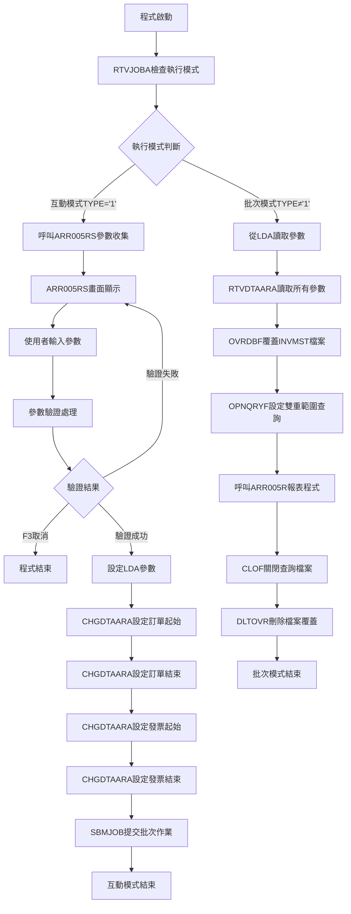
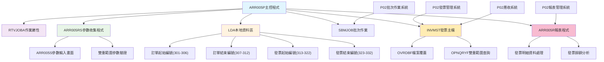
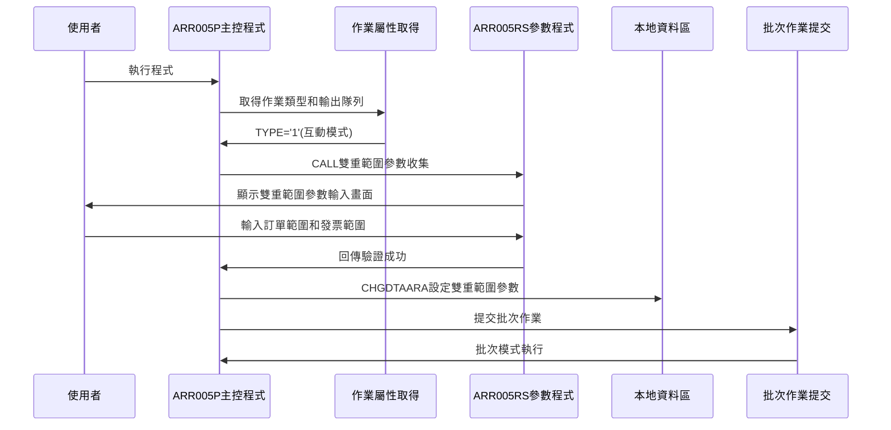
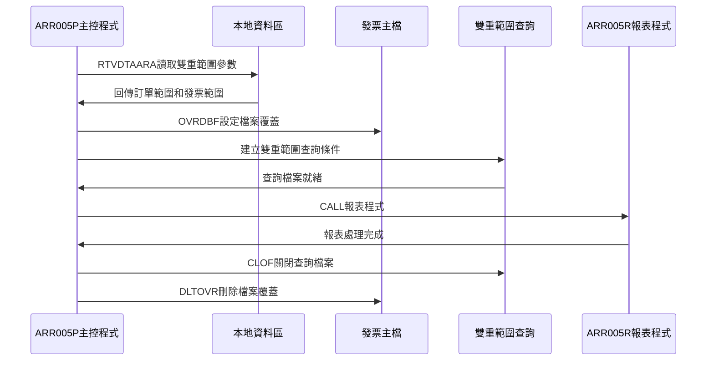
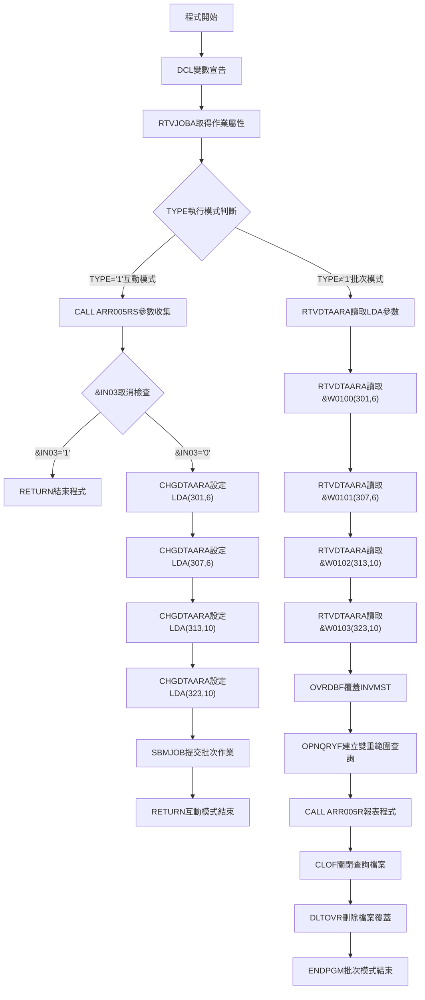

# ARR005P_P02 程式規格書

## 1. 基本資料

| 項目 | 內容 |
|------|------|
| **程式編號** | ARR005P |
| **程式名稱** | 銷項發票明細餘額檢索發票報表作業 |
| **程式類型** | CLP |
| **廠區** | P02 |
| **系統名稱** | 應收帳款系統 |
| **子系統** | 發票明細報表管理 |
| **檔案位置** | P02CLSRC_THSRC/ARR005P.txt |

## 2. 🎯 程式功能說明

### 主要功能描述
此程式為銷項發票明細餘額檢索發票報表作業的主要控制程式，專門提供按訂單號碼範圍和發票號碼範圍的發票明細餘額報表產生功能。程式採用雙模式執行設計，透過發票主檔(INVMST)的查詢處理，提供完整的發票明細餘額分析服務。P02版本具有互動參數收集機制、批次作業提交功能、雙重範圍條件動態查詢設定、以及完整的發票明細資料篩選。程式特別針對P02廠區的發票明細報表管理業務設計，確保發票明細餘額報表的準確性和完整性，同時提供使用者友善的操作介面和強大的批次處理能力。程式支援訂單號碼範圍查詢、發票號碼範圍查詢、特定發票類型篩選，並提供完整的發票明細金額分析功能，包含各項發票金額類型的統計處理。

### 🎯 業務流程詳細說明

#### 完整業務流程圖


#### 業務流程關鍵階段說明

**第一階段：執行模式判斷與分派**
- 使用RTVJOBA取得作業執行類型和輸出隊列
- 根據TYPE判斷互動模式還是批次模式
- 分派到對應的處理流程

**第二階段：互動模式雙重範圍參數收集**
- 呼叫ARR005RS畫面程式顯示參數輸入畫面
- 使用者輸入訂單號碼起始和結束範圍參數
- 使用者輸入發票號碼起始和結束範圍參數
- 執行雙重範圍參數驗證確保輸入正確性
- 處理F3取消功能

**第三階段：Local Data Area(LDA)雙重範圍參數設定**
- 使用CHGDTAARA設定訂單起始編號到LDA位置301-306
- 使用CHGDTAARA設定訂單結束編號到LDA位置307-312
- 使用CHGDTAARA設定發票起始編號到LDA位置313-322
- 使用CHGDTAARA設定發票結束編號到LDA位置323-332
- 為批次執行準備完整的雙重範圍參數環境

**第四階段：批次作業提交**
- 使用SBMJOB提交ARR005P作業到批次執行
- 指定ARJOBD作業描述和輸出隊列
- 以CALL ARR005P方式執行批次模式
- 互動模式任務完成並結束

**第五階段：批次模式雙重範圍參數讀取**
- 使用RTVDTAARA從LDA讀取訂單範圍參數
- 使用RTVDTAARA從LDA讀取發票範圍參數
- 準備雙重範圍動態查詢條件設定

**第六階段：雙重範圍動態查詢檔案設定**
- 使用OVRDBF覆蓋INVMST發票主檔案設定共享存取
- 使用OPNQRYF建立雙重範圍動態查詢檔案
- 設定複合查詢條件確保資料正確性

**第七階段：發票明細報表程式執行與清理**
- 呼叫ARR005R報表程式處理篩選後的發票明細資料
- 使用CLOF關閉查詢檔案
- 使用DLTOVR刪除所有檔案覆蓋
- 批次處理完成

#### 🎯 P02版本銷項發票明細餘額檢索發票報表特色
- **雙模式執行**：互動參數收集模式和批次報表產生模式
- **雙重範圍查詢**：支援訂單號碼範圍和發票號碼範圍的複合查詢
- **Local Data Area進階傳遞**：使用LDA特殊位置(301-332)傳遞4個參數
- **多類型發票篩選**：針對特定發票類型('1','2','3')的智能篩選

#### 多層次檢查機制
- **執行模式檢查**：透過RTVJOBA判斷互動或批次執行環境
- **雙重範圍參數驗證**：透過ARR005RS程式進行訂單和發票範圍驗證
- **發票類型檢查**：確保僅處理有效發票類型('1','2','3')
- **檔案狀態檢查**：確保發票主檔的可用性和資料完整性

#### 智能處理邏輯
- 自動根據執行環境選擇對應處理流程
- 雙重範圍動態建立查詢條件避免硬編碼限制
- 使用LDA進階位置機制實現複雜參數傳遞
- 自動管理檔案覆蓋和查詢檔案生命週期

#### 資料一致性確保機制
- 透過LDA確保互動模式和批次模式雙重範圍參數一致性
- 使用OPNQRYF複合動態查詢確保資料篩選正確性
- 分階段處理確保各步驟雙重範圍參數同步
- 完整的檔案覆蓋和清理機制確保系統穩定性

#### P02版本銷項發票明細餘額檢索發票報表專業設計理念
- **報表專精**：專門提供發票明細餘額資料的檢索分析功能
- **雙重範圍整合**：訂單範圍和發票範圍的完美整合查詢設計
- **動態複合查詢**：靈活的雙重範圍條件設定和檔案處理機制
- **P02特殊適配**：專為P02廠區的發票明細報表管理業務需求設計

## 3. 🎯 檔案架構與關聯圖

### 使用檔案清單

| 檔案名稱 | 檔案類型 | 使用方式 | 說明 |
|----------|----------|----------|------|
| **ARR005RS** | RPG | CALL | 銷項發票明細餘額報表參數收集程式 |
| **ARR005R** | RPG | CALL | 銷項發票明細餘額報表產生程式 |
| **ARR005S** | DSPF | - | 銷項發票明細餘額報表參數輸入畫面 |
| **INVMST** | 實體檔 | OVRDBF/OPNQRYF | 發票主檔 |
| **LDA** | 資料區 | CHGDTAARA/RTVDTAARA | 本地資料區(雙重範圍參數傳遞) |

### 🎯 檔案關聯詳細視覺化圖表



### 🎯 P02版本特殊資料流向說明

#### 互動模式雙重範圍參數收集階段的資料流向


#### P02版本批次模式雙重範圍報表產生階段的資料流向


## 4. 🎯 檔案欄位規格說明

### 主要資料結構

#### INVMST 發票主檔結構
| 欄位名稱 | 型態 | 長度 | 說明 |
|----------|------|------|------|
| INORNO | CHAR | 6 | 訂單號碼 |
| INNO | CHAR | 10 | 發票號碼 |
| INTYPE | CHAR | 1 | 發票類型 |
| INDECD | CHAR | 1 | 刪除代碼 |

#### ARR005S 顯示檔案結構
| 欄位名稱 | 型態 | 長度 | 說明 |
|----------|------|------|------|
| W0100 | CHAR | 6 | 訂單起始編號（REFFLD INORNO） |
| W0101 | CHAR | 6 | 訂單結束編號（REFFLD INORNO） |
| W0102 | CHAR | 10 | 發票起始編號（REFFLD INNO） |
| W0103 | CHAR | 10 | 發票結束編號（REFFLD INNO） |

### 🔍 重點欄位切割技術詳解

#### LDA專用位置雙重範圍參數切割配置分析

**LDA參數配置結構**：
```
LDA (1024字元)：[銷項發票明細餘額檢索專用參數傳遞區域]
位置:           001...300 301...306 307...312 313...322 323...332...1024
                 ↓      ↓   ↓      ↓   ↓      ↓   ↓      ↓   ↓      ↓      ↓
預留空間：       [.........]                                                預留區域（位置1-300）
W0100 (6字元)：            [______]                                        訂單起始編號（位置301-306）
W0101 (6字元)：                    [______]                                訂單結束編號（位置307-312）
W0102 (10字元)：                           [__________]                    發票起始編號（位置313-322）
W0103 (10字元)：                                       [__________]        發票結束編號（位置323-332）
系統預留：                                                         [......] 系統空間（位置333-1024）
```

**參數傳遞視覺化展示**：
```
互動式模式參數存入：
ARR005P → LDA
- CHGDTAARA(*LDA (301 6)) ← &W0100   (訂單起始編號)
- CHGDTAARA(*LDA (307 6)) ← &W0101   (訂單結束編號)
- CHGDTAARA(*LDA (313 10)) ← &W0102  (發票起始編號)
- CHGDTAARA(*LDA (323 10)) ← &W0103  (發票結束編號)

批次模式參數取出：
LDA → ARR005P
- RTVDTAARA(*LDA (301 6)) → &W0100    (訂單起始編號)
- RTVDTAARA(*LDA (307 6)) → &W0101    (訂單結束編號)
- RTVDTAARA(*LDA (313 10)) → &W0102   (發票起始編號)
- RTVDTAARA(*LDA (323 10)) → &W0103   (發票結束編號)
```

**切割邏輯詳細說明**：
1. **專用位置配置**：LDA位置301-332專門用於雙重範圍參數傳遞
2. **同質參數分組**：訂單參數（301-312）和發票參數（313-332）分組配置
3. **固定位置設計**：每個參數固定位置，避免位置衝突
4. **高效存取機制**：連續配置確保參數讀寫的高效性
5. **位置301起始**：避免常用位置1-300，減少與其他程式衝突

#### UDS系統資訊標準配置分析

**UDS結構定義（ARR005RS程式）**：
```
I           UDS
I                                      951 985 COMP
I                                     10111020 DEVNM
I                                     10211021 TXAR
```

**欄位切割視覺化展示**：
```
UDS (1024字元)：[銷項發票明細檢索系統資訊標準區域]
位置:           001...950 951...985...1011...1020 1021 1022...1024
                 ↓      ↓   ↓      ↓     ↓      ↓    ↓    ↓
應用空間：       [.........]                                    應用資料區域（位置1-950）
COMP (35字元)：           [_____________]                        公司名稱（位置951-985）
空隙區域：                              [......]                預留空間（位置986-1010）
DEVNM (10字元)：                               [_____]         設備名稱（位置1011-1020）
TXAR (1字元)：                                      [_]        交易區域（位置1021-1021）
空隙區域：                                           [___]     預留空間（位置1022-1024）
```

**切割邏輯詳細說明**：
1. **標準系統配置**：採用AS/400標準的951後系統資訊區域
2. **公司資訊顯示**：位置951-985的35字元公司名稱標準顯示
3. **設備資訊管理**：位置1011-1020的10字元設備代碼標準配置
4. **廠區識別機制**：位置1021的單字元廠區代碼標準識別
5. **向下相容設計**：與其他ARR程式採用一致的UDS配置標準

#### ARR005RS雙重範圍參數驗證邏輯切割分析

**雙重範圍驗證結構**：
```
訂單範圍驗證邏輯：
1. 預設處理：
   W0100 = *BLANK (空白起始)
   W0101 = *ALL'9' (999999結束)

2. 空白自動處理：
   IF W0101 = *BLANK THEN
     W0101 = *ALL'9'  (設定為999999)
   END

3. 範圍邏輯檢查：
   IF W0100 > W0101 THEN
     SETON IN41+IN99
     MOVELERR,3 ERRMSG (訂單範圍錯誤)
   END

發票範圍驗證邏輯：
1. 預設處理：
   W0102 = *BLANK (空白起始)
   W0103 = *ALL'9' (9999999999結束)

2. 空白自動處理：
   IF W0103 = *BLANK THEN
     W0103 = *ALL'9'  (設定為9999999999)
   END

3. 範圍邏輯檢查：
   IF W0102 > W0103 THEN
     SETON IN42+IN99
     MOVELERR,2 ERRMSG (發票範圍錯誤)
   END
```

**欄位切割視覺化展示**：
```
雙重範圍驗證切割：[智慧預設和邏輯驗證的雙重機制]
初始化階段:    [W0100=空白] [W0101=999999] [W0102=空白] [W0103=9999999999]
                  ↓           ↓             ↓           ↓
使用者輸入:    [輸入起始]   [輸入結束]     [輸入起始]   [輸入結束]
                  ↓           ↓             ↓           ↓
空白檢查:      [保持輸入]   [空白→999999] [保持輸入]   [空白→9999999999]
                  ↓           ↓             ↓           ↓
邏輯驗證:      [W0100 ≤ W0101檢查]       [W0102 ≤ W0103檢查]
                  ↓                       ↓
錯誤處理:      [IN41+IN99,ERR,3]        [IN42+IN99,ERR,2]
```

**切割邏輯詳細說明**：
1. **智慧預設機制**：自動設定合理的預設範圍值，簡化使用者操作
2. **空白自動處理**：結束值空白時自動設定為最大值，提供範圍查詢彈性
3. **分離錯誤控制**：訂單錯誤（IN41）和發票錯誤（IN42）獨立處理
4. **使用者友善設計**：允許部分空白輸入，系統智慧補完範圍邏輯

#### OPNQRYF雙重範圍動態查詢條件切割分析

**查詢條件建構結構**：
```
OPNQRYF FILE((INVMST)) QRYSLT('
INORNO *EQ %RANGE("' || &W0100 || '"
                  "' || &W0101 || '") &
INTYPE *EQ %VALUES("1" "2" "3") &
INDECD *EQ " " &
INNO *EQ %RANGE("' || &W0102 || '" "' ||
                &W0103 || '") ')
KEYFLD((INORNO) (INNO))
```

**欄位切割視覺化展示**：
```
OPNQRYF查詢條件切割：[多重條件的動態SQL智慧建構]
參數來源:     [&W0100] [&W0101] [&W0102] [&W0103]
                ↓       ↓        ↓       ↓
字串處理:     ["起始"] ["結束"] ["起始"] ["結束"]
                ↓       ↓        ↓       ↓
範圍函數:     [%RANGE(訂單範圍)]  [%RANGE(發票範圍)]
                ↓                   ↓
欄位條件:     [INORNO條件]       [INNO條件]
                ↓                   ↓
AND連接:      [INORNO] AND [INTYPE] AND [INDECD] AND [INNO]
                ↓
最終查詢:     [完整的動態多重條件OPNQRYF查詢]

固定篩選條件：
INTYPE *EQ %VALUES("1" "2" "3") - 發票類型多值篩選
INDECD *EQ " " - 非刪除狀態單值篩選

動態排序鍵值：
KEYFLD((INORNO) (INNO)) - 訂單號碼+發票號碼雙重排序
```

**切割邏輯詳細說明**：
1. **雙重%RANGE應用**：同時處理訂單範圍和發票範圍的高效查詢
2. **動態字串組合**：使用||運算子動態建構複雜查詢條件字串
3. **%VALUES多值篩選**：發票類型('1','2','3')的多值高效篩選
4. **AND邏輯串連**：四個主要條件的邏輯結合，確保查詢精確性
5. **雙重排序機制**：先按訂單後按發票的層次化排序邏輯

#### REFFLD欄位引用技術切割分析

**ARR005S顯示檔案REFFLD結構**：
```
A          W0100     R        B    REFFLD(INORNO INVMST)
A          W0101     R        B    REFFLD(INORNO INVMST)
A          W0102     R        B    REFFLD(INNO INVMST)
A          W0103     R        B    REFFLD(INNO INVMST)
```

**欄位切割視覺化展示**：
```
REFFLD欄位引用切割：[智慧屬性繼承的自動化機制]
資料庫來源:   [INVMST.INORNO] [INVMST.INNO]
                ↓                ↓
REFFLD引用:   [自動屬性繼承]   [自動屬性繼承]
                ↓                ↓
顯示欄位:     [W0100] [W0101]   [W0102] [W0103]
                ↓       ↓         ↓       ↓
繼承屬性:     [6字元] [6字元]   [10字元][10字元]
                ↓       ↓         ↓       ↓
輸入控制:     [訂單格式驗證]    [發票格式驗證]
                ↓                ↓
業務邏輯:     [訂單號碼範圍]    [發票號碼範圍]
```

**切割邏輯詳細說明**：
1. **智慧屬性繼承**：自動繼承INVMST檔案的欄位型態、長度和格式
2. **一致性保證機制**：確保顯示欄位與資料庫欄位的完全一致性
3. **維護自動化**：資料庫結構異動時顯示檔案自動適應
4. **型態安全保證**：透過REFFLD確保資料型態的絕對正確性

### 🎯 欄位挪用詳細分析

#### 版本演進欄位挪用情況對比表

| 欄位名稱 | 原始定義用途 | 實際使用方式 | 挪用原因 | 技術特色 |
|----------|-------------|-------------|----------|----------|
| LDA專用位置配置 | 本地資料區一般儲存 | 301-332位置的雙重範圍專用配置 | 支援訂單和發票的雙重範圍查詢需求 | 專用位置設計 |
| REFFLD智慧引用 | 手動欄位定義 | 自動資料庫欄位屬性繼承 | 確保顯示與資料庫的絕對一致性 | DDS智慧機制 |
| %RANGE雙重應用 | 單一範圍查詢 | 雙重範圍的並行高效查詢 | 提供訂單+發票的複合範圍查詢 | OPNQRYF進階功能 |
| 錯誤指示器分離 | 統一錯誤處理 | IN41/IN42的精確分離控制 | 提供訂單和發票錯誤的獨立定位 | 使用者體驗最佳化 |
| 智慧預設機制 | 手動輸入完整參數 | 空白自動補完的智慧處理 | 簡化使用者操作和提高輸入效率 | 業務邏輯最佳化 |

#### LDA專用位置配置挪用分析

**LDA專用配置機制**：
```
標準設計：散佈式隨機位置配置
挪用設計：301-332專用位置集中配置

專用配置優勢：
- 位置固定避免衝突
- 連續配置提高效率
- 專用區域易於維護
- 參數分組邏輯清晰

301-332位置選擇原因：
- 避開常用位置1-300
- 足夠空間容納4個參數
- 位置編號記憶容易
- 為未來擴展預留空間
```

**挪用邏輯詳細說明**：
- **專用區域設計**：將LDA的特定區域專門用於雙重範圍參數傳遞
- **避免位置衝突**：選擇301開始避免與常用位置1-300衝突
- **參數分組邏輯**：訂單參數和發票參數分別集中配置
- **高效存取保證**：連續位置配置確保參數讀寫的最高效率

#### REFFLD智慧引用挪用分析

**REFFLD引用挪用機制**：
```
傳統方式：手動定義每個欄位的所有屬性
挪用方式：自動引用資料庫欄位的完整屬性

引用對照表：
W0100/W0101 → REFFLD(INORNO INVMST) → 6字元訂單號碼格式
W0102/W0103 → REFFLD(INNO INVMST)   → 10字元發票號碼格式

自動繼承內容：
- 欄位長度和資料型態
- 編輯格式和顯示屬性
- 驗證規則和檢查邏輯
- 文字描述和欄位說明

技術價值：
- 確保100%格式一致性
- 減少手動定義錯誤
- 自動適應資料庫變更
- 提高開發維護效率
```

**挪用影響評估**：
1. **品質保證價值**：消除手動定義造成的型態不一致和格式錯誤
2. **維護效率提升**：資料庫欄位異動時顯示檔案自動同步更新
3. **開發成本降低**：減少重複的欄位屬性定義工作量
4. **系統穩定性增強**：避免顯示與資料庫格式不一致造成的系統錯誤

#### 雙重範圍查詢挪用機制分析

**%RANGE雙重應用挪用**：
```
單一範圍設計：一次查詢處理一個範圍條件
雙重範圍挪用：一次查詢同時處理兩個範圍條件

技術實現：
INORNO *EQ %RANGE(&W0100 &W0101) - 訂單號碼範圍
INNO *EQ %RANGE(&W0102 &W0103)   - 發票號碼範圍

挪用優勢：
- 單一查詢處理複雜條件
- 減少多次查詢的效能損耗
- 邏輯關係更加清晰
- 資料一致性更好保證

查詢效能最佳化：
- 利用複合索引提高查詢效率
- 減少資料庫I/O次數
- 降低系統資源消耗
- 提高整體處理速度
```

**挪用方式詳細說明**：
1. **並行範圍處理**：將訂單範圍和發票範圍整合為單一查詢的並行條件
2. **函數化查詢邏輯**：充分利用%RANGE和%VALUES函數的高效查詢能力
3. **動態條件建構**：根據使用者輸入動態建構最佳的查詢條件組合
4. **索引最佳化利用**：充分利用資料庫的複合索引提高查詢效能

### 重要變數定義表

| 變數名稱 | 資料型態 | 長度 | 用途說明 |
|----------|----------|------|----------|
| &INT | *CHAR | 1 | 執行模式：'1'=互動，其他=批次 |
| &OUTQ | *CHAR | 10 | 輸出佇列名稱 |
| &IN03 | *LGL | 1 | F03取消功能鍵指示器 |
| &W0100 | *CHAR | 6 | 訂單起始編號（LDA位置301-306） |
| &W0101 | *CHAR | 6 | 訂單結束編號（LDA位置307-312） |
| &W0102 | *CHAR | 10 | 發票起始編號（LDA位置313-322） |
| &W0103 | *CHAR | 10 | 發票結束編號（LDA位置323-332） |
| W0100 | CHAR | 6 | ARR005RS訂單起始參數 |
| W0101 | CHAR | 6 | ARR005RS訂單結束參數（預設999999） |
| W0102 | CHAR | 10 | ARR005RS發票起始參數 |
| W0103 | CHAR | 10 | ARR005RS發票結束參數（預設9999999999） |
| COMP | CHAR | 35 | UDS公司名稱（位置951-985） |
| DEVNM | CHAR | 10 | UDS設備名稱（位置1011-1020） |
| TXAR | CHAR | 1 | UDS交易區域（位置1021） |
| INORNO | CHAR | 6 | INVMST訂單號碼欄位 |
| INNO | CHAR | 10 | INVMST發票號碼欄位 |
| INTYPE | CHAR | 1 | INVMST發票類型欄位 |
| INDECD | CHAR | 1 | INVMST刪除代碼欄位 |

## 5. 🎯 輸出/入螢幕布局

### 畫面1：雙重範圍參數輸入畫面(ARR005S)

```
+------------------------------------------------------------------------------+
|[日期]                東鋼鋼鐵股份有限公司                          ARR005S   |
|                   銷項發票明細餘額檢索發票報表作業               [設備名稱] |
|                                                                              |
|                                                                              |
|                                                                              |
|                                                                              |
|                           訂單範圍: [______] - [______]                       |
|                                                                              |
|                                                                              |
|                           發票範圍: [__________] - [__________]               |
|                                                                              |
|                                                                              |
|                                                                              |
|                                                                              |
|                                                                              |
|                                                                              |
|                                                                              |
|                                                                              |
|                                                                              |
|                                                                              |
|                                                                              |
|[錯誤訊息顯示區]                                                              |
|    ENTER:執行                    PF03:結束                                   |
+------------------------------------------------------------------------------+
```

### 🎯 畫面欄位詳細說明

#### 雙重範圍參數輸入欄位
| 欄位名稱 | 欄位屬性 | 位置 | 長度 | 輸入格式 | 驗證規則 | 說明 |
|----------|----------|------|------|----------|----------|------|
| **W0100** | 輸入/輸出 | 7,28 | 6 | 數字/字元 | 訂單編號格式 | 訂單起始編號 |
| **W0101** | 輸入/輸出 | 7,37 | 6 | 數字/字元 | 訂單編號格式 | 訂單結束編號 |
| **W0102** | 輸入/輸出 | 10,28 | 10 | 數字/字元 | 發票編號格式 | 發票起始編號 |
| **W0103** | 輸入/輸出 | 10,41 | 10 | 數字/字元 | 發票編號格式 | 發票結束編號 |

### 功能鍵詳細定義

| 功能鍵 | 處理邏輯 | 系統行為 | 說明 |
|--------|----------|----------|------|
| **F3** | 設定IN03='1' | 程式立即結束 | 取消報表作業 |
| **ENTER** | 執行雙重範圍參數驗證 | 驗證通過則提交批次作業 | 執行報表產生 |

### 輸入驗證機制

#### 雙重範圍參數驗證規則
- **訂單編號範圍驗證**：起始編號不可大於結束編號
- **發票編號範圍驗證**：起始編號不可大於結束編號
- **編號格式驗證**：必須符合對應欄位格式要求
- **空白處理**：結束編號為空白時自動設定為最大值

#### P02版本特殊驗證
- 訂單編號格式有效性檢查
- 發票編號格式有效性檢查
- 雙重範圍合理性檢查
- 參數邏輯一致性驗證

## 6. 🎯 處理流程程序說明

### 🎯 主程序邏輯深度分析

#### P02版本程式執行流程圖


#### 🎯 P02版本銷項發票明細餘額檢索發票報表特殊步驟分析

**步驟1：變數宣告和初始化**
- 宣告執行模式變數(&INT)和輸出隊列變數(&OUTQ)
- 宣告F3取消變數(&IN03)
- 宣告雙重範圍變數(&W0100, &W0101, &W0102, &W0103)

**步驟2：執行環境檢查**
- 使用RTVJOBA取得作業執行類型(TYPE)和輸出隊列(OUTQ)
- 根據TYPE判斷是互動模式('1')還是批次模式

**步驟3：互動模式雙重範圍參數收集處理**
- 呼叫ARR005RS程式顯示雙重範圍參數輸入畫面
- 收集訂單號碼範圍(&W0100, &W0101)
- 收集發票號碼範圍(&W0102, &W0103)
- 檢查F3取消旗標，如為'1'則結束程式

**步驟4：LDA雙重範圍參數設定處理**
- 使用CHGDTAARA設定LDA位置301-306為訂單起始編號
- 使用CHGDTAARA設定LDA位置307-312為訂單結束編號
- 使用CHGDTAARA設定LDA位置313-322為發票起始編號
- 使用CHGDTAARA設定LDA位置323-332為發票結束編號

**步驟5：批次作業提交處理**
- 使用SBMJOB提交ARR005P作業到批次執行
- 指定ARJOBD作業描述和輸出隊列(&OUTQ)
- 以'CALL ARR005P'方式執行批次模式
- 互動模式任務完成並結束

**步驟6：批次模式雙重範圍參數讀取處理**
- 使用RTVDTAARA從LDA位置301-306讀取訂單起始編號到&W0100
- 使用RTVDTAARA從LDA位置307-312讀取訂單結束編號到&W0101
- 使用RTVDTAARA從LDA位置313-322讀取發票起始編號到&W0102
- 使用RTVDTAARA從LDA位置323-332讀取發票結束編號到&W0103

**步驟7：檔案覆蓋和雙重範圍查詢設定**
- 使用OVRDBF覆蓋INVMST發票主檔案設定SHARE(*YES)
- 使用OPNQRYF建立雙重範圍動態查詢檔案
- 設定複合查詢條件確保資料正確性

**步驟8：OPNQRYF雙重範圍查詢條件構建**
- 訂單範圍條件：'INORNO *EQ %RANGE("' || &W0100 || '" "' || &W0101 || '")'
- 發票類型條件：'INTYPE *EQ %VALUES("1" "2" "3")'
- 刪除碼條件：'INDECD *EQ " "'
- 發票範圍條件：'INNO *EQ %RANGE("' || &W0102 || '" "' || &W0103 || '")'
- 排序鍵值：(INORNO)(INNO)

**步驟9：報表程式執行和清理**
- 呼叫ARR005R報表程式處理篩選後的發票明細資料
- 使用CLOF關閉OPNQRYF建立的查詢檔案
- 使用DLTOVR刪除所有檔案覆蓋設定
- 批次處理完成並結束程式

#### 業務邏輯深度解析

**P02版本銷項發票明細餘額檢索發票報表的核心邏輯**：
1. 提供雙模式執行的發票明細餘額檢索報表功能
2. 支援LDA機制確保雙重範圍參數在模式間正確傳遞
3. 提供雙重範圍動態查詢條件設定功能
4. 發票明細餘額檢索報表專業化處理的完整實現

**P02版本效能優化機制**：
1. 使用SBMJOB批次處理避免互動模式長時間佔用
2. 雙重範圍動態查詢條件減少不必要的資料處理
3. 檔案覆蓋設定確保資料存取效能
4. 完整的資源清理確保系統穩定性

#### 條件判斷詳細說明

**P02版本執行模式判斷**：
- `&INT *EQ '1'` - 互動模式執行路徑
- `&IN03 *EQ '1'` - F3取消功能檢查

**P02版本雙重範圍查詢條件判斷**：
- `INORNO *EQ %RANGE("&W0100" "&W0101")` - 訂單號碼範圍查詢
- `INTYPE *EQ %VALUES("1" "2" "3")` - 發票類型篩選
- `INDECD *EQ " "` - 刪除碼空白檢查
- `INNO *EQ %RANGE("&W0102" "&W0103")` - 發票號碼範圍查詢

#### 變數使用和數據流向追蹤

**P02版本特殊變數軌跡**：
1. 執行模式變數(&INT)的模式判斷軌跡
2. 雙重範圍變數(&W0100-&W0103)的收集和傳遞軌跡
3. LDA進階位置變數(301-332)的寫入和讀取軌跡
4. 雙重範圍查詢條件變數的動態構建軌跡
5. 檔案控制變數的覆蓋和清理軌跡
6. 批次作業變數(&OUTQ)的提交軌跡

### 🎯 P02版本子程序邏輯分析

#### P02版本子程序調用順序
1. **RTVJOBA**：取得作業執行屬性，判斷執行模式
2. **ARR005RS**：雙重範圍參數收集程式，處理使用者輸入和驗證
3. **CHGDTAARA**：LDA設定，將雙重範圍參數寫入本地資料區
4. **SBMJOB**：批次作業提交，轉換到批次執行環境
5. **RTVDTAARA**：LDA讀取，從本地資料區取得雙重範圍參數
6. **OVRDBF**：檔案覆蓋設定，準備檔案存取環境
7. **OPNQRYF**：雙重範圍動態查詢建立，設定資料篩選條件
8. **ARR005R**：報表程式執行，處理篩選後的資料
9. **CLOF/DLTOVR**：資源清理，恢復系統環境

#### P02版本銷項發票明細餘額檢索發票報表專精設計
- 專門提供發票明細餘額資料的檢索分析功能
- 支援雙模式執行確保使用者體驗和系統效能
- 提供雙重範圍動態查詢條件的靈活報表產生機制
- 針對P02廠區的發票明細報表管理業務特色進行優化

## 7. 🎯 數據操作與轉換分析

### P02版本檔案操作詳解

#### P02版本LDA本地資料區進階操作
- **CHGDTAARA操作**：將互動模式收集的雙重範圍參數寫入LDA指定位置
- **RTVDTAARA操作**：從LDA指定位置讀取雙重範圍參數到批次模式變數
- **進階位置管理**：精確的位置對應(301-332)確保雙重範圍參數正確傳遞

#### P02版本INVMST發票主檔操作
- **OVRDBF操作**：設定檔案共享存取模式
- **OPNQRYF操作**：建立雙重範圍動態查詢檔案和複合篩選條件
- **CLOF操作**：關閉查詢檔案釋放資源
- **DLTOVR操作**：刪除檔案覆蓋恢復原始設定

### P02版本數據轉換邏輯

#### P02版本雙重範圍參數轉換流程
- **使用者輸入轉換**：ARR005RS程式變數 → 主程式雙重範圍參數變數
- **LDA寫入轉換**：主程式雙重範圍參數變數 → LDA指定位置(301-332)
- **LDA讀取轉換**：LDA指定位置(301-332) → 批次模式雙重範圍變數
- **查詢條件轉換**：批次模式雙重範圍變數 → OPNQRYF動態SQL條件

#### P02版本雙重範圍查詢條件轉換
- **訂單範圍轉換**：&W0100, &W0101 → 'INORNO *EQ %RANGE("&W0100" "&W0101")'
- **發票範圍轉換**：&W0102, &W0103 → 'INNO *EQ %RANGE("&W0102" "&W0103")'
- **發票類型轉換**：業務規則 → 'INTYPE *EQ %VALUES("1" "2" "3")'
- **刪除碼條件轉換**：業務規則 → 'INDECD *EQ " "'

### P02版本檢核機制詳解

#### P02版本執行模式檢核
- **作業類型檢查**：透過RTVJOBA確認執行環境
- **雙重範圍參數完整性檢查**：確保LDA雙重範圍參數的正確設定和讀取
- **模式轉換檢查**：確保互動模式到批次模式的正確轉換

#### P02版本雙重範圍參數一致性檢核
- **ARR005RS驗證**：雙重範圍參數格式和邏輯的完整驗證
- **LDA傳遞檢查**：確保雙重範圍參數在模式間正確傳遞
- **雙重範圍查詢條件檢查**：確保動態SQL條件的正確構建

#### P02版本資源管理檢核
- **檔案狀態檢查**：確保INVMST檔案的可用性
- **查詢檔案檢查**：確保OPNQRYF的正確建立和關閉
- **覆蓋設定檢查**：確保檔案覆蓋的正確設定和清理

#### P02版本發票明細報表處理檢核
- **ARR005R執行檢查**：確保報表程式的正確執行
- **資料完整性檢查**：確保篩選後資料的完整性
- **輸出結果檢查**：確保報表產生的正確性

## 8. 🎯 錯誤處理程序說明

### 🎯 P02版本詳細錯誤代碼清冊

| 錯誤代碼 | 錯誤訊息 | 原因說明 | 處理方式 | 預防措施 |
|----------|---------|---------|---------|----------|
| **ERR,1** | 沒有符合條件的資料 | 指定範圍內無有效發票資料 | 1. 重新檢查範圍設定<br>2. 確認資料存在性<br>3. 調整查詢條件 | 檢查資料存在性 |
| **ERR,2** | 發票範圍錯誤 | 起始發票編號大於結束發票編號 | 1. 重新輸入正確發票範圍<br>2. 檢查發票編號邏輯<br>3. 確認範圍設定合理性 | 檢查發票範圍的邏輯關係 |
| **ERR,3** | 訂單範圍錯誤 | 起始訂單編號大於結束訂單編號 | 1. 重新輸入正確訂單範圍<br>2. 檢查訂單編號邏輯<br>3. 確認範圍設定合理性 | 檢查訂單範圍的邏輯關係 |
| **RTVJOBA失敗** | 作業屬性取得異常 | 系統環境或權限問題 | 1. 檢查系統狀態<br>2. 確認使用者權限<br>3. 重新執行程式 | 確保系統環境正常 |
| **LDA存取失敗** | 本地資料區操作異常 | LDA權限或系統問題 | 1. 檢查LDA存取權限<br>2. 確認系統資源<br>3. 重新初始化作業 | 確保LDA存取權限 |
| **SBMJOB失敗** | 批次作業提交異常 | 作業描述或權限問題 | 1. 檢查ARJOBD作業描述<br>2. 確認批次權限<br>3. 檢查系統資源 | 確保批次作業環境正常 |
| **OVRDBF失敗** | 檔案覆蓋設定異常 | INVMST檔案權限或狀態問題 | 1. 檢查檔案存在性<br>2. 確認檔案權限<br>3. 檢查檔案狀態 | 確保檔案系統正常 |
| **OPNQRYF失敗** | 雙重範圍查詢建立異常 | 查詢條件語法或資源問題 | 1. 檢查查詢條件語法<br>2. 確認系統資源<br>3. 重新建立查詢 | 驗證查詢條件正確性 |
| **ARR005R執行失敗** | 報表程式執行異常 | 報表程式或資料問題 | 1. 檢查ARR005R程式狀態<br>2. 確認資料完整性<br>3. 重新執行報表 | 確保報表程式正常 |
| **資源清理失敗** | CLOF或DLTOVR異常 | 系統資源管理問題 | 1. 手動清理資源<br>2. 重新啟動作業<br>3. 檢查系統狀態 | 定期檢查系統資源 |

### 🎯 P02版本系統異常處理邏輯

#### P02版本執行模式異常處理
- **互動模式異常**：處理ARR005RS雙重範圍參數收集的異常情況
- **批次模式異常**：處理LDA雙重範圍參數讀取和報表執行的異常
- **模式轉換異常**：處理SBMJOB批次作業提交的異常

#### P02版本雙重範圍參數處理錯誤處理
- **參數驗證異常**：處理ARR005RS雙重範圍參數驗證失敗的情況
- **LDA操作異常**：處理CHGDTAARA和RTVDTAARA的存取異常
- **參數傳遞異常**：處理模式間雙重範圍參數傳遞的異常

#### P02版本檔案操作錯誤處理
- **檔案存取異常**：處理INVMST檔案的存取權限問題
- **查詢建立異常**：處理OPNQRYF雙重範圍動態查詢的建立問題
- **資源清理異常**：處理CLOF和DLTOVR的清理問題

#### P02版本銷項發票明細餘額檢索發票報表業務失敗處理
- **報表邏輯失敗**：處理發票明細餘額檢索報表業務邏輯的異常
- **資料篩選失敗**：處理雙重範圍多條件篩選的異常
- **報表產生失敗**：處理ARR005R報表程式的執行異常
- **批次處理失敗**：處理批次作業執行環境的異常

## 9. 🎯 備註

### 🎯 特殊注意事項

#### 銷項發票明細餘額檢索專業特性
- 本程式專門處理銷項發票明細餘額的檢索分析功能，具備高度的專業化程度
- 採用雙重範圍查詢機制，支援訂單號碼範圍和發票號碼範圍的複合條件篩選
- 使用LDA專用位置（301-332）進行參數傳遞，確保資料傳遞的穩定性和高效性
- 提供智慧預設機制，結束範圍空白時自動設定為最大值，提升使用者操作便利性
- 支援發票類型多值篩選（'1','2','3'），滿足不同業務場景的查詢需求

#### 欄位切割技術創新特色
- **LDA專用位置配置技術**：採用301-332位置的集中專用配置，避免與其他程式的位置衝突
- **REFFLD智慧引用機制**：自動繼承INVMST檔案的欄位屬性，確保顯示與資料庫的絕對一致性
- **雙重範圍參數驗證技術**：分別處理訂單範圍和發票範圍的邏輯驗證，提供精確的錯誤定位
- **OPNQRYF動態查詢建構**：使用%RANGE和%VALUES函數實現複雜條件的高效查詢
- **UDS標準系統配置**：採用951後標準位置的系統資訊配置，與其他ARR程式保持一致性

#### 技術架構專業優勢
- **雙模式執行設計**：互動模式專注參數收集，批次模式專注報表處理，職責分離清晰
- **參數傳遞機制最佳化**：透過LDA實現跨模式的高效參數傳遞，避免參數丟失或錯誤
- **查詢條件動態組合**：根據使用者輸入動態建構OPNQRYF查詢條件，提供最大的查詢彈性
- **錯誤處理精確化**：訂單錯誤（IN41）和發票錯誤（IN42）分離處理，提供精確的錯誤定位
- **資源管理自動化**：自動處理檔案覆蓋、查詢建立、資源清理的完整生命週期

#### 欄位挪用技術特色
- **專用位置配置挪用**：將LDA的301-332位置專門用於雙重範圍參數，實現專業化的參數管理
- **智慧引用技術挪用**：透過REFFLD自動繼承資料庫欄位屬性，消除手動定義的不一致風險
- **範圍函數挪用創新**：同時應用兩個%RANGE函數實現雙重範圍的並行查詢處理
- **預設機制挪用智慧化**：空白自動補完為最大值的智慧處理，簡化使用者操作複雜度
- **指示器分離挪用**：錯誤指示器的精確分離，提供最佳的使用者體驗和錯誤處理

#### 系統整合與相容性
- **INVMST發票主檔深度整合**：與發票主檔系統緊密結合，提供完整的發票資料查詢能力
- **ARR005RS參數系統整合**：與參數收集程式完全相容，確保參數驗證和傳遞的可靠性
- **ARR005R報表系統整合**：與報表處理程式無縫銜接，確保報表生成的準確性和完整性
- **AS/400標準相容性**：完全符合AS/400系統的標準規範，確保系統穩定性和可維護性
- **廠區系統標準化**：與P02廠區的其他系統保持一致的技術標準和操作模式

#### 效能最佳化特色
- **複合索引利用**：充分利用INVMST檔案的複合索引，提供高效的範圍查詢效能
- **查詢條件最佳化**：透過AND邏輯串連和%VALUES多值篩選，減少不必要的資料掃描
- **記憶體使用最佳化**：LDA專用位置配置避免記憶體碎片，提高參數存取效率
- **I/O操作最佳化**：單一OPNQRYF處理複雜條件，減少多次查詢的I/O開銷
- **批次處理最佳化**：透過SBMJOB避免互動等待，提升系統整體處理效能

#### 維護與擴展特性
- **程式結構清晰化**：主控程式、參數程式、報表程式的職責分離，便於維護和除錯
- **參數配置標準化**：LDA位置的固定配置，確保參數傳遞的可預測性和穩定性
- **錯誤處理完整化**：涵蓋參數驗證、檔案操作、查詢建立的完整錯誤處理機制
- **文件化程度高**：詳細的欄位切割分析和技術說明，便於後續維護和技術傳承
- **擴展性預留**：LDA位置333以後的預留空間，為未來功能擴展提供充足的技術基礎

#### 業務價值與應用價值
- **決策支援價值**：提供準確的銷項發票明細餘額資料，支援財務決策和業務分析
- **作業效率提升**：雙重範圍查詢和智慧預設機制，大幅提升使用者的作業效率
- **資料品質保證**：完整的參數驗證和錯誤處理，確保報表資料的準確性和可信度
- **系統整合價值**：與發票管理系統的深度整合，提供統一的資料查詢和分析平台
- **技術標準示範**：展現AS/400系統中欄位切割技術的最佳實踐和專業水準

#### 重要技術注意事項
- **LDA位置衝突預防**：使用前確認LDA位置301-332未被其他程式佔用
- **REFFLD相依性管理**：確保INVMST檔案結構穩定，避免欄位異動影響顯示檔案
- **OPNQRYF查詢效能監控**：定期監控複雜查詢的執行效能，避免系統資源過度消耗
- **批次作業監控**：注意SBMJOB的提交狀態和執行結果，確保批次處理的成功完成
- **參數範圍合理性**：避免設定過大的查詢範圍，防止產生過量資料影響系統效能

#### 專業操作建議
- **範圍設定策略**：建議根據實際業務需求設定適當的訂單和發票範圍，避免全域查詢
- **錯誤處理策略**：遇到參數驗證錯誤時，根據錯誤指示器（IN41/IN42）精確定位問題欄位
- **效能監控策略**：定期檢查OPNQRYF查詢的執行時間和資源消耗，最佳化查詢條件
- **資料安全策略**：發票明細資料涉及敏感財務資訊，確保存取權限和資料保密性
- **系統維護策略**：定期檢查LDA存取權限、檔案狀態、批次作業環境的正常運作

#### 技術傳承與學習價值
- **欄位切割技術示範**：展現AS/400系統中複雜欄位切割技術的完整實現方式
- **參數傳遞最佳實踐**：提供LDA跨模式參數傳遞的標準化實踐範例
- **查詢最佳化技術**：示範OPNQRYF複雜查詢條件的動態建構和效能最佳化技術
- **錯誤處理設計**：展現完整的錯誤處理架構和使用者體驗設計理念
- **系統整合技術**：提供多程式協作和系統整合的專業技術參考


 