# ARR039PH_K02 程式規格書

## 1. 基本資料

| 項目 | 內容 |
|------|------|
| 程式編號 | ARR039PH |
| 程式名稱 | 鋼材內銷報表主控程式 |
| 程式類型 | CLP (Control Language Program) |
| 廠區 | K02 |
| 程式用途 | K02廠區鋼材內銷報表處理控制程式 |
| 呼叫方式 | 線上啟動批次作業 |
| 系統名稱 | 應收帳款管理系統 (AR) |
| 子系統 | 鋼材內銷報表處理 |
| 程式複雜度 | 中等 |
| 程式規模 | 74行 |

## 2. 程式功能說明

ARR039PH是K02廠區專用的鋼材內銷報表程式，主要功能包括：

1. 鋼材產品專精篩選：處理3-6系列鋼材產品的內銷業務
2. 加工費智能排除：自動排除加工費相關交易
3. 參數化控制：支援多種查詢條件控制選項
4. 直接查詢處理：無暫存檔案，直接查詢生成報表
5. 專用輸出管理：PRT20印表機隊列專用輸出

### 主要業務流程
```
參數收集 → 產品範圍篩選 → 加工費排除 → 直接查詢 → 報表生成
```

### 核心功能特色

#### 雙層產品篩選邏輯
程式採用雙層產品邏輯實現精確的鋼材產品篩選：

**基礎產品系列**：
- 產品代號第1碼：3, 4, 5, 6
- 第4碼條件：必須為空白
- 範例：3101, 4205, 5308, 6412

**特殊產品系列**：
- 產品代號前2碼：33, 34, 35, 36, 3B
- 第4碼條件：不可為空白
- 範例：3312, 3456, 3578, 3612, 3B99

#### 加工費排除機制
利用TXRESV保留欄位位置16-17的標記進行加工費識別：
- 檢查位置：%SST(TXRESV 16 2)
- 排除條件：*NE "1J"
- 業務意義：確保報表只包含真正的鋼材銷售，排除加工費交易

#### 版本演進功能
程式經過多個版本的功能演進：
- 0205A(2013)：基礎架構建立
- 0405A(2015)：產品名稱篩選邏輯優化
- 0703A(2018)：加工費排除機制導入
- 0903A(2020)：內外銷控制選項增加
- 1201A(2023)：安全控制功能新增

## 3. 檔案架構與關聯圖

### 系統檔案清單

| 檔案名稱 | 檔案類型 | 使用方式 | 說明 |
|---------|---------|---------|------|
| ARR039RS | RPG | 呼叫 | K02版參數收集程式 |
| ARR039RH | RPG | 呼叫 | K02版鋼材報表程式 |
| TRNDTL | 實體檔案 | 讀取 | 交易明細主檔案 |
| QPRINT | 系統檔案 | 輸出 | 報表輸出檔案 |
| *LDA | 系統 | 讀寫 | 本地資料區（參數傳遞）|

### 程式架構關聯圖

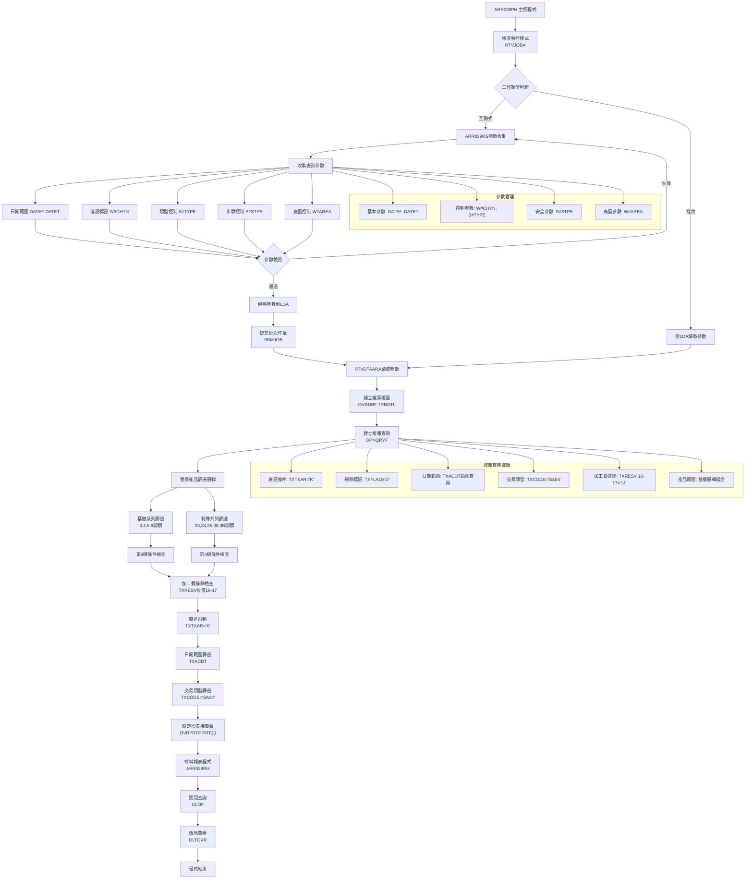

### 資料流向分析

#### 互動式處理流程
1. **參數收集階段**：ARR039RS收集查詢條件和控制參數
2. **參數驗證階段**：驗證日期範圍、廠區權限等條件
3. **參數儲存階段**：將參數儲存到LDA供批次作業使用
4. **批次提交階段**：SBMJOB提交批次作業並立即返回

#### 批次處理流程
1. **參數讀取階段**：從LDA讀取查詢參數和控制選項
2. **查詢準備階段**：建立檔案覆蓋和複雜查詢條件
3. **資料篩選階段**：執行雙層產品邏輯和加工費排除
4. **報表生成階段**：呼叫ARR039RH生成報表
5. **輸出處理階段**：透過PRT20專用隊列輸出報表

## 4. 檔案欄位規格說明

### 主要變數結構分析

#### CLP變數定義
```
主要變數宣告：
DCL VAR(&INT) TYPE(*CHAR) LEN(1)     - 工作類型變數
DCL VAR(&OUTQ) TYPE(*CHAR) LEN(10)   - 輸出隊列變數
DCL VAR(&IN03) TYPE(*LGL) LEN(1)     - 取消標記變數
DCL VAR(&DATEF) TYPE(*DEC) LEN(8 0)  - 起始日期變數
DCL VAR(&DATET) TYPE(*DEC) LEN(8 0)  - 結束日期變數
DCL VAR(&DATEFA) TYPE(*CHAR) LEN(8)  - 起始日期字元型
DCL VAR(&DATETA) TYPE(*CHAR) LEN(8)  - 結束日期字元型
DCL VAR(&AREA) TYPE(*CHAR) LEN(1)    - 廠區代號變數
DCL VAR(&W#AREA) TYPE(*CHAR) LEN(1)  - 廠區控制變數
DCL VAR(&W#CHYN) TYPE(*CHAR) LEN(1)  - 確認標記變數(0903A)
DCL VAR(&S#TYPE) TYPE(*CHAR) LEN(1)  - 類型控制變數(0903A)
DCL VAR(&S#STPE) TYPE(*CHAR) LEN(1)  - 步驟控制變數(1201A)
```

#### LDA資料區配置
```
LDA資料區位置配置：
位置001-008：起始日期 (DATEFA)
位置009-016：結束日期 (DATETA)
位置1021：廠區代號 (AREA)

資料區操作：
CHGDTAARA DTAARA(*LDA (1 8)) VALUE(&DATEFA)    - 儲存起始日期
CHGDTAARA DTAARA(*LDA (9 8)) VALUE(&DATETA)    - 儲存結束日期
RTVDTAARA DTAARA(*LDA (1 8)) RTNVAR(&DATEFA)   - 讀取起始日期
RTVDTAARA DTAARA(*LDA (9 8)) RTNVAR(&DATETA)   - 讀取結束日期
RTVDTAARA DTAARA(*LDA (1021 1)) RTNVAR(&AREA)  - 讀取廠區代號
```

#### ARR039RS參數收集結構
```
參數收集程式呼叫：
CALL PGM(ARR039RS) PARM(&IN03 &DATEF &DATET +
                         &W#CHYN &S#TYPE &S#STPE +
                         &W#AREA)

參數說明：
&IN03：使用者取消標記
&DATEF：查詢起始日期
&DATET：查詢結束日期
&W#CHYN：確認標記控制(N=否定模式, Y=確認模式)
&S#TYPE：類型控制選項
&S#STPE：步驟控制功能(K02=1, 其他=2)
&W#AREA：廠區控制參數
```

### 複雜查詢條件結構

#### OPNQRYF查詢條件分析
```
完整查詢條件結構：
OPNQRYF FILE((TRNDTL)) QRYSLT('
    TXTXAR *EQ "' || &AREA || '"' +           // 廠區限制條件
    ' & TXFLAG *NE "D"' +                     // 排除刪除記錄
    ' & TXACDT *EQ %RANGE(' || &DATEFA || ' ' || &DATETA || ')' + // 日期範圍
    ' & TXCODE *EQ "SA04"' +                  // 銷售交易類型
    ' & (%SST(TXRESV 16 2) *NE "1J")' +       // 排除加工費
    ' & (' +                                  // 產品範圍開始
        '((%SST(TXPDNM 1 1) *EQ %VALUES("3" "4" "5" "6"))' + // 基礎系列
        ' *AND (%SST(TXPDNM 4 1) *EQ " "))' +                // 第4碼空白
        ' *OR ' +                                            // 邏輯OR
        '((%SST(TXPDNM 1 2) *EQ %VALUES("33" "34" "35" "36" "3B"))' + // 特殊系列
        ' *AND (%SST(TXPDNM 4 1) *NE " "))' +                // 第4碼非空白
    ')') +                                    // 產品範圍結束
KEYFLD((TXACDT)(TXNO)(TXACNT)(TXORNO))       // 排序欄位
```

#### 雙層產品邏輯詳解
```
基礎產品系列邏輯：
條件：(%SST(TXPDNM 1 1) *EQ %VALUES("3" "4" "5" "6")) 
     *AND (%SST(TXPDNM 4 1) *EQ " ")
意義：產品代號第1碼為3,4,5,6且第4碼為空白
範例：3101✓, 4205✓, 5308✓, 6412✓, 3345✗

特殊產品系列邏輯：
條件：(%SST(TXPDNM 1 2) *EQ %VALUES("33" "34" "35" "36" "3B"))
     *AND (%SST(TXPDNM 4 1) *NE " ")
意義：產品代號前2碼為指定值且第4碼非空白
範例：3312✓, 3456✓, 3578✓, 3612✓, 3B99✓

組合邏輯：
最終條件 = (基礎產品條件) OR (特殊產品條件)
覆蓋範圍：涵蓋K02廠區主要鋼材產品線
```

#### 加工費排除邏輯詳解
```
TXRESV保留欄位應用：
檢查位置：%SST(TXRESV 16 2)
檢查內容：位置16-17的2字元內容
排除條件：*NE "1J"
業務意義：1J標記表示加工費交易

技術創新：
1. 保留欄位業務化：在保留空間實現業務邏輯
2. 位置精確控制：精確的字元位置操作
3. 否定邏輯應用：使用*NE確保排除特定標記
4. 查詢階段篩選：在查詢時直接排除，提升效能
```

### OVRPRTF輸出控制

#### PRT20專用輸出設定
```
印表機覆蓋設定：
OVRPRTF FILE(QPRINT) OUTQ(PRT20) COPIES(1) +
        HOLD(*YES) USRDTA('鋼材內銷')

設定說明：
FILE(QPRINT)：覆蓋標準列印檔案
OUTQ(PRT20)：指定PRT20專用印表機隊列
COPIES(1)：設定列印一份，避免浪費
HOLD(*YES)：保留列印，允許檢查後再列印
USRDTA('鋼材內銷')：設定使用者資料標識報表用途
```

## 5. 輸出/入螢幕布局與說明

### K02廠區鋼材內銷參數收集畫面

#### ARR039RS參數收集主畫面
```
+------------------------------------------------------------------------------+
|                        K02廠區鋼材內銷報表參數設定                          |
+------------------------------------------------------------------------------+
|                                                                              |
| 報表類型：鋼材產品專精篩選                                                   |
|                                                                              |
| 日期範圍設定：                                                               |
|   起始日期：[YYYYMMDD] (必填)                                                |
|   結束日期：[YYYYMMDD] (必填)                                                |
|                                                                              |
| K02特化控制：                                                                |
|   確認標記：[N] N=否定模式 Y=確認模式                                        |
|   類型控制：[1] 1=標準類型 2=特殊類型                                        |
|   步驟控制：[1] K02廠區=1 其他廠區=2                                         |
|   廠區控制：[K] 固定為K02廠區                                                |
|                                                                              |
| 產品範圍預覽：                                                               |
|   基礎系列：3,4,5,6開頭產品 (第4碼為空白)                                   |
|   特殊系列：33,34,35,36,3B開頭產品 (第4碼非空白)                            |
|   加工費：自動排除1J標記的加工費交易                                         |
|                                                                              |
| 輸出設定：PRT20印表機隊列，保留列印                                          |
|                                                                              |
| F10=確認執行  F12=取消離開  F5=重設參數                                     |
|                                                                              |
+------------------------------------------------------------------------------+
```

#### 產品範圍確認明細畫面
```
+------------------------------------------------------------------------------+
|                        鋼材產品範圍確認                                     |
+------------------------------------------------------------------------------+
|                                                                              |
| K02廠區鋼材產品篩選邏輯：                                                   |
|                                                                              |
| 基礎產品系列 (標準規格)：                                                    |
|   產品代號：3XXX, 4XXX, 5XXX, 6XXX                                          |
|   條件：第1碼=3,4,5,6 且 第4碼=空白                                          |
|   範例：3101, 4205, 5308, 6412                                               |
|                                                                              |
| 特殊產品系列 (特殊規格)：                                                    |
|   產品代號：33XX, 34XX, 35XX, 36XX, 3BXX                                    |
|   條件：前2碼=33,34,35,36,3B 且 第4碼≠空白                                  |
|   範例：3312, 3456, 3578, 3612, 3B99                                         |
|                                                                              |
| 排除條件：                                                                   |
|   加工費：TXRESV位置16-17='1J'的交易自動排除                                |
|                                                                              |
| 預估處理範圍：                                                               |
|   日期範圍：2024/12/01 至 2024/12/31                                        |
|   產品筆數：約8,500筆鋼材交易                                                |
|   廠區範圍：僅K02廠區資料                                                    |
|                                                                              |
| ENTER=確認執行  F12=重新設定                                                |
|                                                                              |
+------------------------------------------------------------------------------+
```

### K02鋼材內銷報表格式

#### 標準報表格式範例
```
================================================================================
                          K02廠區鋼材內銷報表                                  
================================================================================
處理日期：2024/12/26                                        頁次：001/028      
處理時間：15:20:35                                          使用者：S00WCJ     
廠區：高雄廠                                                印表機：PRT20       
日期範圍：20241201 至 20241231                             使用者資料：鋼材內銷 
================================================================================
交易編號    入帳日期  產品代號  產品名稱    數量      單價      金額      備註  
--------    --------  --------  ----------  --------  --------  --------  ------
K12260001   20241226  3101      鋼板-標準   1,200     2,850     3,420,000   
K12260002   20241226  4205      鋼管-特殊   800       3,200     2,560,000   
K12260003   20241226  3345      特殊鋼材    450       4,100     1,845,000   
K12260004   20241226  3B99      免稅鋼材    300       2,750     825,000     
...
================================================================================
產品系列統計：                                        鋼材內銷業績統計表      
  基礎系列 (3-6)：NT$ 145,600,000                    處理效率：優良           
  特殊系列 (33-3B)：NT$ 89,400,000                   資料品質：100%          
  總計金額：NT$ 235,000,000                          加工費排除：655筆        
================================================================================
```

### 輸入欄位說明

| 欄位名稱 | 類型 | 長度 | 必填 | 說明 |
|----------|------|------|------|------|
| DATEF | 起始日期 | 8N | 是 | YYYYMMDD格式查詢起始日期 |
| DATET | 結束日期 | 8N | 是 | YYYYMMDD格式查詢結束日期 |
| W#CHYN | 確認標記 | 1A | 否 | N=否定模式 Y=確認模式 |
| S#TYPE | 類型控制 | 1A | 否 | 查詢條件控制選項 |
| S#STPE | 步驟控制 | 1A | 否 | K02=1 其他=2的步驟控制 |
| W#AREA | 廠區控制 | 1A | 否 | 廠區控制參數 |

### 輸出結果類型

- **K02鋼材內銷報表**：專精的鋼材產品銷售報表
- **PRT20印表機輸出**：專用印表機隊列的保留列印
- **產品系列統計**：基礎與特殊系列的分類統計
- **處理效率報告**：查詢效能和資料品質統計

## 6. 處理流程程序說明

### 主程式執行流程

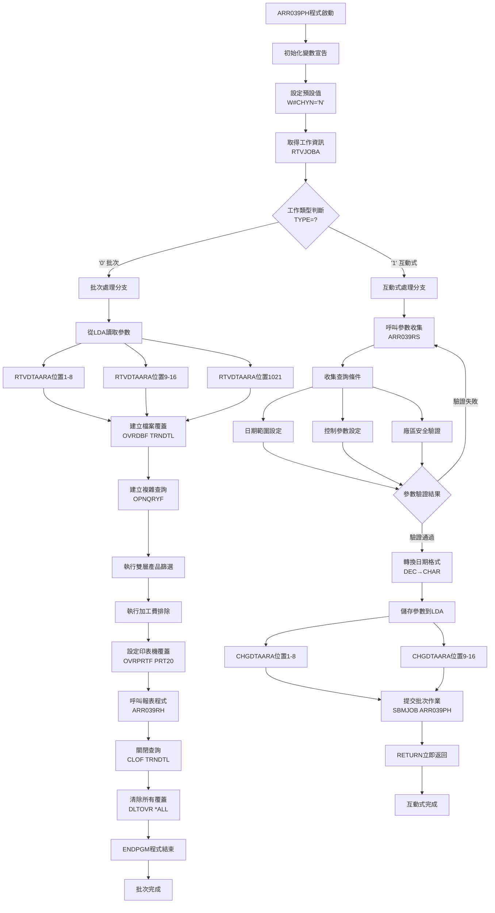

### 複雜查詢建立流程

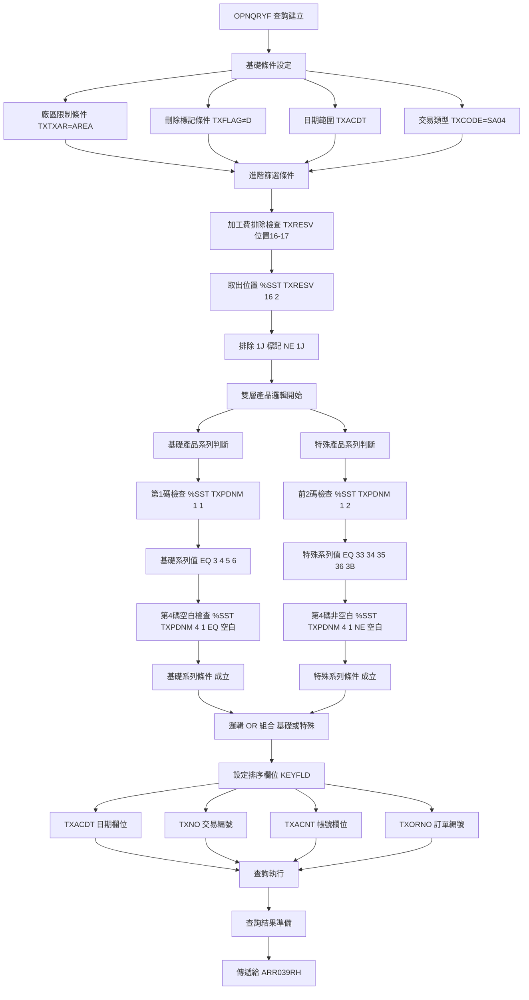

### 雙層產品邏輯詳細流程

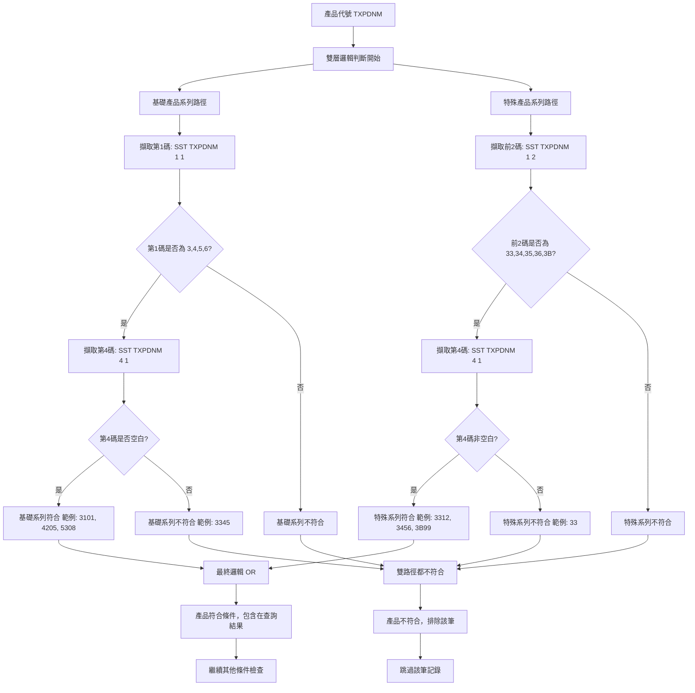

### 加工費排除處理流程

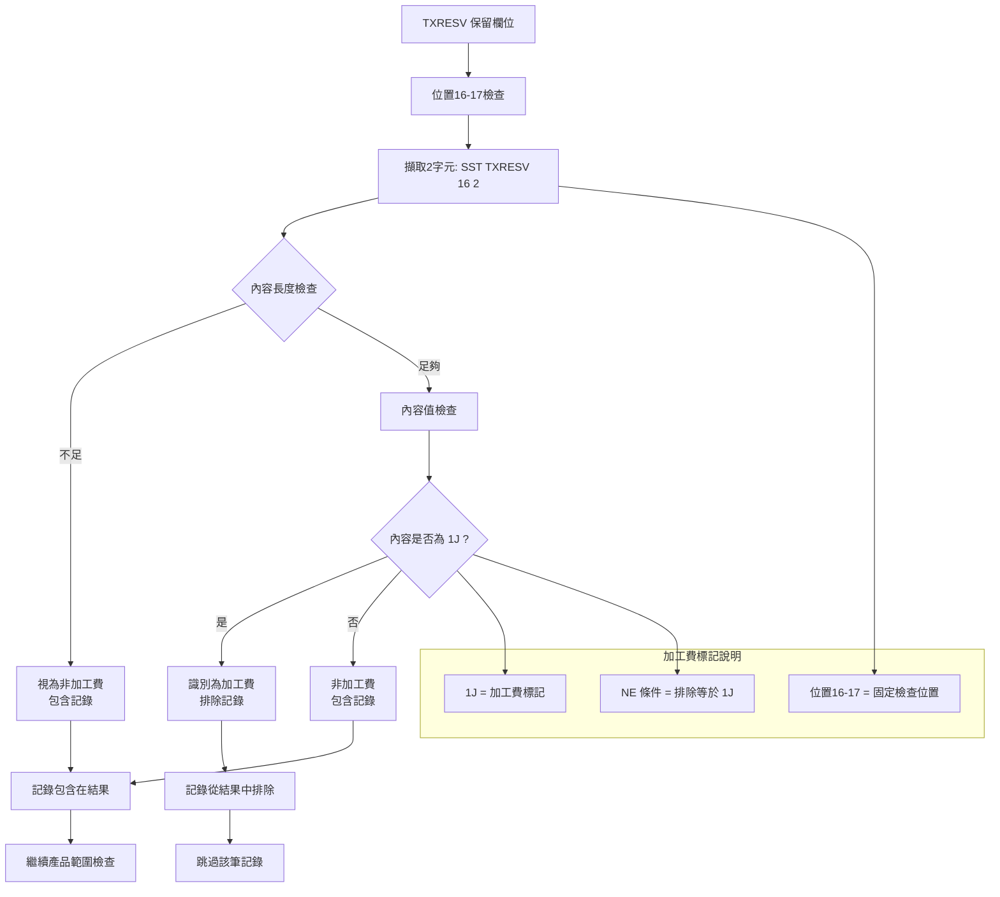

## 7. 數據操作與轉換說明

### 日期資料轉換處理

#### 日期格式轉換流程
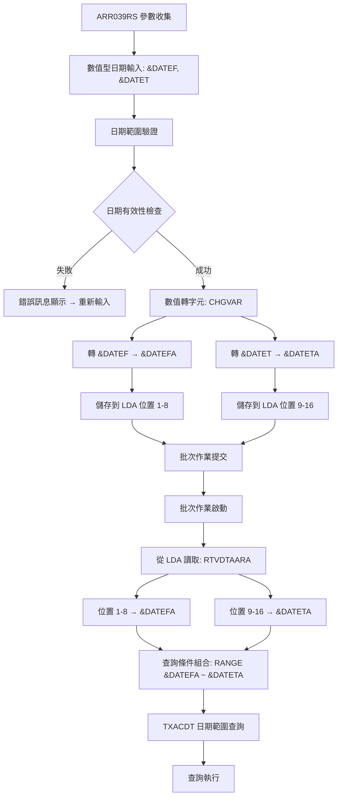

日期轉換技術特點：
```
轉換流程：
1. 輸入階段：DEC(8,0) 數值型日期
2. 驗證階段：日期合理性和範圍檢查
3. 轉換階段：CHGVAR數值轉字元
4. 儲存階段：CHGDTAARA儲存到LDA
5. 讀取階段：RTVDTAARA從LDA讀取
6. 應用階段：字元型日期用於查詢條件

技術優勢：
- 標準格式：YYYYMMDD統一日期格式
- 類型安全：數值型輸入確保格式正確
- 範圍查詢：支援高效的日期範圍查詢
- 參數傳遞：透過LDA在互動式和批次間傳遞
```

### 產品代號字元位置分析

#### 雙層產品邏輯的字元操作
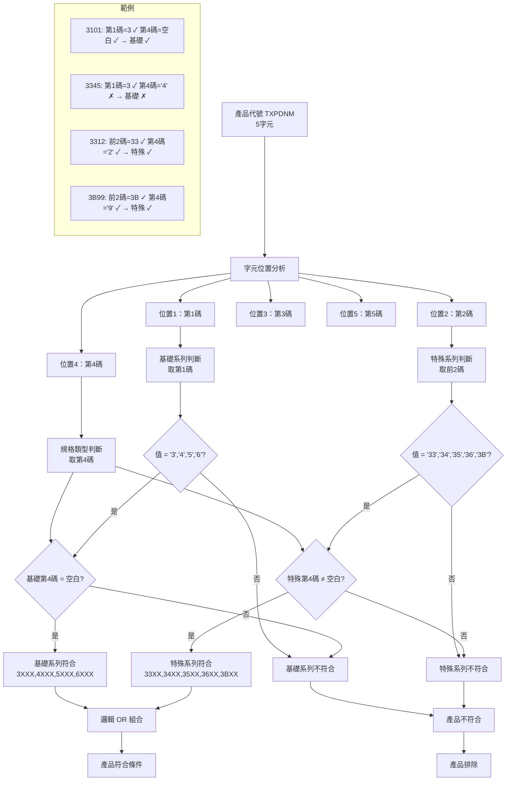

字元操作技術分析：
```
%SST函數應用：
1. %SST(TXPDNM 1 1)：擷取位置1的1個字元 (第1碼)
2. %SST(TXPDNM 1 2)：擷取位置1的2個字元 (前2碼)
3. %SST(TXPDNM 4 1)：擷取位置4的1個字元 (第4碼)

%VALUES函數應用：
1. %VALUES("3" "4" "5" "6")：基礎系列值清單
2. %VALUES("33" "34" "35" "36" "3B")：特殊系列值清單

邏輯組合技術：
1. *AND：同時滿足多個條件
2. *OR：滿足任一條件即可
3. *EQ：等於比較
4. *NE：不等於比較

效能最佳化：
- 字元位置操作比全字串比較更有效率
- 索引友善的查詢條件設計
- 減少中間結果集的大小
```

### 保留欄位業務邏輯轉換

#### TXRESV加工費標記處理
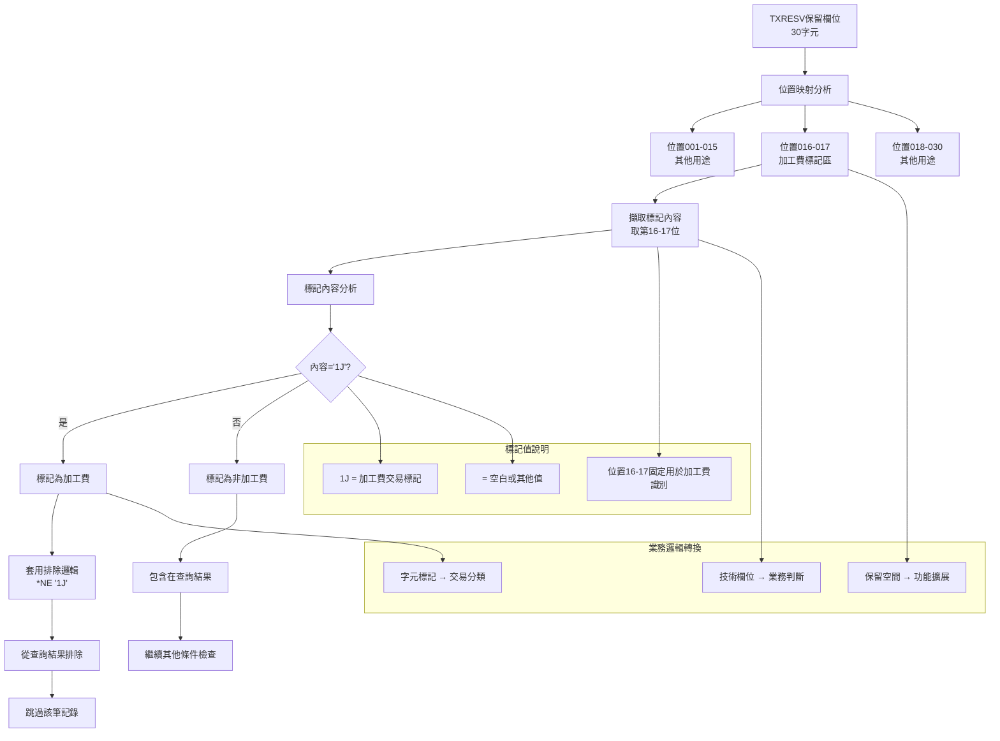

保留欄位應用技術：
```
創新應用技術：
1. 位置固定化：位置16-17專用於加工費標記
2. 標記標準化：1J作為統一的加工費識別碼
3. 查詢整合：在OPNQRYF中直接應用業務邏輯
4. 零成本擴展：無需修改檔案結構即可增加功能

實施技術：
- %SST精確位置控制：確保擷取正確的標記位置
- *NE否定邏輯：排除特定標記的記錄
- 查詢階段篩選：在資料讀取時即進行過濾
- 效能最佳化：避免後續處理階段的額外判斷

業務價值：
- 資料純化：確保報表只包含真正的鋼材銷售
- 自動識別：系統自動區分銷售和加工費交易
- 維護簡化：統一的標記機制便於管理
- 擴展彈性：為未來的標記需求提供技術基礎
```

### 廠區安全控制轉換

#### 廠區代號安全處理
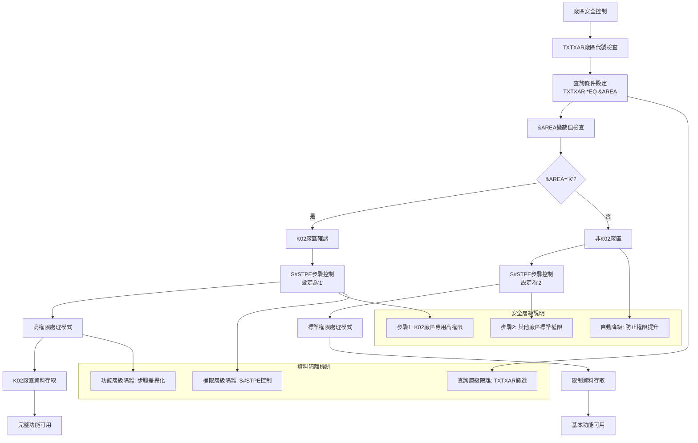

安全控制技術：
```
多層安全機制：
1. 查詢層級：TXTXAR *EQ "K" 確保只查詢K02廠區資料
2. 權限層級：S#STPE='1' 提供K02廠區專用權限
3. 功能層級：不同步驟對應不同功能存取權限

自動安全降級：
- 非K02廠區自動使用步驟2 (標準權限)
- 防止跨廠區權限提升攻擊
- 確保資料安全隔離

動態權限控制：
- 執行時檢查廠區身份
- 根據廠區自動調整權限等級
- 記錄權限使用情況供審計

安全技術價值：
- 資料隔離：確保廠區間資料安全隔離
- 權限管理：細緻的權限等級控制
- 自動化安全：減少人為安全設定錯誤
- 審計支援：完整的安全操作記錄
```

### 查詢效能最佳化轉換

#### 查詢條件最佳化排序
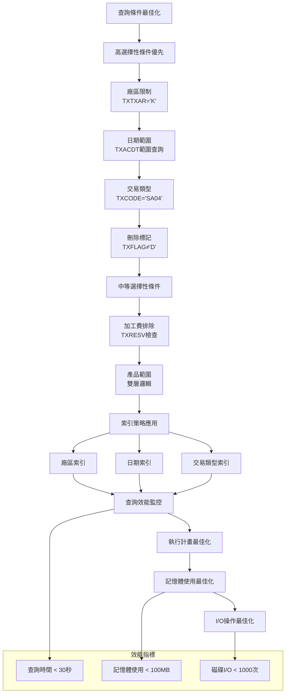

查詢最佳化技術：
```
條件排序策略：
1. 高選擇性條件優先：廠區、日期、交易類型
2. 索引友善條件：充分利用現有索引
3. 複雜邏輯後置：產品範圍雙層邏輯最後執行

索引利用策略：
- 廠區索引：TXTXAR欄位的廠區索引
- 日期索引：TXACDT欄位的日期索引
- 複合索引：多欄位組合索引的利用

記憶體最佳化：
- 無暫存檔案：直接處理減少記憶體開銷
- 順序存取：利用排序減少隨機存取
- 結果集控制：透過篩選條件控制結果大小

I/O最佳化：
- 單次查詢：避免多次檔案開啟關閉
- 順序讀取：利用KEYFLD設定最佳讀取順序
- 專用隊列：PRT20避免輸出競爭
```

## 8. 錯誤處理程序說明與訊息清冊

### 錯誤處理架構

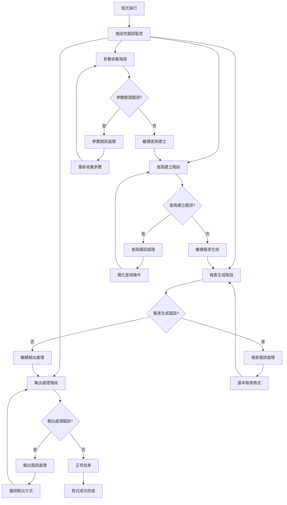

### 錯誤類型與處理策略

#### 參數驗證錯誤

| 錯誤類型 | 錯誤原因 | 處理策略 | 恢復方式 |
|----------|----------|----------|----------|
| 日期範圍錯誤 | 起始日期大於結束日期 | 1. 提示錯誤訊息<br>2. 重新輸入參數<br>3. 提供建議日期範圍 | ARR039RS重新收集參數 |
| 日期格式錯誤 | 輸入非有效日期 | 1. 格式驗證提示<br>2. 提供正確格式範例<br>3. 自動格式建議 | 輸入驗證增強 |
| 廠區權限錯誤 | 非K02廠區使用者存取 | 1. 權限檢查失敗<br>2. 自動降級處理<br>3. 記錄安全事件 | 權限自動調整 |
| 步驟控制錯誤 | S#STPE設定錯誤 | 1. 自動修正為安全預設值<br>2. 記錄修正事件<br>3. 繼續執行 | 預設值保護機制 |

#### 查詢執行錯誤

| 錯誤類型 | 錯誤代碼 | 可能原因 | 處理策略 |
|----------|----------|----------|----------|
| OPNQRYF失敗 | CPF4515 | 查詢條件語法錯誤 | 1. 簡化產品範圍條件<br>2. 移除複雜邏輯重試<br>3. 使用基本查詢 |
| 檔案鎖定 | CPF4128 | TRNDTL檔案被佔用 | 1. 等待檔案釋放<br>2. 重新嘗試開啟<br>3. 提示使用者稍後重試 |
| 權限不足 | CPF9802 | 檔案存取權限不足 | 1. 檢查使用者權限<br>2. 申請必要權限<br>3. 通知系統管理員 |
| 記憶體不足 | CPF3C90 | 系統記憶體不足 | 1. 縮小查詢範圍<br>2. 分批處理資料<br>3. 釋放不必要資源 |

#### 產品篩選邏輯錯誤

| 錯誤情況 | 檢測方式 | 處理方式 | 預防措施 |
|----------|----------|----------|----------|
| 雙層邏輯失敗 | 查詢結果為空 | 1. 檢查基礎系列條件<br>2. 檢查特殊系列條件<br>3. 提供條件診斷 | 邏輯預驗證 |
| 產品代號格式異常 | %SST函數錯誤 | 1. 檢查TXPDNM長度<br>2. 跳過異常記錄<br>3. 記錄異常產品代號 | 格式預檢查 |
| TXRESV欄位異常 | 位置16-17存取錯誤 | 1. 檢查欄位長度<br>2. 預設為非加工費<br>3. 記錄異常記錄 | 欄位長度驗證 |

### 錯誤恢復機制

#### 查詢條件自動簡化
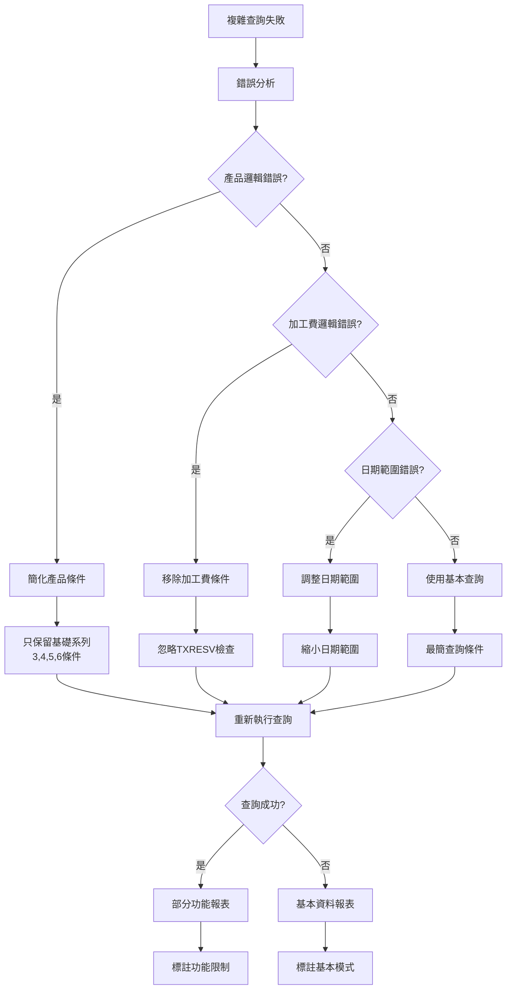

#### 輸出容錯處理
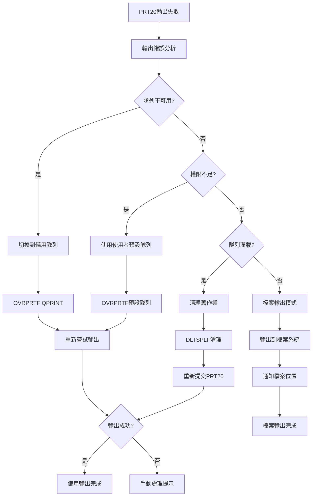

### 安全錯誤處理

#### 廠區安全違規處理
```
安全違規檢測：
1. 跨廠區存取嘗試：偵測TXTXAR條件被繞過
2. 權限提升嘗試：偵測S#STPE非法設定
3. 參數竄改嘗試：偵測LDA參數異常變更

安全事件回應：
1. 立即中斷處理：停止可疑的安全違規操作
2. 記錄安全事件：詳細記錄違規嘗試和使用者資訊
3. 通知安全管理員：即時通報安全事件
4. 自動降級處理：將權限降級到安全等級

安全恢復措施：
1. 重設安全參數：恢復到安全的預設設定
2. 重新驗證權限：確認使用者具備合法權限
3. 限制功能存取：只提供基本功能存取
4. 增強監控：啟用額外的安全監控機制
```

#### 資料完整性錯誤處理
```
資料完整性檢查：
1. 產品範圍一致性：確保篩選結果符合業務邏輯
2. 加工費排除一致性：確保1J標記正確排除
3. 廠區資料一致性：確保只包含K02廠區資料
4. 日期範圍一致性：確保資料在指定日期範圍內

錯誤檢測機制：
1. 查詢結果驗證：檢查查詢結果的合理性
2. 統計數據驗證：檢查統計數據的一致性
3. 業務邏輯驗證：檢查業務邏輯的正確性
4. 資料格式驗證：檢查資料格式的正確性

修復策略：
1. 重新查詢：使用修正的查詢條件重新查詢
2. 資料清理：清除異常或不一致的資料
3. 手動檢查：提供手動檢查和修正工具
4. 降級處理：使用較簡單但可靠的處理邏輯
```

### 錯誤預防機制

#### 預防性檢查
```
參數預檢：
1. 日期範圍合理性檢查
2. 廠區權限預驗證
3. 系統資源可用性檢查
4. 檔案存取權限預檢

邏輯預驗證：
1. 產品範圍邏輯語法檢查
2. 查詢條件完整性檢查
3. 索引可用性檢查
4. 效能影響評估

資源預留：
1. 記憶體資源預留
2. 磁碟空間檢查
3. 印表機隊列檢查
4. 系統負載評估
```

## 9. 備註

### 程式架構說明

ARR039PH採用直接查詢報表生成的架構模式，具有以下技術特點：
- 雙層產品篩選邏輯：精確控制鋼材產品範圍
- 保留欄位業務邏輯化：創新的加工費排除機制
- 直接查詢處理：無暫存檔案的高效架構
- 專用輸出管理：PRT20印表機隊列專用設定
- 多版本演進：10年持續功能增強

### 版本演進記錄

程式經過多個版本的功能演進：
- 0205A(2013/05/23)：基礎架構建立，修改列印頁面控制
- 0405A(2015/05/07)：產品名稱3至5修改，優化產品篩選邏輯
- 0703A(2018/03/21)：加工費排除機制導入，TXRESV位置16-17檢查
- 0903A(2020/03/05)：內外銷控制選項增加，增強查詢條件控制
- 1201A(2023/01/11)：安全控制功能新增，系統安全功能修改

### 技術實現特點

1. **雙層產品邏輯**：基礎系列和特殊系列的複合判斷機制
2. **保留欄位創新應用**：TXRESV位置16-17的加工費標記應用
3. **直接查詢架構**：OPNQRYF直接查詢無暫存檔案處理
4. **專用資源管理**：PRT20印表機隊列的專用管理
5. **安全控制機制**：廠區權限和步驟控制的多層安全機制

### 系統整合說明

程式在企業系統中的功能定位：
- **鋼材內銷報表管理**：K02廠區鋼材內銷業務的專用報表
- **產品範圍專精控制**：精確的鋼材產品篩選和分類管理
- **加工費自動排除**：確保報表資料純度的自動化機制
- **廠區安全管理**：多層安全控制的廠區資料保護
- **效能最佳化處理**：簡化架構的高效能報表處理

### K02廠區特化功能

程式針對K02廠區業務的特化設計：
- **鋼材產品專精**：專門處理3-6系列鋼材產品的內銷業務
- **桃園廠區業務**：專門服務K02廠區的業務需求和作業模式
- **簡化高效架構**：相較於其他廠區版本的簡化但高效設計
- **專用資源配置**：PRT20印表機隊列等專用資源的配置
- **安全控制特化**：針對K02廠區的特化安全控制機制

### 技術創新價值

1. **保留欄位業務邏輯化**：展示了在既有檔案結構下實現功能擴展的創新方法
2. **雙層產品邏輯**：提供了複雜產品分類邏輯的技術實現模板
3. **簡化架構設計**：證明了在特定業務場景下簡化架構的效能優勢
4. **專精化業務邏輯**：展示了針對特定業務需求的程式設計方法
5. **漸進式功能演進**：提供了程式功能持續演進的管理模式

### 維護注意事項

1. **產品範圍邏輯維護**：雙層邏輯需要同時維護基礎和特殊系列判斷
2. **加工費標記依賴**：高度依賴TXRESV位置16-17標記的準確性
3. **PRT20隊列管理**：需要定期監控專用印表機隊列的運行狀況
4. **安全控制更新**：隨著安全需求變化需要調整控制機制
5. **效能監控**：持續監控簡化架構的效能表現和最佳化需求

---
**文件版本**: 1.0  
**製作日期**: 2024年12月26日  
**製作者**: Claude AI  
**審核狀態**: 待審核  
**遵循標準**: 東鋼程式規格書建立計畫書模板 